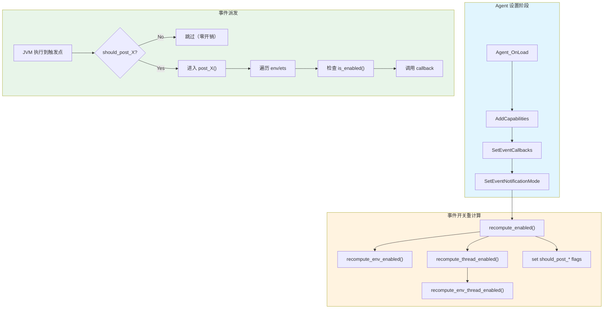
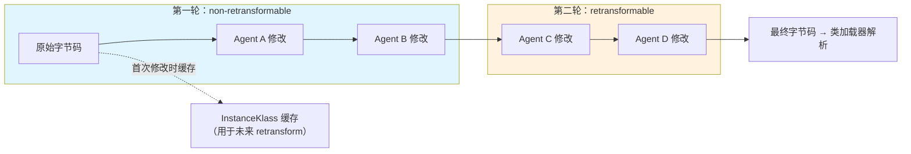
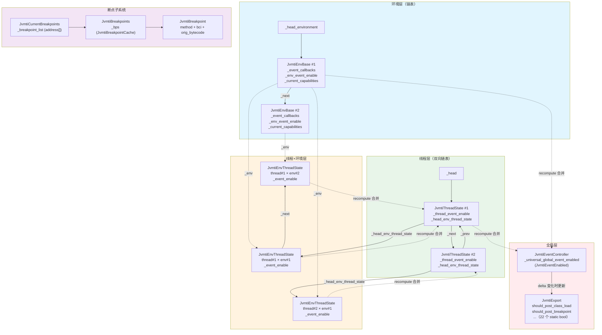

# JVMTI 深度解析

> 基于 OpenJDK 11 源码分析
> 标准环境：-Xms8g -Xmx8g -XX:+UseG1GC, G1 Region = 4MB
> 源码路径：src/hotspot/share/prims/

---

## 第 0 部分：核心原理

### 0.1 本质是什么？

JVMTI (JVM Tool Interface) 是 JVM 内部的**事件总线 + 控制接口**——让外部 agent 无需修改 JVM 源码即可观察和控制 JVM 的运行时行为。

### 0.2 为什么需要？

调试器、Profiler、热更新工具（Arthas、SkyWalking）都需要在运行时观测 JVM 内部状态：类加载了哪些？方法执行到哪一行？某个对象的字段值是多少？

如果没有统一的工具接口，每个工具都必须修改 JVM 源码，或者用 hack 手段获取信息。这不仅不可维护，而且 JVM 版本升级就会全部失效。

根本需求是：**在不修改 JVM 的前提下，允许外部代码以标准化方式"插入"JVM 的关键执行路径**。

### 0.3 怎么解决？

核心思路：在 JVM 关键路径（类加载、方法进入/退出、GC 前后、异常抛出等）埋入**事件触发点**，外部 agent 通过注册回调函数来接收这些事件。

关键设计：
1. **四层事件开关体系**：全局开关 → 每环境开关 → 每线程开关 → 每线程每环境开关，支持精细控制
2. **快速路径优化**：`should_post_*` 静态 bool 标志位，JVMTI 未激活时零开销
3. **SafePoint 保护**：涉及字节码修改（断点、类重定义）的操作必须在 SafePoint 执行

### 0.4 为什么这样设计？

**为什么用静态 bool 快速路径而不是直接查询事件表？** 事件触发点位于 JVM 最热的路径上（每次方法调用、每次字段访问），如果每次都查哈希表/位图计算，开销不可接受。静态 bool 只需一条 `test` 指令，分支预测命中率极高，未启用时接近零开销。

**为什么要四层事件开关而不是简单的全局开关？** 因为多个 agent 可以同时连接（例如调试器 + APM 工具），每个 agent 关心不同事件，且可能只想监控特定线程。四层体系用空间换灵活性，但通过位运算合并后，运行时查询仍然是 O(1)。

**为什么断点修改必须在 SafePoint？** 断点的实现是直接替换字节码。如果在线程正在执行该字节码时修改，会导致不可预期行为。SafePoint 保证所有 Java 线程都暂停在安全位置。

---

## 第 1 部分：数据结构全景

### 1.1 数据结构清单

| # | 数据结构 | 一句话角色 | 源文件 |
|---|---------|-----------|--------|
| 1 | `JvmtiEventEnabled` | 事件位图——一个 jlong 存储所有事件的启用状态 | `jvmtiEventController.hpp:78` |
| 2 | `JvmtiEnvBase` | Agent 环境——每个 agent 连接对应一个，组成链表 | `jvmtiEnvBase.hpp:57` |
| 3 | `JvmtiThreadState` | 线程 JVMTI 状态——每线程一个，双向链表 | `jvmtiThreadState.hpp:77` |
| 4 | `JvmtiEnvThreadState` | 线程×环境状态——每线程每环境一个，单向链表 | `jvmtiEnvThreadState.hpp:109` |
| 5 | `JvmtiBreakpoint` | 断点描述——存储方法、BCI、原始字节码 | `jvmtiImpl.hpp:173` |
| 6 | 四层事件开关体系 | 事件开关层次——从用户设置到全局合并的四层位图 | `jvmtiEventController.hpp` |

### 1.2 JvmtiEventEnabled — 事件位图

#### 问题推导

**问题**：JVMTI 定义了约 30 种事件（CLASS_LOAD、METHOD_ENTRY、BREAKPOINT 等）。我们需要快速判断某个事件是否启用。

**需要什么信息？**
- 每种事件只有两种状态：启用 / 禁用
- 需要极快的查询速度（位于热路径）
- 事件总数不超过 64 种

**推导出的结构**：一个 64 位整数，每一位对应一种事件。查询用位与操作，O(1)。

#### 真实数据结构

```cpp
// jvmtiEventController.hpp:78-95
class JvmtiEventEnabled {
private:
  jlong _enabled_bits;               // ★ 核心：64位位图，每位对应一种事件
#ifndef PRODUCT
  enum { JEE_INIT_GUARD = 0xEAD0 } _init_guard;  // 调试保护
#endif
  static jlong bit_for(jvmtiEvent event_type);    // 计算事件对应的位
  jlong get_bits();
  void set_bits(jlong bits);
public:
  JvmtiEventEnabled();
  void clear();
  bool is_enabled(jvmtiEvent event_type);          // ★ 核心查询
  void set_enabled(jvmtiEvent event_type, bool enabled);
};
```

**推导 vs 实际**：完全一致——就是一个 `jlong` 位图。

#### 完整分析

| 字段 | 类型 | 大小 | 含义 |
|------|------|------|------|
| ★ `_enabled_bits` | `jlong` | 8 字节 | 事件位图，第 N 位 = 1 表示第 N 种事件启用 |
| `_init_guard` | `enum` | 4 字节 | 仅 debug 版：初始化守卫值 0xEAD0 |

- **sizeof**：release 版 8 字节，debug 版 12 字节（含 padding 可能更大）
- **创建位置**：作为 `JvmtiEnvEventEnable`、`JvmtiThreadEventEnable`、`JvmtiEnvThreadEventEnable` 的内嵌成员
- **生命周期**：`_enabled_bits` 在 `recompute_enabled()` 中被重新计算并设置

#### 设计决策

**为什么用 `jlong` 而不是 `std::bitset` 或数组？** 因为需要极快的批量操作（位或合并、位与过滤），`jlong` 的位运算是单条指令。而且事件总数约 30 种，64 位完全够用。

---

### 1.3 JvmtiEnvBase — Agent 环境

#### 问题推导

**问题**：JVM 允许多个 agent 同时连接（如调试器 + APM），每个 agent 各自启用不同的事件、注册不同的回调。如何管理这些 agent？

**需要什么信息？**
- 每个 agent 的身份标识
- 每个 agent 注册的回调函数表
- 每个 agent 启用的事件集合
- 每个 agent 请求的能力（capabilities）
- 多个 agent 之间的遍历关系

**推导出的结构**：
- 一个"环境"对象封装单个 agent 的所有状态
- 多个环境通过链表连接，遍历时逐个派发事件
- 每个环境包含：回调表 + 事件开关 + 能力集

#### 真实数据结构

```cpp
// jvmtiEnvBase.hpp:57-109
class JvmtiEnvBase : public CHeapObj<mtInternal> {
private:
  static JvmtiEnvBase*     _head_environment;    // ★ 环境链表头
  static jvmtiPhase        _phase;               // 当前 JVM 阶段

  jvmtiEnv _jvmti_external;                      // ★ 暴露给 agent 的不透明指针
  jint _magic;                                    // 魔数 0x71EE（验证有效性）
  jint _version;                                  // agent 请求的 JVMTI 版本
  JvmtiEnvBase* _next;                            // ★ 下一个环境（链表）
  bool _is_retransformable;                       // ★ 是否支持 retransform
  const void *_env_local_storage;                 // agent 私有存储
  jvmtiEventCallbacks _event_callbacks;           // ★ 事件回调函数表
  jvmtiExtEventCallbacks _ext_event_callbacks;    // 扩展事件回调
  JvmtiTagMap* volatile _tag_map;                 // 对象标签映射
  JvmtiEnvEventEnable _env_event_enable;          // ★ 环境级事件开关
  jvmtiCapabilities _current_capabilities;        // ★ 当前能力集
  jvmtiCapabilities _prohibited_capabilities;     // 禁止的能力集
  volatile bool _class_file_load_hook_ever_enabled; // ClassFileLoadHook 是否曾启用
  char** _native_method_prefixes;                 // native 方法前缀（用于查找）
  int    _native_method_prefix_count;
};
```

**推导 vs 实际**：与推导高度吻合。额外的 `_magic`、`_is_retransformable`、`_tag_map` 等是实际需求的产物。

#### 完整分析

**关键字段生命周期**：

| 字段 | 谁设置 | 何时设置 | 设置什么 |
|------|--------|---------|---------|
| `_head_environment` | `JvmtiEnvBase::initialize()` | agent 通过 `GetEnv()` 创建环境时 | 插入到链表头 |
| `_event_callbacks` | `set_event_callbacks()` | agent 调用 `SetEventCallbacks()` 时 | `memcpy` 拷贝 agent 提供的回调表 |
| `_env_event_enable` | `recompute_env_enabled()` | 每次事件配置变更时 | 重新计算的位图 |
| `_current_capabilities` | `AddCapabilities()` | agent 调用 `AddCapabilities()` 时 | 合并新请求的能力 |

**`has_callback()` 的实现技巧**（`jvmtiEnvBase.hpp:235-239`）：

```cpp
bool has_callback(jvmtiEvent event_type) {
  return ((void**)&_event_callbacks)[event_type - JVMTI_MIN_EVENT_TYPE_VAL] != NULL;
}
```

把 `jvmtiEventCallbacks` 结构体当作函数指针数组来索引——因为该结构体就是连续的函数指针。这比用 switch-case 快得多。

#### 设计决策

**为什么用链表而不是数组？** 因为 agent 数量不确定（0~N），且需要动态增删（agent 可以 dispose）。链表支持 O(1) 插入和安全遍历（通过 `JvmtiEnvIterator` 保护）。

**为什么把 `_jvmti_external` 放在对象内部？** 这是暴露给 agent 的 `jvmtiEnv*` 指针。通过 `container_of` 模式（`JvmtiEnv_from_jvmti_env()`，`jvmtiEnvBase.hpp:157-159`），从 `jvmtiEnv*` 反算出 `JvmtiEnvBase*`，避免了额外的映射表。

---

### 1.4 JvmtiThreadState — 线程 JVMTI 状态

#### 问题推导

**问题**：JVMTI 允许按线程粒度启用/禁用事件。例如调试器只想监控线程 A 的 SingleStep 事件。如何为每个 Java 线程管理 JVMTI 状态？

**需要什么信息？**
- 每个线程上所有环境的事件合并结果
- 每个线程上每个环境的独立状态（需要遍历）
- 所有线程的遍历关系（不依赖 Threads_lock）
- 类重定义时的临时信息

**推导出的结构**：
- 每线程一个状态对象，内嵌"该线程的事件位图"
- 每线程维护一个 JvmtiEnvThreadState 链表（每环境一个节点）
- 所有 JvmtiThreadState 组成双向链表（不需要 Threads_lock 就能遍历）

#### 真实数据结构

```cpp
// jvmtiThreadState.hpp:77-122
class JvmtiThreadState : public CHeapObj<mtInternal> {
private:
  JavaThread        *_thread;                           // ★ 所属线程
  JvmtiDeferredEventQueue* _jvmti_event_queue;          // 延迟事件队列
  bool              _hide_single_stepping;              // 隐藏单步事件
  int               _hide_level;                        // 隐藏嵌套层级
  ExceptionState    _exception_state;                   // 异常状态

  Klass*            _class_being_redefined;             // ★ 正在重定义的类
  JvmtiClassLoadKind _class_load_kind;                  // 加载类型（load/retransform/redefine）

  int               _cur_stack_depth;                   // 当前栈深度
  JvmtiThreadEventEnable _thread_event_enable;          // ★ 线程级事件开关
  JvmtiEnvThreadState*   _head_env_thread_state;        // ★ 每线程每环境链表头

  // 双向链表（所有 JvmtiThreadState）
  static JvmtiThreadState *_head;                       // ★ 全局链表头
  JvmtiThreadState *_next;                              // ★ 下一个
  JvmtiThreadState *_prev;                              // ★ 上一个

  JvmtiDynamicCodeEventCollector* _dynamic_code_event_collector;
  JvmtiVMObjectAllocEventCollector* _vm_object_alloc_event_collector;
  JvmtiSampledObjectAllocEventCollector* _sampled_object_alloc_event_collector;
};
```

**推导 vs 实际**：双向链表（`_head/_next/_prev`）比推导多了 `_prev` 指针，原因是需要 O(1) 删除（线程退出时）。其余与推导完全一致。

#### 完整分析

**`_class_being_redefined` 的生命周期**：

```
① RetransformClasses() 设置 → _class_being_redefined = 目标 Klass*
                               _class_load_kind = jvmti_class_load_kind_retransform
② ClassFileLoadHook 派发时读取 → 传给 agent 回调
③ 派发完毕后清除 → _class_being_redefined = NULL
```

这是一个典型的"线程本地临时传参"模式——用线程状态在两个间接相关的函数之间传递信息。

**JvmtiEnvThreadStateIterator**（`jvmtiThreadState.hpp:60-68`）：

```cpp
class JvmtiEnvThreadStateIterator : public StackObj {
  JvmtiThreadState* state;
public:
  JvmtiEnvThreadState* first();
  JvmtiEnvThreadState* next(JvmtiEnvThreadState* ets);
};
```

这个迭代器遍历某个线程上所有环境的 `JvmtiEnvThreadState`。事件派发时，对每个 `ets` 检查事件是否启用，启用则调用对应 agent 的回调。

#### 设计决策

**为什么用独立的双向链表而不是从 `Threads` 列表遍历？** 因为遍历 `Threads` 需要持有 `Threads_lock`，而事件重计算（`recompute_enabled()`）发生在 `JvmtiThreadState_lock` 下。使用独立链表避免了两把锁的嵌套依赖。

---

### 1.5 JvmtiEnvThreadState — 线程×环境状态

#### 问题推导

**问题**：agent A 想监控线程 1 的 BREAKPOINT 事件但不监控线程 2；agent B 想监控所有线程的 METHOD_ENTRY。在同一个线程上，不同 agent 的事件启用状态不同。如何存储？

**需要什么信息？**
- 具体是哪个线程 + 哪个环境的组合
- 该组合下用户设置的事件启用状态
- 该组合下真正有效的事件启用状态（合并后）
- 断点/单步的去重信息（避免同一位置重复报告）

**推导出的结构**：每个（线程，环境）对应一个状态对象，包含事件开关和去重信息。通过链表挂在 JvmtiThreadState 上。

#### 真实数据结构

```cpp
// jvmtiEnvThreadState.hpp:109-124
class JvmtiEnvThreadState : public CHeapObj<mtInternal> {
private:
  JavaThread        *_thread;                    // 所属线程
  JvmtiEnv          *_env;                       // ★ 所属环境
  JvmtiEnvThreadState *_next;                    // ★ 链表下一个
  jmethodID         _current_method_id;          // ★ 当前方法（去重用）
  int               _current_bci;                // ★ 当前 BCI（去重用）
  bool              _breakpoint_posted;          // ★ 该位置断点事件已发送
  bool              _single_stepping_posted;     // ★ 该位置单步事件已发送
  JvmtiEnvThreadEventEnable _event_enable;       // ★ 该组合的事件开关
  void              *_agent_thread_local_storage_data; // agent 线程本地存储
  JvmtiFramePops    *_frame_pops;                // 帧弹出事件集合
};
```

**推导 vs 实际**：与推导一致。额外的 `_current_method_id` / `_current_bci` / `_breakpoint_posted` / `_single_stepping_posted` 是**事件去重机制**——如果解释器在同一个 BCI 重复执行（如指令重写），不会重复发送事件。

#### 完整分析

**事件去重机制**（`compare_and_set_current_location()`）：

当解释器执行到某个 BCI 时，会调用 `compare_and_set_current_location(method, location, event)`。如果 `(method, bci)` 与上次相同，直接返回（不触发事件）。只有位置变化时，才重置 `_breakpoint_posted = false` 和 `_single_stepping_posted = false`，允许新位置触发事件。

这解决了一个微妙问题：解释器在执行断点字节码后会恢复原始字节码并重新执行。如果不去重，同一个断点会被报告两次。

---

### 1.6 JvmtiBreakpoint — 断点描述

#### 问题推导

**问题**：调试器要在某个方法的某个字节码偏移处设置断点。JVM 需要什么信息来实现断点？

**需要什么信息？**
- 哪个方法（Method*）
- 哪个位置（BCI）
- 原始字节码是什么（设置断点时会被替换为 `_breakpoint` 指令，清除时需要恢复）
- 防止方法所在类被卸载（需要持有类的引用）

**推导出的结构**：一个（Method*, BCI, 原始字节码, 类持有者）的四元组。

#### 真实数据结构

```cpp
// jvmtiImpl.hpp:173-214
class JvmtiBreakpoint : public GrowableElement {
private:
  Method*               _method;          // ★ 目标方法
  int                   _bci;             // ★ 字节码索引
  Bytecodes::Code       _orig_bytecode;   // ★ 原始字节码
  oop                   _class_holder;    // ★ 防止类被卸载

public:
  JvmtiBreakpoint(Method* m_method, jlocation location);
  void set();     // 安装断点（替换字节码）
  void clear();   // 清除断点（恢复字节码）
  // ...
};
```

**推导 vs 实际**：完全一致。`_class_holder` 是推导时容易遗漏的——如果不持有类引用，GC 可能卸载该类，导致 `_method` 指针悬空。

#### 完整分析

**断点安装的安全性保证**——所有断点修改都通过 `VM_ChangeBreakpoints`（`jvmtiImpl.hpp:329-350`）在 SafePoint 执行：

```cpp
// jvmtiImpl.hpp:329-350
class VM_ChangeBreakpoints : public VM_Operation {
private:
  JvmtiBreakpoints* _breakpoints;
  int               _operation;     // SET_BREAKPOINT=0 或 CLEAR_BREAKPOINT=1
  JvmtiBreakpoint*  _bp;
public:
  enum { SET_BREAKPOINT=0, CLEAR_BREAKPOINT=1 };
  VMOp_Type type() const { return VMOp_ChangeBreakpoints; }
  void doit();  // 在 SafePoint 执行
};
```

**快速断点查询**——`JvmtiCurrentBreakpoints::is_breakpoint()`（`jvmtiImpl.hpp:309-316`）：

```cpp
bool JvmtiCurrentBreakpoints::is_breakpoint(address bcp) {
    address *bps = get_breakpoint_list();  // NULL 结尾的地址数组
    if (bps == NULL) return false;
    for ( ; (*bps) != NULL; bps++) {
      if ((*bps) == bcp) return true;
    }
    return false;
}
```

使用 NULL 结尾的地址数组（`_breakpoint_list`）而不是断点对象集合。数组在每次断点变更时由 `GrowableCache` 的 listener 机制自动重建。这样运行时查询只需线性扫描地址数组，无需访问断点对象。

#### 设计决策

**为什么用地址数组缓存而不是直接查断点集合？** 解释器在每条字节码执行时都可能需要检查断点。从 `GrowableCache` 查找需要遍历对象、调用虚函数 `equals()`。地址数组扫描只需指针比较，缓存命中率高，显著减少开销。

**为什么断点修改必须在 SafePoint？** 断点是通过直接修改方法的字节码数组实现的（`Method::set_breakpoint` 写入 `_breakpoint` 指令）。如果某个线程正在该方法的解释执行中，运行时修改字节码会导致未定义行为。SafePoint 保证所有 Java 线程都暂停。

---

### 1.7 四层事件开关体系

#### 问题推导

**问题**：JVMTI 支持"全局启用"和"按线程启用"两种粒度，多个 agent 各自独立设置。最终需要快速判断"在这个线程上，这个事件是否需要派发？"

**需要什么信息？**
- 每个 agent 全局启用了哪些事件
- 每个 agent 对特定线程启用了哪些事件
- 每个 agent 是否注册了对应的回调函数
- 合并后的全局结果（快速路径检查用）

**推导出的结构**：四层位图，从细粒度到粗粒度逐层合并：
1. **底层**：每环境每线程的用户设置
2. **线程层**：该线程上所有环境的合并
3. **环境层**：该环境在所有线程上的合并
4. **全局层**：所有环境所有线程的合并

#### 真实数据结构

```
┌─────────────────────────────────────────────────────────────────────┐
│  第 4 层：JvmtiEventController::_universal_global_event_enabled     │
│  一个全局 JvmtiEventEnabled                                        │
│  = 所有环境 × 所有线程的 OR 合并                                    │
│  → 更新 JvmtiExport::should_post_* 静态标志                        │
└───────────────────────────┬─────────────────────────────────────────┘
                            │ OR
        ┌───────────────────┼───────────────────┐
        ▼                                       ▼
┌──────────────────────┐               ┌──────────────────────┐
│ 第 3 层：              │               │ 第 2 层：              │
│ JvmtiEnvEventEnable   │               │ JvmtiThreadEventEnable│
│ 每环境一个             │               │ 每线程一个             │
│ _event_user_enabled   │               │ _event_enabled        │
│ _event_callback_enabled│              │ = 该线程上所有          │
│ _event_enabled        │               │   env-thread 的合并    │
│ = callback & user     │               │                       │
└───────────┬──────────┘               └───────────┬──────────┘
            │                                       │
            └──────────────┬────────────────────────┘
                           │ 来自
                           ▼
                ┌─────────────────────────┐
                │ 第 1 层：                 │
                │ JvmtiEnvThreadEventEnable│
                │ 每线程×每环境一个          │
                │ _event_user_enabled      │
                │ _event_enabled           │
                └─────────────────────────┘
```

源码定义（`jvmtiEventController.hpp`）：

| 层级 | 类名 | 行号 | 包含的 JvmtiEventEnabled |
|------|------|------|-------------------------|
| 第 1 层 | `JvmtiEnvThreadEventEnable` | 107-118 | `_event_user_enabled` + `_event_enabled` |
| 第 2 层 | `JvmtiThreadEventEnable` | 130-139 | `_event_enabled`（合并结果） |
| 第 3 层 | `JvmtiEnvEventEnable` | 151-171 | `_event_user_enabled` + `_event_callback_enabled` + `_event_enabled` |
| 第 4 层 | `JvmtiEventController` | 189-242 | `_universal_global_event_enabled`（全局合并） |

**合并规则**（在 `recompute_enabled()` 中实现）：

- **第 3 层**：`env_enabled = callback_enabled & user_enabled`（只有注册了回调且用户启用的事件才真正启用）
- **第 1 层**：`env_thread_enabled = THREAD_FILTERED_BITS & callback_enabled & (env_user_enabled | thread_user_enabled)`
- **第 2 层**：`thread_enabled = OR(所有 env_thread_enabled)`
- **第 4 层**：`global = OR(所有 env_enabled) | OR(所有 thread_enabled)` → 更新 `should_post_*` 标志

#### 设计决策

**为什么不直接在派发时实时计算？** 因为事件开关变更是低频操作（agent 配置时发生一次），而事件触发点是高频操作（每次方法调用/字节码执行）。预计算位图后缓存，派发时只需 `is_enabled()` 一条位与指令。

---

## 第 2 部分：算法/流程分析

### 2.1 核心流程概览



### 2.2 Agent 加载流程

**解决什么问题**：JVM 启动时如何找到并初始化 agent？

Agent 通过 `-agentlib:name` 或 `-javaagent:jar` 参数指定。JVM 在启动早期调用 `Threads::create_vm_init_agents()` 加载所有 agent。

```cpp
// thread.cpp:4427-4447
// 在 JavaThread 创建之前调用，此时 JVM 处于 ONLOAD 阶段
void Threads::create_vm_init_agents() {
    extern struct JavaVM_ main_vm;
    AgentLibrary *agent;

    JvmtiExport::enter_onload_phase();     // 设置阶段为 JVMTI_PHASE_ONLOAD

    for (agent = Arguments::agents();      // 遍历所有 -agentlib/-agentpath 参数
         agent != NULL;
         agent = agent->next()) {

        // 查找 Agent_OnLoad 函数
        OnLoadEntry_t on_load_entry = lookup_agent_on_load(agent);

        if (on_load_entry != NULL) {
            // 调用 Agent_OnLoad(JavaVM*, options, reserved)
            jint err = (*on_load_entry)(&main_vm, agent->options(), NULL);
            if (err != JNI_OK) {
                vm_exit_during_initialization("agent library failed to init",
                                              agent->name());
            }
        } else {
            vm_exit_during_initialization(
                "Could not find Agent_OnLoad function in the agent library",
                agent->name());
        }
    }
    JvmtiExport::enter_primordial_phase(); // 回到 PRIMORDIAL 阶段
}
```

**Agent_OnLoad 中，agent 通常做三件事**：
1. `GetEnv()` 获取 `jvmtiEnv*` → 创建 `JvmtiEnvBase` 对象
2. `AddCapabilities()` 请求能力
3. `SetEventCallbacks()` + `SetEventNotificationMode()` 注册并启用事件

**`-javaagent` 的特殊处理**：`-javaagent:xxx.jar` 在参数解析时被转换为 `-agentlib:instrument=xxx.jar`，即使用 JDK 内置的 `instrument` agent（`libinstrument.so`）。这个 agent 的 `Agent_OnLoad` 会调用 `AddCapabilities(can_retransform_classes)` 并启用 `ClassFileLoadHook` 事件。

---

### 2.3 SetEventNotificationMode — 事件开关设置

**解决什么问题**：agent 想启用或禁用某个事件时，如何更新四层开关体系？

```cpp
// jvmtiEnv.cpp:521-551
// 全局启用/禁用（event_thread == NULL）的核心逻辑
jvmtiError
JvmtiEnv::SetEventNotificationMode(jvmtiEventMode mode,
                                    jvmtiEvent event_type,
                                    jthread event_thread, ...) {
  if (event_thread == NULL) {
    // 全局设置路径

    // 验证事件类型合法
    if (!JvmtiEventController::is_valid_event_type(event_type)) {
      return JVMTI_ERROR_INVALID_EVENT_TYPE;
    }

    bool enabled = (mode == JVMTI_ENABLE);

    // 验证 agent 是否拥有对应的 capability
    if (enabled && !JvmtiUtil::has_event_capability(event_type,
                                                     get_capabilities())) {
      return JVMTI_ERROR_MUST_POSSESS_CAPABILITY;
    }

    // ClassFileLoadHook 首次启用时记录（用于 retransform 缓存决策）
    if (event_type == JVMTI_EVENT_CLASS_FILE_LOAD_HOOK && enabled) {
      record_class_file_load_hook_enabled();
    }

    // ★ 核心：调用 EventController 更新开关
    JvmtiEventController::set_user_enabled(this,
                                            (JavaThread*) NULL,
                                            event_type, enabled);
  }
  // ... 省略按线程设置的路径
}
```

`set_user_enabled()` 最终触发 `recompute_enabled()`，下一节详细分析。

---

### 2.4 recompute_enabled() — 事件开关重计算（核心）

**解决什么问题**：任何事件配置变更（启用/禁用事件、设置回调、agent dispose）后，需要重新计算所有层级的有效事件位图，并更新快速路径标志。

这是 JVMTI 事件系统的**心脏函数**。

```cpp
// jvmtiEventController.cpp:571-657
void
JvmtiEventControllerPrivate::recompute_enabled() {
  // ★ 必须持有 JvmtiThreadState_lock（或在单线程阶段）
  assert(Threads::number_of_threads() == 0 ||
         JvmtiThreadState_lock->is_locked(), "sanity check");

  // 保存旧值，用于后续 delta 比较
  julong was_any_env_thread_enabled =
      JvmtiEventController::_universal_global_event_enabled.get_bits();
  julong any_env_thread_enabled = 0;

  // ★ 第一步：遍历所有环境，计算非线程过滤事件
  JvmtiEnvIterator it;
  for (JvmtiEnvBase* env = it.first(); env != NULL; env = it.next(env)) {
    any_env_thread_enabled |= recompute_env_enabled(env);
  }

  // ★ 第二步：如果线程过滤事件首次启用，为所有线程创建 JvmtiThreadState
  if ((any_env_thread_enabled & THREAD_FILTERED_EVENT_BITS) != 0 &&
      (was_any_env_thread_enabled & THREAD_FILTERED_EVENT_BITS) == 0) {
    for (JavaThreadIteratorWithHandle jtiwh; JavaThread *tp = jtiwh.next(); ) {
      JvmtiThreadState::state_for_while_locked(tp);
    }
  }

  // ★ 第三步：遍历所有线程，计算线程过滤事件
  for (JvmtiThreadState *state = JvmtiThreadState::first();
       state != NULL; state = state->next()) {
    any_env_thread_enabled |= recompute_thread_enabled(state);
  }

  // ★ 第四步：如果全局合并值发生变化，更新所有 should_post_* 标志
  jlong delta = any_env_thread_enabled ^ was_any_env_thread_enabled;
  if (delta != 0) {
    JvmtiExport::set_should_post_field_access(
        (any_env_thread_enabled & FIELD_ACCESS_BIT) != 0);
    JvmtiExport::set_should_post_class_load(
        (any_env_thread_enabled & CLASS_LOAD_BIT) != 0);
    JvmtiExport::set_should_post_class_file_load_hook(
        (any_env_thread_enabled & CLASS_FILE_LOAD_HOOK_BIT) != 0);
    JvmtiExport::set_should_post_native_method_bind(
        (any_env_thread_enabled & NATIVE_METHOD_BIND_BIT) != 0);
    // ... 共 22 个 should_post_* 标志（省略类似行）

    // 如果 SingleStep 状态变化，需要 VM_Operation 修改解释器
    if (delta & SINGLE_STEP_BIT) {
      if (JvmtiEnv::get_phase() == JVMTI_PHASE_LIVE) {
        VM_ChangeSingleStep op(
            (any_env_thread_enabled & SINGLE_STEP_BIT) != 0);
        VMThread::execute(&op);
      }
    }

    // 更新全局位图
    JvmtiEventController::_universal_global_event_enabled
        .set_bits(any_env_thread_enabled);
  }
}
```

**recompute_env_enabled()** 的合并公式（`jvmtiEventController.cpp:412-446`）：

```cpp
jlong now_enabled =
    env->env_event_enable()->_event_callback_enabled.get_bits() &  // 有回调
    env->env_event_enable()->_event_user_enabled.get_bits();       // 用户启用
// 再按 phase 过滤：ONLOAD 阶段只允许 EARLY_EVENT_BITS，DEAD 阶段全禁
```

**recompute_env_thread_enabled()** 的合并公式（`jvmtiEventController.cpp:452-499`）：

```cpp
jlong now_enabled = THREAD_FILTERED_EVENT_BITS &
    env->env_event_enable()->_event_callback_enabled.get_bits() &  // 有回调
    (env->env_event_enable()->_event_user_enabled.get_bits() |     // 全局启用
     ets->event_enable()->_event_user_enabled.get_bits());         // 线程级启用
// 特殊处理：frame_pop/field_watch 只有在真正设置了 watch 时才算启用
```

**`recompute_thread_enabled()`** 合并所有 env-thread 结果（`jvmtiEventController.cpp:506-552`）：

```cpp
julong any_env_enabled = 0;
JvmtiEnvThreadStateIterator it(state);
for (JvmtiEnvThreadState* ets = it.first(); ets != NULL; ets = it.next(ets)) {
    any_env_enabled |= recompute_env_thread_enabled(ets, state);
}
state->thread_event_enable()->_event_enabled.set_bits(any_env_enabled);
// 根据结果决定是否进入 interp_only_mode
```

---

### 2.5 事件派发 — 以 post_class_load() 为例

**解决什么问题**：当类加载完成时，如何通知所有关心此事件的 agent？

这是一个**线程过滤事件**的典型派发流程。

```cpp
// jvmtiExport.cpp:1278-1308
void JvmtiExport::post_class_load(JavaThread *thread, Klass* klass) {
  // ★ Phase 检查：PRIMORDIAL 之前不派发
  if (JvmtiEnv::get_phase() < JVMTI_PHASE_PRIMORDIAL) {
    return;
  }
  HandleMark hm(thread);

  // ★ 获取线程的 JVMTI 状态
  JvmtiThreadState* state = thread->jvmti_thread_state();
  if (state == NULL) {
    return;  // 该线程没有 JVMTI 状态，跳过
  }

  // ★ 遍历该线程上每个环境的状态
  JvmtiEnvThreadStateIterator it(state);
  for (JvmtiEnvThreadState* ets = it.first();
       ets != NULL; ets = it.next(ets)) {

    // ★ 检查该（线程,环境）组合是否启用了 CLASS_LOAD 事件
    if (ets->is_enabled(JVMTI_EVENT_CLASS_LOAD)) {
      JvmtiEnv *env = ets->get_env();

      // PRIMORDIAL 阶段的环境跳过
      if (env->phase() == JVMTI_PHASE_PRIMORDIAL) {
        continue;
      }

      // ★ 准备事件参数（创建 JNI 引用）
      JvmtiClassEventMark jem(thread, klass);
      JvmtiJavaThreadEventTransition jet(thread);  // 线程状态转换

      // ★ 获取并调用 agent 的回调函数
      jvmtiEventClassLoad callback = env->callbacks()->ClassLoad;
      if (callback != NULL) {
        (*callback)(env->jvmti_external(),  // jvmtiEnv*
                    jem.jni_env(),           // JNIEnv*
                    jem.jni_thread(),        // jthread
                    jem.jni_class());        // jclass
      }
    }
  }
}
```

注意调用点。在 JVM 的类加载代码中，调用 `post_class_load()` 之前会先检查快速路径：

```cpp
// 在类加载完成处（如 SystemDictionary::define_instance_class）
if (JvmtiExport::should_post_class_load()) {    // ★ 快速路径：静态 bool
  JvmtiExport::post_class_load(thread, klass);   // 进入完整派发逻辑
}
```

这两层检查确保了：
1. **外层**（`should_post_class_load()`）：没有任何 agent 关心时零开销
2. **内层**（`ets->is_enabled()`）：精确到每个线程×每个环境的粒度

---

### 2.6 事件派发 — 全局事件（以 post_vm_initialized() 为例）

**解决什么问题**：全局事件（不关联特定线程）如何派发？

```cpp
// jvmtiExport.cpp:675-695
void JvmtiExport::post_vm_initialized() {
  // 通知 EventController：VM 初始化完成，可以启用更多事件
  JvmtiEventController::vm_init();

  // ★ 使用 JvmtiEnvIterator 遍历所有环境（不是线程级）
  JvmtiEnvIterator it;
  for (JvmtiEnv* env = it.first(); env != NULL; env = it.next(env)) {
    if (env->is_enabled(JVMTI_EVENT_VM_INIT)) {
      JavaThread *thread  = JavaThread::current();
      JvmtiThreadEventMark jem(thread);
      JvmtiJavaThreadEventTransition jet(thread);
      jvmtiEventVMInit callback = env->callbacks()->VMInit;
      if (callback != NULL) {
        (*callback)(env->jvmti_external(), jem.jni_env(), jem.jni_thread());
      }
    }
  }
}
```

**全局事件 vs 线程过滤事件的派发区别**：

| 维度 | 全局事件 | 线程过滤事件 |
|------|---------|------------|
| 迭代器 | `JvmtiEnvIterator`（遍历环境链表） | `JvmtiEnvThreadStateIterator`（遍历线程上的 env-thread 链表） |
| 检查对象 | `env->is_enabled()` | `ets->is_enabled()` |
| 典型事件 | VM_INIT, VM_DEATH, GC_START, GC_FINISH | CLASS_LOAD, METHOD_ENTRY, BREAKPOINT |

---

### 2.7 ClassFileLoadHook — 两轮派发与字节码链式修改

**解决什么问题**：多个 agent 都想修改同一个类的字节码（如 agent A 做 AOP 增强，agent B 做安全检查），如何协调？

这是 JVMTI 最复杂的事件派发逻辑，由 `JvmtiClassFileLoadHookPoster` 实现（`jvmtiExport.cpp:834-996`）。

**核心设计——两轮派发**：

```cpp
// jvmtiExport.cpp:908-930
void post_all_envs() {
  // ★ 第一轮：non-retransformable agents（不能被 retransform 回退）
  if (_load_kind != jvmti_class_load_kind_retransform) {
    JvmtiEnvIterator it;
    for (JvmtiEnv* env = it.first(); env != NULL; env = it.next(env)) {
      if (!env->is_retransformable() &&
          env->is_enabled(JVMTI_EVENT_CLASS_FILE_LOAD_HOOK)) {
        post_to_env(env, false);  // caching_needed = false
      }
    }
  }

  // ★ 第二轮：retransformable agents
  JvmtiEnvIterator it;
  for (JvmtiEnv* env = it.first(); env != NULL; env = it.next(env)) {
    if (env->is_retransformable() &&
        env->is_enabled(JVMTI_EVENT_CLASS_FILE_LOAD_HOOK)) {
      post_to_env(env, true);   // caching_needed = true
    }
  }
}
```

**链式字节码修改**——每个 agent 收到的是前一个 agent 修改后的字节码：

```cpp
// jvmtiExport.cpp:932-983
void post_to_env(JvmtiEnv* env, bool caching_needed) {
  unsigned char *new_data = NULL;
  jint new_len = 0;

  // 调用 agent 的 ClassFileLoadHook 回调
  jvmtiEventClassFileLoadHook callback = env->callbacks()->ClassFileLoadHook;
  if (callback != NULL) {
    (*callback)(env->jvmti_external(), jem.jni_env(),
                jem.class_being_redefined(), jem.jloader(),
                jem.class_name(), jem.protection_domain(),
                _curr_len, _curr_data,       // ★ 传入当前数据
                &new_len, &new_data);        // ★ agent 返回修改后的数据
  }

  if (new_data != NULL) {
    _has_been_modified = true;

    // ★ 如果是 retransformable agent 首次修改，缓存原始字节码
    if (caching_needed && *_cached_class_file_ptr == NULL) {
      JvmtiCachedClassFileData *p =
          (JvmtiCachedClassFileData *)os::malloc(
              offset_of(JvmtiCachedClassFileData, data) + _curr_len,
              mtInternal);
      p->length = _curr_len;
      memcpy(p->data, _curr_data, _curr_len);
      *_cached_class_file_ptr = p;        // 缓存到 InstanceKlass
    }

    // 释放前一个 agent 分配的内存
    if (_curr_data != *_data_ptr) {
      _curr_env->Deallocate(_curr_data);
    }

    // ★ 链式传递：更新当前数据为本 agent 的输出
    _curr_data = new_data;
    _curr_len = new_len;
    _curr_env = env;
  }
}
```

**数据流图**：



**为什么分两轮？** RetransformClasses 只会再次派发给 retransformable agent。如果 non-retransformable agent 在 retransform 时也收到事件，它的修改无法被回退，导致类字节码累积变化。分两轮保证：
- Retransform 时：只有第二轮执行，non-retransformable agent 的修改不受影响
- 普通加载时：两轮都执行，所有 agent 都有机会修改

---

### 2.8 SetBreakpoint — 断点设置

**解决什么问题**：调试器请求在某个方法的某个位置设置断点。

```cpp
// jvmtiEnv.cpp:2232-2253
jvmtiError
JvmtiEnv::SetBreakpoint(Method* method_oop, jlocation location) {
  // 参数验证
  NULL_CHECK(method_oop, JVMTI_ERROR_INVALID_METHODID);
  if (location < 0) {
    return JVMTI_ERROR_INVALID_LOCATION;
  }
  if (location >= (jlocation) method_oop->code_size()) {
    return JVMTI_ERROR_INVALID_LOCATION;
  }

  ResourceMark rm;
  // ★ 创建 JvmtiBreakpoint 对象
  JvmtiBreakpoint bp(method_oop, location);

  // ★ 获取全局断点集合，添加断点
  JvmtiBreakpoints& jvmti_breakpoints =
      JvmtiCurrentBreakpoints::get_jvmti_breakpoints();
  if (jvmti_breakpoints.set(bp) == JVMTI_ERROR_DUPLICATE)
    return JVMTI_ERROR_DUPLICATE;

  return JVMTI_ERROR_NONE;
}
```

`jvmti_breakpoints.set(bp)` 内部会创建 `VM_ChangeBreakpoints(SET_BREAKPOINT, &bp)` 并通过 `VMThread::execute()` 在 SafePoint 执行。在 SafePoint 中，`JvmtiBreakpoint::set()` 会：
1. 保存原始字节码到 `_orig_bytecode`
2. 将该 BCI 处的字节码替换为 `Bytecodes::_breakpoint`
3. 更新 `_breakpoint_list` 缓存

解释器执行到 `_breakpoint` 指令时，会触发 `JvmtiExport::post_raw_breakpoint()`，派发 BREAKPOINT 事件给 agent。

---

### 2.9 RetransformClasses — 类重新转换

**解决什么问题**：在运行时重新触发 ClassFileLoadHook，让 agent 有机会重新修改类字节码（如 Arthas 的 `redefine` 命令）。

```cpp
// jvmtiEnv.cpp:393-451
jvmtiError
JvmtiEnv::RetransformClasses(jint class_count, const jclass* classes) {
  JavaThread* current_thread = JavaThread::current();
  ResourceMark rm(current_thread);

  jvmtiClassDefinition* class_definitions =
      NEW_RESOURCE_ARRAY(jvmtiClassDefinition, class_count);

  for (int index = 0; index < class_count; index++) {
    // 验证类的有效性
    jclass jcls = classes[index];
    oop k_mirror = JNIHandles::resolve_external_guard(jcls);
    Klass* klass = java_lang_Class::as_Klass(k_mirror);
    InstanceKlass* ik = InstanceKlass::cast(klass);

    // ★ 获取原始类字节码（缓存或重构）
    if (ik->get_cached_class_file_bytes() == NULL) {
      // 没有缓存 → 从 VM 内部表示重构类文件
      JvmtiClassFileReconstituter reconstituter(ik);
      class_definitions[index].class_byte_count =
          (jint)reconstituter.class_file_size();
      class_definitions[index].class_bytes =
          (unsigned char*)reconstituter.class_file_bytes();
    } else {
      // ★ 有缓存 → 使用 ClassFileLoadHook 首次修改前保存的原始字节码
      class_definitions[index].class_byte_count =
          ik->get_cached_class_file_len();
      class_definitions[index].class_bytes =
          ik->get_cached_class_file_bytes();
    }
    class_definitions[index].klass = jcls;
  }

  // ★ 在 SafePoint 执行类重定义
  VM_RedefineClasses op(class_count, class_definitions,
                        jvmti_class_load_kind_retransform);
  VMThread::execute(&op);
  return (op.check_error());
}
```

**关键细节**：`jvmti_class_load_kind_retransform` 会被设置到 `JvmtiThreadState::_class_load_kind` 中。在后续的 `ClassFileLoadHook` 派发时，`post_all_envs()` 会检查此值——如果是 retransform，则跳过第一轮（non-retransformable agents）。

**缓存来源**：`ik->get_cached_class_file_bytes()` 是在 2.7 节的 `post_to_env()` 中，当 retransformable agent 首次修改字节码时缓存的。这保证了 retransform 总是从**原始字节码**开始，而不是累积之前的修改。

---

### 2.10 load_agent_library — 动态 Attach Agent

**解决什么问题**：在 JVM 运行中动态加载 agent（如 `jcmd <pid> Agent.loadAgent`、Arthas attach）。

```cpp
// jvmtiExport.cpp:2634-2716
jint JvmtiExport::load_agent_library(const char *agent,
                                      const char *absParam,
                                      const char *options,
                                      outputStream* st) {
  char ebuf[1024] = {0};
  char buffer[JVM_MAXPATHLEN];
  void* library = NULL;

  bool is_absolute_path = (absParam != NULL) &&
                           (strcmp(absParam,"true")==0);

  AgentLibrary *agent_lib = new AgentLibrary(agent, options,
                                              is_absolute_path, NULL);

  // ★ 查找并加载动态库
  if (!os::find_builtin_agent(agent_lib, on_attach_symbols,
                               num_symbol_entries)) {
    if (is_absolute_path) {
      library = os::dll_load(agent, ebuf, sizeof ebuf);
    } else {
      // 尝试标准目录 → OS 默认路径
      if (os::dll_locate_lib(buffer, sizeof(buffer),
                              Arguments::get_dll_dir(), agent)) {
        library = os::dll_load(buffer, ebuf, sizeof ebuf);
      }
      if (library == NULL) {
        if (os::dll_build_name(buffer, sizeof(buffer), agent)) {
          library = os::dll_load(buffer, ebuf, sizeof ebuf);
        }
      }
    }
  }

  if (agent_lib->valid()) {
    // ★ 查找 Agent_OnAttach 函数（注意：不是 Agent_OnLoad）
    OnAttachEntry_t on_attach_entry = CAST_TO_FN_PTR(OnAttachEntry_t,
        os::find_agent_function(agent_lib, false, on_attach_symbols,
                                 num_symbol_entries));

    if (on_attach_entry != NULL) {
      // ★ 调用 Agent_OnAttach(JavaVM*, options, reserved)
      extern struct JavaVM_ main_vm;
      JvmtiThreadEventMark jem(THREAD);
      JvmtiJavaThreadEventTransition jet(THREAD);
      result = (*on_attach_entry)(&main_vm, (char*)options, NULL);

      // 成功则加入 agent 列表（后续 JVM 关闭时调用 Agent_OnUnload）
      if (result == JNI_OK) {
        Arguments::add_loaded_agent(agent_lib);
      }
    }
  }
}
```

**Agent_OnLoad vs Agent_OnAttach 的区别**：

| 维度 | Agent_OnLoad | Agent_OnAttach |
|------|-------------|----------------|
| 调用时机 | JVM 启动时（ONLOAD 阶段） | JVM 运行中（LIVE 阶段） |
| JVM 状态 | JavaThread 尚未创建 | JavaThread 已存在 |
| 能力限制 | 可请求所有 capabilities | 部分 capabilities 不可用 |
| 触发方式 | `-agentlib` 参数 | Attach API / `jcmd` |

---

## 第 3 部分：数据结构关系图



---

## 第 4 部分：JVM 参数

| 参数 | 作用 | 输出示例 |
|------|------|---------|
| `-agentlib:jdwp=transport=dt_socket,server=y,suspend=n,address=5005` | 加载 JDWP 调试 agent | `Listening for transport dt_socket at address: 5005` |
| `-javaagent:myagent.jar` | 加载 Java instrumentation agent | （无直接输出，agent 通过 ClassFileLoadHook 生效） |
| `-XX:+TraceJVMTICalls` | 跟踪 JVMTI API 调用（debug 版） | `[SetBreakpoint] method=java.lang.String.hashCode bci=0` |
| `-XX:+TraceJVMTIEvents` | 跟踪 JVMTI 事件派发（debug 版） | `[ClassLoad] Evt Class Load sent java/lang/Object` |
| `-agentlib:instrument` | JDK 内置的 instrumentation agent（`-javaagent` 底层） | （内部使用，通常不直接指定） |

---

## 第 5 部分：总结

### 5.1 核心要点

1. **零开销设计**：JVMTI 未激活时，所有触发点只需检查一个 `static bool`（`should_post_*`），分支预测命中时接近零开销。这是 JVMTI 能被部署在生产环境的根本原因。

2. **四层事件开关**：`JvmtiEventEnabled`（jlong 位图）作为基础构件，在每环境每线程、每线程、每环境、全局四个层级复用。位运算合并使得重计算高效，且支持多 agent、多线程的精细控制。

3. **链式字节码修改**：ClassFileLoadHook 的两轮派发 + 链式传递设计，优雅地解决了多 agent 同时修改同一个类字节码的协调问题，且通过缓存原始字节码支持 retransform 回退。

4. **SafePoint 保护**：所有涉及字节码修改的操作（断点设置/清除、类重定义）都通过 `VM_Operation` 在 SafePoint 执行，保证修改的原子性和安全性。

5. **环境链表 + 迭代器**：`JvmtiEnvIterator` 通过 `entering_jvmti_env_iteration()` / `leaving_jvmti_env_iteration()` 机制防止迭代过程中环境被销毁，实现了无锁安全遍历。

### 5.2 关联知识

- **Native 方法调用**（`2-Native-Method-Invocation.md`）：JVMTI 的 `NativeMethodBind` 事件在 native 方法绑定时触发，连接了两个模块
- **解释器**：断点实现依赖解释器对 `_breakpoint` 字节码的处理；SingleStep 需要解释器进入 interp_only_mode
- **SafePoint 机制**：类重定义和断点修改都依赖 SafePoint，理解 SafePoint 对理解 JVMTI 的安全模型至关重要
- **类加载**：ClassFileLoadHook 在类加载流程中被调用，是 Java Agent 实现 AOP 的基础

### 5.3 常见误解

1. **误解：JVMTI 开启后有很大性能开销**
   - 纠正：如果只是加载了 agent 但没有启用高开销事件（如 METHOD_ENTRY/EXIT），开销几乎为零。关键在于 `should_post_*` 快速路径。真正有开销的是 `interp_only_mode`（启用 SingleStep/MethodEntry 等事件时会禁止 JIT 编译）。

2. **误解：`-javaagent` 和 `-agentlib` 是完全不同的机制**
   - 纠正：`-javaagent:xxx.jar` 在参数解析时被转换为 `-agentlib:instrument=xxx.jar`，底层走的是同一套 JVMTI Agent 加载流程。区别在于 `instrument` agent 会在 Java 层创建 `Instrumentation` 实例并调用 `premain()` 方法。

3. **误解：RetransformClasses 会使用上次修改后的字节码**
   - 纠正：RetransformClasses 使用的是**原始字节码**（ClassFileLoadHook 首次修改前缓存的，或从 VM 内部重构的）。这是设计意图——retransform 是"重新应用 agent 的转换"，而不是"在上次基础上叠加"。

4. **误解：多个 agent 修改同一个类会冲突**
   - 纠正：ClassFileLoadHook 是链式派发——每个 agent 收到前一个 agent 的输出。最终类字节码是所有 agent 修改的叠加结果。不过顺序很重要：non-retransformable agents 先执行，retransformable agents 后执行，且同类 agent 之间按注册顺序执行。
