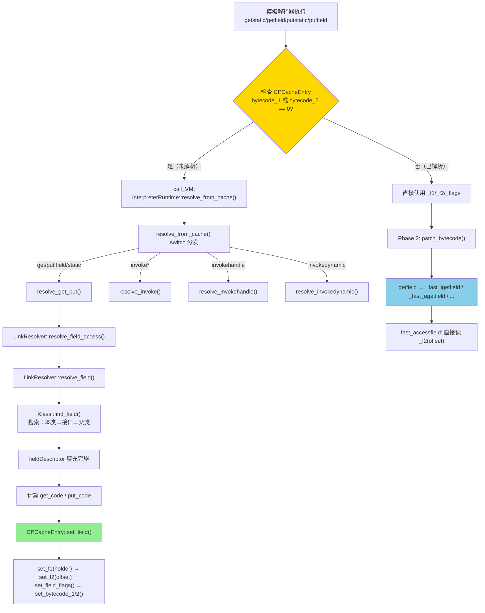
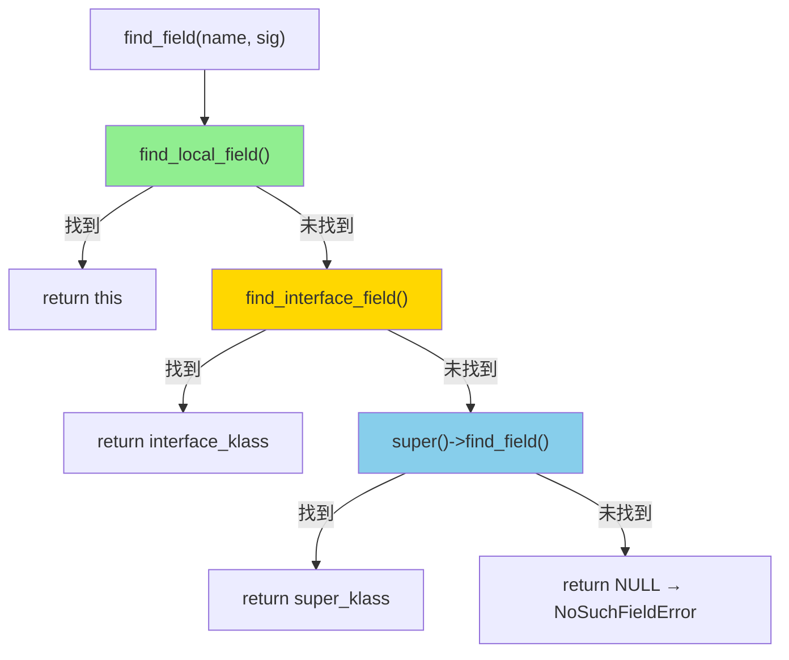

# Day 29：Runtime Resolution 总览 + 字段解析全链路

> 标准环境：`-Xms8g -Xmx8g -XX:+UseG1GC -Xint`
>
> GDB 脚本：`new-jvm-md/tmp-file/RuntimeResolve/field_resolve_focused.gdb`
>
> 前置依赖：[Day 26: ConstantPool](../Metaspace/5-ConstantPool-Deep-Dive.md)、[Day 27: Rewriter](../Metaspace/6-Rewriter-Bytecode-Rewriting.md)

---

## 第 0 部分：核心原理 ⭐

### 0.1 本质是什么？

本文深入分析 **Day 29：Runtime Resolution 总览 + 字段解析全链路**：从源码角度理解其设计原理、实现机制和关键细节。

### 0.2 为什么需要？

理解 JVM 内部实现是排查复杂问题、进行性能优化的基础。表面的 API 文档无法解释 JVM 的实际行为，只有深入源码才能建立精确的心智模型。

### 0.3 怎么解决？

结合源码阅读、数据结构分析和 GDB 运行时验证，从多个角度建立对该机制的完整理解。

### 0.4 为什么这样设计？

每个设计决策都有其权衡：性能 vs 正确性、简单性 vs 灵活性、内存占用 vs 查找速度。理解这些权衡是理解 JVM 设计的关键。

---


## 一、宏观理解

### 1.1 解决什么问题？

Day 26-27 分析了 ConstantPool 和 Rewriter：
- **Rewriter** 在类链接阶段创建了 `ConstantPoolCache`（简称 CPCache），并为每个 Fieldref/Methodref 分配了 `ConstantPoolCacheEntry`
- 但此时 **CPCacheEntry 全部为空**（`_f1=NULL, _f2=0, _flags=0`）

**核心问题**：这些 CPCacheEntry 是什么时候、由谁、怎样填充的？

**答案**：**Lazy Resolution（惰性解析）**。CPCacheEntry 直到字节码**首次执行**时才被填充。模板解释器在执行 `getfield/getstatic/invokevirtual` 等字节码时，检查 CPCacheEntry 的 `bytecode_1/bytecode_2` 字段——如果为 0（未解析），就调用 `InterpreterRuntime::resolve_from_cache()` 进入 VM 完成解析。

### 1.2 为什么要惰性解析？

1. **启动速度**：类链接时只需创建空 CPCache，不需要解析所有引用（很多字段/方法可能永远不会被访问）
2. **类初始化时序**：`getstatic` 访问静态字段时，持有字段的类可能还未初始化。惰性解析可以在首次访问时触发初始化
3. **final 字段保护**：通过控制 `put_code` 是否写入，可以确保 final 字段的写操作每次都经过 VM 检查

### 1.3 完整调用链



### 1.4 resolve_from_cache 分发表

```
interpreterRuntime.cpp:986
resolve_from_cache(thread, bytecode):
  switch(bytecode):
    getstatic/putstatic/getfield/putfield → resolve_get_put(thread, bytecode)
    invokevirtual/invokespecial/invokestatic/invokeinterface → resolve_invoke(thread, bytecode)
    invokehandle → resolve_invokehandle(thread)
    invokedynamic → resolve_invokedynamic(thread)
```

> **本文聚焦 `resolve_get_put()` — 字段解析全链路。方法解析（`resolve_invoke`）将在 Day 30 分析。**

---

## 二、源码逐行分析

### 2.1 resolve_get_put() — 字段解析入口

> 源码：`interpreterRuntime.cpp:668-738`

```cpp
void InterpreterRuntime::resolve_get_put(JavaThread* thread, Bytecodes::Code bytecode) {
  Thread* THREAD = thread;
  fieldDescriptor info;                                          // ① 栈上分配 fieldDescriptor
  LastFrameAccessor last_frame(thread);                          // ② 获取当前解释帧
  constantPoolHandle pool(thread, last_frame.method()->constants()); // ③ 拿到当前方法的 CP
  methodHandle m(thread, last_frame.method());
  bool is_put    = (bytecode == Bytecodes::_putfield  || bytecode == Bytecodes::_nofast_putfield ||
                    bytecode == Bytecodes::_putstatic);
  bool is_static = (bytecode == Bytecodes::_getstatic || bytecode == Bytecodes::_putstatic);

  // ④ 核心：调用 LinkResolver 完成字段查找
  {
    JvmtiHideSingleStepping jhss(thread);
    LinkResolver::resolve_field_access(info, pool, last_frame.get_index_u2_cpcache(bytecode),
                                       m, bytecode, CHECK);
  }

  // ⑤ 检查是否已被其他线程解析（并发安全）
  ConstantPoolCacheEntry* cp_cache_entry = last_frame.cache_entry();
  if (cp_cache_entry->is_resolved(bytecode)) return;

  // ⑥ 计算 TosState（字段类型对应的栈顶状态）
  TosState state  = as_TosState(info.field_type());

  // ⑦ 计算 get_code 和 put_code
  InstanceKlass* klass = InstanceKlass::cast(info.field_holder());
  bool uninitialized_static = is_static && !klass->is_initialized();    // 静态字段的类未初始化？
  bool has_initialized_final_update = info.field_holder()->major_version() >= 53 &&
                                      info.has_initialized_final_update();

  Bytecodes::Code get_code = (Bytecodes::Code)0;
  Bytecodes::Code put_code = (Bytecodes::Code)0;
  if (!uninitialized_static) {                                          // 类已初始化才写 get_code
    get_code = ((is_static) ? Bytecodes::_getstatic : Bytecodes::_getfield);
    if ((is_put && !has_initialized_final_update) || !info.access_flags().is_final()) {
      put_code = ((is_static) ? Bytecodes::_putstatic : Bytecodes::_putfield);
    }
    // ⑧ 注意：final 字段的 put_code 保持为 0！
  }

  // ⑨ 填充 CPCacheEntry
  cp_cache_entry->set_field(
    get_code,
    put_code,
    info.field_holder(),        // _f1 = 持有字段的 Klass*
    info.index(),               // field_index
    info.offset(),              // _f2 = 字段偏移量（字节）
    state,                      // TosState
    info.access_flags().is_final(),
    info.access_flags().is_volatile(),
    pool->pool_holder()
  );
}
```

**关键设计决策**：

| 条件 | get_code | put_code | 原因 |
|------|----------|----------|------|
| 类未初始化的静态字段 | **0** | **0** | 每次访问都重新进入 VM，触发类初始化 |
| final 字段 | getstatic/getfield | **0** | get 可以缓存，但 put 每次都进 VM 检查 IllegalAccessError |
| 普通字段 | getstatic/getfield | putstatic/putfield | get 和 put 都缓存 |

### 2.2 LinkResolver::resolve_field — 字段查找

> 源码：`linkResolver.cpp:943-994`

```cpp
// 薄包装：构造 LinkInfo 后调用 resolve_field
void LinkResolver::resolve_field_access(fieldDescriptor& fd, const constantPoolHandle& pool,
                                        int index, const methodHandle& method,
                                        Bytecodes::Code byte, TRAPS) {
  LinkInfo link_info(pool, index, method, CHECK);    // 从 CP 提取 resolved_klass、name、sig
  resolve_field(fd, link_info, byte, true, CHECK);   // initialize_class=true
}

void LinkResolver::resolve_field(fieldDescriptor& fd, const LinkInfo& link_info,
                                 Bytecodes::Code byte, bool initialize_class, TRAPS) {
  Klass* resolved_klass = link_info.resolved_klass();
  Symbol* field = link_info.name();
  Symbol* sig = link_info.signature();

  // ① 核心搜索：在 resolved_klass 中查找字段
  Klass* sel_klass = resolved_klass->find_field(field, sig, &fd);
  if (sel_klass == NULL) {
    THROW_MSG(vmSymbols::java_lang_NoSuchFieldError(), field->as_C_string());
  }

  // ② 访问权限检查
  if (link_info.check_access()) {
    check_field_accessability(current_klass, resolved_klass, sel_klass, fd, CHECK);
    // static vs non-static 一致性检查
    if (is_static != fd.is_static()) {
      THROW_MSG(vmSymbols::java_lang_IncompatibleClassChangeError(), msg);
    }
    // final 字段写入保护 ...
  }

  // ③ 如果是静态字段且 initialize_class=true，触发类初始化
  if (initialize_class && is_static) {
    sel_klass->initialize(CHECK);    // 确保持有字段的类已初始化
  }
}
```

### 2.3 InstanceKlass::find_field — 三级搜索

> 源码：`instanceKlass.cpp:1390-1406`

按照 JVM 规范 §5.4.3.2 定义的搜索顺序：

```cpp
Klass* InstanceKlass::find_field(Symbol* name, Symbol* sig, fieldDescriptor* fd) const {
  // 1) 在当前类中查找
  if (find_local_field(name, sig, fd)) {
    return const_cast<InstanceKlass*>(this);
  }
  // 2) 在直接实现的接口中递归查找
  {
    Klass* intf = find_interface_field(name, sig, fd);
    if (intf != NULL) return intf;
  }
  // 3) 在父类中递归查找
  {
    Klass* supr = super();
    if (supr != NULL) return InstanceKlass::cast(supr)->find_field(name, sig, fd);
  }
  // 4) 未找到
  return NULL;
}
```



`find_local_field()` 的实现（`instanceKlass.cpp:1358`）很直接——遍历 `JavaFieldStream`，逐个比较 name 和 sig。

### 2.4 CPCacheEntry::set_field — 填充 CPCacheEntry

> 源码：`cpCache.cpp:127-147`

```cpp
void ConstantPoolCacheEntry::set_field(
    Bytecodes::Code get_code, Bytecodes::Code put_code,
    Klass* field_holder, int field_index, int field_offset,
    TosState field_type, bool is_final, bool is_volatile,
    Klass* root_klass) {

  set_f1(field_holder);          // ① _f1 = 持有字段的 Klass*（直接写）
  set_f2(field_offset);          // ② _f2 = 字段在对象中的偏移量（字节数）

  set_field_flags(field_type,    // ③ _flags = tos_state | option_bits | field_index
                  ((is_volatile ? 1 : 0) << is_volatile_shift) |
                  ((is_final    ? 1 : 0) << is_final_shift),
                  field_index);

  set_bytecode_1(get_code);      // ④ _indices[23:16] = get_code（release_store）
  set_bytecode_2(put_code);      // ⑤ _indices[31:24] = put_code（release_store）
}
```

**写入顺序至关重要**：
1. 先写 `_f1`、`_f2`、`_flags`（数据字段）
2. **最后写** `_indices` 中的 bytecodes（使用 `OrderAccess::release_store`）

这保证了当另一个线程看到 `bytecode_1 != 0` 时，`_f1/_f2/_flags` 已经完全可见。读取端使用 `OrderAccess::load_acquire` 读取 `_indices`（`cpCache.inline.hpp:32`），形成完整的 **acquire-release 对**。

---

## 三、CPCacheEntry 位布局详解

### 3.1 _indices 字段布局（32-bit intx）

```
┌─────────────┬─────────────┬────────────────────────────┐
│  31  ...  24│  23  ...  16│   15   ...   0             │
├─────────────┼─────────────┼────────────────────────────┤
│ bytecode_2  │ bytecode_1  │     cp_index               │
│  (put_code) │  (get_code) │  (原始 CP 索引)            │
└─────────────┴─────────────┴────────────────────────────┘
```

> 源码：`cpCache.hpp:198-206`

| 字段 | 位范围 | 含义 |
|------|--------|------|
| `cp_index` | [15:0] | 原始常量池索引（Rewriter 阶段写入） |
| `bytecode_1` | [23:16] | get 操作字节码（178=getstatic, 180=getfield），0=未解析 |
| `bytecode_2` | [31:24] | put 操作字节码（179=putstatic, 181=putfield），0=未解析/被禁止 |

**`bytecode_1` vs `bytecode_2` 分配规则**（`cpCache.hpp:312-327`）：

| 字节码 | 写入 slot |
|--------|----------|
| getstatic (178) | bytecode_1 |
| getfield (180) | bytecode_1 |
| invokespecial (183) | bytecode_1 |
| invokestatic (184) | bytecode_1 |
| invokeinterface (185) | bytecode_1 |
| invokehandle | bytecode_1 |
| invokedynamic | bytecode_1 |
| putstatic (179) | bytecode_2 |
| putfield (181) | bytecode_2 |
| invokevirtual (182) | bytecode_2 |

> 一个 CPCacheEntry 可以**同时缓存 get 和 put**，分别存在不同 slot 中。

### 3.2 _flags 字段布局（32-bit unsigned）

```
┌────┬─┬─┬─┬─┬──┬──┬────┬───────────────────────┐
│31:28│27│26│25│24│23│22│21│20│19│18│17│16│ 15:0   │
├────┼─┼─┼─┼─┼──┼──┼────┼───────────────────────┤
│ TOS│ │ F│ M│ A│ I│ f│ v│vf│rf│  │  │  │idx/sz  │
└────┴─┴─┴─┴─┴──┴──┴────┴───────────────────────┘
```

> 源码：`cpCache.hpp:176-196`

| 位 | 名称 | 含义 |
|----|------|------|
| [31:28] | `tos_state` | 字段类型 / 方法返回类型（0=btos, 4=itos, 5=ltos, 6=ftos, 7=dtos, 8=atos, 9=vtos） |
| [26] | `is_field_entry` | 1=字段条目，0=方法条目 |
| [25] | `has_method_type` | 调用点是否有 MethodType |
| [24] | `has_appendix` | 调用点是否有 appendix 参数 |
| [23] | `is_forced_virtual` | 接口引用是否强制虚调用 |
| [22] | `is_final` | 字段/方法是否 final |
| [21] | `is_volatile` | 字段是否 volatile |
| [20] | `is_vfinal` | 方法调用是否解析到 final 方法 |
| [19] | `indy_resolution_failed` | invokedynamic 解析是否失败 |
| [15:0] | `field_index` / `parameter_size` | 字段条目=FieldInfo索引，方法条目=参数个数 |

### 3.3 _f1 和 _f2 的含义（字段 vs 方法）

| 条目类型 | _f1 | _f2 |
|----------|-----|-----|
| **字段** | 持有字段的 Klass* | 字段偏移量（字节数） |
| **invokevirtual** | NULL | vtable 索引 |
| **invokestatic/invokespecial** | Method* | 0（直接调用） |
| **invokeinterface** | Klass* (接口) | itable 索引 |
| **invokehandle/invokedynamic** | MethodType 等 | Method*（adapter） |

---

## 四、模板解释器快速路径

### 4.1 resolve_cache_and_index — 解析检查

> 源码：`templateTable_x86.cpp:2721-2749`

模板解释器执行 `getfield/getstatic` 时生成的汇编伪代码：

```
// ① 从 CPCache 中读取 bytecode_1（使用 load_acquire）
get_cache_and_index_and_bytecode_at_bcp(Rcache, index, temp, byte_no)
// ② 比较：是否已解析？
cmpl temp, expected_code        // temp == 178(getstatic)? 或 == 180(getfield)?
jcc  equal, resolved            // 已解析 → 跳过 VM 调用

// ③ 未解析 → 进入 VM
movl temp, code
call_VM InterpreterRuntime::resolve_from_cache(thread, code)
// ④ 重新加载 cache & index
get_cache_and_index_at_bcp(Rcache, index)

resolved:
// 继续执行，使用 _f1/_f2/_flags
```

### 4.2 Phase 2 快速字节码重写

首次解析后，对于 `getfield`，模板解释器会在字节码流中**原地重写**为 fast 变体：

```
getfield → _fast_bgetfield  (byte)
getfield → _fast_zgetfield  (boolean)
getfield → _fast_igetfield  (int)
getfield → _fast_lgetfield  (long)
getfield → _fast_fgetfield  (float)
getfield → _fast_dgetfield  (double)
getfield → _fast_agetfield  (object reference)
```

> 源码：`templateTable_x86.cpp:2860-2919`，在 `getfield_or_static()` 的各类型分支末尾调用 `patch_bytecode()`。

**`fast_accessfield()` 的汇编实现**（`templateTable_x86.cpp:3468-3506`）跳过了 `resolve_cache_and_index` 检查，**直接读取 `_f2`（偏移量）**：

```
// fast_accessfield 生成的汇编：
get_cache_and_index_at_bcp(rcx, rbx, 1)               // 拿到 cache entry
movptr rbx, [rcx + rbx*8 + CPCacheEntry::f2_offset]   // rbx = 字段偏移量
// 然后直接 field(obj, rbx) 读取字段值
```

> **注意**：`getstatic` 不会被重写为 fast 变体（因为需要保持对类初始化状态的检查）。`putfield` 的 fast 重写有额外保护——如果 `put_code == 0`（final 字段），`patch_bytecode` 检测到后不会重写（`templateTable_x86.cpp:196-199`）。

### 4.3 putfield 的 final 字段保护

> 源码：`templateTable_x86.cpp:188-200`

```cpp
case Bytecodes::_fast_aputfield:
case Bytecodes::_fast_iputfield:
  // ... 其他 fast_*putfield 变体
  {
    // 读取 CPCacheEntry 中的 bytecode_2（put_code）
    __ get_cache_and_index_and_bytecode_at_bcp(temp_reg, bc_reg, temp_reg, byte_no, 1);
    __ movl(bc_reg, bc);
    __ cmpl(temp_reg, (int) 0);
    __ jcc(Assembler::zero, L_patch_done);  // put_code == 0 → 不重写！
  }
```

这意味着：对 final 字段的 `putfield`，每次执行都会走到 `resolve_cache_and_index` → 发现 `bytecode_2 == 0` → 调用 `InterpreterRuntime::resolve_from_cache` → 进入 VM → 抛出 `IllegalAccessError`。

---

## 五、GDB 验证

### 5.1 验证方案

使用 `field_resolve_focused.gdb`，设 3 个断点：

1. **BP1**（`instanceKlass.cpp:1007`）：Main 类 `fully_initialized` 后，打印 CPCache 的 **BEFORE 快照**（所有 Entry 应为空）
2. **BP2**（`cpCache.cpp:127`）：`set_field` 被调用时，仅过滤 Main 的 CPCache 地址范围内的触发
3. **BP3**（`Threads::destroy_vm`）：程序退出时，打印 CPCache 的 **AFTER 快照**

### 5.2 BEFORE 快照（Main fully_initialized 后、main() 执行前）

```
========== Main class fully_initialized ==========
  InstanceKlass = 0x800097840
  ConstantPool = 0x7fffcefa6068 (length=21)
  CPCache = 0x7fffcefa6348 (length=3)
  sizeof(ConstantPoolCache) = 24
  sizeof(ConstantPoolCacheEntry) = 32

--- CPCacheEntry BEFORE resolution ---
  Entry[0] @ 0x7fffcefa6360:
    _indices = 0x00000001       ← cp_index=1, bytecode_1=0, bytecode_2=0
    _f1 = (nil)
    _f2 = 0x0
    _flags = 0x00000000

  Entry[1] @ 0x7fffcefa6380:
    _indices = 0x00000002       ← cp_index=2, bytecode_1=0, bytecode_2=0
    _f1 = (nil)
    _f2 = 0x0
    _flags = 0x00000000

  Entry[2] @ 0x7fffcefa63a0:
    _indices = 0x00000004       ← cp_index=4, bytecode_1=0, bytecode_2=0
    _f1 = (nil)
    _f2 = 0x0
    _flags = 0x00000000
```

> **3 个 Entry 的 cp_index 分别为 1、2、4**，对应 Main 的常量池中的 3 个 ref 条目。
> 所有 `_f1/_f2/_flags` 全部为 0，bytecodes 全部为 0。**证实 Rewriter 只分配空间不填充数据。**

### 5.3 set_field 触发（Main 的 main() 执行中）

```
========== [RESOLVE 1] set_field for Main's CPCacheEntry ==========
  CPCacheEntry = 0x7fffcefa6390        ← 这是 Entry[1]（(0x6390 - 0x6360) / 32 = 1.5 → 实际 (0x6390 - 0x6360) / 32...）
  get_code = 178 (getstatic)
  put_code = 0 (none)                  ← final 字段，不缓存 put
  field_holder = 0x8000028a0 (java/lang/System)
  field_index = 1
  field_offset = 116 bytes
  field_type = 8 (atos=object/ref)
  is_final = 1, is_volatile = 0
  → CPCache entry index = 1
```

**分析**：
- Entry[1] 对应 `cp_index=2`，即常量池 #2 = `Fieldref java/lang/System.out:Ljava/io/PrintStream;`
- `get_code=178`（getstatic）：因为 `java/lang/System` 在此时已经完成初始化（`uninitialized_static=false`）
- `put_code=0`：因为 `System.out` 是 **final** 字段（`is_final=1`），`put_code` 被设为 0
- `field_offset=116`：`out` 字段在 `java/lang/System` mirror（Class 实例）中的偏移量

> **注意**：整个 main() 执行过程中只触发了 **1 次** `set_field`（只有 `getstatic System.out`）。`invokevirtual PrintStream.println` 走的是 `set_direct_or_vtable_call()`，不经过 `set_field`。

### 5.4 AFTER 快照（Threads::destroy_vm 时）

```
========== AFTER main() — CPCacheEntry AFTER resolution ==========

  Entry[0] @ 0x7fffcefa6360:
    _indices = 0x00000001       ← cp_index=1, bytecodes 全为 0
    _f1 = (nil)
    _f2 = 0x0
    _flags = 0x00000000
    flags: tos=0, is_field=0, is_final=0, is_volatile=0, low16=0
    → METHOD entry                ← 仍未解析！

  Entry[1] @ 0x7fffcefa6380:
    _indices = 0x00b20002       ← cp_index=2, bytecode_1=178(getstatic), bytecode_2=0
    _f1 = 0x8000028a0           ← java/lang/System
    _f2 = 0x74                  ← offset=116 字节
    _flags = 0x84400001
    flags: tos=8(atos), is_field=1, is_final=1, is_volatile=0, low16=1(field_index=1)
    → FIELD entry: offset=116, holder=0x8000028a0

  Entry[2] @ 0x7fffcefa63a0:
    _indices = 0xffffffffb6000004 ← cp_index=4, bytecode_1=0, bytecode_2=182(invokevirtual)
    _f1 = (nil)
    _f2 = 0xf                  ← vtable_index=15
    _flags = 0x90000002
    flags: tos=9(vtos), is_field=0, is_final=0, is_volatile=0, low16=2(param_size=2)
    → METHOD entry               ← invokevirtual 解析完毕
```

### 5.5 三个 Entry 解析状态对比

| Entry | CP 引用 | BEFORE | AFTER | 说明 |
|-------|---------|--------|-------|------|
| **[0]** | #1 `Object.<init>` | 全 0 | **全 0（未解析）** | `<init>` 在 `<clinit>` 中通过 `invokespecial` 调用，但那是在 Object 的 CPCache 中解析，不在 Main 的 CPCache 中 |
| **[1]** | #2 `System.out` | 全 0 | **已解析（getstatic 字段）** | `_f1`=System, `_f2`=116, tos=atos, is_field=1, is_final=1 |
| **[2]** | #4 `PrintStream.println` | 全 0 | **已解析（invokevirtual 方法）** | `_f2`=15(vtable_index), tos=vtos, param_size=2 |

### 5.6 Entry[0] 为什么未解析？

Entry[0] 对应 `Methodref Object.<init>:()V`。这个条目是 Main 的**构造器** `<init>()` 中的 `invokespecial super.<init>()` 使用的。

在我们的测试程序中，`main()` 方法只执行了 `getstatic` 和 `invokevirtual`。Main 的构造器**没有被 `main()` 调用**（Main 没有 `new Main()` 操作），所以 Entry[0] 自然不会被解析。

> Main 类本身在 `initialize_impl` 中执行 `<clinit>`（如果存在），但 `com.wjcoder.Main` 没有 `<clinit>`。即使有，`<clinit>` 是类初始化器，不是实例构造器，不涉及 `invokespecial Object.<init>`。

### 5.7 _flags 位级解码验证

以 Entry[1] 的 `_flags = 0x84400001` 为例：

```
二进制: 1000 0100 0100 0000 0000 0000 0000 0001

[31:28] = 1000 = 8 = atos（object reference）           ✓ System.out 是 PrintStream 类型
[26]    = 1    = is_field_entry                          ✓ 这是字段条目
[25]    = 0    = no method_type
[24]    = 0    = no appendix
[23]    = 0    = not forced_virtual
[22]    = 1    = is_final                                ✓ System.out 是 final 字段
[21]    = 0    = not volatile                            ✓
[20]    = 0    = not vfinal
[15:0]  = 0x0001 = 1 = field_index                      ✓ System 类中 out 的 FieldInfo 索引
```

以 Entry[2] 的 `_flags = 0x90000002` 为例：

```
二进制: 1001 0000 0000 0000 0000 0000 0000 0010

[31:28] = 1001 = 9 = vtos（void return type）            ✓ println(String) 返回 void
[26]    = 0    = not field_entry（方法条目）               ✓
[22]    = 0    = not final                               ✓ println 不是 final 方法
[15:0]  = 0x0002 = 2 = parameter_size                    ✓ this + String 参数 = 2
```

---

## 六、内存序与并发安全

### 6.1 写入端（resolve 线程）

```
set_f1(field_holder)           ← 普通写
set_f2(field_offset)           ← 普通写
set_field_flags(...)           ← 普通写
set_bytecode_1(get_code)       ← OrderAccess::release_store(&_indices, ...)  ⬅ RELEASE
set_bytecode_2(put_code)       ← OrderAccess::release_store(&_indices, ...)  ⬅ RELEASE
```

### 6.2 读取端（模板解释器）

```
get_cache_and_index_and_bytecode_at_bcp()
  → indices_ord()
    → OrderAccess::load_acquire(&_indices)  ⬅ ACQUIRE
```

### 6.3 保证

- **ACQUIRE-RELEASE 配对**：当读取线程看到 `bytecode_1 ≠ 0`，_f1/_f2/_flags 必定已经完全写入
- **并发两次解析是安全的**：`set_bytecode_1` 的 assert 允许 `c == 0 || c == code`（相同值重复写入无害）
- **最坏情况**：两个线程同时 resolve，一个线程的 `bytecode_2` 被另一个线程的 `set_bytecode_1` 覆盖为 0。此时解释器会**重新 resolve**（`cpCache.cpp:122-126` 注释说明了这一点）

---

## 七、总结

### 7.1 字段解析全流程时序图

```mermaid
sequenceDiagram
    participant I as 模板解释器
    participant RT as InterpreterRuntime
    participant LR as LinkResolver
    participant IK as InstanceKlass
    participant CPE as CPCacheEntry

    Note over I: 执行 getstatic #2 (System.out)
    I->>I: resolve_cache_and_index()
    I->>I: 检查 bytecode_1 == 0?
    Note over I: bytecode_1 == 0，未解析

    I->>RT: call_VM: resolve_from_cache(getstatic)
    RT->>RT: switch → resolve_get_put(thread, getstatic)
    RT->>LR: resolve_field_access(fd, pool, index)
    LR->>LR: LinkInfo(pool, 2) → resolved_klass=System, name=out, sig=PrintStream

    LR->>IK: System::find_field("out", "Ljava/io/PrintStream;")
    IK->>IK: find_local_field() → 找到！
    IK-->>LR: fieldDescriptor{holder=System, offset=116, type=atos, final=1}

    LR-->>RT: fieldDescriptor 填充完毕

    RT->>RT: 计算 get_code=178, put_code=0 (final!)
    RT->>CPE: set_field(178, 0, System, 1, 116, atos, final, !volatile)
    CPE->>CPE: set_f1(System) → _f1 = 0x8000028a0
    CPE->>CPE: set_f2(116)   → _f2 = 0x74
    CPE->>CPE: set_field_flags() → _flags = 0x84400001
    CPE->>CPE: set_bytecode_1(178) → release_store → _indices[23:16] = 0xB2
    CPE->>CPE: set_bytecode_2(0)   → no-op (put_code=0)

    CPE-->>RT: 返回
    RT-->>I: 返回

    Note over I: 下次执行 getstatic #2
    I->>I: 检查 bytecode_1 == 178? ✓
    I->>I: 直接读取 _f1/_f2 执行访问
```

### 7.2 关键结论（全部 GDB 验证通过）

| # | 结论 | 验证数据 |
|---|------|----------|
| 1 | Rewriter 只创建空 CPCacheEntry，不填充数据 | BEFORE 快照：全 0 |
| 2 | 解析发生在字节码首次执行时（惰性） | BEFORE（全 0）→ main() 执行 → AFTER（部分填充） |
| 3 | final 字段的 put_code = 0，阻止 putfield 字节码重写 | `set_field` 输出：`put_code = 0 (none)` |
| 4 | _f1 = 字段持有者 Klass*，_f2 = 字段偏移量 | Entry[1]: `_f1=System(0x8000028a0)`, `_f2=116` |
| 5 | bytecode 使用 release_store 写入，确保先写数据后写标志 | 源码 `set_bytecode_1/2` 使用 `OrderAccess::release_store` |
| 6 | 未使用的 CPCacheEntry 永远不会被解析 | Entry[0] (`Object.<init>`) 始终为 0 |
| 7 | 一个 Entry 可同时存储 get 和 put（不同 slot） | 理论验证：bytecode_1=get, bytecode_2=put |
| 8 | invokevirtual 的 _f2 存储 vtable 索引（而非字段偏移） | Entry[2]: `_f2=15`, tos=vtos, param_size=2 |

### 7.3 下一步

**Day 30：方法解析（resolve_invoke）**
- `resolve_invoke()` → `LinkResolver::resolve_method()`
- vtable 调度：`_f2` = vtable 索引
- itable 调度：`_f1` = 接口 Klass*，`_f2` = itable 索引
- 直接调用：`_f1` = Method*

---

> **Day 29 完成**。字段解析全链路已从源码分析到 GDB 验证完整覆盖。
