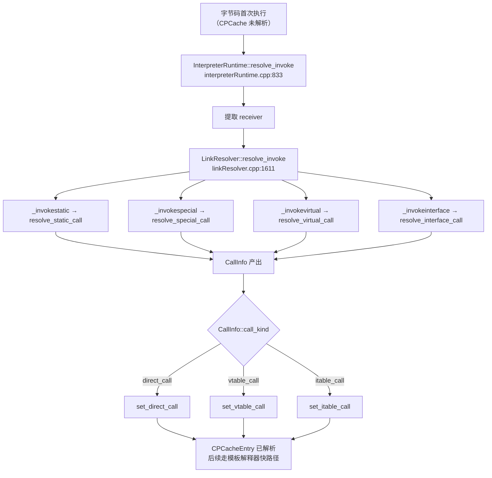
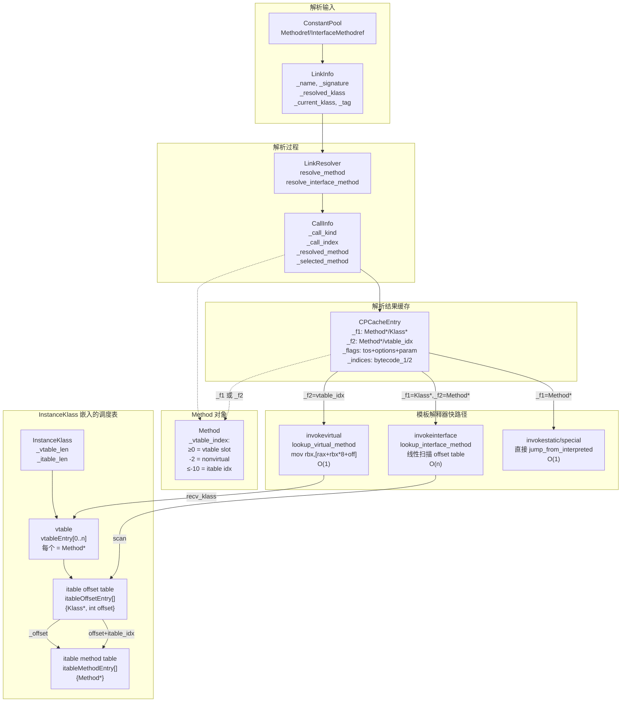
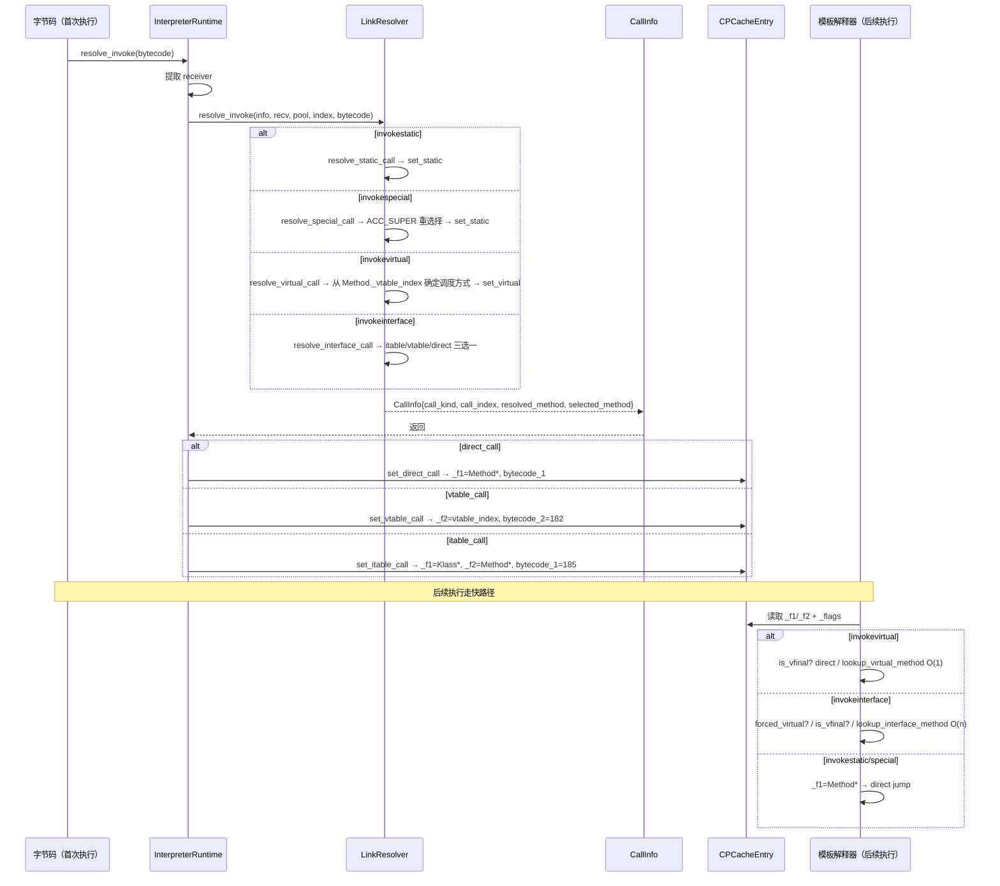

# Day 30：方法解析 — resolve_invoke + vtable/itable 调度

> **纯源码分析**，基于 OpenJDK 11 slowdebug，`-Xms8g -Xmx8g -XX:+UseG1GC -Xint`
>
> **方法论**：程序 = 数据结构 + 算法。先彻底搞清楚涉及的所有数据结构，再分析算法流程。

---

## 第 0 部分：核心原理 ⭐

### 0.1 本质是什么？

本文深入分析 **Day 30：方法解析 — resolve_invoke + vtable/itable 调度**：从源码角度理解其设计原理、实现机制和关键细节。

### 0.2 为什么需要？

理解 JVM 内部实现是排查复杂问题、进行性能优化的基础。表面的 API 文档无法解释 JVM 的实际行为，只有深入源码才能建立精确的心智模型。

### 0.3 怎么解决？

结合源码阅读、数据结构分析和 GDB 运行时验证，从多个角度建立对该机制的完整理解。

### 0.4 为什么这样设计？

每个设计决策都有其权衡：性能 vs 正确性、简单性 vs 灵活性、内存占用 vs 查找速度。理解这些权衡是理解 JVM 设计的关键。

---


## 一、宏观理解

### 1.1 解决什么问题

Java 字节码有 `invokestatic`、`invokespecial`、`invokevirtual`、`invokeinterface` 四种方法调用指令。每条指令引用常量池中的符号引用（类名 + 方法名 + 签名）。**第一次执行时**必须把符号引用解析为直接引用（Method* 指针或 vtable/itable 索引），这个过程就是 **方法解析**。解析结果缓存在 CPCacheEntry 中，后续执行直接读取，不再重复解析。

### 1.2 总体调用链



### 1.3 本文涉及的数据结构清单

| 数据结构 | 角色 | 在哪里定义 |
|---------|------|----------|
| `LinkInfo` | 解析请求的输入参数包 | `linkResolver.hpp:140` |
| `CallInfo` | 解析结果的输出参数包 | `linkResolver.hpp:38` |
| `Method::_vtable_index` | 方法在 vtable/itable 中的索引 | `method.hpp:80` |
| `vtableEntry` | vtable 中的一个槽位 | `klassVtable.hpp:190` |
| `itableOffsetEntry` | itable 偏移表条目 | `klassVtable.hpp:236` |
| `itableMethodEntry` | itable 方法表条目 | `klassVtable.hpp:259` |
| `klassVtable` | vtable 的临时访问器 | `klassVtable.hpp:43` |
| `klassItable` | itable 的临时访问器 | `klassVtable.hpp:296` |
| `CPCacheEntry` | 解析结果的持久化缓存 | `cpCache.hpp`（Day 29 已分析） |

---

## 二、数据结构全景

### 2.1 LinkInfo — 解析请求的输入

**源码位置**：`linkResolver.hpp:140-189`

LinkInfo 是传递给 LinkResolver 的**输入参数包**，封装了"调用谁的什么方法"的完整信息。

**字段（7 个）**：

| 字段 | 类型 | 含义 | 来源 |
|------|------|------|------|
| `_name` | `Symbol*` | 方法名（如 `println`） | 从 `JVM_CONSTANT_NameAndType` 提取 |
| `_signature` | `Symbol*` | 方法签名（如 `(Ljava/lang/String;)V`） | 从 `JVM_CONSTANT_NameAndType` 提取 |
| `_resolved_klass` | `Klass*` | 常量池条目指向的类（如 `PrintStream`） | 从 `JVM_CONSTANT_Methodref` 的 class_index 解析 |
| `_current_klass` | `Klass*` | 发起调用的类（拥有此常量池的类） | `pool->pool_holder()` |
| `_current_method` | `methodHandle` | 发起调用的方法 | 当前栈帧的方法 |
| `_check_access` | `bool` | 是否做访问权限检查 | 通常 `true`，VM 内部调用可跳过 |
| `_tag` | `constantTag` | 常量池标签（Methodref / InterfaceMethodref） | 区分是通过类还是接口引用的方法 |

**什么时候创建**：每个 `resolve_invokeXXX` 包装器的第一行：

```cpp
void LinkResolver::resolve_invokevirtual(CallInfo& result, Handle recv,
    const constantPoolHandle& pool, int index, TRAPS) {
  LinkInfo link_info(pool, index, CHECK);  // ← 从常量池提取 resolved_klass + name + sig
  ...
}
```

`LinkInfo(pool, index)` 构造函数内部会从常量池读取 `Methodref` 或 `InterfaceMethodref` 条目，提取 class_index 解析为 Klass*，提取 name_and_type_index 解析为 name + signature。

### 2.2 CallInfo — 解析结果的输出

**源码位置**：`linkResolver.hpp:38-132`

CallInfo 是 LinkResolver 的**输出结果包**，封装了"最终要调用哪个方法、用什么方式调度"的完整信息。

**字段（9 个）**：

| 字段 | 类型 | 含义 | 什么场景有值 |
|------|------|------|------------|
| `_resolved_klass` | `Klass*` | 静态解析的 Klass（符号引用指向的类） | 所有场景 |
| `_selected_klass` | `Klass*` | 动态选择的 Klass（receiver 的实际类） | virtual/interface；static/special 时等于 _resolved_klass |
| `_resolved_method` | `methodHandle` | 静态解析得到的方法 | 所有场景 |
| `_selected_method` | `methodHandle` | 动态选择的实际目标方法 | virtual/interface（可能与 _resolved_method 不同）；static/special 时等于 _resolved_method |
| `_call_kind` | `CallKind` | **调度方式** | 所有场景 |
| `_call_index` | `int` | **vtable 或 itable 索引** | vtable_call/itable_call 时 ≥ 0；direct_call 时为 -2 |
| `_resolved_appendix` | `Handle` | 附加参数（invokedynamic/invokehandle） | 仅 invokedynamic/invokehandle |
| `_resolved_method_type` | `Handle` | MethodType 对象 | 仅 invokedynamic/invokehandle |
| `_resolved_method_name` | `Handle` | ResolvedMethodName 对象 | JFR 相关 |

**CallKind 枚举**（核心！决定后续如何调度）：

```cpp
enum CallKind {
  direct_call,    // 直接跳转到 Method*（static/special/final/private）
  vtable_call,    // recv_klass->method_at_vtable(index) — O(1)
  itable_call,    // recv_klass.itable 线性扫描 — O(n)
  unknown_kind = -1
};
```

**三个 set 方法是如何确定 call_kind 的**：

#### set_static（invokestatic / invokespecial）

```cpp
// linkResolver.cpp:64
void CallInfo::set_static(Klass* resolved_klass, const methodHandle& resolved_method, TRAPS) {
  int vtable_index = Method::nonvirtual_vtable_index;  // -2
  set_common(resolved_klass, resolved_klass, resolved_method, resolved_method,
             CallInfo::direct_call, vtable_index, CHECK);
}
```

**永远是 `direct_call`**。resolved_klass = selected_klass，resolved_method = selected_method（因为静态/特殊调用不需要动态选择）。

#### set_virtual（invokevirtual / invokeinterface 降级到 vtable）

```cpp
// linkResolver.cpp:84
void CallInfo::set_virtual(Klass* resolved_klass, Klass* selected_klass,
    const methodHandle& resolved_method, const methodHandle& selected_method,
    int vtable_index, TRAPS) {
  // 核心决策：
  CallKind kind = (vtable_index >= 0 && !resolved_method->can_be_statically_bound())
                  ? CallInfo::vtable_call
                  : CallInfo::direct_call;
  set_common(resolved_klass, selected_klass, resolved_method, selected_method, kind, vtable_index, CHECK);
}
```

**关键逻辑**：
- `vtable_index >= 0`（有有效的 vtable 槽位）**且**方法**不能**静态绑定 → `vtable_call`
- 否则（vtable_index == -2 或 final/private 方法可静态绑定）→ `direct_call`

这意味着 `set_virtual` 并不一定产生 `vtable_call`！final 方法虽然通过 invokevirtual 调用，但实际走 `direct_call`。

#### set_interface（标准 itable 调度）

```cpp
// linkResolver.cpp:70
void CallInfo::set_interface(Klass* resolved_klass, Klass* selected_klass,
    const methodHandle& resolved_method, const methodHandle& selected_method,
    int itable_index, TRAPS) {
  assert(resolved_method->method_holder()->is_interface(), "");
  assert(itable_index == resolved_method()->itable_index(), "");
  set_common(resolved_klass, selected_klass, resolved_method, selected_method,
             CallInfo::itable_call, itable_index, CHECK);
}
```

**永远是 `itable_call`**。只有当 `resolved_method` 的持有者是接口**且**有 itable_index 时才走这条路。

#### set_common（底层统一赋值）

```cpp
// linkResolver.cpp:119
void CallInfo::set_common(Klass* resolved_klass, Klass* selected_klass,
    const methodHandle& resolved_method, const methodHandle& selected_method,
    CallKind kind, int index, TRAPS) {
  assert(resolved_method->signature() == selected_method->signature(), "签名必须一致");
  _resolved_klass  = resolved_klass;
  _selected_klass  = selected_klass;
  _resolved_method = resolved_method;
  _selected_method = selected_method;
  _call_kind       = kind;
  _call_index      = index;
  _resolved_appendix = Handle();
  DEBUG_ONLY(verify());
  CompilationPolicy::compile_if_required(selected_method, THREAD);  // ← 可能触发编译！
}
```

注意最后一行：**方法解析时就会触发编译策略**，检查该方法是否需要 JIT 编译。

### 2.3 Method::_vtable_index — 一个字段，两种编码

**源码位置**：`method.hpp:80, 489-507`

这是整个方法解析系统中**最精妙的设计之一**：vtable index 和 itable index **共享同一个 `int` 字段**，通过值域区分。

#### 值域划分

```
                            _vtable_index 值域
     ←── itable 区域 ──→  ←── 哨兵区域 ──→  ←── vtable 区域 ──→
... -12  -11  -10  -9   -8~-5  -4  -3  -2  -1   0   1   2   3 ...
         ↑     ↑    ↑           ↑   ↑   ↑        ↑
       itable itable pending  inval garb non-    vtable
       idx=2  idx=1 idx=0    id   age  virtual  index
              max
```

| 值 | 常量名 | 含义 | `has_vtable_index()` | `has_itable_index()` |
|----|--------|------|---------------------|---------------------|
| ≥ 0 | — | 有效的 vtable 槽位索引 | `true` | `false` |
| -2 | `nonvirtual_vtable_index` | 不需要虚分派（private/final/static） | `false` | `false` |
| -3 | `garbage_vtable_index` | 刚创建，尚未链接 | `false` | `false` |
| -4 | `invalid_vtable_index` | 无效（排序后临时状态） | `false` | `false` |
| -9 | `pending_itable_index` | 等待分配 itable index | `false` | `false` |
| ≤ -10 | `itable_index_max` 起 | 有效的 itable 索引 | `false` | `true` |
| -1 | **不使用** | 历史原因，曾被重载多种含义 | — | — |

#### itable index 的编码方式

```cpp
// 写入：set_itable_index(index) → _vtable_index = itable_index_max - index = -10 - index
// 读取：itable_index() → itable_index_max - _vtable_index = -10 - _vtable_index

// 示例：
// itable_index = 0 → _vtable_index = -10 - 0 = -10
// itable_index = 1 → _vtable_index = -10 - 1 = -11
// itable_index = 2 → _vtable_index = -10 - 2 = -12
```

**为什么这样设计？** 节省内存。Method 对象在 JVM 中数量巨大（几万到几十万个），如果用两个字段分别存 vtable_index 和 itable_index，每个 Method 多 4 字节。而实际上一个方法**不可能同时有 vtable index 和 itable index**（类方法在 vtable，接口方法在 itable），所以复用同一个字段完全安全。

#### _vtable_index 的完整生命周期

```
Method 构造函数
    └── _vtable_index = garbage_vtable_index (-3)

classFileParser::sort_methods()（方法排序时临时借用）
    ├── _vtable_index = 原始索引 (0,1,2...)   // 临时记住排序前位置
    └── _vtable_index = invalid_vtable_index (-4)  // 排序后恢复

klassVtable::update_inherited_vtable()（类链接阶段）
    ├── 非接口类的方法：
    │   ├── 初始化为 nonvirtual_vtable_index (-2)  // 默认假设不需要虚分派
    │   ├── 如果覆盖了父类方法 → 设为被覆盖的 vtable 槽位 index (≥ 0)
    │   └── 如果是新方法需要新 entry → 设为新分配的 index (≥ 0)
    │
    └── 接口类的方法：
        └── 设为 pending_itable_index (-9)  // 等待后续分配

klassItable::assign_itable_indices_for_interface()
    └── pending_itable_index (-9) → 实际 itable index (≤ -10)

Method::make_method_handle_intrinsic()
    └── _vtable_index = nonvirtual_vtable_index (-2)  // MH 内部方法
```

#### 最终稳定态

| 方法类型 | 最终 `_vtable_index` | 调度方式 |
|---------|---------------------|---------|
| 类的虚方法（在 vtable 中） | ≥ 0 | vtable 查表 |
| private / static / `<init>` / final 不在 vtable | -2 | 直接调用 |
| 接口方法（有 itable 索引） | ≤ -10 | itable 线性扫描 |
| 接口方法（也在 vtable，如 Object.toString） | ≥ 0 | vtable 查表 |

### 2.4 vtableEntry — vtable 的一个槽位

**源码位置**：`klassVtable.hpp:190-211`

```cpp
class vtableEntry {
  Method* _method;   // 唯一字段，sizeof = 8 字节 (LP64)
};
```

vtable 就是 `Method*` 的平坦数组。每个 vtableEntry 占 1 个 word（8 字节），所以 vtable_index 就是数组下标。

### 2.5 itableOffsetEntry + itableMethodEntry — itable 的两层结构

**源码位置**：`klassVtable.hpp:236-276`

```cpp
class itableOffsetEntry {        // sizeof = 16 字节 (LP64)
  Klass* _interface;             // 接口 Klass*（NULL = 终止标记）
  int    _offset;                // 从 InstanceKlass 起始到对应方法表的字节偏移
};

class itableMethodEntry {        // sizeof = 8 字节 (LP64)
  Method* _method;               // 实际实现方法的 Method*
};
```

**为什么 itable 比 vtable 复杂？**

vtable 有一个关键性质：**子类的 vtable 是父类 vtable 的超集**，方法在 vtable 中的索引对整个继承链是固定的。所以用索引直接定位，O(1)。

itable 没有这个性质：一个类可以实现任意多个接口，不同类实现同一个接口时，该接口方法在 itable 中的位置可能不同。所以必须先**线性扫描找到目标接口**，再通过 offset 定位方法表。

### 2.6 klassVtable / klassItable — 临时访问器

**源码位置**：`klassVtable.hpp:43-179, 296-353`

这两个类**不持有实际数据**，只是提供方便的访问接口。vtable/itable 的数据直接嵌入在 InstanceKlass 对象末尾。

```cpp
class klassVtable {
  Klass* _klass;        // 所属 Klass
  int    _tableOffset;  // vtable 数据在 Klass 内的偏移
  int    _length;       // vtable 长度（条目数）
};

class klassItable {
  InstanceKlass* _klass;
  int _table_offset;       // itable 在 Klass 内的偏移（word 单位）
  int _size_offset_table;  // offset table 大小（itableOffsetEntry 条目数）
  int _size_method_table;  // method table 大小（itableMethodEntry 条目数）
};
```

### 2.7 InstanceKlass 中 vtable/itable 的嵌入布局

vtable 和 itable **不是独立分配的堆对象**，而是直接追加在 InstanceKlass 的固定字段之后。这是 HotSpot 的经典优化——减少一次指针间接访问。

```
┌──────────────────────────────────────────────────────────────────┐
│              InstanceKlass（Metaspace 中）                        │
│  ... header_size() 个 word 的固定字段 ...                         │
│  （包括 _vtable_len, _itable_len 等）                             │
├──────────────────────────────────────────────────────────────────┤
│  [EMBEDDED vtable]        大小 = _vtable_len 个 word              │
│  ┌──────────────────────────────────────────┐                     │
│  │ vtableEntry[0].method = Method*          │ ← start_of_vtable()│
│  │ vtableEntry[1].method = Method*          │   = this + header   │
│  │ vtableEntry[2].method = Method*          │                     │
│  │ ...                                      │                     │
│  │ vtableEntry[vtable_len-1].method         │                     │
│  └──────────────────────────────────────────┘                     │
├──────────────────────────────────────────────────────────────────┤
│  [EMBEDDED itable]        大小 = _itable_len 个 word              │
│  ┌──────────────────────────────────────────┐                     │
│  │ ── Offset Table ──                       │ ← start_of_itable()│
│  │ itableOffsetEntry[0]                     │   = start_of_vtable│
│  │   ._interface = Klass*(接口A)            │     + vtable_len    │
│  │   ._offset    = X（方法表A的字节偏移）    │                     │
│  │ itableOffsetEntry[1]                     │                     │
│  │   ._interface = Klass*(接口B)            │                     │
│  │   ._offset    = Y（方法表B的字节偏移）    │                     │
│  │ itableOffsetEntry[2]（终止）              │                     │
│  │   ._interface = NULL                     │                     │
│  │   ._offset    = 0                        │                     │
│  ├──────────────────────────────────────────┤                     │
│  │ ── Method Table for 接口A ──             │ ← offset = X       │
│  │ itableMethodEntry[0].method = Method*    │   (从 InstanceKlass │
│  │ itableMethodEntry[1].method = Method*    │    起始计算)         │
│  │ ...                                      │                     │
│  ├──────────────────────────────────────────┤                     │
│  │ ── Method Table for 接口B ──             │ ← offset = Y       │
│  │ itableMethodEntry[0].method = Method*    │                     │
│  │ ...                                      │                     │
│  └──────────────────────────────────────────┘                     │
├──────────────────────────────────────────────────────────────────┤
│  [EMBEDDED nonstatic oop-map blocks]                              │
│  [EMBEDDED implementor]  （仅接口类）                              │
│  [EMBEDDED host klass]   （仅匿名类）                              │
│  [EMBEDDED fingerprint]  （可选）                                  │
└──────────────────────────────────────────────────────────────────┘
```

**地址计算**：

```cpp
// klass.cpp:767 — vtable 紧跟 InstanceKlass header
vtableEntry* start_of_vtable() { return (vtableEntry*)((address)this + header_size() * wordSize); }

// instanceKlass.hpp:1085 — itable 紧跟 vtable
intptr_t* start_of_itable() { return (intptr_t*)start_of_vtable() + vtable_length(); }
```

---

## 三、vtable / itable 的构建过程

在分析查找算法之前，先搞清楚**这些表是怎么建的**——这对理解查找逻辑至关重要。

### 3.1 构建时机

| 阶段 | 做了什么 | 调用位置 |
|------|---------|---------|
| 类文件解析 | 计算 vtable 大小 | `classFileParser.cpp:6388` → `compute_vtable_size_and_num_mirandas()` |
| 类文件解析 | 计算 itable 大小 | `classFileParser.cpp:6401` → `compute_itable_size()` |
| InstanceKlass 构造 | 存储 `_vtable_len`, `_itable_len` | `instanceKlass.cpp:409-430` |
| 类文件解析 | 填充 itable offset table | `classFileParser.cpp:5709` → `setup_itable_offset_table()` |
| **类链接阶段** | **填充 vtable 方法指针 + 设置每个 Method 的 _vtable_index** | `instanceKlass.cpp:824` → `vtable().initialize_vtable()` |
| **类链接阶段** | **填充 itable 方法指针 + 分配 itable index** | `instanceKlass.cpp:825` → `itable().initialize_itable()` |

### 3.2 vtable 构建算法

**源码位置**：`klassVtable.cpp:167-278`

```
initialize_vtable()
│
├── Step 1: 复制父类 vtable（initialize_from_super）
│   └── 直接 memcpy 父类的整个 vtable 到子类前部
│       子类的 vtable 前 N 个槽位与父类完全一致
│
├── Step 2: 遍历本类方法，检查覆盖或追加
│   for (每个非 default 方法 m):
│   │   update_inherited_vtable(m):
│   │   ├── m._vtable_index = nonvirtual_vtable_index (-2)  // 默认假设
│   │   ├── if private/static/<init> → return false (不需要 vtable entry)
│   │   ├── 遍历父类 vtable 的每个槽位 i:
│   │   │   └── if 同名同签名 && 可覆盖:
│   │   │       ├── vtable[i] = m       // 覆盖父类方法
│   │   │       ├── m._vtable_index = i // 设为被覆盖的槽位
│   │   │       └── return false
│   │   └── return true (需要新 entry)
│   │
│   └── if needs_new_entry:
│       ├── vtable[initialized] = m  // 追加到末尾
│       ├── m._vtable_index = initialized
│       └── initialized++
│
├── Step 3: 处理 default methods（类似 Step 2）
│
└── Step 4: 填充 miranda methods
    └── 接口方法在本类/父类中无实现 → 创建 miranda 占位
```

**关键性质**：
- 子类 vtable 前 N 个槽位与父类**索引完全对应**
- 同一个虚方法在整个继承链中的 vtable index **保持不变**
- 这就是 invokevirtual 能 O(1) 调度的根本原因

### 3.3 itable 构建算法

分两个阶段：

#### 阶段 1：setup_itable_offset_table（类文件解析时）

为每个接口创建 `itableOffsetEntry`，记录接口 Klass* 和对应方法表的偏移。此时方法表还是空的。

```
对于 transitive_interfaces 中的每个接口 intf:
  ioe->_interface = intf
  ioe->_offset = 方法表起始位置（字节偏移）
  方法表指针 += intf 的方法数
最后一个 ioe->_interface = NULL（终止标记）
```

#### 阶段 2：initialize_itable（类链接时）

**源码位置**：`klassVtable.cpp:1092-1293`

```
initialize_itable()
│
├── 为接口自身的方法分配 itable index
│   assign_itable_indices_for_interface():
│     for (接口的每个方法 m):
│       if m 不是 static/private/<init>/<clinit> && !has_vtable_index:
│         m.set_itable_index(ime_num++)
│         // _vtable_index = -10 - ime_num
│
└── 填充实现类的 itable 方法表
    initialize_itable_for_interface():
      for (接口的每个有 itable_index 的方法 intf_method):
        target = lookup_instance_method_in_klasses(实现类, name, sig)
        if target != null && target.is_public():
          itable_method_table[intf_method.itable_index()] = target
        else:
          留空 → 运行时 AbstractMethodError
```

---

## 四、四种解析路径（算法分析）

### 4.1 resolve_method — 方法查找的核心算法

**源码位置**：`linkResolver.cpp:723-793`

`resolve_static_call`、`resolve_special_call`、`resolve_virtual_call` 在解析非接口类时都调用此函数。

**六步查找**：

```
resolve_method(link_info, bytecode)
│
├── 1. 接口检查：invokevirtual 不能调用接口方法
│
├── 2. CP tag 检查：必须是 JVM_CONSTANT_Methodref
│
├── 3. 类层次查找：lookup_method_in_klasses()
│   └── 从 resolved_klass 开始，沿 super 链向上查找同名同签名方法
│
├── 4. 接口查找（如果类层次没找到）：
│   └── lookup_method_in_interfaces()
│       遍历所有实现的接口查找（用于 default method）
│
├── 5. JSR 292 多态方法（如果还没找到）：
│   └── lookup_polymorphic_method()
│       MethodHandle.linkToVirtual / invokeExact 等
│
└── 6. 访问检查 + 类加载器约束检查
```

### 4.2 resolve_static_call（invokestatic）

**源码位置**：`linkResolver.cpp:1058-1101`

**解决什么问题**：invokestatic 需要确定目标 Method* 并确保类已初始化。

**两阶段**：

**linktime**（`linktime_resolve_static_method`）：
1. 如果 resolved_klass 不是接口 → `resolve_method`；是接口 → `resolve_interface_method`
2. 检查：方法**必须是 static**（否则 `IncompatibleClassChangeError`）

**runtime**（在 `resolve_static_call` 中）：
1. 如果类未初始化 → `resolved_klass->initialize()`（触发 `<clinit>`）
2. 初始化后**重新解析**——因为 `<clinit>` 可能触发类加载，改变方法解析结果
3. `result.set_static()` → **call_kind = direct_call**

**为什么初始化后要重新解析？** 考虑场景：
```java
class A { static void foo() {} }
class B extends A { /* <clinit> 中加载了新版本的 A */ }
```
调用 `B.foo()` 时，第一次解析得到 `A.foo()`，但 B 的初始化可能导致 A 被重新加载，方法可能变了。

### 4.3 resolve_special_call（invokespecial）

**源码位置**：`linkResolver.cpp:1105-1289`

**解决什么问题**：invokespecial 用于 `<init>`、private 方法、`super.method()` 三种不同场景，必须正确区分。

**linktime**（`linktime_resolve_special_method`，1114-1189）：

```
linktime_resolve_special_method
│
├── 1. 方法查找（同 resolve_method / resolve_interface_method）
│
├── 2. <init> 检查
│   └── <init> 必须定义在 resolved_klass 中（不能从父类继承 <init>）
│       → 否则 NoSuchMethodError
│
├── 3. 接口方法检查
│   └── 如果 resolved_klass 是接口：
│       invokespecial 引用的必须是**直接超接口**的方法
│       → 否则 IncompatibleClassChangeError
│       （防止跨层级调用间接超接口的 default method）
│
└── 4. 非 static 检查
```

**runtime**（`runtime_resolve_special_method`，1192-1289）：

这是 invokespecial 最核心的部分——**ACC_SUPER 语义下的方法重选择**。

```
runtime_resolve_special_method
│
├── sel_method = resolved_method（默认直接用解析结果）
│
├── ACC_SUPER 检查（非 <init> 时）
│   条件同时满足：
│   a) current_klass 有 ACC_SUPER 标志（JDK 1.1+ 所有类都有）
│   b) current_klass 是 resolved_klass 的子类
│   c) current_klass ≠ resolved_klass
│   │
│   └── YES → super.method() 场景
│       sel_method = lookup_instance_method_in_klasses(
│           current_klass->super(),  // 从直接父类开始！
│           name, signature)
│
├── 接口 sender 检查
│   └── 如果调用者是接口 && receiver 不是调用者的子类型
│       → IllegalAccessError
│
├── 非 static / 非 abstract 检查
│
└── result.set_static() → call_kind = direct_call
```

**为什么需要 ACC_SUPER？** 考虑继承链 A → B → C，C 中 `super.foo()` 编译为 `invokespecial A.foo`（如果 foo 声明在 A 中）。但如果 B 也覆盖了 foo，语义上应该调用 B.foo（C 的直接父类的方法），而不是 A.foo。ACC_SUPER 语义就是**从 current_klass.super() 开始重新查找**，确保调用正确的父类方法。

### 4.4 resolve_virtual_call（invokevirtual）

**源码位置**：`linkResolver.cpp:1291-1409`

**解决什么问题**：invokevirtual 需要确定 vtable_index，支持多态调度。但 final/private 方法要优化为直接调用。

**linktime**（`linktime_resolve_virtual_method`，1302-1341）：
1. `resolve_method` 查找
2. 检查：不能是 private interface method（应该用 invokespecial）
3. 检查：不能是 static

**runtime**（`runtime_resolve_virtual_method`，1344-1409）：

```
runtime_resolve_virtual_method
│
├── null 检查
│
├── 确定 vtable_index 和 selected_method
│   │
│   ├── CASE A: method_holder 是接口（default / miranda method）
│   │   └── vtable_index = vtable_index_of_interface_method(resolved_klass, method)
│   │       // 在 recv_klass 的 vtable 中查找该接口方法的位置
│   │       selected_method = recv_klass->method_at_vtable(vtable_index)
│   │
│   └── CASE B: method_holder 不是接口（普通类方法）
│       └── vtable_index = resolved_method->vtable_index()
│           │
│           ├── 如果 == nonvirtual_vtable_index (-2)
│           │   → 方法是 private/final，可静态绑定
│           │   → selected_method = resolved_method（直接调用）
│           │
│           └── 如果 ≥ 0（有效 vtable index）
│               → selected_method = recv_klass->method_at_vtable(vtable_index)
│               → 真正的多态调度！
│
├── abstract 检查
│
└── result.set_virtual(resolved_klass, recv_klass, resolved_method, selected_method, vtable_index)
    ├── vtable_index ≥ 0 && !can_be_statically_bound → call_kind = vtable_call
    └── vtable_index == -2 || can_be_statically_bound → call_kind = direct_call
```

### 4.5 resolve_interface_call（invokeinterface）

**源码位置**：`linkResolver.cpp:1411-1518`

**解决什么问题**：invokeinterface 最复杂，因为同一个接口方法在不同实现类中可能通过 itable、vtable 或直接调用三种不同方式调度。

**linktime**（`linktime_resolve_interface_method`，1420-1428）：
1. `resolve_interface_method` 查找（要求是 `InterfaceMethodref`）

**runtime**（`runtime_resolve_interface_method`，1431-1518）：

```
runtime_resolve_interface_method
│
├── null 检查
│
├── 子类型检查：recv_klass 必须实现 resolved_klass（接口）
│   → 否则 IncompatibleClassChangeError
│
├── 查找实际实现方法
│   ├── private 方法 → selected_method = resolved_method
│   └── 非 private → lookup_instance_method_in_klasses(recv_klass, name, sig, skip_private)
│       → 在接收者类层次中查找实际实现
│       → 必须 public（否则 IllegalAccessError）
│       → 不能 abstract（否则 AbstractMethodError）
│
└── 确定调度方式（三选一）
    │
    ├── resolved_method->has_vtable_index()  (vtable_index ≥ 0)
    │   → result.set_virtual() → call_kind = vtable_call
    │   场景：接口方法也在 vtable 中（如 toString()，从 Object 继承）
    │   优化：用 vtable O(1) 代替 itable O(n)
    │
    ├── resolved_method->has_itable_index()  (vtable_index ≤ -10)
    │   → result.set_interface() → call_kind = itable_call
    │   场景：标准接口方法，必须走 itable 线性扫描
    │
    └── nonvirtual_vtable_index  (vtable_index == -2)
        → result.set_virtual() → call_kind = direct_call
        场景：private 接口方法（JDK 9+）或 Object 的 final 方法
```

**为什么 invokeinterface 会产生 vtable_call？**

当接口重新声明了 Object 的方法（如 `CharSequence.toString()`），该方法在 Object 中已有 vtable index，所有子类继承了这个 index。此时用 vtable 查找（O(1)）比 itable 扫描（O(n)）高效得多。JVM 在 `assign_itable_indices_for_interface` 中检查：如果方法已有 `vtable_index`，就不再分配 `itable_index`。

---

## 五、CPCacheEntry 填充详解

### 5.1 set_direct_or_vtable_call — 核心填充函数

**源码位置**：`cpCache.cpp:167-308`

```cpp
void set_direct_call(...)  { set_direct_or_vtable_call(code, method, -2, sender_is_interface); }
void set_vtable_call(...)  { set_direct_or_vtable_call(code, method, vtable_index, false); }
```

两者的区别仅在于 `vtable_index` 是否 ≥ 0。

### 5.2 六种填充路径

#### Path 1: invokeinterface + private 接口方法

**条件**：`invoke_code == _invokeinterface && vtable_index == -2 && holder->is_interface()`

```
_f1 = interface Klass*     ← 用于运行时子类型检查
_f2 = Method* (vfinal)     ← 直接调用的目标方法
_flags: is_vfinal=1        ← 告诉解释器 _f2 是 Method* 不是 index
bytecode_1 = 185 (_invokeinterface)
bytecode_2 = 182 (_invokevirtual)
```

**为什么 _f1 存接口 Klass\*？** 模板解释器在快路径中需要做子类型检查（确认 receiver 实现了该接口），需要接口 Klass* 来比较。

#### Path 2: invokeinterface + Object 方法 → 降级为 invokevirtual

**条件**：`invoke_code == _invokeinterface && holder 是 Object 或不是接口`

```
设置 change_to_virtual = true
fall through 到 Path 3 或 Path 4
_flags: is_forced_virtual=1  ← 告诉解释器走 invokevirtual_helper
bytecode_1 不设置           ← 每次都重新解析（因为不同 receiver 的访问权限可能不同）
bytecode_2 = 182            ← 走 invokevirtual 快路径
```

**为什么不设 bytecode_1？** `bytecode_1 = _invokeinterface` 是解释器判断"已解析"的标志。如果设了，后续就不会重新解析。但 Object 方法通过 invokeinterface 调用时，不同 receiver 类的 selected_method 的访问权限可能不同，所以必须每次重新检查。

#### Path 3: invokevirtual + final/private（可静态绑定）

**条件**：`invoke_code == _invokevirtual && vtable_index < 0 (is_vtable_call = false)`

```
_f2 = Method* (vfinal)     ← 直接调用的目标方法
_flags: is_vfinal=1, is_final=method->is_final()
        可能有 is_forced_virtual（从 Path 2 降级来的）
bytecode_2 = 182 (_invokevirtual)
```

#### Path 4: invokevirtual + 普通虚方法（最常见）

**条件**：`invoke_code == _invokevirtual && vtable_index >= 0 (is_vtable_call = true)`

```
_f2 = vtable_index          ← 整数索引，用于 O(1) vtable 查表
_flags: 可能有 is_forced_virtual
bytecode_2 = 182 (_invokevirtual)
```

#### Path 5: invokespecial / invokestatic

**条件**：`invoke_code == _invokespecial 或 _invokestatic`

```
_f1 = Method*               ← 直接调用的目标方法
_flags: 保留已有的 is_vfinal（共享 CPCacheEntry 时不覆盖）
        is_final=method->is_final()
bytecode_1 = 183 或 184     ← 但有条件性例外（见下文）
```

#### Path 6: set_itable_call（标准接口调度）

**源码位置**：`cpCache.cpp:325-339`

```
_f1 = referenced_klass      ← 引用的接口 Klass*（注意：不一定是 declaring 接口）
_f2 = Method*               ← 解析得到的方法（模板解释器从中提取 declaring 接口 + itable_index）
_flags: 无 option bits（is_vfinal=0, is_forced_virtual=0）
bytecode_1 = 185 (_invokeinterface)
```

**注意**：`_f2` 存的是 **Method\*** 而不是 itable_index！模板解释器在运行时会从 Method 对象中提取：
- `method->constMethod->constants->pool_holder` → 声明该方法的接口 Klass*
- `method->itable_index()` → 在 itable 方法表中的索引

**为什么不直接存 itable_index？** 因为 `_f1` 存的是**引用接口**（调用 `list.add()` 时 `_f1` = `List`），但实际查找时需要**声明接口**（如果 `add` 声明在 `Collection` 中，需要在 itable 中找 `Collection`）。Method 对象的 `pool_holder` 指向声明接口。

### 5.3 bytecode_1/bytecode_2 条件性设置

三种**不设置**的特殊情况：

| 场景 | 不设置 | 原因 |
|------|--------|------|
| invokespecial + 接口 sender + 非 `<init>` | `bytecode_1` | 接口中的 invokespecial 必须每次检查 receiver 子类型 |
| invokestatic + 类未初始化 | `bytecode_1` | 必须每次触发初始化检查，缓存后会跳过 |
| invokeinterface + Object 方法降级 | `bytecode_1` | 不同 receiver 的 selected_method 访问权限可能不同 |

### 5.4 CPCacheEntry 共享机制

同一个常量池条目可能同时被 invokespecial（byte_no=1）和 invokevirtual（byte_no=2）引用。CPCacheEntry 的 `_f1`/`bytecode_1` 和 `_f2`/`bytecode_2` 各自独立工作：

```
一个 CPCacheEntry 的字段使用：

invokespecial 填充    invokevirtual 填充    共享
─────────────────    ──────────────────    ──────
_f1 = Method*        (不修改)             _flags（共享！）
bytecode_1 = 183     (不修改)             但 is_vfinal 等标志
(不修改)             _f2 = vtable_index   必须小心保留
(不修改)             bytecode_2 = 182
```

代码中特别小心地**保留 is_vfinal 标志**：
```cpp
case Bytecodes::_invokespecial:
case Bytecodes::_invokestatic:
  set_method_flags(...,
    ((is_vfinal() ? 1 : 0) << is_vfinal_shift) | ...);  // ← 读取现有值并保留！
```

### 5.5 六种填充路径汇总

| # | invoke 类型 | call_kind | `_f1` | `_f2` | 关键 _flags 位 | `bc_1` | `bc_2` |
|---|-----------|-----------|-------|-------|---------------|--------|--------|
| 1 | invokeinterface (private) | direct | interface Klass* | Method* (vfinal) | is_vfinal=1 | 185 | 182 |
| 2 | invokeinterface (Object) | vtable/direct | — | vtable_idx/Method* | is_forced_virtual=1 | 不设 | 182 |
| 3 | invokevirtual (final) | direct | — | Method* (vfinal) | is_vfinal=1 | — | 182 |
| 4 | invokevirtual (vtable) | vtable | — | vtable_index | — | — | 182 |
| 5 | invokespecial/static | direct | Method* | — | — | 183/184 | — |
| 6 | invokeinterface (itable) | itable | ref'd Klass* | Method* | — | 185 | — |

---

## 六、模板解释器快路径 — 汇编级调度

CPCacheEntry 填充完毕后，后续执行直接走模板解释器的快路径，不再进入 C++ 运行时。

### 6.1 prepare_invoke — 公共前置逻辑

**源码位置**：`templateTable_x86.cpp:3612-3697`

所有 invoke 指令的模板都先调用 `prepare_invoke`，它做的事：

1. 从 CPCacheEntry 加载 `_f1`/`_f2` 和 `_flags` 到寄存器
2. 如果需要 receiver（非 static/dynamic）：从 `_flags` 提取 `param_size`，计算 receiver 在操作数栈中的位置
3. 从 `_flags` 提取 `tos_state`（返回类型），查 `invoke_return_entry_table` 找到返回地址并压栈
4. 恢复 `_flags` 到 `rdx`（后续 invokevirtual_helper / invokeinterface 需要检查 is_vfinal 等标志）

**寄存器约定**：

| 寄存器 | invokevirtual | invokeinterface | invokestatic/special |
|--------|--------------|----------------|---------------------|
| `rax` (method) | — | `_f1`（Klass*） | — |
| `rbx` (index) | `_f2`（vtable_index 或 Method*） | `_f2`（Method*） | `_f1`（Method*） |
| `rcx` (recv) | receiver | receiver | receiver（special 需要 null check） |
| `rdx` (flags) | `_flags` | `_flags` | — |

### 6.2 invokevirtual — O(1) vtable 调度

**源码位置**：`templateTable_x86.cpp:3745-3758, 3699-3743`

```
invokevirtual(byte_no = f2_byte)
│
├── prepare_invoke(f2_byte, rbx, noreg, rcx, rdx)
│   rbx = _f2, rcx = receiver, rdx = _flags
│
└── invokevirtual_helper(rbx, rcx, rdx)
    │
    ├── test rdx & (1 << is_vfinal_shift)
    │
    ├── is_vfinal = 1（final/private 方法）
    │   ├── null_check(rcx)
    │   └── jump_from_interpreted(rbx)    // rbx 就是 Method*，直接跳
    │
    └── is_vfinal = 0（普通虚方法）
        ├── null_check(rcx)
        ├── load_klass(rax, rcx)          // rax = receiver->klass
        ├── lookup_virtual_method(rax, rbx, rbx)  // 核心！见下文
        └── jump_from_interpreted(rbx)    // rbx = 查到的 Method*
```

#### lookup_virtual_method — 一条 MOV 指令

**源码位置**：`macroAssembler_x86.cpp:4628-4637`

```cpp
void MacroAssembler::lookup_virtual_method(Register recv_klass,
    RegisterOrConstant vtable_index, Register method_result) {
  const int base = in_bytes(Klass::vtable_start_offset());
  Address vtable_entry_addr(recv_klass,
      vtable_index, Address::times_ptr,
      base + vtableEntry::method_offset_in_bytes());
  movptr(method_result, vtable_entry_addr);
}
```

**生成的 x86-64 机器码**：

```asm
mov rbx, [rax + rbx*8 + vtable_start_offset]
```

一条指令，利用 x86 的 SIB（Scale-Index-Base）寻址模式：
- Base = `rax`（receiver 的 Klass*）
- Index = `rbx`（vtable_index）
- Scale = 8（sizeof(vtableEntry) = sizeof(Method*) = 8）
- Displacement = `vtable_start_offset`（InstanceKlass header 大小）

**为什么能 O(1)？** 因为 vtable_index 在整个继承链中保持不变（构建时保证），所以不管 receiver 的实际类型是什么，用同一个 index 都能正确找到覆盖后的方法。

### 6.3 invokeinterface — 三分支调度

**源码位置**：`templateTable_x86.cpp:3791-3892`

```
invokeinterface(byte_no = f1_byte)
│
├── prepare_invoke(f1_byte, rax, rbx, rcx, rdx)
│   rax = _f1(Klass*), rbx = _f2(Method*), rcx = receiver, rdx = _flags
│
├── Branch 1: is_forced_virtual?（Object 方法降级）
│   test rdx & (1 << is_forced_virtual_shift)
│   └── YES → invokevirtual_helper(rbx, rcx, rdx)
│             完全等同于 invokevirtual（复用同一段汇编）
│
├── Branch 2: is_vfinal?（private 接口方法）
│   test rdx & (1 << is_vfinal_shift)
│   └── YES
│       ├── null_check(rcx)
│       ├── load_klass(rlocals, rcx)              // receiver klass
│       ├── check_klass_subtype(rlocals, rax)     // 必须实现 _f1 指向的接口
│       │   └── 失败 → IncompatibleClassChangeError
│       └── jump_from_interpreted(rbx)             // rbx = Method*，直接调用
│
└── Branch 3: 标准 itable 调度（最常见路径）
    │
    ├── Step 1: 子类型检查（receiver 是否实现了引用接口）
    │   lookup_interface_method(rdx, rax, noreg, ..., return_method=false)
    │   └── 只做检查，不返回方法
    │
    ├── Step 2: 从 _f2(Method*) 提取 declaring interface + itable_index
    │   // 这就是为什么 _f2 要存 Method* 而不是 itable_index
    │   rax = rbx->_constMethod->_constants->_pool_holder  // declaring 接口
    │   rbx = -(rbx->itable_index_offset - itable_index_max)  // 正数 itable_index
    │
    └── Step 3: 在 receiver klass 的 itable 中查找
        lookup_interface_method(rlocals, rax, rbx, ..., return_method=true)
        └── rbx = 实际 Method*
        └── jump_from_interpreted(rbx)
```

#### lookup_interface_method — O(n) 线性扫描

**源码位置**：`macroAssembler_x86.cpp:4553-4624`

```
lookup_interface_method(recv_klass, intf_klass, itable_index, method_result, scan_temp, ...)
│
├── 1. 定位 itable 起始
│   scan_temp = recv_klass->_vtable_len                      // vtable 长度
│   scan_temp = recv_klass + scan_temp * 8 + vtable_base     // itable 起始地址
│
├── 2. 如果 return_method=true（需要返回方法）
│   recv_klass += itable_index * 8 + method_entry_offset
│   // 预计算 "recv_klass + 方法表内偏移"，因为 recv_klass 寄存器后面会被覆盖
│
├── 3. Peel 优化（展开第一次迭代）
│   method_result = *(scan_temp + interface_offset)           // 第一个 itableOffsetEntry._interface
│   if (intf_klass == method_result) → found_method
│   // 对于只实现一个接口的类（最常见情况），一次比较就命中
│
├── 4. 循环搜索
│   search:
│     if (method_result == NULL) → no_such_interface          // 终止标记
│     scan_temp += 16                                          // sizeof(itableOffsetEntry)
│     method_result = *(scan_temp + interface_offset)
│     if (intf_klass != method_result) → search
│
└── 5. found_method（if return_method=true）
    scan_temp = *(scan_temp + offset_offset)                   // itableOffsetEntry._offset
    method_result = *(recv_klass + scan_temp)
    // recv_klass 已经预加了 itable_index 偏移，所以这里一步到位
```

**Peel 优化效果**：大多数类只实现少量接口（1-3 个）。展开第一次迭代避免了进入循环的跳转开销，对单接口类来说就是一次比较 + 一次内存读取。

### 6.4 invokestatic / invokespecial — 最简单的路径

```
invokestatic(byte_no = f1_byte)
├── prepare_invoke(f1_byte, rbx)          // rbx = _f1 = Method*
└── jump_from_interpreted(rbx)            // 直接跳

invokespecial(byte_no = f1_byte)
├── prepare_invoke(f1_byte, rbx, noreg, rcx)  // rbx = Method*, rcx = receiver
├── null_check(rcx)                            // receiver 不能为 null
└── jump_from_interpreted(rbx)                 // 直接跳
```

### 6.5 性能对比总结

| 调度方式 | 代表指令 | 核心操作 | 复杂度 | 典型指令数 |
|---------|---------|---------|--------|-----------|
| 直接调用 | invokestatic/special | 从 _f1 读 Method*，直接跳 | O(1) | 0 次间接 |
| vtable | invokevirtual | `mov rbx, [rax + rbx*8 + offset]` | O(1) | 1 次间接 |
| itable | invokeinterface | 线性扫描 itableOffsetEntry + 索引 method table | O(n) | 5+2n 次 |

---

## 七、Day 29 GDB 数据交叉验证

在 Day 29 的 GDB 验证中，我们观察到：

**Entry[2]（`System.out.println(String)`，invokevirtual）**：
```
_f2 = 15
bytecode_2 = 182 (_invokevirtual)
tos = vtos (void)
is_vfinal = 0
param_size = 2
```

这完美对应 **Path 4: invokevirtual + 普通虚方法**：
- `_f2 = 15` 是 vtable_index → `println(String)` 在 `PrintStream` 的 vtable 中索引为 15
- `is_vfinal = 0` → 不是 final 方法，走 vtable 查找
- `bytecode_2 = 182` → 确认是 `_invokevirtual`
- `param_size = 2` → this + String 参数

**验证执行路径**：
1. `prepare_invoke` 加载 `_f2=15` → `rbx`，`_flags` → `rdx`
2. `invokevirtual_helper` 检查 `is_vfinal=0` → 进入 vtable 路径
3. `load_klass(rax, rcx)` → `rax` = PrintStream 的 Klass*
4. `lookup_virtual_method` → `rbx = *(rax + 15*8 + vtable_start_offset)` → 获得 println 的 Method*
5. `jump_from_interpreted(rbx)` → 跳转执行

**与 Method::_vtable_index 的对应**：PrintStream.println(String) 的 `_vtable_index` 就是 15，这个值在类链接阶段由 `klassVtable::initialize_vtable` 设置。无论 receiver 的实际类型是 PrintStream 还是其子类，vtable[15] 都指向正确的 println 实现。

---

## 八、数据结构关联关系图



---

## 九、总结

### 9.1 完整方法调用时序



### 9.2 核心结论

**数据结构层面**：

1. **Method::_vtable_index 一字段两用**：vtable index（≥ 0）和 itable index（≤ -10）共享同一个 int 字段，通过值域区分。-2 表示不需要虚分派，-3/-4/-9 是中间哨兵状态
2. **vtable 是 Method* 的平坦数组**，嵌入 InstanceKlass 末尾。子类 vtable 是父类的超集，index 在继承链中不变
3. **itable 是两层结构**：offset table（线性扫描找接口）+ method table（索引找方法）。同样嵌入 InstanceKlass
4. **CallInfo 区分 resolved/selected**：resolved 是静态解析结果，selected 是动态调度结果。两者在虚调用时可能不同
5. **CPCacheEntry 可共享**：_f1 + bytecode_1 服务 invokespecial，_f2 + bytecode_2 服务 invokevirtual，互不干扰

**算法层面**：

6. **vtable 构建保证 index 稳定**：子类复制父类 vtable，覆盖方法原地替换，新方法追加末尾
7. **invokevirtual 是 O(1)**：一条 `mov rbx,[rax+rbx*8+offset]` 指令，利用 x86 SIB 寻址
8. **invokeinterface 是 O(n)**：线性扫描 itableOffsetEntry 找接口，有 peel 优化
9. **三种条件性"不缓存"**：接口 sender 的 invokespecial、类未初始化的 invokestatic、Object 方法的 invokeinterface
10. **final/private 方法优化**：vtable_index = -2，即使 invokevirtual 也直接调用（set_virtual → call_kind = direct_call）
