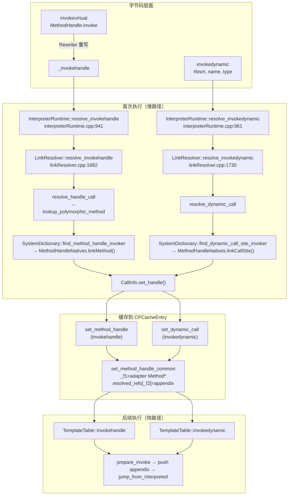
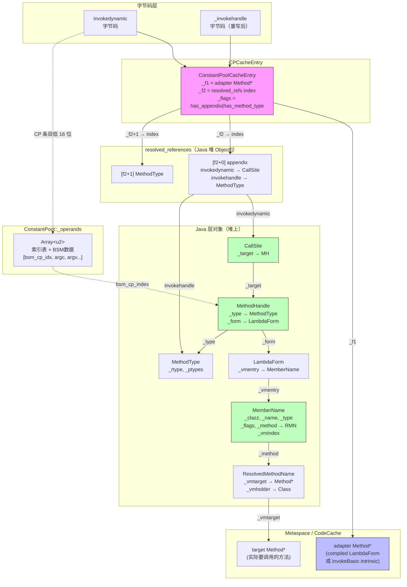

# Day 31：invokedynamic / invokehandle / MethodHandle 深度剖析

> **纯源码分析**，基于 OpenJDK 11 slowdebug，`-Xms8g -Xmx8g -XX:+UseG1GC -Xint`
>
> **方法论**：程序 = 数据结构 + 算法。先彻底搞清楚涉及的所有数据结构，再分析算法流程。

---

## 第 0 部分：核心原理 ⭐

### 0.1 本质是什么？

本文深入分析 **Day 31：invokedynamic / invokehandle / MethodHandle 深度剖析**：从源码角度理解其设计原理、实现机制和关键细节。

### 0.2 为什么需要？

理解 JVM 内部实现是排查复杂问题、进行性能优化的基础。表面的 API 文档无法解释 JVM 的实际行为，只有深入源码才能建立精确的心智模型。

### 0.3 怎么解决？

结合源码阅读、数据结构分析和 GDB 运行时验证，从多个角度建立对该机制的完整理解。

### 0.4 为什么这样设计？

每个设计决策都有其权衡：性能 vs 正确性、简单性 vs 灵活性、内存占用 vs 查找速度。理解这些权衡是理解 JVM 设计的关键。

---


## 一、宏观理解

### 1.1 解决什么问题

Java 有两种"晚绑定"的方法调用机制：

1. **invokehandle**（`Bytecodes::_invokehandle`）：调用 `MethodHandle.invoke()` / `MethodHandle.invokeExact()` 等**签名多态方法**。这些方法的签名在编译期由调用点决定，而不是由声明决定——`invoke(String, int)` 和 `invoke(Object)` 是同一个方法，但签名不同。JVM 需要在运行时为每个调用点生成一个**适配器方法**（adapter Method*），把类型擦除后的调用桥接到实际的目标方法。

2. **invokedynamic**（`Bytecodes::_invokedynamic`）：完全由用户自定义链接逻辑的调用指令。字节码中不直接指定目标方法，而是指定一个 **bootstrap method**（BSM），由 BSM 在运行时返回一个 `CallSite` 对象，`CallSite` 内部持有一个 `MethodHandle` 指向实际目标。典型应用：lambda 表达式（`LambdaMetafactory`）、字符串拼接（`StringConcatFactory`）。

**核心挑战**：这两种指令的目标方法在类加载时完全未知，必须在运行时通过 **Java 层代码**（`MethodHandleNatives.linkMethod` / `MethodHandleNatives.linkCallSite`）来确定。解析完成后，结果缓存在 `ConstantPoolCacheEntry` 中，后续执行走快速路径。

### 1.2 invokehandle 的来源：字节码重写

`invokehandle` 不是 Java 编译器直接生成的字节码。Java 源码中的 `mh.invoke(...)` 编译为 `invokevirtual MethodHandle.invoke`。在类加载时，**Rewriter** 检测到目标是签名多态方法，将 `invokevirtual` **重写**为内部字节码 `_invokehandle`：

```
javac 输出：invokevirtual MethodHandle.invoke(String)Object
                    ↓ Rewriter::maybe_rewrite_invokehandle()
JVM 内部：  _invokehandle  <same cpCache index>
```

**为什么要重写**？因为签名多态方法需要传递一个额外的 `appendix` 参数（通常是 `MethodType`），让适配器方法知道调用点的实际类型签名。`invokevirtual` 模板没有 appendix 推入逻辑，而 `_invokehandle` 模板有。

### 1.3 总体调用链



### 1.4 涉及的数据结构清单

| 数据结构 | 角色 | 定义位置 |
|---------|------|----------|
| `java_lang_invoke_MethodHandle` | Java 层 MethodHandle 的 C++ 映射 | `javaClasses.hpp:995` |
| `java_lang_invoke_DirectMethodHandle` | DirectMethodHandle 的 C++ 映射 | `javaClasses.hpp:1027` |
| `java_lang_invoke_LambdaForm` | LambdaForm 的 C++ 映射 | `javaClasses.hpp:1054` |
| `java_lang_invoke_MemberName` | MemberName 的 C++ 映射（含 VM 注入字段） | `javaClasses.hpp:1110` |
| `java_lang_invoke_ResolvedMethodName` | ResolvedMethodName 的 C++ 映射（含 vmtarget） | `javaClasses.hpp:1084` |
| `java_lang_invoke_MethodType` | MethodType 的 C++ 映射 | `javaClasses.hpp:1190` |
| `java_lang_invoke_CallSite` | CallSite 的 C++ 映射 | `javaClasses.hpp:1226` |
| `ConstantPool::_operands` | bootstrap method 参数存储 | `constantPool.hpp:109` |
| `ConstantPoolCacheEntry`（MH/indy 模式） | 解析结果缓存 | `cpCache.hpp:132` |
| `CallInfo`（set_handle 模式） | 解析过程中的中间结果 | `linkResolver.hpp:38` |

---

## 二、数据结构全景

### 2.1 Java 层 MethodHandle 对象族

invokedynamic/invokehandle 的核心设计是：**JVM 通过 Java 层代码完成链接**。因此必须理解 Java 层几个关键对象在 C++ 侧的映射。

#### 2.1.1 java_lang_invoke_MethodHandle（2 个字段）

```
定义：javaClasses.hpp:995
映射的 Java 类：java.lang.invoke.MethodHandle
```

| 偏移字段 | 类型 | 含义 |
|---------|------|------|
| `_type_offset` | oop（MethodType） | 此 MH 的方法签名类型 |
| `_form_offset` | oop（LambdaForm） | 此 MH 的执行计划（LambdaForm） |

**核心作用**：MethodHandle 是"方法的引用"，但它本身不直接持有 Method*。真正的执行逻辑封装在 `LambdaForm` 中。

**调用链路**：`MH._form` → `LambdaForm._vmentry` → `MemberName._method` → `ResolvedMethodName._vmtarget` → `Method*`

这就是 `jump_to_lambda_form`（methodHandles_x86.cpp:157）的 4 次解引用路径。

#### 2.1.2 java_lang_invoke_DirectMethodHandle（1 个字段）

```
定义：javaClasses.hpp:1027
映射的 Java 类：java.lang.invoke.DirectMethodHandle（MethodHandle 的子类）
```

| 偏移字段 | 类型 | 含义 |
|---------|------|------|
| `_member_offset` | oop（MemberName） | 直接指向的目标方法 |

**核心作用**：最简单的 MH 形式——直接指向一个具体方法。大多数 lambda 表达式最终产生的就是 DirectMethodHandle。

#### 2.1.3 java_lang_invoke_LambdaForm（1 个字段）

```
定义：javaClasses.hpp:1054
映射的 Java 类：java.lang.invoke.LambdaForm
```

| 偏移字段 | 类型 | 含义 |
|---------|------|------|
| `_vmentry_offset` | oop（MemberName） | VM 入口——指向编译后的适配器方法 |

**核心作用**：LambdaForm 是 MethodHandle 的"执行计划"。Java 层会把复杂的 MH 组合（filter、collect、spread 等）编译成一个 LambdaForm，然后通过 `_vmentry`（MemberName）指向最终要调用的 VM 适配器。

#### 2.1.4 java_lang_invoke_MemberName（6 个字段，含 1 个 VM 注入）

```
定义：javaClasses.hpp:1110
映射的 Java 类：java.lang.invoke.MemberName
```

| 偏移字段 | 类型 | 含义 |
|---------|------|------|
| `_clazz_offset` | oop（Class） | 方法/字段所属的类 |
| `_name_offset` | oop（String） | 方法/字段名 |
| `_type_offset` | oop（Object） | 类型（MethodType 或 Class） |
| `_flags_offset` | int | 标志位（见下方枚举） |
| `_method_offset` | oop（ResolvedMethodName） | 指向已解析的方法名 |
| `_vmindex_offset` | intptr_t | **VM 注入**：vtable/itable 索引 |

**flags 枚举**（与 `MethodHandleNatives.Constants` 同步）：

| 常量 | 值 | 含义 |
|------|------|------|
| `MN_IS_METHOD` | `0x00010000` | 这是一个方法 |
| `MN_IS_CONSTRUCTOR` | `0x00020000` | 这是一个构造器 |
| `MN_IS_FIELD` | `0x00040000` | 这是一个字段 |
| `MN_IS_TYPE` | `0x00080000` | 这是一个类型 |
| `MN_CALLER_SENSITIVE` | `0x00100000` | 调用者敏感 |
| `MN_REFERENCE_KIND_SHIFT` | `24` | refKind 在 flags 中的位移 |
| `MN_REFERENCE_KIND_MASK` | `0x0F` | refKind 掩码（4 bit） |

**vmtarget 的间接解引用**（javaClasses.cpp:3757）：
```cpp
Method* java_lang_invoke_MemberName::vmtarget(oop mname) {
    oop method = mname->obj_field(_method_offset);  // 先取 ResolvedMethodName
    return method == NULL ? NULL : java_lang_invoke_ResolvedMethodName::vmtarget(method);
}
```

**核心作用**：MemberName 是 Java 层和 VM 层之间的桥梁——Java 层通过它描述一个方法/字段/类型，VM 层通过 `_vmtarget`（Method*）和 `_vmindex`（vtable index）直接定位到 C++ 内部结构。

#### 2.1.5 java_lang_invoke_ResolvedMethodName（2 个 VM 注入字段）

```
定义：javaClasses.hpp:1084
映射的 Java 类：java.lang.invoke.ResolvedMethodName
```

| 偏移字段 | 类型 | 含义 |
|---------|------|------|
| `_vmtarget_offset` | intptr_t（实际是 Method*） | **VM 注入**：指向 HotSpot Method* |
| `_vmholder_offset` | oop（Class） | **VM 注入**：持有者类的 mirror（防 GC） |

**为什么需要 vmholder**？Method* 是 Metaspace 中的对象，不受 GC 管理。但如果持有 Method* 的类被卸载，Method* 就变成悬空指针。`_vmholder` 持有类的 `java.lang.Class` 对象，间接阻止类被卸载（只要 MemberName 可达）。

#### 2.1.6 java_lang_invoke_MethodType（2 个字段）

```
定义：javaClasses.hpp:1190
映射的 Java 类：java.lang.invoke.MethodType
```

| 偏移字段 | 类型 | 含义 |
|---------|------|------|
| `_rtype_offset` | oop（Class） | 返回类型 |
| `_ptypes_offset` | oop（Class[]） | 参数类型数组 |

**核心作用**：MethodType 是方法签名的对象化表示。invokehandle 需要把 MethodType 作为 appendix 传递给适配器方法，以便在运行时做类型检查。

#### 2.1.7 java_lang_invoke_CallSite（2 个字段）

```
定义：javaClasses.hpp:1226
映射的 Java 类：java.lang.invoke.CallSite
```

| 偏移字段 | 类型 | 含义 |
|---------|------|------|
| `_target_offset` | oop（MethodHandle） | 当前绑定的目标 MH |
| `_context_offset` | oop（CallSiteContext） | 依赖上下文（用于去优化） |

**核心作用**：invokedynamic 的 bootstrap method 返回一个 CallSite，CallSite 内部通过 `_target` 指向实际的 MethodHandle。对于 `MutableCallSite`，target 可以在运行时更改；对于 `ConstantCallSite`，target 是不可变的。

**CallSite 作为 appendix**：解析完成后，CallSite 对象作为 `appendix` 存入 `resolved_references` 数组。每次 invokedynamic 执行时，模板解释器把 appendix 推入参数栈，适配器方法（`MH.linkToCallSite`）从 CallSite 中取出当前 target 来调用。

### 2.2 ConstantPool::_operands — bootstrap method 参数存储

#### 2.2.1 解决什么问题

`CONSTANT_InvokeDynamic` 常量池条目引用一个 bootstrap method specifier，其中包含 BSM 的方法句柄和 0~N 个静态参数。这些信息在 `.class` 文件的 `BootstrapMethods` 属性中，类加载后需要一个高效的数据结构来存储和查询。

#### 2.2.2 存储结构

`_operands` 是一个 `Array<u2>*`，分为**两部分**：

```
_operands 数组布局（Array<u2>）
┌───────────────────────────────────────────────────────────────┐
│ 第一部分：索引表（每个 BSM 占 2 个 u2 = 1 个 32-bit offset）   │
│                                                               │
│   [0,1]  → BSM#0 在第二部分的 offset                          │
│   [2,3]  → BSM#1 在第二部分的 offset                          │
│   [4,5]  → BSM#2 在第二部分的 offset                          │
│   ...                                                         │
├───────────────────────────────────────────────────────────────┤
│ 第二部分：每个 BSM 的具体数据                                   │
│                                                               │
│   BSM#0: [bsm_cp_index, argc, argv[0], argv[1], ...]         │
│   BSM#1: [bsm_cp_index, argc, argv[0], ...]                  │
│   ...                                                         │
└───────────────────────────────────────────────────────────────┘
```

每个 BSM 条目的内部布局（`constantPool.hpp:596-601`）：

```cpp
enum {
    _indy_bsm_offset  = 0,  // CONSTANT_MethodHandle bsm 的 CP 索引
    _indy_argc_offset = 1,  // u2 argc（静态参数数量）
    _indy_argv_offset = 2   // u2 argv[argc]（每个参数的 CP 索引）
};
```

#### 2.2.3 CONSTANT_InvokeDynamic 条目格式

常量池中的 `CONSTANT_InvokeDynamic` 条目存储为一个 32-bit 整数（`constantPool.hpp:297`）：

```
高 16 位 = name_and_type_index（方法名+签名的 NameAndType 索引）
低 16 位 = bootstrap_specifier_index（_operands 索引表中的下标）
```

**查询链路**：
```
CP[which] → 低 16 位 → bootstrap_specifier_index
         → operands[bsi*2, bsi*2+1] → offset 进入第二部分
         → operands[offset + 0] = bsm_cp_index
         → operands[offset + 1] = argc
         → operands[offset + 2..2+argc-1] = argv[]
```

### 2.3 invokedynamic 索引编码

#### 2.3.1 解决什么问题

invokedynamic 的 cpCache 索引需要与普通 invoke 指令的索引区分开。普通 invoke 使用正整数索引，invokedynamic 使用**按位取反的负数索引**。

#### 2.3.2 编解码

```cpp
// constantPool.hpp:241-243
static bool is_invokedynamic_index(int i)     { return (i < 0); }
static int  decode_invokedynamic_index(int i)  { return ~i; }     // ~(-1) = 0, ~(-2) = 1, ...
static int  encode_invokedynamic_index(int i)  { return ~i; }     // ~0 = -1, ~1 = -2, ...
```

汇编层面（interp_masm_x86.cpp:447）：一条 `notl(index)` 指令完成解码。

#### 2.3.3 为什么 invokedynamic 用 u4 而不是 u2

- 普通 invoke 指令的字节码格式是 `invoke<X> <u2 index>`，其中 u2 索引在 Rewriter 阶段从 CP index 改写为 cpCache index。
- invokedynamic 的字节码格式是 `invokedynamic <u2 index> <u2 padding>`，Rewriter 把 4 字节全部改写为一个 native u4，存储编码后的 cpCache index（负数取反后可能超过 u2 范围）。
- 更重要的是：同一个 `CONSTANT_InvokeDynamic` 可以被多条 invokedynamic 指令引用，**每条都有自己独立的 cpCache 条目**。所以 invokedynamic 的 cpCache 条目是在 Rewriter 第二遍（`scan_method`）按遇到的顺序动态追加的，而不是第一遍（`compute_index_maps`）预分配的。

### 2.4 ConstantPoolCacheEntry — invokedynamic/invokehandle 模式

Day 29/30 已分析了 CPCacheEntry 的通用结构。这里只关注 **invokedynamic 和 invokehandle 特有的语义**。

#### 2.4.1 字段含义（MH/indy 模式下）

| 字段 | 含义 |
|------|------|
| `_indices` | 低 16 位 = 原始 CP index（回指 `CONSTANT_InvokeDynamic`） |
| `_f1` | **adapter Method***（编译后的 LambdaForm 方法，如 `MH.linkToCallSite` 或 `MH.invokeBasic`） |
| `_f2` | **resolved_references 数组中的索引**（指向 appendix 和 MethodType 的存储位置） |
| `_flags` | `has_appendix` \| `has_method_type` \| `is_final` \| TosState \| parameter_size |

#### 2.4.2 resolved_references 中的两个槽位

```cpp
// cpCache.hpp:298-302
enum {
    _indy_resolved_references_appendix_offset    = 0,
    _indy_resolved_references_method_type_offset = 1,
    _indy_resolved_references_entries             = 2   // 每个 indy/handle 占 2 个槽
};
```

```
resolved_references 数组（Java 堆中的 Object[]）
┌─────────────────────────────────────────────────────────┐
│ ... 其他条目 (String interning, etc.) ...                │
├─────────────────────────────────────────────────────────┤
│ [f2 + 0] = appendix                                     │
│   invokedynamic → CallSite 对象                         │
│   invokehandle  → MethodType 对象                       │
├─────────────────────────────────────────────────────────┤
│ [f2 + 1] = MethodType                                   │
│   两者都存储调用点的 MethodType                          │
└─────────────────────────────────────────────────────────┘
```

#### 2.4.3 flags 位布局中的关键位

| 位 | 名称 | 含义 |
|----|------|------|
| bit 25 | `has_method_type` | 是否有 MethodType（MH/indy 都有） |
| bit 24 | `has_appendix` | 是否有 appendix（MH/indy 都有） |
| bit 20 | `is_final` | MH/indy 总是设为 1（因为 adapter 是确定的） |
| bit 19 | `indy_resolution_failed` | invokedynamic 解析是否失败过 |

#### 2.4.4 appendix_if_resolved / method_type_if_resolved

```cpp
// cpCache.cpp:544-559
oop ConstantPoolCacheEntry::appendix_if_resolved(const constantPoolHandle& cpool) {
    if (!has_appendix()) return NULL;
    const int ref_index = f2_as_index() + _indy_resolved_references_appendix_offset;  // f2 + 0
    objArrayOop resolved_references = cpool->resolved_references();
    return resolved_references->obj_at(ref_index);
}

oop ConstantPoolCacheEntry::method_type_if_resolved(const constantPoolHandle& cpool) {
    if (!has_method_type()) return NULL;
    const int ref_index = f2_as_index() + _indy_resolved_references_method_type_offset;  // f2 + 1
    objArrayOop resolved_references = cpool->resolved_references();
    return resolved_references->obj_at(ref_index);
}
```

### 2.5 CallInfo — set_handle 模式

Day 30 分析了 `set_static` / `set_virtual` / `set_interface` 三种模式。invokedynamic/invokehandle 使用第四种：`set_handle`。

```cpp
// linkResolver.cpp:96-117
void CallInfo::set_handle(Klass* resolved_klass,
                          const methodHandle& resolved_method,
                          Handle resolved_appendix,
                          Handle resolved_method_type, TRAPS) {
    if (resolved_method.is_null()) {
        THROW_MSG(vmSymbols::java_lang_InternalError(), "resolved method is null");
    }
    assert(resolved_method->intrinsic_id() == vmIntrinsics::_invokeBasic ||
           resolved_method->is_compiled_lambda_form(),
           "linkMethod must return one of these");
    int vtable_index = Method::nonvirtual_vtable_index;  // -2，直接调用
    set_common(resolved_klass, resolved_klass, resolved_method, resolved_method,
               CallInfo::direct_call, vtable_index, CHECK);
    _resolved_appendix    = resolved_appendix;
    _resolved_method_type = resolved_method_type;
}
```

**关键点**：
- `call_kind` 固定为 `direct_call`（因为 adapter 方法是确定的）
- `vtable_index` 固定为 `-2`（nonvirtual）
- `resolved_method` 必须是 `invokeBasic` intrinsic 或 compiled lambda form
- `resolved_klass == selected_klass == MethodHandle.class`
- 额外设置 `_resolved_appendix` 和 `_resolved_method_type`

### 2.6 MethodHandle 签名多态方法入口点

#### 2.6.1 解决什么问题

`MethodHandle.invokeBasic`、`MethodHandle.linkToVirtual` 等签名多态方法不是普通 Java 方法——它们的签名是"任意的"（参数数量和类型由调用点决定）。JVM 不能为它们生成普通的解释器入口，而是为每个变体生成一个专用的**汇编 stub**。

#### 2.6.2 入口点种类（AbstractInterpreter::MethodKind）

```cpp
// abstractInterpreter.hpp:59-70
enum MethodKind {
    // ...
    method_handle_invoke_FIRST,
    method_handle_invoke_LAST = (method_handle_invoke_FIRST
                                 + (vmIntrinsics::LAST_MH_SIG_POLY
                                    - vmIntrinsics::FIRST_MH_SIG_POLY)),
    // ...
};
```

这覆盖了所有签名多态方法的 intrinsic ID：

| vmIntrinsics::ID | 对应的 Java 方法 | 行为 |
|------------------|-----------------|------|
| `_invokeBasic` | `MethodHandle.invokeBasic(...)` | 通过 LambdaForm 链调用 |
| `_linkToVirtual` | `MethodHandle.linkToVirtual(...)` | 查 vtable 调用 |
| `_linkToStatic` | `MethodHandle.linkToStatic(...)` | 直接调用 |
| `_linkToSpecial` | `MethodHandle.linkToSpecial(...)` | 直接调用 |
| `_linkToInterface` | `MethodHandle.linkToInterface(...)` | 查 itable 调用 |
| `_invokeGeneric` | `MethodHandle.invoke(...)` / `invokeExact(...)` | 需要类型检查的调用 |

#### 2.6.3 入口点的生成时机

分两步：

1. **初始化阶段**（`AbstractInterpreter::initialize_method_handle_entries`）：所有 MH 入口先设为 `abstract`（会抛 AbstractMethodError）。
2. **延迟生成**（`MethodHandlesAdapterGenerator::generate`，methodHandles.cpp:91）：在 `MethodHandleNatives` 类初始化时，真正生成每个入口的汇编代码，通过 `set_entry_for_kind` 回写到 `_entry_table`。

---

## 三、算法流程分析

### 3.1 Rewriter 阶段：invokehandle 字节码重写

#### 解决什么问题

Java 编译器输出的 `invokevirtual MethodHandle.invoke(...)` 不能走普通的 invokevirtual 路径，因为签名多态方法需要额外的 appendix 参数。Rewriter 在类加载时识别这类调用并重写为 `_invokehandle`。

#### 算法流程（rewriter.cpp:209-253）

```
maybe_rewrite_invokehandle(opc, cp_index, cache_index, reverse=false):
  1. 检查原始字节码是 _invokevirtual 或 _invokespecial
  2. 查 _method_handle_invokers 三态缓存（0=未检查, +1=是, -1=否）
  3. 如果 status == 0（首次检查）：
     a. 检查 klass_ref 是否为 MethodHandle 或 VarHandle
     b. 检查方法名是否是签名多态名（invoke/invokeExact/...）
     c. 如果是 → status = +1，分配 resolved_references 槽位
     d. 如果否 → status = -1
  4. 如果 status > 0 → 把字节码改写为 _invokehandle
```

**同时**：为这个 cpCache 条目分配 2 个 `resolved_references` 槽位（存 appendix + MethodType）。

### 3.2 Rewriter 阶段：invokedynamic 字节码重写

#### 解决什么问题

invokedynamic 字节码需要：(1) 分配独立的 cpCache 条目（每条指令一个，即使引用相同的 `CONSTANT_InvokeDynamic`），(2) 将 2 字节 CP 索引替换为 4 字节编码索引。

#### 算法流程（rewriter.cpp:256-290）

```
rewrite_invokedynamic(bcp, offset, reverse=false):
  1. 读取 2 字节的原始 CP 索引
  2. add_invokedynamic_cp_cache_entry(cp_index)
     → 追加到 _invokedynamic_cp_cache_map（独立于普通 _cp_cache_map）
     → 返回 cache_index = _first_iteration_cp_cache_limit + 在 indy map 中的位置
  3. add_invokedynamic_resolved_references_entries(cp_index, cache_index)
     → 分配 2 个 resolved_references 槽位
  4. Bytes::put_native_u4(p, encode_invokedynamic_index(cache_index))
     → 4 字节 native 序写入 ~cache_index（负数编码）
  5. 记录到 _patch_invokedynamic_bcps 以备后续修补
```

**关键区别**：普通 invoke 的 cpCache 条目在第一遍（`compute_index_maps`）预分配，invokedynamic 的在第二遍（`scan_method`）按遇到顺序追加。这意味着 indy 条目在 cpCache 中排在普通条目之后。

### 3.3 invokehandle 运行时解析

#### 解决什么问题

`MethodHandle.invoke(args)` 需要在运行时为这个调用点找到一个**适配器方法**，该适配器接受类型擦除后的参数（全是 Object），内部做类型检查和转换，然后调用实际目标。

#### 入口：InterpreterRuntime::resolve_invokehandle（interpreterRuntime.cpp:941-958）

```cpp
void InterpreterRuntime::resolve_invokehandle(JavaThread* thread) {
    CallInfo info;
    constantPoolHandle pool(thread, last_frame.method()->constants());
    LinkResolver::resolve_invoke(info, Handle(), pool,
                                 last_frame.get_index_u2_cpcache(bytecode), bytecode, CHECK);
    ConstantPoolCacheEntry* cp_cache_entry = last_frame.cache_entry();
    cp_cache_entry->set_method_handle(pool, info);
}
```

#### 核心路径：LinkResolver::resolve_handle_call（linkResolver.cpp:1693-1728）

```
resolve_handle_call(result, link_info):
  1. 断言 resolved_klass 是 MethodHandle 或 VarHandle
  2. 断言方法名是签名多态名
  3. 调用 lookup_polymorphic_method(link_info, &appendix, &method_type)
     → 根据 iid 分两条路径：
     
     路径 A：intrinsic（_invokeBasic, _linkTo*）
       → SystemDictionary::find_method_handle_intrinsic(iid, basic_signature)
       → 直接返回 VM 生成的 Method*（不需要 Java 层参与）
     
     路径 B：invokeGeneric（_invoke, _invokeExact 等需要类型检查的）
       → SystemDictionary::find_method_handle_invoker(klass, name, sig, ...)
       → JavaCalls::call_static → MethodHandleNatives.linkMethod(
             accessing_klass, ref_kind=5, MH.class, name, methodType, appendix_box)
       → 返回 MemberName → unpack_method_and_appendix → 得到 adapter Method* + appendix
  
  4. 如果需要访问检查（check_access）：
     a. _invokeBasic → 检查调用者是否有权限
     b. _invokeGeneric → 只需确认是公开的签名多态方法
  5. result.set_handle(resolved_klass, resolved_method, appendix, method_type)
```

**invokehandle 走的是路径 B**（因为原始字节码是 `invokevirtual MethodHandle.invoke`，iid = `_invokeGeneric`）。

#### Java 层调用：MethodHandleNatives.linkMethod

```
SystemDictionary::find_method_handle_invoker（systemDictionary.cpp:2472-2512）:
  1. 构造 method_type = find_method_handle_type(signature, accessing_klass)
  2. 构造参数：(accessing_klass.mirror, ref_kind=5, MH.class.mirror, name_str, method_type, appendix_box)
  3. JavaCalls::call_static → MethodHandleNatives.linkMethod(...)
  4. 返回 MemberName → unpack_method_and_appendix
     → Method* adapter = MemberName.vmtarget（通常是 compiled LambdaForm）
     → appendix = appendix_box[0]（通常是 MethodType 对象）
```

### 3.4 invokedynamic 运行时解析

#### 解决什么问题

invokedynamic 指令没有预定义的目标方法。它只有一个 bootstrap method specifier——需要在运行时调用 BSM，让 BSM 返回一个 CallSite，然后从 CallSite 中提取 MethodHandle 作为目标。

#### 入口：InterpreterRuntime::resolve_invokedynamic（interpreterRuntime.cpp:961-981）

```cpp
void InterpreterRuntime::resolve_invokedynamic(JavaThread* thread) {
    CallInfo info;
    constantPoolHandle pool(thread, last_frame.method()->constants());
    int index = last_frame.get_index_u4(bytecode);  // ★ u4 索引（不是 u2）
    LinkResolver::resolve_invoke(info, Handle(), pool, index, bytecode, CHECK);
    ConstantPoolCacheEntry* cp_cache_entry = pool->invokedynamic_cp_cache_entry_at(index);
    cp_cache_entry->set_dynamic_call(pool, info);   // ★ set_dynamic_call 不是 set_method_handle
}
```

#### 核心路径：LinkResolver::resolve_invokedynamic（linkResolver.cpp:1730-1804）

这是整个 invokedynamic 机制中最复杂的函数，需要处理并发、失败缓存、快速返回等场景：

```
resolve_invokedynamic(result, pool, index):
  1. 获取基本信息
     method_name = pool->name_ref_at(index)
     method_signature = pool->signature_ref_at(index)
     cpce = pool->invokedynamic_cp_cache_entry_at(index)
     pool_index = cpce->constant_pool_index()

  2. 快速检查：如果 cpce->is_f1_null() == false
     → 另一个线程已完成解析
     → 直接读取 cpce 中的 method/appendix/method_type
     → result.set_handle(method, appendix, method_type)
     → 返回

  3. 如果 cpce->is_f1_null() == true（尚未解析）：
     a. 检查是否已失败过 (indy_resolution_failed)
        → 如果是，直接抛出之前记录的异常
     
     b. 解析 bootstrap specifier：
        bsm_info = pool->resolve_bootstrap_specifier_at(pool_index)
        → 解析 CONSTANT_MethodHandle 得到 bsm oop（MethodHandle）
        → 解析静态参数（push 或 pull 模式）
        → 返回 bsm_info（MethodHandle 或 {MethodHandle, info} 数组）
     
     c. 再次检查 is_f1_null（另一个线程可能已在 b 期间完成）
        → 如果非 null，用已缓存的结果，返回
     
     d. 调用 resolve_dynamic_call(result, pool_index, bootstrap_specifier, name, sig, klass)
        → SystemDictionary::find_dynamic_call_site_invoker(...)
          → 解包 bsm 和 info
          → JavaCalls::call_static → MethodHandleNatives.linkCallSite(
                caller, indy_index, bsm, name, mtype, info, appendix_box)
          → 返回 MemberName → unpack_method_and_appendix
             → Method* adapter（通常是 MH.linkToCallSite）
             → appendix（通常是 CallSite 对象）
  
  4. 异常处理：如果 resolve_dynamic_call 抛出 LinkageError
     → cpce->save_and_throw_indy_exc(...)
     → 设置 indy_resolution_failed 标志
     → 后续线程遇到此 cpce 时直接抛出相同异常
```

#### Bootstrap Specifier 解析：resolve_bootstrap_specifier_at_impl

```
resolve_bootstrap_specifier_at_impl(pool, index)（constantPool.cpp:1114-1224）:
  1. bsm_index = invoke_dynamic_bootstrap_method_ref_index_at(index)
     → 从 _operands 获取 BSM 的 CP 索引
  2. bsm_oop = resolve_possibly_cached_constant_at(bsm_index)
     → 解析为 java.lang.invoke.MethodHandle 对象
  3. argc = invoke_dynamic_argument_count_at(index)
  4. 如果 argc == 0 → 直接返回 bsm_oop
  5. 如果 argc > 0：
     a. 决定 push/pull 模式（UseBootstrapCallInfo 标志 + 参数情况）
     b. Push 模式：立即解析所有参数 → info = Object[]
     c. Pull 模式：info = int[]{argc, pool_index}，让 JDK 代码按需拉取
     d. 返回 Object[]{bsm, info}
```

### 3.5 CPCacheEntry 填充：set_method_handle_common

#### 解决什么问题

解析完成后，需要把 adapter Method*、appendix、MethodType 安全地写入 CPCacheEntry。多线程可能同时解析同一个 invokedynamic 调用点，需要正确的同步。

#### 算法流程（cpCache.cpp:350-461）

```
set_method_handle_common(cpool, invoke_code, call_info):
  1. 获取 resolved_references 数组，用它作为锁对象
     → ObjectLocker ol(resolved_references, ...)
  
  2. 双重检查：if (!is_f1_null()) return;
     → 另一个线程已完成
  
  3. 检查 indy_resolution_failed → 如果为 true，抛出已记录的异常
  
  4. 从 CallInfo 提取三元组：
     adapter    = call_info.resolved_method()    // Method*
     appendix   = call_info.resolved_appendix()  // oop（CallSite 或 MethodType）
     method_type = call_info.resolved_method_type() // oop（MethodType）
  
  5. 写入 flags（is_final=1, has_appendix, has_method_type, parameter_size）
  
  6. 存储 appendix → resolved_references[f2 + 0]
  
  7. 存储 method_type → resolved_references[f2 + 1]
  
  8. ★ release_set_f1(adapter()) — 必须最后写入！
     → f1 的非 null 是其他线程判断"已解析"的标志
     → release 语义保证 flags/appendix/method_type 对其他线程可见
  
  9. set_bytecode_1(invoke_code) — 设置 bytecode_1 为 _invokehandle 或 _invokedynamic
```

**并发安全设计**：
- **写入顺序**：flags → resolved_references → f1（f1 最后写，充当 release barrier）
- **读取顺序**：先检查 f1 非 null，再读其他字段（f1 的 acquire load 保证可见性）
- **锁保护**：使用 resolved_references 数组对象作为 Java monitor，防止两个线程同时写入
- **失败记录**：`indy_resolution_failed` 标志保证失败只触发一次 BSM 调用

### 3.6 模板解释器快路径

#### 3.6.1 invokehandle 模板（templateTable_x86.cpp:3939-3962）

```asm
invokehandle(f1_byte):
  prepare_invoke(f1_byte, rbx_method, rax_mtype, rcx_recv)
    → load_invoke_cp_cache_entry(f1_byte, rbx←_f1, rax←_f2, rdx←_flags, is_invokedynamic=false)
       // rbx = adapter Method*, rax = resolved_refs index, rdx = flags
    → 如果 has_appendix 标志位 = 1：
       push_appendix:
         用 rax (= _f2) 从 resolved_references 加载 appendix
         推入参数栈（作为尾部参数）
    → 加载 receiver 到 rcx
  null_check(rcx_recv)       // MethodHandle receiver 不能为 null
  profile_final_call          // 因为 is_final=1
  jump_from_interpreted(rbx_method)  // 跳转到 adapter Method* 的解释器入口
```

#### 3.6.2 invokedynamic 模板（templateTable_x86.cpp:3964-3986）

```asm
invokedynamic(f1_byte):
  prepare_invoke(f1_byte, rbx_method, rax_callsite)
    → load_invoke_cp_cache_entry(f1_byte, rbx←_f1, rax←_f2, rdx←_flags, is_invokedynamic=true)
       // ★ index_size = sizeof(u4)，使用 notl(index) 解码负数索引
       // rbx = adapter Method*, rax = resolved_refs index, rdx = flags
    → 如果 has_appendix 标志位 = 1：
       从 resolved_references[rax] 加载 CallSite appendix
       推入参数栈
  profile_call
  jump_from_interpreted(rbx_method)  // 跳转到 adapter Method*
```

**invokehandle vs invokedynamic 模板的区别**：

| 特征 | invokehandle | invokedynamic |
|------|-------------|---------------|
| 索引大小 | u2 | u4（带 notl 解码） |
| 有 receiver | 是（MethodHandle 对象） | 否（无 receiver） |
| null_check | 是 | 否 |
| profile 类型 | profile_final_call | profile_call |
| appendix 含义 | MethodType | CallSite |

#### 3.6.3 adapter Method* 的执行：invokeBasic → jump_to_lambda_form

当 adapter Method* 是 `MH.invokeBasic` intrinsic 时，它的解释器入口走 `generate_method_handle_interpreter_entry`（methodHandles_x86.cpp:203-290），核心是 `jump_to_lambda_form`：

```asm
jump_to_lambda_form(recv=rcx_mh, method_temp, temp2):
  // 4 次堆上解引用：MH → LambdaForm → MemberName → ResolvedMethodName → Method*
  load_heap_oop(method_temp, [rcx_mh + MH::form_offset])           // MH.form → LambdaForm
  load_heap_oop(method_temp, [method_temp + LF::vmentry_offset])   // LF.vmentry → MemberName
  load_heap_oop(method_temp, [method_temp + MN::method_offset])    // MN.method → ResolvedMethodName
  load_at(T_ADDRESS, [method_temp + RMN::vmtarget_offset])         // RMN.vmtarget → Method*
  jump_from_method_handle(method_temp)                              // jmp [Method* + from_interpreted_offset]
```

#### 3.6.4 linkTo* 系列的执行

当 adapter 是 `MH.linkToVirtual` / `linkToStatic` / `linkToSpecial` / `linkToInterface` 时：

```asm
generate_method_handle_dispatch(_masm, iid, rcx_recv, rbx_member):
  case _linkToVirtual:
    // rbx_member = 参数栈末尾弹出的 MemberName
    load MemberName.vmindex → rbx (vtable index)
    load receiver → rcx_recv
    lookup_virtual_method(rcx_recv.klass, rbx)  // mov rbx, [klass + vtable_start + rbx*8]
    jump_from_method_handle(rbx)

  case _linkToStatic / _linkToSpecial:
    load MemberName.method.vmtarget → rbx (Method*)
    jump_from_method_handle(rbx)

  case _linkToInterface:
    load MemberName.clazz → interface Klass*
    load MemberName.vmindex → itable index
    lookup_interface_method(recv_klass, interface, itable_index)  // O(n) 线性扫描
    jump_from_method_handle(rbx)
```

---

## 四、数据结构关系图



---

## 五、invokehandle vs invokedynamic 对比总结

| 维度 | invokehandle | invokedynamic |
|------|-------------|---------------|
| **来源** | Rewriter 从 `invokevirtual MH.invoke` 重写 | Java 编译器直接生成 |
| **字节码格式** | `_invokehandle <u2>` | `invokedynamic <u4>` |
| **索引编码** | 正常 cpCache 索引 | 按位取反的负数索引 |
| **cpCache 分配时机** | 第一遍（compute_index_maps） | 第二遍（scan_method），动态追加 |
| **多条指令共享** | 共享 cpCache 条目（同一 CP 索引） | 每条独立条目（即使 CP 索引相同） |
| **有 receiver** | 是（MethodHandle 对象） | 否 |
| **Java 层链接入口** | `MethodHandleNatives.linkMethod` | `MethodHandleNatives.linkCallSite` |
| **appendix** | MethodType（调用点签名） | CallSite（绑定的调用站点） |
| **adapter** | `invokeBasic` intrinsic / compiled LF | `linkToCallSite` / compiled LF |
| **CPCacheEntry 写入** | `set_method_handle` | `set_dynamic_call` |
| **失败缓存** | 无特殊处理 | `indy_resolution_failed` 标志 |
| **并发处理** | 通过 resolved_refs 锁 | 通过 resolved_refs 锁 + 二次检查 + 失败记录 |

---

## 六、总结

### 数据结构层面

1. **7 个 Java 层映射类**（MethodHandle、DirectMethodHandle、LambdaForm、MemberName、ResolvedMethodName、MethodType、CallSite）构成完整的"方法引用"对象图。核心链路是 `MH → LF → MN → RMN → Method*`（4 次堆上解引用）。

2. **MemberName 是 Java/VM 桥梁**：Java 层通过 `_clazz/_name/_type/_flags` 描述方法，VM 层通过注入的 `_vmtarget`（Method*）和 `_vmindex`（vtable/itable index）直接定位 C++ 内部结构。

3. **ConstantPool::_operands** 是一个两段式 `Array<u2>`——前段是索引表，后段是每个 BSM 的数据包（bsm_cp_index + argc + argv[]）。

4. **CPCacheEntry 的 MH/indy 模式**复用了 `_f1`（adapter Method*）和 `_f2`（resolved_references 索引），加上 `has_appendix` / `has_method_type` 两个标志位来控制 appendix 和 MethodType 的存取。

5. **invokedynamic 索引用按位取反编码**（`~index`），一条 `notl` 指令解码，与正数 cpCache 索引天然区分。

### 算法层面

1. **invokehandle 的来源不是编译器，而是 Rewriter**：`invokevirtual MethodHandle.invoke` → `_invokehandle`。重写的原因是需要额外推入 appendix 参数。

2. **两种指令最终都通过 Java 层完成链接**：invokehandle 调 `linkMethod`，invokedynamic 调 `linkCallSite`。Java 层返回 MemberName + appendix，C++ 层通过 `unpack_method_and_appendix` 提取 Method* 和 appendix。

3. **set_method_handle_common 的写入顺序是并发安全的关键**：flags → resolved_refs → f1（release）。f1 的 release store 保证之前的写对读取方可见；读取方先 acquire load f1，非 null 才读其他字段。

4. **invokedynamic 有三层并发防护**：(a) resolved_refs 对象锁防并行写入，(b) 双重检查 is_f1_null 防重复解析，(c) indy_resolution_failed 标志防重复调用失败的 BSM。

5. **模板解释器快路径只有几条指令**：从 cpCache 加载 adapter Method* 和 flags → 检查 has_appendix → 从 resolved_references 加载并推入 appendix → jump_from_interpreted。invokehandle 多一步 null_check（receiver）。

6. **签名多态方法的入口点是汇编 stub**：`invokeBasic` 通过 `jump_to_lambda_form`（4 次解引用）到达目标；`linkTo*` 系列通过 MemberName.vmindex 查 vtable/itable 到达目标。

---

> **JVM 日志参数**：
> - `-XX:+TraceMethodHandles`：打印所有 MethodHandle 相关的解析和调用信息
> - `-XX:+TraceInvokeDynamic`：打印 invokedynamic 的 BSM 调用和 cpCache 填充信息
> 
> 示例输出（`-XX:+TraceMethodHandles`）：
> ```
> resolve_invokehandle invokeExact (Ljava/lang/String;)Ljava/lang/Object;
> lookup_polymorphic_method iid=_invokeGeneric java.lang.invoke.MethodHandle.invokeExact(Ljava/lang/String;)Ljava/lang/Object;
> lookup_polymorphic_method => (via Java) {method} ... java.lang.invoke.LambdaForm$MH ...
> ```
