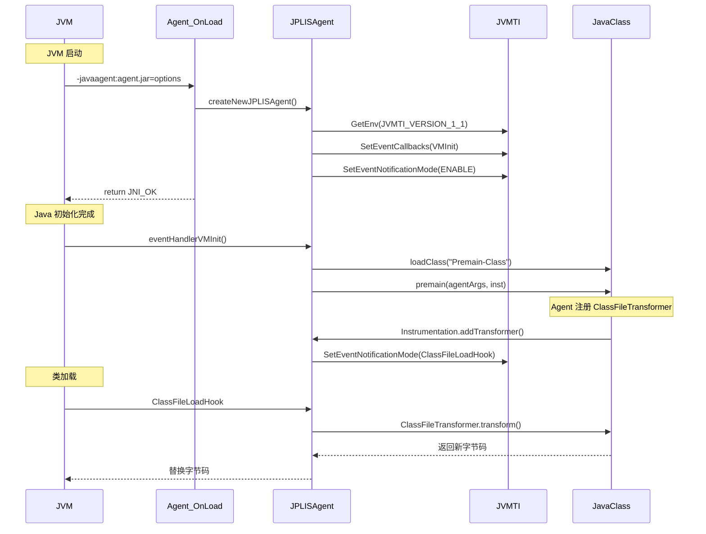

# libinstrument.so — Java Instrumentation API 完整深度剖析

> **文件位置**：
> - `src/java.instrument/share/native/libinstrument/InvocationAdapter.c` (JVMTI 入口)
> - `src/java.instrument/share/native/libinstrument/JPLISAgent.c` (核心 Agent)
> - `src/java.instrument/share/native/libinstrument/InstrumentationImplNativeMethods.c` (native 方法)
> 
> **方法论**：程序 = 数据结构 + 算法
> **遵循规范**：Source-Code-Depth L5（真实源码 + 逐行注释 + 设计解释 + 对比表）
> **标准环境**：-Xms8g -Xmx8g -XX:+UseG1GC

---

## 第 0 部分：核心原理

### 0.1 本质是什么？

**一句话概括**：libinstrument.so 是 Java Instrumentation API 的 native 层实现，核心是 **JVMTI Agent + ClassFileTransformer + 字节码转换**，用于在类加载时或运行时修改类字节码。

### 0.2 为什么需要 Instrumentation？

| 问题 | 场景 | Instrumentation 方案 |
|------|------|---------------------|
| AOP 实现 | 无侵入式方法拦截 | ClassFileTransformer |
| 性能监控 | 方法耗时统计 | 字节码插桩 |
| 代码覆盖 | Jacoco 覆盖率 | 方法入口插桩 |
| 热部署 | 动态修复 bug | redefineClasses |
| 诊断工具 | Arthas/BTrace | 运行时类修改 |

### 0.3 核心机制

| 机制 | 时机 | JVMTI API |
|------|------|-----------|
| 启动加载 | JVM 启动 | `Agent_OnLoad()` |
| 字节码转换 | 类加载时 | `ClassFileLoadHook` |
| 类重定义 | 运行时 | `RedefineClasses()` |
| 类重转换 | 运行时 | `RetransformClasses()` |

### 0.4 为什么这样设计？

**为什么基于 JVMTI？**
- JVMTI 是 JVM 官方调试/分析接口
- 提供完整的类生命周期事件
- 支持字节码转换、方法调用拦截等

**为什么用 JAR manifest？**
- 避免硬编码 agent 类名
- 支持多个 agent 独立配置
- 方便打包和分发

---

## 一、数据结构全景 ⭐⭐⭐

### 1.1 JPLISAgent — 核心上下文结构

**源码位置**：`JPLISAgent.h`

```c
// JPLISAgent.h (简化版)
struct _JPLISAgent {
    JavaVM *                mJVM;                  // JavaVM 指针
    JPLISEnvironment        mNormalEnvironment;    // 普通 JVMTI 环境
    JPLISEnvironment        mRetransformEnvironment; // 重转换 JVMTI 环境
    jobject                 mAgentmainCaller;      // agentmain 方法
    jobject                 mInstrumentationImpl;  // Instrumentation 实例
    jobject                 mPremainCaller;        // premain 方法
    jobject                 mTransform;            // ClassFileTransformer
    
    jboolean                mRedefineAvailable;    // 是否支持 redefine
    jboolean                mRedefineAdded;        // redefine 能力已添加
    jboolean                mNativeMethodPrefixAvailable; // 是否支持 native 前缀
    jboolean                mNativeMethodPrefixAdded;
    
    char *                  mAgentClassName;       // Agent 类名
    char *                  mOptionsString;        // Agent 参数
    char *                  mJarfile;              // JAR 文件路径
};
```

**sizeof 分析**：

```
sizeof(JPLISAgent) ≈ 120 bytes (64位系统)

┌────────────────────────────────────────────┐ 偏移 0
│ mJVM : JavaVM*                (8 bytes)    │
├────────────────────────────────────────────┤ 偏移 8
│ mNormalEnvironment : JPLISEnvironment (32) │
├────────────────────────────────────────────┤ 偏移 40
│ mRetransformEnvironment (32)               │
├────────────────────────────────────────────┤ 偏移 72
│ mAgentmainCaller : jobject    (8 bytes)    │
├────────────────────────────────────────────┤ 偏移 80
│ mInstrumentationImpl : jobject (8 bytes)   │
├────────────────────────────────────────────┤ 偏移 88
│ mPremainCaller : jobject      (8 bytes)    │
├────────────────────────────────────────────┤ 偏移 96
│ mTransform : jobject          (8 bytes)    │
├────────────────────────────────────────────┤ 偏移 104
│ ... (boolean flags + char* fields)         │
└────────────────────────────────────────────┘
```

---

### 1.2 JPLISEnvironment — JVMTI 环境封装

```c
// JPLISAgent.h
struct _JPLISEnvironment {
    jvmtiEnv *      mJVMTIEnv;         // JVMTI 环境指针
    JPLISAgent *    mAgent;            // 回指 JPLISAgent
    jboolean        mIsRetransformer;  // 是否为重转换环境
};
```

**为什么要两个 JVMTI 环境？**

```
mNormalEnvironment:
  - 用于常规操作
  - ClassFileLoadHook 只在类首次加载时触发
  - 不能重转换已加载的类

mRetransformEnvironment:
  - 专门用于 RetransformClasses
  - 可以重新转换已加载的类
  - 需要特殊能力 Can-Retransform-Classes

为什么分开？
  - 能力隔离：避免意外重转换
  - 性能优化：重转换环境只在需要时创建
  - 兼容性：旧 agent 可能不支持重转换
```

---

### 1.3 jarAttribute — JAR Manifest 属性

```c
// JarFacade.h
typedef struct jarAttribute {
    char* name;                    // 属性名
    char* value;                   // 属性值
    struct jarAttribute* next;     // 链表指针
} jarAttribute;
```

**常见 Manifest 属性**：

| 属性名 | 用途 | 示例 |
|--------|------|------|
| `Premain-Class` | 启动时 Agent 类 | `com.example.Agent` |
| `Agent-Class` | 运行时加载 Agent | `com.example.Agent` |
| `Can-Redefine-Classes` | 支持类重定义 | `true` |
| `Can-Retransform-Classes` | 支持类重转换 | `true` |
| `Can-Set-Native-Method-Prefix` | 支持 native 前缀 | `true` |
| `Boot-Class-Path` | 添加到启动类路径 | `agent.jar` |

---

## 二、核心函数 1：Agent_OnLoad() — 启动加载 ⭐⭐⭐⭐⭐

### 2.1 解决什么问题？

**JVM 启动时如何加载 Java Agent？**

### 2.2 完整源码 + 逐行注释

```c
// InvocationAdapter.c:143-286
JNIEXPORT jint JNICALL
DEF_Agent_OnLoad(JavaVM *vm, char *tail, void * reserved) {
    JPLISInitializationError initerror  = JPLIS_INIT_ERROR_NONE;
    jint                     result     = JNI_OK;
    JPLISAgent *             agent      = NULL;

    // ★★★ 第 1 步：创建 JPLISAgent ★★★
    initerror = createNewJPLISAgent(vm, &agent);
    if (initerror == JPLIS_INIT_ERROR_NONE) {
        int             oldLen, newLen;
        char *          jarfile;
        char *          options;
        jarAttribute*   attributes;
        char *          premainClass;
        char *          bootClassPath;

        // ★★★ 第 2 步：解析参数 <jarfile>[=options] ★★★
        // 示例：-javaagent:/path/to/agent.jar=options
        if (parseArgumentTail(tail, &jarfile, &options) != 0) {
            fprintf(stderr, "-javaagent: memory allocation failure.\n");
            return JNI_ERR;
        }

        // ★★★ 第 3 步：读取 JAR Manifest ★★★
        attributes = readAttributes(jarfile);
        if (attributes == NULL) {
            fprintf(stderr, "Error opening zip file or JAR manifest missing : %s\n", jarfile);
            free(jarfile);
            if (options != NULL) free(options);
            return JNI_ERR;
        }

        // ★★★ 第 4 步：查找 Premain-Class 属性 ★★★
        premainClass = getAttribute(attributes, "Premain-Class");
        if (premainClass == NULL) {
            fprintf(stderr, "Failed to find Premain-Class manifest attribute in %s\n",
                jarfile);
            free(jarfile);
            if (options != NULL) free(options);
            freeAttributes(attributes);
            return JNI_ERR;
        }

        // ★ 保存 JAR 文件名
        agent->mJarfile = jarfile;

        // ★★★ 第 5 步：UTF-8 转换 ★★★
        // Manifest 使用 UTF-8，JNI 需要 modified UTF-8
        oldLen = (int)strlen(premainClass);
        newLen = modifiedUtf8LengthOfUtf8(premainClass, oldLen);
        
        // ★ 类名长度检查（u2，最大 0xFFFF）
        if (oldLen < 0 || newLen < 0 || newLen > 0xFFFF) {
            fprintf(stderr, "-javaagent: Premain-Class value is too big\n");
            free(jarfile);
            if (options != NULL) free(options);
            freeAttributes(attributes);
            return JNI_ERR;
        }
        
        if (newLen == oldLen) {
            premainClass = strdup(premainClass);
        } else {
            char* str = (char*)malloc(newLen + 1);
            if (str != NULL) {
                convertUtf8ToModifiedUtf8(premainClass, oldLen, str, newLen);
            }
            premainClass = str;
        }
        if (premainClass == NULL) {
            fprintf(stderr, "-javaagent: memory allocation failed\n");
            free(jarfile);
            if (options != NULL) free(options);
            freeAttributes(attributes);
            return JNI_ERR;
        }

        // ★★★ 第 6 步：处理 Boot-Class-Path ★★★
        bootClassPath = getAttribute(attributes, "Boot-Class-Path");
        if (bootClassPath != NULL) {
            // ★ 添加到启动类路径（可以访问 java.lang.* 包）
            appendBootClassPath(agent, jarfile, bootClassPath);
        }

        // ★★★ 第 7 步：转换能力属性 ★★★
        convertCapabilityAttributes(attributes, agent);

        // ★★★ 第 8 步：记录命令行数据 ★★★
        initerror = recordCommandLineData(agent, premainClass, options);

        // ★ 清理
        if (options != NULL) free(options);
        freeAttributes(attributes);
        free(premainClass);
    }

    // ★★★ 返回结果 ★★★
    switch (initerror) {
    case JPLIS_INIT_ERROR_NONE:
      result = JNI_OK;
      break;
    case JPLIS_INIT_ERROR_CANNOT_CREATE_NATIVE_AGENT:
      result = JNI_ERR;
      fprintf(stderr, "java.lang.instrument/-javaagent: cannot create native agent.\n");
      break;
    case JPLIS_INIT_ERROR_ALLOCATION_FAILURE:
      result = JNI_ERR;
      fprintf(stderr, "java.lang.instrument/-javaagent: allocation failure.\n");
      break;
    case JPLIS_INIT_ERROR_AGENT_CLASS_NOT_SPECIFIED:
      result = JNI_ERR;
      fprintf(stderr, "-javaagent: agent class not specified.\n");
      break;
    default:
      result = JNI_ERR;
      fprintf(stderr, "java.lang.instrument/-javaagent: unknown error\n");
      break;
    }
    return result;
}
```

### 2.3 设计决策解释

**为什么在 Agent_OnLoad 时只解析 JAR，不加载 Agent 类？**

```
Agent_OnLoad 调用时机：
  - JVM 初始化早期
  - Java 类库尚未加载
  - 不能调用 Java 代码

解决方案：
  1. Agent_OnLoad：解析 JAR manifest，记录 agent 类名
  2. 注册 VMInit 事件
  3. JVM 初始化完成后，VMInit 回调触发
  4. 加载 Agent 类，调用 premain() 方法
```

**为什么需要 Boot-Class-Path？**

```
场景：Agent 需要访问 java.lang.* 包

问题：
  - 系统类加载器加载 Agent
  - java.lang.* 对用户代码不可见

解决方案：
  - Boot-Class-Path 将 Agent 添加到启动类路径
  - 由启动类加载器加载
  - 可以访问 java.lang.* 包

示例：Javassist, ASM 需要 Boot-Class-Path
```

---

## 三、核心函数 2：initializeJPLISAgent() — 初始化 Agent ⭐⭐⭐⭐

### 3.1 完整源码 + 逐行注释

```c
// JPLISAgent.c:251-326
JPLISInitializationError
initializeJPLISAgent(   JPLISAgent *    agent,
                        JavaVM *        vm,
                        jvmtiEnv *      jvmtienv) {
    jvmtiError      jvmtierror = JVMTI_ERROR_NONE;
    jvmtiPhase      phase;

    // ★★★ 第 1 步：初始化字段 ★★★
    agent->mJVM                                      = vm;
    agent->mNormalEnvironment.mJVMTIEnv              = jvmtienv;
    agent->mNormalEnvironment.mAgent                 = agent;
    agent->mNormalEnvironment.mIsRetransformer       = JNI_FALSE;
    agent->mRetransformEnvironment.mJVMTIEnv         = NULL;  // 延迟创建
    agent->mRetransformEnvironment.mAgent            = agent;
    agent->mRetransformEnvironment.mIsRetransformer  = JNI_FALSE;
    agent->mAgentmainCaller                          = NULL;
    agent->mInstrumentationImpl                      = NULL;
    agent->mPremainCaller                            = NULL;
    agent->mTransform                                = NULL;
    agent->mRedefineAvailable                        = JNI_FALSE;
    agent->mRedefineAdded                            = JNI_FALSE;
    agent->mNativeMethodPrefixAvailable              = JNI_FALSE;
    agent->mNativeMethodPrefixAdded                  = JNI_FALSE;
    agent->mAgentClassName                           = NULL;
    agent->mOptionsString                            = NULL;
    agent->mJarfile                                  = NULL;

    // ★★★ 第 2 步：设置 JVMTI 环境本地存储 ★★★
    // 用于快速从 jvmtiEnv 获取 JPLISAgent
    jvmtierror = (*jvmtienv)->SetEnvironmentLocalStorage(
                                            jvmtienv,
                                            &(agent->mNormalEnvironment));
    jplis_assert(jvmtierror == JVMTI_ERROR_NONE);

    // ★★★ 第 3 步：检查 JVMTI 能力 ★★★
    checkCapabilities(agent);

    // ★★★ 第 4 步：检查当前阶段 ★★★
    jvmtierror = (*jvmtienv)->GetPhase(jvmtienv, &phase);
    jplis_assert(jvmtierror == JVMTI_ERROR_NONE);
    
    if (phase == JVMTI_PHASE_LIVE) {
        // ★ 运行时加载（Attach 机制）
        return JPLIS_INIT_ERROR_NONE;
    }

    if (phase != JVMTI_PHASE_ONLOAD) {
        // ★ 既不是 ONLOAD 也不是 LIVE，错误
        return JPLIS_INIT_ERROR_FAILURE;
    }

    // ★★★ 第 5 步：注册 VMInit 事件回调 ★★★
    if (jvmtierror == JVMTI_ERROR_NONE) {
        jvmtiEventCallbacks callbacks;
        memset(&callbacks, 0, sizeof(callbacks));
        callbacks.VMInit = &eventHandlerVMInit;  // ★ VM 初始化回调

        jvmtierror = (*jvmtienv)->SetEventCallbacks(jvmtienv,
                                                     &callbacks,
                                                     sizeof(callbacks));
        jplis_assert(jvmtierror == JVMTI_ERROR_NONE);
    }

    // ★★★ 第 6 步：启用 VMInit 事件 ★★★
    if (jvmtierror == JVMTI_ERROR_NONE) {
        jvmtierror = (*jvmtienv)->SetEventNotificationMode(
                                                jvmtienv,
                                                JVMTI_ENABLE,
                                                JVMTI_EVENT_VM_INIT,
                                                NULL /* all threads */);
        jplis_assert(jvmtierror == JVMTI_ERROR_NONE);
    }

    return (jvmtierror == JVMTI_ERROR_NONE)? JPLIS_INIT_ERROR_NONE : JPLIS_INIT_ERROR_FAILURE;
}
```

### 3.2 checkCapabilities() — 检查 JVMTI 能力

```c
// JPLISAgent.c (简化版)
void checkCapabilities(JPLISAgent * agent) {
    jvmtiEnv *          jvmtienv = jvmti(agent);
    jvmtiCapabilities   capabilities;

    // ★ 查询 JVMTI 支持的能力
    memset(&capabilities, 0, sizeof(capabilities));
    (*jvmtienv)->GetPotentialCapabilities(jvmtienv, &capabilities);

    // ★ 检查 can_redefine_classes
    if (capabilities.can_redefine_classes) {
        agent->mRedefineAvailable = JNI_TRUE;
    }

    // ★ 检查 can_set_native_method_prefix
    if (capabilities.can_set_native_method_prefix) {
        agent->mNativeMethodPrefixAvailable = JNI_TRUE;
    }
}
```

---

## 四、核心函数 3：eventHandlerVMInit() — VM 初始化回调 ⭐⭐⭐⭐

### 4.1 解决什么问题？

**JVM 初始化完成后如何加载 Agent 类并调用 premain()？**

### 4.2 完整流程

```c
// JPLISAgent.c (简化版)
void JNICALL
eventHandlerVMInit(jvmtiEnv *jvmtienv, JNIEnv *jnienv, jthread thread) {
    JPLISAgent * agent = getJPLISAgent(jvmtienv);
    jboolean     success = JNI_FALSE;

    // ★ 1. 初始化 Java 层
    success = processJavaStart(agent, jnienv);
    
    // ★ 2. 加载 Agent 类
    // ★ 3. 调用 premain(String agentArgs, Instrumentation inst)
    // ...
}
```

**processJavaStart() 核心逻辑**：

```c
// JPLISAgent.c:382-450 (简化版)
jboolean
processJavaStart(JPLISAgent * agent, JNIEnv * jnienv) {
    jboolean result;

    // ★ 1. 创建 InstrumentationImpl 实例
    result = createInstrumentationImpl(jnienv, agent);
    
    // ★ 2. 加载 Agent 类
    if (result) {
        result = loadAgentClass(jnienv, agent);
    }
    
    // ★ 3. 调用 premain 方法
    if (result) {
        result = invokePremain(jnienv, agent);
    }
    
    return result;
}
```

---

## 五、核心函数 4：redefineClasses() — 类重定义 ⭐⭐⭐⭐⭐

### 5.1 解决什么问题？

**如何运行时替换已加载类的字节码？**

### 5.2 Native 方法入口

```c
// InstrumentationImplNativeMethods.c:117-120
JNIEXPORT void JNICALL 
Java_sun_instrument_InstrumentationImpl_redefineClasses0
  (JNIEnv * jnienv, jobject implThis, jlong agent, jobjectArray classDefinitions) {
    redefineClasses(jnienv, (JPLISAgent*)(intptr_t)agent, classDefinitions);
}
```

### 5.3 核心实现

```c
// JPLISAgent.c (简化版)
void
redefineClasses(JNIEnv * jnienv, JPLISAgent * agent, jobjectArray classDefinitions) {
    jvmtiEnv *      jvmtienv = jvmti(agent);
    jvmtiClassDefinition * defs;
    jint            count;
    jvmtiError      error;

    // ★ 1. 检查能力
    if (!agent->mRedefineAvailable) {
        throwNotSupportedException(jnienv, "redefineClasses");
        return;
    }

    // ★ 2. 添加能力（首次调用时）
    if (!agent->mRedefineAdded) {
        jvmtiCapabilities capabilities;
        memset(&capabilities, 0, sizeof(capabilities));
        capabilities.can_redefine_classes = 1;
        error = (*jvmtienv)->AddCapabilities(jvmtienv, &capabilities);
        if (error != JVMTI_ERROR_NONE) {
            throwInternalError(jnienv, "Failed to add redefine capability");
            return;
        }
        agent->mRedefineAdded = JNI_TRUE;
    }

    // ★ 3. 转换 Java 数组为 jvmtiClassDefinition
    count = (*jnienv)->GetArrayLength(jnienv, classDefinitions);
    defs = (jvmtiClassDefinition *)malloc(count * sizeof(jvmtiClassDefinition));
    
    for (jint i = 0; i < count; i++) {
        jobject classDef = (*jnienv)->GetObjectArrayElement(jnienv, classDefinitions, i);
        
        // ★ 获取 Class 对象
        jclass clazz = (*jnienv)->GetObjectField(jnienv, classDef, ...);
        defs[i].klass = clazz;
        
        // ★ 获取字节码数组
        jbyteArray bytecodes = (*jnienv)->GetObjectField(jnienv, classDef, ...);
        jbyte * bytes = (*jnienv)->GetByteArrayElements(jnienv, bytecodes, NULL);
        defs[i].class_byte_count = (*jnienv)->GetArrayLength(jnienv, bytecodes);
        defs[i].class_bytes = (unsigned char *)bytes;
    }

    // ★★★ 核心：调用 JVMTI RedefineClasses ★★★
    error = (*jvmtienv)->RedefineClasses(jvmtienv, count, defs);

    // ★ 4. 清理
    for (jint i = 0; i < count; i++) {
        (*jnienv)->ReleaseByteArrayElements(jnienv, bytecodes, ...);
    }
    free(defs);

    // ★ 5. 错误处理
    if (error != JVMTI_ERROR_NONE) {
        throwInternalError(jnienv, "RedefineClasses failed");
    }
}
```

### 5.4 设计决策解释

**RedefineClasses vs RetransformClasses？**

| 维度 | RedefineClasses | RetransformClasses |
|------|----------------|-------------------|
| 字节码来源 | 调用者提供 | ClassFileTransformer |
| 适用场景 | 热部署 | 监控/诊断 |
| 灵活性 | 完全控制 | 可叠加多个 transformer |
| 复杂度 | 简单 | 需要理解 transformer 链 |

```
RedefineClasses:
  - 直接替换字节码
  - 需要自己生成新字节码
  - 适合热部署、动态修复

RetransformClasses:
  - 重新触发 ClassFileLoadHook
  - 所有注册的 transformer 被调用
  - 适合监控、诊断（Arthas、BTrace）
```

---

## 六、核心函数 5：ClassFileLoadHook — 字节码转换 ⭐⭐⭐⭐⭐

### 6.1 解决什么问题？

**类加载时如何拦截并修改字节码？**

### 6.2 JVMTI 事件回调

```c
// JPLISAgent.c (概念版)
void JNICALL
ClassFileLoadHook(jvmtiEnv *jvmtienv,
                  JNIEnv* jnienv,
                  jclass class_being_redefined,
                  jobject loader,
                  const char* name,
                  jobject protection_domain,
                  jint class_data_len,
                  const unsigned char* class_data,
                  jint* new_class_data_len,
                  unsigned char** new_class_data) {
    
    JPLISAgent * agent = getJPLISAgent(jvmtienv);
    
    // ★ 1. 检查是否有 transformer
    if (agent->mTransform == NULL) {
        return;  // 无需转换
    }
    
    // ★ 2. 调用 Java 层 ClassFileTransformer.transform()
    jbyteArray result = invokeTransformer(jnienv, agent,
                                          class_being_redefined,
                                          name,
                                          class_data,
                                          class_data_len);
    
    // ★ 3. 如果返回新的字节码，替换原字节码
    if (result != NULL) {
        *new_class_data_len = (*jnienv)->GetArrayLength(jnienv, result);
        *new_class_data = (*jnienv)->GetByteArrayElements(jnienv, result, NULL);
    }
}
```

### 6.3 Transformer 链

```
多个 ClassFileTransformer 的执行顺序：

  原始字节码
      ↓
  Transformer 1
      ↓
  Transformer 2
      ↓
  Transformer N
      ↓
  最终字节码（加载到 JVM）
```

---

## 七、系统调用总结 ⭐⭐⭐

| 操作 | JVMTI API | Java API |
|------|-----------|----------|
| 获取所有已加载类 | `GetLoadedClasses()` | `Instrumentation.getAllLoadedClasses()` |
| 获取类加载器加载的类 | `GetClassLoaderClasses()` | `Instrumentation.getInitiatedClasses()` |
| 获取对象大小 | `GetObjectSize()` | `Instrumentation.getObjectSize()` |
| 重定义类 | `RedefineClasses()` | `Instrumentation.redefineClasses()` |
| 重转换类 | `RetransformClasses()` | `Instrumentation.retransformClasses()` |
| 添加 ClassPath | `AddToSystemClassLoaderSearch()` | `Instrumentation.appendToSystemClassLoaderSearch()` |
| 添加 Boot ClassPath | `AddToBootstrapClassLoaderSearch()` | `Instrumentation.appendToBootstrapClassLoaderSearch()` |
| 设置 Native 方法前缀 | `SetNativeMethodPrefixes()` | `Instrumentation.setNativeMethodPrefix()` |

---

## 八、启动流程全景 ⭐⭐⭐⭐⭐



---

## 九、GDB 验证

### 9.1 跟踪 Agent 加载

```bash
# 跟踪 Agent_OnLoad
gdb --args java -javaagent:/path/to/agent.jar -cp . Main

(gdb) break DEF_Agent_OnLoad
(gdb) run

# 打印 JPLISAgent
(gdb) p *agent
$1 = {mJVM = 0x7f..., mAgentClassName = "com.example.Agent", ...}
```

### 9.2 打印 JVMTI 能力

```gdb
# 打印能力
(gdb) p agent->mRedefineAvailable
$2 = JNI_TRUE

(gdb) p agent->mNativeMethodPrefixAvailable
$3 = JNI_TRUE
```

---

## 十、核心文件清单

| 文件 | 核心函数 | 功能 |
|------|----------|------|
| `InvocationAdapter.c` | Agent_OnLoad, Agent_OnAttach | JVMTI 入口点 |
| `JPLISAgent.c` | initializeJPLISAgent, processJavaStart | Agent 核心逻辑 |
| `InstrumentationImplNativeMethods.c` | redefineClasses0, retransformClasses0 | native 方法桥接 |
| `JarFacade.c` | readAttributes, getAttribute | JAR manifest 解析 |
| `JavaExceptions.c` | createAndThrowInternalError | 异常处理 |

---

## 十一、总结

### 11.1 libinstrument 核心特点

| 特点 | 优势 | 应用 |
|------|------|------|
| 基于 JVMTI | 官方支持，稳定 | 所有 Agent |
| 字节码转换 | 无侵入式修改 | AOP、监控 |
| 类重定义 | 运行时修复 | 热部署 |
| 类重转换 | 诊断分析 | Arthas、BTrace |

### 11.2 与其他工具的关系

```
libinstrument:
  - Java Agent 基础设施
  - 提供字节码转换能力

构建在其上的工具：
  - Arthas: 诊断工具
  - BTrace: 动态追踪
  - Javassist: 字节码操作库
  - Jacoco: 代码覆盖
  - SkyWalking: APM
```

### 11.3 关键设计模式

| 模式 | 应用 |
|------|------|
| 观察者模式 | ClassFileLoadHook 事件 |
| 责任链模式 | Transformer 链 |
| 工厂模式 | InstrumentationImpl 创建 |
| 策略模式 | Redefine vs Retransform |

---

## 附录：参考资料

- `JVMTI Specification` - Java Virtual Machine Tool Interface
- `JLS Chapter 5` - Loading, Linking, and Initializing
- `man 2 open` - 打开文件
- `man 2 read` - 读取文件
- `man 3 zip` - ZIP 文件处理
