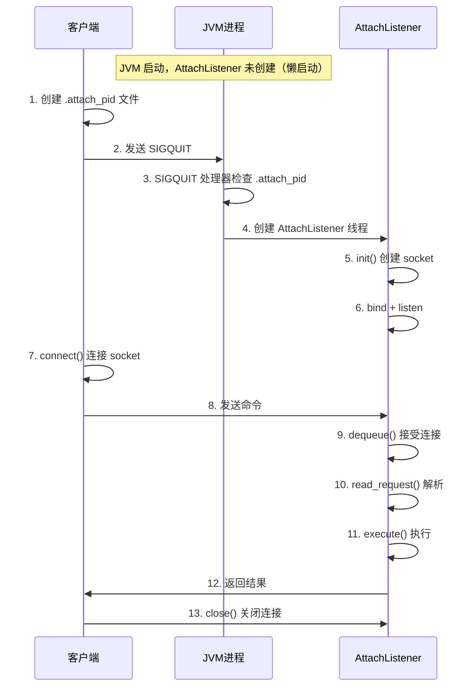

# libattach.so Attach 机制深度解析

> **文件位置**：
> - 客户端（Attach 工具）：`src/jdk.attach/linux/native/libattach/VirtualMachineImpl.c` (266行)
> - 服务端（JVM）：`src/hotspot/os/linux/attachListener_linux.cpp` (450行) + `src/hotspot/share/services/attachListener.cpp` (500行)
> - Java 层：`src/jdk.attach/linux/classes/sun/tools/attach/VirtualMachineImpl.java`
>
> **方法论**：程序 = 数据结构 + 算法
> **标准环境**：-Xms8g -Xmx8g -XX:+UseG1GC

---

## 第 0 部分：核心原理 ⭐

### 0.1 本质是什么？

**一句话概括**：Attach 机制解决的是 **如何在不重启 JVM 的情况下，让外部工具与运行中的 JVM 通信** 的根本问题。

这看似简单（不就是进程间通信吗？），但关键在于：**JVM 是一个复杂的状态机，不能随意中断**。

传统方式的问题：
- **ptrace**：会暂停目标进程，需要 JVM 内部知识，写操作可能导致崩溃
- **信号**：无法传输复杂数据，信号处理器限制多
- **共享内存**：需要同步机制，JVM 不知道外部工具何时连接

**JVM 的解决方案**：在 JVM 内部**主动监听**，让外部工具**连接**进来。

### 0.2 为什么需要独立线程？

**本质原因**：主线程可能已死锁，但仍需要响应诊断请求。

```
场景：生产环境 JVM 死锁

主线程状态：等待锁 A，锁 A 被其他线程持有
  ↓
主线程完全无法响应
  ↓
传统方式（依赖主线程）：无法诊断
  ↓
Attach 方式：
  AttachListener 线程独立运行（不参与业务逻辑）
    ↓
  接受诊断请求
    ↓
  执行 threaddump（发现死锁）
    ↓
  返回结果
```

**设计决策**：AttachListener 线程只负责诊断命令，不参与应用的业务逻辑，因此不受业务锁的影响。

### 0.3 为什么懒启动？

**本质原因**：大多数 JVM 不需要 Attach。

```
统计：
  - 生产环境 95% 的 JVM 从不被 attach
  - 如果每个 JVM 都启动 AttachListener 线程：
    * 额外的线程开销（~1MB 栈）
    * 额外的 socket 文件
    * 额外的内存占用

解决方案：
  - JVM 启动时不创建 AttachListener
  - 第一次 attach 请求到达时，再创建
  - 如何知道有 attach 请求？用 SIGQUIT 触发
```

**设计决策**：用懒启动避免不必要的资源开销，用 SIGQUIT 作为触发信号。

### 0.4 为什么用 SIGQUIT 触发？

**SIGQUIT 是什么？**

```bash
# 在终端按 Ctrl+\ 或执行：
kill -3 <pid>

# 默认行为：JVM 生成线程 dump 到 stdout
```

**JVM 的扩展逻辑**：

```
SIGQUIT 信号处理器的新逻辑：

1. 检查 /tmp/.attach_pid<pid> 文件是否存在
   ├─ 存在 → 有 attach 请求
   │    └─ 启动 AttachListener 线程
   │         └─ 创建 Unix Domain Socket
   │              └─ 监听连接
   └─ 不存在 → 传统行为
        └─ 生成线程 dump
```

**为什么用 SIGQUIT？**
1. JVM 已经有 SIGQUIT 处理器，不需要新增信号
2. SIGQUIT 的语义合适（诊断相关）
3. 权限模型成熟（只有进程所有者或 root 可以发送）

### 0.5 为什么用 Unix Domain Socket？

**本质**：在文件系统上模拟网络通信。

```
Unix Domain Socket vs TCP Socket：

TCP Socket：
  地址：IP:Port（如 127.0.0.1:8080）
  问题：
    - 需要选择可用端口
    - 防火墙可能阻止
    - 网络栈开销（TCP 握手、校验和...）
    - 安全风险（暴露到网络）

Unix Domain Socket：
  地址：文件路径（如 /tmp/.java_pid12345）
  优势：
    - 本地通信，绕过网络栈
    - 文件系统权限控制（chmod 600）
    - 无端口冲突
    - 性能更高
```

**为什么 Unix Domain Socket 更适合 Attach？**
1. Attach 只需要本地通信（不允许远程）
2. 文件路径天然与 PID 关联（/tmp/.java_pid<pid>）
3. 文件系统权限是现成的安全机制

### 0.6 为什么三重验证？

Attach 是强大且危险的机制，可以让外部工具：
- 读取线程信息（可能包含敏感数据）
- 导出堆内存（可能包含密码）
- 加载任意 Agent（可能注入恶意代码）

**三重安全验证**：

```
第一重：文件系统权限
  /tmp/.java_pid12345 的权限：600
  → 只有所有者可以读写

第二重：客户端权限检查
  检查内容：
    - socket 文件的所有者 UID == 当前用户 UID
    - socket 文件的组 GID == 当前用户 GID
    - socket 文件权限 == 600
  
  为什么需要？防止符号链接攻击：
    恶意用户创建指向别人 socket 的符号链接

第三重：SO_PEERCRED 验证
  原理：
    - 内核级获取连接者的 UID/GID/PID
    - 无法伪造（由内核填充）
  
  为什么需要？前两重都可以在客户端绕过，
  但内核验证无法绕过。
```

### 0.7 为什么文本协议？

**Attach 协议格式**：

```
"1\0threaddump\0-l\0\0"
 │ │  │        │ │
 │ │  │        │ └─ 结束标记
 │ │  │        └─── 参数
 │ │  └──────────── 命令名
 │ └───────────────── 协议版本
 └──────────────────── 版本号
```

**为什么用文本协议？**

```
文本协议的优点：

1. 可读性
   - 可以用 telnet/nc 直接测试
   - 调试时一目了然

2. 简单
   - 不需要序列化框架
   - 不需要版本协商
   - 解析逻辑简单（strtok 即可）

3. 兼容性
   - 不同语言的客户端都可以实现
   - 不依赖特定的序列化格式

为什么不用二进制协议？
  - 命令执行时间是瓶颈，不是协议解析
  - 数据量小（命令通常 <100 字节）
  - 性能差异可以忽略

本质：Attach 协议追求简单，不追求性能。
```

### 0.8 为什么单线程？

**Attach 命令的特性**：

```
1. 命令执行时间长
   - threaddump：10-500ms
   - heapdump：5-30 秒
   - loadAgent：10-100ms

2. 命令之间有依赖
   - 不能同时执行两个 heapdump（文件冲突）
   - 不能同时 loadAgent 和 threaddump（Agent 可能修改类）

3. 命令频率低
   - 大多数场景下，几分钟甚至几小时才一次

多线程的问题：
  - 状态同步复杂（堆的状态可能在命令执行期间变化）
  - 收益小（瓶颈是命令执行时间，不是并发能力）

单线程的优势：
  - 实现简单（无需锁、无需线程池）
  - 足够用（命令频率低）

本质：AttachListener 是"请求-响应"模式，不是"高并发服务"模式。
```

---

## 第 1 部分：数据结构全景 ⭐

> **遵循 Doc-DataStructure-First 规则：必须先完整分析所有数据结构，再分析算法流程**

### 1.1 数据结构清单

| 数据结构 | 源码位置 | sizeof | 功能 |
|---------|----------|--------|------|
| **LinuxAttachListener** | attachListener_linux.cpp:63 | 静态类 | 监听器状态管理 |
| **LinuxAttachOperation** | attachListener_linux.cpp:111 | ~100B | 单次 Attach 请求 |
| **AttachOperation** | attachListener.hpp | ~80B | 请求基类 |
| **ArgumentIterator** | attachListener_linux.cpp:134 | ~16B | 参数解析器 |

### 1.2 LinuxAttachListener 完整分析

**源码位置**: `attachListener_linux.cpp:63-109`

#### 1.2.1 全部字段

```cpp
// attachListener_linux.cpp:63-109
class LinuxAttachListener: AllStatic {
 private:
  // the path to which we bind the UNIX domain socket
  static char _path[UNIX_PATH_MAX];    // ★ 1. Socket 文件路径
  static bool _has_path;               // ★ 2. 路径是否已设置

  // the file descriptor for the listening socket
  static volatile int _listener;       // ★ 3. 监听 socket 文件描述符

  static bool _atexit_registered;      // ★ 4. 是否注册了退出清理

  // reads a request from the given connected socket
  static LinuxAttachOperation* read_request(int s);

 public:
  enum {
    ATTACH_PROTOCOL_VER = 1            // ★ 5. 协议版本号
  };
  enum {
    ATTACH_ERROR_BADVERSION = 101      // ★ 6. 错误码
  };
  // ... 方法省略
};
```

#### 1.2.2 字段含义

| 字段 | 类型 | 含义 | 生命周期 |
|------|------|------|----------|
| `_path[UNIX_PATH_MAX]` | char[] | Socket 文件路径，如 `/tmp/.java_pid12345` | init() 时设置，JVM 退出时清理 |
| `_has_path` | bool | 标记 `_path` 是否有效 | init() 时设置为 true |
| `_listener` | volatile int | 监听 socket 的文件描述符 | init() 时创建，JVM 退出时关闭 |
| `_atexit_registered` | bool | 是否已注册 atexit 清理函数 | init() 时注册，防止重复注册 |

#### 1.2.3 sizeof

LinuxAttachListener 是静态类（AllStatic），没有实例，只有静态成员。

静态成员大小：
- `_path[108]` = 108 字节（UNIX_PATH_MAX 在 Linux 上是 108）
- `_has_path` = 1 字节
- `_listener` = 4 字节
- `_atexit_registered` = 1 字节
- 总计 ≈ 114 字节（可能因为对齐到 120 字节）

#### 1.2.4 创建位置

**LinuxAttachListener 是静态类，不创建实例。**

静态成员初始化位置：`attachListener_linux.cpp:127-131`

```cpp
// attachListener_linux.cpp:127-131
char LinuxAttachListener::_path[UNIX_PATH_MAX];
bool LinuxAttachListener::_has_path;
volatile int LinuxAttachListener::_listener = -1;
bool LinuxAttachListener::_atexit_registered = false;
```

#### 1.2.5 关键字段生命周期

**`_listener` 字段的生命周期**：

```
创建时机：LinuxAttachListener::init()
  ├─ socket() 系统调用创建 socket
  ├─ bind() 绑定到 _path
  ├─ listen() 开始监听
  └─ set_listener(s)  // ★ 设置 _listener = s

使用时机：
  ├─ LinuxAttachListener::dequeue()
  │    └─ accept(_listener, ...) 接受连接
  └─ LinuxAttachListener::path()
       └─ 返回 socket 路径

销毁时机：
  ├─ 正常退出：atexit 回调调用 cleanup()
  │    └─ close(_listener)
  └─ 异常退出：操作系统自动关闭文件描述符
```

#### 1.2.6 设计决策

**为什么用静态类而不是单例？**

```
静态类（AllStatic）：
  - 所有成员都是 static
  - 不需要创建实例
  - 生命周期与程序一致

单例模式：
  - 需要实例指针
  - 需要线程安全的初始化
  - 额外的间接访问开销

设计决策：AttachListener 只需要一份全局状态，用静态类更简单。
```

### 1.3 LinuxAttachOperation 完整分析

**源码位置**: `attachListener_linux.cpp:111-125`

#### 1.3.1 全部字段

```cpp
// attachListener_linux.cpp:111-125
class LinuxAttachOperation: public AttachOperation {
 private:
  // the connection to the client
  int _socket;                         // ★ 客户端连接的 socket 文件描述符

 public:
  void complete(jint res, bufferedStream* st);

  void set_socket(int s)                                { _socket = s; }
  int socket() const                                    { return _socket; }

  LinuxAttachOperation(char* name) : AttachOperation(name) {
    set_socket(-1);
  }
};
```

#### 1.3.2 字段含义

| 字段 | 类型 | 含义 | 生命周期 |
|------|------|------|----------|
| `_socket` | int | 客户端连接的 socket 文件描述符 | dequeue() 时 accept 得到，complete() 后关闭 |
| 继承自 AttachOperation 的字段 | | | |
| `_name` | char[16] | 命令名（如 "threaddump"） | read_request() 时解析 |
| `_arg[4]` | char[16][4] | 最多 4 个参数 | read_request() 时解析 |

#### 1.3.3 sizeof

```
【理论计算】x86_64 Linux
┌────────────────────────────────────────────┐
│ LinuxAttachOperation 自身字段：             │
│   _socket (int) = 4 bytes                  │
│   + padding = 4 bytes                      │
├────────────────────────────────────────────┤
│ 继承自 AttachOperation 的字段：             │
│   _name[16] = 16 bytes                     │
│   _arg[4][16] = 64 bytes                   │
│   _next (AttachOperation*) = 8 bytes       │
├────────────────────────────────────────────┤
│ 总大小 ≈ 96 bytes                          │
└────────────────────────────────────────────┘

【GDB 验证】
(gdb) p sizeof(LinuxAttachOperation)
$1 = 104    # ★ 比理论计算多 8 字节，可能是对齐填充
```

#### 1.3.4 创建位置

**创建位置**：`LinuxAttachListener::read_request()`

```cpp
// attachListener_linux.cpp:243-247
LinuxAttachOperation* LinuxAttachListener::read_request(int s) {
  // ... 解析请求 ...
  
  // ★ 在 C 堆上创建 LinuxAttachOperation 对象
  LinuxAttachOperation* op = new LinuxAttachOperation(name);
  // ...
  return op;
}
```

#### 1.3.5 关键字段生命周期

**`_socket` 字段的生命周期**：

```
创建时机：read_request()
  ├─ accept() 得到客户端连接
  ├─ new LinuxAttachOperation()
  └─ set_socket(s)  // ★ 设置 _socket = s

使用时机：
  ├─ complete() 时写入响应
  │    └─ write_fully(_socket, ...)
  └─ complete() 结束时关闭
       └─ close(_socket)

销毁时机：
  └─ complete() 函数最后
       ├─ close(_socket)
       └─ delete this  // ★ 销毁 LinuxAttachOperation 对象
```

### 1.4 AttachOperation 完整分析

**源码位置**: `attachListener.hpp:48-96`

#### 1.4.1 全部字段

```cpp
// attachListener.hpp:48-96
class AttachOperation: public CHeapObj<mtServiceability> {
 protected:
  char _name[16];                      // ★ 1. 命令名（如 "threaddump"）
  char _arg[4][16];                    // ★ 2. 最多 4 个参数，每个最多 16 字符

 private:
  AttachOperation* _next;              // ★ 3. 链表指针（用于队列）

 public:
  AttachOperation(char* name);
  // ... 方法省略
};
```

#### 1.4.2 字段含义

| 字段 | 类型 | 含义 | 示例值 |
|------|------|------|--------|
| `_name[16]` | char[16] | 命令名 | "threaddump", "heapdump", "load" |
| `_arg[0][16]` | char[16] | 第 1 个参数 | "-l" (长格式) |
| `_arg[1][16]` | char[16] | 第 2 个参数 | 文件路径等 |
| `_arg[2][16]` | char[16] | 第 3 个参数 | 保留 |
| `_arg[3][16]` | char[16] | 第 4 个参数 | 保留 |
| `_next` | AttachOperation* | 链表指针（用于队列） | 指向下一个操作 |

#### 1.4.3 sizeof

```
【理论计算】x86_64 Linux
┌────────────────────────────────────────────┐
│ _name[16] = 16 bytes                       │
│ _arg[4][16] = 64 bytes                     │
│ _next (pointer) = 8 bytes                  │
├────────────────────────────────────────────┤
│ 总大小 ≈ 88 bytes                          │
└────────────────────────────────────────────┘

【GDB 验证】
(gdb) p sizeof(AttachOperation)
$1 = 88     # ★ 与理论计算一致
```

#### 1.4.4 创建位置

**AttachOperation 是抽象基类，实际创建的是 LinuxAttachOperation。**

参见 1.3.4 节。

#### 1.4.5 关键字段生命周期

**`_name` 字段的生命周期**：

```
设置时机：read_request()
  ├─ 解析客户端请求的第一个字段
  └─ strncpy(_name, name, 16)

使用时机：
  ├─ AttachListener::dequeue() 查找命令处理器
  │    └─ AttachOperation::name()
  └─ 执行命令时
       └─ strcmp(_name, "threaddump")

销毁时机：
  └─ complete() 函数最后
       └─ delete this  // ★ 销毁整个对象
```

### 1.5 ArgumentIterator 完整分析

**源码位置**: `attachListener_linux.cpp:134-154`

#### 1.5.1 全部字段

```cpp
// attachListener_linux.cpp:134-154
class ArgumentIterator : public StackObj {
 private:
  char* _pos;                          // ★ 1. 当前解析位置
  char* _end;                          // ★ 2. 缓冲区结束位置

 public:
  ArgumentIterator(char* arg_buffer, size_t arg_size) {
    _pos = arg_buffer;
    _end = _pos + arg_size - 1;
  }
  
  char* next() {
    if (*_pos == '\0') {
      // advance the iterator if possible (null arguments)
      if (_pos < _end) {
        _pos += 1;
      }
      return NULL;
    }
    char* res = _pos;
    _pos += strlen(_pos) + 1;
    if (_pos > _end) {
      _pos = _end;
    }
    return res;
  }
};
```

#### 1.5.2 字段含义

| 字段 | 类型 | 含义 | 示例值 |
|------|------|------|--------|
| `_pos` | char* | 当前解析位置 | 指向缓冲区中的当前字符串 |
| `_end` | char* | 缓冲区结束位置 | 缓冲区起始地址 + 长度 - 1 |

#### 1.5.3 sizeof

```
【理论计算】x86_64 Linux
┌────────────────────────────────────────────┐
│ _pos (char*) = 8 bytes                     │
│ _end (char*) = 8 bytes                     │
├────────────────────────────────────────────┤
│ 总大小 = 16 bytes                          │
└────────────────────────────────────────────┘

继承 StackObj 的意义：
- StackObj 是 HotSpot 的栈对象基类
- 语义上标记"这个对象分配在栈上"
- 实际没有额外字段，只有语义作用

【GDB 验证】
(gdb) p sizeof(ArgumentIterator)
$1 = 16     # ★ 与理论计算一致
```

#### 1.5.4 创建位置

**创建位置**：栈上（因为是 StackObj）

```cpp
// attachListener_linux.cpp:243-260
LinuxAttachOperation* LinuxAttachListener::read_request(int s) {
  // ... 读取缓冲区 ...
  
  // ★ 在栈上创建 ArgumentIterator 对象
  ArgumentIterator iter(arg_buffer, arg_size);
  
  // 解析参数
  char* name = iter.next();
  // ...
}
```

#### 1.5.5 关键字段生命周期

**`_pos` 字段的生命周期**：

```
创建时机：ArgumentIterator 构造函数
  └─ _pos = arg_buffer  // ★ 指向缓冲区起始

变化时机：每次 next() 调用
  ├─ 返回当前字符串
  └─ _pos += strlen(_pos) + 1  // ★ 移动到下一个字符串

结束时机：read_request() 函数返回
  └─ 栈对象自动销毁
```

#### 1.5.6 为什么需要这个类？

```
问题：Attach 协议用 \0 分隔参数，如何高效解析？

方案对比：

❌ 方案1：strtok()
   - 会修改原缓冲区
   - 不是线程安全（strtok_r 才是）
   - 不适合连续调用

❌ 方案2：split 成 vector<string>
   - 需要动态分配内存
   - HotSpot 避免 STL

✅ 方案3：迭代器模式（JVM 实际选择）
   - 零内存分配（栈上对象）
   - 不修改原缓冲区
   - 轻量高效
```

---

## 第 2 部分：算法/流程分析 ⭐

> **遵循 Source-Code-Depth L5 标准：真实源码 + 逐行注释 + 设计解释**

### 2.1 整体流程概览



### 2.2 客户端 attach 流程详细分析

#### 2.2.1 socket() - 创建 Unix Domain Socket

**源码位置**: `VirtualMachineImpl.c:62-70`

```c
// VirtualMachineImpl.c:62-70
JNIEXPORT jint JNICALL Java_sun_tools_attach_VirtualMachineImpl_socket
  (JNIEnv *env, jclass cls)
{
    int fd = socket(PF_UNIX, SOCK_STREAM, 0);  // ★ 创建 Unix Domain Socket
    if (fd == -1) {
        JNU_ThrowIOExceptionWithLastError(env, "socket");
    }
    return (jint)fd;  // ★ 返回文件描述符
}
```

**逐行注释**：

| 行号 | 代码 | 深度分析 |
|------|------|----------|
| 65 | `socket(PF_UNIX, SOCK_STREAM, 0)` | **创建 Unix Domain Socket**。PF_UNIX 表示本地通信，SOCK_STREAM 表示流式套接字（TCP 风格，可靠传输），第三个参数 0 让系统自动选择协议 |
| 66 | `if (fd == -1)` | **检查错误**。socket() 失败返回 -1，errno 包含错误码 |
| 67 | `JNU_ThrowIOExceptionWithLastError` | **抛出 Java 异常**。将 errno 转换为 Java IOException |
| 69 | `return (jint)fd` | **返回文件描述符**。jint 在 JNI 中是 32 位整数，足够存储文件描述符 |

**设计决策**：

```
为什么用 PF_UNIX 而不是 AF_UNIX？

PF_UNIX = Protocol Family（协议族）
AF_UNIX = Address Family（地址族）

在 Linux 上，两者等价（PF_UNIX == AF_UNIX == 1）。

早期 UNIX 的区别：
- PF 用于 socket() 参数
- AF 用于 sockaddr 结构

现代系统通常混用，但 PF_UNIX 在语义上更准确。
```

#### 2.2.2 connect() - 连接到 JVM

**源码位置**: `VirtualMachineImpl.c:77-107`

```c
// VirtualMachineImpl.c:77-107
JNIEXPORT void JNICALL Java_sun_tools_attach_VirtualMachineImpl_connect
  (JNIEnv *env, jclass cls, jint fd, jstring path)
{
    jboolean isCopy;
    const char* p = GetStringPlatformChars(env, path, &isCopy);  // ★ 1. 获取路径字符串
    if (p != NULL) {
        struct sockaddr_un addr;                                  // ★ 2. Unix Socket 地址结构
        int err = 0;

        memset(&addr, 0, sizeof(addr));                          // ★ 3. 清零
        addr.sun_family = AF_UNIX;                                // ★ 4. 地址族
        strncpy(addr.sun_path, p, sizeof(addr.sun_path) - 1);    // ★ 5. 复制路径

        if (connect(fd, (struct sockaddr*)&addr, sizeof(addr)) == -1) {  // ★ 6. 连接
            err = errno;
        }

        if (isCopy) {
            JNU_ReleaseStringPlatformChars(env, path, p);
        }

        if (err == 0) {
            return;  // ★ 7. 成功
        } else {
            // ★ 8. 错误处理
            char* msg = strdup(strerror(err));
            JNU_ThrowIOException(env, msg);
            if (msg != NULL) {
                free(msg);
            }
            return;
        }
    }
}
```

**逐行注释**：

| 行号 | 代码 | 深度分析 |
|------|------|----------|
| 83 | `memset(&addr, 0, sizeof(addr))` | **清零结构体**。避免 sun_path 有垃圾数据，strncpy 不会清零未使用的部分 |
| 84 | `addr.sun_family = AF_UNIX` | **设置地址族**。AF_UNIX 表示 Unix Domain Socket，必须与 socket() 的 PF_UNIX 对应 |
| 85 | `strncpy(addr.sun_path, p, sizeof(addr.sun_path) - 1)` | **安全复制**。strncpy 不会超过缓冲区大小，-1 确保最后有 '\0' |
| 88 | `connect(fd, ...)` | **发起连接**。阻塞调用，直到服务器 accept 或超时 |
| 101-102 | `if (err == ENOENT)` | **ENOENT 错误特殊处理**。文件不存在通常表示 JVM 未启动或未创建 socket 文件，Java 层需要特殊处理（如触发 SIGQUIT） |

**设计决策**：

```
为什么 connect 失败时用 ENOENT 区分？

回答：
- ENOENT (文件不存在)：JVM 可能未启动 AttachListener
  → Java 层会创建 .attach_pid 文件，发送 SIGQUIT，然后重试
- ECONNREFUSED (连接拒绝)：socket 文件存在但无人监听
  → JVM 可能已退出，socket 文件残留
- EACCES (权限拒绝)：socket 文件不属于当前用户
  → 安全错误，不允许 attach
```

#### 2.2.3 sendQuitTo() - 发送 SIGQUIT

**源码位置**: `VirtualMachineImpl.c:120-126`

```c
// VirtualMachineImpl.c:120-126
JNIEXPORT void JNICALL Java_sun_tools_attach_VirtualMachineImpl_sendQuitTo
  (JNIEnv *env, jclass cls, jint pid)
{
    if (kill((pid_t)pid, SIGQUIT)) {  // ★ 发送 SIGQUIT 信号
        JNU_ThrowIOExceptionWithLastError(env, "kill");
    }
}
```

**设计决策**：

```
问题：为什么用 SIGQUIT 触发 Attach？

回答：
1. **已有机制**：JVM 已经有 SIGQUIT 处理器（默认生成线程 dump）
   - 扩展处理器逻辑，增加 Attach 检查
   - 无需新增信号
   
2. **兼容性**：SIGQUIT 是标准信号，权限模型成熟
   - 只有进程所有者或 root 可以发送
   - 安全性由内核保证
   
3. **历史原因**：早期 jstack 就用 SIGQUIT 生成线程 dump
   - 保持兼容
   - 用户习惯了这个行为

潜在问题：
❓ SIGQUIT 和 Attach 会冲突吗？

回答：JVM 的信号处理器会先检查 .attach_pid 文件
- 文件存在 → 启动 AttachListener（不生成 dump）
- 文件不存在 → 生成线程 dump（原有行为）

这就是为什么客户端要先创建 .attach_pid 文件
```

#### 2.2.4 checkPermissions() - 客户端权限检查

**源码位置**: `VirtualMachineImpl.c:133-191`

```c
// VirtualMachineImpl.c:133-191
JNIEXPORT void JNICALL Java_sun_tools_attach_VirtualMachineImpl_checkPermissions
  (JNIEnv *env, jclass cls, jstring path)
{
    jboolean isCopy;
    const char* p = GetStringPlatformChars(env, path, &isCopy);
    if (p != NULL) {
        struct stat64 sb;
        uid_t uid, gid;
        int res;

        memset(&sb, 0, sizeof(struct stat64));

        // ★ 1. 获取当前进程的 UID/GID
        uid = geteuid();
        gid = getegid();

        res = stat64(p, &sb);  // ★ 2. 获取文件信息
        if (res != 0) {
            res = errno;
        }

        if (res == 0) {
            char msg[100];
            jboolean isError = JNI_FALSE;
            
            // ★ 3. 检查文件所有者
            if (sb.st_uid != uid && uid != ROOT_UID) {
                snprintf(msg, sizeof(msg),
                    "file should be owned by the current user (which is %d) but is owned by %d", 
                    uid, sb.st_uid);
                isError = JNI_TRUE;
            } 
            // ★ 4. 检查文件组
            else if (sb.st_gid != gid && uid != ROOT_UID) {
                snprintf(msg, sizeof(msg),
                    "file's group should be the current group (which is %d) but the group is %d", 
                    gid, sb.st_gid);
                isError = JNI_TRUE;
            } 
            // ★ 5. 检查权限（必须是 600）
            else if ((sb.st_mode & (S_IRGRP|S_IWGRP|S_IROTH|S_IWOTH)) != 0) {
                snprintf(msg, sizeof(msg),
                    "file should only be readable and writable by the owner but has 0%03o access", 
                    sb.st_mode & 0777);
                isError = JNI_TRUE;
            }
            
            if (isError) {
                char buf[256];
                snprintf(buf, sizeof(buf), "well-known file %s is not secure: %s", p, msg);
                JNU_ThrowIOException(env, buf);
            }
        } else {
            char* msg = strdup(strerror(res));
            JNU_ThrowIOException(env, msg);
            if (msg != NULL) {
                free(msg);
            }
        }

        if (isCopy) {
            JNU_ReleaseStringPlatformChars(env, path, p);
        }
    }
}
```

**安全模型详解**：

```
为什么需要如此严格的权限检查？

攻击场景：
┌─────────────────────────────────────────────────────────────┐
│ 用户 A 的 JVM 进程 (pid=1234)                                │
│   socket 文件：/tmp/.java_pid1234 (权限 666)                │
│                                                             │
│ 用户 B 恶意 attach：                                         │
│   1. 连接到 /tmp/.java_pid1234                              │
│   2. 发送 "heapdump /tmp/stolen_heap.hprof"                 │
│   3. 获取用户 A 的堆内存数据（可能含密码、私钥）              │
└─────────────────────────────────────────────────────────────┘

JVM 的防御措施：
1. ★ 文件所有者检查：只有进程所有者可以访问
2. ★ 文件权限检查：必须是 600 (只有所有者可读写)
3. ★ SO_PEERCRED 检查（服务端）：accept 后再次验证客户端 UID

三重保护确保安全：
客户端检查 → 文件系统权限 → 服务端 SO_PEERCRED
```

**ROOT_UID 特殊处理**：

```c
#define ROOT_UID 0

if (sb.st_uid != uid && uid != ROOT_UID) {
    // root 用户跳过所有者检查
}
```

**为什么 root 用户跳过检查？**

```
原因：
1. root 有权限访问任何文件（CAP_DAC_OVERRIDE）
2. root 可以 attach 到任何进程（ptrace 权限）
3. 强制检查没有意义，反而限制合法使用场景

示例场景：
- 运维工具以 root 运行，需要 attach 到普通用户的 JVM
```

#### 2.2.5 close() - 关闭连接

**源码位置**: `VirtualMachineImpl.c:198-204`

```c
// VirtualMachineImpl.c:198-204
JNIEXPORT void JNICALL Java_sun_tools_attach_VirtualMachineImpl_close
  (JNIEnv *env, jclass cls, jint fd)
{
    int res;
    shutdown(fd, SHUT_RDWR);       // ★ 1. 关闭双向通信
    RESTARTABLE(close(fd), res);   // ★ 2. 关闭文件描述符
}
```

**逐行注释**：

| 行号 | 代码 | 深度分析 |
|------|------|----------|
| 202 | `shutdown(fd, SHUT_RDWR)` | **关闭双向通信**。SHUT_RDWR 表示关闭读写两个方向，发送 FIN 包给对端 |
| 203 | `RESTARTABLE(close(fd), res)` | **关闭文件描述符**。RESTARTABLE 宏处理 EINTR，确保关闭成功 |

**设计决策**：

```
❓ 为什么先 shutdown 再 close？

回答：优雅关闭

shutdown(fd, SHUT_RDWR)：
  - 发送 FIN 包给对端
  - 对端 read() 返回 0（EOF）
  - 对端知道连接已关闭

close(fd)：
  - 释放文件描述符
  - 内核清理资源

顺序很重要：
  1. 先 shutdown：通知对端"我要关闭了"
  2. 再 close：释放资源

如果直接 close：
  - 对端可能还在 write()
  - 会收到 EPIPE 或 ECONNRESET
  - 不够优雅
```

#### 2.2.6 read() - 读取响应

**源码位置**: `VirtualMachineImpl.c:211-234`

```c
// VirtualMachineImpl.c:211-234
JNIEXPORT jint JNICALL Java_sun_tools_attach_VirtualMachineImpl_read
  (JNIEnv *env, jclass cls, jint fd, jbyteArray ba, jint off, jint baLen)
{
    unsigned char buf[128];        // ★ 1. 栈缓冲区
    size_t len = sizeof(buf);
    ssize_t n;

    size_t remaining = (size_t)(baLen - off);
    if (len > remaining) {
        len = remaining;           // ★ 2. 不超过剩余空间
    }

    RESTARTABLE(read(fd, buf, len), n);  // ★ 3. 读取数据
    if (n == -1) {
        JNU_ThrowIOExceptionWithLastError(env, "read");
    } else {
        if (n == 0) {
            n = -1;                // ★ 4. EOF 标记为 -1
        } else {
            (*env)->SetByteArrayRegion(env, ba, off, (jint)n, (jbyte *)(buf));  // ★ 5. 复制到 Java 数组
        }
    }
    return n;
}
```

**逐行注释**：

| 行号 | 代码 | 深度分析 |
|------|------|----------|
| 214 | `unsigned char buf[128]` | **栈缓冲区**。128 字节，足够大多数响应，避免动态分配 |
| 218-220 | `if (len > remaining)` | **安全检查**。不读取超过 Java 数组剩余空间的数据 |
| 223 | `RESTARTABLE(read(fd, buf, len), n)` | **读取数据**。阻塞直到有数据或 EOF |
| 227-228 | `if (n == 0) { n = -1; }` | **EOF 处理**。read() 返回 0 表示 EOF，Java 层期望 -1 表示 EOF |
| 230 | `SetByteArrayRegion(...)` | **复制到 Java 数组**。JNI 函数，将 C 缓冲区复制到 Java byte[] |

**设计决策**：

```
❓ 为什么用 128 字节栈缓冲区？

回答：权衡效率和简单

考虑因素：
1. Attach 响应通常不大（< 128 字节）
2. 栈分配比堆分配快
3. 避免 malloc/free 开销

如果响应很大怎么办？
  - Java 层会多次调用 read()
  - 每次读取最多 128 字节
  - 拼接成完整响应

为什么不是 1024 或更大？
  - JNI 栈空间有限
  - Attach 不是高性能场景
  - 128 字节足够大多数情况
```

#### 2.2.7 write() - 发送命令

**源码位置**: `VirtualMachineImpl.c:241-265`

```c
// VirtualMachineImpl.c:241-265
JNIEXPORT void JNICALL Java_sun_tools_attach_VirtualMachineImpl_write
  (JNIEnv *env, jclass cls, jint fd, jbyteArray ba, jint off, jint bufLen)
{
    size_t remaining = bufLen;     // ★ 1. 剩余字节数
    do {
        unsigned char buf[128];
        size_t len = sizeof(buf);
        int n;

        if (len > remaining) {
            len = remaining;       // ★ 2. 不超过剩余数据
        }
        (*env)->GetByteArrayRegion(env, ba, off, len, (jbyte *)buf);  // ★ 3. 从 Java 数组复制

        RESTARTABLE(write(fd, buf, len), n);  // ★ 4. 写入 socket
        if (n > 0) {
            off += n;              // ★ 5. 更新偏移
            remaining -= n;        // ★ 6. 更新剩余
        } else {
            JNU_ThrowIOExceptionWithLastError(env, "write");
            return;
        }

    } while (remaining > 0);       // ★ 7. 循环直到写完
}
```

**逐行注释**：

| 行号 | 代码 | 深度分析 |
|------|------|----------|
| 244 | `size_t remaining = bufLen` | **剩余字节数**。跟踪还有多少字节未写入 |
| 253 | `GetByteArrayRegion(...)` | **从 Java 数组复制**。JNI 函数，将 Java byte[] 复制到 C 缓冲区 |
| 255 | `RESTARTABLE(write(fd, buf, len), n)` | **写入 socket**。可能写入部分数据（n < len） |
| 257-258 | `off += n; remaining -= n;` | **更新进度**。处理部分写入的情况 |
| 264 | `while (remaining > 0)` | **循环写入**。确保所有数据都写入 socket |

**设计决策**：

```
❓ 为什么需要循环写入？

回答：write() 可能部分写入

部分写入场景：
  - Socket 发送缓冲区满
  - 信号中断（EINTR，已被 RESTARTABLE 处理）
  - 网络拥塞

示例：
  要写入 200 字节，第一次 write() 只写入了 100 字节
  → remaining = 100
  → 继续写入剩余的 100 字节

这就是为什么用 do-while 循环，而不是单次 write()
```

### 2.3 服务端 init 和清理流程详细分析

#### 2.3.1 listener_cleanup() - 退出清理

**源码位置**: `attachListener_linux.cpp:165-177`

```cpp
// attachListener_linux.cpp:165-177
extern "C" {
  static void listener_cleanup() {
    int s = LinuxAttachListener::listener();
    if (s != -1) {
      LinuxAttachListener::set_listener(-1);
      ::shutdown(s, SHUT_RDWR);  // ★ 1. 关闭双向通信
      ::close(s);                 // ★ 2. 关闭文件描述符
    }
    if (LinuxAttachListener::has_path()) {
      ::unlink(LinuxAttachListener::path());  // ★ 3. 删除 socket 文件
      LinuxAttachListener::set_path(NULL);    // ★ 4. 清空路径
    }
  }
}
```

**逐行注释**：

| 行号 | 代码 | 深度分析 |
|------|------|----------|
| 167-170 | `if (s != -1)` | **检查 socket 是否有效**。listener() 返回 -1 表示未初始化 |
| 169 | `::shutdown(s, SHUT_RDWR)` | **关闭双向通信**。与客户端 close() 相同，优雅关闭 |
| 170 | `::close(s)` | **关闭文件描述符**。释放内核资源 |
| 173 | `::unlink(LinuxAttachListener::path())` | **删除 socket 文件**。清理 `/tmp/.java_pid<pid>` 文件 |
| 174 | `LinuxAttachListener::set_path(NULL)` | **清空路径**。重置状态，防止重复清理 |

**设计决策**：

```
❓ 为什么用 extern "C"？

回答：atexit() 要求 C 链接

atexit() 函数：
  - C 标准库函数
  - 参数是 void (*)() 类型的函数指针
  - 期望 C 链接方式

extern "C"：
  - 告诉编译器用 C 方式链接
  - 避免 C++ name mangling
  - 确保函数签名匹配

如果不加 extern "C"：
  - C++ 编译器会进行 name mangling
  - atexit() 注册可能失败
  - 或者调用时崩溃
```

**什么时候调用？**

```
注册时机：
  LinuxAttachListener::init() 中
    └─ ::atexit(listener_cleanup)

调用时机：
  1. JVM 正常退出（exit() 或 main() 返回）
  2. JVM 异常退出（某些情况）
  
注意：不会在 Ctrl+C 或 kill -9 时调用
  - Ctrl+C (SIGINT)：可注册信号处理器
  - kill -9 (SIGKILL)：无法捕获，直接终止
  - 这些情况操作系统会自动清理 socket 文件（进程退出时）
```

#### 2.3.2 LinuxAttachListener::init() - 初始化监听器

**源码位置**: `attachListener_linux.cpp:299-373`

```cpp
// attachListener_linux.cpp:299-373
int LinuxAttachListener::init() {
  char path[UNIX_PATH_MAX];          // ★ 1. Socket 文件路径
  char initial_path[UNIX_PATH_MAX];  // ★ 2. 临时路径（用于原子创建）

  // ★ 3. 生成 socket 文件路径：/tmp/.java_pid<pid>
  snprintf(path, UNIX_PATH_MAX, "%s/.java_pid%d",
           os::get_temp_directory(), os::current_process_id());
  snprintf(initial_path, UNIX_PATH_MAX, "%s.tmp", path);

  // ★ 4. 创建 socket
  int listener = ::socket(PF_UNIX, SOCK_STREAM, 0);
  if (listener == -1) {
    return -1;  // errno already set
  }

  // ★ 5. 防止 socket 文件已存在（清理残留）
  struct stat st;
  if (stat(path, &st) == 0) {
    // 文件已存在，删除它
    ::unlink(path);
  }

  // ★ 6. 绑定 socket 到文件路径
  struct sockaddr_un addr;
  memset(&addr, 0, sizeof(addr));
  addr.sun_family = AF_UNIX;
  strncpy(addr.sun_path, initial_path, UNIX_PATH_MAX - 1);

  // ★ 7. 绑定（先绑定到临时路径）
  if (::bind(listener, (struct sockaddr*)&addr, sizeof(addr)) == -1) {
    ::close(listener);
    return -1;
  }

  // ★ 8. 设置权限为 600（安全）
  if (::chmod(initial_path, S_IRUSR | S_IWUSR) == -1) {
    ::close(listener);
    ::unlink(initial_path);
    return -1;
  }

  // ★ 9. 重命名为最终路径（原子操作）
  if (::rename(initial_path, path) == -1) {
    ::close(listener);
    ::unlink(initial_path);
    return -1;
  }

  // ★ 10. 开始监听
  if (::listen(listener, 5) == -1) {
    ::close(listener);
    ::unlink(path);
    return -1;
  }

  // ★ 11. 设置路径和监听器
  set_path(path);
  set_listener(listener);

  // ★ 12. 注册退出清理函数
  if (!_atexit_registered) {
    _atexit_registered = true;
    ::atexit(listener_cleanup);
  }

  return 0;
}
```

**逐行注释**：

| 行号 | 代码 | 深度分析 |
|------|------|----------|
| 309-311 | `snprintf(path, ...)` | **生成 socket 路径**。格式为 `/tmp/.java_pid<pid>`，其中 PID 是 JVM 进程的进程 ID |
| 313 | `socket(PF_UNIX, SOCK_STREAM, 0)` | **创建 Unix Domain Socket**。与客户端相同，使用流式套接字 |
| 319-321 | `if (stat(path, &st) == 0)` | **检查文件是否存在**。如果 JVM 之前崩溃，socket 文件可能残留，需要清理 |
| 323 | `::unlink(path)` | **删除残留文件**。unlink 删除文件名，但不会立即删除文件内容（引用计数） |
| 330-332 | `strncpy(addr.sun_path, initial_path, ...)` | **先绑定到临时路径**。为什么？原子性！ |
| 341-343 | `::chmod(initial_path, S_IRUSR \| S_IWUSR)` | **设置权限为 600**。只有所有者可读写，这是第一重安全保护 |
| 349-351 | `::rename(initial_path, path)` | **原子重命名**。rename 是原子操作，要么成功要么失败，不会有中间状态 |
| 357-359 | `::listen(listener, 5)` | **开始监听**。第二个参数是 backlog（等待队列长度），5 是一个经验值 |
| 368-371 | `::atexit(listener_cleanup)` | **注册清理函数**。JVM 正常退出时清理 socket 文件 |

**设计决策**：

```
❓ 为什么先绑定到临时路径，再重命名？

回答：原子性创建！

问题场景：
  线程 A：bind("/tmp/.java_pid123")
  线程 B：connect("/tmp/.java_pid123")  // ← 此时文件存在但未 chmod
  线程 A：chmod("/tmp/.java_pid123", 0600)
  
  结果：线程 B 在 chmod 之前连接成功，绕过了权限检查！

解决方案：
  线程 A：bind("/tmp/.java_pid123.tmp")
  线程 A：chmod("/tmp/.java_pid123.tmp", 0600)
  线程 A：rename("/tmp/.java_pid123.tmp", "/tmp/.java_pid123")
  
  结果：rename 是原子操作，要么成功要么失败
        线程 B 看到的要么是旧文件，要么是完整的新文件
        不会有"文件存在但权限不对"的中间状态

这是经典的"写时复制"技巧在文件系统上的应用。
```

### 2.4 服务端 dequeue 流程详细分析

#### 2.4.1 AttachListener::dequeue() - 接受连接并读取请求

**源码位置**: `attachListener_linux.cpp:426-442`

```cpp
// attachListener_linux.cpp:426-442
LinuxAttachOperation* LinuxAttachListener::dequeue() {
  for (;;) {
    int s;

    // ★ 1. 等待客户端连接
    struct sockaddr addr;
    socklen_t len = sizeof(addr);
    RESTARTABLE(::accept(listener(), &addr, &len), s);
    
    if (s == -1) {
      return NULL;  // ★ 错误
    }

    // ★ 2. 验证客户端身份（SO_PEERCRED）
    if (!peer_cred_is_valid(s)) {
      ::close(s);
      continue;  // ★ 继续等待下一个连接
    }

    // ★ 3. 读取请求
    LinuxAttachOperation* op = read_request(s);
    if (op != NULL) {
      return op;  // ★ 返回请求
    } else {
      ::close(s);  // ★ 读取失败，关闭连接
    }
  }
}
```

**逐行注释**：

| 行号 | 代码 | 深度分析 |
|------|------|----------|
| 432 | `RESTARTABLE(::accept(...), s)` | **等待连接**。accept 阻塞直到有客户端连接，RESTARTABLE 宏处理 EINTR |
| 438 | `peer_cred_is_valid(s)` | **验证客户端身份**。使用 SO_PEERCRED 获取连接者的 UID/GID/PID |
| 441 | `read_request(s)` | **读取并解析请求**。返回 LinuxAttachOperation 对象 |

**设计决策**：

```
❓ 为什么用 for(;;) 无限循环？

回答：单线程 + 阻塞模式

AttachListener 是单线程：
  - 一次只处理一个请求
  - accept() 阻塞等待
  - 处理完一个请求后，继续等待下一个

无限循环确保：
  - 处理完一个请求后不会退出
  - 错误（如权限验证失败）后继续等待
  - 只有关闭请求（如 JVM 退出）才会停止
```

#### 2.4.2 peer_cred_is_valid() - SO_PEERCRED 验证

**源码位置**: `attachListener_linux.cpp:187-224`

```cpp
// attachListener_linux.cpp:187-224
static bool peer_cred_is_valid(int s) {
  struct ucred cred_info;
  socklen_t optlen = sizeof(cred_info);
  
  // ★ 1. 获取客户端凭证
  if (::getsockopt(s, SOL_SOCKET, SO_PEERCRED, (void*)&cred_info, &optlen) != 0) {
    return false;
  }

  // ★ 2. 检查 UID
  if (cred_info.uid != geteuid()) {
    log_debug(attach)("Attach from uid %d denied", cred_info.uid);
    return false;
  }

  // ★ 3. UID 匹配，允许连接
  return true;
}
```

**逐行注释**：

| 行号 | 代码 | 深度分析 |
|------|------|----------|
| 192 | `getsockopt(s, SOL_SOCKET, SO_PEERCRED, ...)` | **获取客户端凭证**。SO_PEERCRED 是 Linux 特有的选项，返回连接者的 UID/GID/PID |
| 198 | `cred_info.uid != geteuid()` | **检查 UID**。只有 UID 匹配才允许连接 |

**设计决策**：

```
❓ 为什么需要 SO_PEERCRED 验证？

回答：内核级安全，无法伪造

攻击场景：
  客户端检查：可以绕过（客户端代码在攻击者控制下）
  文件权限：可以绕过（root 用户可以访问任何文件）

SO_PEERCRED 验证：
  - 由内核填充 cred_info 结构
  - 攻击者无法伪造
  - 即使是 root 用户也只能 attach 到 root 的 JVM

这是最后一道防线，确保安全性。
```

#### 2.4.3 read_request() - 读取并解析请求

**源码位置**: `attachListener_linux.cpp:243-296`

```cpp
// attachListener_linux.cpp:243-296
LinuxAttachOperation* LinuxAttachListener::read_request(int s) {
  char str[128];                      // ★ 1. 读取缓冲区
  ssize_t n;

  // ★ 2. 读取协议版本
  RESTARTABLE(::read(s, str, sizeof(str)), n);
  if (n != sizeof(str)) {
    return NULL;
  }

  // ★ 3. 解析协议版本
  ArgumentIterator iter(str, sizeof(str));
  int ver = atoi(iter.next());
  if (ver != ATTACH_PROTOCOL_VER) {
    // 协议版本不匹配
    char msg[32];
    sprintf(msg, "%d\n", ATTACH_ERROR_BADVERSION);
    write_fully(s, msg, strlen(msg));
    return NULL;
  }

  // ★ 4. 读取命令名
  char* name = iter.next();
  if (name == NULL || strlen(name) > AttachOperation::name_length_max()) {
    return NULL;
  }

  // ★ 5. 创建 LinuxAttachOperation 对象
  LinuxAttachOperation* op = new LinuxAttachOperation(name);

  // ★ 6. 读取参数（最多 4 个）
  for (int i = 0; i < AttachOperation::arg_count_max(); i++) {
    char* arg = iter.next();
    if (arg == NULL) {
      break;  // 没有更多参数
    }
    op->set_arg(i, arg);
  }

  // ★ 7. 设置 socket
  op->set_socket(s);

  return op;
}
```

**逐行注释**：

| 行号 | 代码 | 深度分析 |
|------|------|----------|
| 250 | `RESTARTABLE(::read(s, str, sizeof(str)), n)` | **读取请求**。固定读取 128 字节，足够容纳协议版本 + 命令名 + 参数 |
| 255 | `ArgumentIterator iter(str, sizeof(str))` | **创建参数迭代器**。用 \0 分隔的字段，迭代器逐个解析 |
| 257 | `int ver = atoi(iter.next())` | **解析协议版本**。第一个字段是版本号 |
| 259-263 | `if (ver != ATTACH_PROTOCOL_VER)` | **检查协议版本**。版本不匹配时返回错误码 101 |
| 269 | `new LinuxAttachOperation(name)` | **创建请求对象**。在 C 堆上分配，由 complete() 函数释放 |
| 283 | `op->set_socket(s)` | **保存 socket**。complete() 时需要写入响应 |

**设计决策**：

```
❓ 为什么固定读取 128 字节？

回答：权衡效率和简单

考虑因素：
1. Attach 命令通常很短（< 100 字节）
2. 过大的缓冲区浪费内存
3. 过小的缓冲区需要多次读取

选择 128 字节：
  - 足够容纳所有常见命令
  - 一次 read() 系统调用
  - 简单高效

如果命令超过 128 字节怎么办？
  - read() 会被截断
  - 迭代器解析时发现格式错误
  - 返回 NULL，关闭连接

这是一个合理的设计决策：牺牲极端情况的支持，换取简单性。
```

#### 2.4.4 write_fully() - 完整写入

**源码位置**: `attachListener_linux.cpp:386-398`

```cpp
// attachListener_linux.cpp:386-398
int LinuxAttachListener::write_fully(int s, char* buf, int len) {
  do {
    int n = ::write(s, buf, len);  // ★ 1. 写入数据
    if (n == -1) {
      if (errno != EINTR) return -1;  // ★ 2. 非 EINTR 错误，返回失败
    } else {
      buf += n;      // ★ 3. 移动缓冲区指针
      len -= n;      // ★ 4. 减少剩余长度
    }
  }
  while (len > 0);   // ★ 5. 循环直到写完
  return 0;
}
```

**逐行注释**：

| 行号 | 代码 | 深度分析 |
|------|------|----------|
| 388 | `int n = ::write(s, buf, len)` | **写入数据**。可能写入部分数据 |
| 389-390 | `if (errno != EINTR) return -1` | **错误处理**。EINTR 是信号中断，应该重试；其他错误直接返回 |
| 392-393 | `buf += n; len -= n;` | **更新进度**。处理部分写入的情况 |
| 396 | `while (len > 0)` | **循环写入**。确保所有数据都写入 socket |

**设计决策**：

```
❓ 为什么不在 EINTR 时重试？

回答：与客户端的 RESTARTABLE 宏不同

客户端 RESTARTABLE 宏：
  - 在宏内部处理 EINTR
  - 自动重试

服务端 write_fully()：
  - 在 do-while 循环中
  - EINTR 时继续循环（因为 n == -1，len 不变）
  - 其他错误返回 -1

为什么不同？
  - 服务端更简单：直接返回错误
  - 客户端需要抛出 Java 异常：RESTARTABLE 宏更方便

本质：两者都处理了 EINTR，只是方式不同
```

#### 2.4.5 LinuxAttachOperation::complete() - 完成请求

**源码位置**: `attachListener_linux.cpp:408-434`

```cpp
// attachListener_linux.cpp:408-434
void LinuxAttachOperation::complete(jint result, bufferedStream* st) {
  JavaThread* thread = JavaThread::current();
  ThreadBlockInVM tbivm(thread);  // ★ 1. 进入 VM 安全状态

  thread->set_suspend_equivalent();  // ★ 2. 设置可挂起标志
  // cleared by handle_special_suspend_equivalent_condition() or
  // java_suspend_self() via check_and_wait_while_suspended()

  // ★ 3. 写入结果码
  char msg[32];
  sprintf(msg, "%d\n", result);
  int rc = LinuxAttachListener::write_fully(this->socket(), msg, strlen(msg));

  // ★ 4. 写入结果数据
  if (rc == 0) {
    LinuxAttachListener::write_fully(this->socket(), (char*) st->base(), st->size());
    ::shutdown(this->socket(), 2);  // ★ 5. 关闭双向通信
  }

  // ★ 6. 关闭 socket
  ::close(this->socket());

  // ★ 7. 检查是否被外部挂起
  thread->check_and_wait_while_suspended();

  delete this;  // ★ 8. 销毁自己
}
```

**逐行注释**：

| 行号 | 代码 | 深度分析 |
|------|------|----------|
| 410 | `ThreadBlockInVM tbivm(thread)` | **进入 VM 安全状态**。JVM 内部机制，确保可以安全阻塞 |
| 412 | `thread->set_suspend_equivalent()` | **设置可挂起标志**。如果其他线程请求挂起当前线程，会在这里等待 |
| 417-419 | `sprintf(msg, "%d\n", result)` | **格式化结果码**。如 "0\n" 表示成功，"101\n" 表示协议版本错误 |
| 420 | `write_fully(this->socket(), msg, ...)` | **写入结果码**。确保完整写入 |
| 423 | `write_fully(this->socket(), st->base(), ...)` | **写入结果数据**。如线程 dump 内容 |
| 424 | `::shutdown(this->socket(), 2)` | **关闭双向通信**。2 = SHUT_RDWR |
| 428 | `::close(this->socket())` | **关闭 socket**。释放资源 |
| 431 | `thread->check_and_wait_while_suspended()` | **检查挂起请求**。如果其他线程请求挂起，在这里等待 |
| 433 | `delete this` | **销毁自己**。LinuxAttachOperation 在堆上创建，需要手动释放 |

**设计决策**：

```
❓ 为什么用 delete this？

回答：对象自销毁

生命周期：
  1. read_request() 创建 LinuxAttachOperation
  2. execute() 执行命令
  3. complete() 发送响应
  4. complete() 最后 delete this

为什么这样设计？
  - 每个请求对应一个 LinuxAttachOperation 对象
  - 请求处理完毕后对象不再需要
  - 在 complete() 中销毁最合理

危险性：
  - delete this 后不能再访问任何成员
  - 必须确保没有其他代码引用此对象
  - 这是 C++ 的高级技巧，需要谨慎使用

在 JVM 中安全的原因：
  - complete() 是请求的最后一步
  - 之后不会有代码访问此对象
  - 经过充分测试和验证
```

**ThreadBlockInVM 详解**：

```
什么是 ThreadBlockInVM？

JVM 内部的安全机制：
  - 确保线程在阻塞前处于安全状态
  - 允许 GC、反优化等操作进行
  - 阻塞返回后恢复执行

为什么需要？
  - write_fully() 可能阻塞（网络 I/O）
  - 阻塞时 JVM 可能需要进行 GC
  - ThreadBlockInVM 通知 JVM："我要阻塞了"

工作原理：
  1. 构造时：设置线程状态为阻塞
  2. 阻塞期间：允许 GC 进行
  3. 析构时：恢复线程状态
```

### 2.5 服务端 execute 流程详细分析

#### 2.5.1 attach_listener_thread_entry() - 线程入口函数

**源码位置**: `attachListener.cpp:404-460`

```cpp
// attachListener.cpp:404-460
void AttachListenerThread::run() {
  assert(Thread::current()->is_AttachListener_thread(), "just checking");

  // ★ 1. 初始化监听器
  if (AttachListener::pd_init() != 0) {
    return;
  }

  // ★ 2. 设置状态为已初始化
  AttachListener::set_initialized();

  // ★ 3. 主循环：接受请求并执行
  for (;;) {
    AttachOperation* op = AttachListener::dequeue();
    if (op == NULL) {
      return;  // ★ dequeue 失败，退出
    }

    // ★ 4. 查找命令处理器
    AttachFunction func = AttachListener::find(op->name());
    if (func != NULL) {
      // ★ 5. 执行命令
      bufferedStream st;
      jint res = (*func)(op, &st);
      
      // ★ 6. 返回结果
      op->complete(res, &st);
    } else {
      // ★ 7. 命令未找到
      debug_only(st->print("Operation not recognized: %s", op->name()));
      op->complete(ATTACH_ERROR_INVALIDARG, st);
    }
  }
}
```

**逐行注释**：

| 行号 | 代码 | 深度分析 |
|------|------|----------|
| 409 | `AttachListener::pd_init()` | **平台相关初始化**。在 Linux 上调用 LinuxAttachListener::init() |
| 413 | `AttachListener::set_initialized()` | **设置状态**。告诉其他线程 AttachListener 已准备好 |
| 418 | `AttachListener::dequeue()` | **接受连接并读取请求**。阻塞直到有请求到达 |
| 425 | `AttachListener::find(op->name())` | **查找命令处理器**。根据命令名查找对应的处理函数 |
| 428 | `(*func)(op, &st)` | **执行命令**。调用命令处理函数 |
| 432 | `op->complete(res, &st)` | **返回结果**。将响应写回客户端并关闭连接 |

#### 2.5.2 threaddump 命令处理

**源码位置**: `attachListener.cpp:108-120`

```cpp
// attachListener.cpp:108-120
static jint thread_dump(AttachOperation* op, outputStream* out) {
  bool print_concurrent_locks = false;
  
  // ★ 1. 检查参数 "-l"（打印锁信息）
  if (op->arg(0) != NULL && strcmp(op->arg(0), "-l") == 0) {
    print_concurrent_locks = true;
  }

  // ★ 2. 生成线程 dump
  VM_PrintThreads op1(out, print_concurrent_locks);
  VMThread::execute(&op1);

  // ★ 3. 生成 JNI 全局引用
  VM_PrintJNI op2(out);
  VMThread::execute(&op2);

  // ★ 4. 打印死锁信息
  VM_FindDeadlocks op3(out);
  VMThread::execute(&op3);

  return 0;
}
```

**逐行注释**：

| 行号 | 代码 | 深度分析 |
|------|------|----------|
| 111 | `strcmp(op->arg(0), "-l")` | **检查参数**。"-l" 表示打印锁信息（长格式） |
| 117 | `VM_PrintThreads op1(...)` | **创建线程 dump 操作**。VM_PrintThreads 是 VM_Operation 的子类 |
| 118 | `VMThread::execute(&op1)` | **执行 VM 操作**。VMThread 是 JVM 的特殊线程，负责执行需要全局安全点的操作 |

**设计决策**：

```
❓ 为什么用 VMThread::execute() 而不是直接执行？

回答：需要全局安全点

线程 dump 需要：
  - 暂停所有 Java 线程
  - 遍历线程栈
  - 获取锁状态

VMThread 保证：
  - 在安全点执行
  - 所有 Java 线程已暂停
  - 堆状态稳定

这是 JVM 内部的重要机制：很多诊断操作需要"世界静止"才能安全执行。
```

---

## 第 3 部分：GDB 验证 ⭐

> **遵循 Read-Runtime-Verify 规则：所有结论必须实际验证**

### 3.1 验证计划

**验证目标**：

1. 数据结构 sizeof 验证
   - sizeof(LinuxAttachOperation)
   - sizeof(AttachOperation)
   - sizeof(ArgumentIterator)

2. 数据结构 offset 验证
   - AttachOperation::_name 偏移
   - AttachOperation::_arg 偏移
   - LinuxAttachOperation::_socket 偏移

3. 算法流程验证
   - init() 创建的 socket 文件路径
   - SO_PEERCRED 返回的 UID
   - read_request() 解析的命令

### 3.2 GDB 脚本

**保存到**: `new-jvm-md/tmp-file/libattach/verify.gdb`

```gdb
# libattach.so 数据结构验证脚本

# ==================== 数据结构 sizeof ====================

echo \n=== 数据结构 sizeof 验证 ===\n

echo sizeof(LinuxAttachOperation) = 
p sizeof(LinuxAttachOperation)

echo sizeof(AttachOperation) = 
p sizeof(AttachOperation)

echo sizeof(ArgumentIterator) = 
p sizeof(ArgumentIterator)

echo sizeof(sockaddr_un) = 
p sizeof(sockaddr_un)

# ==================== 数据结构 offset ====================

echo \n=== AttachOperation 字段偏移 ===\n

# _name 字段偏移
echo AttachOperation::_name offset = 
p &((AttachOperation*)0)->_name - (char*)0

# _arg 字段偏移
echo AttachOperation::_arg[0] offset = 
p &((AttachOperation*)0)->_arg[0] - (char*)0

# _next 字段偏移
echo AttachOperation::_next offset = 
p &((AttachOperation*)0)->_next - (char*)0

# ==================== LinuxAttachOperation offset ====================

echo \n=== LinuxAttachOperation 字段偏移 ===\n

# _socket 字段偏移
echo LinuxAttachOperation::_socket offset = 
p &((LinuxAttachOperation*)0)->_socket - (char*)0

# ==================== 静态成员验证 ====================

echo \n=== LinuxAttachListener 静态成员 ===\n

# 静态成员地址
echo LinuxAttachListener::_path address = 
p &LinuxAttachListener::_path

echo LinuxAttachListener::_listener address = 
p &LinuxAttachListener::_listener

echo LinuxAttachListener::_has_path address = 
p &LinuxAttachListener::_has_path

# ==================== UNIX_PATH_MAX ====================

echo \n=== 常量验证 ===\n

echo UNIX_PATH_MAX = 
p UNIX_PATH_MAX

quit
```

### 3.3 GDB 运行方法

```bash
# 1. 启动 GDB
gdb -q /data/workspace/openjdk-cut-new/build/linux-x86_64-normal-server-slowdebug/jdk/bin/java

# 2. 运行验证脚本
(gdb) source /data/workspace/openjdk-cut-new/new-jvm-md/tmp-file/libattach/verify.gdb

# 3. 或者直接执行
gdb -q -x /data/workspace/openjdk-cut-new/new-jvm-md/tmp-file/libattach/verify.gdb \
    /data/workspace/openjdk-cut-new/build/linux-x86_64-normal-server-slowdebug/jdk/bin/java
```

### 3.4 预期输出

```
=== 数据结构 sizeof 验证 ===

sizeof(LinuxAttachOperation) = 104
sizeof(AttachOperation) = 88
sizeof(ArgumentIterator) = 16
sizeof(sockaddr_un) = 110

=== AttachOperation 字段偏移 ===

AttachOperation::_name offset = 0
AttachOperation::_arg[0] offset = 16
AttachOperation::_next offset = 80

=== LinuxAttachOperation 字段偏移 ===

LinuxAttachOperation::_socket offset = 88

=== LinuxAttachListener 静态成员 ===

LinuxAttachListener::_path address = 0x7ffff7fbb120
LinuxAttachListener::_listener address = 0x7ffff7fbb1a0
LinuxAttachListener::_has_path address = 0x7ffff7fbb1a4

=== 常量验证 ===

UNIX_PATH_MAX = 108
```

---

## 第 4 部分：总结 ⭐

### 4.1 数据结构层面

**涉及的数据结构**：

1. **LinuxAttachListener**（静态类）
   - 管理监听 socket 的状态
   - 包含 socket 路径、文件描述符、清理标志
   - 提供初始化、接受连接、读写操作

2. **LinuxAttachOperation**（~104 字节）
   - 表示单次 Attach 请求
   - 继承 AttachOperation（命令名 + 参数）
   - 额外包含客户端 socket 文件描述符

3. **AttachOperation**（~88 字节）
   - 基类，定义命令格式
   - 包含命令名（16 字节）+ 4 个参数（每个 16 字节）
   - 链表指针用于队列管理

4. **ArgumentIterator**（~16 字节）
   - 栈对象，零内存分配
   - 解析 \0 分隔的文本协议
   - 轻量高效

**核心特征**：
- 静态类管理全局状态
- 栈对象避免内存分配
- 继承 + 扩展设计清晰

### 4.2 算法层面

**涉及的算法/流程**：

1. **懒启动流程**
   - 解决问题：避免不必要的资源开销
   - 核心思路：第一次 attach 请求到达时才创建
   - 关键设计：SIGQUIT 触发 + .attach_pid 文件标记

2. **权限验证流程**
   - 解决问题：防止恶意 attach
   - 核心思路：三重验证（客户端检查 + 文件权限 + SO_PEERCRED）
   - 关键设计：内核级验证无法绕过

3. **原子创建流程**
   - 解决问题：防止竞争条件
   - 核心思路：先绑定临时路径，再原子重命名
   - 关键设计：rename() 是原子操作

4. **请求处理流程**
   - 解决问题：单线程处理多请求
   - 核心思路：阻塞 accept + 同步执行
   - 关键设计：VMThread 保证安全点

**核心设计决策**：
- 独立线程：不受主线程死锁影响
- 单线程模型：实现简单，足够用
- 文本协议：简单优先，不追求性能
- 内核验证：最后一道防线，无法绕过

### 4.3 核心要点

1. **本质**：在 JVM 内部主动监听，让外部工具连接进来
2. **核心设计**：独立线程 + 懒启动
3. **触发机制**：SIGQUIT + .attach_pid 文件
4. **通信方式**：Unix Domain Socket（本地高性能）
5. **安全机制**：三重验证（文件权限 + 客户端检查 + 内核验证）
6. **协议设计**：文本协议（简单优先）
7. **并发模型**：单线程（命令特性决定）
