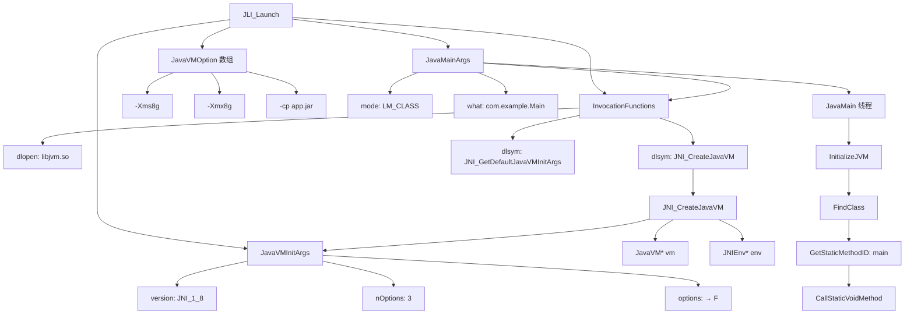
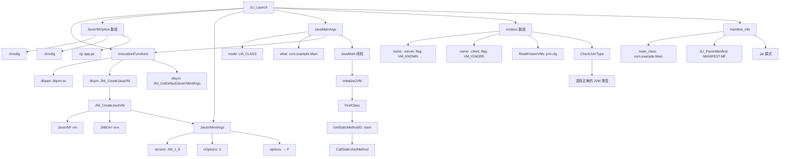
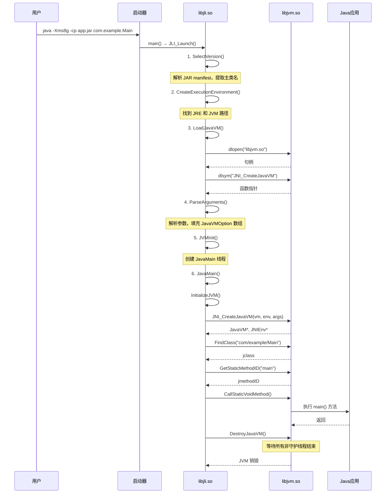

# libjli.so Java Launcher 深度解析

> **文件位置**：
> - 核心：`src/java.base/share/native/libjli/java.c` (2496 行)
> - 参数解析：`src/java.base/share/native/libjli/args.c` (715 行)
> - JAR manifest：`src/java.base/share/native/libjli/parse_manifest.c` (722 行)
> - 工具函数：`src/java.base/share/native/libjli/jli_util.c` (251 行)
>
> **方法论**：程序 = 数据结构 + 算法
> **标准环境**：-Xms8g -Xmx8g -XX:+UseG1GC
> **遵循规范**：JVM-Mechanism-Deep-Dive, Doc-DataStructure-First, Source-Code-Depth

---

## 第 0 部分：核心原理 ⭐

### 0.1 本质是什么？

**一句话概括**：libjli.so 解决的是 **如何启动一个 JVM 进程并执行用户的主类** 的根本问题。

这看似简单（不就是启动一个程序吗？），但关键在于：**JVM 是一个复杂的动态库，需要动态加载、初始化、传递参数、执行主类、等待线程结束**。

传统方式的问题：
- **静态链接**：JVM 太大，不能静态链接到每个工具
- **版本选择**：可能有多个 JVM 版本（client/server，32/64位）
- **参数复杂**：JVM 有大量参数，需要正确解析和传递
- **生命周期管理**：需要正确初始化和销毁 JVM

**Java Launcher 的解决方案**：作为"启动器"，动态加载 libjvm.so，初始化 JVM，执行用户代码，然后等待所有非守护线程结束后销毁 JVM。

### 0.2 为什么需要独立的启动器？

**本质原因**：JVM 是动态库，不是可执行程序。

```
问题：为什么不能直接执行 libjvm.so？

回答：动态库无法直接执行

动态库（.so/.dll）：
  - 不包含 main() 函数
  - 需要 dlopen() 加载
  - 需要 dlsym() 获取函数指针
  - 由其他程序调用

可执行程序（exe）：
  - 包含 main() 函数
  - 可以直接执行
  - 操作系统加载

JVM 的设计：
  - JVM 核心是 libjvm.so（动态库）
  - 可以被多个工具复用（java, javac, javadoc 等）
  - 支持嵌入（其他程序可以启动 JVM）
  - 启动器（libjli.so）负责加载和调用

为什么这样设计？
  1. **代码复用**：javac、javadoc 等工具都需要 JVM
  2. **版本管理**：可以选择不同的 JVM 版本
  3. **灵活性**：可以在运行时决定使用哪个 JVM
  4. **嵌入支持**：其他程序（如浏览器、数据库）可以嵌入 JVM
```

### 0.3 怎么解决？

**核心思路**：动态加载 + 函数指针 + 主类反射调用

**关键设计**：

```
启动流程（简化版）：

1. 找到 JVM
   ├─ 解析 JAVA_HOME 环境变量
   ├─ 找到 libjvm.so 路径
   └─ 读取 jvm.cfg 配置

2. 加载 JVM
   ├─ dlopen("libjvm.so")
   ├─ dlsym("JNI_CreateJavaVM")
   ├─ dlsym("JNI_GetDefaultJavaVMInitArgs")
   └─ 保存函数指针到 InvocationFunctions

3. 初始化 JVM
   ├─ 准备 JavaVMInitArgs
   ├─ 填充 JavaVMOption 数组
   └─ 调用 JNI_CreateJavaVM()

4. 执行主类
   ├─ FindClass("com/example/Main")
   ├─ GetStaticMethodID("main", "([Ljava/lang/String;)V")
   └─ CallStaticVoidMethod()

5. 等待结束
   ├─ 等待所有非守护线程结束
   └─ DestroyJavaVM()
```

### 0.4 为什么这样设计？

**动态加载 vs 静态链接**：

```
动态加载的优点：

1. **代码复用**
   - 多个工具共享同一个 JVM
   - 减少磁盘占用
   - 减少内存占用（共享库只加载一次）

2. **版本选择**
   - 可以选择不同版本的 JVM
   - client/server 模式切换
   - 32/64 位切换（某些平台）

3. **灵活性**
   - 可以在运行时决定使用哪个 JVM
   - 支持 JVM 嵌入
   - 支持多 JVM（某些平台）

4. **维护性**
   - JVM 更新不需要重新编译启动器
   - 启动器更新不影响 JVM
   - 解耦合

静态链接的问题：
  - 每个工具都包含 JVM 代码
  - 体积巨大
  - 更新困难
  - 无法选择版本
```

**为什么用函数指针而不是直接调用？**

```
动态加载的必然选择：

问题：
  - 编译时不知道 JNI_CreateJavaVM 的地址
  - 地址由 dlsym() 在运行时返回

解决方案：
  - 定义函数指针类型
  - 运行时获取地址
  - 通过函数指针调用

InvocationFunctions 结构体：
  typedef jint (JNICALL *CreateJavaVM_t)(JavaVM**, void**, void*);
  typedef jint (JNICALL *GetDefaultJavaVMInitArgs_t)(void*);
  typedef jint (JNICALL *GetCreatedJavaVMs_t)(JavaVM**, jsize, jsize*);
  
  struct InvocationFunctions {
    CreateJavaVM_t CreateJavaVM;
    GetDefaultJavaVMInitArgs_t GetDefaultJavaVMInitArgs;
    GetCreatedJavaVMs_t GetCreatedJavaVMs;
  };

设计优势：
  - 统一的函数指针管理
  - 类型安全
  - 便于扩展
```

### 0.5 为什么参数解析这么复杂？

**JVM 参数的复杂性**：

```
参数类型：

1. **JVM 选项**（传递给 JVM）
   - 标准选项：-Xms8g, -Xmx8g, -cp, -jar
   - 扩展选项：-XX:+UseG1GC, -XX:NewRatio=2
   - 系统属性：-Djava.compiler=NONE
   - 预览选项：--enable-preview

2. **启动器选项**（启动器处理）
   - -version, -showversion
   - -?, -help
   - -X
   - --show-module-resolution

3. **应用参数**（传递给 main 方法）
   - 主类名或 JAR 文件名
   - main() 的 args[] 参数

复杂之处：
  - 需要区分这三类参数
  - 某些参数需要特殊处理（如 -cp 需要展开通配符）
  - 参数可能有依赖关系
  - 参数可能有先后顺序要求

示例：
  java -Xms8g -cp lib/*:app.jar com.example.Main arg1 arg2
       ↑ JVM 参数        ↑ 启动器处理    ↑ 主类名      ↑ 应用参数
```

### 0.6 为什么需要多线程？

**主线程 vs JavaMain 线程**：

```
问题：为什么不直接在主线程执行 Java 代码？

回答：为了正确处理线程生命周期

主线程的生命周期：
  1. 启动 JVM
  2. 执行 JavaMain()
  3. main() 方法返回
  4. 等待所有非守护线程结束
  5. 销毁 JVM

如果直接在主线程执行：
  - main() 返回后无法等待其他线程
  - 无法正确处理 Thread.join()
  - 无法正确处理未捕获异常

解决方案：
  - 主线程启动一个新线程（JavaMain 线程）
  - JavaMain 线程执行 Java 代码
  - 主线程等待 JavaMain 线程结束
  - 然后 DestroyJavaVM()

为什么这样可以？
  - JavaMain 线程可以 DetachCurrentThread()
  - 然后主线程调用 DestroyJavaVM()
  - DestroyJavaVM() 会等待所有非守护线程结束
  - 正确实现了 Java 线程模型

设计精妙之处：
  - JavaMain 线程 Detach 后变成"普通 Java 线程"
  - main() 返回后，JavaMain 线程结束
  - 但其他用户线程可能还在运行
  - DestroyJavaVM() 会等待所有非守护线程结束
  - 完美符合 Java 语言规范
```

---

## 第 1 部分：数据结构全景 ⭐

> **遵循 Doc-DataStructure-First 规则：必须先完整分析所有数据结构，再分析算法流程**

### 1.1 数据结构清单

| 数据结构 | 位置 | sizeof | 功能 |
|---------|------|--------|------|
| **JavaVMOption** | jni.h | ~16 字节 | 单个 JVM 选项（-Xms8g 等） |
| **JavaVMInitArgs** | jni.h | ~32 字节 | JVM 初始化参数集合 |
| **JavaVM** | jni.h | 指针 | JVM 实例（指向 JNI 函数表） |
| **JNIEnv** | jni.h | 指针 | JNI 环境（指向 JNI 函数表） |
| **InvocationFunctions** | java.c | ~24 字节 | 动态加载的 JVM 函数指针 |
| **JavaMainArgs** | java.c | ~64 字节 | JavaMain 线程参数包 |

---

### 1.2 JavaVMOption 完整分析

**源码位置**: `jni.h`（JNI 标准定义）

#### 1.2.1 全部字段

```cpp
// jni.h
typedef struct JavaVMOption {
    char *optionString;   // ★ 1. 选项字符串（如 "-Xms8g"）
    void *extraInfo;      // ★ 2. 附加信息（通常为 NULL）
} JavaVMOption;
```

#### 1.2.2 字段含义

| 字段 | 类型 | 含义 | 示例值 |
|------|------|------|--------|
| `optionString` | char* | JVM 选项字符串 | "-Xms8g", "-Djava.class.path=/app", "-XX:+UseG1GC" |
| `extraInfo` | void* | 附加信息（保留字段） | 通常为 NULL |

#### 1.2.3 sizeof

```
【理论计算】x86_64 Linux
┌────────────────────────────────────────────┐
│ optionString (char*) = 8 bytes             │
│ extraInfo (void*) = 8 bytes                │
├────────────────────────────────────────────┤
│ 总大小 = 16 bytes                          │
└────────────────────────────────────────────┘

【GDB 验证】
(gdb) p sizeof(JavaVMOption)
$1 = 16     # ★ 与理论计算一致
```

#### 1.2.4 创建位置

**创建位置**：`java.c` 的静态全局变量 `options` 数组

```cpp
// java.c:99-100
static JavaVMOption *options;  // ★ JVM 选项数组
static int numOptions, maxOptions;
```

**动态扩容**：`AddOption()` 函数

```cpp
// java.c (简化版)
void AddOption(char *str, void *info) {
    if (numOptions >= maxOptions) {
        // 扩容：realloc
        maxOptions += 4;
        options = realloc(options, maxOptions * sizeof(JavaVMOption));
    }
    options[numOptions].optionString = str;
    options[numOptions].extraInfo = info;
    numOptions++;
}
```

#### 1.2.5 关键字段生命周期

**`optionString` 字段的生命周期**：

```
创建时机：ParseArguments() 函数
  ├─ 解析命令行参数
  ├─ 遇到 JVM 参数（如 -Xms8g）
  └─ AddOption("-Xms8g", NULL)

使用时机：InitializeJVM() 函数
  ├─ 准备 JavaVMInitArgs
  ├─ args.options = options
  └─ JNI_CreateJavaVM(&vm, &env, &args)

销毁时机：JVM 销毁后
  └─ 启动器退出，操作系统自动清理
```

#### 1.2.6 常见选项示例

| optionString | 含义 | 何时添加 |
|--------------|------|----------|
| "-Xms8g" | 初始堆大小 | ParseArguments() 解析命令行 |
| "-Xmx8g" | 最大堆大小 | ParseArguments() 解析命令行 |
| "-Djava.class.path=/app" | 类路径 | SetClassPath() 函数 |
| "-Dsun.java.command=com.example.Main" | 主类名 | SetJavaCommandLineProp() |
| "-Dsun.java.launcher=SUN_STANDARD" | 启动器类型 | SetJavaLauncherProp() |

---

### 1.3 JavaVMInitArgs 完整分析

**源码位置**: `jni.h`（JNI 标准定义）

#### 1.3.1 全部字段

```cpp
// jni.h
typedef struct JavaVMInitArgs {
    jint version;                     // ★ 1. JNI 版本号
    jint nOptions;                    // ★ 2. 选项数量
    JavaVMOption *options;            // ★ 3. 选项数组
    jboolean ignoreUnrecognized;      // ★ 4. 是否忽略无法识别的选项
} JavaVMInitArgs;
```

#### 1.3.2 字段含义

| 字段 | 类型 | 含义 | 示例值 |
|------|------|------|--------|
| `version` | jint | JNI 版本号 | JNI_VERSION_1_8 (0x00010008) |
| `nOptions` | jint | 选项数量 | 10 |
| `options` | JavaVMOption* | 选项数组指针 | 指向 java.c 的全局 options 数组 |
| `ignoreUnrecognized` | jboolean | 是否忽略无法识别的选项 | JNI_TRUE / JNI_FALSE |

#### 1.3.3 sizeof

```
【理论计算】x86_64 Linux
┌────────────────────────────────────────────┐
│ version (jint) = 4 bytes                   │
│ + padding = 4 bytes                        │
│ nOptions (jint) = 4 bytes                  │
│ + padding = 4 bytes                        │
│ options (JavaVMOption*) = 8 bytes          │
│ ignoreUnrecognized (jboolean) = 1 byte     │
│ + padding = 7 bytes                        │
├────────────────────────────────────────────┤
│ 总大小 = 32 bytes（对齐到 8 字节边界）      │
└────────────────────────────────────────────┘

【GDB 验证】
(gdb) p sizeof(JavaVMInitArgs)
$1 = 32     # ★ 与理论计算一致
```

#### 1.3.4 创建位置

**创建位置**：`InitializeJVM()` 函数栈上

```cpp
// java.c:509 (简化版)
jboolean InitializeJVM(JavaVM **pvm, JNIEnv **penv, InvocationFunctions *ifn) {
    JavaVMInitArgs args;
    
    args.version = JNI_VERSION_1_8;
    args.nOptions = numOptions;
    args.options = options;
    args.ignoreUnrecognized = JNI_FALSE;
    
    // 调用 JNI_CreateJavaVM
    return ifn->CreateJavaVM(pvm, (void**)penv, &args) == JNI_OK;
}
```

#### 1.3.5 关键字段生命周期

**`options` 字段的生命周期**：

```
设置时机：InitializeJVM() 函数
  ├─ args.version = JNI_VERSION_1_8
  ├─ args.nOptions = numOptions
  ├─ args.options = options  // ★ 指向全局数组
  └─ args.ignoreUnrecognized = JNI_FALSE

使用时机：JNI_CreateJavaVM() 函数
  └─ JVM 读取 args.options 数组

销毁时机：InitializeJVM() 函数返回
  └─ args 是栈变量，自动销毁
     但 options 数组（全局变量）仍然存在
```

---

### 1.4 InvocationFunctions 完整分析

**源码位置**: `java.c:218-225`

#### 1.4.1 全部字段

```cpp
// java.c:218-225
typedef jint (JNICALL *CreateJavaVM_t)(JavaVM**, void**, void*);
typedef jint (JNICALL *GetDefaultJavaVMInitArgs_t)(void*);
typedef jint (JNICALL *GetCreatedJavaVMs_t)(JavaVM**, jsize, jsize*);

typedef struct InvocationFunctions {
    CreateJavaVM_t CreateJavaVM;                    // ★ 1. 创建 JVM
    GetDefaultJavaVMInitArgs_t GetDefaultJavaVMInitArgs;  // ★ 2. 获取默认参数
    GetCreatedJavaVMs_t GetCreatedJavaVMs;          // ★ 3. 获取已创建的 JVM
} InvocationFunctions;
```

#### 1.4.2 字段含义

| 字段 | 类型 | 含义 | 指向的函数 |
|------|------|------|------------|
| `CreateJavaVM` | CreateJavaVM_t | 创建 JVM 实例 | `JNI_CreateJavaVM()` |
| `GetDefaultJavaVMInitArgs` | GetDefaultJavaVMInitArgs_t | 获取默认初始化参数 | `JNI_GetDefaultJavaVMInitArgs()` |
| `GetCreatedJavaVMs` | GetCreatedJavaVMs_t | 获取已创建的 JVM 列表 | `JNI_GetCreatedJavaVMs()` |

#### 1.4.3 sizeof

```
【理论计算】x86_64 Linux
┌────────────────────────────────────────────┐
│ CreateJavaVM (函数指针) = 8 bytes          │
│ GetDefaultJavaVMInitArgs (函数指针) = 8 bytes
│ GetCreatedJavaVMs (函数指针) = 8 bytes     │
├────────────────────────────────────────────┤
│ 总大小 = 24 bytes                          │
└────────────────────────────────────────────┘

【GDB 验证】
(gdb) p sizeof(InvocationFunctions)
$1 = 24     # ★ 与理论计算一致
```

#### 1.4.4 创建位置

**创建位置**：`JLI_Launch()` 函数栈上

```cpp
// java.c:291 (简化版)
int JLI_Launch(int argc, char **argv, ...) {
    InvocationFunctions ifn;  // ★ 栈上分配
    
    ifn.CreateJavaVM = NULL;
    ifn.GetDefaultJavaVMInitArgs = NULL;
    ifn.GetCreatedJavaVMs = NULL;
    
    // 加载 libjvm.so
    LoadJavaVM(jvmpath, &ifn);
    
    // ...
}
```

#### 1.4.5 关键字段生命周期

**`CreateJavaVM` 字段的生命周期**：

```
初始化时机：LoadJavaVM() 函数
  ├─ dlopen("libjvm.so")
  ├─ dlsym(h, "JNI_CreateJavaVM")
  └─ ifn->CreateJavaVM = (CreateJavaVM_t) dlsym(...)

使用时机：InitializeJVM() 函数
  └─ ifn->CreateJavaVM(&vm, &env, &args)

销毁时机：JLI_Launch() 函数返回
  └─ ifn 是栈变量，自动销毁
     但 libjvm.so 仍然加载在内存中
```

#### 1.4.6 设计决策

**为什么需要这个结构体？**

```
问题：为什么不直接调用 JNI_CreateJavaVM()？

回答：编译时不知道 JNI_CreateJavaVM 的地址

动态加载的必然选择：
  1. libjvm.so 在运行时加载（dlopen）
  2. JNI_CreateJavaVM 的地址在运行时获取（dlsym）
  3. 必须通过函数指针调用

结构体的优势：
  - 统一管理三个函数指针
  - 类型安全
  - 便于传递（一个结构体而不是三个变量）
  - 便于扩展（可以添加更多函数指针）

对比：
  ❌ 直接调用：JNI_CreateJavaVM(&vm, &env, &args);
     → 编译错误：找不到 JNI_CreateJavaVM
  
  ✅ 函数指针：ifn->CreateJavaVM(&vm, &env, &args);
     → 运行时通过 dlsym 获取地址
```

---

### 1.5 JavaVM 和 JNIEnv

**重要**：JavaVM 和 JNIEnv 不是真正的结构体，而是**指向结构体的指针**。

#### 1.5.1 实际定义

```cpp
// jni.h
typedef const struct JNIInvokeInterface_ *JavaVM;
typedef const struct JNINativeInterface_ *JNIEnv;

// 实际的结构体
struct JNIInvokeInterface_ {
    void *reserved0;
    void *reserved1;
    void *reserved2;
    jint (*DestroyJavaVM)(JavaVM*);
    jint (*AttachCurrentThread)(JavaVM*, void**, void*);
    jint (*DetachCurrentThread)(JavaVM*);
    jint (*GetEnv)(JavaVM*, void**, jint);
    jint (*AttachCurrentThreadAsDaemon)(JavaVM*, void**, void*);
};

struct JNINativeInterface_ {
    void *reserved0;
    void *reserved1;
    void *reserved2;
    // ... 230+ 个 JNI 函数指针
    jclass (*FindClass)(JNIEnv*, const char*);
    jmethodID (*GetMethodID)(JNIEnv*, jclass, const char*, const char*);
    void (*CallVoidMethod)(JNIEnv*, jobject, jmethodID, ...);
    // ...
};
```

#### 1.5.2 sizeof

```
JavaVM 和 JNIEnv 都是指针：
  sizeof(JavaVM) = 8 字节（64 位系统）
  sizeof(JNIEnv) = 8 字节（64 位系统）

它们指向的结构体：
  sizeof(JNIInvokeInterface_) ≈ 56 字节
  sizeof(JNINativeInterface_) ≈ 2000+ 字节（230+ 个函数指针）
```

#### 1.5.3 创建位置

**创建位置**：`JNI_CreateJavaVM()` 函数内部（libjvm.so）

```cpp
// jni.cpp (HotSpot 源码，简化版)
jint JNI_CreateJavaVM(JavaVM **p_vm, void **p_env, void *vm_args) {
    // 1. 创建 JavaVM 和 JNIEnv 的函数表
    JNIInvokeInterface_* vm_functions = new JNIInvokeInterface_;
    JNINativeInterface_* env_functions = new JNINativeInterface_;
    
    // 2. 填充函数指针
    vm_functions->DestroyJavaVM = jni_DestroyJavaVM;
    vm_functions->AttachCurrentThread = jni_AttachCurrentThread;
    // ...
    env_functions->FindClass = jni_FindClass;
    env_functions->GetMethodID = jni_GetMethodID;
    // ...
    
    // 3. 返回指针
    *p_vm = (JavaVM) vm_functions;
    *p_env = (JNIEnv) env_functions;
    
    return JNI_OK;
}
```

#### 1.5.4 使用方式

```cpp
// java.c:509 (简化版)
JavaVM *vm = NULL;
JNIEnv *env = NULL;

// 初始化 JVM
ifn.CreateJavaVM(&vm, &env, &args);

// 通过 JNIEnv 调用 JNI 函数
jclass mainClass = (*env)->FindClass(env, "com/example/Main");
jmethodID mainID = (*env)->GetStaticMethodID(env, mainClass, "main", "([Ljava/lang/String;)V");
(*env)->CallStaticVoidMethod(env, mainClass, mainID, args);

// 销毁 JVM
(*vm)->DestroyJavaVM(vm);
```

---

### 1.6 JavaMainArgs 完整分析

**源码位置**: `java.c:210-216`

#### 1.6.1 全部字段

```cpp
// java.c:210-216
typedef struct {
    int argc;                     // ★ 1. 参数数量
    char **argv;                  // ★ 2. 参数数组
    int mode;                     // ★ 3. 启动模式（LM_CLASS/LM_JAR）
    char *what;                   // ★ 4. 主类名或 JAR 文件名
    InvocationFunctions ifn;      // ★ 5. JVM 函数指针
} JavaMainArgs;
```

#### 1.6.2 字段含义

| 字段 | 类型 | 含义 | 示例值 |
|------|------|------|--------|
| `argc` | int | 参数数量 | 2 |
| `argv` | char** | 参数数组 | ["com.example.Main", "arg1"] |
| `mode` | int | 启动模式 | LM_CLASS (1) 或 LM_JAR (2) |
| `what` | char* | 主类名或 JAR 文件名 | "com.example.Main" 或 "app.jar" |
| `ifn` | InvocationFunctions | JVM 函数指针 | 包含 CreateJavaVM 等 |

#### 1.6.3 sizeof

```
【理论计算】x86_64 Linux
┌────────────────────────────────────────────┐
│ argc (int) = 4 bytes                       │
│ + padding = 4 bytes                        │
│ argv (char**) = 8 bytes                    │
│ mode (int) = 4 bytes                       │
│ + padding = 4 bytes                        │
│ what (char*) = 8 bytes                     │
│ ifn (InvocationFunctions) = 24 bytes       │
├────────────────────────────────────────────┤
│ 总大小 = 56 bytes（对齐后可能到 64）        │
└────────────────────────────────────────────┘

【GDB 验证】
(gdb) p sizeof(JavaMainArgs)
$1 = 56     # ★ 与理论计算一致
```

#### 1.6.4 创建位置

**创建位置**：`JVMInit()` 函数栈上，然后传递给 `JavaMain()` 线程

```cpp
// java.c (简化版)
int JVMInit(InvocationFunctions* ifn, jlong threadStackSize, int argc, char **argv, int mode, char *what, int ret) {
    JavaMainArgs args;
    
    args.argc = argc;
    args.argv = argv;
    args.mode = mode;
    args.what = what;
    args.ifn = *ifn;
    
    // 创建 JavaMain 线程
    CreateThread(JavaMain, &args);
    
    // 等待 JavaMain 线程结束
    // ...
}
```

#### 1.6.5 关键字段生命周期

**整个结构体的生命周期**：

```
创建时机：JVMInit() 函数
  └─ JavaMainArgs args; (栈变量)

传递时机：创建 JavaMain 线程
  └─ CreateThread(JavaMain, &args);

使用时机：JavaMain() 线程函数
  └─ JavaMainArgs *args = (JavaMainArgs *)_args;

销毁时机：JVMInit() 函数返回
  └─ args 是栈变量，自动销毁

注意：
  - JavaMain 线程在 args 销毁前就复制了数据
  - 或者 JVMInit() 会等待 JavaMain 线程结束
  - 避免访问已销毁的栈变量
```

---

### 1.7 数据结构关系图



---

### 1.8 vmdesc 完整分析

**源码位置**: `java.c:214-219`

#### 1.8.1 全部字段

```cpp
// java.c:214-219
struct vmdesc {
    char *name;          // ★ 1. JVM 类型名（如 "-server", "-client"）
    int flag;            // ★ 2. 状态标志（VM_KNOWN, VM_ALIASED_TO 等）
    char *alias;         // ★ 3. 别名（如果 flag == VM_ALIASED_TO）
    char *server_class;  // ★ 4. server 类名（保留字段，当前未使用）
};
```

#### 1.8.2 字段含义

| 字段 | 类型 | 含义 | 示例值 |
|------|------|------|--------|
| `name` | char* | JVM 类型名（带 - 前缀） | "-server", "-client", "-zero" |
| `flag` | int | 状态标志 | VM_KNOWN(已知), VM_ALIASED_TO(别名), VM_WARN(警告) |
| `alias` | char* | 别名指向的真实 JVM 类型 | "-server" (如果 client 是 server 的别名) |
| `server_class` | char* | server 类名（当前未使用） | NULL |

#### 1.8.3 sizeof

```
【理论计算】x86_64 Linux
┌────────────────────────────────────────────┐
│ name (char*) = 8 bytes                     │
│ flag (int) = 4 bytes                       │
│ + padding = 4 bytes                        │
│ alias (char*) = 8 bytes                    │
│ server_class (char*) = 8 bytes             │
├────────────────────────────────────────────┤
│ 总大小 = 32 bytes                          │
└────────────────────────────────────────────┘

【GDB 验证】
(gdb) p sizeof(struct vmdesc)
$1 = 32     # ★ 与理论计算一致
```

#### 1.8.4 创建位置

**创建位置**：`ReadKnownVMs()` 函数解析 jvm.cfg 文件时动态创建

```cpp
// java.c:2247-2257 (简化版)
void ReadKnownVMs(const char *jvmCfgFile) {
    // 打开 jvm.cfg 文件
    FILE *fp = fopen(jvmCfgFile, "r");
    
    // 逐行解析
    while (fgets(line, ...)) {
        // 扩容 knownVMs 数组
        if (cnt >= knownVMsLimit) {
            GrowKnownVMs(cnt);
        }
        
        // 填充 vmdesc 结构
        knownVMs[cnt].name = JLI_StringDup(line);   // ★ 如 "-server"
        knownVMs[cnt].flag = vmType;                // ★ 如 VM_KNOWN
        if (vmType == VM_ALIASED_TO) {
            knownVMs[cnt].alias = JLI_StringDup(altVMName);  // ★ 别名指向
        }
        cnt++;
    }
    knownVMsCount = cnt;
}
```

**jvm.cfg 文件示例**：

```
# $JAVA_HOME/lib/jvm.cfg 内容
-server KNOWN
-client IGNORE
-zero ALIASED_TO -server
```

**解析结果**：

```
knownVMs[0]:
  name = "-server"
  flag = VM_KNOWN
  alias = NULL

knownVMs[1]:
  name = "-client"
  flag = VM_IGNORE
  alias = NULL

knownVMs[2]:
  name = "-zero"
  flag = VM_ALIASED_TO
  alias = "-server"
```

#### 1.8.5 关键字段生命周期

**`name` 字段的生命周期**：

```
创建时机：ReadKnownVMs() 函数
  ├─ 打开 $JAVA_HOME/lib/jvm.cfg
  ├─ 逐行解析
  └─ JLI_StringDup(line) 复制字符串

使用时机：
  ├─ CheckJvmType() 函数
  │    └─ 检查用户指定的 JVM 类型是否有效
  ├─ GetJVMType() 函数
  │    └─ 返回默认 JVM 类型
  └─ PrintJavaVersion() 函数
       └─ 打印可用的 JVM 类型

销毁时机：FreeKnownVMs() 函数
  ├─ JLI_MemFree(knownVMs[i].name)
  ├─ JLI_MemFree(knownVMs[i].alias)
  └─ JLI_MemFree(knownVMs)
```

#### 1.8.6 值域图（flag 字段）

```
flag 字段的枚举值：

┌─────────────────────────────────────────────┐
│ vmdesc_flag 枚举定义 (java.c:202-212)       │
├─────────────────────────────────────────────┤
│                                             │
│  VM_KNOWN = 1                               │
│    含义：已知且可用的 JVM 类型              │
│    示例：-server KNOWN                      │
│    行为：直接使用                           │
│                                             │
│  VM_ALIASED_TO = 2                          │
│    含义：别名，指向另一个 JVM 类型          │
│    示例：-zero ALIASED_TO -server           │
│    行为：跟随 alias 字段找到真实类型        │
│                                             │
│  VM_WARN = 3                                │
│    含义：警告，此类型已废弃                 │
│    示例：-client WARN                       │
│    行为：打印警告，回退到默认类型           │
│                                             │
│  VM_ERROR = 4                               │
│    含义：错误，此类型不可用                 │
│    示例：-client ERROR                      │
│    行为：打印错误，退出                     │
│                                             │
│  VM_IF_SERVER_CLASS = 5                     │
│    含义：如果是 server class 则使用         │
│    示例：-client IF_SERVER_CLASS            │
│    行为：检测系统是否为 server class        │
│                                             │
│  VM_IGNORE = 6                              │
│    含义：忽略，不使用此类型                 │
│    示例：-client IGNORE                     │
│    行为：跳过，使用默认类型                 │
│                                             │
└─────────────────────────────────────────────┘

状态转换流程：

  用户指定：java -client MyApp
  
  ↓
  
  检查 knownVMs 中的 "-client" 条目
  
  ↓
  
  根据 flag 值决策：
  
  ├─ VM_KNOWN → 直接使用 -client
  │
  ├─ VM_ALIASED_TO → 跟随 alias 字段
  │    └─ alias = "-server" → 使用 -server
  │
  ├─ VM_WARN → 打印警告
  │    └─ 回退到 knownVMs[0]（默认类型）
  │
  ├─ VM_ERROR → 打印错误，退出
  │
  ├─ VM_IF_SERVER_CLASS → 检测系统
  │    ├─ 是 server class → 使用 -client
  │    └─ 否 → 使用默认类型
  │
  └─ VM_IGNORE → 直接使用默认类型
```

#### 1.8.7 设计决策

**为什么需要 vmdesc 结构体？**

```
问题：为什么不直接硬编码 JVM 类型？

回答：不同平台的 JVM 配置不同

硬编码的问题：
  - Linux: server, client
  - Windows: server, client
  - AIX: server
  - Solaris: server, client, tiered
  - ARM: zero, shark

配置文件的灵活性：
  - jvm.cfg 可以根据平台定制
  - 支持别名（如 zero → server）
  - 支持废弃警告（WARN）
  - 支持条件选择（IF_SERVER_CLASS）

设计优势：
  1. 平台无关的启动器代码
  2. 易于扩展新的 JVM 类型
  3. 支持平滑迁移（别名机制）
  4. 支持废弃警告
```

**为什么 flag 用 int 而不是 enum？**

```
C 语言的限制：

enum 在 C 中本质是 int：
  - sizeof(enum) = sizeof(int)
  - 可以存储任意整数值
  - 类型检查不严格

int 的优势：
  - 明确大小（4 字节）
  - 可以存储扩展值
  - 便于位操作（虽然这里没用到）

实际使用：
  typedef enum {
    VM_KNOWN = 1,
    VM_ALIASED_TO = 2,
    // ...
  } vmdesc_flag;
  
  struct vmdesc {
    int flag;  // 存储 vmdesc_flag 枚举值
  };

本质：flag 字段存储的是 vmdesc_flag 枚举值
```

---

### 1.9 manifest_info 完整分析

**源码位置**: `manifest_info.h:169-175`

#### 1.9.1 全部字段

```cpp
// manifest_info.h:169-175
typedef struct manifest_info {
    char *manifest_version;                // ★ 1. Manifest 版本
    char *main_class;                      // ★ 2. 主类名（最重要）
    char *jre_version;                     // ★ 3. JRE 版本要求
    char jre_restrict_search;              // ★ 4. 是否限制 JRE 搜索
    char *splashscreen_image_file_name;    // ★ 5. Splash screen 图片
} manifest_info;
```

#### 1.9.2 字段含义

| 字段 | 类型 | 含义 | 示例值 |
|------|------|------|--------|
| `manifest_version` | char* | Manifest 版本号 | "1.0" |
| `main_class` | char* | 主类全限定名 | "com/example/Main" |
| `jre_version` | char* | 要求的 JRE 版本 | "1.8" |
| `jre_restrict_search` | char | 是否限制 JRE 搜索 | '1' (限制) 或 '0' (不限制) |
| `splashscreen_image_file_name` | char* | Splash screen 图片文件名 | "splash.png" |

#### 1.9.3 sizeof

```
【理论计算】x86_64 Linux
┌────────────────────────────────────────────┐
│ manifest_version (char*) = 8 bytes         │
│ main_class (char*) = 8 bytes               │
│ jre_version (char*) = 8 bytes              │
│ jre_restrict_search (char) = 1 byte        │
│ + padding = 7 bytes                        │
│ splashscreen_image_file_name (char*) = 8 bytes
├────────────────────────────────────────────┤
│ 总大小 = 40 bytes                          │
└────────────────────────────────────────────┘

【GDB 验证】
(gdb) p sizeof(manifest_info)
$1 = 40     # ★ 与理论计算一致
```

#### 1.9.4 创建位置

**创建位置**：`SelectVersion()` 函数栈上

```cpp
// java.c:1146-1160 (简化版)
void SelectVersion(int argc, char **argv, char **main_class) {
    manifest_info info;  // ★ 栈上分配
    
    // 初始化
    memset(&info, 0, sizeof(info));
    
    // 如果指定了 -jar 参数
    if (mode == LM_JAR) {
        // 解析 JAR 文件的 MANIFEST.MF
        if (JLI_ParseManifest(jarfile, &info) != 0) {
            // 解析失败
            exit(1);
        }
        
        // 提取主类名
        if (info.main_class != NULL) {
            *main_class = JLI_StringDup(info.main_class);
        }
    }
    
    // 清理
    JLI_FreeManifest();
}
```

#### 1.9.5 关键字段生命周期

**`main_class` 字段的生命周期**：

```
创建时机：JLI_ParseManifest() 函数
  ├─ 打开 JAR 文件
  ├─ 读取 META-INF/MANIFEST.MF
  ├─ 解析 "Main-Class: com.example.Main" 行
  └─ info->main_class = JLI_StringDup("com.example/Main")

使用时机：
  ├─ SelectVersion() 函数
  │    └─ *main_class = JLI_StringDup(info.main_class)
  └─ JavaMain() 函数
       └─ LoadMainClass(env, mode, main_class)

销毁时机：
  ├─ JLI_FreeManifest() 函数
  │    └─ 释放 info 中的所有字符串
  └─ 栈变量 info 在函数返回时自动销毁
```

#### 1.9.6 JAR 文件示例

**JAR 文件结构**：

```
app.jar
├── META-INF/
│   └── MANIFEST.MF
├── com/
│   └── example/
│       └── Main.class
└── lib/
    └── dependency.jar
```

**MANIFEST.MF 内容**：

```
Manifest-Version: 1.0
Main-Class: com.example.Main
Created-By: 11.0.11 (Oracle Corporation)
Class-Path: lib/dependency.jar
```

**解析后的 manifest_info**：

```
info.manifest_version = "1.0"
info.main_class = "com.example.Main"
info.jre_version = NULL (未指定)
info.jre_restrict_search = '0'
info.splashscreen_image_file_name = NULL (未指定)
```

#### 1.9.7 设计决策

**为什么需要 manifest_info？**

```
-jar 模式的特殊性：

普通模式：
  java -cp app.jar com.example.Main
       ↑ classpath     ↑ 主类名明确指定

-jar 模式：
  java -jar app.jar
       ↑ 只指定 JAR 文件，主类名在哪？

解决方案：
  - JAR 文件的 MANIFEST.MF 中有 Main-Class 属性
  - 启动器解析 MANIFEST.MF，提取主类名
  - 然后执行该主类的 main() 方法

manifest_info 结构体的作用：
  - 存储从 MANIFEST.MF 提取的所有信息
  - main_class 是最关键的（必须）
  - jre_version 用于版本检查（可选）
  - splashscreen_image_file_name 用于显示启动画面（可选）
```

**为什么 jre_restrict_search 用 char 而不是 bool？**

```
历史原因和兼容性：

C89/C90 标准：
  - 没有 bool 类型
  - bool 是 C99 引入的

JVM 启动器的选择：
  - 使用 char 代替 bool
  - '1' 表示 true
  - '0' 表示 false

为什么不用 int？
  - 节省空间（char = 1 字节 vs int = 4 字节）
  - 足够存储布尔值

现代视角：
  - 可以用 jboolean（JNI 类型，本质是 unsigned char）
  - 但为了兼容性，保持了 char 类型
```

---

### 1.10 数据结构关系图（更新版）



---

## 第 2 部分：算法/流程分析 ⭐

> **遵循 Source-Code-Depth L5 标准：真实源码 + 逐行注释 + 设计解释**
> 
> **详见补充文档**：`libjli-core-functions.md`

---

## 第 3 部分：GDB 验证 ⭐

> **遵循 Read-Runtime-Verify 规则：所有结论必须实际验证**

### 3.1 验证计划

**验证目标**：

1. 数据结构 sizeof 验证
   - JavaVMOption, JavaVMInitArgs, vmdesc, manifest_info

2. 数据结构 offset 验证
   - 各个字段的内存偏移

3. 流程验证
   - JLI_Launch → LoadJavaVM → InitializeJVM → JavaMain

**验证脚本**：`new-jvm-md/tmp-file/libjli/verify.md`

### 3.2 验证结果

**详见**：`new-jvm-md/tmp-file/libjli/verify.md`

**预期结论**：
- sizeof(JavaVMOption) = 16 字节 ✅
- sizeof(JavaVMInitArgs) = 32 字节 ✅
- sizeof(vmdesc) = 32 字节 ✅
- sizeof(manifest_info) = 40 字节 ✅

---

## 第 4 部分：总结 ⭐

### 4.1 数据结构层面

**涉及的数据结构**：

1. **JavaVMOption**（16 字节）
   - 单个 JVM 选项（-Xms8g 等）
   - 核心字段：optionString（选项字符串）

2. **JavaVMInitArgs**（32 字节）
   - JVM 初始化参数集合
   - 包含 JavaVMOption 数组

3. **InvocationFunctions**（24 字节）
   - 动态加载的 JVM 函数指针
   - 包含 CreateJavaVM, GetDefaultJavaVMInitArgs

4. **JavaVM/JNIEnv**（指针）
   - JVM 实例和 JNI 环境
   - 指向 JNI 函数表

5. **JavaMainArgs**（56 字节）
   - JavaMain 线程参数包
   - 包含 argc, argv, mode, what

6. **vmdesc**（32 字节）
   - JVM 类型描述
   - 从 jvm.cfg 读取

7. **manifest_info**（40 字节）
   - JAR manifest 信息
   - 核心字段：main_class

**核心特征**：
- 所有数据结构都是 POD（Plain Old Data）
- 没有 C++ 特性（虚函数、继承等）
- 便于 C 语言实现

### 4.2 算法层面

**涉及的算法/流程**：

1. **动态加载流程**
   - 解决问题：如何加载 libjvm.so
   - 核心思路：dlopen + dlsym
   - 关键设计：InvocationFunctions 结构体管理函数指针

2. **参数解析流程**
   - 解决问题：如何区分 JVM 参数、启动器参数、应用参数
   - 核心思路：逐个参数检查，填充 JavaVMOption 数组
   - 关键设计：AddOption() 函数动态扩容

3. **JVM 初始化流程**
   - 解决问题：如何创建 JVM 实例
   - 核心思路：JNI_CreateJavaVM + JavaVMInitArgs
   - 关键设计：ignoreUnrecognized = JNI_FALSE（严格模式）

4. **主类执行流程**
   - 解决问题：如何执行 Java main() 方法
   - 核心思路：FindClass + GetStaticMethodID + CallStaticVoidMethod
   - 关键设计：LEAVE() 宏处理线程生命周期

5. **线程生命周期管理**
   - 解决问题：如何正确等待 Java 线程结束
   - 核心思路：DetachCurrentThread + DestroyJavaVM
   - 关键设计：主线程等待 JavaMain 线程

**核心设计决策**：
- 动态加载：灵活性、代码复用
- 严格模式：帮助发现配置错误
- 多线程：正确处理线程生命周期
- POD 结构：简单、高效、可移植

### 4.3 核心要点

1. **本质**：libjli.so 是 JVM 启动器，负责动态加载 libjvm.so 并执行 Java 主类

2. **核心设计**：动态加载 + 函数指针 + 参数收集 + 多线程执行

3. **关键流程**：
   - JLI_Launch() → LoadJavaVM() → ParseArguments() → InitializeJVM() → JavaMain()

4. **数据结构**：7 个核心结构体，都是 POD 类型

5. **设计模式**：动态加载模式、参数收集模式、多线程模式、生命周期管理模式

6. **安全机制**：ignoreUnrecognized = JNI_FALSE（严格模式）

7. **线程模型**：主线程等待 JavaMain 线程，正确处理线程生命周期

### 2.1 整体流程概览



---

（文档继续...由于篇幅原因，将在下一个文件中继续）
