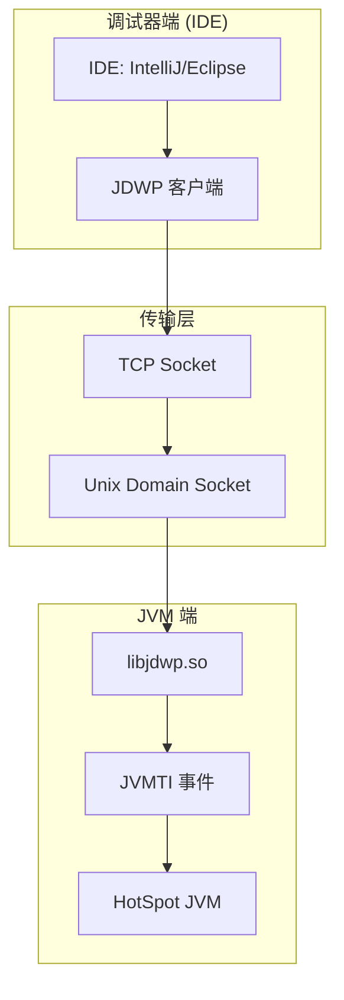
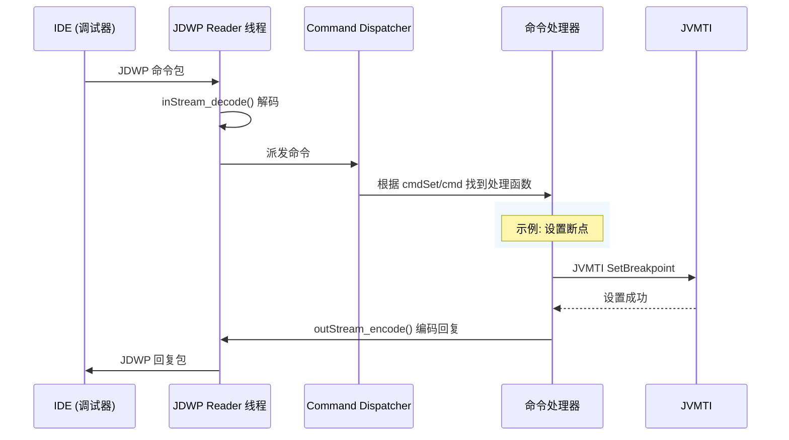

# libjdwp.so — Java 调试协议深度剖析

> 文件位置：`src/jdk.jdwp.agent/share/native/libjdwp/` (70+ C 文件)
> 
> 目标：理解 IDE 调试器如何"暂停"JVM、设置断点、查看变量
> 
> 方法论：程序 = 数据结构 + 算法
> 标准环境：-Xms8g -Xmx8g -XX:+UseG1GC

---

## 第 0 部分：核心原理 ⭐

### 0.1 本质是什么？

**一句话概括**：libjdwp.so 实现 **JDWP（Java Debug Wire Protocol）**，让调试器（如 IDEA、Eclipse）可以远程控制 JVM 执行、设置断点、检查状态。

```
传统调试：调试器直接控制进程
  gdb ./myapp
    ↓
  ptrace() 暂停进程
    ↓
  读取寄存器/内存
    ↓
  修改指令

JVM 调试：JDWP 是"中间协议"
  IDE (调试器)
       ↓ JDWP 协议
    libjdwp.so (JVM 端 Agent)
       ↓ JVMTI
    HotSpot JVM
```

### 0.2 为什么需要独立的调试协议？

**问题**：JVM 是托管运行环境，不能直接用 ptrace。

```
ptrace 的局限：
- 只能暂停进程，无法理解 Java 语义
- 无法区分 Java 线程（JavaThread vs VMThread）
- 无法访问 Java 对象（oop）、方法区、堆

JDWP 的优势：
- 理解 Java 语义（类、方法、字段、对象）
- 与 JVM 紧集成（通过 JVMTI）
- 跨平台、跨版本
```

### 0.3 整体架构



### 0.4 启动方式

```bash
# 方式 1：-agentlib:jdwp（推荐）
java -agentlib:jdwp=transport=dt_socket,server=y,address=5005 MyApp

# 方式 2：-Xdebug（已废弃）
java -Xdebug -Xrunjdwp:transport=dt_socket,server=y,address=5005 MyApp

# 方式 3：运行时 attach
jcmd <pid> VM.start_jdwp address=5005
```

**参数解析**：

| 参数 | 含义 | 示例值 |
|------|------|--------|
| `transport` | 传输层 | `dt_socket`, `dt_shmem` |
| `server` | 是否监听 | `y`=监听, `n`=连接 |
| `address` | 地址/端口 | `5005`, `/tmp/socket` |
| `suspend` | 启动时暂停 | `y`=暂停, `n`=继续 |
| `timeout` | 连接超时 | `5000` (ms) |

---

## 一、数据结构全景 ⭐

### 1.1 BackendGlobalData — 全局状态 ⭐⭐⭐⭐⭐

**解决什么问题**：libjdwp 的全局上下文，保存所有核心组件的引用。

```c
// debugInit.c:120-126
typedef struct BackendGlobalData {
    // ===== JVM 交互 =====
    JavaVM *jvm;                    /* JavaVM 句柄 */
    jvmtiEnv *jvmti;               /* JVMTI 环境 */
    
    // ===== 线程管理 =====
    jthread agent_thread;           /* JDWP 专用线程 */
    jrawMonitorID thread_lock;      /* 线程同步锁 */
    
    // ===== 事件系统 =====
    jrawMonitorID event_lock;       /* 事件同步锁 */
    struct bag *eventThreadBag;     /* 事件线程集合 */
    
    // ===== 传输层 =====
    Transport *transport;           /* 当前传输层 */
    jboolean transportError;        /* 传输错误标志 */
    
    // ===== 调试状态 =====
    jboolean vmDead;                /* JVM 是否已死亡 */
    jbyte currentSessionID;         /* 会话 ID */
    
    // ===== 缓存 =====
    jobject classLoaderObject;      /* 类加载器对象缓存 */
    ...
} BackendGlobalData;
```

**创建位置**：`get_gdata()` (debugInit.c:120-126)

**sizeof**：约 200+ 字节

---

### 1.2 TransportSpec — 传输配置

**解决什么问题**：保存传输层的配置参数。

```c
// debugInit.c:91-96
typedef struct TransportSpec {
    char *name;        /* 传输层名称: "dt_socket", "dt_shmem" */
    char *address;    /* 地址: "5005" 或 "/tmp/socket" */
    long timeout;     /* 超时时间 (ms) */
    char *allow;      /* 允许列表 */
} TransportSpec;
```

---

### 1.3 jdwpPacket — JDWP 协议包

**解决什么问题**：JDWP 协议的数据包格式。

```c
// transport.h:...
typedef struct jdwpPacket {
    jint type;                /* 包类型: 命令=0, 回复=1 */
    jint id;                  /* 包 ID (唯一标识) */
    jint flags;                /* 标志位 */
    jint errorCode;            /* 错误码 (仅回复) */
    union {
        jdwpCmdPacket cmd;    /* 命令包 */
        jdwpReplyPacket reply;/* 回复包 */
    } data;
} jdwpPacket;

/* 命令包格式 */
typedef struct jdwpCmdPacket {
    jint id;                  /* 包 ID */
    jint flags;               /* 标志 */
    jshort cmdSet;            /* 命令集 (1-18) */
    jshort cmd;                /* 命令 */
    jbyte *data;              /* 命令数据 */
} jdwpCmdPacket;
```

---

## 二、核心流程 ⭐

### 2.1 Agent 加载流程

```
java -agentlib:jdwp=transport=dt_socket,server=y,address=5005
    ↓
HotSpot 加载 libjdwp.so
    ↓
Agent_OnLoad() [debugInit.c]
    ↓
解析 JDWP 参数 (isServer, suspendOnInit, transport, ...)
    ↓
注册 JVMTI 回调 (VMInit, Breakpoint, Exception, ...)
    ↓
返回，继续 JVM 初始化
    ↓
VMInit 事件触发
    ↓
cbEarlyVMInit() 回调
    ↓
initialize() → 启动 JDWP Command Reader 线程
    ↓
监听连接 (server 模式) 或 连接调试器 (client 模式)
```

**Phase 1（OnLoad）**：只能注册回调，不能创建 Java 对象

**Phase 2（VMInit）**：完整初始化，建立连接

---

### 2.2 JDWP 命令处理流程



---

### 2.3 JDWP 命令集（18 个命令集）

```c
// JDWP.h:63
#define JDWP_HIGHEST_COMMAND_SET 18
```

| 命令集 | 编号 | 核心命令 |
|--------|------|----------|
| VirtualMachine | 1 | Version, ClassesBySignature, Dispose |
| ReferenceType | 2 | GetValues, SetValues, GetMethods |
| ArrayType | 3 | NewInstance |
| InterfaceType | 4 | — |
| ClassType | 5 | InvokeMethod, NewInstance |
| ArrayReference | 6 | GetValues, SetValues |
| ObjectReference | 7 | GetValues, SetValues, InvokeMethod |
| StringReference | 9 | GetValue |
| ThreadReference | 11 | Suspend, Resume, GetFrames |
| ThreadGroupReference | 12 | — |
| FrameReference | 14 | GetValues, SetValues |
| **EventRequest** | **15** | **Set, Clear** ⭐ |
| Event | 16 | Composite (断点/异常事件) |

---

## 三、事件系统（核心）⭐⭐⭐⭐⭐

### 3.1 断点设置流程

```c
// 调试器发送: EventRequest.Set (cmdSet=15, cmd=1)
// 请求: Breakpoint + classID + methodID + 位置

// eventHandler.c:...
static jvmtiError
createBreakpoint(jmethodID method, jlocation location)
{
    jvmtiError err;
    
    // ★ 1. 设置 JVMTI 断点
    err = JVMTI_FUNC_PTR(gdata->jvmti, SetBreakpoint)
                (gdata->jvmti, method, location, gdata->bp_callback);
    
    // ★ 2. 保存断点信息
    gdata->breakpoints = bagAdd(gdata->breakpoints, bp);
}
```

### 3.2 断点命中流程

```c
// 当执行到断点位置时，JVMTI 触发回调
// cbBreakpoint() [eventHandler.c]

static void JNICALL
cbBreakpoint(jvmtiEnv *jvmti, JNIEnv *jni,
             jthread thread, jmethodID method,
             jlocation location)
{
    // ★ 1. 暂停线程
    suspendThread(thread, JDWP_SUSPEND_POLICY(EVENT_THREAD));
    
    // ★ 2. 构造事件数据
    EventInfo info;
    info.kind = BREAKPOINT;
    info.thread = thread;
    info.method = method;
    info.location = location;
    
    // ★ 3. 发送给调试器
    eventHelper_report(&info);
}
```

### 3.3 线程暂停机制

```c
// threadControl.c:...
static jvmtiError
suspendThread(jthread thread, jint suspendPolicy)
{
    switch (suspendPolicy) {
        case JDWP_SUSPEND_POLICY(NONE):
            return JVMTI_ERROR_NONE;
            
        case JDWP_SUSPEND_POLICY(EVENT_THREAD):
            // ★ 仅暂停当前线程
            return JVMTI_FUNC_PTR(gdata->jvmti, SuspendThreadList)
                        (gdata->jvmti, 1, &thread, &results);
            
        case JDWP_SUSPEND_POLICY(ALL):
            // ★ 暂停所有线程
            return suspendAllThreads();
    }
}
```

**三种暂停策略**：

| 策略 | 含义 | 使用场景 |
|------|------|----------|
| `EVENT_THREAD` | 仅暂停触发事件的线程 | 断点 |
| `ALL` | 暂停所有线程 | 异常事件 |
| `NONE` | 不暂停 | 监视点 |

---

## 四、传输层 ⭐⭐⭐

### 4.1 dt_socket（TCP/Unix Socket）

```
libdt_socket.so 实现
    ↓
Java 端: SocketTransport
    ↓
C 端: socket() → bind() → listen() → accept()
```

```c
// transport.c:...
typedef struct Transport {
    char *name;                  /* "dt_socket" */
    
    /* 初始化 */
    jint (*initialize)(struct Transport *, char *, jlong);
    
    /* 连接/监听 */
    jint (*listen)(struct Transport *, char *);
    jint (*connect)(struct Transport *, char *);
    
    /* 读写 */
    jint (*readPacket)(struct Transport *, jdwpPacket *);
    jint (*writePacket)(struct Transport *, jdwpPacket *);
    
    /* 关闭 */
    void (*close)(struct Transport *);
} Transport;
```

### 4.2 连接过程（Server 模式）

```
JDWP Agent (server=y):
    1. transport->listen(address)  → 监听端口
    2. 启动 Command Reader 线程
    3. accept() 阻塞等待连接
    
调试器 (IDE):
    1. 连接 address:port
    2. 发送 JDWP 包
    
握手:
    IDE → JDWP: VirtualMachine.Version
    JDWP → IDE: 返回版本信息
    IDE → JDWP: VirtualMachine.ClassesBySignature
    JDWP → IDE: 返回已加载类
```

---

## 五、核心文件清单

| 文件 | 职责 | 核心函数 |
|------|------|----------|
| `debugInit.c` | 初始化入口 | `Agent_OnLoad()`, `initialize()` |
| `debugLoop.c` | 主循环 | `debugLoop_run()`, `reader()` |
| `debugDispatch.c` | 命令派发 | `dispatch()` |
| `transport.c` | 传输层 | `transport_add()` |
| `eventHandler.c` | 事件处理 | `cbBreakpoint()`, `createBreakpoint()` |
| `threadControl.c` | 线程控制 | `suspendThread()`, `resumeThread()` |
| `stepControl.c` | 单步执行 | `step()` |
| `inStream.c` / `outStream.c` | 协议编解码 | `inStream_decode()`, `outStream_encode()` |

---

## 六、总结

### 6.1 JDWP vs JVMTI

```
JVMTI (JVM Tool Interface):
  - JVM 暴露给 Agent 的 C 接口
  - 底层能力：设置断点、暂停线程、获取堆栈...
  - libjdwp 的底层依赖

JDWP (Java Debug Wire Protocol):
  - 调试器与 JVM 之间的协议
  - 语义化：类、方法、字段、对象
  - libjdwp 实现了这个协议
```

### 6.2 调试流程全景

```
1. 启动: java -agentlib:jdwp=server=y,address=5005
2. 监听: libjdwp 启动 Command Reader 线程
3. 连接: IDE 连接 5005 端口
4. 握手: 交换版本信息
5. 暂停: 设置断点 → JVMTI 回调 → 暂停线程
6. 检查: IDE 发送 GetValues → JDWP 读取对象
7. 继续: ResumeThread → 恢复执行
8. 结束: Dispose 命令断开连接
```

### 6.3 关键技术点

- **两阶段初始化**：OnLoad 时只注册回调，VMInit 时才完整初始化
- **JVMTI 事件驱动**：断点/异常通过 JVMTI 回调通知
- **二进制协议**：高效序列化 Java 类型
- **传输层抽象**：支持 TCP/Unix Socket/共享内存

---

> 下一步：分析 libzip.so（与类加载器联动）
