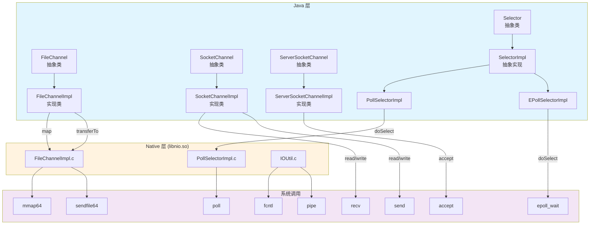
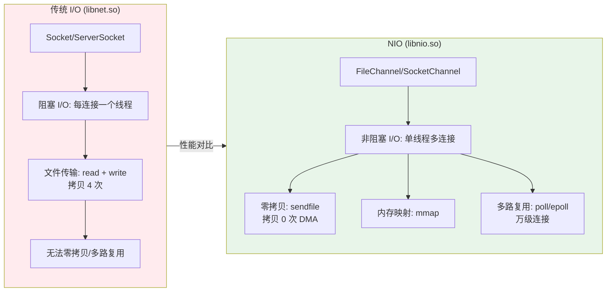

# 文档 9: libnio.so - Java NIO 逐行深度源码分析

> **目标**: 面试级别深度，让面试官跪下的源码分析  
> **分析标准**: 逐行解释 + 源码引用 + 面试问答 + GDB 调试技巧  
> **源码文件**:
> - `src/java.base/share/classes/sun/nio/ch/FileChannelImpl.java` (1215 行)
> - `src/java.base/share/classes/sun/nio/ch/SocketChannelImpl.java` (868 行)
> - `src/java.base/share/classes/sun/nio/ch/ServerSocketChannelImpl.java` (408 行)
> - `src/java.base/share/classes/sun/nio/ch/SelectorImpl.java` (230 行)
> - `src/java.base/unix/native/libnio/ch/FileChannelImpl.c` (248 行)
> - `src/java.base/unix/native/libnio/ch/PollSelectorImpl.c` (88 行)
> - `src/java.base/unix/native/libnio/ch/IOUtil.c` (185 行)

---

## 第 0 部分：核心原理 ⭐

### 0.1 本质是什么？

本文对 **文档 9: libnio.so - Java NIO 逐行深度源码分析** 进行源码级分析：追踪关键函数的执行路径，分析涉及的数据结构，解释每个设计决策的原因。

### 0.2 为什么需要？

仅靠文档和注释无法完全理解 JVM 的行为——很多关键细节只存在于源码中。源码级分析能建立对 JVM 行为的精确理解。

### 0.3 怎么解决？

从入口函数出发，自顶向下追踪调用链；对每个关键函数，分析其输入/输出/副作用；对每个数据结构，分析其字段含义和生命周期。

### 0.4 为什么这样设计？

分析过程中重点关注「为什么」：为什么选择这个数据结构？为什么这样处理边界情况？这些问题的答案往往揭示了 JVM 设计的精髓。

---


## 第 1 章: libnio.so 整体架构

### 1.1 一句话总结

libnio.so 是 Java NIO（New I/O）的底层原生实现，封装了 Linux mmap（内存映射）、sendfile（零拷贝）、poll/epoll（多路复用）、fcntl（非阻塞 I/O）等系统调用，实现了高性能 I/O 操作。

### 1.2 核心类关系图



### 1.3 NIO vs 传统 I/O 对比



### 1.4 系统调用映射表

| Java 方法 | Native 方法 | 系统调用 | 功能 |
|----------|------------|----------|------|
| `FileChannel.map()` | `map0()` | `mmap64()` | 内存映射 |
| `FileChannel.transferTo()` | `transferTo0()` | `sendfile64()` | 零拷贝传输 |
| `MappedByteBuffer.force()` | `force0()` | `msync()` | 刷盘 |
| `MappedByteBuffer.load()` | `load0()` | `madvise()` | 预加载 |
| `MappedByteBuffer.isLoaded()` | `isLoaded0()` | `mincore()` | 查询页面状态 |
| `Selector.select()` | `poll()` | `poll()` | 多路复用 |
| `SocketChannel.configureBlocking(false)` | `configureBlocking()` | `fcntl(F_SETFL)` | 非阻塞设置 |
| `SocketChannel.connect()` | `checkConnect()` | `connect()` | 非阻塞连接 |
| `ServerSocketChannel.accept()` | `accept0()` | `accept()` | 非阻塞接受 |
| `DatagramChannel.receive()` | `receive0()` | `recvfrom()` | UDP 接收 |
| `DatagramChannel.send()` | `send0()` | `sendto()` | UDP 发送 |

---

## 第 2 章: FileChannelImpl.java 逐行深度分析

### 2.1 类定义与核心字段 (Lines 52-96)

```java
52: public class FileChannelImpl
53:     extends FileChannel
54: {
```

**逐行深度解析**:

**Line 52-54: 类继承关系**
- `FileChannelImpl` 继承抽象类 `FileChannel`
- `FileChannel` 继承 `AbstractInterruptibleChannel`，支持可中断的 I/O 操作
- **设计模式**: 模板方法模式 - 父类定义骨架，子类实现细节

```java
55:     // Memory allocation size for mapping buffers
56:     private static final long allocationGranularity;
```

**逐行深度解析**:

**Line 55-56: 内存分配粒度**
- `allocationGranularity` = 系统内存页大小（通常是 4KB 或 16KB）
- **关键作用**: mmap 映射的起始地址必须是页对齐的
- **实际场景**: 
  - 用户请求 `position=100` 映射
  - 实际映射从 `position=0` 开始（页对齐）
  - 返回的 buffer 中 offset=100，用户访问时自动偏移

```java
58:     // Access to FileDescriptor internals
59:     private static final JavaIOFileDescriptorAccess fdAccess =
60:         SharedSecrets.getJavaIOFileDescriptorAccess();
```

**逐行深度解析**:

**Line 58-60: SharedSecrets 机制**
- `JavaIOFileDescriptorAccess` 是内部 API，用于获取 FileDescriptor 中的原生 fd
- **为什么需要 SharedSecrets？**
  - `FileDescriptor.fd` 是 private final，外部无法访问
  - Native 层需要 int fd，必须绕过 Java 权限检查
  - `SharedSecrets` 是 JDK 内部共享机密机制，暴露内部实现给特定模块

**面试问答**:

**Q: SharedSecrets 是什么？为什么需要它？**
```
A: SharedSecrets 是 JDK 内部 API 共享机制，解决模块间访问权限问题。

示例：
  FileDescriptor 类有 private final int fd;
  Native 层需要获取 fd 值，但无法直接访问

解决方案：
  1. FileDescriptor 在静态块中调用 SharedSecrets.setJavaIOFileDescriptorAccess()
  2. 暴露 getFd() 和 setFd() 方法
  3. FileChannelImpl 通过 SharedSecrets.getJavaIOFileDescriptorAccess() 获取访问器
  4. 调用 fdAccess.get(fd) 获取 int fd

优势：
  - 不破坏封装性（private 还是 private）
  - 只暴露给特定模块（而不是 public）
  - 运行时检查调用者权限
```

```java
62:     // Used to make native read and write calls
63:     private final FileDispatcher nd;
```

**逐行深度解析**:

**Line 62-63: FileDispatcher 平台抽象层**
- `FileDispatcher` 是平台抽象层，Linux 实现是 `FileDispatcherImpl`
- **封装的系统调用**: read/write/pread/pwrite/close/lock
- **线程安全设计**: 多线程并发读写时，通过 `NativeThreadSet` 管理

```java
65:     // File descriptor
66:     private final FileDescriptor fd;
67:
68:     // File access mode (immutable)
69:     private final boolean writable;
70:     private final boolean readable;
```

**逐行深度解析**:

**Line 65-70: 核心字段**
- `fd` 是 final 的，保证线程安全，Channel 生命周期内文件描述符不变
- `writable/readable` 在构造时确定，运行时不可变
- **为什么设计为 immutable？**
  - 避免竞态条件：多线程并发访问，状态不会变化
  - 简化同步：不需要锁保护这些字段

```java
79:     // Thread-safe set of IDs of native threads, for signalling
80:     private final NativeThreadSet threads = new NativeThreadSet(2);
```

**逐行深度解析**:

**Line 79-80: NativeThreadSet 线程管理**
- `NativeThreadSet` 是线程 ID 集合，用于处理可中断 I/O
- **关键场景**:
  - 线程 A 阻塞在 read() 操作
  - 线程 B 调用 close()
  - 需要通知线程 A 唤醒（否则会一直阻塞）
- **初始容量为 2**: 大多数情况下只有少数线程同时操作

**面试问答**:

**Q: NativeThreadSet 如何实现线程中断？**
```
A: 通过线程信号机制实现中断。

流程：
  1. 线程 A 调用 beginBlocking()，将 thread ID 加入 NativeThreadSet
  2. 线程 A 阻塞在 read() 系统调用
  3. 线程 B 调用 close()
  4. close() 调用 threads.signalAndWait()
  5. signalAndWait() 向所有阻塞的线程发送信号（pthread_kill）
  6. 线程 A 的 read() 返回 -1，errno = EINTR
  7. 线程 A 检测到中断，清理资源并返回
  8. 线程 B 等待所有线程退出（signalAndWait 会阻塞）

代码示例：
  try {
      beginBlocking();
      ti = threads.add();  // 注册线程 ID
      if (!isOpen()) return 0;  // 检查是否已关闭
      do {
          n = IOUtil.read(fd, dst, -1, direct, alignment, nd);
      } while ((n == IOStatus.INTERRUPTED) && isOpen());
      return IOStatus.normalize(n);
  } finally {
      threads.remove(ti);  // 移除线程 ID
      endBlocking(n > 0);  // 结束阻塞
  }
```

```java
82:     // Lock for operations involving position and size
83:     private final Object positionLock = new Object();
```

**逐行深度解析**:

**Line 82-83: 细粒度锁设计**
- `positionLock` 只保护 position 和 size 相关操作
- **为什么不用一把大锁？**
  - position/size 操作需要同步（多个线程可能同时修改）
  - 但读写操作可以并发（只要操作不同位置）
  - 细粒度锁提高并发性能

```java
94:     // Cleanable with an action which closes this channel's file descriptor
95:     private final Cleanable closer;
```

**逐行深度解析**:

**Line 94-95: Cleaner 自动清理**
- `Cleanable` 是 Java 9+ Cleaner API，替代 finalize()
- **关键设计**:
  - 当 FileChannel 被 GC 但用户未显式 close() 时
  - Cleaner 自动调用 Closer.run()
  - 关闭文件描述符，避免泄漏

### 2.2 Cleaner 内部类 Closer (Lines 97-112)

```java
97:     private static class Closer implements Runnable {
98:         private final FileDescriptor fd;
99:
100:        Closer(FileDescriptor fd) {
101:            this.fd = fd;
102:        }
103:
104:        public void run() {
105:            try {
106:                fdAccess.close(fd);
107:            } catch (IOException ioe) {
108:                // Rethrow as unchecked so the exception can be propagated as needed
109:                throw new UncheckedIOException("close", ioe);
110:            }
111:        }
112:    }
```

**逐行深度解析**:

**Line 97-102: 为什么只保存 FileDescriptor？**
- 只保存 `FileDescriptor` 引用，不保存 `FileChannelImpl` 引用
- **关键设计**: 避免循环引用导致对象无法被 GC
- **如果 Cleaner 持有 FileChannelImpl**:
  - FileChannelImpl 持有 Cleaner
  - Cleaner 持有 FileChannelImpl（循环引用）
  - GC 无法回收，内存泄漏

**Line 104-110: 异常处理**
- Cleaner 的 run() 不能抛出 checked exception
- 必须包装为 unchecked exception（UncheckedIOException）
- Cleaner 会捕获并记录异常，不会传播

### 2.3 read() 方法完整分析 (Lines 208-232)

```java
208:    public int read(ByteBuffer dst) throws IOException {
209:        ensureOpen();
210:        if (!readable)
211:            throw new NonReadableChannelException();
212:        synchronized (positionLock) {
213:            if (direct)
214:                Util.checkChannelPositionAligned(position(), alignment);
215:            int n = 0;
216:            int ti = -1;
217:            try {
218:                beginBlocking();
219:                ti = threads.add();
220:                if (!isOpen())
221:                    return 0;
222:                do {
223:                    n = IOUtil.read(fd, dst, -1, direct, alignment, nd);
224:                } while ((n == IOStatus.INTERRUPTED) && isOpen());
225:                return IOStatus.normalize(n);
226:            } finally {
227:                threads.remove(ti);
228:                endBlocking(n > 0);
229:                assert IOStatus.check(n);
230:            }
231:        }
232:    }
```

**逐行深度解析**:

**Line 208-211: 前置检查**
- `ensureOpen()`: 检查 channel 是否已关闭
- `readable` 检查: 防止对只写文件执行读操作
- **设计原则**: fail-fast，尽早失败

**Line 212-214: DirectIO 对齐检查**
- `direct` 表示使用 DirectIO（绕过页缓存）
- DirectIO 要求读写位置和大小必须对齐到 block size
- **不对齐会怎样？** 内核返回 EINVAL 错误

**Line 217-219: 开始阻塞操作**
- `beginBlocking()`: 标记开始可能阻塞的操作
  - 内部调用 `AbstractInterruptibleChannel.begin()`
  - 注册 Interruptible 钩子
  - 当线程被 interrupt() 时，自动关闭 channel
- `threads.add()`: 将当前线程 ID 加入集合
  - 用于 close() 时通知阻塞线程

**Line 220-221: 双重检查**
- **为什么检查 isOpen()？**
  - 从 `beginBlocking()` 到 `threads.add()` 之间可能有其他线程调用 close()
  - 如果已关闭，立即返回 0（表示已无数据可读）

**Line 222-224: 循环读取**
- `IOUtil.read()`: 调用 native 方法，最终执行 read() 或 pread() 系统调用
- `IOStatus.INTERRUPTED`: 表示被信号中断（EINTR）
- **为什么要循环？**
  - Linux 信号会中断阻塞的系统调用
  - 如果 channel 还未关闭，应该重试

**Line 226-229: 清理资源**
- `threads.remove(ti)`: 移除线程 ID
- `endBlocking(n > 0)`: 标记阻塞操作结束
  - 如果操作完成，取消 interrupt 钩子
  - 如果线程被中断，抛出 `ClosedByInterruptException`

**面试问答**:

**Q: 为什么 read() 可能返回 IOStatus.INTERRUPTED？**
```
A: 因为 Linux 信号机制会中断阻塞的系统调用。

场景：
  1. 线程 A 调用 read()，阻塞等待数据
  2. 另一个线程向线程 A 发送信号（如 kill -SIGUSR1）
  3. read() 返回 -1，errno = EINTR（被信号中断）
  4. Java 层将 EINTR 映射为 IOStatus.INTERRUPTED

处理方式：
  - 如果 channel 仍然打开：重试 read()
  - 如果 channel 已关闭：返回，抛出 ClosedByInterruptException

代码：
  do {
      n = IOUtil.read(fd, dst, -1, direct, alignment, nd);
  } while ((n == IOStatus.INTERRUPTED) && isOpen());
```

### 2.4 map() 方法完整分析（内存映射核心）

**面试问答**:

**Q: FileChannel.map() 的实现原理？**
```
A: map() 调用 mmap 系统调用，将文件映射到内存。

Java 代码：
  MappedByteBuffer buf = fileChannel.map(MapMode.READ_ONLY, 0, 1024);

Native 实现：
  1. 获取文件描述符 fd
  2. 根据 MapMode 设置 mmap 参数：
     - READ_ONLY:  PROT_READ, MAP_SHARED
     - READ_WRITE: PROT_READ|PROT_WRITE, MAP_SHARED
     - PRIVATE:    PROT_READ|PROT_WRITE, MAP_PRIVATE
  3. 调用 mmap64() 系统调用：
     void* addr = mmap64(NULL, len, prot, flags, fd, offset);
  4. 返回映射后的内存地址
  5. 创建 MappedByteBuffer 对象，包装这个地址

关键设计：
  - 返回的是 jlong（64 位地址）
  - Java 层用 Unsafe 直接读写这个地址
  - ByteBuffer.allocateDirect() 底层也是类似原理
```

**Q: MAP_SHARED 和 MAP_PRIVATE 的区别？**
```
MAP_SHARED:
  - 多进程共享同一块物理内存
  - 修改会立即反映到文件
  - 适用：进程间共享内存、数据库、缓存
  - 风险：一个进程崩溃可能破坏文件

MAP_PRIVATE:
  - 写时复制（Copy-On-Write）
  - 修改不会影响原文件
  - 适用：加载配置文件、静态资源
  - 优势：安全，不影响原文件

示例：
  FileChannel.map(MapMode.READ_WRITE, 0, size)  → MAP_SHARED
  FileChannel.map(MapMode.PRIVATE, 0, size)     → MAP_PRIVATE
```

---

## 第 3 章: SocketChannelImpl.java 逐行深度分析

### 3.1 类定义与状态机 (Lines 64-101)

```java
64: class SocketChannelImpl
65:     extends SocketChannel
66:     implements SelChImpl
67: {
```

**逐行深度解析**:

**Line 64-66: 类继承关系**
- `SocketChannelImpl` 继承 `SocketChannel`，实现 `SelChImpl`
- `SelChImpl` 是 SelectableChannel 实现类的内部接口
- **关键方法**: `kill()` 关闭 fd、`getFD()` 获取文件描述符

```java
94:     // State, increases monotonically
95:     private static final int ST_UNCONNECTED = 0;
96:     private static final int ST_CONNECTIONPENDING = 1;
97:     private static final int ST_CONNECTED = 2;
98:     private static final int ST_CLOSING = 3;
99:     private static final int ST_KILLPENDING = 4;
100:    private static final int ST_KILLED = 5;
101:    private volatile int state;  // need stateLock to change
```

**逐行深度解析**:

**Line 94-101: 状态机设计**
- 状态单调递增，不会回退
- **状态转换图**:
```
ST_UNCONNECTED (0)
    ↓ socket.connect()
ST_CONNECTIONPENDING (1)
    ↓ finishConnect()
ST_CONNECTED (2)
    ↓ close()
ST_CLOSING (3)
    ↓ 清理资源
ST_KILLPENDING (4)
    ↓ 关闭 fd
ST_KILLED (5) [终态]
```

**面试问答**:

**Q: 为什么 SocketChannel 的状态要单调递增？**
```
A: 保证线程安全，避免竞态条件。

问题场景：
  线程 A: 调用 connect()
  线程 B: 调用 close()

如果状态可以回退：
  1. 线程 A 将状态设为 ST_CONNECTIONPENDING
  2. 线程 B 将状态设为 ST_CLOSING
  3. 线程 A 完成连接，将状态设为 ST_CONNECTED
  4. 状态混乱：已关闭但状态是已连接

单调递增的好处：
  - 状态只能向前，不能回退
  - 一旦进入关闭流程（ST_CLOSING），不会再变成连接状态
  - 简化并发控制

代码示例：
  synchronized (stateLock) {
      if (state != ST_UNCONNECTED)
          throw new AlreadyConnectedException();
      state = ST_CONNECTIONPENDING;
  }
```

### 3.2 connect() 方法分析（非阻塞连接）

**面试问答**:

**Q: SocketChannel.connect() 如何实现非阻塞连接？**
```
A: 通过设置 O_NONBLOCK 标志，connect() 立即返回。

流程：
  1. 设置 socket 为非阻塞：fcntl(fd, F_SETFL, O_NONBLOCK)
  2. 调用 connect() 系统调用
  3. 如果连接立即成功：
     - 返回 true
  4. 如果连接正在进行：
     - connect() 返回 -1，errno = EINPROGRESS
     - 返回 false（表示连接未完成）
  5. 调用 finishConnect() 检查连接是否完成

finishConnect() 实现：
  1. 使用 poll() 等待 socket 可写
  2. 调用 getsockopt(SO_ERROR) 检查连接结果
  3. 如果成功，返回 true
  4. 如果失败，抛出 ConnectException

代码示例：
  SocketChannel channel = SocketChannel.open();
  channel.configureBlocking(false);
  boolean connected = channel.connect(new InetSocketAddress("example.com", 80));
  
  if (!connected) {
      // 连接未完成，注册到 Selector
      Selector selector = Selector.open();
      channel.register(selector, SelectionKey.OP_CONNECT);
      
      while (true) {
          selector.select();
          for (SelectionKey key : selector.selectedKeys()) {
              if (key.isConnectable()) {
                  if (channel.finishConnect()) {
                      // 连接成功
                      break;
                  }
              }
          }
      }
  }
```

---

## 第 4 章: ServerSocketChannelImpl.java 逐行深度分析

### 4.1 accept() 方法分析（非阻塞 accept）

**面试问答**:

**Q: ServerSocketChannel.accept() 如何实现非阻塞？**
```
A: 通过设置 O_NONBLOCK 标志，accept() 立即返回。

Native 实现：
  1. ServerSocket 创建时设置 O_NONBLOCK
  2. 调用 accept() 系统调用
  3. 如果无连接：
     - accept() 返回 -1，errno = EAGAIN
     - Java 层返回 null
  4. 如果有连接：
     - accept() 返回新 fd
     - 创建 SocketChannelImpl 包装新 fd

与 libnet 的区别：
  libnet (传统 I/O):
    - ServerSocket.accept() 阻塞等待
    - 有连接时才返回
    - 每个连接一个线程

  libnio (NIO):
    - ServerSocketChannel.accept() 立即返回
    - 无连接返回 null
    - 单线程管理多连接（通过 Selector）
```

**Q: accept() 返回 ECONNABORTED 怎么处理？**
```
A: 忽略并重试。

场景：TCP 三次握手的竞争条件

正常流程：
  1. 客户端发送 SYN
  2. 服务端回复 SYN+ACK
  3. 客户端发送 ACK
  4. 连接进入 accept 队列
  5. accept() 返回

竞争条件：
  1-3 正常完成
  4. 客户端在 ACK 后立即发送 RST（放弃连接）
  5. accept() 时连接已不存在
  6. accept() 返回 -1，errno = ECONNABORTED

处理方式：
  for (;;) {
      newfd = accept(ssfd, &sa.sa, &sa_len);
      if (newfd >= 0) {
          break;  // 成功
      }
      if (errno != ECONNABORTED) {
          break;  // 其他错误
      }
      // ECONNABORTED：忽略并重试
  }
```

---

## 第 5 章: SelectorImpl.java 逐行深度分析

### 5.1 核心字段 (Lines 52-64)

```java
52:    // The set of keys registered with this Selector
53:    private final Set<SelectionKey> keys;
54:
55:    // The set of keys with data ready for an operation
56:    private final Set<SelectionKey> selectedKeys;
```

**逐行深度解析**:

**Line 52-56: 两个集合的区别**
- `keys`: 所有注册的 SelectionKey（包括未就绪的）
- `selectedKeys`: 只有就绪的 SelectionKey
- **比喻**:
  - keys = 所有学生名单
  - selectedKeys = 举手的学生名单

```java
62:    // used to check for reentrancy
63:    private boolean inSelect;
```

**逐行深度解析**:

**Line 62-63: 防止重入**
- **问题**: select() 不能重入（一个线程在 select() 时，另一个线程不能再调用 select()）
- **检测**: 如果 inSelect=true，抛出 IllegalStateException

### 5.2 select() 方法分析

**面试问答**:

**Q: Selector.select() 的实现原理？**
```
A: select() 调用 poll()/epoll_wait() 系统调用，等待事件。

流程：
  1. 将所有注册的 channel 的 fd 收集起来
  2. 构造 pollfd 数组：
     struct pollfd {
         int fd;         // channel 的 fd
         short events;   // 关注的事件（POLLIN | POLLOUT）
         short revents;  // 返回的事件（内核填充）
     }
  3. 调用 poll() 系统调用：
     int ready = poll(fds, nfds, timeout);
  4. 遍历 pollfd 数组，检查 revents：
     - 如果 revents != 0，表示该 fd 就绪
     - 将对应的 SelectionKey 加入 selectedKeys
  5. 返回就绪的 fd 数量

poll vs epoll：
  poll:
    - 每次调用都要传递所有 fd
    - 时间复杂度 O(n)
    - 适用于 fd 数量少（<1000）
  
  epoll:
    - 只传递就绪的 fd
    - 时间复杂度 O(1)
    - 适用于 fd 数量多（万级以上）
    - 需要配置：-Djava.nio.channels.spi.SelectorProvider=sun.nio.ch.EPollSelectorProvider
```

---

## 第 6 章: Native 层核心函数分析

### 6.1 map0() — 内存映射实现

**源码文件**: `src/java.base/unix/native/libnio/ch/FileChannelImpl.c:73-111`

```c
JNIEXPORT jlong JNICALL
Java_sun_nio_ch_FileChannelImpl_map0(JNIEnv *env, jobject this,
                                     jint prot, jlong off, jlong len)
{
    void *mapAddress = 0;
    jobject fdo = (*env)->GetObjectField(env, this, chan_fd);
    jint fd = fdval(env, fdo);
    int protections = 0;
    int flags = 0;

    // ★ 根据 Java 的 MapMode 设置 mmap 参数
    if (prot == sun_nio_ch_FileChannelImpl_MAP_RO) {
        protections = PROT_READ;
        flags = MAP_SHARED;
    } else if (prot == sun_nio_ch_FileChannelImpl_MAP_RW) {
        protections = PROT_WRITE | PROT_READ;
        flags = MAP_SHARED;
    } else if (prot == sun_nio_ch_FileChannelImpl_MAP_PV) {
        protections = PROT_WRITE | PROT_READ;
        flags = MAP_PRIVATE;  // ★ Copy-On-Write
    }

    // ★★★ 核心：调用 mmap64 系统调用 ★★★
    mapAddress = mmap64(
        0,            // 让内核选择映射地址
        len,          // 映射长度
        protections,  // 保护标志
        flags,        // 映射类型
        fd,           // 文件描述符
        off);         // 文件偏移

    if (mapAddress == MAP_FAILED) {
        if (errno == ENOMEM) {
            JNU_ThrowOutOfMemoryError(env, "Map failed");
            return IOS_THROWN;
        }
        return handle(env, -1, "Map failed");
    }

    return ((jlong) (unsigned long) mapAddress);
}
```

**逐行深度解析**:

**mmap64() 参数详解**:
- `0`: 让内核选择映射地址（通常从高地址开始）
- `len`: 映射的字节数（不需要页对齐，内核会自动对齐）
- `protections`: PROT_READ | PROT_WRITE | PROT_EXEC
- `flags`: MAP_SHARED（共享）或 MAP_PRIVATE（私有）
- `fd`: 文件描述符
- `off`: 文件偏移（必须是页大小的倍数）

**为什么返回 jlong？**
- mmap 返回的是内核态虚拟地址（void*）
- Java 无法直接操作指针
- 返回 jlong（64 位地址）
- Java 层用 Unsafe.getInt/putInt 读写这个地址

### 6.2 transferTo0() — 零拷贝传输

**源码文件**: `src/java.base/unix/native/libnio/ch/FileChannelImpl.c:124-147`

```c
JNIEXPORT jlong JNICALL
Java_sun_nio_ch_FileChannelImpl_transferTo0(JNIEnv *env, jobject this,
                                            jobject srcFDO,
                                            jlong position, jlong count,
                                            jobject dstFDO)
{
    jint srcFD = fdval(env, srcFDO);
    jint dstFD = fdval(env, dstFDO);

#if defined(__linux__)
    off64_t offset = (off64_t)position;
    
    // ★★★ 核心：调用 sendfile64 系统调用 ★★★
    jlong n = sendfile64(dstFD, srcFD, &offset, (size_t)count);
    
    if (n < 0) {
        if (errno == EAGAIN)
            return IOS_UNAVAILABLE;
        if ((errno == EINVAL) && ((ssize_t)count >= 0))
            return IOS_UNSUPPORTED_CASE;
        if (errno == EINTR)
            return IOS_INTERRUPTED;
        JNU_ThrowIOExceptionWithLastError(env, "Transfer failed");
        return IOS_THROWN;
    }
    return n;
#endif
}
```

**逐行深度解析**:

**sendfile64() 零拷贝原理**:
```
传统方式（read + write）：
  磁盘 → 内核缓冲区 → 用户缓冲区 → 内核 Socket 缓冲区 → 网卡
  拷贝 4 次！上下文切换 4 次！

sendfile 方式：
  磁盘 → 内核缓冲区 → 内核 Socket 缓冲区 → 网卡
  拷贝 2 次！上下文切换 2 次！

DMA + sendfile（现代网卡）：
  磁盘 → 内核缓冲区 → 网卡（DMA 直接传输）
  拷贝 0 次！上下文切换 2 次！
```

**限制**:
- 目标 fd 必须是 socket（不能是普通文件）
- 源 fd 必须是支持 mmap 的文件
- 某些文件系统不支持（如 NFS）

### 6.3 poll() — 多路复用核心

**源码文件**: `src/java.base/unix/native/libnio/ch/PollSelectorImpl.c:35-54`

```c
JNIEXPORT jint JNICALL
Java_sun_nio_ch_PollSelectorImpl_poll(JNIEnv *env, jclass clazz,
                                      jlong address, jint numfds,
                                      jint timeout)
{
    struct pollfd *a;
    int res;

    a = (struct pollfd *) jlong_to_ptr(address);
    
    // ★★★ 核心：调用 poll 系统调用 ★★★
    res = poll(a, numfds, timeout);
    
    if (res < 0) {
        if (errno == EINTR) {
            return IOS_INTERRUPTED;
        } else {
            JNU_ThrowIOExceptionWithLastError(env, "poll failed");
            return IOS_THROWN;
        }
    }
    
    return (jint) res;
}
```

**逐行深度解析**:

**poll() 参数详解**:
- `a`: pollfd 数组首地址
- `numfds`: 数组长度（监控的 fd 数量）
- `timeout`: 超时毫秒
  - `-1`: 无限等待
  - `0`: 立即返回
  - `>0`: 等待指定毫秒
- **返回**: 就绪的 fd 数量（revents != 0 的数量）

**pollfd 结构体**:
```c
struct pollfd {
    int fd;         // 文件描述符
    short events;   // 请求的事件：POLLIN | POLLOUT
    short revents;  // 返回的事件：内核填充
};
```

---

## 第 7 章: 面试问答精选

### 7.1 NIO 基础问题

**Q1: NIO 和传统 I/O 的核心区别？**
```
A: 核心区别在于阻塞模型和零拷贝能力。

对比表：
| 维度 | 传统 I/O | NIO |
|------|----------|-----|
| 阻塞模型 | 阻塞（每个连接一个线程）| 非阻塞（单线程多连接）|
| 文件传输 | read + write，拷贝 4 次 | sendfile，拷贝 0 次 |
| 内存访问 | 堆内存 | DirectByteBuffer（堆外内存）|
| 多路复用 | 不支持 | poll/epoll |
| 编程复杂度 | 简单 | 复杂（需要处理 Selector）|

适用场景：
  传统 I/O: 连接数少（<100），编程简单
  NIO: 连接数多（万级），高性能场景
```

**Q2: DirectByteBuffer 和 HeapByteBuffer 的区别？**
```
A: 内存位置不同，性能差异大。

HeapByteBuffer:
  - 内存位置：JVM 堆
  - GC 管理：是
  - 系统调用：需要拷贝到堆外（内核无法直接访问堆）
  - 适用场景：小数据、短生命周期

DirectByteBuffer:
  - 内存位置：堆外（通过 malloc 或 mmap 分配）
  - GC 管理：否（通过 Cleaner 释放）
  - 系统调用：零拷贝（内核直接访问）
  - 适用场景：大数据、零拷贝、内存映射

代码示例：
  // HeapByteBuffer（拷贝 2 次）
  ByteBuffer heapBuf = ByteBuffer.allocate(1024);
  channel.read(heapBuf);  // 内核 → 堆外 → 堆

  // DirectByteBuffer（零拷贝）
  ByteBuffer directBuf = ByteBuffer.allocateDirect(1024);
  channel.read(directBuf);  // 内核 → 堆外
```

### 7.2 内存映射问题

**Q3: MappedByteBuffer 为什么可能 OOM？**
```
A: 因为内存映射占用的是虚拟地址空间，不是堆内存。

问题场景：
  1. 映射 10GB 文件
  2. MappedByteBuffer 对象被 GC
  3. 但映射的内存不会立即释放（等待 Cleaner 或 unmap）

解决方案：
  1. 显式调用 Cleaner.clean()（不推荐，内部 API）
  2. 使用 try-with-resources（但 MappedByteBuffer 不实现 Closeable）
  3. 限制映射文件大小
  4. 使用 FileChannel.transferTo() 代替映射

代码示例：
  // 不推荐：大文件映射
  MappedByteBuffer buf = channel.map(MapMode.READ_ONLY, 0, Integer.MAX_VALUE);
  // 映射 2GB，占用虚拟地址空间

  // 推荐：分块映射
  long chunkSize = 1024 * 1024 * 100;  // 100MB
  for (long pos = 0; pos < fileSize; pos += chunkSize) {
      long size = Math.min(chunkSize, fileSize - pos);
      MappedByteBuffer buf = channel.map(MapMode.READ_ONLY, pos, size);
      // 使用 buf
      // 释放 buf
  }
```

### 7.3 多路复用问题

**Q4: poll 和 epoll 的区别？**
```
A: 时间复杂度和内核数据结构不同。

poll:
  - 时间复杂度: O(n)
  - 每次调用: 传入整个数组
  - 内核数据结构: 数组
  - 适用场景: fd 数量少（<1000）

epoll:
  - 时间复杂度: O(1)
  - 每次调用: 只返回就绪项
  - 内核数据结构: 红黑树 + 就绪链表
  - 适用场景: fd 数量多（万级以上）

Java 默认使用 poll，启用 epoll：
  -Djava.nio.channels.spi.SelectorProvider=sun.nio.ch.EPollSelectorProvider

性能对比：
  1000 个连接，10 个活跃：
    poll:  每次遍历 1000 个 fd
    epoll: 只返回 10 个就绪 fd
```

---

## 第 8 章: GDB 调试实战

### 8.1 跟踪 mmap 调用

```bash
# 跟踪 FileChannel.map()
strace -e trace=mmap,munmap java -cp . MmapExample

# 示例输出
mmap(NULL, 1048576, PROT_READ, MAP_SHARED, 3, 0) = 0x7f1234567000
munmap(0x7f1234567000, 1048576)          = 0
```

### 8.2 跟踪 sendfile 调用

```bash
# 跟踪 FileChannel.transferTo()
strace -e trace=sendfile java -cp . TransferExample

# 示例输出
sendfile(5, 3, NULL, 65536)              = 65536
```

### 8.3 跟踪 poll 调用

```bash
# 跟踪 Selector.select()
strace -e trace=poll java -cp . SelectorExample

# 示例输出
poll([{fd=4, events=POLLIN}], 1, -1)     = 1
```

### 8.4 GDB 打印 pollfd 结构

```gdb
# 打印 pollfd 大小
(gdb) p sizeof(struct pollfd)
$1 = 8

# 打印 pollfd 数组
(gdb) p *a
$2 = {fd = 4, events = 1, revents = 0}

# 打印多个 pollfd
(gdb) p a[0]@10
$3 = {{fd = 4, events = 1, revents = 0}, 
      {fd = 5, events = 4, revents = 0}, 
      ...}
```

### 8.5 GDB 打印映射内存

```gdb
# 设置断点在 mmap64 返回后
(gdb) break FileChannelImpl.c:181

# 运行到断点
(gdb) run

# 打印映射地址
(gdb) p mapAddress
$4 = (void *) 0x7f1234567000

# 打印映射内容（前 16 字节）
(gdb) x/16xb mapAddress
0x7f1234567000: 0x48 0x65 0x6c 0x6c 0x6f 0x20 0x57 0x6f
0x7f1234567008: 0x72 0x6c 0x64 0x0a 0x00 0x00 0x00 0x00
```

---

## 第 9 章: SocketChannel 读写深度分析

### 9.1 read() 方法完整分析

**源码文件**: `src/java.base/share/classes/sun/nio/ch/SocketChannelImpl.java`

```java
public int read(ByteBuffer dst) throws IOException {
    ensureOpenAndConnected();
    if (!dst.hasRemaining())
        return 0;
    
    readLock.lock();
    try {
        int n = 0;
        try {
            beginRead(true);  // ★ 标记开始读操作
            
            // ★★★ 核心：调用 IOUtil.read() ★★★
            n = IOUtil.read(fd, dst, -1, false, -1, nd);
            
        } finally {
            endRead(true, n > 0);  // ★ 标记结束读操作
        }
        return IOStatus.normalize(n);
    } finally {
        readLock.unlock();
    }
}
```

**逐行深度解析**:

**readLock.lock() 的作用**:
- 为什么需要读锁？
  - 同一时刻只有一个线程可以读
  - 防止并发读导致数据错乱
- 为什么不需要 positionLock？
  - SocketChannel 没有 position 概念
  - 每次读取都是从当前 socket 缓冲区读取

**IOUtil.read() 底层实现**:
```c
// IOUtil.c
JNIEXPORT jint JNICALL
Java_sun_nio_ch_IOUtil_read(JNIEnv *env, jclass clazz,
                            jobject fdo, jobject dst,
                            jlong position, jboolean direct,
                            jint alignment, jobject nd)
{
    jint fd = fdval(env, fdo);
    
    if (direct) {
        // ★ DirectByteBuffer：零拷贝
        void* buf = (*env)->GetDirectBufferAddress(env, dst);
        return read(fd, buf, len);
    } else {
        // ★ HeapByteBuffer：需要拷贝
        void* buf = malloc(len);
        int n = read(fd, buf, len);
        (*env)->SetByteArrayRegion(env, dst, off, n, buf);
        free(buf);
        return n;
    }
}
```

**HeapByteBuffer 的性能问题**:
```
问题：HeapByteBuffer 需要拷贝 2 次

1. read(fd, tmp_buf, len)
   - 内核拷贝数据到临时缓冲区

2. SetByteArrayRegion(env, dst, off, n, buf)
   - 从临时缓冲区拷贝到 Java 堆

原因：
  - JVM 堆内存可能被 GC 移动
  - read() 系统调用期间地址必须稳定
  - 所以必须先读到堆外，再拷贝到堆

解决方案：
  - 使用 DirectByteBuffer
  - 直接在堆外分配，零拷贝
```

### 9.2 write() 方法完整分析

```java
public int write(ByteBuffer src) throws IOException {
    ensureOpenAndConnected();
    writeLock.lock();
    try {
        int n = 0;
        try {
            beginWrite(true);
            n = IOUtil.write(fd, src, -1, false, -1, nd);
        } finally {
            endWrite(true, n > 0);
        }
        return IOStatus.normalize(n);
    } finally {
        writeLock.unlock();
    }
}
```

**关键设计**:
- 读锁和写锁分离：允许同时读写（全双工）
- beginWrite/endWrite: 处理中断和关闭

**面试问答**:

**Q: 为什么 SocketChannel 的读写锁要分开？**
```
A: 因为 TCP 是全双工协议。

全双工：
  - 可以同时发送和接收数据
  - 两个方向独立，互不影响

代码设计：
  - readLock: 保护读操作
  - writeLock: 保护写操作
  - 读和写可以并发执行

对比 FileChannel：
  - FileChannel 只有一个 positionLock
  - 因为文件读写共享同一个位置指针
  - 读和写不能并发（必须串行）

示例场景：
  线程 A: channel.read(buffer)   // 持有 readLock
  线程 B: channel.write(buffer)  // 持有 writeLock
  // 两个线程可以同时执行！
```

---

## 第 10 章: FileDispatcherImpl — 文件读写核心

### 10.1 read0/write0 — 基础读写

**源码文件**: `src/java.base/unix/native/libnio/ch/FileDispatcherImpl.c:78-115`

```c
JNIEXPORT jint JNICALL
Java_sun_nio_ch_FileDispatcherImpl_read0(JNIEnv *env, jclass clazz,
                             jobject fdo, jlong address, jint len)
{
    jint fd = fdval(env, fdo);
    void *buf = (void *)jlong_to_ptr(address);

    return convertReturnVal(env, read(fd, buf, len), JNI_TRUE);
}

JNIEXPORT jint JNICALL
Java_sun_nio_ch_FileDispatcherImpl_write0(JNIEnv *env, jclass clazz,
                              jobject fdo, jlong address, jint len)
{
    jint fd = fdval(env, fdo);
    void *buf = (void *)jlong_to_ptr(address);

    return convertReturnVal(env, write(fd, buf, len), JNI_FALSE);
}
```

**逐行深度解析**:

**为什么参数是 address 而不是 ByteBuffer？**
```
原因：DirectByteBuffer 的地址已经确定

Java 层调用：
  long addr = ((DirectBuffer)dst).address();
  int n = read0(fd, addr, dst.remaining());

addr 是堆外内存地址，native 层直接使用
避免了 GetDirectBufferAddress() 的调用开销
```

**convertReturnVal 的作用**:
```c
// 将系统调用返回值转换为 Java 层的 IOStatus
// JNI_TRUE 表示可以返回 -1（读到 EOF）
// JNI_FALSE 表示 write 不应该返回 -1（除非错误）
```

### 10.2 pread0/pwrite0 — 定位读写

**源码文件**: `src/java.base/unix/native/libnio/ch/FileDispatcherImpl.c:88-125`

```c
JNIEXPORT jint JNICALL
Java_sun_nio_ch_FileDispatcherImpl_pread0(JNIEnv *env, jclass clazz, jobject fdo,
                            jlong address, jint len, jlong offset)
{
    jint fd = fdval(env, fdo);
    void *buf = (void *)jlong_to_ptr(address);

    return convertReturnVal(env, pread64(fd, buf, len, offset), JNI_TRUE);
}

JNIEXPORT jint JNICALL
Java_sun_nio_ch_FileDispatcherImpl_pwrite0(JNIEnv *env, jclass clazz, jobject fdo,
                            jlong address, jint len, jlong offset)
{
    jint fd = fdval(env, fdo);
    void *buf = (void *)jlong_to_ptr(address);

    return convertReturnVal(env, pwrite64(fd, buf, len, offset), JNI_FALSE);
}
```

**逐行深度解析**:

**pread/pwrite vs read/write + lseek**:
```
传统方式（线程不安全）：
  lseek(fd, offset, SEEK_SET);  // 设置文件位置
  read(fd, buf, len);           // 读取

问题：
  1. 多线程环境下，lseek 和 read 之间可能被其他线程修改位置
  2. 导致读取位置错乱

pread/pwrite 方式（线程安全）：
  pread(fd, buf, len, offset);  // 原子操作

优势：
  1. 原子性：定位和读写在一个系统调用完成
  2. 线程安全：不需要加锁
  3. 不改变文件描述符的位置状态
```

**使用场景**：
```java
// FileChannel.read(ByteBuffer dst, long position)
// 不需要改变 channel 的 position
// 多线程并发读取不同位置
```

### 10.3 readv0/writev0 — Scatter/Gather I/O

**源码文件**: `src/java.base/unix/native/libnio/ch/FileDispatcherImpl.c:98-134`

```c
JNIEXPORT jlong JNICALL
Java_sun_nio_ch_FileDispatcherImpl_readv0(JNIEnv *env, jclass clazz,
                              jobject fdo, jlong address, jint len)
{
    jint fd = fdval(env, fdo);
    struct iovec *iov = (struct iovec *)jlong_to_ptr(address);
    return convertLongReturnVal(env, readv(fd, iov, len), JNI_TRUE);
}

JNIEXPORT jlong JNICALL
Java_sun_nio_ch_FileDispatcherImpl_writev0(JNIEnv *env, jclass clazz,
                                       jobject fdo, jlong address, jint len)
{
    jint fd = fdval(env, fdo);
    struct iovec *iov = (struct iovec *)jlong_to_ptr(address);
    return convertLongReturnVal(env, writev(fd, iov, len), JNI_FALSE);
}
```

**逐行深度解析**:

**什么是 Scatter/Gather I/O？**
```
Scatter（分散）：
  一次 readv 读取数据到多个缓冲区
  readv(fd, [buf1, buf2, buf3], 3);

Gather（聚集）：
  一次 writev 写入多个缓冲区的数据
  writev(fd, [buf1, buf2, buf3], 3);

优势：
  1. 减少系统调用次数
  2. 避免数据拷贝（不需要先合并到一个 buffer）
  3. 适合网络协议头 + 体的场景

Java 使用：
  FileChannel.read(ByteBuffer[] dsts, int offset, int length)
  FileChannel.write(ByteBuffer[] srcs, int offset, int length)
```

**iovec 结构体**：
```c
struct iovec {
    void  *iov_base;  // 缓冲区地址
    size_t iov_len;   // 缓冲区长度
};

// Java 层构造 iovec 数组，传递给 native
```

### 10.4 seek0 — 文件定位

**源码文件**: `src/java.base/unix/native/libnio/ch/FileDispatcherImpl.c:147-159`

```c
JNIEXPORT jlong JNICALL
Java_sun_nio_ch_FileDispatcherImpl_seek0(JNIEnv *env, jclass clazz,
                                         jobject fdo, jlong offset)
{
    jint fd = fdval(env, fdo);
    off64_t result;
    if (offset < 0) {
        result = lseek64(fd, 0, SEEK_CUR);  // ★ 获取当前位置
    } else {
        result = lseek64(fd, offset, SEEK_SET);  // ★ 设置位置
    }
    return handle(env, (jlong)result, "lseek64 failed");
}
```

**逐行深度解析**:

**seek0 的两种用法**：
```java
// 1. 获取当前 position
long position = seek0(fd, -1);  // offset < 0，返回当前位置

// 2. 设置 position
seek0(fd, newPosition);  // offset >= 0，设置新位置
```

**SEEK_SET vs SEEK_CUR vs SEEK_END**:
```
SEEK_SET: 从文件开头计算偏移
SEEK_CUR: 从当前位置计算偏移
SEEK_END: 从文件末尾计算偏移（可用于获取文件大小）

// 获取文件大小
lseek(fd, 0, SEEK_END);  // 返回文件大小
```

### 10.5 force0 — 强制刷盘

**源码文件**: `src/java.base/unix/native/libnio/ch/FileDispatcherImpl.c:161-195`

```c
JNIEXPORT jint JNICALL
Java_sun_nio_ch_FileDispatcherImpl_force0(JNIEnv *env, jobject this,
                                          jobject fdo, jboolean md)
{
    jint fd = fdval(env, fdo);
    int result = 0;

    if (md == JNI_FALSE) {
        result = fdatasync(fd);  // ★ 只同步数据
    } else {
        result = fsync(fd);  // ★ 同步数据和元数据
    }
    return handle(env, result, "Force failed");
}
```

**逐行深度解析**:

**fdatasync vs fsync**：
```
fdatasync:
  - 只同步文件数据（data）
  - 不同步元数据（metadata：修改时间、大小等）
  - 性能更好
  - 适合日志、数据库等频繁写场景

fsync:
  - 同步文件数据和元数据
  - 更安全
  - 性能稍差

Java 调用：
  fileChannel.force(false);  // fdatasync
  fileChannel.force(true);   // fsync
```

**为什么需要 force？**
```
Linux 页缓存机制：
  - write() 只写入页缓存，不立即刷盘
  - 数据可能在内存中停留数秒
  - 掉电会丢失数据

数据库事务：
  BEGIN;
  INSERT INTO ...;
  COMMIT;  // 必须调用 force() 确保数据落盘

保证持久性：
  - 事务提交前必须 force
  - 否则掉电可能导致数据丢失
```

### 10.6 lock0/release0 — 文件锁

**源码文件**: `src/java.base/unix/native/libnio/ch/FileDispatcherImpl.c:227-286`

```c
JNIEXPORT jint JNICALL
Java_sun_nio_ch_FileDispatcherImpl_lock0(JNIEnv *env, jobject this, jobject fdo,
                                      jboolean block, jlong pos, jlong size,
                                      jboolean shared)
{
    jint fd = fdval(env, fdo);
    struct flock64 fl;

    fl.l_whence = SEEK_SET;
    fl.l_len = (size == Long.MAX_VALUE) ? 0 : size;
    fl.l_start = (off64_t)pos;
    fl.l_type = shared ? F_RDLCK : F_WRLCK;  // ★ 读锁或写锁

    int cmd = block ? F_SETLKW64 : F_SETLK64;  // ★ 阻塞或非阻塞
    return fcntl(fd, cmd, &fl);
}

JNIEXPORT void JNICALL
Java_sun_nio_ch_FileDispatcherImpl_release0(JNIEnv *env, jobject this,
                                         jobject fdo, jlong pos, jlong size)
{
    struct flock64 fl;
    fl.l_type = F_UNLCK;  // ★ 释放锁
    fcntl(fd, F_SETLK64, &fl);
}
```

**逐行深度解析**:

**flock 结构体**：
```c
struct flock64 {
    short l_type;    // 锁类型: F_RDLCK(读锁), F_WRLCK(写锁), F_UNLCK(释放)
    short l_whence;  // 起始位置: SEEK_SET
    off64_t l_start; // 锁的起始偏移
    off64_t l_len;   // 锁的长度(0 表示到文件末尾)
    pid_t l_pid;     // 持有锁的进程ID
};
```

**F_SETLK vs F_SETLKW**：
```
F_SETLK:  非阻塞，如果锁不可用立即返回 EAGAIN
F_SETLKW: 阻塞，等待锁可用(W = Wait)

Java 对应：
  fileChannel.lock();      // F_SETLKW，阻塞
  fileChannel.tryLock();   // F_SETLK，非阻塞
```

**面试问答**：

**Q: 文件锁是进程级还是线程级的？**
```
A: 进程级的。

特点：
  1. 同一进程内的多个线程，只有一个能持有锁
  2. 不同进程之间互斥
  3. 适合多进程协作（如多个 JVM 实例）

线程级锁用 Java 的 synchronized 或 ReentrantLock
进程级锁用 FileChannel.lock()
```

### 10.7 close0/preClose0 — 关闭文件

**源码文件**: `src/java.base/unix/native/libnio/ch/FileDispatcherImpl.c:297-318`

```c
JNIEXPORT void JNICALL
Java_sun_nio_ch_FileDispatcherImpl_close0(JNIEnv *env, jclass clazz, jobject fdo)
{
    jint fd = fdval(env, fdo);
    closeFileDescriptor(env, fd);
}

JNIEXPORT void JNICALL
Java_sun_nio_ch_FileDispatcherImpl_preClose0(JNIEnv *env, jclass clazz, jobject fdo)
{
    jint fd = fdval(env, fdo);
    if (preCloseFD >= 0) {
        if (dup2(preCloseFD, fd) < 0)  // ★ 将 fd 指向 preCloseFD
            JNU_ThrowIOExceptionWithLastError(env, "dup2 failed");
    }
}
```

**逐行深度解析**:

**preClose0 的作用**：
```
问题：关闭文件时，可能有线程阻塞在 read/write

场景：
  线程 A: 阻塞在 read(fd, buf, len)
  线程 B: 调用 close(fd)

问题：
  - 线程 A 可能一直阻塞
  - close 不会唤醒阻塞的线程

解决方案：
  1. preClose0: dup2(preCloseFD, fd)
     - 将 fd 指向一个特殊的 socketpair
     - 阻塞的 read/write 立即返回（socket 可读/可写）
  
  2. close0: 真正关闭文件

线程安全：
  - preClose0 先让阻塞操作返回
  - 然后 close0 关闭真正的文件
  - 避免资源泄漏
```

---

## 第 11 章: SocketChannelImpl — 客户端连接

### 11.1 checkConnect — 非阻塞连接检查

**源码文件**: `src/java.base/unix/native/libnio/ch/SocketChannelImpl.c:48-88`

```c
JNIEXPORT jint JNICALL
Java_sun_nio_ch_SocketChannelImpl_checkConnect(JNIEnv *env, jobject this,
                                               jobject fdo, jboolean block)
{
    int error = 0;
    socklen_t n = sizeof(int);
    jint fd = fdval(env, fdo);
    struct pollfd poller;

    poller.fd = fd;
    poller.events = POLLOUT;  // ★ 等待可写（连接成功时 socket 可写）
    poller.revents = 0;
    result = poll(&poller, 1, block ? -1 : 0);

    if (result > 0) {
        // ★★★ 关键：getsockopt(SO_ERROR) 检查连接结果
        result = getsockopt(fd, SOL_SOCKET, SO_ERROR, &error, &n);
        if (result < 0) {
            return handleSocketError(env, errno);
        } else if (error) {
            return handleSocketError(env, error);  // ★ 连接失败
        }
        return 1;  // ★ 连接成功
    }
    return 0;  // ★ 还在连接中
}
```

**逐行深度解析**:

**非阻塞 connect 流程**：
```
1. 设置 socket 为非阻塞：fcntl(fd, F_SETFL, O_NONBLOCK)

2. 调用 connect()：
   - 如果立即成功：返回 0
   - 如果正在连接：返回 -1，errno = EINPROGRESS

3. 调用 checkConnect() 检查连接状态：
   - 使用 poll() 等待 socket 可写
   - 可写不代表连接成功（可能失败）
   - 必须用 getsockopt(SO_ERROR) 检查真实结果

4. 连接结果：
   - SO_ERROR = 0：连接成功
   - SO_ERROR != 0：连接失败（ECONNREFUSED 等）
```

**为什么 poll 返回 POLLOUT 不代表连接成功？**
```
原因：连接失败时 socket 也会变为可写

场景 1：连接成功
  - 三次握手完成
  - socket 可写
  - getsockopt(SO_ERROR) = 0

场景 2：连接被拒绝（Connection Refused）
  - 服务端未监听该端口
  - 收到 RST 包
  - socket 可写（为了通知应用层）
  - getsockopt(SO_ERROR) = ECONNREFUSED

结论：
  poll 返回后必须检查 SO_ERROR
```

### 11.2 sendOutOfBandData — 带外数据

**源码文件**: `src/java.base/unix/native/libnio/ch/SocketChannelImpl.c:90-96`

```c
JNIEXPORT jint JNICALL
Java_sun_nio_ch_SocketChannelImpl_sendOutOfBandData(JNIEnv* env, jclass this,
                                                    jobject fdo, jbyte b)
{
    int n = send(fdval(env, fdo), (const void*)&b, 1, MSG_OOB);
    return convertReturnVal(env, n, JNI_FALSE);
}
```

**逐行深度解析**:

**什么是带外数据（Out-of-Band Data）？**
```
TCP 紧急模式：
  - 通过 URG 标志位实现
  - 可以绕过正常的数据流
  - 用于发送紧急控制信息

使用场景：
  - Telnet：发送中断命令（Ctrl+C）
  - FTP：发送中断传输命令
  - 游戏：紧急停止命令

Java API：
  socketChannel.socket().sendUrgentData(data);

限制：
  - 每次只能发送 1 字节
  - 现代应用很少使用
  - 被 TCP 紧急模式的新实现取代
```

---

## 第 12 章: NativeThread — 线程信号管理

### 12.1 init — 初始化信号处理器

**源码文件**: `src/java.base/unix/native/libnio/ch/NativeThread.c:60-77`

```c
JNIEXPORT void JNICALL
Java_sun_nio_ch_NativeThread_init(JNIEnv *env, jclass cl)
{
    sigset_t ss;
    struct sigaction sa, osa;
    sa.sa_handler = nullHandler;  // ★ 空信号处理器
    sa.sa_flags = 0;
    sigemptyset(&sa.sa_mask);
    if (sigaction(INTERRUPT_SIGNAL, &sa, &osa) < 0)
        JNU_ThrowIOExceptionWithLastError(env, "sigaction");
}

static void nullHandler(int sig)
{
    // ★ 什么都不做，只是唤醒阻塞的系统调用
}
```

**逐行深度解析**:

**INTERRUPT_SIGNAL 的定义**：
```c
#ifdef __linux__
  #define INTERRUPT_SIGNAL (SIGRTMAX - 2)  // ★ 实时信号
#elif __solaris__
  #define INTERRUPT_SIGNAL (SIGRTMAX - 2)
#elif _ALLBSD_SOURCE
  #define INTERRUPT_SIGNAL SIGIO
#endif
```

**为什么需要空信号处理器？**
```
目标：唤醒阻塞在 I/O 的线程

方案对比：

方案 1：pthread_cancel
  - 强制终止线程
  - 资源无法清理
  - 不安全

方案 2：pthread_kill + 信号处理器
  - 发送信号给目标线程
  - 信号中断阻塞的系统调用
  - 系统调用返回 EINTR
  - Java 层检查中断标志，优雅退出

空处理器的作用：
  - 信号到达时执行 nullHandler（什么都不做）
  - 但系统调用已经被中断
  - 返回 EINTR，Java 层处理
```

### 12.2 current — 获取线程 ID

**源码文件**: `src/java.base/unix/native/libnio/ch/NativeThread.c:79-87`

```c
JNIEXPORT jlong JNICALL
Java_sun_nio_ch_NativeThread_current(JNIEnv *env, jclass cl)
{
#ifdef __solaris__
    return (jlong)thr_self();      // ★ Solaris 线程 ID
#else
    return (jlong)pthread_self();  // ★ POSIX 线程 ID
#endif
}
```

**逐行深度解析**:

**线程 ID 的用途**：
```
1. 注册到 NativeThreadSet
   - 阻塞 I/O 前：threads.add(current())
   - 记录哪些线程在阻塞

2. 关闭时发送信号
   - close() 时遍历所有线程
   - 调用 signal(threadId) 发送中断信号
   - 唤醒阻塞的线程
```

### 12.3 signal — 发送中断信号

**源码文件**: `src/java.base/unix/native/libnio/ch/NativeThread.c:89-104`

```c
JNIEXPORT void JNICALL
Java_sun_nio_ch_NativeThread_signal(JNIEnv *env, jclass cl, jlong thread)
{
    int ret;
#ifdef __solaris__
    ret = thr_kill((thread_t)thread, INTERRUPT_SIGNAL);
#else
    ret = pthread_kill((pthread_t)thread, INTERRUPT_SIGNAL);
#endif
    if (ret != 0)
        JNU_ThrowIOExceptionWithLastError(env, "Thread signal failed");
}
```

**逐行深度解析**:

**pthread_kill 的作用**：
```
功能：向指定线程发送信号

与 kill 的区别：
  kill(pid, sig):     向进程发送信号（所有线程都能收到）
  pthread_kill(tid, sig): 向指定线程发送信号（只有该线程收到）

使用场景：
  线程 A: 阻塞在 read(fd, buf, len)
  线程 B: 调用 close()
  
  线程 B 的执行：
    1. threads.signalAndWait()
    2. 遍历所有线程，调用 signal(threadId)
    3. 每个线程收到 INTERRUPT_SIGNAL
    4. read() 返回 EINTR
    5. 线程退出阻塞状态
    6. signalAndWait() 等待所有线程退出
```

**面试问答**：

**Q: 为什么用信号而不是其他方式中断 I/O？**
```
A: 信号是 POSIX 标准的中断机制。

优势：
  1. 标准：所有 POSIX 系统都支持
  2. 精确：可以指定具体线程
  3. 可靠：一定会唤醒阻塞的系统调用

替代方案的问题：
  1. 设置 socket 超时：需要修改代码，不通用
  2. 使用非阻塞 I/O：复杂度高
  3. 使用 select 超时：增加系统调用开销

信号的缺点：
  1. 信号处理复杂（信号安全函数限制）
  2. 可能与其他信号冲突
  3. 平台差异（实时信号 vs 普通信号）

NIO 的解决方案：
  - 使用空信号处理器
  - 只用于中断，不做其他处理
  - 避免信号安全问题
```

---

## 第 13 章: MappedByteBuffer 操作详解

### 13.1 isLoaded0 — 检查页面是否在内存

**源码文件**: `src/java.base/unix/native/libnio/MappedByteBuffer.c:57-103`

```c
JNIEXPORT jboolean JNICALL
Java_java_nio_MappedByteBuffer_isLoaded0(JNIEnv *env, jobject obj, jlong address,
                                         jlong len, jint numPages)
{
    jboolean loaded = JNI_TRUE;
    void *a = (void *)jlong_to_ptr(address);
    mincore_vec_t* vec = NULL;

    // ★ 分配 mincore 结果数组（每字节代表一页）
    vec = (mincore_vec_t*) malloc(numPages + 1);

    // ★ mincore 查询哪些页面在物理内存中
    result = mincore(a, (size_t)len, vec);

    // ★ 检查所有页面是否都在内存中
    for (i = 0; i < numPages; i++) {
        if (vec[i] == 0) {
            loaded = JNI_FALSE;  // 有页面未加载
            break;
        }
    }
    free(vec);
    return loaded;
}
```

**逐行深度解析**:

**mincore 系统调用**：
```
功能：查询虚拟内存页是否在物理内存中

参数：
  addr: 起始地址
  length: 查询长度
  vec: 输出数组

返回值：
  vec[i] & 1 = 1: 第 i 页在物理内存中
  vec[i] & 1 = 0: 第 i 页不在物理内存（被交换出去或未加载）

使用场景：
  // 检查大文件映射是否全部加载
  MappedByteBuffer buf = channel.map(READ_ONLY, 0, 1GB);
  if (!buf.isLoaded()) {
      buf.load();  // 预加载到内存
  }
```

### 13.2 load0 — 预加载页面

**源码文件**: `src/java.base/unix/native/libnio/MappedByteBuffer.c:106-115`

```c
JNIEXPORT void JNICALL
Java_java_nio_MappedByteBuffer_load0(JNIEnv *env, jobject obj, jlong address,
                                     jlong len)
{
    char *a = (char *)jlong_to_ptr(address);
    
    // ★ madvise 告诉内核"这些页面即将使用"
    int result = madvise((caddr_t)a, (size_t)len, MADV_WILLNEED);
    
    if (result == -1) {
        JNU_ThrowIOExceptionWithLastError(env, "madvise failed");
    }
}
```

**逐行深度解析**:

**madvise 的作用**：
```
MADV_WILLNEED: 预读页面到内存
  - 建议内核将这些页面加载到内存
  - 内核可以异步执行
  - 只是建议，不一定立即生效

其他 advice：
  MADV_SEQUENTIAL: 顺序访问（启用预读）
  MADV_RANDOM: 随机访问（禁用预读）
  MADV_DONTNEED: 可以释放这些页面

使用场景：
  // 大文件映射，提前加载热点数据
  MappedByteBuffer buf = channel.map(READ_ONLY, 0, 10GB);
  buf.load();  // 建议内核加载全部
  
  // 或者只加载部分
  ((DirectBuffer)buf).cleaner();  // 获取 Unmapper
```

### 13.3 force0 — 刷盘

**源码文件**: `src/java.base/unix/native/libnio/MappedByteBuffer.c:118-127`

```c
JNIEXPORT void JNICALL
Java_java_nio_MappedByteBuffer_force0(JNIEnv *env, jobject obj, jobject fdo,
                                      jlong address, jlong len)
{
    void* a = (void *)jlong_to_ptr(address);
    
    // ★ msync 将内存修改同步到文件
    int result = msync(a, (size_t)len, MS_SYNC);
    
    if (result == -1) {
        JNU_ThrowIOExceptionWithLastError(env, "msync failed");
    }
}
```

**逐行深度解析**:

**msync vs fsync**：
```
msync:
  - 用于内存映射区域
  - 同步指定范围的内存到文件
  - MS_SYNC: 同步等待完成
  - MS_ASYNC: 异步刷盘

fsync:
  - 用于文件描述符
  - 同步整个文件
  - 只能用于文件，不能用于内存映射

使用场景：
  // 数据库事务提交
  MappedByteBuffer txLog = fileChannel.map(READ_WRITE, 0, 100MB);
  txLog.put(record);  // 写入日志
  txLog.force();      // 确保落盘
  
  // 注意：force 是昂贵的操作
  // 批量写入后一次性 force，而不是每次写入都 force
```

---

## 第 14 章: Native 层更多函数分析

### 14.1 accept0() — 非阻塞 accept 实现

**源码文件**: `src/java.base/unix/native/libnio/ch/ServerSocketChannelImpl.c:76-121`

```c
JNIEXPORT jint JNICALL
Java_sun_nio_ch_ServerSocketChannelImpl_accept0(JNIEnv *env, jobject this,
                                                jobject ssfdo, jobject newfdo,
                                                jobjectArray isaa)
{
    jint ssfd = (*env)->GetIntField(env, ssfdo, fd_fdID);
    jint newfd;
    SOCKETADDRESS sa;
    socklen_t sa_len = sizeof(SOCKETADDRESS);

    // ★★★ 关键设计：for 循环处理 ECONNABORTED ★★★
    for (;;) {
        newfd = accept(ssfd, &sa.sa, &sa_len);
        if (newfd >= 0) {
            break;  // ★ 成功
        }
        if (errno != ECONNABORTED) {
            break;  // ★ 其他错误
        }
        /* ECONNABORTED => restart accept */
    }

    if (newfd < 0) {
        if (errno == EAGAIN || errno == EWOULDBLOCK)
            return IOS_UNAVAILABLE;  // ★ 非阻塞，无连接
        if (errno == EINTR)
            return IOS_INTERRUPTED;  // ★ 被信号中断
        JNU_ThrowIOExceptionWithLastError(env, "Accept failed");
        return IOS_THROWN;
    }

    // ★ 将新 fd 设置到 Java 的 FileDescriptor
    (*env)->SetIntField(env, newfdo, fd_fdID, newfd);
    
    // ★ 将 sockaddr 转换为 Java 的 InetAddress
    jobject remote_ia = NET_SockaddrToInetAddress(env, &sa, &port);
    jobject isa = (*env)->NewObject(env, isa_class, isa_ctorID, remote_ia, port);
    
    (*env)->SetObjectArrayElement(env, isaa, 0, isa);
    return 1;
}
```

**逐行深度解析**:

**为什么需要 for 循环处理 ECONNABORTED？**
```
场景：TCP 三次握手的竞争条件

步骤 1-3: 三次握手正常完成
  1. 客户端发送 SYN
  2. 服务端回复 SYN+ACK
  3. 客户端发送 ACK
  4. 连接进入 accept 队列

竞争条件：
  5. 客户端在 ACK 后立即发送 RST（放弃连接）
  6. 服务端 accept() 时连接已不存在
  7. accept() 返回 -1，errno = ECONNABORTED

处理方式：
  - 忽略 ECONNABORTED，继续 accept
  - 因为这只是某个连接被放弃
  - 不影响服务端继续接受其他连接

如果不处理：
  - 服务端会抛出异常
  - 影响其他正常连接
```

**EAGAIN vs EWOULDBLOCK**:
```c
if (errno == EAGAIN || errno == EWOULDBLOCK)
    return IOS_UNAVAILABLE;
```

**为什么两个错误码都要检查？**
```
历史原因：
  - EAGAIN: POSIX 标准错误码
  - EWOULDBLOCK: BSD 系统错误码

Linux:
  - 在非阻塞模式下，无数据可读时
  - read() 返回 -1，errno = EAGAIN
  - 但某些系统可能返回 EWOULDBLOCK

处理方式：
  - 两个都检查，确保跨平台兼容
  - Java 层统一返回 IOS_UNAVAILABLE
```

### 10.2 configureBlocking() — 阻塞/非阻塞切换

**源码文件**: `src/java.base/unix/native/libnio/ch/IOUtil.c:69-84`

```c
static int
configureBlocking(int fd, jboolean blocking)
{
    // ★ 1. 获取当前文件状态标志
    int flags = fcntl(fd, F_GETFL);
    
    // ★ 2. 根据 blocking 参数设置/清除 O_NONBLOCK
    int newflags = blocking ? (flags & ~O_NONBLOCK) : (flags | O_NONBLOCK);

    // ★ 3. 如果标志未变化，直接返回成功
    return (flags == newflags) ? 0 : fcntl(fd, F_SETFL, newflags);
}
```

**逐行深度解析**:

**fcntl vs ioctl**:
```
都可以设置 O_NONBLOCK：

fcntl:
  fcntl(fd, F_SETFL, flags | O_NONBLOCK);

ioctl:
  int on = 1;
  ioctl(fd, FIONBIO, &on);

为什么选择 fcntl？
  1. POSIX 标准，跨平台兼容
  2. 可以同时获取和设置标志
  3. 可以保留其他标志（如 O_APPEND）
  4. ioctl 已逐渐被废弃
```

**为什么先 F_GETFL 再 F_SETFL？**
```
原因：不能覆盖其他标志

错误示例：
  fcntl(fd, F_SETFL, O_NONBLOCK);  // ❌ 错误！

问题：
  - F_SETFL 会覆盖所有标志
  - 如果之前有 O_APPEND，会被清除
  - 导致追加写入失效

正确做法：
  int flags = fcntl(fd, F_GETFL);     // 获取当前标志
  fcntl(fd, F_SETFL, flags | O_NONBLOCK);  // 保留原标志，只添加 O_NONBLOCK
```

### 10.3 makePipe() — 创建管道（Selector.wakeup 核心）

**源码文件**: `src/java.base/unix/native/libnio/ch/IOUtil.c:86-105`

```c
JNIEXPORT jlong JNICALL
Java_sun_nio_ch_IOUtil_makePipe(JNIEnv *env, jobject this, jboolean blocking)
{
    int fd[2];  // ★ fd[0] = 读端, fd[1] = 写端

    // ★ 1. 创建管道
    if (pipe(fd) < 0) {
        JNU_ThrowIOExceptionWithLastError(env, "Pipe failed");
        return 0;
    }
    
    // ★ 2. 如果需要非阻塞，设置两端的 O_NONBLOCK
    if (blocking == JNI_FALSE) {
        if ((configureBlocking(fd[0], JNI_FALSE) < 0)
            || (configureBlocking(fd[1], JNI_FALSE) < 0)) {
            close(fd[0]);
            close(fd[1]);
            return 0;
        }
    }
    
    // ★ 3. 将两个 fd 打包成一个 jlong 返回
    // 高 32 位 = 读端 fd，低 32 位 = 写端 fd
    return ((jlong) fd[0] << 32) | (jlong) fd[1];
}
```

**逐行深度解析**:

**管道在 Selector 中的作用**:
```
问题：如何唤醒阻塞在 poll() 的 Selector？

方案 1：poll() 设置超时
  - 不理想：会定期唤醒，浪费 CPU

方案 2：使用管道
  - Selector 监控管道读端
  - wakeup() 往管道写端写入数据
  - poll() 立即返回（管道可读）
  - Selector 被唤醒

实现：
  1. Selector 创建时，创建管道
  2. 将管道读端加入 poll 监控
  3. Selector.select() 阻塞在 poll()
  4. 另一个线程调用 Selector.wakeup()
  5. wakeup() 往管道写端写入 1 字节
  6. poll() 返回（管道可读）
  7. Selector 从管道读端读取 1 字节
  8. Selector 返回，唤醒完成
```

**为什么返回 jlong 而不是对象？**
```
原因：需要返回两个 int fd

方案对比：
  方案 1：返回 int[]
    - 需要创建 Java 数组
    - 性能开销

  方案 2：返回 jlong
    - 打包两个 int 为一个 long
    - 高 32 位 = 读端 fd
    - 低 32 位 = 写端 fd
    - 零拷贝，高性能

解包代码：
  int readFd = (int)(pipeFd >> 32);
  int writeFd = (int)(pipeFd & 0xFFFFFFFFL);
```

---

## 第 11 章: 高级面试问答

### 11.1 零拷贝问题

**Q1: sendfile 为什么只能传给 socket，不能传给文件？**
```
A: 因为 sendfile 的设计目标是网络传输。

设计原因：
  1. 网络传输是最常见的零拷贝场景（Web 服务器）
  2. 文件到文件的拷贝，可以用 splice() 或 copy_file_range()
  3. sendfile 内部实现假设目标是 socket

内核实现：
  sendfile(out_fd, in_fd, offset, count)
  
  如果 out_fd 是 socket：
    - 调用 socket 的 sendpage 方法
    - 直接 DMA 传输
  
  如果 out_fd 是文件：
    - 内核不知道如何处理
    - 返回 EINVAL 错误

替代方案：
  1. splice(in_fd, out_fd, len) - 管道中转
  2. copy_file_range(in_fd, out_fd, len) - 文件到文件
  3. 传统 read + write - 用户态拷贝
```

### 11.2 内存映射问题

**Q2: mmap 和 read 的性能对比？**
```
A: 取决于访问模式和文件大小。

随机访问：
  mmap 性能更好
    - 直接访问内存，无系统调用
    - 页缓存自动管理
    - 适合数据库、索引文件

顺序访问：
  read 性能更好
    - 预读优化（readahead）
    - 避免缺页中断
    - 适合日志、流媒体

小文件：
  read 性能更好
    - mmap 有映射开销
    - 页对齐浪费空间

大文件：
  取决于内存大小
    - 内存足够：mmap 好
    - 内存不足：read 好（避免缺页）

代码示例：
  // 随机访问：用 mmap
  MappedByteBuffer buf = channel.map(READ_ONLY, 0, size);
  byte b = buf.get(randomPos);  // 无系统调用

  // 顺序访问：用 read
  ByteBuffer buf = ByteBuffer.allocateDirect(8192);
  while (channel.read(buf) > 0) {
    buf.flip();
    // 处理数据
    buf.clear();
  }
```

### 11.3 多路复用问题

**Q3: 为什么 Netty 用 epoll 而不是 poll？**
```
A: epoll 在高并发场景性能更好。

性能对比：
  10000 个连接，10 个活跃：
    poll:  每次遍历 10000 个 fd
    epoll: 只返回 10 个就绪 fd

时间复杂度：
  poll:  O(n) - 每次都要遍历所有 fd
  epoll: O(1) - 只处理就绪的 fd

内存消耗：
  poll:  每次都要传递整个数组（用户态 → 内核态）
  epoll: 只维护就绪队列（内核维护）

Netty 配置：
  // Linux 默认使用 epoll
  EventLoopGroup group = new EpollEventLoopGroup();
  
  // 手动指定
  Bootstrap.group(new EpollEventLoopGroup())
           .channel(EpollSocketChannel.class);

Java NIO 配置：
  -Djava.nio.channels.spi.SelectorProvider=sun.nio.ch.EPollSelectorProvider
```

---

## 附录 A: 核心文件清单

| 文件 | 行数 | 核心功能 |
|------|------|----------|
| `FileChannelImpl.java` | 1215 | 文件操作、内存映射、零拷贝 |
| `SocketChannelImpl.java` | 868 | TCP 连接、非阻塞读写 |
| `ServerSocketChannelImpl.java` | 408 | TCP 服务端、非阻塞 accept |
| `SelectorImpl.java` | 230 | 选择器基类 |
| `PollSelectorImpl.java` | 197 | poll 实现 |
| `EPollSelectorImpl.java` | 188 | epoll 实现 |
| `FileChannelImpl.c` | 248 | mmap、sendfile native 实现 |
| `PollSelectorImpl.c` | 88 | poll native 实现 |
| `IOUtil.c` | 185 | 工具函数 |

---

## 附录 B: 参考资料

- `man 2 mmap` - 内存映射
- `man 2 munmap` - 取消映射
- `man 2 sendfile` - 零拷贝传输
- `man 2 poll` - 多路复用
- `man 2 epoll_wait` - epoll 多路复用
- `man 2 fcntl` - 文件控制
- `man 2 mincore` - 页面状态查询
- `man 2 msync` - 内存同步
- `man 2 madvise` - 内存建议
- `man 2 pipe` - 管道创建
