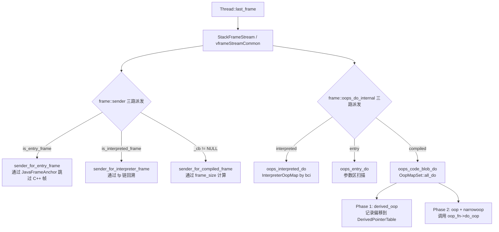
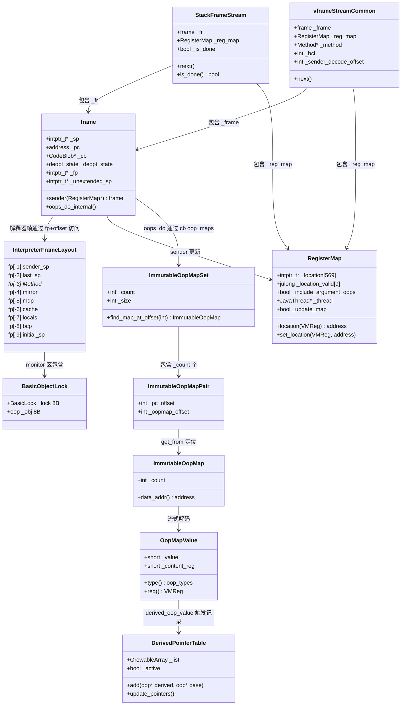

# Day 40：栈帧结构与栈遍历深度剖析

> 纯源码分析，基于 OpenJDK 11 slowdebug
> 方法论：程序 = 数据结构 + 算法

---

## 第 0 部分：核心原理 ⭐

### 0.1 本质是什么？

本文深入分析 **Day 40：栈帧结构与栈遍历深度剖析**：从源码角度理解其设计原理、实现机制和关键细节。

### 0.2 为什么需要？

理解 JVM 内部实现是排查复杂问题、进行性能优化的基础。表面的 API 文档无法解释 JVM 的实际行为，只有深入源码才能建立精确的心智模型。

### 0.3 怎么解决？

结合源码阅读、数据结构分析和 GDB 运行时验证，从多个角度建立对该机制的完整理解。

### 0.4 为什么这样设计？

每个设计决策都有其权衡：性能 vs 正确性、简单性 vs 灵活性、内存占用 vs 查找速度。理解这些权衡是理解 JVM 设计的关键。

---


## 一、宏观理解

### 1.1 解决什么问题

JVM 栈帧（Stack Frame）是方法执行的物理载体。每次方法调用创建一个栈帧，包含局部变量、操作数栈、方法元数据等信息。栈遍历（Stack Walking）是 GC、异常处理、线程 dump 等核心功能的基础——需要从当前帧一路走回调用链起点，找到所有存活的 oop 引用。

**核心问题**：
1. **建帧**：解释器如何构造一个固定格式的栈帧？
2. **回溯**：如何从当前帧找到调用者帧？三种帧类型（解释器/编译/entry）各有什么策略？
3. **GC 扫描**：如何在栈帧中找到所有存活的 oop？解释器帧和编译帧的策略有何不同？
4. **虚拟帧**：一个物理帧可能包含多个内联方法，如何展开？

### 1.2 总体架构图



### 1.3 涉及的数据结构清单

| # | 数据结构 | sizeof (x86-64 debug) | 核心职责 |
|---|----------|----------------------|---------|
| 1 | `frame` | 48B | 物理栈帧的 C++ 表示，{sp, pc, cb, deopt_state, fp, unextended_sp} |
| 2 | 解释器帧布局 | 9 个固定槽位 | fp[-1]~fp[-9] 的 9 个字段 |
| 3 | `BasicObjectLock` | 16B | 解释器同步锁条目：{BasicLock(8B), oop(8B)} |
| 4 | `RegisterMap` | 4664B | 栈遍历伴侣，追踪 callee-saved 寄存器的保存位置 |
| 5 | `OopMapValue` | 16B debug / 4B release | OopMap 流中的单条记录 |
| 6 | `OopMap` | 56B | 编译期为每个 safepoint PC 创建的 oop 位置描述 |
| 7 | `ImmutableOopMap` | 4B header + data | OopMap 的不可变压缩版本 |
| 8 | `ImmutableOopMapSet` | 8B header + pairs + data | 一组 ImmutableOopMap，按 PC 二分查找 |
| 9 | `ImmutableOopMapPair` | 8B | {pc_offset, oopmap_offset} 索引条目 |
| 10 | `StackFrameStream` | 4728B | 物理帧迭代器：{frame + RegisterMap + bool} |
| 11 | `vframe` / `javaVFrame` / `interpretedVFrame` | 4744B | 虚拟帧层次 |
| 12 | `compiledVFrame` | 4760B | 编译帧虚拟帧：+ScopeDesc* + vframe_id |
| 13 | `vframeStreamCommon` | 4752B | 轻量级栈遍历器 |
| 14 | `DerivedPointerTable` | 静态类 | 追踪 C2 生成的 derived oop |

---

## 二、数据结构全景 ⭐

### 2.1 frame（48 字节）

**核心职责**：物理栈帧的 C++ 表示。frame 是临时构造的值对象，用于描述和操作栈上的一段内存。

**源码位置**：`share/runtime/frame.hpp:50-63` + `cpu/x86/frame_x86.hpp:109-119`

**字段列表**（6 个字段，共 48 字节）：

| 偏移 | 字段 | 类型 | 大小 | 含义 |
|------|------|------|------|------|
| 0 | `_sp` | `intptr_t*` | 8B | 栈指针，指向栈帧的最低地址 |
| 8 | `_pc` | `address` | 8B | 程序计数器，调用返回后要执行的下一条指令 |
| 16 | `_cb` | `CodeBlob*` | 8B | 拥有此 PC 的 CodeBlob（compiled method / stub / NULL for interpreted）|
| 24 | `_deopt_state` | `enum deopt_state` | 4B+pad | 反优化状态：not_deoptimized=0, is_deoptimized=1, unknown=2 |
| 32 | `_fp` | `intptr_t*` | 8B | 帧指针（x86-64 的 RBP 寄存器值）|
| 40 | `_unextended_sp` | `intptr_t*` | 8B | 调用者被解释器/adapter 扩展之前的原始 SP |

```cpp
// share/runtime/frame.hpp:50-63
class frame {
 private:
  intptr_t* _sp;    // stack pointer (from Thread::last_Java_sp)
  address   _pc;    // program counter (the next instruction after the call)
  CodeBlob* _cb;    // CodeBlob that "owns" pc
  enum deopt_state {
    not_deoptimized,
    is_deoptimized,
    unknown
  };
  deopt_state _deopt_state;

// cpu/x86/frame_x86.hpp:111,119
  intptr_t*   _fp;            // frame pointer
  intptr_t*   _unextended_sp; // caller's original sp before extension
};
```

**`_unextended_sp` 的设计意义**：解释器和 adapter 会扩展调用者的帧（向下推栈）。但 OopMap 是基于调用者扩展前的 SP 编码栈槽偏移的，所以需要 `_unextended_sp` 记录扩展前的原始值。`oopmapreg_to_location()` 用的就是 `unextended_sp()` 而非 `sp()`。

**创建位置**：frame 是栈上值对象，不通过 new 分配。主要创建方式：
- `JavaThread::last_frame()` — 从线程的 `_anchor._last_Java_sp/fp/pc` 构造第一个 frame
- `frame::sender()` — 从当前帧计算出调用者帧

---

### 2.2 解释器帧布局（Interpreter Frame Layout）

**核心职责**：定义解释器栈帧的固定区域格式。每个解释器帧在 fp 下方有 9 个固定槽位，fp 上方有 old fp 和 return pc。

**源码位置**：`cpu/x86/frame_x86.hpp:35-81`

**布局图**（地址从低到高）：

```
低地址
    [expression stack      ] ← sp（栈顶）
    [monitors              ]   \ 
     ...                        | BasicObjectLock 数组
    [monitors              ]   /
    [monitor block size    ]      ← fp + initial_sp_offset = fp[-9]
    [byte code pointer     ]      ← fp[-8]  bcp
    [pointer to locals     ]      ← fp[-7]  locals
    [constant pool cache   ]      ← fp[-6]  cache
    [methodData            ]      ← fp[-5]  mdp
    [mirror                ]      ← fp[-4]  mirror (GC root)
    [Method*               ]      ← fp[-3]  method
    [last sp               ]      ← fp[-2]  last_sp
    [old stack pointer     ]      ← fp[-1]  sender_sp
    ─────────────────────────
    [old frame pointer     ]      ← fp[0]   saved rbp (link)
    [return pc             ]      ← fp[+1]  return address
    [oop temp              ]      ← fp[+2]  (native only)
    [locals and parameters ]
                                  ← sender sp
高地址
```

**偏移枚举（相对于 fp，单位 word = 8 字节）**：

```cpp
// cpu/x86/frame_x86.hpp:57-81
enum {
  link_offset                     =  0,  // fp[0] = saved rbp
  return_addr_offset              =  1,  // fp[+1] = return pc
  sender_sp_offset                =  2,  // (for non-interpreter frames)

  // Interpreter frame offsets (relative to fp)
  interpreter_frame_sender_sp_offset    = -1,  // fp[-1]
  interpreter_frame_last_sp_offset      = -2,  // fp[-2]
  interpreter_frame_method_offset       = -3,  // fp[-3]
  interpreter_frame_mirror_offset       = -4,  // fp[-4]
  interpreter_frame_mdp_offset          = -5,  // fp[-5]
  interpreter_frame_cache_offset        = -6,  // fp[-6]
  interpreter_frame_locals_offset       = -7,  // fp[-7]
  interpreter_frame_bcp_offset          = -8,  // fp[-8]
  interpreter_frame_initial_sp_offset   = -9,  // fp[-9]
};
```

**各槽位含义**：

| 槽位 | 偏移 | 含义 | 设置时机 |
|------|------|------|---------|
| sender_sp | fp[-1] | 调用者的 SP | `generate_fixed_frame` push r13 |
| last_sp | fp[-2] | 表达式栈最后一次的 SP（call 前设置，平时 NULL）| 初始化 NULL，invoke 前设置 |
| Method* | fp[-3] | 当前执行的 Method 指针 | `generate_fixed_frame` push rbx |
| mirror | fp[-4] | Method 所属 Klass 的 java.lang.Class 镜像（GC root）| `generate_fixed_frame` push |
| mdp | fp[-5] | MethodData pointer（profile 数据指针）| `generate_fixed_frame` 条件 push |
| cache | fp[-6] | ConstantPool cache 指针 | `generate_fixed_frame` push |
| locals | fp[-7] | 局部变量表基地址指针 | `generate_fixed_frame` push r14 |
| bcp | fp[-8] | 字节码指针（当前执行的字节码地址）| `generate_fixed_frame` push rbcp |
| initial_sp | fp[-9] | 表达式栈底 / monitor block top | `generate_fixed_frame` push 0 + mov |

---

### 2.3 BasicObjectLock（16 字节）

**核心职责**：解释器帧中的同步锁条目。synchronized 块/方法在解释器帧中分配 BasicObjectLock 数组，位于 initial_sp 和表达式栈之间。

**源码位置**：`share/runtime/basicLock.hpp`

**字段列表**：

| 偏移 | 字段 | 类型 | 大小 | 含义 |
|------|------|------|------|------|
| 0 | `_lock` | `BasicLock` | 8B | 包含 `_displaced_header` (markOop)，轻量级锁时保存对象头 |
| 8 | `_obj` | `oop` | 8B | 被锁定的对象引用（GC 需要扫描）|

**在帧中的位置**：从 initial_sp (fp[-9]) 向低地址增长。每个 BasicObjectLock 占 16 字节。GC 通过 `current->oops_do(f)` 扫描每个 monitor 的 `_obj` 字段。

---

### 2.4 RegisterMap（4664 字节）

**核心职责**：栈遍历的伴侣结构，追踪 callee-saved 寄存器的保存位置。编译代码调用其他方法时，callee-saved 寄存器被溢出到栈上，RegisterMap 记录每个寄存器当前被保存在栈上的哪个地址。

**源码位置**：`share/runtime/registerMap.hpp:63-126`

**字段列表**：

| 偏移 | 字段 | 类型 | 大小 | 含义 |
|------|------|------|------|------|
| 0 | `_location[569]` | `intptr_t*[]` | 4552B | 每个 VMReg 的保存地址（reg_count=569）|
| 4552 | `_location_valid[9]` | `julong[]` | 72B | 位图，标记哪些 _location 条目有效 |
| 4624 | `_include_argument_oops` | `bool` | 1B+pad | 是否扫描调用参数中的 oop |
| 4632 | `_thread` | `JavaThread*` | 8B | 所属线程 |
| 4640 | `_update_map` | `bool` | 1B+pad | 是否需要更新 map |
| debug | `_update_for_id` | `intptr_t*` | 8B | 断言用：防止同一帧更新两次 |

```cpp
// share/runtime/registerMap.hpp:63-78
class RegisterMap : public StackObj {
 public:
  typedef julong LocationValidType;
  enum {
    reg_count = ConcreteRegisterImpl::number_of_registers,     // 569
    location_valid_type_size = sizeof(LocationValidType)*8,     // 64
    location_valid_size = (569+64-1)/64                         // 9
  };
 private:
  intptr_t*         _location[reg_count];       // 4552 字节
  LocationValidType _location_valid[location_valid_size]; // 72 字节
  bool              _include_argument_oops;
  JavaThread*       _thread;
  bool              _update_map;
};
```

**关键操作**：
- `location(VMReg reg)` — 查询：检查 `_location_valid` 位图，有效则返回 `_location[reg->value()]`
- `set_location(VMReg reg, address loc)` — 记录保存位置 + 设置位图
- `clear()` — entry frame 调用，重置所有位置信息
- `update_map_with_saved_link()` — 每次遍历到新帧时，记录 RBP 的保存位置

---

### 2.5 OopMapValue（16B debug / 4B release）

**核心职责**：OopMap 压缩流中的单条记录，描述一个 oop 的位置和类型。

**源码位置**：`share/compiler/oopMap.hpp:48-146`

**字段列表**：

| 偏移 | 字段 | 类型 | 大小 | 含义 |
|------|------|------|------|------|
| 0 | `_value` | `short` | 2B | 低 2 位 = type，高 14 位 = VMReg 编号 |
| 2 | `_content_reg` | `short` | 2B | callee_saved 的源寄存器 / derived_oop 的 base 寄存器 |

**_value 编码**：

```
  15                    2  1  0
  ┌──────────────────────┬────┐
  │  VMReg number (14位) │type│
  │  register_shift=2    │2位 │
  └──────────────────────┴────┘
  
  type_mask_in_place = 0x3
```

**四种类型（oop_types 枚举）**：

| 值 | 名称 | 含义 |
|----|------|------|
| 0 | `oop_value` | 普通 oop 引用 |
| 1 | `narrowoop_value` | 压缩 oop 引用 |
| 2 | `callee_saved_value` | callee-saved 寄存器，_content_reg 指定原始寄存器 |
| 3 | `derived_oop_value` | derived oop（对象内部指针），_content_reg 指定 base oop 的 VMReg |

**序列化**：通过 `CompressedWriteStream` / `CompressedReadStream` 编解码。callee_saved 和 derived_oop 额外写入 `_content_reg`。

---

### 2.6 OopMap（56 字节）

**核心职责**：编译期间为每个 safepoint PC 创建的 oop 位置描述。记录该 PC 处哪些寄存器/栈槽包含 oop。

**源码位置**：`share/compiler/oopMap.hpp:149-205`

**字段列表**：

| 偏移 | 字段 | 类型 | 大小 | 含义 |
|------|------|------|------|------|
| 0 | `_pc_offset` | `int` | 4B | 该 OopMap 对应的 PC 偏移（相对于 CodeBlob 起始）|
| 4 | `_omv_count` | `int` | 4B | OopMapValue 条目数 |
| 8 | `_write_stream` | `CompressedWriteStream*` | 8B | 压缩写入流（存储 OopMapValue 序列）|
| debug | `_locs_used` | `oop_types*` | 8B | 调试用：检查重复插入 |
| debug | `_locs_length` | `int` | 4B+pad | 调试用 |

**创建位置**：编译器（C1/C2）在编译方法时，对每个 safepoint / call site 创建 OopMap。

**生命周期**：编译完成后，通过 `ImmutableOopMapBuilder::build()` 转换为 `ImmutableOopMapSet`，安装到 `CodeBlob::_oop_maps` 中。原始 OopMap 随 ResourceArea 释放。

---

### 2.7 ImmutableOopMap（4B header + 变长数据）

**核心职责**：OopMap 的不可变压缩版本，安装在 CodeBlob 中。

**源码位置**：`share/compiler/oopMap.hpp:267-288`

**字段列表**：

| 偏移 | 字段 | 类型 | 大小 | 含义 |
|------|------|------|------|------|
| 0 | `_count` | `int` | 4B | OopMapValue 条目数 |
| 4 | (data) | `byte[]` | 变长 | 压缩的 OopMapValue 流（紧跟在 _count 后面）|

```cpp
// share/compiler/oopMap.hpp:276
address data_addr() const { return (address) this + sizeof(ImmutableOopMap); }
```

---

### 2.8 ImmutableOopMapSet（8B header + pairs + data）

**核心职责**：一组 ImmutableOopMap 的容器，安装在 CodeBlob 中。支持按 PC 偏移二分查找对应的 ImmutableOopMap。

**源码位置**：`share/compiler/oopMap.hpp:309-339`

**字段列表**：

| 偏移 | 字段 | 类型 | 大小 | 含义 |
|------|------|------|------|------|
| 0 | `_count` | `int` | 4B | ImmutableOopMapPair 数量 |
| 4 | `_size` | `int` | 4B | 总字节数（包括 header + pairs + data）|
| 8 | (pairs) | `ImmutableOopMapPair[]` | `_count * 8B` | 按 PC 排序的索引数组 |
| 8+pairs | (data) | `ImmutableOopMap[]` | 变长 | 实际的 OopMap 数据 |

**内存布局**：

```
┌───────────────────┐
│ _count (4B)       │
│ _size  (4B)       │
├───────────────────┤
│ ImmutableOopMapPair[0] (8B) │  ← get_pairs()
│ ImmutableOopMapPair[1] (8B) │
│ ...                          │
│ ImmutableOopMapPair[n-1]     │
├───────────────────┤
│ ImmutableOopMap data...      │  ← data()
│ (压缩的 OopMapValue 流)     │
└───────────────────┘
```

**查找路径**：`cb->oop_map_for_return_address(pc)` → `ImmutableOopMapSet::find_map_at_offset(pc_offset)` → 二分查找 pairs 数组 → `pair->get_from(this)` → 返回 `ImmutableOopMap*`。

---

### 2.9 ImmutableOopMapPair（8 字节）

**核心职责**：ImmutableOopMapSet 中的索引条目，将 PC 偏移映射到 OopMap 数据偏移。

**源码位置**：`share/compiler/oopMap.hpp:294-307`

**字段列表**：

| 偏移 | 字段 | 类型 | 大小 | 含义 |
|------|------|------|------|------|
| 0 | `_pc_offset` | `int` | 4B | PC 偏移（相对 CodeBlob 起始）|
| 4 | `_oopmap_offset` | `int` | 4B | OopMap 数据偏移（相对 data() 起始）|

---

### 2.10 StackFrameStream（4728 字节）

**核心职责**：物理帧迭代器，自动调用 `frame::sender()` 遍历整个栈。

**源码位置**：`share/runtime/frame.hpp:455-470`

**字段列表**：

| 偏移 | 字段 | 类型 | 大小 | 含义 |
|------|------|------|------|------|
| 0 | `_fr` | `frame` | 48B | 当前物理帧 |
| 48 | `_reg_map` | `RegisterMap` | 4664B | 寄存器映射（跨帧累积更新）|
| 4712 | `_is_done` | `bool` | 1B+pad | 是否遍历完毕 |

```cpp
// share/runtime/frame.hpp:455-470
class StackFrameStream : public StackObj {
 private:
  frame       _fr;
  RegisterMap _reg_map;
  bool        _is_done;
 public:
  StackFrameStream(JavaThread *thread, bool update = true);
  inline bool is_done();
  void next() { if (!_is_done) _fr = _fr.sender(&_reg_map); }
  frame *current()         { return &_fr; }
  RegisterMap* register_map() { return &_reg_map; }
};
```

**终止条件**（`frame.inline.hpp:66-68`）：

```cpp
inline bool StackFrameStream::is_done() {
  return (_is_done) ? true : (_is_done = _fr.is_first_frame(), false);
}
```

当 `_fr.is_first_frame()` 返回 true（= is_entry_frame && entry_frame_is_first），设置 `_is_done=true`。注意：先返回 false（当前帧仍然可用），下次调用才返回 true。

---

### 2.11 vframe 层次（4744 字节）

**核心职责**：虚拟帧表示源码级别的方法激活。一个物理帧可能对应多个虚拟帧（因为编译器内联）。

**源码位置**：`share/runtime/vframe.hpp:54-200`

**继承层次**：

```
vframe (4744B)
├── javaVFrame (4744B, 抽象：method/bci/locals/expressions/monitors)
│   ├── interpretedVFrame (4744B, 直接读物理帧)
│   └── compiledVFrame (4760B, 通过 ScopeDesc 读调试信息)
└── externalVFrame
    └── entryVFrame
```

**vframe 字段**：

| 偏移 | 字段 | 类型 | 大小 | 含义 |
|------|------|------|------|------|
| 0+vtable | `_fr` | `frame` | 48B | 底层物理帧 |
| 56 | `_reg_map` | `RegisterMap` | 4664B | 寄存器映射 |
| 4720 | `_thread` | `JavaThread*` | 8B | 所属线程 |

**compiledVFrame 额外字段**：

| 偏移 | 字段 | 类型 | 大小 | 含义 |
|------|------|------|------|------|
| 4728 | `_scope` | `ScopeDesc*` | 8B | 调试信息描述符（内联链中的当前位置）|
| 4736 | `_vframe_id` | `int` | 4B+pad | 内联帧编号（0=最内层）|

**interpretedVFrame** 的 `method()` 和 `bci()` 直接从物理帧的固定槽位读取（fp[-3] 和 fp[-8]）。

**compiledVFrame** 的 `method()` 和 `bci()` 从 `_scope->method()` 和 `_scope->bci()` 读取。`sender()` 方法沿 ScopeDesc 的内联链向外展开。

---

### 2.12 vframeStreamCommon（4752 字节）

**核心职责**：轻量级栈遍历器。与 vframe 不同，它不创建 vframe 对象，直接缓存 method/bci，用于高频场景（异常处理、安全检查、栈跟踪）。

**源码位置**：`share/runtime/vframe.hpp:268-330` + `share/runtime/vframe.inline.hpp:31-120`

**字段列表**：

| 偏移 | 字段 | 类型 | 大小 | 含义 |
|------|------|------|------|------|
| 0 | `_frame` | `frame` | 48B | 当前物理帧 |
| 48 | `_thread` | `JavaThread*` | 8B | 所属线程 |
| 56 | `_reg_map` | `RegisterMap` | 4664B | 寄存器映射（update=false，不追踪寄存器位置）|
| 4720 | `_mode` | `enum` | 4B | interpreted_mode / compiled_mode / at_end_mode |
| 4724 | `_sender_decode_offset` | `int` | 4B | 编译帧的内联链 decode 偏移 |
| 4728 | `_method` | `Method*` | 8B | 缓存的当前方法 |
| 4736 | `_bci` | `int` | 4B | 缓存的当前 bci |
| 4740 | `_stop_at_java_call_stub` | `bool` | 1B+pad | 是否在 entry frame 处停止 |

**核心操作 `next()`**（`vframe.inline.hpp:41-48`）：

```cpp
inline void vframeStreamCommon::next() {
  // handle frames with inlining
  if (_mode == compiled_mode && fill_in_compiled_inlined_sender()) return;
  // handle general case
  do {
    _frame = _frame.sender(&_reg_map);
  } while (!fill_from_frame());
}
```

**二级推进策略**：
1. **内联展开优先**：如果当前是编译帧且有内联，先沿 ScopeDesc 链展开（不切换物理帧）
2. **物理帧推进**：否则调用 `_frame.sender()` 切换到调用者物理帧

---

### 2.13 DerivedPointerTable（静态类）

**核心职责**：追踪 C2 编译器生成的 derived oop（指向对象内部的指针，如数组元素地址）。GC 移动对象时，derived oop 必须随之调整。

**源码位置**：`share/compiler/oopMap.hpp:437-471`

**字段列表（全部静态）**：

| 字段 | 类型 | 含义 |
|------|------|------|
| `_list` | `GrowableArray<DerivedPointerEntry*>*` | derived pointer 列表 |
| `_active` | `bool` | 是否正在记录（verify pass 时关闭）|

**关键操作**：
- `clear()` — GC 开始前清空
- `add(oop* derived, oop* base)` — GC 扫描期间记录 derived-base 对，保存 `derived - base` 偏移
- `update_pointers()` — GC 结束后，用 `new_base + saved_offset` 更新所有 derived oop

**为什么需要 DerivedPointerTable**：C2 优化可能产生指向对象内部的指针（例如 `array + offset`）。GC 只移动 base 对象，必须同时调整所有 derived 指针。两阶段扫描（先 derived 后 oop）确保在 base 被移动前记录好偏移。

---

## 三、算法/流程分析（引用第二节数据结构）

### 3.1 generate_fixed_frame()：建帧算法

**解决什么问题**：解释器进入一个新方法时，需要在栈上构造固定格式的帧，使得后续字节码执行和栈遍历都能以统一方式访问帧数据。

**核心思路**：通过 11 次 push 操作，依次压入 return addr、saved rbp、以及 9 个解释器固定槽位。

**源码**（`cpu/x86/templateInterpreterGenerator_x86.cpp:658-694`）：

```cpp
// 入参：rax=return_addr, rbx=Method*, r14=locals, r13=sender_sp, rdx=cp_cache
void TemplateInterpreterGenerator::generate_fixed_frame(bool native_call) {
  __ push(rax);        // ① 保存 return address（→ fp[+1]）
  __ enter();          // ② push rbp + mov rbp,rsp（→ fp[0] = old rbp）
  __ push(rbcp);       // ③ push sender_sp (此时 rbcp=r13=sender_sp)（→ fp[-1]）
  __ push((int)NULL_WORD); // ④ last_sp = NULL（→ fp[-2]）
  
  // 此时重新计算 rbcp = bytecode pointer
  __ movptr(rbcp, Address(rbx, Method::const_offset()));
  __ lea(rbcp, Address(rbcp, ConstMethod::codes_offset()));
  
  __ push(rbx);        // ⑤ push Method*（→ fp[-3]）
  __ load_mirror(rdx, rbx);
  __ push(rdx);        // ⑥ push mirror（→ fp[-4]）
  
  if (ProfileInterpreter) {
    // ... 计算 mdp
    __ push(rdx);      // ⑦ push mdp（→ fp[-5]）
  } else {
    __ push(0);
  }
  
  __ movptr(rdx, Address(rbx, Method::const_offset()));
  __ movptr(rdx, Address(rdx, ConstMethod::constants_offset()));
  __ movptr(rdx, Address(rdx, ConstantPool::cache_offset_in_bytes()));
  __ push(rdx);        // ⑧ push CP cache（→ fp[-6]）
  __ push(rlocals);    // ⑨ push locals pointer（→ fp[-7]）
  
  if (native_call) {
    __ push(0);        // ⑩ native 方法无 bcp
  } else {
    __ push(rbcp);     // ⑩ push bcp（→ fp[-8]）
  }
  
  __ push(0);                              // ⑪ 占位（→ fp[-9]）
  __ movptr(Address(rsp, 0), rsp);         // initial_sp = rsp（指向自己）
}
```

**设计决策**：
- **rbcp 复用**：进入时 rbcp(r13) 保存的是 sender_sp，push 后重新加载为 bytecode pointer。一个寄存器两种用途，节省寄存器。
- **mirror 存在帧中**：Method* 不是 GC root，但其所属 Klass 必须保活。将 mirror（java.lang.Class）存入帧中作为 GC root。
- **initial_sp 自指**：`movptr([rsp], rsp)` 使 initial_sp 指向自己（即表达式栈底）。monitor 分配时从这里向低地址增长。

---

### 3.2 frame::sender()：三路派发回溯算法

**解决什么问题**：从当前物理帧找到调用者帧。三种帧类型（entry/interpreted/compiled）有完全不同的回溯策略。

**核心思路**：先判断帧类型，然后分别用不同策略构造调用者 frame。

**源码**（`cpu/x86/frame_x86.cpp:488-503`）：

```cpp
// frame_x86.cpp:488-503
frame frame::sender(RegisterMap* map) const {
  map->set_include_argument_oops(false);  // 默认不扫描参数 oop

  if (is_entry_frame())       return sender_for_entry_frame(map);       // ① entry 帧
  if (is_interpreted_frame()) return sender_for_interpreter_frame(map); // ② 解释器帧
  assert(_cb == CodeCache::find_blob(pc()),"Must be the same");

  if (_cb != NULL) {
    return sender_for_compiled_frame(map);  // ③ 编译帧
  }
  // 兜底：native-compiled frame
  return frame(sender_sp(), link(), sender_pc());
}
```

#### 3.2.1 sender_for_entry_frame — 跳过所有 C++ 帧

**解决什么问题**：entry frame 是 Java→C++→Java 的边界帧。它的调用者是一堆 C++ 帧，不能用 fp 链回溯，必须通过 JavaFrameAnchor 直接跳到上一个 Java 帧。

```cpp
// frame_x86.cpp:344-362
frame frame::sender_for_entry_frame(RegisterMap* map) const {
  JavaFrameAnchor* jfa = entry_frame_call_wrapper()->anchor();
  // ★ anchor 保存了上一个 Java 帧的 sp/fp/pc
  if (!jfa->walkable()) {
    jfa->capture_last_Java_pc();  // 补全 pc（如果之前没保存）
  }
  map->clear();  // ★ 跨过 C++ 帧，寄存器位置信息全部失效
  assert(map->include_argument_oops(), "should be set by clear");
  // 直接用 anchor 的 sp/fp/pc 构造 frame，跳过所有 C++ 帧
  frame fr(jfa->last_Java_sp(), jfa->last_Java_fp(), jfa->last_Java_pc());
  return fr;
}
```

#### 3.2.2 sender_for_interpreter_frame — fp 链回溯

**解决什么问题**：解释器帧有标准的 fp 链。通过 fp[0]（saved rbp）和 fp[+1]（return pc）直接找到调用者。

```cpp
// frame_x86.cpp:431-446
frame frame::sender_for_interpreter_frame(RegisterMap* map) const {
  intptr_t* sender_sp = this->sender_sp();     // ★ fp + sender_sp_offset(2) = fp[+2]
  intptr_t* unextended_sp = interpreter_frame_sender_sp(); // ★ fp[-1] 的值

  if (map->update_map()) {
    // ★ 记录 RBP 保存在 fp[0] 的位置，供编译帧的 OopMap 使用
    update_map_with_saved_link(map, (intptr_t**) addr_at(link_offset));
  }

  return frame(sender_sp, unextended_sp, link(), sender_pc());
  //           ^调用者sp   ^未扩展sp      ^fp[0]   ^fp[+1]
}
```

#### 3.2.3 sender_for_compiled_frame — frame_size 计算

**解决什么问题**：编译帧没有统一的 fp 链（有些编译帧不保存 rbp）。通过 CodeBlob 记录的 `frame_size` 计算调用者 SP。

```cpp
// frame_x86.cpp:451-483
frame frame::sender_for_compiled_frame(RegisterMap* map) const {
  // ★ 关键公式：sender_sp = unextended_sp + frame_size
  intptr_t* sender_sp = unextended_sp() + _cb->frame_size();
  intptr_t* unextended_sp = sender_sp;  // 编译帧的 sender 不再有扩展

  // ★ return pc 在 sender_sp - 1 的位置
  address sender_pc = (address) *(sender_sp-1);

  // ★ saved fp 在 sender_sp - 2 的位置（= sender_sp - sender_sp_offset）
  intptr_t** saved_fp_addr = (intptr_t**) (sender_sp - frame::sender_sp_offset);

  if (map->update_map()) {
    map->set_include_argument_oops(_cb->caller_must_gc_arguments(map->thread()));
    if (_cb->oop_maps() != NULL) {
      // ★ 用 OopMap 中的 callee_saved 条目更新 RegisterMap
      OopMapSet::update_register_map(this, map);
    }
    // ★ 记录 RBP 保存位置
    update_map_with_saved_link(map, saved_fp_addr);
  }

  return frame(sender_sp, unextended_sp, *saved_fp_addr, sender_pc);
}
```

**update_map_with_saved_link** 的设计决策（`frame_x86.cpp:407-426`）：

```cpp
void frame::update_map_with_saved_link(RegisterMap* map, intptr_t** link_addr) {
  // ★ 解释器和编译器都在固定位置保存 RBP
  // 即使 C2 不需要 RBP 作为帧指针，也在 enter 时保存
  // 这样就不需要 OopMap 记录 RBP 的保存位置（节省空间）
  map->set_location(rbp->as_VMReg(), (address) link_addr);
  map->set_location(rbp->as_VMReg()->next(), (address) link_addr); // AMD64: H part
}
```

---

### 3.3 OopMapSet::all_do()：两阶段 GC 扫描

**解决什么问题**：在编译帧中找到所有存活的 oop 引用。必须先处理 derived oop（因为 GC 可能移动 base 对象，必须在移动前记录 derived-base 偏移）。

**核心思路**：两阶段扫描——Phase 1 处理 derived_oop，Phase 2 处理 oop 和 narrowoop。

**源码**（`share/compiler/oopMap.cpp:294-398`）：

```cpp
// oopMap.cpp:294-398
void OopMapSet::all_do(const frame *fr, const RegisterMap *reg_map,
                       OopClosure* oop_fn, void derived_oop_fn(oop*, oop*),
                       OopClosure* value_fn) {
  CodeBlob* cb = fr->cb();

  // ★ 通过 PC 偏移二分查找对应的 ImmutableOopMap
  const ImmutableOopMap* map = cb->oop_map_for_return_address(fr->pc());

  // ═══════════════════════════════════════════════
  // Phase 1：先处理 derived oop（必须在 base 被移动之前）
  // ═══════════════════════════════════════════════
  {
    for (OopMapStream oms(map); !oms.is_done(); oms.next()) {
      OopMapValue omv = oms.current();
      if (omv.type() != OopMapValue::derived_oop_value) {
        continue;  // ★ 只处理 derived_oop_value
      }
      // ★ 加锁保护 DerivedPointerTable（全局共享）
      MutexLockerEx x(DerivedPointerTableGC_lock, Mutex::_no_safepoint_check_flag);

      // ★ omv.reg() = derived 的位置，omv.content_reg() = base 的位置
      oop* derived_loc = fr->oopmapreg_to_location(omv.reg(), reg_map);
      oop* base_loc    = fr->oopmapreg_to_location(omv.content_reg(), reg_map);

      if (base_loc != NULL && *base_loc != NULL &&
          !Universe::is_narrow_oop_base(*base_loc)) {
        derived_oop_fn(base_loc, derived_loc);
        // ★ 记录 offset = *derived_loc - *base_loc 到 DerivedPointerTable
      }
    }
  }

  // ═══════════════════════════════════════════════
  // Phase 2：处理 oop 和 narrowoop
  // ═══════════════════════════════════════════════
  {
    for (OopMapStream oms(map); !oms.is_done(); oms.next()) {
      OopMapValue omv = oms.current();
      oop* loc = fr->oopmapreg_to_location(omv.reg(), reg_map);

      if (omv.type() == OopMapValue::oop_value) {
        oop val = *loc;
        if (val == NULL || Universe::is_narrow_oop_base(val)) {
          continue;  // ★ 跳过 NULL 和解码后的 NULL narrowoop
        }
        oop_fn->do_oop(loc);  // ★ 调用 GC closure 处理该 oop
      } else if (omv.type() == OopMapValue::narrowoop_value) {
        narrowOop *nl = (narrowOop*)loc;
        oop_fn->do_oop(nl);   // ★ 调用 narrowoop 版本的 do_oop
      }
    }
  }
}
```

**oopmapreg_to_location 转换**（`frame.inline.hpp:56-64`）：

```cpp
inline oop* frame::oopmapreg_to_location(VMReg reg, const RegisterMap* reg_map) const {
  if (reg->is_reg()) {
    // ★ 寄存器位置 → 从 RegisterMap 查找保存地址
    return (oop *)reg_map->location(reg);
  } else {
    // ★ 栈槽位置 → unextended_sp + 偏移（注意用 unextended_sp 不是 sp）
    int sp_offset_in_bytes = reg->reg2stack() * VMRegImpl::stack_slot_size;
    return (oop*)(((address)unextended_sp()) + sp_offset_in_bytes);
  }
}
```

---

### 3.4 frame::oops_do_internal()：三路派发 GC 扫描

**解决什么问题**：不同类型的帧有不同的 oop 查找策略。需要统一的入口，按帧类型分发。

**核心思路**：interpreted → InterpreterOopMap，entry → 参数区，compiled → OopMapSet。

**源码**（`share/runtime/frame.cpp:1106-1126`）：

```cpp
// frame.cpp:1106-1126
void frame::oops_do_internal(OopClosure* f, CodeBlobClosure* cf,
                             RegisterMap* map, bool use_interpreter_oop_map_cache) {
  if (is_interpreted_frame()) {
    // ★ 解释器帧：用 InterpreterOopMap（基于 bci 的位图）
    // 扫描局部变量 + 表达式栈 + monitor 的 _obj + mirror
    oops_interpreted_do(f, map, use_interpreter_oop_map_cache);
  } else if (is_entry_frame()) {
    // ★ entry 帧：扫描传入的参数 + JNIHandleBlock
    oops_entry_do(f, map);
  } else if (CodeCache::contains(pc())) {
    // ★ 编译帧：用 OopMapSet::oops_do → all_do 两阶段扫描
    oops_code_blob_do(f, cf, map);
  } else {
    ShouldNotReachHere();
  }
}
```

**解释器帧的 oops_interpreted_do**（`frame.cpp:890-958`）关键步骤：
1. 遍历所有 monitor 的 `_obj` → `current->oops_do(f)`
2. 如果是 native 方法 → 扫描 `oop_temp`
3. 扫描 `mirror`（fp[-4]）
4. 通过 `InterpreterOopMap`（按 bci 查找的位图）扫描局部变量和表达式栈中的 oop

**entry 帧的 oops_entry_do**（`frame.cpp:1092-1103`）：
1. 如果 `include_argument_oops` → 扫描参数区的 oop
2. 扫描 `JNIHandleBlock`

**编译帧的 oops_code_blob_do**（`frame.cpp:967-985`）：
1. `OopMapSet::oops_do()` → `all_do()` 两阶段扫描
2. 如果 `include_argument_oops` → `preserve_callee_argument_oops()`
3. 如果 cf != NULL → `cf->do_code_blob(_cb)`（追踪 nmethod 活跃性）

---

### 3.5 vframeStreamCommon::next()：二级推进

**解决什么问题**：编译帧可能内联了多个方法。遍历时需要先展开内联帧，再推进到物理调用者帧。

**核心思路**：先尝试内联展开（不切换物理帧），失败后再 `sender()` 推进物理帧。

**源码**（`share/runtime/vframe.inline.hpp:41-48`）：

```cpp
inline void vframeStreamCommon::next() {
  // ★ 第一级：内联展开
  if (_mode == compiled_mode && fill_in_compiled_inlined_sender()) return;

  // ★ 第二级：物理帧推进
  do {
    _frame = _frame.sender(&_reg_map);
  } while (!fill_from_frame());
  // fill_from_frame 对解释器帧读 method/bci，对编译帧读 ScopeDesc
  // 跳过非 Java 帧（stub、runtime 等）
}
```

**fill_in_compiled_inlined_sender**（`vframe.inline.hpp:66-72`）：

```cpp
inline bool vframeStreamCommon::fill_in_compiled_inlined_sender() {
  if (_sender_decode_offset == DebugInformationRecorder::serialized_null) {
    return false;  // ★ 没有更多内联帧了
  }
  fill_from_compiled_frame(_sender_decode_offset);
  // ★ 读下一层的 method/bci/_sender_decode_offset
  return true;
}
```

**fill_from_compiled_frame**（`vframe.inline.hpp:75-114`）：

```cpp
inline void vframeStreamCommon::fill_from_compiled_frame(int decode_offset) {
  _mode = compiled_mode;
  DebugInfoReadStream buffer(nm(), decode_offset);
  _sender_decode_offset = buffer.read_int();   // ★ 下一层的 decode offset
  _method               = buffer.read_method(); // ★ 当前层的 Method*
  _bci                  = buffer.read_bci();    // ★ 当前层的 bci
}
```

---

## 四、GDB 验证

### 4.1 验证计划

| # | 验证项 | 方法 |
|---|--------|------|
| 1 | sizeof：frame, RegisterMap, OopMapValue, OopMap 等 13 个结构 | GDB `sizeof()` |
| 2 | frame 字段偏移：_sp(0), _pc(8), _cb(16), _deopt_state(24), _fp(32), _unextended_sp(40) | GDB `&((frame*)0)->field` |
| 3 | 解释器帧 9 个偏移常量：sender_sp(-1) ~ initial_sp(-9) | GDB 打印枚举值 |
| 4 | OopMapValue 类型常量：oop_value=0, narrowoop=1, callee_saved=2, derived=3 | GDB 打印枚举值 |
| 5 | BasicObjectLock 偏移：_lock(0), _obj(8) | GDB `&((BOL*)0)->field` |
| 6 | RegisterMap 常量：reg_count=569, location_valid_size=9 | GDB 打印枚举值 |
| 7 | 运行时帧内存 dump：在 monitorenter 断点处检查 fp[-1]~fp[-9] | GDB 断点 + 内存 dump |
| 8 | 帧链遍历：从解释器帧沿 saved_fp 链走到 entry 帧 | GDB 逐帧追踪 |

### 4.2 验证结果

#### 4.2.1 sizeof 验证（全部通过 ✓）

```
sizeof(frame)                = 48     ✓（6 个字段 × 8B，含 4B enum + padding）
sizeof(RegisterMap)          = 4664   ✓（4552 + 72 + 1+7 + 8 + 1+7 + 8(debug) + 8(pad)）
sizeof(OopMapValue)          = 16     ✓（debug 构建含 padding；release 为 4B）
sizeof(OopMap)               = 56     ✓（含 debug 字段）
sizeof(ImmutableOopMap)      = 4      ✓（只有 _count）
sizeof(ImmutableOopMapSet)   = 8      ✓（_count + _size）
sizeof(ImmutableOopMapPair)  = 8      ✓（_pc_offset + _oopmap_offset）
sizeof(StackFrameStream)     = 4728   ✓（48 + 4664 + 1 + padding）
sizeof(BasicObjectLock)      = 16     ✓（8 + 8）
sizeof(BasicLock)            = 8      ✓（一个 markOop）
sizeof(vframe)               = 4744   ✓（vtable + frame + RegisterMap + JavaThread*）
sizeof(compiledVFrame)       = 4760   ✓（+ScopeDesc* + int + padding）
sizeof(vframeStreamCommon)   = 4752   ✓（frame + ptr + RegisterMap + enum + int + Method* + int + bool + pad）
sizeof(interpretedVFrame)    = 4744   ✓（同 javaVFrame，无额外字段）
sizeof(javaVFrame)           = 4744   ✓（同 vframe，抽象类无额外字段）
```

#### 4.2.2 frame 字段偏移（全部通过 ✓）

```
frame._sp          offset = 0    ✓
frame._pc          offset = 8    ✓
frame._cb          offset = 16   ✓
frame._deopt_state offset = 24   ✓
frame._fp          offset = 32   ✓
frame._unextended_sp offset = 40  ✓
```

#### 4.2.3 解释器帧偏移常量（全部通过 ✓）

```
interpreter_frame_sender_sp_offset    = -1  ✓
interpreter_frame_last_sp_offset      = -2  ✓
interpreter_frame_method_offset       = -3  ✓
interpreter_frame_mirror_offset       = -4  ✓
interpreter_frame_mdp_offset          = -5  ✓
interpreter_frame_cache_offset        = -6  ✓
interpreter_frame_locals_offset       = -7  ✓
interpreter_frame_bcp_offset          = -8  ✓
interpreter_frame_initial_sp_offset   = -9  ✓
```

#### 4.2.4 OopMapValue 类型常量（全部通过 ✓）

```
OopMapValue::oop_value          = 0  ✓
OopMapValue::narrowoop_value    = 1  ✓
OopMapValue::callee_saved_value = 2  ✓
OopMapValue::derived_oop_value  = 3  ✓
type_mask_in_place              = 3  ✓
```

#### 4.2.5 BasicObjectLock 偏移（全部通过 ✓）

```
BasicObjectLock._lock offset = 0  ✓
BasicObjectLock._obj  offset = 8  ✓
```

#### 4.2.6 RegisterMap 常量（全部通过 ✓）

```
RegisterMap::reg_count           = 569  ✓
RegisterMap::location_valid_size = 9    ✓
```

#### 4.2.7 运行时帧内存 dump（通过 ✓）

测试类 `StackFrameTest`：`methodA(int) → methodB(int,long) → methodC(long)`，methodB 有 synchronized 块。

在 `InterpreterRuntime::monitorenter` 断点（跳过前 2 次 JVM 初始化调用后），dump 解释器帧：

```
=== Interpreter Frame at monitorenter (methodB synchronized block) ===
fp[-1] sender_sp     = 0x7ffff5f2e270    ✓ 合法栈地址
fp[-2] last_sp       = 0x0               ✓ 初始为 NULL
fp[-3] Method*       = 0x7ffff02a5418    ✓ 有效 Method* 地址
fp[-4] mirror        = 0x71800fa00       ✓ java.lang.Class oop
fp[-5] mdp           = 0x0               ✓ 无 profile 数据
fp[-6] cache         = 0x7ffff02b9b40    ✓ ConstantPoolCache*
fp[-7] locals        = 0x7ffff5f2e260    ✓ 局部变量表地址
fp[-8] bcp           = 0x7ffff029dc9d    ✓ 字节码指针
fp[-9] initial_sp    = 0x7ffff5f2e1e0    ✓ = rsp at frame setup
```

#### 4.2.8 帧链遍历（通过 ✓）

从 methodC 的解释器帧出发，沿 saved_fp (fp[0]) 链遍历：

```
Frame 0: fp=0x7ffff5f2e1b8  (methodC interpreter frame)
  → saved_fp = 0x7ffff5f2e218
Frame 1: fp=0x7ffff5f2e218  (methodB interpreter frame)  
  → saved_fp = 0x7ffff5f2e270
Frame 2: fp=0x7ffff5f2e270  (methodA interpreter frame)
  → saved_fp = 0x7ffff5f2e3a0
Frame 3: fp=0x7ffff5f2e3a0  (entry frame)
  → saved_fp = 0x7ffff5f2e460
Frame 4: fp=0x7ffff5f2e460  (C++ frame - JavaCalls::call_helper)
  → saved_fp = 0x7ffff5f2e4d0
Frame 5: fp=0x7ffff5f2e4d0  (C++ frame)
```

**确认**：3 个解释器帧 → 1 个 entry 帧 → C++ 帧，符合 `methodA → methodB → methodC` 调用链 + entry 边界。

---

## 五、查漏补缺

### 5.1 Q&A

**Q1：为什么需要 `_unextended_sp`，直接用 `_sp` 不行吗？**

A：OopMap 中栈槽的偏移是相对于方法编译时确定的"原始 SP"编码的。但解释器和 adapter 可能扩展调用者的帧（例如为传参分配额外空间），导致实际 SP 比编码时假设的 SP 更低。如果用扩展后的 SP 计算 oop 地址会算错，所以必须记录扩展前的原始 SP（`_unextended_sp`）。

**Q2：为什么 all_do 必须两阶段，不能一遍搞定？**

A：derived oop（如 `array_base + index * scale`）指向对象内部。GC 移动 base 对象后，derived oop 就失效了。如果在一遍扫描中先处理了 base（移动了对象），再遇到 derived 时就无法计算正确的偏移。所以必须先遍历一遍记录所有 derived-base 的偏移（Phase 1），然后再处理 oop 移动（Phase 2）。

**Q3：RegisterMap 为什么这么大（4664 字节）？**

A：x86-64 有 569 个 VMReg（包括通用寄存器、XMM 寄存器、以及它们的 H half）。每个 VMReg 需要一个 `intptr_t*`（8 字节）记录保存位置，光 `_location` 数组就是 569 × 8 = 4552 字节。再加上位图和其他字段，总共 4664 字节。这是为了支持完整的 callee-saved 寄存器追踪。

**Q4：vframeStreamCommon 为什么用 `update=false` 构造 RegisterMap？**

A：vframeStreamCommon 只需要遍历栈获取 method/bci，不需要 GC 扫描。RegisterMap 更新很昂贵（每个帧都要处理 OopMap 的 callee_saved 条目），设 `update=false` 跳过更新，大幅加速遍历。

**Q5：解释器帧的 mirror 和 Method* 什么关系？为什么要单独存 mirror？**

A：Method* 本身不是 oop，GC 不会追踪它。但 Method* 属于一个 InstanceKlass，如果该 Klass 没有其他引用被 GC 回收了，Method* 也会失效。将 mirror（java.lang.Class 对象）存入帧中作为 GC root，保证方法执行期间其所属类不会被卸载。

---

## 六、数据结构关系图



---

## 七、总结

### 7.1 数据结构层面

| 数据结构 | sizeof | 核心特征 |
|----------|--------|---------|
| `frame` | 48B | 6 字段值对象，`_unextended_sp` 是 OopMap 定位的关键 |
| 解释器帧布局 | 9 × 8B 固定区 | fp[-1]~fp[-9]，11-push 建帧，mirror 作为 GC root |
| `BasicObjectLock` | 16B | 解释器锁条目，{displaced_header, locked_obj} |
| `RegisterMap` | 4664B | 569 个 VMReg 位置追踪，位图加速查找 |
| `OopMapValue` | 4B/16B | 2+14 位编码，4 种类型（oop/narrowoop/callee_saved/derived）|
| `ImmutableOopMapSet` | 8B+ | header + pairs + data 三段式布局，PC 二分查找 |
| `StackFrameStream` | 4728B | frame + RegisterMap + done，物理帧迭代器 |
| `vframeStreamCommon` | 4752B | 轻量级遍历器，缓存 method/bci，update=false 加速 |
| `DerivedPointerTable` | 静态类 | 追踪 C2 derived oop，GC 前记录偏移、GC 后修复 |

### 7.2 算法层面

| 算法 | 核心设计决策 |
|------|------------|
| `generate_fixed_frame` 11-push 建帧 | rbcp 复用（先当 sender_sp 后当 bcp）；mirror 入帧保活类；initial_sp 自指 |
| `sender()` 三路派发 | entry→JavaFrameAnchor 跳过 C++ 帧；interpreted→fp 链；compiled→frame_size 计算 |
| `all_do()` 两阶段 GC 扫描 | Phase 1 先记录 derived 偏移（防止 base 被移动后失去信息）；Phase 2 处理 oop 移动 |
| `oops_do_internal()` 三路派发 | interpreted→InterpreterOopMap 按 bci 位图；entry→参数区+HandleBlock；compiled→OopMapSet |
| `vframeStreamCommon::next()` 二级推进 | 优先沿 ScopeDesc 内联链展开（不切物理帧），耗尽后 sender() 推进 |
| `oopmapreg_to_location` 地址转换 | 寄存器→RegisterMap 查保存位置；栈槽→unextended_sp+offset（不是 sp!）|
