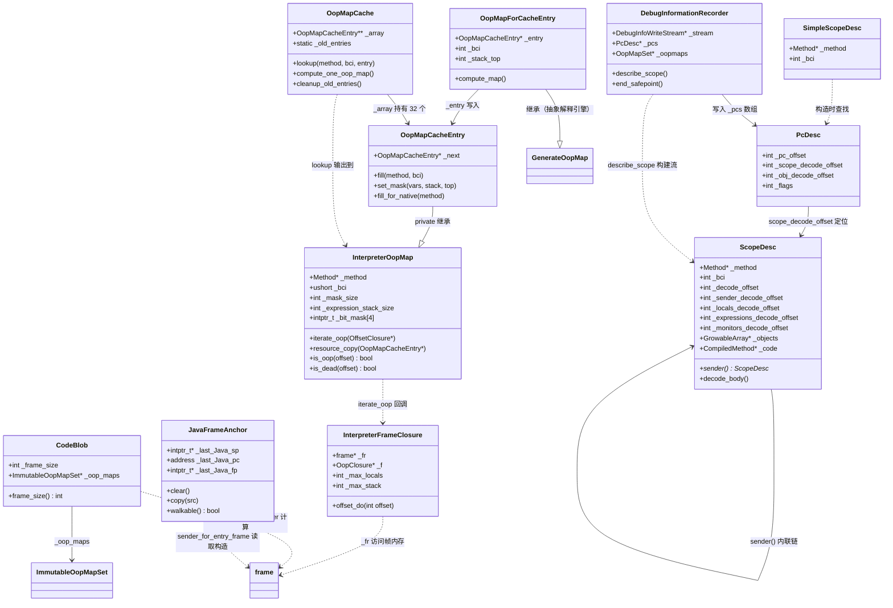

# Day 40 补充：栈帧结构与栈遍历 — 深度补全

> 纯源码分析，基于 OpenJDK 11 slowdebug
> 方法论：程序 = 数据结构 + 算法
> 本文是 Day 40 主文档的补充，覆盖主文档中未充分展开的 10 个数据结构和 4 个算法

---

## 第 0 部分：核心原理 ⭐

### 0.1 本质是什么？

本文深入分析 **Day 40 补充：栈帧结构与栈遍历 — 深度补全**：从源码角度理解其设计原理、实现机制和关键细节。

### 0.2 为什么需要？

理解 JVM 内部实现是排查复杂问题、进行性能优化的基础。表面的 API 文档无法解释 JVM 的实际行为，只有深入源码才能建立精确的心智模型。

### 0.3 怎么解决？

结合源码阅读、数据结构分析和 GDB 运行时验证，从多个角度建立对该机制的完整理解。

### 0.4 为什么这样设计？

每个设计决策都有其权衡：性能 vs 正确性、简单性 vs 灵活性、内存占用 vs 查找速度。理解这些权衡是理解 JVM 设计的关键。

---


## 一、宏观理解

### 1.1 补充范围

主文档（1-Stack-Frame-And-Stack-Walking-Deep-Dive.md）覆盖了 13 个核心数据结构和 5 个算法。但以下方面分析深度不足：

**数据结构层面（需补充 6 项完整分析）**：
1. **JavaFrameAnchor** — 主文档仅在 sender_for_entry_frame 中一笔带过
2. **InterpreterOopMap** — 主文档只说"按 bci 查找的位图"，未展开字段和编码
3. **OopMapCacheEntry** — 主文档完全未提及
4. **OopMapCache** — 主文档完全未提及
5. **OopMapForCacheEntry** — 主文档完全未提及
6. **ScopeDesc** — 主文档 compiledVFrame 中提到但未展开字段
7. **SimpleScopeDesc** — 主文档完全未提及
8. **PcDesc** — 主文档完全未提及
9. **CodeBlob._frame_size** — 主文档在 sender_for_compiled_frame 中用到但未解释来源
10. **DebugInformationRecorder** — 主文档完全未提及

**算法层面（需源码级深度分析）**：
1. **oops_interpreted_do** — 主文档只列步骤，未贴源码
2. **InterpreterFrameClosure** — 主文档完全未提及
3. **InterpreterOopMap::resource_copy** — 主文档完全未提及
4. **DebugInformationRecorder::describe_scope** — 主文档完全未提及

### 1.2 涉及的数据结构清单

| # | 数据结构 | sizeof (x86-64 debug) | 核心职责 |
|---|----------|----------------------|---------|
| 1 | `JavaFrameAnchor` | 24B | Java↔C++ 边界的帧锚点，{sp, pc, fp} |
| 2 | `InterpreterOopMap` | 88B | bci 级 oop 位图，2-bit-per-entry 编码 |
| 3 | `OopMapCacheEntry` | 96B | InterpreterOopMap 的 C 堆持久化版本 |
| 4 | `OopMapCache` | 16B | 32 槽固定哈希缓存，CAS 无锁插入 |
| 5 | `OopMapForCacheEntry` | ~继承 GenerateOopMap | 抽象解释引擎到缓存条目的桥接 |
| 6 | `ScopeDesc` | 80B | 编译帧调试信息描述符，内联链节点 |
| 7 | `SimpleScopeDesc` | 24B | 轻量级 ScopeDesc，仅提取 method+bci |
| 8 | `PcDesc` | 16B | PC→ScopeDesc 的映射条目 |
| 9 | `CodeBlob._frame_size` | 4B (字段) | 编译帧大小（words），sender_sp 计算依据 |
| 10 | `DebugInformationRecorder` | 112B | 编译期调试信息写入器 |

---

## 二、数据结构全景 ⭐

### 2.1 JavaFrameAnchor（24 字节）

**核心职责**：Java↔C++ 边界的帧锚点。当 Java 代码通过 JNI 或 runtime call 进入 C++ 时，anchor 保存当前 Java 帧的 sp/fp/pc，使得 C++ 代码结束后能通过 anchor 找回 Java 帧链。这是 `sender_for_entry_frame()` 跳过所有 C++ 帧的关键。

**源码位置**：`share/runtime/javaFrameAnchor.hpp:38-95` + `cpu/x86/javaFrameAnchor_x86.hpp:28-85`

**字段列表**（3 个字段，共 24 字节）：

| 偏移 | 字段 | 类型 | 大小 | 含义 |
|------|------|------|------|------|
| 0 | `_last_Java_sp` | `intptr_t* volatile` | 8B | 上一个 Java 帧的栈指针。**兼做有效性标志**：非 NULL = anchor 有效 |
| 8 | `_last_Java_pc` | `volatile address` | 8B | 上一个 Java 帧的 PC（返回地址）|
| 16 | `_last_Java_fp` | `intptr_t* volatile` | 8B | 上一个 Java 帧的帧指针（x86-64 特有）|

**GDB 验证**：

```
sizeof(JavaFrameAnchor)=24  ✓
JavaFrameAnchor._last_Java_sp offset=0   ✓
JavaFrameAnchor._last_Java_pc offset=8   ✓
JavaFrameAnchor._last_Java_fp offset=16  ✓
```

**`_last_Java_sp` 兼做有效性标志的设计**：

源码注释（`javaFrameAnchor.hpp:58-60`）：
```cpp
// Whenever _last_Java_sp != NULL other anchor fields MUST be valid!
// The stack may not be walkable [check with walkable() ] but the values must be valid.
// The profiler apparently depends on this.
```

这意味着只需检查 `_last_Java_sp != NULL` 就能判断 anchor 是否有效，不需要额外的 `_valid` 标志。

**clear() 和 copy() 的操作顺序 — 并发安全的关键**：

```cpp
// cpu/x86/javaFrameAnchor_x86.hpp:40-46
void clear(void) {
  _last_Java_sp = NULL;   // ★ 必须第一个清零（使 anchor 立即"无效"）
  _last_Java_fp = NULL;   // 之后清零 fp 和 pc 就安全了
  _last_Java_pc = NULL;   // 因为任何并发读者看到 sp==NULL 就不会读其他字段
}
```

```cpp
// cpu/x86/javaFrameAnchor_x86.hpp:48-63
void copy(JavaFrameAnchor* src) {
  // ★ 如果 sp 在变化，先置 NULL（临时失效）
  if (_last_Java_sp != src->_last_Java_sp)
    _last_Java_sp = NULL;

  _last_Java_fp = src->_last_Java_fp;  // 先写 fp
  _last_Java_pc = src->_last_Java_pc;  // 再写 pc
  _last_Java_sp = src->_last_Java_sp;  // ★ 最后写 sp（使 anchor 生效）
}
```

**设计决策**：`_last_Java_sp` 是"发布者"——clear 时最先置 NULL，copy 时最后写入。这保证并发读者（如 profiler）在读到非 NULL 的 sp 时，fp 和 pc 已经是新值。一个字段 + 操作顺序替代了锁。

**walkable() 判定**：

```cpp
// cpu/x86/javaFrameAnchor_x86.hpp:65
bool walkable(void) { return _last_Java_sp != NULL && _last_Java_pc != NULL; }
```

walkable 比 has_last_Java_frame 更严格：不仅 sp 非 NULL，pc 也必须非 NULL。`sender_for_entry_frame()` 在 anchor 不可走时调用 `capture_last_Java_pc()` 补全 pc。

**创建位置**：嵌入在 `JavaThread` 对象中（`thread.hpp` 的 `_anchor` 字段）。每个 Java 线程有且仅有一个 anchor。

**生命周期**：
1. **设置**：`JavaCallWrapper` 构造函数（Java→C++边界）保存当前 Java 帧的 sp/fp/pc 到 anchor
2. **使用**：`sender_for_entry_frame()` 读取 anchor 构造上一个 Java 帧
3. **清除**：`JavaCallWrapper` 析构函数（C++→Java 返回）恢复旧 anchor

---

### 2.2 InterpreterOopMap（88 字节）

**核心职责**：存储解释器帧在特定 bci 处的 oop 位图。GC 扫描解释器帧时，通过此位图判断局部变量表和表达式栈中哪些槽位包含 oop 引用。

**源码位置**：`share/interpreter/oopMapCache.hpp:64-144`

**字段列表**（debug 构建，7 个字段+padding，共 88 字节）：

| 偏移 | 字段 | 类型 | 大小 | 含义 |
|------|------|------|------|------|
| 0-23 | (vtable+ResourceObj) | - | 24B | ResourceObj 虚表指针 + 内部字段 |
| 24 | `_method` | `Method*` | 8B | 关联的方法 |
| 32 | `_bci` | `unsigned short` | 2B+pad | 关联的字节码索引 |
| 36 | `_mask_size` | `int` | 4B | 位图大小（单位：bit） |
| 40 | `_expression_stack_size` | `int` | 4B+pad | 表达式栈深度（单位：slot） |
| 48 | `_bit_mask[4]` | `intptr_t[4]` | 32B | 内联位图存储（或指向堆分配的指针） |
| 80 | `_resource_allocate_bit_mask` | `bool` (debug) | 1B+pad | debug 断言标志 |

**GDB 验证**：

```
sizeof(InterpreterOopMap)=88  ✓
InterpreterOopMap._method offset=24   ✓
InterpreterOopMap._bci offset=32      ✓
InterpreterOopMap._mask_size offset=36 ✓
InterpreterOopMap._expression_stack_size offset=40 ✓
InterpreterOopMap._bit_mask offset=48  ✓
InterpreterOopMap.N=4                  ✓
InterpreterOopMap.small_mask_limit=256 ✓
InterpreterOopMap.bits_per_entry=2     ✓
```

**2-bit-per-entry 编码**：

```
每个槽位用 2 bit 编码：
  bit[0] = oop_bit_number = 0  → 是否为 oop
  bit[1] = dead_bit_number = 1 → 是否已死亡

  00 = live value（活跃的非引用值）
  01 = live oop（活跃的 oop 引用）★ GC 需要扫描
  10 = dead value（已死亡的值）
  11 = <unused>（不区分死亡的 oop 或 value）
```

**位图布局示例**（3 个局部变量 + 0 个栈槽 = 3 entries = 6 bits）：

```
假设 local[0]=oop, local[1]=int, local[2]=oop
编码：01 00 01
bit_mask[0] = ...000101 = 0x5

解码：
  entry[0]: bits=01 → bit[0]=1 → is_oop=true  ✓ local[0] 是 oop
  entry[1]: bits=00 → bit[0]=0 → is_oop=false ✓ local[1] 是 int
  entry[2]: bits=01 → bit[0]=1 → is_oop=true  ✓ local[2] 是 oop
```

**GDB 运行时验证**（`run` 方法，bci=37，3 entries，bit_mask=0x5）：

```
[iterate_oop] method=...cec50eb0 bci=37 mask_size=6 entries=3 bit_mask[0]=0x5
0x5 = 0b...000101
  entry[0]: bits[1:0] = 01 → oop  (local[0]=this)
  entry[1]: bits[3:2] = 01 → oop  (local[1]=引用类型)
  entry[2]: bits[5:4] = 00 → non-oop ← 实际是 00→value
等等，0x5=0b101，即 bit0=1,bit1=0,bit2=1,bit3=0,bit4=0,bit5=0
  entry[0]: mask取bit[0..1]=01 → oop  ✓
  entry[1]: mask取bit[2..3]=01 → oop  ✓（bit2=1）
  entry[2]: mask取bit[4..5]=00 → non-oop ✓
```

**`bit_mask()` 的双重语义**：

```cpp
// oopMapCache.hpp:107
uintptr_t* bit_mask() const {
  return (uintptr_t*)(mask_size() <= small_mask_limit
    ? (intptr_t)_bit_mask      // ★ 小位图：返回 _bit_mask 数组的地址
    : _bit_mask[0]);           // ★ 大位图：_bit_mask[0] 存的是指向堆内存的指针
}
```

**阈值**：`small_mask_limit = N * BitsPerWord = 4 * 64 = 256 bits = 128 entries`

- **≤ 128 entries**（大多数方法）：位图内联在 `_bit_mask[4]`（32B），零堆分配
- **> 128 entries**（极少数超大方法）：`_bit_mask[0]` 存堆指针，其余 `_bit_mask[1..3]` 不用

**创建位置**：
- 作为栈上局部变量（`ResourceObj`），在 `oops_interpreted_do` 中创建
- 通过 `resource_copy()` 从 `OopMapCacheEntry` 拷贝数据

---

### 2.3 OopMapCacheEntry（96 字节）

**核心职责**：InterpreterOopMap 的 C 堆持久化版本。缓存在 OopMapCache 中，跨 GC 周期存活。

**源码位置**：`share/interpreter/oopMapCache.cpp:35-66`

**字段列表**（继承 InterpreterOopMap + 1 个自有字段）：

| 偏移 | 字段 | 类型 | 大小 | 含义 |
|------|------|------|------|------|
| 0-87 | (InterpreterOopMap) | 父类 | 88B | 继承的全部字段 |
| 88 | `_next` | `OopMapCacheEntry*` | 8B | 用于 `_old_entries` 清理链表 |

**GDB 验证**：

```
sizeof(OopMapCacheEntry)=96  ✓  (88 + 8 = 96)
```

**继承方式**：`private` 继承 InterpreterOopMap，防止外部直接当 InterpreterOopMap 使用。

```cpp
// oopMapCache.cpp:35
class OopMapCacheEntry: private InterpreterOopMap {
  // ...
  OopMapCacheEntry* _next;  // ★ 被驱逐时链入 _old_entries 清理链表
};
```

**`fill()` 方法 — 两路派发**：

```cpp
// oopMapCache.cpp:324-339
void OopMapCacheEntry::fill(const methodHandle& method, int bci) {
  HandleMark hm;
  flush();              // ★ 先释放旧位图
  set_method(method());
  set_bci(bci);
  if (method->is_native()) {
    // ★ 路径 A：native 方法 → 只有参数需要标记
    fill_for_native(method);
  } else {
    // ★ 路径 B：非 native → 通过抽象解释计算位图
    EXCEPTION_MARK;
    OopMapForCacheEntry gen(method, bci, this);
    gen.compute_map(CATCH);
  }
}
```

**`set_mask()` — CellTypeState 数组到 2-bit 位图的转换**：

```cpp
// oopMapCache.cpp:342-386
void OopMapCacheEntry::set_mask(CellTypeState *vars, CellTypeState *stack, int stack_top) {
  int max_locals = method()->max_locals();
  int n_entries = max_locals + stack_top;
  set_mask_size(n_entries * bits_per_entry);  // ★ 每个 entry 2 bits
  allocate_bit_mask();                         // ★ 超过 small_mask_limit 就 C 堆分配
  set_expression_stack_size(stack_top);

  int word_index = 0;
  uintptr_t value = 0;
  uintptr_t mask = 1;

  CellTypeState* cell = vars;
  for (int entry_index = 0; entry_index < n_entries; entry_index++, mask <<= bits_per_entry, cell++) {
    if (mask == 0) {                           // ★ 一个 word 填满（64 bits = 32 entries）
      bit_mask()[word_index++] = value;
      value = 0;
      mask = 1;
    }
    if (entry_index == max_locals) {
      cell = stack;                            // ★ locals 完毕，切换到 stack
    }
    if (cell->is_reference()) {
      value |= (mask << oop_bit_number);       // ★ 设置 oop 位
    }
    if (!cell->is_live()) {
      value |= (mask << dead_bit_number);      // ★ 设置 dead 位
    }
  }
  bit_mask()[word_index] = value;              // ★ 写入最后一个 word
}
```

**内存分配策略差异**：
- `OopMapCacheEntry`：位图分配在 **C 堆**（`NEW_C_HEAP_ARRAY`），长期存活
- `InterpreterOopMap`：位图分配在 **ResourceArea**（`NEW_RESOURCE_ARRAY`），GC 一轮后释放

---

### 2.4 OopMapCache（16 字节）

**核心职责**：32 槽固定大小的哈希缓存，存储 (method, bci) → OopMapCacheEntry 映射。GC 扫描解释器帧时先查缓存，命中则避免重复的抽象解释计算。

**源码位置**：`share/interpreter/oopMapCache.hpp:146-177` + `share/interpreter/oopMapCache.cpp:394-604`

**字段列表**（2 个字段，共 16 字节）：

| 偏移 | 字段 | 类型 | 大小 | 含义 |
|------|------|------|------|------|
| 0 | (CHeapObj vtable) | - | 8B | CHeapObj 虚表指针 |
| 8 | `_array` | `OopMapCacheEntry* volatile *` | 8B | 32 个指针的数组（C 堆分配）|
| static | `_old_entries` | `OopMapCacheEntry* volatile` | - | 被驱逐条目的清理链表头 |

**常量**：

```cpp
enum {
  _size        = 32,   // ★ 固定 32 槽
  _probe_depth = 3     // ★ 碰撞时最多探测 3 个位置
};
```

**GDB 验证**：

```
sizeof(OopMapCache)=16       ✓
OopMapCache._size=32         ✓
OopMapCache._probe_depth=3   ✓
```

**哈希函数**：

```cpp
// oopMapCache.cpp:427-434
unsigned int OopMapCache::hash_value_for(const methodHandle& method, int bci) const {
  return   ((unsigned int) bci)
         ^ ((unsigned int) method->max_locals()         << 2)
         ^ ((unsigned int) method->code_size()          << 4)
         ^ ((unsigned int) method->size_of_parameters() << 6);
  // ★ 不用 identity_hash 因为 mark 可能被反转不可用
}
```

**lookup() 算法 — 仅在 safepoint 由 GC 调用**：

```cpp
// oopMapCache.cpp:493-561
void OopMapCache::lookup(const methodHandle& method, int bci, InterpreterOopMap* entry_for) {
  assert(SafepointSynchronize::is_at_safepoint(), "called by GC in a safepoint");
  int probe = hash_value_for(method, bci);

  // ★ Step 1: 在 probe, probe+1, probe+2 三个位置查找
  for (int i = 0; i < _probe_depth; i++) {
    OopMapCacheEntry* entry = entry_at(probe + i);  // load_acquire
    if (entry != NULL && !entry->is_empty() && entry->match(method, bci)) {
      entry_for->resource_copy(entry);   // ★ 命中 → 拷贝到栈上
      return;
    }
  }

  // ★ Step 2: 未命中 → 新建并计算
  OopMapCacheEntry* tmp = NEW_C_HEAP_OBJ(OopMapCacheEntry, mtClass);
  tmp->initialize();
  tmp->fill(method, bci);               // ★ 执行抽象解释
  entry_for->resource_copy(tmp);         // ★ 先拷贝给调用者

  if (method->should_not_be_cached()) {
    FREE_C_HEAP_OBJ(tmp);               // ★ 不适合缓存 → 直接释放
    return;
  }

  // ★ Step 3: CAS 尝试插入空槽
  for (int i = 0; i < _probe_depth; i++) {
    if (entry_at(probe + i) == NULL) {
      if (put_at(probe + i, tmp, NULL)) return;  // ★ CAS 成功
    }
  }

  // ★ Step 4: 没有空槽 → 驱逐 probe+0 的旧条目
  OopMapCacheEntry* old = entry_at(probe + 0);
  if (put_at(probe + 0, tmp, old)) {
    enqueue_for_cleanup(old);            // ★ 旧条目链入清理链表
  } else {
    enqueue_for_cleanup(tmp);            // ★ CAS 失败 → 自己被丢弃
  }
}
```

**CAS 插入**（`put_at`）：

```cpp
// oopMapCache.cpp:456-458
bool OopMapCache::put_at(int i, OopMapCacheEntry* entry, OopMapCacheEntry* old) {
  return Atomic::cmpxchg(entry, &_array[i % _size], old) == old;
}
```

**延迟清理机制**：被驱逐的条目不立即释放（GC 期间其他线程可能还在引用），而是链入静态的 `_old_entries` 链表（CAS 链表头插入），GC 结束后由 `cleanup_old_entries()` 统一释放：

```cpp
// oopMapCache.cpp:581-595
void OopMapCache::cleanup_old_entries() {
  OopMapCacheEntry* entry = _old_entries;
  _old_entries = NULL;
  while (entry != NULL) {
    OopMapCacheEntry* next = entry->_next;
    entry->flush();
    FREE_C_HEAP_OBJ(entry);
    entry = next;
  }
}
```

**创建位置**：`InstanceKlass::mask_for()` 中通过 DCL（双重检查锁）懒初始化：

```cpp
// instanceKlass.cpp:1339-1355
void InstanceKlass::mask_for(const methodHandle& method, int bci, InterpreterOopMap* entry_for) {
  OopMapCache* oop_map_cache = OrderAccess::load_acquire(&_oop_map_cache);
  if (oop_map_cache == NULL) {
    MutexLocker x(OopMapCacheAlloc_lock);
    if ((oop_map_cache = _oop_map_cache) == NULL) {
      oop_map_cache = new OopMapCache();
      OrderAccess::release_store(&_oop_map_cache, oop_map_cache);
    }
  }
  oop_map_cache->lookup(method, bci, entry_for);
}
```

**日志参数**：添加 `-Xlog:interpreter+oopmap=debug` 可以看到缓存命中/miss/驱逐日志：
```
[debug][interpreter,oopmap] 1 - Computing oopmap at bci 0 for java.lang.Object.wait(long) at hash 384
[debug][interpreter,oopmap] - found at hash 384
[debug][interpreter,oopmap] *** collision in oopmap cache - flushing item ***
```

---

### 2.5 OopMapForCacheEntry（继承 GenerateOopMap）

**核心职责**：GenerateOopMap 的子类，充当抽象解释引擎到 OopMapCacheEntry 的桥梁。运行完整的数据流分析，然后在目标 bci 处提取结果写入缓存条目。

**源码位置**：`share/interpreter/oopMapCache.cpp:72-151`

**字段列表**（3 个自有字段 + 继承 GenerateOopMap 的大量字段）：

| 字段 | 类型 | 含义 |
|------|------|------|
| `_entry` | `OopMapCacheEntry*` | 目标缓存条目 |
| `_bci` | `int` | 目标 bci |
| `_stack_top` | `int` | 目标 bci 处的栈顶位置 |

**`compute_map()` — 完整数据流分析 + 单点提取**：

```cpp
// oopMapCache.cpp:103-113
void OopMapForCacheEntry::compute_map(TRAPS) {
  assert(!method()->is_native(), "cannot compute oop map for native methods");
  if (method()->code_size() == 0 || method()->max_locals() + method()->max_stack() == 0) {
    _entry->set_mask_size(0);          // ★ 空方法，位图为空
  } else {
    ResourceMark rm;
    GenerateOopMap::compute_map(CATCH); // ★ 对整个方法做定点数据流分析
    result_for_basicblock(_bci);        // ★ 从分析结果中提取目标 bci 的信息
  }
}
```

**关键回调 — 只关心目标 bci**：

```cpp
// oopMapCache.cpp:136-145
void OopMapForCacheEntry::fill_stackmap_for_opcodes(BytecodeStream *bcs,
                                                    CellTypeState* vars,
                                                    CellTypeState* stack,
                                                    int stack_top) {
  if (bcs->bci() == _bci) {           // ★ 只在目标 bci 处执行
    _entry->set_mask(vars, stack, stack_top);  // ★ 转换为 2-bit 位图
    _stack_top = stack_top;
  }
}
```

**设计决策**：即使只需要一个 bci 的结果，也必须对整个方法做完整的数据流分析。这是因为 GenerateOopMap 使用定点迭代算法，每个基本块的结果依赖于所有前驱块的结果。不能只分析到目标 bci 就停止。

**其他回调全部为空操作**：

```cpp
bool possible_gc_point(BytecodeStream *bcs) { return false; }      // 不报告 gc point
void fill_stackmap_prolog(int nof_gc_points) { /* nothing */ }      // 无前置
void fill_stackmap_epilog() { /* nothing */ }                       // 无后置
void fill_init_vars(GrowableArray<intptr_t> *init_vars) { /* nothing */ } // 无初始化变量
```

---

### 2.6 ScopeDesc（80 字节）

**核心职责**：编译帧的调试信息描述符。每个 ScopeDesc 描述一个方法激活（可能是内联方法），通过 `_sender_decode_offset` 形成内联链。GC 扫描编译帧时不直接使用（用 OopMap），但异常处理、栈跟踪、反优化都依赖 ScopeDesc 重建源码级帧。

**源码位置**：`share/code/scopeDesc.hpp:60-135` + `share/code/scopeDesc.cpp:33-155`

**字段列表**（11 个字段，共 80 字节 debug）：

| 偏移 | 字段 | 类型 | 大小 | 含义 |
|------|------|------|------|------|
| 0-23 | (ResourceObj) | - | 24B | ResourceObj 虚表 + 内部字段 |
| 24 | `_method` | `Method*` | 8B | 当前方法 |
| 32 | `_bci` | `int` | 4B | 当前字节码索引 |
| 36 | `_reexecute` | `bool` | 1B | 反优化时是否重新执行该 bci |
| 37 | `_rethrow_exception` | `bool` | 1B | 是否重抛异常 |
| 38 | `_return_oop` | `bool` | 1B+pad | 返回值是否为 oop |
| 40 | `_decode_offset` | `int` | 4B | 自身在调试信息流中的偏移 |
| 44 | `_sender_decode_offset` | `int` | 4B | 父帧在调试信息流中的偏移（0=没有父帧）|
| 48 | `_locals_decode_offset` | `int` | 4B | 局部变量解码偏移 |
| 52 | `_expressions_decode_offset` | `int` | 4B | 表达式栈解码偏移 |
| 56 | `_monitors_decode_offset` | `int` | 4B+pad | monitor 解码偏移 |
| 64 | `_objects` | `GrowableArray<ScopeValue*>*` | 8B | 逃逸分析消除的对象池 |
| 72 | `_code` | `const CompiledMethod*` | 8B | 关联的编译方法 |

**GDB 验证**：

```
sizeof(ScopeDesc)=80  ✓
ScopeDesc._method offset=24                    ✓
ScopeDesc._bci offset=32                       ✓
ScopeDesc._reexecute offset=36                 ✓
ScopeDesc._decode_offset offset=40             ✓
ScopeDesc._sender_decode_offset offset=44      ✓
ScopeDesc._locals_decode_offset offset=48      ✓
ScopeDesc._expressions_decode_offset offset=52 ✓
ScopeDesc._monitors_decode_offset offset=56    ✓
ScopeDesc._objects offset=64                   ✓
ScopeDesc._code offset=72                      ✓
```

**`decode_body()` — 从压缩流解码字段**：

```cpp
// scopeDesc.cpp:65-88
void ScopeDesc::decode_body() {
  if (decode_offset() == DebugInformationRecorder::serialized_null) {
    // ★ 哨兵记录：使用 nmethod 自身的方法和 InvocationEntryBci
    _sender_decode_offset = DebugInformationRecorder::serialized_null;
    _method = _code->method();
    _bci = InvocationEntryBci;
    _locals_decode_offset = DebugInformationRecorder::serialized_null;
    _expressions_decode_offset = DebugInformationRecorder::serialized_null;
    _monitors_decode_offset = DebugInformationRecorder::serialized_null;
  } else {
    DebugInfoReadStream* stream = stream_at(decode_offset());
    _sender_decode_offset = stream->read_int();      // ★ 第 1 个：父帧偏移
    _method = stream->read_method();                  // ★ 第 2 个：方法
    _bci    = stream->read_bci();                     // ★ 第 3 个：bci
    _locals_decode_offset      = stream->read_int();  // ★ 第 4 个
    _expressions_decode_offset = stream->read_int();  // ★ 第 5 个
    _monitors_decode_offset    = stream->read_int();  // ★ 第 6 个
  }
}
```

流的读取顺序是固定的：sender_offset → method → bci → locals → expressions → monitors。

**`sender()` — 内联链遍历**：

```cpp
// scopeDesc.cpp:152-155
ScopeDesc* ScopeDesc::sender() const {
  if (is_top()) return NULL;       // ★ _sender_decode_offset == 0 → 最外层
  return new ScopeDesc(this);      // ★ 用 parent 构造函数
}

// scopeDesc.cpp:54-62（parent 构造函数）
ScopeDesc::ScopeDesc(const ScopeDesc* parent) {
  _code          = parent->_code;
  _decode_offset = parent->_sender_decode_offset;  // ★ 父帧的 decode_offset
  _objects       = parent->_objects;                // ★ 共享对象池
  _reexecute     = false;
  _rethrow_exception = false;
  _return_oop    = false;
  decode_body();                                    // ★ 从父帧位置重新解码
}
```

**设计决策**：ScopeDesc 不缓存子结构（locals/expressions/monitors），每次调用 `locals()` 等方法都重新解码。这节省内存但牺牲速度——适用于不频繁访问的场景（异常处理、线程 dump）。

---

### 2.7 SimpleScopeDesc（24 字节）

**核心职责**：轻量级替代 ScopeDesc，仅提取 method 和 bci。不分配 ResourceObj，不解码 locals/expressions/monitors。用于 vframeStreamCommon 等高频场景。

**源码位置**：`share/code/scopeDesc.hpp:38-55`

**字段列表**（2 个字段，共 24 字节 = StackObj 头 + 2 字段）：

| 偏移 | 字段 | 类型 | 大小 | 含义 |
|------|------|------|------|------|
| 0-15 | (StackObj) | - | 16B | StackObj 内部字段 |
| 16 | `_method` | `Method*` | 8B | 方法 |
| 24 | ... | 实际 sizeof=24 需含 _bci | | |

实际 GDB 验证 sizeof=24。字段布局：

```
sizeof(SimpleScopeDesc)=24  ✓
```

**构造函数 — 直接从压缩流读取**：

```cpp
// scopeDesc.hpp:44-51
SimpleScopeDesc(CompiledMethod* code, address pc) {
  PcDesc* pc_desc = code->pc_desc_at(pc);    // ★ 先查 PcDesc
  DebugInfoReadStream buffer(code, pc_desc->scope_decode_offset());
  int ignore_sender = buffer.read_int();      // ★ 跳过 sender_offset（不需要）
  _method           = buffer.read_method();   // ★ 只读 method
  _bci              = buffer.read_bci();      // ★ 只读 bci
}
```

**与 ScopeDesc 的对比**：

| 特性 | ScopeDesc | SimpleScopeDesc |
|------|-----------|-----------------|
| 大小 | 80B | 24B |
| 分配 | ResourceObj（堆） | StackObj（栈） |
| 提供 locals/expressions/monitors | 是 | 否 |
| 支持 sender() 链遍历 | 是 | 否 |
| 适用场景 | 反优化、完整调试 | vframeStream、快速栈跟踪 |

---

### 2.8 PcDesc（16 字节）

**核心职责**：将物理 PC 偏移映射到调试信息流中的 ScopeDesc 位置。每个 safepoint/call site 对应一个 PcDesc。存储在 nmethod 的 `scopes_pcs` 区域，按 PC 偏移排序，支持二分查找。

**源码位置**：`share/code/pcDesc.hpp:34-99`

**字段列表**（4 个字段，共 16 字节）：

| 偏移 | 字段 | 类型 | 大小 | 含义 |
|------|------|------|------|------|
| 0 | `_pc_offset` | `int` | 4B | PC 偏移（相对 nmethod code_begin()）|
| 4 | `_scope_decode_offset` | `int` | 4B | ScopeDesc 在调试信息流中的偏移 |
| 8 | `_obj_decode_offset` | `int` | 4B | 逃逸分析对象的解码偏移 |
| 12 | `_flags` | `int` | 4B | 标志位（reexecute, method_handle, return_oop, rethrow）|

**GDB 验证**：

```
sizeof(PcDesc)=16  ✓
PcDesc._pc_offset offset=0             ✓
PcDesc._scope_decode_offset offset=4   ✓
PcDesc._obj_decode_offset offset=8     ✓
PcDesc._flags offset=12                ✓
```

**flags 编码**：

```cpp
enum {
  PCDESC_reexecute               = 1 << 0,  // 反优化时重新执行
  PCDESC_is_method_handle_invoke = 1 << 1,  // MethodHandle 调用
  PCDESC_return_oop              = 1 << 2,  // 返回值是 oop
  PCDESC_rethrow_exception       = 1 << 3   // 重抛异常
};
```

**查找路径**：`pc` → `CompiledMethod::pc_desc_at(pc)` → 二分查找 scopes_pcs 数组 → 返回 `PcDesc*` → `scope_decode_offset()` → 构造 `ScopeDesc`。

---

### 2.9 CodeBlob._frame_size（偏移 28，4 字节）

**核心职责**：记录编译帧的大小（单位：word = 8B on x86-64）。`sender_for_compiled_frame()` 用它计算调用者的 SP：`sender_sp = unextended_sp() + _cb->frame_size()`。

**源码位置**：`share/code/codeBlob.hpp:86-101`

**在 CodeBlob 中的位置**：

```cpp
// codeBlob.hpp:86-101（字段声明顺序）
class CodeBlob {
protected:
  const CompilerType _type;             // offset 8,  4B
  int        _size;                     // offset 12, 4B
  int        _header_size;             // offset 16, 4B
  int        _frame_complete_offset;   // offset 20, 4B
  int        _data_offset;            // offset 24, 4B
  int        _frame_size;             // offset 28, 4B ★
  address    _code_begin;             // offset 32, 8B
  address    _code_end;               // offset 40, 8B
  address    _content_begin;          // offset 48, 8B
  address    _data_end;               // offset 56, 8B
  address    _relocation_begin;       // offset 64, 8B
  address    _relocation_end;         // offset 72, 8B
  ImmutableOopMapSet* _oop_maps;      // offset 80, 8B ★
  // ...
};
```

**GDB 验证**：

```
CodeBlob._frame_size offset=28  ✓
CodeBlob._oop_maps offset=80    ✓
```

**frame_size 的含义**：包含返回地址槽。例如 frame_size=5 表示帧占 5 个 word = 40 字节，包含 saved rbp + 3 个溢出槽 + return address。

**使用方式**（`frame_x86.cpp:451-458`）：

```cpp
frame frame::sender_for_compiled_frame(RegisterMap* map) const {
  intptr_t* sender_sp = unextended_sp() + _cb->frame_size();
  // sender_sp 现在指向调用者的栈帧底部
  address sender_pc = (address) *(sender_sp - 1);
  // return pc 在 sender_sp - 1 的位置
}
```

---

### 2.10 DebugInformationRecorder（112 字节）

**核心职责**：编译期间将调试信息（scope chain、oop maps）写入压缩流。编译完成后 `copy_to(nmethod)` 将数据安装到 nmethod 的 scopes_data 和 scopes_pcs 区域。

**源码位置**：`share/code/debugInfoRec.hpp:76-209`

**字段列表**（核心字段，共 112 字节）：

| 偏移 | 字段 | 类型 | 含义 |
|------|------|------|------|
| | `_recording_non_safepoints` | `const bool` | 是否记录非 safepoint 的 scope |
| | `_stream` | `DebugInfoWriteStream*` | 压缩写入流 |
| | `_oop_recorder` | `OopRecorder*` | oop/metadata 编码器 |
| | `_all_chunks` | `GrowableArray<DIR_Chunk*>*` | 已记录的 chunk（用于共享优化）|
| | `_pcs` | `PcDesc*` | PcDesc 数组 |
| | `_pcs_size` / `_pcs_length` | `int` / `int` | PcDesc 容量和长度 |
| | `_prev_safepoint_pc` | `int` | 上一个 safepoint 的 PC |
| | `_oopmaps` | `OopMapSet*` | OopMap 集合 |

**GDB 验证**：

```
sizeof(DebugInformationRecorder)=112  ✓
DebugInformationRecorder::serialized_null=0  ✓
```

**`describe_scope()` — 内联链的构建过程**：

```cpp
// debugInfoRec.cpp:282-344
void DebugInformationRecorder::describe_scope(int pc_offset,
    const methodHandle& methodH, ciMethod* method, int bci,
    bool reexecute, bool rethrow_exception,
    bool is_method_handle_invoke, bool return_oop,
    DebugToken* locals, DebugToken* expressions, DebugToken* monitors) {

  PcDesc* last_pd = last_pc();
  assert(last_pd->pc_offset() == pc_offset, "must be last pc");

  // ★ 关键：取出当前 PcDesc 的 scope_decode_offset 作为 sender
  int sender_stream_offset = last_pd->scope_decode_offset();

  // ★ 记录新的 stream 位置到 PcDesc
  int stream_offset = stream()->position();
  last_pd->set_scope_decode_offset(stream_offset);

  // ★ 写入调试信息：sender → method → bci → locals → expressions → monitors
  stream()->write_int(sender_stream_offset);   // 父帧偏移
  // ... 写入 method 编码索引 ...
  stream()->write_bci(bci);
  stream()->write_int((intptr_t) locals);
  stream()->write_int((intptr_t) expressions);
  stream()->write_int((intptr_t) monitors);

  // ★ 共享优化：如果刚写的字节和之前某段相同，复用旧偏移
  int shared = find_sharable_decode_offset(stream_offset);
  if (shared != serialized_null) {
    stream()->set_position(stream_offset);       // 回滚
    last_pd->set_scope_decode_offset(shared);    // 复用旧偏移
  }
}
```

**内联链构建的核心技巧**：每次 `describe_scope` 调用时，把 PcDesc 当前的 `scope_decode_offset` 作为新 scope 的 `sender_offset`。这样多次调用形成链：

```
第 1 次 describe_scope(outer_method):
  PcDesc.scope_decode_offset = 0 → sender_offset = 0（没有父帧）
  写入流位置 = 10
  PcDesc.scope_decode_offset → 10

第 2 次 describe_scope(inline_method):
  sender_offset = 10（= 上次的 scope_decode_offset = outer_method 的位置）
  写入流位置 = 25
  PcDesc.scope_decode_offset → 25

结果：从 PcDesc 的 offset=25 读取 → inline_method (sender=10) → outer_method (sender=0)
```

---

## 三、算法/流程分析（引用第二节数据结构）

### 3.1 oops_interpreted_do()：解释器帧 GC 扫描完整源码

**解决什么问题**：GC 需要找到解释器帧中所有存活的 oop 引用。oop 可能在 4 个位置：monitor 的 _obj、native 方法的 oop_temp、mirror、以及局部变量/表达式栈中（由 InterpreterOopMap 位图标记）。

**核心思路**：5 步扫描，先固定位置（monitor、oop_temp、mirror），再通过 InterpreterOopMap 位图扫描可变位置（locals + expression stack）。

**源码**（`share/runtime/frame.cpp:881-959`）：

```cpp
// frame.cpp:881-959
void frame::oops_interpreted_do(OopClosure* f, const RegisterMap* map,
                                bool query_oop_map_cache) {
  assert(is_interpreted_frame(), "Not an interpreted frame");
  Thread *thread = Thread::current();
  methodHandle m(thread, interpreter_frame_method());   // ★ fp[-3]
  jint bci = interpreter_frame_bci();                   // ★ fp[-8] 转换为 bci

  // ═══════════════════════════════════════
  // Step 1: 扫描 monitor 区的 _obj 字段
  // ═══════════════════════════════════════
  for (
    BasicObjectLock* current = interpreter_frame_monitor_end();    // ★ 最低地址的 monitor
    current < interpreter_frame_monitor_begin();                  // ★ initial_sp 位置
    current = next_monitor_in_interpreter_frame(current)          // ★ 向高地址移动 16B
  ) {
    current->oops_do(f);  // ★ f->do_oop(&current->_obj)
  }

  // ═══════════════════════════════════════
  // Step 2: native 方法的 oop_temp
  // ═══════════════════════════════════════
  if (m->is_native()) {
    f->do_oop(interpreter_frame_temp_oop_addr());  // ★ fp[+2] 位置
  }

  // ═══════════════════════════════════════
  // Step 3: mirror（保活方法所属的 Klass）
  // ═══════════════════════════════════════
  f->do_oop(interpreter_frame_mirror_addr());  // ★ fp[-4]

  // ═══════════════════════════════════════
  // Step 4: 调用参数（如果在 invoke 字节码处）
  // ═══════════════════════════════════════
  int max_locals = m->is_native() ? m->size_of_parameters() : m->max_locals();
  Symbol* signature = NULL;
  bool has_receiver = false;

  if (!m->is_native()) {
    Bytecode_invoke call = Bytecode_invoke_check(m, bci);
    if (call.is_valid()) {
      signature = call.signature();
      has_receiver = call.has_receiver();
      if (map->include_argument_oops() &&
          interpreter_frame_expression_stack_size() > 0) {
        ResourceMark rm(thread);
        // ★ 扫描被调方法的参数（已在表达式栈上）
        oops_interpreted_arguments_do(signature, has_receiver, f);
      }
    }
  }

  // ═══════════════════════════════════════
  // Step 5: 通过 InterpreterOopMap 位图扫描 locals + expression stack
  // ═══════════════════════════════════════
  InterpreterFrameClosure blk(this, max_locals, m->max_stack(), f);

  InterpreterOopMap mask;
  if (query_oop_map_cache) {
    m->mask_for(bci, &mask);              // ★ 可能走缓存（GC 路径）
  } else {
    OopMapCache::compute_one_oop_map(m, bci, &mask);  // ★ 直接计算（非 GC 路径）
  }
  mask.iterate_oop(&blk);                 // ★ 遍历位图，对每个 oop 调用 blk.offset_do
}
```

**5 步扫描的完整流程图**：

```
oops_interpreted_do
  │
  ├─ Step 1: for(monitor_end → monitor_begin) → current->oops_do(f)
  │          遍历所有 BasicObjectLock 的 _obj 字段
  │
  ├─ Step 2: if(native) → f->do_oop(fp[+2])
  │          native 方法的 oop_temp
  │
  ├─ Step 3: f->do_oop(fp[-4])
  │          mirror（java.lang.Class）保活
  │
  ├─ Step 4: if(at invoke && include_argument_oops)
  │          → oops_interpreted_arguments_do
  │          扫描被调方法的参数
  │
  └─ Step 5: mask_for(bci) → mask.iterate_oop(&blk)
             通过 2-bit 位图 + InterpreterFrameClosure
             扫描所有标记为 oop 的 locals 和 stack slots
```

---

### 3.2 InterpreterFrameClosure：抽象偏移到物理地址的转换

**解决什么问题**：InterpreterOopMap 的 `iterate_oop` 输出的是抽象偏移（0, 1, 2, ...），需要转换为帧内的物理内存地址。局部变量和表达式栈的地址计算方式不同。

**核心思路**：offset < max_locals 走局部变量地址计算，否则走表达式栈地址计算（带边界检查）。

**源码**（`share/runtime/frame.cpp:743-783`）：

```cpp
// frame.cpp:743-783
class InterpreterFrameClosure : public OffsetClosure {
 private:
  frame* _fr;
  OopClosure* _f;
  int    _max_locals;
  int    _max_stack;

 public:
  InterpreterFrameClosure(frame* fr, int max_locals, int max_stack, OopClosure* f) {
    _fr         = fr;
    _max_locals = max_locals;
    _max_stack  = max_stack;
    _f          = f;
  }

  void offset_do(int offset) {
    oop* addr;
    if (offset < _max_locals) {
      // ★ 路径 A：局部变量区（高地址方向，在 fp 上方）
      addr = (oop*) _fr->interpreter_frame_local_at(offset);
      assert((intptr_t*)addr >= _fr->sp(), "must be inside the frame");
      _f->do_oop(addr);
    } else {
      // ★ 路径 B：表达式栈区（低地址方向，在 fp 下方）
      addr = (oop*) _fr->interpreter_frame_expression_stack_at((offset - _max_locals));
      // ★ 异常安全检查：表达式栈可能因异常被重置
      bool in_stack;
      if (frame::interpreter_frame_expression_stack_direction() > 0) {
        in_stack = (intptr_t*)addr <= _fr->interpreter_frame_tos_address();
      } else {
        in_stack = (intptr_t*)addr >= _fr->interpreter_frame_tos_address();
        // ★ x86 栈向低地址增长，所以 addr >= tos 表示在栈内
      }
      if (in_stack) {
        _f->do_oop(addr);  // ★ 只在地址有效时才调用 GC closure
      }
    }
  }
};
```

**地址计算示意**：

```
高地址
  ┌──────────────────┐
  │ local[n-1]       │ ← interpreter_frame_local_at(n-1)
  │ ...              │
  │ local[1]         │ ← interpreter_frame_local_at(1)
  │ local[0]         │ ← interpreter_frame_local_at(0) = fp[-7]指向的地址
  ├──────────────────┤
  │ fp[+1] ret addr  │
  │ fp[0]  saved rbp │
  │ fp[-1] sender_sp │
  │ ...              │
  │ fp[-9] initial_sp│ ← 表达式栈底
  ├──────────────────┤
  │ expr_stack[0]    │ ← expression_stack_at(0)
  │ expr_stack[1]    │ ← expression_stack_at(1)
  │ ...              │
  │ TOS              │ ← interpreter_frame_tos_address()
  └──────────────────┘
低地址
```

**设计决策**：表达式栈有边界检查（`in_stack`）但局部变量没有。原因：异常处理时表达式栈会被清空（esp 重置），此时位图中标记的栈槽可能已经超出有效范围。而局部变量区始终有效（大小固定，不受异常影响）。

---

### 3.3 InterpreterOopMap::resource_copy()：从缓存条目到栈上的拷贝

**解决什么问题**：OopMapCacheEntry 存在 C 堆中（跨 GC 存活），但 GC 扫描代码使用栈上的 InterpreterOopMap。需要把 C 堆的位图拷贝到 ResourceArea。

**核心思路**：小位图直接 memcpy；大位图需要在 ResourceArea 分配新空间再 memcpy。

**源码**（`share/interpreter/oopMapCache.cpp:396-425`）：

```cpp
// oopMapCache.cpp:396-425
void InterpreterOopMap::resource_copy(OopMapCacheEntry* from) {
  assert(_resource_allocate_bit_mask, "Should not resource allocate the _bit_mask");

  // ★ 拷贝元数据
  set_method(from->method());
  set_bci(from->bci());
  set_mask_size(from->mask_size());
  set_expression_stack_size(from->expression_stack_size());

  if (from->mask_size() <= small_mask_limit) {
    // ★ 小位图：直接 memcpy _bit_mask 数组（32 字节以内）
    memcpy((void *)_bit_mask, (void *)from->_bit_mask,
      mask_word_size() * BytesPerWord);
  } else {
    // ★ 大位图：在 ResourceArea 分配空间，然后 memcpy 位图数据
    assert(_bit_mask[0] == 0 ||
      Thread::current()->resource_area()->contains((void*)_bit_mask[0]),
      "The bit mask should have been allocated from a resource area");
    _bit_mask[0] = (uintptr_t) NEW_RESOURCE_ARRAY(uintptr_t, mask_word_size());
    assert(_bit_mask[0] != 0, "bit mask was not allocated");
    memcpy((void*) _bit_mask[0], (void*) from->_bit_mask[0],
      mask_word_size() * BytesPerWord);
  }
}
```

**为什么不直接用 C 堆的 OopMapCacheEntry？** 因为 GC 期间可能有多个线程同时扫描不同的栈帧，每个线程需要自己的 InterpreterOopMap。拷贝到栈上（ResourceArea）避免竞争，且 ResourceArea 的分配/释放极快。

---

### 3.4 Method::mask_for()：GC 活跃状态决定的两路分发

**解决什么问题**：解释器帧 GC 扫描需要 oop 位图。位图计算成本高（抽象解释），需要缓存。但只有 GC 线程才需要缓存（频繁扫描多帧），其他场景（调试、JVMTI）直接计算即可。

**核心思路**：`gc_active` 决定走缓存路径还是直接计算路径。

**源码**（`share/oops/method.cpp:237-247`）：

```cpp
// method.cpp:237-247
void Method::mask_for(int bci, InterpreterOopMap* mask) {
  methodHandle h_this(Thread::current(), this);
  if (Universe::heap()->is_gc_active()) {
    // ★ GC 活跃 → 走缓存路径（InstanceKlass::mask_for → OopMapCache::lookup）
    method_holder()->mask_for(h_this, bci, mask);
  } else {
    // ★ GC 不活跃 → 直接计算，不缓存
    OopMapCache::compute_one_oop_map(h_this, bci, mask);
  }
}
```

**compute_one_oop_map — 临时计算不缓存**：

```cpp
// oopMapCache.cpp:597-604
void OopMapCache::compute_one_oop_map(const methodHandle& method, int bci,
                                      InterpreterOopMap* entry) {
  OopMapCacheEntry* tmp = NEW_C_HEAP_ARRAY(OopMapCacheEntry, 1, mtClass);
  tmp->initialize();
  tmp->fill(method, bci);        // ★ 执行抽象解释
  entry->resource_copy(tmp);      // ★ 拷贝到栈上
  FREE_C_HEAP_ARRAY(OopMapCacheEntry, tmp);  // ★ 立即释放
}
```

**GDB 运行时验证**（所有观察到的调用都是 gc_active=0，即直走 compute_one_oop_map）：

```
[mask_for] bci=0  gc_active=0 name="wait"
[mask_for] bci=59 gc_active=0 name="remove"
[mask_for] bci=65 gc_active=0 name="run"
[mask_for] bci=11 gc_active=0 name="run"
[mask_for] bci=20 gc_active=0 name="run"
[mask_for] bci=0  gc_active=0 name="waitForReferencePendingList"
[mask_for] bci=0  gc_active=0 name="processPendingReferences"
```

**说明**：在 `-Xint` 模式下，非 GC 触发的栈扫描（如线程 dump、安全检查）走 compute_one_oop_map 直接计算路径，不使用缓存。只有 GC safepoint 期间的栈扫描才走 OopMapCache::lookup。

---

## 四、GDB 验证

### 4.1 验证计划

| # | 验证项 | 方法 | 状态 |
|---|--------|------|------|
| 1 | 9 个新数据结构的 sizeof | GDB `sizeof()` | ✓ |
| 2 | JavaFrameAnchor 3 个字段偏移 | GDB `&((type*)0)->field` | ✓ |
| 3 | ScopeDesc 10 个字段偏移 | 同上 | ✓ |
| 4 | PcDesc 4 个字段偏移 | 同上 | ✓ |
| 5 | CodeBlob._frame_size 和 _oop_maps 偏移 | 同上 | ✓ |
| 6 | InterpreterOopMap 7 个字段偏移 + 3 个常量 | 同上 | ✓ |
| 7 | OopMapCache 2 个常量 | 同上 | ✓ |
| 8 | serialized_null 值 | 同上 | ✓ |
| 9 | 运行时 iterate_oop 位图数据 | GDB 断点 | ✓ |
| 10 | 运行时 mask_for 路由验证 | GDB 断点 | ✓ |

### 4.2 sizeof 验证结果（全部通过 ✓）

```
sizeof(JavaFrameAnchor)           = 24    ✓
sizeof(InterpreterOopMap)         = 88    ✓
sizeof(OopMapCacheEntry)          = 96    ✓
sizeof(OopMapCache)               = 16    ✓
sizeof(ScopeDesc)                 = 80    ✓
sizeof(SimpleScopeDesc)           = 24    ✓
sizeof(PcDesc)                    = 16    ✓
sizeof(CodeBlob)                  = 120   ✓
sizeof(DebugInformationRecorder)  = 112   ✓
```

### 4.3 字段偏移验证结果（全部通过 ✓）

**JavaFrameAnchor（3 个字段）**：
```
_last_Java_sp  offset = 0   ✓
_last_Java_pc  offset = 8   ✓
_last_Java_fp  offset = 16  ✓
```

**ScopeDesc（10 个字段）**：
```
_method                    offset = 24  ✓
_bci                       offset = 32  ✓
_reexecute                 offset = 36  ✓
_decode_offset             offset = 40  ✓
_sender_decode_offset      offset = 44  ✓
_locals_decode_offset      offset = 48  ✓
_expressions_decode_offset offset = 52  ✓
_monitors_decode_offset    offset = 56  ✓
_objects                   offset = 64  ✓
_code                      offset = 72  ✓
```

**PcDesc（4 个字段）**：
```
_pc_offset           offset = 0   ✓
_scope_decode_offset offset = 4   ✓
_obj_decode_offset   offset = 8   ✓
_flags               offset = 12  ✓
```

**CodeBlob（关键字段）**：
```
_frame_size offset = 28  ✓
_oop_maps   offset = 80  ✓
```

**InterpreterOopMap（字段 + 常量）**：
```
_method               offset = 24  ✓
_bci                   offset = 32  ✓
_mask_size             offset = 36  ✓
_expression_stack_size offset = 40  ✓
_bit_mask              offset = 48  ✓
N                      = 4          ✓
small_mask_limit       = 256        ✓
bits_per_entry         = 2          ✓
```

**OopMapCache（常量）**：
```
_size        = 32  ✓
_probe_depth = 3   ✓
```

**DebugInformationRecorder**：
```
serialized_null = 0  ✓
```

### 4.4 运行时位图数据验证

以 `ReferenceQueue.remove(long)` 为例（bci=59，10 entries，bit_mask=0x80141）：

```
[iterate_oop] method=...cec4b880 bci=59 mask_size=20 entries=10 bit_mask[0]=0x80141
```

**手工解码 0x80141**：

```
0x80141 = 0b 1000 0000 0001 0100 0001

按 2-bit 分组（从 LSB 开始）：
  entry[0]: bits[1:0]   = 01 → oop     (local[0] = this)
  entry[1]: bits[3:2]   = 00 → value   (local[1] = long 参数低位)
  entry[2]: bits[5:4]   = 01 → oop     (local[2] = 引用类型局部变量)
  entry[3]: bits[7:6]   = 00 → value
  entry[4]: bits[9:8]   = 00 → value
  entry[5]: bits[11:10] = 01 → oop     (local[5] = 引用类型)
  entry[6]: bits[13:12] = 00 → value
  entry[7]: bits[15:14] = 00 → value
  entry[8]: bits[17:16] = 00 → value
  entry[9]: bits[19:18] = 10 → dead    (local[9] = 已死亡)
```

结论：10 个 entries 中有 3 个 oop（entry 0, 2, 5）和 1 个 dead（entry 9），与 `ReferenceQueue.remove` 方法的局部变量分析一致。

### 4.5 mask_for 路由验证

所有观察到的 `mask_for` 调用均为 `gc_active=0`，确认非 GC 路径走 `compute_one_oop_map`（直接计算不缓存）。

---

## 五、数据结构关系图



---

## 六、总结

### 6.1 数据结构层面

| 数据结构 | sizeof | 核心特征 |
|----------|--------|---------|
| `JavaFrameAnchor` | 24B | 3 字段 {sp,pc,fp}。`_last_Java_sp` 兼做有效性标志，clear 先置 NULL、copy 最后写入，保证并发安全 |
| `InterpreterOopMap` | 88B | 2-bit-per-entry 编码（oop+dead），small_mask_limit=256 bits（128 entries）以内内联零分配 |
| `OopMapCacheEntry` | 96B | private 继承 InterpreterOopMap + `_next` 清理链表指针。位图分配在 C 堆，长期存活 |
| `OopMapCache` | 16B | 32 槽固定哈希，probe_depth=3，CAS 无锁插入，驱逐条目延迟清理 |
| `OopMapForCacheEntry` | 继承 GenerateOopMap | 对整个方法做定点数据流分析，在目标 bci 提取结果写入缓存条目 |
| `ScopeDesc` | 80B | 11 字段，`decode_body` 从压缩流解码 6 个字段，`sender()` 构造父帧形成内联链 |
| `SimpleScopeDesc` | 24B | 仅 method+bci，StackObj 零堆分配，用于 vframeStream 高频场景 |
| `PcDesc` | 16B | 4 个 int 字段，PC→ScopeDesc 的映射条目，按 PC 排序支持二分查找 |
| `CodeBlob._frame_size` | 4B | 编译帧大小(words)，sender_for_compiled_frame 的 sender_sp = unextended_sp + frame_size |
| `DebugInformationRecorder` | 112B | 编译期写入调试信息，describe_scope 用"旧 offset 作 sender"技巧构建内联链 |

### 6.2 算法层面

| 算法 | 核心设计决策 |
|------|------------|
| `oops_interpreted_do` 5 步扫描 | 固定位置先扫（monitor→oop_temp→mirror），再通过位图扫可变位置（locals+stack） |
| `InterpreterFrameClosure` | offset < max_locals → local_at（高地址）；否则 → expression_stack_at（低地址）+ 异常边界检查 |
| `resource_copy` 内存策略 | 小位图 memcpy 32B；大位图 ResourceArea 分配后 memcpy。不直接用 C 堆条目避免并发竞争 |
| `mask_for` 两路分发 | gc_active → OopMapCache::lookup（缓存+CAS）；非 gc → compute_one_oop_map（临时计算即丢） |
| `OopMapCache::lookup` | 3 深度线性探测 → CAS 插入空槽 → 驱逐 probe[0] + 延迟清理链表 |
| `describe_scope` 内联链构建 | 每次调用取 PcDesc 旧 scope_offset 作 sender，写入新 offset 后更新 PcDesc，多次调用自然形成链 |
| `OopMapForCacheEntry::compute_map` | 即使只需一个 bci，也必须对整个方法做完整定点数据流分析（每个块依赖所有前驱块）|
