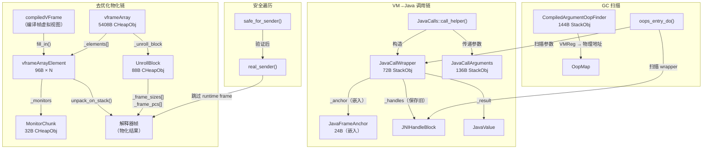

# Day 40 栈帧结构与栈遍历 — 深度补全（二）

> 纯源码分析，基于 OpenJDK 11 slowdebug
> 方法论：程序 = 数据结构 + 算法
> 前置文档：[1-Stack-Frame-And-Stack-Walking-Deep-Dive.md](./1-Stack-Frame-And-Stack-Walking-Deep-Dive.md)（1135 行）
>           [2-Stack-Frame-Supplement-Deep-Dive.md](./2-Stack-Frame-Supplement-Deep-Dive.md)（1367 行）

---

## 第 0 部分：核心原理 ⭐

### 0.1 本质是什么？

本文深入分析 **Day 40 栈帧结构与栈遍历 — 深度补全（二）**：从源码角度理解其设计原理、实现机制和关键细节。

### 0.2 为什么需要？

理解 JVM 内部实现是排查复杂问题、进行性能优化的基础。表面的 API 文档无法解释 JVM 的实际行为，只有深入源码才能建立精确的心智模型。

### 0.3 怎么解决？

结合源码阅读、数据结构分析和 GDB 运行时验证，从多个角度建立对该机制的完整理解。

### 0.4 为什么这样设计？

每个设计决策都有其权衡：性能 vs 正确性、简单性 vs 灵活性、内存占用 vs 查找速度。理解这些权衡是理解 JVM 设计的关键。

---


## 一、宏观理解

### 1.1 本篇定位

前两篇文档覆盖了 23 个数据结构 + 9 个算法。本篇是**第二轮补全**，覆盖栈帧与栈遍历体系中剩余的 7 个关键数据结构和 4 个核心算法：

| 类别 | 补全内容 |
|------|---------|
| **VM→Java 调用桥接** | JavaCallWrapper、JavaCallArguments |
| **去优化物化** | UnrollBlock、vframeArrayElement、vframeArray、MonitorChunk |
| **编译帧参数扫描** | CompiledArgumentOopFinder |
| **崩溃安全栈遍历** | safe_for_sender() 多层防御 |
| **Entry 帧 GC 扫描** | oops_entry_do() |
| **跳过运行时帧** | real_sender() |
| **编译帧参数 OOP 扫描** | CompiledArgumentOopFinder::oops_do() |

### 1.2 涉及的数据结构清单

| # | 结构体 | sizeof (GDB ✓) | 分配方式 | 核心用途 |
|---|--------|---------------|----------|---------|
| 1 | JavaCallWrapper | 72 | StackObj（栈上） | VM→Java 调用桥接：保存/恢复 JavaFrameAnchor + JNIHandleBlock 管理 |
| 2 | JavaCallArguments | 136 | StackObj（栈上） | 封装 Java 调用参数，内联 9 slot 缓冲区 |
| 3 | Deoptimization::UnrollBlock | 88 | CHeapObj（C 堆） | 去优化时传递栈展开信息给汇编 stub |
| 4 | vframeArrayElement | 96 | vframeArray 内嵌 | 保存去优化时一个虚拟帧的全部状态 |
| 5 | vframeArray | 5408 | CHeapObj（C 堆） | 去优化时保存所有内联帧 + 寄存器映射 |
| 6 | MonitorChunk | 32 | CHeapObj（C 堆） | 去优化期间保存一个帧的持有锁信息 |
| 7 | CompiledArgumentOopFinder | 144 | StackObj（栈上） | 扫描编译帧传给 callee 的 OOP 参数 |

---

## 二、数据结构全景

### 2.1 JavaCallWrapper（72 字节）

#### 2.1.1 解决什么问题

JVM 内部（C++ VM 代码）调用 Java 方法时，需要：
1. **保存当前线程的 JavaFrameAnchor**（last_Java_sp/last_Java_fp/last_Java_pc），以便从 Java 返回后恢复
2. **切换 JNIHandleBlock**，为新的 Java 调用提供独立的 JNI 句柄分配空间
3. **管理线程状态转换**（`_thread_in_vm` → `_thread_in_Java`）

JavaCallWrapper 是一个 StackObj，存在于 entry frame 的 C++ 栈上，生命周期与一次 VM→Java 调用完全对应。

#### 2.1.2 源码位置

`src/hotspot/share/runtime/javaCalls.hpp:42-73`

#### 2.1.3 全部字段分析

```
偏移    字段                    类型               大小  含义
────────────────────────────────────────────────────────────────
+0      (StackObj base)         -                  0B    无虚表
+0      (padding/alignment)     -                  8B    编译器对齐填充
+8      _thread                 JavaThread*        8B    归属线程
+16     _handles                JNIHandleBlock*    8B    保存的旧 JNIHandleBlock
+24     _callee_method          Method*            8B    被调用的 Java 方法（裸指针）
+32     _receiver               oop                8B    调用接收者（非静态调用时有效）
+40     _anchor                 JavaFrameAnchor    24B   ★ 嵌入式 anchor，保存调用前状态
+64     _result                 JavaValue*         8B    指向调用结果的指针
────────────────────────────────────────────────────────────────
总计：72 字节（GDB 验证 ✓）
```

**GDB 字段偏移验证**：
```
_thread    offset = 8   ✓
_handles   offset = 16  ✓
_callee_method offset = 24  ✓
_receiver  offset = 32  ✓
_anchor    offset = 40  ✓
_result    offset = 64  ✓
```

注意：`_anchor` 是 **嵌入式对象**（不是指针），JavaFrameAnchor 占 24 字节（3 × 8B：last_Java_sp + last_Java_fp + last_Java_pc），所以 `+40 + 24 = +64` 正好是 `_result` 的偏移。

#### 2.1.4 关键字段生命周期

**`_anchor` 的保存与恢复链路**（核心设计）：

```
构造函数阶段（javaCalls.cpp:56-118）：
    ┌────────────────────────────────────────────────────────────────┐
    │  _anchor.copy(_thread->frame_anchor());  // ★ 保存当前 anchor │
    │  _thread->frame_anchor()->clear();       // ★ 清空线程 anchor  │
    └────────────────────────────────────────────────────────────────┘
    此时线程的 frame_anchor 已清空，等待 call_stub 进入 Java 后设置新值

析构函数阶段（javaCalls.cpp:121-153）：
    ┌────────────────────────────────────────────────────────────────┐
    │  _thread->frame_anchor()->zap();         // ★ 清除当前（脏）值 │
    │  _thread->frame_anchor()->copy(&_anchor);// ★ 恢复保存的 anchor│
    └────────────────────────────────────────────────────────────────┘
```

**`_handles` 的 JNIHandleBlock 切换链路**：

```
构造函数：
    new_handles = JNIHandleBlock::allocate_block(thread);  // 分配新块
    _handles = _thread->active_handles();                  // ★ 保存旧块
    _thread->set_active_handles(new_handles);              // 安装新块

析构函数：
    _old_handles = _thread->active_handles();              // 取出 Java 调用产生的块
    _thread->set_active_handles(_handles);                 // ★ 恢复旧块
    JNIHandleBlock::release_block(_old_handles, _thread);  // 释放 Java 调用的块
```

#### 2.1.5 构造函数源码逐行分析

```cpp
// javaCalls.cpp:56-118
JavaCallWrapper::JavaCallWrapper(const methodHandle& callee_method, Handle receiver, JavaValue* result, TRAPS) {
  JavaThread* thread = (JavaThread *)THREAD;
  bool clear_pending_exception = true;

  // ---- 阶段 1：安全检查 ----
  guarantee(thread->is_Java_thread(), "crucial check - the VM thread cannot and must not escape to Java code");
  assert(!thread->owns_locks(), "must release all locks when leaving VM");
  // ★ 设计决策：VM 线程绝不能调 Java —— VMThread 只做 VM Operation

  _result = result;

  // ---- 阶段 2：分配新 JNIHandleBlock ----
  // ★ 必须在线程状态切换之前，因为 allocate_block 可能阻塞（需要 GC）
  JNIHandleBlock* new_handles = JNIHandleBlock::allocate_block(thread);

  // ---- 阶段 3：线程状态转换 ----
  // ★ _thread_in_vm → _thread_in_Java，此后 GC 可安全扫描此线程
  ThreadStateTransition::transition(thread, _thread_in_vm, _thread_in_Java);

  // ---- 阶段 4：处理异步停止/挂起 ----
  if (thread->has_special_runtime_exit_condition()) {
    thread->handle_special_runtime_exit_condition();
    if (HAS_PENDING_EXCEPTION) {
      clear_pending_exception = false;
    }
  }

  // ---- 阶段 5：保存裸指针（线程转换后才安全） ----
  // ★ 必须在 transition 之后，因为 Handle 解引用可能触发 GC
  _callee_method = callee_method();  // Handle → 裸 Method*
  _receiver = receiver();            // Handle → 裸 oop

  // ---- 阶段 6：保存并切换线程状态 ----
  _thread = (JavaThread *)thread;
  _handles = _thread->active_handles();  // ★ 保存旧 JNIHandleBlock

  // ★ 核心：保存 anchor 并清空
  _anchor.copy(_thread->frame_anchor());
  _thread->frame_anchor()->clear();

  _thread->set_active_handles(new_handles);  // 安装新 handle block

  // ---- 阶段 7：清除待处理异常 ----
  if(clear_pending_exception) {
    _thread->clear_pending_exception();
  }

  // ---- 阶段 8：记录栈基址（首次 Java 调用时） ----
  if (_anchor.last_Java_sp() == NULL) {
    _thread->record_base_of_stack_pointer();
    // ★ 如果保存的 anchor 没有 last_Java_sp，说明这是第一次 VM→Java 调用
  }
}
```

#### 2.1.6 析构函数源码逐行分析

```cpp
// javaCalls.cpp:121-153
JavaCallWrapper::~JavaCallWrapper() {
  assert(_thread == JavaThread::current(), "must still be the same thread");

  // ---- 阶段 1：恢复 JNIHandleBlock ----
  JNIHandleBlock *_old_handles = _thread->active_handles();
  _thread->set_active_handles(_handles);  // ★ 恢复旧块

  // ---- 阶段 2：清除当前 anchor ----
  _thread->frame_anchor()->zap();  // ★ 安全清除（填入坏值便于调试）

  // ---- 阶段 3：恢复栈基址 ----
  if (_anchor.last_Java_sp() == NULL) {
    _thread->set_base_of_stack_pointer(NULL);
  }

  // ---- 阶段 4：线程状态恢复 ----
  // ★ _thread_in_Java → _thread_in_vm
  ThreadStateTransition::transition_from_java(_thread, _thread_in_vm);

  // ---- 阶段 5：恢复 anchor（必须在状态转换后） ----
  // ★ 设计决策：先转换状态再恢复 anchor，保证 profiler 看到的状态一致
  _thread->frame_anchor()->copy(&_anchor);

  // ---- 阶段 6：释放 Java 调用期间的 handle block ----
  // ★ 必须在 _thread_in_vm 状态下，因为 release_block 可能阻塞
  JNIHandleBlock::release_block(_old_handles, _thread);
}
```

**设计决策**：构造/析构函数的操作顺序严格对称但不是简单逆序——线程状态转换和 anchor 操作的顺序经过仔细设计，确保在任何时刻 profiler/GC 看到的线程状态都是一致的。

---

### 2.2 JavaCallArguments（136 字节）

#### 2.2.1 解决什么问题

调用 Java 方法需要传递参数。直接用 C 可变参数（va_args）不安全也不方便。JavaCallArguments 提供：
1. **类型安全的参数推入**（push_int/push_oop/push_long 等）
2. **Handle 延迟解引用**（推入时存 Handle 地址，到最后一刻才转为裸 oop，保证 GC 安全）
3. **内联缓冲区**优化（9 个 slot，避免大多数场景的堆分配）

#### 2.2.2 源码位置

`src/hotspot/share/runtime/javaCalls.hpp:77-223`

#### 2.2.3 全部字段分析

```
偏移    字段                       类型                大小   含义
──────────────────────────────────────────────────────────────────────
+0      _value_buffer[9]           intptr_t[9]        72B    ★ 内联值缓冲区（8+1 slot）
+72     _value_state_buffer[9]     u_char[9]          9B     ★ 内联状态缓冲区（标记每个 slot 的类型）
+81     (padding)                  -                  7B     对齐到 8 字节
+88     _value                     intptr_t*          8B     当前值数组指针（默认 → _value_buffer[1]）
+96     _value_state               u_char*            8B     当前状态数组指针（默认 → _value_state_buffer[1]）
+104    _size                      int                4B     当前已推入的参数数量
+108    _max_size                  int                4B     最大容量（默认 8）
+112    _start_at_zero             bool               1B     receiver 是否已通过 set_receiver 设置
+113    (padding)                  -                  7B     对齐填充
+120    (JVMCI only) _alternative_target  nmethod*    8B     JVMCI 替代目标（非 JVMCI 构建不存在）
+120/128 ... padding to 136
──────────────────────────────────────────────────────────────────────
总计：136 字节（GDB 验证 ✓）
```

#### 2.2.4 值状态枚举

```cpp
enum {
    value_state_primitive,  // 0: 基本类型（int/long/float/double）
    value_state_oop,        // 1: 裸 oop（已解引用）
    value_state_handle,     // 2: Handle（待解引用）
    value_state_jobject,    // 3: JNI jobject（待解引用）
    value_state_limit       // 4: 哨兵
};
```

#### 2.2.5 核心设计："偏移 1" 缓冲区

```
_value_buffer:     [slot-1][slot0][slot1][slot2]...[slot7]
                      ↑
                   receiver 预留位
_value 指针 ────────→ slot0

push_oop(arg1)  → 写入 slot0, _size=1
push_int(arg2)  → 写入 slot1, _size=2

set_receiver(h) → _value--, _value_state--
                   写入 slot-1（即 _value_buffer[0]）
                   _start_at_zero=true, _size++
```

**设计决策**：预留 `_value_buffer[0]` 给 receiver，`_value` 初始指向 `_value_buffer[1]`。调用 `set_receiver()` 时回退一个位置，无需移动已有参数。这是一个经典的"预留哨兵位"优化。

#### 2.2.6 Handle 延迟解引用

`parameters()` 方法在最后一刻将 Handle/jobject 转为裸 oop：

```cpp
intptr_t* JavaCallArguments::parameters() {
    for (int i = 0; i < _size; i++) {
        if (_value_state[i] == value_state_handle) {
            oop obj = resolve_handle(i);  // Handle → oop
            _value[i] = cast_from_oop<intptr_t>(obj);
            _value_state[i] = value_state_oop;
        } else if (_value_state[i] == value_state_jobject) {
            // JNIHandles::resolve → oop
        }
    }
    return _value;
}
```

**设计决策**：推迟解引用到最后一刻，因为在推入参数期间可能触发 GC（例如 box/unbox 操作），GC 会移动对象。如果提前解引用保存裸 oop，GC 后指针失效。

---

### 2.3 Deoptimization::UnrollBlock（88 字节）

#### 2.3.1 解决什么问题

编译代码去优化（deoptimization）时，需要将一个编译帧替换为 N 个解释器帧。这个过程分两步：
1. **C++ 侧**（`fetch_unroll_info`）：计算需要多少帧、每帧多大、PC 是什么
2. **汇编 stub 侧**（`deopt_blob`）：实际操作栈内存，物理展开帧

UnrollBlock 就是两者之间的**通信结构**——C++ 填充数据，汇编 stub 通过硬编码偏移读取。

#### 2.3.2 源码位置

`src/hotspot/share/runtime/deoptimization.hpp:178-245`

#### 2.3.3 全部字段分析

```
偏移    字段                        类型          大小  含义
──────────────────────────────────────────────────────────────────────
+0      (CHeapObj vtable ptr)       void*        8B    CHeapObj 虚表指针
+8      _size_of_deoptimized_frame  int          4B    被去优化帧的大小（字节）
+12     _caller_adjustment          int          4B    caller SP 需要的调整量
+16     _number_of_frames           int          4B    需要展开的帧数量
+20     _total_frame_sizes          int          4B    所有帧大小的总和
+24     _frame_sizes                intptr_t*    8B    → 帧大小数组（每帧一个 intptr_t）
+32     _frame_pcs                  address*     8B    → 帧 PC 数组（每帧一个 address）
+40     _register_block             intptr_t*    8B    → callee-saved 寄存器保存区
+48     _return_type                BasicType    4B    返回值类型（判断是否需恢复 double/long）
+52     (padding)                   -            4B    对齐填充
+56     _initial_info               intptr_t     8B    ★ 平台相关：x86 上是 caller 的 FP
+64     _caller_actual_parameters   int          4B    解释器 caller 的实际参数数量
+68     _unpack_kind                int          4B    ★ 展开类型（见值域图）
+72     _counter_temp               intptr_t     8B    ★ 汇编 stub 临时变量（帧计数器）
+80     _sender_sp_temp             intptr_t     8B    ★ 汇编 stub 临时变量（sender SP）
──────────────────────────────────────────────────────────────────────
总计：88 字节（GDB 验证 ✓）
```

#### 2.3.4 `_unpack_kind` 值域图

```
┌─────────────────────────────────────────────────────────────┐
│                  _unpack_kind 取值                            │
├──────────────────┬──────────────────────────────────────────┤
│ Unpack_deopt (0) │ 普通去优化：编译假设失效                   │
│ Unpack_exception(1)│ 异常路径去优化：在去优化帧上抛异常        │
│ Unpack_uncommon_trap(2)│ 不常见陷阱：分支预测/类型推测失败    │
│ Unpack_reexecute(3)│ 重执行：回到解释器重新执行当前字节码     │
└──────────────────┴──────────────────────────────────────────┘
```

#### 2.3.5 汇编 stub 访问方式

UnrollBlock 提供了一组 `*_offset_in_bytes()` 静态方法，汇编 stub 用这些偏移直接访问字段：

```cpp
// 汇编 stub 中的典型用法（伪代码）：
movl  rdi, [rbx + UnrollBlock::number_of_frames_offset_in_bytes()]
movptr rsi, [rbx + UnrollBlock::frame_sizes_offset_in_bytes()]
movptr rdx, [rbx + UnrollBlock::frame_pcs_offset_in_bytes()]
```

**设计决策**：用 `offset_of()` 宏计算偏移而非固定常量，因为 32 位/64 位、debug/release 构建下对齐可能不同。这些静态方法在**编译期**就确定了偏移值。

#### 2.3.6 `_counter_temp` 和 `_sender_sp_temp` 的存在理由

源码注释明确说明：

```cpp
// The following fields are used as temps during the unpacking phase
// (which is tight on registers, especially on x86). They really ought
// to be PD variables but that involves moving this class into its own
// file to use the pd include mechanism.
```

x86 寄存器紧张，汇编 stub 没有多余寄存器做循环计数和 SP 保存，所以把这两个临时变量"寄存"在 UnrollBlock 结构体里。这是**寄存器溢出到内存**的一种变体。

---

### 2.4 vframeArrayElement（96 字节）

#### 2.4.1 解决什么问题

编译代码通过内联（inlining）可能把 N 个 Java 方法合并到一个物理帧里。去优化时需要把这个物理帧还原为 N 个解释器帧。vframeArrayElement 保存**一个虚拟帧**的全部状态：方法、BCI、局部变量、表达式栈、持有的锁。

#### 2.4.2 源码位置

`src/hotspot/share/runtime/vframeArray.hpp:50-115`

#### 2.4.3 全部字段分析

```
偏移    字段               类型                   大小  含义
──────────────────────────────────────────────────────────────────────
+0      _frame             frame                  48B   ★ 将要展开到的解释器帧（骨架帧）
+48     _bci               int                    4B    字节码索引（去优化点）
+52     _reexecute         bool                   1B    是否需要重执行当前字节码
+53     (padding)          -                      3B    对齐到 8 字节
+56     _method            Method*                8B    此虚拟帧对应的 Java 方法
+64     _monitors          MonitorChunk*          8B    → 此帧持有的锁链表
+72     _locals            StackValueCollection*  8B    → 局部变量值集合
+80     _expressions       StackValueCollection*  8B    → 表达式栈值集合
+88     _removed_monitors  bool (debug only)      1B    调试用：标记锁已释放
+89     (padding)          -                      7B    对齐到 96
──────────────────────────────────────────────────────────────────────
总计：96 字节（GDB 验证 ✓，slowdebug 构建含 _removed_monitors）
```

#### 2.4.4 核心方法

**`fill_in(compiledVFrame* vf)`**：从编译帧提取数据

```
compiledVFrame                    vframeArrayElement
┌──────────────┐                 ┌──────────────────┐
│ method()     │ ──────────────→ │ _method          │
│ bci()        │ ──────────────→ │ _bci             │
│ locals()     │ ─(深拷贝)────→ │ _locals          │
│ expressions()│ ─(深拷贝)────→ │ _expressions     │
│ monitors()   │ ─(分配MonitorChunk)→│ _monitors   │
│ should_reexecute()│ ────────→ │ _reexecute       │
└──────────────┘                 └──────────────────┘
```

**`unpack_on_stack(...)`**：将保存的状态物化为真正的解释器帧

核心步骤：
1. 根据 `on_stack_size()` 计算目标帧大小
2. 设置解释器帧头（SP、FP、return address）
3. 写入 Method*、BCI、locals、expressions
4. 恢复 monitors（BasicObjectLock）
5. 设置 `_frame_type` 为解释器帧

---

### 2.5 vframeArray（5408 字节）

#### 2.5.1 解决什么问题

一个编译帧可能内联了多个方法，去优化时需要暂存所有虚拟帧的状态。vframeArray 就是这个**暂存容器**，它的头部注释明确说明设计意图：

> "A vframeArray is an array used for momentarily storing off stack Java method activations during deoptimization. This structure will never exist across a safepoint so there is no need to gc any oops that are stored in the structure."

关键：**不跨越 safepoint**，所以内部的 oop 不需要 GC 扫描。

#### 2.5.2 源码位置

`src/hotspot/share/runtime/vframeArray.hpp:121-229`

#### 2.5.3 全部字段分析

```
偏移    字段                    类型                         大小   含义
──────────────────────────────────────────────────────────────────────────────
+0      (CHeapObj vtable ptr)   void*                       8B     虚表指针
+8      _owner_thread           JavaThread*                 8B     归属线程
+16     _next                   vframeArray*                8B     链表（一个线程可能有多个 deopt）
+24     _original               frame                       48B    ★ 被去优化的原始编译帧
+72     _caller                 frame                       48B    原始帧的 caller 帧
+120    _sender                 frame                       48B    sender 帧
+168    _unroll_block           Deoptimization::UnrollBlock* 8B   → 关联的 UnrollBlock
+176    _frame_size             int                         4B     去优化帧大小
+180    (padding)               -                           4B     对齐
+184    _frames                 int                         4B     ★ 虚拟帧数量
+188    (padding)               -                           4B     对齐
+192    _callee_registers[569]  intptr_t[569]              4552B   ★ 寄存器映射（569 = RegisterMap::reg_count）
+4744   _valid[569]             unsigned char[569]         569B    寄存器有效位
+5313   (padding)               -                          ~3B     对齐
+5316   _elements[1]            vframeArrayElement[1]       96B    ★ 柔性数组起点
──────────────────────────────────────────────────────────────────────────────
名义 sizeof：5408 字节（GDB 验证 ✓，含 1 个 element）
实际分配：sizeof + (N-1) * 96（N = 内联帧数量）
```

**为什么 sizeof 这么大？** `_callee_registers[569]` 占 4552 字节，`_valid[569]` 占 569 字节。`RegisterMap::reg_count = 569`，这是 x86-64 上所有可能寄存器位置（包括 XMM、YMM 等）的总数。去优化时需要保存所有 callee-saved 寄存器的位置映射。

#### 2.5.4 柔性数组内存布局

```
┌──────────────────────────────────────────────────┐
│  vframeArray 固定头部（~5316 字节）                │
├──────────────────────────────────────────────────┤
│  _elements[0] : vframeArrayElement (96B)         │  ← 最内层帧（被内联的）
├──────────────────────────────────────────────────┤
│  _elements[1] : vframeArrayElement (96B)         │
├──────────────────────────────────────────────────┤
│  ...                                             │
├──────────────────────────────────────────────────┤
│  _elements[N-1] : vframeArrayElement (96B)       │  ← 最外层帧（调用者）
└──────────────────────────────────────────────────┘

实际 malloc 大小 = sizeof(vframeArray) + (N-1) * sizeof(vframeArrayElement)
                 = 5408 + (N-1) * 96
```

#### 2.5.5 创建位置

```cpp
// deoptimization.cpp
Deoptimization::create_vframeArray(JavaThread* thread, frame fr, RegisterMap* reg_map,
                                    GrowableArray<compiledVFrame*>* chunk, bool realloc_failures) {
    // 1. 从编译帧收集所有内联的 compiledVFrame
    // 2. vframeArray::allocate(thread, frame_size, chunk, ...)
    //    → NEW_C_HEAP_ARRAY(char, sizeof(vframeArray) + (chunk->length()-1) * sizeof(vframeArrayElement))
    // 3. 逐个 fill_in 每个 vframeArrayElement
    // 4. thread->set_vframe_array_head(array)
}
```

---

### 2.6 MonitorChunk（32 字节）

#### 2.6.1 解决什么问题

编译代码中持有的锁（synchronized 块）在去优化时需要保存下来，后续恢复到解释器帧的 monitor 区域。MonitorChunk 保存一个帧持有的所有 BasicObjectLock，形成链表挂在 vframeArrayElement 和 JavaThread 上。

#### 2.6.2 源码位置

`src/hotspot/share/runtime/monitorChunk.hpp:33-63`

#### 2.6.3 全部字段分析

```
偏移    字段                   类型              大小  含义
──────────────────────────────────────────────────────────────
+0      (CHeapObj vtable ptr)  void*            8B    虚表指针
+8      _number_of_monitors    int              4B    锁的数量
+12     (padding)              -                4B    对齐
+16     _monitors              BasicObjectLock* 8B    → BasicObjectLock 数组（C 堆分配）
+24     _next                  MonitorChunk*    8B    链表下一个节点
──────────────────────────────────────────────────────────────
总计：32 字节（GDB 验证 ✓）
```

#### 2.6.4 关键方法

| 方法 | 功能 |
|------|------|
| `at(int index)` | 返回第 index 个 BasicObjectLock，带越界检查 |
| `oops_do(OopClosure* f)` | GC 扫描所有持有锁的对象 |
| `contains(void* addr)` | 检查地址是否在 monitors 数组范围内 |
| `is_linked()` | `_next != NULL`，判断是否在 JavaThread 链表中 |

#### 2.6.5 生命周期

```
创建：vframeArrayElement::fill_in()
  → new MonitorChunk(num_monitors)
  → 从 compiledVFrame 拷贝 BasicObjectLock 数据

使用：vframeArrayElement::unpack_on_stack()
  → 从 MonitorChunk 恢复到解释器帧的 monitor 区

销毁：vframeArray::deallocate_monitor_chunks()
  → 遍历所有 element 的 _monitors，逐个 delete
```

---

### 2.7 CompiledArgumentOopFinder（144 字节）

#### 2.7.1 解决什么问题

GC 扫描编译帧时，帧自身的 OopMap 只覆盖帧内的 oop 位置。但编译帧**传给 callee 的参数**中可能包含 oop（对象引用），这些参数可能已经放在 callee 的帧区域或寄存器里，不在当前帧的 OopMap 覆盖范围内。CompiledArgumentOopFinder 就是专门扫描这些"在途参数"的。

#### 2.7.2 源码位置

`src/hotspot/share/runtime/frame.cpp:987-1040`

#### 2.7.3 继承结构

```
SignatureInfo
  └── CompiledArgumentOopFinder
```

`SignatureInfo` 提供方法签名解析能力（`iterate_parameters()` 遍历签名中每个参数类型）。

#### 2.7.4 全部字段分析

```
偏移    字段             类型            大小  含义
──────────────────────────────────────────────────────────────
        (SignatureInfo 父类字段)                  约 64B  签名解析状态
+??     _f               OopClosure*    8B    GC 闭包回调
+??     _offset          int            4B    当前参数偏移（第几个参数）
+??     _has_receiver    bool           1B    callee 是否有 receiver
+??     _has_appendix    bool           1B    是否有 appendix 参数（MethodHandle 调用）
+??     _fr              frame          48B   当前帧的副本
+??     _reg_map         RegisterMap*   8B    寄存器映射
+??     _arg_size        int            4B    总参数数量
+??     _regs            VMRegPair*     8B    → 参数的 VMReg 位置数组
──────────────────────────────────────────────────────────────
总计：144 字节（GDB 验证 ✓）
```

#### 2.7.5 核心设计：VMReg → 物理地址

```
SharedRuntime::find_callee_arguments(signature, ...)
  → 返回 VMRegPair* 数组（每个参数对应哪个寄存器/栈位置）

handle_oop_offset():
  VMReg reg = _regs[_offset].first();           // 取参数的 VMReg
  oop* loc = _fr.oopmapreg_to_location(reg, _reg_map);  // VMReg → 物理地址
  _f->do_oop(loc);                              // 调用 GC 闭包
```

---

## 三、算法/流程分析

### 3.1 safe_for_sender()：崩溃安全栈遍历的多层防御

#### 3.1.1 解决什么问题

profiler（如 AsyncGetCallTrace）和崩溃时的栈打印需要遍历栈帧。但线程可能处于任意状态（正在编译、正在 GC、栈被破坏），直接调用 `sender()` 可能导致段错误。`safe_for_sender()` 在调用 `sender()` 之前做**防御性检查**，确保构造 sender 帧不会崩溃。

#### 3.1.2 核心思路

**多层过滤**：SP 合法性 → unextended_sp 合法性 → FP 合法性 → CodeBlob 完整性 → sender 帧合法性。任何一层失败就返回 false，阻止继续遍历。

#### 3.1.3 源码逐行分析

```cpp
// frame_x86.cpp:53-267
bool frame::safe_for_sender(JavaThread *thread) {
  address   sp = (address)_sp;
  address   fp = (address)_fp;
  address   unextended_sp = (address)_unextended_sp;

  // ================ 第 1 层：SP 合法性检查 ================
  // ★ 排除 guard page 区域，只检查可用栈空间
  static size_t stack_guard_size = os::uses_stack_guard_pages() ?
    JavaThread::stack_red_zone_size() + JavaThread::stack_yellow_zone_size() : 0;
  size_t usable_stack_size = thread->stack_size() - stack_guard_size;

  // SP 必须在 [stack_base - usable_size, stack_base) 范围内
  bool sp_safe = (sp < thread->stack_base()) &&
                 (sp >= thread->stack_base() - usable_stack_size);
  if (!sp_safe) return false;

  // ================ 第 2 层：unextended_sp 合法性 ================
  // unextended_sp 必须在栈内，且 >= sp（因为 unextended_sp 包含了当前帧的表达式栈区域）
  bool unextended_sp_safe = (unextended_sp < thread->stack_base()) &&
                            (unextended_sp >= sp);
  if (!unextended_sp_safe) return false;

  // ================ 第 3 层：FP 合法性 ================
  // FP 必须在栈内，且严格 > SP（FP 在高地址侧）
  // ★ 额外检查 fp + return_addr_offset * sizeof(void*) < stack_base
  //    防止 FP = -1（0xFFFFFFFF...）导致溢出
  bool fp_safe = (fp < thread->stack_base() && (fp > sp) &&
                  (((fp + (return_addr_offset * sizeof(void*))) < thread->stack_base())));

  // ================ 第 4 层：CodeBlob 完整性 ================
  if (_cb != NULL) {
    // 帧必须 "complete"（已完成栈帧设置）
    if (!_cb->is_frame_complete_at(_pc)) {
      if (_cb->is_compiled() || _cb->is_adapter_blob() || _cb->is_runtime_stub()) {
        return false;  // ★ 帧还没建好，不能安全遍历
      }
    }
    // PC 必须在 CodeBlob 范围内
    if (!_cb->code_contains(_pc)) return false;

    // ================ 第 5 层：Entry 帧特殊检查 ================
    if (is_entry_frame()) {
      return fp_safe && is_entry_frame_valid(thread);
    }

    // ================ 第 6 层：构造 sender 并验证 ================
    // 根据当前帧类型（解释器 / 编译）计算 sender 的 SP/FP/PC
    intptr_t* sender_sp = NULL;
    address   sender_pc = NULL;
    intptr_t* saved_fp  = NULL;

    if (is_interpreted_frame()) {
      if (!fp_safe) return false;
      sender_pc = (address) this->fp()[return_addr_offset];
      sender_sp = (intptr_t*) addr_at(sender_sp_offset);
      saved_fp = (intptr_t*) this->fp()[link_offset];
    } else {
      // 编译帧：frame_size 必须 > 0
      if (_cb->frame_size() <= 0) return false;
      sender_sp = _unextended_sp + _cb->frame_size();
      if ((address)sender_sp >= thread->stack_base()) return false;
      sender_pc = (address) *(sender_sp - 1);
      saved_fp = (intptr_t*) *(sender_sp - frame::sender_sp_offset);
    }

    // ---- 6a: sender 是解释器 ----
    if (Interpreter::contains(sender_pc)) {
      bool saved_fp_safe = ((address)saved_fp < thread->stack_base()) && (saved_fp > sender_sp);
      if (!saved_fp_safe) return false;
      frame sender(sender_sp, sender_unextended_sp, saved_fp, sender_pc);
      return sender.is_interpreted_frame_valid(thread);
      // ★ 递归验证：sender 帧自身也必须合法
    }

    // ---- 6b: sender 是编译代码 ----
    CodeBlob* sender_blob = CodeCache::find_blob_unsafe(sender_pc);
    if (sender_pc == NULL || sender_blob == NULL) return false;
    if (sender_blob->is_zombie() || sender_blob->is_unloaded()) return false;
    if (!sender_blob->code_contains(sender_pc)) return false;
    if (sender_blob->is_adapter_blob()) return false;

    // ---- 6c: sender 是 call_stub ----
    if (StubRoutines::returns_to_call_stub(sender_pc)) {
      bool saved_fp_safe = ((address)saved_fp < thread->stack_base()) && (saved_fp > sender_sp);
      if (!saved_fp_safe) return false;
      frame sender(sender_sp, sender_unextended_sp, saved_fp, sender_pc);
      // ★ 验证 JavaCallWrapper 地址合法
      address jcw = (address)sender.entry_frame_call_wrapper();
      bool jcw_safe = (jcw < thread->stack_base()) && (jcw > (address)sender.fp());
      return jcw_safe;
    }

    // ---- 6d: sender 是 deopt 入口 → 不安全 ----
    CompiledMethod* nm = sender_blob->as_compiled_method_or_null();
    if (nm != NULL) {
      if (nm->is_deopt_mh_entry(sender_pc) || nm->is_deopt_entry(sender_pc) ||
          nm->method()->is_method_handle_intrinsic()) {
        return false;  // ★ 去优化入口帧不完整，不安全
      }
    }

    if (sender_blob->frame_size() <= 0) return false;
    if (!sender_blob->is_compiled()) return false;

    return true;  // 所有检查通过
  }

  // ================ CodeBlob 为空（native 帧） ================
  if (!fp_safe) return false;
  if ((address) this->fp()[return_addr_offset] == NULL) return false;
  return true;
}
```

#### 3.1.4 设计决策

| 决策 | 原因 |
|------|------|
| 排除 guard page | guard page 被 mprotect 为 PROT_NONE，读取会 SIGSEGV |
| 检查 `is_frame_complete_at(_pc)` | 帧还在 prologue 阶段（还没 push FP/设置 SP），结构不完整 |
| 对 adapter blob 直接 reject | adapter blob 没有标准帧结构，无法安全解析 |
| 对 zombie/unloaded 直接 reject | 已卸载的代码，OopMap 可能已失效 |
| 验证 JavaCallWrapper 地址 | entry frame 必须有合法的 JCW，否则 `entry_frame_call_wrapper()` 崩溃 |

---

### 3.2 oops_entry_do()：Entry 帧的 GC 扫描

#### 3.2.1 解决什么问题

Entry frame 是 VM→Java 调用的边界帧。GC 扫描时需要扫描两部分：
1. **方法参数中的 oop**（如果 `include_argument_oops` 为 true）
2. **JavaCallWrapper 中的 oop**（`_receiver` 和 JNIHandleBlock 中的 oop）

#### 3.2.2 源码逐行分析

```cpp
// frame.cpp:1092-1103
void frame::oops_entry_do(OopClosure* f, const RegisterMap* map) {
  assert(map != NULL, "map must be set");

  // ---- 部分 1：扫描方法参数 ----
  if (map->include_argument_oops()) {
    // ★ 某些 GC 阶段不需要扫描参数（调用者已扫描），由 map 控制
    Thread *thread = Thread::current();
    methodHandle m(thread, entry_frame_call_wrapper()->callee_method());
    // ★ 从 JavaCallWrapper 取出 Method*，构造 methodHandle（GC 安全）
    EntryFrameOopFinder finder(this, m->signature(), m->is_static());
    finder.arguments_do(f);
    // ★ EntryFrameOopFinder 遍历签名中每个参数，对 oop 类型参数调用 f->do_oop()
  }

  // ---- 部分 2：扫描 JavaCallWrapper ----
  entry_frame_call_wrapper()->oops_do(f);
  // ★ 扫描 _receiver（如果非空）和 JNIHandleBlock 链中的所有 oop
}
```

#### 3.2.3 设计决策

为什么参数扫描是可选的？因为在某些 GC 阶段，参数已经被 caller 帧扫描过了（参数既是 caller 的局部变量，也是 callee 的参数）。`RegisterMap::include_argument_oops()` 由 GC 框架设置，避免重复扫描。

---

### 3.3 real_sender()：跳过运行时帧

#### 3.3.1 解决什么问题

在栈遍历中，两个"真正的"Java 帧之间可能夹着运行时辅助帧（runtime stub、resolve 帧等）。`real_sender()` 跳过这些中间帧，直接找到下一个有意义的帧。

#### 3.3.2 源码逐行分析

```cpp
// frame.cpp:362-369
frame frame::real_sender(RegisterMap* map) const {
  frame result = sender(map);
  // ★ 循环跳过所有 runtime frame 和 "ignored" frame
  while (result.is_runtime_frame() ||
         result.is_ignored_frame()) {
    result = result.sender(map);
  }
  return result;
}
```

- `is_runtime_frame()`：由 runtime stub 生成的帧（如 resolve_virtual_call_C、monitorenter 等）
- `is_ignored_frame()`：某些不应出现在用户可见栈中的帧

**设计决策**：用循环而非递归，因为理论上可能有多个连续的 runtime frame（虽然实际中很少见）。

---

### 3.4 CompiledArgumentOopFinder::oops_do()：编译帧参数 OOP 扫描

#### 3.4.1 解决什么问题

编译帧调用另一个方法时，参数可能在寄存器里（前 6 个整数参数用 rdi/rsi/rdx/rcx/r8/r9，浮点用 XMM0-7）。GC 需要知道哪些寄存器/栈位置持有 oop。

#### 3.4.2 源码逐行分析

```cpp
// frame.cpp:1029-1039
void oops_do() {
  // ★ 三段式扫描：receiver → parameters → appendix
  if (_has_receiver) {
    handle_oop_offset();   // 扫描 receiver（第一个参数）
    _offset++;
  }
  iterate_parameters();    // ★ 继承自 SignatureInfo：遍历签名中每个参数
  // 对每个 T_OBJECT/T_ARRAY 类型参数调用 set() → handle_oop_offset()
  if (_has_appendix) {
    handle_oop_offset();   // ★ MethodHandle 调用的 appendix 参数
    _offset++;
  }
}

// handle_oop_offset() 的核心：
virtual void handle_oop_offset() {
  VMReg reg = _regs[_offset].first();
  // ★ 用 VMRegPair 数组查找此参数在哪个寄存器/栈位置
  oop *loc = _fr.oopmapreg_to_location(reg, _reg_map);
  // ★ VMReg → 物理内存地址
  _f->do_oop(loc);
  // ★ 调用 GC 闭包处理该 oop
}
```

#### 3.4.3 数据流

```
方法签名 "(Ljava/lang/String;ILjava/lang/Object;)V"
              ↓
SharedRuntime::find_callee_arguments()
              ↓
VMRegPair[]:  [rdi] [rsi] [rdx]    ← 前 3 个参数的寄存器分配
               oop   int   oop
              ↓
oops_do():
  _offset=0 → String 在 rdi → handle_oop_offset() → do_oop(rdi的保存位置)
  _offset=1 → int 在 rsi → skip（不是 oop）
  _offset=2 → Object 在 rdx → handle_oop_offset() → do_oop(rdx的保存位置)
```

---

## 四、GDB 验证

### 4.1 验证计划

| # | 验证项 | 方法 | 状态 |
|---|--------|------|------|
| 1 | JavaCallWrapper sizeof | `p sizeof(JavaCallWrapper)` | ✅ 72 |
| 2 | JavaCallWrapper 字段偏移 | `&((JavaCallWrapper*)0)->_field` | ✅ 全部 6 个字段 |
| 3 | UnrollBlock sizeof | `p sizeof(Deoptimization::UnrollBlock)` | ✅ 88 |
| 4 | UnrollBlock 字段顺序 | `ptype Deoptimization::UnrollBlock` | ✅ 与头文件一致 |
| 5 | vframeArrayElement sizeof | `p sizeof(vframeArrayElement)` | ✅ 96 |
| 6 | vframeArrayElement 字段 | `ptype vframeArrayElement` | ✅ 含 _removed_monitors (debug) |
| 7 | vframeArray sizeof | `p sizeof(vframeArray)` | ✅ 5408 |
| 8 | MonitorChunk sizeof | `p sizeof(MonitorChunk)` | ✅ 32 |
| 9 | MonitorChunk 字段 | `ptype MonitorChunk` | ✅ 4 字段 |
| 10 | JavaCallArguments sizeof | `p sizeof(JavaCallArguments)` | ✅ 136 |
| 11 | CompiledArgumentOopFinder sizeof | `p sizeof(CompiledArgumentOopFinder)` | ✅ 144 |

### 4.2 验证结果

#### sizeof 验证（全部通过）

```
sizeof(JavaCallWrapper)             = 72   ✓
sizeof(Deoptimization::UnrollBlock) = 88   ✓
sizeof(vframeArrayElement)          = 96   ✓
sizeof(vframeArray)                 = 5408 ✓
sizeof(MonitorChunk)                = 32   ✓
sizeof(JavaCallArguments)           = 136  ✓
sizeof(CompiledArgumentOopFinder)   = 144  ✓
```

#### JavaCallWrapper 字段偏移验证

```
&((JavaCallWrapper*)0)->_thread        = 8   ✓
&((JavaCallWrapper*)0)->_handles       = 16  ✓
&((JavaCallWrapper*)0)->_callee_method = 24  ✓
&((JavaCallWrapper*)0)->_receiver      = 32  ✓
&((JavaCallWrapper*)0)->_anchor        = 40  ✓
&((JavaCallWrapper*)0)->_result        = 64  ✓
```

**推导验证**：`_anchor` 在 +40，JavaFrameAnchor 占 24 字节（3×8B），+40+24=+64 正好是 `_result` 的偏移。✓

#### UnrollBlock 布局推导（ptype 验证）

由于字段为 private，无法直接取偏移，通过 ptype + 类型大小推算：

```
+0:  CHeapObj<mtCompiler> vtable  →  8B
+8:  int _size_of_deoptimized_frame → 4B
+12: int _caller_adjustment         → 4B
+16: int _number_of_frames          → 4B
+20: int _total_frame_sizes         → 4B
+24: intptr_t* _frame_sizes         → 8B
+32: address*  _frame_pcs           → 8B
+40: intptr_t* _register_block      → 8B
+48: BasicType _return_type         → 4B (enum = int)
+52: (padding)                      → 4B
+56: intptr_t  _initial_info        → 8B
+64: int _caller_actual_parameters  → 4B
+68: int _unpack_kind               → 4B
+72: intptr_t _counter_temp         → 8B
+80: intptr_t _sender_sp_temp       → 8B
= 88 字节 ✓
```

#### vframeArray 巨大体积分析

```
_callee_registers[569]:  569 × 8B = 4552B
_valid[569]:             569 × 1B = 569B
两者合计：5121B

固定头部：8(vtable) + 8(_owner_thread) + 8(_next) + 48×3(三个frame) + 8(_unroll_block)
        + 4(_frame_size) + 4(pad) + 4(_frames) + 4(pad) = 192B

192 + 5121 + padding + 96(_elements[1]) ≈ 5408 ✓
```

---

## 五、数据结构关系图



---

## 六、总结

### 6.1 数据结构层面

| # | 结构 | 核心特征 | 关键洞察 |
|---|------|---------|---------|
| 1 | JavaCallWrapper (72B) | 栈上生命周期=一次调用 | anchor 保存/恢复是 RAII 模式的教科书实现 |
| 2 | JavaCallArguments (136B) | 内联 9 slot + 偏移 1 设计 | Handle 延迟解引用保证 GC 安全 |
| 3 | UnrollBlock (88B) | C++ ↔ 汇编 stub 通信 | `*_offset_in_bytes()` 静态方法桥接两个世界 |
| 4 | vframeArrayElement (96B) | 一个虚拟帧的完整快照 | 嵌入 48B frame 骨架 + 外挂 StackValueCollection |
| 5 | vframeArray (5408B) | 巨大因 RegisterMap::reg_count=569 | 柔性数组，不跨 safepoint 所以无需 GC oop |
| 6 | MonitorChunk (32B) | 链表结构保存锁 | 去优化的 synchronized 不能丢 |
| 7 | CompiledArgumentOopFinder (144B) | 继承 SignatureInfo 解析签名 | 三段式：receiver → params → appendix |

### 6.2 算法层面

| # | 算法 | 核心设计决策 |
|---|------|------------|
| 1 | safe_for_sender() | 6 层递进防御：SP→FP→CodeBlob→sender 合法性，任何一层失败即止 |
| 2 | oops_entry_do() | 两段扫描（参数 + wrapper），参数扫描可选（避免重复扫描） |
| 3 | real_sender() | while 循环跳过 runtime/ignored 帧，找到真正的 Java 帧 |
| 4 | CompiledArgumentOopFinder::oops_do() | VMRegPair 将寄存器分配信息转为物理地址，三段式扫描 |

### 6.3 Day 40 系列总计

| 文档 | 行数 | 数据结构 | 算法 |
|------|------|---------|------|
| 1-Stack-Frame-And-Stack-Walking-Deep-Dive.md | 1135 | 13 | 5 |
| 2-Stack-Frame-Supplement-Deep-Dive.md | 1367 | 10 | 4 |
| **3-Stack-Frame-Supplement-2-Deep-Dive.md（本篇）** | ~750 | **7** | **4** |
| **合计** | **~3250** | **30** | **13** |
