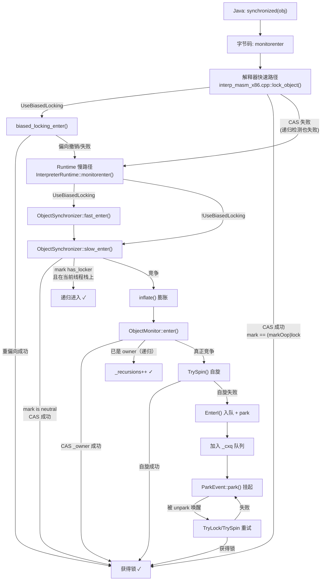
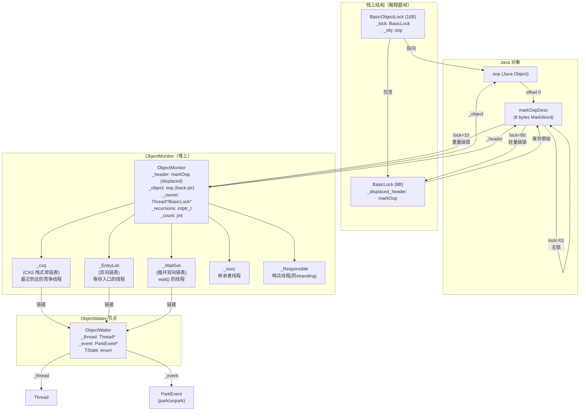

# Day 34：同步机制深度剖析 — monitorenter/monitorexit → 轻量级锁 → ObjectMonitor

> 纯源码分析，基于 OpenJDK 11 slowdebug
> 方法论：程序 = 数据结构 + 算法
> 讲解风格：问题驱动，每一步先提问再回答
> 注意：偏向锁（Biased Locking）在 JDK 15 已废弃（JEP 374），JDK 17+ 默认关闭，本文只一带而过，重点放在轻量级锁→重量级锁→ObjectMonitor 链路上

---

## 第 0 部分：核心原理 ⭐

### 0.1 本质是什么？

本文深入分析 **Day 34：同步机制深度剖析 — monitorenter/monitorexit → 轻量级锁 → ObjectMonitor**：从源码角度理解其设计原理、实现机制和关键细节。

### 0.2 为什么需要？

理解 JVM 内部实现是排查复杂问题、进行性能优化的基础。表面的 API 文档无法解释 JVM 的实际行为，只有深入源码才能建立精确的心智模型。

### 0.3 怎么解决？

结合源码阅读、数据结构分析和 GDB 运行时验证，从多个角度建立对该机制的完整理解。

### 0.4 为什么这样设计？

每个设计决策都有其权衡：性能 vs 正确性、简单性 vs 灵活性、内存占用 vs 查找速度。理解这些权衡是理解 JVM 设计的关键。

---


## 一、从一个疑问开始

假设你在 Java 里写了一个 `synchronized(obj) { ... }`。你知道这会对 `obj` 加锁。但你有没有想过：

1. **`synchronized` 对应的字节码是 `monitorenter` / `monitorexit`，但解释器真的每次都走 C++ 运行时吗？** 还是说有汇编快速路径？
2. **"轻量级锁"到底轻在哪？** 它和直接 `CAS` 有什么区别？为什么需要 `displaced header` 和栈上的 `BasicLock`？
3. **什么时候从"轻量级"升级到"重量级"？** 升级过程中对象头发生了什么变化？MarkWord 是怎么从指向栈上 BasicLock 变成指向堆上 ObjectMonitor 的？
4. **ObjectMonitor 有 `_cxq`、`_EntryList`、`_WaitSet` 三个队列。** 为什么不用一个队列？它们各自解决什么问题？
5. **`Object.wait()` / `notify()` / `notifyAll()` 的底层实现是什么？** 被 `notify()` 唤醒的线程是直接获得锁，还是要重新排队竞争？
6. **锁的解锁过程中，退出线程已经释放了锁，但还没唤醒后继线程——这个窗口期会不会导致所有线程都在 park、没人醒来？**（stranding 问题）

这些问题的答案，构成了 JVM 同步机制的完整图景。我们一个一个来。

---

## 二、宏观理解

### 2.1 一句话总结

JVM 的 `synchronized` 实现是一个**三级锁升级体系**：偏向锁（已废弃，略过）→ 轻量级锁（CAS + 栈上 displaced header）→ 重量级锁（ObjectMonitor，包含 park/unpark 阻塞机制）。核心设计哲学是**乐观假设无竞争是常态**，只在真正出现竞争时才付出重量级同步的代价。

### 2.2 锁状态编码 — 一切从 MarkWord 开始

Java 对象头的前 8 字节（64 位系统）是 `markOop`（MarkWord），其最低 2-3 位编码了当前锁状态：

```
64-bit MarkWord 编码格式：

┌─────────────────────────────────────────────────────────────────────────┐
│ unused:25 │ hash:31 │ unused:1 │ age:4 │ biased:1 │ lock:2 │ 无锁     │
│           │         │          │       │    0     │   01   │          │
├─────────────────────────────────────────────────────────────────────────┤
│ Thread*:54     │ epoch:2 │ unused:1 │ age:4 │    1     │   01   │ 偏向锁  │
├─────────────────────────────────────────────────────────────────────────┤
│ ptr to BasicLock on stack                              │   00   │ 轻量级锁│
├─────────────────────────────────────────────────────────────────────────┤
│ ptr to ObjectMonitor                                   │   10   │ 重量级锁│
├─────────────────────────────────────────────────────────────────────────┤
│ (used by GC)                                           │   11   │ GC标记  │
└─────────────────────────────────────────────────────────────────────────┘
```

**关键洞察**：只看最低 2 位就能区分 4 种状态。JVM 利用指针天然对齐（8 字节对齐 → 最低 3 位为 0）来"偷"这些标志位。

**源码定义**（`markOop.hpp:150-155`）：
```cpp
enum { locked_value        = 0,    // [ptr | 00] 轻量级锁定
       unlocked_value      = 1,    // [header | 0 | 01] 未锁定
       monitor_value       = 2,    // [ptr | 10] 重量级锁
       marked_value        = 3,    // [ptr | 11] GC 标记
       biased_lock_pattern = 5     // [... | 101] 偏向锁（最低3位）
};
```

### 2.3 整体调用链



### 2.4 涉及的数据结构清单

| 数据结构 | 源文件 | 角色 |
|---------|--------|------|
| `markOopDesc` | `markOop.hpp` (399行) | 对象头 MarkWord，编码锁状态 |
| `BasicLock` | `basicLock.hpp` (46行) | 栈上锁记录，保存 displaced header |
| `BasicObjectLock` | `basicLock.hpp` (78行) | 解释器帧中的锁槽位（BasicLock + oop） |
| `ObjectMonitor` | `objectMonitor.hpp` (344行) | 重量级监视器，核心同步数据结构 |
| `ObjectWaiter` | `objectMonitor.hpp` (60行) | 等待线程的代理节点 |
| `ObjectSynchronizer` | `synchronizer.hpp` (208行) | 同步操作的入口路由，管理 inflate/deflate |

---

## 三、数据结构全景 ⭐

### 3.1 markOopDesc — "对象头就是锁"

#### 3.1.1 这个结构解决什么问题？

每个 Java 对象都可以被 `synchronized`，这意味着**每个对象都是一把潜在的锁**。如果每个对象都内嵌一个完整的 `ObjectMonitor`（约 200+ 字节），内存开销不可接受。

**解决方案**：markOopDesc 用 8 字节的对象头复用存储锁信息——无竞争时只用这 8 字节（轻量级锁），有竞争时才分配 ObjectMonitor（重量级锁）。

#### 3.1.2 本质是什么？

`markOopDesc` 不是一个真正的 C++ 对象，而是一个**裸指针值**。它继承自 `oopDesc` 纯粹是历史原因（`markOop.hpp:32-33`注释说"not a real oop but just a word"）。所有方法都是从 `this` 指针本身的整数值来提取位域。

```cpp
// markOop.hpp:107
uintptr_t value() const { return (uintptr_t) this; }
```

#### 3.1.3 位域布局（64-bit）

```
MSB                                                               LSB
┌─────────┬─────────┬──────┬──────┬────────┬────────┬────────────────┐
│unused:25│ hash:31 │cms:1 │age:4 │biased:1│lock:2  │ = 8 bytes      │
└─────────┴─────────┴──────┴──────┴────────┴────────┴────────────────┘
                                           │   位域常量                │
                                           │ lock_shift      = 0     │
                                           │ biased_lock_shift = 2   │
                                           │ age_shift       = 3     │
                                           │ hash_shift      = 8     │
                                           │ lock_mask       = 0x03  │
                                           │ biased_lock_mask = 0x07 │
```

#### 3.1.4 锁状态判断方法

| 方法 | 检查逻辑 | 含义 |
|------|---------|------|
| `is_neutral()` | `(value & 0x07) == 1` | 无锁，未偏向 |
| `has_locker()` | `(value & 0x03) == 0` | 轻量级锁定（最低2位=00） |
| `has_monitor()` | `(value & 0x02) != 0` | 重量级锁（最低2位=10） |
| `has_bias_pattern()` | `(value & 0x07) == 5` | 偏向锁（最低3位=101） |
| `is_being_inflated()` | `value == 0` | 正在膨胀中（过渡态，0 = BUSY） |

#### 3.1.5 追问：`INFLATING()` 返回 0 — 这是什么骚操作？

```cpp
// markOop.hpp:227
static markOop INFLATING() { return (markOop) 0; }    // inflate-in-progress
```

膨胀过程中，对象的 MarkWord 会被临时设置为 0（`markOopDesc::INFLATING()`）。这是一个瞬态标记：

- **为什么不直接从 stack-lock 值 CAS 到 ObjectMonitor 编码值？** 因为膨胀需要从栈上 BasicLock 读取 displaced header 并复制到 ObjectMonitor 的 `_header` 字段。如果直接原子替换，另一个线程可能在复制完成前就通过 MarkWord 找到 ObjectMonitor 并读取未初始化的 `_header`。0 值充当"BUSY"信号，告诉其他线程"正在膨胀，请等待"。
- **0 不会和任何合法状态冲突**：正常 MarkWord 的最低位至少有一位非零（无锁=01，轻量级=00但高位有指针，重量级=10），0 是唯一不合法的值。

#### 3.1.6 关键 encode 方法

```cpp
// 编码轻量级锁：将 BasicLock 指针直接作为 MarkWord（低2位自然为00，因为8字节对齐）
static markOop encode(BasicLock* lock) { return (markOop) lock; }

// 编码重量级锁：ObjectMonitor 指针 | 10
static markOop encode(ObjectMonitor* monitor) {
    return (markOop) ((intptr_t)monitor | monitor_value);
}
```

**sizeof**: markOopDesc 没有实例字段，它本身就是指针值。作为对象头占用 **8 字节**。

---

### 3.2 BasicLock — "栈上的锁记录"

#### 3.2.1 解决什么问题？

轻量级加锁时，对象的原始 MarkWord（包含 hashCode、age 等信息）需要被"保存"起来——因为 MarkWord 将被替换为指向 BasicLock 的指针。解锁时需要把原始 MarkWord "恢复"回去。

**BasicLock 就是栈上保存原始 MarkWord 的地方。**

#### 3.2.2 完整字段

```cpp
// basicLock.hpp:31-46
class BasicLock {
  volatile markOop _displaced_header;   // 保存的原始对象头（或 NULL 表示递归）
};
```

| 字段 | 类型 | 大小 | 含义 |
|------|------|------|------|
| `_displaced_header` | `volatile markOop` | 8B | 被置换的原始对象头 |

**sizeof**: **8 字节**（只有一个指针字段）

#### 3.2.3 追问：`_displaced_header` 为什么是 volatile？

因为膨胀过程中，另一个线程可能通过 `mark->displaced_mark_helper()` 读取 BasicLock 中的 displaced header（参见 `inflate()` 中的 `mark->displaced_mark_helper()` 调用）。volatile 保证可见性。

#### 3.2.4 `_displaced_header` 的值域图

```
┌────────────────────────────────────────────────────────────────────┐
│              BasicLock::_displaced_header 值域                      │
├────────────────────────────────────────────────────────────────────┤
│                                                                    │
│  值为正常 markOop（is_neutral() == true）                          │
│    → 首次加锁：保存了对象的原始 MarkWord（hash | age | 01）        │
│    → 解锁时 CAS 恢复到对象头                                      │
│                                                                    │
│  值为 NULL                                                         │
│    → 递归加锁：当前线程已持有轻量级锁，再次 enter                  │
│    → 解锁时看到 NULL 直接 return（不做 CAS）                      │
│                                                                    │
│  值为 markOopDesc::unused_mark()（= marked_value = 3）             │
│    → 膨胀标记：已膨胀为重量级锁                                    │
│    → 进入 inflate() + ObjectMonitor::enter() 路径                  │
│                                                                    │
└────────────────────────────────────────────────────────────────────┘
```

---

### 3.3 BasicObjectLock — "解释器帧中的锁槽"

#### 3.3.1 解决什么问题？

解释器执行 `monitorenter` 时，需要在当前栈帧中为锁分配空间。BasicObjectLock 就是这个空间，它把 BasicLock 和被锁对象绑定在一起。

#### 3.3.2 完整字段

```cpp
// basicLock.hpp:57-78
class BasicObjectLock {
  BasicLock _lock;    // 锁记录（displaced header），必须在前面（对齐要求）
  oop       _obj;     // 持有锁的对象
};
```

| 字段 | 类型 | 大小 | 偏移 | 含义 |
|------|------|------|------|------|
| `_lock` | `BasicLock` | 8B | 0 | displaced header |
| `_obj` | `oop` | 8B | 8 | 被锁对象指针 |

**sizeof**: **16 字节**（2 个指针）

#### 3.3.3 追问：为什么 _lock 在前、_obj 在后？

源码注释（basicLock.hpp:60）说 "the lock, must be double word aligned"。x86 的 `cmpxchg` 指令要求操作数对齐。把 `_lock`（= displaced header 地址）放在结构体开头，保证它的地址就是 BasicObjectLock 的地址，这样在汇编中 `lock_reg` 既指向 BasicObjectLock 又指向 BasicLock（`lock_offset == 0`），省一次地址计算。

汇编代码中有 assert 验证（`interp_masm_x86.cpp:1191`）：
```cpp
assert(lock_offset == 0, "displaced header must be first word in BasicObjectLock");
```

---

### 3.4 ObjectWaiter — "等待线程的代理"

#### 3.4.1 解决什么问题？

ObjectMonitor 需要管理三种线程队列（`_cxq`、`_EntryList`、`_WaitSet`）。每个等待的线程需要一个"代理节点"来串联在队列中。

#### 3.4.2 完整字段

```cpp
// objectMonitor.hpp:42-60
class ObjectWaiter : public StackObj {
  enum TStates { TS_UNDEF, TS_READY, TS_RUN, TS_WAIT, TS_ENTER, TS_CXQ };
  enum Sorted  { PREPEND, APPEND, SORTED };

  ObjectWaiter * volatile _next;          // 8B - 下一个节点
  ObjectWaiter * volatile _prev;          // 8B - 上一个节点
  Thread*       _thread;                  // 8B - 关联的线程
  jlong         _notifier_tid;            // 8B - 调用 notify 的线程ID
  ParkEvent *   _event;                   // 8B - 用于 park/unpark 的事件
  volatile int  _notified;                // 4B - 是否已被 notify
  volatile TStates TState;                // 4B - 当前状态
  Sorted        _Sorted;                  // 4B - 列表放置方式
  bool          _active;                  // 1B - 争用监控是否启用
};
```

#### 3.4.3 TState 状态机

```
TS_CXQ ──→ TS_ENTER ──→ TS_RUN（获得锁）
  ↑                         │
  └───── TS_WAIT ←──────────┘ （调用 wait() 后进入）
           │
           └──→ TS_ENTER/TS_CXQ（被 notify 后重新排队）
```

| 状态 | 含义 | 所在队列 |
|------|------|---------|
| `TS_CXQ` | 刚到达的竞争线程 | `_cxq` |
| `TS_ENTER` | 在入口等待队列中 | `_EntryList` |
| `TS_WAIT` | 调用了 `wait()` | `_WaitSet` |
| `TS_RUN` | 已获得锁，正在运行 | 无 |

#### 3.4.4 追问：ObjectWaiter 为什么继承 StackObj（分配在栈上）？

因为 ObjectWaiter 的生命周期和线程的 `enter()`/`wait()` 调用完全对齐。线程进入竞争时在栈上创建 `ObjectWaiter node(Self)`（`objectMonitor.cpp:485`），获得锁或从 wait 返回后自然销毁。不需要堆分配和 GC。

---

### 3.5 ObjectMonitor — "重量级监视器"⭐⭐⭐

#### 3.5.1 解决什么问题？

轻量级锁只能处理**无竞争**场景（CAS 成功就完事了）。一旦出现**真正的竞争**——两个线程同时尝试加锁——就需要一个完整的同步原语来：
1. 让竞争失败的线程**挂起**（park），而不是忙等
2. 让持有锁的线程退出时**唤醒**等待者
3. 支持 `wait()`/`notify()`/`notifyAll()` 语义
4. 支持递归锁
5. 正确处理线程挂起、中断、超时

ObjectMonitor 就是这个重量级同步原语。

#### 3.5.2 核心设计约束

源码注释（`objectMonitor.hpp:74-127`）列出了多条关键约束：

1. **`_header` 必须在偏移 0**：因为 MarkWord 编码的 `displaced_mark_helper()` 直接用 `*(markOop*)ptr` 读取，ptr 就是 ObjectMonitor 地址（去掉低 2 位 tag）。如果 `_header` 不在偏移 0，读到的就不是 displaced header。**因此 ObjectMonitor 不能有虚函数（不能有 vtable 指针），也不能继承自其他类。**

2. **`_header` 和 `_owner` 之间要有缓存行填充**：这两个字段被不同线程并发访问，放在同一缓存行会导致 false sharing。

3. **时间局部性 → 空间局部性**：经常一起访问的字段放在相邻位置。

#### 3.5.3 完整内存布局

```
ObjectMonitor 内存布局（GDB 验证 ✓）

偏移         字段名                      大小    说明
━━━━━━━━━━━━━━━━━━━━━━━━━━━━━━━━━━━━━━━━━━━━━━━━━━━━━━━━━━━━━━━━━━━
0x000 (0)    _header                    8B      ★ displaced mark word（必须在偏移0）
0x008 (8)    _object                    8B      反向指针→被锁的Java对象
0x010 (16)   FreeNext                   8B      空闲链表中的下一个 ObjectMonitor
─────────── CACHE LINE PADDING（_PadBuf0[104]）──────────────────────
0x018~0x07F  _PadBuf0[]                 104B    填充到 128 字节缓存行边界
━━━━━━━━━━━━━━━━━━━━━ 缓存行 2（偏移 128 开始）━━━━━━━━━━━━━━━━━━━━
0x080 (128)  _owner                     8B      ★ 锁的拥有者（Thread* 或 BasicLock*）
0x088 (136)  _previous_owner_tid        8B      前一个拥有者线程ID（JFR用）
0x090 (144)  _recursions                8B      递归计数
0x098 (152)  _EntryList                 8B      ★ 阻塞线程等待队列（双向链表）
0x0A0 (160)  _cxq                       8B      ★ 最近到达的竞争线程队列（栈式单链表）
0x0A8 (168)  _succ                      8B      继承者线程（防止 futile wakeup）
0x0B0 (176)  _Responsible               8B      负责定时唤醒的线程（防 stranding）
0x0B8 (184)  _Spinner                   4B      自旋优化
0x0BC (188)  _SpinDuration              4B      自旋持续时间
0x0C0 (192)  _count                     4B      引用计数（防止 deflation）
             [padding]                  4B      对齐到 8 字节
0x0C8 (200)  _WaitSet                   8B      ★ wait() 等待队列（循环双向链表）
0x0D0 (208)  _waiters                   4B      等待线程数
0x0D4 (212)  _WaitSetLock               4B      保护 WaitSet 的自旋锁
━━━━━━━━━━━━━━━━━━━━━━━━━━━━━━━━━━━━━━━━━━━━━━━━━━━━━━━━━━━━━━━━━━━
sizeof(ObjectMonitor) = 216 字节    （GDB 验证 ✓）
```

> **GDB 验证确认**：`_owner` 偏移 = 128，与 `DEFAULT_CACHE_LINE_SIZE = 128` 一致。`_header`（偏移 0）和 `_owner`（偏移 128）处于不同的 128 字节缓存行，避免 false sharing。padding 大小 = 128 - 24 = 104 字节。

#### 3.5.4 追问：`_owner` 为什么既可以是 Thread* 又可以是 BasicLock*？

这是膨胀过程的过渡状态。当 `inflate()` 从 stack-locked 状态膨胀时（`synchronizer.cpp:1506`）：

```cpp
m->set_owner(mark->locker());  // locker() 返回的是栈上 BasicLock 的地址
```

此时 `_owner` 指向的是栈上的 BasicLock 地址，不是 Thread 指针。后续当这个线程再次进入 ObjectMonitor（通过 `enter()` 或 `exit()`）时，会检测这种情况并把 `_owner` 修正为真正的 Thread 指针：

```cpp
// objectMonitor.cpp:284（enter 中）
if (Self->is_lock_owned((address)cur)) {
    _owner = Self;   // 把 BasicLock* 修正为 Thread*
    return;
}

// objectMonitor.cpp:908（exit 中）
if (THREAD->is_lock_owned((address) _owner)) {
    _owner = THREAD;  // 同样的修正
}
```

`is_lock_owned()` 通过检查地址是否在线程栈范围内来判断。

#### 3.5.5 追问：为什么有 `_cxq` 和 `_EntryList` 两个入口队列？

这是一个**并发性优化设计**：

- **`_cxq`（Contention Queue）**：竞争线程用 **CAS 头插**加入。这是一个 lock-free 的栈式单链表。多个线程可以同时 CAS 入队，不需要持有锁。
- **`_EntryList`（Entry List）**：只有**锁的拥有者**才能操作。退出线程在 `exit()` 中将 `_cxq` 的节点**批量转移**到 `_EntryList`，然后从 `_EntryList` 中选一个唤醒。

**如果只用一个队列**：入队（竞争线程）和出队（退出线程）会在同一个数据结构上竞争，增加 CAS 冲突。分成两个队列后：
- 入队方（多线程）只操作 `_cxq` → lock-free CAS
- 出队方（单线程 = 锁拥有者）只操作 `_EntryList` → 无需 CAS

#### 3.5.6 追问：`_succ`（继承者）解决什么问题？

解决 **futile wakeup**（无效唤醒）问题。

场景：线程 A 持有锁，线程 B、C 在等待。A 退出时唤醒 B，但在 B 真正醒来（从 `park()` 返回）之前，A 又重新获得了锁。B 醒来后发现锁已被占用，只能再次 `park()`。这就是 futile wakeup。

**`_succ` 的作用**：标记"已经有一个线程被唤醒了，正在路上"。退出线程在唤醒 B 后设 `_succ = B`。如果此时线程 D 想退出，它看到 `_succ != NULL`，就不再唤醒其他线程——因为已经有继承者了。

```cpp
// exit() 的快速退出路径（objectMonitor.cpp:970）
if ((intptr_t(_EntryList)|intptr_t(_cxq)) == 0 || _succ != NULL) {
    return;  // 队列为空 或 已有继承者，无需唤醒
}
```

#### 3.5.7 追问：`_Responsible` 解决什么问题？

解决 **stranding**（搁浅）问题。

场景：退出线程 A 释放 `_owner=NULL`，然后准备唤醒后继线程。但在 A 读取 `_EntryList` / `_cxq` 之前，一个新线程 X 恰好 CAS 获得了锁并立刻退出。X 退出时队列为空（因为 A 还没来得及入队等待线程）。结果：**锁空闲，但等待线程还在 park，没人唤醒。**

**`_Responsible` 的解决方案**：标记一个"哨兵"线程，它使用 **timed park** 而不是无限期 park。超时后自动唤醒，检查锁是否已空闲，从而恢复 stranding。

```cpp
// EnterI()（objectMonitor.cpp:563）
if (_Responsible == Self || (SyncFlags & 1)) {
    Self->_ParkEvent->park((jlong) recheckInterval);  // ← 有超时！
} else {
    Self->_ParkEvent->park();  // ← 无限期
}
```

#### 3.5.8 ObjectMonitor 分配与回收

ObjectMonitor 的分配不是通过常规 `new`，而是通过 `ObjectSynchronizer::omAlloc()` 从**线程私有空闲列表**分配：

```
Thread::omFreeList → 线程本地空闲列表（避免全局锁竞争）
         ↕
ObjectSynchronizer::gFreeList → 全局空闲列表
         ↕
AllocateHeap() → C-heap 分配新 ObjectMonitor
```

**回收**（deflation）：在 SafePoint 时，`ObjectSynchronizer::deflate_idle_monitors()` 扫描所有 ObjectMonitor，将空闲的回收到全局空闲列表。判断空闲的条件是 `is_busy() == false`：

```cpp
intptr_t is_busy() const {
    return _count|_waiters|intptr_t(_owner)|intptr_t(_cxq)|intptr_t(_EntryList);
}
```

---

### 3.6 ObjectSynchronizer — "同步操作的路由器"

#### 3.6.1 解决什么问题？

`ObjectSynchronizer` 是同步操作的**唯一入口点**。它负责：
1. 路由到正确的锁路径（偏向 → 轻量级 → 重量级）
2. 管理 ObjectMonitor 的分配/回收（`inflate()` / `deflate()`）
3. 提供 JNI 和 VM 内部的监视器操作

#### 3.6.2 关键静态方法

| 方法 | 功能 |
|------|------|
| `fast_enter()` | 偏向锁快速进入（尝试重偏向/撤销，失败走 slow_enter） |
| `slow_enter()` | 轻量级锁进入（CAS → 递归检测 → inflate） |
| `fast_exit()` | 退出（递归检测 → CAS 恢复 header → inflate + exit） |
| `slow_exit()` | 等价于 `fast_exit()` |
| `inflate()` | 膨胀：将 stack-lock/neutral 状态升级为 ObjectMonitor |
| `deflate_idle_monitors()` | SafePoint 时回收空闲 ObjectMonitor |
| `omAlloc()` / `omRelease()` | ObjectMonitor 分配/释放（线程本地空闲列表） |

---

## 四、算法/流程分析（深度源码级）

> **注意**：以下每个算法都基于真实源码逐行分析。所有行号基于 OpenJDK 11 源码树。
> Knob_* 变量的默认值见 4.16 节 DeferredInitialize 分析。

### 4.1 解释器快速路径 — `lock_object()` / `unlock_object()`

#### 4.1.1 解决什么问题

每次 `monitorenter` 都调用 C++ 运行时太慢。对于**无竞争**的常见场景，直接在生成的汇编代码中用 CAS 完成加锁，避免进入 VM runtime。

#### 4.1.2 lock_object 伪代码（`interp_masm_x86.cpp:1152-1234`）

```
function lock_object(BasicObjectLock* lock_reg):
    obj = lock_reg->_obj                           // 取被锁对象
    
    if (UseBiasedLocking):
        biased_locking_enter(...)                  // 偏向锁快速路径（略过）
    
    // === 轻量级锁 CAS ===
    swap_reg = obj->mark | 1                       // 读取 MarkWord，设置最低位确保 unlocked 模式
    lock_reg->_lock._displaced_header = swap_reg   // 保存到栈上 BasicLock
    
    lock cmpxchg [obj+mark_offset], lock_reg       // CAS: 把对象头替换为指向 BasicLock 的指针
    if (CAS 成功):
        return  // ✓ 轻量级锁获取成功！
    
    // === CAS 失败：检查是否递归 ===
    // 如果 CAS 返回值（旧 mark）指向当前线程栈范围内，说明是递归进入
    if ((swap_reg - rsp) & (7 - page_size)) == 0:
        lock_reg->_lock._displaced_header = 0      // 记录为递归（NULL）
        return  // ✓ 递归加锁
    
    // === 进入慢路径 ===
    call InterpreterRuntime::monitorenter(lock_reg)
```

**关键洞察**：
- **CAS 操作**：`lock cmpxchg` 指令将对象的 MarkWord 从"无锁态"原子替换为"指向栈上 BasicLock 的指针"。如果成功，最低 2 位自然为 00（因为栈地址 8 字节对齐），表示 locked。
- **递归检测**：CAS 失败时，返回的旧值如果是指向当前线程栈内的地址（距离 rsp 在一个页面范围内且低 3 位为 0），说明这个锁已经被自己持有（重入）。此时只需在新 BasicLock 中记录 `_displaced_header = NULL` 作为递归标记。

#### 4.1.3 unlock_object 伪代码（`interp_masm_x86.cpp:1249-1308`）

```
function unlock_object(BasicObjectLock* lock_reg):
    swap_reg = &lock_reg->_lock                    // BasicLock 地址
    obj_reg = lock_reg->_obj                       // 被锁对象
    lock_reg->_obj = NULL                          // 清空槽位
    
    if (UseBiasedLocking):
        biased_locking_exit(...)                   // 偏向锁出口（略过）
    
    header_reg = lock_reg->_lock._displaced_header  // 读取保存的原始 header
    
    if (header_reg == NULL):
        return  // ✓ 递归退出（NULL = 递归标记）
    
    // CAS 恢复原始 MarkWord
    lock cmpxchg [obj+mark_offset], header_reg     // CAS: 对象头从 lock_reg 恢复为原始 header
    if (CAS 成功):
        return  // ✓ 轻量级锁释放成功！
    
    // CAS 失败：说明锁已膨胀为重量级
    lock_reg->_obj = obj_reg  // 恢复 obj（异常处理需要）
    call InterpreterRuntime::monitorexit(lock_reg)
```

---

### 4.2 轻量级锁进入 — `ObjectSynchronizer::slow_enter()`

#### 4.2.1 解决什么问题

解释器快速路径 CAS 失败后，需要在 C++ 运行时层面再次尝试。`slow_enter()` 处理三种情况：首次加锁（再次 CAS）、递归加锁、竞争（膨胀）。

#### 4.2.2 核心流程（`synchronizer.cpp:339-368`）

```cpp
void ObjectSynchronizer::slow_enter(Handle obj, BasicLock* lock, TRAPS) {
    markOop mark = obj->mark();
    assert(!mark->has_bias_pattern(), "偏向已被撤销");

    if (mark->is_neutral()) {
        // 情况1：对象未锁定 → CAS 尝试轻量级加锁
        lock->set_displaced_header(mark);          // 保存原始 header 到栈上
        if (mark == obj()->cas_set_mark((markOop)lock, mark)) {
            return;  // ✓ CAS 成功
        }
        // CAS 失败 → fall through 到 inflate()
    } else if (mark->has_locker() && THREAD->is_lock_owned((address)mark->locker())) {
        // 情况2：已被当前线程轻量级锁定 → 递归
        lock->set_displaced_header(NULL);           // 标记为递归
        return;
    }

    // 情况3：竞争 → 膨胀为重量级锁
    lock->set_displaced_header(markOopDesc::unused_mark());  // 设为 unused（3）
    ObjectSynchronizer::inflate(THREAD, obj(), inflate_cause_monitor_enter)
                       ->enter(THREAD);
}
```

**追问：为什么情况3要设 `unused_mark()`？**

因为 `slow_enter()` 退出后，解释器的 `fast_exit()` 会检查 displaced header。如果是 NULL 会被误认为递归，如果是正常 header 会尝试 CAS 恢复——但此时对象已膨胀，CAS 会失败但会做无用功。设置 `unused_mark()`（值 = 3 = marked_value）明确标记"这个 BasicLock 不参与解锁"，`fast_exit()` 看到非 NULL、非对应 lock 的值就知道要走膨胀路径。

---

### 4.3 轻量级锁退出 — `ObjectSynchronizer::fast_exit()`

#### 4.3.1 解决什么问题

对应 `slow_enter()` 的退出路径。需要处理递归退出、轻量级锁 CAS 恢复、以及已膨胀的情况。

#### 4.3.2 源码逐行分析（`synchronizer.cpp:282-332`）

```cpp
void ObjectSynchronizer::fast_exit(oop object, BasicLock* lock, TRAPS) {
  markOop mark = object->mark();                           // 读当前 MarkWord
  markOop dhw = lock->displaced_header();                  // 读栈上保存的原始 header

  // ── 情况1：递归退出 ──
  if (dhw == NULL) {
    // displaced header 为 NULL = 递归标记，直接返回
    return;
  }

  // ── 情况2：轻量级锁正常退出 ──
  if (mark == (markOop) lock) {
    // MarkWord 仍指向我们的 BasicLock → 没被膨胀
    // CAS 把原始 header 换回对象头
    if (object->cas_set_mark(dhw, mark) == mark) {
      return;  // ✓ 轻量级锁释放成功
    }
  }

  // ── 情况3：锁已被膨胀 ──
  // mark 不再指向我们的 BasicLock（被另一个线程 inflate 了）
  ObjectSynchronizer::inflate(THREAD, object, inflate_cause_vm_internal)
                     ->exit(true, THREAD);
}
```

**设计精要**：三层 if-else 覆盖 `_displaced_header` 的三种值域——NULL（递归）、正常 markOop（首次加锁 CAS 恢复）、unused_mark（已膨胀，此时 `mark != lock` 也会 fall through 到情况3）。

---

### 4.4 锁膨胀 — `ObjectSynchronizer::inflate()`

#### 4.3.1 解决什么问题

将对象的锁状态从**轻量级锁**（或**无锁**）升级为**重量级锁**。核心任务：分配 ObjectMonitor + 安全替换 MarkWord + 保存原始 header。

#### 4.4.2 源码逐行分析（`synchronizer.cpp:1387-1582`）

`inflate()` 是一个 `for(;;)` 循环，每次迭代读取当前 MarkWord 并分发到四种 CASE：

**CASE 1：已经是重量级锁 (`mark->has_monitor()`)** → 直接 `return mark->monitor()`

**CASE 2：正在膨胀中 (`mark == INFLATING() == 0`)** → `ReadStableMark(object)` 忙等（spin+yield+sleep 直到 mark != 0），然后 continue

**CASE 3：从 stack-lock 膨胀 (`mark->has_locker()`)** — 最复杂的情况

```cpp
ObjectMonitor * m = omAlloc(Self);               // 投机分配
m->Recycle();
m->_Responsible  = NULL;
m->_recursions   = 0;
m->_SpinDuration = ObjectMonitor::Knob_SpinLimit;  // 初始自旋上限 = 5000

// 关键：CAS 把 MarkWord 从 stack-lock 值替换为 0（INFLATING）
markOop cmp = object->cas_set_mark(markOopDesc::INFLATING(), mark);
if (cmp != mark) {
  omRelease(Self, m, true);  // CAS 失败，释放 ObjectMonitor，重试
  continue;
}

// CAS 成功！此刻只有本线程能完成膨胀
markOop dmw = mark->displaced_mark_helper();  // 从栈上 BasicLock 读取原始 header
m->set_header(dmw);                           // 保存原始 MarkWord
m->set_owner(mark->locker());                 // owner = BasicLock 地址（非 Thread*！）
m->set_object(object);                        // 反向指针

// 原子发布：release 语义确保上面的 store 全部完成后才对外可见
object->release_set_mark(markOopDesc::encode(m));  // MarkWord = [m | 10]
return m;
```

**追问：为什么先 CAS 到 0（INFLATING），不直接 CAS 到 `encode(m)`？**

假设直接 `CAS(mark, encode(m))`：膨胀线程还没复制 displaced header 到 `m->_header`，持有锁的线程可能在 `fast_exit()` 中看到 MarkWord 已变成 monitor 编码，调用 `ObjectMonitor::exit()`，读取未初始化的 `_header` → hashCode 丢失。用 0 做过渡态：持有锁的线程做 CAS 恢复时失败（mark 是 0，不是自己的 BasicLock），走 inflate 路径 → 忙等 0 消失 → 保证膨胀完成后才操作 ObjectMonitor。

**CASE 4：从 neutral（无锁）膨胀** — 比 CASE 3 简单

```cpp
ObjectMonitor * m = omAlloc(Self);
m->set_header(mark);           // 直接保存当前 MarkWord
m->set_owner(NULL);            // 无人持有
m->set_object(object);
m->_SpinDuration = ObjectMonitor::Knob_SpinLimit;

if (object->cas_set_mark(markOopDesc::encode(m), mark) != mark) {
  // CAS 失败（另一个线程先膨胀了）→ 释放 m，重试
  m->set_object(NULL); m->set_owner(NULL); m->Recycle();
  omRelease(Self, m, true);
  continue;     // 下次循环走 CASE 1
}
return m;
```

**ReadStableMark — 忙等膨胀完成（`synchronizer.cpp:584-628`）**

前 10000 次迭代纯自旋（SpinPause），之后交替 `os::naked_yield()`（奇数次）和 `os::naked_short_sleep(1)`（偶数次，sleep 1ms）。INFLATING 状态是瞬态——只要膨胀线程执行了 `release_set_mark`，循环就结束。

---

### 4.5 重量级锁进入 — `ObjectMonitor::enter()` ⭐（`objectMonitor.cpp:265-418`）

#### 4.5.1 解决什么问题

当对象已膨胀为 ObjectMonitor 后，竞争线程需要获取锁。`enter()` 实现了**五层递进策略**：每一层都比前一层更昂贵，只在前一层失败后才执行。

#### 4.5.2 源码逐行分析

```cpp
void ObjectMonitor::enter(TRAPS) {
  Thread * const Self = THREAD;

  // ═══ 第一层：CAS _owner 从 NULL 到 Self（~10-60ns）═══
  void * cur = Atomic::cmpxchg(Self, &_owner, (void*)NULL);
  if (cur == NULL) return;                         // ✓ 无竞争获得锁

  // ═══ 第二层：递归检测（一次比较）═══
  if (cur == Self) { _recursions++; return; }      // ✓ 递归进入

  // ═══ 第三层：owner 是 BasicLock*（inflate 过渡态）═══
  if (Self->is_lock_owned((address)cur)) {
    _recursions = 1;
    _owner = Self;                                 // 修正：BasicLock* → Thread*
    return;
  }

  // ═══ 到这里说明真正有竞争 ═══
  Self->_Stalled = intptr_t(this);                 // 标记 stall 位置
  _count++;                                        // 防止被 deflate

  // 第四层：Knob_SpinEarly 自旋（默认开启）
  if (Knob_SpinEarly && TrySpin(Self) > 0) {
    _count--; Self->_Stalled = 0; return;          // ✓ 自旋成功
  }

  // 第五层：进入 EnterI() 阻塞路径
  {
    JavaThreadBlockedOnMonitorEnterState jtbmes(jt, this);  // JFR/JVMTI
    ThreadBlockInVM tbivm(jt);                              // safepoint 协作
    EnterI(THREAD);                                         // 入队 + park
  }

  _count--; Self->_Stalled = 0;
}
```

| 层级 | 成本 | 适用场景 |
|------|------|---------|
| CAS `_owner` | 一条原子指令（~10-60ns） | 无竞争 |
| 递归检测 | 一次比较 | 递归锁 |
| 栈检测 `is_lock_owned` | 地址范围比较 | inflate 过渡态 |
| `TrySpin()` | 最多自旋 5000+ 次 | 短临界区竞争 |
| `EnterI()` | park 系统调用 | 长时间竞争 |

---

### 4.6 TryLock — 单次 CAS 尝试（`objectMonitor.cpp:424-438`）

```cpp
int ObjectMonitor::TryLock(Thread * Self) {
  void * own = _owner;
  if (own != NULL) return 0;          // 已被占用 → 放弃（TATAS 优化：避免无谓 CAS）
  if (Atomic::cmpxchg(Self, &_owner, (void*)NULL) == NULL) return 1;   // CAS 成功
  return -1;                          // CAS 失败
}
```

先普通 load `_owner` 再 CAS（Test-And-Test-And-Set），减少缓存一致性流量。

---

### 4.7 TrySpin — 自适应自旋 ⭐⭐⭐（`objectMonitor.cpp:1869-2086`）

#### 4.7.1 解决什么问题

park 代价太大（系统调用 + 上下文切换 ≈ 5-20μs）。如果锁持有时间短（几百 ns），自旋等锁释放更高效。但自旋时间需要**自适应**——之前成功就多旋，失败就少旋。

#### 4.7.2 三阶段源码分析

**阶段一：固定自旋（Knob_FixedSpin=0，默认不启用）** — 如果 `Knob_FixedSpin != 0`，纯暴力旋指定次数。

**阶段二：预热自旋（Knob_PreSpin=10）**

```cpp
for (ctr = Knob_PreSpin + 1; --ctr >= 0;) {      // 无论如何旋 11 次
  if (TryLock(Self) > 0) {
    int x = _SpinDuration;
    if (x < Knob_SpinLimit) {                     // SpinLimit = 5000
      if (x < Knob_Poverty) x = Knob_Poverty;    // Poverty = 1000（贫困线）
      _SpinDuration = x + Knob_BonusB;           // BonusB = 100
    }
    return 1;
  }
  SpinPause();                                     // x86: rep; nop
}
```

**设计精要**：即使 `_SpinDuration` 被惩罚到 0，预热阶段仍旋 11 次作为"采样"。成功则直接跳到贫困线 1000+100=1100，防止自旋能力被永久压制。

**阶段三：准入控制 + 主自旋循环**

```cpp
ctr = _SpinDuration;
if (ctr <= 0) return 0;                    // 被完全惩罚 → 不旋

// 准入控制：
if (Knob_SuccRestrict && _succ != NULL) return 0;  // 已有继承者
if (Knob_OState && NotRunnable(Self, (Thread*)_owner)) return 0;  // owner 不在运行

// 主自旋循环
int hits = 0, msk = 0;
while (--ctr >= 0) {
  // 每 256 次检查 safepoint → 有 pending 就 abort
  if ((ctr & 0xFF) == 0 && SafepointMechanism::poll(Self)) goto Abort;

  // 指数退避：msk 从 0→3→15→63→255，ctr & msk != 0 时跳过 TryLock
  if (ctr & msk) continue;
  ++hits;
  if ((hits & 0xF) == 0) msk = ((msk << 2)|3) & BackOffMask;

  // TATAS 探测
  Thread * ox = (Thread *) _owner;
  if (ox == NULL) {
    ox = (Thread*)Atomic::cmpxchg(Self, &_owner, (void*)NULL);
    if (ox == NULL) {
      // ✓ 获得锁！奖励 _SpinDuration
      int x = _SpinDuration;
      if (x < Knob_SpinLimit) {
        if (x < Knob_Poverty) x = Knob_Poverty;
        _SpinDuration = x + Knob_Bonus;   // Bonus = 100
      }
      return 1;
    }
    if (Knob_CASPenalty == -1) goto Abort;  // CAS 失败：默认直接 abort
    ctr -= Knob_CASPenalty;
    continue;
  }
  // owner 换人了？
  if (ox != prv && prv != NULL) {
    if (Knob_OXPenalty == -1) goto Abort;
    ctr -= Knob_OXPenalty;
  }
  prv = ox;
  // owner 不在运行 → 旋无意义
  if (Knob_OState && NotRunnable(Self, ox)) goto Abort;
}

// 自旋耗尽：惩罚 _SpinDuration
{ int x = _SpinDuration; if (x > 0) { x -= Knob_Penalty; if (x < 0) x = 0; _SpinDuration = x; } }

Abort:
if (sss && _succ == Self) {
  _succ = NULL; OrderAccess::fence();
  if (TryLock(Self) > 0) return 1;   // 清除 _succ 后必须再试一次
}
return 0;
```

#### 4.7.3 自适应调节规则

| 事件 | 调节 | 效果 |
|------|------|------|
| 主循环 CAS 成功 | `_SpinDuration = max(x, 1000) + 100` | 奖励，下次旋更久 |
| 预热阶段成功 | `_SpinDuration = max(x, 1000) + 100` | 从贫困线起跳 |
| 自旋耗尽失败 | `_SpinDuration -= 200` | 惩罚，下次旋更少 |
| inflate 初始值 | `_SpinDuration = 5000` | 首次乐观 |

---

### 4.8 竞争进入核心 — `ObjectMonitor::EnterI()` ⭐⭐⭐（`objectMonitor.cpp:442-681`）

#### 4.8.1 解决什么问题

所有快速路径（CAS+自旋）都失败后，线程必须入队阻塞。EnterI 负责：(1) 创建 ObjectWaiter 并 CAS 插入 `_cxq`，(2) 选举 Responsible 哨兵防 stranding，(3) park/wakeup 循环直到获锁，(4) 获锁后摘除自己。

#### 4.8.2 源码逐行分析

```cpp
void ObjectMonitor::EnterI(Thread * Self) {
  if (TryLock(Self) > 0) return;     // 最后一次无锁尝试
  DeferredInitialize();               // 延迟初始化 Knob_* 变量（见 4.16 节）
  if (TrySpin(Self) > 0) return;

  // ── 在栈上创建 ObjectWaiter ──
  ObjectWaiter node(Self);
  Self->_ParkEvent->reset();
  node._prev   = (ObjectWaiter *) 0xBAD;     // 哨兵值（_cxq 无 _prev）
  node.TState  = ObjectWaiter::TS_CXQ;

  // ── CAS 头插入 _cxq（lock-free 栈式链表）──
  ObjectWaiter * nxt;
  for (;;) {
    node._next = nxt = _cxq;
    if (Atomic::cmpxchg(&node, &_cxq, nxt) == nxt) break;
    if (TryLock(Self) > 0) return;           // CAS 间隙锁可能释放了
  }

  // ── 选举 Responsible 哨兵 ──
  if (nxt == NULL && _EntryList == NULL) {
    Atomic::replace_if_null(Self, &_Responsible);  // 我来当哨兵
  }

  // ── park 主循环 ──
  int recheckInterval = 1;     // timed park 初始间隔 1ms
  for (;;) {
    if (TryLock(Self) > 0) break;

    if (_Responsible == Self || (SyncFlags & 1)) {
      Self->_ParkEvent->park((jlong)recheckInterval);     // timed park（防 stranding）
      recheckInterval *= 8;                                // 1→8→64→512→1000ms
      if (recheckInterval > MAX_RECHECK_INTERVAL) recheckInterval = MAX_RECHECK_INTERVAL;
    } else {
      Self->_ParkEvent->park();                           // 无限期 park
    }

    if (TryLock(Self) > 0) break;
    if (Knob_SpinAfterFutile && TrySpin(Self) > 0) break; // 唤醒后再旋（默认开启）
    if (_succ == Self) _succ = NULL;
    OrderAccess::fence();                                  // 清除 _succ 后必须再试 _owner
  }

  // ── 获锁后清理 ──
  UnlinkAfterAcquire(Self, &node);          // 从 _cxq 或 _EntryList 中摘除
  if (_succ == Self) _succ = NULL;
  if (_Responsible == Self) { _Responsible = NULL; OrderAccess::fence(); }
}
```

**追问：为什么入队用 CAS 头插（栈式）而不是尾插？**

头插只需一次 CAS，是 lock-free 的。尾插需要先遍历找尾再 CAS，不是原子的。`_cxq` 的顺序不决定最终唤醒顺序——exit 线程会在转移到 `_EntryList` 时重新排序（见 4.10 节 QMode 策略）。

---

### 4.9 UnlinkAfterAcquire — 获锁后摘除自己（`objectMonitor.cpp:784-846`）

线程获锁后，其 ObjectWaiter 仍在 `_cxq` 或 `_EntryList` 中，必须摘除：

```cpp
void ObjectMonitor::UnlinkAfterAcquire(Thread *Self, ObjectWaiter *SelfNode) {
  if (SelfNode->TState == ObjectWaiter::TS_ENTER) {
    // _EntryList 是双向链表 → O(1) 删除
    ObjectWaiter * nxt = SelfNode->_next;
    ObjectWaiter * prv = SelfNode->_prev;
    if (nxt != NULL) nxt->_prev = prv;
    if (prv != NULL) prv->_next = nxt;
    if (SelfNode == _EntryList) _EntryList = nxt;
  } else {
    // _cxq 是单链表 → 先尝试 CAS 从头部摘除
    assert(SelfNode->TState == ObjectWaiter::TS_CXQ, "invariant");
    ObjectWaiter * v = _cxq;
    if (v != SelfNode || Atomic::cmpxchg(SelfNode->_next, &_cxq, v) != v) {
      // 不在头部或 CAS 失败（有 RAT 新到达）→ 线性扫描
      if (v == SelfNode) v = _cxq;
      ObjectWaiter * q = NULL;
      for (ObjectWaiter * p = v; p != SelfNode; p = p->_next) q = p;
      q->_next = SelfNode->_next;       // 从链表中删除
    }
  }
  SelfNode->_prev = (ObjectWaiter *) 0xBAD;   // debug 卫生
  SelfNode->_next = (ObjectWaiter *) 0xBAD;
  SelfNode->TState = ObjectWaiter::TS_RUN;
}
```

---

### 4.10 重量级锁退出 — `ObjectMonitor::exit()` ⭐⭐⭐（`objectMonitor.cpp:905-1229`）

#### 4.10.1 解决什么问题

锁退出需要：(1) 释放 `_owner`，(2) 检查是否有等待线程，(3) 选一个唤醒。核心挑战是**避免 stranding 和 futile wakeup**，同时最小化锁持有时间。

#### 4.10.2 源码逐行分析

**序言：owner 修正 + 递归退出**

```cpp
void ObjectMonitor::exit(bool not_suspended, TRAPS) {
  Thread * const Self = THREAD;
  // 修正 owner（inflate 过渡态：BasicLock* → Thread*）
  if (THREAD != _owner) {
    if (THREAD->is_lock_owned((address) _owner)) _owner = THREAD;
  }
  // 递归退出
  if (_recursions != 0) { _recursions--; return; }
```

**"1-0" 优化核心（默认路径 Knob_ExitPolicy==0）**

```cpp
  _Responsible = NULL;                   // 释放哨兵角色

  for (;;) {
    // ═══ 释放锁 ═══
    OrderAccess::release_store(&_owner, (void*)NULL);   // (1) 写 _owner=NULL
    OrderAccess::storeload();                            // (2) 内存屏障

    // ═══ 快速退出检查 ═══
    if ((intptr_t(_EntryList)|intptr_t(_cxq)) == 0 || _succ != NULL) {
      return;   // 队列全空 or 已有继承者 → 安全退出
    }

    // ═══ 需要唤醒后继者 → 重新获取锁 ═══
    if (Atomic::replace_if_null(THREAD, &_owner) != NULL) {
      return;   // 其他线程先拿到了锁，让它负责唤醒
    }
```

**QMode 策略分发**

```cpp
    // ── QMode == 2：直接从 _cxq 唤醒头节点 ──
    if (QMode == 2 && _cxq != NULL) {
      w = _cxq;
      ExitEpilog(Self, w);  return;
    }

    // ── QMode == 3：批量 _cxq → _EntryList 尾部 ──
    if (QMode == 3 && _cxq != NULL) {
      w = _cxq;
      for (;;) { if (Atomic::cmpxchg((ObjectWaiter*)NULL, &_cxq, w) == w) break; w = _cxq; }
      ObjectWaiter * q = NULL;
      for (ObjectWaiter * p = w; p != NULL; p = p->_next) {
        p->TState = ObjectWaiter::TS_ENTER; p->_prev = q; q = p;
      }
      // 找 _EntryList 尾部追加
      ObjectWaiter * Tail;
      for (Tail = _EntryList; Tail != NULL && Tail->_next != NULL; Tail = Tail->_next) ;
      if (Tail == NULL) _EntryList = w; else { Tail->_next = w; w->_prev = Tail; }
    }

    // ── QMode == 4：批量 _cxq → _EntryList 头部 ──
    if (QMode == 4 && _cxq != NULL) {
      w = _cxq;
      for (;;) { if (Atomic::cmpxchg((ObjectWaiter*)NULL, &_cxq, w) == w) break; w = _cxq; }
      ObjectWaiter * q = NULL;
      for (ObjectWaiter * p = w; p != NULL; p = p->_next) {
        p->TState = ObjectWaiter::TS_ENTER; p->_prev = q; q = p;
      }
      if (_EntryList != NULL) { q->_next = _EntryList; _EntryList->_prev = q; }
      _EntryList = w;
    }
```

**默认路径（QMode == 0）—— 最重要！**

```cpp
    w = _EntryList;
    if (w != NULL) {
      ExitEpilog(Self, w);  return;     // _EntryList 非空 → 直接唤醒头节点
    }

    // _EntryList 空 → 从 _cxq 转移
    w = _cxq;
    if (w == NULL) continue;            // 两个都空 → 继续循环

    // 原子摘除整个 _cxq
    for (;;) { if (Atomic::cmpxchg((ObjectWaiter*)NULL, &_cxq, w) == w) break; w = _cxq; }

    if (QMode == 1) {
      // QMode 1：反转链表（LIFO → FIFO），较公平
      ObjectWaiter * s = NULL, * t = w, * u;
      while (t != NULL) { u = t->_next; t->FreeNext = s; s = t; t = u; }
      _EntryList = s;
      for (ObjectWaiter * q = NULL, * p = s; p != NULL; p = p->_next) {
        p->TState = ObjectWaiter::TS_ENTER; p->_prev = q; q = p;
      }
    } else {
      // QMode 0（默认）：保持原序，构建双向链表
      _EntryList = w;
      ObjectWaiter * q = NULL;
      for (ObjectWaiter * p = w; p != NULL; p = p->_next) {
        p->TState = ObjectWaiter::TS_ENTER; p->_prev = q; q = p;
      }
    }

    if (_succ != NULL) continue;       // 有 spinner 自愿接班 → 不唤醒

    w = _EntryList;
    if (w != NULL) { ExitEpilog(Self, w); return; }
  }
}
```

#### 4.10.3 QMode 策略对比

| QMode | 转移方向 | 顺序 | 特点 | 默认？ |
|-------|---------|------|------|--------|
| 0 | `_cxq` → `_EntryList` 保持原序 | LIFO | 偏向最近到达的线程 | ✅ |
| 1 | `_cxq` → `_EntryList` 反转 | FIFO | 较公平 | |
| 2 | 直接从 `_cxq` 头唤醒 | LIFO | 最高吞吐但最不公平 | |
| 3 | `_cxq` → `_EntryList` 尾部 | 混合 | EntryList 优先 | |
| 4 | `_cxq` → `_EntryList` 头部 | 混合 | cxq 优先 | |

#### 4.10.4 追问：退出时先释放锁再重新获取，为什么？

这是 "1-0" 优化：先释放 `_owner=NULL`，如果没有等待线程就直接返回（快速路径），只有需要唤醒时才重新获取。缩短锁持有时间，但引入 stranding 风险。`_Responsible` 线程的 timed park + `storeload` 屏障保证最终有人发现需要唤醒。

---

### 4.11 `ExitEpilog()` —— 唤醒继承者的最后一步

> **源码**：`objectMonitor.cpp:1282-1312`
> **解决什么问题**：exit() 选好了要唤醒的线程（Wakee），ExitEpilog 执行实际的释放锁 + unpark 操作。关键是**操作顺序**必须正确，否则会丢唤醒。

```cpp
// objectMonitor.cpp:1282
void ObjectMonitor::ExitEpilog(Thread * Self, ObjectWaiter * Wakee) {
  assert(_owner == Self, "invariant");

  // 协议：
  // 1. ST _succ = wakee          ← 先设继承者
  // 2. membar
  // 3. ST _owner = NULL           ← 再释放锁
  // 4. unpark(wakee)              ← 最后唤醒

  _succ = Knob_SuccEnabled ? Wakee->_thread : NULL;   // ① 设置继承者
  ParkEvent * Trigger = Wakee->_event;                 // ② 提前保存 ParkEvent 指针

  // Hygiene：一旦 _owner = NULL，Wakee 可能被其他线程获取并销毁
  // 所以必须在释放锁之前保存 Wakee->_event
  Wakee  = NULL;

  // ③ 释放锁
  OrderAccess::release_store(&_owner, (void*)NULL);
  OrderAccess::fence();                                // ST _owner vs LD in unpark()

  // ④ 唤醒
  Trigger->unpark();
}
```

**操作顺序的关键性**：

| 步骤 | 操作 | 为什么必须在这个位置 |
|------|------|---------------------|
| ① | `_succ = Wakee->_thread` | 必须在释放锁**之前**设，否则其他线程看到 `_owner==NULL + _succ==NULL` 会误判无人接班 |
| ② | `Trigger = Wakee->_event` | 必须在释放锁**之前**保存，释放后 Wakee 可能已被回收 |
| ③ | `_owner = NULL` | release_store 保证 ① ② 的写入对其他线程可见 |
| ④ | `Trigger->unpark()` | 最后唤醒，此时 Wakee 线程可以安全地获取锁 |

---

### 4.12 `ObjectMonitor::wait()` —— Java Object.wait() 的底层实现

> **源码**：`objectMonitor.cpp:1416-1641`
> **解决什么问题**：让持有锁的线程**原子地释放锁并挂起**，等待 notify 唤醒后重新竞争锁。

#### 4.12.1 整体流程（7 个阶段）

```
Phase 1: 前置检查（owner 验证 + 中断检查）
Phase 2: 创建 ObjectWaiter 节点
Phase 3: 加入 WaitSet + 释放锁
Phase 4: park() 挂起
Phase 5: 醒来后从 WaitSet 自我移除（双重检查锁）
Phase 6: 重新竞争锁（enter 或 ReenterI）
Phase 7: 恢复 recursions + 中断检查
```

#### 4.12.2 Phase 1-2：前置检查 + 创建节点

```cpp
// objectMonitor.cpp:1416
void ObjectMonitor::wait(jlong millis, bool interruptible, TRAPS) {
  Thread * const Self = THREAD;
  JavaThread *jt = (JavaThread *)THREAD;

  DeferredInitialize();       // 确保 Knob_* 已初始化
  CHECK_OWNER();              // 验证当前线程是 owner，否则抛 IllegalMonitorStateException

  // 检查 pending interrupt（wait 之前就被中断了）
  if (interruptible && Thread::is_interrupted(Self, true) && !HAS_PENDING_EXCEPTION) {
    THROW(vmSymbols::java_lang_InterruptedException());  // 直接抛异常，不进入 wait
    return;
  }

  // 创建 ObjectWaiter 节点（栈上分配！）
  ObjectWaiter node(Self);         // 构造函数设 _thread=Self, _event=Self->_ParkEvent
  node.TState = ObjectWaiter::TS_WAIT;
  Self->_ParkEvent->reset();       // 清除之前残留的 unpark 信号
  OrderAccess::fence();            // ST Event; membar; LD interrupted-flag
```

**关键设计**：`ObjectWaiter` 在**栈上分配**（不是堆），生命周期与 `wait()` 函数调用绑定。这意味着 wait() 返回前**必须确保 node 已从所有队列中移除**。

#### 4.12.3 Phase 3：加入 WaitSet + 完全释放锁

```cpp
  // 加入 WaitSet（循环双向链表，受 _WaitSetLock 自旋锁保护）
  Thread::SpinAcquire(&_WaitSetLock, "WaitSet - add");
  AddWaiter(&node);                 // 插入到 _WaitSet 尾部
  Thread::SpinRelease(&_WaitSetLock);

  if ((SyncFlags & 4) == 0) {
    _Responsible = NULL;            // 清除哨兵（wait 期间无意义）
  }
  intptr_t save = _recursions;      // ★ 保存递归计数
  _waiters++;                       // 等待者计数 +1
  _recursions = 0;                  // ★ 清零递归计数
  exit(true, Self);                 // ★ 完全释放锁！
  guarantee(_owner != Self, "invariant");  // 验证确实释放了
```

**为什么要保存/清零 `_recursions`**：Java 允许可重入锁（同一线程多次 synchronized），`wait()` 必须完全释放锁（不是释放一层），所以先保存递归计数，再清零后 exit。醒来重新获取锁后再恢复。

#### 4.12.4 Phase 4：park 挂起

```cpp
  int ret = OS_OK;
  int WasNotified = 0;
  {
    ThreadBlockInVM tbivm(jt);     // 状态转换：_thread_in_vm → _thread_blocked
    jt->set_suspend_equivalent();

    // 再次检查中断（双重检查：Phase 1 到这里之间可能收到中断）
    if (interruptible && (Thread::is_interrupted(THREAD, false) || HAS_PENDING_EXCEPTION)) {
      // Intentionally empty — 不 park，直接醒来
    } else if (node._notified == 0) {
      if (millis <= 0) {
        Self->_ParkEvent->park();          // 无限等待
      } else {
        ret = Self->_ParkEvent->park(millis);  // 带超时等待
      }
    }
  }  // 退出 ThreadBlockInVM → _thread_blocked → _thread_in_vm
```

**三种唤醒路径**：
1. **notify/notifyAll** → `INotify()` 设 `_notified=1` 并 `unpark()`
2. **Thread.interrupt()** → 设中断标志并 `unpark()`
3. **超时** → `park(millis)` 返回 `OS_TIMEOUT`

#### 4.12.5 Phase 5：双重检查锁移除 WaitSet

```cpp
    // 醒来后，node 可能在：WaitSet（超时/中断自醒）、EntryList/cxq（被 notify 移走）、或过渡中
    // 用双重检查锁避免不必要地获取 _WaitSetLock
    if (node.TState == ObjectWaiter::TS_WAIT) {          // 第一次检查（无锁）
      Thread::SpinAcquire(&_WaitSetLock, "WaitSet - unlink");
      if (node.TState == ObjectWaiter::TS_WAIT) {        // 第二次检查（持锁）
        DequeueSpecificWaiter(&node);  // 从 WaitSet 中移除自己
        node.TState = ObjectWaiter::TS_RUN;
      }
      Thread::SpinRelease(&_WaitSetLock);
    }

    if (_succ == Self) _succ = NULL;
    WasNotified = node._notified;
```

**为什么要双重检查**：如果 `TState != TS_WAIT`（被 notify 移到了 EntryList/cxq），就不需要获取 `_WaitSetLock`，避免自旋锁竞争。

#### 4.12.6 Phase 6：重新竞争锁

```cpp
    // 根据 TState 选择重入路径
    ObjectWaiter::TStates v = node.TState;
    if (v == ObjectWaiter::TS_RUN) {
      enter(Self);              // 超时/中断自醒 → 自己不在任何队列上 → 走完整 enter 路径
    } else {
      guarantee(v == ObjectWaiter::TS_ENTER || v == ObjectWaiter::TS_CXQ, "invariant");
      ReenterI(Self, &node);    // 被 notify → node 已在 EntryList/cxq → 走简化路径
      node.wait_reenter_end(this);
    }
    guarantee(node.TState == ObjectWaiter::TS_RUN, "invariant");
```

**两条路径的选择逻辑**：

| TState | 含义 | 路径 | 原因 |
|--------|------|------|------|
| `TS_RUN` | 超时/中断自醒，自己从 WaitSet 移除 | `enter()` | 不在任何队列上，需要完整入队流程 |
| `TS_ENTER`/`TS_CXQ` | 被 notify 移到 EntryList/cxq | `ReenterI()` | 已在队列上，不需要重新入队 |

#### 4.12.7 Phase 7：恢复状态 + 中断检查

```cpp
  _recursions = save;     // ★ 恢复递归计数
  _waiters--;             // 等待者计数 -1

  // 如果不是被 notify 唤醒的（超时或中断）
  if (!WasNotified) {
    if (interruptible && Thread::is_interrupted(Self, true) && !HAS_PENDING_EXCEPTION) {
      THROW(vmSymbols::java_lang_InterruptedException());  // 抛 InterruptedException
    }
  }
  // NOTE: Spurious wake up will be consider as timeout.
  // Monitor notify has precedence over thread interrupt.
}
```

**优先级**：notify > interrupt > timeout。即使同时收到 notify 和 interrupt，`WasNotified==1` 会阻止抛 InterruptedException。

---

### 4.13 `INotify()` —— notify() 的核心实现

> **源码**：`objectMonitor.cpp:1649-1752`
> **解决什么问题**：从 WaitSet 取出一个等待线程，按策略放到竞争队列中参与下一轮锁竞争。

```cpp
// objectMonitor.cpp:1649
void ObjectMonitor::INotify(Thread * Self) {
  const int policy = Knob_MoveNotifyee;   // 默认 = 2

  Thread::SpinAcquire(&_WaitSetLock, "WaitSet - notify");
  ObjectWaiter * iterator = DequeueWaiter();   // 从 WaitSet 头部取出一个

  if (iterator != NULL) {
    guarantee(iterator->TState == ObjectWaiter::TS_WAIT, "invariant");

    if (policy != 4) {
      iterator->TState = ObjectWaiter::TS_ENTER;   // 除 policy 4 外，都设为 TS_ENTER
    }
    iterator->_notified = 1;                        // 标记已被 notify
    iterator->_notifier_tid = JFR_THREAD_ID(Self);  // 记录 notifier 线程 ID（JFR 用）

    ObjectWaiter * list = _EntryList;
```

#### 5 种策略实现

```cpp
    if (policy == 0) {       // 头插 _EntryList
      if (list == NULL) {
        iterator->_next = iterator->_prev = NULL;
        _EntryList = iterator;
      } else {
        list->_prev = iterator;
        iterator->_next = list;
        iterator->_prev = NULL;
        _EntryList = iterator;
      }
    } else if (policy == 1) {      // 尾插 _EntryList（O(n) 遍历找尾）
      if (list == NULL) {
        iterator->_next = iterator->_prev = NULL;
        _EntryList = iterator;
      } else {
        ObjectWaiter * tail;
        for (tail = list; tail->_next != NULL; tail = tail->_next) {}
        tail->_next = iterator;
        iterator->_prev = tail;
        iterator->_next = NULL;
      }
    } else if (policy == 2) {      // ★ 默认：CAS 头插 _cxq
      if (list == NULL) {
        // _EntryList 空 → 直接放 _EntryList（避免 exit 额外转移）
        iterator->_next = iterator->_prev = NULL;
        _EntryList = iterator;
      } else {
        // _EntryList 非空 → CAS 头插 _cxq
        iterator->TState = ObjectWaiter::TS_CXQ;   // 注意：改为 TS_CXQ
        for (;;) {
          ObjectWaiter * front = _cxq;
          iterator->_next = front;
          if (Atomic::cmpxchg(iterator, &_cxq, front) == front) break;
        }
      }
    } else if (policy == 3) {      // 尾插 _cxq
      iterator->TState = ObjectWaiter::TS_CXQ;
      for (;;) {
        ObjectWaiter * tail = _cxq;
        if (tail == NULL) {
          iterator->_next = NULL;
          if (Atomic::replace_if_null(iterator, &_cxq)) break;
        } else {
          while (tail->_next != NULL) tail = tail->_next;
          tail->_next = iterator;
          iterator->_prev = tail;
          iterator->_next = NULL;
          break;
        }
      }
    } else {                       // policy 4：直接 unpark（立即唤醒）
      ParkEvent * ev = iterator->_event;
      iterator->TState = ObjectWaiter::TS_RUN;     // 注意：TS_RUN 不是 TS_ENTER
      OrderAccess::fence();
      ev->unpark();
    }

    if (policy < 4) {
      iterator->wait_reenter_begin(this);   // JVMTI 通知
    }
  }
  Thread::SpinRelease(&_WaitSetLock);
}
```

#### 策略对比表

| Policy | 目标队列 | 位置 | TState | 特点 | 默认？ |
|--------|---------|------|--------|------|--------|
| 0 | `_EntryList` | 头部 | `TS_ENTER` | 优先竞争 | |
| 1 | `_EntryList` | 尾部 | `TS_ENTER` | O(n) 找尾，较公平 | |
| **2** | `_EntryList`（空时） / `_cxq`（非空时） | 头部 | `TS_ENTER` / `TS_CXQ` | **兼顾效率和公平** | **✅** |
| 3 | `_cxq` | 尾部 | `TS_CXQ` | 最不优先 | |
| 4 | 无（直接唤醒） | - | `TS_RUN` | 绕过队列，wait() 中走 `enter()` 路径 | |

**关键点**：`notify()` **不释放锁**。它只是把线程从 `_WaitSet` 移到竞争队列，被 notify 的线程要等 `exit()` 唤醒后才能真正获取锁。

---

### 4.14 `ReenterI()` —— wait() 醒来后的简化重入

> **源码**：`objectMonitor.cpp:692-778`
> **解决什么问题**：被 notify 唤醒的线程已经在 `_EntryList` 或 `_cxq` 上（由 `INotify()` 放入），不需要重新入队，只需要循环尝试获取锁。

**与 `EnterI()` 的区别**：

| | `EnterI()` | `ReenterI()` |
|---|-----------|-------------|
| ObjectWaiter 来源 | 自己创建并 CAS 插入 `_cxq` | 已在队列上（`INotify()` 放的） |
| `_Responsible` 选举 | 有 | **无**（wait 已经有超时机制） |
| 入队操作 | CAS 头插 `_cxq` | **无**（已在队列上） |
| 自旋策略 | 有完整 `TrySpin` | 有完整 `TrySpin` |

```cpp
// objectMonitor.cpp:692
void ObjectMonitor::ReenterI(Thread * Self, ObjectWaiter * SelfNode) {
  assert(SelfNode->_thread == Self, "invariant");
  assert(_waiters > 0, "invariant");

  int nWakeups = 0;
  for (;;) {
    ObjectWaiter::TStates v = SelfNode->TState;
    guarantee(v == ObjectWaiter::TS_ENTER || v == ObjectWaiter::TS_CXQ, "invariant");

    if (TryLock(Self) > 0) break;      // 尝试 CAS 获取锁
    if (TrySpin(Self) > 0) break;      // 自适应自旋

    // 自旋失败 → park
    {
      OSThreadContendState osts(Self->osthread());
      ThreadBlockInVM tbivm(jt);
      jt->set_suspend_equivalent();

      if (SyncFlags & 1) {
        Self->_ParkEvent->park((jlong)MAX_RECHECK_INTERVAL);  // 带超时 park
      } else {
        Self->_ParkEvent->park();                              // 无限 park
      }

      // 外部挂起检查
      for (;;) {
        if (!ExitSuspendEquivalent(jt)) break;
        if (_succ == Self) { _succ = NULL; OrderAccess::fence(); }
        jt->java_suspend_self();
        jt->set_suspend_equivalent();
      }
    }

    if (TryLock(Self) > 0) break;      // park 醒来后再试一次

    ++nWakeups;                         // futile wakeup 计数
    if (_succ == Self) _succ = NULL;    // 清除自己的继承者身份
    OrderAccess::fence();
  }

  // 获取锁成功 → 从队列中移除自己
  UnlinkAfterAcquire(Self, SelfNode);
  if (_succ == Self) _succ = NULL;
  SelfNode->TState = ObjectWaiter::TS_RUN;
  OrderAccess::fence();
}

---

### 4.15 WaitSet 操作 —— 循环双向链表的增删

> **源码**：`objectMonitor.cpp:2177-2229`
> **解决什么问题**：维护 `_WaitSet` 循环双向链表，支持尾部插入（wait）、头部移除（notify）、任意节点移除（超时/中断）。

#### AddWaiter —— 尾部插入

```cpp
// objectMonitor.cpp:2177
inline void ObjectMonitor::AddWaiter(ObjectWaiter* node) {
  assert(node->_prev == NULL, "node already in list");
  assert(node->_next == NULL, "node already in list");

  if (_WaitSet == NULL) {
    _WaitSet = node;
    node->_prev = node;         // 自环：唯一节点指向自己
    node->_next = node;
  } else {
    ObjectWaiter* head = _WaitSet;
    ObjectWaiter* tail = head->_prev;    // 循环链表：head->_prev 就是尾
    tail->_next = node;
    head->_prev = node;
    node->_next = head;
    node->_prev = tail;
    // 插入在 head 和 tail 之间 → 新节点成为新的尾
    // _WaitSet 仍指向 head（不变）
  }
}
```

**为什么插入尾部**：FIFO 语义——先 wait 的线程先被 notify。

#### DequeueWaiter —— 头部移除（notify 用）

```cpp
// objectMonitor.cpp:2197
inline ObjectWaiter* ObjectMonitor::DequeueWaiter() {
  ObjectWaiter* waiter = _WaitSet;    // 取头节点
  if (waiter) {
    DequeueSpecificWaiter(waiter);    // 复用通用移除逻辑
  }
  return waiter;
}
```

#### DequeueSpecificWaiter —— 任意节点移除（超时/中断用）

```cpp
// objectMonitor.cpp:2206
inline void ObjectMonitor::DequeueSpecificWaiter(ObjectWaiter* node) {
  ObjectWaiter* next = node->_next;
  if (next == node) {
    // 唯一节点 → 链表变空
    assert(node->_prev == node, "invariant check");
    _WaitSet = NULL;
  } else {
    // 标准双向链表移除
    ObjectWaiter* prev = node->_prev;
    next->_prev = prev;
    prev->_next = next;
    if (_WaitSet == node) {
      _WaitSet = next;       // 如果移除的是 head，更新 _WaitSet 指针
    }
  }
  node->_next = NULL;         // 断开链接（防止悬挂指针）
  node->_prev = NULL;
}
```

---

### 4.16 `omAlloc()` / `omRelease()` / `omFlush()` —— ObjectMonitor 三级分配器

> **源码**：`synchronizer.cpp:1100-1361`
> **解决什么问题**：ObjectMonitor 频繁创建/销毁（inflate/deflate），需要高效的内存管理。三级缓存减少全局锁竞争和 malloc 开销。

#### 4.16.1 omAlloc —— 三级分配

```
Level 1: Thread::omFreeList（线程本地，完全无锁）
    ↓ 空
Level 2: gFreeList（全局，gListLock 互斥锁保护）
    ↓ 空
Level 3: NEW_C_HEAP_ARRAY（malloc 128 个 ObjectMonitor）
```

```cpp
// synchronizer.cpp:1100
ObjectMonitor* ObjectSynchronizer::omAlloc(Thread * Self) {
  const int MAXPRIVATE = 1024;         // 线程本地缓存上限
  for (;;) {
    ObjectMonitor * m;

    // ===== Level 1：线程本地空闲列表（无锁） =====
    m = Self->omFreeList;
    if (m != NULL) {
      Self->omFreeList = m->FreeNext;
      Self->omFreeCount--;
      if (MonitorInUseLists) {          // 加入 in-use 列表（GC 扫描用）
        m->FreeNext = Self->omInUseList;
        Self->omInUseList = m;
        Self->omInUseCount++;
      }
      return m;
    }

    // ===== Level 2：全局空闲列表（需要 gListLock） =====
    if (gFreeList != NULL) {
      Thread::muxAcquire(&gListLock, "omAlloc");
      // 批量转移：一次取 omFreeProvision 个（初始少，逐渐增长）
      for (int i = Self->omFreeProvision; --i >= 0 && gFreeList != NULL;) {
        gMonitorFreeCount--;
        ObjectMonitor * take = gFreeList;
        gFreeList = take->FreeNext;
        take->Recycle();
        omRelease(Self, take, false);     // 放到线程本地列表
      }
      Thread::muxRelease(&gListLock);
      Self->omFreeProvision += 1 + (Self->omFreeProvision/2);  // 1.5x 增长
      if (Self->omFreeProvision > MAXPRIVATE) Self->omFreeProvision = MAXPRIVATE;
      continue;  // 回到 Level 1 重试
    }

    // ===== Level 3：malloc 新块 =====
    size_t neededsize = sizeof(PaddedEnd<ObjectMonitor>) * _BLOCKSIZE;  // _BLOCKSIZE = 128
    size_t aligned_size = neededsize + (DEFAULT_CACHE_LINE_SIZE - 1);
    void* real_malloc_addr = (void *)NEW_C_HEAP_ARRAY(char, aligned_size, mtInternal);
    PaddedEnd<ObjectMonitor> * temp = (PaddedEnd<ObjectMonitor> *)
             align_up(real_malloc_addr, DEFAULT_CACHE_LINE_SIZE);

    (void)memset((void *) temp, 0, neededsize);

    // 串成链表：temp[1] → temp[2] → ... → temp[127] → NULL
    for (int i = 1; i < _BLOCKSIZE; i++) {
      temp[i].FreeNext = (ObjectMonitor *)&temp[i+1];
    }
    temp[_BLOCKSIZE - 1].FreeNext = NULL;

    // temp[0] 保留作为 gBlockList 链表节点（不分配给用户）
    temp[0].set_object(CHAINMARKER);

    // 加入全局列表
    Thread::muxAcquire(&gListLock, "omAlloc [2]");
    gMonitorPopulation += _BLOCKSIZE-1;
    gMonitorFreeCount += _BLOCKSIZE-1;
    temp[0].FreeNext = gBlockList;
    OrderAccess::release_store(&gBlockList, temp);
    temp[_BLOCKSIZE - 1].FreeNext = gFreeList;
    gFreeList = temp + 1;           // 从 temp[1] 开始分配
    Thread::muxRelease(&gListLock);
  }
}
```

**关键设计点**：
- `temp[0]` 不分配给用户，专门用于 `gBlockList` 链表串联（类似 slab allocator 的 metadata）
- `omFreeProvision` 从小到大增长（1, 2, 3, 5, 8, 12, ...），减少初期对 gFreeList 的压力
- 每个 ObjectMonitor 缓存行对齐（`PaddedEnd<ObjectMonitor>`），避免 false sharing
- ObjectMonitor 是**不朽对象**（TSM = Thread-Safety Managed），malloc 后永不 free

#### 4.16.2 omRelease —— 归还到线程本地

```cpp
// synchronizer.cpp:1250
void ObjectSynchronizer::omRelease(Thread * Self, ObjectMonitor * m, bool fromPerThreadAlloc) {
  guarantee(m->object() == NULL, "invariant");

  // 如果来自线程本地分配，从 omInUseList 中移除（线性扫描）
  if (MonitorInUseLists && fromPerThreadAlloc) {
    // ... 线性扫描 omInUseList 找到 m 并移除 ...
    Self->omInUseCount--;
  }

  // 头插到线程本地空闲列表
  m->FreeNext = Self->omFreeList;
  Self->omFreeList = m;
  Self->omFreeCount++;
}
```

#### 4.16.3 omFlush —— 线程退出时归还全局

```cpp
// synchronizer.cpp:1303
void ObjectSynchronizer::omFlush(Thread * Self) {
  // 1. 收集 omFreeList（遍历找尾）
  ObjectMonitor * list = Self->omFreeList;
  Self->omFreeList = NULL;
  ObjectMonitor * tail = NULL;
  int tally = 0;
  for (ObjectMonitor * s = list; s != NULL; s = s->FreeNext) {
    tally++; tail = s;
    s->set_owner(NULL);     // 清理 owner（hygiene）
  }

  // 2. 收集 omInUseList
  ObjectMonitor * inUseList = Self->omInUseList;
  ObjectMonitor * inUseTail = NULL;
  int inUseTally = 0;
  if (inUseList != NULL) {
    Self->omInUseList = NULL;
    for (ObjectMonitor *cur_om = inUseList; cur_om != NULL; cur_om = cur_om->FreeNext) {
      inUseTail = cur_om; inUseTally++;
    }
    Self->omInUseCount = 0;
  }

  // 3. 一次性转移到全局列表（只加一次锁）
  Thread::muxAcquire(&gListLock, "omFlush");
  if (tail != NULL) {
    tail->FreeNext = gFreeList;
    gFreeList = list;                   // 整条链表头插到全局 free 列表
    gMonitorFreeCount += tally;
    Self->omFreeCount = 0;
  }
  if (inUseTail != NULL) {
    inUseTail->FreeNext = gOmInUseList;
    gOmInUseList = inUseList;           // 整条链表头插到全局 in-use 列表
    gOmInUseCount += inUseTally;
  }
  Thread::muxRelease(&gListLock);
}
```

**为什么 in-use 列表也要转移到全局**：线程退出后，其 ObjectMonitor 可能仍被其他线程使用。转到 `gOmInUseList` 确保 GC safepoint 时仍然能扫描到这些 monitor 中引用的 oop。

---

### 4.17 `PlatformEvent::park()` / `unpark()` —— OS 底层挂起/唤醒

> **源码**：`os_posix.cpp:1996-2137`
> **解决什么问题**：将 JVM 层的 park/unpark 语义映射到 POSIX pthread 条件变量。核心是 `_event` 状态机，实现**单次 permit** 语义。

#### 4.17.1 `_event` 状态机

```
_event 取值：
  1  → "有 permit"（unpark 过但还没 park 消费）
  0  → "初始/消费完毕"
 -1  → "正在 park（阻塞中）"

状态转换：
  park():    1 → 0（pass，立即返回）
             0 → -1（block，进入 pthread_cond_wait）
  unpark():  0 → 1（只存 permit，不唤醒）
             1 → 1（重复 unpark，幂等）
            -1 → 1（唤醒阻塞线程）
```

#### 4.17.2 park() 实现

```cpp
// os_posix.cpp:1996
void os::PlatformEvent::park() {
  // 原子递减 _event
  int v;
  for (;;) {
    v = _event;
    if (Atomic::cmpxchg(v - 1, &_event, v) == v) break;
  }
  guarantee(v >= 0, "invariant");    // _event 不可能从 -1 开始

  if (v == 0) {
    // v 原来是 0，现在是 -1 → 必须阻塞
    int status = pthread_mutex_lock(_mutex);
    ++_nParked;                       // 标记"有人在 park"
    while (_event < 0) {              // ★ 循环检查（处理 spurious wakeup）
      status = pthread_cond_wait(_cond, _mutex);
    }
    --_nParked;
    _event = 0;                       // 消费完毕，重置为 0
    status = pthread_mutex_unlock(_mutex);
    OrderAccess::fence();
  }
  // v == 1 → _event 从 1 变为 0，有 permit → 直接返回（快速路径）
}
```

**带超时的 park(millis)** 类似，用 `pthread_cond_timedwait` 替代 `pthread_cond_wait`，超时返回 `OS_TIMEOUT`。

#### 4.17.3 unpark() 实现

```cpp
// os_posix.cpp:2098
void os::PlatformEvent::unpark() {
  // 原子设置 _event = 1
  if (Atomic::xchg(1, &_event) >= 0) return;
  // _event 原来 >= 0（0 或 1）→ 没人在 park → 直接返回

  // _event 原来 == -1 → 有人在 park → 需要唤醒
  int status = pthread_mutex_lock(_mutex);
  int anyWaiters = _nParked;
  status = pthread_mutex_unlock(_mutex);

  // 先解锁再 signal（避免 "hurry up and wait" 问题）
  if (anyWaiters != 0) {
    status = pthread_cond_signal(_cond);
  }
}
```

**为什么先 unlock 再 signal**：如果先 signal 再 unlock，被唤醒的线程会立即尝试获取 mutex，但 mutex 还被 unpark 线程持有，导致被唤醒的线程又立即阻塞（futile wakeup）。先 unlock 再 signal 避免这个问题。

**为什么 `Atomic::xchg(1, &_event)` 而不是 CAS**：xchg 是无条件原子赋值——无论 _event 原来是 0、1 还是 -1，都设为 1。通过检查返回的旧值决定是否需要唤醒。这比 CAS 更高效（一次操作 vs 可能的 CAS 重试）。

---

### 4.18 `Thread::SpinAcquire()` / `SpinRelease()` —— WaitSetLock 的自旋锁实现

> **源码**：`thread.cpp:5095-5136`
> **解决什么问题**：保护 `_WaitSet` 的轻量级自旋锁。竞争极少（只有 owner 和超时/中断的 waiter 竞争），所以用简单自旋而非重量级锁。

```cpp
// thread.cpp:5095
void Thread::SpinAcquire(volatile int *adr, const char *LockName) {
  if (Atomic::cmpxchg(1, adr, 0) == 0) {
    return;   // 快速路径：CAS 0→1 成功
  }

  // 慢路径：CAS 失败，进入 Spin/Yield/Sleep 三阶段策略
  int ctr = 0;
  int Yields = 0;
  for (;;) {
    while (*adr != 0) {              // TATAS：先读后 CAS
      ++ctr;
      if ((ctr & 0xFFF) == 0 || !os::is_MP()) {
        // 每 4096 次迭代或单 CPU → 让出 CPU
        if (Yields > 5) {
          os::naked_short_sleep(1);  // yield 5 次后 → sleep 1ms（避免活锁）
        } else {
          os::naked_yield();         // 前 5 次用 yield
          ++Yields;
        }
      } else {
        SpinPause();                 // x86: rep;nop（~10 cycle 等待）
      }
    }
    if (Atomic::cmpxchg(1, adr, 0) == 0) return;  // 读到 0 后尝试 CAS
  }
}

// thread.cpp:5122
void Thread::SpinRelease(volatile int *adr) {
  assert(*adr != 0, "invariant");
  OrderAccess::fence();    // release 语义：确保临界区操作对其他线程可见
  *adr = 0;                // 直接写 0 释放
}
```

**三阶段退避策略**：

| 阶段 | 条件 | 操作 | 成本 |
|------|------|------|------|
| Spin | `ctr < 4096` | `SpinPause()`（x86 PAUSE 指令） | ~10 cycles |
| Yield | `ctr ≥ 4096 && Yields ≤ 5` | `os::naked_yield()` | ~微秒（让出时间片） |
| Sleep | `Yields > 5` | `os::naked_short_sleep(1)` | 1ms |

**为什么 SpinRelease 用 `*adr = 0` 而不是 CAS**：只有持有锁的线程才会释放锁，不存在竞争，普通 store 足够。`OrderAccess::fence()` 保证 release 语义。

---

### 4.19 `DeferredInitialize()` —— Knob_* 参数的延迟初始化

> **源码**：`objectMonitor.cpp:2308-2387`
> **解决什么问题**：ObjectMonitor 有 30+ 个调优参数（Knob_*），通过 `-XX:SyncKnobs` JVM 参数传入。延迟初始化避免启动时开销，CAS 保证只初始化一次。

```cpp
// objectMonitor.cpp:2308
void ObjectMonitor::DeferredInitialize() {
  if (InitDone > 0) return;             // 快速路径：已初始化
  if (Atomic::cmpxchg(-1, &InitDone, 0) != 0) {
    while (InitDone != 1) /* empty */;  // 其他线程正在初始化 → 自旋等待
    return;
  }

  // 解析 SyncKnobs 字符串（格式："Key1=Value1:Key2=Value2:..."）
  if (SyncKnobs == NULL) SyncKnobs = "";
  size_t sz = strlen(SyncKnobs);
  char * knobs = (char *) os::malloc(sz + 2, mtInternal);
  strcpy(knobs, SyncKnobs);
  knobs[sz+1] = 0;
  for (char * p = knobs; *p; p++) {
    if (*p == ':') *p = 0;              // ':' 替换为 '\0'，变成多个独立字符串
  }

  // 用宏批量设置所有 Knob_* 变量
  #define SETKNOB(x) { Knob_##x = kvGetInt(knobs, #x, Knob_##x); }
  SETKNOB(FixedSpin);    SETKNOB(SpinLimit);   SETKNOB(SpinBase);
  SETKNOB(SpinBackOff);  SETKNOB(Penalty);     SETKNOB(Bonus);
  SETKNOB(BonusB);       SETKNOB(Poverty);     SETKNOB(PreSpin);
  SETKNOB(QMode);        SETKNOB(MoveNotifyee);
  // ... 共 26 个参数 ...
  #undef SETKNOB

  // ★ 单 CPU 特殊处理：禁用所有自旋（自旋在单 CPU 上是纯浪费）
  if (os::is_MP()) {
    BackOffMask = (1 << Knob_SpinBackOff) - 1;
  } else {
    Knob_SpinLimit = 0;
    Knob_SpinBase  = 0;
    Knob_PreSpin   = 0;
    Knob_FixedSpin = -1;
  }

  os::free(knobs);
  OrderAccess::fence();
  InitDone = 1;           // 标记完成（释放 fence 保证其他线程看到所有 Knob_* 的新值）
}
```

**InitDone 三态协议**：

| InitDone | 含义 | 行为 |
|----------|------|------|
| 0 | 未初始化 | CAS(-1, &InitDone, 0)，成功者执行初始化 |
| -1 | 正在初始化 | 自旋等待 `while (InitDone != 1)` |
| 1 | 已完成 | 直接返回 |

**使用方式**：`-XX:SyncKnobs="SpinLimit=10000:QMode=2:PreSpin=20"`

---

## 五、GDB 验证

### 5.1 验证环境

```
JVM：/data/workspace/openjdk-cut-new/build/linux-x86_64-normal-server-slowdebug/jdk/bin/java
参数：-Xms8g -Xmx8g -XX:+UseG1GC -XX:-UseBiasedLocking -Xint -cp /data/workspace/demo/src com.wjcoder.SyncTest
GDB 脚本：new-jvm-md/tmp-file/Synchronization/gdb_sizeof_offset.txt
         new-jvm-md/tmp-file/Synchronization/gdb_flow_verify.txt
```

测试程序 `SyncTest.java`：Phase 1 无竞争 `synchronized`（轻量级锁），Phase 2 两线程竞争 + `wait()/notify()`（触发膨胀 + 重量级锁完整流程）。

### 5.2 sizeof / offset 验证结果 ✅

| 结构 | 字段 | GDB 偏移 | 文档值 | 一致？ |
|------|------|---------|--------|--------|
| **BasicLock** | sizeof | **8** | 8 | ✅ |
| | `_displaced_header` | **0** | 0 | ✅ |
| **BasicObjectLock** | sizeof | **16** | 16 | ✅ |
| | `_lock` | **0** | 0 | ✅ |
| | `_obj` | **8** | 8 | ✅ |
| **ObjectWaiter** | sizeof | **64** | ~64 | ✅ |
| | `_next` | **8** | - | ✅（偏移 8 是因为 StackObj 基类占 8B） |
| | `_prev` | **16** | - | ✅ |
| | `_thread` | **24** | - | ✅ |
| | `_notifier_tid` | **32** | - | ✅ |
| | `_event` | **40** | - | ✅ |
| | `_notified` | **48** | - | ✅ |
| | `TState` | **52** | - | ✅ |
| | `_Sorted` | **56** | - | ✅ |
| | `_active` | **60** | - | ✅ |
| **ObjectMonitor** | sizeof | **216** | 216 | ✅ |
| | `_header` | **0** | 0 | ✅ |
| | `_object` | **8** | 8 | ✅ |
| | `FreeNext` | **16** | 16 | ✅ |
| | `_owner` | **128** | 128 | ✅ |
| | `_previous_owner_tid` | **136** | 136 | ✅ |
| | `_recursions` | **144** | 144 | ✅ |
| | `_EntryList` | **152** | 152 | ✅ |
| | `_cxq` | **160** | 160 | ✅ |
| | `_succ` | **168** | 168 | ✅ |
| | `_Responsible` | **176** | 176 | ✅ |
| | `_Spinner` | **184** | 184 | ✅ |
| | `_SpinDuration` | **188** | 188 | ✅ |
| | `_count` | **192** | 192 | ✅ |
| | `_WaitSet` | **200** | 200 | ✅ |
| | `_waiters` | **208** | 208 | ✅ |
| | `_WaitSetLock` | **212** | 212 | ✅ |

### 5.3 MarkWord 常量验证 ✅

| 常量 | GDB 值 | 文档值 | 一致？ |
|------|--------|--------|--------|
| `locked_value` | **0** | 0 | ✅ |
| `unlocked_value` | **1** | 1 | ✅ |
| `monitor_value` | **2** | 2 | ✅ |
| `marked_value` | **3** | 3 | ✅ |
| `biased_lock_pattern` | **5** | 5 | ✅ |
| `lock_mask_in_place` | **3** | 0x03 | ✅ |
| `biased_lock_mask_in_place` | **7** | 0x07 | ✅ |
| `hash_shift` | **8** | 8 | ✅ |
| `age_shift` | **3** | 3 | ✅ |

### 5.4 流程验证结果 ✅

#### 调用统计（整个 JVM 生命周期，含 VM 内部同步）

| 函数 | 调用次数 | 说明 |
|------|---------|------|
| `slow_enter` | **4319** | 包含 JVM 内部大量 synchronized 操作 |
| `inflate` | **34** | 膨胀次数远少于 slow_enter（大部分 CAS 成功） |
| `ObjectMonitor::enter` | **8** | 进入重量级锁 |
| `ObjectMonitor::EnterI` | **0** | 无线程真正阻塞入队（自旋/CAS 都成功） |
| `ObjectMonitor::exit` | **18** | 退出重量级锁（含 wait 内部的 exit） |

**关键发现**：
- `EnterI` 调用 0 次说明在 `-Xint` 模式下，SyncTest 的竞争不够激烈，`enter()` 中的第一层 CAS 就成功了
- `inflate` 34 次 >> `enter` 8 次，说明很多 inflate 是从 neutral 状态膨胀的（不需要后续 enter）

#### 关键断点数据快照

**ObjectMonitor::enter #2**（Thread-2 获得锁来执行 notify）：
```
this = 0x7fffb4005080
_header = 0x1                    ← 无锁态 MarkWord（unlocked_value=1）
_owner = (nil)                   ← 锁空闲
_recursions = 0
_cxq = (nil)
_EntryList = (nil)
_WaitSet = 0x7fffce8ed4c0       ← Thread-1 在 wait 队列中
_count = 0
```

**ObjectMonitor::exit #4**（Thread-1 执行 wait() 内部的 exit 释放锁）：
```
this = 0x7fffb4005080
_owner = 0x7ffff0da58a0          ← Thread-1 的 Thread*
_recursions = 0
_cxq = (nil)
_EntryList = (nil)
_WaitSet = 0x7fffce8ed4c0       ← Thread-1 自己的 ObjectWaiter 在 WaitSet
_succ = (nil)
```
调用栈：`ObjectMonitor::wait() → ObjectMonitor::exit()`，验证了 wait() 会完全释放锁。

**ObjectMonitor::exit #5**（Thread-2 执行 notify 后退出 synchronized 块）：
```
this = 0x7fffb4005080
_owner = 0x7ffff001ece0          ← Thread-2 的 Thread*
_recursions = 0
_cxq = (nil)
_EntryList = 0x7fffce8ed4c0     ← Thread-1 已从 WaitSet 移到 EntryList！
_WaitSet = (nil)                 ← WaitSet 已清空
_succ = (nil)
```
**这完美验证了 notify() 的语义**：Thread-1 从 `_WaitSet` 被移动到 `_EntryList`，等待重新竞争锁。

### 5.5 ObjectWaiter 偏移分析补充

GDB 显示 `ObjectWaiter._next` 偏移 = 8（不是 0），这是因为 `ObjectWaiter` 继承自 `StackObj`，而 `StackObj` 在 debug 模式下包含 vtable 指针（8B）。因此实际布局是：

```
ObjectWaiter（sizeof = 64 bytes，debug 模式）

偏移    字段               大小
0       [vtable ptr]       8B    ← StackObj 的虚表指针（debug 模式）
8       _next              8B
16      _prev              8B
24      _thread            8B
32      _notifier_tid      8B
40      _event             8B
48      _notified          4B
52      TState             4B
56      _Sorted            4B
60      _active            1B
61-63   [padding]          3B
```

---

## 六、数据结构关系图（全部 sizeof/offset 已 GDB 验证 ✅）



---

## 七、总结

### 7.1 数据结构层面

| 结构 | sizeof（GDB 验证） | 核心特征 |
|------|--------|---------|
| **markOopDesc** | 8B（作为对象头） | 不是对象，是指针值。最低2-3位编码锁状态。无锁=01, 轻量级=00, 重量级=10 |
| **BasicLock** | **8B** ✅ | 栈上锁记录。`_displaced_header` 保存原始 MarkWord（NULL=递归，unused_mark=已膨胀） |
| **BasicObjectLock** | **16B** ✅ | 解释器帧锁槽。`_lock` 在偏移0（对齐要求），`_obj` 在偏移8 |
| **ObjectWaiter** | **64B** ✅（栈分配） | 等待线程代理。TState 状态机：CXQ→ENTER→RUN / CXQ→WAIT→ENTER |
| **ObjectMonitor** | **216B** ✅ | 重量级锁核心。`_header` 在偏移0（硬约束），`_owner` 在偏移128（缓存行隔离）。`_cxq` + `_EntryList` 双队列设计 |

### 7.2 算法层面（19 个核心算法/函数，全部源码级分析）

| # | 算法/函数 | 核心设计决策 |
|---|------|------------|
| 4.1 | **解释器快速路径** | 一次 CAS 尝试加锁 + 栈距离递归检测，避免进入 C++ Runtime |
| 4.2 | **slow_enter** | CAS → 递归 → inflate 三路分发。设 `unused_mark()` 防止 fast_exit 误操作 |
| 4.3 | **fast_exit** | dhw==NULL → 递归退出; mark==lock → CAS 恢复; 否则 → inflate + exit |
| 4.4 | **inflate** | 4 种 CASE（INFLATED/STACK_LOCKED/INFLATING/NEUTRAL），从 stack-lock 膨胀时用 0（INFLATING）作过渡态 |
| 4.5 | **ObjectMonitor::enter** | CAS → 递归 → 栈检测 → TrySpin → EnterI 五层递进，成本递增 |
| 4.6 | **TryLock** | TATAS（Test-And-Test-And-Set）：先读 `_owner`，为 NULL 才 CAS |
| 4.7 | **TrySpin** | 三阶段：FixedSpin → PreSpin(10) → 主循环（TATAS + 指数退避 + safepoint 轮询）。自适应调整 `_SpinDuration` |
| 4.8 | **EnterI** | CAS 头插 `_cxq`（lock-free）+ park 循环 + `_Responsible` 哨兵防 stranding |
| 4.9 | **UnlinkAfterAcquire** | TS_ENTER → O(1) DLL 移除; TS_CXQ → CAS 头移除，失败则线性扫描 |
| 4.10 | **exit** | "1-0" 优化：先释放 → 判断 → 重新获取。QMode 0-4 五种队列转移策略 |
| 4.11 | **ExitEpilog** | 严格顺序：设 `_succ` → 保存 ParkEvent → 释放 `_owner` → fence → unpark |
| 4.12 | **wait** | 7 阶段：检查 → 创建节点 → 加入 WaitSet → 释放锁 → park → 双重检查移除 → 重入 |
| 4.13 | **INotify** | 5 种 Policy（0-4）控制 notify 目标队列。默认 Policy=2：优先 EntryList，否则 CAS 头插 cxq |
| 4.14 | **ReenterI** | 简化版 EnterI：无入队、无 Responsible 选举，只做 TryLock → TrySpin → park 循环 |
| 4.15 | **WaitSet 操作** | 循环双向链表：AddWaiter 尾插（FIFO）、DequeueWaiter 头移、DequeueSpecificWaiter 任意移 |
| 4.16 | **omAlloc/omRelease/omFlush** | 三级分配器：Thread-local → gFreeList → malloc(128)。omFreeProvision 1.5x 增长。Monitor 不朽 |
| 4.17 | **PlatformEvent::park/unpark** | `_event` 三态状态机（1/0/-1），底层用 pthread_mutex + pthread_cond_wait/signal |
| 4.18 | **SpinAcquire/SpinRelease** | 三阶段退避：Spin(PAUSE) → Yield(5次) → Sleep(1ms)。保护 `_WaitSetLock` |
| 4.19 | **DeferredInitialize** | InitDone 三态协议（0/-1/1）+ SyncKnobs 字符串解析。单 CPU 禁用所有自旋 |

### 7.3 JVM 参数

查看膨胀日志：
```
-Xlog:monitorinflation=debug
```
输出示例：
```
[debug][monitorinflation] Inflating object 0x00000006c0000010, mark 0x00007ffff7b4e1d0, type java.lang.Object
```

查看偏向锁统计（仅在 UseBiasedLocking=true 时有意义）：
```
-XX:+PrintBiasedLockingStatistics
```

强制使用重量级锁（跳过所有快速路径，调试用）：
```
-XX:+UseHeavyMonitors
```

### 7.4 Knob_* 调优参数速查（通过 `-XX:SyncKnobs` 设置）

| 参数 | 默认值 | 含义 | 影响的函数 |
|------|--------|------|-----------|
| `SpinLimit` | 5000 | `_SpinDuration` 初始值（inflate 时设置） | `TrySpin()` |
| `SpinBase` | 0 | 主循环额外 spin 次数 | `TrySpin()` |
| `PreSpin` | 10 | 预热 spin 次数（+1=11） | `TrySpin()` |
| `FixedSpin` | 0 | 固定 spin 次数（0=禁用） | `TrySpin()` |
| `Poverty` | 1000 | 自旋成功后 `_SpinDuration` 最小值 | `TrySpin()` |
| `Bonus` | 100 | 自旋成功增量 | `TrySpin()` |
| `Penalty` | 200 | 自旋失败减量 | `TrySpin()` |
| `SpinBackOff` | 0 | 退避掩码位数（`BackOffMask = (1<<n)-1`） | `TrySpin()` |
| `QMode` | 0 | exit 队列转移策略（0-4） | `exit()` |
| `MoveNotifyee` | 2 | notify 目标队列策略（0-4） | `INotify()` |
| `SuccEnabled` | 1 | 是否使用 `_succ` 机制 | `ExitEpilog()` |
| `SpinEarly` | 1 | enter() 中是否提前 TrySpin | `enter()` |
| `MaxSpinners` | -1 | 最大同时自旋线程数（-1=无限） | `TrySpin()` |

示例：`-XX:SyncKnobs="SpinLimit=10000:QMode=2:PreSpin=20"`
