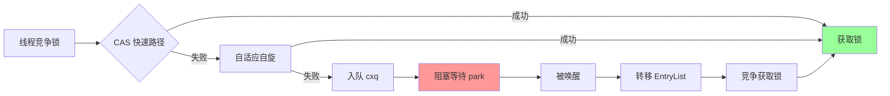
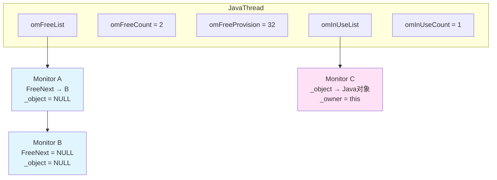
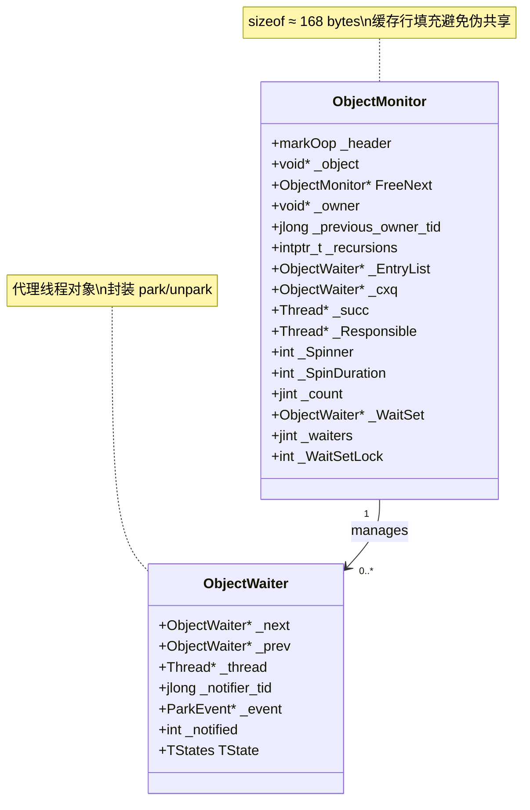
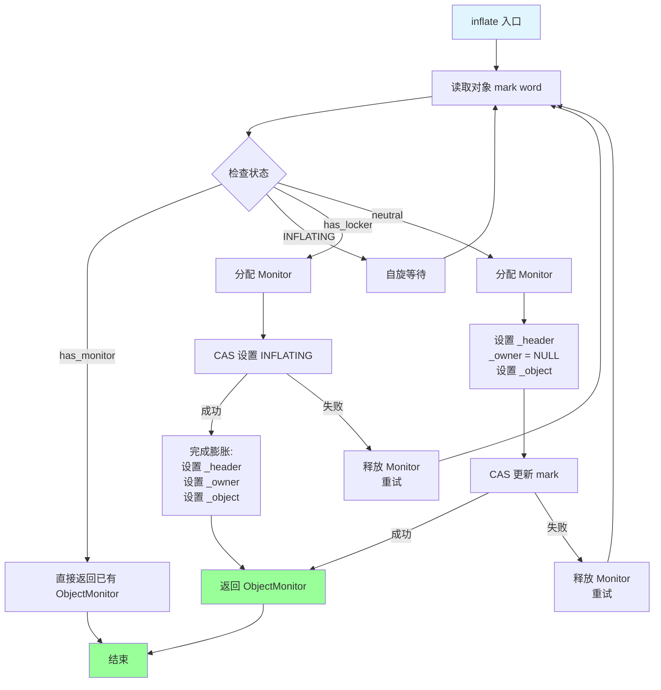
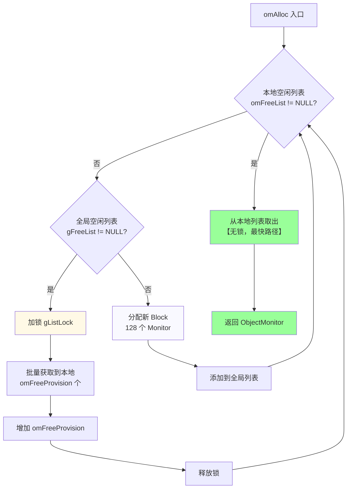
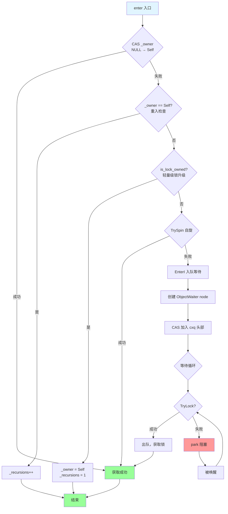
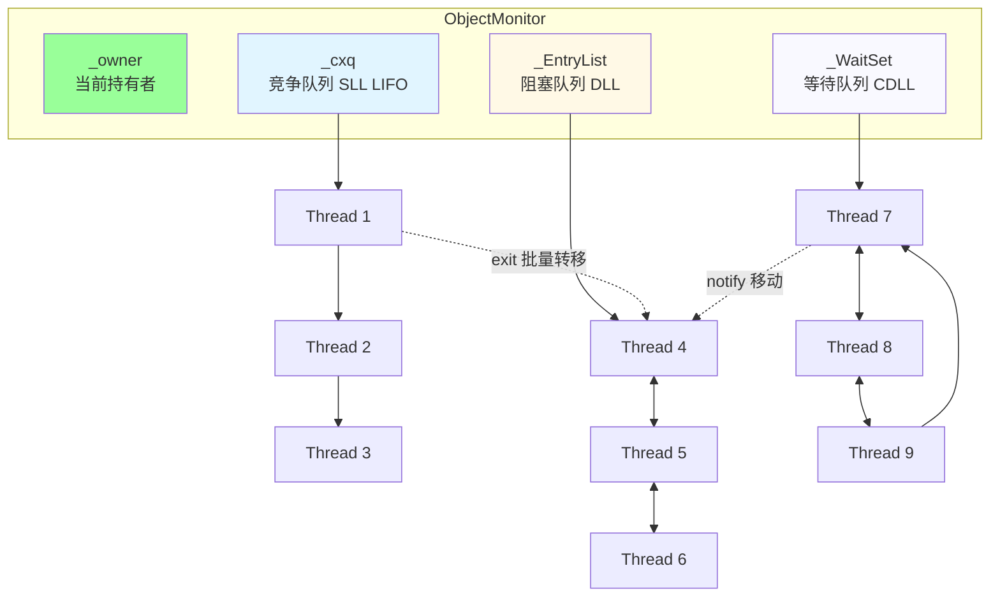
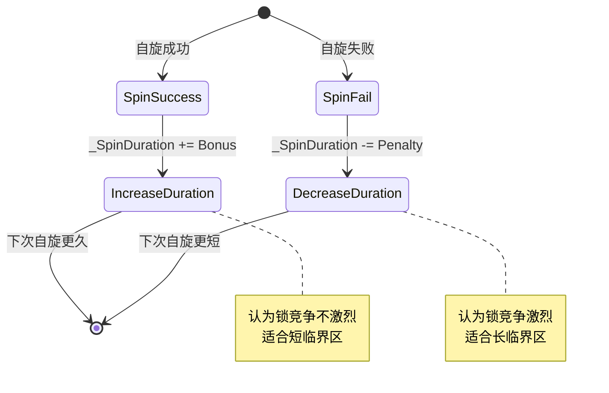
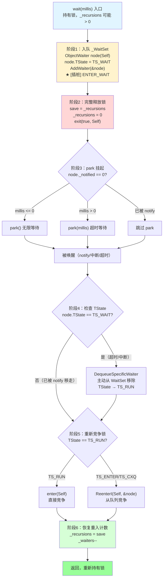
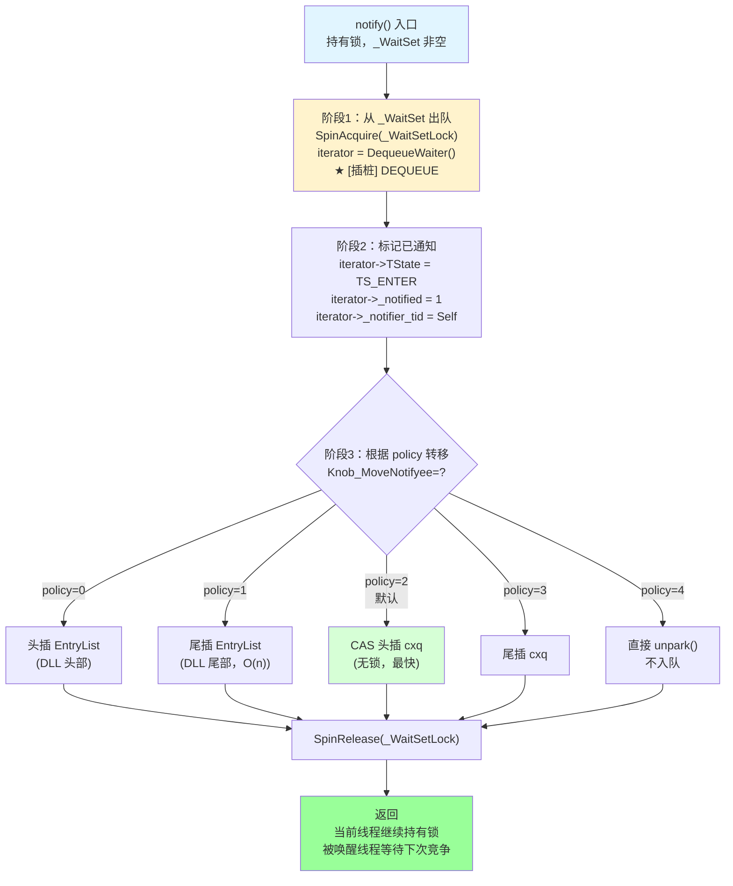

# ObjectMonitor 深度解析 — synchronized 重量级锁实现

> 基于 OpenJDK 11 源码分析  
> 标准环境：-Xms8g -Xmx8g -XX:+UseG1GC  
> 源码路径：src/hotspot/share/runtime/objectMonitor.{hpp,cpp}, synchronizer.{hpp,cpp}  
> 重要程度：⭐⭐⭐⭐⭐ synchronized 关键字底层实现

---

## 第 0 部分：核心原理 ⭐

### 0.1 本质是什么？

本文深入分析 **ObjectMonitor 深度解析 — synchronized 重量级锁实现**：从源码角度理解其设计原理、实现机制和关键细节。

### 0.2 为什么需要？

理解 JVM 内部实现是排查复杂问题、进行性能优化的基础。表面的 API 文档无法解释 JVM 的实际行为，只有深入源码才能建立精确的心智模型。

### 0.3 怎么解决？

结合源码阅读、数据结构分析和 GDB 运行时验证，从多个角度建立对该机制的完整理解。

### 0.4 为什么这样设计？

每个设计决策都有其权衡：性能 vs 正确性、简单性 vs 灵活性、内存占用 vs 查找速度。理解这些权衡是理解 JVM 设计的关键。

---


## 0. 核心原理

### 0.1 本质是什么？

**ObjectMonitor 是 Java synchronized 关键字的重量级锁实现，当轻量级锁（栈锁）无法满足并发需求时，会膨胀为 ObjectMonitor，提供完整的锁竞争管理、等待/通知机制。**

一句话概括：**重量级锁的核心是"排队 + 阻塞"，通过三个队列（cxq、EntryList、WaitSet）管理竞争线程的完整生命周期。**

### 0.2 为什么需要？

轻量级锁（CAS + Lock Record）适用于"交替执行"的场景，但遇到真正的并发竞争时存在问题：

**问题场景 1：多线程同时竞争**

```java
synchronized (lock) {
    // 临界区
}
```

假设有 3 个线程 A、B、C 同时执行到 synchronized：

```
轻量级锁的表现：
┌──────┐  ┌──────┐  ┌──────┐
│ T-A  │  │ T-B  │  │ T-C  │
└──┬───┘  └──┬───┘  └──┬───┘
   │         │         │
   ▼         ▼         ▼
 CAS 失败   CAS 失败   CAS 成功（假设）
   │         │         │
   └─────────┴─────────┘
           │
    重试？自旋？让步？
           │
        行为不确定
```

**问题**：
- 轻量级锁只有一个 CAS 操作，失败后行为未定义
- 没有明确的等待队列
- 没有"公平性"保证
- 无法实现 wait/notify

**问题场景 2：需要条件等待**

```java
synchronized (queue) {
    while (queue.isEmpty()) {
        queue.wait();  // 需要释放锁并等待
    }
    // ...
}
```

**问题**：
- wait() 需要释放锁 + 进入等待队列
- notify() 需要从等待队列选择线程唤醒
- 轻量级锁无法实现这种复杂的协作机制

**没有 ObjectMonitor 的代价**：
- 轻量级锁竞争时无法有效等待
- 无法实现 wait/notify
- 无法管理复杂的线程协作
- 公平性无法保证

### 0.3 怎么解决？

**核心思路**：重量级锁通过"三个队列 + 自适应自旋 + park/unpark"实现完整的线程协作机制。

**三大核心机制**：



**三个队列的设计**：

| 队列 | 数据结构 | 用途 | 特点 |
|------|---------|------|------|
| **cxq** | 单向链表 (SLL) | 新到达的竞争线程 | LIFO，无锁入队 |
| **EntryList** | 双向链表 (DLL) | 从 cxq 转移的线程 | 可调整顺序，公平性 |
| **WaitSet** | 循环双向链表 (CDLL) | wait() 的线程 | 配合 notify/notifyAll |

**执行流程**：
1. **enter()**：尝试 CAS → 自旋 → 入队 cxq → park 阻塞
2. **exit()**：释放锁 → 选择继承者 → unpark 唤醒
3. **wait()**：释放锁 → 加入 WaitSet → park 阻塞
4. **notify()**：从 WaitSet 移出 → 加入 EntryList/cxq

### 0.4 为什么这样设计？

**为什么需要三个队列而不是一个？**

单一队列的问题：
- enter() 和 wait() 的线程混在一起，无法区分
- notify() 后线程应该去哪？直接竞争还是排队？

三个队列的设计：
- **cxq**：快速入队（无锁 CAS），适合高并发场景
- **EntryList**：有序出队，提供公平性保证
- **WaitSet**：专门的条件等待，与锁竞争解耦

**为什么 cxq 是 LIFO 而 EntryList 是 FIFO？**

```
cxq LIFO 的优势：
┌─────┐
│ T3  │ ← 最新到达，CPU 缓存热
├─────┤
│ T2  │
├─────┤
│ T1  │ ← 最早到达，可能已休眠很久
└─────┘

刚到达的线程 CPU 缓存热，唤醒后能快速执行
提高吞吐量，牺牲公平性
```

**为什么需要自适应自旋？**

不同临界区的持有时间差异巨大：
- **短临界区**（如计数器）：自旋等待比阻塞更高效
- **长临界区**（如 IO 操作）：自旋浪费 CPU，应立即阻塞

自适应算法：
- 根据历史成功率动态调整自旋时间
- 短临界区：自旋时间增加（100 → 5000）
- 长临界区：自旋时间减少（5000 → 0）

**为什么需要 _succ（继承者）字段？**

```
没有 _succ：
Thread A (exit) → unpark(T1, T2, T3)
                   ↓
                T1 获取锁，T2、T3 再次阻塞
                   ↓
                2 次 park/unpark 系统调用浪费

有 _succ：
Thread A (exit) → _succ = T1 → unpark(T1 only)
                   ↓
                T1 获取锁，T2、T3 保持睡眠
                   ↓
                仅 1 次 unpark 系统调用
```

---

## 1. 功能定位

### 1.1 一句话概述

**ObjectMonitor** 是 Java `synchronized` 关键字的重量级锁实现，当轻量级锁（栈锁）无法满足需求时，会膨胀为 ObjectMonitor。

### 1.2 锁的演进历史

```
JDK 1.6 之前：只有重量级锁
JDK 1.6：引入锁优化（偏向锁 → 轻量级锁 → 重量级锁）
JDK 15+：偏向锁被废弃（JEP 374）

当前锁升级路径（JDK 15+）:
┌─────────────┐      竞争      ┌─────────────────┐
│  无锁状态    │ ──────────────▶│  轻量级锁        │
│ (Unlocked)  │               │ (Stack Lock)    │
└─────────────┘               └────────┬────────┘
                                       │ 竞争
                                       ▼
                              ┌─────────────────┐
                              │  重量级锁        │
                              │ (ObjectMonitor) │
                              └─────────────────┘
```

### 1.3 什么时候使用 ObjectMonitor？

|| 场景 | 说明 |
||------|------|
|| **锁竞争** | 多线程同时竞争同一把锁 |
|| **wait()/notify()** | 需要条件等待时 |
|| **hashCode()** | 已计算过 hashCode 的对象 |
|| **JNI MonitorEnter** | 通过 JNI 获取锁 |

---

## 2. 线程相关字段初始化

### 2.1 Thread 类中的 ObjectMonitor 相关字段

```cpp
// 源码位置: src/hotspot/share/runtime/thread.hpp:369-374

class Thread {
public:
    // ObjectMonitor 空闲列表（线程私有）
    ObjectMonitor* omFreeList;      // 空闲 Monitor 链表
    int omFreeCount;                // 空闲数量
    int omFreeProvision;            // 批量获取数量（初始 32）
    
    // ObjectMonitor 使用中列表（线程私有）
    ObjectMonitor* omInUseList;     // 正在使用的 Monitor 链表
    int omInUseCount;               // 使用中数量
};
```

### 2.2 初始化代码

```cpp
// 源码位置: src/hotspot/share/runtime/thread.cpp:281-285

Thread::Thread() {
    // ... 其他初始化 ...
    
    // ObjectMonitor 相关字段初始化
    omFreeList = NULL;
    omFreeCount = 0;
    omFreeProvision = 32;     // 首次从全局列表获取 32 个
    omInUseList = NULL;
    omInUseCount = 0;
    
    // ... 其他初始化 ...
}
```

### 2.3 线程与 ObjectMonitor 关系图



---

## 3. ObjectMonitor 数据结构

### 3.1 核心字段定义

```cpp
// 源码位置: src/hotspot/share/runtime/objectMonitor.hpp:128-180

class ObjectMonitor {
private:
    // ================== 关键字段 ==================
    volatile markOop   _header;       // 保存对象原始 mark word
    void*     volatile _object;       // 指向关联的 Java 对象
    
public:
    ObjectMonitor*     FreeNext;      // 空闲链表指针
    
protected:
    void *  volatile _owner;          // 当前持有锁的线程 (Thread* 或 BasicLock*)
    volatile jlong _previous_owner_tid;  // 上一个持有者的线程 ID
    volatile intptr_t  _recursions;   // 重入次数（0 表示首次进入）
    
    ObjectWaiter * volatile _EntryList; // 阻塞等待队列（双向链表）
    
private:
    ObjectWaiter * volatile _cxq;     // 竞争队列（单向链表，LIFO）
    Thread * volatile _succ;          // 继承者线程（减少无效唤醒）
    Thread * volatile _Responsible;   // 负责定时唤醒的线程
    
    volatile int _Spinner;            // 当前自旋线程数
    volatile int _SpinDuration;       // 自旋持续时间（自适应）
    
    volatile jint  _count;            // 引用计数（防止 GC 时被回收）
    
protected:
    ObjectWaiter * volatile _WaitSet; // wait() 等待队列
    volatile jint  _waiters;          // 等待线程数
    
private:
    volatile int _WaitSetLock;        // WaitSet 自旋锁
};
```

### 3.2 ObjectMonitor 内存布局图



### 3.3 ObjectWaiter 代理对象

```cpp
// 源码位置: src/hotspot/share/runtime/objectMonitor.hpp:40-56

class ObjectWaiter : public StackObj {
public:
    enum TStates { 
        TS_UNDEF,   // 未定义
        TS_READY,   // 就绪
        TS_RUN,     // 运行中
        TS_WAIT,    // 在 WaitSet 中等待
        TS_ENTER,   // 在 EntryList 中等待
        TS_CXQ      // 在 cxq 中等待
    };
    
    ObjectWaiter * volatile _next;    // 链表指针
    ObjectWaiter * volatile _prev;    // 双向链表
    Thread*       _thread;            // 关联的线程
    jlong         _notifier_tid;      // notify 的线程 ID
    ParkEvent *   _event;             // park/unpark 事件
    volatile int  _notified;          // 是否被 notify
    volatile TStates TState;          // 当前状态
};
```

---

## 4. 锁膨胀机制 (inflate)

### 4.1 什么是锁膨胀？

**锁膨胀**是指将轻量级锁（栈锁）升级为重量级锁（ObjectMonitor）的过程。

### 4.2 膨胀触发条件

```cpp
// 源码位置: src/hotspot/share/runtime/synchronizer.cpp:339-370

void ObjectSynchronizer::slow_enter(Handle obj, BasicLock* lock, TRAPS) {
    markOop mark = obj->mark();

    // Case 1: 无锁状态，尝试 CAS 获取轻量级锁
    if (mark->is_neutral()) {
        lock->set_displaced_header(mark);
        if (mark == obj()->cas_set_mark((markOop) lock, mark)) {
            return;  // 成功获取轻量级锁
        }
        // CAS 失败，说明有竞争，需要膨胀
    } 
    // Case 2: 当前线程已持有轻量级锁（重入）
    else if (mark->has_locker() &&
             THREAD->is_lock_owned((address)mark->locker())) {
        lock->set_displaced_header(NULL);  // 重入
        return;
    }

    // 无法获取轻量级锁，膨胀为重量级锁
    lock->set_displaced_header(markOopDesc::unused_mark());
    ObjectSynchronizer::inflate(THREAD, obj(), inflate_cause_monitor_enter)
        ->enter(THREAD);  // 调用 ObjectMonitor::enter()
}
```

### 4.3 inflate() 核心流程

```cpp
// 源码位置: src/hotspot/share/runtime/synchronizer.cpp:1380-1570
// （简化版）

ObjectMonitor* ObjectSynchronizer::inflate(Thread * Self, oop object, 
                                           const InflateCause cause) {
    for (;;) {
        const markOop mark = object->mark();
        
        // Case 1: 已经膨胀
        if (mark->has_monitor()) {
            ObjectMonitor * inf = mark->monitor();
            return inf;
        }

        // Case 2: 正在膨胀中（其他线程正在执行膨胀）
        if (mark == markOopDesc::INFLATING()) {
            ReadStableMark(object);  // 自旋等待
            continue;
        }

        // Case 3: 栈锁状态 → 膨胀
        if (mark->has_locker()) {
            ObjectMonitor * m = omAlloc(Self);  // 分配 Monitor
            m->Recycle();
            
            // CAS 设置为 INFLATING 状态
            markOop cmp = object->cas_set_mark(markOopDesc::INFLATING(), mark);
            if (cmp != mark) {
                omRelease(Self, m, true);  // CAS 失败，释放
                continue;
            }

            // 成功设置 INFLATING，完成膨胀
            markOop dmw = mark->displaced_mark_helper();
            m->set_header(dmw);
            m->set_owner(mark->locker());  // 原锁持有者
            m->set_object(object);
            
            // 原子更新对象头
            object->release_set_mark(markOopDesc::encode(m));
            return m;
        }

        // Case 4: 无锁状态 → 膨胀
        ObjectMonitor * m = omAlloc(Self);
        m->Recycle();
        m->set_header(mark);
        m->set_owner(NULL);
        m->set_object(object);

        if (object->cas_set_mark(markOopDesc::encode(m), mark) != mark) {
            m->set_object(NULL);
            omRelease(Self, m, true);
            continue;  // CAS 失败，重试
        }
        return m;
    }
}
```

### 4.4 膨胀流程图



---

## 5. ObjectMonitor 分配机制

### 5.1 omAlloc() 分配策略

```cpp
// 源码位置: src/hotspot/share/runtime/synchronizer.cpp:1100-1230

ObjectMonitor* ObjectSynchronizer::omAlloc(Thread * Self) {
    const int MAXPRIVATE = 1024;
    
    for (;;) {
        ObjectMonitor * m;

        // ================== 策略1：线程本地空闲列表 ==================
        m = Self->omFreeList;
        if (m != NULL) {
            Self->omFreeList = m->FreeNext;
            Self->omFreeCount--;
            
            // 加入使用中列表
            if (MonitorInUseLists) {
                m->FreeNext = Self->omInUseList;
                Self->omInUseList = m;
                Self->omInUseCount++;
            }
            return m;
        }

        // ================== 策略2：全局空闲列表 ==================
        if (gFreeList != NULL) {
            Thread::muxAcquire(&gListLock, "omAlloc");  // 加锁
            
            // 批量获取到线程本地
            for (int i = Self->omFreeProvision; --i >= 0 && gFreeList != NULL;) {
                gMonitorFreeCount--;
                ObjectMonitor * take = gFreeList;
                gFreeList = take->FreeNext;
                take->Recycle();
                omRelease(Self, take, false);  // 放入本地空闲列表
            }
            
            Thread::muxRelease(&gListLock);  // 释放锁
            Self->omFreeProvision += 1 + (Self->omFreeProvision/2);  // 增加批量大小
            if (Self->omFreeProvision > MAXPRIVATE) 
                Self->omFreeProvision = MAXPRIVATE;
            continue;
        }

        // ================== 策略3：分配新 Block ==================
        size_t neededsize = sizeof(PaddedEnd<ObjectMonitor>) * _BLOCKSIZE;
        PaddedEnd<ObjectMonitor> * temp = 
            (PaddedEnd<ObjectMonitor> *)align_up(
                NEW_C_HEAP_ARRAY(char, neededsize + DEFAULT_CACHE_LINE_SIZE - 1),
                DEFAULT_CACHE_LINE_SIZE);

        // 初始化并链接
        for (int i = 1; i < _BLOCKSIZE; i++) {
            temp[i].FreeNext = (ObjectMonitor *)&temp[i+1];
        }
        temp[_BLOCKSIZE - 1].FreeNext = NULL;
        
        // 添加到全局列表
        Thread::muxAcquire(&gListLock, "omAlloc [2]");
        gMonitorPopulation += _BLOCKSIZE-1;
        temp[0].FreeNext = gBlockList;
        gBlockList = temp;
        temp[_BLOCKSIZE - 1].FreeNext = gFreeList;
        gFreeList = temp + 1;
        Thread::muxRelease(&gListLock);
    }
}
```

### 5.2 分配策略流程图



---

## 6. ObjectMonitor::enter() 加锁流程

### 6.1 enter() 核心代码

```cpp
// 源码位置: src/hotspot/share/runtime/objectMonitor.cpp:270-330

void ObjectMonitor::enter(TRAPS) {
    Thread * const Self = THREAD;

    // ================== 快速路径1：CAS 直接获取 ==================
    void * cur = Atomic::cmpxchg(Self, &_owner, (void*)NULL);
    if (cur == NULL) {
        // 成功获取锁
        return;
    }

    // ================== 快速路径2：重入 ==================
    if (cur == Self) {
        _recursions++;
        return;
    }

    // ================== 快速路径3：轻量级锁升级 ==================
    if (Self->is_lock_owned((address)cur)) {
        _recursions = 1;
        _owner = Self;
        return;
    }

    // ================== 慢速路径：真正的竞争 ==================
    Self->_Stalled = intptr_t(this);

    // 尝试自旋一轮
    if (Knob_SpinEarly && TrySpin(Self) > 0) {
        Self->_Stalled = 0;
        return;
    }

    // 增加引用计数，防止 deflate
    Atomic::inc(&_count);

    // 进入阻塞等待
    {
        JavaThreadBlockedOnMonitorEnterState jtbmes(jt, this);
        Self->set_current_pending_monitor(this);

        for (;;) {
            jt->set_suspend_equivalent();
            EnterI(THREAD);  // 核心等待逻辑

            if (!ExitSuspendEquivalent(jt)) break;

            // 如果在等待期间被挂起，释放锁后再重新获取
            _recursions = 0;
            _succ = NULL;
            exit(false, Self);
            jt->java_suspend_self();
        }
        Self->set_current_pending_monitor(NULL);
    }

    Atomic::dec(&_count);
    Self->_Stalled = 0;
}
```

### 6.2 EnterI() 入队等待

```cpp
// 源码位置: src/hotspot/share/runtime/objectMonitor.cpp:430-550

void ObjectMonitor::EnterI(TRAPS) {
    Thread * const Self = THREAD;

    // 再尝试一次 TryLock
    if (TryLock(Self) > 0) return;

    // 自旋尝试
    if (TrySpin(Self) > 0) return;

    // ================== 入队到 cxq ==================
    ObjectWaiter node(Self);
    Self->_ParkEvent->reset();
    node._prev = (ObjectWaiter *) 0xBAD;
    node.TState = ObjectWaiter::TS_CXQ;

    // CAS 将自己加入 cxq 头部
    ObjectWaiter * nxt;
    for (;;) {
        node._next = nxt = _cxq;
        if (Atomic::cmpxchg(&node, &_cxq, nxt) == nxt) break;
        if (TryLock(Self) > 0) return;  // CAS 期间重试获取锁
    }

    // ================== 等待循环 ==================
    for (;;) {
        if (TryLock(Self) > 0) break;

        // park 自己
        if (_Responsible == Self || (SyncFlags & 1)) {
            Self->_ParkEvent->park((jlong) recheckInterval);  // 带超时
            recheckInterval *= 8;  // 指数退避
        } else {
            Self->_ParkEvent->park();  // 无限等待
        }

        if (TryLock(Self) > 0) break;

        // 自适应自旋
        if ((Knob_SpinAfterFutile & 1) && TrySpin(Self) > 0) break;

        if (_succ == Self) _succ = NULL;
    }

    // ================== 成功获取锁，出队 ==================
    UnlinkAfterAcquire(Self, &node);
    if (_succ == Self) _succ = NULL;
}
```

### 6.3 enter() 流程图



---

## 7. ObjectMonitor::exit() 释放锁流程

### 7.1 exit() 核心代码

```cpp
// 源码位置: src/hotspot/share/runtime/objectMonitor.cpp:920-1050

void ObjectMonitor::exit(bool not_suspended, TRAPS) {
    Thread * const Self = THREAD;

    // ================== 检查所有权 ==================
    if (THREAD != _owner) {
        if (THREAD->is_lock_owned((address) _owner)) {
            _owner = THREAD;
            _recursions = 0;
        } else {
            // IllegalMonitorStateException
            return;
        }
    }

    // ================== 处理重入 ==================
    if (_recursions != 0) {
        _recursions--;
        return;
    }

    // ================== 释放锁 ==================
    for (;;) {
        // 1-0 模式：直接释放
        OrderAccess::release_store(&_owner, (void*)NULL);
        OrderAccess::storeload();

        // 检查是否需要唤醒后继者
        if ((intptr_t(_EntryList)|intptr_t(_cxq)) == 0 || _succ != NULL) {
            return;  // 无等待者或已有继承者
        }

        // 需要唤醒等待者，重新获取锁
        if (!Atomic::replace_if_null(THREAD, &_owner)) {
            return;  // 其他线程已获取
        }

        // ================== 选择继承者 ==================
        ObjectWaiter * w = NULL;

        if (QMode == 2 && _cxq != NULL) {
            // 策略2：直接从 cxq 唤醒
            w = _cxq;
            ExitEpilog(Self, w);
            return;
        }

        // 默认：从 EntryList 唤醒
        w = _EntryList;
        if (w != NULL) {
            ExitEpilog(Self, w);
            return;
        }

        // cxq → EntryList 转移
        w = _cxq;
        if (w == NULL) continue;

        // 将 cxq 转移到 EntryList
        for (;;) {
            ObjectWaiter * u = Atomic::cmpxchg((ObjectWaiter*)NULL, &_cxq, w);
            if (u == w) break;
            w = u;
        }
        
        _EntryList = w;  // 设置 EntryList
        
        // 唤醒 EntryList 头部
        w = _EntryList;
        if (w != NULL) {
            ExitEpilog(Self, w);
            return;
        }
    }
}
```

### 7.2 等待队列关系图



---

## 8. 自适应自旋优化

### 8.1 TrySpin() 自适应自旋

```cpp
// 核心参数
static int Knob_SpinLimit = 5000;  // 最大自旋次数

// 自适应调整逻辑:
// - 自旋成功: _SpinDuration 增加
// - 自旋失败: _SpinDuration 减少

int ObjectMonitor::TrySpin(Thread * Self) {
    int ctr = _SpinDuration;  // 从历史值开始
    
    while (--ctr >= 0) {
        // 尝试获取锁
        if (TryLock(Self) > 0) {
            // 成功，增加 SpinDuration
            if (_SpinDuration < Knob_SpinLimit) {
                _SpinDuration += Knob_Bonus;
            }
            return 1;
        }
        SpinPause();  // CPU 指令 pause
    }
    
    // 失败，减少 SpinDuration
    _SpinDuration -= Knob_Penalty;
    if (_SpinDuration < 0) _SpinDuration = 0;
    return 0;
}
```

### 8.2 自适应原理



---

## 8.1 GDB 验证脚本

### 9.1 验证锁膨胀过程

```gdb
# gdb_inflate.gdb
# 目标：观察轻量级锁 → 重量级锁的膨胀过程

set args -Xms8g -Xmx8g -XX:+UseG1GC \
         -XX:+PrintSafepointStatistics \
         -cp /data/workspace/demo/src com.wjcoder.Main

# 断点1：slow_enter（轻量级锁尝试）
break ObjectSynchronizer::slow_enter
commands
  printf "=== 轻量级锁尝试 ===\n"
  p mark->is_neutral()
  p mark->has_locker()
  continue
end

# 断点2：膨胀入口
break ObjectSynchronizer::inflate
commands
  printf "=== 锁膨胀开始 ===\n"
  p object->klass()->name()->as_C_string()
  continue
end

# 断点3：Monitor 分配
break ObjectSynchronizer::omAlloc
commands
  printf "=== 分配 ObjectMonitor ===\n"
  p Self->omFreeCount
  p gMonitorFreeCount
  continue
end

# 断点4：膨胀完成
break ObjectMonitor::enter
commands
  printf "=== ObjectMonitor::enter ===\n"
  p _owner
  p _EntryList
  p _cxq
  continue
end

run
```

**预期输出**：
```
=== 轻量级锁尝试 ===
$1 = true   # 无锁状态
$2 = false

=== 锁膨胀开始 ===
$3 = "java/lang/Object"

=== 分配 ObjectMonitor ===
$4 = 2    # 本地空闲 2 个
$5 = 128  # 全局空闲 128 个

=== ObjectMonitor::enter ===
$6 = (void *) 0x0   # NULL，尝试 CAS
$7 = (ObjectWaiter *) 0x0
$8 = (ObjectWaiter *) 0x0
```

### 9.2 验证等待队列管理

```gdb
# gdb_queues.gdb
# 目标：观察 cxq、EntryList、WaitSet 的管理

set args -Xms8g -Xmx8g -XX:+UseG1GC \
         -cp /data/workspace/demo/src com.wjcoder.Main

# 断点：enter 失败入队
break ObjectMonitor::EnterI
commands
  printf "=== EnterI: 线程将入队 ===\n"
  p Self->name()
  continue
end

# 断点：exit 唤醒
break ObjectMonitor::exit
commands
  printf "=== exit: 释放锁 ===\n"
  p _EntryList != NULL
  p _cxq != NULL
  p _waiters
  continue
end

# 断点：wait 入队
break ObjectMonitor::wait
commands
  printf "=== wait: 进入 WaitSet ===\n"
  p _waiters
  continue
end

# 断点：notify 唤醒
break ObjectMonitor::notify
commands
  printf "=== notify: 从 WaitSet 移出 ===\n"
  p _WaitSet != NULL
  continue
end

run
```

**预期输出**：
```
=== EnterI: 线程将入队 ===
$1 = "Thread-1"

=== exit: 释放锁 ===
$2 = true   # EntryList 不空
$3 = false  # cxq 为空
$4 = 0      # 无 wait 线程

=== wait: 进入 WaitSet ===
$5 = 1

=== notify: 从 WaitSet 移出 ===
$6 = true
```

### 9.3 验证自适应自旋

```gdb
# gdb_spin.gdb
# 目标：观察自适应自旋参数的变化

set args -Xms8g -Xmx8g -XX:+UseG1GC \
         -cp /data/workspace/demo/src com.wjcoder.Main

# 断点：TrySpin
break ObjectMonitor::TrySpin
commands
  printf "=== TrySpin ===\n"
  p _SpinDuration
  continue
end

# 断点：自旋成功
break ObjectMonitor::TryLock
commands
  if _SpinDuration > 0
    printf "SpinDuration = %d\n", _SpinDuration
  end
  continue
end

run
```

**预期输出**：
```
=== TrySpin ===
$1 = 100   # 初始值

SpinDuration = 100
SpinDuration = 200  # 成功后增加
SpinDuration = 300
...
SpinDuration = 0    # 长期失败后降为 0
```

---

## 9. ObjectMonitor::wait() 等待流程

> 对应插桩：`[ObjectMonitor::wait] ENTER_WAIT`

### 9.1 解决什么问题？

`wait()` 解决的是**条件等待**问题：线程持有锁后发现条件不满足，需要**释放锁并挂起**，等待其他线程满足条件后再被唤醒重新竞争锁。

这与 `park()` 的区别在于：`wait()` 必须先**完整释放锁**（包括重入计数），被唤醒后还要**重新竞争锁**才能返回。

### 9.2 wait() 核心源码

```cpp
// 源码位置: src/hotspot/share/runtime/objectMonitor.cpp:1436-1664

void ObjectMonitor::wait(jlong millis, bool interruptible, TRAPS) {
  Thread * const Self = THREAD;
  JavaThread *jt = (JavaThread *)THREAD;

  // ★ 阶段1：创建 ObjectWaiter 节点，加入 _WaitSet
  ObjectWaiter node(Self);
  node.TState = ObjectWaiter::TS_WAIT;   // 初始状态：等待中
  Self->_ParkEvent->reset();             // 重置 park 事件，防止虚假唤醒
  OrderAccess::fence();                  // 内存屏障：确保 reset 对其他线程可见

  // 用自旋锁保护 _WaitSet（竞争极少，自旋锁比互斥锁更轻量）
  Thread::SpinAcquire(&_WaitSetLock, "WaitSet - add");
  AddWaiter(&node);                      // 加入 _WaitSet 循环双向链表尾部
  Thread::SpinRelease(&_WaitSetLock);

  // ★ [插桩点] ENTER_WAIT：节点已入队，即将释放锁
  // tty->print_cr("[ObjectMonitor::wait] ENTER_WAIT monitor=%p thread=... _waiters=%d _WaitSet=%p _recursions=%ld millis=%ld")

  // ★ 阶段2：保存重入计数，完整释放锁
  intptr_t save = _recursions;  // ★ 保存递归计数（可能 > 0）
  _waiters++;                   // 等待者计数 +1
  _recursions = 0;              // ★ 清零递归计数（完全释放锁）
  exit(true, Self);             // ★ 释放锁（not_suspended=true）
  guarantee(_owner != Self, "invariant");  // 确认锁已释放

  // ★ 阶段3：park 挂起，等待唤醒
  int ret = OS_OK;
  int WasNotified = 0;
  {
    OSThreadWaitState osts(osthread, true);  // 线程状态 → OBJECT_WAIT
    {
      ThreadBlockInVM tbivm(jt);            // 线程状态 → thread_blocked
      jt->set_suspend_equivalent();

      if (node._notified == 0) {            // 还没被 notify
        if (millis <= 0) {
          Self->_ParkEvent->park();         // ★ 无限等待
        } else {
          ret = Self->_ParkEvent->park(millis);  // ★ 带超时等待
        }
      }
    }

    // ★ 阶段4：被唤醒后，从 _WaitSet 移除（超时/中断场景）
    if (node.TState == ObjectWaiter::TS_WAIT) {
      Thread::SpinAcquire(&_WaitSetLock, "WaitSet - unlink");
      if (node.TState == ObjectWaiter::TS_WAIT) {
        DequeueSpecificWaiter(&node);  // 超时/中断：主动从 WaitSet 移除
        node.TState = ObjectWaiter::TS_RUN;
      }
      Thread::SpinRelease(&_WaitSetLock);
    }

    WasNotified = node._notified;

    // ★ 阶段5：重新竞争锁（reenter）
    ObjectWaiter::TStates v = node.TState;
    if (v == ObjectWaiter::TS_RUN) {
      enter(Self);          // 超时/中断路径：直接调用 enter() 重新竞争
    } else {
      // notify 路径：已在 EntryList 或 cxq，调用 ReenterI 重新竞争
      guarantee(v == ObjectWaiter::TS_ENTER || v == ObjectWaiter::TS_CXQ, "invariant");
      ReenterI(Self, &node);
      node.wait_reenter_end(this);
    }
    // 到这里，Self 已重新持有锁
  }

  // ★ 阶段6：恢复重入计数
  guarantee(_recursions == 0, "invariant");
  _recursions = save;  // ★ 恢复之前保存的递归计数
  _waiters--;          // 等待者计数 -1
}
```

### 9.3 wait() 六阶段流程图



### 9.4 关键设计决策

| 设计点 | 原因 |
|--------|------|
| `save = _recursions; _recursions = 0` | 重入锁必须完整释放，否则其他线程无法获取锁 |
| `exit(true, Self)` 而非直接清空 `_owner` | 走完整的 exit 流程，确保唤醒等待的竞争者 |
| 用自旋锁保护 `_WaitSet` | `_WaitSet` 竞争极少（只有 owner 操作），自旋锁比 mutex 更轻量 |
| 被唤醒后调用 `enter()` 或 `ReenterI()` | 两条路径：超时/中断走 `enter()`，notify 走 `ReenterI()`（已在队列中） |
| `_recursions = save` 在最后恢复 | 必须等重新持有锁后才能恢复，否则其他线程看到错误的重入计数 |

---

## 10. ObjectMonitor::INotify() 通知流程

> 对应插桩：`[ObjectMonitor::INotify] DEQUEUE`

### 10.1 解决什么问题？

`notify()` 解决的是**精确唤醒**问题：从 `_WaitSet` 取出一个等待线程，将其转移到 `_EntryList` 或 `_cxq`，让它参与下一轮锁竞争。

**关键设计**：`notify()` 不立即释放锁，被唤醒的线程要等 `notify()` 调用者释放锁后才能竞争。

### 10.2 INotify() 核心源码

```cpp
// 源码位置: src/hotspot/share/runtime/objectMonitor.cpp:1673-1779

void ObjectMonitor::INotify(Thread * Self) {
  const int policy = Knob_MoveNotifyee;  // 默认 policy=2（prepend to cxq）

  // ★ 阶段1：从 _WaitSet 出队一个节点
  Thread::SpinAcquire(&_WaitSetLock, "WaitSet - notify");
  ObjectWaiter * iterator = DequeueWaiter();  // 取出 _WaitSet 头部节点
  if (iterator != NULL) {
    guarantee(iterator->TState == ObjectWaiter::TS_WAIT, "invariant");
    guarantee(iterator->_notified == 0, "invariant");

    // ★ [插桩点] DEQUEUE：节点已从 WaitSet 移出
    // tty->print_cr("[ObjectMonitor::INotify] DEQUEUE monitor=%p notifier=... waiter_thread=... _WaitSet=%p _waiters=%d _EntryList=%p _cxq=%p")

    // ★ 阶段2：标记节点已被通知
    if (policy != 4) {
      iterator->TState = ObjectWaiter::TS_ENTER;  // 状态：等待进入
    }
    iterator->_notified = 1;                       // ★ 标记已被 notify
    iterator->_notifier_tid = JFR_THREAD_ID(Self); // 记录通知者 tid

    // ★ 阶段3：根据 policy 将节点转移到目标队列
    ObjectWaiter * list = _EntryList;

    if (policy == 0) {          // 头插 EntryList
      if (list == NULL) {
        iterator->_next = iterator->_prev = NULL;
        _EntryList = iterator;
      } else {
        list->_prev = iterator;
        iterator->_next = list;
        iterator->_prev = NULL;
        _EntryList = iterator;  // 插入 EntryList 头部
      }
    } else if (policy == 1) {   // 尾插 EntryList
      if (list == NULL) {
        iterator->_next = iterator->_prev = NULL;
        _EntryList = iterator;
      } else {
        // 遍历到尾部（O(n)，但 EntryList 通常很短）
        ObjectWaiter * tail;
        for (tail = list; tail->_next != NULL; tail = tail->_next) {}
        tail->_next = iterator;
        iterator->_prev = tail;
        iterator->_next = NULL;
      }
    } else if (policy == 2) {   // ★ 默认：头插 cxq（CAS 无锁）
      if (list == NULL) {
        iterator->_next = iterator->_prev = NULL;
        _EntryList = iterator;
      } else {
        iterator->TState = ObjectWaiter::TS_CXQ;
        for (;;) {
          ObjectWaiter * front = _cxq;
          iterator->_next = front;
          if (Atomic::cmpxchg(iterator, &_cxq, front) == front) {
            break;  // CAS 成功，插入 cxq 头部
          }
        }
      }
    } else if (policy == 3) {   // 尾插 cxq
      iterator->TState = ObjectWaiter::TS_CXQ;
      for (;;) {
        ObjectWaiter * tail = _cxq;
        if (tail == NULL) {
          iterator->_next = NULL;
          if (Atomic::replace_if_null(iterator, &_cxq)) break;
        } else {
          while (tail->_next != NULL) tail = tail->_next;
          tail->_next = iterator;
          iterator->_prev = tail;
          iterator->_next = NULL;
          break;
        }
      }
    } else {                    // policy == 4：直接 unpark（不入队）
      ParkEvent * ev = iterator->_event;
      iterator->TState = ObjectWaiter::TS_RUN;
      OrderAccess::fence();
      ev->unpark();             // 直接唤醒，不经过 EntryList/cxq
    }

    if (policy < 4) {
      iterator->wait_reenter_begin(this);  // 标记开始重新进入
    }
  }
  Thread::SpinRelease(&_WaitSetLock);
}
```

### 10.3 notify() 调用链

```cpp
// 源码位置: src/hotspot/share/runtime/objectMonitor.cpp:1793-1820

void ObjectMonitor::notify(TRAPS) {
  CHECK_OWNER();                // 必须持有锁
  if (_WaitSet == NULL) return; // WaitSet 为空，直接返回
  INotify(THREAD);              // ★ 调用 INotify 转移一个 waiter
  OM_PERFDATA_OP(Notifications, inc(1));
}

void ObjectMonitor::notifyAll(TRAPS) {
  CHECK_OWNER();
  if (_WaitSet == NULL) return;
  while (_WaitSet != NULL) {
    INotify(THREAD);            // ★ 循环调用，直到 WaitSet 清空
  }
}
```

### 10.4 INotify() 流程图



### 10.5 关键设计决策

| 设计点 | 原因 |
|--------|------|
| `notify()` 不立即释放锁 | 调用者可能还有后续操作，避免过早释放导致竞争 |
| 默认 `policy=2`（头插 cxq） | CAS 无锁操作，性能最好；cxq 是 LIFO，最近等待的线程优先 |
| `_notified = 1` 标记 | 防止 `wait()` 超时后重复从 WaitSet 移除（双重检查） |
| 用自旋锁保护 `_WaitSet` | 同 `wait()`，竞争极少，自旋锁更轻量 |
| `policy=4` 直接 unpark | 特殊优化：锁空闲时直接唤醒，跳过队列管理开销 |

---

## 11. 插桩分支全景对照表

> 所有插桩分支与文章章节的对应关系

| 插桩输出 | 触发条件 | 对应章节 |
|---------|---------|---------|
| `[ObjectMonitor::enter] PATH=CAS_SUCCESS` | 首次无竞争加锁，CAS `_owner: NULL→Self` 成功 | §6.1 快速路径1 |
| `[ObjectMonitor::enter] PATH=REENTRANT` | 重入加锁，`_owner == Self`，`_recursions++` | §6.1 快速路径2 |
| `[ObjectMonitor::enter] PATH=BASICLOCK_UPGRADE` | BasicLock 升级，`is_lock_owned(cur)` 为真 | §6.1 快速路径3 |
| `[ObjectMonitor::enter] PATH=CONTENDED` | 真实竞争，进入 `EnterI()` 排队 | §6.1 慢速路径 + §6.2 |
| `[ObjectMonitor::exit] PATH=RECURSIVE` | 重入退出，`_recursions != 0`，`_recursions--` | §7.1 处理重入 |
| `[ObjectMonitor::wait] ENTER_WAIT` | `wait()` 节点入队 `_WaitSet`，即将释放锁 | **§9（本章）** |
| `[ObjectMonitor::INotify] DEQUEUE` | `notify()` 从 `_WaitSet` 出队一个节点 | **§10（本章）** |

---

## 12. 面试高频问题

### Q1: synchronized 底层是如何实现的？

**答案**：

```
1. 字节码层面:
   - monitorenter 指令: 尝试获取锁
   - monitorexit 指令: 释放锁

2. JVM 层面:
   - 轻量级锁: 在栈帧中创建 Lock Record，CAS 修改对象头
   - 重量级锁: ObjectMonitor，包含等待队列、自旋等机制

3. 锁升级:
   无锁 → 轻量级锁 → 重量级锁（单向升级，不会降级）
```

### Q2: ObjectMonitor 中 cxq 和 EntryList 有什么区别？

**答案**：

|| 特性 | cxq | EntryList |
||------|-----|-----------|
|| 数据结构 | 单向链表 (SLL) | 双向链表 (DLL) |
|| 入队方式 | CAS 无锁入队 | 锁持有者操作 |
|| 顺序 | LIFO (栈) | 可调整顺序 |
|| 用途 | 新到达的竞争线程 | 从 cxq 转移的线程 |
|| 出队时机 | exit() 时批量转移 | exit() 时唤醒 |

### Q3: 为什么需要 _succ 字段？

**答案**：

`_succ` (successor) 是继承者线程，用于**减少无效唤醒**：

```
场景: 线程 A 释放锁，需要唤醒等待线程
问题: 如果直接 unpark 所有等待者，大多数会立即再次阻塞

解决方案:
1. 设置 _succ = 被选中的继承者
2. 只 unpark 继承者
3. 其他线程保持睡眠
4. 继承者获取锁后清除 _succ

效果: 减少 park/unpark 系统调用次数
```

### Q4: 自适应自旋是什么原理？

**答案**：

```
核心思想: 用历史成功率预测未来

实现:
• 每个 Monitor 维护 _SpinDuration
• 自旋成功: 增加 _SpinDuration（认为锁竞争不激烈）
• 自旋失败: 减少 _SpinDuration（认为锁竞争激烈）
• 长期失败: _SpinDuration → 0，完全不自旋

优势:
• 短临界区: 自旋成功率高，增加自旋时间
• 长临界区: 自旋成功率低，减少 CPU 浪费
```

### Q5: wait() 和 notify() 是如何实现的？

**答案**：

```
wait():
1. 创建 ObjectWaiter node
2. 加入 WaitSet（循环双向链表）
3. 释放锁（exit）
4. park() 等待唤醒

notify():
1. 从 WaitSet 取出一个 waiter
2. 设置 waiter._notified = 1
3. 将 waiter 移动到 EntryList 或 cxq
4. 当前线程继续执行（不立即释放锁）

notifyAll():
• 循环调用 notify() 直到 WaitSet 为空
```

---

## 13. 总结

|| 概念 | 要点 |
||------|------|
|| 本质 | 重量级锁实现，三个队列管理线程协作 |
|| 三个队列 | cxq (LIFO)、EntryList (FIFO)、WaitSet (条件等待) |
|| 锁膨胀 | 轻量级锁竞争 → 分配 ObjectMonitor → 更新对象头 |
|| enter 流程 | CAS → 自旋 → 入队 cxq → park 阻塞 |
|| exit 流程 | 释放锁 → 选择继承者 → unpark 唤醒 |
|| wait/notify | WaitSet 管理，配合 EntryList/cxq |
|| 自适应自旋 | 历史成功率预测，动态调整自旋时间 |
|| Monitor 分配 | 三级缓存：本地列表 → 全局列表 → 新分配 |

---

## 14. 相关源码文件索引

|| 文件 | 说明 |
||------|------|
|| `objectMonitor.hpp` | ObjectMonitor 类定义 |
|| `objectMonitor.cpp` | enter/exit/wait/notify 实现 |
|| `synchronizer.hpp` | ObjectSynchronizer 类定义 |
|| `synchronizer.cpp` | inflate/omAlloc/deflate 实现 |
|| `thread.hpp:369-374` | Thread 中 Monitor 相关字段 |
|| `thread.cpp:281-285` | 字段初始化 |
