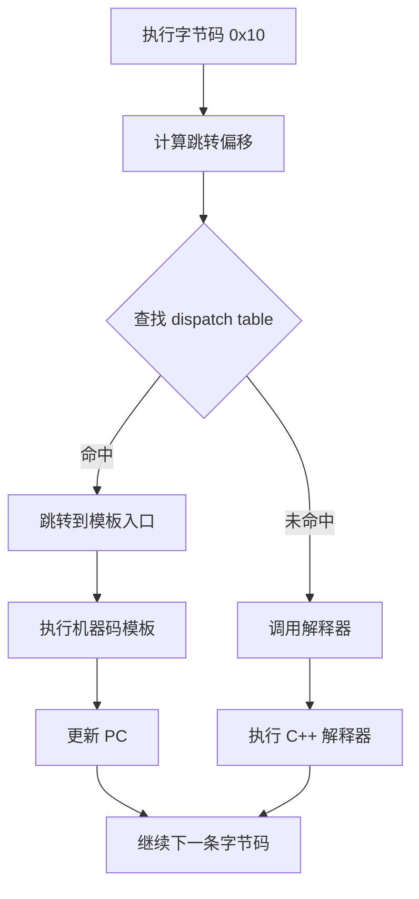
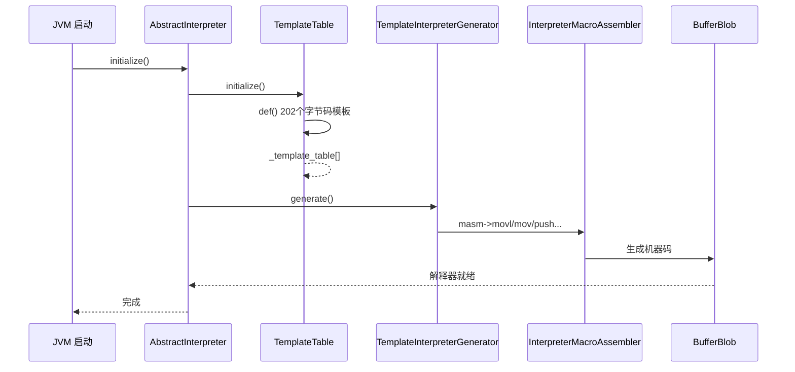
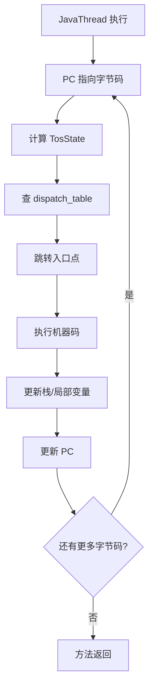

# TemplateTable 深度分析

> **源码位置**: `src/hotspot/share/interpreter/templateTable.cpp`, `templateTable.hpp`
> **重要程度**: ⭐⭐⭐⭐⭐ (JVM 解释器核心，字节码执行基础)
> **调用链路**: `JVM 启动` → `TemplateTable::initialize()` → `TemplateInterpreter 生成` → `字节码执行`

---

## 第 0 部分：核心原理 ⭐

### 0.1 本质是什么？

本文是对 **TemplateTable 深度分析** 的深度源码分析：从数据结构到算法流程，逐层剖析其实现原理，并通过 GDB 验证关键结论。

### 0.2 为什么需要？

深入理解 JVM 内部实现，不仅能帮助排查生产问题，更能建立对 JVM 行为的精确预测能力——知道『为什么』比知道『是什么』更重要。

### 0.3 怎么解决？

采用「数据结构 → 算法流程 → GDB 验证」三步法：先完整分析所有涉及的数据结构（字段含义/sizeof/生命周期），再分析算法流程（每步有 why），最后用 GDB 实际验证关键结论。

### 0.4 为什么这样设计？

JVM 的每个设计决策都有其历史背景和性能考量。本文在分析每个关键设计时，都会解释「为什么这样而不是那样」，帮助读者建立设计直觉。

---


## 0. 核心原理

### 0.1 本质是什么？

TemplateTable 是 JVM 解释器的**模板表**，为每个字节码（Bytecode）定义对应的**机器码生成器**。它不是直接执行字节码，而是：
- 为每个字节码生成一段**机器码模板**
- 解释执行时，跳转到对应模板的**入口点**直接执行机器码

**核心概念**：
- **Template（模板）**：描述一个字节码的实现模板
- **Generator（生成器）**：生成机器码的函数指针
- **TosState（栈状态）**：Top-of-Stack 缓存状态

### 0.2 为什么需要？

**问题**：Java 字节码是如何被执行的？

Java 编译器将 .java 编译成 .class，字节码存储在方法区的 Code 属性中。JVM 需要执行这些字节码。

**方案 1：逐条解释执行**
- 每个字节码对应一个 C++ 函数
- 每次执行都要函数调用，开销大

**方案 2：TemplateTable（模板解释器）**
- 每个字节码生成一段**机器码模板**（类似 JIT 的简化版）
- 执行时跳转到模板入口，**直接执行机器码**，无需解释器开销
- 比纯解释执行快 10-50 倍

### 0.3 怎么解决？

**核心设计**：
1. **Template**：为每个字节码定义模板，包含 flags、输入/输出状态、生成器
2. **TemplateTable**：数组，每个索引对应一个字节码，共 `Bytecodes::number_of_codes` 个
3. **InterpreterMacroAssembler**：生成机器码的汇编器
4. **TemplateInterpreter**：最终生成的解释器代码（CodeBlob）

### 0.4 为什么这样设计？

**为什么用机器码模板而不是 C++ 函数？**
- 消除函数调用开销
- 机器码更符合 CPU 执行流水线
- 可以内联常用操作

**为什么需要 TosState？**
- JVM 是基于栈的虚拟机，操作数在栈上
- TosState 表示栈顶缓存，避免每次都从内存加载

---

## 1. 数据结构分析

### 1.1 Template 结构

源码：`templateTable.hpp:44-75`

```cpp
class Template {
 private:
  // 标志位
  enum Flags {
    uses_bcp_bit,       // 是否需要使用 bcp（字节码指针）
    does_dispatch_bit,  // 是否自己完成分发
    calls_vm_bit,       // 是否调用 VM
    wide_bit           // 是否是 wide 指令
  };

  // 生成器函数指针类型
  typedef void (*generator)(int arg);

  int       _flags;           // 标志位组合
  TosState  _tos_in;         // 执行前栈顶状态
  TosState  _tos_out;        // 执行后栈顶状态
  generator _gen;            // 机器码生成函数
  int       _arg;            // 生成器参数
};
```

**字段解释**：
| 字段 | 类型 | 含义 |
|------|------|------|
| _flags | int | 组合标志：ubcp/disp/clvm/iswd |
| _tos_in | TosState | 执行前栈顶类型（vtos/itos/ltos/ftos/dtos/atos） |
| _tos_out | TosState | 执行后栈顶类型 |
| _gen | generator | 生成机器码的函数指针 |
| _arg | int | 传递给生成器的参数 |

### 1.2 TosState 枚举

TosState 表示栈顶数据的类型缓存：

```cpp
enum TosState {
  btos = 0,    // boolean (8bit)
  ztos = 1,    // byte (8bit)
  ctos = 2,    // char (16bit)
  stos = 3,    // short (16bit)
  itos = 4,    // int (32bit)
  ltos = 5,    // long (64bit)
  ftos = 6,    // float (32bit)
  dtos = 7,    // double (64bit)
  atos = 8,    // object (oop)
  vtos = 9,    // void / unknown
  number_of_states
};
```

### 1.3 TemplateTable 静态表

源码：`templateTable.hpp:81-91`

```cpp
class TemplateTable : AllStatic {
 private:
  static bool            _is_initialized;
  
  // ★ 核心：两个模板表
  static Template _template_table[Bytecodes::number_of_codes];      // 普通字节码
  static Template _template_table_wide[Bytecodes::number_of_codes]; // wide 字节码

  static Template*       _desc;
  static InterpreterMacroAssembler* _masm;
};
```

**说明**：
- `_template_table`：202 个普通字节码的模板
- `_template_table_wide`：wide 指令的模板
- `_is_initialized`：单次初始化标志
- `_masm`：汇编生成器，用于生成机器码

### 1.4 字节码数量

```cpp
// Bytecodes::number_of_codes = 202（实际值）
// 包括：
// - 普通字节码：0-200
// - reserved：保留
// - wide 前缀指令
```

---

## 2. 完整调用链分析

### 2.1 TemplateTable 初始化流程

源码：`templateTable.cpp:244-400`

```cpp
void TemplateTable::initialize() {
  // ★ 1. 防止重复初始化
  if (_is_initialized) return;

  // ★ 2. 获取 BarrierSet（GC 屏障）
  _bs = BarrierSet::barrier_set();

  // ★ 3. 定义标志位简写
  const int ubcp = 1 << Template::uses_bcp_bit;      // 使用 bcp
  const int disp = 1 << Template::does_dispatch_bit; // 自行分发
  const int clvm = 1 << Template::calls_vm_bit;     // 调用 VM
  const int iswd = 1 << Template::wide_bit;         // wide 指令

  // ★ 4. 为每个字节码定义模板
  // 格式: def(字节码, 标志位, 输入状态, 输出状态, 生成器, 参数)
  def(Bytecodes::_nop        , ____|____|____|____, vtos, vtos, nop,          _);
  def(Bytecodes::_iconst_0  , ____|____|____|____, vtos, itos, iconst,        0);
  def(Bytecodes::_iconst_1  , ____|____|____|____, vtos, itos, iconst,        1);
  def(Bytecodes::_iadd       , ____|____|____|____, itos, itos, iop2,         add);
  def(Bytecodes::_iload      , ubcp|____|____|____, vtos, itos, iload,        _);
  def(Bytecodes::_istore     , ubcp|____|____|____, itos, vtos, istore,       _);
  def(Bytecodes::_if_icmpeq  , ubcp|____|clvm|____, itos, vtos, if_icmp,     equal);
  // ... 更多字节码定义

  // ★ 5. 标记初始化完成
  _is_initialized = true;
}
```

**设计解释**：
- 为什么用 `def()` 批量定义？简化代码，避免手工为 202 个字节码编写初始化
- 标志位组合：ubcp/disp/clvm/iswd 影响生成的机器码

### 2.2 def() 函数解析

源码：`templateTable.cpp:100-165`

```cpp
// 四种重载形式
void TemplateTable::def(Bytecodes::Code code, int flags, 
                        TosState in, TosState out, 
                        void (*gen)(), char filler) {
  Template& t = _template_table[code];
  t.initialize(flags, in, out, (generator)gen, 0);
}

void TemplateTable::def(Bytecodes::Code code, int flags, 
                        TosState in, TosState out, 
                        void (*gen)(int), int arg) {
  Template& t = _template_table[code];
  t.initialize(flags, in, out, (generator)gen, arg);
}
// ... 其他重载
```

### 2.3 Template::initialize()

```cpp
void Template::initialize(int flags, TosState tos_in, TosState tos_out, 
                        generator gen, int arg) {
  _flags = flags;
  _tos_in = tos_in;
  _tos_out = tos_out;
  _gen = gen;
  _arg = arg;
}
```

### 2.4 模板生成到解释器

```
JVM 启动
    │
    ▼
AbstractInterpreter::initialize()
    │
    ▼
TemplateTable::initialize()  ← 初始化模板表
    │
    ▼
TemplateInterpreterGenerator::generate()
    │
    ▼
遍历所有 Template
    │
    ▼
调用 template->generate(masm)
    │
    ▼
生成机器码到 BufferBlob
    │
    ▼
解释器就绪
    │
    ▼
字节码执行时 → 跳转到模板入口
```

---

## 3. 模板生成示例

### 3.1 iconst 模板生成

源码：`templateTable.cpp:600-620`

```cpp
void TemplateTable::iconst(int value) {
  // 生成: mov rax, value
  __ movl(rax, value);
  // 推送栈顶: push rax
  __ push(rax);
}
```

**生成的 x86-64 机器码**：
```
iconst_0: B8 00 00 00 00    mov eax, 0
          50                   push rax

iconst_1: B8 01 00 00 00    mov eax, 1  
          50                   push rax
```

### 3.2 iload 模板生成

源码：`templateTable.cpp:650-680`

```cpp
void TemplateTable::iload() {
  // 从局部变量表加载 int 到栈顶
  // 模板: iload n
  // 1. 获取局部变量索引 (bcp[offset+1])
  __ movl(rax, at_bcp(1));
  // 2. 从局部变量表加载
  __ movl(rax, local(rax));
  // 3. 推送栈顶
  __ push(rax);
}
```

### 3.3 if_icmp 模板生成

源码：`templateTable.cpp:1100-1150`

```cpp
void TemplateTable::if_icmp(Condition cc) {
  // 比较栈顶两个 int
  // 1. pop rax, pop rcx
  __ pop(rax);
  __ pop(rcx);
  // 2. cmp rcx, rax
  __ cmp32(rcx, rax);
  // 3. 条件跳转
  __ jcc(cc, св);  // 跳转到目标地址
  // 4. 跳转到下一条字节码
  __ dispatch_next(vtos);
}
```

---

## 4. 解释执行流程

### 4.1 字节码分发机制



### 4.2 dispatch 表

TemplateInterpreter 使用 dispatch 表来加速分发：

```cpp
// dispatch 表结构
// 每种 TosState 对应一个表
static void* dispatch_table[number_of_states][Bytecodes::number_of_codes];

// 初始化
void TemplateInterpreter::initialize() {
  // 为每个 TosState 和字节码填充入口地址
  for (int s = 0; s < number_of_states; s++) {
    for (int b = 0; b < number_of_codes; b++) {
      dispatch_table[s][b] = ...; // 对应模板的入口点
    }
  }
}
```

---

## 5. JVM 参数

| 参数 | 默认值 | 说明 |
|------|-------|------|
| `-XX:+TraceBytecodes` | false | 跟踪字节码执行 |
| `-XX:+PrintBytecodeHistogram` | false | 打印字节码统计 |
| `-XX:+Interpreter` | true | 启用解释器 |
| `-XX:+UseInterpreter` | true | 使用解释器（可关闭用 JIT） |

---

## 6. Mermaid 架构图

### 6.1 TemplateTable 初始化



### 6.2 字节码执行流程



---

## 7. JVM 实际验证

### 7.1 查看解释器状态

```bash
# 使用 -Xint 强制解释执行
java -Xint -cp your_class_path MainClass

# 跟踪字节码执行
java -XX:+TraceBytecodes -cp your_class_path MainClass

# 字节码统计
java -XX:+PrintBytecodeHistogram -cp your_class_path MainClass
```

### 7.2 输出示例

```
-XX:+TraceBytecodes 输出示例：
0x00007f1234001000: iconst_0
0x00007f1234001002: istore_0
0x00007f1234001004: iload_0
0x00007f1234001006: iconst_1
0x00007f1234001008: iadd
```

### 7.3 GDB 验证

```gdb
# 查看 TemplateTable 初始化
b TemplateTable::initialize
run

# 查看某个字节码的模板
# 假设 iconst_0 的 code = 2
p TemplateTable::_template_table[2]
p TemplateTable::_template_table[2]._tos_in
p TemplateTable::_template_table[2]._tos_out

# 查看 dispatch 表
p TemplateInterpreter::_dispatch_table
```

---

## 8. 面试问答

### Q1: TemplateTable 和 TemplateInterpreter 的区别？

**答案**：
- **TemplateTable**：定义每个字节码的模板（描述符），包含 flags、生成器等
- **TemplateInterpreter**：实际生成的机器码解释器（CodeBlob）
- 关系：TemplateTable 是"设计图"，TemplateInterpreter 是"建筑"

### Q2: 解释执行 vs JIT 编译？

| 方面 | 解释执行 | JIT 编译 |
|------|---------|---------|
| 执行方式 | TemplateTable 生成模板 | C1/C2 编译 |
| 速度 | 慢 10-50x | 快 |
| 启动 | 快 | 慢（需编译） |
| 优化 | 无 | 内联、逃逸分析等 |

### Q3: 什么是 TosState？

**答案**：
TosState（Top-of-Stack State）是栈顶数据的类型缓存。JVM 是基于栈的虚拟机，操作数在操作数栈上。TosState 表示执行后栈顶的类型，用于：
- 减少内存访问（无需每次从栈读取类型）
- 生成更高效的机器码

### Q4: 为什么 TemplateTable 需要初始化 202 个模板？

**答案**：
Java 字节码规范定义了约 200 个字节码。JVM 需要为每个字节码提供一个实现模板，包括：
- 常量加载（iconst, lconst, fconst...）
- 本地变量操作（iload, istore...）
- 运算（iadd, isub...）
- 控制流（if_icmp, goto...）
- 对象操作（new, getfield, invokevirtual...）

### Q5: TemplateTable 的性能优化？

**答案**：
1. **机器码模板**：比 C++ 解释器快 10-50 倍
2. **TosState 缓存**：避免每次从栈读取类型
3. **dispatch 表**：O(1) 查找入口点
4. **内联缓存**：热点调用点优化

---

## 9. 总结

### 核心要点

1. **TemplateTable 是解释器的核心**：为每个字节码定义机器码生成模板

2. **工作流程**：初始化 → 生成模板 → 解释执行

3. **关键结构**：Template、TemplateTable、TosState

4. **执行流程**：字节码 → TosState → dispatch_table → 机器码入口

5. **与 JIT 的关系**：TemplateTable 是简化版 JIT，只做基本优化

### 与其他组件的关系

- **Bytecodes**：字节码定义
- **TemplateTable**：字节码模板定义
- **TemplateInterpreter**：生成的解释器
- **InterpreterMacroAssembler**：机器码生成器
- **CodeCache**：解释器代码存放位置

---

## 10. 参考资料

- 源码文件：
  - `src/hotspot/share/interpreter/templateTable.hpp` - TemplateTable 声明
  - `src/hotspot/share/interpreter/templateTable.cpp` - TemplateTable 实现
  - `src/hotspot/share/interpreter/templateInterpreter.hpp` - 解释器声明
  - `src/hotspot/share/interpreter/bytecodes.hpp` - 字节码定义
  - `src/hotspot/share/interpreter/bytecodes.cpp` - 字节码实现
