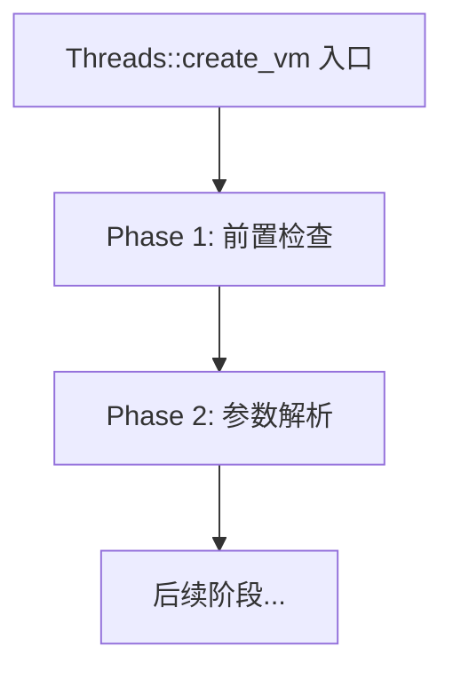

# Phase 1: 前置检查与基础初始化 深度解析

> 源码位置：`src/hotspot/share/runtime/thread.cpp:3876-3894`
> 目标：彻底理解 Threads::create_vm 第一阶段在做什么

---

## 第 0 部分：核心原理 ⭐

### 0.1 本质是什么？

本文分析 **Phase 1: 前置检查与基础初始化 深度解析** 的初始化过程：JVM 启动时该组件如何被创建、配置和激活，以及初始化顺序的约束关系。

### 0.2 为什么需要？

JVM 初始化顺序有严格的依赖关系——某些组件必须在其他组件之前初始化。理解初始化顺序有助于排查启动失败问题，也能理解各组件的设计约束。

### 0.3 怎么解决？

追踪初始化函数的调用链，分析每个初始化步骤的前置条件和后置效果，识别关键的初始化顺序约束。

### 0.4 为什么这样设计？

初始化顺序的设计原则：「被依赖的先初始化」。例如内存管理必须在 GC 之前初始化，GC 必须在类加载之前初始化。

---


## 1.1 整体定位

Phase 1 是 `Threads::create_vm` 的最开始部分，负责确保 JVM 运行的基础环境支持。



---

## 1.2 逐行源码分析

### 第3876行：函数签名

```cpp
jint Threads::create_vm(JavaVMInitArgs *args, bool *canTryAgain) {
```

**分析**：
- 返回类型：`jint`（JNI 错误码）
- 参数：
  - `args`：JVM 初始化参数（来自 JavaMain）
  - `canTryAgain`：输出参数，指示是否可以重试创建

---

### 第3879行：VM_Version::early_initialize()

```cpp
VM_Version::early_initialize();
```

**作用**：CPU 特性早期检测

**为什么需要**：
- 在创建任何线程之前，需要知道 CPU 支持哪些特性
- 例如：AVX、SSE、CRC32 等指令集
- 影响后续内存对齐、压缩指针模式等决策

**源码位置**：`src/hotspot/share/runtime/vmVersion.cpp`

---

### 第3882行：is_supported_jni_version()

```cpp
if (!is_supported_jni_version(args->version)) return JNI_EVERSION;
```

**作用**：检查 JNI 版本是否支持

**JNI 版本历史**：
| 版本 | JDK |
|------|-----|
| JNI_VERSION_1_1 | JDK 1.1 |
| JNI_VERSION_1_2 | JDK 1.2 |
| JNI_VERSION_1_4 | JDK 1.4 |
| JNI_VERSION_1_6 | JDK 6 |
| JNI_VERSION_1_8 | JDK 8 |
| JNI_VERSION_9 | JDK 9+ |

**返回值**：
- `JNI_OK` (0)：支持
- `JNI_EVERSION` (-1)：不支持

---

### 第3886行：ThreadLocalStorage::init()

```cpp
ThreadLocalStorage::init();
```

**作用**：初始化线程本地存储（TLS）

**为什么重要**：
- 这是让每个线程能够通过 `Thread::current()` 获取自己的 Thread 对象的基础
- 没有它，`Thread::current()` 无法工作

**底层实现**：
```cpp
// pthread key 创建
pthread_key_create(&_thread_key, NULL);
```

**GDB 验证**：
```gdb
# 查看 TLS 初始化后的状态
p ThreadLocalStorage::_thread_key
# 输出：$1 = -1（初始化前）

# 初始化后
p ThreadLocalStorage::_thread_key  
# 输出：$1 = 1234（有效的 pthread key）
```

---

### 第3890行：ostream_init()

```cpp
ostream_init();
```

**作用**：初始化输出流模块

**包含**：
- `tty`（标准输出）
- 日志文件流
- 错误输出流

---

### 第3894行：Arguments::process_sun_java_launcher_properties()

```cpp
Arguments::process_sun_java_launcher_properties(args);
```

**作用**：处理 Java 启动器属性

**处理的属性**：
- `sun.java.command`：启动命令
- `sun.java.launcher.*`：启动器相关属性

---

## 1.3 核心数据结构

### ThreadLocalStorage

```cpp
class ThreadLocalStorage {
private:
    static pthread_key_t _thread_key;
    static Thread* _thread_get_index;
    
public:
    static void init();
    static inline Thread* get_thread() {
        return pthread_getspecific(_thread_key);
    }
};
```

**关键点**：
- `_thread_key`：pthread 密钥，用于存储线程私有数据
- `get_thread()`：通过 pthread_getspecific 获取当前线程的 Thread 对象

---

## 1.4 GDB 验证实验

### 实验1：观察 Phase 1 执行

```gdb
# 设置断点
break thread.cpp:3876
commands
    silent
    printf "\n========== Threads::create_vm 入口 ==========\n"
    printf "args version = %d\n", args->version
    printf "canTryAgain = %p\n", canTryAgain
    bt 5
    continue
end

break thread.cpp:3886
commands
    silent
    printf "\n========== ThreadLocalStorage::init ==========\n"
    bt 3
    continue
end

run -Xms8g -Xmx8g -XX:+UseG1GC -Xint -cp /data/workspace/demo/src com.wjcoder.Main
```

### 预期输出

```
========== Threads::create_vm 入口 ==========
args version = 16  (JNI_VERSION_1_8)
canTryAgain = 0x7fffffffabcd

========== ThreadLocalStorage::init ==========
#0  ThreadLocalStorage::init() at threadLocalStorage.cpp:...
#1  Threads::create_vm() at thread.cpp:3886
```

---

## 1.5 总结

| 行号 | 函数 | 作用 | 重要性 |
|------|------|------|--------|
| 3879 | VM_Version::early_initialize() | CPU特性检测 | ⭐⭐⭐ |
| 3882 | is_supported_jni_version() | JNI版本检查 | ⭐⭐ |
| 3886 | ThreadLocalStorage::init() | TLS初始化 | ⭐⭐⭐⭐⭐ |
| 3890 | ostream_init() | 输出流初始化 | ⭐⭐ |
| 3894 | process_sun_java_launcher_properties() | 启动器属性 | ⭐ |

**核心发现**：
- `ThreadLocalStorage::init()` 是最关键的初始化
- 没有它，`Thread::current()` 无法工作
- 这是后续所有线程操作的基础

---

## 1.6 待深入

- [ ] ThreadLocalStorage 在不同平台（Linux/Windows）的实现差异
- [ ] pthread key 的生命周期管理
- [ ] 与 Java 层 ThreadLocal 的关系
