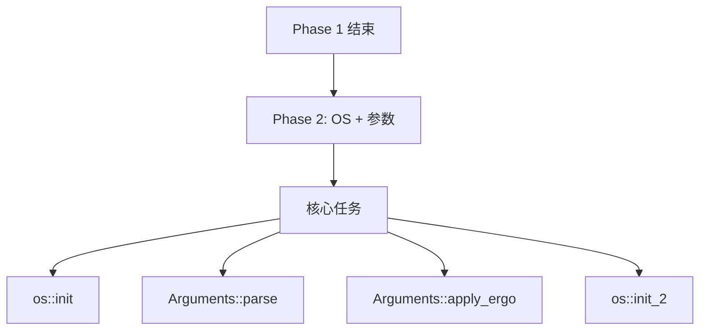

# Phase 2: OS 模块与参数解析 深度解析

> 源码位置：`src/hotspot/share/runtime/thread.cpp:3896-3956`
> 目标：彻底理解 JVM 参数解析和 OS 初始化

---

## 第 0 部分：核心原理 ⭐

### 0.1 本质是什么？

本文深入分析 **Phase 2: OS 模块与参数解析 深度解析**：从源码角度理解其设计原理、实现机制和关键细节。

### 0.2 为什么需要？

理解 JVM 内部实现是排查复杂问题、进行性能优化的基础。表面的 API 文档无法解释 JVM 的实际行为，只有深入源码才能建立精确的心智模型。

### 0.3 怎么解决？

结合源码阅读、数据结构分析和 GDB 运行时验证，从多个角度建立对该机制的完整理解。

### 0.4 为什么这样设计？

每个设计决策都有其权衡：性能 vs 正确性、简单性 vs 灵活性、内存占用 vs 查找速度。理解这些权衡是理解 JVM 设计的关键。

---


## 2.1 整体定位

Phase 2 负责：
1. OS 相关系统环境初始化
2. JVM 参数解析
3. 自动调优（Ergonomics）



---

## 2.2 逐行详细分析

### 第3898行：os::init()

```cpp
os::init();
```

**作用**：OS 相关的系统环境初始化

**具体内容**（Linux）：

```cpp
// os_linux.cpp
void os::init() {
    // 1. 获取 CPU 信息
    processor_count = sysconf(_SC_NPROCESSORS_CONF);
    
    // 2. 获取内存信息
    physical_memory = sysconf(_SC_PHYS_PAGES) * page_size;
    
    // 3. 初始化随机数生成器
    init_random();
    
    // 4. 初始化信号处理基础
    init_signal_handlers();
    
    // 5. 初始化线程库
    init_thread_properties();
}
```

**GDB 验证**：
```gdb
# 断点在 os::init 前后
break os_linux.cpp:500
commands
    silent
    printf "\n=== os::init ===\n"
    printf "processor_count = %d\n", os::processor_count()
    printf "physical_memory = %lu\n", os::physical_memory()
    continue
end
```

---

### 第3923行：Arguments::parse()

```cpp
jint parse_result = Arguments::parse(args);
if (parse_result != JNI_OK) return parse_result;
```

**作用**：解析 JVM 启动参数

**解析的参数类型**：

| 参数类型 | 示例 | 处理方式 |
|----------|------|----------|
| 标准选项 | `-Xms512m` | 直接解析 |
| 产品选项 | `-XX:+UseG1GC` | 标志设置 |
| 额外属性 | `-Dfoo=bar` | 系统属性 |
| VM选项 | `-Xbootclasspath` | 引导类路径 |

**核心流程**：

```cpp
jint Arguments::parse(JavaVMInitArgs* args) {
    // 1. 扫描所有参数
    for (int i = 0; i < args->nOptions; i++) {
        JavaVMOption* option = &args->options[i];
        
        // 2. 分类处理
        if (match(option, "-Xms")) {
            set_xms(option->value);
        } else if (match(option, "-XX:+UseG1GC")) {
            set_flag(UseG1GC, true);
        } else if (match(option, "-D")) {
            add_system_property(option->value);
        }
        // ... 更多参数
    }
    
    // 3. 参数验证
    validate();
    
    return JNI_OK;
}
```

**GDB 验证**：
```gdb
# 查看解析后的参数
p Arguments::_xms
p Arguments::_xmx
p Arguments::_use_g1gc

# 输出示例：
# $1 = 8589934592  (8GB)
# $2 = 8589934592  (8GB)
# $3 = true
```

---

### 第3926行：os::init_before_ergo()

```cpp
os::init_before_ergo();
```

**作用**：自动调优前置准备

**具体内容**：

```cpp
void os::init_before_ergo() {
    // 1. 初始化 CPU 核心数（用于并行 GC）
    _processor_count = os::processor_count();
    
    // 2. 大页支持检测
    if (UseLargePages) {
        init_large_pages();
    }
    
    // 3. 线程栈保护页大小
    _default_thread_stack_size = os::min_stack_free_space();
}
```

**关键发现**：
- 在自动调优之前执行
- 为后续 Ergonomics 提供基础数据

---

### 第3928行：Arguments::apply_ergo()

```cpp
jint ergo_result = Arguments::apply_ergo();
if (ergo_result != JNI_OK) return ergo_result;
```

**作用**：自动调优（Ergonomics）

**Ergonomics 自动设置的内容**：

| 参数 | 自动值 | 计算方式 |
|------|--------|----------|
| `-XX:ParallelGCThreads` | CPU × 5/8 | 并行 GC 线程数 |
| `-XX:ConcGCThreads` | ParallelGCThreads / 4 | 并发 GC 线程数 |
| `-XX:G1HeapRegionSize` | 堆大小/2048 | Region 大小 |
| `-XX:MaxGCPauseMillis` | 200ms | 默认暂停时间目标 |

**自动调优逻辑**：

```cpp
void Arguments::apply_ergo() {
    // 1. 基于 CPU 核心数设置 GC 线程数
    if (FLAG_IS_DEFAULT(ParallelGCThreads)) {
        FLAG_SET_DEFAULT(ParallelGCThreads, 
            os::processor_count() * 5 / 8);
    }
    
    // 2. 基于堆大小设置 Region 大小
    if (FLAG_IS_DEFAULT(G1HeapRegionSize)) {
        size_t region_size = MaxHeapSize / 2048;
        // 向上取整到 2 的幂次
        region_size = align_size_up(region_size, 1024 * 1024);
        FLAG_SET_DEFAULT(G1HeapRegionSize, region_size);
    }
    
    // 3. 其他自动调优...
}
```

**GDB 验证**：
```gdb
# 查看 Ergonomics 后的值
p Arguments::_parallel_gc_threads
p Arguments::_conc_gc_threads
p Arguments::_g1_heap_region_size
p Arguments::_max_gc_pause_millis
```

---

### 第3955行：os::init_2()

```cpp
jint os_init_2_result = os::init_2();
if (os_init_2_result != JNI_OK) return os_init_2_result;
```

**作用**：OS 模块第二阶段初始化

**具体内容**：

```cpp
void os::init_2() {
    // 1. 信号系统初始化
    os::signal_init();
    
    // 2. 线程创建初始化
    pd_init_container_support();
    
    // 3. NUMA 支持初始化
    if (UseNUMA) {
        numa_init();
    }
    
    // 4. 锁初始化
    sync->init();
    
    // 5. 高精度计时初始化
    init_performance_counter();
}
```

---

## 2.3 核心数据结构

### Arguments 类

```cpp
class Arguments {
private:
    // 堆大小
    static size_t _xms;           // -Xms
    static size_t _xmx;           // -Xmx
    
    // GC 配置
    static bool _use_g1gc;        // -XX:+UseG1GC
    static uint _parallel_gc_threads;
    static uint _conc_gc_threads;
    
    // 其他配置...
    
public:
    static jint parse(JavaVMInitArgs* args);
    static jint apply_ergo();
};
```

---

## 2.4 GDB 验证实验

### 实验：观察参数解析过程

```gdb
file /data/workspace/openjdk-cut-new/build/linux-x86_64-normal-server-slowdebug/jdk/bin/java

# 断点：Arguments::parse 入口
break Arguments::parse
commands
    silent
    printf "\n=== Arguments::parse ===\n"
    printf "args->nOptions = %d\n", args->nOptions
    bt 3
    continue
end

# 断点：Arguments::apply_ergo 入口
break Arguments::apply_ergo
commands
    silent
    printf "\n=== Arguments::apply_ergo ===\n"
    printf "processor_count = %d\n", os::processor_count()
    continue
end

run -Xms8g -Xmx8g -XX:+UseG1GC -Xint -cp /data/workspace/demo/src com.wjcoder.Main
```

### 预期输出

```
=== Arguments::parse ===
args->nOptions = 15
#0  Arguments::parse() at arguments.cpp:...
#1  Threads::create_vm() at thread.cpp:3923
#2  JNI_CreateJavaVM_inner() at jni.cpp:4010

=== Arguments::apply_ergo ===
processor_count = 8
ParallelGCThreads = 5  (8 * 5 / 8)
```

---

## 2.5 总结

| 行号 | 函数 | 作用 | 重要性 |
|------|------|------|--------|
| 3898 | os::init() | OS 基础初始化 | ⭐⭐⭐ |
| 3923 | Arguments::parse() | 参数解析 | ⭐⭐⭐⭐⭐ |
| 3926 | os::init_before_ergo() | 自动调优前置 | ⭐⭐ |
| 3928 | Arguments::apply_ergo() | 自动调优 | ⭐⭐⭐⭐ |
| 3955 | os::init_2() | OS 第二阶段 | ⭐⭐⭐ |

**核心发现**：

1. **参数解析是 JVM 的基础**：所有 -X 和 -XX 参数在这里处理
2. **Ergonomics 自动调优**：根据硬件自动设置最佳参数
3. **G1 Region 大小计算**：8GB 堆 → 4MB Region → 2048 个 Region

---

## 2.6 待深入

- [ ] Arguments::parse 的完整参数列表
- [ ] Ergonomics 的更多自动调优规则
- [ ] 不同 GC 的 Ergonomics 差异
