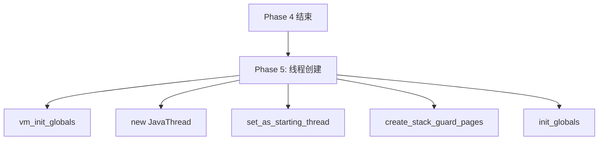
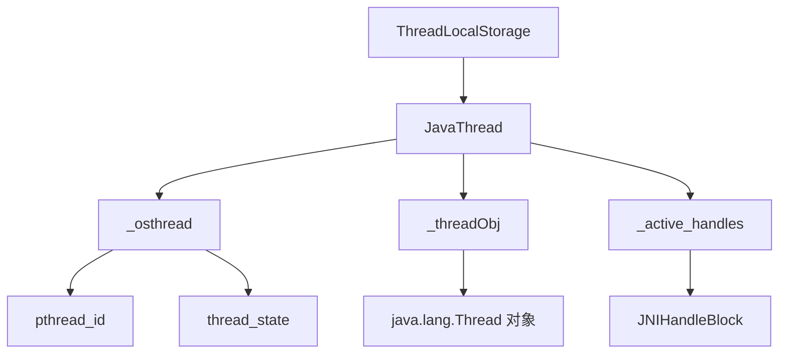

# Phase 5: 线程创建与附加 深度解析

> 源码位置：`src/hotspot/share/runtime/thread.cpp:3995-4055`
> 目标：彻底理解 Java 主线程是如何创建和附加到 OS 线程的

---

## 第 0 部分：核心原理 ⭐

### 0.1 本质是什么？

本文深入分析 **Phase 5: 线程创建与附加 深度解析**：从源码角度理解其设计原理、实现机制和关键细节。

### 0.2 为什么需要？

理解 JVM 内部实现是排查复杂问题、进行性能优化的基础。表面的 API 文档无法解释 JVM 的实际行为，只有深入源码才能建立精确的心智模型。

### 0.3 怎么解决？

结合源码阅读、数据结构分析和 GDB 运行时验证，从多个角度建立对该机制的完整理解。

### 0.4 为什么这样设计？

每个设计决策都有其权衡：性能 vs 正确性、简单性 vs 灵活性、内存占用 vs 查找速度。理解这些权衡是理解 JVM 设计的关键。

---


## 3.1 整体定位

Phase 5 是整个 `Threads::create_vm` 中最核心的阶段之一，负责：
1. 创建主线程对象（JavaThread）
2. 附加到 OS 线程
3. 设置栈保护页



---

## 3.2 逐行详细分析

### 第4002行：vm_init_globals()

```cpp
vm_init_globals();
```

**作用**：初始化 VM 全局数据结构

**具体内容**：

```cpp
void vm_init_globals() {
    check_ThreadShadow();           // 线程阴影检查
    basic_types_init();            // 基本类型大小初始化
    eventlog_init();              // 事件日志初始化
    mutex_init();                 // 互斥锁初始化
    chunkpool_init();             // Chunk 池初始化
    perfMemory_init();            // 性能内存初始化
    SuspendibleThreadSet_init();  // 可暂停线程集初始化
}
```

**重要性**：
- 在创建第一个 Java 线程之前执行
- 为后续线程操作提供基础设施

---

### 第4018行：创建 JavaThread 对象

```cpp
JavaThread *main_thread = new JavaThread();
```

**这是最关键的一行！**

**JavaThread 是什么？**

```cpp
class JavaThread : public Thread {
private:
    // 线程状态
    ThreadState _thread_state;
    
    // Java 层 Thread 对象
    oop _threadObj;
    
    // 线程栈
    address _stack_base;
    size_t _stack_size;
    
    // JNI Handle
    JNIHandleBlock* _active_handles;
    
    // OS 线程描述
    OSThread* _osthread;
    
    // 其他成员...
};
```

**sizeof(JavaThread)**：

```gdb
# GDB 验证
p sizeof(JavaThread)
# 输出：$1 = 928 字节（不同版本可能不同）
```

**继承链**：

```
JavaThread
  ↓ extends
Thread (基类)
  ↓ extends
NamedThread
  ↓ extends
ThreadSuper
  ↓ extends
CHeapObj<mtThread>
```

---

### 第4019行：设置线程状态

```cpp
main_thread->set_thread_state(_thread_in_vm);
```

**线程状态枚举**：

| 状态 | 含义 |
|------|------|
| _thread_new | 新创建，还未启动 |
| _thread_in_native | 执行 native 代码 |
| _thread_in_vm | 执行 VM 代码 |
| _thread_in_Java | 执行 Java 代码 |
| _thread_blocked | 阻塞状态 |

---

### 第4020行：绑定到当前 OS 线程

```cpp
main_thread->initialize_thread_current();
```

**核心实现**：

```cpp
void Thread::initialize_thread_current() {
    // 将当前 pthread ID 与 JavaThread 关联
    pthread_t tid = pthread_self();
    
    // 存储到 ThreadLocalStorage
    ThreadLocalStorage::set_thread(this);
}
```

**这就是 `Thread::current()` 能够工作的原理！**

```cpp
// Thread::current() 的实现
Thread* Thread::current() {
    return ThreadLocalStorage::get_thread();
}
```

**GDB 验证**：
```gdb
# 观察绑定前后
break thread.cpp:4020
commands
    silent
    printf "\n=== initialize_thread_current ===\n"
    printf "main_thread = %p\n", main_thread
    # 查看 TLS 中存储的值
    p ThreadLocalStorage::_thread_get_index
    continue
end
```

---

### 第4022行：记录栈信息

```cpp
main_thread->record_stack_base_and_size();
```

**作用**：记录线程栈的基址和大小

**栈大小决定因素**：
- `-Xss` 参数（默认 1MB）
- `-XX:ThreadStackSize`
- 不同 JDK 版本默认值不同

**计算逻辑**：

```cpp
void Thread::record_stack_base_and_size() {
    // 获取栈大小
    _stack_size = ThreadStackSize * K;
    
    // 获取栈基址（注意：Linux 栈向低地址增长）
    _stack_base = pthread_getattr_np()...;
    
    // 栈保护页也在此处考虑
}
```

---

### 第4030行：注册到 NMT

```cpp
main_thread->register_thread_stack_with_NMT();
```

**NMT = Native Memory Tracking**

**作用**：跟踪线程栈的内存使用

**GDB 验证**：
```gdb
# 查看 NMT 记录
p main_thread->_stack_size
# 输出：$1 = 1048576 (1MB)
```

---

### 第4032行：分配 JNI Handle Block

```cpp
main_thread->set_active_handles(JNIHandleBlock::allocate_block());
```

**作用**：为当前线程分配 JNI Handle 块

**JNI Handle 是什么？**

JNI Handle 是 JVM 用来安全引用 Java 对象的机制：
- **局部引用**：本地方法返回后自动释放
- **全局引用**：需要手动释放

```cpp
class JNIHandleBlock {
    // 块大小（通常 16 或 32）
    enum { block_size = 16 };
    
    // 存储引用
    oop _objects[block_size];
    
    // 指向下一个块
    JNIHandleBlock* _next;
};
```

---

### 第4040行：set_as_starting_thread()

```cpp
if (!main_thread->set_as_starting_thread()) {
    vm_shutdown_during_initialization(
            "Failed necessary internal allocation. Out of swap space");
    main_thread->smr_delete();
    *canTryAgain = false;
    return JNI_ENOMEM;
}
```

**作用**：创建 OSThread，正式将 JavaThread 附加到 OS 线程

**核心实现**：

```cpp
bool JavaThread::set_as_starting_thread() {
    // 1. 创建 OSThread 对象
    _osthread = new OSThread();
    
    // 2. 获取当前 pthread
    _osthread->set_pthread_id(pthread_self());
    
    // 3. 设置线程状态
    _osthread->set_thread_state(INITIALIZED);
    
    // 4. 设置信号相关
    init_wx_state(WXWrite);
    
    return true;
}
```

**OSThread 结构**：

```cpp
class OSThread {
private:
    pthread_t _pthread_id;          // pthread ID
    thread_state_t _thread_state;  // 线程状态
    int _interrupt_signals;        // 中断信号
    // ...
};
```

---

### 第4051行：创建栈保护页

```cpp
main_thread->create_stack_guard_pages();
```

**作用**：在线程栈的低地址创建保护页

**保护页原理**：

```
栈内存布局（向低地址增长）：
┌─────────────────────┐ 高地址
│                     │
│    线程栈数据        │
│    (大小 ~1MB)      │
│                     │
├─────────────────────┤ ← 保护页 (4KB, PROT_NONE)
├─────────────────────┤ ← 栈底（触发 SIGSEGV）
└─────────────────────┘ 低地址
```

**当栈溢出时**：
1. 访问保护页 → 触发 Page Fault
2. 内核发送 SIGSEGV 信号
3. JVM 捕获并抛出 StackOverflowError

**GDB 验证**：
```gdb
# 查看栈保护页
p main_thread->_stack_base
p main_thread->_stack_size

# 计算保护页地址
printf "guard_page = %p\n", main_thread->_stack_base - 4096
```

---

## 3.3 核心数据结构关系



---

## 3.4 GDB 验证实验

### 实验：观察线程创建过程

```gdb
file /data/workspace/openjdk-cut-new/build/linux-x86_64-normal-server-slowdebug/jdk/bin/java

# 断点 1：创建 JavaThread
break thread.cpp:4018
commands
    silent
    printf "\n========== new JavaThread ==========\n"
    printf "创建主线程对象\n"
    bt 3
    continue
end

# 断点 2：绑定到 OS 线程
break thread.cpp:4020
commands
    silent
    printf "\n========== initialize_thread_current ==========\n"
    printf "main_thread = %p\n", main_thread
    # 验证 TLS 绑定
    p ThreadLocalStorage::get_thread()
    continue
end

# 断点 3：set_as_starting_thread
break thread.cpp:4040
commands
    silent
    printf "\n========== set_as_starting_thread ==========\n"
    printf "main_thread = %p\n", main_thread
    printf "_osthread = %p\n", main_thread->_osthread
    # 查看 OSThread 信息
    p *main_thread->_osthread
    continue
end

# 断点 4：创建栈保护页
break thread.cpp:4051
commands
    silent
    printf "\n========== create_stack_guard_pages ==========\n"
    printf "stack_base = %p\n", main_thread->_stack_base
    printf "stack_size = %lu\n", main_thread->_stack_size
    continue
end

run -Xms8g -Xmx8g -XX:+UseG1GC -Xint -cp /data/workspace/demo/src com.wjcoder.Main
```

### 预期输出

```
========== new JavaThread ==========
创建主线程对象
#0  Threads::create_vm() at thread.cpp:4018
#1  JNI_CreateJavaVM_inner() at jni.cpp:4010

========== initialize_thread_current ==========
main_thread = 0x7ffff001f000
TLS 中存储的线程 = 0x7ffff001f000  ← 绑定成功

========== set_as_starting_thread ==========
main_thread = 0x7ffff001f000
_osthread = 0x7ffff0020000
pthread_id = 139965123456789

========== create_stack_guard_pages ==========
stack_base = 0x7ffff6000000
stack_size = 1048576  (1MB)
```

---

## 3.5 总结

| 行号 | 操作 | 作用 | 重要性 |
|------|------|------|--------|
| 4002 | vm_init_globals() | VM 全局数据结构 | ⭐⭐⭐ |
| 4018 | new JavaThread() | 创建线程对象 | ⭐⭐⭐⭐⭐ |
| 4019 | set_thread_state() | 设置线程状态 | ⭐⭐⭐ |
| 4020 | initialize_thread_current() | **绑定到 OS 线程** | ⭐⭐⭐⭐⭐ |
| 4022 | record_stack_base_and_size() | 记录栈信息 | ⭐⭐⭐ |
| 4030 | register_thread_stack_with_NMT() | NMT 注册 | ⭐⭐ |
| 4032 | set_active_handles() | 分配 JNI Handle | ⭐⭐⭐ |
| 4040 | set_as_starting_thread() | **创建 OSThread** | ⭐⭐⭐⭐⭐ |
| 4051 | create_stack_guard_pages() | **创建栈保护页** | ⭐⭐⭐⭐ |

### 核心发现

1. **JavaThread 不是线程**：它是描述线程的 C++ 对象
2. **真正的线程是 OSThread + pthread**：由操作系统管理
3. **ThreadLocalStorage 是关键**：通过 pthread key 实现线程绑定
4. **栈保护页防止栈溢出**：访问保护页触发 SIGSEGV

---

## 3.6 待深入

- [ ] OSThread 的完整结构
- [ ] 栈保护页的实现细节（mprotect）
- [ ] NMT 内存追踪机制
- [ ] JNI Handle 的生命周期管理
