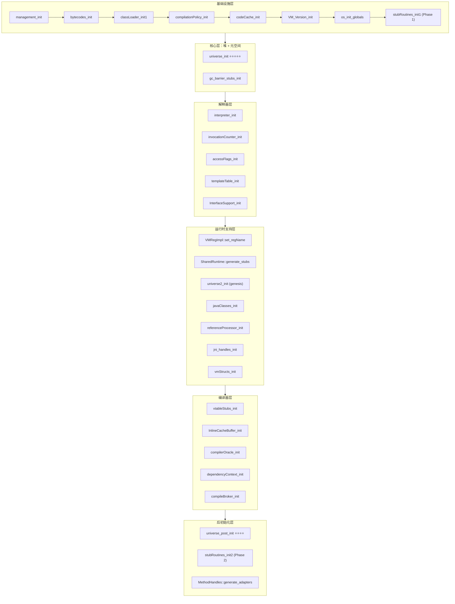
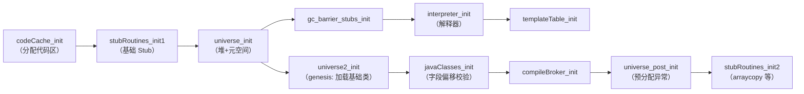

# Phase 6: init_globals() — JVM 核心模块初始化总控

> **源码位置**：`src/hotspot/share/runtime/init.cpp:104-168`
> **调用链**：`JNI_CreateJavaVM` → `Threads::create_vm(thread.cpp:4060)` → `init_globals()`
> **标准条件**：`-Xms8g -Xmx8g -XX:+UseG1GC -Xint`

---

## 第 0 部分：核心原理 ⭐

### 0.1 本质是什么？

本文分析 **Phase 6: init_globals() — JVM 核心模块初始化总控** 的初始化过程：JVM 启动时该组件如何被创建、配置和激活，以及初始化顺序的约束关系。

### 0.2 为什么需要？

JVM 初始化顺序有严格的依赖关系——某些组件必须在其他组件之前初始化。理解初始化顺序有助于排查启动失败问题，也能理解各组件的设计约束。

### 0.3 怎么解决？

追踪初始化函数的调用链，分析每个初始化步骤的前置条件和后置效果，识别关键的初始化顺序约束。

### 0.4 为什么这样设计？

初始化顺序的设计原则：「被依赖的先初始化」。例如内存管理必须在 GC 之前初始化，GC 必须在类加载之前初始化。

---


## 一、为什么 init_globals 是最核心的初始化？

JVM 启动分 12 个 Phase，而 `init_globals()` 是 Phase 6 —— **它负责初始化 JVM 运行所需的全部核心子系统**。在 `init_globals` 执行之前，JVM 只是一个空壳（有了线程、有了参数解析，但没有堆、没有解释器、没有字节码表）。执行完之后，JVM 就具备了执行 Java 代码的全部能力。

一句话总结：**`init_globals()` 把一个"刚出生的进程"变成一个"能跑 Java 的虚拟机"。**

---

## 二、完整调用序列（29 个函数）



### 完整调用表

> 源码：`init.cpp:104-168`

| # | 函数 | 源码位置 | 核心作用 | 重要性 |
|---|------|---------|---------|--------|
| 1 | `management_init()` | management.cpp:84 | JMX 管理接口 + 线程/类加载监控 | ⭐⭐ |
| 2 | `bytecodes_init()` | bytecodes.cpp:561 | 初始化 239 条字节码属性表 | ⭐⭐⭐ |
| 3 | `classLoader_init1()` | classLoader.cpp:1840 | 类加载器第一阶段初始化 | ⭐⭐ |
| 4 | `compilationPolicy_init()` | compilationPolicy.cpp:61 | 创建编译策略对象 | ⭐⭐⭐ |
| 5 | `codeCache_init()` | codeCache.cpp:1128 | 分配 Code Cache 内存区域 | ⭐⭐⭐⭐ |
| 6 | `VM_Version_init()` | vm_version.cpp:33 | 检测 CPU 特性（指令集支持） | ⭐⭐ |
| 7 | `os_init_globals()` | os.cpp:91 | OS 全局初始化（空方法） | ⭐ |
| 8 | `stubRoutines_init1()` | stubRoutines.cpp:410 | 生成第一批 Stub 汇编代码 | ⭐⭐⭐⭐ |
| 9 | **`universe_init()`** | **universe.cpp:681** | **堆 + 元空间 + 符号表** | **⭐⭐⭐⭐⭐** |
| 10 | `gc_barrier_stubs_init()` | barrierSet.cpp:47 | GC 屏障 Stub（G1 下为空） | ⭐ |
| 11 | `interpreter_init()` | interpreter.cpp:115 | 解释器代码生成 | ⭐⭐⭐⭐ |
| 12 | `invocationCounter_init()` | invocationCounter.cpp:169 | 方法调用计数器阈值 | ⭐⭐ |
| 13 | `accessFlags_init()` | accessFlags.cpp:74 | assert sizeof(AccessFlags)==4 | ⭐ |
| 14 | `templateTable_init()` | templateTable.cpp:547 | 字节码→汇编模板映射 | ⭐⭐⭐⭐ |
| 15 | `InterfaceSupport_init()` | interfaceSupport.cpp:264 | Debug 模式随机 GC 种子 | ⭐ |
| 16 | `VMRegImpl::set_regName()` | — | 设置寄存器名称 | ⭐ |
| 17 | `SharedRuntime::generate_stubs()` | sharedRuntime.cpp:100 | 方法解析 + 反优化 Stub | ⭐⭐⭐⭐ |
| 18 | **`universe2_init()`** | **universe.cpp:1200** | **genesis：加载基础类** | **⭐⭐⭐⭐⭐** |
| 19 | `javaClasses_init()` | javaClasses.cpp:4597 | 计算 Java 类字段偏移量 | ⭐⭐⭐ |
| 20 | `referenceProcessor_init()` | referenceProcessor.cpp:46 | 引用处理器静态初始化 | ⭐⭐ |
| 21 | `jni_handles_init()` | jniHandles.cpp:341 | JNI 句柄管理 | ⭐⭐ |
| 22 | `vmStructs_init()` | vmStructs.cpp:3207 | SA 调试元信息（debug 模式） | ⭐ |
| 23 | `vtableStubs_init()` | vtableStubs.cpp:296 | 虚方法分派 Stub | ⭐⭐⭐ |
| 24 | `InlineCacheBuffer_init()` | icBuffer.cpp:167 | 内联缓存缓冲区 | ⭐⭐ |
| 25 | `compilerOracle_init()` | compilerOracle.cpp:767 | 解析 CompileCommand 参数 | ⭐⭐ |
| 26 | `dependencyContext_init()` | dependencyContext.cpp:39 | 编译代码依赖跟踪 | ⭐⭐ |
| 27 | `compileBroker_init()` | compileBroker.cpp:235 | 编译指令栈初始化 | ⭐⭐⭐ |
| 28 | **`universe_post_init()`** | **universe.cpp:1210** | **预分配异常 + 堆后初始化** | **⭐⭐⭐⭐** |
| 29 | `stubRoutines_init2()` | stubRoutines.cpp:411 | 第二批 Stub（arraycopy 等） | ⭐⭐⭐ |
| 30 | `MethodHandles::generate_adapters()` | methodHandles.cpp:75 | MethodHandle 适配器 | ⭐⭐ |

---

## 三、分层详解

### 3.1 基础设施层（#1 ~ #8）

这一层为后续初始化"打地基"：建立字节码表、分配代码缓存区域、检测 CPU 特性、生成第一批汇编桩代码。

#### 3.1.1 management_init() — JMX 管理接口

> 源码：`src/hotspot/share/services/management.cpp:84-93`

```cpp
// management.cpp:84
void management_init() {
#if INCLUDE_MANAGEMENT
  Management::init();           // JMX 核心：创建 VM 时间戳计数器
  ThreadService::init();        // 线程监控：死锁检测、线程 dump
  RuntimeService::init();       // 运行时监控：VM 启动时间
  ClassLoadingService::init();  // 类加载监控：已加载类数量
#else
  ThreadService::init();
#endif
}
```

**作用**：初始化 `java.lang.management` 包背后的 C++ 实现。`jconsole`、`VisualVM` 看到的所有 JMX MBean 数据都来自这里。

#### 3.1.2 bytecodes_init() — 字节码属性表

> 源码：`src/hotspot/share/interpreter/bytecodes.cpp:561-563` → `Bytecodes::initialize()` (268-558)

**解决什么问题？** 解释器、编译器、字节码验证器都需要查询字节码的属性（名称、操作数格式、栈效果、是否可能抛异常）。`bytecodes_init()` 构建的就是这张查询表。

```cpp
// bytecodes.cpp:561
void bytecodes_init() {
  Bytecodes::initialize();  // 注册全部字节码
}
```

`Bytecodes::initialize()` 通过 `def()` 宏为每条字节码注册 7 个属性：

```cpp
// bytecodes.cpp:268-539 （截取典型条目）
//  字节码                名称                格式     宽格式   结果类型  栈效果  是否trap
def(_nop,              "nop",              "b",    NULL,   T_VOID,    0, false);
def(_iconst_0,         "iconst_0",         "b",    NULL,   T_INT,     1, false);
def(_invokevirtual,    "invokevirtual",    "bJJ",  NULL,   T_ILLEGAL, -1, true);
def(_new,              "new",              "bkk",  NULL,   T_OBJECT,  1, true);
// ... 共 239 条
```

其中：
- 标准 Java 字节码：0x00(`nop`) ~ 0xC9(`jsr_w`) + `breakpoint`(0xCA) = 约 202 条
- JVM 内部优化字节码：`fast_agetfield`、`fast_iload` 等 = 约 37 条
- **总计 239 条**（`Bytecodes::number_of_codes = 239`）

`def()` 为每条字节码设置的属性含义：

| 参数 | 含义 | 示例 |
|------|------|------|
| 格式串 `"bJJ"` | b=字节码本身，J=本地字节序的2字节索引 | `invokevirtual` 占 3 字节 |
| 宽格式 `"wbii"` | w=wide前缀，i=Java字节序的2字节索引 | `iload` 的 wide 版本占 4 字节 |
| 结果类型 | 执行后栈顶类型 | `T_INT`=整数，`T_ILLEGAL`=不确定 |
| 栈效果 | 对操作数栈深度的影响 | `iconst_0` 是 +1，`iadd` 是 -1 |
| can_trap | 是否可能抛异常 | `idiv` 可能 ArithmeticException |

**GDB 验证**：

```
(gdb) p Bytecodes::number_of_codes
$1 = 239
(gdb) p Bytecodes::_is_initialized
$2 = 1 (true)
(gdb) p Bytecodes::_name[0]       // _nop
$3 = "nop"
(gdb) p Bytecodes::_name[3]       // _iconst_0
$4 = "iconst_0"
(gdb) p Bytecodes::_name[182]     // _invokevirtual
$5 = "invokevirtual"
(gdb) p Bytecodes::_name[187]     // _new
$6 = "new"
```

#### 3.1.3 compilationPolicy_init() — 编译策略

> 源码：`src/hotspot/share/runtime/compilationPolicy.cpp:61-100`

**解决什么问题？** JVM 需要决定：什么时候把热点方法从解释执行切换到 JIT 编译？用 C1 快速编译还是 C2 深度优化？

```cpp
// compilationPolicy.cpp:61
void compilationPolicy_init() {
  // 启动期间延迟编译，避免在初始化时触发 JIT
  CompilationPolicy::set_in_vm_startup(DelayCompilationDuringStartup);  // true

  switch(CompilationPolicyChoice) {
  case 0:
    CompilationPolicy::set_policy(new SimpleCompPolicy());          // 仅 C1 或仅 C2
    break;
  case 1:
    CompilationPolicy::set_policy(new StackWalkCompPolicy());       // 仅 C2（基于栈扫描）
    break;
  case 2:
    CompilationPolicy::set_policy(new TieredThresholdPolicy());     // 分层编译（默认）
    break;
  }
  CompilationPolicy::policy()->initialize();  // 计算编译线程数 + 设置阈值
}
```

**标准条件下的行为**：由于我们使用 `-Xint`（纯解释模式），`CompilationPolicyChoice = 0`，创建 `SimpleCompPolicy`。正常情况下默认 `CompilationPolicyChoice = 2`（分层编译）。

**GDB 验证**：

```
(gdb) p CompilationPolicyChoice
$1 = 0                                    // -Xint 模式下
(gdb) p CompilationPolicy::_policy
$2 = (CompilationPolicy *) 0x7ffff002ef90
(gdb) p CompilationPolicy::_in_vm_startup
$3 = 1 (true)                             // 启动期间延迟编译
```

#### 3.1.4 codeCache_init() — 代码缓存

> 源码：`src/hotspot/share/code/codeCache.cpp:1128-1132` → `CodeCache::initialize()` (175-314)

**解决什么问题？** JIT 编译生成的机器码、解释器代码、Stub 代码都需要一块可执行的内存区域来存放。Code Cache 就是这块区域。

```cpp
// codeCache.cpp:1128
void codeCache_init() {
  CodeCache::initialize();   // 分配并初始化代码缓存
  AOTLoader::initialize();   // 默认不启用 AOT
}
```

`CodeCache::initialize()` 的核心工作（`codeCache.cpp:175-314`）：

1. **计算三个堆的大小**（当分段代码缓存启用时）：

```
Code Cache 内存布局（分段模式）：
---------- high -----------
   Non-profiled nmethods    ← Tier 1/4 编译代码
     Profiled nmethods      ← Tier 2/3 编译代码
       Non-nmethods         ← Stub、适配器、VM 代码
---------- low  -----------
```

2. **预留一整块连续内存**，然后切分：

```cpp
// codeCache.cpp:302-313
ReservedCodeSpace rs = reserve_heap_memory(cache_size);  // 一次性预留
ReservedSpace non_method_space    = rs.first_part(non_nmethod_size);
ReservedSpace rest                = rs.last_part(non_nmethod_size);
ReservedSpace profiled_space      = rest.first_part(profiled_size);
ReservedSpace non_profiled_space  = rest.last_part(profiled_size);

add_heap(non_method_space, "CodeHeap 'non-nmethods'", CodeBlobType::NonNMethod);
add_heap(profiled_space, "CodeHeap 'profiled nmethods'", CodeBlobType::MethodProfiled);
add_heap(non_profiled_space, "CodeHeap 'non-profiled nmethods'", CodeBlobType::MethodNonProfiled);
```

**GDB 验证**（`-Xint` 模式）：

```
(gdb) p CodeCache::_low_bound
$1 = 0x7fffed000000
(gdb) p CodeCache::_high_bound
$2 = 0x7ffff0000000
(gdb) p CodeCache::_heaps->_len
$3 = 1                                    // -Xint 模式只有 1 个堆（不分段）
(gdb) p ReservedCodeCacheSize
$4 = 50331648                              // 48 MB
(gdb) p (CodeCache::_high_bound - CodeCache::_low_bound)
$5 = 50331648                              // 48 MB = 0x3000000
```

> **注意**：`-Xint` 模式下只有 1 个 CodeHeap（因为不需要 JIT 编译堆）。正常分层编译模式下会有 3 个堆。

**JVM 参数**：`-XX:ReservedCodeCacheSize=<size>` 设置代码缓存总大小，默认 240MB（非 `-Xint`）或 48MB（`-Xint`）。

#### 3.1.5 stubRoutines_init1() — 第一批 Stub 汇编代码

> 源码：`src/hotspot/share/runtime/stubRoutines.cpp:195-231` → `StubRoutines::initialize1()`

**解决什么问题？** JVM 运行时有很多关键操作（C++ 调用 Java、异常处理、原子操作）需要极高性能，不能用 C++ 函数调用开销。所以预先生成一批汇编代码片段（Stub），直接跳转执行。

**为什么分两阶段？** 第一阶段生成 universe_init 需要的基础 Stub（call_stub、异常处理、原子操作），第二阶段生成依赖 Universe 的 Stub（arraycopy、加密算法等）。

```cpp
// stubRoutines.cpp:195
void StubRoutines::initialize1() {
  if (_code1 == NULL) {
    ResourceMark rm;
    TraceTime timer("StubRoutines generation 1", TRACETIME_LOG(Info, startuptime));
    // 在 NonNMethodCodeHeap 中分配 30000 字节
    _code1 = BufferBlob::create("StubRoutines (1)", code_size1);
    CodeBuffer buffer(_code1);
    StubGenerator_generate(&buffer, false);  // false = 第一阶段
  }
}
```

**第一阶段生成的 Stub**：

| Stub | 作用 | 入口地址（GDB 验证） |
|------|------|---------------------|
| `call_stub` | C++ 调用 Java 方法的入口 | `0x7fffed000c9e` |
| `forward_exception` | 异常转发 | `0x7fffed000c20` |
| `catch_exception` | 异常捕获 | `0x7fffed000e50` |
| `atomic_xchg` | 原子交换操作 | `0x7fffed000f08` |
| `atomic_cmpxchg` | 原子比较交换（CAS） | — |
| `fence` | 内存屏障 | `0x7fffed000f43` |

**GDB 验证**：

```
(gdb) p StubRoutines::_code1
$1 = (BufferBlob *) 0x7fffed000b90        // 第一阶段代码块
(gdb) p StubRoutines::_call_stub_entry
$2 = 0x7fffed000c9e                        // C++ 调 Java 的入口
(gdb) p StubRoutines::_forward_exception_entry
$3 = 0x7fffed000c20
(gdb) p StubRoutines::_atomic_xchg_entry
$4 = 0x7fffed000f08
(gdb) p StubRoutines::_fence_entry
$5 = 0x7fffed000f43
```

**JVM 参数**：`-Xlog:startuptime` 可以看到 Stub 生成耗时：
```
[0.023s][info][startuptime] StubRoutines generation 1, 0.0012 secs
```

---

### 3.2 核心层：universe_init() — 堆 + 元空间 + 符号表

> 源码：`src/hotspot/share/memory/universe.cpp:681-873`
> **独立深入文档**：[5-universe_init-Deep-Dive.md](5-universe_init-Deep-Dive.md)、[6-G1CollectedHeap-initialize-Deep-Dive.md](6-G1CollectedHeap-initialize-Deep-Dive.md)

**这是整个 init_globals 中最关键的一步。** 执行完 `universe_init()` 后，JVM 拥有了：
- Java 堆（G1CollectedHeap，8GB，2048 个 Region）
- 元空间（Metaspace，存储类元数据）
- 符号表（SymbolTable）和字符串表（StringTable）
- 压缩指针配置

```cpp
// universe.cpp:681
jint universe_init() {
  TraceTime timer("Genesis", TRACETIME_LOG(Info, startuptime));

  // 1. 计算 Java 类字段偏移量（JVM 直接访问 java.lang.String._value 等字段需要）
  JavaClasses::compute_hard_coded_offsets();

  // 2. 初始化堆 ⭐⭐⭐
  jint status = Universe::initialize_heap();
  if (status != JNI_OK) return status;

  // 3. 创建 VM 内部弱引用容器
  SystemDictionary::initialize_oop_storage();

  // 4. 初始化 Metaspace ⭐⭐⭐
  Metaspace::global_initialize();

  // 5. 初始化性能计数器（jstat 监控用）
  MetaspaceCounters::initialize_performance_counters();
  CompressedClassSpaceCounters::initialize_performance_counters();

  // 6. Bootstrap ClassLoader 数据
  ClassLoaderData::init_null_class_loader_data();

  // 7. 创建 6 个方法缓存对象（此时只是空壳，真正初始化在 universe_post_init）
  Universe::_finalizer_register_cache = new LatestMethodCache();     // Finalizer.register()
  Universe::_loader_addClass_cache    = new LatestMethodCache();     // ClassLoader.addClass()
  Universe::_pd_implies_cache         = new LatestMethodCache();     // ProtectionDomain 安全检查
  Universe::_throw_illegal_access_error_cache = new LatestMethodCache();
  Universe::_throw_no_such_method_error_cache = new LatestMethodCache();
  Universe::_do_stack_walk_cache = new LatestMethodCache();          // 栈遍历回调

  // 8. 创建符号表和字符串表 ⭐⭐⭐
  SymbolTable::create_table();
  StringTable::create_table();
  ResolvedMethodTable::create_table();

  return JNI_OK;
}
```

**`Universe::initialize_heap()` 内部**（`universe.cpp:924-1008`）：

```cpp
jint Universe::initialize_heap() {
  _collectedHeap = create_heap();                    // 创建 G1CollectedHeap 对象
  jint status = _collectedHeap->initialize();        // G1CollectedHeap::initialize() —— 详见独立文档
  ThreadLocalAllocBuffer::set_max_size(heap()->max_tlab_size());  // TLAB 最大 = Region/2 = 2MB

  // 设置压缩指针模式
  if (UseCompressedOops) {
    if (heap_end > 4GB)  set_narrow_oop_shift(3);    // 需要移位
    if (heap_end <= 32GB) set_narrow_oop_base(0);    // ZeroBased 模式
  }

  if (UseTLAB) ThreadLocalAllocBuffer::startup_initialization();
  return JNI_OK;
}
```

**GDB 验证**：

```
(gdb) p Universe::_collectedHeap
$1 = (CollectedHeap *) 0x7ffff0031bb0
(gdb) p Universe::_narrow_oop._base
$2 = 0x0                                  // ZeroBased 模式：base = 0
(gdb) p Universe::_narrow_oop._shift
$3 = 3                                     // shift = 3（8字节对齐 → 32GB 寻址）
(gdb) p SymbolTable::_the_table
$4 = (SymbolTable *) 0x7ffff0c90ec0
(gdb) p StringTable::_the_table
$5 = (StringTable *) 0x7ffff0c90fa0
(gdb) p Universe::_finalizer_register_cache
$6 = (LatestMethodCache *) 0x7ffff0c90ce0
```

**JVM 参数**：
- `-Xlog:startuptime` 输出：`[info][startuptime] Genesis, 0.2843 secs`
- `-Xlog:gc+heap+coops` 输出：`Heap address: 0x0000000600000000, size: 8192 MB, Compressed Oops mode: Zero based, Oop shift amount: 3`

---

### 3.3 解释器层（#10 ~ #15）

#### 3.3.1 interpreter_init() — 解释器代码生成

> 源码：`src/hotspot/share/interpreter/interpreter.cpp:115-134`

**解决什么问题？** Java 方法最初都是解释执行的。解释器为每条字节码生成一段汇编代码（codelet），运行时直接跳转到对应 codelet 执行。

```cpp
// interpreter.cpp:115
void interpreter_init() {
  Interpreter::initialize();    // 生成解释器入口代码
  // 注册解释器代码区供性能分析工具使用
  Forte::register_stub("Interpreter",
    AbstractInterpreter::code()->code_start(),
    AbstractInterpreter::code()->code_end());
  // 通知 JVMTI
  if (JvmtiExport::should_post_dynamic_code_generated()) {
    JvmtiExport::post_dynamic_code_generated("Interpreter",
      AbstractInterpreter::code()->code_start(),
      AbstractInterpreter::code()->code_end());
  }
}
```

`Interpreter::initialize()` 内部会调用 `TemplateInterpreterGenerator::generate_all()`，为所有字节码生成本地代码入口。

#### 3.3.2 templateTable_init() — 字节码模板

> 源码：`src/hotspot/share/interpreter/templateTable.cpp:547-549`

```cpp
void templateTable_init() {
  TemplateTable::initialize();
}
```

**TemplateTable** 为每条字节码定义一个 **Template**，包含：
- 生成函数指针（用于生成该字节码的汇编代码）
- 栈顶状态（TosState）——执行前/后栈顶值在哪个寄存器

这是模板解释器（TemplateInterpreter）的核心数据结构。

#### 3.3.3 其他解释器相关

| 函数 | 源码 | 作用 |
|------|------|------|
| `gc_barrier_stubs_init()` | barrierSet.cpp:47 | 生成 GC 屏障汇编 Stub。G1 的实现在 `G1BarrierSetAssembler::barrier_stubs_init()`，**但在当前版本中是空实现** |
| `invocationCounter_init()` | invocationCounter.cpp:169 | 设置方法调用计数器的阈值。调用 `InvocationCounter::reinitialize(true)`，`true` 表示启动期间延迟编译 |
| `accessFlags_init()` | accessFlags.cpp:74 | 只有一个 assert：`assert(sizeof(AccessFlags) == sizeof(jint))`，确保 4 字节 |
| `InterfaceSupport_init()` | interfaceSupport.cpp:264 | 仅 debug 模式生效。如果 `ScavengeALot` 或 `FullGCALot` 开启，初始化随机 GC 触发种子 |

---

### 3.4 运行时支持层（#16 ~ #22）

#### 3.4.1 SharedRuntime::generate_stubs() — 方法解析与反优化

> 源码：`src/hotspot/share/runtime/sharedRuntime.cpp:100-124`

**解决什么问题？** 当一个编译后的方法被调用时，可能遇到：方法被重定义了（wrong method）、内联缓存 miss、需要从编译代码回退到解释执行（反优化）。这些场景都需要专门的 Stub 处理。

```cpp
// sharedRuntime.cpp:100
void SharedRuntime::generate_stubs() {
  _wrong_method_blob          = generate_resolve_blob(..., "wrong_method_stub");
  _wrong_method_abstract_blob = generate_resolve_blob(..., "wrong_method_abstract_stub");
  _ic_miss_blob               = generate_resolve_blob(..., "ic_miss_stub");
  _resolve_opt_virtual_call_blob = generate_resolve_blob(..., "resolve_opt_virtual_call");
  _resolve_virtual_call_blob  = generate_resolve_blob(..., "resolve_virtual_call");
  _resolve_static_call_blob   = generate_resolve_blob(..., "resolve_static_call");

  _polling_page_safepoint_handler_blob = generate_handler_blob(..., POLL_AT_LOOP);
  _polling_page_return_handler_blob    = generate_handler_blob(..., POLL_AT_RETURN);

  generate_deopt_blob();           // 反优化入口

#ifdef COMPILER2
  generate_uncommon_trap_blob();   // uncommon trap 处理
#endif
}
```

**GDB 验证**：

```
(gdb) p SharedRuntime::_wrong_method_blob
$1 = (RuntimeStub *) 0x7fffed008190
(gdb) p SharedRuntime::_ic_miss_blob
$2 = (RuntimeStub *) 0x7fffed114090
(gdb) p SharedRuntime::_resolve_static_call_blob
$3 = (RuntimeStub *) 0x7fffed113790
(gdb) p SharedRuntime::_resolve_virtual_call_blob
$4 = (RuntimeStub *) 0x7fffed113a90
(gdb) p SharedRuntime::_polling_page_safepoint_handler_blob
$5 = (SafepointBlob *) 0x7fffed112a90
```

#### 3.4.2 universe2_init() → Universe::genesis() — 创世

> 源码：`src/hotspot/share/memory/universe.cpp:322-463`

**这是 JVM 的"创世"阶段**——加载最基础的 Java 类型，让 JVM 能表示 Java 对象。

```cpp
// universe.cpp:1200
void universe2_init() {
  EXCEPTION_MARK;
  Universe::genesis(CATCH);
}
```

`Universe::genesis()` 做了什么（`universe.cpp:322-463`）：

```cpp
void Universe::genesis(TRAPS) {
  // 1. 创建 8 种基本类型数组的 Klass
  _boolArrayKlassObj   = TypeArrayKlass::create_klass(T_BOOLEAN, sizeof(jboolean), CHECK);
  _charArrayKlassObj   = TypeArrayKlass::create_klass(T_CHAR,    sizeof(jchar),    CHECK);
  _singleArrayKlassObj = TypeArrayKlass::create_klass(T_FLOAT,   sizeof(jfloat),   CHECK);
  _doubleArrayKlassObj = TypeArrayKlass::create_klass(T_DOUBLE,  sizeof(jdouble),  CHECK);
  _byteArrayKlassObj   = TypeArrayKlass::create_klass(T_BYTE,    sizeof(jbyte),    CHECK);
  _shortArrayKlassObj  = TypeArrayKlass::create_klass(T_SHORT,   sizeof(jshort),   CHECK);
  _intArrayKlassObj    = TypeArrayKlass::create_klass(T_INT,     sizeof(jint),     CHECK);
  _longArrayKlassObj   = TypeArrayKlass::create_klass(T_LONG,    sizeof(jlong),    CHECK);

  // 2. 初始化 VM Symbols（类名、方法名符号）
  vmSymbols::initialize(CHECK);

  // 3. 初始化 SystemDictionary（加载 Object、Class、String 等核心类）
  SystemDictionary::initialize(CHECK);

  // 4. 内化关键字符串
  _the_null_string     = StringTable::intern("null", CHECK);
  _the_min_jint_string = StringTable::intern("-2147483648", CHECK);

  // 5. 设置数组共享接口（Cloneable + Serializable）
  _the_array_interfaces_array->at_put(0, SystemDictionary::Cloneable_klass());
  _the_array_interfaces_array->at_put(1, SystemDictionary::Serializable_klass());

  // 6. 初始化基本类型 Klass（设置 super、vtable 等）
  initialize_basic_type_klass(boolArrayKlassObj(), CHECK);
  // ... 8 种类型
  
  // 7. 创建 Object[] 的 Klass
  _objectArrayKlassObj = InstanceKlass::cast(SystemDictionary::Object_klass())->array_klass(1, CHECK);
}
```

**GDB 验证**：

```
(gdb) p Universe::_boolArrayKlassObj
$1 = (Klass *) 0x800000040
(gdb) p Universe::_intArrayKlassObj
$2 = (Klass *) 0x800000c40
(gdb) p Universe::_longArrayKlassObj
$3 = (Klass *) 0x800000e40
(gdb) p Universe::_objectArrayKlassObj
$4 = (Klass *) 0x800013778
(gdb) p Universe::_the_null_string
$5 = (narrowOop) 0x7ffc04d30         // "null" 字符串
```

> 注意 Klass 地址 `0x800000040` 在 Metaspace 的压缩类空间中（CompressedClassSpace 基地址 = `0x800000000`）。

#### 3.4.3 javaClasses_init() — Java 类字段偏移校验

> 源码：`src/hotspot/share/classfile/javaClasses.cpp:4597-4601`

```cpp
void javaClasses_init() {
  JavaClasses::compute_offsets();     // 计算所有 Java 核心类字段在 C++ 中的偏移量
  JavaClasses::check_offsets();       // 校验偏移量正确性
  FilteredFieldsMap::initialize();    // 初始化字段过滤映射
}
```

**为什么需要？** JVM 内部的 C++ 代码需要直接访问 Java 对象的字段（比如 `java.lang.String.value`）。这些字段的偏移量在类加载时计算，这里做一次全局校验。

#### 3.4.4 其他运行时支持

| 函数 | 源码 | 作用 |
|------|------|------|
| `referenceProcessor_init()` | referenceProcessor.cpp:46 | `ReferenceProcessor::init_statics()`，初始化 Soft/Weak/Phantom/Final 引用处理器的静态成员 |
| `jni_handles_init()` | jniHandles.cpp:341 | `JNIHandles::initialize()`，初始化 JNI 全局/局部引用管理 |
| `vmStructs_init()` | vmStructs.cpp:3207 | `VMStructs::init()`，注册 JVM 内部数据结构元信息供 SA（Serviceability Agent）使用。**仅 debug 模式** |

---

### 3.5 编译器层（#23 ~ #27）

#### 3.5.1 vtableStubs_init() — 虚方法分派 Stub

> 源码：`src/hotspot/share/code/vtableStubs.cpp:296-298`

```cpp
void vtableStubs_init() {
  VtableStubs::initialize();
}
```

**解决什么问题？** Java 的多态调用（`obj.method()`）需要通过 vtable 找到实际方法。VtableStub 是为每个 vtable index 生成的小段汇编代码，直接做 `vtable[index]` 跳转，避免 C++ 函数调用开销。

#### 3.5.2 compileBroker_init() — 编译代理

> 源码：`src/hotspot/share/compiler/compileBroker.cpp:235-251`

```cpp
bool compileBroker_init() {
  if (LogEvents) {
    _compilation_log = new CompilationLog();
  }
  DirectivesStack::init();                       // 初始化编译指令栈（添加默认指令）
  if (DirectivesParser::has_file()) {
    return DirectivesParser::parse_from_flag();   // 解析 -XX:CompilerDirectivesFile
  }
  return true;
}
```

#### 3.5.3 其他编译器支持

| 函数 | 源码 | 作用 |
|------|------|------|
| `InlineCacheBuffer_init()` | icBuffer.cpp:167 | 初始化内联缓存缓冲区。在 safepoint 期间安全地转换 IC 状态 |
| `compilerOracle_init()` | compilerOracle.cpp:767 | 解析 `-XX:CompileCommand` 和 `-XX:CompileOnly` 参数 |
| `dependencyContext_init()` | dependencyContext.cpp:39 | 初始化编译代码依赖跟踪，类层次变化时使相关编译代码失效 |

---

### 3.6 后初始化层（#28 ~ #30）

#### 3.6.1 universe_post_init() — 预分配异常 + 堆后初始化

> 源码：`src/hotspot/share/memory/universe.cpp:1210-1319`

**解决什么问题？** 当 JVM 遇到 `OutOfMemoryError` 时，此时已经没有内存可以创建新对象了。如果 OOM 时才创建异常对象，就会陷入死循环。所以 JVM 在启动时预先分配好这些异常对象。

```cpp
// universe.cpp:1210
bool universe_post_init() {
  Universe::_fully_initialized = true;

  // 1. 重新初始化解释器入口
  Interpreter::initialize();

  // 2. 重建 Object 类的 vtable/itable
  Klass* ok = SystemDictionary::Object_klass();
  Universe::reinitialize_vtable_of(ok, CHECK_false);
  Universe::reinitialize_itables(CHECK_false);

  // 3. 预分配 OutOfMemoryError 对象（6 种不同的 OOM）
  _out_of_memory_error_java_heap        = ik->allocate_instance(CHECK_false);
  _out_of_memory_error_metaspace        = ik->allocate_instance(CHECK_false);
  _out_of_memory_error_class_metaspace  = ik->allocate_instance(CHECK_false);
  _out_of_memory_error_array_size       = ik->allocate_instance(CHECK_false);
  _out_of_memory_error_gc_overhead_limit = ik->allocate_instance(CHECK_false);
  _out_of_memory_error_realloc_objects  = ik->allocate_instance(CHECK_false);

  // 4. 设置 OOM 消息
  java_lang_Throwable::set_message(_out_of_memory_error_java_heap,
    java_lang_String::create_from_str("Java heap space", CHECK_false));
  java_lang_Throwable::set_message(_out_of_memory_error_metaspace,
    java_lang_String::create_from_str("Metaspace", CHECK_false));
  java_lang_Throwable::set_message(_out_of_memory_error_gc_overhead_limit,
    java_lang_String::create_from_str("GC overhead limit exceeded", CHECK_false));
  // ...

  // 5. 预分配 NullPointerException、ArithmeticException、VirtualMachineError
  _null_ptr_exception_instance   = InstanceKlass::cast(k)->allocate_instance(CHECK_false);
  _arithmetic_exception_instance = InstanceKlass::cast(k)->allocate_instance(CHECK_false);
  _virtual_machine_error_instance = InstanceKlass::cast(k)->allocate_instance(CHECK_false);

  // 6. 设置 ArithmeticException 消息
  java_lang_Throwable::set_message(_arithmetic_exception_instance,
    java_lang_String::create_from_str("/ by zero", CHECK_false));

  // 7. 预分配带栈追踪的 OOM 数组
  _preallocated_out_of_memory_error_array = oopFactory::new_objArray(ik, len, CHECK_false);
  for (int i = 0; i < len; i++) {
    oop err = ik->allocate_instance(CHECK_false);
    java_lang_Throwable::allocate_backtrace(err_h, CHECK_false);
    preallocated_out_of_memory_errors()->obj_at_put(i, err_h());
  }

  // 8. 初始化方法缓存（填充之前创建的 6 个 LatestMethodCache）
  Universe::initialize_known_methods(CHECK_false);

  // 9. 堆后初始化（G1 的 post_initialize）
  Universe::heap()->post_initialize();

  // 10. 注册 Metaspace 内存池到 MemoryService
  MemoryService::add_metaspace_memory_pools();
}
```

**预分配的异常对象总览**：

| 对象 | 消息 | 用途 |
|------|------|------|
| `_out_of_memory_error_java_heap` | "Java heap space" | 堆内存不足 |
| `_out_of_memory_error_metaspace` | "Metaspace" | 元空间不足 |
| `_out_of_memory_error_class_metaspace` | "Compressed class space" | 压缩类空间不足 |
| `_out_of_memory_error_array_size` | "Requested array size exceeds VM limit" | 数组过大 |
| `_out_of_memory_error_gc_overhead_limit` | "GC overhead limit exceeded" | GC 开销过大 |
| `_out_of_memory_error_realloc_objects` | "Java heap space: failed reallocation..." | 标量替换失败 |
| `_null_ptr_exception_instance` | — | 编译器快速抛 NPE |
| `_arithmetic_exception_instance` | "/ by zero" | 编译器快速抛除零异常 |
| `_virtual_machine_error_instance` | — | VM 内部错误 |

**GDB 验证**：

```
(gdb) p Universe::_fully_initialized
$1 = 1 (true)
(gdb) p Universe::_out_of_memory_error_java_heap
$2 = (narrowOop) 0x7ffc04d30
(gdb) p Universe::_out_of_memory_error_metaspace
$3 = (narrowOop) 0x7ffc04d58
(gdb) p Universe::_null_ptr_exception_instance
$4 = (narrowOop) 0x7ffc04f18
(gdb) p Universe::_arithmetic_exception_instance
$5 = (narrowOop) 0x7ffc04fc8
(gdb) p Universe::_virtual_machine_error_instance
$6 = (narrowOop) 0x7ffc05070
```

**方法缓存初始化**（`universe.cpp:1164-1198`）：

`Universe::initialize_known_methods()` 填充之前创建的 6 个 `LatestMethodCache`：

| 缓存 | 方法 | 用途 |
|------|------|------|
| `_finalizer_register_cache` | `Finalizer.register(Object)` | 注册需要 finalize 的对象 |
| `_loader_addClass_cache` | `ClassLoader.addClass(Class)` | 类加载器注册已加载类 |
| `_pd_implies_cache` | `ProtectionDomain.impliesCreateAccessControlContext()` | 安全检查 |
| `_throw_illegal_access_error_cache` | `Unsafe.throwIllegalAccessError()` | 抛非法访问异常 |
| `_throw_no_such_method_error_cache` | `Unsafe.throwNoSuchMethodError()` | 抛方法不存在异常 |
| `_do_stack_walk_cache` | `AbstractStackWalker.doStackWalk(...)` | 栈遍历回调 |

**GDB 验证**：

```
(gdb) p Universe::_finalizer_register_cache
$1 = (LatestMethodCache *) 0x7ffff0c90ce0
(gdb) p Universe::_loader_addClass_cache
$2 = (LatestMethodCache *) 0x7ffff0c90d30
(gdb) p Universe::_do_stack_walk_cache
$3 = (LatestMethodCache *) 0x7ffff0c90e70
```

#### 3.6.2 stubRoutines_init2() — 第二批 Stub

> 源码：`src/hotspot/share/runtime/stubRoutines.cpp:305-407` → `StubRoutines::initialize2()`

```cpp
void StubRoutines::initialize2() {
  if (_code2 == NULL) {
    TraceTime timer("StubRoutines generation 2", TRACETIME_LOG(Info, startuptime));
    _code2 = BufferBlob::create("StubRoutines (2)", code_size2);
    CodeBuffer buffer(_code2);
    StubGenerator_generate(&buffer, true);  // true = 第二阶段（全部 Stub）
  }
  // debug 模式下测试 arraycopy 正确性
}
```

**第二阶段生成的 Stub**（比第一阶段更多更复杂）：

| Stub 类别 | 示例 | 用途 |
|-----------|------|------|
| arraycopy | `jbyte_arraycopy`, `jint_arraycopy`, `jlong_arraycopy` | 高性能数组复制（用 SIMD 指令） |
| checkcast_arraycopy | `checkcast_arraycopy` | 带类型检查的数组复制 |
| unsafe_arraycopy | `unsafe_arraycopy` | Unsafe 类的内存操作 |
| 加密算法 | `aescrypt_encryptBlock`, `ghash_processBlocks` | AES/GHash 硬件加速 |
| 填充 | `jbyte_fill`, `jint_fill` | 数组填充 |

**GDB 验证**：

```
(gdb) p StubRoutines::_code2
$1 = (BufferBlob *) 0x7fffed093190        // 第二阶段代码块
(gdb) p StubRoutines::_jbyte_arraycopy
$2 = 0x7fffed093800
(gdb) p StubRoutines::_jint_arraycopy
$3 = 0x7fffed093c00
(gdb) p StubRoutines::_jlong_arraycopy
$4 = 0x7fffed093dc0
(gdb) p StubRoutines::_checkcast_arraycopy
$5 = 0x7fffed094740
(gdb) p StubRoutines::_unsafe_arraycopy
$6 = 0x7fffed094d20
(gdb) p StubRoutines::_aescrypt_encryptBlock
$7 = 0x7fffed095420
(gdb) p StubRoutines::_ghash_processBlocks
$8 = 0x7fffed099c20
```

**JVM 参数**：`-Xlog:startuptime` 输出：
```
[0.123s][info][startuptime] StubRoutines generation 2, 0.0025 secs
```

#### 3.6.3 MethodHandles::generate_adapters()

> 源码：`src/hotspot/share/prims/methodHandles.cpp:75-86`

```cpp
void MethodHandles::generate_adapters() {
  ResourceMark rm;
  TraceTime timer("MethodHandles adapters generation", TRACETIME_LOG(Info, startuptime));
  _adapter_code = MethodHandlesAdapterBlob::create(adapter_code_size);
  CodeBuffer buffer(_adapter_code);
  MethodHandlesAdapterGenerator g(&buffer);
  g.generate();
}
```

为 `java.lang.invoke.MethodHandle` 的各种调用类型（`invokeExact`、`invoke` 等）生成解释器入口点。

---

## 四、初始化依赖关系

`init_globals()` 中的函数顺序不是随意的，有严格的依赖关系：



关键依赖链：
1. **codeCache → stubRoutines_init1 → universe_init**：Stub 代码存放在 Code Cache 中，universe_init 需要 call_stub
2. **universe_init → interpreter_init**：解释器代码生成需要堆已就绪（某些 codelet 引用堆地址）
3. **universe_init → universe2_init(genesis)**：genesis 需要堆来分配 Klass 对象
4. **compileBroker_init → universe_post_init**：post_init 中的异常对象分配可能触发编译
5. **universe_post_init → stubRoutines_init2**：arraycopy Stub 需要 Universe 完全初始化

---

## 五、GDB 验证实验

### 5.1 完整数据采集

GDB 脚本文件：`new-jvm-md/tmp-file/init_globals/verify_v3.gdb`

在 `init_globals()` 返回前的断点处，一次性采集所有子系统状态：

```
===== init_globals() 所有模块已初始化 =====

--- 1. 字节码表 ---
Bytecodes::number_of_codes = 239
Bytecodes::_is_initialized = 1

--- 2. 编译策略 ---
CompilationPolicyChoice = 0                    // -Xint 模式
CompilationPolicy::_policy = 0x7ffff002ef90
CompilationPolicy::_in_vm_startup = 1          // 启动期延迟编译

--- 3. CodeCache ---
CodeCache::_low_bound = 0x7fffed000000
CodeCache::_high_bound = 0x7ffff0000000
CodeCache::_heaps->_len = 1                    // -Xint 只有 1 个堆
ReservedCodeCacheSize = 50331648 bytes (48 MB)

--- 4. StubRoutines ---
StubRoutines::_code1 = 0x7fffed000b90         // Phase 1
StubRoutines::_code2 = 0x7fffed093190         // Phase 2
StubRoutines::_call_stub_entry = 0x7fffed000c9e
StubRoutines::_catch_exception_entry = 0x7fffed000e50
StubRoutines::_forward_exception_entry = 0x7fffed000c20
StubRoutines::_atomic_xchg_entry = 0x7fffed000f08
StubRoutines::_fence_entry = 0x7fffed000f43

--- 5. Universe ---
Universe::_collectedHeap = 0x7ffff0031bb0
narrow_oop_base = 0x0                          // ZeroBased
narrow_oop_shift = 3
Universe::_fully_initialized = 1

--- 6. 基本类型数组 Klass ---
_boolArrayKlassObj = 0x800000040               // CompressedClassSpace
_intArrayKlassObj = 0x800000c40
_longArrayKlassObj = 0x800000e40
_objectArrayKlassObj = 0x800013778

--- 7. 预分配异常对象 ---
_out_of_memory_error_java_heap = 0x7ffc04d30
_out_of_memory_error_metaspace = 0x7ffc04d58
_null_ptr_exception_instance = 0x7ffc04f18
_arithmetic_exception_instance = 0x7ffc04fc8
_virtual_machine_error_instance = 0x7ffc05070

--- 8. 方法缓存 ---
_finalizer_register_cache = 0x7ffff0c90ce0
_loader_addClass_cache = 0x7ffff0c90d30
_do_stack_walk_cache = 0x7ffff0c90e70

--- 9. SharedRuntime Blobs ---
_wrong_method_blob = 0x7fffed008190
_ic_miss_blob = 0x7fffed114090
_resolve_static_call_blob = 0x7fffed113790
_resolve_virtual_call_blob = 0x7fffed113a90
_polling_page_safepoint_handler_blob = 0x7fffed112a90

--- 10. 符号表 & 字符串表 ---
SymbolTable::_the_table = 0x7ffff0c90ec0
StringTable::_the_table = 0x7ffff0c90fa0
```

### 5.2 地址分布可视化

从 GDB 数据可以画出 `init_globals()` 后的内存布局：

```
┌──────────────────────────────────────────────────────────────────────────┐
│                        init_globals() 后的内存布局                       │
├──────────────────────────────────────────────────────────────────────────┤
│                                                                          │
│  [0x0000_0006_0000_0000] ─── Java Heap 起始 (8GB)                       │
│  │  [0x7ffc04d30]  预分配的 OOM_java_heap                               │
│  │  [0x7ffc04d58]  预分配的 OOM_metaspace                               │
│  │  [0x7ffc04f18]  预分配的 NullPointerException                        │
│  │  [0x7ffc04fc8]  预分配的 ArithmeticException                         │
│  │  [0x7ffc05070]  预分配的 VirtualMachineError                         │
│  [0x0000_0008_0000_0000] ─── Java Heap 结束                             │
│                                                                          │
│  [0x0000_0008_0000_0000] ─── CompressedClassSpace 起始                   │
│  │  [0x800000040]  bool[] Klass                                          │
│  │  [0x800000c40]  int[] Klass                                           │
│  │  [0x800000e40]  long[] Klass                                          │
│  │  [0x800013778]  Object[] Klass                                        │
│                                                                          │
│  [0x7fff_ed00_0000] ─── Code Cache 起始 (48MB)                           │
│  │  [0x7fffed000b90]  StubRoutines (1) - call_stub, exception, atomic    │
│  │  [0x7fffed008190]  SharedRuntime - wrong_method_blob                  │
│  │  [0x7fffed093190]  StubRoutines (2) - arraycopy, AES, GHash           │
│  │  [0x7fffed112a90]  SafepointBlob                                      │
│  │  [0x7fffed113790]  resolve_static_call_blob                           │
│  │  [0x7fffed114090]  ic_miss_blob                                       │
│  [0x7fff_f000_0000] ─── Code Cache 结束                                  │
│                                                                          │
│  [Native Heap]                                                           │
│  │  [0x7ffff002ef90]  CompilationPolicy 对象                             │
│  │  [0x7ffff0031bb0]  G1CollectedHeap 对象                               │
│  │  [0x7ffff0c90ce0]  _finalizer_register_cache                         │
│  │  [0x7ffff0c90ec0]  SymbolTable                                        │
│  │  [0x7ffff0c90fa0]  StringTable                                        │
│                                                                          │
└──────────────────────────────────────────────────────────────────────────┘
```

---

## 六、总结

### init_globals() 完成后，JVM 获得了什么？

| 子系统 | 能力 | 关键数据 |
|--------|------|---------|
| **字节码表** | 能解析 239 条字节码的属性 | `Bytecodes::_is_initialized = true` |
| **Code Cache** | 有 48MB 可执行内存存放生成代码 | `[0x7fffed000000, 0x7ffff0000000)` |
| **Stub 代码** | C++↔Java 调用、异常处理、原子操作、数组复制 | `_code1` + `_code2` |
| **Java 堆** | 8GB G1 堆，2048 个 4MB Region | `Universe::_collectedHeap` |
| **元空间** | 类元数据存储区 | `Metaspace` |
| **符号表** | 类名/方法名/字段名查找 | `SymbolTable::_the_table` |
| **解释器** | 能解释执行任何 Java 字节码 | `AbstractInterpreter::code()` |
| **基础类** | Object, Class, String, 8种基本类型数组 | `Universe::genesis()` |
| **异常对象** | 6种OOM + NPE + ArithmeticException 预分配 | 无需运行时分配 |
| **方法缓存** | 6个高频方法的快速访问 | `LatestMethodCache` |
| **编译器基础设施** | IC Buffer, VTable Stub, CompileBroker | 为 JIT 编译做好准备 |

### 关键设计思想

1. **两阶段初始化**（StubRoutines）：打破循环依赖——基础 Stub 先于 Universe，高级 Stub 后于 Universe
2. **预分配异常**：在内存充足时预分配 OOM 等异常对象，避免 OOM 时的死循环
3. **延迟编译**：`DelayCompilationDuringStartup = true`，启动期间不触发 JIT，减少启动时间
4. **方法缓存**：`LatestMethodCache` 缓存高频 Java 方法指针，避免每次查找

---

## 七、待深入的独立文档

| 模块 | 文档 | 状态 |
|------|------|------|
| universe_init 详解 | [5-universe_init-Deep-Dive.md](5-universe_init-Deep-Dive.md) | ✅ 已完成 |
| G1CollectedHeap::initialize | [6-G1CollectedHeap-initialize-Deep-Dive.md](6-G1CollectedHeap-initialize-Deep-Dive.md) | ✅ 已完成 |
| CodeCache 详解 | 待写 | ❌ |
| 解释器 + TemplateTable | 待写 | ❌ |
| StubRoutines 两阶段详解 | 待写 | ❌ |
| universe2_init (genesis) 详解 | 待写 | ❌ |
| universe_post_init 详解 | 待写 | ❌ |
| SharedRuntime Blob 详解 | 待写 | ❌ |

---

## 八、源文件索引

| 源文件 | 本文档覆盖的函数 |
|--------|----------------|
| `src/hotspot/share/runtime/init.cpp` | `init_globals()`, `vm_init_globals()` |
| `src/hotspot/share/services/management.cpp` | `management_init()` |
| `src/hotspot/share/interpreter/bytecodes.cpp` | `bytecodes_init()`, `Bytecodes::initialize()` |
| `src/hotspot/share/classfile/classLoader.cpp` | `classLoader_init1()` |
| `src/hotspot/share/runtime/compilationPolicy.cpp` | `compilationPolicy_init()` |
| `src/hotspot/share/code/codeCache.cpp` | `codeCache_init()`, `CodeCache::initialize()` |
| `src/hotspot/share/runtime/vm_version.cpp` | `VM_Version_init()` |
| `src/hotspot/share/runtime/os.cpp` | `os_init_globals()` |
| `src/hotspot/share/runtime/stubRoutines.cpp` | `stubRoutines_init1/2()`, `StubRoutines::initialize1/2()` |
| `src/hotspot/share/memory/universe.cpp` | `universe_init()`, `universe2_init()`, `universe_post_init()`, `Universe::genesis()` |
| `src/hotspot/share/gc/shared/barrierSet.cpp` | `gc_barrier_stubs_init()` |
| `src/hotspot/share/interpreter/interpreter.cpp` | `interpreter_init()` |
| `src/hotspot/share/interpreter/invocationCounter.cpp` | `invocationCounter_init()` |
| `src/hotspot/share/utilities/accessFlags.cpp` | `accessFlags_init()` |
| `src/hotspot/share/interpreter/templateTable.cpp` | `templateTable_init()` |
| `src/hotspot/share/runtime/interfaceSupport.cpp` | `InterfaceSupport_init()` |
| `src/hotspot/share/runtime/sharedRuntime.cpp` | `SharedRuntime::generate_stubs()` |
| `src/hotspot/share/classfile/javaClasses.cpp` | `javaClasses_init()` |
| `src/hotspot/share/gc/shared/referenceProcessor.cpp` | `referenceProcessor_init()` |
| `src/hotspot/share/runtime/jniHandles.cpp` | `jni_handles_init()` |
| `src/hotspot/share/runtime/vmStructs.cpp` | `vmStructs_init()` |
| `src/hotspot/share/code/vtableStubs.cpp` | `vtableStubs_init()` |
| `src/hotspot/share/code/icBuffer.cpp` | `InlineCacheBuffer_init()` |
| `src/hotspot/share/compiler/compilerOracle.cpp` | `compilerOracle_init()` |
| `src/hotspot/share/code/dependencyContext.cpp` | `dependencyContext_init()` |
| `src/hotspot/share/compiler/compileBroker.cpp` | `compileBroker_init()` |
| `src/hotspot/share/prims/methodHandles.cpp` | `MethodHandles::generate_adapters()` |
