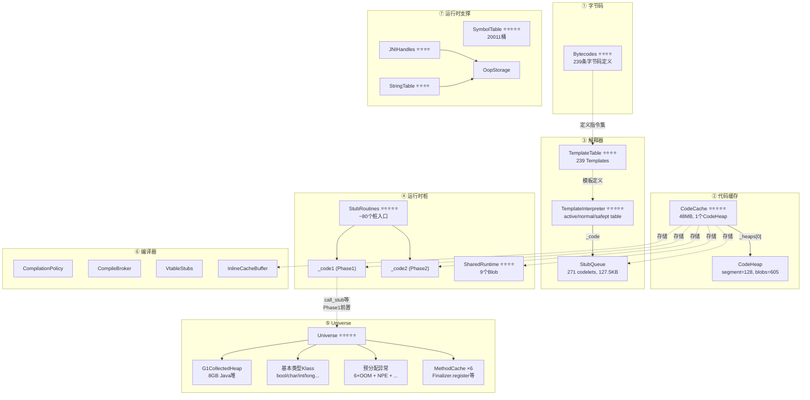

# init_globals() 数据结构全景地图

> **目标**：站在设计者角度，梳理 `init_globals()` 创建/初始化的所有核心数据结构及其关系
> **原则**：程序 = 数据结构 + 算法。先搞清楚"有什么"，再搞清楚"怎么用"
> **源码位置**：`src/hotspot/share/runtime/init.cpp:104-168`（29+1 个初始化函数）
> **标准环境**：`-Xms8g -Xmx8g -XX:+UseG1GC -Xint`，G1 Region = 4MB
> **关联文档**：[4-Phase6-init_globals.md](4-Phase6-init_globals.md)（总控文档，算法/流程视角）

---

## 第 0 部分：核心原理 ⭐

### 0.1 本质是什么？

本文分析 **init_globals() 数据结构全景地图** 的初始化过程：JVM 启动时该组件如何被创建、配置和激活，以及初始化顺序的约束关系。

### 0.2 为什么需要？

JVM 初始化顺序有严格的依赖关系——某些组件必须在其他组件之前初始化。理解初始化顺序有助于排查启动失败问题，也能理解各组件的设计约束。

### 0.3 怎么解决？

追踪初始化函数的调用链，分析每个初始化步骤的前置条件和后置效果，识别关键的初始化顺序约束。

### 0.4 为什么这样设计？

初始化顺序的设计原则：「被依赖的先初始化」。例如内存管理必须在 GC 之前初始化，GC 必须在类加载之前初始化。

---


## 一、总览：init_globals() 的 7 大子系统

`init_globals()` 是 JVM 启动的核心初始化函数，创建了 JVM 运行所需的几乎所有全局数据结构。从设计者角度看，这些数据结构可以归入 **7 个子系统**：

```
┌─────────────────────────────────────────────────────────────────────────────────┐
│                          init_globals() 创建的 7 大子系统                         │
├─────────────────┬─────────────────┬─────────────────┬───────────────────────────┤
│ ① 字节码定义     │ ② 代码缓存       │ ③ 解释器引擎     │ ④ 运行时桩代码              │
│ (Java 指令集)    │ (存储生成代码)    │ (执行字节码)     │ (底层操作入口)              │
├─────────────────┼─────────────────┼─────────────────┼───────────────────────────┤
│ ⑤ Universe       │ ⑥ 编译器子系统    │ ⑦ 运行时支撑      │                           │
│ (Java 世界根基)   │ (JIT 编译基础)   │ (JNI/引用/符号)   │                           │
└─────────────────┴─────────────────┴─────────────────┴───────────────────────────┘
```

**依赖顺序**：字节码定义 → 代码缓存 → 运行时桩Phase1 → Universe → 解释器 → 运行时桩Phase2 → 编译器+运行时支撑

### 重要程度标注

| 标记 | 含义 | 建议 |
|------|------|------|
| ⭐⭐⭐⭐⭐ | **核心中的核心** | 必须逐行分析，完全理解 |
| ⭐⭐⭐⭐ | **重要** | 需要深入理解字段含义和工作机制 |
| ⭐⭐⭐ | **中等** | 理解作用和接口即可 |
| ⭐⭐ | **辅助** | 知道存在和用途即可 |

---

## 二、子系统①：字节码定义（Bytecodes）

> **核心问题**：JVM 支持哪些指令？每条指令的属性是什么？
> **初始化函数**：`bytecodes_init()` → `Bytecodes::initialize()`
> **源码**：`interpreter/bytecodes.hpp:36`、`interpreter/bytecodes.cpp:268-558`

### Bytecodes ⭐⭐⭐⭐

> **一句话**：JVM 指令集的"字典"——为每条字节码定义名称、类型、栈效果等属性。全静态数组，O(1) 查询。
> **继承**：`Bytecodes : AllStatic`

| 字段 | 类型 | 大小 | 作用 |
|------|------|------|------|
| `_is_initialized` | `bool` | 1B | 是否已初始化 |
| `_name[239]` | `const char*[]` | 239×8B | 字节码名称（如 `"nop"`, `"iconst_0"`） |
| `_result_type[239]` | `BasicType[]` | 239×4B | 结果类型（如 `T_INT=10`） |
| `_depth[239]` | `s_char[]` | 239×1B | 栈深度变化（如 `iconst_0` → +1） |
| `_lengths[239]` | `u_char[]` | 239×1B | 指令长度（低4位标准，高4位wide） |
| `_java_code[239]` | `Code[]` | 239×4B | 快速字节码→标准字节码映射 |
| `_flags[512]` | `jchar[]` | 512×2B | 字节码标志位（双页：标准+wide） |

**字节码编号**：0~202 标准 Java 字节码，203~238 HotSpot 快速字节码，总数 239。

**GDB 验证**（`init.cpp:167`）：
```
number_of_codes = 239, _name[0] = "nop", _result_type[3] = 10 (T_INT), _depth[3] = 1
```

---

## 三、子系统②：代码缓存（CodeCache + CodeHeap + CodeBlob）

> **核心问题**：所有生成的机器码存在哪里？
> **初始化函数**：`codeCache_init()` → `CodeCache::initialize()`
> **源码**：`code/codeCache.hpp`、`memory/heap.hpp`

### 3.1 CodeCache ⭐⭐⭐⭐⭐

> **一句话**：所有 JVM 生成代码的"仓库管理者"——管理 1~3 个 CodeHeap。
> **继承**：`CodeCache : AllStatic`

| 字段 | 类型 | 作用 |
|------|------|------|
| `_heaps` | `GrowableArray<CodeHeap*>*` | 所有 CodeHeap 列表 |
| `_compiled_heaps` | `GrowableArray<CodeHeap*>*` | 编译代码堆列表 |
| `_nmethod_heaps` | `GrowableArray<CodeHeap*>*` | nmethod 堆列表 |
| `_allocable_heaps` | `GrowableArray<CodeHeap*>*` | 可分配堆列表 |
| `_low_bound` / `_high_bound` | `address` | CodeHeap 地址边界 |
| `_number_of_nmethods_with_dependencies` | `int` | 有依赖的 nmethod 数 |
| `_scavenge_root_nmethods` | `nmethod*` | scavenge root 链表 |

**堆分配策略**：`-Xint` → 1 个堆(48MB)；分层编译 → 3 个堆(Non-nmethod/Profiled/Non-profiled)。

**GDB 验证**：
```
_heaps len=1, _low_bound=0x7fffed000000, _high_bound=0x7ffff0000000, total=48MB
```

### 3.2 CodeHeap ⭐⭐⭐⭐

> **一句话**：代码缓存的底层内存管理器——段式分配 + freelist，管理一块连续虚拟内存。
> **继承**：`CodeHeap : CHeapObj<mtCode>`

| 字段 | 类型 | 作用 |
|------|------|------|
| `_memory` | `VirtualSpace` | 存储 CodeBlob 的虚拟内存 |
| `_segmap` | `VirtualSpace` | 段映射表（地址→所在 CodeBlob 起始段） |
| `_segment_size` | `size_t` | 段大小（128 字节） |
| `_number_of_committed_segments` | `size_t` | 已提交段数 |
| `_number_of_reserved_segments` | `size_t` | 已保留段数 |
| `_next_segment` | `size_t` | 下一个可用段（bump pointer） |
| `_freelist` | `FreeBlock*` | 空闲块链表 |
| `_name` | `const char*` | 堆名称 |
| `_code_blob_type` | `int` | 类型（All=3） |
| `_blob_count` / `_nmethod_count` / `_adapter_count` | `int` | 统计 |

**GDB 验证**：
```
name="CodeCache", type=3(All), segment_size=128
committed_segments=19968, reserved_segments=393216 (48MB)
next_segment=8857 (已用 1.08MB = 2.3%)
blob_count=605, nmethod_count=0, adapter_count=582
```

### 3.3 CodeBlob 类族 ⭐⭐⭐⭐

> **一句话**：CodeCache 中每段机器码的"容器"——所有生成代码都包装为 CodeBlob 子类。

```
CodeBlob (基类)
  └─ RuntimeBlob
       ├─ BufferBlob             ← StubRoutines._code1/_code2, 解释器代码
       │    ├─ AdapterBlob       ← 582 个 C2I/I2C 适配器
       │    ├─ VtableBlob        ← vtable 代码块
       │    └─ MethodHandlesAdapterBlob
       ├─ RuntimeStub            ← SharedRuntime 的 6 个 resolve/wrong_method 桩
       └─ SingletonBlob
            ├─ DeoptimizationBlob ← 去优化处理（_unpack_offset 等）
            ├─ SafepointBlob      ← 安全点轮询处理
            └─ ExceptionBlob      ← 异常展开
```

**CodeBlob 内存布局**：`[header | relocation | consts | instructions | stubs | oop_maps | data]`

| CodeBlob 基类关键字段 | 类型 | 作用 |
|---------------------|------|------|
| `_size` | `int` | 总大小 |
| `_code_begin` / `_code_end` | `address` | 机器码范围 |
| `_content_begin` / `_data_end` | `address` | 内容/数据边界 |
| `_oop_maps` | `ImmutableOopMapSet*` | GC 需要的 oop 位置 |
| `_name` | `const char*` | 名称标识 |

---

## 四、子系统③：解释器引擎

> **核心问题**：如何将字节码翻译为机器码并执行？
> **初始化函数**：`interpreter_init()`、`templateTable_init()`
> **源码**：`interpreter/abstractInterpreter.hpp`、`interpreter/templateInterpreter.hpp`、`interpreter/templateTable.hpp`

### 4.1 TemplateInterpreter ⭐⭐⭐⭐⭐

> **一句话**：模板解释器的"大脑"——管理代码存储、字节码分发表、方法入口点表。
> **继承**：`TemplateInterpreter : AbstractInterpreter : AllStatic`

#### AbstractInterpreter 字段

| 字段 | 类型 | 作用 |
|------|------|------|
| `_code` | `StubQueue*` | 解释器代码存储（271 个 codelets） |
| `_notice_safepoints` | `bool` | 安全点是否激活 |
| `_entry_table[38]` | `address[]` | 每种方法类型的入口点 |
| `_native_abi_to_tosca[10]` | `address[]` | native 结果处理器 |
| `_slow_signature_handler` | `address` | 慢速签名处理器 |

#### TemplateInterpreter 额外字段

| 字段 | 类型 | 作用 |
|------|------|------|
| `_active_table` | `DispatchTable` | 活动分发表（`address[10][256]`） |
| `_normal_table` | `DispatchTable` | 正常分发表 |
| `_safept_table` | `DispatchTable` | 安全点分发表 |
| `_throw_*_entry` (7个) | `address` | 各异常抛出入口 |
| `_return_entry[6]` | `EntryPoint[6]` | 调用返回入口 |
| `_deopt_entry[7]` | `EntryPoint[7]` | 去优化入口 |

**DispatchTable 结构**：`address _table[number_of_states][256]`——10 种 TOS 状态 × 256 种字节码 = 2560 个分发入口。安全点时切换 `_active_table = _safept_table`。

**GDB 验证**：
```
_code->_number_of_stubs=271, _buffer_size=130624 (127.5KB), _notice_safepoints=0
```

### 4.2 StubQueue ⭐⭐⭐⭐

> **一句话**：解释器 codelet 的存储容器——连续内存，按序存放 271 个代码片段。
> **继承**：`StubQueue : CHeapObj<mtCode>`

| 字段 | 类型 | 作用 |
|------|------|------|
| `_stub_buffer` | `address` | 缓冲区基地址 |
| `_buffer_size` | `int` | 总大小 |
| `_number_of_stubs` | `int` | 已存储桩数 |
| `_mutex` | `Mutex*` | 并发保护锁 |

### 4.3 TemplateTable + Template ⭐⭐⭐⭐

> **一句话**：字节码模板"蓝图"——每条字节码对应一个 Template，记录代码生成器和 TOS 状态转换。
> **继承**：`TemplateTable : AllStatic`

| TemplateTable 字段 | 类型 | 作用 |
|-------------------|------|------|
| `_template_table[239]` | `Template[]` | 标准字节码模板 |
| `_template_table_wide[239]` | `Template[]` | wide 字节码模板 |

| Template 字段(32B) | 类型 | 作用 |
|-------------------|------|------|
| `_tos_in` | `TosState` | 执行前 TOS 状态 |
| `_tos_out` | `TosState` | 执行后 TOS 状态 |
| `_gen` | `void(*)(int)` | 代码生成器函数指针 |
| `_flags` | `int` | 属性（uses_bcp, does_dispatch, calls_vm, wide） |

**TOS 缓存**：解释器将栈顶值缓存在寄存器中。`_tos_in` 描述执行前状态，`_tos_out` 描述执行后。分发时据此选择正确的分发表行。

**GDB 验证**：`_is_initialized=1, sizeof(Template)=32, _template_table[0]._tos_in=9(vtos), _tos_out=9(vtos)`

---

## 五、子系统④：运行时桩代码（StubRoutines + SharedRuntime）

> **核心问题**：底层操作（原子操作、异常处理、数组拷贝、加密等）的机器码如何组织？
> **初始化函数**：`stubRoutines_init1/2()`、`SharedRuntime::generate_stubs()`

### 5.1 StubRoutines ⭐⭐⭐⭐⭐

> **一句话**：~80 个汇编桩入口的"函数指针表"——分两阶段生成，涵盖原子操作、异常处理、数组拷贝、加密等。
> **继承**：`StubRoutines : AllStatic`

| 字段分类 | 数量 | Phase | 关键入口 |
|---------|------|-------|---------|
| 代码缓冲区 | 2 | 1+2 | `_code1`(BufferBlob*), `_code2`(BufferBlob*) |
| 调用/异常 | 8 | 1 | `_call_stub_entry`, `_forward_exception_entry`, `_catch_exception_entry`, `_throw_*` |
| 原子操作 | 7 | 1 | `_atomic_xchg/cmpxchg/cmpxchg_long/add_entry`, `_fence_entry` |
| CRC32 | 1 | 1 | `_updateBytesCRC32` |
| 安全读取 | 2 | 1 | `_safefetch32_entry`, `_safefetchN_entry` |
| arraycopy | ~20 | 2 | `_jbyte/jshort/jint/jlong/oop_arraycopy`, `_checkcast_arraycopy`, `_unsafe_arraycopy` |
| 填充 | ~6 | 2 | `_jbyte/jshort/jint_fill` |
| AES/SHA/GHASH | ~12 | 2 | `_aescrypt_encryptBlock`, `_sha*_implCompress`, `_ghash_processBlocks` |
| 大数运算 | ~5 | 2 | `_multiplyToLen`, `_montgomeryMultiply` |
| 数学函数 | ~7 | 2 | `_dexp`, `_dlog`, `_dsin`, `_dcos` |

**两阶段原因**：Phase 1 是 `universe_init()` 的前置依赖；Phase 2 依赖 Universe 已建立。

**GDB 验证**：
```
_code1=0x7fffed000b90, _code2=0x7fffed093190
_call_stub_entry=0x7fffed000c9e, _fence_entry=0x7fffed000f43
_jbyte_arraycopy=0x7fffed093800, _aescrypt_encryptBlock=0x7fffed095420
```

### 5.2 SharedRuntime ⭐⭐⭐⭐

> **一句话**：编译代码与运行时的"桥梁桩"——管理方法解析、去优化、安全点处理。
> **继承**：`SharedRuntime : AllStatic`

| 字段 | 类型 | 作用 |
|------|------|------|
| `_wrong_method_blob` | `RuntimeStub*` | 方法不匹配 → 重解析 |
| `_ic_miss_blob` | `RuntimeStub*` | 内联缓存 miss → 查正确方法 |
| `_resolve_opt_virtual_call_blob` | `RuntimeStub*` | 解析优化虚调用 |
| `_resolve_virtual_call_blob` | `RuntimeStub*` | 解析虚调用 |
| `_resolve_static_call_blob` | `RuntimeStub*` | 解析静态调用 |
| `_deopt_blob` | `DeoptimizationBlob*` | 去优化：编译→解释器 |
| `_polling_page_safepoint_handler_blob` | `SafepointBlob*` | 安全点轮询处理 |
| `_polling_page_return_handler_blob` | `SafepointBlob*` | 安全点返回处理 |

**使用场景**：
- **IC miss 链路**：`_ic_miss_blob` → `_wrong_method_blob` → `_resolve_*_call_blob`
- **去优化链路**：编译假设被推翻 → `_deopt_blob` → 编译帧转解释器帧
- **安全点链路**：轮询页不可读 → SIGSEGV → `_polling_page_*_handler_blob`

**GDB 验证**：
```
_wrong_method_blob=0x7fffed008190, _ic_miss_blob=0x7fffed114090
_deopt_blob=0x7fffed113090, _polling_page_safepoint=0x7fffed112a90
```

---

## 六、子系统⑤：Universe（Java 世界根基）

> **核心问题**：Java 世界的基础对象如何创建和组织？
> **初始化函数**：`universe_init()`、`universe2_init()`→`genesis()`、`universe_post_init()`

### 6.1 Universe ⭐⭐⭐⭐⭐

> **一句话**：Java 世界的"创世纪"——持有 Java 堆、压缩指针、基本类型 Klass、预分配异常、方法缓存。最核心的全局状态容器。
> **继承**：`Universe : AllStatic`
> **源码**：`memory/universe.hpp`（560 行）

#### 堆和压缩指针

| 字段 | 类型 | GDB 值 | 说明 |
|------|------|--------|------|
| `_collectedHeap` | `CollectedHeap*` | `0x7ffff0031bb0` | Java 堆（G1） |
| `_narrow_oop._base` | `address` | `0x0` | ZeroBased 模式 |
| `_narrow_oop._shift` | `int` | `3` | 8 字节对齐 |
| `_bootstrapping` | `bool` | `0` | 引导已完成 |
| `_fully_initialized` | `bool` | `1` | 完全初始化 |

#### 基本类型 Klass（在 genesis() 中创建）

| 字段 | GDB 值 | 说明 |
|------|--------|------|
| `_boolArrayKlassObj` | `0x800000040` | boolean[] |
| `_charArrayKlassObj` | `0x800000240` | char[] |
| `_intArrayKlassObj` | `0x800000c40` | int[] |
| `_longArrayKlassObj` | `0x800000e40` | long[] |
| `_objectArrayKlassObj` | `0x800013778` | Object[] |

所有 Klass 地址以 `0x800000xxx` 开头 → 位于 CompressedClassSpace（起始 `0x800000000`）。

#### 预分配异常（在 universe_post_init() 中创建）

| 字段 | GDB 值 | 用途 |
|------|--------|------|
| `_out_of_memory_error_java_heap` | `0x7ffc04d30` | 堆 OOM |
| `_out_of_memory_error_metaspace` | `0x7ffc04d58` | 元空间 OOM |
| `_out_of_memory_error_class_metaspace` | `0x7ffc04d80` | 类元空间 OOM |
| `_out_of_memory_error_array_size` | `0x7ffc04da8` | 数组超限 |
| `_out_of_memory_error_gc_overhead_limit` | `0x7ffc04dd0` | GC 开销超限 |
| `_null_ptr_exception_instance` | `0x7ffc04f18` | NPE |
| `_arithmetic_exception_instance` | `0x7ffc04fc8` | 除零 |
| `_virtual_machine_error_instance` | `0x7ffc05070` | VM 错误 |
| `_the_null_sentinel` | `0x7ffc04a48` | null 哨兵 |

**设计目的**：预分配异常对象，避免在 OOM 时无法分配异常对象的死循环。

#### LatestMethodCache（在 universe_post_init() 中填充）

每个 LatestMethodCache = `{Klass* _klass; int _method_idnum;}`，缓存高频 Java 方法：

| 字段 | klass 地址 | idnum | 缓存方法 |
|------|-----------|-------|---------|
| `_finalizer_register_cache` | `0x800006448` | 3 | `Finalizer.register()` |
| `_loader_addClass_cache` | `0x8000025a0` | 33 | `ClassLoader.addClass()` |
| `_do_stack_walk_cache` | `0x800011260` | 13 | `StackWalkerHelper.doStackWalk()` |
| `_pd_implies_cache` | `0x8000039b8` | 11 | `ProtectionDomain.implies...()` |

### 6.2 Universe 初始化三阶段

```
universe_init()        → 堆 + 压缩指针 + Metaspace + SymbolTable + StringTable + 分配 6 个空 MethodCache
universe2_init()       → SystemDictionary + 8 种 TypeArrayKlass + Object[]Klass + 基本类型镜像
universe_post_init()   → 6 个 OOM + NPE/ArithmeticExc/VMError + 填充 6 个 MethodCache + _fully_initialized=true
```

---

## 七、子系统⑥：编译器基础设施

> **初始化函数**：`compilationPolicy_init()`、`vtableStubs_init()`、`InlineCacheBuffer_init()`、`compilerOracle_init()`、`compileBroker_init()`

### 7.1 CompilationPolicy ⭐⭐⭐

> 编译策略决策器。类层次：`CompilationPolicy` → `NonTieredCompPolicy` → `SimpleCompPolicy`（-Xint）/ `StackWalkCompPolicy`；`CompilationPolicy` → `TieredThresholdPolicy`（分层编译）

| 字段 | GDB 值 | 说明 |
|------|--------|------|
| `_policy` | `0x7ffff002ef90` | SimpleCompPolicy（-Xint） |
| `_in_vm_startup` | `1` | 仍在启动阶段 |

### 7.2 VtableStubs ⭐⭐⭐

> 虚方法调用跳板工厂。`_table[256]` 哈希表，按需生成 vtable/itable 桩。

**GDB 验证**：`_number_of_vtable_stubs = 0`（初始化时无桩，运行时按需创建）

### 7.3 InlineCacheBuffer ⭐⭐⭐

> IC 过渡缓冲区。`_buffer`(StubQueue*) 存储 ICStub。

**GDB 验证**：`_buffer = 0x7ffff0caa500`

### 7.4 CompileBroker ⭐⭐⭐⭐

> JIT 编译调度中心。`_compilers[2]`(C1+C2)、`_c1/_c2_compile_queue`。

**GDB 验证**：`_initialized = 0`（-Xint 模式）

### 7.5 DirectivesStack ⭐⭐

> 编译器指令栈。`_top=_bottom`（只有默认指令），`_depth=1`。

---

## 八、子系统⑦：运行时支撑

> **初始化函数**：`universe_init()`(表创建)、`jni_handles_init()`、`referenceProcessor_init()`

### 8.1 SymbolTable ⭐⭐⭐⭐⭐

> JVM 名称数据库。保证类名/方法名/字段名的唯一性。
> **继承**：`SymbolTable : RehashableHashtable<Symbol*, mtSymbol>`

| 字段 | 类型 | 作用 |
|------|------|------|
| `_the_table` | `SymbolTable*` (static) | 唯一实例 |
| `_arena` | `Arena*` (static) | 永久符号 Arena（360KB） |
| `_shared_table` | `CompactHashtable` (static) | CDS 共享表 |
| 继承 `_buckets` | `HashtableBucket*` | 20011 个桶 |

**GDB 验证**：`_the_table = 0x7ffff0c90ec0`

### 8.2 StringTable ⭐⭐⭐⭐

> Java 字符串驻留池（`String.intern()`）。ConcurrentHashTable + OopStorage 弱引用。
> **继承**：`StringTable : CHeapObj<mtSymbol>`

| 字段 | 类型 | 作用 |
|------|------|------|
| `_the_table` | `StringTable*` (static) | 唯一实例 |
| `_local_table` | `StringTableHash*` | ConcurrentHashTable |
| `_weak_handles` | `OopStorage*` | 弱引用存储（GC 可回收） |

**与 SymbolTable 区别**：SymbolTable 存 `Symbol*`（C++ 对象，强引用），StringTable 存 `oop`（Java 对象，弱引用）。

**GDB 验证**：`_the_table = 0x7ffff0c90fa0`

### 8.3 JNIHandles + OopStorage ⭐⭐⭐⭐

> JNI 全局引用管理。两个 OopStorage 实例。

| 字段 | GDB 值 | 用途 |
|------|--------|------|
| `_global_handles` | `0x7ffff0d0f200` | `NewGlobalRef` 创建的引用 |
| `_weak_global_handles` | `0x7ffff0d0f3b0` | `NewWeakGlobalRef` 创建的引用 |

**OopStorage** (`CHeapObj<mtGC>`)：堆外 oop 引用管理器。字段包括 `_active_array`(Block 数组)、`_allocation_list`(空闲 Block 链表)、`_allocation_mutex`(分配锁)。被 JNIHandles、StringTable、SystemDictionary 共同使用。

### 8.4 ReferenceProcessor ⭐⭐⭐

> Java 引用对象（Soft/Weak/Final/Phantom）的 GC 处理器。管理 4 类引用的发现列表和处理策略。

---

## 九、CodeCache 内地址分布全图

```
CodeCache [0x7fffed000000, 0x7ffff0000000) = 48MB

0x7fffed000b90  StubRoutines._code1 (Phase 1 桩: call_stub, 异常, 原子操作, CRC32)
0x7fffed008190  SharedRuntime._wrong_method_blob
0x7fffed008c20  Interpreter StubQueue (271 codelets, 127.5KB)
                582 个 Adapter Blobs
0x7fffed093190  StubRoutines._code2 (Phase 2 桩: arraycopy, AES, GHASH, SHA)
0x7fffed112790  SharedRuntime._polling_page_return_handler_blob
0x7fffed112a90  SharedRuntime._polling_page_safepoint_handler_blob
0x7fffed113090  SharedRuntime._deopt_blob
0x7fffed113790  SharedRuntime._resolve_static_call_blob
0x7fffed113a90  SharedRuntime._resolve_virtual_call_blob
0x7fffed113d90  SharedRuntime._resolve_opt_virtual_call_blob
0x7fffed114090  SharedRuntime._ic_miss_blob
0x7fffed114390  SharedRuntime._wrong_method_abstract_blob
0x7fffed115xxx  ... 空闲空间 (~46.9MB) ...
0x7ffff0000000  _high_bound

总使用约 1.1MB (2.3%)，因为 -Xint 无 JIT 编译
```

---

## 十、对象关系总图



---

## 十一、数据结构统计

### 按内存分配方式分类

| 分配方式 | 数据结构 | 说明 |
|---------|---------|------|
| **AllStatic** | Bytecodes, CodeCache, StubRoutines, AbstractInterpreter, TemplateInterpreter, TemplateTable, SharedRuntime, VtableStubs, InlineCacheBuffer, CompileBroker, DirectivesStack, JNIHandles, Universe | 纯静态类，无实例对象 |
| **CHeapObj** | CodeHeap, StubQueue, CompilationPolicy, LatestMethodCache, StringTable, OopStorage, CompilerDirectives | malloc 分配在 C 堆 |
| **Hashtable** | SymbolTable（RehashableHashtable） | Arena + 桶数组 |
| **CodeCache 内** | CodeBlob 族（BufferBlob, RuntimeStub, DeoptimizationBlob, SafepointBlob 等） | 在 CodeHeap 中分配 |
| **Java 堆内** | 预分配异常、基本类型镜像 | Java 对象 |
| **CompressedClassSpace 内** | TypeArrayKlass, ObjArrayKlass | Metaspace |

### 按创建时间排序（完整 30 个函数）

| 阶段 | 创建的数据结构 | 文档 |
|------|--------------|------|
| `management_init()` | PerfData 时间戳 + ThreadService/RuntimeService/ClassLoadingService | 4I |
| `bytecodes_init()` | Bytecodes 6 个静态数组 | 4A |
| `classLoader_init1()` | ~30 个 PerfData 计数器 + zip 库 + 引导类路径 | 4I |
| `compilationPolicy_init()` | CompilationPolicy 实例 | 4A |
| `codeCache_init()` | CodeCache, CodeHeap | 4A+4B |
| `VM_Version_init()` | BufferBlob("VM_Version stub") + CPU 特性标志 | 4I |
| `stubRoutines_init1()` | _code1(BufferBlob), Phase 1 桩 | 4A+4D |
| `universe_init()` | CollectedHeap, NarrowPtr, SymbolTable, StringTable, 6×LatestMethodCache(空) | 4A+5 |
| `gc_barrier_stubs_init()` | GC 屏障桩（G1 下为空操作） | 4I |
| `interpreter_init()` | StubQueue, 271 codelets, 38 入口点, 3 分发表 | 4A+4C |
| `invocationCounter_init()` | 编译阈值（InvocationLimit=80000, BackwardBranchLimit=10700） | 4I |
| `accessFlags_init()` | 仅 sizeof 断言 | 4I |
| `templateTable_init()` | 239×2 Template | 4A+4C |
| `InterfaceSupport_init()` | srand (debug only) | 4I |
| `VMRegImpl::set_regName()` | regName[] 寄存器名数组 | 4I |
| `SharedRuntime::generate_stubs()` | 6 RuntimeStub + DeoptBlob + 3 SafepointBlob + UncommonTrapBlob | 4A+4G |
| `universe2_init()` | 8 TypeArrayKlass + ObjArrayKlass + 基本类型镜像 | 4A+4E |
| `javaClasses_init()` | ~32 个 Java 类的 C++ 字段偏移量 | **4H** |
| `referenceProcessor_init()` | 软引用时间戳 + LRUMaxHeapPolicy/AlwaysClearPolicy | 4I |
| `jni_handles_init()` | 2 OopStorage | 4A |
| `vmStructs_init()` | SA 结构验证 (debug only) | 4I |
| `vtableStubs_init()` | VtableStubs._table[256] (空) | 4A |
| `InlineCacheBuffer_init()` | ICBuffer StubQueue | 4A |
| `compilerOracle_init()` | CompilerDirectives | 4A |
| `dependencyContext_init()` | 4 个 PerfData 计数器 | 4I |
| `compileBroker_init()` | CompileBroker (最小初始化) | 4A |
| `universe_post_init()` | 9 预分配异常 + 填充 6 MethodCache | 4A+4F |
| `stubRoutines_init2()` | _code2(BufferBlob), Phase 2 桩 | 4A+4D |
| `MethodHandles::generate_adapters()` | MethodHandlesAdapterBlob + 5 种 invoke 入口 | 4I |

---

## 十二、深入分析索引（全部完成）

| 模块 | 文档 | 状态 |
|------|------|------|
| CodeCache + CodeHeap 详解 | `4B-CodeCache-Deep-Dive.md` | ✅ |
| 解释器 + TemplateTable 详解 | `4C-Interpreter-TemplateTable-Deep-Dive.md` | ✅ |
| StubRoutines 两阶段详解 | `4D-StubRoutines-Two-Phase-Deep-Dive.md` | ✅ |
| universe2_init (genesis) 详解 | `4E-universe2_init-Genesis-Deep-Dive.md` | ✅ |
| universe_post_init 详解 | `4F-universe_post_init-Deep-Dive.md` | ✅ |
| SharedRuntime Blob 详解 | `4G-SharedRuntime-Blob-Deep-Dive.md` | ✅ |
| javaClasses_init 详解 | `4H-javaClasses_init-Deep-Dive.md` | ✅ |
| 辅助初始化函数合集 | `4I-Auxiliary-Init-Functions.md` | ✅ |

> **init_globals() 30 个函数已 100% 覆盖。**

---

## 十三、源文件索引

| 源文件 | 涉及的数据结构 |
|--------|--------------|
| `interpreter/bytecodes.hpp/cpp` | Bytecodes |
| `code/codeCache.hpp/cpp` | CodeCache |
| `memory/heap.hpp/cpp` | CodeHeap |
| `code/codeBlob.hpp/cpp` | CodeBlob 族 |
| `code/stubs.hpp/cpp` | StubQueue |
| `runtime/stubRoutines.hpp/cpp` | StubRoutines |
| `runtime/sharedRuntime.hpp/cpp` | SharedRuntime |
| `interpreter/abstractInterpreter.hpp` | AbstractInterpreter |
| `interpreter/templateInterpreter.hpp/cpp` | TemplateInterpreter |
| `interpreter/templateTable.hpp/cpp` | TemplateTable, Template |
| `memory/universe.hpp/cpp` | Universe, LatestMethodCache |
| `runtime/compilationPolicy.hpp/cpp` | CompilationPolicy 族 |
| `code/vtableStubs.hpp/cpp` | VtableStubs, VtableStub |
| `code/icBuffer.hpp/cpp` | InlineCacheBuffer, ICStub |
| `compiler/compileBroker.hpp/cpp` | CompileBroker |
| `compiler/compilerDirectives.hpp/cpp` | DirectivesStack, CompilerDirectives |
| `classfile/symbolTable.hpp/cpp` | SymbolTable |
| `classfile/stringTable.hpp/cpp` | StringTable |
| `runtime/jniHandles.hpp/cpp` | JNIHandles, JNIHandleBlock |
| `gc/shared/oopStorage.hpp/cpp` | OopStorage |
| `gc/shared/referenceProcessor.hpp/cpp` | ReferenceProcessor |
