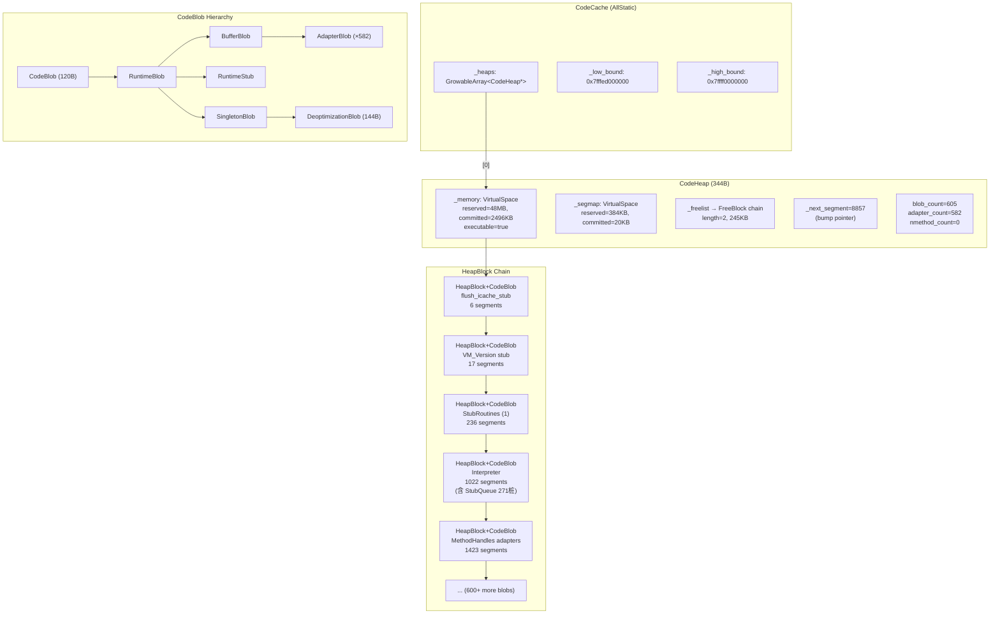

# CodeCache 深度剖析

> **标准条件**: `-Xms8g -Xmx8g -XX:+UseG1GC -Xint`（解释模式，单堆 48MB）
> **源码**: OpenJDK 11，`src/hotspot/share/code/` + `src/hotspot/share/memory/`

---

## 第 0 部分：核心原理 ⭐

### 0.1 本质是什么？

本文深入分析 **CodeCache 深度剖析**：从源码角度理解其设计原理、实现机制和关键细节。

### 0.2 为什么需要？

理解 JVM 内部实现是排查复杂问题、进行性能优化的基础。表面的 API 文档无法解释 JVM 的实际行为，只有深入源码才能建立精确的心智模型。

### 0.3 怎么解决？

结合源码阅读、数据结构分析和 GDB 运行时验证，从多个角度建立对该机制的完整理解。

### 0.4 为什么这样设计？

每个设计决策都有其权衡：性能 vs 正确性、简单性 vs 灵活性、内存占用 vs 查找速度。理解这些权衡是理解 JVM 设计的关键。

---


## 一、CodeCache 解决什么问题

JVM 在运行时会 **动态生成大量机器码**：解释器桩(271个)、I2C/C2I 适配器(582个)、运行时桩(StubRoutines)、JIT 编译的 nmethod 等。这些机器码必须存放在 **可执行内存** 中。

如果没有 CodeCache，JVM 面临的问题：
1. 每次需要生成代码都要调用 `mmap(PROT_EXEC)`，系统调用开销大
2. 生成的代码散落在内存各处，缓存局部性差
3. 无法快速从任意代码指针反查出它属于哪个 CodeBlob
4. GC 时无法高效遍历所有 nmethod 来更新 oop 引用

**CodeCache 的解决方案**：一次性 `mmap` 一大块可执行内存，然后自己管理分配/回收。用 **Segment Map** 实现 O(1) 反查。

---

## 二、整体架构

### 2.1 三层结构

```
┌──────────────────────────────────────────────────────┐
│                   CodeCache (AllStatic)                │  ← 全局管理器
│  _heaps[], _low_bound, _high_bound                    │
├──────────────────────────────────────────────────────┤
│                    CodeHeap                            │  ← 内存池
│  VirtualSpace _memory   (代码内存)                     │
│  VirtualSpace _segmap   (段映射表)                     │
│  FreeBlock* _freelist   (空闲链表)                     │
│  size_t _next_segment   (Bump Pointer)                │
├──────────────────────────────────────────────────────┤
│      HeapBlock [CodeBlob] [HeapBlock [CodeBlob] ...]  │  ← 分配单元
│         ↑                                             │
│    每个 HeapBlock 头 + CodeBlob 对象 + 机器码          │
└──────────────────────────────────────────────────────┘
```

### 2.2 初始化模式

| 条件 | SegmentedCodeCache | 堆数量 | 堆名称 |
|------|-------------------|--------|--------|
| `-Xint`（解释模式）| false | 1 | "CodeCache" (type=All) |
| 默认（TieredCompilation, RCC≥240MB）| true | 3 | NonNMethod + Profiled + NonProfiled |
| `-XX:-TieredCompilation` | true | 2 | NonNMethod + NonProfiled |

**标准条件下**（`-Xint`）走单堆路径：
```
CodeCache::initialize()
  → SegmentedCodeCache = false
  → reserve_heap_memory(48MB)  // mmap 48MB RWX
  → add_heap(rs, "CodeCache", CodeBlobType::All)
    → new CodeHeap("CodeCache", 3)
    → heap->reserve(rs, 2496KB, 128)  // 初始提交 2496KB
```

### 2.3 GDB 验证：全局状态

| 字段 | 值 | 含义 |
|------|-----|------|
| `_low_bound` | `0x7fffed000000` | CodeCache 起始地址 |
| `_high_bound` | `0x7ffff0000000` | CodeCache 结束地址 |
| 总大小 | 48 MB (50,331,648 bytes) | ReservedCodeCacheSize |
| `_heaps->_len` | 1 | 单堆模式 |
| `SegmentedCodeCache` | 0 (false) | `-Xint` 下禁用分段 |

---

## 三、CodeHeap — 核心内存管理器

### 3.1 为什么需要自己的内存管理

CodeHeap 没有使用 `malloc`/`free`，而是自己实现了一套分配器。原因：

1. **可执行内存**：`malloc` 分配的内存默认不可执行，CodeHeap 使用 `mmap(PROT_READ|PROT_WRITE|PROT_EXEC)`
2. **地址反查**：Segment Map 提供 O(1) 从任意代码指针找到所属 CodeBlob 的能力
3. **紧凑布局**：所有 CodeBlob 紧邻排列，CPU 指令缓存友好
4. **按需提交**：先 reserve 48MB，只 commit 需要的部分（初始 2496KB）

### 3.2 数据结构（GDB 验证）

```
sizeof(CodeHeap) = 344 bytes
```

| 字段 | GDB 值 | 含义 |
|------|--------|------|
| `_name` | "CodeCache" | 堆名称 |
| `_code_blob_type` | 3 (All) | 接受所有类型 CodeBlob |
| `_segment_size` | 128 | 分配粒度 = `CodeCacheSegmentSize` |
| `_log2_segment_size` | 7 | 2^7 = 128，用于移位代替除法 |
| `_number_of_committed_segments` | 19,968 | 已提交 = 19968×128 = 2,496 KB |
| `_number_of_reserved_segments` | 393,216 | 已保留 = 393216×128 = 48 MB |
| `_next_segment` | 8,857 | Bump Pointer = 8857×128 = 1,107 KB |
| `_freelist` | `0x7fffed028a80` | 空闲链表头 |
| `_freelist_segments` | 1,964 | 空闲 = 1964×128 = 245 KB |
| `_freelist_length` | 2 | 2 个空闲块 |
| `_blob_count` | 605 | 总 CodeBlob 数 |
| `_nmethod_count` | 0 | 无 JIT 编译（`-Xint`） |
| `_adapter_count` | 582 | I2C/C2I 适配器 |
| `_fragmentation_count` | 4 | 合并碎片计数 |
| `_max_allocated_capacity` | 1,106 KB | 峰值分配 |

### 3.3 容量计算

```
已提交空间: 2,496 KB (19,968 × 128)
    ├── Bump Pointer 已分配: 1,107 KB (8,857 × 128)
    │     ├── 实际使用 (blob): 862 KB (1,107 - 245)
    │     └── 空闲链表中: 245 KB (1,964 × 128)
    └── 未分配 (committed but unused): 1,389 KB
未提交空间: 45,504 KB (48MB - 2,496KB)
```

---

## 四、VirtualSpace — 虚拟内存管理

### 4.1 结构

CodeHeap 内部有两个 `VirtualSpace` 对象：`_memory`（代码内存）和 `_segmap`（段映射表）。

```
sizeof(VirtualSpace) = 112 bytes
```

```
VirtualSpace
├── _low_boundary   // reserved 起始 (不变)
├── _high_boundary  // reserved 结束 (不变)
├── _low            // committed 起始 (通常 == _low_boundary)
├── _high           // committed 结束 (随 expand_by 增长)
├── _special        // true=使用大页，一次全部提交
├── _executable     // true=可执行内存
└── MPSS 三段模型
    ├── lower:  [_low_boundary .. _lower_high_boundary]  alignment=4KB
    ├── middle: [_lower_high_boundary .. _middle_high_boundary] alignment=大页
    └── upper:  [_middle_high_boundary .. _upper_high_boundary] alignment=4KB
```

### 4.2 GDB 验证：_memory

| 字段 | 值 | 含义 |
|------|-----|------|
| `_low_boundary` | `0x7fffed000000` | reserved 起始 |
| `_high_boundary` | `0x7ffff0000000` | reserved 结束 (48MB) |
| `_low` | `0x7fffed000000` | committed 起始 |
| `_high` | `0x7fffed270000` | committed 结束 (2,496KB) |
| `_executable` | 1 | 可执行内存 |
| `_special` | 0 | 非大页 |

**MPSS 三段模型**（标准条件下退化为中间段独占）:
- `_lower_high_boundary` = `0x7fffed000000` = `_low_boundary`（lower 段为空）
- `_middle_high_boundary` = `0x7ffff0000000` = `_high_boundary`（middle 段占满）
- `_middle_high` = `0x7fffed270000`（已提交到此处）
- 所有 alignment = 4096（标准页，无大页）

### 4.3 GDB 验证：_segmap

| 字段 | 值 |
|------|-----|
| `_low_boundary` | `0x7ffff7ba0000` |
| `_high_boundary` | `0x7ffff7c00000` |
| reserved | 393,216 bytes（= 393,216 segments × 1 byte/segment） |
| committed | 20,480 bytes |

**关键比例**：segmap 大小 = 保留段数（每个 segment 对应 1 字节 segmap），所以 segmap 的 reserved = `_number_of_reserved_segments` = 393,216。

---

## 五、HeapBlock / FreeBlock — 分配单元

### 5.1 为什么 CodeBlob 不直接分配

CodeHeap 不直接分配 CodeBlob，而是分配 HeapBlock。每个 HeapBlock 有 16 字节头部，其后紧跟 CodeBlob 对象和机器码。

这样设计的好处：
- HeapBlock 记录块长度（segments），用于遍历和合并
- `allocated_space() = this + 1`，O(1) 从 HeapBlock 找到 CodeBlob
- 释放后可转为 FreeBlock，加入空闲链表

### 5.2 内存布局

```
sizeof(HeapBlock)        = 16 bytes
sizeof(HeapBlock::Header) = 16 bytes  (含 padding)
sizeof(FreeBlock)        = 24 bytes   (HeapBlock + _link 指针)
```

```
HeapBlock 内存布局 (16 bytes, padded to 8-byte alignment):
┌────────────────────────────────────┐
│ offset 0: _length (size_t, 8B)    │ ← 块长度(segments)
│ offset 8: _used   (bool, 1B)      │ ← 使用标记
│ offset 9: padding (7B)            │
└────────────────────────────────────┘

FreeBlock = HeapBlock + _link:
┌────────────────────────────────────┐
│ offset 0:  _length (8B)           │
│ offset 8:  _used=false (1B+7pad)  │
│ offset 16: _link (FreeBlock*, 8B) │ ← 指向下一个空闲块
└────────────────────────────────────┘
```

### 5.3 GDB 验证：第一个 HeapBlock

```
地址: 0x7fffed000000 (= _memory._low)
_header._length = 6 segments (= 768 bytes)
_header._used   = true
allocated_space = 0x7fffed000010 (= HeapBlock + 16)
→ 这个 HeapBlock 包含 "flush_icache_stub" CodeBlob
```

---

## 六、分配机制 — 双路径策略

### 6.1 分配流程

```
CodeCache::allocate(size, type)
  → heap->allocate(instance_size)
     │
     ├─ 路径 1: search_freelist() → 从空闲链表分配 (best-fit)
     │    └─ 找到大小合适的 FreeBlock → 标记为 used → 返回
     │
     └─ 路径 2: Bump Pointer → _next_segment 前进
          └─ 够空间？→ mark_segmap_as_used → block->initialize → 返回
               └─ 不够？→ CodeCache::allocate 调 expand_by(64KB) → 重试
```

**段数计算**：
```cpp
number_of_segments = size_to_segments(instance_size + header_size())
// = (instance_size + 16 + 127) >> 7  (向上取整到 128 字节)
// 最小值: CodeCacheMinBlockLength = 6 segments = 768 bytes
```

### 6.2 Bump Pointer 分配（主路径）

```
_next_segment = 8,857

分配 300 字节:
  segments = (300 + 16 + 127) / 128 = 4 (向上取整)
  但 min = 6 (CodeCacheMinBlockLength)
  所以 segments = 6

  mark_segmap_as_used(8857, 8863)
  block = block_at(8857) = _memory.low + 8857*128
  block->initialize(6)  // _length=6, _used=true
  _next_segment = 8857 + 6 = 8863
  return block->allocated_space()  // block + 16
```

### 6.3 Freelist 分配（回收后）

空闲链表使用 **best-fit** 策略：遍历链表找到最小的且足够大的空闲块。如果空闲块比需要的大得多，会 `split_block()` 拆分。

GDB 验证（init_globals 完成时）：
- `_freelist = 0x7fffed028a80`（解释器 Blob trim 后的尾部空间）
- `_freelist_length = 2`
- `_freelist_segments = 1,964`（= 245 KB）

这 2 个 FreeBlock 来源：`TemplateInterpreter::initialize()` 预分配了一个大 BufferBlob，生成完所有 271 个解释器桩后，通过 `deallocate_tail()` 释放多余空间。

### 6.4 扩容机制

当 Bump Pointer 无法分配且 freelist 也没有合适的块时：
```
heap->expand_by(CodeCacheExpansionSize)  // 每次 64KB
  → _memory.expand_by(64KB)  // os::commit_memory
  → _number_of_committed_segments 更新
  → _segmap.expand_by(...)   // 对应扩展 segmap
  → clear(old_committed, new_committed)  // 初始化新区域 segmap=0xFF
```

### 6.5 Fallback 机制（仅分段模式）

```
NonNMethod 满 → 尝试 MethodNonProfiled
MethodNonProfiled 满 → 尝试 MethodProfiled
MethodProfiled 满 → 尝试 MethodNonProfiled（避免循环）
全都满 → CompileBroker::handle_full_code_cache()
```

`-Xint` 单堆模式下无 fallback。

---

## 七、Segment Map — O(1) 地址反查

### 7.1 解决的问题

JVM 经常需要从一个 **任意代码地址**（如 PC 指针、返回地址）找到它属于哪个 CodeBlob。GC 遍历栈帧时尤其需要这个能力。

如果没有 Segment Map，只能从头遍历所有 HeapBlock 链表，O(n)。

### 7.2 原理

整个代码内存被划分为 128 字节的 segment。每个 segment 在 segmap 中有一个字节：

| 值 | 含义 |
|-----|------|
| 0 | 当前 segment 是某个块的 **起始** |
| 1~254 | **回跳偏移**：从当前 segment 减去此值，接近块起始 |
| 255 (free_sentinel) | 未分配的自由段 |

**查找算法** (`find_block_for`)：
```cpp
seg_idx = segment_for(p);  // p 所在的 segment
while (seg_map[seg_idx] > 0) {
    seg_idx -= seg_map[seg_idx];  // 向前跳
}
return address_for(seg_idx);  // 块起始地址
```

### 7.3 segmap_template 优化

初始化 segmap 时不用循环，直接 `memcpy(segmap_template)`：
```
segmap_template[] = {0, 1, 2, 3, ..., 253, 254, 255}
```

对于 ≤255 segments 的块，一次 `memcpy` 搞定。对于更大的块（如 Interpreter = 1,022 segments），分多段 `memcpy`，每 254 个 segment 重新从 1 开始。

### 7.4 GDB 验证

前两个块的 segmap（flush_icache_stub=6段, VM_Version stub=17段）：
```
segmap[0..5]:   0  1  2  3  4  5     ← flush_icache_stub (6 segments)
segmap[6..22]:  0  1  2  3  4  5  6  7  8  9  10  11  12  13  14  15  16
                                      ← VM_Version stub (17 segments)
segmap[23]:     0                     ← StubRoutines (1) 块起始
```

**_next_segment 边界验证**：
```
segmap[8855] = 10    ← 最后一个已分配 segment (回跳10)
segmap[8856] = 11    ← 最后一个已分配 segment (回跳11)
segmap[8857] = 255   ← _next_segment: 自由段开始
segmap[8858] = 255   ← 自由段
```

**反查示例**：假设我们有一个指向 segment 20 的指针（在 VM_Version stub 内部）：
```
segmap[20] = 14 → idx = 20 - 14 = 6
segmap[6]  = 0  → 找到！块起始 = address_for(6) = _memory.low + 6×128
```

### 7.5 FreeBlock 合并的碎片优化

当两个相邻 FreeBlock 合并时，不重新初始化整个 segmap（太慢），而是只修改接缝处：
```
合并前: ... (m-1) | 0  1  2  3 ...
合并后: ... (m-1) | 1  1  2  3 ...  (仅把 '0' 改为 '1' 或前值+1)
```

这引入了额外的 "hop"，但避免了 O(n) 的重新初始化。当 `_fragmentation_count` 达到 10,000 时，触发一次完整的 `defrag_segmap()`。

---

## 八、CodeBlob 体系 — 代码块类型

### 8.1 继承层次

```
CodeBlob (120 bytes) ← 所有代码块的基类
├── RuntimeBlob (120 bytes) ← 非编译代码
│   ├── BufferBlob (120 bytes) ← 通用代码缓冲区
│   │   ├── AdapterBlob (120 bytes) ← I2C/C2I 适配器
│   │   ├── VtableBlob (120 bytes)  ← vtable 桩
│   │   └── MethodHandlesAdapterBlob (120 bytes)
│   ├── RuntimeStub (120 bytes) ← 运行时调用桩
│   └── SingletonBlob (120 bytes) ← 全局唯一桩
│       ├── DeoptimizationBlob (144 bytes) ← 反优化 ⚠ 更大
│       ├── ExceptionBlob
│       ├── SafepointBlob
│       └── UncommonTrapBlob
└── CompiledMethod ← JIT 编译的方法
    └── nmethod ← 最核心的编译方法表示
```

> 注意：大部分子类 sizeof 都是 120 bytes（和 CodeBlob 相同，没加字段），只有 `DeoptimizationBlob` 是 144 bytes（多了 3 个 int 字段）。

### 8.2 CodeBlob 字段布局（GDB 验证）

```
sizeof(CodeBlob) = 120 bytes

┌─ offset 0:  vptr (8B)                ← 虚函数表指针
├─ offset 8:  _type (CompilerType, 4B) ← 0=none, 1=c1, 2=c2, 3=jvmci
├─ offset 12: _size (int, 4B)          ← 整个 CodeBlob 总大小
├─ offset 16: _header_size (int, 4B)   ← 头部大小 (= 120 for BufferBlob)
├─ offset 20: _frame_complete_offset (int, 4B)
├─ offset 24: _data_offset (int, 4B)   ← 数据区偏移
├─ offset 28: _frame_size (int, 4B)    ← 栈帧大小
├─ offset 32: _code_begin (address, 8B)
├─ offset 40: _code_end (address, 8B)
├─ offset 48: _content_begin (address, 8B)
├─ offset 56: _data_end (address, 8B)
├─ offset 64: _relocation_begin (address, 8B)
├─ offset 72: _relocation_end (address, 8B)
├─ offset 80: _oop_maps (ImmutableOopMapSet*, 8B)
├─ offset 88: _caller_must_gc_arguments (bool, 1B)
├─ offset 89: padding (7B)
├─ offset 96: _strings (CodeStrings, 16B)
├─ offset 112: _name (const char*, 8B)
└─ offset 120: end (total 120 bytes)
```

### 8.3 CodeBlob 在 CodeHeap 中的布局

```
            HeapBlock (16B)          CodeBlob 对象              机器码
         ┌──────────────────┬───────────────────────────┬──────────────────┐
Memory:  │ _length | _used  │ vptr | _type | _size |... │ instructions ... │
         └──────────────────┴───────────────────────────┴──────────────────┘
         ↑                  ↑           ↑                ↑              ↑
   block address     allocated_space  +120          _code_begin    _code_end
                     = CodeBlob*     (_header_size)
```

### 8.4 GDB 验证：前 10 个 CodeBlob

| # | Seg | Name | Size | Code Size | 描述 |
|---|-----|------|------|-----------|------|
| 0 | 0 | flush_icache_stub | 208B | 64B | ICache 刷新桩 |
| 1 | 6 | VM_Version stub | 2,144B | 2,000B | CPU 特性检测 |
| 2 | 23 | StubRoutines (1) | 30,144B | 30,000B | Phase1 运行时桩 |
| 3 | 259 | wrong_method_stub | 592B | 448B | 方法分派错误处理 |
| 4 | 267 | StackOverflowError throw | 296B | 152B | 栈溢出异常桩 |
| 5 | 273 | delayed StackOverflow throw | 296B | 152B | 延迟栈溢出桩 |
| 6 | 279 | Interpreter | 130,768B | 130,624B | **解释器主体** |
| 7 | 3257 | MethodHandles adapters | 182,144B | 182,000B | MH 适配器集合 |
| 8 | 4681 | NPE at call throw | 296B | 152B | NPE 异常桩 |
| 9 | 4687 | IncompatibleClassChange throw | 296B | 152B | 类变更异常桩 |

**观察**：
- 解释器 Blob 是最大的单体 (130KB)，占用 1,022 segments
- MethodHandles adapters 更大 (182KB)，占用 1,423 segments
- 适配器 (582个) 是数量最多的 CodeBlob 类型

---

## 九、StubQueue — 解释器的桩队列

### 9.1 为什么解释器不直接用 CodeHeap 分配

解释器的 271 个桩（每个字节码一个 InterpreterCodelet）生命周期和 JVM 一样长，不需要单独回收。所以它们被打包在一个大 BufferBlob 内，用 StubQueue 管理。

这样做的好处：
1. 271 个桩只占 CodeHeap 中 1 个 HeapBlock，不浪费 HeapBlock 头部
2. StubQueue 支持两阶段分配（request→commit），适合代码生成的不确定大小
3. 所有解释器桩紧密排列，指令缓存友好

### 9.2 数据结构（GDB 验证）

```
sizeof(StubQueue) = 56 bytes

StubQueue at 0x7ffff0c95410
├── _stub_interface = 0x7ffff0c95480 (InterpreterCodeletInterface)
├── _stub_buffer    = 0x7fffed008c20 (= Interpreter Blob 的 code_begin)
├── _buffer_size    = 130,624 bytes (127 KB)
├── _buffer_limit   = 130,624 (= _buffer_size, 满了)
├── _queue_begin    = 0
├── _queue_end      = 130,624 (= 满, 所有空间都用了)
├── _number_of_stubs = 271
└── _mutex           = NULL (初始化时无并发)
```

### 9.3 环形缓冲区逻辑

StubQueue 的底层是一个环形缓冲区（ring buffer），但解释器只在初始化时一次性填满，不会 remove，所以实际上是线性使用：

```
_stub_buffer
│← _queue_begin=0                              _queue_end=130624 →│
│ stub0 │ stub1 │ stub2 │ ... │ stub270 │  (所有 271 个桩)          │
└───────────────────────────────────────────────────────────────────┘
```

---

## 十、完整内存布局图

### 10.1 CodeCache 地址空间

```
0x7ffff0000000 ┌────────────────────────────┐ _high_bound
               │                            │
               │    未保留/未映射 (45.5 MB)   │
               │                            │
0x7fffed270000 ├────────────────────────────┤ _memory._high (committed end)
               │  未分配但已提交 (1,389 KB)  │
0x7fffed114c80 ├╌╌╌╌╌╌╌╌╌╌╌╌╌╌╌╌╌╌╌╌╌╌╌╌╌╌┤ _next_segment (8857)
               │  bump pointer 已分配区域    │
               │  (1,107 KB = 605 blobs)    │
               │  含 245KB freelist          │
0x7fffed000000 └────────────────────────────┘ _low_bound = _memory._low
```

### 10.2 已分配区域内部

```
0x7fffed000000  [HB] flush_icache_stub (208B)
0x7fffed000310  [HB] VM_Version stub (2,144B)
0x7fffed000b90  [HB] StubRoutines (1) (30,144B)
0x7fffed008190  [HB] wrong_method_stub (592B)
0x7fffed008590  [HB] StackOverflowError throw (296B)
0x7fffed008890  [HB] delayed StackOverflow throw (296B)
0x7fffed008b90  [HB] Interpreter (130,768B) ← 内含 271 个 InterpreterCodelet
                     [FB] 解释器 trim 尾部 (freelist node 1)
0x7fffed065c90  [HB] MethodHandles adapters (182,144B)
                     ... (580+ AdapterBlob, 各类 RuntimeStub) ...
0x7fffed093190  [HB] StubRoutines (2) (Phase 2 桩)
                     ... (更多桩: deopt, exception, safepoint, ic_miss...) ...
0x7fffed114c80  === _next_segment 边界 === (segmap 从此处开始 = 0xFF)
```

### 10.3 Segmap 映射

```
_segmap 地址空间 (与 _memory 不在同一区域!):
0x7ffff7ba0000  [segmap 已提交 20KB] 映射 19,968 个 segment
0x7ffff7ba5000  [segmap 已提交结束]
0x7ffff7c00000  [segmap 保留结束]  映射 393,216 个 segment

每个字节映射一个 128 字节的代码段
```

---

## 十一、Mermaid 关系图



---

## 十二、关键 JVM 参数

| 参数 | 默认值 | 含义 |
|------|--------|------|
| `-XX:ReservedCodeCacheSize=48m` | 48MB(-Xint)/240MB(默认) | CodeCache 保留大小 |
| `-XX:InitialCodeCacheSize=2496k` | ~2.5MB | 初始提交大小 |
| `-XX:CodeCacheExpansionSize=64k` | 64KB | 每次扩容大小 |
| `-XX:CodeCacheSegmentSize=128` | 128 | 分配粒度(bytes) |
| `-XX:CodeCacheMinBlockLength=6` | 6 | 最小分配块(segments) |
| `-XX:+SegmentedCodeCache` | 自动 | 是否分段(TieredCompilation+RCC≥240MB) |
| `-XX:+PrintCodeCache` | false | 退出时打印 CodeCache 统计 |
| `-XX:+PrintCodeCacheExtension` | false | 打印扩容事件 |

**日志参数**（`-Xlog`）：
```bash
-Xlog:codecache=debug  # CodeCache 操作日志
# 输出示例：
# [debug][codecache] CodeCache: size=49152Kb used=1106Kb max_used=1106Kb free=48045Kb
```

---

## 十三、总结

### 设计精华

1. **Reserve/Commit 分离**：一次 `mmap` 48MB 地址空间，按需 commit（初始仅 2.5MB），节省物理内存
2. **Segment Map**：用 1 字节/128字节 的代价换取 O(few hops) 地址反查，GC 栈帧遍历的基石
3. **双路径分配**：Bump Pointer（快路径）+ Freelist best-fit（回收后），兼顾速度和空间利用率
4. **StubQueue 打包**：271 个解释器桩打包在 1 个 BufferBlob 里，避免 271 个 HeapBlock 头部开销（节省 271×16=4.3KB）
5. **碎片延迟合并**：FreeBlock 合并时只修改 1 字节 segmap（O(1)），攒够 10,000 次再全量整理

### 数据汇总

| 指标 | 值 |
|------|-----|
| CodeCache 总保留 | 48 MB |
| 初始提交 | 2,496 KB |
| 实际使用 | 862 KB (605 blobs) |
| 最大的 Blob | MethodHandles adapters (182 KB) |
| Blob 数量 | 605 (582 adapters + 23 其他) |
| Segment 大小 | 128 bytes |
| Segmap 开销 | 1 byte per 128 bytes code = 0.78% |

---

## 十四、源文件索引

| 文件 | 核心内容 |
|------|---------|
| `code/codeCache.hpp` (249行) | CodeCache 类定义，静态字段 |
| `code/codeCache.cpp` (1756行) | initialize, allocate, free, GC 支持 |
| `memory/heap.hpp` (242行) | CodeHeap, HeapBlock, FreeBlock 定义 |
| `memory/heap.cpp` (861行) | reserve, allocate, deallocate, segment map 操作 |
| `code/codeBlob.hpp` (730行) | CodeBlob 继承体系, CodeBlobType, CodeBlobLayout |
| `code/codeBlob.cpp` (679行) | 构造函数, operator new, allocation_size |
| `memory/virtualspace.hpp` (242行) | ReservedSpace, VirtualSpace, MPSS |
| `code/stubs.hpp` (219行) | Stub, StubInterface, StubQueue |
| `code/stubs.cpp` (243行) | StubQueue 环形缓冲区实现 |
