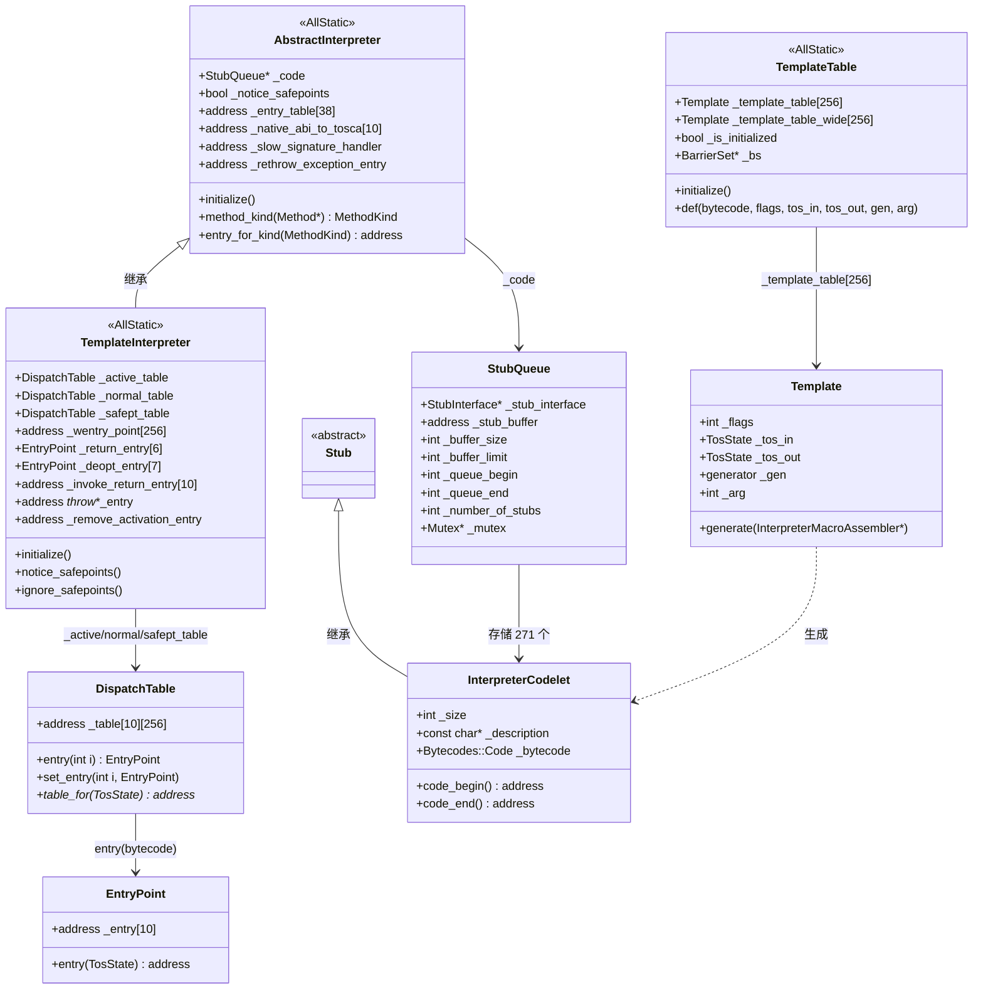
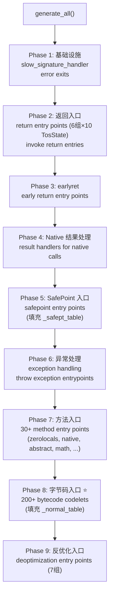
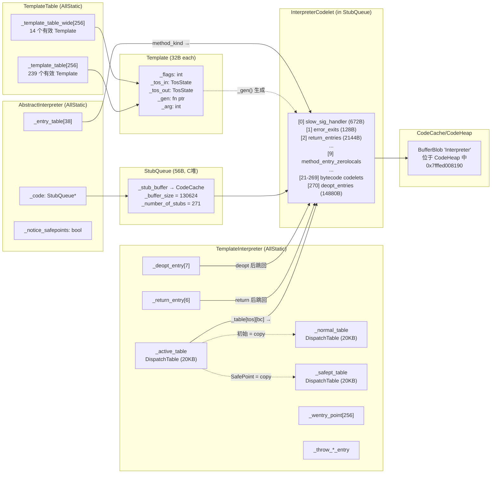

# 4C - 模板解释器 + TemplateTable 深入剖析

> **目标**：完整理解 JVM 模板解释器的初始化过程、核心数据结构、代码生成机制和运行时分发原理
> **标准环境**：`-Xms8g -Xmx8g -XX:+UseG1GC -Xint`，G1 Region = 4MB
> **源码版本**：OpenJDK 11
> **关联文档**：[4A-init_globals-DataStructure-Map.md](4A-init_globals-DataStructure-Map.md)、[4B-CodeCache-Deep-Dive.md](4B-CodeCache-Deep-Dive.md)
> **GDB 数据**：`new-jvm-md/tmp-file/interpreter/verify_result.txt`

---

## 第 0 部分：核心原理 ⭐

### 0.1 本质是什么？

本文深入分析 **4C - 模板解释器 + TemplateTable 深入剖析**：从源码角度理解其设计原理、实现机制和关键细节。

### 0.2 为什么需要？

理解 JVM 内部实现是排查复杂问题、进行性能优化的基础。表面的 API 文档无法解释 JVM 的实际行为，只有深入源码才能建立精确的心智模型。

### 0.3 怎么解决？

结合源码阅读、数据结构分析和 GDB 运行时验证，从多个角度建立对该机制的完整理解。

### 0.4 为什么这样设计？

每个设计决策都有其权衡：性能 vs 正确性、简单性 vs 灵活性、内存占用 vs 查找速度。理解这些权衡是理解 JVM 设计的关键。

---


## 一、问题引入：为什么需要模板解释器？

### 1.1 解释器的两种实现方式

JVM 需要执行 Java 字节码。最直接的方式是用 C++ 写一个 `switch-case` 循环：

```cpp
// 假设的 switch-based 解释器（JVM 中叫 CppInterpreter）
while (true) {
    switch (*bcp++) {
        case Bytecodes::_iconst_0: stack.push(0); break;
        case Bytecodes::_iadd:     a = stack.pop(); b = stack.pop(); stack.push(a+b); break;
        case Bytecodes::_iload:    idx = *bcp++; stack.push(locals[idx]); break;
        // ... 200+ 分支 ...
    }
}
```

**问题**：
1. **间接跳转开销**：每条字节码执行完，必须回到 switch 顶部再跳转——多了一次间接跳转
2. **无法寄存器缓存**：C 编译器不知道"栈顶值可以放寄存器"，每次都走内存
3. **分支预测差**：switch 编译为间接跳转表，CPU 分支预测器面对 200+ 目标很难预测

### 1.2 模板解释器的解决方案

**Template Interpreter**（HotSpot 默认）为每条字节码生成一段独立的机器码片段（**codelet**），每个 codelet 的末尾直接跳到下一条字节码的 codelet：

```
iconst_0 codelet:           iadd codelet:              iload codelet:
  push 0 → rax               pop rbx; pop rax           movzbl index, bcp
  dispatch_next()             add rax, rbx               mov rax, locals[index]
  ──────────────►             dispatch_next()            dispatch_next()
                              ──────────────►            ──────────────►
```

**关键优势**：
| 问题 | switch 解释器 | 模板解释器 |
|------|-------------|-----------|
| 跳转次数 | 2次（回到 switch + 跳到目标）| 1次（直接跳到下一个 codelet）|
| 栈顶缓存 | 无（总是读写内存）| TOS Cache（栈顶值缓存在寄存器，如 rax）|
| 分支预测 | 差（200+ 间接目标）| 好（每个 codelet 的 dispatch 有独立的分支历史）|
| 代码质量 | C 编译器通用优化 | 手写汇编，针对每条字节码最优化 |

### 1.3 核心设计问题

本文要回答的问题：
1. **怎么描述每条字节码的代码生成规则？** → Template + TemplateTable
2. **生成的机器码存在哪里？** → InterpreterCodelet + StubQueue（存储在 CodeCache 中的 BufferBlob 内）
3. **运行时怎么分发到正确的 codelet？** → DispatchTable + TosState
4. **初始化的完整流程是什么？** → interpreter_init() → 9 阶段的 generate_all()

---

## 二、类层次与职责

### 2.1 全景类图



### 2.2 职责分工

| 类 | 职责 | 生命阶段 |
|----|------|---------|
| **TemplateTable** | 字节码 → 模板的"蓝图"（元数据 + 代码生成函数指针）| 初始化时填充，之后只读 |
| **Template** | 单条字节码的生成规则（flags, tos_in, tos_out, generator）| 初始化时填充，之后只读 |
| **TemplateInterpreter** | 管理入口点表、分发表、异常入口 | 初始化时填充，运行时切换 active/safept |
| **StubQueue** | codelet 存储容器（环形缓冲区）| 初始化时分配写入，之后只读 |
| **InterpreterCodelet** | 一段生成的机器码（头 + 代码）| 存储在 StubQueue 中 |
| **DispatchTable** | 分发表 `[TosState][bytecode] → codelet地址` | 初始化时填充，SafePoint 时切换 |
| **EntryPoint** | 一条字节码的 10 个入口（每种 TosState 一个）| DispatchTable 的行 |

---

## 三、数据结构详解

### 3.1 Template（32 字节）

Template 是字节码的"元数据卡片"——描述一条字节码需要什么输入状态、产出什么输出状态、用哪个函数来生成机器码。

#### 内存布局（GDB 验证）

```
┌──────────────────────────────────────────────────────────┐
│                   Template (32 bytes)                     │
├──────┬──────┬──────┬──────┬────────────────┬─────────────┤
│ +0   │ +4   │ +8   │ +12  │ +16            │ +24         │
│ _flags│ _tos │ _tos │(pad) │ _gen           │ _arg        │
│ (int) │ _in  │ _out │      │ (fn ptr, 8B)   │ (int, 4B)   │
│  4B   │ 4B   │ 4B   │ 4B   │     8B         │ 4B + 4B pad │
└──────┴──────┴──────┴──────┴────────────────┴─────────────┘
```

> **GDB 验证**（Part 5）：`_flags at +0, _tos_in at +4, _tos_out at +8, _gen at +16, _arg at +24`

#### _flags 位掩码

`_flags` 是一个 4 位的位掩码，每一位的含义：

```
bit 3    bit 2    bit 1    bit 0
iswd     clvm     disp     ubcp
│        │        │        └── uses_bcp:      需要 bcp 指向字节码（读操作数）
│        │        └─────── does_dispatch:  codelet 自己做分发（不走统一 dispatch）
│        └──────────────── calls_vm:       可能调用 VM 运行时
└───────────────────────── wide_bit:       属于 wide 指令
```

| 常量 | 值 | 含义 |
|------|---|------|
| `ubcp` | 1 (bit 0) | 字节码有操作数，需要读取 bcp 后面的字节 |
| `disp` | 2 (bit 1) | codelet 自行完成到下一条字节码的跳转 |
| `clvm` | 4 (bit 2) | 执行过程中可能调用 VM（如字节码重写、类加载等）|
| `iswd` | 8 (bit 3) | 属于 `wide` 前缀版本的字节码 |

#### 典型字节码的 Template 数据（GDB 验证 Part 4）

| 字节码 | opcode | _flags | 含义 | _tos_in | _tos_out |
|--------|--------|--------|------|---------|----------|
| `nop` | 0 | 0 (`____`) | 什么都不做 | vtos(9) | vtos(9) |
| `iconst_0` | 3 | 0 (`____`) | 常量0 | vtos(9) | itos(4) |
| `iload` | 21 | 5 (`ubcp\|clvm`) | 局部变量加载 | vtos(9) | itos(4) |
| `iadd` | 96 | 0 (`____`) | 整数加法 | itos(4) | itos(4) |
| `_return` | 177 | 6 (`disp\|clvm`) | void 返回 | vtos(9) | vtos(9) |
| `invokevirtual` | 182 | 7 (`ubcp\|disp\|clvm`) | 虚方法调用 | vtos(9) | vtos(9) |

> **注意**：`_iload` 的 flags=5 而非 1，因为 `_iload` 的实现包含字节码重写逻辑（可能重写为 `_fast_iload` / `_fast_iload2` / `_fast_icaload`），重写过程需要调用 VM。

#### TosState（Top-of-Stack State）枚举

解释器将栈顶值缓存在寄存器中（x86_64 上通常是 `rax`）。TosState 描述栈顶缓存中当前存放的数据类型：

| TosState | 值 | 含义 | 寄存器 |
|----------|---|------|--------|
| btos | 0 | byte | rax (低8位) |
| ztos | 1 | boolean | rax (低8位) |
| ctos | 2 | char | rax (低16位) |
| stos | 3 | short | rax (低16位) |
| itos | 4 | int | rax (低32位) |
| ltos | 5 | long | rax (全64位) |
| ftos | 6 | float | xmm0 |
| dtos | 7 | double | xmm0 |
| atos | 8 | object reference | rax (全64位) |
| vtos | 9 | void（栈顶无缓存）| 无 |

`number_of_states = 10`，这决定了 EntryPoint 有 10 个 entry、DispatchTable 有 10 行。

### 3.2 InterpreterCodelet（40 字节头 + 对齐填充 + 机器码）

InterpreterCodelet 继承自 Stub，是解释器中一段生成机器码的"包装"。

#### 内存布局（GDB 验证 Part 6）

```
sizeof(InterpreterCodelet) = 40 (debug build, 含 CodeStrings)
codelet_hdr = align_up(40, 32) = 64

┌─────────────────────────────────────────────────────────────┐
│              InterpreterCodelet 内存布局                       │
├─────────┬───────────────┬────────────────┬────────┬─────────┤
│ +0      │ +8            │ +16            │ +20    │ +40..63 │
│ _size   │ _description  │ _bytecode      │ DEBUG: │ padding │
│ (int,4B)│ (ptr, 8B)     │ (int, 4B)      │_strings│ to 64   │
│         │               │                │ (20B)  │         │
├─────────┴───────────────┴────────────────┴────────┴─────────┤
│ +64: code_begin                                              │
│ ┌─────────────────────────────────────────────────────────┐ │
│ │              生成的机器码                                  │ │
│ │         （大小 = _size - 64）                              │ │
│ └─────────────────────────────────────────────────────────┘ │
│ +_size: code_end (也是 this + _size)                         │
└─────────────────────────────────────────────────────────────┘
```

> **GDB 验证**：`_size at +0, _description at +8, _bytecode at +16, codelet_hdr=64`

#### 关键方法

```cpp
code_begin() = (address)this + align_up(sizeof(InterpreterCodelet), CodeEntryAlignment);  // this + 64
code_end()   = (address)this + _size;
code_size()  = code_end() - code_begin() = _size - 64;
size()       = _size;  // StubQueue 用这个来遍历
```

### 3.3 StubQueue（56 字节）

StubQueue 是 codelet 的线性容器——在 CodeCache 中分配一个 BufferBlob，然后在其中连续存放 271 个 InterpreterCodelet。

#### GDB 验证数据（Part 3）

```
StubQueue at 0x7ffff0c95410              ← C 堆分配
  _stub_interface  = 0x7ffff0c95480      ← InterpreterCodeletInterface 对象
  _stub_buffer     = 0x7fffed008c20      ← CodeCache 中 BufferBlob 的 code 区域
  _buffer_size     = 130624 (127 KB)     ← BufferBlob 的 code 区域大小
  _buffer_limit    = 130624 (127 KB)     ← deallocate_unused_tail() 后 = _queue_end（精确裁剪）
  _queue_begin     = 0                   ← 第一个 codelet 的偏移
  _queue_end       = 130624              ← 最后一个 codelet 之后的偏移 = _buffer_limit
  _number_of_stubs = 271                 ← 总 codelet 数量
  _mutex           = (nil)               ← 解释器初始化后不再修改，无需锁
  used_space       = 130624 bytes (127 KB) ← 全部使用
```

> **关键洞察**：`_queue_end == _buffer_limit == _buffer_size`，说明 `deallocate_unused_tail()` 完成后 StubQueue 被精确裁剪，没有浪费空间。

#### 遍历方式

```cpp
// StubQueue 的遍历：连续内存，按 _size 跳转
Stub* first() = stub_at(_queue_begin);  // _stub_buffer + 0
Stub* next(s) = stub_at(index_of(s) + stub_size(s));  // 当前地址 + _size → 下一个
```

### 3.4 DispatchTable（20,480 字节）

分发表是模板解释器的"灵魂"——运行时通过它将 `(当前TosState, 下一条字节码)` 映射为跳转目标地址。

#### 结构

```
sizeof(DispatchTable) = 20480 bytes = 10 × 256 × 8

_table[TosState][bytecode] → address (codelet 内的入口地址)

         bytecode →  0(nop)  1(aconst_null)  ...  96(iadd)  ...  182(invokevirtual)  ...  255
TosState ↓
  btos(0)          addr     addr            ...  addr      ...  addr               ...  addr
  ztos(1)          addr     addr            ...  addr      ...  addr               ...  addr
  ...
  itos(4)          addr     addr            ...  addr      ...  addr               ...  addr
  ...
  vtos(9)          addr     addr            ...  addr      ...  addr               ...  addr
```

#### 三个实例

| 实例 | 用途 | 切换时机 |
|------|------|---------|
| `_normal_table` | 正常执行时的分发表 | 初始化时一次性填充 |
| `_safept_table` | SafePoint 激活时的分发表（每次分发前检查 SafePoint）| 初始化时一次性填充 |
| `_active_table` | 当前生效的分发表（运行时实际使用）| 初始 = `_normal_table`；SafePoint 时切换 |

#### GDB 验证（Part 9）

```
_normal_table[vtos][_nop]            = 0x7fffed01387f
_active_table[vtos][_nop]            = 0x7fffed01387f     ← 相同！
_normal_table[itos][_iadd]           = 0x7fffed0180e7
_active_table[itos][_iadd]           = 0x7fffed0180e7     ← 相同！
_normal_table[vtos][_invokevirtual]  = 0x7fffed01f69f
_active_table[vtos][_invokevirtual]  = 0x7fffed01f69f     ← 相同！

_safept_table[vtos][_nop]  = 0x7fffed00dda0              ← 不同于 normal！
_safept_table[itos][_iadd] = 0x7fffed00e309              ← 不同于 normal！

normal == active for [vtos][_nop]? 1                      ← 初始化后 active = normal
```

> **SafePoint 切换机制**：
> - `notice_safepoints()`: 将 `_safept_table` 整体拷贝到 `_active_table`（20KB memcpy）
> - `ignore_safepoints()`: 将 `_normal_table` 整体拷贝到 `_active_table`

### 3.5 EntryPoint（80 字节）

每条字节码通过分发表可得到一个 EntryPoint，其中包含 10 个地址（对应 10 种 TosState）。执行时根据当前 TosState 选择正确的入口地址。

```
sizeof(EntryPoint) = 80 = 10 × 8 (bytes)

_entry[0] = btos entry address
_entry[1] = ztos entry address
...
_entry[9] = vtos entry address
```

> 大多数字节码只对 `_tos_in` 对应的 TosState 生成有效代码，其他 TosState 的入口指向 "先把寄存器值 push 到栈，再跳到 vtos 入口" 的适配代码。

### 3.6 InvocationCounter（4 字节）

```
sizeof(InvocationCounter) = 4

┌──────────────────────────────────────────────┐
│          InvocationCounter (32 bits)          │
├──────────────────────┬────────┬──────────────┤
│ count (bit 3..31)    │carry(2)│ state (0..1) │
│     29 bits          │ 1 bit  │   2 bits     │
└──────────────────────┴────────┴──────────────┘
```

| 阈值 | 值 | 含义 |
|------|---|------|
| InterpreterInvocationLimit | 80000 | 调用次数达到此值触发 JIT 编译（`-Xint` 下无意义）|
| InterpreterBackwardBranchLimit | 112000 | 回边次数达到此值触发 OSR 编译 |
| InterpreterProfileLimit | 26400 | 达到此值开始性能分析 |

> **GDB 验证**（Part 13）：三个阈值均已确认。`-Xint` 模式下这些阈值虽然被设置，但不会触发编译。

---

## 四、初始化全流程

### 4.1 调用链总览

```
init_globals()                        [init.cpp:104]
├── interpreter_init()                [interpreter/abstractInterpreter.cpp:36]
│   └── TemplateInterpreter::initialize()  [templateInterpreter.cpp:40]
│       ├── TemplateTable::initialize()    [templateTable.cpp:255]  ← 填充 _template_table[256] 元数据
│       ├── new StubQueue(...)             ← 创建 codelet 容器 (127KB in BufferBlob)
│       ├── TemplateInterpreterGenerator(code).generate_all()  ← 9 阶段，生成 271 codelets
│       ├── code->deallocate_unused_tail() ← 精确裁剪 BufferBlob
│       └── _active_table = _normal_table  ← 复制分发表
│
└── templateTable_init()              [templateTable.cpp:1]
    └── TemplateTable::_is_initialized = true  ← 标记完成
```

### 4.2 阶段一：TemplateTable::initialize() — 填充模板元数据

**做什么**：为 256 个标准字节码和 14 个 wide 字节码填充 Template 结构。

**核心代码**（`templateTable.cpp:255-556`）：

```cpp
void TemplateTable::initialize() {
    // 标志常量
    const int ubcp = 1 << Template::uses_bcp_bit;      // 1
    const int disp = 1 << Template::does_dispatch_bit;  // 2
    const int clvm = 1 << Template::calls_vm_bit;       // 4
    const int iswd = 1 << Template::wide_bit;           // 8
    const int ____ = 0;

    //                bytecode              flags         tos_in  tos_out   generator            arg
    def(Bytecodes::_nop,                ____|____|____|____, vtos, vtos, nop,                 _);
    def(Bytecodes::_aconst_null,        ____|____|____|____, vtos, atos, aconst_null,         _);
    def(Bytecodes::_iconst_m1,          ____|____|____|____, vtos, itos, iconst,             -1);
    def(Bytecodes::_iconst_0,           ____|____|____|____, vtos, itos, iconst,              0);
    // ...
    def(Bytecodes::_iload,              ubcp|____|clvm|____, vtos, itos, iload,              _);
    // ...
    def(Bytecodes::_iadd,               ____|____|____|____, itos, itos, iop2,     add(lir_add));
    // ...
    def(Bytecodes::_invokevirtual,      ubcp|disp|clvm|____, vtos, vtos, invokevirtual,     _);
    // ...
    // 总共约 270 行 def() 调用
}
```

**def() 方法做了什么**：

```cpp
void TemplateTable::def(Bytecodes::Code code, int flags, TosState in, TosState out, 
                        void (*gen)(int), int arg) {
    Template* t = is_wide ? &_template_table_wide[code] : &_template_table[code];
    t->initialize(flags, in, out, gen, arg);
}
```

简单地将参数填入 Template 结构的 5 个字段。

#### GDB 验证（Part 12）

| 数组 | 有效模板数 |
|------|-----------|
| `_template_table[256]` | **239** 个有效（有 `_gen` 函数指针）|
| `_template_table_wide[256]` | **14** 个有效 |

> **256 - 239 = 17** 个标准字节码没有模板，因为：
> - `_breakpoint` (202)、`_fast_*` (209-238) 等内部字节码在 TemplateTable 中没有独立的 `def()` 调用
> - 某些保留字节码未定义
> - 14 个 wide 字节码对应的标准版本已经有模板，wide 版本是额外的

### 4.3 阶段二：创建 StubQueue

```cpp
// TemplateInterpreter::initialize()
_code = new StubQueue(new InterpreterCodeletInterface, code_size, NULL, "Interpreter");
```

- `code_size` = `InterpreterCodeSize` = **256KB**（x86_64 平台，`src/cpu/x86/templateInterpreterGenerator_x86_64.cpp:40`）
- 在 CodeCache 的 CodeHeap 中分配一个 BufferBlob，其内 code 区域大小 ≈ 256KB
- StubQueue 本身 56 字节，在 C 堆分配
- `_mutex = NULL`：初始化期间单线程，无需锁

### 4.4 阶段三：generate_all() — 9 阶段生成 271 个 Codelets

这是解释器初始化的**核心**。`TemplateInterpreterGenerator::generate_all()` 分 9 个阶段，按顺序生成所有 codelet：



#### Phase 1: 基础设施 stubs

| codelet | 编号 | size | 作用 |
|---------|-----|------|------|
| slow signature handler | [0] | 672B | JNI native 方法的参数打包（慢路径）|
| error exits | [1] | 128B | 错误退出 |

#### Phase 2: 返回入口

| codelet | 编号 | size | 作用 |
|---------|-----|------|------|
| return entry points | [2] | 2144B | 从 `invoke*` 指令返回后的入口（6 组 × 10 TosState）|
| invoke return entry points | [3] | 2144B | 为不同 invoke 类型（static/virtual/interface/dynamic）设置返回地址 |

> `_return_entry[length]._entry[TosState]`：根据调用指令的字节长度（1-5）和返回值类型分发。

#### Phase 3: Early Return

| codelet | 编号 | size | 作用 |
|---------|-----|------|------|
| earlyret entry points | [4] | 15616B | JVMTI ForceEarlyReturn 支持 |

> 这个 codelet 特别大（15KB），因为 debug 构建包含详细的注释和断言代码。

#### Phase 4: Native 结果处理

| codelet | 编号 | size | 作用 |
|---------|-----|------|------|
| result handlers for native calls | [5] | 96B | JNI native 方法返回值从 C ABI 转为 TosState |

#### Phase 5: SafePoint 入口

| codelet | 编号 | size | 作用 |
|---------|-----|------|------|
| safepoint entry points | [6] | 3488B | SafePoint 版本的字节码分发入口 |

> 这里为每种 TosState 生成一个 safepoint entry，填充 `_safept_table`。SafePoint entry 的逻辑：先检查 SafePoint pending 标志，如果需要则调用 VM 挂起线程。

#### Phase 6: 异常处理

| codelet | 编号 | size | 作用 |
|---------|-----|------|------|
| exception handling | [7] | 6144B | throw_exception, remove_activation, rethrow |
| throw exception entrypoints | [8] | 2240B | 各种异常入口（NPE, AIOOBE, SOE, ArithExc 等）|

#### GDB 验证（Part 10）：异常入口地址

```
_throw_exception_entry          = 0x7fffed00eb53
_throw_ArrayIndexOutOfBounds    = 0x7fffed010340
_throw_NullPointerException     = 0x7fffed0108c1
_throw_StackOverflowError       = 0x7fffed010a3b
_throw_ArithmeticException      = 0x7fffed0105fd
_remove_activation_entry        = 0x7fffed00fa98
```

> 所有异常入口地址在 `[0x7fffed00eb53 .. 0x7fffed010a3b]` 范围内，属于 codelet [7] 和 [8]。

#### Phase 7: 方法入口（30+ 种）

这是根据方法类型选择不同入口的关键阶段。MethodKind 枚举定义了 30+ 种方法类型：

| codelet | 编号 | MethodKind | size | 作用 |
|---------|-----|-----------|------|------|
| zerolocals | [9] | 0 | 672B | 普通 Java 方法入口 |
| zerolocals_synchronized | [10] | 1 | 1312B | synchronized 方法入口 |
| abstract | [11] | 6 | 448B | 抽象方法（抛出 AbstractMethodError）|
| java_lang_math_sin | [12] | 7 | 96B | Math.sin() 内建实现 |
| ... | [13-18] | 8-13 | 96B each | Math.cos/tan/abs/sqrt/log/log10/exp |
| native | [20左右] | 2 | — | JNI native 方法入口 |
| native_synchronized | — | 3 | — | synchronized native 方法入口 |

> **注意**：`-Xint` 模式下 `_entry_table[empty]` 和 `_entry_table[accessor]` 都指向 `_entry_table[zerolocals]`（因为没有 JIT，不需要快速路径优化）。

#### GDB 验证（Part 2）：方法入口表

```
_entry_table[zerolocals]           = 0x7fffed010c00
_entry_table[zerolocals_sync]      = 0x7fffed010ea0
_entry_table[native]               = 0x7fffed011aa0
_entry_table[native_synchronized]  = 0x7fffed0126c0
_entry_table[empty]                = 0x7fffed010c00  ← 与 zerolocals 相同！
_entry_table[accessor]             = 0x7fffed010c00  ← 与 zerolocals 相同！
_entry_table[abstract]             = 0x7fffed0113c0
```

#### Phase 8: 字节码入口 ⭐ 核心

这是生成 200+ 个字节码 codelet 的主阶段。核心调用链：

```
generate_all()
  └── for each bytecode:
      set_entry_points(code)
        └── set_short_entry_points(t, bep, cep, sep, aep, iep, lep, fep, dep, vep)
            └── generate_and_dispatch(t, itos)  // 或其他 TosState
                ├── t->generate(_masm)          // 调用 Template 中的 _gen 函数指针
                │   └── _gen(_masm, _arg)       // 实际的机器码生成（平台相关）
                └── dispatch_epilog(tos_out)    // 生成 dispatch_next 跳转
```

**set_short_entry_points 的逻辑**：

```
根据 Template 的 _tos_in（期望的输入 TosState）:
  1. 对 _tos_in 状态，直接跳到生成的代码 → 这是"主入口"
  2. 对其他 TosState：
     - 先生成"push 当前 TOS 到栈"的适配代码
     - 再跳到 vtos 版本的入口
  3. 结果：得到 10 个入口地址 (bep, zep, cep, sep, aep, iep, lep, fep, dep, vep)
```

**dispatch_epilog 的逻辑**：

```asm
// 分发到下一条字节码（伪代码）
movzbl  1(%r13), %ebx           // 读下一条字节码 opcode
inc     %r13                    // bcp++
movabs  _active_table[tos_out], %r10  // 加载分发表的对应行
jmp     *(%r10, %rbx, 8)       // 跳转到 _active_table[tos_out][next_bytecode]
```

这就是 "threading" —— 每个 codelet 末尾直接跳到下一个 codelet，无需返回统一的分发循环。

#### Phase 9: 反优化入口

| codelet | 编号 | size | 作用 |
|---------|-----|------|------|
| deoptimization entry points | [270] | 14880B | JIT 编译代码被优化回退时，返回解释器的入口 |

> `_deopt_entry[length]._entry[TosState]`：7 组 × 10 个 TosState = 70 个入口。

### 4.5 完整 Codelet 列表（271 个）

#### 前 20 个 Codelets（GDB Part 7）

| # | 地址 | size | bc | code_size | 描述 |
|---|------|------|----|-----------|------|
| 0 | 0x7fffed008c20 | 672 | -1 | 608 | slow signature handler |
| 1 | 0x7fffed008ec0 | 128 | -1 | 64 | error exits |
| 2 | 0x7fffed008f40 | 2144 | -1 | 2080 | return entry points |
| 3 | 0x7fffed0097a0 | 2144 | -1 | 2080 | invoke return entry points |
| 4 | 0x7fffed00a000 | 15616 | -1 | 15552 | earlyret entry points |
| 5 | 0x7fffed00dd00 | 96 | -1 | 32 | result handlers for native calls |
| 6 | 0x7fffed00dd60 | 3488 | -1 | 3424 | safepoint entry points |
| 7 | 0x7fffed00eb00 | 6144 | -1 | 6080 | exception handling |
| 8 | 0x7fffed010300 | 2240 | -1 | 2176 | throw exception entrypoints |
| 9 | 0x7fffed010bc0 | 672 | -1 | 608 | method entry point (kind = zerolocals) |
| 10 | 0x7fffed010e60 | 1312 | -1 | 1248 | method entry point (kind = zerolocals_synchronized) |
| 11 | 0x7fffed011380 | 448 | -1 | 384 | method entry point (kind = abstract) |
| 12 | 0x7fffed011540 | 96 | -1 | 32 | method entry point (kind = java_lang_math_sin) |
| 13 | 0x7fffed0115a0 | 96 | -1 | 32 | method entry point (kind = java_lang_math_cos) |
| 14 | 0x7fffed011600 | 96 | -1 | 32 | method entry point (kind = java_lang_math_tan) |
| 15 | 0x7fffed011660 | 96 | -1 | 32 | method entry point (kind = java_lang_math_abs) |
| 16 | 0x7fffed0116c0 | 96 | -1 | 32 | method entry point (kind = java_lang_math_sqrt) |
| 17 | 0x7fffed011720 | 96 | -1 | 32 | method entry point (kind = java_lang_math_log) |
| 18 | 0x7fffed011780 | 96 | -1 | 32 | method entry point (kind = java_lang_math_log10) |
| 19 | 0x7fffed0117e0 | 96 | -1 | 32 | method entry point (kind = java_lang_math_exp) |

> **观察**：bc=-1 表示这些是基础设施 codelet（不对应特定字节码）。Math 内建函数 size 都只有 96B（code_size=32B），因为在 `-Xint` 模式下它们只是跳转到通用解释路径。

#### 最后 10 个 Codelets（GDB Part 8）

| # | 地址 | size | bc | code_size | 描述 |
|---|------|------|----|-----------|------|
| 261 | 0x7fffed0235e0 | 608 | 230 | 544 | fast_aldc |
| 262 | 0x7fffed023840 | 608 | 231 | 544 | fast_aldc_w |
| 263 | 0x7fffed023aa0 | 2208 | 232 | 2144 | return_register_finalizer |
| 264 | 0x7fffed024340 | 672 | 233 | 608 | invokehandle |
| 265 | 0x7fffed0245e0 | 832 | 234 | 768 | nofast_getfield |
| 266 | 0x7fffed024920 | 1280 | 235 | 1216 | nofast_putfield |
| 267 | 0x7fffed024e20 | 160 | 236 | 96 | nofast_aload_0 |
| 268 | 0x7fffed024ec0 | 192 | 237 | 128 | nofast_iload |
| 269 | 0x7fffed024f80 | 192 | 238 | 128 | _shouldnotreachhere |
| 270 | 0x7fffed025040 | 14880 | -1 | 14816 | deoptimization entry points |

> **观察**：
> - 最后的字节码 codelets（261-269）是 HotSpot 内部使用的"重写字节码"（bc=230-238），不是标准 Java 字节码
> - `_shouldnotreachhere`（[269]）是兜底 codelet——如果分发到了未定义的字节码，到这里
> - `deoptimization entry points`（[270]）是最大的 codelet（14880B），因为要覆盖 7×10=70 个入口

---

## 五、运行时字节码执行循环

### 5.1 执行流程

```
┌─────────────────────────────────────────────────────────────────────┐
│                   字节码执行循环 (Threading)                          │
│                                                                     │
│  方法入口 (zerolocals codelet)                                       │
│    │                                                                │
│    ├── 设置栈帧 (rbp, rsp)                                          │
│    ├── 初始化局部变量为 0                                             │
│    ├── dispatch_next(vtos)  ← 分发第一条字节码                        │
│    │                                                                │
│    ▼                                                                │
│  ┌─────────────────┐    ┌─────────────────┐    ┌─────────────────┐ │
│  │ iconst_0 codelet│───▶│  istore codelet │───▶│  iload codelet  │ │
│  │                 │    │                 │    │                 │ │
│  │ mov rax, 0      │    │ mov locals[n],  │    │ mov rax,        │ │
│  │ dispatch_next   │    │     rax         │    │     locals[n]   │ │
│  │ (itos)          │    │ dispatch_next   │    │ dispatch_next   │ │
│  │                 │    │ (vtos)          │    │ (itos)          │ │
│  └─────────────────┘    └─────────────────┘    └─────────────────┘ │
│    TOS: vtos→itos         TOS: itos→vtos         TOS: vtos→itos   │
│                                                                     │
│  dispatch_next(tos_out) 的实现：                                      │
│    movzbl  (%r13), %ebx           // r13=bcp, 读下一条字节码         │
│    add     $N, %r13               // bcp += 当前字节码长度            │
│    movabs  _active_table[tos_out], %r10  // 取分发表行                │
│    jmp     *(%r10, %rbx, 8)       // 跳转到目标 codelet               │
│                                                                     │
└─────────────────────────────────────────────────────────────────────┘
```

### 5.2 TosState 如何驱动分发

**核心思想**：每个 codelet 结束时产出一个 TosState（`_tos_out`），这个 TosState 决定了**从哪一行分发表**查找下一个 codelet。

```
假设执行序列: iconst_0 → iadd

1. iconst_0:
   _tos_in = vtos → 不需要栈顶缓存
   执行: mov $0, %rax
   _tos_out = itos → 下一步从 _active_table[itos] 行分发

2. dispatch_next(itos):
   _active_table[itos][next_bytecode] → 找到 iadd 的 itos 入口

3. iadd:
   _tos_in = itos → rax 中已有一个 int（来自上一步的 tos_out=itos）
   执行: pop %rbx; add %rbx, %rax
   _tos_out = itos → 结果留在 rax

4. dispatch_next(itos):
   _active_table[itos][next_bytecode] → 继续...
```

### 5.3 SafePoint 切换

当 VM 需要在安全点暂停所有 Java 线程时：

```
notice_safepoints():
  for (TosState s = btos; s < number_of_states; s++) {
    memcpy(_active_table._table[s], _safept_table._table[s], 256 * sizeof(address));
  }
  // _active_table 现在指向 SafePoint 版本的 codelet
  // 每个 SafePoint codelet 在执行前会检查 SafePoint pending 标志

ignore_safepoints():
  for (TosState s = btos; s < number_of_states; s++) {
    memcpy(_active_table._table[s], _normal_table._table[s], 256 * sizeof(address));
  }
  // 恢复正常分发
```

> **为什么用 memcpy 而不是指针切换**？因为 `_active_table` 的地址在 codelet 生成时被硬编码进了机器码（`movabs _active_table[tos], %r10`）。换指针就意味着要修改所有 codelet 中的地址，而 memcpy 只需要改表内容。

### 5.4 Wide 字节码处理

14 个字节码支持 `wide` 前缀（扩展操作数从 1 字节到 2 字节）：

```
_wentry_point[_iload=21]  = 0x7fffed014fda
_wentry_point[_istore=54] = 0x7fffed01652a
_wentry_point[_iinc=132]  = 0x7fffed019407
_wentry_point[_ret=169]   = 0x7fffed01ab75
```

> **处理方式**：`wide`（opcode=196）本身是一个 codelet，它读取下一个字节码 opcode，然后查 `_wentry_point[opcode]` 表跳转到 wide 版本的实现。

---

## 六、内存布局全景

### 6.1 解释器在 CodeCache 中的位置

```
CodeCache: [0x7fffed000000 .. 0x7ffff0000000] (48MB reserved, ~2.5MB committed)

0x7fffed000000  ┌─────────────────────────────────┐
                │ flush_icache_stub BufferBlob     │ (208B)
                │ VM_Version BufferBlob            │ (2144B)
                │ StubRoutines (1) BufferBlob      │ (30144B)
                │ wrong_method/StackOverflow stubs │
0x7fffed008190  ├─────────────────────────────────┤
                │ Interpreter BufferBlob           │ ← Header (120B CodeBlob)
0x7fffed008c20  │ ┌─────────────────────────────┐ │ ← StubQueue._stub_buffer
                │ │ codelet[0]: slow sig handler │ │ (672B)
                │ │ codelet[1]: error exits      │ │ (128B)
                │ │ codelet[2]: return entries   │ │ (2144B)
                │ │ ...                          │ │
                │ │ codelet[9-20]: method entries │ │
                │ │ ...                          │ │
                │ │ codelet[21-269]: bytecodes   │ │ ← 200+ 字节码 codelets
                │ │ codelet[270]: deopt entries  │ │ (14880B)
0x7fffed028a60  │ └─────────────────────────────┘ │ ← StubQueue._queue_end = 130624
                ├─────────────────────────────────┤
                │ MethodHandles adapters          │ (182144B)
                │ ...                             │
```

### 6.2 StubQueue 内部布局

```
_stub_buffer (0x7fffed008c20)
│
▼
┌──────────────────┬──────────────────┬──────────────────┬─────┬──────────────────┐
│ InterpreterCodelet│ InterpreterCodelet│ InterpreterCodelet│ ... │ InterpreterCodelet│
│ [0] slow sig     │ [1] error exits  │ [2] return entry │     │ [270] deopt      │
│                  │                  │                  │     │                  │
│ ┌──────────────┐│ ┌──────────────┐ │ ┌──────────────┐ │     │ ┌──────────────┐ │
│ │hdr(64B)      ││ │hdr(64B)      │ │ │hdr(64B)      │ │     │ │hdr(64B)      │ │
│ │_size=672     ││ │_size=128     │ │ │_size=2144    │ │     │ │_size=14880   │ │
│ │_desc="slow.."││ │_desc="error."│ │ │_desc="return"│ │     │ │_desc="deopt."│ │
│ │_bytecode=-1  ││ │_bytecode=-1  │ │ │_bytecode=-1  │ │     │ │_bytecode=-1  │ │
│ ├──────────────┤│ ├──────────────┤ │ ├──────────────┤ │     │ ├──────────────┤ │
│ │ 机器码(608B) ││ │ 机器码(64B)  │ │ │ 机器码(2080B)│ │     │ │ 机器码       │ │
│ │              ││ │              │ │ │              │ │     │ │ (14816B)     │ │
│ └──────────────┘│ └──────────────┘ │ └──────────────┘ │     │ └──────────────┘ │
│ 672 bytes       │ 128 bytes        │ 2144 bytes       │     │ 14880 bytes      │
└──────────────────┴──────────────────┴──────────────────┴─────┴──────────────────┘
                                                               _queue_end = 130624
```

### 6.3 DispatchTable 内存布局

```
_active_table (TemplateInterpreter::_active_table)
sizeof = 20480 bytes = 20 KB

┌─────────────────────────────────────────────────────────────────────┐
│ _table[btos][0..255]   │ 256 × 8B = 2048B  │ btos 行的分发地址      │
│ _table[ztos][0..255]   │ 256 × 8B = 2048B  │ ztos 行               │
│ _table[ctos][0..255]   │ 256 × 8B = 2048B  │ ctos 行               │
│ _table[stos][0..255]   │ 256 × 8B = 2048B  │ stos 行               │
│ _table[itos][0..255]   │ 256 × 8B = 2048B  │ itos 行               │
│ _table[ltos][0..255]   │ 256 × 8B = 2048B  │ ltos 行               │
│ _table[ftos][0..255]   │ 256 × 8B = 2048B  │ ftos 行               │
│ _table[dtos][0..255]   │ 256 × 8B = 2048B  │ dtos 行               │
│ _table[atos][0..255]   │ 256 × 8B = 2048B  │ atos 行               │
│ _table[vtos][0..255]   │ 256 × 8B = 2048B  │ vtos 行               │
└─────────────────────────────────────────────────────────────────────┘
                          合计: 10 × 2048 = 20480B
```

---

## 七、数据结构关系图



---

## 八、关键数字总结

### 8.1 sizeof（GDB 验证 Part 1）

| 类 | sizeof (debug) | 说明 |
|----|---------------|------|
| Template | 32B | 5 字段 + 填充 |
| InterpreterCodelet | 40B | 3 字段 + DEBUG CodeStrings |
| StubQueue | 56B | 8 字段 |
| DispatchTable | 20,480B (20KB) | 10 × 256 × 8 |
| EntryPoint | 80B | 10 × 8 |
| InvocationCounter | 4B | 单个 int |

### 8.2 数量统计

| 数据 | 数量 | 来源 |
|------|------|------|
| 标准字节码模板 | 239 | Part 12 |
| Wide 字节码模板 | 14 | Part 12 |
| InterpreterCodelet | 271 | Part 3 |
| StubQueue 总大小 | 127 KB (130,624B) | Part 3 |
| DispatchTable 实例 | 3 (active/normal/safept) | Part 9 |
| 方法入口种类 | 38 (MethodKind 枚举大小) | Part 2 |
| TosState 种类 | 10 | 源码 |
| codelet 头大小 | 64B (对齐后) | Part 6 |

### 8.3 地址范围

| 区域 | 起始 | 结束 | 大小 |
|------|------|------|------|
| Interpreter BufferBlob code | 0x7fffed008c20 | 0x7fffed028a60 | 127 KB |
| 方法入口 codelets | 0x7fffed010bc0 | ~0x7fffed013800 | ~11 KB |
| 字节码 codelets | ~0x7fffed013800 | ~0x7fffed025040 | ~69 KB |
| deopt entry codelet | 0x7fffed025040 | 0x7fffed028a60 | ~14.5 KB |

---

## 九、JVM 参数与调试

### 9.1 查看解释器信息的参数

```bash
# 打印解释器代码（需要 debug build）
-XX:+PrintInterpreter

# 输出示例：
# ------Entry Point------
# slow signature handler  [0x7fffed008c60, 0x7fffed008ec0]  608 bytes
# error exits             [0x7fffed008f00, 0x7fffed008f40]  64 bytes
# return entry points     [0x7fffed008fa0, 0x7fffed009780]  2016 bytes
# ...
# nop                     [0x7fffed01387f, 0x7fffed013898]  25 bytes
# ...
```

```bash
# 打印字节码模板信息
-XX:+TraceBytecodes

# 输出示例：
# [thread] bci     bytecode
# [0x...] 0       iconst_0
# [0x...] 1       istore_1
# [0x...] 2       iload_1
```

### 9.2 关键源文件索引

| 源文件 | 内容 |
|--------|------|
| `share/interpreter/templateTable.hpp` | Template 类、TemplateTable 类定义 |
| `share/interpreter/templateTable.cpp` | `initialize()` + ~270 个 `def()` 调用 |
| `share/interpreter/templateInterpreter.hpp` | TemplateInterpreter、EntryPoint、DispatchTable |
| `share/interpreter/templateInterpreter.cpp` | `initialize()`、`notice_safepoints()`、`ignore_safepoints()` |
| `share/interpreter/templateInterpreterGenerator.hpp` | TemplateInterpreterGenerator 声明 |
| `share/interpreter/templateInterpreterGenerator.cpp` | `generate_all()`、`set_entry_points()` |
| `share/interpreter/abstractInterpreter.hpp` | AbstractInterpreter、MethodKind 枚举 |
| `share/interpreter/interpreter.hpp` | InterpreterCodelet、CodeletMark |
| `share/code/stubs.hpp` | Stub、StubInterface、StubQueue |
| `cpu/x86/templateTable_x86.cpp` | x86 平台字节码生成实现（4526 行）|
| `cpu/x86/templateInterpreterGenerator_x86.cpp` | x86 平台方法入口生成（1885 行）|
| `cpu/x86/templateInterpreterGenerator_x86_64.cpp` | x86_64 特有部分 |
| `share/utilities/globalDefinitions.hpp` | TosState 枚举定义 |
| `share/interpreter/invocationCounter.hpp` | InvocationCounter 类定义 |

---

## 十、设计总结

### 为什么是 Template Interpreter 而不是 C++ Interpreter？

| 维度 | C++ Interpreter | Template Interpreter |
|------|----------------|---------------------|
| 实现复杂度 | 低（C++ switch-case）| 高（手写汇编模板）|
| 分发效率 | 2 次跳转 | 1 次跳转（direct threading）|
| TOS 缓存 | 无 | 有（rax/xmm0）|
| 分支预测 | 差（集中间接跳转）| 好（分散间接跳转）|
| 可移植性 | 好 | 需要每个平台实现 |
| 调试难度 | 容易 | 难（需要读汇编）|

**HotSpot 的选择**：性能第一。Template Interpreter 虽然实现复杂，但作为 JVM 中执行时间最多的组件之一，微小的分发效率提升就能带来显著的整体性能改善。

### 分层设计的精妙之处

```
TemplateTable (元数据层)     →  "每条字节码该怎么生成"
    ↓ generate()
InterpreterCodelet (代码层)  →  "已生成的机器码"
    ↓ dispatch_next()
DispatchTable (分发层)       →  "运行时怎么跳转"
    ↓ SafePoint switching
_active_table (切换层)       →  "需要暂停时怎么切换"
```

每一层只关心自己的职责：
- **TemplateTable** 不关心生成的代码存在哪（只提供生成函数）
- **InterpreterCodelet** 不关心怎么被分发到（只知道自己的代码范围）
- **DispatchTable** 不关心 SafePoint（只存地址映射）
- **_active_table** 不关心代码生成（只做 normal ↔ safept 切换）

这种分层让每个组件都可以独立理解和测试。
