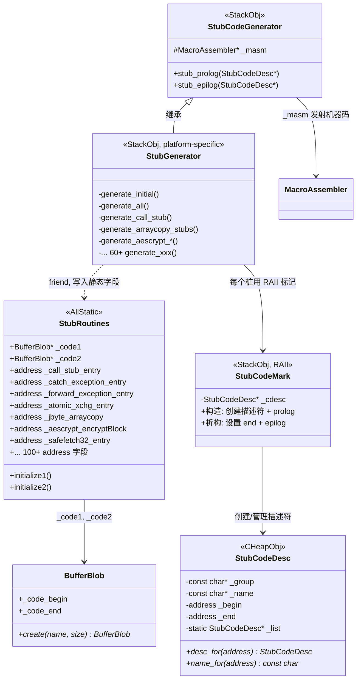
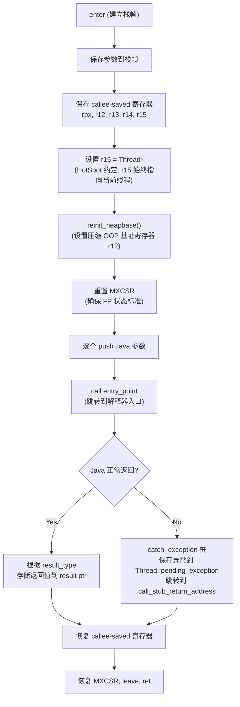
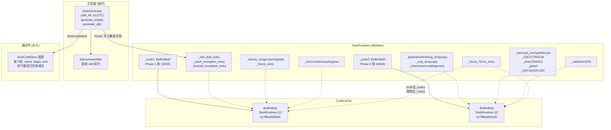

# 4D - StubRoutines 两阶段深入剖析

> **目标**：完整理解 StubRoutines 的两阶段初始化、所有桩代码的生成机制和运行时角色
> **标准环境**：`-Xms8g -Xmx8g -XX:+UseG1GC -Xint`，G1 Region = 4MB
> **源码版本**：OpenJDK 11
> **关联文档**：[4A-init_globals-DataStructure-Map.md](4A-init_globals-DataStructure-Map.md)、[4B-CodeCache-Deep-Dive.md](4B-CodeCache-Deep-Dive.md)
> **GDB 数据**：`new-jvm-md/tmp-file/stubroutines/verify_result.txt`

---

## 第 0 部分：核心原理 ⭐

### 0.1 本质是什么？

本文深入分析 **4D - StubRoutines 两阶段深入剖析**：从源码角度理解其设计原理、实现机制和关键细节。

### 0.2 为什么需要？

理解 JVM 内部实现是排查复杂问题、进行性能优化的基础。表面的 API 文档无法解释 JVM 的实际行为，只有深入源码才能建立精确的心智模型。

### 0.3 怎么解决？

结合源码阅读、数据结构分析和 GDB 运行时验证，从多个角度建立对该机制的完整理解。

### 0.4 为什么这样设计？

每个设计决策都有其权衡：性能 vs 正确性、简单性 vs 灵活性、内存占用 vs 查找速度。理解这些权衡是理解 JVM 设计的关键。

---


## 一、问题引入：为什么需要 StubRoutines？

### 1.1 JVM 运行时需要大量"胶水代码"

JVM 不是一个纯粹的解释器——它需要在 C++ 代码、解释器代码、编译代码之间频繁切换。这些切换点需要精心编写的机器码来处理：

| 场景 | 需要什么 |
|------|---------|
| C++ 调用 Java 方法 | **call_stub**：设置 Java 栈帧，压入参数，跳转到解释器 |
| Java 抛出异常 | **catch/forward_exception**：捕获异常，转发给正确的处理器 |
| 原子操作 | **atomic_xchg/cmpxchg/add**：保证跨平台的原子语义 |
| 数组拷贝 | **arraycopy**：高度优化的内存拷贝（利用 AVX/SSE 等 SIMD 指令）|
| 加密计算 | **AES/SHA/CRC32**：利用硬件加速指令（AES-NI、SHA-NI、PCLMULQDQ）|
| 数学函数 | **libm**：内联的 sin/cos/exp/log（避免 C 库调用开销）|

这些代码有一个共同特征：**必须是机器码**（不能用 C++ 函数，因为需要精确控制寄存器和栈布局），但**不属于任何特定 Java 方法**。

### 1.2 为什么分两阶段？

**核心原因：打破与 Universe 的循环依赖。**

```
Phase 1 桩（不需要 Java 堆）           Universe 初始化（需要 Phase 1 桩）
  call_stub ─────────────────┐    ┌── 创建 Java 堆
  catch_exception ───────────┤    ├── 创建元空间
  atomic_xchg/cmpxchg/add ──┤    ├── 初始化 SymbolTable ←── 需要原子操作桩
  fence ─────────────────────┤    ├── 初始化 StringTable
  StackOverflowError throw ──┤    └── ...
  CRC32 ─────────────────────┘
                                  Phase 2 桩（需要 Java 堆已初始化）
                              ┌── arraycopy ←── 需要知道 GC 屏障类型
                              ├── verify_oop ←── 需要访问 Java 对象
                              ├── AbstractMethodError throw ←── 需要创建 Java 异常对象
                              ├── AES/SHA/GHASH
                              ├── SafeFetch
                              └── BigInteger 桩
```

> **源码注释**（stubRoutines.cpp:182-184）：
> "Note: to break cycle with universe initialization, stubs are generated in two phases. The first one generates stubs needed during universe init. The second phase includes all other stubs (which may depend on universe being initialized.)"

---

## 二、类架构

### 2.1 类关系图



### 2.2 角色分工

| 组件 | 角色 | 生命周期 | 分配位置 |
|------|------|---------|---------|
| **StubRoutines** | 入口地址持有者（100+ 个 `address` 静态字段）| 永久（AllStatic）| 静态存储区 |
| **StubGenerator** | 平台特定的代码生成器（x86_64 有 6127 行）| 临时（构造函数中生成完就销毁）| 栈上 |
| **StubCodeGenerator** | 生成器基类，持有 MacroAssembler | 临时 | 栈上 |
| **StubCodeMark** | RAII 标记器，注册桩的地址范围到全局描述符 | 临时（每个 generate_xxx 函数内）| 栈上 |
| **StubCodeDesc** | 桩代码的元数据（name, begin, end），全局链表 | 永久 | C 堆 |
| **BufferBlob** | 存储机器码的 CodeCache 内存块 | 永久 | CodeCache |
| **MacroAssembler** | 低级汇编器，发射 x86 指令 | 临时 | StubCodeGenerator 持有 |

### 2.3 生成流程

```
StubRoutines::initialize1()
  │
  ├── BufferBlob::create("StubRoutines (1)", 30000)  → _code1
  ├── CodeBuffer buffer(_code1)
  └── StubGenerator_generate(&buffer, false)
        └── StubGenerator g(code, false)         ← 构造函数
              └── generate_initial()             ← Phase 1
                    ├── StubCodeMark mark(this, "StubRoutines", "forward exception")
                    │     └── 创建 StubCodeDesc，记录 begin
                    ├── _masm->emit(...)         ← 发射机器码
                    ├── StubRoutines::_forward_exception_entry = start  ← 写入静态字段
                    └── mark 析构               ← 设置 end，打印（如果 PrintStubCode）

... universe_init() ... interpreter_init() ... SharedRuntime::generate_stubs() ...

StubRoutines::initialize2()
  │
  ├── BufferBlob::create("StubRoutines (2)", 46300)  → _code2
  ├── CodeBuffer buffer(_code2)
  └── StubGenerator_generate(&buffer, true)
        └── StubGenerator g(code, true)          ← 构造函数
              └── generate_all()                 ← Phase 2
                    ├── generate_arraycopy_stubs()
                    ├── generate_aescrypt_encryptBlock()
                    └── ...
```

---

## 三、Phase 1 详解：基础运行时桩

### 3.1 Phase 1 在 init_globals() 中的位置

```
init_globals() {
    bytecodes_init();
    classLoader_init1();
    compilationPolicy_init();    
    codeCache_init();                ← 创建 CodeCache
    VM_Version_init();
    stubRoutines_init1();            ← ★ Phase 1: 在 universe_init 之前
    universe_init();                 ← 创建 Java 堆
    ...
}
```

### 3.2 _code1 BufferBlob（GDB 验证 Part 1）

```
BufferBlob "StubRoutines (1)"
  地址范围: [0x7fffed000c20 .. 0x7fffed008150]
  总大小:   30,144 字节 (BufferBlob header 120B + code 30,000B)
  实际代码: 30,000 字节
```

### 3.3 Phase 1 所有桩列表

按地址顺序排列（GDB 验证 Part 2-4, 8）：

```
_code1: [0x7fffed000c20 .. 0x7fffed008150] = 30,000 bytes

0x7fffed000c20  forward_exception          ← 异常转发
0x7fffed000c9e  call_stub                  ← C++ 调用 Java 的桥梁 ⭐
0x7fffed000d4a  call_stub_return_address   ← call_stub 返回点
0x7fffed000e50  catch_exception            ← 捕获 Java 异常
0x7fffed000f08  atomic_xchg                ← 原子交换 (int)
0x7fffed000f0d  atomic_xchg_long           ← 原子交换 (long)  (+5B!)
0x7fffed000f14  atomic_cmpxchg             ← 原子 CAS (int)
0x7fffed000f1b  atomic_cmpxchg_byte        ← 原子 CAS (byte)
0x7fffed000f25  atomic_cmpxchg_long        ← 原子 CAS (long)
0x7fffed000f2e  atomic_add                 ← 原子加 (int)
0x7fffed000f37  atomic_add_long            ← 原子加 (long)
0x7fffed000f43  fence                      ← 内存屏障 (mfence)
0x7fffed000f4a  get_previous_fp            ← x86: 获取前一帧指针
0x7fffed000f57  get_previous_sp            ← x86: 获取前一栈指针
0x7fffed000f5f  verify_mxcsr               ← x86: 验证 MXCSR
0x7fffed000f60  updateBytesCRC32           ← CRC32 计算
0x7fffed0011c0  updateBytesCRC32C          ← CRC32C 计算
0x7fffed001419  dexp                       ← libm exp()
0x7fffed001746  dlog                       ← libm log()
0x7fffed0019c2  dlog10                     ← libm log10()
0x7fffed001c71  dpow                       ← libm pow()
0x7fffed002d85  dsin                       ← libm sin()
0x7fffed00341c  dcos                       ← libm cos()
0x7fffed003a95  dtan                       ← libm tan()
0x7fffed008620  throw_StackOverflowError   ← Phase 1 异常（不需要 Java 堆）
0x7fffed008920  throw_delayed_SOE          ← 延迟版本
```

> **观察**：
> - 原子操作桩非常小（5-9 字节），因为 x86_64 原生支持 `lock cmpxchg`、`lock xadd`、`xchg` 等指令
> - CRC32/CRC32C 较大（几百字节），因为利用了 PCLMULQDQ 指令的多路并行
> - libm 数学函数是最大的 Phase 1 桩（每个几 KB），因为是完整的数学函数实现
> - StackOverflowError 抛出桩在 _code1 的**尾部**（0x7fffed008620），远离其他桩

### 3.4 call_stub：C++ 到 Java 的桥梁 ⭐

这是 JVM 中最核心的桩之一。每次从 C++ 代码调用 Java 方法（如 `main()`、`Thread.run()`、finalizer 等）都经过它。

#### 函数签名

```cpp
typedef void (*CallStub)(
    address   link,               // call wrapper 地址（JavaCalls::call_helper）
    intptr_t* result,             // 返回值存储地址
    BasicType result_type,        // 返回类型 (T_INT/T_LONG/T_FLOAT/T_DOUBLE/T_OBJECT)
    Method*   method,             // 要调用的 Java 方法
    address   entry_point,        // 解释器入口点
    intptr_t* parameters,         // 参数数组
    int       size_of_parameters, // 参数个数（字数）
    TRAPS                         // Thread*
);
```

#### x86_64 Linux 调用约定

```
寄存器参数 (System V AMD64 ABI):
  rdi = call wrapper address       (c_rarg0)
  rsi = result pointer             (c_rarg1)
  rdx = result type                (c_rarg2)
  rcx = Method*                    (c_rarg3)
  r8  = entry point                (c_rarg4)
  r9  = parameters pointer         (c_rarg5)
  
栈参数:
  16(rbp) = parameter size (int)
  24(rbp) = Thread* (TRAPS)
```

#### 栈帧布局

```
高地址
  ┌────────────────────────┐
  │ Thread* (TRAPS)        │ +24(rbp)
  │ parameter_size         │ +16(rbp)
  │ return address         │ +8(rbp)
  │ saved rbp              │ ← rbp (帧指针)
  ├────────────────────────┤
  │ parameters ptr         │ -8(rbp)
  │ entry point            │ -16(rbp)
  │ Method*                │ -24(rbp)
  │ result type            │ -32(rbp)
  │ result ptr             │ -40(rbp)
  │ call wrapper           │ -48(rbp)
  │ saved rbx              │ -56(rbp)
  │ saved r12              │ -64(rbp)
  │ saved r13              │ -72(rbp)
  │ saved r14              │ -80(rbp)
  │ saved r15              │ -88(rbp)  ← rsp_after_call
  ├────────────────────────┤
  │ Java argument n        │
  │ ...                    │
  │ Java argument 1        │ ← rsp
  └────────────────────────┘
低地址
```

#### 执行流程



> **关键设计**：call_stub 的 `call_stub_return_address`（0x7fffed000d4a）被记录下来。当 Java 方法抛出异常时，catch_exception 桩会将异常保存到 Thread 中，然后跳转到这个地址，使 call_stub 正常走返回路径。C++ 调用者通过检查 `THREAD->pending_exception` 发现异常。

### 3.5 原子操作桩

```
atomic_xchg:       0x7fffed000f08  (5 字节: xchg [rsi], rdi; ret)
atomic_xchg_long:  0x7fffed000f0d  (5 字节: 同上, 但 REX.W)
atomic_cmpxchg:    0x7fffed000f14  (7 字节: lock cmpxchg [rdx], rcx; ret)
atomic_cmpxchg_byte: 0x7fffed000f1b (7 字节: lock cmpxchg byte ptr [rdx], cl; ret)
atomic_cmpxchg_long: 0x7fffed000f25 (9 字节: lock cmpxchg [rdx], rcx; ret, REX.W)
atomic_add:        0x7fffed000f2e  (9 字节: lock xadd [rsi], rdi; add rdi,rax; ret)
atomic_add_long:   0x7fffed000f37  (9 字节: 同上, REX.W)
fence:             0x7fffed000f43  (7 字节: lock addl $0,(%rsp); ret)
```

> **注意**：x86 上 `fence` 用的是 `lock addl $0, (%rsp)` 而不是 `mfence`，因为前者在某些微架构上更快。

### 3.6 CRC32/CRC32C 桩

```
updateBytesCRC32:  0x7fffed000f60  (长度 ~608 字节)
  - 利用 PCLMULQDQ 指令并行计算 CRC32
  - 查找表地址: _crc_table_adr = 0x7ffff75cd800 (在 libjvm.so 数据段)

updateBytesCRC32C: 0x7fffed0011c0  (长度 ~601 字节)
  - 利用 CRC32 ISA 扩展 (crc32 指令)
```

> CRC32/CRC32C 放在 Phase 1 是因为 Java 类加载过程中需要校验 JAR 文件的 CRC。

### 3.7 LIBM 数学函数桩

```
地址范围: [0x7fffed001419 .. 0x7fffed003a95+]
总大小约 ~10 KB

dexp:   0x7fffed001419  (~813 字节)
dlog:   0x7fffed001746  (~636 字节)
dlog10: 0x7fffed0019c2  (~687 字节)
dpow:   0x7fffed001c71  (~4372 字节, 最大!)
dsin:   0x7fffed002d85  (~1687 字节)
dcos:   0x7fffed00341c  (~1657 字节)
dtan:   0x7fffed003a95  (~大小不定)
```

> 这些是纯汇编实现的数学函数，避免了 C 库 `libm.so` 的调用开销和精度差异。`dpow` 最大是因为 `pow(x,y)` 的实现需要处理大量特殊情况（NaN、Inf、负数底数等）。

---

## 四、Phase 2 详解：依赖 Universe 的桩

### 4.1 Phase 2 在 init_globals() 中的位置

```
init_globals() {
    ...
    stubRoutines_init1();            ← Phase 1
    universe_init();                 ← 创建 Java 堆
    gc_barrier_stubs_init();
    interpreter_init();              ← 解释器初始化
    ...
    SharedRuntime::generate_stubs(); ← SharedRuntime 桩
    universe2_init();                ← 创建基本类型数组类
    ...
    universe_post_init();            ← 初始化基本对象
    stubRoutines_init2();            ← ★ Phase 2: universe 完全初始化之后
    ...
}
```

### 4.2 _code2 BufferBlob（GDB 验证 Part 1）

```
BufferBlob "StubRoutines (2)"
  地址范围: [0x7fffed093220 .. 0x7fffed09e700]
  总大小:   46,448 字节 (BufferBlob header 120B + code ~46,304B)
  实际代码: 46,304 字节
```

### 4.3 Phase 2 桩的地址地图

```
_code2: [0x7fffed093220 .. 0x7fffed09e700] = ~46 KB

┌─ 浮点修正 + 符号掩码 ──────────────────────────────────┐
│ 0x7fffed093220  f2i_fixup                              │
│ 0x7fffed093258  f2l_fixup                              │
│ 0x7fffed09329b  d2i_fixup                              │
│ 0x7fffed0932eb  d2l_fixup                              │
│ 0x7fffed093360  float_sign_mask / flip                 │
│ 0x7fffed0933a0  double_sign_mask / flip                │
├─ OOP 验证 ─────────────────────────────────────────────┤
│ 0x7fffed0935a0  verify_oop_subroutine                  │
├─ Arraycopy ⭐ (最大的桩群) ─────────────────────────────┤
│ 0x7fffed093700  jbyte_disjoint_arraycopy               │
│ 0x7fffed093800  jbyte_arraycopy                        │
│ 0x7fffed093920  jshort_disjoint_arraycopy              │
│ 0x7fffed093a20  jshort_arraycopy                       │
│ 0x7fffed093b20  jint_disjoint_arraycopy                │
│ 0x7fffed093c00  jint_arraycopy                         │
│ 0x7fffed093d00  jlong_disjoint_arraycopy               │
│ 0x7fffed093dc0  jlong_arraycopy                        │
│ 0x7fffed093e80  oop_disjoint_arraycopy                 │
│ 0x7fffed094100  oop_arraycopy                          │
│ 0x7fffed094740  checkcast_arraycopy                    │
│ 0x7fffed094d20  unsafe_arraycopy                       │
│ 0x7fffed094d80  generic_arraycopy                      │
├─ Fill ─────────────────────────────────────────────────┤
│ 0x7fffed095060  jbyte_fill / jshort_fill / jint_fill   │
│ 0x7fffed095240  arrayof_jbyte_fill / ...               │
├─ AES 加密 ─────────────────────────────────────────────┤
│ 0x7fffed095420  aescrypt_encryptBlock                  │
│ 0x7fffed095540  aescrypt_decryptBlock                  │
│ 0x7fffed095660  CBC_encryptAESCrypt                    │
│ 0x7fffed0958a0  CBC_decryptAESCrypt                    │
│ 0x7fffed096080  counterMode_AESCrypt                   │
├─ SHA 哈希 ─────────────────────────────────────────────┤
│ 0x7fffed097300  sha1_implCompress                      │
│ 0x7fffed097840  sha256_implCompress                    │
│ 0x7fffed097f20  sha512_implCompress                    │
├─ GHASH ────────────────────────────────────────────────┤
│ 0x7fffed099c20  ghash_processBlocks                    │
├─ SafeFetch ────────────────────────────────────────────┤
│ 0x7fffed09a0aa  safefetch32                            │
│ 0x7fffed09a0b0  safefetchN                             │
├─ BigInteger ───────────────────────────────────────────┤
│ 0x7fffed09a0c0  multiplyToLen                          │
│ 0x7fffed09a300  squareToLen                            │
│ 0x7fffed09a440  mulAdd                                 │
│ 0x7fffed09a540  vectorizedMismatch                     │
├─ 异常抛出 ─────────────────────────────────────────────┤
│ 0x7fffed092520  throw_NullPointerException_at_call     │
│ 0x7fffed092820  throw_IncompatibleClassChangeError     │
│ 0x7fffed092b20  throw_AbstractMethodError              │
└────────────────────────────────────────────────────────┘
```

### 4.4 Arraycopy 桩详解 ⭐

Arraycopy 是 Java 中最频繁的操作之一（`System.arraycopy()`、`Arrays.copyOf()`、GC 对象移动等），StubRoutines 为其提供了高度优化的汇编实现。

#### 四维变体矩阵

```
                    │  conjoint        │  disjoint
                    │ (可重叠, 安全)     │ (不重叠, 更快)
────────────────────┼──────────────────┼──────────────────
jbyte  (1B/elem)    │ _jbyte_arraycopy │ _jbyte_disjoint_arraycopy
jshort (2B/elem)    │ _jshort_...      │ _jshort_disjoint_...
jint   (4B/elem)    │ _jint_...        │ _jint_disjoint_...
jlong  (8B/elem)    │ _jlong_...       │ _jlong_disjoint_...
oop (压缩=4B/原始=8B)│ _oop_...        │ _oop_disjoint_...
```

**conjoint vs disjoint**：
- **conjoint**（可重叠）：源和目标内存区域可能重叠，必须选择正确的拷贝方向（前向或后向）
- **disjoint**（不重叠）：保证源和目标不重叠，可以用最快的方式拷贝（总是前向，可利用 REP MOVSQ 等）

#### GDB 验证（Part 5）：arrayof_ == element-aligned

```
_arrayof_jbyte_arraycopy  == _jbyte_arraycopy  ? 1 (true)
_arrayof_jint_arraycopy   == _jint_arraycopy   ? 1 (true)
_arrayof_jlong_arraycopy  == _jlong_arraycopy  ? 1 (true)
_arrayof_oop_arraycopy    == _oop_arraycopy    ? 1 (true)
```

> **原因**：在 x86_64 上，HeapWord 大小 = 8 字节 = 指针大小。由于硬件不区分这两种对齐方式，所以 `arrayof_` 版本直接复用元素对齐版本，**不额外生成代码**。

#### 特殊 arraycopy 桩

| 桩 | 地址 | 作用 |
|---|------|------|
| `_checkcast_arraycopy` | 0x7fffed094740 | 带类型检查的 oop 拷贝（`Object[] → String[]` 需要逐元素检查）|
| `_unsafe_arraycopy` | 0x7fffed094d20 | `Unsafe.copyMemory()` 使用，根据大小分派到正确的桩 |
| `_generic_arraycopy` | 0x7fffed094d80 | 最通用的版本，包含类型检查、边界检查、分派到具体桩 |

### 4.5 AES 加密桩

```
aescrypt_encryptBlock:    0x7fffed095420  (288 字节)  ← 单块加密
aescrypt_decryptBlock:    0x7fffed095540  (288 字节)  ← 单块解密
CBC_encryptAESCrypt:      0x7fffed095660  (576 字节)  ← CBC 模式加密
CBC_decryptAESCrypt:      0x7fffed0958a0  (2016 字节) ← CBC 模式解密 (并行化)
counterMode_AESCrypt:     0x7fffed096080  (4768 字节) ← CTR 模式 (最大!)
```

> **条件**：`UseAESIntrinsics=true`（当前 CPU 支持 AES-NI 指令集时自动启用）
>
> **CBC 解密比加密大**：因为 CBC 加密是严格串行的（每块依赖前块密文），而解密可以并行（每块只依赖前块密文作 XOR，密文已知）。所以解密桩做了流水线优化。

### 4.6 SHA 哈希桩

```
sha1_implCompress:   0x7fffed097300  (1344 字节)
sha256_implCompress: 0x7fffed097840  (1760 字节)
sha512_implCompress: 0x7fffed097f20  (7424 字节)  ← 最大!
```

> **SHA-512 最大**：因为 SHA-512 操作 64 位字，在 AVX2 下需要更多的指令来处理，且有 80 轮而非 64 轮。

### 4.7 SafeFetch 桩

```
safefetch32_entry:         0x7fffed09a0aa
safefetch32_fault_pc:      0x7fffed09a0aa  ← 与 entry 相同！
safefetch32_continuation:  0x7fffed09a0ac  ← entry + 2

safefetchN_entry:          0x7fffed09a0b0
safefetchN_fault_pc:       0x7fffed09a0b0  ← 与 entry 相同！
safefetchN_continuation:   0x7fffed09a0b3  ← entry + 3
```

> **设计**：SafeFetch 是一种"尝试读内存，如果失败则返回默认值"的机制。
> ```asm
> safefetch32:
>   mov (%rdi), %eax     ← fault_pc 指向这条指令
>   ret                  ← 正常返回
>   ; continuation:
>   mov %esi, %eax       ← 如果上面的 mov 触发 SIGSEGV，信号处理器将 PC 改为这里
>   ret                  ← 返回默认值
> ```
> **用途**：JVM 在不确定指针是否有效时使用（如检查对象头、扫描栈帧等），避免 crash。

### 4.8 大数运算桩

```
multiplyToLen:       0x7fffed09a0c0  (576 字节)  ← 汇编实现
squareToLen:         0x7fffed09a300  (320 字节)  ← 汇编实现
mulAdd:              0x7fffed09a440  (256 字节)  ← 汇编实现
montgomeryMultiply:  0x7ffff684080e  ← C++ 函数! (SharedRuntime::montgomery_multiply)
montgomerySquare:    0x7ffff6840a2e  ← C++ 函数! (SharedRuntime::montgomery_square)
vectorizedMismatch:  0x7fffed09a540  ← 汇编实现
```

> **注意**：`montgomeryMultiply/Square` 的地址在 **libjvm.so 中**（0x7ffff684xxxx），不在 CodeCache 中。这说明它们没有汇编实现，直接指向了 `SharedRuntime` 中的 C++ 函数。

---

## 五、FPU 控制字和 MXCSR

### 5.1 GDB 验证（Part 12）

```
_fpu_cntrl_wrd_std   = 0x27f   (标准: 双精度, 四舍五入, 所有异常掩蔽)
_fpu_cntrl_wrd_24    = 0x7f    (24位精度模式)
_fpu_cntrl_wrd_64    = 0x37f   (64位扩展精度)
_fpu_cntrl_wrd_trunc = 0xd7f   (截断模式, 用于 float/double → int 转换)
_mxcsr_std           = 0x1f80  (标准 SSE: 所有异常掩蔽, 四舍五入)
```

### 5.2 MXCSR 位布局

```
_mxcsr_std = 0x1f80 = 0001 1111 1000 0000

bit 15:    FZ (Flush to Zero)                = 0 (不 flush)
bit 14:    R+ (Round positive)               = 0
bit 13:    R- (Round negative)               = 0  → 00 = Round to nearest
bit 12:    PM (Precision Mask)               = 1 (掩蔽)
bit 11:    UM (Underflow Mask)               = 1 (掩蔽)
bit 10:    OM (Overflow Mask)                = 1 (掩蔽)
bit  9:    ZM (Zero Divide Mask)             = 1 (掩蔽)
bit  8:    DM (Denormalized Operand Mask)    = 1 (掩蔽)
bit  7:    IM (Invalid Operation Mask)       = 1 (掩蔽)
bits 0-5:  Status flags                      = 0 (清零)
```

> **为什么需要管理 MXCSR？** JNI native 方法可能修改 MXCSR（如调用第三方库），导致 Java 浮点运算行为异常。`verify_mxcsr` 桩在每次从 JNI 返回后检查 MXCSR 是否被篡改。

---

## 六、在 CodeCache 中的位置

### 6.1 全景地址图

```
CodeCache: [0x7fffed000000 .. 0x7ffff0000000] (48MB reserved)

0x7fffed000000  ┌──────────────────────────────────────────┐
                │ flush_icache_stub        (208B)          │
                │ VM_Version stub          (2144B)         │
0x7fffed000b90  ├──────────────────────────────────────────┤
                │ StubRoutines (1) ⭐ _code1               │ ← Phase 1
                │   forward_exception, call_stub           │
                │   atomic ops, CRC32, libm                │
                │   throw_StackOverflowError               │
0x7fffed008190  ├──────────────────────────────────────────┤ (~30KB)
                │ SharedRuntime stubs                      │
                │   wrong_method, StackOverflow, etc.      │
0x7fffed008c20  ├──────────────────────────────────────────┤
                │ Interpreter BufferBlob                   │ (127KB)
                │   271 InterpreterCodelets                │
0x7fffed028a60  ├──────────────────────────────────────────┤
                │ MethodHandles adapters                   │ (182KB)
                │ 582 个 C2I/I2C 适配器                      │
0x7fffed093190  ├──────────────────────────────────────────┤
                │ StubRoutines (2) ⭐ _code2               │ ← Phase 2
                │   arraycopy, AES, SHA, GHASH             │
                │   SafeFetch, BigInteger, verify_oop      │
0x7fffed09e700  ├──────────────────────────────────────────┤ (~46KB)
                │ (未使用空间 → 可扩展)                       │
                │                                          │
0x7ffff0000000  └──────────────────────────────────────────┘
```

> **关键洞察**：_code1 和 _code2 之间隔了大约 **570KB** 的其他代码（Interpreter + MethodHandles adapters + SharedRuntime stubs）。这就是两阶段的"时间间隔"在空间上的体现。

---

## 七、StubCodeDesc 全局描述符

每个桩在生成时通过 `StubCodeMark` 注册一个 `StubCodeDesc`，形成一个全局链表。这个链表的作用：

1. **崩溃日志**：当 JVM crash 时，根据出错的 PC 地址查找 `StubCodeDesc::desc_for(pc)` 来确定是哪个桩
2. **调试**：GDB 中可以通过名称找到桩的地址
3. **PrintStubCode**：生成时自动打印反汇编

```
查看桩描述符（需要 -XX:+PrintStubCode）:

StubRoutines::forward exception [0x7fffed000c20, 0x7fffed000c9e[ (126 bytes)
StubRoutines::call_stub [0x7fffed000c9e, 0x7fffed000d4a[ (172 bytes)
StubRoutines::catch_exception [0x7fffed000e50, 0x7fffed000f08[ (184 bytes)
...
```

---

## 八、数据结构关系图



---

## 九、关键数字总结

### 9.1 空间占用

| BufferBlob | 分配大小 | 实际代码 | 内容 |
|-----------|---------|---------|------|
| _code1 "StubRoutines (1)" | 30,144B | 30,000B | Phase 1: call_stub, 原子操作, CRC32, libm |
| _code2 "StubRoutines (2)" | 46,448B | 46,304B | Phase 2: arraycopy, AES, SHA, GHASH, SafeFetch |
| **合计** | **76,592B (≈75KB)** | **76,304B** | |

### 9.2 桩数量统计

| 类别 | 数量 | 阶段 |
|------|------|------|
| 核心运行时（call_stub, exception, forward）| 4 | Phase 1 |
| 原子操作 | 8 | Phase 1 |
| x86 辅助（get_fp/sp, verify_mxcsr）| 3 | Phase 1 |
| CRC32/CRC32C | 2 | Phase 1 |
| libm 数学函数 | 7 | Phase 1 |
| 异常抛出（SOE + delayed SOE）| 2 | Phase 1 |
| **Phase 1 小计** | **~26** | |
| 异常抛出（AME, ICCE, NPE）| 3 | Phase 2 |
| 浮点修正 + 符号掩码 | ~10 | Phase 2 |
| verify_oop | 1 | Phase 2 |
| Arraycopy（元素对齐）| ~14 | Phase 2 |
| Fill | 6 | Phase 2 |
| AES | 5 | Phase 2 |
| SHA | 3-6 | Phase 2 |
| GHASH | 1 | Phase 2 |
| SafeFetch | 2 | Phase 2 |
| BigInteger + vectorizedMismatch | 4-6 | Phase 2 |
| **Phase 2 小计** | **~50+** | |
| **总计** | **~76+** | |

> 实际数量取决于 CPU 特性标志。以上是在当前测试机器上的实际值。

### 9.3 条件生成的桩

| 桩 | 条件 | 当前状态 |
|----|------|---------|
| CRC32 | UseCRC32Intrinsics | ✅ 已生成 |
| CRC32C | UseCRC32CIntrinsics | ✅ 已生成 |
| libm 数学 | UseLibmIntrinsic | ✅ 已生成 |
| AES | UseAESIntrinsics | ✅ 已生成 |
| SHA-1/256/512 | UseSHA1/256/512Intrinsics | ✅ 已生成 |
| GHASH | UseGHASHIntrinsics | ✅ 已生成 |
| Base64 | UseBASE64Intrinsics | ❌ 未生成 (nil) |
| ECB encrypt/decrypt | VAES + AVX512 | ❌ 未生成 (nil) |
| multiplyToLen | UseMultiplyToLenIntrinsic | ✅ 已生成 |
| squareToLen | UseSquareToLenIntrinsic | ✅ 已生成 |
| vectorizedMismatch | UseVectorizedMismatchIntrinsic | ✅ 已生成 |
| montgomeryMultiply | UseMontgomeryMultiplyIntrinsic | ✅ 指向 C++ 函数 |

---

## 十、JVM 参数与调试

### 10.1 查看桩代码的参数

```bash
# 打印所有桩的反汇编（非常详细，几千行输出）
-XX:+PrintStubCode

# 输出示例：
# StubRoutines::forward exception [0x7fffed000c20, 0x7fffed000c9e[ (126 bytes)
#   0x7fffed000c20: mov    0x8(%r15),%rax
#   0x7fffed000c27: test   %rax,%rax
#   ...
```

```bash
# 打印 arraycopy 桩的详情
-XX:+TraceArrayCopy  # (如果可用)
```

### 10.2 关键源文件索引

| 源文件 | 内容 | 行数 |
|--------|------|------|
| `share/runtime/stubRoutines.hpp` | StubRoutines 类定义，所有静态字段声明 | 462 |
| `share/runtime/stubRoutines.cpp` | initialize1/2, 默认 C++ arraycopy 实现 | 614 |
| `cpu/x86/stubGenerator_x86_64.cpp` | x86_64 StubGenerator，所有桩的生成代码 | **6127** |
| `cpu/x86/stubRoutines_x86.hpp` | x86 平台特定字段（CRC表, SHA常量, 向量掩码）| 293 |
| `cpu/x86/stubRoutines_x86.cpp` | x86 平台特定静态数据初始化 | 393 |
| `cpu/x86/stubRoutines_x86_64.cpp` | x86_64 特定初始化（verifyOop 数据）| 45 |
| `share/runtime/stubCodeGenerator.hpp` | StubCodeGenerator 基类, StubCodeDesc, StubCodeMark | 132 |
| `share/runtime/stubCodeGenerator.cpp` | 基类实现 | 128 |
| `share/runtime/init.cpp` | stubRoutines_init1/init2 调用位置 | 199 |

---

## 十一、设计总结

### 两阶段的必要性

```
如果只有一阶段（全部在 universe_init 前）：
  ✗ arraycopy 不知道 GC 屏障类型 → 无法正确处理跨 Region 引用
  ✗ verify_oop 无法访问 klassOop → 无法验证对象合法性
  ✗ throw_AbstractMethodError 无法创建 Java 异常对象 → crash

如果只有一阶段（全部在 universe_init 后）：
  ✗ universe_init 需要原子操作 → 但原子操作桩还没生成
  ✗ 类加载需要 CRC32 校验 → 但 CRC32 桩还没生成
  ✗ call_stub 还没就绪 → 无法调用任何 Java 方法
```

→ **两阶段是打破循环依赖的最小解决方案**。

### StubRoutines vs SharedRuntime vs Interpreter

| 组件 | 角色 | 桩的特征 |
|------|------|---------|
| **StubRoutines** | "工具箱"——通用底层操作 | 无状态，不绑定特定方法，全局共享 |
| **SharedRuntime** | "协议转换器"——调用约定适配 | 处理 C++ ↔ Java、编译 ↔ 解释器转换 |
| **Interpreter** | "执行引擎"——字节码执行 | 每条字节码一个 codelet，有状态（TOS Cache）|

### 代码生成的分离设计

```
数据持有者 (StubRoutines)          代码生成器 (StubGenerator)
┌─────────────────────────┐       ┌─────────────────────────┐
│ AllStatic               │       │ StackObj (临时)          │
│ 100+ address 静态字段    │ ← friend ← │ 60+ generate_xxx()  │
│ 不知道如何生成代码        │       │ 知道如何生成代码          │
│ 只保存入口地址           │       │ 不保存任何状态            │
│ 平台无关（大部分字段）     │       │ 完全平台相关             │
└─────────────────────────┘       └─────────────────────────┘
```

这种分离让 StubRoutines 的接口保持平台无关（所有调用者只看到 `StubRoutines::xxx_entry()`），而具体的机器码实现封装在平台特定的 `stubGenerator_xxx.cpp` 中。
