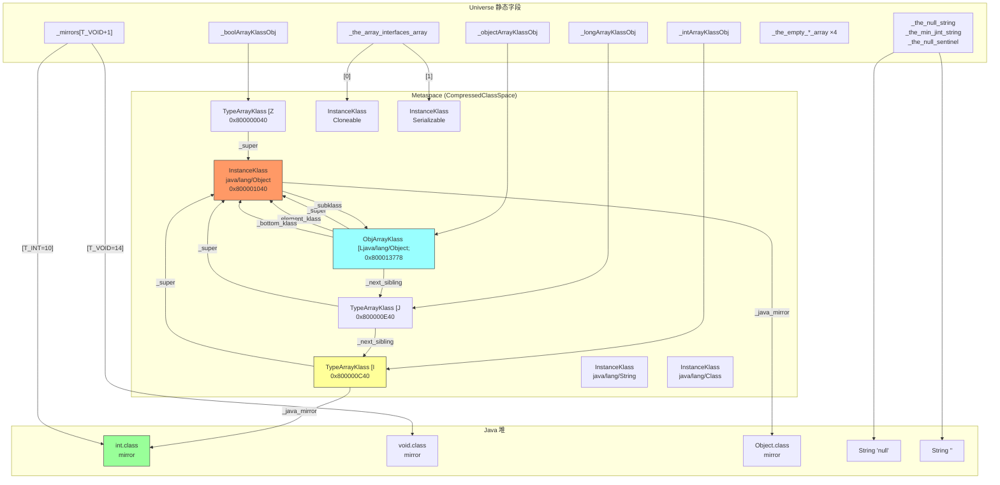

# 4E: universe2_init — Genesis 创世纪深度剖析

> **一句话总结**：`universe2_init()` 是 JVM 的"创世纪"——在已有的空堆和元空间上，创建 Java 世界的第一批居民：8 种基本类型数组的 Klass、加载 Object/String/Class 等核心类、建立类型层次、创建基本类型 mirror（`int.class` 等），最终创建 `Object[]` 的 Klass。
>
> **源码**：`share/memory/universe.cpp:1200-1203`（入口）、`322-463`（genesis 主体）
> **标准环境**：`-Xms8g -Xmx8g -XX:+UseG1GC -Xint`，G1 Region = 4MB

---

## 第 0 部分：核心原理 ⭐

### 0.1 本质是什么？

本文分析 **4E: universe2_init — Genesis 创世纪深度剖析** 的初始化过程：JVM 启动时该组件如何被创建、配置和激活，以及初始化顺序的约束关系。

### 0.2 为什么需要？

JVM 初始化顺序有严格的依赖关系——某些组件必须在其他组件之前初始化。理解初始化顺序有助于排查启动失败问题，也能理解各组件的设计约束。

### 0.3 怎么解决？

追踪初始化函数的调用链，分析每个初始化步骤的前置条件和后置效果，识别关键的初始化顺序约束。

### 0.4 为什么这样设计？

初始化顺序的设计原则：「被依赖的先初始化」。例如内存管理必须在 GC 之前初始化，GC 必须在类加载之前初始化。

---


## 一、问题引入：为什么需要 Genesis？

### 1.1 universe_init 做了什么？

在 `universe_init()` 中（前一阶段），JVM 完成了"硬件层"的准备：
- 创建了 Java 堆（G1CollectedHeap，8GB）
- 计算了压缩指针参数（ZeroBased，shift=3）
- 初始化了 Metaspace
- 创建了 SymbolTable（符号表）和 StringTable（字符串驻留池）
- 分配了 6 个空的 LatestMethodCache

但此时 Java 世界是空的——没有任何类、没有任何对象、没有 `Object`、没有 `String`。

### 1.2 Genesis 要解决什么？

Genesis 要回答一个根本问题：**Java 世界的第一个类从哪来？**

困难在于**循环依赖**：
- 加载任何类都需要 `java.lang.Class`（每个类都有 mirror）
- 加载 `java.lang.Class` 本身也需要 `java.lang.Class`
- 数组类型需要 `java.lang.Object` 作为 super
- 但 `Object` 还没加载

Genesis 的核心设计就是**分阶段打破循环依赖**：
1. 先创建 TypeArrayKlass（此时 super=NULL，mirror 延迟）
2. 加载核心类（Object → String → Class）
3. 回填：为 TypeArrayKlass 补上 super 和 mirror

---

## 二、入口：极简的 universe2_init

```cpp
// universe.cpp:1200-1203
void universe2_init() {
  EXCEPTION_MARK;
  Universe::genesis(CATCH);
}
```

就一行代码——直接调用 `Universe::genesis()`。

在 `init_globals()` 的调用序列中：

```
init.cpp:132    universe2_init()     ← 我们在这里
init.cpp:133    javaClasses_init()   ← 紧接着
```

此时解释器、StubRoutines Phase 1、SharedRuntime 的 Blob 都已就绪，可以执行 Java 字节码了。

---

## 三、Genesis 整体流程

```mermaid
flowchart TD
    A["genesis() 开始"] --> B["_bootstrapping = true"]
    B --> C["allocate_fixup_lists()<br/>分配延迟修复列表"]
    C --> D["compute_base_vtable_size()<br/>计算 Object 的 vtable 大小"]
    D --> E["创建 8 个 TypeArrayKlass<br/>(super=NULL, mirror延迟)"]
    E --> F["填充 _typeArrayKlassObjs 索引表"]
    F --> G["创建空数组和接口数组"]
    G --> H["vmSymbols::initialize()<br/>初始化 VM 符号表"]
    H --> I["SystemDictionary::initialize()<br/>★ 加载核心类"]
    I --> I1["加载 Object → String → Class"]
    I1 --> I2["compute_offsets()<br/>计算 String/Class 字段偏移"]
    I2 --> I3["initialize_basic_type_mirrors()<br/>创建 int.class 等"]
    I3 --> I4["fixup_mirrors()<br/>补全之前类的 mirror"]
    I4 --> I5["加载 Reference 类族 + JSR 292"]
    I5 --> J["缓存字符串: 'null', '-2147483648'"]
    J --> K["设置数组接口:<br/>Cloneable + Serializable"]
    K --> L["initialize_basic_type_klass() ×8<br/>★ 补全 super=Object"]
    L --> M["_bootstrapping = false"]
    M --> N["创建 _the_null_sentinel"]
    N --> O["创建 _objectArrayKlassObj<br/>(Object[] Klass)"]
    O --> P["genesis() 结束"]

    style E fill:#ff9,stroke:#333
    style I fill:#f9f,stroke:#333
    style L fill:#ff9,stroke:#333
    style O fill:#9ff,stroke:#333
```



---

## 四、阶段 1：准备工作

### 4.1 FlagSetting 和 Compile_lock

```cpp
{ FlagSetting fs(_bootstrapping, true);   // RAII: 设 _bootstrapping=true，析构时恢复
  { MutexLocker mc(Compile_lock);          // 持有编译锁，防止并发
```

`_bootstrapping = true` 的含义：告诉所有 Klass 的构造函数"现在是引导期，不要试图访问 Object_klass 等尚未存在的东西"。

### 4.2 allocate_fixup_lists()

```cpp
java_lang_Class::allocate_fixup_lists();
```

分配两个 `GrowableArray<Klass*>`：
- **fixup_mirror_list**：在 `Class_klass` 加载前创建的类，无法立即创建 `java.lang.Class` mirror。记录这些类，等 `Class_klass` 加载后批量修复。
- **fixup_module_field_list**：类似，用于 module 字段的延迟修复。

**为什么需要？** 因为创建 mirror 需要 `InstanceMirrorKlass::allocate_instance()`，而这依赖 `Class_klass` 已加载。但 `Class_klass` 的加载本身也需要 mirror——先把自己加入 fixup_list，等自己加载完再回来修。

### 4.3 compute_base_vtable_size()

```cpp
compute_base_vtable_size();
// → _base_vtable_size = ClassLoader::compute_Object_vtable();
```

计算 `java.lang.Object` 的 vtable 大小。此时 Object 还没加载，但可以通过预设的方法数量（`finalize`, `equals`, `hashCode`, `toString`, `clone` = 5 个虚方法）计算。

**GDB 验证**：`_base_vtable_size = 5`

所有数组 Klass 的 vtable 大小都等于这个值，因为数组不添加新的虚方法。

---

## 五、阶段 2：创建 8 种 TypeArrayKlass

这是 Genesis 的第一个核心操作——为 Java 的 8 种基本类型数组创建 Klass 元数据。

### 5.1 创建流程

```cpp
_boolArrayKlassObj   = TypeArrayKlass::create_klass(T_BOOLEAN, sizeof(jboolean), CHECK);
_charArrayKlassObj   = TypeArrayKlass::create_klass(T_CHAR,    sizeof(jchar),    CHECK);
_singleArrayKlassObj = TypeArrayKlass::create_klass(T_FLOAT,   sizeof(jfloat),   CHECK);
_doubleArrayKlassObj = TypeArrayKlass::create_klass(T_DOUBLE,  sizeof(jdouble),  CHECK);
_byteArrayKlassObj   = TypeArrayKlass::create_klass(T_BYTE,    sizeof(jbyte),    CHECK);
_shortArrayKlassObj  = TypeArrayKlass::create_klass(T_SHORT,   sizeof(jshort),   CHECK);
_intArrayKlassObj    = TypeArrayKlass::create_klass(T_INT,     sizeof(jint),     CHECK);
_longArrayKlassObj   = TypeArrayKlass::create_klass(T_LONG,    sizeof(jlong),    CHECK);
```

注意创建顺序：bool → char → float → double → byte → short → int → long。这个顺序反映在 Metaspace 中的地址分布。

### 5.2 TypeArrayKlass::create_klass 内部流程

```
create_klass(T_INT, sizeof(jint), CHECK)
  → create_klass(T_INT, "[I", CHECK)     // 内部重载：用类型名
    → Symbol* sym = SymbolTable::new_permanent_symbol("[I")   // 创建永久符号
    → ClassLoaderData* null_cld = the_null_class_loader_data()  // Bootstrap ClassLoader
    → TypeArrayKlass::allocate(null_cld, T_INT, sym)
      → int size = ArrayKlass::static_size(TypeArrayKlass::header_size())
      → new (null_cld, size, THREAD) TypeArrayKlass(T_INT, sym)
        → ArrayKlass(sym, TypeArrayKlassID)
          → Klass(TypeArrayKlassID)
          → _dimension = 1
          → _vtable_length = Universe::base_vtable_size()  // 5
          → super = NULL  // ★ Bootstrap 期间！
          → is_cloneable = true
        → set_layout_helper(array_layout_helper(T_INT))
        → set_max_length(arrayOopDesc::max_array_length(T_INT))
    → null_cld->add_class(ak)   // 注册到 Bootstrap ClassLoader
    → complete_create_array_klass(ak, ak->super(), module, CHECK)
      → ak->initialize_supers(NULL, NULL, CHECK)  // super=NULL at bootstrap
      → ak->vtable().initialize_vtable(false, CHECK)
      → java_lang_Class::create_mirror(ak, ...)
        → Class_klass 还没加载！
        → fixup_mirror_list()->push(ak)  // ★ 加入延迟修复列表
```

**关键点**：
1. 每个 TypeArrayKlass 在 Metaspace (CompressedClassSpace) 中分配
2. Bootstrap 期间 super 设为 NULL
3. Mirror 无法创建（Class_klass 还没加载），加入 fixup_list
4. 创建后立即注册到 null ClassLoaderData（GC 根）

### 5.3 TypeArrayKlass 类继承层次

```
Klass                    (208 bytes)
  └─ ArrayKlass          (232 bytes)  +_dimension, +_higher_dimension, +_lower_dimension
      └─ TypeArrayKlass  (240 bytes)  +_max_length
      └─ ObjArrayKlass   (248 bytes)  +_element_klass, +_bottom_klass
```

### 5.4 layout_helper 编码

每个 TypeArrayKlass 的 `_layout_helper` 是一个 32 位打包字段，用于快速计算数组对象大小：

```
位布局: [tag:8][header_size:8][element_type:4+][log2_element_size:8(低位)]
```

| 类型 | layout_helper | tag | header | etype | log2_elem | 元素大小 |
|------|--------------|-----|--------|-------|-----------|---------|
| `boolean[]` | `0xC010_0400` | 0xC0 | 16B | T_BOOLEAN(4) | 0 | 1 byte |
| `char[]` | `0xC010_0501` | 0xC0 | 16B | T_CHAR(5) | 1 | 2 bytes |
| `float[]` | `0xC010_0602` | 0xC0 | 16B | T_FLOAT(6) | 2 | 4 bytes |
| `double[]` | `0xC010_0703` | 0xC0 | 16B | T_DOUBLE(7) | 3 | 8 bytes |
| `byte[]` | `0xC010_0800` | 0xC0 | 16B | T_BYTE(8) | 0 | 1 byte |
| `short[]` | `0xC010_0901` | 0xC0 | 16B | T_SHORT(9) | 1 | 2 bytes |
| `int[]` | `0xC010_0A02` | 0xC0 | 16B | T_INT(10) | 2 | 4 bytes |
| `long[]` | `0xC010_0B03` | 0xC0 | 16B | T_LONG(11) | 3 | 8 bytes |
| `Object[]` | `0x8010_0C02` | 0x80 | 16B | T_OBJECT(12) | 2 | 4 bytes* |

**tag 区分**：
- `0xC0` = 负数 + non-oop 标记 → TypeArray（元素不含 oop，GC 不需要扫描）
- `0x80` = 负数 + oop 标记 → ObjArray（元素是 oop，GC 必须扫描）
- 正数 → InstanceKlass（值 = 实例大小 in bytes）

**header_size = 16 bytes**：数组对象头 = markOop(8B) + _klass(compressed, 4B) + _length(4B) = 16B。这就是数组第一个元素的偏移量。

*注：Object[] 的 element size = 4 bytes 是因为使用了压缩指针（CompressedOops），shift=3。

**使用场景**：分配 `new int[100]` 时，JVM 快速计算对象大小：
```
size = header_size + (length << log2_element_size)
     = 16 + (100 << 2) = 16 + 400 = 416 bytes
```

### 5.5 填充索引表

```cpp
_typeArrayKlassObjs[T_BOOLEAN] = _boolArrayKlassObj;
_typeArrayKlassObjs[T_CHAR]    = _charArrayKlassObj;
// ... 共 8 个
```

`_typeArrayKlassObjs[T_VOID+1]` 是一个 15 元素的数组，按 BasicType 枚举值索引，提供 O(1) 查找。

### 5.6 创建空数组和接口数组

```cpp
_the_array_interfaces_array = MetadataFactory::new_array<Klass*>(null_cld, 2, NULL, CHECK);  // 预留 2 个槽位
_the_empty_int_array        = MetadataFactory::new_array<int>(null_cld, 0, CHECK);
_the_empty_short_array      = MetadataFactory::new_array<u2>(null_cld, 0, CHECK);
_the_empty_method_array     = MetadataFactory::new_array<Method*>(null_cld, 0, CHECK);
_the_empty_klass_array      = MetadataFactory::new_array<Klass*>(null_cld, 0, CHECK);
```

这些空数组是共享单例——当任何类/方法有"空列表"时，指向这些共享对象，避免重复分配。

`_the_array_interfaces_array` 预留 2 个位置，稍后填入 Cloneable 和 Serializable。

---

## 六、阶段 3：初始化符号和加载核心类

### 6.1 vmSymbols::initialize()

```cpp
vmSymbols::initialize(CHECK);
```

将所有 VM 内部使用的符号字符串（类名、方法名、签名等）注册到 SymbolTable：

```
"java/lang/Object", "java/lang/String", "java/lang/Class",
"<init>", "()V", "hashCode", "equals", "toString", ...
```

同时初始化 `_type_signatures` 映射表：
- `T_INT` → `"I"`, `T_LONG` → `"J"`, `T_BOOLEAN` → `"Z"` ...

### 6.2 SystemDictionary::initialize() — 核心类加载

这是 Genesis 中最复杂的步骤。

```cpp
SystemDictionary::initialize(CHECK);
```

内部流程：

```
SystemDictionary::initialize()
  → 创建 5 个哈希表: PlaceholderTable, LoaderConstraintTable, ResolutionErrorTable, ...
  → _system_loader_lock_obj = new_intArray(0)   // 系统类加载器锁
  → resolve_well_known_classes(CHECK)  ← ★ 核心
```

`resolve_well_known_classes()` 按照严格顺序加载核心类：

```
步骤 1: ClassLoader::classLoader_init2()  → 创建 java.base 模块入口
步骤 2: 加载 Object_klass → String_klass → Class_klass
步骤 3: java_lang_String::compute_offsets()
        java_lang_Class::compute_offsets()
步骤 4: Universe::initialize_basic_type_mirrors()  → 创建 int.class 等 9 个 mirror
步骤 5: Universe::fixup_mirrors()                   → 补全之前类的 mirror
步骤 6: 加载 Cloneable → ClassLoader → Serializable → ... → Reference 类族
步骤 7: 设置引用类型: SoftReference(REF_SOFT), WeakReference(REF_WEAK), ...
步骤 8: 加载 JSR 292 类 (MethodHandle 等)
步骤 9: 设置 _box_klasses: T_INT→Integer, T_LONG→Long, ...
```

**加载顺序至关重要**：
- Object 必须第一个加载（所有类的 super）
- Class 必须在 String 之后（Class 的字段计算依赖 String 的布局）
- mirror 修复必须在 Class 加载之后（需要 InstanceMirrorKlass）

### 6.3 initialize_basic_type_mirrors()

```cpp
_int_mirror    = java_lang_Class::create_basic_type_mirror("int",    T_INT, CHECK);
_float_mirror  = java_lang_Class::create_basic_type_mirror("float",  T_FLOAT, CHECK);
// ... 共 9 个（含 void）
```

为每种基本类型创建一个 `java.lang.Class` 实例。这就是 Java 代码中 `int.class`、`void.class` 等的来源。

这些 mirror 对象分配在 Java 堆上（Young Generation）。

**GDB 验证**：
```
_int_mirror  = 0x7ffc00010     (Java 堆中)
_void_mirror = 0x7ffc00390
```

同时填充 `_mirrors[]` 索引表：
```cpp
_mirrors[T_INT]     = _int_mirror;     // _mirrors[10]
_mirrors[T_BOOLEAN] = _bool_mirror;    // _mirrors[4]
_mirrors[T_VOID]    = _void_mirror;    // _mirrors[14]
```

### 6.4 fixup_mirrors()

```cpp
Universe::fixup_mirrors(CHECK);
```

遍历 `fixup_mirror_list`，为之前加载但没能创建 mirror 的类（包括 Object、String、Class 自身，以及 8 个 TypeArrayKlass）补上 `java.lang.Class` mirror。

```
for each Klass k in fixup_mirror_list:
    java_lang_Class::fixup_mirror(k, CATCH)
        → InstanceMirrorKlass::allocate_instance(k)  // 分配 java.lang.Class 实例
        → 建立 klass ↔ mirror 双向链接
```

---

## 七、阶段 4：补全 TypeArrayKlass 的类型层次

### 7.1 设置数组接口

```cpp
_the_array_interfaces_array->at_put(0, SystemDictionary::Cloneable_klass());
_the_array_interfaces_array->at_put(1, SystemDictionary::Serializable_klass());
```

所有数组类型都实现 `Cloneable` 和 `Serializable` 接口。

### 7.2 initialize_basic_type_klass() ×8

```cpp
void initialize_basic_type_klass(Klass* k, TRAPS) {
  Klass* ok = SystemDictionary::Object_klass();
  k->initialize_supers(ok, NULL, CHECK);  // ★ 设置 super = Object
  k->append_to_sibling_list();             // 加入兄弟链表
}
```

对所有 8 种 TypeArrayKlass 调用，建立类型层次：

```
                Object
              /   |   \
         [Z   [C   [F   [D   [B   [S   [I   [J
```

`initialize_supers()` 的关键操作：
1. `set_super(Object_klass)` — 设置父类指针
2. 填充 `_primary_supers[]`：`[0]=Object, [1]=self`
3. 设置 `_super_check_offset` — 快速子类型检查偏移
4. 设置 `_secondary_supers` — 包含 Cloneable 和 Serializable

`append_to_sibling_list()` 将 Klass 加入 Object 的子类链表（头插法），所以 sibling 链的顺序是创建的逆序。

**GDB 验证**（int[] 的详细字段）：
```
address = 0x800000c40
_super = 0x800001040 (== Object_klass ✓)
_primary_supers[0] = 0x800001040 (Object_klass ✓)
_primary_supers[1] = 0x800000c40 (self ✓)
_super_check_offset = 56
_vtable_len = 5 (== _base_vtable_size ✓)
_dimension = 1
_max_length = 2147483645 (Integer.MAX_VALUE - 2)
```

**sibling 链**（Object 的直接子类，Part 14）：

```
Object._subklass → [Ljava/lang/Object; (Object[])
  → [J (long[]) → [I (int[]) → [S (short[]) → [B (byte[])
  → [D (double[]) → [F (float[]) → [C (char[]) → [Z (boolean[])
  → java/util/Iterator → ... → 共 40 个直接子类
```

---

## 八、阶段 5：Bootstrap 结束 + 创建 ObjArrayKlass

### 8.1 _bootstrapping = false

`FlagSetting` 的 RAII 析构函数将 `_bootstrapping` 恢复为 `false`。从此刻起，新创建的 ArrayKlass 可以直接设置 `super = Object_klass`（不再需要延迟回填）。

### 8.2 创建 null_sentinel

```cpp
_the_null_sentinel = java_lang_String::create_from_str("<null_sentinel>", CHECK);
```

一个特殊的 String 对象，用作 ConcurrentHashTable 的空值标记。

### 8.3 创建 Object[] Klass

```cpp
_objectArrayKlassObj = InstanceKlass::cast(SystemDictionary::Object_klass())
                         ->array_klass(1, CHECK);
_objectArrayKlassObj->append_to_sibling_list();
```

与 TypeArrayKlass 不同，ObjArrayKlass 通过 `InstanceKlass::array_klass()` 创建——这会调用 `ObjArrayKlass::allocate_objArray_klass()`。

由于此时 `_bootstrapping = false`，ObjArrayKlass 可以直接：
- 设置 `_super = Object_klass`
- 设置 `_element_klass = Object_klass`
- 设置 `_bottom_klass = Object_klass`
- 创建 mirror（Class_klass 已加载）

**GDB 验证**：
```
_objectArrayKlassObj = 0x800013778
_layout_helper = 0x80100c02    (tag=0x80 → objArray, hdr=16, etype=T_OBJECT(12), log2=2)
_element_klass = 0x800001040   (== Object_klass ✓)
_bottom_klass  = 0x800001040   (== Object_klass ✓)
_super = 0x800001040           (== Object_klass ✓)
_next_sibling = 0x800000e40    (== _longArrayKlassObj ✓)
_dimension = 1
_vtable_len = 5
```

---

## 九、关键数据结构总览

### 9.1 Klass 继承层次与大小

```
                Klass (208B)
               /           \
     ArrayKlass (232B)    InstanceKlass (?)
      /         \
TypeArrayKlass  ObjArrayKlass
   (240B)         (248B)
```

| 类 | sizeof | 新增字段 |
|---|--------|---------|
| `Klass` | 208 | _layout_helper, _id, _name, _super, _primary_supers[8], _java_mirror, _vtable_len, ... |
| `ArrayKlass` | 232 | +_dimension(4B), +_higher_dimension(8B), +_lower_dimension(8B), +pad |
| `TypeArrayKlass` | 240 | +_max_length(4B), +pad |
| `ObjArrayKlass` | 248 | +_element_klass(8B), +_bottom_klass(8B) |

**实际占用**：sizeof + vtable。TypeArrayKlass = 240 + 5×8 = 280B，在 Metaspace 中对齐到 512B（每个 Klass 间距 512B）。

### 9.2 TypeArrayKlass 内存布局（以 int[] 为例）

```
偏移        字段                              值
───────────────────────────────────────────────────
+0x00   vtable_ptr (C++ 虚表指针)         → TypeArrayKlass vtable
+0x08   _layout_helper                    0xC010_0A02
+0x0C   _id (KlassID)                     4 (TypeArrayKlassID)
+0x10   _super_check_offset               56
+0x18   _name (Symbol*)                   → "[I"
+0x20   _secondary_super_cache            NULL
+0x28   _secondary_supers (Array<Klass*>*) → [Cloneable, Serializable]
+0x30   _primary_supers[0]                → Object_klass
+0x38   _primary_supers[1]                → self (int[])
+0x40   _primary_supers[2..7]             NULL
+0x70   _java_mirror (OopHandle)          → 指向 int[].class mirror
+0x78   _super                            → Object_klass
+0x80   _subklass                         NULL
+0x88   _next_sibling                     → short[] Klass
+0x90   _next_link                        ...
+0x98   _class_loader_data                → null ClassLoaderData
+0xA0   _modifier_flags                   ...
+0xA4   _access_flags                     ...
+0xA8   _last_biased_lock_bulk_revocation_time  ...
+0xB0   _prototype_header                 ...
+0xB8   _biased_lock_revocation_count     ...
+0xBC   _vtable_len                       5
+0xBE   _shared_class_path_index          ...
  --- ArrayKlass 字段 ---
+0xD0   _dimension                        1
+0xD8   _higher_dimension                 NULL
+0xE0   _lower_dimension                  NULL
  --- TypeArrayKlass 字段 ---
+0xE8   _max_length                       2147483645
  --- padding ---
+0xF0   vtable[0..4]                      5 个虚方法指针
```

### 9.3 8 种 TypeArrayKlass 地址分布

```
CompressedClassSpace 起始: 0x800000000

0x800000040  boolean[]  [Z   lh=0xC0100400  (elem=1B, log2=0)
0x800000240  char[]     [C   lh=0xC0100501  (elem=2B, log2=1)
0x800000440  float[]    [F   lh=0xC0100602  (elem=4B, log2=2)
0x800000640  double[]   [D   lh=0xC0100703  (elem=8B, log2=3)
0x800000840  byte[]     [B   lh=0xC0100800  (elem=1B, log2=0)
0x800000A40  short[]    [S   lh=0xC0100901  (elem=2B, log2=1)
0x800000C40  int[]      [I   lh=0xC0100A02  (elem=4B, log2=2)
0x800000E40  long[]     [J   lh=0xC0100B03  (elem=8B, log2=3)
   ← 间距 512B ×7 = 3.5KB →
0x800001040  Object_klass (java/lang/Object)
0x800001250  Cloneable_klass
0x800001868  String_klass
0x8000020F0  Class_klass
...
0x800013778  Object[]   [Ljava/lang/Object;  lh=0x80100C02
```

**地址规律**：
- 8 个 TypeArrayKlass 是 Metaspace 中最先分配的对象（0x40 ~ 0xE40）
- 间距 = 512 bytes（sizeof(TypeArrayKlass)=240 + vtable=40 = 280B → 对齐到 512B）
- Object_klass 紧随其后（0x1040）
- Object[] 在加载了大量核心类后才创建（0x13778），地址远离 TypeArrayKlass

---

## 十、关键设计分析

### 10.1 Bootstrap 鸡蛋问题的解法

```
时间线:
  ┌──────────────────────────────────────────────────────────────────┐
  │ 创建 TypeArrayKlass ×8                                           │
  │   super = NULL                                                    │
  │   mirror → fixup_list (延迟)                                      │
  ├──────────────────────────────────────────────────────────────────┤
  │ 加载 Object → String → Class                                     │
  │   Object: mirror → fixup_list (Class 还没加载)                    │
  │   String: mirror → fixup_list (Class 还没加载)                    │
  │   Class:  mirror → fixup_list (自己刚加载)                        │
  ├──────────────────────────────────────────────────────────────────┤
  │ fixup_mirrors()                                                   │
  │   遍历 fixup_list，为所有类补上 mirror                            │
  │   包括：8 个 TypeArrayKlass + Object + String + Class + ...       │
  ├──────────────────────────────────────────────────────────────────┤
  │ initialize_basic_type_klass() ×8                                  │
  │   为 TypeArrayKlass 补上 super = Object                           │
  │   加入 sibling 链                                                 │
  ├──────────────────────────────────────────────────────────────────┤
  │ 创建 ObjArrayKlass (Object[])                                     │
  │   此时 _bootstrapping=false，直接设置 super=Object, mirror 直接创建 │
  └──────────────────────────────────────────────────────────────────┘
```

### 10.2 为什么 TypeArrayKlass 先于 Object 创建？

JVM 启动过程中，加载 Object 类本身就需要 byte[] 和 char[] 等数组类型（比如存储 class 文件数据、常量池字符串等）。如果先加载 Object 再创建 TypeArrayKlass，加载过程中会找不到需要的数组类型。

### 10.3 为什么 ObjArrayKlass 最后创建？

ObjArrayKlass 的 `_element_klass` 和 `_bottom_klass` 需要指向 Object_klass。而且 ObjArrayKlass 的 `_secondary_supers` 需要包含 Cloneable 和 Serializable（它们也是在 SystemDictionary::initialize 中加载的）。只有在所有核心类加载完毕后，才能安全创建 ObjArrayKlass。

### 10.4 _max_length = 2147483645 的含义

`max_array_length(T_INT) = (Integer.MAX_VALUE - header_size/elem_size)`

数组对象的总大小不能超过 `Integer.MAX_VALUE` 字节（Java 限制），因此：
```
max_length = (2^31 - 1 - header_size) / element_size
           ≈ 2^31 - 1 - 2  // 对于 int[]，header=16B, elem=4B, 但取整后约等于这个值
           = 2147483645
```

尝试创建更大的数组会抛出 `OutOfMemoryError: Requested array size exceeds VM limit`。

---

## 十一、Genesis 产出清单

Genesis 完成后，Universe 中新增了以下对象：

### Metaspace 中（CompressedClassSpace）

| 对象 | 数量 | 说明 |
|------|------|------|
| TypeArrayKlass | 8 | boolean[]/char[]/float[]/double[]/byte[]/short[]/int[]/long[] |
| ObjArrayKlass | 1 | Object[] |
| InstanceKlass | ~40+ | Object/String/Class/Cloneable/Serializable/... |
| Array<Klass*> | 5 | _the_array_interfaces_array(2), 4 个空数组 |

### Java 堆中

| 对象 | 数量 | 说明 |
|------|------|------|
| 基本类型 mirror | 9 | int.class/float.class/.../void.class |
| 类 mirror | ~40+ | Object.class/String.class/Class.class/... |
| 缓存字符串 | 3 | "null", "-2147483648", "<null_sentinel>" |

### Universe 静态字段

| 字段 | 值 |
|------|-----|
| `_bootstrapping` | false (已结束) |
| `_fully_initialized` | false (还要等 universe_post_init) |
| `_base_vtable_size` | 5 |

---

## 十二、关系图



---

## 十三、关键数字

| 指标 | 值 | 来源 |
|------|-----|------|
| TypeArrayKlass 数量 | 8 | boolean ~ long |
| ObjArrayKlass 数量 | 1 | Object[] |
| sizeof(TypeArrayKlass) | 240 bytes | GDB |
| sizeof(ObjArrayKlass) | 248 bytes | GDB |
| Klass 间距（Metaspace） | 512 bytes | 对齐 |
| base_vtable_size | 5 | Object 的 5 个虚方法 |
| 基本类型 mirror 数量 | 9 | int/float/double/byte/bool/char/long/short/void |
| _mirrors 数组大小 | 15 (T_VOID+1) | BasicType 索引 |
| 数组 header_size | 16 bytes | markOop(8) + _klass(4) + _length(4) |
| max_array_length(int) | 2147483645 | ≈ Integer.MAX_VALUE - 2 |
| Object 直接子类 | ~40 | genesis 结束时 |
| Well-known klasses | ~120+ | WK_KLASSES_DO 枚举 |

---

## 十四、JVM 参数

| 参数 | 作用 |
|------|------|
| `-Xlog:class+load=info` | 查看类加载顺序：`[info][class,load] java.lang.Object source: jrt:/java.base` |
| `-Xlog:init` | 查看初始化阶段日志 |
| `-XX:+TraceClassLoading` | 旧版类加载跟踪（JDK 11 仍可用） |
| `-XX:+PrintVtableMapping` | 打印 vtable 映射 |

**输出示例**（`-Xlog:class+load=info`）：
```
[0.020s][info][class,load] java.lang.Object source: jrt:/java.base
[0.022s][info][class,load] java.lang.String source: jrt:/java.base
[0.024s][info][class,load] java.lang.Class source: jrt:/java.base
[0.025s][info][class,load] java.lang.Cloneable source: jrt:/java.base
[0.026s][info][class,load] java.lang.ClassLoader source: jrt:/java.base
[0.027s][info][class,load] java.io.Serializable source: jrt:/java.base
```

---

## 十五、设计总结

Genesis 的核心智慧是**分步引导 + 延迟回填**：

1. **先创建不完整的对象**（TypeArrayKlass，super=NULL，无 mirror）
2. **加载依赖项**（Object、Class 等核心类）
3. **回填修复**（补 super、补 mirror）
4. **最后创建完整的对象**（ObjArrayKlass，所有字段一步到位）

这是一种经典的"两遍扫描"设计模式——第一遍建立骨架，第二遍填充细节。

Genesis 完成后，Java 世界的根基已经就绪：
- 有了类型系统（Object 为根的继承树）
- 有了反射基础（每个类都有 mirror）
- 有了基本类型数组（JVM 内部运行的基础）
- 有了核心类（String、Class、ClassLoader 等）

下一步 `javaClasses_init()` 将计算所有 Java 核心类的字段偏移量，然后 `universe_post_init()` 将预分配异常对象、填充 MethodCache，最终设置 `_fully_initialized = true`。
