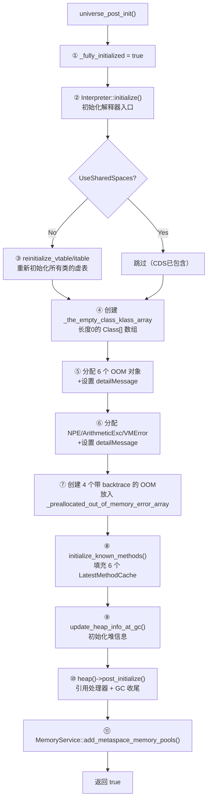
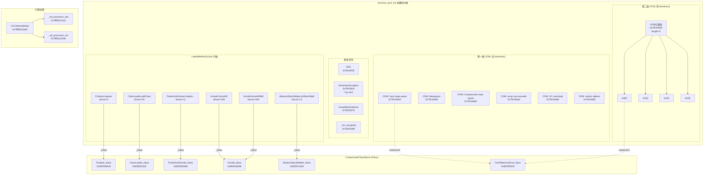

# 4F: universe_post_init() 深度剖析

> **一句话**：`universe_post_init()` 是 JVM 启动的"收尾工程"——将 `_fully_initialized` 置为 true，预分配 9+4 个不可 GC 的异常对象，填充 6 个 LatestMethodCache，初始化引用处理器。此后 JVM 才算"可用"。
>
> **源码**：`src/hotspot/share/memory/universe.cpp:1210-1320`
> **调用位置**：`init.cpp:149` → `universe_post_init()`（在 `stubRoutines_init2()` 之前）
> **标准环境**：`-Xms8g -Xmx8g -XX:+UseG1GC -Xint`，G1 Region = 4MB
> **前置文档**：[4E-universe2_init-Genesis-Deep-Dive.md](4E-universe2_init-Genesis-Deep-Dive.md)（genesis 创世纪）

---

## 第 0 部分：核心原理 ⭐

### 0.1 本质是什么？

本文分析 **4F: universe_post_init() 深度剖析** 的初始化过程：JVM 启动时该组件如何被创建、配置和激活，以及初始化顺序的约束关系。

### 0.2 为什么需要？

JVM 初始化顺序有严格的依赖关系——某些组件必须在其他组件之前初始化。理解初始化顺序有助于排查启动失败问题，也能理解各组件的设计约束。

### 0.3 怎么解决？

追踪初始化函数的调用链，分析每个初始化步骤的前置条件和后置效果，识别关键的初始化顺序约束。

### 0.4 为什么这样设计？

初始化顺序的设计原则：「被依赖的先初始化」。例如内存管理必须在 GC 之前初始化，GC 必须在类加载之前初始化。

---


## 一、问题引入：为什么需要 universe_post_init？

`universe2_init()`（genesis）完成后，JVM 已经有了基本类型 Klass、Object/String/Class 等核心类。但还缺三样东西：

1. **预分配的异常对象**——如果 OOM 发生时再去分配 OOM 异常对象，必然失败（死循环）
2. **关键方法缓存**——Finalizer.register()、ClassLoader.addClass() 等高频方法需要 O(1) 查找
3. **引用处理器**——Soft/Weak/Final/Phantom 引用的 GC 处理机制

`universe_post_init()` 就是把这三件事做完，然后宣布 `_fully_initialized = true`。

---

## 二、整体流程



---

## 三、逐段源码分析

### 3.1 阶段①：标志位 + 解释器 + vtable 重建

```cpp
// universe.cpp:1210-1222
bool universe_post_init() {
  Universe::_fully_initialized = true;       // ← 标志：JVM 初始化完毕
  
  Interpreter::initialize();                  // 设置解释器的方法入口点
  
  if (!UseSharedSpaces) {                     // 非 CDS 模式
    Klass* ok = SystemDictionary::Object_klass();
    Universe::reinitialize_vtable_of(ok, CHECK_false);  // 递归重建所有类的 vtable
    Universe::reinitialize_itables(CHECK_false);         // 重建所有类的 itable
  }
}
```

**为什么要重建 vtable/itable？**

在 `genesis()` 阶段创建 TypeArrayKlass 时，Object_klass 还没加载完，所以第一次构建的 vtable 可能不完整。现在所有核心类都已加载，需要重新初始化确保正确。

**`reinitialize_vtable_of` 的递归逻辑**：

```cpp
// universe.cpp:573-583
void Universe::reinitialize_vtable_of(Klass* ko, TRAPS) {
  ko->vtable().initialize_vtable(false, CHECK);  // 重建 ko 自己的 vtable
  if (ko->is_instance_klass()) {
    for (Klass* sk = ko->subklass(); sk != NULL; sk = sk->next_sibling()) {
      reinitialize_vtable_of(sk, CHECK);          // 递归重建所有子类
    }
  }
}
```

从 `Object_klass` 开始，递归遍历整棵类继承树（通过 `_subklass` 和 `_next_sibling` 链表），重建每个类的 vtable。Object 的 base_vtable_size = 5（finalize, equals, hashCode, toString, clone）。

### 3.2 阶段②：预分配 6 个 OOM 错误对象

```cpp
// universe.cpp:1228-1237
Klass* k = SystemDictionary::resolve_or_fail(vmSymbols::java_lang_OutOfMemoryError(), true, CHECK_false);
InstanceKlass* ik = InstanceKlass::cast(k);

Universe::_out_of_memory_error_java_heap         = ik->allocate_instance(CHECK_false);
Universe::_out_of_memory_error_metaspace          = ik->allocate_instance(CHECK_false);
Universe::_out_of_memory_error_class_metaspace    = ik->allocate_instance(CHECK_false);
Universe::_out_of_memory_error_array_size         = ik->allocate_instance(CHECK_false);
Universe::_out_of_memory_error_gc_overhead_limit  = ik->allocate_instance(CHECK_false);
Universe::_out_of_memory_error_realloc_objects    = ik->allocate_instance(CHECK_false);
```

6 个 `OutOfMemoryError` 实例，分别对应 6 种 OOM 场景。这些对象分配后永远不会被 GC 回收（被 Universe 的 static 字段引用）。

然后设置每个 OOM 的 `detailMessage` 字段：

```cpp
// universe.cpp:1266-1281
java_lang_Throwable::set_message(_out_of_memory_error_java_heap,
    java_lang_String::create_from_str("Java heap space", ...));

java_lang_Throwable::set_message(_out_of_memory_error_metaspace,
    java_lang_String::create_from_str("Metaspace", ...));

java_lang_Throwable::set_message(_out_of_memory_error_class_metaspace,
    java_lang_String::create_from_str("Compressed class space", ...));

java_lang_Throwable::set_message(_out_of_memory_error_array_size,
    java_lang_String::create_from_str("Requested array size exceeds VM limit", ...));

java_lang_Throwable::set_message(_out_of_memory_error_gc_overhead_limit,
    java_lang_String::create_from_str("GC overhead limit exceeded", ...));

java_lang_Throwable::set_message(_out_of_memory_error_realloc_objects,
    java_lang_String::create_from_str("Java heap space: failed reallocation of scalar replaced objects", ...));
```

**6 种 OOM 场景对照表**：

| 字段 | 消息 | 触发场景 |
|------|------|---------|
| `_out_of_memory_error_java_heap` | "Java heap space" | Java 堆空间不足 |
| `_out_of_memory_error_metaspace` | "Metaspace" | 元空间不足（类元数据） |
| `_out_of_memory_error_class_metaspace` | "Compressed class space" | 压缩类空间不足 |
| `_out_of_memory_error_array_size` | "Requested array size exceeds VM limit" | 数组长度超限 |
| `_out_of_memory_error_gc_overhead_limit` | "GC overhead limit exceeded" | GC 时间占比过高 |
| `_out_of_memory_error_realloc_objects` | "Java heap space: failed reallocation of scalar replaced objects" | 标量替换回退失败 |

### 3.3 阶段③：预分配 StackOverflow 消息 + NPE/ArithmeticException/VMError

```cpp
// universe.cpp:1240-1264
if (StackReservedPages > 0) {
  Universe::_delayed_stack_overflow_error_message =
    java_lang_String::create_oop_from_str(
      "Delayed StackOverflowError due to ReservedStackAccess annotated method", ...);
}

// NullPointerException — 编译器用于快速异常处理
k = SystemDictionary::resolve_or_fail(vmSymbols::java_lang_NullPointerException(), ...);
Universe::_null_ptr_exception_instance = InstanceKlass::cast(k)->allocate_instance(...);

// ArithmeticException — 除零异常
k = SystemDictionary::resolve_or_fail(vmSymbols::java_lang_ArithmeticException(), ...);
Universe::_arithmetic_exception_instance = InstanceKlass::cast(k)->allocate_instance(...);

// VirtualMachineError — JVM 内部错误
k = SystemDictionary::resolve_or_fail(vmSymbols::java_lang_VirtualMachineError(), ...);
InstanceKlass::cast(k)->link_class_or_fail(...);  // 必须先链接
Universe::_virtual_machine_error_instance = InstanceKlass::cast(k)->allocate_instance(...);
Universe::_vm_exception = InstanceKlass::cast(k)->allocate_instance(...);  // 给 VM 线程用
```

ArithmeticException 也被设置了消息 `"/ by zero"`：

```cpp
// universe.cpp:1283-1284
msg = java_lang_String::create_from_str("/ by zero", CHECK_false);
java_lang_Throwable::set_message(Universe::_arithmetic_exception_instance, msg());
```

**为什么需要预分配这些异常？**
- **NPE**：编译器检测到 null 访问时，直接抛出这个预分配对象，省去分配开销（源码注释："a cheap & dirty solution in compiler exception handling"）
- **ArithmeticException**：整数除零（idiv/irem 指令）时直接抛出
- **VirtualMachineError**：JVM 遇到无法恢复的内部错误时使用
- **_vm_exception**：专供 VMThread 使用的异常对象

### 3.4 阶段④：带 backtrace 的 OOM 数组

```cpp
// universe.cpp:1286-1299
int len = (StackTraceInThrowable) ? (int)PreallocatedOutOfMemoryErrorCount : 0;
// PreallocatedOutOfMemoryErrorCount 默认 = 4

Universe::_preallocated_out_of_memory_error_array = oopFactory::new_objArray(ik, len, ...);
for (int i = 0; i < len; i++) {
  oop err = ik->allocate_instance(...);
  Handle err_h = Handle(THREAD, err);
  java_lang_Throwable::allocate_backtrace(err_h, ...);  // 预分配 backtrace 数组
  Universe::preallocated_out_of_memory_errors()->obj_at_put(i, err_h());
}
Universe::_preallocated_out_of_memory_error_avail_count = (jint)len;
```

**两级 OOM 设计**：

```
┌──────────────────────────────────────────────────────────────────────────┐
│                          OOM 错误两级设计                                │
├──────────────────────────────────────────────────────────────────────────┤
│                                                                          │
│  第一级：6 个固定 OOM（无 backtrace，永不回收）                             │
│  ┌──────────────────────────────────────────┐                            │
│  │ java_heap │ metaspace │ class_meta │ ...  │                           │
│  │ 各自带固定的 detailMessage                  │                           │
│  │ 永远可用，但没有调用栈信息                    │                           │
│  └──────────────────────────────────────────┘                            │
│                                                                          │
│  第二级：4 个带 backtrace 的 OOM（用完即弃）                                │
│  ┌──────────────────────────────────────────┐                            │
│  │ err[0] │ err[1] │ err[2] │ err[3]        │                           │
│  │ 每个都预分配了 backtrace 数组                │                           │
│  │ 使用时填充真实调用栈 + 从第一级复制 message   │                           │
│  │ 用完一个减一个 (atomic decrement)            │                           │
│  └──────────────────────────────────────────┘                            │
│                                                                          │
│  抛 OOM 时的逻辑 (gen_out_of_memory_error):                               │
│  1. avail_count > 0 → 取第二级的一个，填栈+消息，返回                        │
│  2. avail_count ≤ 0 → 返回第一级的固定对象（无栈信息）                        │
│                                                                          │
└──────────────────────────────────────────────────────────────────────────┘
```

**`gen_out_of_memory_error` 核心逻辑**：

```cpp
// universe.cpp:616-652
oop Universe::gen_out_of_memory_error(oop default_err) {
  int next;
  if ((_preallocated_out_of_memory_error_avail_count > 0) &&
      SystemDictionary::Throwable_klass()->is_initialized()) {
    next = (int)Atomic::add(-1, &_preallocated_out_of_memory_error_avail_count);
    // Atomic::add 返回新值。4→3, 3→2, 2→1, 1→0, 0→-1
  } else {
    next = -1;
  }
  
  if (next < 0) {
    return default_err;  // 回退到第一级（无 backtrace）
  } else {
    // 从数组取出 err[next]，设为 NULL（防止 GC 保留）
    Handle exc(THREAD, preallocated_out_of_memory_errors()->obj_at(next));
    preallocated_out_of_memory_errors()->obj_at_put(next, NULL);
    
    // 复制 default_err 的 message 到 exc
    oop msg = java_lang_Throwable::message(default_err_h());
    java_lang_Throwable::set_message(exc(), msg);
    
    // 填充真实调用栈
    java_lang_Throwable::fill_in_stack_trace_of_preallocated_backtrace(exc);
    return exc();
  }
}
```

**should_fill_in_stack_trace** — 判断一个 throwable 是否应该填栈：

```cpp
// universe.cpp:601-613
bool Universe::should_fill_in_stack_trace(Handle throwable) {
  // 6 个第一级 OOM 对象永远不填栈（避免分配失败的死循环）
  return ((throwable() != _out_of_memory_error_java_heap) &&
          (throwable() != _out_of_memory_error_metaspace) &&
          (throwable() != _out_of_memory_error_class_metaspace) &&
          (throwable() != _out_of_memory_error_array_size) &&
          (throwable() != _out_of_memory_error_gc_overhead_limit) &&
          (throwable() != _out_of_memory_error_realloc_objects));
}
```

### 3.5 阶段⑤：填充 6 个 LatestMethodCache

```cpp
// universe.cpp:1301
Universe::initialize_known_methods(CHECK_false);
```

#### LatestMethodCache 结构

```cpp
// universe.hpp:48-71
class LatestMethodCache : public CHeapObj<mtClass> {
  Klass* _klass;           // 目标类
  int    _method_idnum;    // 方法在类中的编号（稳定ID）
  
  Method* get_method() {
    InstanceKlass* ik = InstanceKlass::cast(_klass);
    return ik->method_with_idnum(_method_idnum);  // 每次查最新版本
  }
};
```

**为什么存 `{Klass*, idnum}` 而不是直接存 `Method*`？**

这是为了支持 `RedefineClasses`（热替换/JVMTI agent 热更新）。当一个类被重定义时：
- 旧的 `Method*` 指针失效
- 但 `method_idnum` 保持不变
- `get_method()` 每次通过 `method_with_idnum()` 查找，总能拿到最新版本的 Method

#### 6 个缓存详情

```cpp
// universe.cpp:1164-1198
void Universe::initialize_known_methods(TRAPS) {
  initialize_known_method(_finalizer_register_cache,
      SystemDictionary::Finalizer_klass(),
      "register",                               // Finalizer.register(Object)
      vmSymbols::object_void_signature(), true, CHECK);  // static

  initialize_known_method(_throw_illegal_access_error_cache,
      SystemDictionary::internal_Unsafe_klass(),
      "throwIllegalAccessError",                // Unsafe.throwIllegalAccessError()
      vmSymbols::void_method_signature(), true, CHECK);  // static

  initialize_known_method(_throw_no_such_method_error_cache,
      SystemDictionary::internal_Unsafe_klass(),
      "throwNoSuchMethodError",                 // Unsafe.throwNoSuchMethodError()
      vmSymbols::void_method_signature(), true, CHECK);  // static

  initialize_known_method(_loader_addClass_cache,
      SystemDictionary::ClassLoader_klass(),
      "addClass",                               // ClassLoader.addClass(Class)
      vmSymbols::class_void_signature(), false, CHECK);  // instance

  initialize_known_method(_pd_implies_cache,
      SystemDictionary::ProtectionDomain_klass(),
      "impliesCreateAccessControlContext",      // ProtectionDomain.implies...()
      vmSymbols::void_boolean_signature(), false, CHECK);  // instance

  initialize_known_method(_do_stack_walk_cache,
      SystemDictionary::AbstractStackWalker_klass(),
      "doStackWalk",                            // AbstractStackWalker.doStackWalk(...)
      vmSymbols::doStackWalk_signature(), false, CHECK);  // instance
}
```

**6 个 LatestMethodCache 对照表**：

| 缓存字段 | 类 | 方法 | static? | 用途 |
|---------|-----|------|---------|------|
| `_finalizer_register_cache` | `java.lang.ref.Finalizer` | `register(Object)` | ✅ | 注册有 finalize() 的对象 |
| `_throw_illegal_access_error_cache` | `jdk.internal.misc.Unsafe` | `throwIllegalAccessError()` | ✅ | 方法句柄抛非法访问 |
| `_throw_no_such_method_error_cache` | `jdk.internal.misc.Unsafe` | `throwNoSuchMethodError()` | ✅ | 方法句柄抛无此方法 |
| `_loader_addClass_cache` | `java.lang.ClassLoader` | `addClass(Class)` | ❌ | 加载类后注册到 ClassLoader |
| `_pd_implies_cache` | `java.security.ProtectionDomain` | `impliesCreateAccessControlContext()` | ❌ | 安全检查 |
| `_do_stack_walk_cache` | `StackStreamFactory$AbstractStackWalker` | `doStackWalk(...)` | ❌ | StackWalker API 回调 |

**`initialize_known_method` 的逻辑**：

```cpp
// universe.cpp:1143-1162
void initialize_known_method(LatestMethodCache* method_cache,
                             InstanceKlass* ik,
                             const char* method,
                             Symbol* signature,
                             bool is_static, TRAPS) {
  TempNewSymbol name = SymbolTable::new_symbol(method, CHECK);
  if (!ik->link_class_or_fail(THREAD) ||
      ((m = ik->find_method(name, signature)) == NULL) ||
      is_static != m->is_static()) {
    vm_exit_during_initialization(...);  // 找不到方法 → JVM 启动失败
  }
  method_cache->init(ik, m);  // 存储 {Klass*, method_idnum}
}
```

```cpp
// universe.cpp:1544-1557
void LatestMethodCache::init(Klass* k, Method* m) {
  _klass = k;
  _method_idnum = m->method_idnum();  // 取方法的稳定编号
}
```

### 3.6 阶段⑥：堆信息 + 引用处理器 + MemoryService

```cpp
// universe.cpp:1303-1315
{
  MutexLocker x(Heap_lock);
  Universe::update_heap_info_at_gc();  // 初始化堆容量信息（SoftRef 清理策略的输入）
}

Universe::heap()->post_initialize();   // 引用处理器初始化

MemoryService::add_metaspace_memory_pools();  // 注册 Metaspace 内存池（JMX 可见）
MemoryService::set_universe_heap(Universe::heap());  // 注册堆（JMX 可见）
```

**`heap()->post_initialize()`** 在 G1 中做了什么？

- 创建 `_ref_processor_stw`（STW GC 用的引用处理器）
- 创建 `_ref_processor_cm`（并发标记用的引用处理器）
- 初始化引用发现策略

这两个引用处理器负责在 GC 时处理 SoftReference、WeakReference、FinalReference、PhantomReference 四种引用类型。

---

## 四、GDB 验证

### 4.1 验证环境

```
断点：stubRoutines_init2（紧接 universe_post_init 之后）
命令：gdb -x verify_post_init.gdb <java>
参数：-Xms8g -Xmx8g -XX:+UseG1GC -Xint -cp /data/workspace/demo/src com.wjcoder.Main
```

### 4.2 验证结果

#### Part 1: Universe 初始化状态

```
_fully_initialized = 1        ← 确认已置 true
_bootstrapping = 0             ← genesis 时已关闭
narrow_klass_base  = 0x800000000
narrow_klass_shift = 0         ← CompressedClassSpace 起始地址
```

#### Part 2: 6 个 OOM 错误对象

```
_out_of_memory_error_java_heap         = 0x7ffc04d30
_out_of_memory_error_metaspace          = 0x7ffc04d58
_out_of_memory_error_class_metaspace    = 0x7ffc04d80
_out_of_memory_error_array_size         = 0x7ffc04da8
_out_of_memory_error_gc_overhead_limit  = 0x7ffc04dd0
_out_of_memory_error_realloc_objects    = 0x7ffc04df8
```

**验证**：通过解码 narrowKlass 确认都是 `java/lang/OutOfMemoryError` 实例：

```
OOM java_heap: narrowKlass=0x51f8, decoded Klass=0x8000051f8
OOM klass name = 'java/lang/OutOfMemoryError'
OOM metaspace klass = 'java/lang/OutOfMemoryError'       ✅ 都是同一个类
OOM class_metaspace klass = 'java/lang/OutOfMemoryError'  ✅
OOM array_size klass = 'java/lang/OutOfMemoryError'       ✅
OOM gc_overhead klass = 'java/lang/OutOfMemoryError'      ✅
OOM realloc_objects klass = 'java/lang/OutOfMemoryError'  ✅
```

**地址间距**：每个 OOM 对象相差 0x28 = 40 字节 → OutOfMemoryError 实例大小 = 40 字节（8B markOop + 4B narrowKlass + 28B 字段，按 8 字节对齐）。

#### Part 3: 其他预分配异常

```
_null_ptr_exception_instance    = 0x7ffc04f18   → java/lang/NullPointerException
_arithmetic_exception_instance  = 0x7ffc04fc8   → java/lang/ArithmeticException
_virtual_machine_error_instance = 0x7ffc05070   → java/lang/VirtualMachineError
_vm_exception                   = 0x7ffc05098   → java/lang/VirtualMachineError
```

`_vm_exception` 和 `_virtual_machine_error_instance` 是同一个类的两个不同实例。`_vm_exception` 专供 VMThread 使用。

#### Part 4: 带 backtrace 的 OOM 数组

```
_preallocated_out_of_memory_error_array = 0x7ffc05468
_preallocated_out_of_memory_error_avail_count = 4        ← 4 个可用
OOM array length = 4  ← PreallocatedOutOfMemoryErrorCount 默认值
```

#### Part 5: 6 个 LatestMethodCache

```
--- _finalizer_register_cache ---
  klass  = 0x800006448     → 'java/lang/ref/Finalizer'
  idnum  = 3

--- _loader_addClass_cache ---
  klass  = 0x8000025a0     → 'java/lang/ClassLoader'
  idnum  = 33

--- _pd_implies_cache ---
  klass  = 0x8000039b8     → 'java/security/ProtectionDomain'
  idnum  = 11

--- _throw_illegal_access_error_cache ---
  klass  = 0x80000eb98     → 'jdk/internal/misc/Unsafe'
  idnum  = 339

--- _throw_no_such_method_error_cache ---
  klass  = 0x80000eb98     → 'jdk/internal/misc/Unsafe'      ← 同一个类
  idnum  = 340                                                ← 不同方法

--- _do_stack_walk_cache ---
  klass  = 0x800011260     → 'java/lang/StackStreamFactory$AbstractStackWalker'
  idnum  = 13
```

**注意**：`_throw_illegal_access_error_cache` 和 `_throw_no_such_method_error_cache` 指向同一个 Klass（`Unsafe`），但 idnum 不同（339 vs 340），说明它们是 Unsafe 类中相邻定义的两个方法。

**LatestMethodCache 对象本身的地址**（在 C 堆上，malloc 分配）：

```
finalizer_register = 0x7ffff0c90ce0
loader_addClass    = 0x7ffff0c90d30     间距 = 0x50 = 80 字节
pd_implies         = 0x7ffff0c90d80     间距 = 0x50
throw_iae          = 0x7ffff0c90dd0     间距 = 0x50
throw_nsme         = 0x7ffff0c90e20     间距 = 0x50
do_stack_walk      = 0x7ffff0c90e70     间距 = 0x50
```

每个 LatestMethodCache 结构体占 80 字节（含 malloc 头部）。实际 sizeof = `Klass*(8) + int(4) + padding = 16 字节`，加上 CHeapObj 的 malloc 元数据对齐到 80 字节。

#### Part 7: 引用处理器（G1 post_initialize）

```
G1CollectedHeap          = 0x7ffff0031bb0
_ref_processor_stw       = 0x7ffff0d7c6c0    ← STW GC 用
_ref_processor_cm        = 0x7ffff0ce2430    ← 并发标记用
```

两个 ReferenceProcessor 实例都已创建，确认 `post_initialize()` 完成。

#### Part 8: 地址区域总结

所有预分配的异常对象都在 **Java 堆** 中（地址 `0x7ffc04xxx ~ 0x7ffc05xxx`），位于堆的低端区域。

```
┌─────────────────────────────────────────────────────────────────────┐
│                    预分配对象在 Java 堆中的分布                       │
├─────────────────────────────────────────────────────────────────────┤
│                                                                     │
│  0x7ffc04d30  OOM_java_heap        ─┐                               │
│  0x7ffc04d58  OOM_metaspace         │                               │
│  0x7ffc04d80  OOM_class_metaspace   ├─ 6 个 OOM（40B 间距）          │
│  0x7ffc04da8  OOM_array_size        │                               │
│  0x7ffc04dd0  OOM_gc_overhead       │                               │
│  0x7ffc04df8  OOM_realloc          ─┘                               │
│               ... (其他分配) ...                                     │
│  0x7ffc04f18  NPE                                                   │
│  0x7ffc04fc8  ArithmeticException                                   │
│  0x7ffc05070  VirtualMachineError                                   │
│  0x7ffc05098  _vm_exception (VMError#2)                             │
│               ... (其他分配) ...                                     │
│  0x7ffc05468  _preallocated_oom_array (长度4的 OOM[] 数组)           │
│                                                                     │
└─────────────────────────────────────────────────────────────────────┘
```

---

## 五、关键设计总结

### 5.1 预分配异常：两级 OOM 方案

| 层级 | 数量 | 特点 | 使用场景 |
|------|------|------|---------|
| 第一级 | 6 个 | 无 backtrace，永不回收，可重复使用 | 第二级耗尽后的兜底 |
| 第二级 | 4 个 | 有 backtrace，用完即弃（从数组中取出后置 NULL） | 优先使用，提供完整调用栈 |

**OOM 消费流程**：`Atomic::add(-1, &avail_count)` → 若 ≥ 0 取数组中的对象 → 复制 message + 填充栈 → 返回；若 < 0 返回第一级固定对象。

### 5.2 LatestMethodCache：支持热替换的方法缓存

- 存 `{Klass*, method_idnum}` 而非 `Method*`
- `get_method()` 每次通过 `method_with_idnum()` 查询最新版本
- 支持 JVMTI RedefineClasses，Method* 变但 idnum 不变
- 6 个缓存都是 JVM 内部高频调用的 Java 方法

### 5.3 初始化顺序的依赖关系

```
universe_init()        → 创建堆、创建空的 LatestMethodCache
                         （此时核心类还未加载，无法填充）

universe2_init()       → genesis: 加载 Object/String/Class 等核心类
                         （此时有类了，但异常类可能还没加载）

universe_post_init()   → 加载 OutOfMemoryError/NPE 等异常类
                         → 分配异常实例
                         → 查找 Finalizer.register 等方法填充 LatestMethodCache
                         → _fully_initialized = true
```

### 5.4 相关 JVM 参数

| 参数 | 默认值 | 作用 |
|------|--------|------|
| `PreallocatedOutOfMemoryErrorCount` | 4 | 带 backtrace 的 OOM 预分配数量 |
| `StackTraceInThrowable` | true | 是否在异常中包含调用栈 |
| `StackReservedPages` | 1 (Linux x86_64) | 保留栈页数（> 0 才预分配 delayed SOE 消息） |
| `UseSharedSpaces` | false (slowdebug) | 是否使用 CDS（影响 vtable 重建逻辑） |

---

## 六、数据结构关系图



---

## 七、关键数字

| 项目 | 值 |
|------|-----|
| OOM 对象（无 backtrace） | 6 个 |
| OOM 对象（有 backtrace） | 4 个（PreallocatedOutOfMemoryErrorCount） |
| 其他预分配异常 | 4 个（NPE + AE + VME + _vm_exception） |
| LatestMethodCache | 6 个 |
| OutOfMemoryError 实例大小 | 40 字节（含对象头） |
| OOM 对象总共 | 14 个实例 |
| LatestMethodCache sizeof | 16 字节（Klass* 8B + int 4B + padding 4B） |
| ReferenceProcessor | 2 个（STW + CM） |
