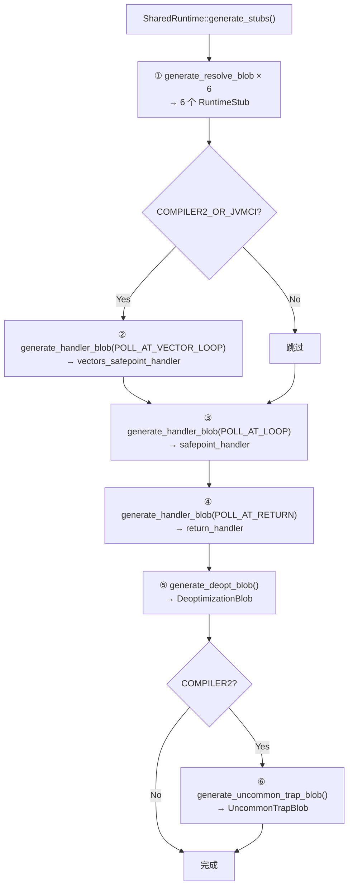
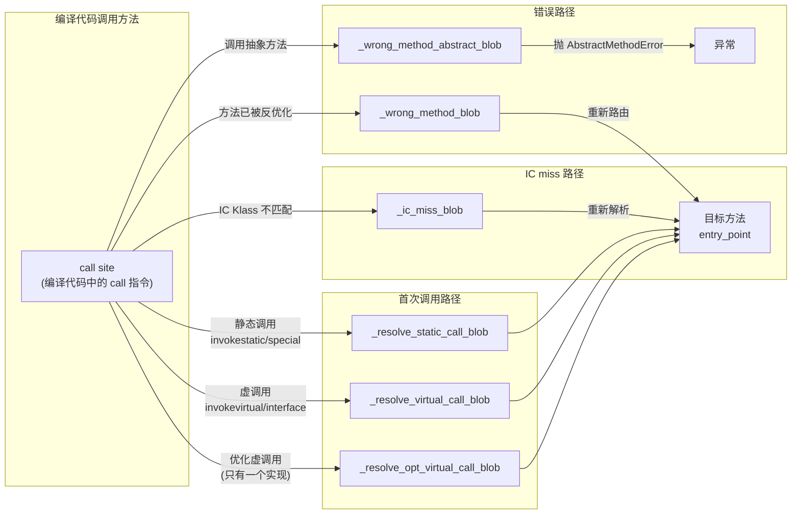
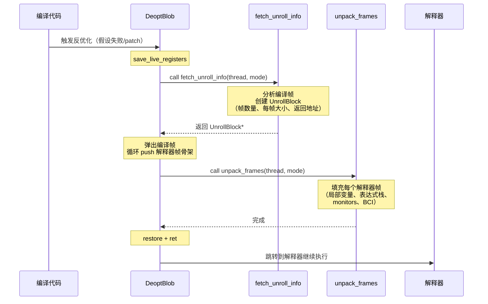

# 4G: SharedRuntime Blob 深度剖析

> **一句话**：`SharedRuntime::generate_stubs()` 生成 JVM 运行时的 11 个"胶水 Blob"——6 个方法解析桩（RuntimeStub）、1 个反优化桩（DeoptimizationBlob）、3 个安全点处理桩（SafepointBlob）、1 个罕见陷阱桩（UncommonTrapBlob）。它们是编译代码与 JVM 运行时之间的桥梁。
>
> **源码**：`src/hotspot/share/runtime/sharedRuntime.cpp:100-124`（生成入口）
> **平台代码**：`src/hotspot/cpu/x86/sharedRuntime_x86_64.cpp`（汇编生成）
> **调用位置**：`init.cpp:135` → `SharedRuntime::generate_stubs()`
> **标准环境**：`-Xms8g -Xmx8g -XX:+UseG1GC -Xint`，G1 Region = 4MB
> **前置文档**：[4D-StubRoutines-Two-Phase-Deep-Dive.md](4D-StubRoutines-Two-Phase-Deep-Dive.md)

---

## 第 0 部分：核心原理 ⭐

### 0.1 本质是什么？

本文深入分析 **4G: SharedRuntime Blob 深度剖析**：从源码角度理解其设计原理、实现机制和关键细节。

### 0.2 为什么需要？

理解 JVM 内部实现是排查复杂问题、进行性能优化的基础。表面的 API 文档无法解释 JVM 的实际行为，只有深入源码才能建立精确的心智模型。

### 0.3 怎么解决？

结合源码阅读、数据结构分析和 GDB 运行时验证，从多个角度建立对该机制的完整理解。

### 0.4 为什么这样设计？

每个设计决策都有其权衡：性能 vs 正确性、简单性 vs 灵活性、内存占用 vs 查找速度。理解这些权衡是理解 JVM 设计的关键。

---


## 一、问题引入：为什么需要 SharedRuntime Blob？

JVM 中编译代码（JIT 生成的机器码）运行时会遇到三类"意外情况"：

1. **方法解析问题**——调用一个从未调用过的方法、IC 缓存 miss、调用了错误的方法
2. **反优化**——JIT 的优化假设被打破（如类层次变化、类型推测失败）
3. **安全点请求**——VM 需要所有线程停在安全点（如 GC、偏向锁撤销）

这三类问题都需要从编译代码**安全地过渡**到 C++ 运行时代码。SharedRuntime Blob 就是这个过渡的"桥梁"——它们是手写汇编生成的代码片段，知道如何保存/恢复所有寄存器、设置 Java 帧、调用 C++ 函数、然后干净地返回或跳转。

---

## 二、整体架构

### 2.1 Blob 类层次

```
CodeBlob (基类)
  └── RuntimeBlob
        ├── BufferBlob                 ← StubRoutines._code1/_code2, 解释器
        ├── RuntimeStub                ← ★ 6 个方法解析桩
        └── SingletonBlob
              ├── DeoptimizationBlob   ← ★ 1 个反优化桩
              ├── UncommonTrapBlob     ← ★ 1 个罕见陷阱桩 (C2)
              ├── SafepointBlob        ← ★ 3 个安全点处理桩
              └── ExceptionBlob        ← (C2 异常展开，不在 generate_stubs 中)
```

### 2.2 generate_stubs() 生成顺序



### 2.3 11 个 Blob 一览表

| # | 字段 | 类型 | 大小 | 代码大小 | 用途 |
|---|------|------|------|---------|------|
| 1 | `_wrong_method_blob` | RuntimeStub | 592B | 448B | IC 缓存中的方法不匹配 |
| 2 | `_wrong_method_abstract_blob` | RuntimeStub | 592B | 448B | 调用了抽象方法 |
| 3 | `_ic_miss_blob` | RuntimeStub | 592B | 448B | InlineCache miss |
| 4 | `_resolve_opt_virtual_call_blob` | RuntimeStub | 592B | 448B | 解析优化虚调用 |
| 5 | `_resolve_virtual_call_blob` | RuntimeStub | 592B | 448B | 解析虚调用 |
| 6 | `_resolve_static_call_blob` | RuntimeStub | 592B | 448B | 解析静态调用 |
| 7 | `_polling_page_return_handler_blob` | SafepointBlob | 560B | 416B | 返回点安全点处理 |
| 8 | `_polling_page_safepoint_handler_blob` | SafepointBlob | 648B | 504B | 循环回边安全点处理 |
| 9 | `_polling_page_vectors_safepoint_handler_blob` | SafepointBlob | ~648B | ~504B | 向量循环安全点处理 |
| 10 | `_deopt_blob` | DeoptimizationBlob | 1760B | 1584B | 编译代码反优化 |
| 11 | `_uncommon_trap_blob` | UncommonTrapBlob | ~1024B | - | C2 罕见陷阱 |

**总大小**：约 7.5KB 机器码，全部存储在 CodeCache 中。

---

## 三、第一组：6 个 RuntimeStub（方法解析）

### 3.1 统一生成模板：generate_resolve_blob()

所有 6 个 RuntimeStub 共享相同的汇编模板，唯一区别是调用的 C++ 目标函数不同：

```cpp
// sharedRuntime.cpp:100-107
_wrong_method_blob             = generate_resolve_blob(handle_wrong_method,          "wrong_method_stub");
_wrong_method_abstract_blob    = generate_resolve_blob(handle_wrong_method_abstract, "wrong_method_abstract_stub");
_ic_miss_blob                  = generate_resolve_blob(handle_wrong_method_ic_miss,  "ic_miss_stub");
_resolve_opt_virtual_call_blob = generate_resolve_blob(resolve_opt_virtual_call_C,   "resolve_opt_virtual_call");
_resolve_virtual_call_blob     = generate_resolve_blob(resolve_virtual_call_C,       "resolve_virtual_call");
_resolve_static_call_blob      = generate_resolve_blob(resolve_static_call_C,        "resolve_static_call");
```

### 3.2 generate_resolve_blob 汇编流程

```
┌─────────────────────────────────────────────────────────────────┐
│              generate_resolve_blob 生成的汇编流程                 │
├─────────────────────────────────────────────────────────────────┤
│                                                                 │
│  1. RegisterSaver::save_live_registers()                        │
│     ┌──────────────────────────────────────────────┐            │
│     │ push rbp; mov rsp,rbp; pushf; sub $8,rsp    │            │
│     │ sub $0x80, rsp                               │            │
│     │ mov rax,[rsp+0x78]  ← 保存 rax              │            │
│     │ mov rcx,[rsp+0x70]  ← 保存 rcx              │            │
│     │ ... 保存所有 15 个通用寄存器                    │            │
│     │ movsd xmm0,[rsp+...]  ← 保存 XMM 寄存器      │            │
│     └──────────────────────────────────────────────┘            │
│                                                                 │
│  2. set_last_Java_frame(noreg, noreg, NULL)                     │
│     → 设置 Thread::_last_Java_sp/fp/pc                          │
│     → 使 GC 栈遍历可以找到此帧                                    │
│                                                                 │
│  3. mov rdi, r15_thread                                         │
│     call <destination>   ← 调用 C++ 运行时函数                    │
│     (如 handle_wrong_method / resolve_virtual_call_C)           │
│     返回值在 rax = 目标方法的 entry_point                         │
│                                                                 │
│  4. 记录 OopMap（用于 GC）                                       │
│                                                                 │
│  5. reset_last_Java_frame()                                     │
│                                                                 │
│  6. 检查 pending_exception                                      │
│     ├── 有异常 → restore_regs → jmp forward_exception_entry    │
│     └── 无异常 → mov rax → restore_regs → jmp rax             │
│                     ↑ 跳转到解析出的目标方法                      │
│                                                                 │
└─────────────────────────────────────────────────────────────────┘
```

**帧大小 = 356 字（word）**：这是 `save_live_registers` 保存所有通用寄存器（15 个 × 8B）+ XMM 寄存器（16 个 × 16B）+ flags + 帧指针等所需的空间。

### 3.3 6 个桩的 C++ 目标函数和使用场景

#### ① _wrong_method_blob → `handle_wrong_method`

**触发场景**：编译代码通过 InlineCache 调用方法时，发现 IC 缓存中的方法与实际接收者不匹配。

```cpp
// sharedRuntime.cpp:1444-1478
JRT_BLOCK_ENTRY(address, SharedRuntime::handle_wrong_method(JavaThread* thread))
  // 判断调用者帧类型
  if (caller_frame.is_interpreted_frame() || caller_frame.is_entry_frame()) {
    // 解释器/入口帧 → 取 callee_target → 返回 c2i_entry
    Method* callee = thread->callee_target();
    return callee->get_c2i_entry();  // compiled-to-interpreter 适配器
  }
  // 编译帧 → 重新解析调用站点
  callee_method = SharedRuntime::reresolve_call_site(thread, ...);
  return callee_method->verified_code_entry();
JRT_END
```

**返回值**：正确方法的入口地址 → 汇编桩直接 `jmp rax` 跳过去。

#### ② _wrong_method_abstract_blob → `handle_wrong_method_abstract`

**触发场景**：调用了一个抽象方法（不该发生）。

```cpp
// sharedRuntime.cpp:1481-1509
JRT_BLOCK_ENTRY(address, SharedRuntime::handle_wrong_method_abstract(JavaThread* thread))
  // 获取调用字节码信息，抛出 AbstractMethodError
  LinkResolver::throw_abstract_method_error(callee, recv_klass, thread);
  return StubRoutines::forward_exception_entry();  // 异常传播
JRT_END
```

#### ③ _ic_miss_blob → `handle_wrong_method_ic_miss`

**触发场景**：InlineCache miss——IC 中缓存的 Klass 与实际接收者的 Klass 不同。

这是**多态调用**的核心路径。当同一个调用点先后看到不同类型的对象时：
1. 第一次 miss：IC 从 unlinked → monomorphic
2. 第二次 miss：IC 从 monomorphic → megamorphic（vtable 分发）

#### ④ _resolve_opt_virtual_call_blob → `resolve_opt_virtual_call_C`

**触发场景**：优化的虚调用（编译器判断只有一个实现）首次执行。

```cpp
// sharedRuntime.cpp:1540-1549
callee_method = SharedRuntime::resolve_helper(thread, true, true, CHECK_NULL);
// is_virtual=true, is_optimized=true
return callee_method->verified_code_entry();
```

#### ⑤ _resolve_virtual_call_blob → `resolve_virtual_call_C`

**触发场景**：普通虚调用首次执行，需要解析目标方法并初始化 IC。

```cpp
// sharedRuntime.cpp:1526-1535
callee_method = SharedRuntime::resolve_helper(thread, true, false, CHECK_NULL);
// is_virtual=true, is_optimized=false
return callee_method->verified_code_entry();
```

#### ⑥ _resolve_static_call_blob → `resolve_static_call_C`

**触发场景**：静态调用（invokestatic/invokespecial）首次执行，需要解析目标方法并回填调用站点。

```cpp
// sharedRuntime.cpp:1513-1522
callee_method = SharedRuntime::resolve_helper(thread, false, false, CHECK_NULL);
// is_virtual=false, is_optimized=false
return callee_method->verified_code_entry();
```

### 3.4 方法解析的协作关系



---

## 四、第二组：DeoptimizationBlob（反优化）

### 4.1 反优化是什么？

当 JIT 编译器基于某些假设进行了优化（如类型推测、去虚拟化），而这些假设后来被打破时，JVM 必须将正在执行的编译帧"拆解"为等价的解释器帧，让解释器继续执行。这个过程就是**反优化**。

### 4.2 DeoptimizationBlob 的 4 个入口点

```
┌──────────────────────────────────────────────────────────────────────────┐
│                    DeoptimizationBlob 内部布局                           │
├──────────────────────────────────────────────────────────────────────────┤
│                                                                          │
│  偏移 0    ← entry_point() = unpack()                                    │
│  │           正常反优化入口                                                │
│  │           save_live_registers → mov r14, Unpack_deopt → jmp cont      │
│  │                                                                        │
│  偏移 297  ← unpack_with_reexecution()                                    │
│  │           重新执行入口（需要重新执行当前字节码）                            │
│  │           save_live_registers → mov r14, Unpack_reexecute → jmp cont  │
│  │                                                                        │
│  偏移 594  ← unpack_with_exception()                                      │
│  │           异常期间反优化                                                 │
│  │           save exception_oop/pc → mov r14, Unpack_exception → ...     │
│  │                                                                        │
│  偏移 608  ← unpack_with_exception_in_tls()                               │
│  │           C1 使用，异常信息已在 TLS 中                                   │
│  │                                                                        │
│  ... cont 标签 ...                                                        │
│                                                                          │
│  公共路径:                                                                 │
│  1. call Deoptimization::fetch_unroll_info(thread, exec_mode)            │
│     → 返回 UnrollBlock*：描述如何构建解释器帧                               │
│  2. 恢复返回值寄存器                                                       │
│  3. 弹出反优化帧                                                          │
│  4. 循环推送解释器帧（根据 UnrollBlock 中的帧大小数组）                       │
│  5. call Deoptimization::unpack_frames(thread, exec_mode)                │
│     → 填充解释器帧的实际内容                                                │
│  6. leave + ret → 跳转到解释器继续执行                                      │
│                                                                          │
└──────────────────────────────────────────────────────────────────────────┘
```

**关键洞察**：`_unpack_offset = 0`，意味着 `entry_point()` 和 `unpack()` 指向同一个地址。反优化入口直接就是 unpack 入口。

### 4.3 反优化的两阶段流程



---

## 五、第三组：SafepointBlob（安全点处理）

### 5.1 安全点轮询机制回顾

JIT 编译的代码在循环回边和方法返回处插入安全点轮询：

```asm
; 编译代码中的安全点检查
test rax, [polling_page_addr]   ; 正常时 polling_page 可读，test 成功
                                 ; VM 需要 safepoint 时，polling_page 设为不可读
                                 ; → 触发 SIGSEGV → 信号处理 → SafepointBlob
```

### 5.2 三种 SafepointBlob

| 类型 | poll_type | 大小 | 场景 |
|------|----------|------|------|
| `_polling_page_return_handler_blob` | `POLL_AT_RETURN` | 560B | 方法返回点的安全点 |
| `_polling_page_safepoint_handler_blob` | `POLL_AT_LOOP` | 648B | 循环回边的安全点 |
| `_polling_page_vectors_safepoint_handler_blob` | `POLL_AT_VECTOR_LOOP` | ~648B | 向量循环的安全点（保存宽向量寄存器） |

**POLL_AT_LOOP vs POLL_AT_RETURN 的区别**：
- `POLL_AT_RETURN`（`cause_return=true`）：返回点已经有返回地址在栈上，不需要额外保存
- `POLL_AT_LOOP`（`cause_return=false`）：循环回边处需要额外 `push rbx` 保存下一条指令地址

这就是为什么 LOOP 版本（648B）比 RETURN 版本（560B）大 88 字节。

### 5.3 SafepointBlob 汇编流程

```
┌──────────────────────────────────────────────────────────┐
│              SafepointBlob (POLL_AT_LOOP) 流程             │
├──────────────────────────────────────────────────────────┤
│                                                          │
│  1. [RTM] xabort 0    ← 中止硬件事务（如果启用 RTM）     │
│  2. push rbx          ← 保存返回地址                     │
│  3. save_live_registers  ← 保存全部寄存器                │
│  4. set_last_Java_frame                                  │
│  5. mov rdi, r15_thread                                  │
│     call SafepointSynchronize::handle_polling_page_exception │
│     → 处理安全点（可能触发 GC、偏向锁撤销等）              │
│  6. 检查 pending_exception                               │
│     有异常 → forward_exception_entry                     │
│  7. 无异常 → restore_registers → ret                     │
│                                                          │
└──────────────────────────────────────────────────────────┘
```

---

## 六、第四组：UncommonTrapBlob（C2 罕见陷阱）

**仅 C2 编译器使用**。当 C2 编译的代码遇到罕见情况（如分支预测的"冷"路径、从未见过的类型），它不会直接生成处理代码，而是插入一个 uncommon trap 指令。

流程与 DeoptimizationBlob 类似：
1. 调用 `Deoptimization::uncommon_trap()` 获取 UnrollBlock
2. 弹出编译帧，推送解释器帧
3. 调用 `Deoptimization::unpack_frames()` 填充帧内容
4. 跳转到解释器

与 DeoptimizationBlob 的区别：UncommonTrapBlob 只有一个入口点，且传递 `Unpack_uncommon_trap` 作为模式。

---

## 七、GDB 验证

### 7.1 验证环境

```
断点：universe2_init（在 SharedRuntime::generate_stubs() 之后）
命令：gdb -x verify_sharedruntime_blobs.gdb <java>
参数：-Xms8g -Xmx8g -XX:+UseG1GC -Xint
```

### 7.2 6 个 RuntimeStub 验证

所有 6 个 RuntimeStub 具有**完全相同的尺寸参数**：

| 属性 | 值 | 含义 |
|------|-----|------|
| `_size` | 592 字节 | Blob 总大小（含头部） |
| `code_size` | 448 字节 | 机器码大小 |
| `_frame_size` | 356 (word) | 栈帧大小（所有寄存器保存空间） |
| `_header_size` | 120 字节 | CodeBlob 头部大小 |
| `_caller_must_gc_arguments` | 1 | 调用者的参数需要 GC 处理 |

**内存布局**（以 `_wrong_method_blob` 为例）：

```
0x7fffed008190  ┌──────────────────────┐
                │ CodeBlob header      │ 120 字节
                │ _type, _size, ...    │
0x7fffed008208  │ _relocation_begin    │ 重定位信息 8 字节
0x7fffed008210  │ _relocation_end      │
0x7fffed008220  ├──────────────────────┤ ← _code_begin = _content_begin = entry_point
                │                      │
                │ 汇编代码 448 字节      │
                │ save_regs → call     │
                │ → check_exc → jmp    │
                │                      │
0x7fffed0083e0  └──────────────────────┘ ← _code_end = _data_end
                总计 = 0x250 = 592 字节
```

### 7.3 DeoptimizationBlob 验证

```
地址: 0x7fffed113090
大小: 1760 字节（是 RuntimeStub 的 3 倍——因为有 4 个入口点 + 复杂的帧拆解循环）
代码: 1584 字节

4 个入口点:
  entry/unpack()            = 0x7fffed113140  (偏移 0)
  unpack_with_reexecution() = 0x7fffed113269  (偏移 297)
  unpack_with_exception()   = 0x7fffed113392  (偏移 594)
  unpack_with_exc_in_tls()  = 0x7fffed1133a0  (偏移 608)
```

**偏移规律**：reexecution 偏移 = 297 ≈ exception 偏移 / 2 = 594 / 2。每个入口点的 save_registers + 设置 exec_mode 代码约 ~297 字节。

### 7.4 SafepointBlob 验证

```
POLL_AT_RETURN:  0x7fffed112790, size=560, code=416
POLL_AT_LOOP:    0x7fffed112a90, size=648, code=504
POLL_AT_VECTOR:  0x7fffed114690 (not NULL — COMPILER2 编译进去了)
```

LOOP 版本比 RETURN 版本大 88 字节（648 - 560），对应额外的 `push rbx` + 地址保存/恢复逻辑。

### 7.5 UncommonTrapBlob 验证

```
_uncommon_trap_blob = 0x7fffed112d90  (存在，尽管 -Xint 不需要)
```

虽然 `-Xint` 模式不使用 C2 编译器，但 slowdebug 构建编译了 COMPILER2 代码，所以 UncommonTrapBlob 仍然会被生成。

### 7.6 汇编代码验证

所有 Blob 的入口都以相同的 `RegisterSaver::save_live_registers` 序列开始：

```asm
push   %rbp                     ; 保存帧指针
mov    %rsp,%rbp                ; 建立新帧
pushf                           ; 保存 EFLAGS
sub    $0x8,%rsp                ; 对齐
mov    %rsp,-0x28(%rsp)         ; 保存 sp (用于 last_Java_frame)
sub    $0x80,%rsp               ; 分配通用寄存器保存空间 (128B = 16×8B)
mov    %rax,0x78(%rsp)          ; 保存 rax
mov    %rcx,0x70(%rsp)          ; 保存 rcx
mov    %rdx,0x68(%rsp)          ; 保存 rdx
mov    %rbx,0x60(%rsp)          ; 保存 rbx
mov    %rbp,0x50(%rsp)          ; 保存 rbp
mov    %rsi,0x48(%rsp)          ; 保存 rsi
mov    %rdi,0x40(%rsp)          ; 保存 rdi
mov    %r8,0x38(%rsp)           ; 保存 r8
mov    %r9,0x30(%rsp)           ; 保存 r9
mov    %r10,0x28(%rsp)          ; 保存 r10
mov    %r11,0x20(%rsp)          ; 保存 r11
mov    %r12,0x18(%rsp)          ; 保存 r12
mov    %r13,0x10(%rsp)          ; 保存 r13
mov    %r14,0x8(%rsp)           ; 保存 r14
; ... 后续保存 r15 和 XMM 寄存器 ...
```

这个序列保存了 x86_64 的所有 15 个通用寄存器（不含 rsp）加 EFLAGS，然后继续保存 XMM 寄存器。这确保了 C++ 运行时函数执行完毕后，可以完美恢复到中断前的寄存器状态。

---

## 八、CodeCache 中的地址分布

```
CodeCache [0x7fffed000000, 0x7ffff0000000) = 48MB

0x7fffed000b90  StubRoutines._code1 (Phase 1)
0x7fffed008190  SharedRuntime._wrong_method_blob ← ★ 唯一一个在低地址的
                ...（解释器 + 582 个 Adapter 在中间）...
0x7fffed093190  StubRoutines._code2 (Phase 2)
                ...
0x7fffed112790  _polling_page_return_handler_blob       560B
0x7fffed112a90  _polling_page_safepoint_handler_blob    648B
0x7fffed112d90  _uncommon_trap_blob                     ~???B
0x7fffed113090  _deopt_blob                             1760B
0x7fffed113790  _resolve_static_call_blob               592B
0x7fffed113a90  _resolve_virtual_call_blob              592B
0x7fffed113d90  _resolve_opt_virtual_call_blob          592B
0x7fffed114090  _ic_miss_blob                           592B
0x7fffed114390  _wrong_method_abstract_blob             592B
0x7fffed114690  _polling_page_vectors_safepoint_handler  ~648B
```

**有趣的发现**：`_wrong_method_blob` 地址是 `0x7fffed008190`，远低于其他 Blob（`0x7fffed112xxx ~ 0x7fffed114xxx`）。这是因为它在 `generate_stubs()` 中**第一个生成**，而此时 CodeHeap 的 bump pointer 还在低位。后续解释器初始化 + Adapter 生成消耗了大量 CodeHeap 空间，等到生成剩余 Blob 时，指针已经推进到 `0x7fffed112xxx`。

---

## 九、关键设计总结

### 9.1 为什么 6 个 RuntimeStub 大小完全相同？

因为它们共享同一个模板 `generate_resolve_blob()`，只有 `call <destination>` 的目标地址不同。汇编框架（保存寄存器、设置帧、检查异常、跳转目标）完全相同，所以生成的代码大小也相同（448B）。

### 9.2 为什么 DeoptimizationBlob 是最大的？

因为它有：
- 4 个不同的入口点（每个都要 save_registers + 设置 exec_mode）
- 复杂的帧拆解循环（根据 UnrollBlock 推送多个解释器帧）
- 两次 C++ 调用（fetch_unroll_info + unpack_frames）

### 9.3 _caller_must_gc_arguments = 1 的含义

所有 RuntimeStub 的 `_caller_must_gc_arguments = true`，意味着当 GC 遍历栈帧时，需要处理这些桩帧中保存的 oop 参数。OopMap 记录了哪些栈槽中包含 oop 引用。

### 9.4 IC Miss 调用链

一个典型的多态调用演进过程：

```
1. 首次调用: call site → _resolve_virtual_call_blob
     → resolve_helper → IC 设为 monomorphic (Klass1)
     
2. Klass1 对象调用: IC hit → 直接跳转到目标方法

3. Klass2 对象调用: IC miss → _ic_miss_blob
     → handle_ic_miss_helper → IC 设为 megamorphic (vtable)

4. 之后所有调用: vtable dispatch → 无需 blob
```

---

## 十、关键数字

| 项目 | 值 |
|------|-----|
| RuntimeStub 数量 | 6 |
| SafepointBlob 数量 | 2~3（取决于是否支持宽向量） |
| DeoptimizationBlob 数量 | 1 |
| UncommonTrapBlob 数量 | 0~1（取决于是否编译 C2） |
| RuntimeStub 单个大小 | 592 字节（头部 120 + 重定位 8 + 对齐 + 代码 448） |
| DeoptimizationBlob 大小 | 1760 字节 |
| 所有 Blob 总大小 | ~8KB |
| RegisterSaver 帧大小 | 356 word |
| CodeBlob 头部大小 | 120 字节 |
| DeoptBlob 入口点数 | 4 |
