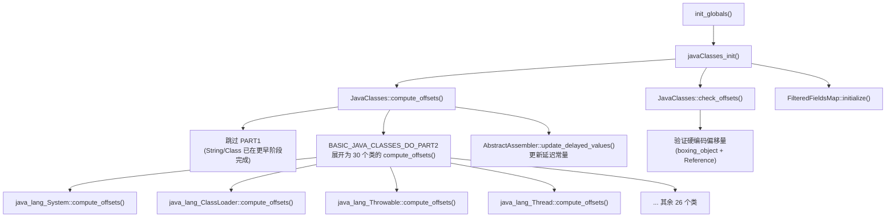

# 4H: javaClasses_init() 深度剖析

> **一句话总结**：`javaClasses_init()` 为 ~32 个核心 Java 类计算 C++ 端访问 Java 对象字段的偏移量，是 HotSpot C++ 代码与 Java 对象世界之间的**桥梁**。
> **源码**：`share/classfile/javaClasses.cpp:4597-4601`、`share/classfile/javaClasses.hpp:50-89`
> **标准环境**：`-Xms8g -Xmx8g -XX:+UseG1GC -Xint`，`UseCompressedOops=true`，`heapOopSize=4`

---

## 第 0 部分：核心原理 ⭐

### 0.1 本质是什么？

本文分析 **4H: javaClasses_init() 深度剖析** 的初始化过程：JVM 启动时该组件如何被创建、配置和激活，以及初始化顺序的约束关系。

### 0.2 为什么需要？

JVM 初始化顺序有严格的依赖关系——某些组件必须在其他组件之前初始化。理解初始化顺序有助于排查启动失败问题，也能理解各组件的设计约束。

### 0.3 怎么解决？

追踪初始化函数的调用链，分析每个初始化步骤的前置条件和后置效果，识别关键的初始化顺序约束。

### 0.4 为什么这样设计？

初始化顺序的设计原则：「被依赖的先初始化」。例如内存管理必须在 GC 之前初始化，GC 必须在类加载之前初始化。

---


## 一、问题引入：C++ 怎么读写 Java 对象的字段？

### 1.1 核心矛盾

HotSpot 是 C++ 写的，但它必须能直接操作 Java 对象的字段。例如：

- **读 String 的内容**：C++ 要访问 `java.lang.String.value` 字段（byte[]）
- **获取线程信息**：C++ 要读 `java.lang.Thread.eetop` 获取 native 线程指针
- **操作异常栈**：C++ 要写 `java.lang.Throwable.backtrace` 设置栈信息
- **处理 GC 引用**：C++ 要读 `java.lang.ref.Reference.referent` 获取引用对象

**问题**：Java 对象的字段布局是由 JDK 版本的 .class 文件决定的，不同版本字段顺序可能不同。C++ 不能硬编码绝对偏移量。

### 1.2 HotSpot 的解决方案

在 JVM 启动时，**动态计算**每个关键字段在 Java 对象内存中的偏移量，存储到 C++ 静态变量中。之后 C++ 代码通过 `对象地址 + 偏移量` 直接访问字段——零开销，不需要走 JNI。

```
                    Java 对象内存布局
                    ┌──────────────────┐
                    │   mark word (8B) │ offset 0
                    │   klass ptr (4B) │ offset 8
                    │   field_1        │ offset 12  ← java_lang_String::value_offset = 12
                    │   field_2        │ offset 16  ← java_lang_String::hash_offset = 16
                    │   field_3        │ offset 20  ← java_lang_String::coder_offset = 20
                    └──────────────────┘

    C++ 访问方式：
    oop string_obj = ...;
    typeArrayOop value = (typeArrayOop) string_obj->obj_field(java_lang_String::value_offset);
```

---

## 二、整体流程

### 2.1 调用链



### 2.2 三步工作

```
javaClasses_init() {
    ① JavaClasses::compute_offsets()  → 动态查找 ~30 个类的字段偏移量
    ② JavaClasses::check_offsets()    → 验证硬编码偏移量的正确性（仅 debug 版）
    ③ FilteredFieldsMap::initialize() → 注册 2 个需要过滤的内部字段
}
```

### 2.3 两种偏移量计算方式

HotSpot 对字段偏移量有**两种处理方式**：

| 方式 | 适用场景 | 时机 | 类 |
|------|---------|------|-----|
| **硬编码** | 字段顺序从未变过的基础类 | `compute_hard_coded_offsets()`（更早调用） | `Reference`、boxing 类 |
| **动态计算** | 字段可能随 JDK 版本变化的类 | `compute_offsets()`（本函数） | 其余 ~30 个类 |

**硬编码公式**：`offset = hardcoded_index × heapOopSize + base_offset_in_bytes()`

在我们的环境中（`UseCompressedOops=true`）：
- `heapOopSize = 4`
- `base_offset_in_bytes() = 12`（mark 8B + compressed klass 4B）
- 所以 `Reference.referent_offset = 0 × 4 + 12 = 12`
- `Reference.queue_offset = 1 × 4 + 12 = 16`
- `Reference.next_offset = 2 × 4 + 12 = 20`
- `Reference.discovered_offset = 3 × 4 + 12 = 24`

---

## 三、动态计算机制详解

### 3.1 核心宏模式

每个类的 `compute_offsets()` 都遵循统一模式：

```cpp
// 步骤 1: 定义字段宏，列出所有需要计算偏移的字段
#define STRING_FIELDS_DO(macro) \
  macro(value_offset, k, vmSymbols::value_name(), byte_array_signature, false); \
  macro(hash_offset,  k, "hash",                  int_signature,        false); \
  macro(coder_offset, k, "coder",                 byte_signature,       false)

// 步骤 2: compute_offsets() 使用 FIELD_COMPUTE_OFFSET 宏展开
void java_lang_String::compute_offsets() {
    InstanceKlass* k = SystemDictionary::String_klass();  // 获取已加载的 Klass
    STRING_FIELDS_DO(FIELD_COMPUTE_OFFSET);               // 展开计算
}
```

### 3.2 FIELD_COMPUTE_OFFSET 宏展开

```cpp
#define FIELD_COMPUTE_OFFSET(offset, klass, name, signature, is_static) \
  compute_offset(offset, klass, name, vmSymbols::signature(), is_static)
```

以 `String.value` 为例，展开后等价于：

```cpp
compute_offset(value_offset, k, vmSymbols::value_name(), vmSymbols::byte_array_signature(), false);
```

### 3.3 compute_offset() 底层实现

```cpp
static void compute_offset(int &dest_offset, InstanceKlass* ik,
                           Symbol* name_symbol, Symbol* signature_symbol,
                           bool is_static = false) {
    fieldDescriptor fd;
    // 在 Klass 的字段表中查找匹配字段
    if (!ik->find_local_field(name_symbol, signature_symbol, &fd) ||
        fd.is_static() != is_static) {
        vm_exit_during_initialization("Invalid layout of well-known class");
    }
    // 将字段的实际偏移量赋值给 C++ 静态变量
    dest_offset = fd.offset();
}
```

**关键点**：
1. `InstanceKlass::find_local_field()` 遍历类的字段表，匹配字段名和签名
2. `fieldDescriptor::offset()` 返回字段在对象实例中的字节偏移量
3. 结果存入 C++ 静态变量（如 `java_lang_String::value_offset`）
4. 如果找不到字段或类型不匹配，JVM **直接退出**——这是致命错误

### 3.4 两阶段分离

`BASIC_JAVA_CLASSES_DO` 分为 PART1 和 PART2：

| 阶段 | 类 | 调用时机 |
|------|-----|---------|
| **PART1** | `java_lang_Class`、`java_lang_String` | 更早，在 `SystemDictionary::resolve_well_known_classes()` 中 |
| **PART2** | 其余 30 个类 | `javaClasses_init()` → `JavaClasses::compute_offsets()` |

**为什么分两阶段？** String 和 Class 是最基础的类，在 Universe 创建（`universe2_init()`）阶段就需要使用它们的偏移量（例如创建 Java 镜像 `java.lang.Class` 实例时需要设置 `_klass_offset`）。所以它们的偏移量必须在 PART2 之前就计算好。

---

## 四、32 个类的偏移量全表

### 4.1 PART1：最基础的 2 个类

#### java_lang_String（C++ 访问 String 内容的桥梁）

| 偏移变量 | GDB 值 | Java 字段 | 类型 | 用途 |
|---------|--------|-----------|------|------|
| `value_offset` | **12** | `String.value` | `byte[]` | 存储字符串实际数据（JDK 9+ Compact Strings） |
| `hash_offset` | **16** | `String.hash` | `int` | 缓存的 hashCode |
| `coder_offset` | **20** | `String.coder` | `byte` | 编码标志：0=LATIN1, 1=UTF16 |

**使用场景**：`java_lang_String::value()` → `obj->obj_field(value_offset)` 直接读取 byte[]

#### java_lang_Class（java.lang.Class ↔ Klass* 双向映射桥梁）

| 偏移变量 | GDB 值 | Java/注入字段 | 类型 | 用途 |
|---------|--------|-------------|------|------|
| `_klass_offset` | **80** | 注入字段 | `Klass*` | **核心**：Class 对象→Klass 指针 |
| `_array_klass_offset` | **88** | 注入字段 | `Klass*` | 对应的数组 Klass |
| `_oop_size_offset` | **100** | 注入字段 | `int` | 镜像对象大小 |
| `_static_oop_field_count_offset` | **104** | 注入字段 | `int` | 静态 oop 字段数 |
| `_protection_domain_offset` | **68** | 注入字段 | `oop` | 保护域 |
| `_class_loader_offset` | **28** | `classLoader` | `ClassLoader` | 加载此类的类加载器 |
| `_module_offset` | **24** | `module` | `Module` | 所属模块 |
| `_component_mirror_offset` | **36** | `componentType` | `Class` | 数组元素类型镜像 |
| `_name_offset` | **20** | `name` | `String` | 缓存的类名 |
| `_source_file_offset` | **76** | 注入字段 | `Symbol*` | 源文件名 |
| `classRedefinedCount_offset` | **96** | `classRedefinedCount` | `int` | JVMTI 重定义计数 |

**关键点**：`_klass_offset=80` 表示从 `java.lang.Class` 对象地址偏移 80 字节处存储了 `Klass*` 指针。这是 Java 世界到 C++ 世界的核心通道。注入字段（injected field）是 HotSpot 在加载类时偷偷加入的字段，Java 层不可见。

### 4.2 PART2：其余 30 个类

#### java_lang_Thread（C++ 操作线程状态的桥梁）⭐⭐⭐⭐⭐

| 偏移变量 | GDB 值 | Java 字段 | 类型 | 用途 |
|---------|--------|-----------|------|------|
| `_eetop_offset` | **16** | `eetop` | `long` | **核心**：JavaThread* 指针，C++ 线程关联 |
| `_priority_offset` | **12** | `priority` | `int` | 线程优先级 |
| `_stackSize_offset` | **24** | `stackSize` | `long` | 线程栈大小 |
| `_tid_offset` | **32** | `tid` | `long` | 线程 ID |
| `_thread_status_offset` | **40** | `threadStatus` | `int` | 线程状态（NEW/RUNNABLE/BLOCKED...） |
| `_daemon_offset` | **44** | `daemon` | `boolean` | 是否守护线程 |
| `_stillborn_offset` | **45** | `stillborn` | `boolean` | 是否死产线程 |
| `_name_offset` | **48** | `name` | `String` | 线程名称 |
| `_group_offset` | **56** | `group` | `ThreadGroup` | 所属线程组 |
| `_contextClassLoader_offset` | **60** | `contextClassLoader` | `ClassLoader` | 上下文类加载器 |
| `_park_blocker_offset` | **76** | `parkBlocker` | `Object` | LockSupport.park 的 blocker |

**使用场景**：`JavaThread::thread(oop java_thread)` → 读取 `eetop` 字段获取 C++ 线程对象指针。

#### java_lang_Throwable（异常对象操作桥梁）⭐⭐⭐⭐

| 偏移变量 | GDB 值 | Java 字段 | 类型 | 用途 |
|---------|--------|-----------|------|------|
| `backtrace_offset` | **12** | `backtrace` | `Object` | **核心**：内部栈跟踪数据（Java 层不可见） |
| `detailMessage_offset` | **16** | `detailMessage` | `String` | 异常消息 |
| `stackTrace_offset` | **24** | `stackTrace` | `StackTraceElement[]` | 公开的栈跟踪 |
| `depth_offset` | **32** | `depth` | `int` | 栈深度 |

**使用场景**：`java_lang_Throwable::fill_in_stack_trace()` 通过 `backtrace_offset` 设置内部栈信息。

#### java_lang_ClassLoader（类加载器操作桥梁）⭐⭐⭐⭐

| 偏移变量 | GDB 值 | Java 字段 | 类型 | 用途 |
|---------|--------|-----------|------|------|
| `parent_offset` | **12** | `parent` | `ClassLoader` | **核心**：双亲委派链 |
| `name_offset` | **16** | `name` | `String` | 加载器名称 |
| `unnamedModule_offset` | **20** | `unnamedModule` | `Module` | 未命名模块 |
| `nameAndId_offset` | **24** | `nameAndId` | `String` | 名称+ID（日志用） |
| `parallelCapable_offset` | **28** | `parallelLockMap` | `ConcurrentHashMap` | 是否支持并行加载 |
| `_loader_data_offset` | **72** | 注入字段 | `ClassLoaderData*` | C++ 类加载器数据 |

#### java_lang_ref_Reference（GC 引用处理桥梁）⭐⭐⭐⭐⭐

**注意**：Reference 的偏移量是**硬编码**的，在更早的 `compute_hard_coded_offsets()` 中计算。

| 偏移变量 | GDB 值 | 硬编码索引 | Java 字段 | 用途 |
|---------|--------|-----------|-----------|------|
| `referent_offset` | **12** | hc=0 | `referent` | **核心**：被引用的对象 |
| `queue_offset` | **16** | hc=1 | `queue` | 引用队列 |
| `next_offset` | **20** | hc=2 | `next` | 队列中下一个 |
| `discovered_offset` | **24** | hc=3 | `discovered` | GC 发现链（内部字段） |

**计算公式**：`offset = hc_index × 4 + 12`（heapOopSize=4，base=12）

#### java_lang_System（System.in/out/err 操作）

| 偏移变量 | GDB 值 | Java 字段 | 类型 | 说明 |
|---------|--------|-----------|------|------|
| `static_in_offset` | **112** | `System.in` | `InputStream`（static） | 标准输入 |
| `static_out_offset` | **116** | `System.out` | `PrintStream`（static） | 标准输出 |
| `static_err_offset` | **120** | `System.err` | `PrintStream`（static） | 标准错误 |

**注意**：这些是**静态字段偏移量**（`is_static=true`），偏移量较大因为计算基于 `Klass::static_field_base()`。

#### java_lang_ThreadGroup（线程组操作）

| 偏移变量 | GDB 值 | Java 字段 | 用途 |
|---------|--------|-----------|------|
| `_maxPriority_offset` | **12** | `maxPriority` | 最大优先级 |
| `_nthreads_offset` | **20** | `nthreads` | 线程数 |
| `_parent_offset` | **32** | `parent` | 父线程组 |
| `_name_offset` | **36** | `name` | 线程组名称 |

#### java_lang_invoke 系列（MethodHandle/Lambda 支撑）⭐⭐⭐⭐

**MethodHandle**：

| 偏移变量 | GDB 值 | Java 字段 | 用途 |
|---------|--------|-----------|------|
| `_type_offset` | **16** | `type` | MethodType |
| `_form_offset` | **20** | `form` | LambdaForm |

**MemberName**：

| 偏移变量 | GDB 值 | Java 字段 | 用途 |
|---------|--------|-----------|------|
| `_flags_offset` | **12** | `flags` | 修饰符位 |
| `_clazz_offset` | **24** | `clazz` | 定义方法的类 |
| `_name_offset` | **28** | `name` | 方法名 |
| `_type_offset` | **32** | `type` | 方法类型 |
| `_method_offset` | **36** | `method` | ResolvedMethodName |

**其他 invoke 类**：

| 类 | 偏移变量 | GDB 值 | 字段 |
|-----|---------|--------|------|
| `LambdaForm` | `_vmentry_offset` | **40** | `vmentry`（MemberName） |
| `MethodType` | `_rtype_offset` | **12** | 返回类型 |
| `MethodType` | `_ptypes_offset` | **16** | 参数类型数组 |
| `CallSite` | `_target_offset` | **12** | 目标 MethodHandle |

#### 其余类简表

| 类 | 关键偏移量 | 用途 |
|-----|-----------|------|
| `java_lang_ref_SoftReference` | `timestamp=32`, `static_clock=112` | 软引用 LRU 时间戳 |
| `java_security_AccessControlContext` | `_context=16`, `_isPrivileged=12` | 安全上下文 |
| `java_nio_Buffer` | `_limit=28` | Buffer 容量限制 |
| `java_lang_Module` | `loader=28`, `name=24` | 模块系统 |
| `java_lang_StackTraceElement` | 8 个字段偏移 | 栈帧信息 |
| `java_lang_reflect_Method` | `clazz`, `name`, `slot`, `modifiers` 等 | 反射方法对象 |
| `java_lang_reflect_Constructor` | 类似 Method | 反射构造器 |
| `java_lang_reflect_Field` | `clazz`, `name`, `type`, `slot` 等 | 反射字段对象 |
| `java_lang_boxing_object` | `value=12`, `long_value=16`（硬编码） | 装箱对象值 |
| `reflect_ConstantPool` | oop 字段 | 反射常量池 |
| `java_lang_AssertionStatusDirectives` | 断言状态 | 断言机制 |
| `java_lang_StackFrameInfo` | 栈帧内省 | StackWalker API |
| `java_lang_LiveStackFrameInfo` | 活栈帧 | 增强的 StackWalker |
| `java_util_concurrent_locks_AbstractOwnableSynchronizer` | 锁拥有者 | 死锁检测 |

---

## 五、偏移量计算的完整时序

```
universe_init()
  └─ SystemDictionary::initialize()
       └─ resolve_well_known_classes()
            ├─ 加载 java.lang.String
            ├─ java_lang_String::compute_offsets()  ← PART1
            ├─ 加载 java.lang.Class
            └─ java_lang_Class::compute_offsets()   ← PART1

... (universe2_init、interpreter_init 等) ...

javaClasses_init()   ← init_globals() 第 19 个调用
  ├─ JavaClasses::compute_offsets()
  │     ├─ 跳过 PART1 (String/Class 已计算)
  │     ├─ PART2: 30 个类依次 compute_offsets()
  │     │    ├─ java_lang_System::compute_offsets()
  │     │    ├─ java_lang_ClassLoader::compute_offsets()
  │     │    ├─ java_lang_Throwable::compute_offsets()
  │     │    ├─ java_lang_Thread::compute_offsets()
  │     │    ├─ java_lang_ThreadGroup::compute_offsets()
  │     │    ├─ ... (26 more)
  │     │    └─ java_util_concurrent_locks_AbstractOwnableSynchronizer
  │     └─ AbstractAssembler::update_delayed_values()
  │          └─ 刷新解释器中引用的延迟常量
  ├─ JavaClasses::check_offsets()  (debug only)
  │     └─ 验证 Reference + boxing 类的硬编码偏移量
  └─ FilteredFieldsMap::initialize()
       └─ 注册 ConstantPool.oop + UnsafeStaticFieldAccessorImpl.base 为隐藏字段
```

---

## 六、设计洞察

### 6.1 为什么不全部硬编码？

如果全部硬编码偏移量，JDK 修改 Java 类的字段顺序就会导致 JVM 崩溃。动态计算通过在运行时查找字段元数据，**自动适应 Java 类的字段布局变化**。

但 `Reference` 和装箱类的偏移量是硬编码的——因为它们的字段顺序从 JDK 1.2 至今从未改变过，而且 GC 代码需要在非常早期（甚至还没有加载这些类之前）就知道这些偏移量。

### 6.2 为什么分 PART1 / PART2？

`String` 和 `Class` 是 JVM 最基础的类——创建其他类的 Java 镜像（`java.lang.Class` 实例）时就需要设置 `_klass_offset`，而创建 Symbol 对应的 String 时就需要 `value_offset`。所以它们必须**在其他 well-known 类加载之前**就计算好偏移量。

### 6.3 注入字段（Injected Fields）

某些偏移量（如 `java_lang_Class::_klass_offset`）对应的不是 Java 源码中的字段，而是 HotSpot **偷偷注入**到类中的隐藏字段。这些字段在 `ClassFileParser` 解析 .class 文件时被追加，Java 反射 API 看不到它们，但 C++ 可以通过计算好的偏移量直接访问。

### 6.4 DelayedConstant 机制

解释器在生成模板代码时，可能需要引用某个字段偏移量（如 `String.value_offset`），但此时偏移量还未计算。解释器会注册一个 `DelayedConstant`，在 `compute_offsets()` 完成后由 `AbstractAssembler::update_delayed_values()` 回填实际值。

### 6.5 CDS 优化

如果使用 CDS（Class Data Sharing），偏移量已经在归档文件中保存好，`compute_offsets()` 直接 `return`，跳过所有计算——这是启动加速的一部分。

---

## 七、GDB 验证

### 7.1 验证环境

```
GDB 脚本：new-jvm-md/tmp-file/javaclasses/verify_javaclasses.gdb
断点位置：javaClasses_init() → finish 后读取静态变量
JVM 参数：-Xms8g -Xmx8g -XX:+UseG1GC -Xint
```

### 7.2 验证结果

**基础参数**：

```
UseCompressedOops = 1
heapOopSize       = 4   → compressed oop 占 4 字节
base_offset       = 12  → mark(8) + compressed_klass(4)
```

**String 偏移量**：

```
value_offset  = 12   → 紧跟对象头
hash_offset   = 16   → value(compressed oop 4B) 之后
coder_offset  = 20   → hash(int 4B) 之后
```

**Thread 偏移量**：

```
_priority_offset      = 12    _eetop_offset     = 16
_stackSize_offset     = 24    _tid_offset       = 32
_thread_status_offset = 40    _daemon_offset    = 44
_stillborn_offset     = 45    _name_offset      = 48
_group_offset         = 56    _contextClassLoader = 60
_park_blocker_offset  = 76
```

注意 `_daemon_offset=44`（boolean, 1B）紧接 `_stillborn_offset=45`（boolean, 1B），两个 boolean 连续排列不浪费空间。

**Class 偏移量**：

```
_name_offset       = 20    _module_offset     = 24
_class_loader_offset = 28  _component_mirror  = 36
_protection_domain   = 68  _source_file       = 76
_klass_offset       = 80   _array_klass       = 88
classRedefinedCount  = 96   _oop_size          = 100
_static_oop_count    = 104
```

**Reference 偏移量（硬编码）**：

```
referent_offset   = 12 = 0×4+12 ✓
queue_offset      = 16 = 1×4+12 ✓
next_offset       = 20 = 2×4+12 ✓
discovered_offset = 24 = 3×4+12 ✓
```

**MethodHandle/MemberName 偏移量**：

```
MethodHandle._type_offset = 16   MethodHandle._form_offset = 20
MemberName._flags_offset  = 12   MemberName._clazz_offset  = 24
MemberName._name_offset   = 28   MemberName._type_offset   = 32
MemberName._method_offset = 36
```

---

## 八、典型使用路径

### 8.1 C++ 读取 String 内容

```
java_lang_String::value(oop java_string)
  → java_string->obj_field(value_offset)      // value_offset = 12
  → 得到 typeArrayOop (byte[])
  → 再读 coder (coder_offset=20) 判断 LATIN1/UTF16
```

### 8.2 C++ 获取线程的 native 指针

```
java_lang_Thread::thread(oop java_thread)
  → java_thread->long_field(_eetop_offset)     // _eetop_offset = 16
  → 强转为 (JavaThread*)
```

### 8.3 GC 处理软引用

```
ReferenceProcessor::process_discovered_references()
  → java_lang_ref_Reference::referent(oop ref)
    → ref->obj_field(referent_offset)          // referent_offset = 12
  → 判断 referent 是否存活
```

### 8.4 Class → Klass* 映射

```
java_lang_Class::as_Klass(oop java_class)
  → java_class->metadata_field(_klass_offset)  // _klass_offset = 80
  → 得到 Klass*
```

---

## 九、关键数字

| 项目 | 值 |
|------|-----|
| 总类数 | 32（PART1: 2, PART2: 30） |
| 硬编码类 | 2（Reference + boxing_object） |
| 动态计算类 | 32 |
| 总偏移量字段数 | ~100+ |
| 对象头大小（UseCompressedOops） | 12 字节（mark 8 + klass 4） |
| heapOopSize | 4（compressed oop） |
| CDS 跳过计算 | 是（UseSharedSpaces=true 时直接返回） |
| 注入字段示例 | Class._klass_offset(80)、ClassLoader._loader_data_offset(72) |

---

## 十、关系总图

```mermaid
graph TB
    subgraph "javaClasses_init() 偏移量计算"
        JCI["javaClasses_init()"]
        CO["compute_offsets()"]
        CHK["check_offsets()"]
        FFM["FilteredFieldsMap::initialize()"]
        JCI --> CO
        JCI --> CHK
        JCI --> FFM
    end
    
    subgraph "PART1 (更早计算)"
        STR["java_lang_String<br/>value=12, hash=16, coder=20"]
        CLS["java_lang_Class<br/>_klass=80, _module=24"]
    end
    
    subgraph "PART2 (本函数计算)"
        THR["java_lang_Thread<br/>_eetop=16, _tid=32"]
        THA["java_lang_Throwable<br/>backtrace=12"]
        CL["java_lang_ClassLoader<br/>parent=12, _loader_data=72"]
        SYS["java_lang_System<br/>in=112, out=116, err=120"]
        MH["java_lang_invoke_MethodHandle<br/>_type=16, _form=20"]
        MN["java_lang_invoke_MemberName<br/>_clazz=24, _method=36"]
        REF_S["java_lang_ref_SoftReference<br/>timestamp=32"]
        OTH["... 其余 23 个类"]
    end
    
    subgraph "硬编码 (compute_hard_coded_offsets)"
        REF["java_lang_ref_Reference<br/>referent=12, queue=16<br/>next=20, discovered=24"]
        BOX["java_lang_boxing_object<br/>value=12, long_value=16"]
    end
    
    subgraph "消费者（使用偏移量的 C++ 代码）"
        GC["GC 引用处理<br/>→ Reference 偏移量"]
        THMGR["线程管理<br/>→ Thread._eetop"]
        EXCPT["异常处理<br/>→ Throwable.backtrace"]
        CLLOAD["类加载<br/>→ ClassLoader.parent"]
        INTERP["解释器<br/>→ String.value, Class._klass"]
        LAMBDA["Lambda/MH<br/>→ MethodHandle._type"]
    end
    
    CO --> STR
    CO --> CLS
    CO --> THR
    CO --> THA
    CO --> CL
    CO --> SYS
    CO --> MH
    CO --> MN
    CO --> REF_S
    CO --> OTH
    
    REF --> GC
    THR --> THMGR
    THA --> EXCPT
    CL --> CLLOAD
    STR --> INTERP
    CLS --> INTERP
    MH --> LAMBDA
```



---

## 十一、源文件索引

| 源文件 | 内容 |
|--------|------|
| `share/classfile/javaClasses.hpp:50-89` | `BASIC_JAVA_CLASSES_DO` 宏定义 |
| `share/classfile/javaClasses.hpp` | 32 个 C++ 类的静态偏移量声明 |
| `share/classfile/javaClasses.cpp:122-148` | `compute_offset()` 底层实现 |
| `share/classfile/javaClasses.cpp:190-194` | `FIELD_COMPUTE_OFFSET` 宏定义 |
| `share/classfile/javaClasses.cpp:4437-4473` | `compute_hard_coded_offsets()` + `member_offset()` |
| `share/classfile/javaClasses.cpp:4478-4497` | `JavaClasses::compute_offsets()` 主函数 |
| `share/classfile/javaClasses.cpp:4540-4569` | `JavaClasses::check_offsets()` 验证函数 |
| `share/classfile/javaClasses.cpp:4597-4601` | `javaClasses_init()` 入口 |
| `share/asm/assembler.cpp:250-285` | `update_delayed_values()` + `DelayedConstant::update_all()` |
| `share/runtime/reflectionUtils.cpp:75-80` | `FilteredFieldsMap::initialize()` |
