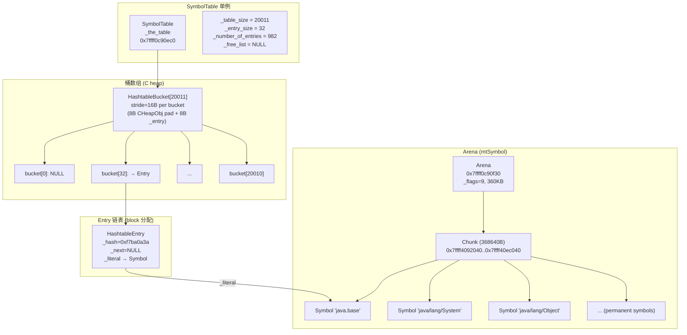
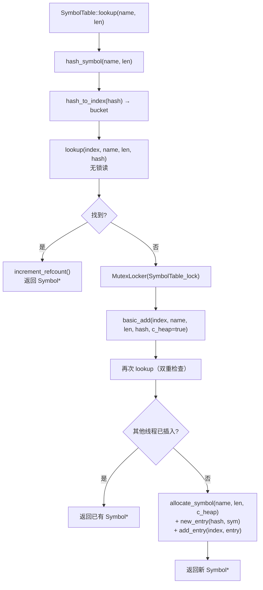
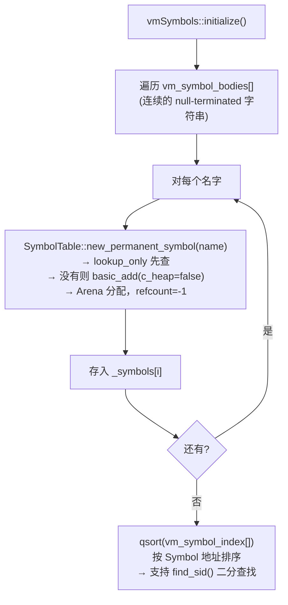

# 5A: SymbolTable 深度剖析

> **一句话**：SymbolTable 是 JVM 中所有"名字"（类名、方法名、签名、字段名等）的**全局唯一**存储池——20011 个桶的开链哈希表 + 360KB Arena 预分配内存区，保证同一字符串在 JVM 中只存在一个 Symbol 对象，通过引用计数管理生命周期。
>
> **源码**：`src/hotspot/share/classfile/symbolTable.hpp/cpp`、`src/hotspot/share/oops/symbol.hpp/cpp`
> **调用位置**：`universe_init()` → `SymbolTable::create_table()`（universe.cpp 步骤[9]）
> **标准环境**：`-Xms8g -Xmx8g -XX:+UseG1GC -Xint`，G1 Region = 4MB
> **前置文档**：[5-universe_init-Deep-Dive.md](5-universe_init-Deep-Dive.md)

---

## 第 0 部分：核心原理 ⭐

### 0.1 本质是什么？

本文深入分析 **5A: SymbolTable 深度剖析**：从源码角度理解其设计原理、实现机制和关键细节。

### 0.2 为什么需要？

理解 JVM 内部实现是排查复杂问题、进行性能优化的基础。表面的 API 文档无法解释 JVM 的实际行为，只有深入源码才能建立精确的心智模型。

### 0.3 怎么解决？

结合源码阅读、数据结构分析和 GDB 运行时验证，从多个角度建立对该机制的完整理解。

### 0.4 为什么这样设计？

每个设计决策都有其权衡：性能 vs 正确性、简单性 vs 灵活性、内存占用 vs 查找速度。理解这些权衡是理解 JVM 设计的关键。

---


## 一、问题引入：为什么需要 SymbolTable？

JVM 运行时到处都是"名字"：

| 场景 | 名字示例 |
|------|---------|
| 类加载 | `"java/lang/Object"`、`"java/lang/String"` |
| 方法解析 | `"equals"`、`"hashCode"`、`"(Ljava/lang/Object;)Z"` |
| 字段访问 | `"value"`、`"hash"`、`"[B"` |
| 常量池解析 | 每个 .class 文件中大量 CONSTANT_Utf8 |

**核心问题**：如果每次遇到 `"java/lang/Object"` 都创建一个新字符串对象，会造成：
1. **巨大的内存浪费**——同一个类名在整个 JVM 中可能被引用数万次
2. **比较代价高**——字符串比较需要逐字节对比，O(n) 复杂度
3. **无法快速判等**——两个 `"java/lang/Object"` 是否同一个？

**SymbolTable 的解决方案**：
- **全局唯一性**——相同字节序列只创建一个 Symbol 对象（intern 语义）
- **指针比较**——两个 `Symbol*` 相等 ⟺ 它们指向同一个对象（O(1)）
- **紧凑存储**——Symbol 不是 Java 对象，没有对象头开销，变长结构紧凑排列

---

## 二、整体架构

### 2.1 类继承链

```
SymbolTable
  └── RehashableHashtable<Symbol*, mtSymbol>    // 可重哈希
        └── Hashtable<Symbol*, mtSymbol>         // 泛型哈希表
              └── BasicHashtable<mtSymbol>        // 基础哈希表（桶数组+entry块分配）
                    └── CHeapObj<mtSymbol>         // C 堆分配
```

- `BasicHashtable`：管理桶数组、entry 分配、free list
- `Hashtable`：增加 `compute_hash()` + `new_entry(hash, obj)`
- `RehashableHashtable`：增加 rehash 机制（备用哈希算法 + `move_to()`）
- `SymbolTable`：特化为 Symbol 存储，增加 Arena 管理、引用计数、lookup/add 逻辑

### 2.2 全景图



### 2.3 关键数字（GDB 实测）

| 指标 | 值 | 说明 |
|------|-----|------|
| `_table_size` | 20011 | 桶数量（质数，减少冲突） |
| `_entry_size` | 32 字节 | 每个 HashtableEntry 的大小 |
| `_number_of_entries` | 982 | vmSymbols::initialize() 后的 entry 总数 |
| 非空桶 | 955 / 20011 | 负载率仅 4.90% |
| 最大桶深 | 2 | 几乎没有冲突 |
| Arena 容量 | 368640 字节 (360KB) | 预分配一个 Chunk |
| Arena 已用 | 30792 字节 | vmSymbols 用了 ~30KB |
| Arena 剩余 | 337864 字节 | 还有大量空间给后续类加载 |
| Entry block 剩余 | 1312 字节 | 还能分配 41 个 entry |

---

## 三、创建流程

### 3.1 create_table() 调用链

```
SymbolTable::create_table()                     // symbolTable.hpp:222
├── new SymbolTable()                            // 构造哈希表
│   └── RehashableHashtable(20011, 32)
│       └── Hashtable(20011, 32)
│           └── BasicHashtable(20011, 32)
│               ├── initialize(20011, 32, 0)     // 设置字段
│               ├── NEW_C_HEAP_ARRAY2(HashtableBucket, 20011)  // 分配桶数组
│               └── clear()                      // 所有桶._entry = NULL
└── initialize_symbols(360*1024)                 // 创建 Arena
    └── new Arena(mtSymbol, 368640)
        └── new Chunk(368640)                    // 一个 360KB 的大 Chunk
```

**源码**（`symbolTable.hpp:222-237`）：

```cpp
static void create_table() {
    assert(_the_table == NULL, "One symbol table allowed.");
    _the_table = new SymbolTable();              // 构造哈希表 + 20011 个桶
    initialize_symbols(symbol_alloc_arena_size);  // 创建 360KB Arena
}
```

### 3.2 构造函数链

SymbolTable 的构造函数只有一行：

```cpp
SymbolTable()
    : RehashableHashtable<Symbol*, mtSymbol>(
          SymbolTableSize,                          // 20011
          sizeof(HashtableEntry<Symbol*, mtSymbol>)  // 32
      ) {}
```

最终到达 `BasicHashtable::BasicHashtable(table_size, entry_size)`（`hashtable.inline.hpp:39-46`）：

```cpp
template <MEMFLAGS F> BasicHashtable<F>::BasicHashtable(int table_size, int entry_size) {
    initialize(table_size, entry_size, 0);
    _buckets = NEW_C_HEAP_ARRAY2(HashtableBucket<F>, table_size, F, CURRENT_PC);
    for (int index = 0; index < _table_size; index++) {
        _buckets[index].clear();  // _entry = NULL
    }
}
```

`initialize()` 设置所有字段：

```cpp
void initialize(int table_size, int entry_size, int number_of_entries) {
    _table_size = table_size;          // 20011
    _entry_size = entry_size;          // 32
    _free_list = NULL;                  // 无空闲 entry
    _first_free_entry = NULL;           // 无 entry block
    _end_block = NULL;
    _number_of_entries = number_of_entries;  // 0
}
```

### 3.3 Arena 创建

```cpp
void SymbolTable::initialize_symbols(int arena_alloc_size) {
    if (arena_alloc_size == 0) {
        _arena = new (mtSymbol) Arena(mtSymbol);        // 默认大小
    } else {
        _arena = new (mtSymbol) Arena(mtSymbol, arena_alloc_size);  // 指定 360KB
    }
}
```

Arena 构造时分配一个 360KB 的 Chunk，后续所有**永久 Symbol**（refcount=-1）都从这个 Chunk 中通过指针递增（bump pointer）分配——极快，无碎片。

---

## 四、核心数据结构

### 4.1 Symbol 对象

Symbol 是 JVM 中"名字"的紧凑表示，**不是 Java 对象**，没有对象头。

**声明**（`symbol.hpp:104-115`）：

```cpp
class Symbol : public MetaspaceObj {
private:
    ATOMIC_SHORT_PAIR(
        volatile short _refcount,   // 原子操作的引用计数
        unsigned short _length      // UTF8 字符数
    );
    short _identity_hash;           // 身份哈希
    jbyte _body[2];                 // 变长 UTF8 内容（至少 2 字节）
};
```

#### ATOMIC_SHORT_PAIR 宏的秘密

`Atomic::inc(jshort*)` 要求 short 地址必须满足 `(addr & 0x03) == 0x02`（即在 32 位字的高 16 位）。宏的作用是根据字节序调整两个 short 字段的排列顺序：

```cpp
// macros.hpp:650-658
#ifdef VM_LITTLE_ENDIAN
  // 小端：非原子字段在前，原子字段在后
  #define ATOMIC_SHORT_PAIR(atomic_decl, non_atomic_decl)  \
    non_atomic_decl;     \
    atomic_decl
#else
  // 大端：原子字段在前
  #define ATOMIC_SHORT_PAIR(atomic_decl, non_atomic_decl)  \
    atomic_decl;         \
    non_atomic_decl
#endif
```

x86_64 是小端，所以**实际内存布局**是 `_length` 在前、`_refcount` 在后：

```
偏移  字段            大小   说明
────  ──────────────  ────   ────────────────────────
+0    _length          2B    unsigned short，UTF8 长度
+2    _refcount        2B    volatile short，引用计数（-1=永久）
+4    _identity_hash   2B    short，身份哈希
+6    _body[0..1]      2B    UTF8 内容的前 2 字节
+8    _body[2..N-1]    变长   超出 2 字节的部分
```

`sizeof(Symbol) = 8`（固定部分）

`byte_size(length) = 8 + max(length - 2, 0)`

#### GDB 验证：`"java/lang/Object"` 的原始字节

```
地址: 0x7ffff40920f0
原始: 10 00 ff ff 30 6e 6a 61 76 61 2f 6c 61 6e 67 2f 4f 62 6a 65 63 74

解析：
  10 00       → _length = 0x0010 = 16（小端）
  ff ff       → _refcount = 0xffff = -1（PERM_REFCOUNT，永久）
  30 6e       → _identity_hash = 0x6e30 = 28208
  6a 61 76 61 2f 6c 61 6e 67 2f 4f 62 6a 65 63 74
              → "java/lang/Object"（16 字节 UTF8）

byte_size = 8 + max(16-2, 0) = 8 + 14 = 22 字节
```

#### 内存布局图

```
Symbol "java/lang/Object" at 0x7ffff40920f0:

     +0       +1       +2       +3       +4       +5       +6       +7
  ┌────────┬────────┬────────┬────────┬────────┬────────┬────────┬────────┐
  │  0x10  │  0x00  │  0xff  │  0xff  │  0x30  │  0x6e  │  'j'   │  'a'   │
  │ _length (16)    │ _refcount (-1)  │ _identity_hash  │ _body[0..1]      │
  ├────────┴────────┴────────┴────────┴────────┴────────┼────────┬────────┤
  │  'v'   │  'a'   │  '/'   │  'l'   │  'a'   │  'n'  │  'g'   │  '/'   │
  │ _body[2..9]                                                            │
  ├────────┴────────┴────────┴────────┴────────┴────────┼────────┬────────┤
  │  'O'   │  'b'   │  'j'   │  'e'   │  'c'   │  't'  │
  │ _body[10..15]                                        │
  └────────┴────────┴────────┴────────┴────────┴────────┘
  共 22 字节
```

### 4.2 HashtableEntry

每个 Symbol 在哈希表中对应一个 HashtableEntry：

```
HashtableEntry<Symbol*, mtSymbol>，sizeof = 32 字节

  ┌──────────────────────────────────────────────────────┐
  │ BasicHashtableEntry<mtSymbol> 部分 (24B)             │
  │   +0: _hash       (unsigned int, 4B)                 │
  │   +4: [padding]   (4B，对齐)                          │
  │   +8: _next       (BasicHashtableEntry*, 8B)         │
  │       注：bit 0 = shared 标记                         │
  │  +16: [padding]   (8B，CHeapObj debug 对齐)           │
  ├──────────────────────────────────────────────────────┤
  │ HashtableEntry 扩展部分 (8B)                          │
  │  +24: _literal    (Symbol*, 8B)                      │
  └──────────────────────────────────────────────────────┘
```

> **注**：GDB 实测 `sizeof(BasicHashtableEntry<mtSymbol>) = 24`，`sizeof(HashtableEntry<Symbol*,mtSymbol>) = 32`，与 `_entry_size = 32` 一致。

### 4.3 HashtableBucket

```
HashtableBucket<mtSymbol>

  Debug 构建：继承 CHeapObj<mtSymbol>，stride = 16 字节
  ┌────────────────────────────────────────┐
  │ +0: CHeapObj padding (8B, 0xf1 fill)  │  ← debug 模式填充
  │ +8: _entry (BasicHashtableEntry*, 8B)  │  ← 实际数据
  └────────────────────────────────────────┘

  Release 构建：stride = 8 字节（无 CHeapObj 开销）
  ┌────────────────────────────────────────┐
  │ +0: _entry (BasicHashtableEntry*, 8B)  │
  └────────────────────────────────────────┘
```

> **GDB 发现**：在 slowdebug 构建中，`HashtableBucket` 每个占 16 字节而非 8 字节。原始内存显示交替的 `0xf1f1f1f1f1f1f1f1`（CHeapObj debug zap）和实际 `_entry` 指针。这是因为 `CHeapObj<F>` 基类在 debug 模式下有 8 字节的额外开销。

### 4.4 Arena / Chunk

Arena 是 JVM 内部的快速内存分配器——通过 Chunk 链表管理大块内存，分配时只需指针递增。

```
Arena at 0x7ffff0c90f30:
  _flags = 9 (mtSymbol)
  _size_in_bytes = 368640 (360KB)

  ┌─────────────────────────────────────────────────┐
  │ Chunk at 0x7ffff4092030                         │
  │ _next = NULL (只有一个 Chunk)                    │
  │ _len = 368640                                    │
  ├─────────────────────────────────────────────────┤ ← bottom = 0x7ffff4092040
  │                                                  │
  │ Symbol 数据区                                    │
  │ _symbols[1] "java.base"    at 0x7ffff40920c8    │
  │ _symbols[3] "java/lang/Object" at 0x7ffff40920f0│
  │ _symbols[7] "java/lang/String" at 0x7ffff4092150│
  │ ...                                              │
  │ (已用 30792 字节 after vmSymbols)                │
  │                                                  │ ← _hwm
  │ (剩余 337864 字节)                               │
  │                                                  │ ← _max = _chunk_bottom + 368640
  └─────────────────────────────────────────────────┘
```

**Chunk 大小常量**（`arena.hpp`）：

| 名称 | 大小 | 说明 |
|------|------|------|
| tiny | 216B | LP64: 256 - 40(slack) |
| init | 984B | LP64: 1024 - 40 |
| medium | 10200B | LP64: 10240 - 40 |
| size | 32728B | LP64: 32768 - 40 |

**ChunkPool**：4 个静态对象池（tiny/small/medium/large），回收已释放的 Chunk 以减少 malloc/free 次数。

### 4.5 Entry Block 分配

HashtableEntry **不是逐个 malloc 的**，而是以"块"为单位从 C 堆批量分配：

```cpp
// hashtable.cpp:59-78
BasicHashtableEntry<F>* BasicHashtable<F>::new_entry(unsigned int hashValue) {
    // 1. 先尝试 free list
    BasicHashtableEntry<F>* entry = new_entry_free_list();

    if (entry == NULL) {
        // 2. 当前 block 空间不够？
        if (_first_free_entry + _entry_size >= _end_block) {
            // 分配新 block
            int block_size = MIN2(512, MAX2(table_size/2, number_of_entries));
            int len = entry_size * block_size;
            len = 1 << log2_int(len);  // 向下取 2 的幂
            _first_free_entry = NEW_C_HEAP_ARRAY2(char, len, F, CURRENT_PC);
            _end_block = _first_free_entry + len;
        }
        // 3. 从 block 中切割
        entry = (BasicHashtableEntry<F>*)_first_free_entry;
        _first_free_entry += _entry_size;  // 指针递增 32 字节
    }
    entry->set_hash(hashValue);
    return entry;
}
```

**GDB 验证**：

```
_first_free_entry = 0x7ffff0cb3400
_end_block        = 0x7ffff0cb3920
剩余 = 1312 字节 = 41 个 entry (1312 / 32)
```

---

## 五、哈希算法

### 5.1 默认哈希：Java String hashCode

```cpp
// symbolTable.cpp:286-289
unsigned int SymbolTable::hash_symbol(const char* s, int len) {
    return use_alternate_hashcode() ?
        AltHashing::halfsiphash_32(seed(), (const uint8_t*)s, len) :
        java_lang_String::hash_code((const jbyte*)s, len);
}
```

默认使用经典的 Java String hash：

```java
h = 0;
for (byte b : name) {
    h = 31 * h + (b & 0xFF);
}
```

### 5.2 hash_to_index

```cpp
int hash_to_index(unsigned int full_hash) const {
    return full_hash % _table_size;  // % 20011
}
```

简单取模。20011 是质数，能有效分散哈希值。

### 5.3 GDB 验证：`"java/lang/Object"` 的哈希

```
计算结果：hash = 0x7c015a33
bucket = 0x7c015a33 % 20011 = 19796
在 bucket[19796] 找到 entry，stored hash = 0x7c015a33
✅ 计算哈希 == 存储哈希
```

### 5.4 备用哈希：HalfSipHash

当某个桶深度超过 `(entries/table_size) * 60` 时，触发 rehash，切换到 `AltHashing::halfsiphash_32(seed, ...)`。这是一个密码学级的哈希函数，能抵抗哈希碰撞攻击。

---

## 六、查找与插入流程

### 6.1 lookup()：无锁读 + 有锁写



**源码**（`symbolTable.cpp:304-317`）：

```cpp
Symbol* SymbolTable::lookup(const char* name, int len, TRAPS) {
    unsigned int hashValue = hash_symbol(name, len);
    int index = the_table()->hash_to_index(hashValue);

    // 第一步：无锁读
    Symbol* s = the_table()->lookup(index, name, len, hashValue);
    if (s != NULL) return s;  // 找到直接返回

    // 第二步：加锁写
    MutexLocker ml(SymbolTable_lock, THREAD);
    return the_table()->basic_add(index, (u1*)name, len, hashValue, true, THREAD);
}
```

### 6.2 lookup_dynamic()：桶链遍历

```cpp
// symbolTable.cpp:208-227
Symbol* SymbolTable::lookup_dynamic(int index, const char* name,
                                    int len, unsigned int hash) {
    int count = 0;
    for (HashtableEntry<Symbol*, mtSymbol>* e = bucket(index);
         e != NULL; e = e->next()) {
        count++;
        if (e->hash() == hash) {        // 先比 hash（快）
            Symbol* sym = e->literal();
            if (sym->equals(name, len)) { // 再比内容（慢但精确）
                sym->increment_refcount();
                return sym;
            }
        }
    }
    // 检查是否需要 rehash
    if (count >= rehash_count && !needs_rehashing()) {
        _needs_rehashing = check_rehash_table(count);
    }
    return NULL;
}
```

**关键优化**：先比 4 字节 hash（一次整数比较），匹配后再比字符串内容。大多数不匹配在 hash 比较时就能排除。

### 6.3 自适应 shared-first 策略

```cpp
// symbolTable.cpp:239-260
Symbol* SymbolTable::lookup(int index, const char* name,
                            int len, unsigned int hash) {
    if (_lookup_shared_first) {
        // 先查 shared table，没找到再查 dynamic
        sym = lookup_shared(name, len, hash);
        if (sym != NULL) return sym;
        _lookup_shared_first = false;  // 失败则切回 dynamic-first
        return lookup_dynamic(index, name, len, hash);
    } else {
        // 先查 dynamic table
        sym = lookup_dynamic(index, name, len, hash);
        if (sym != NULL) return sym;
        sym = lookup_shared(name, len, hash);
        if (sym != NULL) {
            _lookup_shared_first = true;  // shared 命中则切到 shared-first
        }
        return sym;
    }
}
```

这是一个简单的自适应策略：如果 shared table 命中率高（CDS 场景），就先查 shared；否则先查 dynamic。

### 6.4 basic_add()：双重检查 + 分配

```cpp
// symbolTable.cpp:455-497
Symbol* SymbolTable::basic_add(int index_arg, u1 *name, int len,
                               unsigned int hashValue_arg, bool c_heap, TRAPS) {
    NoSafepointVerifier nsv;  // 此函数中不能有 safepoint

    // 如果已经 rehash，重新计算 hash 和 index
    unsigned int hashValue;
    int index;
    if (use_alternate_hashcode()) {
        hashValue = hash_symbol((const char*)name, len);
        index = hash_to_index(hashValue);
    } else {
        hashValue = hashValue_arg;
        index = index_arg;
    }

    // 双重检查：加锁后再查一次
    Symbol* test = lookup(index, (char*)name, len, hashValue);
    if (test != NULL) {
        return test;  // 其他线程抢先插入了
    }

    // 创建 Symbol + Entry，插入桶头
    Symbol* sym = allocate_symbol(name, len, c_heap, CHECK_NULL);
    HashtableEntry<Symbol*, mtSymbol>* entry = new_entry(hashValue, sym);
    add_entry(index, entry);  // 插入桶头（头插法）
    return sym;
}
```

### 6.5 allocate_symbol()：两条分配路径

```cpp
// symbolTable.cpp:55-72
Symbol* SymbolTable::allocate_symbol(const u1* name, int len, bool c_heap, TRAPS) {
    if (c_heap) {
        // C 堆分配：refcount=1，可被 GC 回收
        sym = new (len, THREAD) Symbol(name, len, 1);
    } else {
        // Arena 分配：refcount=-1 (PERM_REFCOUNT)，永远不回收
        sym = new (len, arena(), THREAD) Symbol(name, len, PERM_REFCOUNT);
    }
    return sym;
}
```

| 路径 | 分配位置 | refcount | 回收 | 使用场景 |
|------|---------|----------|------|---------|
| `c_heap=true` | `AllocateHeap()` | 1 | refcount→0 时 GC 回收 | 用户类加载的 Symbol |
| `c_heap=false` | `Arena::Amalloc_4()` | -1 (永久) | 永不回收 | vmSymbols、bootstrap 类 |

---

## 七、vmSymbols 初始化

### 7.1 时机

`vmSymbols::initialize()` 在 `universe2_init()` → `genesis()` 中被调用（`universe.cpp:363`），此时 SymbolTable 已经创建。

### 7.2 流程



### 7.3 GDB 验证：vmSymbols 样本

| 索引 | 名字 | 地址 | len | refcount | in Arena? |
|------|------|------|-----|----------|----------|
| 0 (NO_SID) | NULL | 0x0 | - | - | - |
| 1 | `java.base` | 0x7ffff40920c8 | 9 | -1 | ✅ |
| 2 | `java/lang/System` | - | 16 | -1 | ✅ |
| 3 | `java/lang/Object` | 0x7ffff40920f0 | 16 | -1 | ✅ |
| 4 | `java/lang/Class` | - | 15 | -1 | ✅ |
| 5 | `java/lang/Package` | - | 17 | -1 | ✅ |
| 6 | `java/lang/Module` | - | 16 | -1 | ✅ |
| 7 | `java/lang/String` | 0x7ffff4092150 | 16 | -1 | ✅ |
| 10 | `java/lang/Thread` | 0x7ffff40921a8 | 16 | -1 | ✅ |

所有 vmSymbol 地址都在 Arena Chunk 范围 `[0x7ffff4092040, 0x7ffff40ec040)` 内，验证了它们都是 Arena 分配的永久 Symbol。

### 7.4 数量变化

```
vmSymbols::initialize() 前：10 个 entries（更早期的初始化阶段创建）
vmSymbols::initialize() 后：982 个 entries
→ vmSymbols 贡献了 972 个 Symbol
```

---

## 八、引用计数机制

### 8.1 规则

```
PERM_REFCOUNT = -1：永久 Symbol（Arena 分配），永不回收
refcount >= 1：C 堆分配的 Symbol，引用计数管理
refcount = 0：无引用，下次 GC 时回收
```

### 8.2 increment / decrement

```cpp
// symbol.cpp:272-293
void Symbol::increment_refcount() {
    if (_refcount >= 0) {       // 跳过永久 Symbol
        Atomic::inc(&_refcount);
    }
}

void Symbol::decrement_refcount() {
    if (_refcount >= 0) {       // 跳过永久 Symbol
        short new_value = Atomic::add(short(-1), &_refcount);
        assert(new_value != -1, "reference count underflow");
    }
}
```

**关键点**：
- `increment_refcount()` 使用 `Atomic::inc()`，是 lock-free 的 CAS 操作
- `decrement_refcount()` 使用 `Atomic::add(short(-1))`
- 永久 Symbol（refcount=-1）的 `if (_refcount >= 0)` 检查直接跳过，零开销

### 8.3 TempNewSymbol：RAII 引用管理

```cpp
// symbolTable.hpp:59-97
class TempNewSymbol : public StackObj {
    Symbol* _temp;
public:
    TempNewSymbol(Symbol *s) : _temp(s) {}  // 不 increment（调用者已 +1）

    TempNewSymbol(const TempNewSymbol& rhs) : _temp(rhs._temp) {
        if (_temp) _temp->increment_refcount();  // 拷贝 +1
    }

    void operator=(TempNewSymbol rhs) {  // copy-and-swap 惯用法
        Symbol* tmp = rhs._temp;
        rhs._temp = _temp;
        _temp = tmp;
    }

    ~TempNewSymbol() {
        if (_temp) _temp->decrement_refcount();  // 析构 -1
    }
};
```

**使用模式**：

```cpp
TempNewSymbol sym = SymbolTable::lookup("java/lang/Object", 16, THREAD);
// lookup 返回时 refcount 已+1
// sym 析构时自动 -1
// → refcount 恢复原值，防止泄漏
```

### 8.4 GC 回收：buckets_unlink()

在 GC safepoint 期间，`buckets_unlink()` 遍历指定范围的桶，将 refcount=0 的 Symbol 从链表中移除，加入 free list：

```cpp
// symbolTable.cpp:115-143
static void buckets_unlink(int start_idx, int end_idx, BucketUnlinkContext* context) {
    for (int i = start_idx; i < end_idx; ++i) {
        HashtableEntry<Symbol*, mtSymbol>** p = the_table()->bucket_addr(i);
        HashtableEntry<Symbol*, mtSymbol>* entry = *p;
        while (entry != NULL) {
            if (entry->is_shared()) {
                break;  // shared entries 之后全部跳过
            }
            Symbol* s = entry->literal();
            context->_num_processed++;
            if (s->refcount() == 0) {
                // 移除 entry
                *p = entry->next();
                context->free_entry(entry);
                context->_num_removed++;
                delete s;  // 释放 Symbol 内存
            } else {
                p = entry->next_addr();
            }
            entry = *p;
        }
    }
}
```

多线程并行执行，通过 `Atomic::add(ClaimChunkSize, &_parallel_claimed_idx)` 领取桶范围。

---

## 九、Rehash 机制

### 9.1 触发条件

```cpp
// hashtable.cpp:106-114
bool RehashableHashtable::check_rehash_table(int count) {
    if (count > ((entries / table_size) * rehash_multiple)) {
        return true;  // 需要 rehash
    }
    return false;
}
```

- `rehash_count = 100`：桶深度触发检查的阈值
- `rehash_multiple = 60`：如果桶深 > `(entries/size) * 60`，则标记需要 rehash
- 在我们的环境中：`(982/20011) * 60 ≈ 2.94`——也就是桶深超过 3 且达到 rehash_count(100) 才会触发
- 实测最大桶深仅为 2，所以**标准环境下不会触发 rehash**

### 9.2 Rehash 流程

```cpp
// symbolTable.cpp:184-204
void SymbolTable::rehash_table() {
    assert(SafepointSynchronize::is_at_safepoint(), "必须在 safepoint");
    SymbolTable* new_table = new SymbolTable();   // 新表（相同大小 20011）
    the_table()->move_to(new_table);               // 迁移所有 entry
    delete _the_table;                             // 释放旧桶数组
    _needs_rehashing = false;
    _the_table = new_table;
}
```

`move_to()` 使用新 seed 调用 `AltHashing::halfsiphash_32()` 重新计算每个 entry 的哈希，迁移到新表。Entry 对象本身不重新分配，只是重新链接。

---

## 十、GDB 完整验证数据

以下是 final GDB 脚本执行结果（断点在 `vmSymbols::initialize()` finish 后）：

### 10.1 SymbolTable 核心字段

```
SymbolTable: 0x7ffff0c90ec0
  _table_size = 20011
  _entry_size = 32
  _number_of_entries = 982
  _first_free_entry = 0x7ffff0cb3400
  _end_block = 0x7ffff0cb3920
  Entry block 剩余 = 1312 bytes = 41 entries
```

### 10.2 Arena / Chunk

```
Arena: 0x7ffff0c90f30
  _flags = 9 (mtSymbol)
  _size_in_bytes = 368640 (360KB)

Chunk: 0x7ffff4092030
  _len = 368640
  bottom = 0x7ffff4092040
  top = 0x7ffff40ec040
  Arena used = 30792 bytes
  Arena remaining = 337864 bytes
```

### 10.3 桶统计

```
Total buckets:      20011
Non-empty buckets:  955
Total entries:      982  ← 与 _number_of_entries 完全匹配 ✅
Max depth:          2 (bucket[66])
Avg depth:          1.02（非空桶平均）
Load factor:        4.90%
```

### 10.4 最深桶内容

```
bucket[66]:
  [0] 'B'          rc=-1
  [1] 'checkIndex'  rc=-1
```

仅 2 个 entry 碰撞，说明哈希分布非常均匀。

### 10.5 Hash 验证

```
"java/lang/Object":
  computed hash = 0x7c015a33
  bucket = 19796
  entry found at 0x7ffff0cab8c0
  stored hash = 0x7c015a33
  ✅ Match
```

### 10.6 Bucket 访问模式（slowdebug 关键发现）

在 slowdebug 构建中，`HashtableBucket<mtSymbol>` 的实际 stride 是 **16 字节**，不是理论上的 8 字节。每个 bucket 的前 8 字节是 `CHeapObj` 基类的 debug zap（`0xf1f1...`），`_entry` 字段在 offset +8。这是 debug 构建特有的，release 构建中 bucket stride 为 8 字节。

---

## 十一、总结

### 设计亮点

| 设计 | 目的 | 效果 |
|------|------|------|
| 全局唯一 intern | 消除重复字符串 | 内存节省 + O(1) 指针判等 |
| Arena 分配永久 Symbol | 避免频繁 malloc | 指针递增分配，极快 |
| Block 分配 Entry | 减少 malloc 次数 | 批量分配，减少碎片 |
| 无锁读 + 有锁写 | 高并发性能 | 读操作完全无锁 |
| 双重检查 | 减少不必要加锁 | 大多数 lookup 不需要锁 |
| 自适应 shared-first | 适应 CDS 场景 | 动态切换查找顺序 |
| ATOMIC_SHORT_PAIR | 原子操作对齐 | refcount 的 CAS 操作正确对齐 |
| 引用计数 + PERM | 精确管理 + 永久免管理 | 核心 Symbol 零回收开销 |

### SymbolTable 在 JVM 生命周期中的角色

```
universe_init()
  └── SymbolTable::create_table()     ← 创建空表 + Arena

universe2_init() → genesis()
  └── vmSymbols::initialize()          ← 填入 972 个核心 Symbol

类加载过程
  └── ClassFileParser
      └── SymbolTable::lookup()        ← 每个 CONSTANT_Utf8 都查这里

GC safepoint
  └── SymbolTable::unlink()            ← 回收 refcount=0 的 Symbol
  └── SymbolTable::rehash_table()      ← 如果需要 rehash

整个 JVM 运行期间
  └── SymbolTable 持续提供 Symbol 的唯一性保证
```

---

## 附录：源码文件索引

| 文件 | 关键内容 |
|------|---------|
| `classfile/symbolTable.hpp` | SymbolTable 类定义、TempNewSymbol、create_table() |
| `classfile/symbolTable.cpp` | lookup/add/rehash 实现、allocate_symbol() |
| `oops/symbol.hpp` | Symbol 类定义、ATOMIC_SHORT_PAIR 布局 |
| `oops/symbol.cpp` | Symbol 构造、operator new、refcount 操作 |
| `utilities/hashtable.hpp` | BasicHashtableEntry/HashtableEntry/HashtableBucket/BasicHashtable |
| `utilities/hashtable.cpp` | new_entry() block 分配、check_rehash_table()、move_to() |
| `utilities/hashtable.inline.hpp` | 构造函数、set_entry/get_entry、add_entry |
| `memory/arena.hpp` | Chunk/Arena 定义 |
| `memory/arena.cpp` | ChunkPool、Arena::grow()、Chunk 分配 |
| `classfile/vmSymbols.hpp` | VM_SYMBOLS_DO 宏、SID 枚举 |
| `classfile/vmSymbols.cpp` | vmSymbols::initialize()、find_sid() |
| `utilities/macros.hpp` | ATOMIC_SHORT_PAIR 宏定义 |
