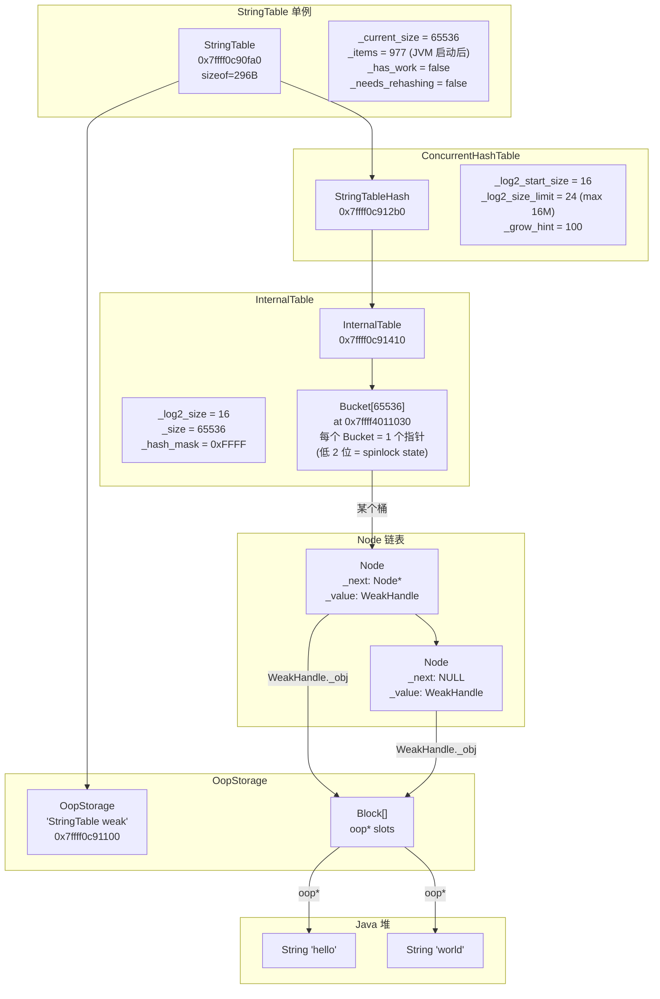
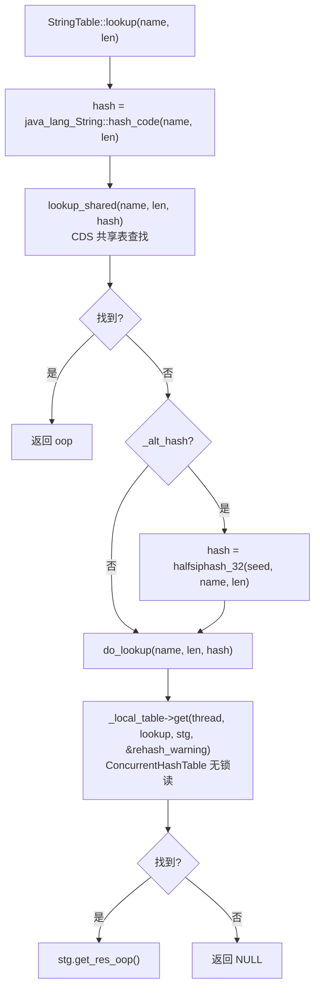
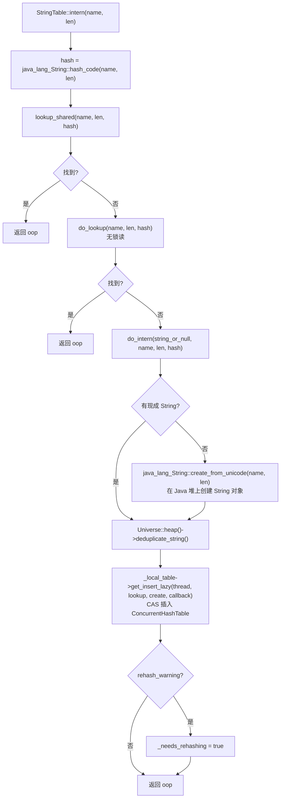
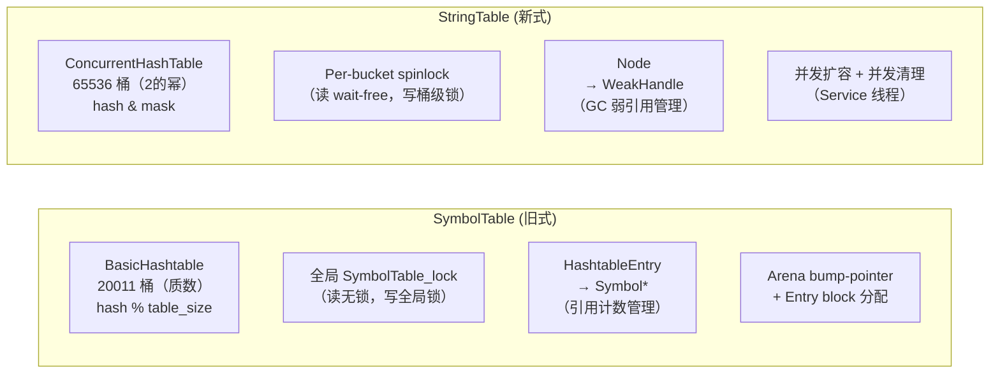

# 5B: StringTable 深度剖析

> **一句话**：StringTable 是 JVM 中所有 interned 字符串的**全局唯一**存储池——基于 `ConcurrentHashTable`（无锁读 + 细粒度桶锁写）+ `OopStorage` 弱引用 + GC 并发清理，实现了字符串的 intern 语义和自动回收。
>
> **源码**：`src/hotspot/share/classfile/stringTable.hpp/cpp`
> **调用位置**：`universe_init()` → `StringTable::create_table()`（universe.cpp 步骤[10]）
> **标准环境**：`-Xms8g -Xmx8g -XX:+UseG1GC -Xint`，G1 Region = 4MB
> **前置文档**：[5A-SymbolTable-Deep-Dive.md](5A-SymbolTable-Deep-Dive.md)

---

## 第 0 部分：核心原理 ⭐

### 0.1 本质是什么？

本文深入分析 **5B: StringTable 深度剖析**：从源码角度理解其设计原理、实现机制和关键细节。

### 0.2 为什么需要？

理解 JVM 内部实现是排查复杂问题、进行性能优化的基础。表面的 API 文档无法解释 JVM 的实际行为，只有深入源码才能建立精确的心智模型。

### 0.3 怎么解决？

结合源码阅读、数据结构分析和 GDB 运行时验证，从多个角度建立对该机制的完整理解。

### 0.4 为什么这样设计？

每个设计决策都有其权衡：性能 vs 正确性、简单性 vs 灵活性、内存占用 vs 查找速度。理解这些权衡是理解 JVM 设计的关键。

---


## 一、问题引入：SymbolTable 和 StringTable 有什么区别？

先搞清楚一个关键区别：

| 特征 | SymbolTable | StringTable |
|------|-------------|-------------|
| **存储内容** | Symbol*（C++ 对象，UTF8 字节序列） | Java String oop（Java 堆上的对象） |
| **用途** | 类名、方法名、签名等 JVM 内部标识符 | `String.intern()` 的字符串池 |
| **生命周期** | 引用计数（permanent / refcount） | **弱引用**（GC 可回收） |
| **哈希表实现** | 旧式 `BasicHashtable`（全局锁写入） | **`ConcurrentHashTable`**（无锁读 + 桶级锁） |
| **初始桶数** | 20011（质数） | 65536（2 的幂） |
| **扩容** | rehash（原地重建） | **并发扩容**（倍增，后台线程） |
| **存储位置** | C 堆 / Arena（native 内存） | Java 堆（GC 管理） |

**核心问题**：为什么 JDK 11 要把 StringTable 从旧的 `Hashtable` 改为 `ConcurrentHashTable`？

1. **并发性能**——旧版 StringTable 用 `StringTable_lock` 全局互斥，高并发 `String.intern()` 成为瓶颈
2. **GC 友好**——字符串在 Java 堆上，必须通过**弱引用**持有，GC 时能自动回收不再使用的 interned 字符串
3. **动态扩容**——旧版桶数固定，大量字符串会导致链表过长；新版支持 2^16 → 2^24 的并发扩容

---

## 二、整体架构

### 2.1 类关系

```
StringTable : CHeapObj<mtSymbol>
    │
    ├── _local_table → ConcurrentHashTable<WeakHandle<vm_string_table_data>, StringTableConfig, mtSymbol>
    │                    │
    │                    ├── InternalTable → Bucket[] → Node → WeakHandle → oop* → String oop
    │                    └── InternalTable (_new_table, 扩容时使用)
    │
    ├── _weak_handles → OopStorage  (弱引用的底层存储)
    │
    └── _shared_table → CompactHashtable<oop, char>  (CDS 共享，我们环境为空)
```

### 2.2 全景图



### 2.3 关键数字（GDB 实测）

#### 创建时（universe_init 后，vmSymbols::initialize 后）

| 指标 | 值 | 说明 |
|------|-----|------|
| `sizeof(StringTable)` | 296 字节 | 含 cache line padding |
| `_current_size` | 65536 | 初始 2^16 个桶 |
| `_items` | 0 | 空表——此时还没有 Java 类加载 |
| `_log2_size_limit` | 24 | 最大 2^24 = 16,777,216 个桶 |
| `_grow_hint` | 100 | rehash 链长阈值 |
| `_hash_mask` | 0xFFFF | `hash & 0xFFFF` 定位桶 |

#### JVM 完全启动后（main 方法执行完毕）

| 指标 | 值 | 说明 |
|------|-----|------|
| `_items` | 977 | JVM 启动过程 intern 了 977 个字符串 |
| 非空桶 | 969 / 65536 | 负载率 1.49% |
| 最大桶深 | 2 | 几乎无冲突 |
| 深度=1 的桶 | 961 | 绝大多数桶只有 1 个元素 |
| 深度=2 的桶 | 8 | 仅 8 个桶有 2 个元素 |
| GDB 计数 vs _items | 977 == 977 | ✅ 完全匹配 |

---

## 三、创建流程

### 3.1 create_table()

```cpp
// stringTable.hpp:107-110
static void create_table() {
    assert(_the_table == NULL, "One string table allowed.");
    _the_table = new StringTable();
}
```

### 3.2 构造函数

```cpp
// stringTable.cpp:185-198
StringTable::StringTable()
    : _local_table(NULL), _current_size(0), _has_work(0),
      _needs_rehashing(false), _weak_handles(NULL), _items(0), _uncleaned_items(0)
{
    // 1. 创建 OopStorage（弱引用存储）
    _weak_handles = new OopStorage("StringTable weak",
                                    StringTableWeakAlloc_lock,
                                    StringTableWeakActive_lock);

    // 2. 计算初始大小：ceil_pow_2(StringTableSize) → StringTableSize 默认 65536 → log2 = 16
    size_t start_size_log_2 = ceil_pow_2(StringTableSize);
    _current_size = ((size_t)1) << start_size_log_2;  // 2^16 = 65536

    // 3. 创建 ConcurrentHashTable
    _local_table = new StringTableHash(start_size_log_2, END_SIZE, REHASH_LEN);
    // 参数：初始大小 log2=16, 最大大小 log2=24, rehash 链长阈值=100
}
```

### 3.3 调用链展开

```
StringTable::create_table()
├── new StringTable()
│   ├── new OopStorage("StringTable weak", ...)    // 弱引用管理
│   ├── ceil_pow_2(65536) → 16                      // 计算 log2
│   └── new ConcurrentHashTable(16, 24, 100)        // 核心哈希表
│       └── new InternalTable(16)                    // 65536 个 Bucket
│           └── NEW_C_HEAP_ARRAY(Bucket, 65536)      // 512KB 桶数组
```

---

## 四、核心数据结构

### 4.1 ConcurrentHashTable

这是 JDK 11 引入的新型并发哈希表（`utilities/concurrentHashTable.hpp`），**完全不同于** SymbolTable 使用的旧式 `BasicHashtable`。

**核心设计**：
- **读端 wait-free**：不需要任何锁，直接遍历链表
- **写端 per-bucket spinlock**：每个桶独立锁，利用指针低 2 位嵌入锁状态
- **删除端 bulk delete**：批量删除，减少 CAS 次数
- **扩容 lock-free**：通过 redirect 机制实现并发扩容

#### Bucket 的锁嵌入设计

```
Bucket._first 指针（8 字节）：

  ┌──────────────────────────────────────────────────────────────┬──┐
  │  Node* 高 62 位                                              │XX│
  └──────────────────────────────────────────────────────────────┴──┘
                                                              bit 1  bit 0
                                                              ────   ────
                                                              redirect lock

  状态：
    00 = unlocked（正常状态）
    01 = locked（写操作持有）
    10 = redirect（已迁移到新表，终态）
    11 = 非法

  有效状态转换：
    unlocked → locked → unlocked（正常写入）
    unlocked → locked → redirect（扩容迁移）
```

这意味着 **Bucket 不需要额外的锁对象**——锁状态嵌入在 `_first` 指针的低 2 位中，Node 地址保证 4 字节对齐（低 2 位总是 0），所以不会冲突。

#### Node 结构

```
ConcurrentHashTable::Node {
    Node* volatile _next;                         // 下一个节点
    VALUE _value;                                  // WeakHandle<vm_string_table_data>
}
```

对于 StringTable，`VALUE = WeakHandle<vm_string_table_data>`，它只有一个 `oop* _obj` 指针。

```
Node 内存布局（StringTable 的 Node）：
  +0: _next  (Node*, 8B)
  +8: _value._obj (oop*, 8B)    → 指向 OopStorage 中的 slot
  共 16 字节
```

#### InternalTable

```
ConcurrentHashTable::InternalTable {
    Bucket* _buckets;     // 桶数组
    size_t  _log2_size;   // 大小的 log2（16）
    size_t  _size;        // 实际大小（65536）
    size_t  _hash_mask;   // hash 掩码（0xFFFF）
}
```

桶索引计算：`bucket_index = hash & _hash_mask`（位与，比取模快）

### 4.2 WeakHandle

```cpp
// weakHandle.hpp:44-65
template <WeakHandleType T>
class WeakHandle {
    oop* _obj;  // 指向 OopStorage 中的一个 slot
};
```

**为什么用弱引用？**

interned 字符串是 Java 堆上的对象。如果 StringTable 持有强引用，那么所有曾经 intern 过的字符串**永远不会被 GC 回收**——这在大量临时字符串被 intern 的场景下会导致内存泄漏。

弱引用的语义：
- `peek()` → 返回 oop，但不阻止 GC 回收（不安全，仅用于检查是否存活）
- `resolve()` → 返回 oop，并注册到 GC root（安全，保持存活到当前 GC cycle 结束）
- GC 回收后，oop 变为 NULL → StringTable 在下次清理时移除该 entry

### 4.3 OopStorage

`OopStorage` 是 JDK 11 引入的统一弱/强引用存储机制，取代了之前散乱的管理方式。StringTable 的 `_weak_handles` 就是一个 OopStorage 实例。

```
OopStorage "StringTable weak"
├── Block 数组（每个 Block 管理若干 oop* slot）
│   ├── Block[0]: [slot0, slot1, ..., slotN]
│   ├── Block[1]: [slot0, slot1, ..., slotN]
│   └── ...
├── allocation_list（空闲 Block 链表）
└── active_list（活跃 Block 链表）
```

每个 `WeakHandle` 的 `_obj` 指向 OopStorage 中某个 Block 的某个 slot。GC 遍历时通过 `weak_oops_do()` 批量处理所有 slot。

### 4.4 StringTableConfig

```cpp
// stringTable.cpp:79-113
class StringTableConfig : public StringTableHash::BaseConfig {
    static uintx get_hash(WeakHandle<vm_string_table_data> const& value, bool* is_dead) {
        oop val_oop = value.peek();
        if (val_oop == NULL) { *is_dead = true; return 0; }  // 已被 GC 回收
        *is_dead = false;
        int length;
        jchar* chars = java_lang_String::as_unicode_string(val_oop, length, THREAD);
        return hash_string(chars, length, StringTable::_alt_hash);
    }
    static void* allocate_node(size_t size, ...) {
        StringTable::item_added();    // 原子递增 _items
        return BaseConfig::allocate_node(size, value);
    }
    static void free_node(void* memory, ...) {
        value.release();              // 释放 OopStorage slot
        BaseConfig::free_node(memory, value);
        StringTable::item_removed();  // 原子递减 _items
    }
};
```

**关键**：`get_hash()` 中 `peek()` 可能返回 NULL（对象已被 GC），此时标记 `is_dead=true`，ConcurrentHashTable 会跳过该节点。

---

## 五、哈希算法

### 5.1 默认哈希：Java String hashCode（Unicode 版）

```cpp
// stringTable.cpp:73-77
uintx hash_string(const jchar* s, int len, bool useAlt) {
    return useAlt ?
        AltHashing::halfsiphash_32(_alt_hash_seed, s, len) :
        java_lang_String::hash_code(s, len);  // h = 31*h + char
}
```

注意：SymbolTable 对 **UTF8 字节**计算 hash，StringTable 对 **Unicode jchar** 计算 hash。

### 5.2 桶索引

```cpp
size_t bucket_idx_hash(InternalTable* table, const uintx hash) {
    return ((size_t)hash) & table->_hash_mask;  // hash & 0xFFFF（位与，O(1)）
}
```

2 的幂大小 + 位与掩码，比质数取模更快。

---

## 六、查找与 Intern 流程

### 6.1 lookup()



### 6.2 intern()



**源码**（`stringTable.cpp:357-385`）：

```cpp
oop StringTable::do_intern(Handle string_or_null_h, jchar* name,
                           int len, uintx hash, TRAPS) {
    HandleMark hm(THREAD);
    Handle string_h;

    if (!string_or_null_h.is_null()) {
        string_h = string_or_null_h;
    } else {
        // 在 Java 堆上创建新的 String 对象
        string_h = java_lang_String::create_from_unicode(name, len, CHECK_NULL);
    }

    // 字符串去重（如果 GC 支持）
    Universe::heap()->deduplicate_string(string_h());

    // CAS 插入：如果已存在则返回已有的，否则创建新 Node
    StringTableLookupOop lookup(THREAD, hash, string_h);
    StringTableCreateEntry stc(THREAD, string_h);
    bool rehash_warning;
    _local_table->get_insert_lazy(THREAD, lookup, stc, stc, &rehash_warning);

    if (rehash_warning) {
        _needs_rehashing = true;
    }
    return stc.get_return();
}
```

**`get_insert_lazy`** 是 ConcurrentHashTable 的核心方法：
1. 先尝试无锁查找（和 `get` 一样）
2. 没找到 → 获取桶级 spinlock
3. 持锁状态下再查一次（双重检查）
4. 仍然没有 → 调用 `create()` 回调创建新 Node + WeakHandle
5. 释放锁

### 6.3 StringTableCreateEntry 回调

```cpp
// stringTable.cpp:333-355
class StringTableCreateEntry : public StackObj {
    WeakHandle<vm_string_table_data> operator()() {
        // 在 OopStorage 中创建弱引用，指向 String oop
        return WeakHandle<vm_string_table_data>::create(_store);
    }
    void operator()(bool inserted, WeakHandle<vm_string_table_data>* val) {
        _return = Handle(_thread, val->resolve());  // 获取最终结果
    }
};
```

---

## 七、GC 与生命周期

### 7.1 弱引用回收

GC 时，OopStorage 的 `weak_oops_do()` 会遍历所有 slot。如果一个 String 对象不再被任何强引用可达（只有 StringTable 的弱引用），GC 会将对应的 `oop*` slot 清零。

之后，StringTable 需要清理这些"死"节点——它们的 `WeakHandle.peek()` 返回 NULL。

### 7.2 并发清理

```cpp
// stringTable.cpp:523-540
void StringTable::check_concurrent_work() {
    if (_has_work) return;

    double load_factor = get_load_factor();   // _items / _current_size
    double dead_factor = get_dead_factor();    // _uncleaned_items / _current_size

    // 需要清理/扩容的条件：
    if ((dead_factor > load_factor) ||           // 死 > 活
        (load_factor > PREF_AVG_LIST_LEN) ||     // 负载 > 2
        (dead_factor > CLEAN_DEAD_HIGH_WATER_MARK)) { // 死亡率 > 50%
        trigger_concurrent_work();
    }
}
```

`concurrent_work()` 在 Service 线程中执行：

```cpp
// stringTable.cpp:542-552
void StringTable::concurrent_work(JavaThread* jt) {
    _has_work = false;
    double load_factor = get_load_factor();
    if (load_factor > PREF_AVG_LIST_LEN && !_local_table->is_max_size_reached()) {
        grow(jt);              // 优先扩容（扩容顺便移除死节点）
    } else {
        clean_dead_entries(jt); // 否则清理死节点
    }
}
```

### 7.3 并发扩容

```cpp
// stringTable.cpp:458-477
void StringTable::grow(JavaThread* jt) {
    StringTableHash::GrowTask gt(_local_table);
    if (!gt.prepare(jt)) return;

    while (gt.do_task(jt)) {
        gt.pause(jt);
        { ThreadBlockInVM tbivm(jt); }  // 让出 CPU，允许 safepoint
        gt.cont(jt);
    }
    gt.done(jt);
    _current_size = table_size(jt);
}
```

ConcurrentHashTable 的扩容机制：
1. 创建新的 InternalTable（大小 ×2）
2. 逐桶迁移：对每个旧桶加 spinlock → 将 Node 移到新表对应桶 → 在旧桶设置 redirect 标记
3. 读操作遇到 redirect → 自动去新表查找
4. 所有桶迁移完成 → 释放旧表

### 7.4 Rehash

当某个链表达到 `REHASH_LEN = 100` 时触发：

```cpp
// stringTable.cpp:559-611
bool StringTable::do_rehash() {
    size_t new_size = _local_table->get_size_log2(Thread::current());
    StringTableHash* new_table = new StringTableHash(new_size, END_SIZE, REHASH_LEN);
    _alt_hash = true;  // 切换到 HalfSipHash
    if (!_local_table->try_move_nodes_to(Thread::current(), new_table)) {
        _alt_hash = false;
        delete new_table;
        return false;
    }
    delete _local_table;
    _local_table = new_table;
    return true;
}
```

---

## 八、与 SymbolTable 的对比



| 维度 | SymbolTable | StringTable |
|------|-------------|-------------|
| 哈希表类型 | `BasicHashtable` | `ConcurrentHashTable` |
| 桶数量 | 20011（固定） | 65536（动态，最大 2^24） |
| 桶索引 | `hash % table_size` | `hash & mask` |
| 锁粒度 | 全局 Mutex | 桶级 spinlock（指针低 2 位） |
| 值类型 | `Symbol*`（C++ native） | `WeakHandle`（弱引用→Java oop） |
| 内存管理 | Arena（永久）+ C 堆（引用计数） | Java 堆 + OopStorage |
| 扩容 | rehash（safepoint 停顿） | 并发 grow（后台线程） |
| 清理 | GC 时 `buckets_unlink()` | 并发 `clean_dead_entries()` |

**设计演进的原因**：
- SymbolTable 主要在类加载时写入，运行时以读为主，全局锁够用
- StringTable 可能在运行时被 `String.intern()` 频繁写入（XML 解析等场景），需要更细粒度的并发控制
- SymbolTable 的 Symbol 是 native 对象，生命周期由 JVM 控制
- StringTable 的 String 是 Java 对象，必须让 GC 管理其生命周期

---

## 九、JVM 参数与日志

### 9.1 可配置参数

| 参数 | 默认值 | 说明 |
|------|--------|------|
| `-XX:StringTableSize=N` | 65536 | 初始桶数（向上取到 2 的幂） |
| `-XX:+PrintStringTableStatistics` | off | JVM 退出时打印统计 |

### 9.2 日志

使用 Unified Logging 系统：

```bash
# 查看 StringTable 操作日志
-Xlog:stringtable=debug

# 查看性能计时
-Xlog:stringtable+perf=debug
```

输出示例：

```
[debug][stringtable] Concurrent work triggered, live factor:2.5 dead factor:0.3
[debug][stringtable] Grown to size:131072
[debug][stringtable] Cleaned 500 of 2000
```

### 9.3 常量

```cpp
#define PREF_AVG_LIST_LEN        2       // 目标平均链长
#define END_SIZE                 24      // 最大 log2 大小
#define REHASH_LEN              100      // 触发 rehash 的链长
#define CLEAN_DEAD_HIGH_WATER_MARK 0.5   // 死亡率阈值
```

---

## 十、GDB 完整验证数据

### 10.1 创建时（vmSymbols::initialize 后）

```
StringTable: 0x7ffff0c90fa0
  _current_size = 65536
  _items = 0               ← 空表
  _uncleaned_items = 0
  _has_work = false
  _needs_rehashing = false
  _alt_hash = false
  _shared_string_mapped = false
  sizeof(StringTable) = 296

ConcurrentHashTable: 0x7ffff0c912b0
  _log2_size_limit = 24    ← 最大 2^24 = 16M 桶
  _log2_start_size = 16
  _grow_hint = 100
  _size_limit_reached = false

InternalTable: 0x7ffff0c91410
  _log2_size = 16
  _size = 65536
  _hash_mask = 0xFFFF
  _buckets = 0x7ffff4011030
  _new_table = NULL
```

### 10.2 JVM 启动完成后

```
_current_size = 65536
_items = 977              ← 启动过程 intern 了 977 个字符串

Total buckets:  65536
Non-empty:      969
Total nodes:    977       ← 与 _items 完全匹配 ✅
Max depth:      2 (bucket[15468])
Depth=1:        961
Depth=2:        8
Depth>=3:       0
Avg depth:      1.00
Load factor:    0.014907  ← 极低，几乎无冲突
```

---

## 十一、总结

### 设计亮点

| 设计 | 目的 | 效果 |
|------|------|------|
| ConcurrentHashTable | 高并发 intern | 读 wait-free，写桶级锁 |
| 指针低 2 位嵌入锁状态 | 零额外空间 | 每个 Bucket 只需 1 个指针 |
| WeakHandle + OopStorage | GC 自动回收 | 不再使用的 interned 字符串可以被回收 |
| 并发 grow | 无停顿扩容 | Service 线程后台完成 |
| redirect 机制 | 读写并发 | 扩容时读操作不阻塞 |
| Service 线程异步清理 | 减少 GC 停顿 | 死节点后台异步删除 |
| `PREF_AVG_LIST_LEN=2` | 保持低冲突 | 自动触发扩容 |

### StringTable 在 JVM 生命周期中的角色

```
universe_init()
  └── StringTable::create_table()         ← 创建空表 + OopStorage

类加载过程
  └── ldc "xxx" 指令
      └── StringTable::intern("xxx")      ← 首次 intern：创建 String + WeakHandle + Node

String.intern() 调用
  └── StringTable::intern(oop string)     ← 运行时 intern

GC 周期
  └── OopStorage::weak_oops_do()          ← GC 清除不可达字符串的弱引用
  └── StringTable::check_concurrent_work() ← 检查是否需要清理/扩容

Service 线程
  └── StringTable::concurrent_work()      ← 后台扩容或清理
```

---

## 附录：源码文件索引

| 文件 | 关键内容 |
|------|---------|
| `classfile/stringTable.hpp` | StringTable 类定义、create_table()、GC 接口 |
| `classfile/stringTable.cpp` | 构造、lookup/intern/rehash/grow/clean 实现 |
| `utilities/concurrentHashTable.hpp` | ConcurrentHashTable/Node/Bucket/InternalTable |
| `oops/weakHandle.hpp` | WeakHandle 定义（oop* 弱引用封装） |
| `gc/shared/oopStorage.hpp` | OopStorage（弱引用底层存储） |
