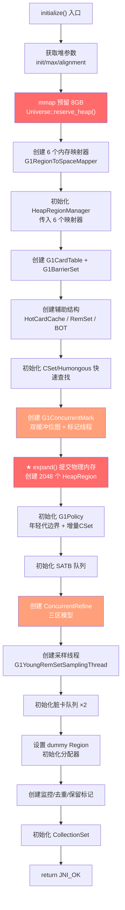

# G1CollectedHeap::initialize() 深度分析

> 源码：`src/hotspot/share/gc/g1/g1CollectedHeap.cpp:1587-2444`（约 860 行）
> 调用位置：`Universe::initialize_heap()` → `_collectedHeap->initialize()`
> 环境：`-Xms8g -Xmx8g -XX:+UseG1GC`，G1 Region = 4MB
> 原则：**每个步骤都说清楚：做了什么、创建了什么、解决什么问题、GDB 实际数据**

---

## 第 0 部分：核心原理 ⭐

### 0.1 本质是什么？

本文是对 **G1CollectedHeap::initialize() 深度分析** 的深度源码分析：从数据结构到算法流程，逐层剖析其实现原理，并通过 GDB 验证关键结论。

### 0.2 为什么需要？

深入理解 JVM 内部实现，不仅能帮助排查生产问题，更能建立对 JVM 行为的精确预测能力——知道『为什么』比知道『是什么』更重要。

### 0.3 怎么解决？

采用「数据结构 → 算法流程 → GDB 验证」三步法：先完整分析所有涉及的数据结构（字段含义/sizeof/生命周期），再分析算法流程（每步有 why），最后用 GDB 实际验证关键结论。

### 0.4 为什么这样设计？

JVM 的每个设计决策都有其历史背景和性能考量。本文在分析每个关键设计时，都会解释「为什么这样而不是那样」，帮助读者建立设计直觉。

---


## 一句话总结

`G1CollectedHeap::initialize()` 将一个空的 G1 堆对象变成一个**完全可工作的垃圾回收器**——它 mmap 8GB 虚拟内存、创建 2048 个 HeapRegion、建立 CardTable/RemSet/ConcurrentMark 等所有 GC 子系统、创建并发线程、初始化分配器。完成后，JVM 就可以开始分配 Java 对象了。

---

## 前置知识：构造函数 vs initialize()

在分析 `initialize()` 之前，必须理解 G1 堆对象的创建分两步：

1. **构造函数** `G1CollectedHeap(G1CollectorPolicy*)` — 在 C 堆上分配 1864 字节，初始化所有字段为默认值/NULL，创建：
   - `WorkGang`（13 个 GC 工作线程）
   - `G1HeapVerifier`
   - `G1Allocator`
   - `G1HeapSizingPolicy`
   - `G1Policy`
   - 13 个 `RefToScanQueue`（任务队列）
   - `EvacuationFailedInfo[13]`

2. **`initialize()`** — 真正的重量级初始化：mmap 堆内存、创建 Region、建立所有辅助数据结构

**为什么分两步**：构造函数不允许返回错误码（C++ 规则），而 `initialize()` 返回 `jint`，可以返回 `JNI_ENOMEM` 等错误码让调用者优雅处理。

---

## 整体流程图



---

## 逐步深入分析

### 阶段一：获取参数 + 预留虚拟内存（L1587-1713）

```cpp
size_t init_byte_size = collector_policy()->initial_heap_byte_size(); // 8GB
size_t max_byte_size  = collector_policy()->max_heap_byte_size();     // 8GB
size_t heap_alignment = collector_policy()->heap_alignment();         // 4MB
```

三项对齐检查确保堆大小是 Region 大小和对齐的整数倍。

```cpp
ReservedSpace heap_rs = Universe::reserve_heap(max_byte_size, heap_alignment);
```

**底层调用链**：
```
Universe::reserve_heap()
  → ReservedHeapSpace(max_byte_size, alignment, use_large_pages)
    → ReservedSpace::try_reserve_range(preferred_base, size, alignment)
      → os::reserve_memory(size, preferred_addr)
        → mmap(preferred_addr, 8GB, PROT_NONE, MAP_PRIVATE|MAP_ANONYMOUS|MAP_NORESERVE, -1, 0)
```

**关键点**：
- `PROT_NONE`：此时虚拟地址空间**仅被预留**，不可读写，不消耗物理内存（RSS = 0）
- `MAP_NORESERVE`：不预留 swap 空间，允许过量分配
- `preferred_addr` 经过精心计算，使堆落在 `0x600000000 ~ 0x800000000`，确保 Zero-based 压缩指针模式

然后保存堆范围到 `CollectedHeap::_reserved`（MemRegion 对象）：

```cpp
initialize_reserved_region((HeapWord*)heap_rs.base(), (HeapWord*)(heap_rs.base() + heap_rs.size()));
```

| GDB 验证 | 值 |
|-----------|-----|
| `_reserved._start` | `0x600000000` |
| `_reserved._word_size` | `1,073,741,824 words` = 8GB |
| heap end | `0x800000000` |

---

### 阶段二：创建 CardTable + BarrierSet（L1724-1744）

```cpp
G1CardTable* ct = new G1CardTable(reserved_region());
ct->initialize();
G1BarrierSet* bs = new G1BarrierSet(ct);
bs->initialize();
BarrierSet::set_barrier_set(bs);
```

**G1CardTable 做了什么**：

卡表是一个字节数组，将堆内存划分为 512 字节的"卡"，每张卡用 1 字节标记是否"脏"（即该区域的引用是否被修改过）。

```
堆内存 (8GB)        CardTable (16MB)
┌──────────┐       ┌───┐
│ 512 bytes│  ──→  │ 1B│  0 = clean, 非0 = dirty
├──────────┤       ├───┤
│ 512 bytes│  ──→  │ 1B│
├──────────┤       ├───┤
│   ...    │       │...│
└──────────┘       └───┘
8GB / 512B = 16,777,216 张卡 = 16MB 卡表
```

| GDB 验证 | 值 |
|-----------|-----|
| `_byte_map` | `0x7fffe7000000` |
| `_byte_map_base` | `0x7fffe4000000`（偏移基址，`card = _byte_map_base + (addr >> 9)`） |
| `_byte_map_size` | `16,777,216 bytes` = 16MB |

**G1BarrierSet 做了什么**：

屏障集是 GC 在**每次引用赋值**时插入的代码钩子：

```java
// Java 代码
obj.field = another_obj;

// JVM 实际执行：
PRE_BARRIER(obj.field);          // 写前屏障：旧值入 SATB 队列
obj.field = another_obj;          // 实际赋值
POST_BARRIER(obj, another_obj);   // 写后屏障：标记卡表为脏
```

- **写前屏障**（SATB）：并发标记期间，记录被覆盖的旧引用，防止漏标
- **写后屏障**：标记 CardTable 对应位置为脏，让 RSet 更新线程知道哪些区域有引用变化

`BarrierSet::set_barrier_set(bs)` 设置为全局唯一，JVM 任何地方通过 `BarrierSet::barrier_set()` 获取。同时为主线程创建 `G1ThreadLocalData`（SATB 队列和脏卡队列的线程本地缓冲区）。

---

### 阶段三：创建 6 个内存映射器（L1755-1999）

G1 需要 6 个独立的内存区域来支撑其运行，每个由 `G1RegionToSpaceMapper` 管理：

```
映射器创建方式分两种：
1. create_mapper()：         直接使用已有的 ReservedSpace（堆本身）
2. create_aux_memory_mapper()：创建新的 ReservedSpace（辅助结构，独立地址空间）
```

| # | 名称 | 大小 | 用途 | 创建方式 |
|---|------|------|------|---------|
| 1 | `heap_storage` | 8 GB | 堆本身，Java 对象存储 | `create_mapper` |
| 2 | `bot_storage` | 16 MB | Block Offset Table，快速定位对象起始地址 | `create_aux` |
| 3 | `cardtable_storage` | 16 MB | 卡表，跟踪跨 Region 引用 | `create_aux` |
| 4 | `card_counts_storage` | 16 MB | 卡计数表，记录卡被修改次数（热卡缓存用） | `create_aux` |
| 5 | `prev_bitmap_storage` | 128 MB | 上一轮标记位图（只读，Mixed GC 使用） | `create_aux` |
| 6 | `next_bitmap_storage` | 128 MB | 当前标记位图（可写，并发标记写入） | `create_aux` |

**大小计算**：
- BOT/CardTable/CardCounts：`8GB / 512B = 16MB`（每 512 字节堆内存对应 1 字节）
- 标记位图：`8GB / 64B = 128MB`（每 64 字节堆内存对应 1 bit → `128M bits = 128MB / 8`... 不对，应该是 `8GB / 64B / 8 = 16MB`？）

等等，让我重新计算：
- 每 **8 字节**堆内存（1 个 HeapWord）对应 1 个 bit
- `8GB / 8B = 1G bits = 128MB`

这才对。**每 HeapWord 对应 1 bit**，这是因为 Java 对象的最小大小是 16 字节（2 个 HeapWord），但标记粒度需要精确到 HeapWord 级别来处理对象头。

**双缓冲位图合计 256MB**，这是 G1 的主要额外内存开销。

**映射器的三层关系**：
```
MemRegion          → 轻量级，仅描述内存范围（start + word_size），不管理生命周期
ReservedSpace      → 管理虚拟地址空间生命周期（mmap PROT_NONE 预留）
G1RegionToSpaceMapper → 管理虚拟到物理的映射（按 Region 粒度 commit/uncommit）
```

---

### 阶段四：初始化 HeapRegionManager（L2004-2010）

```cpp
_hrm.initialize(heap_storage, prev_bitmap_storage, next_bitmap_storage,
                bot_storage, cardtable_storage, card_counts_storage);
_card_table->initialize(cardtable_storage);
_hot_card_cache->initialize(card_counts_storage);
```

`HeapRegionManager` 保存 6 个映射器的引用，后续 `commit_regions()` 时统一提交：

```cpp
void HeapRegionManager::commit_regions(uint index, size_t num_regions, WorkGang* pretouch_gang) {
    _num_committed += (uint)num_regions;
    _heap_mapper->commit_regions(index, num_regions, pretouch_gang);     // 堆
    _prev_bitmap_mapper->commit_regions(index, num_regions, pretouch_gang); // 位图1
    _next_bitmap_mapper->commit_regions(index, num_regions, pretouch_gang); // 位图2
    _bot_mapper->commit_regions(index, num_regions, pretouch_gang);      // BOT
    _cardtable_mapper->commit_regions(index, num_regions, pretouch_gang); // 卡表
    _card_counts_mapper->commit_regions(index, num_regions, pretouch_gang); // 卡计数
}
```

`commit_regions()` 底层执行：
```
mmap(addr, size, PROT_READ|PROT_WRITE, MAP_PRIVATE|MAP_FIXED|MAP_ANONYMOUS, -1, 0)
```
`MAP_FIXED` 表示必须在指定地址分配，覆盖之前 `PROT_NONE` 的预留。此时页表权限变为可读写，但物理页在**实际访问时（page fault）才分配**。

同时初始化 `G1HeapRegionTable`（地址到 Region 的 O(1) 映射）和 `_available_map` 位图（2048 bits）。

---

### 阶段五：创建辅助结构（L2030-2048）

```cpp
_g1_rem_set = new G1RemSet(this, _card_table, _hot_card_cache);
_g1_rem_set->initialize(max_capacity(), max_regions());
_bot = new G1BlockOffsetTable(reserved_region(), bot_storage);
```

**G1RemSet（记忆集）**：协调卡表、热卡缓存和各 Region 的 RSet。核心问题——GC 回收某些 Region 时，如何知道哪些**其他 Region 的对象**引用了被回收 Region 里的对象？

```
Region A            Region B（要回收）
┌──────┐           ┌──────┐
│ obj1 │──引用──→  │ obj2 │  ← 如果不知道 obj1 引用了 obj2
│      │           │      │     就会错误回收 obj2
└──────┘           └──────┘

解决方案：Region B 的 RSet 记录着"谁引用了我"
RSet(B) = { Region A 的某张卡 }
```

**G1BlockOffsetTable（BOT）**：快速定位任意堆地址所在对象的起始位置。每 512 字节堆内存对应 1 字节 BOT 条目，存储相对偏移。GC 扫描卡表时需要知道一张卡（512字节）内有哪些对象，BOT 提供 O(1) 定位。

---

### 阶段六：O(1) 查找结构初始化（L2050-2137）

```cpp
_in_cset_fast_test.initialize(start, end, granularity);
_humongous_reclaim_candidates.initialize(start, end, granularity);
```

**`_in_cset_fast_test`**：2048 元素的数组，每元素 1 字节，O(1) 判断某个 Region 是否在当前 Collection Set 中。

**为什么需要**：GC 期间，写后屏障**每次引用赋值**都要判断目标对象的 Region 是否在 CSet 中。数百万次/秒的操作，遍历 CSet 列表不可接受。

```
给定地址 addr：
  index = (addr - heap_start) >> 22    // 22 = log2(4MB)
  state = _in_cset_fast_test[index]
  // 0=NotInCSet, 1=Young, 2=Old, -1=Humongous
```

实际实现使用偏置基地址（`_biased_base`），避免每次减法：`state = _biased_base[addr >> 22]`

**`_humongous_reclaim_candidates`**：同样 2048 元素，标记哪些 Humongous Region 可以在 Young GC 时**提前回收**（Eager Reclaim），而不用等到 Mixed GC。

候选条件：
1. 必须是 `typeArray`（纯数据类型，如 `byte[]`, `int[]`，内部无对象引用）
2. RSet 足够小（初步筛选）
3. 实际回收时 RSet 必须为空（确保无引用）

---

### 阶段七：创建并发标记器 ⭐⭐⭐⭐⭐（L2191-2196）

```cpp
_cm = new G1ConcurrentMark(this, prev_bitmap_storage, next_bitmap_storage);
_cm_thread = _cm->cm_thread();
```

`G1ConcurrentMark` 是 G1 中**最复杂的组件之一**，管理整个并发标记周期。

**解决的核心问题**：如何在**应用程序运行的同时**标记所有存活对象？

**双缓冲位图**：
```
_prev_mark_bitmap (128MB)  ← 上一轮完成的标记结果（只读）
                              Mixed GC 读取它判断对象是否存活
                              
_next_mark_bitmap (128MB)  ← 当前正在标记（可写）
                              并发标记线程写入新发现的存活对象

标记完成后：swap(_prev, _next)  ← O(1) 指针交换，不复制数据
```

**三色标记法**：
```
白色 → 未访问，位图中 bit = 0
灰色 → 已发现但未扫描完，在标记栈/任务队列中
黑色 → 已扫描完所有引用，位图中 bit = 1
```

**并发标记带来的挑战及解决方案**：

| 挑战 | 解决方案 |
|------|---------|
| 应用线程修改引用（漏标） | SATB 写前屏障：覆盖引用前将旧值入队 |
| 如何记录每个对象的标记状态 | 标记位图（每 HeapWord 1 bit） |
| 标记/读取冲突 | 双缓冲位图（prev 只读 + next 可写） |
| 多线程标记 | 任务队列 + 工作窃取算法 |
| 队列溢出 | 全局标记栈（`_global_mark_stack`） |

**并发标记的阶段**：
```
1. Initial Mark (STW)         搭载在 Young GC 上，标记 GC Roots 直接可达的对象
2. Root Region Scan (并发)     扫描 Survivor 区作为根
3. Concurrent Mark (并发)     ← G1ConcurrentMark 核心工作：多线程遍历对象图
4. Remark (STW)                处理 SATB 队列中的引用，完成剩余标记
5. Cleanup (STW/并发)          统计存活率、回收空 Region、准备 Mixed GC
```

| GDB 验证 | 值 | 说明 |
|-----------|-----|------|
| `_cm` | `0x7ffff0059860` | |
| `_cm_thread` | `0x7ffff0062800` | 并发标记线程 |
| `_max_num_tasks` | 13 | = ParallelGCThreads |
| `_max_concurrent_workers` | 3 | = ConcGCThreads |

---

### 阶段八：expand() — 提交物理内存 + 创建 HeapRegion ⭐⭐⭐⭐⭐（L2207）

```cpp
expand(init_byte_size, _workers)
```

这是整个 `initialize()` 中**真正分配内存**的步骤。

**调用链**：
```
expand(8GB, workers)
  → _hrm.expand_by(2048, workers)
    → expand_at(0, 2048, workers)
      → find_unavailable_from_idx(0, &idx)  // 找到 0~2047 全部未分配
      → make_regions_available(0, 2048, workers)
        → commit_regions(0, 2048, workers)     // ★ mmap PROT_READ|PROT_WRITE
        │   ├── _heap_mapper->commit(8GB)
        │   ├── _prev_bitmap_mapper->commit(128MB)
        │   ├── _next_bitmap_mapper->commit(128MB)
        │   ├── _bot_mapper->commit(16MB)
        │   ├── _cardtable_mapper->commit(16MB)
        │   └── _card_counts_mapper->commit(16MB)
        │
        → for i in 0..2047:
        │   new_heap_region(i)                  // ★ 创建 HeapRegion 对象
        │   _regions.set_by_index(i, new_hr)    // 注册到 Region 表
        │
        → _available_map.par_set_range(0, 2048) // 标记全部可用
        │
        → for i in 0..2047:
            hr->initialize(mr)                   // 设置 bottom/top/end
            insert_into_free_list(hr)            // ★ 加入空闲列表
```

**HeapRegion 创建过程**：
```cpp
HeapRegion* HeapRegionManager::new_heap_region(uint hrm_index) {
    // 计算 Region 内存范围
    HeapWord* bottom = g1h->bottom_addr_for_region(hrm_index);
    // bottom = 0x600000000 + hrm_index * 4MB
    MemRegion mr(bottom, bottom + HeapRegion::GrainWords);
    return g1h->new_heap_region(hrm_index, mr);
}
```

初始化后每个 Region 的状态：`bottom = top`（空的），`end = bottom + 4MB`，类型为 Free。

| GDB 验证 | 值 |
|-----------|-----|
| Region[0] bottom | `0x600000000` |
| Region[0] top | `0x600000000`（空） |
| Region[0] end | `0x600400000`（= bottom + 4MB） |
| Region[1] bottom | `0x600400000` |
| Region[2047] bottom | `0x7FFC00000` |
| Region[2047] end | `0x800000000`（= 堆末尾） |
| `_free_list` 数量 | 2048（全部空闲） |

---

### 阶段九：初始化 G1Policy + SATB 队列（L2217-2236）

```cpp
g1_policy()->init(this, &_collection_set);
```

设置年轻代大小边界，启动 Collection Set 的增量构建机制。此时 2048 个 Region 都在 `_free_list` 中，还没有 Eden/Survivor/Old 之分。

```cpp
G1BarrierSet::satb_mark_queue_set().initialize(
    SATB_Q_CBL_mon,        // 完成缓冲区列表的锁
    SATB_Q_FL_lock,        // 空闲缓冲区池的锁
    G1SATBProcessCompletedThreshold,  // = 20，触发处理的阈值
    Shared_SATB_Q_lock     // 共享 SATB 队列的锁
);
```

SATB（Snapshot At The Beginning）队列是写前屏障的目标。每个 Java 线程有自己的 SATB 缓冲区，满了就放入全局完成队列。当完成队列达到 20 个缓冲区时，触发处理。

---

### 阶段十：创建并发精炼 + 采样线程（L2238-2273）

```cpp
jint ecode = initialize_concurrent_refinement();
// 内部: _cr = G1ConcurrentRefine::create(&ecode);

ecode = initialize_young_gen_sampling_thread();
// 内部: _young_gen_sampling_thread = new G1YoungRemSetSamplingThread();
```

**G1ConcurrentRefine 三区模型**：

并发精炼线程负责处理脏卡（更新 RSet）。采用动态伸缩策略：

```
脏卡缓冲区数量
     │
     │                                ┌─── Red Zone (65)
     │                      ┌─────────┤ 应用线程也帮忙处理！
     │            ┌─────────┤         └───
     │  ┌─────────┤         │ Yellow Zone (39)
     │  │         │         │ 逐步激活更多精炼线程
     │  │         │ Green Zone (13)
─────┴──┤         │ 无需处理，利用缓存局部性
        │         └─── 激活第一个精炼线程
        └─── 完全空闲
```

| GDB 验证 | 值 | 说明 |
|-----------|-----|------|
| `_green_zone` | 13 | 低于此值不处理 |
| `_yellow_zone` | 39 | 开始激活精炼线程 |
| `_red_zone` | 65 | 应用线程也参与处理 |

**脏卡队列初始化**（两个 `DirtyCardQueueSet`）：

```cpp
// 全局脏卡队列（所有 Java 线程共享）
G1BarrierSet::dirty_card_queue_set().initialize(
    ..., yellow_zone=39, red_zone=65, ...);

// G1 堆自己的脏卡队列（GC 内部使用）
dirty_card_queue_set().initialize(
    ..., -1/*永不触发*/, -1/*无限制*/, ...,
    &G1BarrierSet::dirty_card_queue_set()  // 共享空闲缓冲区池
);
```

**G1YoungRemSetSamplingThread**：每 300ms 采样一次年轻代 Region 的 RSet 大小，用于动态调整年轻代大小，保证 GC 暂停时间在目标范围内。

---

### 阶段十一：分配器初始化 + 收尾（L2275-2444）

```cpp
// Dummy Region 设置
HeapRegion* dummy_region = _hrm.get_dummy_region();
dummy_region->set_eden();
dummy_region->set_top(dummy_region->end());  // 标记为"满"
G1AllocRegion::setup(this, dummy_region);

// 初始化分配器
_allocator->init_mutator_alloc_region();
```

**Dummy Region 的设计**：

```
问题：G1Allocator._alloc_region 在没有可用 Region 时指向什么？

如果指向 NULL：每次分配前都要检查 NULL，增加分支
如果指向 dummy region（满的）：分配直接失败 → 走慢路径获取新 Region

dummy_region:
  top = end = 0x600400000
  free() = 0
  任何分配请求都会立即失败 → 触发 slow_path
```

这是**空对象模式**的经典应用——用一个特殊的"满"对象代替 NULL，消除空指针检查。

```cpp
// 创建监控支持
_g1mm = new G1MonitoringSupport(this);

// 字符串去重初始化（需要 -XX:+UseStringDeduplication 启用）
G1StringDedup::initialize();

// Evacuation 失败保护
_preserved_marks_set.init(ParallelGCThreads);  // 每个 GC 线程一个栈

// Collection Set 初始化
_collection_set.initialize(max_regions());

return JNI_OK;
```

**PreservedMarksSet**：当 Evacuation 失败（to-space 耗尽）时，GC 需要在对象头写入 self-forwarding pointer，但原来的 mark word 可能包含 hash code 或锁信息。每个 GC 工作线程有独立的保存栈，避免锁竞争。

---

## GDB 验证——完整数据

```
【GDB 验证】标准条件：-Xms8g -Xmx8g -XX:+UseG1GC -Xint
断点：g1CollectedHeap.cpp:2444 (return JNI_OK)
━━━━━━━━━━━━━━━━━━━━━━━━━━━━━━━━━━━━━━━━━━━━━━━━━━━━━━━━━━━━━━━━━

=== G1CollectedHeap 基础 ===
G1CollectedHeap* 地址:            0x7ffff0031bb0
sizeof(G1CollectedHeap):          1,864 bytes

=== 堆参数 ===
initial_heap_byte_size:           8,589,934,592 bytes (8 GB)
max_heap_byte_size:               8,589,934,592 bytes (8 GB)
heap_alignment:                   4,194,304 bytes (4 MB)

=== 堆内存范围 ===
_reserved._start:                 0x600000000
_reserved._word_size:             1,073,741,824 words (8 GB)
heap end:                         0x800000000

=== HeapRegion ===
GrainBytes:                       4,194,304 (4 MB)
GrainWords:                       524,288
LogOfHRGrainBytes:                22
CardsPerRegion:                   8,192
sizeof(HeapRegion):               432 bytes

=== HeapRegionManager ===
_num_committed:                   2,048
_allocated_heapregions_length:    2,048
_free_list._length:               2,048

=== HeapRegion 示例 ===
Region[0]:    addr=0x7ffff009d960  [0x600000000, 0x600000000, 0x600400000]
Region[1]:    addr=0x7ffff009f120  [0x600400000, 0x600400000, 0x600800000]
Region[2047]: addr=0x7ffff0c7c1a0  [0x7ffc00000, 0x7ffc00000, 0x800000000]
              格式: [bottom, top, end]  top=bottom 表示空

=== G1CardTable ===
_card_table:                      0x7ffff0042160
_byte_map:                        0x7fffe7000000
_byte_map_base:                   0x7fffe4000000
_byte_map_size:                   16,777,216 bytes (16 MB)

=== G1ConcurrentMark ===
_cm:                              0x7ffff0059860
_cm_thread:                       0x7ffff0062800
_max_num_tasks:                   13 (= ParallelGCThreads)
_num_active_tasks:                0 (尚未开始标记)
_max_concurrent_workers:          3 (= ConcGCThreads)

=== G1ConcurrentRefine ===
_cr:                              0x7ffff0c7d960
_green_zone:                      13
_yellow_zone:                     39
_red_zone:                        65

=== GC 线程 ===
ParallelGCThreads:                13 (STW 阶段并行线程数)
ConcGCThreads:                    3 (并发标记线程数)

=== Humongous 阈值 ===
threshold:                        262,144 words = 2 MB (= Region/2)

=== Region Sets ===
_old_set._length:                 0 (初始化时无老年代)
_humongous_set._length:           0 (初始化时无巨型对象)

=== Dummy Region ===
G1AllocRegion::_dummy_region:     0x7ffff0c81d80

=== 内存开销 ===
堆本身:                           8 GB (2048 × 4MB)
CardTable:                        16 MB
标记位图 (双缓冲):               256 MB (2 × 128MB)
BOT:                              16 MB
CardCounts:                       16 MB
合计辅助结构:                     ~304 MB (~3.7% 额外开销)

━━━━━━━━━━━━━━━━━━━━━━━━━━━━━━━━━━━━━━━━━━━━━━━━━━━━━━━━━━━━━━━━━
```

---

## initialize() 创建的全部组件汇总

```
G1CollectedHeap::initialize() 创建的组件（按创建顺序）
━━━━━━━━━━━━━━━━━━━━━━━━━━━━━━━━━━━━━━━━━━━━━━━━━━━━

阶段一：内存预留
├─ ReservedHeapSpace (8GB mmap PROT_NONE)

阶段二：写屏障基础设施
├─ G1CardTable (16MB 卡表)
└─ G1BarrierSet (全局屏障集，写前/写后屏障)

阶段三：6 个内存映射器
├─ heap_storage         (8 GB，堆)
├─ bot_storage          (16 MB，块偏移表)
├─ cardtable_storage    (16 MB，卡表)
├─ card_counts_storage  (16 MB，卡计数)
├─ prev_bitmap_storage  (128 MB，上轮位图)
└─ next_bitmap_storage  (128 MB，当前位图)

阶段四：Region 管理
└─ HeapRegionManager 初始化

阶段五：辅助结构
├─ G1HotCardCache (热卡缓存)
├─ G1RemSet (记忆集协调器)
└─ G1BlockOffsetTable (块偏移表)

阶段六：O(1) 查找
├─ _in_cset_fast_test (CSet 快速判断，2048 bytes)
└─ _humongous_reclaim_candidates (巨型回收候选)

阶段七：并发标记
├─ G1ConcurrentMark (双缓冲位图 + 标记栈 + 任务队列)
└─ G1ConcurrentMarkThread (标记线程)

阶段八：物理内存提交 ★
├─ 6 个映射器全部 commit (8GB + 304MB)
├─ 2048 × HeapRegion 对象 (每个 432 bytes)
└─ 全部加入 _free_list

阶段九：GC 策略
├─ G1Policy::init() (年轻代边界 + 增量 CSet)
└─ SATBMarkQueueSet 初始化 (阈值 = 20)

阶段十：并发线程
├─ G1ConcurrentRefine (三区模型: 13/39/65)
├─ G1YoungRemSetSamplingThread (300ms 采样)
├─ DirtyCardQueueSet × 2 (全局 + 堆本地)
└─ dummy Region + 分配器初始化

阶段十一：收尾
├─ G1MonitoringSupport (JMX 监控)
├─ G1StringDedup (字符串去重，需手动启用)
├─ PreservedMarksSet (evacuation 失败保护)
└─ G1CollectionSet (收集集)
```

---

## 关键设计决策总结

| 设计决策 | 解决的问题 | 核心思想 |
|---------|-----------|---------|
| 两阶段内存分配（Reserve + Commit） | 虚拟地址空间预留与物理内存分配解耦 | 先占地盘，后建房子 |
| 双缓冲位图 | 并发标记期间读写冲突 | prev 只读 + next 可写，周期结束交换指针 |
| CardTable（512B → 1B） | 跟踪跨 Region 引用 | 空间换时间，16MB 换 O(1) 查找 |
| BOT（512B → 1B） | 快速定位对象起始地址 | 卡表扫描时需要知道卡内有哪些对象 |
| CSet 快速测试数组 | O(1) 判断 Region 是否在 CSet 中 | 写屏障每次赋值都要查，不能遍历 |
| Humongous Eager Reclaim | 大对象不等 Mixed GC 就回收 | typeArray 无引用，RSet 为空即可回收 |
| 三区模型（Green/Yellow/Red） | 脏卡处理的动态伸缩 | 负载低时不处理（利用缓存），高时全员参与 |
| SATB 写前屏障 | 并发标记期间的漏标问题 | 引用被覆盖前记录旧值 |
| Dummy Region | 分配器无可用 Region 时的空指针处理 | 空对象模式，消除 NULL 检查 |
| PreservedMarksSet 每线程独立栈 | Evacuation 失败时保存 mark word | 避免锁竞争 |

---

## 相关 JVM 参数

| 参数 | 作用 | 默认值 |
|------|------|--------|
| `-XX:G1HeapRegionSize` | Region 大小 | 自动（堆/2048，向上取 2 的幂） |
| `-XX:ParallelGCThreads` | STW 阶段 GC 工作线程数 | 13（本环境） |
| `-XX:ConcGCThreads` | 并发标记线程数 | 3（约 ParallelGCThreads/4） |
| `-XX:G1ConcRefinementGreenZone` | 精炼绿区阈值 | 自动 |
| `-XX:G1ConcRefinementYellowZone` | 精炼黄区阈值 | 自动 |
| `-XX:G1ConcRefinementRedZone` | 精炼红区阈值 | 自动 |
| `-XX:G1SATBBufferSize` | SATB 缓冲区大小 | 1KB |
| `-XX:+UseStringDeduplication` | 启用字符串去重 | false |
| `-XX:MaxGCPauseMillis` | 目标最大 GC 暂停时间 | 200ms |
| `-XX:InitiatingHeapOccupancyPercent` | 并发标记触发阈值 | 45% |
| `-XX:+AlwaysPreTouch` | 启动时预触摸所有内存 | false |

**查看 Region 提交日志**：
```bash
java -Xms8g -Xmx8g -XX:+UseG1GC -Xlog:gc+region=trace -version
# 输出: [trace][gc,region] G1HR COMMIT(FREE) [0x0000000600000000, 0x0000000600000000, 0x0000000600400000]
# 格式: [bottom, top, end]
```

**查看 GC 线程数**：
```bash
java -Xms8g -Xmx8g -XX:+UseG1GC -Xlog:gc+init -version
# 输出包含 ParallelGCThreads 和 ConcGCThreads
```

---

## G1 内存布局全景图

```
进程虚拟地址空间

低地址                                                          高地址
──────────────────────────────────────────────────────────────────────

0x600000000                                              0x800000000
├── Java Heap (8GB) ─────────────────────────────────────────────┤
│ Region[0]  Region[1]  ...  Region[2047]                        │
│ 0x600000000  0x600400000       0x7FFC00000                     │
│ 每个 4MB，初始全部 Free                                         │
├────────────────────────────────────────────────────────────────┤

0x7fffe7000000 ~ 0x7fffe8000000: CardTable         (16 MB)
0x7fffeXXXXXXX:                  BOT               (16 MB)
0x7fffeXXXXXXX:                  CardCounts         (16 MB)
0x7fffeXXXXXXX:                  PrevBitmap        (128 MB)
0x7fffeXXXXXXX:                  NextBitmap        (128 MB)

C 堆:
  G1CollectedHeap 对象              1,864 bytes
  2048 × HeapRegion 对象          884,736 bytes (~864 KB)
  G1ConcurrentMark 对象              大型
  各种管理结构                         ...

合计额外内存开销：~304 MB (堆大小的 ~3.7%)
```

---

## 遗留问题（待后续文档展开）

1. `G1RegionToSpaceMapper::create_mapper()` 内部实现——两种 Mapper 子类的选择逻辑
2. HeapRegion 内部结构详细分析（432 字节的完整字段布局）
3. G1ConcurrentMark 的完整标记流程（从 Initial Mark 到 Cleanup）
4. G1RemSet 的 RSet 数据结构（Per-Region RemSet，粒度从 sparse → fine → coarse）
5. G1Policy 的暂停时间预测模型（如何选择回收 Region）
