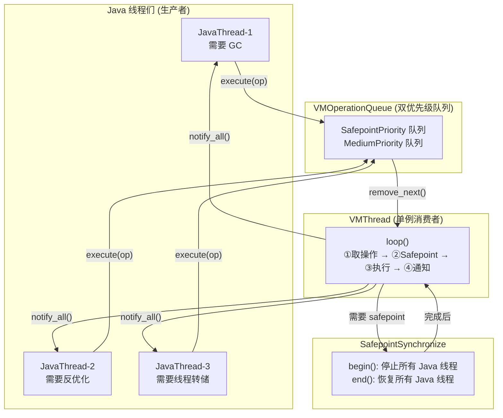
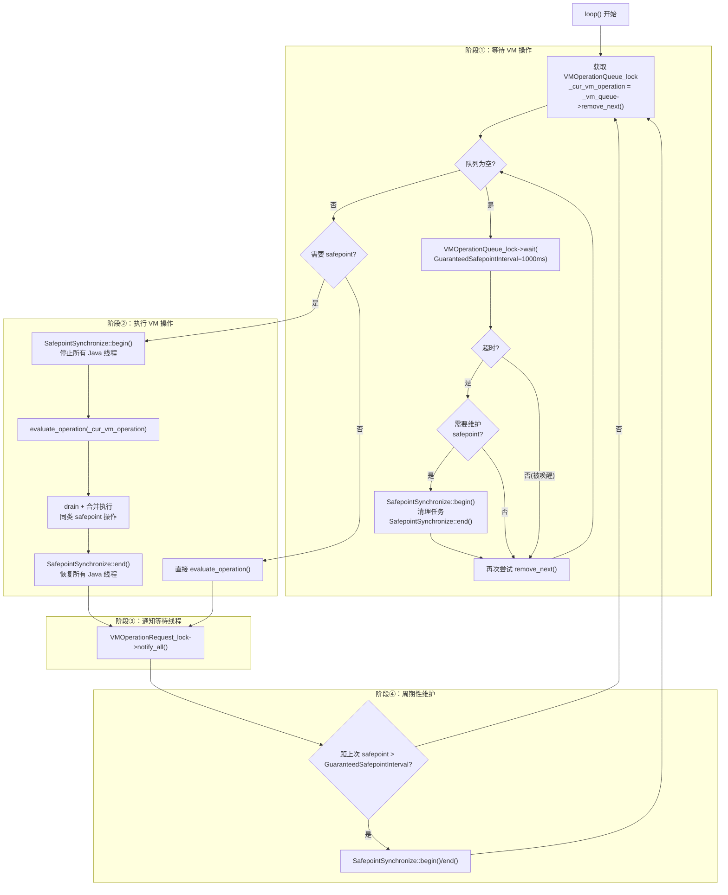
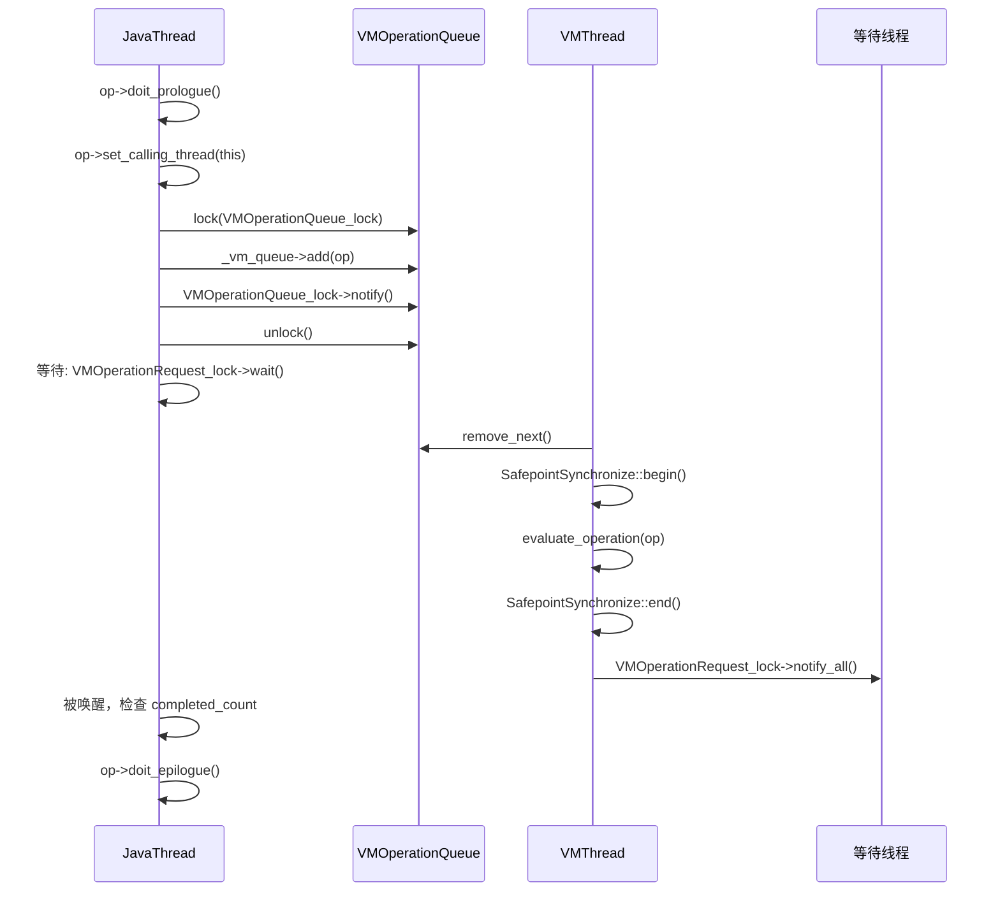

# Phase 7: VMThread 深度分析

> **一句话总结**：VMThread 是 JVM 的"操作系统"——一个单例后台线程，专门负责在 Safepoint 下串行执行所有需要全局一致性的 VM 操作（GC、反优化、线程转储等），是 JVM 并发架构的核心协调者。

> 源码位置：`vmThread.hpp/cpp`, `vmOperations.hpp`, `safepoint.hpp/cpp`
> 标准环境：-Xms8g -Xmx8g -XX:+UseG1GC -Xint

---

## 第 0 部分：核心原理 ⭐

### 0.1 本质是什么？

本文是对 **Phase 7: VMThread 深度分析** 的深度源码分析：从数据结构到算法流程，逐层剖析其实现原理，并通过 GDB 验证关键结论。

### 0.2 为什么需要？

深入理解 JVM 内部实现，不仅能帮助排查生产问题，更能建立对 JVM 行为的精确预测能力——知道『为什么』比知道『是什么』更重要。

### 0.3 怎么解决？

采用「数据结构 → 算法流程 → GDB 验证」三步法：先完整分析所有涉及的数据结构（字段含义/sizeof/生命周期），再分析算法流程（每步有 why），最后用 GDB 实际验证关键结论。

### 0.4 为什么这样设计？

JVM 的每个设计决策都有其历史背景和性能考量。本文在分析每个关键设计时，都会解释「为什么这样而不是那样」，帮助读者建立设计直觉。

---


## 一、宏观理解

### 1.1 VMThread 在 create_vm 中的位置

```
Threads::create_vm (thread.cpp:3876)
  ├─ Phase 1-6: 前置检查 → 参数 → 线程 → init_globals → 堆初始化
  ├─ Phase 7: VMThread 创建  ← 本文分析
  │   ├─ L4074: Threads::add(main_thread)     // 主线程加入线程列表
  │   ├─ L4087: VMThread::create()            // 创建 VMThread + Queue + Lock
  │   ├─ L4090: os::create_thread(vmthread)   // pthread_create 创建 OS 线程
  │   ├─ L4099: os::start_thread(vmthread)    // 启动线程
  │   └─ L4100: wait(Notify_lock)             // 等待 VMThread 就绪
  └─ Phase 8+: Java 类初始化 → 服务启动
```

### 1.2 为什么需要 VMThread？

**核心问题**：GC、反优化、偏向锁撤销等操作需要所有 Java 线程停在安全点（Safepoint），但谁来当"协调者"？

**如果没有 VMThread**：
- 发起 GC 的线程自己当协调者？→ 它需要等待其他线程停下来，但它自己也被阻塞了
- 可能导致死锁：A 等 B 停下来，B 等 A 停下来
- 多个线程同时发起 GC？→ 需要复杂的竞争协议

**VMThread 的解决方案**：
- **单一协调者**：所有需要 Safepoint 的操作都排队给 VMThread
- **生产者-消费者模式**：Java 线程是生产者（提交 VM_Operation），VMThread 是唯一消费者
- **串行执行**：同一时刻只有一个 VM 操作在执行，天然避免竞争
- **分离关注点**：Java 线程只管提交请求并等待结果，不用关心 Safepoint 协调

### 1.3 整体架构



---

## 二、逐段分析

### 2.1 Phase 7a：主线程加入线程列表（L4074-4077）

```cpp
// thread.cpp:4074
{
    MutexLocker mu(Threads_lock);
    Threads::add(main_thread);
}
```

这一步将 `main_thread`（在 Phase 5 创建的 JavaThread）以头插法加入全局线程链表 `_thread_list`，同时通知 GC barrier set、ThreadService 等。此后 `Threads::number_of_threads() == 1`。

### 2.2 Phase 7b：VMThread::create()（L4087）

```
源码：vmThread.cpp:242-275
```

`VMThread::create()` 是静态方法，在主线程中执行。它做 4 件事：

**① 创建 VMThread 对象**
```cpp
_vm_thread = new VMThread();
// VMThread 构造函数只做一件事：set_name("VM Thread")
// 继承链：VMThread → NamedThread → NonJavaThread → Thread
```

**② 创建超时监控任务（可选）**
```cpp
if (AbortVMOnVMOperationTimeout) {
    _timeout_task = new VMOperationTimeoutTask(interval);
    _timeout_task->enroll();
}
```
默认不创建（`AbortVMOnVMOperationTimeout` 默认 false）。开启后会周期性检查 VM 操作是否超时。

**③ 创建操作队列**
```cpp
_vm_queue = new VMOperationQueue();
```
VMOperationQueue 是双优先级的循环双向链表。详见 §3.2。

**④ 创建终止锁和性能计数器**
```cpp
_terminate_lock = new Monitor(Mutex::safepoint, "VMThread::_terminate_lock", true,
                              Monitor::_safepoint_check_never);
if (UsePerfData) {
    _perf_accumulated_vm_operation_time = PerfDataManager::create_counter(...);
}
```

> **GDB 验证**（第一次 loop 入口）：
> - `VMThread::_vm_thread = 0x7ffff0d91000`
> - `VMThread::_vm_queue = 0x7ffff0d92320`
> - `_terminate_lock = 0x7ffff0d92470`
> - `_timeout_task = (nil)`（默认不开启）

### 2.3 Phase 7c：os::create_thread()（L4090）

```
源码：os_linux.cpp:935-1019
```

这是真正创建 OS 线程的入口。对于 VMThread，流程如下：

```
os::create_thread(vmthread, os::vm_thread)
  ├─ new OSThread()                            // 在 C 堆创建 OSThread 对象
  ├─ osthread->set_thread_type(vm_thread)      // 类型标记为 vm_thread (enum=0)
  ├─ osthread->set_state(ALLOCATED)            // 初始状态
  ├─ thread->set_osthread(osthread)            // 关联到 VMThread
  ├─ pthread_attr_init(&attr)
  ├─ pthread_attr_setdetachstate(DETACHED)     // 分离模式：不需要 join
  ├─ 计算栈大小 + guard 页
  └─ pthread_create(&tid, &attr, thread_native_entry, thread)  // 创建 OS 线程
```

`pthread_create` 的入口函数是 `thread_native_entry`（os_linux.cpp:864-933），它在新线程中执行：

```
thread_native_entry(Thread* thread)    // 在新 OS 线程中运行
  ├─ record_stack_base_and_size()      // 记录栈信息
  ├─ initialize_thread_current()       // 设置 TLS，此后可通过 Thread::current() 获取
  ├─ osthread->set_thread_id(...)      // 设置线程 ID
  ├─ hotspot_sigmask()                 // 初始化信号掩码
  ├─ init_thread_fpu_state()           // 初始化浮点控制寄存器
  ├─ 【握手阶段】
  │   ├─ osthread->set_state(INITIALIZED)  // ALLOCATED → INITIALIZED
  │   ├─ sync->notify_all()                // 通知父线程（create_thread 返回）
  │   └─ while(INITIALIZED) sync->wait()   // 等待父线程调用 start_thread
  └─ thread->call_run()               // 最终调用 VMThread::run()
```

> 注意**握手协议**：这是一个两阶段同步：
> 1. 子线程初始化完成 → 通知父线程 → 父线程从 `create_thread` 返回
> 2. 父线程调用 `start_thread` → 子线程从 wait 醒来 → 开始 `run()`

### 2.4 Phase 7d：启动并等待就绪（L4097-4103）

```cpp
{
    MutexLocker ml(Notify_lock);
    os::start_thread(vmthread);     // 设置 RUNNABLE，唤醒子线程
    while (vmthread->active_handles() == NULL) {
        Notify_lock->wait();        // 等待 VMThread 分配 JNI handle block
    }
}
```

**为什么用 `active_handles() == NULL` 作为就绪标志？** 因为 `VMThread::run()` 中分配 JNI handle block 是最后一个初始化步骤。检查它非空意味着 VMThread 已完全初始化，随时可以处理 VM 操作。

### 2.5 VMThread::run()（vmThread.cpp:285-359）

```
VMThread::run()    // 在 VMThread 的 OS 线程中运行
  ├─ initialize_named_thread()                    // 基类初始化
  ├─ set_active_handles(JNIHandleBlock::allocate_block())  // 分配 JNI handle block
  ├─ Notify_lock->notify()                        // 通知 create_vm 主线程就绪
  ├─ 设置 OS 优先级为 NearMaxPriority (9)
  ├─ this->loop()                                 // ⭐ 进入核心事件循环
  └─ 【退出阶段】
      ├─ SafepointSynchronize::begin()            // 进入最终 Safepoint
      ├─ CompileBroker::set_should_block()        // 停止编译器
      ├─ VM_Exit::wait_for_threads_in_native_to_block()
      ├─ _terminated = true
      └─ _terminate_lock->notify()                // 通知 VM 退出完成
```

> **GDB 验证**：
> - `active_handles = 0x7fffc0000d70`（非空，就绪标志）
> - `VMThreadPriority = -1`（使用默认 NearMaxPriority = 9）
> - `OSThread::state = 2 (RUNNABLE)`

---

## 三、核心事件循环 loop()

`VMThread::loop()` 是 VMThread 的核心——一个无限循环，不断从队列取操作、执行、通知。它是整个 JVM 运行的"心脏"。

```
源码：vmThread.cpp:457-636
```

### 3.1 loop() 四阶段结构



### 3.2 阶段①：等待 VM 操作

```cpp
// vmThread.cpp:466-518
{ MutexLockerEx mu_queue(VMOperationQueue_lock, Mutex::_no_safepoint_check_flag);

  _cur_vm_operation = _vm_queue->remove_next();

  while (!should_terminate() && _cur_vm_operation == NULL) {
    bool timedout = VMOperationQueue_lock->wait(
        Mutex::_no_safepoint_check_flag,
        GuaranteedSafepointInterval);  // 默认 1000ms

    if (timedout && VMThread::no_op_safepoint_needed(false)) {
      // 超时且需要清理 → 触发维护 Safepoint
      MutexUnlockerEx mul(VMOperationQueue_lock, ...);
      SafepointSynchronize::begin();
      SafepointSynchronize::end();
    }
    _cur_vm_operation = _vm_queue->remove_next();

    // 如果取到的是 safepoint 操作，顺便把队列中其他 safepoint 操作也取出来（合并执行）
    if (_cur_vm_operation != NULL && _cur_vm_operation->evaluate_at_safepoint()) {
      safepoint_ops = _vm_queue->drain_at_safepoint_priority();
    }
  }
}
```

**关键设计点**：
- **GuaranteedSafepointInterval = 1000ms**：即使没有 VM 操作请求，每秒也会检查是否需要维护 Safepoint（清理 monitors、更新 inline cache、rehash 表等）
- **drain 合并**：当已经要进入 Safepoint 时，把队列中所有等待 Safepoint 的操作一次性取出，避免反复 begin/end

> **GDB 验证**：`GuaranteedSafepointInterval = 1000 ms`
> 第二次命中 loop 时 `_queue_counter = 3`，说明已处理了 3 个 VM 操作

### 3.3 阶段②：执行 VM 操作

**Safepoint 操作路径**（绝大多数情况）：
```cpp
if (_cur_vm_operation->evaluate_at_safepoint()) {
    _vm_queue->set_drain_list(safepoint_ops);  // GC root 扫描用
    SafepointSynchronize::begin();              // ⭐ 停止所有 Java 线程

    if (_timeout_task != NULL) _timeout_task->arm();

    evaluate_operation(_cur_vm_operation);       // 执行主操作

    // 合并执行同优先级的其他操作
    do {
        _cur_vm_operation = safepoint_ops;
        // ... 遍历执行 drain 出来的操作 ...
        // 再次检查队列是否有新的 safepoint 操作（减少 safepoint 次数）
        if (_vm_queue->peek_at_safepoint_priority()) {
            safepoint_ops = _vm_queue->drain_at_safepoint_priority();
        }
    } while(safepoint_ops != NULL);

    SafepointSynchronize::end();                // ⭐ 恢复所有 Java 线程
}
```

**非 Safepoint 操作路径**（少数情况）：
```cpp
else {
    evaluate_operation(_cur_vm_operation);
    _cur_vm_operation = NULL;
}
```

**evaluate_operation** 内部（vmThread.cpp:403-435）：
```cpp
void VMThread::evaluate_operation(VM_Operation* op) {
    PerfTraceTime vm_op_timer(perf_accumulated_vm_operation_time());
    op->evaluate();              // 最终调用 op->doit()
    op->calling_thread()->increment_vm_operation_completed_count();
    if (c_heap_allocated) delete _cur_vm_operation;  // 释放堆分配的操作
}
```

### 3.4 阶段③④：通知 + 周期性维护

```cpp
// 阶段③：通知
{ MutexLockerEx mu(VMOperationRequest_lock, Mutex::_no_safepoint_check_flag);
  VMOperationRequest_lock->notify_all();   // 唤醒所有等待的 Java 线程
}

// 阶段④：周期性维护 Safepoint
if (VMThread::no_op_safepoint_needed(true)) {
    SafepointSynchronize::begin();
    SafepointSynchronize::end();
}
```

`no_op_safepoint_needed()` 检查：
1. `SafepointALot` 标志（debug 用）
2. `SafepointSynchronize::is_cleanup_needed()`：monitors 需要 deflate / IC buffer 非空 / 表需要 rehash
3. 距上次 safepoint 超过 `GuaranteedSafepointInterval`（1000ms）

---

## 四、VMOperationQueue 详解

```
源码：vmThread.hpp:39-85, vmThread.cpp:56-199
```

### 4.1 数据结构

```
┌──────────────────────────────────────────────────────────────┐
│                    VMOperationQueue                            │
├──────────────────────────────────────────────────────────────┤
│  _queue_length[2]  ─── [0]=SafepointPriority, [1]=Medium    │
│  _queue_counter    ─── 用于防饥饿调度                         │
│  _queue[2]         ─── 两个循环双向链表的哨兵节点              │
│  _drain_list       ─── 已取出的操作链表（供 GC root 扫描）    │
├──────────────────────────────────────────────────────────────┤
│                                                              │
│  SafepointPriority 队列（循环双向链表）：                      │
│  ┌─────┐   ┌─────┐   ┌─────┐   ┌─────┐                     │
│  │Dummy│⇄│ Op1 │⇄│ Op2 │⇄│Dummy│  ← 首尾相连              │
│  └─────┘   └─────┘   └─────┘   └─────┘                     │
│                                                              │
│  MediumPriority 队列：同结构                                  │
│                                                              │
└──────────────────────────────────────────────────────────────┘
```

每个队列用一个 `VM_Dummy` 哨兵节点初始化，空队列时哨兵的 next/prev 都指向自己。

### 4.2 入队策略（add）

```cpp
bool VMOperationQueue::add(VM_Operation *op) {
    if (op->evaluate_at_safepoint()) {
        queue_add_back(SafepointPriority, op);  // Safepoint 操作放高优先级
    } else {
        queue_add_back(MediumPriority, op);     // 其他放中优先级
    }
    return true;
}
```

### 4.3 出队策略（remove_next）—— 防饥饿

```cpp
VM_Operation* VMOperationQueue::remove_next() {
    int high_prio, low_prio;
    if (_queue_counter++ < 10) {
        high_prio = SafepointPriority;   // 前 10 次优先取 Safepoint 操作
        low_prio  = MediumPriority;
    } else {
        _queue_counter = 0;
        high_prio = MediumPriority;      // 第 11 次翻转优先级
        low_prio  = SafepointPriority;
    }
    return queue_remove_front(queue_empty(high_prio) ? low_prio : high_prio);
}
```

每 11 次出队中，前 10 次优先取 SafepointPriority，第 11 次翻转为 MediumPriority。防止 Medium 操作永远饿死。

> **GDB 验证**：第二次命中 loop 时 `_queue_counter = 3`，说明计数器在工作中

---

## 五、VM_Operation 体系

```
源码：vmOperations.hpp:134-228
```

### 5.1 基类设计

```cpp
class VM_Operation: public CHeapObj<mtInternal> {
    enum Mode {
        _safepoint,       // 阻塞，需要 safepoint，C 堆分配
        _no_safepoint,    // 阻塞，不需要 safepoint，C 堆分配
        _concurrent,      // 非阻塞，不需要 safepoint，C 堆分配
        _async_safepoint  // 非阻塞，需要 safepoint，C 堆分配
    };

    Thread*         _calling_thread;   // 发起线程
    ThreadPriority  _priority;         // 优先级
    long            _timestamp;        // 入队时间（用于计算等待时长）
    VM_Operation*   _next;             // 双向链表
    VM_Operation*   _prev;

    virtual void doit() = 0;                        // 纯虚函数：操作的实际逻辑
    virtual bool doit_prologue() { return true; }   // 在调用者线程执行的前置检查
    virtual void doit_epilogue() {}                 // 在调用者线程执行的后置处理
    virtual Mode evaluation_mode() const { return _safepoint; }  // 默认需要 safepoint
};
```

**四种执行模式**：

| 模式 | 是否阻塞调用者 | 是否需要 Safepoint | 典型场景 |
|------|-------------|-----------------|---------|
| `_safepoint` | ✅ | ✅ | GC、反优化、类重定义 |
| `_no_safepoint` | ✅ | ❌ | （较少使用）|
| `_concurrent` | ❌ | ❌ | 并发 GC 操作 |
| `_async_safepoint` | ❌ | ✅ | ThreadStop、ScavengeMonitors |

### 5.2 操作类型分类

从 `VM_OPS_DO` 宏展开，共约 70+ 种操作类型，按功能分类：

| 类别 | 操作 | 说明 |
|------|------|------|
| **GC** | `VM_G1CollectForAllocation`, `VM_G1CollectFull`, `VM_GenCollectFull`, `VM_CollectForMetadataAllocation` | 各种 GC 触发 |
| **反优化** | `VM_Deoptimize`, `VM_DeoptimizeFrame`, `VM_DeoptimizeAll`, `VM_DeoptimizeTheWorld` | 编译代码无效化 |
| **线程管理** | `VM_ThreadStop`, `VM_ThreadDump`, `VM_PrintThreads`, `VM_FindDeadlocks` | 线程操作 |
| **偏向锁** | `VM_EnableBiasedLocking`, `VM_RevokeBias`, `VM_BulkRevokeBias` | 偏向锁撤销 |
| **诊断** | `VM_HeapDumper`, `VM_GC_HeapInspection`, `VM_GetStackTrace`, `VM_GetAllStackTraces` | 诊断工具 |
| **Handshake** | `VM_HandshakeOneThread`, `VM_HandshakeAllThreads`, `VM_HandshakeFallback` | 线程握手 |
| **类** | `VM_RedefineClasses`, `VM_PopulateDumpSharedSpace` | 热替换、CDS |
| **内联缓存** | `VM_ClearICs`, `VM_ICBufferFull` | IC 管理 |
| **强制 Safepoint** | `VM_ForceSafepoint`, `VM_ThreadSuspend`, `VM_ThreadsSuspendJVMTI` | 空操作，只为进入 safepoint |
| **退出** | `VM_Exit` | JVM 退出 |

---

## 六、VMThread::execute() —— 提交入口

```
源码：vmThread.cpp:663-757
```

这是其他线程提交 VM 操作的入口。有两条路径：

### 6.1 路径 A：JavaThread/WatcherThread 提交



**关键代码**：
```cpp
void VMThread::execute(VM_Operation* op) {
    Thread* t = Thread::current();

    if (!t->is_VM_thread()) {
        // 路径 A：非 VMThread 调用
        if (!op->doit_prologue()) return;   // 前置检查失败则取消

        op->set_calling_thread(t, Thread::get_priority(t));

        int ticket = t->vm_operation_ticket();  // 获取 ticket 编号

        { // 入队
            VMOperationQueue_lock->lock_without_safepoint_check();
            _vm_queue->add(op);
            op->set_timestamp(os::javaTimeMillis());
            VMOperationQueue_lock->notify();    // 唤醒 VMThread
            VMOperationQueue_lock->unlock();
        }

        // 等待完成
        MutexLocker mu(VMOperationRequest_lock);
        while(t->vm_operation_completed_count() < ticket) {
            VMOperationRequest_lock->wait(!t->is_Java_thread());
        }

        op->doit_epilogue();  // 后置处理
    }
```

**ticket 机制**：每次提交时记录当前 `vm_operation_ticket()`，完成时 VMThread 调用 `increment_vm_operation_completed_count()`。等待线程比较 ticket 确认自己的操作已完成。这避免了虚假唤醒导致过早返回。

### 6.2 路径 B：VMThread 自身调用（嵌套操作）

```cpp
    } else {
        // 路径 B：VMThread 自身调用（嵌套操作）
        VM_Operation* prev_vm_operation = vm_operation();
        if (prev_vm_operation != NULL) {
            if (!prev_vm_operation->allow_nested_vm_operations()) {
                fatal("Nested VM operation not allowed");
            }
        }

        _cur_vm_operation = op;
        if (op->evaluate_at_safepoint() && !SafepointSynchronize::is_at_safepoint()) {
            SafepointSynchronize::begin();
            op->evaluate();
            SafepointSynchronize::end();
        } else {
            op->evaluate();       // 已经在 safepoint 中，直接执行
        }
        _cur_vm_operation = prev_vm_operation;  // 恢复
    }
```

嵌套操作只有在前一个操作 `allow_nested_vm_operations()` 返回 true 时才允许。典型场景：反优化期间触发 GC。

---

## 七、SafepointSynchronize 详解

### 7.1 核心状态机

```
_not_synchronized (0)  ──begin()──>  _synchronizing (1)  ──所有线程停止──>  _synchronized (2)
       ↑                                                                          │
       └─────────────────────────── end() ────────────────────────────────────────┘
```

### 7.2 SafepointSynchronize::begin()

```
源码：safepoint.cpp:155-495
```

**begin() 的核心工作**：

```
begin()
  ├─ assert(is_VM_thread)                     // 只能 VMThread 调用
  ├─ heap->safepoint_synchronize_begin()      // 通知 GC
  ├─ Threads_lock->lock()                     // ⭐ 锁住线程列表，阻止新线程创建/退出
  │
  ├─ _waiting_to_block = nof_threads          // 等待所有线程到达
  ├─ _state = _synchronizing                  // 设置为"正在同步"
  │
  ├─ 【arm 所有线程的 safepoint poll】
  │   ├─ 线程本地 poll：arm_local_poll(每个线程)
  │   ├─ 全局 page poll：os::make_polling_page_unreadable()
  │   └─ 解释器：Interpreter::notice_safepoints()
  │
  ├─ 【自旋等待所有线程】
  │   while (still_running > 0):
  │     for each JavaThread:
  │       examine_state_of_thread()      // 检查线程状态
  │       └─ 根据状态分类：
  │           _thread_in_native  → _at_safepoint (已安全)
  │           _thread_blocked    → _at_safepoint (已安全)
  │           _thread_in_vm      → _call_back (等待回调)
  │           _thread_in_Java    → 继续运行（等它自己 poll）
  │     // 自旋策略：
  │     if (iterations < 2000)    → SpinPause()
  │     elif (iterations < 4000)  → os::naked_yield()
  │     else                      → os::naked_short_sleep(1)
  │
  ├─ 【等待所有线程 block】
  │   while (_waiting_to_block > 0):
  │     Safepoint_lock->wait()            // 线程到达后 notify
  │
  ├─ _safepoint_counter++                 // 奇数 = 在 safepoint 中
  ├─ _state = _synchronized               // ⭐ 所有线程已停止
  │
  └─ do_cleanup_tasks()                    // 清理任务
```

### 7.3 Java 线程到达 Safepoint 的 5 种路径

| # | 线程状态 | 停止机制 | 说明 |
|---|---------|---------|------|
| 1 | 解释执行中 | 修改 dispatch table | 每执行一条字节码前检查 |
| 2 | 在 native 代码中 | 返回时检查 `_state` | 不等待，native 返回时自动检查 |
| 3 | 执行编译代码 | polling page 变不可读 → SIGSEGV | 编译代码在循环回边和方法返回时 poll |
| 4 | 已 blocked | 直接标记为安全 | 持有锁等，释放时会检查 |
| 5 | 在 VM 中/状态切换中 | 切换时检查并阻塞 | 状态转换点自动检查 |

### 7.4 SafepointSynchronize::end()

```
源码：safepoint.cpp:499-601
```

```
end()
  ├─ _safepoint_counter++                    // 偶数 = 不在 safepoint
  ├─ 恢复 polling page 为可读
  ├─ Interpreter::ignore_safepoints()        // 恢复解释器 dispatch table
  ├─ _state = _not_synchronized
  ├─ for each JavaThread:
  │     cur_state->restart()                 // 重置为 _running
  │     disarm_local_poll()                  // 解除线程本地 poll
  ├─ Threads_lock->unlock()                  // ⭐ 释放锁，所有线程恢复
  ├─ heap->safepoint_synchronize_end()
  └─ _end_of_last_safepoint = os::javaTimeMillis()
```

**核心要点**：`Threads_lock` 在 `begin()` 中 lock，在 `end()` 中 unlock。Safepoint 期间持有此锁意味着：
- 没有新 Java 线程可以被创建（需要锁）
- 已 block 的线程无法恢复（它们在等 `Threads_lock`）
- VMThread 独占整个 JVM

> **GDB 验证**：
> - 第一次：`_safepoint_counter = 0`（还没执行过 safepoint）
> - 第二次：`_safepoint_counter = 2`（已完成 1 次完整 safepoint: begin +1, end +1）
> - `_end_of_last_safepoint = 1771899293936`（毫秒时间戳）

### 7.5 Safepoint 清理任务

每次进入 Safepoint 后（begin 的末尾），自动执行 7 项清理任务：

```cpp
enum SafepointCleanupTasks {
    SAFEPOINT_CLEANUP_DEFLATE_MONITORS,           // deflate 闲置 monitor
    SAFEPOINT_CLEANUP_UPDATE_INLINE_CACHES,       // 更新内联缓存
    SAFEPOINT_CLEANUP_COMPILATION_POLICY,          // 编译策略 safepoint 处理
    SAFEPOINT_CLEANUP_SYMBOL_TABLE_REHASH,         // 符号表 rehash
    SAFEPOINT_CLEANUP_STRING_TABLE_REHASH,         // 字符串表 rehash
    SAFEPOINT_CLEANUP_CLD_PURGE,                   // 清理 ClassLoaderData
    SAFEPOINT_CLEANUP_SYSTEM_DICTIONARY_RESIZE,    // 调整系统字典大小
};
```

使用 GC 的 WorkGang 并行执行（`ParallelSPCleanupTask`），如果没有 cleanup workers 则由 VMThread 串行执行。

---

## 八、协调锁一览

| 锁名 | 地址（GDB） | 作用 |
|------|-----------|------|
| `VMOperationQueue_lock` | `0x7ffff001c1b0` | 保护操作队列。VMThread 在此 wait，Java 线程入队后 notify |
| `VMOperationRequest_lock` | `0x7ffff001c280` | Java 线程提交操作后在此 wait，VMThread 执行完后 notify_all |
| `Safepoint_lock` | `0x7ffff001bf40` | Safepoint 同步。线程到达 safepoint 时通过此锁通知 VMThread |
| `Threads_lock` | `0x7ffff001c010` | Safepoint 期间由 VMThread 持有。阻止线程创建/退出，已 block 的线程等此锁恢复 |
| `Notify_lock` | — | VMThread 启动时通知 create_vm 主线程就绪 |
| `_terminate_lock` | `0x7ffff0d92470` | VM 退出同步。VMThread 退出时 notify |

---

## 九、GDB 验证总结

### 9.1 验证脚本

```
new-jvm-md/tmp-file/create_vm/gdb_vmthread.gdb
```

在 `VMThread::loop()` 入口处断点，采集 11 类数据。

### 9.2 关键验证数据

| 项目 | 值 | 含义 |
|------|-----|------|
| `VMThread::_vm_thread` | `0x7ffff0d91000` | VMThread 单例地址 |
| `name` | "VM Thread" | 线程名 |
| `_vm_queue` | `0x7ffff0d92320` | 操作队列地址 |
| `_queue_length[0]` | 0 | 队列初始为空 |
| `_queue_length[1]` | 0 | 队列初始为空 |
| `_queue_counter` | 0→3 | 初始 0，运行后增到 3 |
| `_cur_vm_operation` | NULL | 无正在执行的操作 |
| `_should_terminate` | false | 未请求退出 |
| `SafepointSynchronize::_state` | 0 (_not_synchronized) | 不在 safepoint 中 |
| `_safepoint_counter` | 0→2 | 初始 0，经历 1 次完整 safepoint 后为 2 |
| `OSThread::thread_type` | 0 (vm_thread) | 确认是 VMThread 类型 |
| `OSThread::state` | 2 (RUNNABLE) | 线程正在运行 |
| `VMThreadPriority` | -1 | 使用默认优先级 |
| `NearMaxPriority` | 9 | 默认 OS 优先级映射 |
| `active_handles` | `0x7fffc0000d70` | 非空 = 已就绪 |
| `_timeout_task` | NULL | 超时监控未开启 |
| `GuaranteedSafepointInterval` | 1000 ms | 维护 safepoint 间隔 |
| `Threads::_number_of_threads` | 1→6 | 初始只有 main，后增至 6 |
| `_number_of_non_daemon_threads` | 1 | 始终只有 main 是非 daemon |

---

## 十、设计决策总结

| # | 设计 | 为什么 |
|---|------|--------|
| 1 | **单例 VMThread** | 避免多线程竞争协调 Safepoint 的复杂性和死锁风险 |
| 2 | **双优先级队列 + 防饥饿** | Safepoint 操作优先但不饿死非 Safepoint 操作（每 11 次翻转） |
| 3 | **drain 合并执行** | 已经在 Safepoint 中时批量执行，减少 Safepoint 次数 |
| 4 | **GuaranteedSafepointInterval** | 即使无请求也定期执行清理任务（monitor deflate、IC 更新等） |
| 5 | **ticket 机制等待完成** | 防止虚假唤醒导致线程过早返回 |
| 6 | **NearMaxPriority** | VMThread 优先级高于普通 Java 线程，减少 Safepoint 延迟 |
| 7 | **Threads_lock 贯穿 Safepoint** | Safepoint 期间锁住线程列表，阻止线程创建/退出，保证一致性 |
| 8 | **三级自旋策略** | SpinPause → yield → sleep，平衡 CPU 消耗与响应延迟 |
| 9 | **active_handles 作就绪标志** | 巧妙复用 JNI handle block 分配作为 VMThread 初始化完成信号 |
| 10 | **分离模式 PTHREAD_CREATE_DETACHED** | VMThread 不需要 join，生命周期与 JVM 一致 |

---

## 十一、相关 JVM 参数

| 参数 | 默认值 | 作用 |
|------|-------|------|
| `GuaranteedSafepointInterval` | 1000 | 维护 Safepoint 最小间隔（ms） |
| `VMThreadPriority` | -1 | VMThread 优先级（-1=NearMaxPriority） |
| `AbortVMOnVMOperationTimeout` | false | VM 操作超时是否 abort |
| `AbortVMOnVMOperationTimeoutDelay` | 1000 | 超时阈值（ms） |
| `SafepointTimeout` | false | 是否检测 Safepoint 超时 |
| `SafepointTimeoutDelay` | 10000 | Safepoint 超时阈值（ms） |
| `PrintSafepointStatistics` | false | 打印 Safepoint 统计信息 |
| `PrintSafepointStatisticsTimeout` | -1 | 只打印超过此阈值的 Safepoint |
| `PrintVMQWaitTime` | false | 打印操作在队列中的等待时间 |
| `SafepointALot` | false | 频繁触发 Safepoint（debug 用） |
| `VMThreadHintNoPreempt` | false | 给 VMThread 额外时间片 |

**查看 Safepoint 日志的参数**：
```bash
# 查看 safepoint 进入/离开信息
-Xlog:safepoint=info

# 查看详细 safepoint 同步过程
-Xlog:safepoint=debug

# 查看 safepoint 清理任务
-Xlog:safepoint+cleanup=info

# 查看 VMThread 操作日志
-Xlog:vmthread=debug
```

输出示例：
```
[info][safepoint] Entering safepoint region: G1CollectForAllocation
[info][safepoint] Leaving safepoint region
[info][safepoint,cleanup] safepoint cleanup tasks: 0.15 ms
[info][safepoint,cleanup] deflating idle monitors, 0.01 ms
[info][safepoint,cleanup] updating inline caches, 0.02 ms
[debug][vmthread] Evaluating safepoint VM operation: G1CollectForAllocation
```

---

## 十二、待深入主题

1. **SafepointMechanism::uses_thread_local_poll() vs global page poll**：JDK 11 支持两种 poll 模式，线程本地 poll 是新方案
2. **Handshake 机制**：部分替代全局 Safepoint 的轻量级方案（VM_HandshakeOneThread）
3. **编译代码的 polling page 异常处理**：`handle_polling_page_exception()` 的完整流程
4. **Safepoint 与 GC barrier 的交互**：`safepoint_synchronize_begin/end` 在各 GC 中的实现
5. **VMThread 退出流程**：`wait_for_vm_thread_exit()` → 最终 Safepoint → `_terminated`
