# Phase 8：Java 类初始化与 VM 启动完成

> `Threads::create_vm()` 后半段完整分析：从 `initialize_java_lang_classes` 到 `return JNI_OK`
>
> 基于 OpenJDK 11 源码分析
> 标准环境：`-Xms8g -Xmx8g -XX:+UseG1GC`，G1 Region = 4MB
> 源码：`src/hotspot/share/runtime/thread.cpp` L4120-4306

---

## 第 0 部分：核心原理 ⭐

### 0.1 本质是什么？

本文分析 **Phase 8：Java 类初始化与 VM 启动完成** 的初始化过程：JVM 启动时该组件如何被创建、配置和激活，以及初始化顺序的约束关系。

### 0.2 为什么需要？

JVM 初始化顺序有严格的依赖关系——某些组件必须在其他组件之前初始化。理解初始化顺序有助于排查启动失败问题，也能理解各组件的设计约束。

### 0.3 怎么解决？

追踪初始化函数的调用链，分析每个初始化步骤的前置条件和后置效果，识别关键的初始化顺序约束。

### 0.4 为什么这样设计？

初始化顺序的设计原则：「被依赖的先初始化」。例如内存管理必须在 GC 之前初始化，GC 必须在类加载之前初始化。

---


## 一、问题引入

### 1.1 场景描述

`init_globals()` 完成后，HotSpot C++ 世界的基础设施（CodeCache、解释器、StubRoutines、Universe 等）已全部就绪。但此时：

1. **没有任何 Java 类被初始化** —— String、System、Thread 等核心类的 `<clinit>` 都还没跑
2. **没有 Java 线程对象** —— main_thread 是 C++ 的 `JavaThread`，还没有与之关联的 `java.lang.Thread` 实例
3. **没有线程组** —— ThreadGroup 还不存在
4. **模块系统未启动** —— 只能加载 java.base 模块的类
5. **编译器未初始化** —— JIT 还不能工作

### 1.2 朴素方案与问题

**最简单的做法**：一次性把所有核心类全部初始化完，不分顺序、不分阶段。

**为什么不行？**
- **依赖顺序约束**：`Thread` 的构造函数会调用 `Thread.currentThread()`，而 `currentThread()` 需要 `eetop` 已设置，如果先初始化 Thread 再设置 eetop 就会 NPE。`initPhase1` 需要 `Thread.currentThread()` 能工作，所以必须在 Thread 对象创建之后。
- **功能可用性约束**：模块系统初始化（initPhase2）需要编译器已就绪才能获得性能；安全管理器和系统类加载器（initPhase3）可能来自非 java.base 模块，必须在模块系统之后。
- **并发安全约束**：多个类可能被不同线程同时初始化，需要 JLS §12.4.2 定义的初始化协议来避免竞态。

**JVM 的实际方案**：严格按依赖关系排序初始化，并分为三个 `initPhase` 逐步解锁 Java 世界的功能。每个阶段完成后通过 `VM.initLevel` 递增来标记进度，后续阶段的代码可以通过检查 `initLevel` 来确认前置条件是否满足。

### 1.3 核心思路

Phase 8 就是完成从"C++ 世界就绪"到"Java 世界完全可用"的最后跨越，核心是三层跨越：
1. **从 C++ 到 Java**：初始化核心 Java 类，创建第一个 Thread 对象
2. **从单线程到多线程**：启动 Signal Dispatcher、Service Thread、Compiler Threads
3. **从受限到完整**：通过 initPhase1→2→3 逐步解锁完整 Java 功能

---

## 二、宏观流程

### 2.1 整体调用链（thread.cpp L4120-4306）

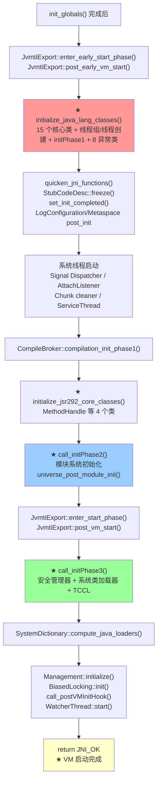

### 2.2 阶段划分 Mermaid 图

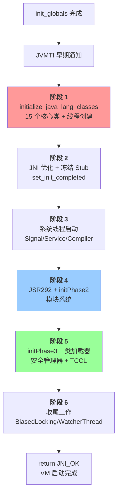

---

## 三、阶段 1：initialize_java_lang_classes（核心）

> 源码：`thread.cpp` L3812-3864

这是整个 Phase 8 最关键的函数。它做三件大事：
1. 初始化 15 个核心 Java 类
2. 创建线程组（system + main）
3. 创建 main Thread 对象并绑定到 JavaThread

### 3.1 initialize_class 辅助函数

```cpp
// thread.cpp L1165-1168
static void initialize_class(Symbol* class_name, TRAPS) {
    Klass* klass = SystemDictionary::resolve_or_fail(class_name, true, CHECK);
    InstanceKlass::cast(klass)->initialize(CHECK);
}
```

做两步：
1. **resolve_or_fail**：从 SystemDictionary 中查找/加载类，找不到就抛异常
2. **initialize**：执行 `<clinit>`（类初始化器），确保静态字段被初始化

### 3.2 类初始化顺序及原因

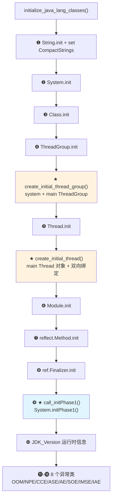

**为什么是这个顺序？** 每个类的位置都有依赖原因：

| 顺序 | 类 | 必须在此位置的原因 |
|:---:|---|---|
| 1 | String | 几乎所有其他类都用到字符串 |
| 2 | System | `initPhase1` 要用，且在 Thread 构造函数中可能被引用 |
| 3 | Class | VM 会创建/返回 `java.lang.Class` 对象 |
| 4 | ThreadGroup | `create_initial_thread_group` 需要已初始化的 ThreadGroup 类 |
| 5 | Thread | `create_initial_thread` 需要已初始化的 Thread 类 |
| 6 | Module | `initPhase2` 模块系统需要 |
| 7 | reflect.Method | VM 预解析方法到这些类 |
| 8 | ref.Finalizer | GC 需要 Finalizer 机制就绪 |
| 9 | initPhase1 | 必须在 Thread 创建后（需要 `Thread.currentThread()`）|
| 10+ | 异常类 | 必须在 `initPhase1` 后（需要系统属性已初始化）|

### 3.3 create_initial_thread_group：创建两个线程组

> 源码：`thread.cpp` L1172-1187

```cpp
static Handle create_initial_thread_group(TRAPS) {
    // 1. 创建 system ThreadGroup（根，无参构造函数）
    Handle system_instance = JavaCalls::construct_new_instance(
            SystemDictionary::ThreadGroup_klass(),
            vmSymbols::void_method_signature(),   // ThreadGroup()
            CHECK_NH);
    Universe::set_system_thread_group(system_instance());

    // 2. 创建 main ThreadGroup（system 的子组）
    Handle string = java_lang_String::create_from_str("main", CHECK_NH);
    Handle main_instance = JavaCalls::construct_new_instance(
            SystemDictionary::ThreadGroup_klass(),
            vmSymbols::threadgroup_string_void_signature(),  // ThreadGroup(ThreadGroup, String)
            system_instance,      // parent = system
            string,               // name = "main"
            CHECK_NH);
    return main_instance;
}
```

这里创建了 JVM 中的两个根线程组：

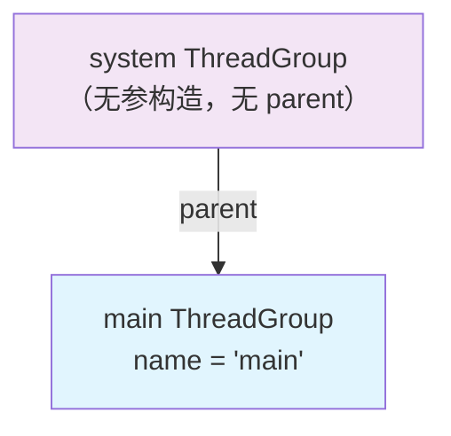

**关键设计**：
- `system` 组用于 VM 内部线程（Signal Dispatcher、Service Thread、CompilerThread 等）
- `main` 组用于用户线程（main 线程及其创建的线程）
- 分开管理是为了 VM 内部线程不被用户代码通过 `ThreadGroup.list()` 等方法干扰

**GDB 验证**：
```
system_thread_group = 0x7ffc06730
main_thread_group   = 0x7ffc067c0
```

### 3.4 create_initial_thread：创建 main Thread 对象

> 源码：`thread.cpp` L1190-1214

```cpp
static oop create_initial_thread(Handle thread_group, JavaThread* thread, TRAPS) {
    InstanceKlass* ik = SystemDictionary::Thread_klass();
    assert(ik->is_initialized(), "must be");
    instanceHandle thread_oop = ik->allocate_instance_handle(CHECK_NULL);

    // ★ 关键：在调用构造函数之前就设置 eetop 和 priority
    // 因为 Thread 构造函数会调用 Thread.currentThread()
    // 而 currentThread() 需要 eetop 已经指向 JavaThread
    java_lang_Thread::set_thread(thread_oop(), thread);     // eetop = JavaThread*
    java_lang_Thread::set_priority(thread_oop(), NormPriority); // priority = 5
    thread->set_threadObj(thread_oop());                     // 双向绑定

    Handle string = java_lang_String::create_from_str("main", CHECK_NULL);

    // 调用 Thread(ThreadGroup, String) 构造函数
    JavaValue result(T_VOID);
    JavaCalls::call_special(&result, thread_oop,
                            ik,
                            vmSymbols::object_initializer_name(),       // <init>
                            vmSymbols::threadgroup_string_void_signature(),
                            thread_group,    // group = main ThreadGroup
                            string,          // name = "main"
                            CHECK_NULL);
    return thread_oop();
}
```

**这里有一个极其重要的设计约束**：

**为什么不能用 `JavaCalls::construct_new_instance`？** Thread 构造函数内部会调用 `Thread.currentThread()`，而 `currentThread()` 是 native 方法，实现为 `return JavaThread::current()->threadObj()`。如果在构造函数之前没有设置 `eetop`（即 `set_thread`），则 `currentThread()` 返回 null，导致 NullPointerException。所以必须：先 `allocate_instance`（分配内存）→ 设置 `eetop` 和 `priority` → `set_threadObj`（C++ → Java 绑定）→ 最后才调用 `call_special` 执行构造函数。

**GDB 验证**：
```
JavaThread*          = 0x7ffff001f000
Thread oop           = 0x7ffc069b0
Thread.eetop         = 0x7ffff001f000  ← 指回 JavaThread*（双向绑定）
Thread.tid           = 1              ← 主线程 ID
Thread.threadStatus  = 5              ← RUNNABLE (0x5)
Thread.priority      = 5              ← NORM_PRIORITY
```

**双向绑定关系图**：

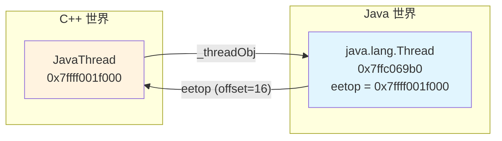

### 3.5 call_initPhase1：System.initPhase1()

> C++ 调用端：`thread.cpp` L3763-3768
> Java 实现：`java/lang/System.java` L1937-2003

initPhase1 是 Java 端的第一阶段初始化，核心工作：

```java
// java/lang/System.java L1937-2003
private static void initPhase1() {
    props = new Properties(84);
    initProperties(props);                 // VM native 方法填充 84 个系统属性

    VM.saveAndRemoveProperties(props);     // 保存内部属性，移除不公开的属性

    // 缓存常用属性
    lineSeparator = props.getProperty("line.separator");
    StaticProperty.javaHome();
    VersionProps.init();

    // ★ 创建 System.in/out/err（对应 fd 0/1/2）
    setIn0(new BufferedInputStream(new FileInputStream(FileDescriptor.in)));
    setOut0(newPrintStream(fdOut, props.getProperty("sun.stdout.encoding")));
    setErr0(newPrintStream(fdErr, props.getProperty("sun.stderr.encoding")));

    Terminator.setup();                    // 注册信号处理器（HUP, TERM, INT）
    VM.initializeOSEnvironment();

    // ★ 将 main 线程加入 "main" ThreadGroup
    Thread current = Thread.currentThread();
    current.getThreadGroup().add(current);

    setJavaLangAccess();                   // 注册 SharedSecrets
    ClassLoader.initLibraryPaths();

    VM.initLevel(1);                       // ★ 标记第一阶段完成
}
```

**关键点**：
- `System.in/out/err` 在此时创建，使用 `FileDescriptor.in/out/err`（对应 fd 0/1/2）
- main 线程在 `create_initial_thread` 中创建但**没有加入线程组**——`initPhase1` 手动添加
- `VM.initLevel(1)` 标记第一阶段完成，此后 `VM.isBooted()` 还不返回 true（需要 level=4）

### 3.6 异常类初始化

initPhase1 之后，初始化 8 个常见异常类：

```
OutOfMemoryError          → VM 直接抛出（已预分配实例）
NullPointerException      → 最常见的运行时异常
ClassCastException        → 类型检查失败
ArrayStoreException       → 数组元素类型不匹配
ArithmeticException       → 除零等
StackOverflowError        → 栈溢出
IllegalMonitorStateException → wait/notify 未持锁
IllegalArgumentException  → 参数非法
```

**为什么要在这里初始化？** 因为这些异常类的 `<clinit>` 可能触发其他类的加载，必须在 Java 世界基本就绪后才能安全执行。而在 `universe_post_init` 阶段预分配的 OOM 实例只是分配了内存，没有执行 `<clinit>`。

---

## 三-A、核心数据结构：类初始化状态机

> 上面的 `initialize_class()` 调用了 `InstanceKlass::initialize()`，而 `initialize()` 的核心是一个严格遵循 JLS §12.4.2 的状态机。在深入后续阶段前，必须先理解这个状态机。

### 3A.1 问题推导

**问题**：多个线程可能同时触发同一个类的初始化（比如线程 A 和线程 B 同时 `new SomeClass()`），如何保证 `<clinit>` 只执行一次，且不死锁？

**需要什么？**
- 需要一个**状态字段**记录类当前处于初始化的哪个阶段
- 需要一个**锁**保护状态转换，让其他线程等待
- 需要记录**谁在初始化**，以允许同一线程的递归初始化（类 A 的 `<clinit>` 中引用了类 B，B 的 `<clinit>` 又引用了 A）
- 初始化失败时需要标记**错误状态**，后续访问直接抛 `NoClassDefFoundError`

**推导出的结构**：一个状态枚举 + 一个初始化线程指针 + 一把对象锁。

### 3A.2 ClassState 枚举

```cpp
// instanceKlass.hpp L131-140
enum ClassState {
    allocated,            // 已分配（尚未链接）
    loaded,               // 已加载并插入类层次结构（尚未链接）
    linked,               // 已链接/验证（尚未初始化）
    being_initialized,    // 正在执行 <clinit>
    fully_initialized,    // ★ 初始化成功（最终状态）
    initialization_error  // 初始化失败（最终状态）
};
```

**状态转换图**：

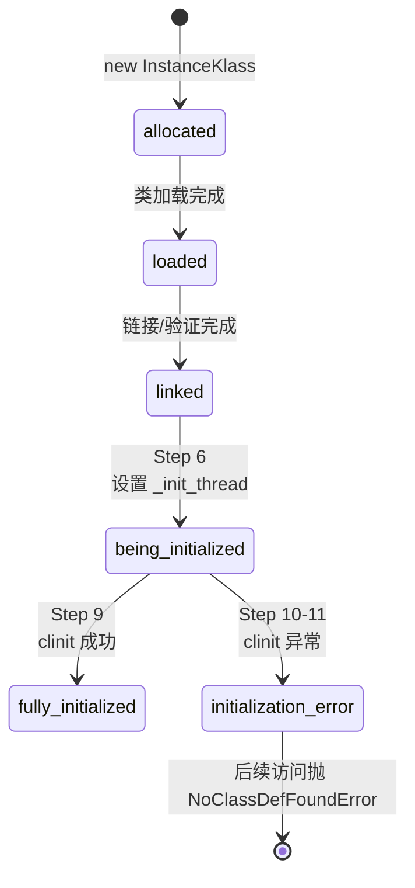

`_init_state` 是 `InstanceKlass` 中的 `u1` 字段（1 字节），紧跟在 `_idnum_allocated_count`（`u2`）之后，利用了 2 字节对齐空隙。

状态查询方法（`instanceKlass.hpp` L513-521）：

| 方法 | 判断条件 | 含义 |
|------|---------|------|
| `is_loaded()` | `_init_state >= loaded` | 已加载 |
| `is_linked()` | `_init_state >= linked` | 已链接 |
| `is_initialized()` | `_init_state == fully_initialized` | 已初始化 |
| `is_being_initialized()` | `_init_state == being_initialized` | 正在初始化 |
| `is_in_error_state()` | `_init_state == initialization_error` | 初始化失败 |
| `is_reentrant_initialization(thread)` | `thread == _init_thread` | 同一线程递归初始化 |

### 3A.3 InstanceKlass::initialize_impl() — JLS §12.4.2 协议

> 源码：`instanceKlass.cpp` L892-1038

这是 JVM 中类初始化的**核心实现**，严格遵循 JLS §12.4.2 的 11 步协议。以下为剥离日志/DTRACE/性能计数器后的核心逻辑：

```cpp
// instanceKlass.cpp L892
void InstanceKlass::initialize_impl(TRAPS) {
    HandleMark hm(THREAD);
    link_class(CHECK);                    // 确保已链接（验证）

    bool wait = false;

    // Step 1: 获取初始化锁
    {
        Handle h_init_lock(THREAD, init_lock());
        ObjectLocker ol(h_init_lock, THREAD, h_init_lock() != NULL);
        Thread *self = THREAD;

        // Step 2: 其他线程正在初始化 → 等待
        while(is_being_initialized() && !is_reentrant_initialization(self)) {
            wait = true;
            ol.waitUninterruptibly(CHECK);  // ★ 不可中断等待，避免 IE 从非预期位置抛出
        }

        // Step 3: 同一线程递归初始化 → 直接返回（允许递归）
        if (is_being_initialized() && is_reentrant_initialization(self)) {
            return;
        }

        // Step 4: 已初始化 → 直接返回
        if (is_initialized()) { return; }

        // Step 5: 处于错误状态 → 抛 NoClassDefFoundError
        if (is_in_error_state()) {
            THROW_MSG(vmSymbols::java_lang_NoClassDefFoundError(), external_name());
        }

        // Step 6: ★ 设置为 being_initialized，记录初始化线程
        set_init_state(being_initialized);
        set_init_thread(self);
    }
    // ↑ 释放锁

    // Step 7: 递归初始化父类和有非静态具体方法的父接口
    if (!is_interface()) {
        Klass* super_klass = super();
        if (super_klass != NULL && super_klass->should_be_initialized()) {
            super_klass->initialize(THREAD);  // 递归
        }
        if (!HAS_PENDING_EXCEPTION && has_nonstatic_concrete_methods()) {
            initialize_super_interfaces(THREAD);
        }
        if (HAS_PENDING_EXCEPTION) {
            // 父类/父接口初始化失败 → 标记 initialization_error 并通知等待线程
            set_initialization_state_and_notify(initialization_error, THREAD);
            THROW_OOP(e());
        }
    }

    // Step 8: ★ 执行 <clinit>
    call_class_initializer(THREAD);

    // Step 9: 成功 → fully_initialized + notify
    if (!HAS_PENDING_EXCEPTION) {
        set_initialization_state_and_notify(fully_initialized, CHECK);
    }
    else {
        // Step 10-11: 失败 → initialization_error + 包装为 ExceptionInInitializerError
        set_initialization_state_and_notify(initialization_error, THREAD);
        if (e->is_a(SystemDictionary::Error_klass())) {
            THROW_OOP(e());           // Error 子类直接抛出
        } else {
            THROW_ARG(vmSymbols::java_lang_ExceptionInInitializerError(), ...);  // 其他异常包装
        }
    }
}
```

**设计决策**：
- **为什么用 `waitUninterruptibly` 而不是 `wait`？** 如果用可中断的 `wait()`，InterruptedException 可能从链接/符号解析等非预期位置抛出，破坏调用者的异常处理逻辑（参见 bug 6320309）。
- **为什么允许递归初始化（Step 3）？** 类 A 的 `<clinit>` 引用类 B，B 的 `<clinit>` 又引用 A — 如果不允许递归，会死锁。允许递归意味着 A 看到的是"半初始化"的 B，这是 JLS 明确允许的行为。
- **为什么 Step 7 在锁外？** `<clinit>` 可能执行任意 Java 代码（包括触发其他类的初始化），如果持锁执行会导致死锁。所以 Step 6 设完状态后立即释放锁，Step 7-8 在锁外执行。

---

## 四、阶段 2：JNI 优化与冻结

### 4.1 quicken_jni_functions

> 源码：`jni.cpp` L3826-3870

```cpp
void quicken_jni_functions() {
    if (UseFastJNIAccessors && !JvmtiExport::can_post_field_access()
        && !VerifyJNIFields && !CountJNICalls && !CheckJNICalls) {
        // 替换 8 个基本类型的 JNI GetXxxField 为快速汇编版本
        jni_NativeInterface.GetBooleanField = generate_fast_get_boolean_field();
        jni_NativeInterface.GetByteField    = generate_fast_get_byte_field();
        jni_NativeInterface.GetCharField    = generate_fast_get_char_field();
        jni_NativeInterface.GetShortField   = generate_fast_get_short_field();
        jni_NativeInterface.GetIntField     = generate_fast_get_int_field();
        jni_NativeInterface.GetLongField    = generate_fast_get_long_field();
        jni_NativeInterface.GetFloatField   = generate_fast_get_float_field();
        jni_NativeInterface.GetDoubleField  = generate_fast_get_double_field();
    }
}
```

**为什么要替换？** 标准的 JNI `GetIntField` 等函数需要经过完整的 JNI 框架（句柄解引用、安全点检查等），而快速版本直接通过汇编在 safepoint 安全的情况下直接读取字段值，省去了大量开销。

**GDB 验证**：`UseFastJNIAccessors = true`

### 4.2 StubCodeDesc::freeze

> 源码：`stubCodeGenerator.cpp` L54-57

```cpp
void StubCodeDesc::freeze() {
    assert(!_frozen, "repeated freeze operation");
    _frozen = true;
}
```

这一行看似简单，但含义深远：**从此刻起，不允许再生成任何 Stub 代码**。这意味着：
- StubRoutines 的两阶段生成已完成
- SharedRuntime 的各种 Blob 已完成
- MethodHandles adapter 已完成
- JNI fast accessors 已完成

任何试图在此之后注册新 StubCodeDesc 的操作都会触发断言失败。

### 4.3 set_init_completed

> 源码：`init.cpp` L195-198

```cpp
void set_init_completed() {
    assert(Universe::is_fully_initialized(), "Should have completed initialization");
    _init_completed = true;
}
```

前提条件：`Universe::_fully_initialized` 必须为 true（在 `universe_post_init` 中设置）。

设置后的影响：
- 异常处理和调试代码可以使用完整的 Java 功能
- `is_init_completed()` 在很多地方被检查，用于判断 VM 基本初始化是否完成

**GDB 验证**：`Universe::_fully_initialized = true`

---

## 五、阶段 3：系统线程启动

### 5.1 Signal Dispatcher 线程

> 源码：`os.cpp` L476-506

```cpp
void os::initialize_jdk_signal_support(TRAPS) {
    if (!ReduceSignalUsage) {
        // 1. 创建 Thread 对象，放入 system ThreadGroup
        Handle thread_group(THREAD, Universe::system_thread_group());
        Handle thread_oop = JavaCalls::construct_new_instance(
            SystemDictionary::Thread_klass(),
            vmSymbols::threadgroup_string_void_signature(),
            thread_group,    // ← system 组，不是 main 组
            string,          // "Signal Dispatcher"
            CHECK);

        // 2. 手动添加到线程组
        JavaCalls::call_special(&result, thread_group, group,
                                vmSymbols::add_method_name(), ...);

        // 3. 创建并启动原生线程
        JavaThread* signal_thread = new JavaThread(&signal_thread_entry);
        // ...绑定 Thread 对象并启动
    }
}
```

**作用**：专门处理 Java 信号（`Signal.handle()` 注册的信号）的线程。

### 5.2 ServiceThread

> 源码：`serviceThread.cpp` L45-82

```cpp
void ServiceThread::initialize() {
    // 也放入 system ThreadGroup
    Handle thread_group(THREAD, Universe::system_thread_group());
    Handle thread_oop = JavaCalls::construct_new_instance(
        SystemDictionary::Thread_klass(), ...);

    java_lang_Thread::set_priority(thread_oop(), NearMaxPriority);  // 高优先级
    java_lang_Thread::set_daemon(thread_oop());                      // 守护线程

    ServiceThread* thread = new ServiceThread(&service_thread_entry);
    Threads::add(thread);
    Thread::start(thread);
}
```

**作用**：处理各种后台清理任务——JVMTI 事件入队、StringTable 清理、GC 通知等。

### 5.3 CompileBroker 编译器初始化

> 源码：`compileBroker.cpp` L606-758

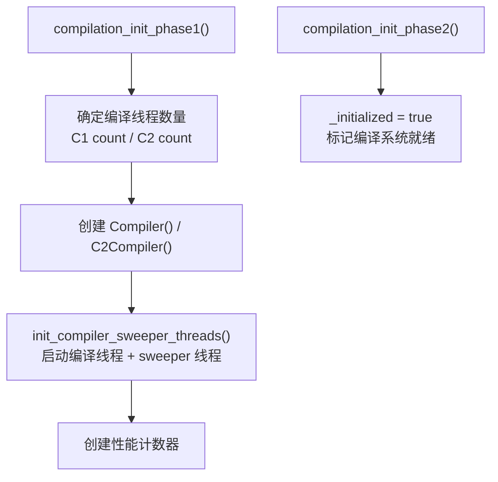

**注意**：在标准 `-Xint` 环境下，`UseCompiler = false`，`compilation_init_phase1` 直接 return，不会创建编译线程。在正常混合模式下会创建多个 CompilerThread。

---

## 六、阶段 4：JSR292 + 模块系统

### 6.1 initialize_jsr292_core_classes

> 源码：`thread.cpp` L3866-3873

```cpp
void Threads::initialize_jsr292_core_classes(TRAPS) {
    TraceTime timer("Initialize java.lang.invoke classes", TRACETIME_LOG(Info, startuptime));

    initialize_class(vmSymbols::java_lang_invoke_MethodHandle(), CHECK);
    initialize_class(vmSymbols::java_lang_invoke_ResolvedMethodName(), CHECK);
    initialize_class(vmSymbols::java_lang_invoke_MemberName(), CHECK);
    initialize_class(vmSymbols::java_lang_invoke_MethodHandleNatives(), CHECK);
}
```

**为什么在编译器初始化之后？** 源码注释说得很清楚：

> Pre-initialize some JSR292 core classes to avoid deadlock during class loading. It is done after compilers are initialized, because otherwise compilations of signature polymorphic MH intrinsics can be missed.

编译器需要识别 MethodHandle 的 signature polymorphic 方法作为 intrinsics，如果 JSR292 类在编译器之前初始化，编译器可能错过这些 intrinsics 的注册。

### 6.2 call_initPhase2：模块系统初始化

> C++ 端：`thread.cpp` L3781-3797
> Java 端：`System.java` L2017-2030

```cpp
static void call_initPhase2(TRAPS) {
    TraceTime timer("Initialize module system", TRACETIME_LOG(Info, startuptime));
    Klass* klass = SystemDictionary::resolve_or_fail(vmSymbols::java_lang_System(), true, CHECK);

    JavaValue result(T_INT);
    JavaCallArguments args;
    args.push_int(DisplayVMOutputToStderr);
    args.push_int(log_is_enabled(Debug, init));
    JavaCalls::call_static(&result, klass, vmSymbols::initPhase2_name(),
                           vmSymbols::boolean_boolean_int_signature(), &args, CHECK);

    if (result.get_jint() != JNI_OK) {
        vm_exit_during_initialization();
    }

    universe_post_module_init();  // Universe::_module_initialized = true
}
```

Java 端：

```java
private static int initPhase2(boolean printToStderr, boolean printStackTrace) {
    try {
        bootLayer = ModuleBootstrap.boot();  // ★ 模块系统启动核心
    } catch (Exception | Error e) {
        logInitException(...);
        return -1;  // JNI_ERR
    }
    VM.initLevel(2);  // ★ 标记第二阶段完成
    return 0;  // JNI_OK
}
```

**关键**：`ModuleBootstrap.boot()` 是 Java 9+ 模块系统的核心入口，它：
- 解析 `--module-path`、`--add-modules` 等参数
- 创建 boot layer 和各模块
- 建立模块间的 requires/exports 关系

**initPhase2 完成后**：
- `VM.initLevel = 2`
- `Universe::_module_initialized = true`
- VM 可以从 `-Xbootclasspath/a` 搜索类

**JVM 日志参数**：`-Xlog:startuptime` 可以看到 `Initialize module system` 的耗时。

---

## 七、阶段 5：安全管理器 + 系统类加载器

### 7.1 call_initPhase3

> C++ 端：`thread.cpp` L3805-3810
> Java 端：`System.java` L2042-2081

```java
private static void initPhase3() {
    // 1. 设置安全管理器（如果 -Djava.security.manager 指定了）
    String cn = System.getProperty("java.security.manager");
    if (cn != null) {
        // 创建并设置 SecurityManager
        System.setSecurityManager(sm);
    }

    // 2. ★ VM.initLevel(3) — 允许创建系统类加载器
    VM.initLevel(3);

    // 3. ★ 初始化系统类加载器
    ClassLoader scl = ClassLoader.initSystemClassLoader();

    // 4. ★ 设置 TCCL（Thread Context ClassLoader）
    Thread.currentThread().setContextClassLoader(scl);

    // 5. ★ VM.initLevel(4) — 系统完全初始化
    VM.initLevel(4);
}
```

**VM.initLevel 状态递进**：

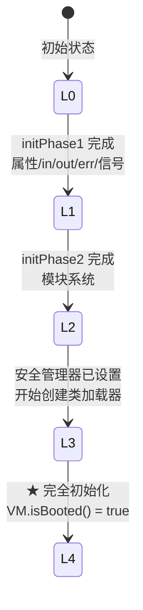

### 7.2 SystemDictionary::compute_java_loaders

> 源码：`systemDictionary.cpp` L130-148

```cpp
void SystemDictionary::compute_java_loaders(TRAPS) {
    // 1. 获取并缓存系统类加载器
    JavaValue result(T_OBJECT);
    JavaCalls::call_static(&result,
                           class_loader_klass,
                           vmSymbols::getSystemClassLoader_name(),     // ClassLoader.getSystemClassLoader()
                           vmSymbols::void_classloader_signature(),
                           CHECK);
    _java_system_loader = (oop)result.get_jobject();

    // 2. 获取并缓存平台类加载器
    JavaCalls::call_static(&result,
                           class_loader_klass,
                           vmSymbols::getPlatformClassLoader_name(),   // ClassLoader.getPlatformClassLoader()
                           vmSymbols::void_classloader_signature(),
                           CHECK);
    _java_platform_loader = (oop)result.get_jobject();
}
```

缓存这两个类加载器是为了后续快速访问，避免每次都通过 JavaCalls 调用。

**GDB 验证**：
```
_java_system_loader   = 0x7ffca57a8
_java_platform_loader = 0x7ffca3d38
```

**类加载器层次**：

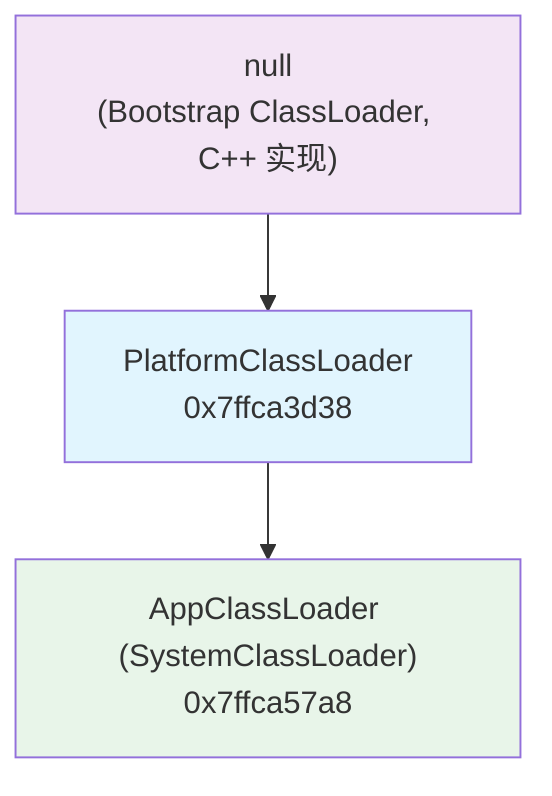

---

## 八、阶段 6：收尾工作

### 8.1 BiasedLocking::init

> 源码：`biasedLocking.cpp` L95-110

```cpp
void BiasedLocking::init() {
    if (UseBiasedLocking) {
        if (BiasedLockingStartupDelay > 0) {
            // 延迟启用：注册一个定时任务
            EnableBiasedLockingTask* task = new EnableBiasedLockingTask(BiasedLockingStartupDelay);
            task->enroll();
        } else {
            // 立即启用：执行 VM_EnableBiasedLocking 操作
            VM_EnableBiasedLocking op(false);
            VMThread::execute(&op);
        }
    }
}
```

**GDB 验证**：
```
UseBiasedLocking       = true
BiasedLockingStartupDelay = 0    ← slowdebug 模式下默认 0，立即启用
```

**为什么要延迟启用？** 在正常模式下 `BiasedLockingStartupDelay = 4000`（4秒）。VM 启动时大量类被加载，频繁触发偏向锁撤销（因为 VM 线程和 main 线程交替访问锁），如果一开始就启用偏向锁，会产生大量无意义的 safepoint 偏向锁撤销操作，拖慢启动。延迟 4 秒后，启动阶段的锁竞争基本结束，此时启用偏向锁才有收益。

### 8.2 call_postVMInitHook

> 源码：`thread.cpp` L1311-1319

```cpp
static void call_postVMInitHook(TRAPS) {
    Klass* klass = SystemDictionary::resolve_or_null(
        vmSymbols::jdk_internal_vm_PostVMInitHook(), THREAD);
    if (klass != NULL) {
        JavaValue result(T_VOID);
        JavaCalls::call_static(&result, klass,
                               vmSymbols::run_method_name(),
                               vmSymbols::void_method_signature(), CHECK);
    }
}
```

调用 `jdk.internal.vm.PostVMInitHook.run()`，这是一个通用的 VM 初始化完成后的钩子。

### 8.3 WatcherThread::start

```cpp
{
    MutexLocker ml(PeriodicTask_lock);
    WatcherThread::make_startable();
    if (PeriodicTask::num_tasks() > 0) {
        WatcherThread::start();
    }
}
```

WatcherThread 是 VM 的"看门狗"线程，定期执行 PeriodicTask：
- 采样统计（StatSampler）
- 内存池清理（Chunk pool cleaner）
- 偏向锁延迟启用任务（如果有延迟的话）

**注意**：WatcherThread 是纯 C++ 线程（不是 JavaThread），不需要 Java Thread 对象。

### 8.4 return JNI_OK

```cpp
create_vm_timer.end();
#ifdef ASSERT
_vm_complete = true;
#endif

return JNI_OK;
```

到此，`Threads::create_vm()` 正式返回，控制权回到 `JNI_CreateJavaVM_inner` → `JNI_CreateJavaVM` → `JavaMain`。

---

## 九、GDB 验证结果

### 9.1 验证环境

```
JVM：-Xms8g -Xmx8g -XX:+UseG1GC -Xint
脚本：new-jvm-md/tmp-file/phase8/verify_phase8.gdb
     new-jvm-md/tmp-file/phase8/verify_phase8_detail.gdb
```

### 9.2 执行顺序验证（按 breakpoint 命中顺序）

| 序号 | 断点 | 说明 |
|:---:|------|------|
| 1 | `Threads::initialize_java_lang_classes` | 进入核心函数 |
| 2 | `thread.cpp:3822` (CompactStrings) | String 初始化后设置 CompactStrings=true |
| 3 | `create_initial_thread_group` | 创建线程组 |
| 4 | `thread.cpp:1177` | system ThreadGroup 创建完成 |
| 5 | `thread.cpp:1186` | main ThreadGroup 创建完成 |
| 6 | `create_initial_thread` | 创建 main Thread |
| 7 | `thread.cpp:1201` | set_threadObj 前（eetop 已设置）|
| 8 | `thread.cpp:3833` | main_thread->set_threadObj |
| 9 | `call_initPhase1` | System.initPhase1() |
| 10 | `quicken_jni_functions` | JNI 快速访问器（UseFastJNIAccessors=true）|
| 11 | `StubCodeDesc::freeze` | 冻结 Stub |
| 12 | `set_init_completed` | _fully_initialized=true |
| 13 | `WatcherThread::start` #1 | 首次（BiasedLocking task 注册触发）|
| 14 | `ServiceThread::initialize` | Service 线程启动 |
| 15 | `CompileBroker::compilation_init_phase1` | 编译器初始化（-Xint 下快速返回）|
| 16 | `Threads::initialize_jsr292_core_classes` | MethodHandle 等 4 个类 |
| 17 | `call_initPhase2` | 模块系统初始化 |
| 18 | `universe_post_module_init` | _module_initialized=true |
| 19 | `call_initPhase3` | 安全管理器 + 类加载器 + TCCL |
| 20 | `SystemDictionary::compute_java_loaders` | 缓存系统/平台类加载器 |
| 21 | `BiasedLocking::init` | UseBiasedLocking=true, Delay=0 |
| 22 | `WatcherThread::start` #2 | 注册新 PeriodicTask 后重启 |
| 23 | `WatcherThread::start` #3 | 最终启动 |
| 24 | `thread.cpp:4306` | **return JNI_OK** — VM 启动完成 |

### 9.3 关键对象验证

| 对象 | 地址 | 说明 |
|------|------|------|
| system ThreadGroup | `0x7ffc06730` | 根线程组，无 parent |
| main ThreadGroup | `0x7ffc067c0` | system 的子组，name="main" |
| main JavaThread* | `0x7ffff001f000` | C++ 线程对象 |
| main Thread oop | `0x7ffc069b0` | Java Thread 实例 |
| Thread.eetop | `0x7ffff001f000` | 正确指回 JavaThread* |
| Thread.tid | `1` | 主线程 ID |
| Thread.threadStatus | `5` (RUNNABLE) | 运行中 |
| Thread.priority | `5` (NORM_PRIORITY) | 默认优先级 |

### 9.4 最终全局状态验证

| 全局变量 | 值 | 说明 |
|----------|-----|------|
| `Universe::_fully_initialized` | `true` | 在 universe_post_init 设置 |
| `Universe::_module_initialized` | `true` | 在 initPhase2 后设置 |
| `_init_completed` | `true` | 在 set_init_completed 设置 |
| `_java_system_loader` | `0x7ffca57a8` | AppClassLoader |
| `_java_platform_loader` | `0x7ffca3d38` | PlatformClassLoader |
| `_main_thread_group` | `0x7ffc067c0` | main ThreadGroup |
| `_system_thread_group` | `0x7ffc06730` | system ThreadGroup |

---

## 十、VM 三阶段初始化与 initLevel 总结

```mermaid
flowchart LR
    subgraph "initPhase1 (L=0→1)"
        A1[系统属性] --> A2[System.in/out/err]
        A2 --> A3[信号处理器]
        A3 --> A4[main 线程加入组]
        A4 --> A5["VM.initLevel(1)"]
    end

    subgraph "initPhase2 (L=1→2)"
        B1["ModuleBootstrap.boot()"] --> B2["VM.initLevel(2)"]
        B2 --> B3["_module_initialized=true"]
    end

    subgraph "initPhase3 (L=2→4)"
        C1[SecurityManager] --> C2["VM.initLevel(3)"]
        C2 --> C3["initSystemClassLoader"]
        C3 --> C4["setContextClassLoader"]
        C4 --> C5["VM.initLevel(4)"]
    end

    A5 --> B1
    B3 --> C1
```

**三阶段之间的关键依赖**：
- initPhase1 必须在 Thread 对象创建后（需要 `Thread.currentThread()`）
- initPhase2 必须在编译器初始化后（需要 JIT 编译模块系统代码以获得性能）
- initPhase2 必须在 JSR292 初始化后（模块系统代码使用 lambda 等特性）
- initPhase3 必须在 initPhase2 后（安全管理器和系统类加载器可能来自非 java.base 模块）

---

## 十一、create_vm 完整后半段时间线

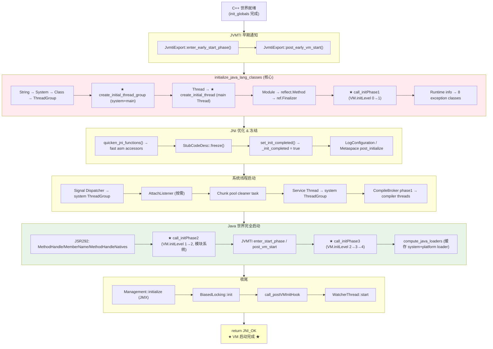

---

## 十二、JVM 日志参数

要观察 Phase 8 的执行过程，可以使用以下 JVM 参数：

```bash
# 查看各阶段耗时
-Xlog:startuptime

# 输出示例：
# [0.123s][info][startuptime] Initialize java.lang classes: 45.678 ms
# [0.234s][info][startuptime] Initialize java.lang.invoke classes: 12.345 ms
# [0.345s][info][startuptime] Initialize module system: 67.890 ms
```

```bash
# 查看类加载过程
-Xlog:class+load=info

# 输出示例：
# [0.050s][info][class,load] java.lang.String source: shared objects file
# [0.051s][info][class,load] java.lang.System source: shared objects file
# [0.052s][info][class,load] java.lang.Class source: shared objects file
# ...
```

```bash
# 查看初始化级别变化
-Xlog:init=debug

# 可以看到 initPhase1/2/3 的日志
```

---

## 十三、关系图

```mermaid
graph TB
    subgraph "create_vm 后半段核心关系"
        CV["Threads::create_vm()"]

        subgraph "Java 核心类初始化"
            IJC["initialize_java_lang_classes"]
            STR["String.<clinit>"]
            SYS["System.<clinit>"]
            CLS["Class.<clinit>"]
            TG["ThreadGroup.<clinit>"]
            THR["Thread.<clinit>"]
            MOD["Module.<clinit>"]
        end

        subgraph "线程创建"
            CITG["create_initial_thread_group"]
            STG["system ThreadGroup<br>0x7ffc06730"]
            MTG["main ThreadGroup<br>0x7ffc067c0"]
            CIT["create_initial_thread"]
            MT["main Thread<br>0x7ffc069b0"]
            JT["JavaThread<br>0x7ffff001f000"]
        end

        subgraph "三阶段 Java 初始化"
            IP1["initPhase1<br>Level: 0→1"]
            IP2["initPhase2<br>Level: 1→2"]
            IP3["initPhase3<br>Level: 2→4"]
        end

        subgraph "系统线程"
            SD["Signal Dispatcher"]
            SVT["Service Thread"]
            CT["Compiler Threads"]
            WT["Watcher Thread"]
        end

        subgraph "收尾"
            QJF["quicken_jni_functions"]
            SCF["StubCodeDesc::freeze"]
            SIC["set_init_completed"]
            CJL["compute_java_loaders"]
            BL["BiasedLocking::init"]
        end
    end

    CV --> IJC
    IJC --> STR --> SYS --> CLS --> TG --> CITG
    CITG --> STG
    CITG --> MTG
    MTG --> THR --> CIT
    CIT --> MT
    MT ---|eetop| JT
    JT ---|_threadObj| MT

    CIT --> IP1
    IP1 --> QJF --> SCF --> SIC
    SIC --> SD --> SVT --> CT
    CT --> IP2 --> IP3
    IP3 --> CJL --> BL --> WT
```

---

## 十四、源文件索引

| 文件 | 关键内容 |
|------|---------|
| `share/runtime/thread.cpp` L1165-1214 | `initialize_class`, `create_initial_thread_group`, `create_initial_thread` |
| `share/runtime/thread.cpp` L3760-3873 | `call_initPhase1/2/3`, `initialize_java_lang_classes`, `initialize_jsr292_core_classes` |
| `share/runtime/thread.cpp` L4120-4306 | `create_vm` 后半段完整序列 |
| `share/oops/instanceKlass.hpp` L131-140, L263-269, L513-521 | `ClassState` 枚举、`_init_state` 字段、状态查询方法 |
| `share/oops/instanceKlass.cpp` L672-684, L892-1038 | `initialize()` 入口、`initialize_impl()` JLS §12.4.2 协议 |
| `share/prims/jni.cpp` L3826-3870 | `quicken_jni_functions` |
| `share/runtime/stubCodeGenerator.cpp` L54-57 | `StubCodeDesc::freeze` |
| `share/runtime/init.cpp` L195-198 | `set_init_completed` |
| `share/runtime/os.cpp` L476-510 | `os::initialize_jdk_signal_support` |
| `share/runtime/serviceThread.cpp` L45-82 | `ServiceThread::initialize` |
| `share/compiler/compileBroker.cpp` L606-758 | `CompileBroker::compilation_init_phase1/2` |
| `share/classfile/systemDictionary.cpp` L130-148 | `compute_java_loaders` |
| `share/runtime/biasedLocking.cpp` L95-110 | `BiasedLocking::init` |
| `share/memory/universe.cpp` L1206-1208 | `universe_post_module_init` |
| `java/lang/System.java` L1937-2081 | `initPhase1/2/3` Java 端实现 |

---

## 十五、常见误解

1. **误解："类加载 = 类初始化"**。实际上类加载（loading）、链接（linking）和初始化（initialization）是三个独立阶段。`initialize_class()` 中的 `resolve_or_fail` 完成加载+链接，`initialize()` 才触发 `<clinit>` 执行。一个类可以被加载和链接但永远不被初始化（如果没有代码触发初始化）。

2. **误解："main 线程的 Thread 对象是通过 `new Thread()` 创建的"**。实际上 main Thread 不能使用标准的 `construct_new_instance`，而是先 `allocate_instance` 分配内存、手动设置 `eetop` 和 `priority`、建立双向绑定，最后才调用 `call_special` 执行构造函数。原因是 Thread 构造函数依赖 `Thread.currentThread()` 能正常工作。

3. **误解："initPhase1/2/3 是 VM 内部的 C++ 逻辑"**。实际上三个 initPhase 都是通过 `JavaCalls::call_static` 调用 Java 端的 `System.initPhase1/2/3()` 方法。VM 只是提供了 C++ 入口封装和错误检查。

4. **误解："VM 启动完成后所有 Java 类都已加载"**。Phase 8 只初始化了约 20 个核心类（15 + 4 JSR292 + 8 异常类中部分重叠），绝大多数类仍然是懒加载——只有在首次使用时才会触发加载和初始化。

---

## 十六、总结

**create_vm 后半段的核心逻辑是三层跨越**：

1. **从 C++ 到 Java**：通过 `initialize_java_lang_classes` 让核心 Java 类活起来，创建第一个 Thread 对象
2. **从单线程到多线程**：启动 Signal Dispatcher、Service Thread、Compiler Threads、Watcher Thread
3. **从受限到完整**：通过 initPhase1→2→3 逐步解锁 Java 世界的完整功能（属性 → 模块 → 类加载器）

**关键数字**（GDB 验证）：
- 15 个核心类在 `initialize_java_lang_classes` 中初始化
- 4 个 JSR292 类在编译器之后初始化
- VM.initLevel 经历 0 → 1 → 2 → 3 → 4 共 4 次升级
- main Thread 的 `eetop = 0x7ffff001f000` 指向 `JavaThread*`，`tid = 1`，`priority = 5`
- 2 个 ThreadGroup（system + main）构成线程组层次结构的根
- 2 个类加载器（system + platform）被缓存到 SystemDictionary

**至此，`Threads::create_vm()` 返回 `JNI_OK`，JVM 启动完成。**
