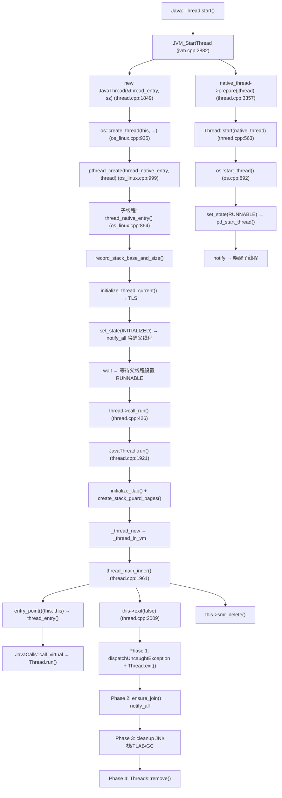
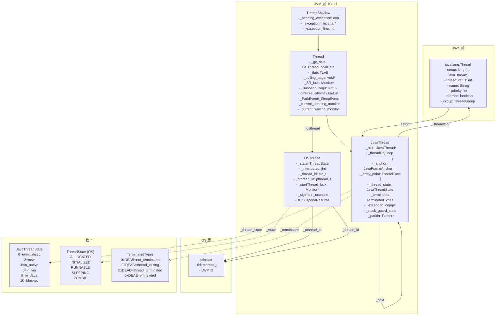

# Day 36：Java 线程生命周期深度剖析

> 纯源码分析，基于 OpenJDK 11 slowdebug
> 方法论：程序 = 数据结构 + 算法
> 标准环境：`-Xms8g -Xmx8g -XX:+UseG1GC -Xint`

---

## 第 0 部分：核心原理 ⭐

### 0.1 本质是什么？

本文深入分析 **Day 36：Java 线程生命周期深度剖析**：从源码角度理解其设计原理、实现机制和关键细节。

### 0.2 为什么需要？

理解 JVM 内部实现是排查复杂问题、进行性能优化的基础。表面的 API 文档无法解释 JVM 的实际行为，只有深入源码才能建立精确的心智模型。

### 0.3 怎么解决？

结合源码阅读、数据结构分析和 GDB 运行时验证，从多个角度建立对该机制的完整理解。

### 0.4 为什么这样设计？

每个设计决策都有其权衡：性能 vs 正确性、简单性 vs 灵活性、内存占用 vs 查找速度。理解这些权衡是理解 JVM 设计的关键。

---


## 一、宏观理解

### 1.1 解决什么问题

Java 线程是 JVM 最核心的执行抽象。当用户调用 `new Thread().start()` 时，JVM 需要：

1. **创建 C++ 层的 JavaThread 对象**，与 Java 层的 `java.lang.Thread` 建立双向关联
2. **通过 `pthread_create` 创建 OS 原生线程**，完成父子线程握手协议
3. **执行 Java 的 `run()` 方法**，通过 `JavaCalls::call_virtual` 回调
4. **线程退出时做 4 阶段清理**，通知 `Thread.join()` 等待者
5. **支持 `sleep`、`interrupt`、`join` 等操作**

本文完整追踪一个 Java 线程从 `Thread.start()` 到 `Thread.run()` 返回、再到线程资源回收的全生命周期。

### 1.2 总体调用链



### 1.3 涉及的数据结构清单

| # | 数据结构 | 源码位置 | 核心作用 |
|---|---------|---------|---------|
| 1 | **ThreadShadow** | exceptions.hpp:60 | Thread 基类的基类，持有 `_pending_exception` |
| 2 | **Thread** | thread.hpp:115 | 所有线程基类，持有 GC 数据、TLS、TLAB、锁、ParkEvent 等 |
| 3 | **JavaThread** | thread.hpp:925 | Java 线程，持有 `_threadObj`、`_thread_state`、`_entry_point`、`_terminated` |
| 4 | **OSThread** | osThread.hpp:56 | OS 层线程抽象，持有 `_state`、`_interrupted`、`_thread_id` |
| 5 | **OSThread (Linux 扩展)** | osThread_linux.hpp | Linux 特有字段：`_pthread_id`、`_startThread_lock`、`sr`、`_ucontext` |
| 6 | **JavaThreadState** 枚举 | globalDefinitions.hpp:890 | 12 个状态，控制 SafePoint 交互 |
| 7 | **ThreadState** 枚举 | osThread.hpp:44 | 9 个 OS 层状态（Legacy），用于 JVMTI 等 |
| 8 | **TerminatedTypes** 枚举 | thread.hpp:1017 | 4 个终止状态，追踪线程退出进度 |
| 9 | **ParkEvent** | thread.hpp:732 | 线程阻塞/唤醒原语（sleep、synchronized、Mutex） |

---

## 二、数据结构全景 ⭐

### 2.1 ThreadShadow（Thread 的祖先类）

**源码**：`exceptions.hpp:60-90`

**解决什么问题**：为所有线程提供统一的异常传递机制（TRAPS/CHECK/THROW 宏体系）。

#### 2.1.1 全部字段

| 偏移 | 字段 | 类型 | 大小 | 含义 |
|------|------|------|------|------|
| +0 | (vptr) | void* | 8B | 虚函数表指针（`unused_initial_virtual()` 强制生成） |
| +8 | `_pending_exception` | oop | 8B | 当前线程的待处理异常 |
| +16 | `_exception_file` | const char* | 8B | 异常发生的文件名（调试用） |
| +24 | `_exception_line` | int | 4B | 异常发生的行号（调试用） |
| +28 | (padding) | - | 4B | 对齐填充 |

**sizeof**：32 字节（含 vptr + padding）

**为什么需要 vptr？** 注释说得很清楚（exceptions.hpp:70-76）：如果 ThreadShadow 没有虚函数，某些 C++ 编译器会把它放在 Thread 对象偏移 4 的位置（跳过 Thread 的 vptr），导致布局不统一。强制加一个虚函数确保 ThreadShadow 的 vptr 和 Thread 的 vptr 共用同一个位置。

#### 2.1.2 关键字段生命周期

**`_pending_exception`**：
- **设置**：`THROW` 宏 → `set_pending_exception(exception, __FILE__, __LINE__)`
- **检查**：`CHECK` 宏 → `if (HAS_PENDING_EXCEPTION) return`
- **清除**：`CLEAR_PENDING_EXCEPTION` 宏 → `set_pending_exception(NULL, NULL, 0)`
- **传播**：异常沿调用栈向上传播，直到被 `catch` 或触发 `dispatchUncaughtException`

---

### 2.2 Thread（所有线程的基类）

**源码**：`thread.hpp:115-760`

**解决什么问题**：为 JVM 中所有线程（Java 线程、VM 线程、GC 线程、编译器线程等）提供统一的基础设施：TLS、GC 支持、TLAB、JNI 句柄、同步原语。

#### 2.2.1 类层次

```
CHeapObj<mtThread>
  └── ThreadShadow            // 异常处理
        └── Thread            // 基础设施
              ├── JavaThread  // Java 线程
              └── NonJavaThread
                    ├── NamedThread → VMThread / ConcurrentGCThread / WorkerThread
                    ├── WatcherThread
                    └── JfrThreadSampler
```

#### 2.2.2 全部关键字段

> 按功能分组，省略纯 debug/product-only 字段

**组 1：TLS 与线程标识**

| 字段 | 类型 | 含义 |
|------|------|------|
| `_thr_current` | static THREAD_LOCAL Thread* | 当前线程 TLS，`Thread::current()` 的数据源 |
| `_real_malloc_address` | void* | 实际 malloc 地址（偏向锁对齐用） |

**组 2：GC 支持**

| 字段 | 类型 | 含义 |
|------|------|------|
| `_gc_data` | GCThreadLocalData | GC 线程本地数据（G1 中包含 SATBMarkQueue + DirtyCardQueue） |
| `_tlab` | ThreadLocalAllocBuffer | 线程本地分配缓冲区（快速路径分配） |
| `_allocated_bytes` | jlong | 该线程累计在堆上分配的字节数 |

**组 3：SMR（Safe Memory Reclamation）**

| 字段 | 类型 | 含义 |
|------|------|------|
| `_threads_hazard_ptr` | ThreadsList* volatile | 危险指针，防止线程列表被回收时还在遍历 |
| `_threads_list_ptr` | SafeThreadsListPtr* | 安全线程列表指针 |
| `_nested_threads_hazard_ptr_cnt` | uint | 嵌套危险指针计数 |

**组 4：Suspend/Resume 支持**

| 字段 | 类型 | 含义 |
|------|------|------|
| `_SR_lock` | Monitor* | 自挂起用的锁（`java_suspend_self` 使用） |
| `_suspend_flags` | volatile uint32_t | 挂起标志位（含 `_external_suspend`/`_has_async_exception` 等） |
| `_num_nested_signal` | int | 嵌套信号处理计数 |

**SuspendFlags 位布局**：

```
bit 31: (unused, avoid sign bit)
bit 30: _ext_suspended       = 0x40000000  线程已自挂起
bit 29: _external_suspend    = 0x20000000  请求线程自挂起
bit 28: _deopt_suspend       = 0x10000000  去优化需要自挂起
bit 2:  _trace_flag          = 0x00000004  调用跟踪后端
bit 1:  _critical_native_unlock = 0x00000002  需要解 JNI critical lock
bit 0:  _has_async_exception = 0x00000001  有待处理的异步异常
```

**组 5：JNI 句柄**

| 字段 | 类型 | 含义 |
|------|------|------|
| `_active_handles` | JNIHandleBlock* | 活跃的 JNI 句柄块 |
| `_free_handle_block` | JNIHandleBlock* | 空闲句柄块（一元素缓存） |
| `_last_handle_mark` | HandleMark* | 最近的 HandleMark |

**组 6：OS 层关联**

| 字段 | 类型 | 含义 |
|------|------|------|
| `_osthread` | OSThread* | 指向 OS 层线程对象 |
| `_stack_base` | address | 栈顶（高地址） |
| `_stack_size` | size_t | 栈大小 |

**组 7：SafePoint 轮询**

| 字段 | 类型 | 含义 |
|------|------|------|
| `_polling_page` | volatile void* | 线程本地轮询页（SafePoint 机制核心） |

**组 8：ObjectMonitor 缓存**

| 字段 | 类型 | 含义 |
|------|------|------|
| `_current_pending_monitor` | ObjectMonitor* | 当前正在等待的 monitor |
| `_current_pending_monitor_is_from_java` | bool | 是否来自 Java 代码 |
| `_current_waiting_monitor` | ObjectMonitor* | 当前 Object.wait() 的 monitor |
| `omFreeList` | ObjectMonitor* | 空闲 ObjectMonitor 链表（线程本地缓存） |
| `omFreeCount` | int | omFreeList 长度 |
| `omFreeProvision` | int | 每次从全局池取的块大小 |
| `omInUseList` | ObjectMonitor* | 使用中 ObjectMonitor 链表 |
| `omInUseCount` | int | omInUseList 长度 |

**组 9：ParkEvent（阻塞/唤醒原语）**

| 字段 | 类型 | 含义 |
|------|------|------|
| `_ParkEvent` | ParkEvent* | synchronized() 使用的 park/unpark |
| `_SleepEvent` | ParkEvent* | Thread.sleep() 使用 |
| `_MutexEvent` | ParkEvent* | JVM 内部 Mutex/Monitor 使用 |
| `_MuxEvent` | ParkEvent* | 低级 muxAcquire/muxRelease 使用 |

**组 10：线程 RNG**

| 字段 | 类型 | 含义 |
|------|------|------|
| `_hashStateW/X/Y/Z` | jint (×4) | Marsaglia Shift-XOR RNG，用于 hashCode 生成 |
| `rng[4]` | volatile jint | 自旋锁 RNG |

#### 2.2.3 创建位置

- **Thread 基类构造**：`Thread::Thread()` 在 `thread.cpp` 中
- **分配方式**：`operator new` → `Thread::allocate(size, true)` → C 堆分配（`os::malloc`），偏向锁场景可能对齐到缓存行

---

### 2.3 JavaThread（Java 线程核心结构）

**源码**：`thread.hpp:925-1174`

**解决什么问题**：在 Thread 基础上添加 Java 线程特有的能力：与 Java Thread 对象双向关联、线程状态机、反优化支持、异常处理、栈保护页。

#### 2.3.1 全部关键字段

**组 1：链表与 Java 对象关联**

| 字段 | 类型 | 含义 |
|------|------|------|
| `_next` | JavaThread* | Threads 全局链表中的下一个 JavaThread |
| `_on_thread_list` | bool | 是否已加入 Threads 全局列表 |
| `_in_asgct` | bool | 是否正在处理 ASGCT 调用 |
| `_threadObj` | oop | **核心**：指向 Java 层 `java.lang.Thread` 对象 |

**组 2：执行入口与栈帧**

| 字段 | 类型 | 含义 |
|------|------|------|
| `_anchor` | JavaFrameAnchor | 最近一次离开 Java 代码时的帧信息（SP/FP/PC） |
| `_entry_point` | ThreadFunction | 线程入口函数指针（`thread_entry`） |
| `_jni_environment` | JNIEnv | 该线程的 JNI 环境 |

**组 3：反优化支持**

| 字段 | 类型 | 含义 |
|------|------|------|
| `_deopt_mark` | DeoptResourceMark* | 反优化时的特殊 ResourceMark |
| `_must_deopt_id` | intptr_t* | 需要反优化的帧 ID |
| `_deopt_nmethod` | CompiledMethod* | 正在被反优化的编译方法 |
| `_vframe_array_head` | vframeArray* | 活跃 vframeArrays 的堆顶 |
| `_vframe_array_last` | vframeArray* | 最近 pop 的 vframeArray |
| `_callee_target` | Method* | i2c adapter 传递被调用方 Method* |

**组 4：VM 返回值传递**

| 字段 | 类型 | 含义 |
|------|------|------|
| `_vm_result` | oop | GC 安全的 oop 返回值 |
| `_vm_result_2` | Metadata* | 非 oop 返回值 |
| `_deferred_card_mark` | MemRegion | 最近慢路径分配的区间（延迟卡标记优化） |

**组 5：线程状态机 ⭐**

| 字段 | 类型 | 含义 |
|------|------|------|
| `_thread_state` | volatile JavaThreadState | **核心**：12 个状态，控制 SafePoint 交互 |
| `_safepoint_state` | ThreadSafepointState* | SafePoint 期间的线程信息 |
| `_saved_exception_pc` | address | 最近隐式异常的 PC |

**组 6：终止与挂起**

| 字段 | 类型 | 含义 |
|------|------|------|
| `_terminated` | volatile TerminatedTypes | 终止状态：`_not_terminated → _thread_exiting → _thread_terminated` |
| `_suspend_equivalent` | volatile bool | 挂起等价条件 |
| `_in_deopt_handler` | jint | 反优化处理器计数 |
| `_doing_unsafe_access` | volatile bool | 正在执行 unsafe 访问（可能导致 fault） |
| `_do_not_unlock_if_synchronized` | bool | 异常时不解锁同步方法的接收者 |

**组 7：JNI Attach 状态**

| 字段 | 类型 | 值 | 含义 |
|------|------|---|------|
| `_jni_attach_state` | volatile JNIAttachStates | `_not_attaching_via_jni=1` | 非 JNI attach |
| | | `_attaching_via_jni=2` | 正在 JNI attach |
| | | `_attached_via_jni=3` | JNI attach 完成 |

**组 8：栈保护页**

| 字段 | 类型 | 含义 |
|------|------|------|
| `_stack_guard_state` | StackGuardState | 栈保护页状态 |
| `_stack_overflow_limit` | address | 栈溢出检查限制（汇编代码使用） |
| `_reserved_stack_activation` | address | 保留栈激活地址 |

**StackGuardState 枚举**：

| 值 | 含义 |
|----|------|
| `stack_guard_unused` | 不需要栈保护页 |
| `stack_guard_reserved_disabled` | 保留区已禁用 |
| `stack_guard_yellow_reserved_disabled` | 黄区+保留区已禁用（栈溢出后临时状态） |
| `stack_guard_enabled` | 正常启用 |

**组 9：编译器异常处理**

| 字段 | 类型 | 含义 |
|------|------|------|
| `_exception_oop` | volatile oop | 编译代码中抛出的异常（**不是** `_pending_exception`） |
| `_exception_pc` | volatile address | 异常发生的 PC |
| `_exception_handler_pc` | volatile address | 异常处理器的 PC |
| `_is_method_handle_return` | volatile int | 当前异常 PC 是否是 MethodHandle 调用点 |

**组 10：监控器支持**

| 字段 | 类型 | 含义 |
|------|------|------|
| `_monitor_chunks` | MonitorChunk* | 栈外 monitor 块（反优化和 JNI MonitorEnter/Exit） |

**组 11：异步请求**

| 字段 | 类型 | 含义 |
|------|------|------|
| `_special_runtime_exit_condition` | AsyncRequests | 待处理的异步请求类型 |
| `_pending_async_exception` | oop | 待处理的异步异常 |

**组 12：JSR 166 支持**

| 字段 | 类型 | 含义 |
|------|------|------|
| `_parker` | Parker* | `LockSupport.park()/unpark()` 使用的 Parker |

#### 2.3.2 sizeof

通过 GDB 验证（slowdebug 含 ASSERT 字段）。预计 Thread 基类 > 1000 字节，JavaThread 在此基础上额外几百字节。将在 GDB 验证阶段精确测量。

#### 2.3.3 创建位置

**两个构造函数**：

```cpp
// thread.hpp:1162-1163
JavaThread(bool is_attaching_via_jni = false);  // 主线程和 JNI attach 线程
JavaThread(ThreadFunction entry_point, size_t stack_size = 0);  // Thread.start() 创建
```

- **普通 Java 线程**：`JVM_StartThread` → `new JavaThread(&thread_entry, sz)` → `os::create_thread()`
- **主线程**：`Threads::create_vm` → `new JavaThread()` → 后续关联到已存在的 OS 线程

#### 2.3.4 `_threadObj` 与 `java.lang.Thread` 的双向关联

```
C++ JavaThread                java.lang.Thread (oop)
┌──────────────┐              ┌──────────────────┐
│ _threadObj ──────────────►  │                  │
│              │              │ eetop ────────────────► C++ JavaThread*
│              │   ◄──────────│                  │
└──────────────┘              └──────────────────┘
```

- **正向**：`JavaThread::set_threadObj(thread_oop())` — 在 `prepare()` 中设置
- **反向**：`java_lang_Thread::set_thread(thread_oop(), this)` — 同样在 `prepare()` 中
- **断开**：`ensure_join()` 中 `java_lang_Thread::set_thread(threadObj(), NULL)` — 使 `isAlive()` 返回 false

---

### 2.4 OSThread（OS 层线程抽象）

**源码**：`osThread.hpp:56-110` + `osThread_linux.hpp`

**解决什么问题**：封装 OS 层的线程信息（pthread id、内核 tid、中断状态），以及父子线程创建时的握手同步。

#### 2.4.1 全部字段（共享 + Linux 特有）

**共享字段**（osThread.hpp）：

| 字段 | 类型 | 大小 | 含义 |
|------|------|------|------|
| `_start_proc` | OSThreadStartFunc | 8B | 线程启动函数指针 |
| `_start_parm` | void* | 8B | 启动函数参数 |
| `_state` | volatile ThreadState | 4B | OS 层线程状态（9 种） |
| `_interrupted` | volatile jint | 4B | 中断标志（0 或 1） |
| `_thread_id` | thread_id_t (pid_t) | 4B | 内核线程 ID（`/proc` 可见） |

**Linux 特有字段**（osThread_linux.hpp）：

| 字段 | 类型 | 大小 | 含义 |
|------|------|------|------|
| `_thread_type` | int | 4B | 线程类型（`os::java_thread` / `os::compiler_thread`） |
| `_pthread_id` | pthread_t | 8B | pthread ID（`pthread_kill` 等使用） |
| `_caller_sigmask` | sigset_t | 128B | 调用者信号掩码 |
| `sr` | os::SuspendResume | - | 信号挂起/恢复支持 |
| `_siginfo` | void* | 8B | SR_handler 保存的信号信息 |
| `_ucontext` | ucontext_t* | 8B | SR_handler 保存的上下文 |
| `_expanding_stack` | int | 4B | 是否正在手动扩展栈 |
| `_alt_sig_stack` | address | 8B | 备用信号栈地址 |
| `_startThread_lock` | Monitor* | 8B | **核心**：父子线程创建握手的同步锁 |

#### 2.4.2 创建位置

```cpp
// os_linux.cpp:941
OSThread* osthread = new OSThread(NULL, NULL);  // CHeapObj 分配
osthread->set_thread_type(thr_type);
osthread->set_state(ALLOCATED);
thread->set_osthread(osthread);
```

在 `os::create_thread()` 中创建，立即关联到 JavaThread。

#### 2.4.3 `_interrupted` 字段生命周期

```
初始值: 0（未中断）
设置: os::interrupt() → osthread->set_interrupted(true)  → 值变为 1
读取: os::is_interrupted(thread, clear) → osthread->interrupted()
清除: 如果 clear_interrupted==true，set_interrupted(false) → 值变为 0
```

**设计决策**（osThread.hpp:65-68）：`_interrupted` 必须是 `jint` 类型，因为 Java intrinsic 需要直接访问它。Java 可以通过 `Thread::current()->_osthread->_interrupted` 的双重间接引用来模拟 `Thread.currentThread().isInterrupted()`。

---

### 2.5 JavaThreadState 枚举（12 个状态）

**源码**：`globalDefinitions.hpp:890-903`

**解决什么问题**：精确控制线程与 SafePoint 的交互。JVM 必须知道每个线程当前在执行什么类型的代码，才能安全地在 SafePoint 暂停它。

#### 2.5.1 完整值域图

```
┌──────────────────────────────────────────────────────────────────┐
│                    JavaThreadState 状态机                         │
├──────────────────────────────────────────────────────────────────┤
│                                                                  │
│  _thread_uninitialized = 0    未初始化（不应出现）                  │
│                                                                  │
│  _thread_new           = 2    新建，正在初始化                     │
│  _thread_new_trans     = 3    new 的过渡状态                       │
│                                                                  │
│  _thread_in_native     = 4    ★ 在 native 代码中（JNI 调用）      │
│  _thread_in_native_trans = 5  native → 其他 的过渡                 │
│                                                                  │
│  _thread_in_vm         = 6    ★ 在 VM 代码中（C++ runtime）       │
│  _thread_in_vm_trans   = 7    vm → 其他 的过渡                     │
│                                                                  │
│  _thread_in_Java       = 8    ★ 在 Java/Stub 代码中               │
│  _thread_in_Java_trans = 9    Java → 其他 的过渡                   │
│                                                                  │
│  _thread_blocked       = 10   ★ 在 VM 中阻塞（等待锁/条件变量）   │
│  _thread_blocked_trans = 11   blocked → 其他 的过渡                │
│                                                                  │
│  _thread_max_state     = 12   上界（统计用）                       │
│                                                                  │
└──────────────────────────────────────────────────────────────────┘

规律：xxxx_trans = xxxx + 1

SafePoint 安全状态：_thread_blocked, _thread_in_native
（这两个状态的线程在 SafePoint 时不需要暂停，因为它们不会修改 Java 堆）

需要暂停的状态：_thread_in_Java（轮询 polling page）
                _thread_in_vm（检查 SafePoint flag）
```

#### 2.5.2 线程生命周期中的状态转换

```
创建:     _thread_uninitialized (0) → _thread_new (2)        [构造函数]
启动:     _thread_new (2) → _thread_in_vm (6)                [JavaThread::run()]
执行Java:  _thread_in_vm (6) ⇄ _thread_in_Java (8)           [call_virtual/返回]
JNI调用:  _thread_in_Java (8) → _thread_in_native (4) → (8) [JNI enter/exit]
阻塞:    _thread_in_vm (6) → _thread_blocked (10) → (6)    [获取锁/释放锁]
退出:     最终回到 _thread_in_vm，不再转换
```

---

### 2.6 ThreadState 枚举（OS 层 9 个状态）

**源码**：`osThread.hpp:44-54`

**解决什么问题**：Legacy 机制，主要给 JVMTI 和外部工具提供线程状态信息。注释明确说："ThreadState is legacy code and is not correctly implemented. Uses of ThreadState need to be replaced by the state in the JavaThread."

#### 2.6.1 完整值域图

```
┌────────────────────────────────────────────────────┐
│              OSThread ThreadState                   │
├────────────────────────────────────────────────────┤
│                                                    │
│  ALLOCATED       pthread 内存已分配，未初始化        │
│      ↓                                             │
│  INITIALIZED     子线程已初始化，等待父线程唤醒       │
│      ↓                                             │
│  RUNNABLE        正在运行                           │
│      │                                             │
│      ├── MONITOR_WAIT    等待 contended monitor     │
│      ├── CONDVAR_WAIT    等待条件变量                │
│      ├── OBJECT_WAIT     Object.wait()              │
│      ├── BREAKPOINTED    在断点暂停                  │
│      ├── SLEEPING        Thread.sleep()             │
│      │                                             │
│  ZOMBIE          已结束，待回收                      │
│                                                    │
└────────────────────────────────────────────────────┘
```

#### 2.6.2 RAII 辅助类

```cpp
// osThread.hpp:114-130 — OSThreadWaitState
OSThreadWaitState(osthread, is_object_wait) {
    _old_state = osthread->get_state();
    osthread->set_state(is_object_wait ? OBJECT_WAIT : CONDVAR_WAIT);
}
~OSThreadWaitState() { _osthread->set_state(_old_state); }

// osThread.hpp:134-146 — OSThreadContendState
OSThreadContendState(osthread) {
    _old_state = osthread->get_state();
    osthread->set_state(MONITOR_WAIT);
}
~OSThreadContendState() { _osthread->set_state(_old_state); }
```

---

### 2.7 TerminatedTypes 枚举

**源码**：`thread.hpp:1017-1023`

**解决什么问题**：追踪 JavaThread 退出的精确阶段，防止并发访问已销毁的线程。

#### 2.7.1 完整值域图

```
┌──────────────────────────────────────────────────────────────────┐
│                   TerminatedTypes 状态机                          │
├──────────────────────────────────────────────────────────────────┤
│                                                                  │
│  _not_terminated  = 0xDEAD - 2 = 0xDEAB (57003)                 │
│     │  正常运行的线程                                              │
│     ↓                                                            │
│  _thread_exiting  = 0xDEAC (57004)                               │
│     │  JavaThread::exit() 已被调用                                │
│     ↓                                                            │
│  _thread_terminated = 0xDEAD (57005)                             │
│     │  线程已从 Threads 列表移除                                   │
│     ↓                                                            │
│  _vm_exited        = 0xDEAE (57006)                              │
│        VM 已终止，但线程仍在执行 native 代码                       │
│        只有 VM_Exit 能设置此值                                     │
│                                                                  │
└──────────────────────────────────────────────────────────────────┘

正常路径：_not_terminated → _thread_exiting → _thread_terminated
VM 退出：_not_terminated → _vm_exited（跳过中间状态）
```

**为什么用 `0xDEAD - 2` 而不是 `0`？** 使用魔数可以更容易地在内存转储中识别线程状态，区分未初始化的零值和真正的"未终止"状态。

#### 2.7.2 `_terminated` 字段生命周期

| 时机 | 设置者 | 值 | 位置 |
|------|--------|---|------|
| 构造 | JavaThread 构造函数 | `_not_terminated` | thread.cpp |
| 退出开始 | `JavaThread::exit()` | `_thread_exiting` | thread.cpp:2086 |
| 移除完成 | `Threads::remove()` | `_thread_terminated` | thread.cpp |
| VM 退出 | `VM_Exit` | `_vm_exited` | thread.cpp |

---

### 2.8 ParkEvent

**源码**：`thread.hpp:732-734`

**解决什么问题**：提供比 `pthread_cond_wait` 更轻量的阻塞/唤醒原语，每个线程预分配，避免动态创建开销。

Thread 基类中有 **4 个 ParkEvent**，各有专用用途：

| 字段 | 用途 | 使用场景 |
|------|------|---------|
| `_ParkEvent` | synchronized() | ObjectMonitor 的 `enter()/exit()` |
| `_SleepEvent` | Thread.sleep() | `os::sleep()` → `slp->park(millis)` |
| `_MutexEvent` | JVM 内部 Mutex/Monitor | native 层同步原语 |
| `_MuxEvent` | 低级 mux 操作 | `muxAcquire/muxRelease` |

另外 JavaThread 还有一个 **Parker**（`_parker`），专用于 JSR 166 的 `LockSupport.park()/unpark()`。

---

## 三、算法/流程分析

### 3.1 Thread.start() 完整调用链

#### 3.1.1 解决什么问题

把一个 Java 层的 `new Thread()` 对象变成一个真正在 OS 上运行的线程。需要解决：
- C++ JavaThread 对象创建与 Java Thread 对象的双向关联
- OS 原生线程创建（pthread_create）
- 父子线程之间的安全握手（确保子线程初始化完成后再开始执行）
- 线程状态正确设置（Java 层 RUNNABLE、OS 层 RUNNABLE、JVM 层 `_thread_new`）

#### 3.1.2 核心思路

**两阶段握手协议**：父线程创建 pthread 后等待子线程初始化完成（ALLOCATED→INITIALIZED），然后父线程设置状态为 RUNNABLE 并唤醒子线程开始执行。

#### 3.1.3 步骤分解（8 步）

**Step 1：JVM_StartThread — JNI 入口**

```cpp
// jvm.cpp:2882-2968
JVM_ENTRY(void, JVM_StartThread(JNIEnv* env, jobject jthread))
    JVMWrapper("JVM_StartThread");
    JavaThread* native_thread = NULL;
    bool throw_illegal_thread_state = false;
    {
        MutexLocker mu(Threads_lock);  // ★ 持锁保护 Threads 全局列表

        // 检查线程是否已经启动过
        if (java_lang_Thread::thread(JNIHandles::resolve_non_null(jthread)) != NULL) {
            throw_illegal_thread_state = true;  // ★ 重复调用 start()
        } else {
            jlong size = java_lang_Thread::stackSize(JNIHandles::resolve_non_null(jthread));
            size_t sz = size > 0 ? (size_t)size : 0;  // ★ 0 表示使用默认栈大小

            // Step 2: 创建 C++ JavaThread 对象
            native_thread = new JavaThread(&thread_entry, sz);

            if (native_thread->osthread() != NULL) {
                // Step 3: 建立双向关联
                native_thread->prepare(jthread);
            }
        }
    }
    // ... 异常检查 ...
    // Step 7: 启动子线程
    Thread::start(native_thread);
JVM_END
```

**为什么要在 `Threads_lock` 下执行？** 因为需要修改全局线程列表，`prepare()` 内部会调用 `Threads::add()`。

**Step 2：JavaThread 构造函数 — 创建 C++ 对象 + OS 线程**

```cpp
// thread.cpp:1849-1871
JavaThread::JavaThread(ThreadFunction entry_point, size_t stack_sz) :
        Thread() {                    // ★ 先调用 Thread 基类构造
    initialize();                     // ★ 初始化所有成员变量为安全默认值
    _jni_attach_state = _not_attaching_via_jni;
    set_entry_point(entry_point);     // ★ _entry_point = &thread_entry

    os::ThreadType thr_type = entry_point == &compiler_thread_entry
                              ? os::compiler_thread : os::java_thread;
    os::create_thread(this, thr_type, stack_sz);  // ★ 创建 OS 线程
    // 注意：此时线程已创建但处于 SUSPENDED 状态（等待 notify）
    // 创建者必须显式调用 Thread::start() 启动，并调用 Threads::add 加入列表
}
```

**设计决策**：为什么构造函数中不直接启动线程？因为此时 JavaThread 对象还未完全初始化（没有关联 Java Thread 对象），如果线程立即运行会访问到 NULL 的 `_threadObj`。

**Step 3：os::create_thread — 创建 pthread**

```cpp
// os_linux.cpp:935-1056
bool os::create_thread(Thread* thread, ThreadType thr_type, size_t req_stack_size) {
    // 1. 创建 OSThread 对象
    OSThread* osthread = new OSThread(NULL, NULL);  // ★ CHeapObj 分配
    osthread->set_thread_type(thr_type);
    osthread->set_state(ALLOCATED);                 // ★ 初始状态 = ALLOCATED
    thread->set_osthread(osthread);                 // ★ 关联到 JavaThread

    // 2. 配置 pthread 属性
    pthread_attr_t attr;
    pthread_attr_init(&attr);
    pthread_attr_setdetachstate(&attr, PTHREAD_CREATE_DETACHED);  // ★ DETACHED 模式
    // DETACHED 表示线程结束后自动回收资源，不需要 pthread_join

    // 3. 计算栈大小
    size_t stack_size = os::Posix::get_initial_stack_size(thr_type, req_stack_size);
    size_t guard_size = os::Linux::default_guard_size(thr_type);
    if (stack_size <= SIZE_MAX - guard_size) {
        stack_size += guard_size;  // ★ Linux NPTL bug：guard size 从 stack size 中扣除
    }
    pthread_attr_setstacksize(&attr, stack_size);
    pthread_attr_setguardsize(&attr, os::Linux::default_guard_size(thr_type));

    // 4. 创建 pthread（重试 3 次）
    pthread_t tid;
    int ret = 0;
    int limit = 3;
    do {
        ret = pthread_create(&tid, &attr,
                             (void*(*)(void*))thread_native_entry,  // ★ 入口 = thread_native_entry
                             thread);                                // ★ 参数 = JavaThread*
    } while (ret == EAGAIN && limit-- > 0);  // ★ EAGAIN = 资源暂时不足，重试
    // ...
    osthread->set_pthread_id(tid);  // ★ 保存 pthread id

    // 5. 等待子线程初始化完成
    {
        Monitor* sync_with_child = osthread->startThread_lock();
        MutexLockerEx ml(sync_with_child, Mutex::_no_safepoint_check_flag);
        while ((state = osthread->get_state()) == ALLOCATED) {  // ★ 轮询等待
            sync_with_child->wait(Mutex::_no_safepoint_check_flag);
        }
    }
    // 返回时，子线程状态已变为 INITIALIZED
    assert(state == INITIALIZED, "race condition");
    return true;
}
```

**设计决策**：
- **PTHREAD_CREATE_DETACHED**：JVM 自己管理线程生命周期，不需要 pthread_join 来回收资源
- **重试 3 次 EAGAIN**：在高并发场景下，`pthread_create` 可能因为临时资源不足而失败
- **Linux NPTL stack size bug**：POSIX 标准要求 guard size 加在 stack size 之上，但 Linux NPTL 从 stack size 中扣除，所以 JVM 手动补偿

**Step 4：thread_native_entry — 子线程执行入口**

```cpp
// os_linux.cpp:863-933
static void* thread_native_entry(Thread* thread) {  // ★ pthread 回调，参数是 JavaThread*
    thread->record_stack_base_and_size();            // ★ 记录栈基址和大小
    thread->initialize_thread_current();             // ★ 设置 TLS，使 Thread::current() 可用

    OSThread* osthread = thread->osthread();
    Monitor* sync = osthread->startThread_lock();

    osthread->set_thread_id(os::current_thread_id());  // ★ 记录内核 tid

    os::Linux::hotspot_sigmask(thread);  // ★ 初始化信号掩码
    os::Linux::init_thread_fpu_state();  // ★ 初始化浮点控制寄存器

    // ===== 握手协议：通知父线程 =====
    {
        MutexLockerEx ml(sync, Mutex::_no_safepoint_check_flag);

        osthread->set_state(INITIALIZED);  // ★ ALLOCATED → INITIALIZED
        sync->notify_all();                // ★ 唤醒父线程（正在 wait）

        // ===== 握手协议：等待父线程 =====
        while (osthread->get_state() == INITIALIZED) {
            sync->wait(Mutex::_no_safepoint_check_flag);  // ★ 等待父线程设置 RUNNABLE
        }
    }

    // ===== 父线程已唤醒我们，开始正式执行 =====
    thread->call_run();  // → Thread::call_run() → JavaThread::run()

    thread = NULL;  // ★ 防止悬挂指针
    return 0;
}
```

**握手协议时序图**：

```
父线程 (Thread.start() 调用者)              子线程 (pthread)
═══════════════════════════               ═══════════════════════
pthread_create()                          →  thread_native_entry()
                                              record_stack_base_and_size()
                                              initialize_thread_current()
                                              set_thread_id()
                                              hotspot_sigmask()
wait(ALLOCATED→INITIALIZED)  ←── notify ── set_state(INITIALIZED)
  ↓ 被唤醒                                   wait(INITIALIZED→RUNNABLE)
prepare(jthread)                                  ↑
Thread::start()                                   │
  → set_thread_status(RUNNABLE)                   │
  → os::start_thread()                            │
    → set_state(RUNNABLE)                         │
    → pd_start_thread()                           │
      → notify ──────────────────────────► 被唤醒！
                                              call_run()
                                              → JavaThread::run()
```

**Step 5：JavaThread::prepare — 建立双向关联**

```cpp
// thread.cpp:3357-3387
void JavaThread::prepare(jobject jni_thread, ThreadPriority prio) {
    assert(Threads_lock->owner() == Thread::current(), "must have threads lock");

    Handle thread_oop(Thread::current(),
                      JNIHandles::resolve_non_null(jni_thread));  // ★ JNI handle → oop

    // 正向关联：C++ → Java
    set_threadObj(thread_oop());           // ★ _threadObj = java.lang.Thread oop

    // 反向关联：Java → C++
    java_lang_Thread::set_thread(thread_oop(), this);  // ★ eetop = JavaThread*

    if (prio == NoPriority) {
        prio = java_lang_Thread::priority(thread_oop());
    }
    // ... 设置线程优先级 ...
    // ... Threads::add(this) 加入全局列表 ...
}
```

**Step 6：Thread::start — 设置 Java 层状态并启动**

```cpp
// thread.cpp:562-579
void Thread::start(Thread* thread) {
    if (!DisableStartThread) {
        if (thread->is_Java_thread()) {
            // ★ 在启动线程之前设置 Java 层状态为 RUNNABLE
            // 必须在启动前设置，因为启动后我们不知道线程的精确状态
            java_lang_Thread::set_thread_status(
                ((JavaThread*)thread)->threadObj(),
                java_lang_Thread::RUNNABLE);
        }
        os::start_thread(thread);
    }
}
```

**Step 7：os::start_thread + pd_start_thread — 唤醒子线程**

```cpp
// os.cpp:892-898
void os::start_thread(Thread* thread) {
    MutexLockerEx ml(thread->SR_lock(), Mutex::_no_safepoint_check_flag);
    OSThread* osthread = thread->osthread();
    osthread->set_state(RUNNABLE);  // ★ INITIALIZED → RUNNABLE
    pd_start_thread(thread);
}

// os_linux.cpp:1144-1150
void os::pd_start_thread(Thread* thread) {
    OSThread* osthread = thread->osthread();
    Monitor* sync_with_child = osthread->startThread_lock();
    MutexLockerEx ml(sync_with_child, Mutex::_no_safepoint_check_flag);
    sync_with_child->notify();  // ★ 唤醒子线程（正在 wait INITIALIZED→RUNNABLE）
}
```

**Step 8：子线程开始执行**

子线程被唤醒后，`thread_native_entry` 中的 while 循环检测到 `state != INITIALIZED`（已变为 RUNNABLE），退出循环，调用 `thread->call_run()` 进入真正的 Java 代码执行。

---

### 3.2 JavaThread::run() — 线程执行主流程

#### 3.2.1 解决什么问题

子线程被唤醒后，从 OS 线程入口进入 Java 代码执行的桥梁。需要：初始化 TLAB、创建栈保护页、状态转换、最终调用 Java 的 `Thread.run()`。

#### 3.2.2 调用链

```
thread_native_entry()
  → thread->call_run()              [thread.cpp:426]
    → register_thread_stack_with_NMT()   // NMT 注册
    → Jfr::on_thread_start(this)         // JFR 事件
    → this->run()                        // 多态调用 → JavaThread::run()
```

#### 3.2.3 JavaThread::run() 源码

```cpp
// thread.cpp:1921-1958
void JavaThread::run() {
    this->initialize_tlab();              // ★ 初始化 TLAB（快速路径分配）

    this->record_base_of_stack_pointer(); // ★ 记录栈基址指针，用于验证栈回溯

    this->create_stack_guard_pages();     // ★ 创建栈保护页（Yellow/Red/Reserved Zone）

    this->cache_global_variables();       // ★ 缓存全局变量到线程本地

    // ★★★ 关键状态转换：_thread_new → _thread_in_vm
    // 此转换表示线程已完全初始化，可以参与 SafePoint
    ThreadStateTransition::transition_and_fence(this, _thread_new, _thread_in_vm);

    this->set_active_handles(JNIHandleBlock::allocate_block());  // ★ 分配 JNI 句柄块

    if (JvmtiExport::should_post_thread_life()) {
        JvmtiExport::post_thread_start(this);   // ★ JVMTI 通知
    }

    // ★ 调用另一个函数完成剩余工作
    // 设计目的：确保后续栈地址都在当前帧之下（栈向低地址增长）
    thread_main_inner();
}
```

**为什么要单独调一个 `thread_main_inner`？** 注释说 "We call another function to do the rest so we are sure that the stack addresses used from there will be lower than the stack base just computed"。通过增加一层函数调用，确保 Java 代码的栈帧位于 `stack_base` 之下。

#### 3.2.4 thread_main_inner() 源码

```cpp
// thread.cpp:1961-1983
void JavaThread::thread_main_inner() {
    assert(JavaThread::current() == this, "sanity check");
    assert(this->threadObj() != NULL, "just checking");

    // ★ 检查没有待处理异常且线程没有被 stop()
    if (!this->has_pending_exception() &&
        !java_lang_Thread::is_stillborn(this->threadObj())) {
        {
            ResourceMark rm(this);
            this->set_native_thread_name(this->get_thread_name());
            // ★ 设置 OS 层线程名（在 /proc/self/task/<tid>/comm 中可见）
        }
        HandleMark hm(this);
        this->entry_point()(this, this);  // ★★★ 调用 entry_point = thread_entry
    }

    DTRACE_THREAD_PROBE(stop, this);

    this->exit(false);      // ★ 4 阶段退出清理
    this->smr_delete();     // ★ SMR 安全删除
}
```

#### 3.2.5 thread_entry() — 回调 Java 的 run()

```cpp
// jvm.cpp:2867-2879
static void thread_entry(JavaThread* thread, TRAPS) {
    HandleMark hm(THREAD);
    Handle obj(THREAD, thread->threadObj());  // ★ 获取 java.lang.Thread 对象
    JavaValue result(T_VOID);
    JavaCalls::call_virtual(&result,
                            obj,                                  // receiver = java.lang.Thread
                            SystemDictionary::Thread_klass(),     // class = java.lang.Thread
                            vmSymbols::run_method_name(),         // method = "run"
                            vmSymbols::void_method_signature(),   // sig = "()V"
                            THREAD);                              // 异常传递
}
```

**执行链总结**：
```
thread_native_entry → call_run → JavaThread::run() → thread_main_inner()
  → entry_point()(this, this)  // = thread_entry(this, this)
    → JavaCalls::call_virtual → Thread.run()
      → Runnable.run()  // 如果用户通过 Runnable 方式
```

---

### 3.3 JavaThread::exit() — 4 阶段退出清理

#### 3.3.1 解决什么问题

线程退出时需要有序清理：分发未捕获异常、通知 `Thread.join()` 等待者、释放所有资源、从全局列表移除。

#### 3.3.2 4 个阶段

```cpp
// thread.cpp:2009-2208+
void JavaThread::exit(bool destroy_vm, ExitType exit_type) {
```

**Phase 1：Java 层回调（thread.cpp:2009-2106）**

```cpp
    // 1a. 分发未捕获异常
    Handle uncaught_exception(this, this->pending_exception());
    this->clear_pending_exception();

    if (!destroy_vm) {
        if (uncaught_exception.not_null()) {
            // ★ 调用 Thread.dispatchUncaughtException()
            // 这会触发用户设置的 UncaughtExceptionHandler
            JavaCalls::call_virtual(&result, threadObj, thread_klass,
                vmSymbols::dispatchUncaughtException_name(),
                vmSymbols::throwable_void_signature(),
                uncaught_exception, THREAD);
        }

        // 1b. 调用 Thread.exit()（移出 ThreadGroup）
        // 重试 3 次，防止 Thread.stop() 干扰
        if (!is_Compiler_thread()) {
            int count = 3;
            while (java_lang_Thread::threadGroup(threadObj()) != NULL && (count-- > 0)) {
                JavaCalls::call_virtual(&result, threadObj, thread_klass,
                    vmSymbols::exit_method_name(),      // ★ "exit"
                    vmSymbols::void_method_signature(),  // ★ "()V"
                    THREAD);
                CLEAR_PENDING_EXCEPTION;
            }
        }

        // 1c. JVMTI 通知
        if (JvmtiExport::should_post_thread_life()) {
            JvmtiExport::post_thread_end(this);
        }

        // 1d. 设置 _terminated = _thread_exiting
        // 需要在 SR_lock 下检查是否有 external suspend 请求
        while (true) {
            MutexLockerEx ml(SR_lock(), Mutex::_no_safepoint_check_flag);
            if (!is_external_suspend()) {
                set_terminated(_thread_exiting);  // ★ _not_terminated → _thread_exiting
                break;
            }
            // 如果有 external suspend，先执行自挂起再重试
        }
    }
```

**Phase 2：ensure_join — 通知等待者（thread.cpp:2116-2123）**

```cpp
    bool daemon = is_daemon(threadObj());

    // ★★★ 通知所有调用 Thread.join() 的线程
    ensure_join(this);
```

```cpp
// thread.cpp:1986-2001
static void ensure_join(JavaThread* thread) {
    Handle threadObj(thread, thread->threadObj());
    ObjectLocker lock(threadObj, thread);      // ★ 锁住 java.lang.Thread 对象
    thread->clear_pending_exception();

    // ★ 设置 Java 层状态为 TERMINATED
    java_lang_Thread::set_thread_status(threadObj(), java_lang_Thread::TERMINATED);

    // ★★★ 断开 Java Thread → C++ JavaThread 的反向关联
    // 这使得 Thread.isAlive() 返回 false
    java_lang_Thread::set_thread(threadObj(), NULL);

    // ★★★ 唤醒所有在 Thread.join() 中等待的线程
    // join() 内部是 while (isAlive()) { wait(0); }
    // 这里 notify_all 之后，等待线程会检查 isAlive()=false，退出 join
    lock.notify_all(thread);

    thread->clear_pending_exception();
}
```

**Thread.join() 的实现原理**：Java 层的 `Thread.join()` 是 `synchronized(this)` + `while (isAlive()) wait(0)`。`ensure_join()` 做的就是：设 TERMINATED → 清 eetop → `notify_all`。等待线程被唤醒后检查 `isAlive()` = false（因为 eetop 已被清为 NULL），退出循环。

**Phase 3：资源清理（thread.cpp:2128-2192）**

```cpp
    // 3a. 释放 JNI 持有的 monitor（如果是 JNI detach）
    if (exit_type == jni_detach || ObjectMonitor::Knob_ExitRelease) {
        ObjectSynchronizer::release_monitors_owned_by_thread(this);
    }

    // 3b. 释放 JNI 句柄块
    if (active_handles() != NULL) {
        JNIHandleBlock* block = active_handles();
        set_active_handles(NULL);
        JNIHandleBlock::release_block(block);
    }
    if (free_handle_block() != NULL) {
        JNIHandleBlock* block = free_handle_block();
        set_free_handle_block(NULL);
        JNIHandleBlock::release_block(block);
    }

    // 3c. 移除栈保护页
    remove_stack_guard_pages();

    // 3d. 退役 TLAB
    if (UseTLAB) {
        tlab().make_parsable(true);  // ★ 使 TLAB 对 GC 可解析
    }

    // 3e. JVMTI 清理
    if (JvmtiEnv::environments_might_exist()) {
        JvmtiExport::cleanup_thread(this);
    }

    // 3f. GC 屏障清理（刷 SATB 缓冲区和脏卡队列）
    BarrierSet::barrier_set()->on_thread_detach(this);
```

**Phase 4：从全局列表移除（thread.cpp:2194）**

```cpp
    // ★ 从 Threads 链表中移除
    // 如果是最后一个非 daemon 线程，会通知 VM 线程进行 VM 退出
    Threads::remove(this, daemon);
```

---

### 3.4 Thread.sleep() 实现

#### 3.4.1 解决什么问题

让当前线程休眠指定毫秒数，同时支持中断唤醒。

#### 3.4.2 调用链

```
Java: Thread.sleep(millis)
  → JVM_Sleep (jvm.cpp:3123)
    → 中断检查
    → os::sleep(thread, millis, true) (os_posix.cpp:657)
      → ParkEvent::park(millis) 循环
```

#### 3.4.3 JVM_Sleep 源码

```cpp
// jvm.cpp:3123-3166
JVM_ENTRY(void, JVM_Sleep(JNIEnv* env, jclass threadClass, jlong millis))
    if (millis < 0) {
        THROW_MSG(vmSymbols::java_lang_IllegalArgumentException(), "timeout value is negative");
    }

    // ★ 先检查中断标志（清除式检查）
    if (Thread::is_interrupted(THREAD, true) && !HAS_PENDING_EXCEPTION) {
        THROW_MSG(vmSymbols::java_lang_InterruptedException(), "sleep interrupted");
    }

    JavaThreadSleepState jtss(thread);  // ★ RAII：进入 SLEEPING 状态

    if (millis == 0) {
        os::naked_yield();  // ★ sleep(0) = 让出 CPU
    } else {
        ThreadState old_state = thread->osthread()->get_state();
        thread->osthread()->set_state(SLEEPING);  // ★ OSThread 状态 → SLEEPING

        if (os::sleep(thread, millis, true) == OS_INTRPT) {
            // ★ 被中断唤醒
            if (!HAS_PENDING_EXCEPTION) {
                THROW_MSG(vmSymbols::java_lang_InterruptedException(), "sleep interrupted");
            }
        }
        thread->osthread()->set_state(old_state);  // ★ 恢复旧状态
    }
JVM_END
```

#### 3.4.4 os::sleep 源码

```cpp
// os_posix.cpp:657-727
int os::sleep(Thread* thread, jlong millis, bool interruptible) {
    ParkEvent* const slp = thread->_SleepEvent;  // ★ 使用 _SleepEvent
    slp->reset();
    OrderAccess::fence();  // ★ 确保 reset 对其他线程可见

    if (interruptible) {
        jlong prevtime = javaTimeNanos();

        for (;;) {  // ★ 循环：防止虚假唤醒和时间回退
            // 1. 检查中断
            if (os::is_interrupted(thread, true)) {
                return OS_INTRPT;
            }

            // 2. 计算剩余时间
            jlong newtime = javaTimeNanos();
            millis -= (newtime - prevtime) / NANOSECS_PER_MILLISEC;
            if (millis <= 0) return OS_OK;  // ★ 时间到
            prevtime = newtime;

            // 3. 阻塞
            {
                JavaThread* jt = (JavaThread*)thread;
                ThreadBlockInVM tbivm(jt);     // ★ 状态转换：_in_vm → _thread_blocked
                OSThreadWaitState osts(jt->osthread(), false);

                jt->set_suspend_equivalent();
                slp->park(millis);             // ★★★ 真正的阻塞点
                jt->check_and_wait_while_suspended();
            }
        }
    }
    // ... non-interruptible 路径 ...
}
```

**设计决策**：
- **循环 + 重算剩余时间**：`park(millis)` 可能被虚假唤醒或被 interrupt 唤醒但没设中断标志，所以需要循环
- **ThreadBlockInVM RAII**：自动处理 `_thread_in_vm → _thread_blocked → _thread_in_vm` 转换，使线程在 SafePoint 安全状态
- **set_suspend_equivalent**：sleep 期间可以被外部 suspend

---

### 3.5 Thread.interrupt() 实现

#### 3.5.1 解决什么问题

中断一个正在 sleep/wait/park 的线程。需要：设置中断标志 + 唤醒阻塞在各种 ParkEvent 上的线程。

#### 3.5.2 调用链

```
Java: thread.interrupt()
  → JVM_Interrupt (jvm.cpp:3203)
    → Thread::interrupt(receiver) (thread.cpp:928)
      → os::interrupt(thread) (os_posix.cpp:748)
```

#### 3.5.3 os::interrupt 源码

```cpp
// os_posix.cpp:748-769
void os::interrupt(Thread* thread) {
    OSThread* osthread = thread->osthread();

    if (!osthread->interrupted()) {
        osthread->set_interrupted(true);   // ★ 设置中断标志 = 1
        OrderAccess::fence();              // ★ 内存屏障：确保 interrupted 对其他线程可见

        // ★ 唤醒 Thread.sleep() 中阻塞的线程
        ParkEvent* const slp = thread->_SleepEvent;
        if (slp != NULL) slp->unpark();
    }

    // ★ 唤醒 LockSupport.park() 中阻塞的线程（JSR 166）
    // 注意：即使中断标志已经设置，也要 unpark
    if (thread->is_Java_thread())
        ((JavaThread*)thread)->parker()->unpark();

    // ★ 唤醒 synchronized/Object.wait() 中阻塞的线程
    ParkEvent* ev = thread->_ParkEvent;
    if (ev != NULL) ev->unpark();
}
```

**设计决策**：
- **三个 unpark**：一个线程可能阻塞在不同的地方（sleep、park、synchronized），所以需要唤醒所有可能的 ParkEvent
- **Parker 无条件 unpark**：注释说 "For JSR166. Unpark even if interrupt status already was set"。LockSupport 的语义要求即使中断标志已设置也要 unpark
- **先设标志再 unpark**：`fence()` 确保被唤醒的线程能看到 `interrupted=true`

---

### 3.6 Thread.join() 的实现原理

#### 3.6.1 解决什么问题

让调用者线程等待目标线程执行完毕。

#### 3.6.2 实现机制

`Thread.join()` 完全在 Java 层实现（`java.lang.Thread.join()`），核心逻辑：

```java
public final synchronized void join(long millis) throws InterruptedException {
    while (isAlive()) {
        wait(millis);  // ★ Object.wait() 在 this 对象上
    }
}
```

对应的 JVM 层配合：

1. `isAlive()` 检查 `java_lang_Thread::thread(threadObj()) != NULL`（eetop 字段）
2. `wait()` 在 `java.lang.Thread` 对象的 ObjectMonitor 上阻塞
3. 目标线程退出时，`ensure_join()` 做：
   - `set_thread(threadObj(), NULL)` → 使 `isAlive()` 返回 false
   - `lock.notify_all(thread)` → 唤醒所有 `join()` 等待者
4. 等待者被唤醒 → 循环检查 `isAlive()` = false → 退出 `join()`

---

## 四、GDB 验证

### 4.1 sizeof / offset 验证

**GDB 脚本**：`new-jvm-md/tmp-file/thread-lifecycle/verify_sizeof.gdb`

#### 4.1.1 sizeof 结果

| 结构 | sizeof (GDB 实测) | 说明 |
|------|-------------------|------|
| ThreadShadow | **32** 字节 | vptr(8) + _pending_exception(8) + _exception_file(8) + _exception_line(4) + padding(4) |
| Thread | **856** 字节 | 基础设施：GC/TLAB/TLS/JNI/ParkEvent/ObjectMonitor 等 |
| JavaThread | **1888** 字节 | Thread(856) + JavaThread 专有字段(1032) |
| OSThread | **232** 字节 | 共享字段 + Linux 特有（pthread_id/sigset/startThread_lock 等） |

#### 4.1.2 JavaThread 关键字段偏移

| 字段 | 偏移 | 说明 |
|------|------|------|
| `_next` | **856** | 紧跟 Thread 基类末尾 |
| `_threadObj` | **872** | _next(8) + _in_asgct(1) + _on_thread_list(1) + padding(6) |
| `_anchor` | **888** | _threadObj 之后 |
| `_entry_point` | **912** | _anchor(24) 之后 |
| `_jni_environment` | **920** | _entry_point(8) 之后 |
| `_thread_state` | **1040** | 经过 deopt/vm_result/monitor 等字段 |
| `_terminated` | **1064** | _thread_state 之后 |

#### 4.1.3 Thread 关键字段偏移

| 字段 | 偏移 | 说明 |
|------|------|------|
| `_gc_data` | **32** | 紧跟 ThreadShadow |
| `_SR_lock` | **208** | suspend/resume 锁 |
| `_suspend_flags` | **216** | SR_lock 之后 |
| `_polling_page` | **288** | SafePoint 轮询页 |
| `_tlab` | **296** | TLAB |
| `_current_pending_monitor` | **608** | 当前等待的 monitor |
| `_current_waiting_monitor` | **624** | Object.wait 的 monitor |
| `omFreeList` | **632** | ObjectMonitor 空闲列表 |
| `omInUseList` | **648** | ObjectMonitor 使用列表 |
| `_ParkEvent` | **776** | synchronized park |
| `_SleepEvent` | **784** | Thread.sleep park |
| `_MutexEvent` | **792** | 内部 Mutex park |

#### 4.1.4 OSThread 关键字段偏移

| 字段 | 偏移 | 说明 |
|------|------|------|
| `_start_proc` | **8** | vptr(8) 之后 |
| `_start_parm` | **16** | |
| `_state` | **24** | volatile ThreadState |
| `_interrupted` | **28** | volatile jint，紧跟 _state |
| `_thread_type` | **32** | Linux 特有 |
| `_pthread_id` | **40** | Linux 特有 |
| `_startThread_lock` | **216** | 握手锁 |
| `_thread_id` | **224** | 内核 tid |

### 4.2 运行时断点验证

**GDB 脚本**：`new-jvm-md/tmp-file/thread-lifecycle/verify_runtime2.gdb`
**测试类**：`ThreadTest.java`（创建线程、sleep 100ms、join）

#### 4.2.1 验证结果（以 test-thread 为例，地址 0x7ffff0f79000）

| # | 断点 | 验证内容 | 预期 | 实测 | 结果 |
|---|------|---------|------|------|------|
| 1 | `thread_native_entry` | `_thread_state` | `_thread_new=2` | **2** | ✅ |
| 2 | `os::pd_start_thread` | 被调用（父线程唤醒子线程） | 命中 | **命中**，thread=0x7ffff0f79000 | ✅ |
| 3 | `JavaThread::run` | `_thread_state` | `_thread_new=2` | **2** | ✅ |
| 4 | `JavaThread::run` | `_threadObj` | 非 NULL | **0x7ff421870** | ✅ |
| 5 | `JavaThread::run` | `_entry_point` | thread_entry 地址 | **0x7ffff636444f** | ✅ |
| 6 | `JVM_Sleep` | `millis` | 100 | **100** | ✅ |
| 7 | `ensure_join` | `_terminated` | `_thread_exiting=57004(0xDEAC)` | **57004** | ✅ |
| 8 | `ensure_join` | `_thread_state` | `_thread_in_vm=6` | **6** | ✅ |
| 9 | `ensure_join` | `_threadObj` | 与 run 时相同 | **0x7ff421870**（一致） | ✅ |
| 10 | `before_exit` | 正常退出 | 命中 | **命中** | ✅ |

#### 4.2.2 握手协议时序验证

从 GDB 输出的断点命中顺序验证了握手协议的正确性：

```
[test-thread 的完整时序]
1. Thread 15 hit thread_native_entry (thread=0x7ffff0f79000)  ← 子线程先执行
   → _thread_state = 2 (未完全初始化也正常, state 可能还没被设置)
   
2. Thread 2 hit os::pd_start_thread (thread=0x7ffff0f79000)  ← 父线程唤醒子线程
   → 父线程在 Thread::start() 中

3. Thread 15 hit JavaThread::run (this=0x7ffff0f79000)       ← 子线程开始执行
   → _thread_state = 2 (_thread_new, 在 run() 中会转为 _thread_in_vm)
   → _threadObj = 0x7ff421870 (已关联)
   
4. Thread 15 hit JVM_Sleep (millis=100)                       ← sleep 100ms

5. Thread 15 hit ensure_join (thread=0x7ffff0f79000)          ← 线程退出
   → _terminated = 57004 (_thread_exiting ✅)
   → _thread_state = 6 (_thread_in_vm ✅)

6. Thread 2 hit before_exit → VM 正常退出                      ← 主线程退出
```

#### 4.2.3 关键发现

1. **第一个 thread_native_entry 命中时**（VM 启动阶段创建的内部线程），`_thread_state` 值为负数（如 -235802127），这是因为 JavaThread 在 `initialize()` 中把 `_thread_state` 设为 `_thread_uninitialized=0`，但此时整个对象可能还在构造中。后续正常创建的线程都是 2（`_thread_new`）。

2. **thread_native_entry 先于 pd_start_thread 命中**，验证了"子线程先跑到 INITIALIZED 等待 → 父线程再 notify"的握手时序。

3. **ensure_join 被命中两次**：一次是 test-thread 退出时，一次是主线程退出时（main 线程也会调用 `exit()` → `ensure_join()`）。

### 4.3 测试类

```java
// /data/workspace/demo/src/com/wjcoder/ThreadTest.java
package com.wjcoder;

public class ThreadTest {
    public static void main(String[] args) throws Exception {
        System.out.println("=== Thread Lifecycle Test ===");
        Thread t = new Thread(() -> {
            System.out.println("Child thread running: " + Thread.currentThread().getName());
            try { Thread.sleep(100); } catch (InterruptedException e) {}
            System.out.println("Child thread done");
        }, "test-thread");
        System.out.println("Starting thread...");
        t.start();
        System.out.println("Joining thread...");
        t.join();
        System.out.println("Thread finished, isAlive=" + t.isAlive());
        System.out.println("=== Test Complete ===");
    }
}
```

---

## 五、数据结构关系图



---

## 六、总结

### 6.1 数据结构层面

| 结构 | 核心特征 | 关键设计 |
|------|---------|---------|
| **ThreadShadow** | 异常传递基类 | 强制 vptr 确保布局一致 |
| **Thread** | 统一基础设施 | 4 个 ParkEvent 各司其职；TLAB/GC 数据内嵌避免间接引用 |
| **JavaThread** | Java 线程核心 | `_threadObj` 双向关联；12 状态 SafePoint 控制；`_terminated` 魔数设计 |
| **OSThread** | OS 层抽象 | `_startThread_lock` 握手协议；`_interrupted` 必须 jint 供 intrinsic 访问 |
| **JavaThreadState** | 12 个状态 | `xxxx_trans = xxxx + 1` 对称设计；`_thread_blocked`/`_thread_in_native` 是 SafePoint 安全状态 |
| **TerminatedTypes** | 4 个终止阶段 | 0xDEAD 魔数便于调试识别 |

### 6.2 算法层面

| 算法 | 核心设计决策 |
|------|-------------|
| **Thread.start() 全链路** | 两阶段握手：ALLOCATED→INITIALIZED（子通知父）→ RUNNABLE（父通知子）。DETACHED pthread 由 JVM 自管理生命周期 |
| **JavaThread::run()** | 额外一层 `thread_main_inner()` 调用确保栈帧布局正确；`_thread_new→_thread_in_vm` 是进入 SafePoint 体系的关键转换 |
| **exit() 4 阶段** | 先 Java 回调（异常分发+Thread.exit()）→ ensure_join（notify_all 唤醒 join 等待者）→ 资源清理（JNI/栈/TLAB/GC）→ Threads::remove |
| **Thread.sleep()** | ParkEvent 循环 + 时间重算 + 中断检查；ThreadBlockInVM RAII 确保 SafePoint 安全 |
| **Thread.interrupt()** | 三路 unpark（_SleepEvent + _parker + _ParkEvent）覆盖所有阻塞场景；先设标志再 unpark + fence 保证可见性 |
| **Thread.join()** | 纯 Java 层 synchronized + wait 循环；JVM 层 ensure_join 做 set_thread(NULL) + notify_all |
