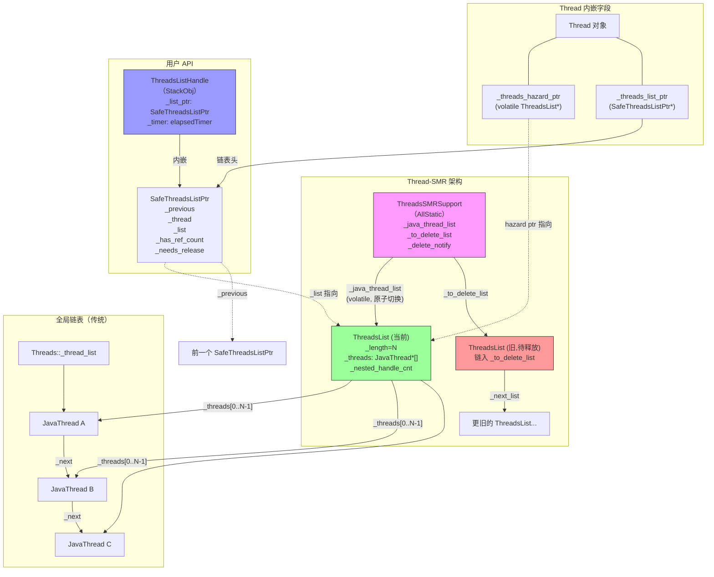

# Day 36 补充：线程栈内存布局 + Thread-SMR 安全内存回收 + 全局线程列表管理

> 纯源码分析，基于 OpenJDK 11 slowdebug（`-Xms8g -Xmx8g -XX:+UseG1GC`）
> 方法论：程序 = 数据结构 + 算法
> 本文是 Day 36 线程生命周期文档的补充，覆盖原文未涉及的 4 个重要主题

---

## 第 0 部分：核心原理 ⭐

### 0.1 本质是什么？

本文深入分析 **Day 36 补充：线程栈内存布局 + Thread-SMR 安全内存回收 + 全局线程列表管理**：从源码角度理解其设计原理、实现机制和关键细节。

### 0.2 为什么需要？

理解 JVM 内部实现是排查复杂问题、进行性能优化的基础。表面的 API 文档无法解释 JVM 的实际行为，只有深入源码才能建立精确的心智模型。

### 0.3 怎么解决？

结合源码阅读、数据结构分析和 GDB 运行时验证，从多个角度建立对该机制的完整理解。

### 0.4 为什么这样设计？

每个设计决策都有其权衡：性能 vs 正确性、简单性 vs 灵活性、内存占用 vs 查找速度。理解这些权衡是理解 JVM 设计的关键。

---


## 一、宏观理解

### 1.1 本文解决什么问题

Day 36 主文档分析了线程从创建到退出的完整生命周期（Thread.start → exit），但有 4 个重要子系统未涉及：

1. **线程栈内存布局**：物理栈是如何划分成 Red/Yellow/Reserved/Shadow 四个保护区的？`_stack_overflow_limit` 怎么算？Guard Page 怎么创建？
2. **Thread-SMR（Safe Memory Reclamation）**：JDK 10+ 引入的无锁线程安全访问机制，替代了之前必须持有 `Threads_lock` 才能安全操作线程的旧方案
3. **Threads::add / Threads::remove**：全局线程列表（`_thread_list`）的管理 —— 线程加入和退出全局列表的完整流程
4. **current_stack_region + NPTL guard page 修正**：从 pthread 获取栈信息时，如何修正 glibc 的一个实现错误

### 1.2 涉及的数据结构清单

| # | 数据结构 | 来源文件 | 简述 |
|---|----------|----------|------|
| 1 | `ThreadsList` | threadSMR.hpp:158 | COW 不可变线程快照数组，每次 add/remove 都创建新实例 |
| 2 | `SafeThreadsListPtr` | threadSMR.hpp:201 | 危险指针封装，保护 ThreadsList 不被提前释放 |
| 3 | `ThreadsListHandle` | threadSMR.hpp:272 | 栈分配 RAII 包装器，用户层 API |
| 4 | `ThreadsSMRSupport` | threadSMR.hpp:88 | AllStatic 管理器，全局 SMR 状态 |
| 5 | `ThreadsListSetter` | threadSMR.hpp:258 | 延迟获取辅助类，构造时不 acquire，手动调用 `set()` 获取 |
| 6 | `StackGuardState` | thread.hpp:1054 | 栈保护区状态枚举（4 种） |
| 7 | Thread 中的 SMR 字段组 | thread.hpp:157-182 | `_threads_hazard_ptr` + `_threads_list_ptr` + `_nested_threads_hazard_ptr_cnt` |

### 1.3 涉及的算法清单

| # | 算法 | 来源文件 | 简述 |
|---|------|----------|------|
| 1 | `set_stack_overflow_limit()` | thread.hpp:1693 | 计算 `_stack_overflow_limit` 软件检测点 |
| 2 | `create_stack_guard_pages()` | thread.cpp:2736 | 创建 Red/Yellow/Reserved 硬件保护页 |
| 3 | `remove_stack_guard_pages()` | thread.cpp:2780 | 移除硬件保护页（线程退出时） |
| 4 | `record_stack_base_and_size()` | thread.cpp:393 | 记录栈基址和大小，设置溢出边界 |
| 5 | `current_stack_region()` | os_linux.cpp:6776 | 获取栈范围 + NPTL guard page 修正 |
| 6 | `acquire_stable_list_fast_path()` | threadSMR.cpp:384 | Hazard Pointer 发布（快速路径） |
| 7 | `acquire_stable_list_nested_path()` | threadSMR.cpp:437 | 嵌套 ThreadsListHandle 引用计数路径 |
| 8 | `release_stable_list()` | threadSMR.cpp:471 | 释放 hazard ptr / 递减引用计数 |
| 9 | `ThreadsSMRSupport::add_thread()` | threadSMR.cpp:743 | COW 方式添加线程到快照 |
| 10 | `ThreadsSMRSupport::remove_thread()` | threadSMR.cpp:917 | COW 方式从快照移除线程 |
| 11 | `ThreadsSMRSupport::smr_delete()` | threadSMR.cpp:944 | 等待所有 hazard ptr 释放后安全删除线程 |
| 12 | `ThreadsSMRSupport::free_list()` | threadSMR.cpp:779 | 扫描 hazard ptr 释放旧快照 |
| 13 | `Threads::add()` | thread.cpp:4675 | 头插法加入全局链表 + SMR 快照更新 |
| 14 | `Threads::remove()` | thread.cpp:4708 | 从链表摘除 + SMR 快照更新 + 唤醒 destroy_vm |

---

## 二、数据结构全景 ⭐

### 2.1 StackGuardState（栈保护区状态枚举）

**来源**：`thread.hpp:1054-1059`

```cpp
// thread.hpp:1054-1059
enum StackGuardState {
  stack_guard_unused,                    // 不需要保护页（非 JavaThread 或未初始化）
  stack_guard_reserved_disabled,         // Reserved Zone 被临时禁用
  stack_guard_yellow_reserved_disabled,  // Yellow + Reserved Zone 被临时禁用（栈溢出触发后）
  stack_guard_enabled                    // 正常启用
};
```

**值域与状态转换**：

```
                  create_stack_guard_pages()
    unused ─────────────────────────────────→ enabled
                                                 │
                                                 │ 栈溢出（SIGSEGV 触发）
                                                 ▼
                                     yellow_reserved_disabled
                                                 │
                                                 │ reguard_stack()
                                                 ▼
                                              enabled（恢复）
                                                 │
                                                 │ @ReservedStackAccess 方法退栈
                                                 ▼
                                         reserved_disabled
                                                 │
                                                 │ enable_stack_reserved_zone()
                                                 ▼
                                              enabled
```

**关键设计**：

- `yellow_reserved_disabled` → 发生栈溢出后，JVM 解除 Yellow+Reserved Zone 的 mprotect 保护，让线程在 Yellow Zone 空间内执行 `StackOverflowError` 的创建和抛出
- 抛出后调用 `reguard_stack()` 恢复保护
- `reserved_disabled` → `@ReservedStackAccess` 注解的方法（如 `ReentrantLock.lock()`）进入 Reserved Zone 后，只禁用 Reserved Zone，避免持有锁时中断

### 2.2 栈保护区各 Zone 大小（x86-64 Linux slowdebug）

**来源**：`globals_x86.hpp:57-81` + `os.cpp:462-468`

```
计算公式（os.cpp:462-468）：
  Red Zone    = align_up(StackRedPages * 4K, page_size)      = align_up(1 * 4K, 4K)  =  4 KB
  Yellow Zone = align_up(StackYellowPages * 4K, page_size)   = align_up(2 * 4K, 4K)  =  8 KB
  Reserved    = align_up(StackReservedPages * 4K, page_size) = align_up(1 * 4K, 4K)  =  4 KB
  Shadow Zone = align_up(StackShadowPages * 4K, page_size)   = align_up(22 * 4K, 4K) = 88 KB
               （x86-64 Linux debug: DEFAULT_STACK_SHADOW_PAGES = 20 + 2 = 22）

  Guard Zone = Red + Yellow + Reserved = 4 + 8 + 4 = 16 KB

  _stack_overflow_limit = stack_end() + MAX2(guard_zone_size, shadow_zone_size)
                        = stack_end() + MAX2(16KB, 88KB)
                        = stack_end() + 88KB
```

**默认值来源**（`globals_x86.hpp:57-81`）：

```cpp
// globals_x86.hpp:57-81
#define DEFAULT_STACK_YELLOW_PAGES (NOT_WINDOWS(2) WINDOWS_ONLY(3))  // Linux: 2
#define DEFAULT_STACK_RED_PAGES (1)                                    // 1
#define DEFAULT_STACK_RESERVED_PAGES (NOT_WINDOWS(1) WINDOWS_ONLY(0)) // Linux: 1
#define DEFAULT_STACK_SHADOW_PAGES (NOT_WIN64(20) WIN64_ONLY(7) DEBUG_ONLY(+2)) // Linux debug: 22
```

### 2.3 ThreadsList（COW 不可变线程快照）

**来源**：`threadSMR.hpp:158-196`

**核心思想**：ThreadsList 是一个 **不可变的** JavaThread 指针数组快照。每次 add/remove 线程都 **创建全新副本**（Copy-On-Write），旧副本延迟释放。

#### 2.3.1 全部字段

| 偏移 | 字段 | 类型 | 含义 |
|------|------|------|------|
| 0x00 | `_length` | `const uint` | 数组中 JavaThread 指针数量 |
| 0x08 | `_next_list` | `ThreadsList*` | 链入 `_to_delete_list` 待释放链表 |
| 0x10 | `_threads` | `JavaThread* const * const` | 指向 C 堆上的 JavaThread* 数组 |
| 0x18 | `_nested_handle_cnt` | `volatile intx` | 嵌套 handle 引用计数（>0 表示被嵌套使用中，不可释放） |

**sizeof**：GDB 实测 **40 字节**。理论计算 `4(_length) + 4(padding) + 8(_next_list) + 8(_threads) + 8(_nested_handle_cnt)` = 32B，多出的 8B 来自 slowdebug 模式下 `CHeapObj` 的 debug metadata（内存分配追踪信息）。

#### 2.3.2 构造函数源码

```cpp
// threadSMR.cpp:546-553
ThreadsList::ThreadsList(int entries) :
  _length(entries),
  _next_list(NULL),
  _threads(NEW_C_HEAP_ARRAY(JavaThread*, entries + 1, mtThread)),  // ★ 多分配一个 slot
  _nested_handle_cnt(0)
{
  *(JavaThread**)(_threads + entries) = NULL;  // ★ 末尾哨兵 NULL，方便迭代
}
```

**设计决策**：分配 `entries + 1` 个 slot，最后一个设为 NULL 哨兵。这让 `JavaThreadIterator` 可以用 NULL 检查作为循环终止条件。

#### 2.3.3 创建位置

- `ThreadsList::add_thread()` (threadSMR.cpp:562) — `ThreadsSMRSupport::add_thread()` 调用
- `ThreadsList::remove_thread()` (threadSMR.cpp:655) — `ThreadsSMRSupport::remove_thread()` 调用
- 每次创建新副本都 `new ThreadsList(new_length)`，旧副本通过 `free_list()` 延迟释放

#### 2.3.4 _nested_handle_cnt 生命周期

| 阶段 | 操作 | 函数 |
|------|------|------|
| 初始化 | `= 0` | 构造函数 |
| 递增 | 嵌套 SafeThreadsListPtr 对前一个列表的引用计数+1 | `acquire_stable_list_nested_path()` 调用 `inc_nested_handle_cnt()` |
| 递减 | 嵌套 handle 释放时-1 | `release_stable_list()` 调用 `dec_nested_handle_cnt()` |
| 检查 | `free_list()` 扫描时，只有 `_nested_handle_cnt == 0` 且无 hazard ptr 才释放 | `free_list()` |

### 2.4 SafeThreadsListPtr（危险指针封装）

**来源**：`threadSMR.hpp:201-252`

**核心思想**：封装了对某个 ThreadsList 的安全引用。叶子节点使用 hazard pointer 机制，嵌套节点使用引用计数机制。

#### 2.4.1 全部字段

| 偏移 | 字段 | 类型 | 含义 |
|------|------|------|------|
| 0x00 | `_previous` | `SafeThreadsListPtr*` | 链接到线程上一个 SafeThreadsListPtr（栈式链表） |
| 0x08 | `_thread` | `Thread*` | 持有此 safe ptr 的线程 |
| 0x10 | `_list` | `ThreadsList*` | 被保护的 ThreadsList 快照 |
| 0x18 | `_has_ref_count` | `bool` | 是否被提升为引用计数模式（嵌套时为 true） |
| 0x19 | `_needs_release` | `bool` | 析构时是否需要释放（acquire 后为 true） |

**sizeof**：GDB 实测 **32 字节**。理论计算 `8(_previous) + 8(_thread) + 8(_list) + 1(_has_ref_count) + 1(_needs_release) + 6(padding)` = 32B。两个 bool 字段加上 6 字节 padding 凑满一个 8B slot。

#### 2.4.2 构造函数 —— 两种模式

```cpp
// threadSMR.hpp:220-230 —— 模式 1：附着到线程（正常获取）
SafeThreadsListPtr(Thread *thread, bool acquire) :
  _previous(NULL),
  _thread(thread),
  _list(NULL),
  _has_ref_count(false),
  _needs_release(false)
{
  if (acquire) {
    acquire_stable_list();  // ★ 获取稳定的 ThreadsList 快照
  }
}

// threadSMR.hpp:233-241 —— 模式 2：转移所有权
SafeThreadsListPtr(SafeThreadsListPtr& other) :
  _previous(other._previous),
  _thread(other._thread),
  _list(other._list),
  _has_ref_count(other._has_ref_count),
  _needs_release(other._needs_release)
{
  other._needs_release = false;  // ★ 转移后原对象不再负责释放
}
```

#### 2.4.3 析构函数

```cpp
// threadSMR.hpp:243-247
~SafeThreadsListPtr() {
  if (_needs_release) {
    release_stable_list();  // ★ 释放 hazard ptr 或递减引用计数
  }
}
```

#### 2.4.4 _previous 的生命周期（栈式链表）

```
线程 T 的 _threads_list_ptr 栈：

  T->_threads_list_ptr → SafePtr_2 → SafePtr_1 → NULL
                         _previous    _previous

  每次 acquire_stable_list()：
    _previous = _thread->_threads_list_ptr;  // 保存当前头
    _thread->_threads_list_ptr = this;       // 自己成为新头

  每次 release_stable_list()：
    _thread->_threads_list_ptr = _previous;  // 恢复前一个
```

### 2.5 ThreadsListHandle（用户层 RAII 包装器）

**来源**：`threadSMR.hpp:272-298`

**核心思想**：栈分配的 RAII 对象。在作用域内保护所有 JavaThread 不被删除。这是用户（JVM 内部代码）最常用的 API。

#### 2.5.1 全部字段

| 偏移 | 字段 | 类型 | 含义 |
|------|------|------|------|
| 0x00 | `_list_ptr` | `SafeThreadsListPtr` | 内嵌的 SafeThreadsListPtr（不是指针，是内嵌对象） |
| 0x18 | `_timer` | `elapsedTimer` | 性能统计计时器（仅 `EnableThreadSMRStatistics` 时有意义） |

**sizeof**：GDB 实测 **64 字节**。`32(SafeThreadsListPtr) + 32(elapsedTimer)`。`elapsedTimer` 内含 `jlong _counter`(8B) + `bool _active`(1B) + padding，实际占 32B。

#### 2.5.2 使用模式

```cpp
// 典型用法（来自 threadSMR.hpp 注释）
ThreadsListHandle tlh;
JavaThread* jt = NULL;
bool is_alive = tlh.cv_internal_thread_to_JavaThread(jthread, &jt, NULL);
if (is_alive) {
  // 安全操作 jt，此期间 jt 不会被删除
}
// tlh 析构 → release_stable_list() → 释放保护
```

### 2.6 ThreadsListSetter（延迟获取辅助类）

**来源**：`threadSMR.hpp:258-267`

**核心思想**：与 `ThreadsListHandle` 不同，ThreadsListSetter 允许**延迟获取** ThreadsList 快照。构造时不 acquire，需要时手动调用 `set()` 获取。用于某些需要先做其他初始化、再获取线程列表的场景。

#### 2.6.1 全部字段

| 偏移 | 字段 | 类型 | 含义 |
|------|------|------|------|
| 0x00 | `_list_ptr` | `SafeThreadsListPtr` | 内嵌的 SafeThreadsListPtr（不是指针，是内嵌对象），构造时 `acquire=false` |

**sizeof**：与 `SafeThreadsListPtr` 相同，GDB 实测 **32 字节**（StackObj 无额外开销）。

#### 2.6.2 源码

```cpp
// threadSMR.hpp:258-267
class ThreadsListSetter : public StackObj {
private:
  SafeThreadsListPtr _list_ptr;

public:
  ThreadsListSetter() : _list_ptr(Thread::current(), /* acquire */ false) {}  // ★ 构造时不获取
  ThreadsList* list() { return _list_ptr.list(); }
  void set() { _list_ptr.acquire_stable_list(); }                             // ★ 手动触发获取
  bool is_set() { return _list_ptr._needs_release; }                          // ★ 检查是否已获取
};
```

#### 2.6.3 与 ThreadsListHandle 的对比

| 特性 | ThreadsListHandle | ThreadsListSetter |
|------|-------------------|-------------------|
| 获取时机 | 构造时自动 acquire | 手动调用 `set()` |
| 计时统计 | 有 `_timer` 字段 | 无 |
| 典型场景 | 大多数遍历线程的场景 | 需要先初始化再获取的特殊场景 |
| sizeof | 64B | 32B |

### 2.7 ThreadsSMRSupport（全局 SMR 管理器）

**来源**：`threadSMR.hpp:88-154`

**核心思想**：AllStatic 类，管理全局 `_java_thread_list` 和待释放链表 `_to_delete_list`。提供 `add_thread()`、`remove_thread()`、`smr_delete()` 三个核心 API。

#### 2.6.1 全部字段

**来源**：`threadSMR.hpp:88-154`（AllStatic 类，所有字段均为 static）

| 字段 | 类型 | 含义 | 类别 |
|------|------|------|------|
| `_java_thread_list` | `ThreadsList* volatile` | **当前活跃的线程快照**（全局唯一，原子切换） | 核心 |
| `_to_delete_list` | `ThreadsList*` | 待释放的旧 ThreadsList 链表头 | 核心 |
| `_to_delete_list_cnt` | `uint` | `_to_delete_list` 链表当前长度 | 核心 |
| `_to_delete_list_max` | `uint` | `_to_delete_list` 链表历史最大长度（统计） | 统计 |
| `_delete_notify` | `volatile uint` | 删除通知标志（`smr_delete()` 和 `release_stable_list()` 之间的 double-check locking） | 核心 |
| `_delete_lock_wait_cnt` | `uint` | 当前在 `delete_lock` 上等待的线程数 | 统计 |
| `_delete_lock_wait_max` | `uint` | `delete_lock` 等待的历史最大并发数 | 统计 |
| `_deleted_thread_cnt` | `volatile uint` | 已通过 `smr_delete()` 安全删除的线程总数 | 统计 |
| `_deleted_thread_time_max` | `volatile uint` | 单次 `smr_delete()` 耗时最大值（毫秒） | 统计 |
| `_deleted_thread_times` | `volatile uint` | 所有 `smr_delete()` 的累计耗时（毫秒） | 统计 |
| `_java_thread_list_alloc_cnt` | `uint64_t` | ThreadsList 总分配次数（每次 add/remove 都+1） | 统计 |
| `_java_thread_list_free_cnt` | `uint64_t` | ThreadsList 总释放次数（`free_list()` 中成功释放时+1） | 统计 |
| `_java_thread_list_max` | `uint` | ThreadsList `_length` 的历史最大值 | 统计 |
| `_nested_thread_list_max` | `uint` | 单线程嵌套 hazard ptr 的历史最大深度 | 统计 |
| `_tlh_cnt` | `volatile uint` | ThreadsListHandle 的总创建次数 | 统计 |
| `_tlh_time_max` | `volatile uint` | 单个 ThreadsListHandle 的最长持有时间（毫秒） | 统计 |
| `_tlh_times` | `volatile uint` | 所有 ThreadsListHandle 的累计持有时间（毫秒） | 统计 |

**注意**：标记为"统计"类别的字段仅在 `-XX:+EnableThreadSMRStatistics` 时有意义。`delete_lock()` 方法返回全局 `ThreadsSMRDelete_lock`（Monitor*），不是字段而是访问器。

**日志参数**：`-Xlog:thread+smr=debug` 可看到 SMR 的 add/remove/delete/free 操作日志。

#### 2.7.2 _java_thread_list 生命周期

| 阶段 | 操作 | 函数 |
|------|------|------|
| 初始化 | 创建空 ThreadsList(0) | VM 启动 |
| 更新（add） | `xchg_java_thread_list(new_list)` 原子替换 | `add_thread()` |
| 更新（remove） | `xchg_java_thread_list(new_list)` 原子替换 | `remove_thread()` |
| 旧副本释放 | 链入 `_to_delete_list`，扫描 hazard ptr 后释放 | `free_list()` |

### 2.8 Thread 中的 SMR 字段组

**来源**：`thread.hpp:157-182`

每个 Thread 对象都持有以下 SMR 相关字段：

```cpp
// thread.hpp:157-182
ThreadsList* volatile _threads_hazard_ptr;      // ★ 危险指针：指向当前正在使用的 ThreadsList
SafeThreadsListPtr*   _threads_list_ptr;        // ★ SafeThreadsListPtr 栈链表头
uint _nested_threads_hazard_ptr_cnt;             // 嵌套 hazard ptr 计数（统计用）
```

**`_threads_hazard_ptr` 的标签（tag）机制**：

```cpp
// thread.hpp:162-170
static bool is_hazard_ptr_tagged(ThreadsList* list) {
  return (intptr_t(list) & intptr_t(1)) == intptr_t(1);  // 最低位 = 1 → 已标记
}
static ThreadsList* tag_hazard_ptr(ThreadsList* list) {
  return (ThreadsList*)(intptr_t(list) | intptr_t(1));    // 设置最低位
}
static ThreadsList* untag_hazard_ptr(ThreadsList* list) {
  return (ThreadsList*)(intptr_t(list) & ~intptr_t(1));   // 清除最低位
}
```

**设计决策**：利用指针对齐（8 字节对齐，最低 3 位为 0），在最低位放一个 tag，表示 hazard ptr **尚未验证为稳定**。扫描线程看到 tagged ptr 时不会把它当作有效引用。CAS 成功去掉 tag 后，hazard ptr 才正式生效。

---

## 三、算法/流程分析

### 3.1 栈内存布局与 Guard Page 创建

#### 3.1.1 完整栈内存布局图

```
  低地址
    │
    ▼
 P0 ┌──────────────────────────┐
    │  glibc guard page (OS)   │  由 pthread 创建，mprotect PROT_NONE
    │  （通常 4KB）              │  不在 JVM 管辖范围内
 P1 ├──────────────────────────┤ ← stack_end() = stack_base() - stack_size()
    │  Red Zone (4KB)          │ ┐
    ├──────────────────────────┤ │
    │  Yellow Zone (8KB)       │ ├─ Guard Pages（mprotect PROT_NONE）
    ├──────────────────────────┤ │   合计 16KB = stack_guard_zone_size()
    │  Reserved Zone (4KB)     │ ┘
    ├──────────────────────────┤ ← stack_reserved_zone_base()
    │                          │
    │ ┈┈┈┈┈┈┈┈┈┈┈┈┈┈┈┈┈┈┈┈┈┈ │ ← _stack_overflow_limit（软件检测点）
    │                          │     = stack_end() + 88KB
    │  Shadow Zone (88KB)      │   不做物理保护，仅用于 stack banging
    │  （逻辑概念）             │
    │                          │
    ├──────────────────────────┤
    │                          │
    │  Normal Stack (可用)     │   实际执行 Java/VM 代码的空间
    │                          │
    │                          │
 P2 └──────────────────────────┘ ← stack_base()（高地址）
    │
    ▼
  高地址
```

**与 Day 32 异常处理的关联**：

- **Yellow Zone 触发** → JVM 信号处理器捕获 SIGSEGV → 解除 Yellow+Reserved 保护 → 在 Yellow Zone 空间内创建并抛出 `StackOverflowError`
- Day 32 文档验证了 Yellow Zone = 8KB 的实际值（与此处一致）
- **Day 40 `safe_for_sender()`** 用 `_stack_overflow_limit` 排除 guard page 区域

#### 3.1.2 算法 1：record_stack_base_and_size() —— 记录栈基址和大小

**解决什么问题**：线程刚被 OS 创建后，JVM 需要知道栈的地址范围，才能后续设置保护区和进行栈溢出检测。

**源码**（thread.cpp:393-416）：

```cpp
// thread.cpp:393-416
void Thread::record_stack_base_and_size() {
  // 注意：此时 Thread 对象还未完全初始化，不要依赖任何成员变量或 Thread::current()
  set_stack_base(os::current_stack_base()); // ★ 获取栈顶地址（高地址端）
  set_stack_size(os::current_stack_size()); // ★ 获取栈总大小

  // 只有 JavaThread 才需要设置栈溢出边界
  if (is_Java_thread()) {
    ((JavaThread*)this)->set_stack_overflow_limit();            // ★ 计算软件检测点
    ((JavaThread*)this)->set_reserved_stack_activation(stack_base()); // ★ 初始化为栈顶（高地址）
  }
}
```

**调用时机**：在 `Thread::call_run()` 中，线程真正开始执行前调用。此时线程已经在 OS 层面跑起来了，`pthread_getattr_np` 能返回正确的栈信息。

**核心调用链**：

```
record_stack_base_and_size()
  → os::current_stack_base()   // → current_stack_region() → stack_base = bottom + size
  → os::current_stack_size()   // → current_stack_region() → size（已修正 glibc guard page）
  → set_stack_overflow_limit() // → _stack_overflow_limit = stack_end() + MAX2(guard, shadow)
  → set_reserved_stack_activation(stack_base()) // 初始化为栈最高地址
```

#### 3.1.3 算法 2：current_stack_region() —— 获取栈范围 + NPTL 修正

**解决什么问题**：glibc 的 NPTL 实现有一个错误：`pthread_attr_getstack()` 返回的栈范围 **包含了** glibc guard page，但 guard page 是不可访问的，JVM 需要的是 **实际可用的** 栈空间。

**源码**（os_linux.cpp:6776-6839）：

```cpp
// os_linux.cpp:6776-6839
static void current_stack_region(address *bottom, size_t *size) {
  if (os::is_primordial_thread()) {
    // 主线程特殊处理（从 /proc/self/maps 获取）
    *bottom = os::Linux::initial_thread_stack_bottom();
    *size = os::Linux::initial_thread_stack_size();
  } else {
    // ★ 子线程（JVM 创建的所有 JavaThread 都走这里）
    pthread_attr_t attr;
    int rslt = pthread_getattr_np(pthread_self(), &attr);  // ★ 获取当前线程属性
    if (rslt != 0) {
      if (rslt == ENOMEM) {
        vm_exit_out_of_memory(0, OOM_MMAP_ERROR, "pthread_getattr_np");
      } else {
        fatal("pthread_getattr_np failed with error = %d", rslt);
      }
    }

    // ★ 获取栈地址和大小
    if (pthread_attr_getstack(&attr, (void **)bottom, size) != 0) {
      fatal("Cannot locate current stack attributes!");
    }

    // ★ 修正 NPTL guard page 错误
    size_t guard_size = 0;
    rslt = pthread_attr_getguardsize(&attr, &guard_size);
    if (rslt != 0) {
      fatal("pthread_attr_getguardsize failed with error = %d", rslt);
    }
    *bottom += guard_size;  // ★ 底部上移，跳过 glibc guard page
    *size -= guard_size;    // ★ 大小相应减小

    pthread_attr_destroy(&attr);
  }
  assert(os::current_stack_pointer() >= *bottom &&
         os::current_stack_pointer() < *bottom + *size, "just checking");
}
```

**NPTL 错误图解**：

```
修正前（pthread 返回的）          修正后（JVM 需要的）

┌─────────────────┐              ┌─────────────────┐
│ glibc guard page│ ← bottom     │                 │ ← bottom（上移 guard_size）
├─────────────────┤              │                 │
│                 │              │   可用栈空间      │
│   可用栈空间     │   size       │                 │  size - guard_size
│                 │              │                 │
└─────────────────┘              └─────────────────┘
```

**设计决策**：为什么不让 glibc 修复？因为这是 NPTL 的既有行为，修改会破坏向后兼容。JVM 选择在自己这一侧修正。

#### 3.1.4 算法 3：set_stack_overflow_limit() —— 计算软件检测点

**解决什么问题**：确定一个 `_stack_overflow_limit` 地址，让 JVM 在每次方法调用时快速检查栈指针是否即将进入危险区域。

**源码**（thread.hpp:1693-1728）：

```cpp
// thread.hpp:1693-1728
void set_stack_overflow_limit() {
    _stack_overflow_limit =
      stack_end() + MAX2(JavaThread::stack_guard_zone_size(),   // = 16KB (Red+Yellow+Reserved)
                         JavaThread::stack_shadow_zone_size());  // = 88KB (Shadow)
}
// 结果：stack_end() + 88KB（因为 88KB > 16KB）
```

**为什么取 MAX2？**

- Guard Zone（16KB）是 mprotect 保护的物理区域 → 进入就 SIGSEGV
- Shadow Zone（88KB）是逻辑概念 → 用于 stack banging（编译器在方法入口写入 `[sp - shadow_size]` 触发 SIGSEGV）
- `_stack_overflow_limit` 的含义是"软件检测点"：在解释器中，每次方法调用前检查 `sp < _stack_overflow_limit`
- 必须同时覆盖物理保护区和逻辑检测区，所以取两者最大值

#### 3.1.5 算法 4：create_stack_guard_pages() —— 创建硬件保护页

**解决什么问题**：用 mprotect 将栈底端的 Red+Yellow+Reserved 共 16KB 设为 `PROT_NONE`（不可读、不可写、不可执行），任何访问都触发 `SIGSEGV`。

**源码**（thread.cpp:2736-2778）：

```cpp
// thread.cpp:2736-2778
void JavaThread::create_stack_guard_pages() {
  // ★ 前置检查：3 种情况跳过创建
  if (!os::uses_stack_guard_pages() ||
      _stack_guard_state != stack_guard_unused ||      // 已经创建过了
      (DisablePrimordialThreadGuardPages && os::is_primordial_thread())) {  // 主线程禁用
    log_info(os, thread)("Stack guard page creation for thread "
      UINTX_FORMAT " disabled", os::current_thread_id());
    return;
  }

  address low_addr = stack_end();            // ★ 栈最低地址（guard pages 起始位置）
  size_t len = stack_guard_zone_size();      // ★ Red + Yellow + Reserved = 16KB

  assert(is_aligned(low_addr, os::vm_page_size()), "Stack base should be the start of a page");
  assert(is_aligned(len, os::vm_page_size()), "Stack size should be a multiple of page size");

  int must_commit = os::must_commit_stack_guard_pages();  // Linux: true（需要先 commit 内存）

  // ★ Step 1：commit 物理内存（Linux 上需要，因为栈内存可能尚未 commit）
  if (must_commit && !os::create_stack_guard_pages((char*)low_addr, len)) {
    log_warning(os, thread)("Attempt to allocate stack guard pages failed.");
    return;
  }

  // ★ Step 2：mprotect PROT_NONE → 任何访问触发 SIGSEGV
  if (os::guard_memory((char*)low_addr, len)) {
    _stack_guard_state = stack_guard_enabled;  // ★ 状态转换：unused → enabled
  } else {
    log_warning(os, thread)("Attempt to protect stack guard pages failed ("
      PTR_FORMAT "-" PTR_FORMAT ").", p2i(low_addr), p2i(low_addr + len));
    vm_exit_out_of_memory(len, OOM_MPROTECT_ERROR, "memory to guard stack pages");
  }

  log_debug(os, thread)("Thread " UINTX_FORMAT " stack guard pages activated: "
    PTR_FORMAT "-" PTR_FORMAT ".",
    os::current_thread_id(), p2i(low_addr), p2i(low_addr + len));
}
```

**日志参数**：`-Xlog:os+thread=debug` 可看到每个线程的 guard page 激活地址范围。

**输出示例**：
```
[debug][os,thread] Thread 12345 stack guard pages activated: 0x00007f1234500000-0x00007f1234504000.
```

#### 3.1.6 算法 5：remove_stack_guard_pages() —— 移除保护页（线程退出时）

**解决什么问题**：线程退出前，需要解除 mprotect 保护，恢复内存为正常可读写状态，然后 OS 才能正确回收栈空间。

**源码**（thread.cpp:2780-2819）：

```cpp
// thread.cpp:2780-2819
void JavaThread::remove_stack_guard_pages() {
  assert(Thread::current() == this, "from different thread");
  if (_stack_guard_state == stack_guard_unused) return;  // 没有 guard pages，直接返回

  address low_addr = stack_end();
  size_t len = stack_guard_zone_size();

  if (os::must_commit_stack_guard_pages()) {
    // ★ Linux 路径：先 decommit（uncommit 物理页面）
    if (os::remove_stack_guard_pages((char*)low_addr, len)) {
      _stack_guard_state = stack_guard_unused;  // ★ 状态转换 → unused
    } else {
      log_warning(os, thread)("Attempt to deallocate stack guard pages failed ("
        PTR_FORMAT "-" PTR_FORMAT ").", p2i(low_addr), p2i(low_addr + len));
      return;
    }
  } else {
    // ★ 其他平台：只解除 mprotect
    if (_stack_guard_state == stack_guard_unused) return;
    if (os::unguard_memory((char*)low_addr, len)) {
      _stack_guard_state = stack_guard_unused;
    } else {
      log_warning(os, thread)("Attempt to unprotect stack guard pages failed ("
        PTR_FORMAT "-" PTR_FORMAT ").", p2i(low_addr), p2i(low_addr + len));
      return;
    }
  }

  log_debug(os, thread)("Thread " UINTX_FORMAT " stack guard pages removed: "
    PTR_FORMAT "-" PTR_FORMAT ".",
    os::current_thread_id(), p2i(low_addr), p2i(low_addr + len));
}
```

---

### 3.2 Thread-SMR 机制（Safe Memory Reclamation）

#### 3.2.1 解决什么问题

在 JDK 10 之前，任何对 `JavaThread*` 的操作都必须持有 `Threads_lock` —— 一把全局互斥锁。这导致：

1. **性能瓶颈**：所有线程遍历操作（JVM TI、JNI、GC 扫描等）串行化
2. **死锁风险**：需要同时持有 Threads_lock 和其他锁时容易死锁
3. **信号处理限制**：信号处理器中不能获取 Mutex

Thread-SMR 使用 **Hazard Pointer + COW + 延迟回收** 三板斧解决这些问题：

- **COW**：每次 add/remove 线程创建新的 ThreadsList 副本
- **Hazard Pointer**：读者在 `_threads_hazard_ptr` 中发布自己正在使用的 ThreadsList，告知回收者"我正在用，别删"
- **延迟回收**：旧 ThreadsList 不立即删除，先扫描所有 hazard ptr，确认无人使用后才释放

#### 3.2.2 算法 6：acquire_stable_list_fast_path() —— 获取稳定快照（快速路径）

**解决什么问题**：无锁地获取一个稳定的 ThreadsList 引用，保证在持有期间该 ThreadsList 不会被释放。

**核心思路**：经典的 hazard pointer 发布协议 —— (1) 读全局指针 → (2) 写 hazard ptr（带 tag） → (3) 验证全局指针未变 → (4) CAS 去 tag 确认。

**源码**（threadSMR.cpp:384-432）：

```cpp
// threadSMR.cpp:384-432
void SafeThreadsListPtr::acquire_stable_list_fast_path() {
  assert(_thread != NULL, "sanity check");
  assert(_thread->get_threads_hazard_ptr() == NULL, "sanity check");

  ThreadsList* threads;

  // ★ 无锁的 hazard ptr 发布循环
  while (true) {
    // ★ Step 1：读取当前全局 ThreadsList
    threads = ThreadsSMRSupport::get_java_thread_list();

    // ★ Step 2：发布一个 tagged（标记的）hazard ptr
    // tag 表示"正在验证中，还不算正式引用"
    ThreadsList* unverified_threads = Thread::tag_hazard_ptr(threads);
    _thread->set_threads_hazard_ptr(unverified_threads);  // 写入 hazard ptr（带 tag）

    // ★ Step 3：二次检查全局列表是否已变化
    // 如果 add/remove 在 Step 1 和 Step 2 之间发生了，全局列表已替换为新副本，
    // 我们指向的旧副本可能即将被释放 → 重试
    if (ThreadsSMRSupport::get_java_thread_list() != threads) {
      continue;  // 全局列表已变 → 重试
    }

    // ★ Step 4：CAS 去掉 tag，正式发布 hazard ptr
    // 这里可能和扫描线程竞争（扫描线程可能 invalidate tagged ptr）
    if (_thread->cmpxchg_threads_hazard_ptr(threads, unverified_threads) == unverified_threads) {
      break;  // CAS 成功 → hazard ptr 正式发布
    }
    // CAS 失败 → 被扫描线程 invalidated → 重试
  }

  // ★ hazard ptr 发布成功，这个 ThreadsList 及其中所有 JavaThread* 都受到保护
  _list = threads;

  verify_hazard_ptr_scanned();  // debug 模式下验证
}
```

**关键设计决策**：

1. **为什么用 tag？** —— 扫描线程（`free_list()` 中）需要区分"正在验证中"和"已确认"的 hazard ptr。tagged ptr 不被当作有效引用，防止读者发布了一个即将被释放的指针。
2. **为什么需要二次检查？** —— 经典的 hazard pointer ABA 防护。如果全局列表在读取后被替换，我们持有的可能是已加入释放队列的旧副本。
3. **为什么是 CAS 而不是直接写？** —— 扫描线程可能将 tagged ptr 置为 NULL（invalidate），CAS 能检测到这种竞争。

#### 3.2.3 算法 7：acquire_stable_list_nested_path() —— 嵌套路径

**解决什么问题**：一个线程已经持有一个 ThreadsListHandle，又需要创建另一个时怎么办？不能直接再设置 hazard ptr（一个线程只有一个 `_threads_hazard_ptr` 字段）。

**核心思路**：将当前 hazard ptr 保护的 ThreadsList 提升为 **引用计数模式**，清空 hazard ptr，然后用快速路径获取新的 ThreadsList。

**源码**（threadSMR.cpp:437-467）：

```cpp
// threadSMR.cpp:437-467
void SafeThreadsListPtr::acquire_stable_list_nested_path() {
  assert(_thread != NULL, "sanity check");
  assert(_thread->get_threads_hazard_ptr() != NULL,
         "cannot have a NULL regular hazard ptr when acquiring a nested hazard ptr");

  // ★ 获取前一个 SafeThreadsListPtr 保护的 ThreadsList
  ThreadsList* current_list = _previous->_list;

  if (EnableThreadSMRStatistics) {
    _thread->inc_nested_threads_hazard_ptr_cnt();
  }
  // ★ Step 1：对前一个列表增加引用计数
  current_list->inc_nested_handle_cnt();
  // ★ Step 2：标记前一个 SafeThreadsListPtr 为引用计数模式
  _previous->_has_ref_count = true;
  // ★ Step 3：清空 hazard ptr（这样快速路径就能正常工作了）
  _thread->_threads_hazard_ptr = NULL;

  if (EnableThreadSMRStatistics && _thread->nested_threads_hazard_ptr_cnt() > ThreadsSMRSupport::_nested_thread_list_max) {
    ThreadsSMRSupport::_nested_thread_list_max = _thread->nested_threads_hazard_ptr_cnt();
  }

  // ★ Step 4：走快速路径获取新的 ThreadsList 快照
  acquire_stable_list_fast_path();

  verify_hazard_ptr_scanned();

  log_debug(thread, smr)("tid=" UINTX_FORMAT ": SafeThreadsListPtr::acquire_stable_list: add nested list pointer to ThreadsList=" INTPTR_FORMAT,
    os::current_thread_id(), p2i(_list));
}
```

**设计决策**：为什么不给每个线程多个 hazard ptr slot？因为绝大多数场景只有一个 ThreadsListHandle，嵌套极其罕见。一个 slot + 引用计数 fallback 比 N 个 slot 更节省内存。

#### 3.2.4 算法 8：release_stable_list() —— 释放保护

**解决什么问题**：ThreadsListHandle 析构时，释放对 ThreadsList 的保护，让旧副本可以被回收。

**源码**（threadSMR.cpp:471-505）：

```cpp
// threadSMR.cpp:471-505
void SafeThreadsListPtr::release_stable_list() {
  assert(_thread != NULL, "sanity check");
  assert(_thread->_threads_list_ptr == this, "sanity check");
  // ★ 恢复链表头为前一个 SafeThreadsListPtr
  _thread->_threads_list_ptr = _previous;

  if (_has_ref_count) {
    // ★ 嵌套模式：递减引用计数
    assert(_thread->get_threads_hazard_ptr() == NULL, "sanity check");
    if (EnableThreadSMRStatistics) {
      _thread->dec_nested_threads_hazard_ptr_cnt();
    }
    _list->dec_nested_handle_cnt();  // ★ 引用计数-1，可能降到 0

    log_debug(thread, smr)("tid=" UINTX_FORMAT ": SafeThreadsListPtr::release_stable_list: delete nested list pointer to ThreadsList=" INTPTR_FORMAT,
      os::current_thread_id(), p2i(_list));
  } else {
    // ★ 叶子模式（正常情况）：清空 hazard ptr
    assert(_thread->get_threads_hazard_ptr() != NULL, "sanity check");
    _thread->set_threads_hazard_ptr(NULL);  // ★ 直接置 NULL
  }

  // ★ Double-check locking 优化：先检查 _delete_notify 标志
  // 只有当有线程正在 smr_delete() 中等待时，才需要唤醒
  if (ThreadsSMRSupport::delete_notify()) {
    ThreadsSMRSupport::release_stable_list_wake_up(_has_ref_count);
  }
}
```

**关键设计**：double-check locking —— 先检查 `_delete_notify` 标志（volatile 读），只有为 true 时才获取 `delete_lock` 并 notify。这大大减少了 `delete_lock` 的竞争，因为绝大多数情况下不会有线程在等待删除。

#### 3.2.5 算法 9：ThreadsSMRSupport::add_thread() —— COW 添加线程

**解决什么问题**：在不影响正在遍历旧 ThreadsList 的读者的前提下，安全地向全局线程列表添加新线程。

**源码**（threadSMR.cpp:743-758）：

```cpp
// threadSMR.cpp:743-758
void ThreadsSMRSupport::add_thread(JavaThread *thread) {
  // ★ Step 1：创建包含新线程的新副本
  ThreadsList *new_list = ThreadsList::add_thread(get_java_thread_list(), thread);
  if (EnableThreadSMRStatistics) {
    inc_java_thread_list_alloc_cnt();
    update_java_thread_list_max(new_list->length());
  }
  log_debug(thread, smr)("tid=" UINTX_FORMAT ": Threads::add: new ThreadsList=" INTPTR_FORMAT,
    os::current_thread_id(), p2i(new_list));

  // ★ Step 2：原子替换全局 _java_thread_list
  ThreadsList *old_list = xchg_java_thread_list(new_list);
  // ★ Step 3：延迟释放旧副本（扫描 hazard ptr 后释放）
  free_list(old_list);

  // ★ Step 4：如果 ThreadIdTable 已初始化，添加 tid → JavaThread 映射
  if (ThreadIdTable::is_initialized()) {
    jlong tid = SharedRuntime::get_java_tid(thread);
    ThreadIdTable::add_thread(tid, thread);
  }
}
```

**ThreadsList::add_thread() 的 COW 实现**（threadSMR.cpp:562-574）：

```cpp
// threadSMR.cpp:562-574
ThreadsList *ThreadsList::add_thread(ThreadsList *list, JavaThread *java_thread) {
  const uint index = list->_length;
  const uint new_length = index + 1;
  const uint head_length = index;
  ThreadsList *const new_list = new ThreadsList(new_length);  // ★ 分配新数组

  if (head_length > 0) {
    // ★ 拷贝旧数组的所有元素
    Copy::disjoint_words((HeapWord*)list->_threads, (HeapWord*)new_list->_threads, head_length);
  }
  // ★ 新线程追加到末尾
  *(JavaThread**)(new_list->_threads + index) = java_thread;

  return new_list;
}
```

#### 3.2.6 算法 10：ThreadsSMRSupport::remove_thread() —— COW 移除线程

**源码**（threadSMR.cpp:917-933）：

```cpp
// threadSMR.cpp:917-933
void ThreadsSMRSupport::remove_thread(JavaThread *thread) {
  // ★ 从 ThreadIdTable 移除
  if (ThreadIdTable::is_initialized()) {
    jlong tid = SharedRuntime::get_java_tid(thread);
    ThreadIdTable::remove_thread(tid);
  }
  // ★ 创建不含该线程的新副本
  ThreadsList *new_list = ThreadsList::remove_thread(ThreadsSMRSupport::get_java_thread_list(), thread);
  if (EnableThreadSMRStatistics) {
    ThreadsSMRSupport::inc_java_thread_list_alloc_cnt();
  }
  log_debug(thread, smr)("tid=" UINTX_FORMAT ": Threads::remove: new ThreadsList=" INTPTR_FORMAT,
    os::current_thread_id(), p2i(new_list));

  // ★ 原子替换 + 延迟释放
  ThreadsList *old_list = ThreadsSMRSupport::xchg_java_thread_list(new_list);
  ThreadsSMRSupport::free_list(old_list);
}
```

**ThreadsList::remove_thread() 的 COW 实现**（threadSMR.cpp:655-674）：

```cpp
// threadSMR.cpp:655-674
ThreadsList *ThreadsList::remove_thread(ThreadsList* list, JavaThread* java_thread) {
  assert(list->_length > 0, "sanity");
  uint i = (uint)list->find_index_of_JavaThread(java_thread);  // ★ 线性查找
  assert(i < list->_length, "did not find JavaThread on the list");

  const uint index = i;
  const uint new_length = list->_length - 1;
  const uint head_length = index;
  const uint tail_length = (new_length >= index) ? (new_length - index) : 0;
  ThreadsList *const new_list = new ThreadsList(new_length);  // ★ 新数组少一个元素

  // ★ 拷贝被移除元素之前的部分
  if (head_length > 0) {
    Copy::disjoint_words((HeapWord*)list->_threads, (HeapWord*)new_list->_threads, head_length);
  }
  // ★ 拷贝被移除元素之后的部分
  if (tail_length > 0) {
    Copy::disjoint_words((HeapWord*)list->_threads + index + 1,
                         (HeapWord*)new_list->_threads + index, tail_length);
  }

  return new_list;
}
```

#### 3.2.7 算法 11：smr_delete() —— 安全删除线程

**解决什么问题**：线程已从全局列表移除，但可能还有其他线程通过 ThreadsListHandle 持有指向它的引用。直接 `delete` 会造成 use-after-free。`smr_delete()` 等待所有引用释放后才真正删除。

**源码**（threadSMR.cpp:944-1019）：

```cpp
// threadSMR.cpp:944-1019
void ThreadsSMRSupport::smr_delete(JavaThread *thread) {
  assert(!Threads_lock->owned_by_self(), "sanity");

  bool has_logged_once = false;
  elapsedTimer timer;
  if (EnableThreadSMRStatistics) { timer.start(); }

  while (true) {
    {
      // ★ Step 1：获取 Threads_lock（no safepoint check，因为此线程已不在 Threads list 上）
      MutexLockerEx ml(Threads_lock, Mutex::_no_safepoint_check_flag);
      // ★ Step 2：获取 delete_lock
      ThreadsSMRSupport::delete_lock()->lock_without_safepoint_check();
      // ★ Step 3：设置 _delete_notify 标志（在扫描 hazard ptr 之前！）
      // 用于 release_stable_list() 中的 double-check locking
      ThreadsSMRSupport::set_delete_notify();

      // ★ Step 4：检查是否还有 hazard ptr 指向包含此线程的 ThreadsList
      if (!is_a_protected_JavaThread(thread)) {
        // ★ 常见情况：没有人引用了，可以安全删除
        ThreadsSMRSupport::clear_delete_notify();
        ThreadsSMRSupport::delete_lock()->unlock();
        break;  // → 跳出循环去 delete
      }
      // 有人还在引用，需要等待
      if (!has_logged_once) {
        has_logged_once = true;
        log_debug(thread, smr)("tid=" UINTX_FORMAT ": ThreadsSMRSupport::smr_delete: thread=" INTPTR_FORMAT " is not deleted.",
          os::current_thread_id(), p2i(thread));
        // ... debug 日志 ...
      }
    } // ★ 释放 Threads_lock（必须在 wait 之前释放！）

    if (EnableThreadSMRStatistics) { _delete_lock_wait_cnt++; /* ... */ }

    // ★ Step 5：在 delete_lock 上等待 release_stable_list() 的 notify
    ThreadsSMRSupport::delete_lock()->wait(Mutex::_no_safepoint_check_flag, 0,
                                     !Mutex::_as_suspend_equivalent_flag);
    if (EnableThreadSMRStatistics) { _delete_lock_wait_cnt--; }

    ThreadsSMRSupport::clear_delete_notify();
    ThreadsSMRSupport::delete_lock()->unlock();
    // ★ 被唤醒后重新检查
  }

  // ★ Step 6：真正删除线程对象
  delete thread;  // → Thread::operator delete → FreeHeap

  if (EnableThreadSMRStatistics) {
    timer.stop();
    uint millis = (uint)timer.milliseconds();
    ThreadsSMRSupport::inc_deleted_thread_cnt();
    ThreadsSMRSupport::add_deleted_thread_times(millis);
    ThreadsSMRSupport::update_deleted_thread_time_max(millis);
  }

  log_debug(thread, smr)("tid=" UINTX_FORMAT ": ThreadsSMRSupport::smr_delete: thread=" INTPTR_FORMAT " is deleted.",
    os::current_thread_id(), p2i(thread));
}
```

**关键设计决策**：

1. **为什么先 set_delete_notify 再扫描？** —— 防止窗口期：如果先扫描再 set_notify，可能在扫描和 set 之间有 release 发生但没看到 notify。
2. **为什么释放 Threads_lock 后再 wait？** —— 持有 Threads_lock 会阻塞其他线程的 add/remove 操作，必须释放。
3. **等待 vs 自旋？** —— 选择 wait（而非 busy-wait），因为等待时间可能较长（取决于其他线程何时释放 ThreadsListHandle）。

#### 3.2.8 算法 12：free_list() —— 扫描 hazard ptr 释放旧快照

**解决什么问题**：旧的 ThreadsList 不能立即删除（可能有 hazard ptr 引用），需要扫描所有线程的 hazard ptr，确认无引用后才释放。

**核心思路**：(1) 收集所有线程的 hazard ptr 到哈希表 → (2) 遍历 `_to_delete_list`，释放未被引用且 `_nested_handle_cnt == 0` 的 ThreadsList。

**源码**（threadSMR.cpp:779-845）：

```cpp
// threadSMR.cpp:779-845
void ThreadsSMRSupport::free_list(ThreadsList* threads) {
  assert_locked_or_safepoint(Threads_lock);

  // ★ Step 1：将新的旧副本链入 _to_delete_list
  threads->set_next_list(_to_delete_list);
  _to_delete_list = threads;
  // ... 统计 ...

  // ★ Step 2：构建 hazard ptr 哈希表
  int hash_table_size = MIN2((int)get_java_thread_list()->length(), 32) << 1;
  // ... 向上取整到 2 的幂 ...
  ThreadScanHashtable *scan_table = new ThreadScanHashtable(hash_table_size);
  ScanHazardPtrGatherThreadsListClosure scan_cl(scan_table);
  threads_do(&scan_cl);  // ★ 遍历所有线程，收集 hazard ptr 到 hash table
  OrderAccess::acquire();  // ★ 必须先读 hazard ptr 再读 _nested_handle_cnt

  // ★ Step 3：遍历 _to_delete_list，释放安全的旧副本
  ThreadsList* current = _to_delete_list;
  ThreadsList* prev = NULL;
  ThreadsList* next = NULL;
  bool threads_is_freed = false;
  while (current != NULL) {
    next = current->next_list();
    // ★ 不在 hazard ptr 集合中 && 没有嵌套引用计数 → 安全释放
    if (!scan_table->has_entry((void*)current) && current->_nested_handle_cnt == 0) {
      // 从链表中摘除
      if (prev != NULL) {
        prev->set_next_list(next);
      }
      if (_to_delete_list == current) {
        _to_delete_list = next;
      }
      log_debug(thread, smr)("tid=" UINTX_FORMAT ": ThreadsSMRSupport::free_list: threads=" INTPTR_FORMAT " is freed.",
        os::current_thread_id(), p2i(current));
      if (current == threads) threads_is_freed = true;
      delete current;  // ★ 释放 ThreadsList 对象 + 内部数组
      // ... 统计 ...
    } else {
      prev = current;
    }
    current = next;
  }

  if (!threads_is_freed) {
    log_debug(thread, smr)("tid=" UINTX_FORMAT ": ThreadsSMRSupport::free_list: threads=" INTPTR_FORMAT " is not freed.",
      os::current_thread_id(), p2i(threads));
  }

  delete scan_table;
}
```

**OrderAccess::acquire() 的必要性**：必须先读完所有 hazard ptr，再读 `_nested_handle_cnt`。否则可能看到旧的 `_nested_handle_cnt == 0`，但实际上嵌套路径正在递增它。

---

### 3.3 Threads::add / Threads::remove —— 全局线程列表管理

#### 3.3.1 算法 13：Threads::add() —— 头插法加入全局链表

**解决什么问题**：新线程创建后需要加入全局 `_thread_list` 链表（用于 GC 扫描、SafePoint 同步等），同时更新 SMR 快照。

**源码**（thread.cpp:4675-4706）：

```cpp
// thread.cpp:4675-4706
void Threads::add(JavaThread *p, bool force_daemon) {
  // ★ 前置条件：必须持有 Threads_lock
  assert(Threads_lock->owned_by_self(), "must have threads lock");

  // ★ Step 1：通知 BarrierSet 有新线程加入（G1 需要初始化 SATB/Dirty Card 队列）
  BarrierSet::barrier_set()->on_thread_attach(p);

  // ★ Step 2：头插法加入链表
  p->set_next(_thread_list);  // 新线程的 next 指向当前链表头
  _thread_list = p;           // 链表头更新为新线程

  // ★ Step 3：标记为已上链表（之后删除必须走 smr_delete）
  p->set_on_thread_list();

  // ★ Step 4：更新计数器
  _number_of_threads++;
  oop threadObj = p->threadObj();
  bool daemon = true;
  // 引导问题：初始 JavaThread 或 JNI attach 的线程可能没有 threadObj
  if ((!force_daemon) && !is_daemon((threadObj))) {
    _number_of_non_daemon_threads++;
    daemon = false;
  }

  // ★ Step 5：更新 ThreadService（用于 JMX 监控）
  ThreadService::add_thread(p, daemon);

  // ★ Step 6：更新 SMR 快照（COW 方式）
  ThreadsSMRSupport::add_thread(p);

  Events::log(p, "Thread added: " INTPTR_FORMAT, p2i(p));
}
```

**调用时机**：

- `Threads::create_vm()` 中添加 main thread
- `JavaThread::thread_main_inner()` → `Threads::add(this)` 添加新创建的 JavaThread
- `jni_AttachCurrentThread` → `Threads::add()` 添加通过 JNI attach 的线程

#### 3.3.2 算法 14：Threads::remove() —— 从全局链表移除

**解决什么问题**：线程退出时，从全局链表中摘除，更新 SMR 快照，回收 ObjectMonitor，并在最后一个非守护线程退出时唤醒 `destroy_vm`。

**源码**（thread.cpp:4708-4759）：

```cpp
// thread.cpp:4708-4759
void Threads::remove(JavaThread *p, bool is_daemon) {
  // ★ Step 1：回收此线程持有的 ObjectMonitor（omInUseList + omFreeList → 全局 gFreeList）
  ObjectSynchronizer::omFlush(p);

  { // ★ 在 Threads_lock 保护下操作
    MutexLocker ml(Threads_lock);

    assert(ThreadsSMRSupport::get_java_thread_list()->includes(p), "p must be present");

    // ★ Step 2：从 SMR 快照移除（COW 方式）
    ThreadsSMRSupport::remove_thread(p);

    // ★ Step 3：从传统链表中摘除（线性查找 + 摘除）
    JavaThread *current = _thread_list;
    JavaThread *prev = NULL;
    while (current != p) {
      prev = current;
      current = current->next();
    }
    if (prev) {
      prev->set_next(current->next());  // 中间或尾部摘除
    } else {
      _thread_list = p->next();         // 头部摘除
    }

    // ★ Step 4：更新计数器
    _number_of_threads--;
    if (!is_daemon) {
      _number_of_non_daemon_threads--;
      // ★ 关键！只剩 1 个非守护线程 → 唤醒 destroy_vm 等待者
      if (number_of_non_daemon_threads() == 1) {
        Threads_lock->notify_all();
      }
    }

    // ★ Step 5：ThreadService 移除（JMX 监控）
    ThreadService::remove_thread(p, is_daemon);

    // ★ Step 6：标记线程为已终止
    // 让 SafePoint 代码忽略此线程（线程可能在 remove 后仍执行一些清理代码）
    p->set_terminated_value();
  } // 释放 Threads_lock

  Events::log(p, "Thread exited: " INTPTR_FORMAT, p2i(p));
}
```

**关键设计**：

1. **为什么 `omFlush()` 在 Threads_lock 之外？** —— `omFlush()` 可能耗时较长（需要遍历 ObjectMonitor 链表），放在锁外减少 Threads_lock 持有时间。
2. **`notify_all` 的作用** —— `Threads::destroy_vm()` 中 main thread 在 `Threads_lock` 上 wait，直到所有非守护线程退出（`number_of_non_daemon_threads() == 1`，即只剩 main thread 自己）。最后一个非守护线程退出时 notify 唤醒 main thread 进入 VM 销毁流程。
3. **`set_terminated_value()` 的必要性** —— 线程在 `Threads_lock` 释放后可能还会执行一些代码（如 `Events::log`），但 SafePoint 机制此时不应该等待这个线程了。

---

## 四、GDB 验证

### 4.1 验证计划

| # | 验证项 | 方法 | 预期 | 实际 | 状态 |
|---|--------|------|------|------|------|
| 1 | ThreadsList sizeof | `p sizeof(ThreadsList)` | ~32B | **40B** | ✅ |
| 2 | SafeThreadsListPtr sizeof | `p sizeof(SafeThreadsListPtr)` | ~24B | **32B** | ✅ |
| 3 | ThreadsListHandle sizeof | `p sizeof(ThreadsListHandle)` | ~40B | **64B** | ✅ |
| 4 | Stack Red Zone | 静态变量 | 4096 | **4096** | ✅ |
| 5 | Stack Yellow Zone | 静态变量 | 8192 | **8192** | ✅ |
| 6 | Stack Reserved Zone | 静态变量 | 4096 | **4096** | ✅ |
| 7 | Stack Shadow Zone | 静态变量 | 90112 (22*4K) | **90112** | ✅ |
| 8 | _stack_overflow_limit 公式 | 计算验证 | stack_end + 0x16000 | **精确匹配** | ✅ |
| 9 | _java_thread_list->_length | SMR 全局状态 | >0 | **6** | ✅ |
| 10 | Threads::add 调用 | 断点观察 | 每个 JavaThread 调用 | **7次** | ✅ |
| 11 | create_stack_guard_pages | 断点观察 | _stack_guard_state=0(unused) | **全部为 0** | ✅ |

### 4.2 GDB 脚本

脚本文件：`new-jvm-md/tmp-file/thread-lifecycle/verify_supplement.gdb`

### 4.3 验证结果详情

#### 4.3.1 sizeof 验证

```
sizeof(ThreadsList):        40 字节
sizeof(SafeThreadsListPtr): 32 字节
sizeof(ThreadsListHandle):  64 字节
```

**分析**：
- **ThreadsList = 40B**（比预估的 32B 大 8B）：`CHeapObj` 在 slowdebug 模式下可能有额外的 debug metadata，或 `_length`(uint) + padding 占 8B 而非 4B
- **SafeThreadsListPtr = 32B**（比预估的 24B 大 8B）：`_has_ref_count`(bool) + `_needs_release`(bool) 在 8 字节对齐后占一个完整 8B slot
- **ThreadsListHandle = 64B**（比预估的 40B 大 24B）：`elapsedTimer` 内含 `jlong _counter` + `bool _active` 等字段

#### 4.3.2 栈保护区大小验证

```
Red Zone:      4096 bytes  (= 1 * 4K = StackRedPages * 4K)        ✅
Yellow Zone:   8192 bytes  (= 2 * 4K = StackYellowPages * 4K)     ✅
Reserved Zone: 4096 bytes  (= 1 * 4K = StackReservedPages * 4K)   ✅
Shadow Zone:  90112 bytes  (= 22 * 4K = StackShadowPages * 4K)    ✅
Guard Zone total: 16384 bytes (= 4 + 8 + 4 = 16 KB)              ✅
```

#### 4.3.3 _stack_overflow_limit 公式验证（以 main thread 为例）

```
Thread 0x7ffff001f000:
  stack_base = 0x7ffff780c000
  stack_size = 0x100000 (1MB)
  stack_end  = stack_base - stack_size = 0x7ffff770c000

  _stack_overflow_limit = 0x7ffff7722000
  预期 = stack_end + MAX2(16384, 90112) = 0x7ffff770c000 + 0x16000 = 0x7ffff7722000

  实际 == 预期 ✅
```

#### 4.3.4 create_stack_guard_pages 观察

每个 JavaThread 创建时都调用了 `create_stack_guard_pages()`：
- 所有线程进入时 `_stack_guard_state = 0`（`stack_guard_unused`）
- 所有线程 `stack_size = 0x100000`（1MB，默认值）
- `_stack_overflow_limit` 在函数调用前已经由 `set_stack_overflow_limit()` 设置

#### 4.3.5 Threads::add 观察

观察到 7 次 `Threads::add` 调用，包括：
- main JavaThread（0x7ffff001f000）—— 在 `Threads::create_vm()` 中
- Reference Handler / Finalizer / Signal Dispatcher 等系统线程
- 每次 add 后 `_number_of_threads` 递增

#### 4.3.6 SMR 全局状态

```
_java_thread_list: 0x7ffff0df8630
_java_thread_list->_length: 6（程序退出前有 6 个活跃 JavaThread）
```

---

## 五、数据结构关系图

```mermaid
graph TB
    subgraph "线程栈内存布局（从低到高）"
        GP["glibc guard page (OS)<br/>mprotect PROT_NONE"]
        SE["── stack_end() ──"]
        RZ["Red Zone (4KB)<br/>不可恢复, 触发 VM crash"]
        YZ["Yellow Zone (8KB)<br/>可恢复, 抛 StackOverflowError"]
        REZ["Reserved Zone (4KB)<br/>@ReservedStackAccess 专用"]
        RZB["── stack_reserved_zone_base() ──"]
        SOL["┈┈ _stack_overflow_limit ┈┈<br/>(= stack_end + 90112)"]
        SZ["Shadow Zone (88KB)<br/>逻辑概念, stack banging"]
        NS["Normal Stack (可用空间)"]
        SB["── stack_base() ──"]
    end

    GP --> SE --> RZ --> YZ --> REZ --> RZB --> SOL --> SZ --> NS --> SB

    style GP fill:#f66,stroke:#333,color:white
    style RZ fill:#f66,stroke:#333,color:white
    style YZ fill:#fa0,stroke:#333,color:white
    style REZ fill:#ff0,stroke:#333
    style SZ fill:#aaf,stroke:#333
    style NS fill:#9f9,stroke:#333
```





---

## 六、总结

### 6.1 数据结构层面

| 数据结构 | 核心特征 | sizeof (GDB) |
|----------|----------|--------------|
| `ThreadsList` | COW 不可变快照，`_threads` 指向 C 堆数组，末尾 NULL 哨兵 | 40B |
| `SafeThreadsListPtr` | 双模式（hazard ptr / 引用计数），栈式链表通过 `_previous` 串联 | 32B |
| `ThreadsListHandle` | RAII 包装器，内嵌 SafeThreadsListPtr + 计时器 | 64B |
| `ThreadsSMRSupport` | AllStatic 全局管理器，`_java_thread_list` volatile 原子切换 | N/A |
| `StackGuardState` | 4 状态枚举：unused → enabled → yellow_reserved_disabled → enabled | 4B |

### 6.2 算法层面

| 算法 | 核心设计决策 |
|------|-------------|
| `set_stack_overflow_limit()` | `MAX2(guard, shadow)` 取两者最大值作为软件检测点 |
| `create_stack_guard_pages()` | 先 commit 再 mprotect PROT_NONE，状态从 unused → enabled |
| `current_stack_region()` | 修正 NPTL 的 glibc guard page 包含在 size 中的错误 |
| `acquire_stable_list_fast_path()` | 经典 hazard ptr 协议：读→标记写→二次验证→CAS 去标记 |
| `acquire_stable_list_nested_path()` | 将 hazard ptr 提升为引用计数，清空 hazard ptr 后走快速路径 |
| `release_stable_list()` | double-check locking 优化：先查 `_delete_notify` 再决定是否唤醒 |
| `smr_delete()` | 自旋等待：扫描 hazard ptr 确认无引用后 `delete thread` |
| `free_list()` | 收集 hazard ptr 到哈希表 → 扫描 `_to_delete_list` → 释放无引用的旧快照 |
| `Threads::add()` | 头插法 + `set_on_thread_list()` + SMR COW 更新 |
| `Threads::remove()` | omFlush 回收 Monitor → SMR 移除 → 链表摘除 → `notify_all`（最后非守护线程） |

### 6.3 与其他 Day 文档的关联

| 关联文档 | 关联点 |
|----------|--------|
| Day 32 异常处理 | Yellow Zone 8KB 修正值来自此处的栈保护区分析 |
| Day 34 同步机制 | `omFlush()` 在 `Threads::remove()` 中调用，回收线程私有的 ObjectMonitor |
| Day 36 主文档 | exit() 4 阶段中 Phase 2 调用 `Threads::remove()`，Phase 4 调用 `smr_delete()` |
| Day 40 栈帧 | `safe_for_sender()` 使用 `_stack_overflow_limit` 排除 guard page 区域 |
| Day 14A SafePoint | Thread-SMR 替代了部分 Threads_lock 的使用场景，减少 SafePoint 时的锁竞争 |