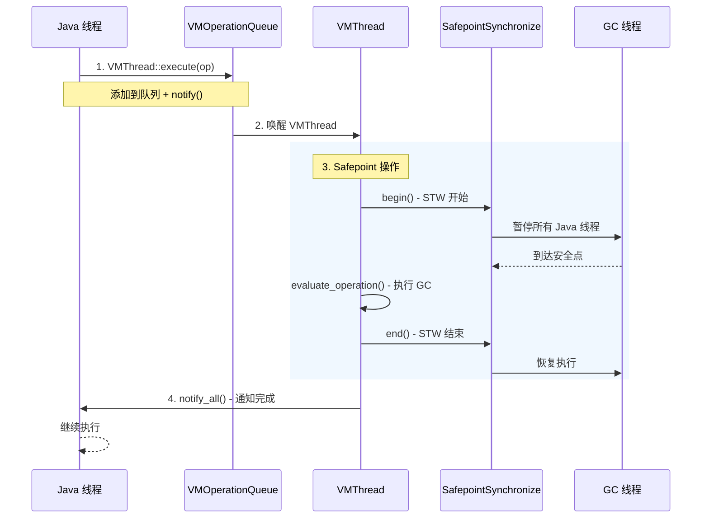

# VMThread 深度分析

> **源码位置**: `src/hotspot/share/runtime/vmThread.cpp`
> **重要程度**: ⭐⭐⭐⭐⭐ (JVM 核心后台线程，GC 执行者)
> **调用链路**: `Threads::create_vm()` → `VMThread::create()` → `VMThread::run()` → `VMThread::loop()`

---

## 第 0 部分：核心原理 ⭐

### 0.1 本质是什么？

本文是对 **VMThread 深度分析** 的深度源码分析：从数据结构到算法流程，逐层剖析其实现原理，并通过 GDB 验证关键结论。

### 0.2 为什么需要？

深入理解 JVM 内部实现，不仅能帮助排查生产问题，更能建立对 JVM 行为的精确预测能力——知道『为什么』比知道『是什么』更重要。

### 0.3 怎么解决？

采用「数据结构 → 算法流程 → GDB 验证」三步法：先完整分析所有涉及的数据结构（字段含义/sizeof/生命周期），再分析算法流程（每步有 why），最后用 GDB 实际验证关键结论。

### 0.4 为什么这样设计？

JVM 的每个设计决策都有其历史背景和性能考量。本文在分析每个关键设计时，都会解释「为什么这样而不是那样」，帮助读者建立设计直觉。

---


## 0. 核心原理

### 0.1 本质是什么？

VMThread 是 JVM 中唯一的专用后台线程，负责执行所有需要 Stop-The-World（STW）的虚拟机操作。**它不是一个 Java 线程，而是 C++ 层面的 `NamedThread` 子类**。

### 0.2 为什么需要？

JVM 中有些操作必须暂停所有 Java 线程才能安全执行：
- GC（垃圾回收）：需要遍历对象图，不能有 mutator 干扰
- 偏向锁撤销：需要修改对象头
- 类卸载：需要修改类元数据
- 逆优化：需要修改代码缓存

**问题**：谁来触发和执行这些操作？

**方案**：专用 VMThread + 操作队列模式
- 所有需要 STW 的操作都被封装成 `VM_Operation` 对象
- Java 线程将操作提交到队列
- VMThread 从队列取出操作，在安全点执行

### 0.3 怎么解决？

**核心设计**：
1. **队列缓冲**：VMOperationQueue 作为操作缓冲，支持排队和批量处理
2. **优先级队列**：SafepointPriority（高）和 MediumPriority（中）两级优先级，防止低优先级操作饿死
3. **安全点同步**：执行前调用 `SafepointSynchronize::begin()` 暂停所有 Java 线程
4. **超时强制**：GuaranteedSafepointInterval 强制触发安全点，执行清理操作

### 0.4 为什么这样设计？

**为什么用专用线程而不是任意线程？**
- 避免死锁：专用线程不持有 Java 对象锁
- 集中管理：所有 STW 操作统一入口，便于控制节奏
- 优先级保证：可以设置比所有 Java 线程更高的优先级

**为什么用队列而不是直接调用？**
- 解耦：Java 线程无需等待操作完成，提交即可返回
- 排队：支持批量处理，减少 STW 次数
- 优先级：支持分级队列，高优先级操作先执行

### 0.5 VMThread 状态机

```mermaid
stateDiagram-v2
    [*] --> Created: VMThread 创建
    Created --> Running: run() 被调用
    Running --> Waiting: 队列为空
    Waiting --> Executing: 获取到 VM_Operation
    
    Executing --> SafepointCheck: evaluate_at_safepoint()?
    SafepointCheck --> STW: 是，需要安全点
    SafepointCheck --> DirectExec: 否，直接执行
    
    STW --> STW: SafepointSynchronize::begin()
    STW --> ExecutingOp: 执行 VM 操作
    ExecutingOp --> STWEnd: 操作完成
    STWEnd --> Running: SafepointSynchronize::end()
    
    DirectExec --> Running: 操作完成
    
    Running --> Terminating: should_terminate()
    Terminating --> [*]: VM 退出
```

### 0.6 VM_Operation 执行模式对比

| 模式 | 阻塞? | 安全点? | 示例 | 特点 |
|------|------|--------|------|------|
| `_safepoint` | ✅ 阻塞 | ✅ 需要 | G1CollectForAllocation | GC、类卸载、逆优化 |
| `_no_safepoint` | ✅ 阻塞 | ❌ 不需要 | ThreadDump | 需要获取锁但不需 STW |
| `_concurrent` | ❌ 非阻塞 | ❌ 不需要 | 并发 GC 标记 | 与 Java 线程并发执行 |
| `_async_safepoint` | ❌ 非阻塞 | ✅ 需要 | ThreadStop | 异步安全点操作 |

---

## 1. 数据结构分析

### 1.1 VMThread 继承链

```
Thread (ThreadShadow)
  │
  ├── NonJavaThread
  │     │
  │     └── NamedThread
  │           │
  │           └── VMThread
  │
  └── (其他 NonJavaThread)
        ├── WatcherThread
        ├── ConcurrentGCThread
        └── ...
```

**继承关系解析**（源码：`vmThread.hpp:114`）：
```cpp
class VMThread: public NamedThread {
  // NamedThread 提供了线程名称支持
  // VMThread 是 NonJavaThread，不是 Java 线程
};
```

**从 thread.hpp 追溯**：
- `Thread` (`thread.hpp:115`)：基类，包含 OS 线程句柄、栈信息等
- `NonJavaThread` (`thread.hpp:792`)：非 Java 线程基类，链接到全局列表
- `NamedThread` (`thread.hpp:830`)：提供名称支持，包含 `_name` 字段

### 1.2 VMThread 关键字段

源码：`vmThread.hpp:114-187`

```cpp
class VMThread: public NamedThread {
 private:
  // 静态字段（类级别）
  static bool _should_terminate;           // 终止标志
  static bool _terminated;                 // 终止完成标志
  static Monitor* _terminate_lock;         // 终止锁（用于等待退出）
  static VMThread* _vm_thread;             // 唯一实例指针
  static VM_Operation* _cur_vm_operation;  // 当前正在执行的 VM 操作
  static VMOperationQueue* _vm_queue;      // VM 操作队列
  static PerfCounter* _perf_accumulated_vm_operation_time;  // 性能计数器
  static const char* _no_op_reason;        // 无操作时的原因描述
  static VMOperationTimeoutTask* _timeout_task;  // 超时检测任务
};
```

### 1.3 VMOperationQueue 队列结构

源码：`vmThread.hpp:39-85`

```cpp
class VMOperationQueue : public CHeapObj<mtInternal> {
 private:
  // 两级优先级：SafepointPriority = 0, MediumPriority = 1
  int           _queue_length[nof_priorities];  // 每个队列的长度
  int           _queue_counter;                  // 调度计数器（防饿死）
  VM_Operation* _queue[nof_priorities];         // 双端链表的头节点
  VM_Operation* _drain_list;                    // 待扫描的操作列表（GC 用）
};
```

**关键设计**：队列是**循环双链表**，始终包含一个哑节点（空队列也有一个元素）

### 1.4 VM_Operation 基类

源码：`vmOperations.hpp:134-228`

```cpp
class VM_Operation: public CHeapObj<mtInternal> {
 private:
  Thread*         _calling_thread;    // 提交操作的线程
  ThreadPriority  _priority;          // 优先级
  long            _timestamp;          // 提交时间戳
  VM_Operation*   _next;               // 链表 next
  VM_Operation*   _prev;               // 链表 prev

 public:
  // 执行模式（4 种）
  enum Mode {
    _safepoint,        // 阻塞 + 安全点 + C堆分配
    _no_safepoint,    // 阻塞 + 无安全点 + C堆分配
    _concurrent,       // 非阻塞 + 无安全点 + C堆分配
    _async_safepoint   // 非阻塞 + 安全点 + C堆分配
  };

  // 核心方法
  virtual void doit() = 0;                            // 实际操作
  virtual VMOp_Type type() const = 0;                 // 操作类型
  virtual bool evaluate_at_safepoint() const;          // 是否需要安全点
  virtual bool evaluate_concurrently() const;         // 是否可并发执行
  virtual bool allow_nested_vm_operations() const;    // 是否允许嵌套操作
};
```

### 1.5 常用 VM_Operation 子类

源码：`vmOperations.hpp:48-133`

| 操作类型 | 说明 | 评估模式 |
|---------|------|---------|
| VM_G1CollectForAllocation | G1 GC（分配失败触发） | _safepoint |
| VM_G1CollectFull | G1 Full GC | _safepoint |
| VM_CollectForAllocation | 通用分配失败 GC | _safepoint |
| VM_Deoptimize | 逆优化 | _safepoint |
| VM_ThreadDump | 线程 Dump | _no_safepoint |
| VM_ThreadStop | 线程异常终止 | _async_safepoint |
| VM_RedefineClasses | 类重定义 | _safepoint |
| VM_Exit | VM 退出 | _safepoint |

---

## 2. 完整调用链分析

### 2.1 VMThread 创建流程

**入口**：`Threads::create_vm()` → `VMThread::create()`

#### 2.1.1 VMThread::create() 源码分析

源码：`vmThread.cpp:242-275`

```cpp
void VMThread::create() {
  // 检查是否已存在（只能有一个 VMThread）
  assert(vm_thread() == NULL, "we can only allocate one VMThread");
  
  // ★ 创建 VMThread 实例
  _vm_thread = new VMThread();  // 堆分配，new VMThread()

  // ★ 如果启用超时检测，创建定时任务
  if (AbortVMOnVMOperationTimeout) {
    // 计算检测间隔（timeout 的 10%）
    size_t interval = (size_t)AbortVMOnVMOperationTimeoutDelay / 10;
    interval = interval / PeriodicTask::interval_gran * PeriodicTask::interval_gran;
    interval = MAX2<size_t>(interval, PeriodicTask::min_interval);
    interval = MIN2<size_t>(interval, PeriodicTask::max_interval);

    _timeout_task = new VMOperationTimeoutTask(interval);
    _timeout_task->enroll();  // 注册到周期性任务队列
  }

  // ★ 创建 VM 操作队列
  _vm_queue = new VMOperationQueue();
  guarantee(_vm_queue != NULL, "just checking");

  // ★ 创建终止锁
  _terminate_lock = new Monitor(Mutex::safepoint, "VMThread::_terminate_lock", true,
                                Monitor::_safepoint_check_never);

  // 创建性能计数器
  if (UsePerfData) {
    _perf_accumulated_vm_operation_time =
                 PerfDataManager::create_counter(SUN_THREADS, "vmOperationTime",
                                                 PerfData::U_Ticks, CHECK);
  }
}
```

**设计解释**：
- `VMOperationTimeoutTask`：用于检测 VM 操作是否执行过慢（JVM 挂起检测）
- `_terminate_lock`：在 VM 退出时等待 VMThread 安全终止
- `_safepoint_check_never`：终止锁在安全点检查时被视为已释放，避免死锁

#### 2.1.2 VMThread 构造函数

源码：`vmThread.cpp:277-279`

```cpp
VMThread::VMThread() : NamedThread() {
  // 设置线程名为 "VM Thread"
  set_name("VM Thread");
}
```

**设计解释**：仅设置名称，其他初始化在 `run()` 中完成

### 2.2 VMThread::run() - 线程入口

源码：`vmThread.cpp:285-359`

```cpp
void VMThread::run() {
  assert(this == vm_thread(), "check");  // 确认是全局唯一实例

  // ★ 1. 初始化命名线程
  this->initialize_named_thread();

  // ★ 2. 分配 JNI 句柄块
  // 用于在 VM 操作期间管理 JNI 局部引用
  this->set_active_handles(JNIHandleBlock::allocate_block());

  // ★ 3. 通知创建完成（唤醒等待的创建者线程）
  {
    MutexLocker ml(Notify_lock);
    Notify_lock->notify();
  }

  // ★ 4. 设置高优先级（高于所有 Java 线程）
  int prio = (VMThreadPriority == -1)
    ? os::java_to_os_priority[NearMaxPriority]
    : VMThreadPriority;
  // 注意：使用 OS 优先级而非 Java 优先级，可设置更高
  os::set_native_priority( this, prio );

  // ★ 5. 进入主循环（永远不返回）
  this->loop();

  // ===== 以下是 VM 退出时的清理 =====
  
  // 记录退出原因
  _no_op_reason = "Halt";
  
  // ★ 进入安全点（确保所有 Java 线程暂停）
  SafepointSynchronize::begin();

  // 退出前验证（如启用）
  if (VerifyBeforeExit) {
    HandleMark hm(VMThread::vm_thread());
    Universe::heap()->prepare_for_verify();
    Universe::verify();
  }

  // 阻止编译器线程继续工作
  CompileBroker::set_should_block();

  // 等待 native 状态的线程阻塞
  VM_Exit::wait_for_threads_in_native_to_block();

  // 标记终止完成，唤醒等待者
  {
    MutexLockerEx ml(_terminate_lock, Mutex::_no_safepoint_check_flag);
    _terminated = true;
    _terminate_lock->notify();
  }
}
```

**设计解释**：
- `initialize_named_thread()`：初始化线程名称和其他元数据
- `JNIHandleBlock`：VMThread 需要自己的 JNI 句柄区，因为 VM 操作可能调用 JNI
- 高优先级：确保 VM 操作能快速响应
- `loop()` 永不返回：除非 JVM 退出

### 2.3 VMThread::loop() - 核心主循环 ★★★

源码：`vmThread.cpp:457-636`

这是最核心的函数，分两部分分析：**等待操作**和**执行操作**。

#### 2.3.1 等待操作阶段

```cpp
void VMThread::loop() {
  assert(_cur_vm_operation == NULL, "no current one should be executing");

  while(true) {
    VM_Operation* safepoint_ops = NULL;

    // ===== 1. 获取 VM 操作（持锁）=====
    { 
      MutexLockerEx mu_queue(VMOperationQueue_lock,
                             Mutex::_no_safepoint_check_flag);

      // 从队列取下一个操作
      assert(_cur_vm_operation == NULL, "no current one should be executing");
      _cur_vm_operation = _vm_queue->remove_next();

      // 记录 stall 时间
      if (PrintVMQWaitTime && _cur_vm_operation != NULL &&
          !_cur_vm_operation->evaluate_concurrently()) {
        long stall = os::javaTimeMillis() - _cur_vm_operation->timestamp();
        if (stall > 0)
          tty->print_cr("%s stall: %ld",  _cur_vm_operation->name(), stall);
      }

      // ★ 队列为空，等待或强制安全点
      while (!should_terminate() && _cur_vm_operation == NULL) {
        // 等待一段时间（GuaranteedSafepointInterval ms）
        bool timedout =
          VMOperationQueue_lock->wait(Mutex::_no_safepoint_check_flag,
                                      GuaranteedSafepointInterval);

        // 自我销毁检测（测试用）
        if ((SelfDestructTimer != 0) && !VMError::is_error_reported() &&
            (os::elapsedTime() > (double)SelfDestructTimer * 60.0)) {
          tty->print_cr("VM self-destructed");
          exit(-1);
        }

        // ★ 超时且需要清理操作，强制触发安全点
        if (timedout && VMThread::no_op_safepoint_needed(false)) {
          MutexUnlockerEx mul(VMOperationQueue_lock,
                              Mutex::_no_safepoint_check_flag);
          // 强制安全点，执行清理操作
          SafepointSynchronize::begin();
          #ifdef ASSERT
            if (GCALotAtAllSafepoints) InterfaceSupport::check_gc_alot();
          #endif
          SafepointSynchronize::end();
        }
        
        // 再次尝试取操作
        _cur_vm_operation = _vm_queue->remove_next();

        // 如果取到了 safepoint 操作，批量获取同类型操作
        if (_cur_vm_operation != NULL &&
            _cur_vm_operation->evaluate_at_safepoint()) {
          safepoint_ops = _vm_queue->drain_at_safepoint_priority();
        }
      }

      if (should_terminate()) break;
    } // 释放 VMOperationQueue_lock

    // ... 执行阶段见下文 ...
  }
}
```

**关键设计**：
- `_no_safepoint_check_flag`：等待时允许持有锁，防止安全点检查死锁
- `GuaranteedSafepointInterval`：默认 1000ms，超时则强制安全点（执行清理操作）
- 批量获取：`drain_at_safepoint_priority()` 一次性取出所有待执行的 safepoint 操作

#### 2.3.2 执行操作阶段

```cpp
    // ===== 2. 执行 VM 操作 =====
    { 
      HandleMark hm(VMThread::vm_thread());

      EventMark em("Executing VM operation: %s", vm_operation()->name());
      assert(_cur_vm_operation != NULL, "we should have found an operation to execute");

      // 避免被抢占，帮助 VMThread 快速完成
      if( VMThreadHintNoPreempt )
        os::hint_no_preempt();

      // ★ 分支 1：需要安全点的操作（如 GC）
      if (_cur_vm_operation->evaluate_at_safepoint()) {
        log_debug(vmthread)("Evaluating safepoint VM operation: %s", _cur_vm_operation->name());

        // 设置 drain list（供 GC 扫描）
        _vm_queue->set_drain_list(safepoint_ops);

        // ★★★ 开始 STW（所有 Java 线程暂停）
        SafepointSynchronize::begin();

        // 启动超时检测
        if (_timeout_task != NULL) {
          _timeout_task->arm();
        }

        // 执行主操作
        evaluate_operation(_cur_vm_operation);

        // ★ 批量执行其他 safepoint 操作（优化：减少 STW 次数）
        do {
          _cur_vm_operation = safepoint_ops;
          if (_cur_vm_operation != NULL) {
            do {
              EventMark em("Executing coalesced safepoint VM operation: %s", _cur_vm_operation->name());
              log_debug(vmthread)("Evaluating coalesced safepoint VM operation: %s", _cur_vm_operation->name());
              
              VM_Operation* next = _cur_vm_operation->next();
              _vm_queue->set_drain_list(next);
              
              // 执行操作（会 delete 操作对象）
              evaluate_operation(_cur_vm_operation);
              _cur_vm_operation = next;
              
              if (PrintSafepointStatistics) {
                SafepointSynchronize::inc_vmop_coalesced_count();
              }
            } while (_cur_vm_operation != NULL);
          }
          // 再次检查队列（可能有新操作到达）
          if (_vm_queue->peek_at_safepoint_priority()) {
            MutexLockerEx mu_queue(VMOperationQueue_lock,
                                     Mutex::_no_safepoint_check_flag);
            safepoint_ops = _vm_queue->drain_at_safepoint_priority();
          } else {
            safepoint_ops = NULL;
          }
        } while(safepoint_ops != NULL);

        _vm_queue->set_drain_list(NULL);

        // 关闭超时检测
        if (_timeout_task != NULL) {
          _timeout_task->disarm();
        }

        // ★★★ 结束 STW（恢复所有 Java 线程）
        SafepointSynchronize::end();

      } else {
        // ★ 分支 2：非安全点操作（直接执行）
        log_debug(vmthread)("Evaluating non-safepoint VM operation: %s",
                           _cur_vm_operation->name());
        
        if (TraceLongCompiles) {
          elapsedTimer t;
          t.start();
          evaluate_operation(_cur_vm_operation);
          t.stop();
          double secs = t.seconds();
          if (secs * 1e3 > LongCompileThreshold) {
            tty->print_cr("vm %s: %3.7f secs]", _cur_vm_operation->name(), secs);
          }
        } else {
          evaluate_operation(_cur_vm_operation);
        }

        _cur_vm_operation = NULL;
      }
    }

    // 3. 通知等待的 Java 线程操作已完成
    { 
      MutexLockerEx mu(VMOperationRequest_lock,
                       Mutex::_no_safepoint_check_flag);
      VMOperationRequest_lock->notify_all();
    }

    // 4. 定期检查是否需要强制安全点（清理）
    if (VMThread::no_op_safepoint_needed(true)) {
      HandleMark hm(VMThread::vm_thread());
      SafepointSynchronize::begin();
      SafepointSynchronize::end();
    }
  }
}
```

**关键设计**：
- `SafepointSynchronize::begin()`：请求所有 Java 线程到达安全点，暂停执行
- 批量执行：一次性执行所有 pending 的 safepoint 操作，减少 STW 次数
- `evaluate_operation()` 内部会 delete 操作对象
- 操作完成后通知 `VMOperationRequest_lock` 上的等待线程

### 2.4 VMThread::execute() - 提交 VM 操作

这是 Java 线程向 VMThread 提交操作的入口。

#### 2.4.1 调用链 Mermaid 图



源码：`vmThread.cpp:663-757`

```cpp
void VMThread::execute(VM_Operation* op) {
  Thread* t = Thread::current();

  // ★ 分支 1：调用者是 Java 线程或 WatcherThread
  if (!t->is_VM_thread()) {
    SkipGCALot sgcalot(t);    // 避免嵌套 GC

    // 检查是否可以并发执行
    bool concurrent = op->evaluate_concurrently();
    
    // 阻塞操作需要检查安全点状态
    if (!concurrent) {
      t->check_for_valid_safepoint_state(true);
    }

    // 前置处理（如需要）
    if (!op->doit_prologue()) {
      return;   // 操作被取消
    }

    // 设置调用线程和优先级
    op->set_calling_thread(t, Thread::get_priority(t));

    // 是否需要执行后置处理
    bool execute_epilog = !op->is_cheap_allocated();

    // 获取票号（非并发操作需要等待完成）
    int ticket = 0;
    if (!concurrent) {
      ticket = t->vm_operation_ticket();
    }

    // ★ 将操作加入队列
    {
      VMOperationQueue_lock->lock_without_safepoint_check();
      log_debug(vmthread)("Adding VM operation: %s", op->name());
      bool ok = _vm_queue->add(op);
      op->set_timestamp(os::javaTimeMillis());
      VMOperationQueue_lock->notify();  // 唤醒 VMThread
      VMOperationQueue_lock->unlock();
      
      // 操作被跳过（如并发操作队列满）
      if (!ok) {
        assert(concurrent, "can only skip concurrent tasks");
        if (op->is_cheap_allocated()) delete op;
        return;
      }
    }

    // ★ 等待操作完成（非并发操作）
    if (!concurrent) {
      MutexLocker mu(VMOperationRequest_lock);
      while(t->vm_operation_completed_count() < ticket) {
        VMOperationRequest_lock->wait(!t->is_Java_thread());
      }
    }

    // 后置处理
    if (execute_epilog) {
      op->doit_epilogue();
    }
  } 
  
  // ★ 分支 2：调用者已经是 VMThread（嵌套 VM 操作）
  else {
    assert(t->is_VM_thread(), "must be a VM thread");
    VM_Operation* prev_vm_operation = vm_operation();
    
    // 检查是否允许嵌套操作
    if (prev_vm_operation != NULL) {
      if (!prev_vm_operation->allow_nested_vm_operations()) {
        fatal("Nested VM operation %s requested by operation %s",
              op->name(), vm_operation()->name());
      }
      op->set_calling_thread(prev_vm_operation->calling_thread(), prev_vm_operation->priority());
    }

    EventMark em("Executing %s VM operation: %s", 
                 prev_vm_operation ? "nested" : "", op->name());

    // 释放内部句柄
    HandleMark hm(t);
    _cur_vm_operation = op;

    // 如果需要安全点但当前不在安全点，先开始安全点
    if (op->evaluate_at_safepoint() && !SafepointSynchronize::is_at_safepoint()) {
      SafepointSynchronize::begin();
      op->evaluate();
      SafepointSynchronize::end();
    } else {
      op->evaluate();
    }

    // 释放内存
    if (op->is_cheap_allocated()) delete op;

    _cur_vm_operation = prev_vm_operation;
  }
}
```

**关键设计**：
- `evaluate_concurrently()`：某些操作可以与 Java 线程并发执行，无需等待
- `vm_operation_ticket()`：基于票号的等待机制，保证 FIFO
- `lock_without_safepoint_check()`：在安全点同步期间也能加锁（因为此时不能进行安全点检查）
- `notify()`：唤醒等待中的 VMThread

### 2.5 VM_Operation 执行

源码：`vmThread.cpp:403-435`

```cpp
void VMThread::evaluate_operation(VM_Operation* op) {
  ResourceMark rm;  // 管理临时资源

  {
    // 性能计时
    PerfTraceTime vm_op_timer(perf_accumulated_vm_operation_time());
    HOTSPOT_VMOPS_BEGIN(
                     (char *) op->name(), strlen(op->name()),
                     op->evaluation_mode());

    EventExecuteVMOperation event;
    
    // ★ 调用 VM_Operation::evaluate() → doit()
    op->evaluate();

    if (event.should_commit()) {
      post_vm_operation_event(&event, op);
    }

    HOTSPOT_VMOPS_END(
                     (char *) op->name(), strlen(op->name()),
                     op->evaluation_mode());
  }

  // 标记完成
  bool c_heap_allocated = op->is_cheap_allocated();

  if (!op->evaluate_concurrently()) {
    op->calling_thread()->increment_vm_operation_completed_count();
  }
  
  // ★ 释放操作对象
  if (c_heap_allocated) {
    delete _cur_vm_operation;
  }
}
```

---

## 3. GC 触发完整流程

### 3.1 分配失败触发 GC

```mermaid
flowchart TD
    A[Java: new Object()] --> B{G1CollectedHeap::allocate_from_tlab}
    B -->|TLAB 足够| C[返回分配成功]
    B -->|TLAB 不足| D[G1CollectedHeap::allocate_new_tlab]
    D -->|堆空间足够| E[重新分配 TLAB]
    D -->|堆空间不足| F[分配失败]
    
    F --> G[G1CollectedHeap::satisfy_failed_allallocation]
    G --> H[do_collection_pause]
    H --> I[VM_G1CollectForAllocation]
    I --> J[VMThread::execute]
    
    J --> K[VMOperationQueue::add]
    K --> L[VMOperationQueue_lock::notify]
    L --> M[VMThread::loop 被唤醒]
    M --> N[remove_next 获取操作]
    
    N --> O{SafepointSynchronize::begin}
    O --> P[STW - 所有 Java 线程暂停]
    P --> Q[VM_G1CollectForAllocation::doit]
    Q --> R[g1h::do_collection_pause_at_safepoint]
    R --> S[执行 GC: 标记-复制-清理]
    S --> T[SafepointSynchronize::end]
    T --> U[恢复所有 Java 线程]
    
    C --> V[继续执行]
    U --> V
```

### 3.2 关键源码对应

| 步骤 | 源码位置 | 关键代码 |
|------|---------|---------|
| 分配失败 | `g1CollectedHeap.cpp` | `satisfy_failed_allocation()` |
| 创建 GC 操作 | `vmOperations.cpp` | `VM_G1CollectForAllocation` 构造函数 |
| 提交到队列 | `vmThread.cpp:698` | `_vm_queue->add(op)` |
| 唤醒 VMThread | `vmThread.cpp:702` | `VMOperationQueue_lock->notify()` |
| 开始 STW | `safepoint.cpp` | `SafepointSynchronize::begin()` |
| 执行 GC | `g1CollectedHeap.cpp` | `do_collection_pause_at_safepoint()` |
| 结束 STW | `safepoint.cpp` | `SafepointSynchronize::end()` |

---

## 4. 并发设计分析

### 4.1 涉及的线程

| 线程 | 角色 | 参与的并发场景 |
|------|------|---------------|
| VMThread | 执行者 | 从队列取操作、执行 GC |
| Java 线程 | 提交者 | 提交 VM 操作、等待完成 |
| GC 线程 | 协作者 | 并发标记、清理 |
| WatcherThread | 触发者 | 定时检查是否需要安全点 |

### 4.2 共享数据与保护

| 共享数据 | 保护机制 | 说明 |
|---------|---------|------|
| VMOperationQueue | Mutex（VMOperationQueue_lock） | 队列的 add/remove 需要加锁 |
| _cur_vm_operation | VMThread 单线程访问 | 只有 VMThread 访问 |
| _should_terminate | Mutex（_terminate_lock） | 退出时原子修改 |
| VMOperationRequest_lock | Mutex | 等待/通知机制 |

### 4.3 关键同步原语

| 场景 | 使用的原语 | 原因 |
|------|-----------|------|
| 队列操作 | `MutexLockerEx` + `_no_safepoint_check_flag` | 避免等待时触发安全点死锁 |
| 等待操作 | `VMOperationQueue_lock->wait()` | 条件变量等待 |
| 通知完成 | `VMOperationRequest_lock->notify_all()` | 唤醒等待的 Java 线程 |
| 超时强制安全点 | `SafepointSynchronize::begin/end` | 保证清理操作定期执行 |

---

## 5. JVM 参数

| 参数 | 默认值 | 说明 |
|------|-------|------|
| `-XX:GuaranteedSafepointInterval` | 1000 (ms) | 强制安全点间隔，超时则执行清理操作 |
| `-XX:VMThreadPriority` | -1 (NearMaxPriority) | VMThread 优先级，-1 表示使用 NearMaxPriority |
| `-XX:+SafepointALot` | false | 频繁触发安全点（用于测试） |
| `-XX:+PrintVMQWaitTime` | false | 打印 VM 操作等待时间 |
| `-XX:+PrintSafepointStatistics` | false | 打印安全点统计 |
| `-XX:AbortVMOnVMOperationTimeout` | false | VM 操作超时时 abort |
| `-XX:AbortVMOnVMOperationTimeoutDelay` | 60000 (ms) | VM 操作超时阈值 |

---

## 6. GDB 调试验证

### 6.1 验证脚本

```gdb
# 加载 JVM
file /data/workspace/openjdk-cut-new/build/linux-x86_64-normal-server-slowdebug/jdk/bin/java
set pagination off

# 断点：VMThread 创建
b VMThread::create
# 断点：VMThread::run()
b VMThread::run  
# 断点：主循环
b VMThread::loop
# 断点：安全点开始
b SafepointSynchronize::begin
# 断点：安全点结束
b SafepointSynchronize::end
# 断点：操作提交
b VMThread::execute(VM_Operation*)

# 运行
run -Xms8g -Xmx8g -XX:+UseG1GC -Xint -cp /data/workspace/demo/src com.wjcoder.Main
```

### 6.2 预期输出示例

```
========== [VMThread::run] ==========
VMThread thread = 0x7f1234000000
Thread name: VM Thread
VMThread::_vm_queue = 0x7f1234020000
======================================

========== [VMThread::loop] - Main Loop Entry ==========
VMThread::_cur_vm_operation = 0x0
VMThread::_should_terminate = 0
VMOperationQueue _queue_length[0] = 0
VMOperationQueue _queue_length[1] = 0
======================================================

========== [VMThread::execute] - VM Operation Submitted ==========
New VM operation: G1CollectForAllocation
Operation evaluation_mode: 0
Operation evaluate_at_safepoint: 1
============================================================

========== [SafepointSynchronize::begin] - STW Start ==========
VMThread is about to initiate a safepoint
Current VM operation: G1CollectForAllocation
Safepoint counter before: 0
========================================================

========== [SafepointSynchronize::end] - STW End ==========
Safepoint completed
Safepoint counter after: 1
=====================================================
```

---

## 7. 总结

### 7.1 核心要点

1. **VMThread 是 JVM 的心脏**：负责执行所有需要 STW 的操作

2. **工作模式**：
   - `loop()` 不断从队列取操作
   - 需要安全点的操作 → 先 `begin()` 再执行 → 后 `end()`
   - 非安全点操作 → 直接执行

3. **队列设计**：两级优先级（Safepoint/Medium），防止低优先级饿死

4. **GC 触发链路**：
   ```
   分配失败 → VM_G1CollectForAllocation 
     → VMThread::execute() 
       → VMOperationQueue 
         → VMThread::loop() 
           → SafepointSynchronize::begin() 
             → doit() (执行GC) 
               → SafepointSynchronize::end()
   ```

5. **与 Safepoint 的关系**：VMThread 是 Safepoint 的发起者和执行者

### 7.2 面试问答

**Q1: VMThread 和 Java 线程的区别？**
- VMThread 是 C++ 线程，继承自 NamedThread
- Java 线程是 Java 层的概念，通过 JVM 映射到 OS 线程
- VMThread 不运行 Java 代码，只执行 VM 操作

**Q2: 为什么 GC 需要 VMThread？**
- GC 需要遍历对象图，不能有 mutator 干扰
- 需要暂停所有 Java 线程（STW）
- VMThread 作为统一的执行者，集中管理所有 STW 操作

**Q3: VMThread 如何与 Java 线程通信？**
- 通过 VMOperationQueue 队列
- Java 线程提交操作后可以等待（阻塞式）或返回（非阻塞式）
- VMThread 执行完后通过 VMOperationRequest_lock 通知

**Q4: 为什么需要 GuaranteedSafepointInterval？**
- 某些清理操作（如清理已分配但未使用的内存）必须在安全点执行
- 如果没有操作提交，VMThread 会空闲
- 超时后强制触发安全点，确保清理操作定期执行

**Q5: VMThread 会在安全点之外执行操作吗？**
- 是的，非安全点操作（如 ThreadDump）可以在 Java 线程运行时执行
- 通过 `evaluation_mode()` 判断：`evaluate_at_safepoint()` 返回 false 则不需要安全点

---

## 8. 参考资料

- 源码文件：
  - `src/hotspot/share/runtime/vmThread.cpp` - VMThread 实现
  - `src/hotspot/share/runtime/vmThread.hpp` - VMThread 声明
  - `src/hotspot/share/runtime/vmOperations.hpp` - VM_Operation 定义
  - `src/hotspot/share/runtime/thread.hpp` - 线程基类
  - `src/hotspot/share/runtime/safepoint.cpp` - 安全点实现
