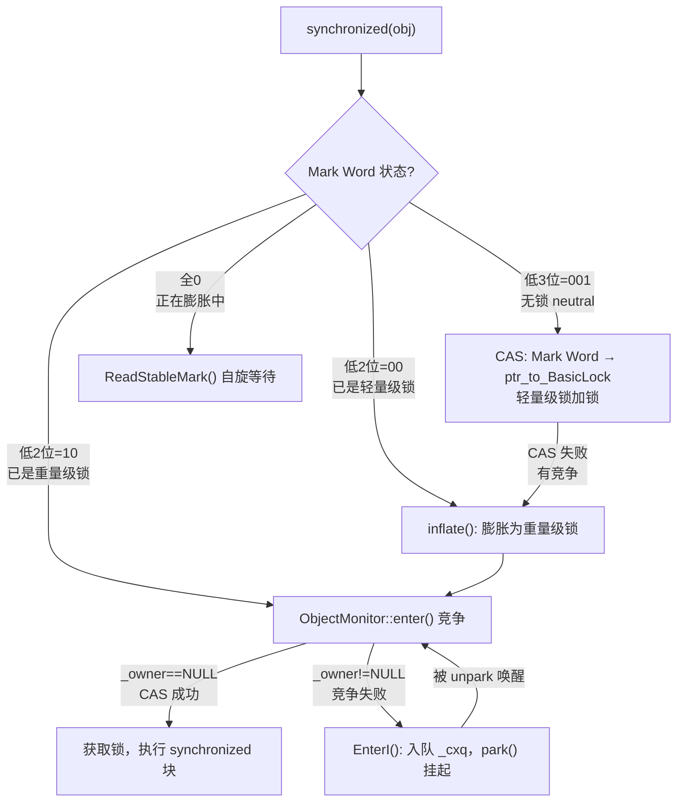
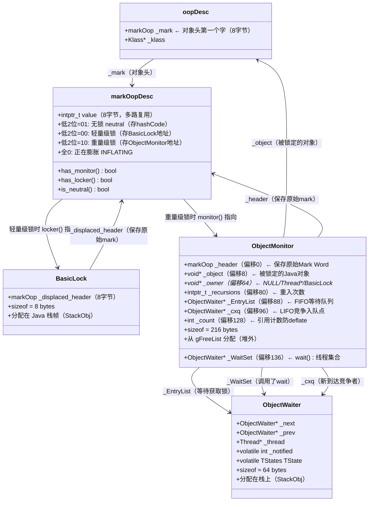

# 01 · synchronized — 从"为什么需要锁"到"JVM 怎么实现锁"

> 基于 OpenJDK 11 源码，`-Xms8g -Xmx8g -XX:+UseG1GC -Xint -XX:-UseBiasedLocking`

---

## 写在前面

我不会上来就给你讲 Mark Word、ObjectMonitor、inflate。

我会先问你几个问题，让你自己想一想，然后告诉你 JVM 的真实答案。

这篇文章分四个部分：
1. **背景知识**：什么是线程安全问题？为什么需要锁？
2. **锁的基本概念**：互斥、可见性、原子性
3. **synchronized 的设计**：我以为是 xxx，结果是 xxx，为什么？
4. **TODO**：涉及到的其他模块，留待后续

---

## 第一部分：背景知识 — 为什么需要锁

### 先问你一个问题

两个线程同时执行 `count++`，最终 `count` 是多少？

```java
int count = 0;

// 线程 A 和线程 B 同时执行：
count++;
```

你可能以为是 2。

**实际上可能是 1。**

---

### 为什么会是 1？— CPU 指令不是原子的

`count++` 看起来是一条语句，但 CPU 执行的是三条指令：

```asm
1. LOAD:  把 count 从内存读到寄存器（比如 eax = 0）
2. ADD:   寄存器加 1（eax = 1）
3. STORE: 把寄存器写回内存（count = 1）
```

如果两个线程同时执行，可能发生这样的交错：

```
线程 A: LOAD  → eax_A = 0
线程 B: LOAD  → eax_B = 0   ← B 读到的也是 0！
线程 A: ADD   → eax_A = 1
线程 A: STORE → count = 1
线程 B: ADD   → eax_B = 1
线程 B: STORE → count = 1   ← B 把 A 的结果覆盖了！
```

两个线程各执行了一次 `count++`，但最终结果是 1，不是 2。

**这就是竞态条件（Race Condition）**：多个线程同时访问共享数据，结果取决于线程执行的顺序。

---

### 还有一个问题：CPU 缓存导致的可见性问题

现代 CPU 有多级缓存（L1/L2/L3）。每个 CPU 核心有自己的 L1/L2 缓存。

```
CPU 核心 0:  [L1 Cache] → [L2 Cache] → [L3 Cache] → [内存]
CPU 核心 1:  [L1 Cache] → [L2 Cache] → [L3 Cache] → [内存]
```

线程 A 在核心 0 上修改了 `count`，这个修改先写到核心 0 的 L1 缓存，**不一定立刻写回内存**。

线程 B 在核心 1 上读 `count`，读到的是核心 1 的 L1 缓存里的旧值。

**这就是可见性问题**：一个线程的修改，另一个线程不一定能立刻看到。

---

### 解决方案：互斥锁

要解决这两个问题，需要：
1. **互斥（Mutual Exclusion）**：同一时刻只有一个线程能执行某段代码
2. **可见性（Visibility）**：一个线程的修改，其他线程能立刻看到

最直接的解决方案是**互斥锁（Mutex）**：

```
线程 A 进入临界区前：加锁（如果锁被占用，等待）
线程 A 执行临界区代码
线程 A 离开临界区后：解锁（通知等待的线程）
```

Java 的 `synchronized` 就是这样一把互斥锁。

---

### 但是：OS 的 mutex 很慢

操作系统提供了 `pthread_mutex_lock`/`pthread_mutex_unlock`，可以实现互斥。

**问题**：OS mutex 需要系统调用，每次加锁/解锁需要几微秒（几千个 CPU 周期）。

如果 `count++` 只需要几纳秒，但加锁/解锁需要几微秒，那锁的开销比实际工作大 1000 倍。

**这就是 JVM 要解决的核心问题**：在保证正确性的前提下，让锁尽可能快。

---

### JVM 的思路：分级锁

JVM 的思路是：**根据竞争程度，使用不同的锁实现**。

```
无竞争（最常见）：
  → 用 CAS（一条 CPU 指令，纳秒级）
  → 轻量级锁（Light-weight Lock）

有竞争（需要等待）：
  → 用 OS mutex（park/unpark，微秒级）
  → 重量级锁（Heavy-weight Lock / ObjectMonitor）
```

这就是 JVM 锁的核心设计思路。接下来，我们来看 JVM 是怎么实现的。

---

## 第二部分：锁的基本概念

### 原子性、可见性、有序性

在讲 synchronized 的实现之前，先明确三个概念：

**原子性**：一个操作要么全部执行，要么全部不执行，不会被中断。

```java
// 不是原子的：
count++;  // 三条指令，可能被中断

// 是原子的：
AtomicInteger.incrementAndGet();  // 用 CAS 保证原子性
```

**可见性**：一个线程的修改，其他线程能立刻看到。

```java
// 不保证可见性：
int count = 0;  // 可能在 CPU 缓存里，其他线程看不到

// 保证可见性：
volatile int count = 0;  // 每次读写都直接访问内存
```

**有序性**：代码按照编写顺序执行（编译器和 CPU 可能重排序指令）。

**`synchronized` 同时保证这三个属性**：
- 原子性：同一时刻只有一个线程执行临界区
- 可见性：退出 synchronized 块时，修改立刻对其他线程可见（内存屏障）
- 有序性：synchronized 块内的代码不会被重排序到块外

---

## 第三部分：synchronized 的设计 — 我以为 vs 实际

---

## 第零天：我以为 synchronized 就是一把 0/1 的锁

我最开始的理解是这样的：

```
synchronized(obj) {
    // 进来 → 锁=1
    // 出去 → 锁=0
}
```

就是一个全局的 0/1 标志位，有人拿着就是 1，没人拿就是 0。竞争的时候就是 CAS 抢那个 1。

然后我去看源码，发现完全不是这回事。

**第一个打脸**：锁状态不是 0/1，是 4 种状态，编码在对象头的 8 字节里。  
**第二个打脸**：大多数情况下根本不用 OS 的 mutex，用的是 CAS + 栈上的一个指针（8 字节）。  
**第三个打脸**：`ObjectMonitor` 有 216 字节，里面有两个等待队列（`_cxq` 和 `_EntryList`），不是一个。  
**第四个打脸**：`exit()` 里有一个让我困惑了很久的设计：**先释放锁，再重新获取锁**，才能唤醒等待者。

---

## 第一天：MarkWord 有 4 种状态（不是 0/1）

### 我踩的第一个坑：锁信息存在哪里？

我以为锁信息存在某个全局的 `Map<Object, Lock>` 里。

实际上锁信息存在**对象头的第一个字（8 字节）**里，叫 Mark Word。

```
对象内存布局（64位 JVM，开启压缩指针）：
┌─────────────────────────────────────────────────────────────┐
│  Mark Word（8 字节）← 锁状态就在这里！                       │
│  Klass*（4 字节，压缩后）← 指向类元数据                      │
│  [padding 4 字节]                                           │
│  字段1 ...                                                  │
└─────────────────────────────────────────────────────────────┘
```

**Mark Word 的 4 种编码**（低 2 位决定状态）：

```
低2位 = 01（且 biased_lock=0）→ 无锁（neutral）
低2位 = 00                   → 轻量级锁（stack-locked）
低2位 = 10                   → 重量级锁（inflated）
低2位 = 11                   → GC 标记（marked）
全 0（0x0000...0000）         → 正在膨胀（INFLATING，临时状态）
```

**每种状态下 8 字节的含义不同**：

```
无锁（neutral）：
  [hashCode(31位) | unused(1) | age(4) | biased_lock(0) | lock(01)]

轻量级锁（stack-locked）：
  [ptr_to_BasicLock(62位)                                | lock(00)]
   ↑ 指向当前线程栈帧上的 BasicLock 结构体

重量级锁（inflated）：
  [ptr_to_ObjectMonitor(62位)                            | lock(10)]
   ↑ 指向堆外的 ObjectMonitor 结构体（216 字节）
```

**关键洞察**：Mark Word 是一个**多路复用的 8 字节**——无锁时存 hashCode，轻量级锁时存 Lock Record 地址，重量级锁时存 ObjectMonitor 地址。这就是为什么 `System.identityHashCode(obj)` 在加了重量级锁之后还能返回正确值——hashCode 被保存到了 ObjectMonitor 的 `_header` 字段里，解锁后再写回来。

---

## 第一天半：数据结构补课

> 我第二天看加锁流程时，发现自己对 BasicLock 和 ObjectMonitor 完全没概念，回来补课。

### BasicLock：轻量级锁的"存根"（8 字节，在栈上）

```cpp
// runtime/basicLock.hpp:35
class BasicLock {
  volatile markOop _displaced_header;  // 保存对象原始 Mark Word（8 字节）
};
// sizeof(BasicLock) = 8 字节
// 分配位置：持锁线程的 Java 栈帧（不在堆上！）
```

**它的作用**：轻量级锁加锁时，JVM 把对象原始的 Mark Word（含 hashCode、GC 年龄）保存到这里，然后把对象头的 Mark Word 改成指向这个 BasicLock 的指针（低2位=00）。

解锁时，把 `_displaced_header` 里保存的原始 Mark Word 用 CAS 写回对象头，完成解锁。

**为什么要保存原始 Mark Word？**  
因为原始 Mark Word 里有 hashCode 和 GC 年龄，这些信息不能丢。inflate 时也需要从这里取回原始 Mark Word 存入 ObjectMonitor。

### ObjectMonitor：重量级锁的"全家桶"（216 字节，在堆外）

```
ObjectMonitor 内存布局（偏移量，GDB 实测）：
┌──────────────────────────────────────────────────────────────┐
│ 偏移  0: _header        (8 bytes)  ← 保存原始 Mark Word      │
│ 偏移  8: _object        (8 bytes)  ← 指向被锁定的 Java 对象  │
│ 偏移 16: FreeNext       (8 bytes)  ← 空闲链表指针            │
│ ─────────── 缓存行填充（避免 false sharing）─────────────── │
│ 偏移 64: _owner         (8 bytes)  ← 当前持锁者（3种值！）   │
│ 偏移 72: _previous_owner_tid (8 bytes)                       │
│ 偏移 80: _recursions    (8 bytes)  ← 重入次数               │
│ 偏移 88: _EntryList     (8 bytes)  ← 等待获取锁的线程队列    │
│ 偏移 96: _cxq           (8 bytes)  ← 新到达竞争线程的入队点  │
│ 偏移104: _succ          (8 bytes)  ← 继承者线程              │
│ 偏移112: _Responsible   (8 bytes)  ← 负责定时唤醒的线程      │
│ 偏移120: _Spinner       (4 bytes)                            │
│ 偏移124: _SpinDuration  (4 bytes)  ← 自旋时长控制            │
│ 偏移128: _count         (4 bytes)  ← 引用计数（防止 deflate）│
│ 偏移132: [padding]      (4 bytes)                            │
│ 偏移136: _WaitSet       (8 bytes)  ← 调用 wait() 的线程集合  │
│ 偏移144: _waiters       (4 bytes)  ← wait() 线程数量         │
│ 偏移148: _WaitSetLock   (4 bytes)  ← 保护 _WaitSet 的自旋锁  │
│ 偏移152: [padding]      (64 bytes) ← 缓存行对齐填充          │
│ 总大小: 216 bytes                                            │
└──────────────────────────────────────────────────────────────┘
```

**我没想到的设计 1**：`_owner` 偏移是 64，不是 0。前 64 字节（`_header`/`_object`/`FreeNext`）和后面的 `_owner` 之间有**缓存行填充**。

为什么？`_header` 和 `_object` 在 inflate/deflate 时修改，`_owner` 在 enter/exit 时修改，这两组操作在不同线程上并发执行，如果在同一缓存行会产生 false sharing，性能下降。

**我没想到的设计 2**：`_owner` 有**三种值**：
1. `NULL`：没人持有锁
2. `JavaThread*`：某个线程持有锁
3. `BasicLock*`：inflate 时从轻量级锁转来，owner 是 Lock Record 地址

第三种情况是 inflate 的遗留——inflate 时 `m->set_owner(mark->locker())`，设置的是 Lock Record 地址。等到 `enter()` 被调用时，会通过 `is_lock_owned()` 检查这个 Lock Record 是否属于当前线程，如果是，就把 `_owner` 从 Lock Record 地址改为线程指针。

**我没想到的设计 3**：两个等待队列 `_cxq` 和 `_EntryList`，不是一个。

- `_cxq`（ContentionQueue）：新到达的竞争线程通过 **CAS 无锁入队**（LIFO 栈），极其高效
- `_EntryList`：从 `_cxq` 批量转移过来的线程，**FIFO 顺序**，保证公平性

解锁时，把 `_cxq` 里的线程批量转移到 `_EntryList`，然后从 `_EntryList` 头部唤醒一个线程。这样兼顾了**入队效率**（CAS 无锁）和**唤醒公平性**（FIFO）。

### ObjectWaiter：线程的"代理节点"（栈上分配）

```cpp
// runtime/objectMonitor.hpp:44
class ObjectWaiter : public StackObj {  // StackObj = 分配在栈上
  ObjectWaiter * volatile _next;   // 双向链表 next（_WaitSet 用）
  ObjectWaiter * volatile _prev;   // 双向链表 prev（_WaitSet 用）
  Thread*        _thread;          // 对应的线程
  jlong          _notifier_tid;    // 谁 notify 了我
  ParkEvent*     _event;           // 用于 park/unpark
  volatile int   _notified;        // 是否已被 notify（0/1）
  volatile TStates TState;         // 当前在哪个队列
  // ...
};
```

`TState` 枚举记录线程在哪个队列里：

```cpp
enum TStates {
    TS_UNDEF,   // 未定义
    TS_READY,   // 准备好了
    TS_RUN,     // 正在运行（不在任何队列）
    TS_WAIT,    // 在 _WaitSet 中等待 notify
    TS_ENTER,   // 在 _EntryList 中等待锁
    TS_CXQ      // 在 _cxq 中等待锁
};
```

---

## 第二天：加锁流程（4 条路径，不是 1 条）

### 我以为只有一条路

我以为 `synchronized(obj)` 就是：检查锁是否空闲，空闲就拿，不空闲就等。

实际上有 **4 条路径**，取决于 Mark Word 的当前状态：



### 路径 1：轻量级锁（无竞争，最常见）

解释器执行 `monitorenter` 字节码时，先尝试轻量级锁：

```cpp
// interpreterRuntime.cpp:fast_enter() → synchronizer.cpp:fast_enter()
// synchronizer.cpp:250
void ObjectSynchronizer::fast_enter(Handle obj, BasicLock* lock,
                                    bool attempt_rebias, TRAPS) {
  // 1. 把对象原始 Mark Word 保存到 BasicLock（栈上）
  markOop mark = obj()->mark();
  lock->set_displaced_header(mark);  // ★ 保存原始 Mark Word

  // 2. CAS：把对象头 Mark Word 改为指向 BasicLock 的指针
  //    期望值：mark（原始 Mark Word）
  //    新值：  encode(lock)（BasicLock 地址，低2位=00）
  if (mark == obj()->cas_set_mark(markOopDesc::encode(lock), mark)) {
    // ★ CAS 成功 → 轻量级锁加锁完成！
    // 对象头 Mark Word 现在 = ptr_to_BasicLock（低2位=00）
    return;
  }
  // ★ CAS 失败 → 有竞争，走 inflate 路径
  ObjectSynchronizer::inflate(THREAD, obj(), inflate_cause_monitor_enter)->enter(THREAD);
}
```

**为什么用 CAS 而不是 mutex？**  
CAS 是一条 CPU 指令（x86 的 `lock cmpxchg`），纳秒级。OS mutex 需要系统调用，微秒级。无竞争时 CAS 快 100 倍以上。

### 路径 2：inflate() 膨胀（有竞争时）

`inflate()` 函数（`synchronizer.cpp:1387`）把对象从轻量级锁或无锁状态膨胀为重量级锁。

**4 个 CASE 分支**（真实源码，`synchronizer.cpp:1398-1580`）：

```cpp
// synchronizer.cpp:1387
ObjectMonitor* ObjectSynchronizer::inflate(Thread * Self, oop object,
                                           const InflateCause cause) {
  for (;;) {
    const markOop mark = object->mark();

    // ★ CASE 1: 已膨胀 → 直接返回（最快路径）
    if (mark->has_monitor()) {
      ObjectMonitor * inf = mark->monitor();
      return inf;  // 直接返回已有的 ObjectMonitor
    }

    // ★ CASE 2: 正在膨胀中（全0，INFLATING）→ 自旋等待
    // 另一个线程正在执行 CASE 3 的膨胀，只有它能完成
    if (mark == markOopDesc::INFLATING()) {
      ReadStableMark(object);  // 自旋/yield/park，等待膨胀完成
      continue;
    }

    // ★ CASE 3: 轻量级锁（stack-locked）→ 膨胀
    if (mark->has_locker()) {
      ObjectMonitor * m = omAlloc(Self);  // 从线程私有列表或全局 gFreeList 取一个
      m->Recycle();
      m->_Responsible  = NULL;
      m->_recursions   = 0;
      m->_SpinDuration = ObjectMonitor::Knob_SpinLimit;

      // ★ 关键：先写入 INFLATING(0)，阻止并发解锁
      // 为什么要写 0？因为持锁线程解锁时会 CAS(displaced_header, mark)
      // 如果 mark 是 0，CAS 会失败，持锁线程就会等待膨胀完成
      markOop cmp = object->cas_set_mark(markOopDesc::INFLATING(), mark);
      if (cmp != mark) {
        omRelease(Self, m, true);
        continue;  // CAS 失败，重试
      }

      // ★ 从 Lock Record（BasicLock）取回原始 Mark Word
      // 此时 mark->locker() 是 BasicLock 的地址（在持锁线程的栈上）
      markOop dmw = mark->displaced_mark_helper();  // 读 BasicLock._displaced_header

      m->set_header(dmw);              // ★ 保存原始 Mark Word（deflate 时写回对象头）
      m->set_owner(mark->locker());    // ★ owner = BasicLock 地址（不是线程！）
      m->set_object(object);

      // ★ 完成膨胀：把对象头 Mark Word 改为指向 ObjectMonitor 的指针（低2位=10）
      object->release_set_mark(markOopDesc::encode(m));
      return m;
    }

    // ★ CASE 4: 无锁（neutral）→ 膨胀
    // 无锁时不需要 INFLATING 中间状态，因为没有持锁线程会并发解锁
    ObjectMonitor * m = omAlloc(Self);
    m->Recycle();
    m->set_header(mark);   // ★ 保存原始 Mark Word（含 hashCode）
    m->set_owner(NULL);    // ★ 无人持有，owner=NULL
    m->set_object(object);
    m->_recursions   = 0;
    m->_Responsible  = NULL;
    m->_SpinDuration = ObjectMonitor::Knob_SpinLimit;

    if (object->cas_set_mark(markOopDesc::encode(m), mark) != mark) {
      // CAS 失败（另一个线程也在膨胀），释放 ObjectMonitor，重试
      m->set_object(NULL);
      m->set_owner(NULL);
      m->Recycle();
      omRelease(Self, m, true);
      continue;
    }
    return m;
  }
}
```

**CASE 3 为什么需要 INFLATING(0) 中间状态，CASE 4 不需要？**

CASE 3 时，持锁线程随时可能解锁（CAS 把 displaced header 写回对象头）。如果不用 INFLATING，膨胀线程和解锁线程会同时修改对象头，导致 hashCode 丢失或 ObjectMonitor 泄漏。

INFLATING(0) 作为"正在膨胀"的标志，让持锁线程的解锁 CAS 失败（期望值是 mark，但对象头已经是 0），从而等待膨胀完成。

CASE 4 无人持锁，不存在并发解锁，所以不需要 INFLATING。

### 路径 3：ObjectMonitor::enter() 竞争

```cpp
// objectMonitor.cpp:265
void ObjectMonitor::enter(TRAPS) {
  Thread * const Self = THREAD;

  // ★ 快速路径 1：CAS 尝试把 _owner 从 NULL 改为 Self
  void * cur = Atomic::cmpxchg(Self, &_owner, (void*)NULL);
  if (cur == NULL) {
    // CAS 成功，获取锁
    assert(_recursions == 0, "invariant");
    return;
  }

  // ★ 快速路径 2：重入检查（_owner 已经是自己）
  if (cur == Self) {
    _recursions++;  // 递增重入计数，不需要任何同步
    return;
  }

  // ★ 快速路径 3：inflate 时 _owner 可能是 Lock Record 地址（BasicLock*）
  // is_lock_owned() 检查这个地址是否在当前线程的 Java 栈范围内
  if (Self->is_lock_owned((address)cur)) {
    assert(_recursions == 0, "internal state error");
    _recursions = 1;
    _owner = Self;  // ★ 把 owner 从 BasicLock 地址改为线程指针
    return;
  }

  // ★ 竞争失败，进入慢速路径
  // 先自旋一次（Knob_SpinEarly），避免立刻进入 OS 等待
  if (Knob_SpinEarly && TrySpin(Self) > 0) {
    return;  // 自旋成功，获取锁
  }

  // ★ 增加 _count（引用计数），防止 deflate 时 ObjectMonitor 被回收
  Atomic::inc(&_count);

  // ... JVMTI/JFR 事件通知（省略）...

  {
    JavaThreadBlockedOnMonitorEnterState jtbmes(jt, this);  // 设置线程状态为 BLOCKED
    ThreadBlockInVM tbivm(jt);  // 线程状态转换：_thread_in_vm → _thread_blocked

    for (;;) {
      jt->set_suspend_equivalent();
      EnterI(THREAD);  // ★ 真正的慢速路径：入队 + park()

      if (!ExitSuspendEquivalent(jt)) break;
      // 被 suspend 了，需要重新竞争
      _recursions = 0;
      _succ = NULL;
      exit(false, Self);
      jt->java_suspend_self();
    }
  }

  Atomic::dec(&_count);  // ★ 减少引用计数
}
```

**`_count` 的作用**：防止 deflate 时 ObjectMonitor 被回收。`is_busy()` 检查 `_count | _waiters | _owner | _cxq | _EntryList`，只有全部为 0 才能 deflate。`enter()` 开始时 `_count++`，结束时 `_count--`，确保 deflate 不会在 enter 过程中发生。

---

## 第三天：exit() 的反直觉设计（先释放锁再重新获取）

### 我以为解锁就是清空 _owner

我以为 `exit()` 就是：`_owner = NULL; 唤醒一个等待线程;`

实际上有一个让我困惑了很久的设计：**先释放锁，再重新获取锁，才能唤醒等待者**。

### exit() 的完整流程（`objectMonitor.cpp:905`）

**整体阶段划分**：

| Phase | 代码位置 | 做什么 |
|-------|---------|--------|
| 1 | 905-930 | 处理 owner 是 BasicLock 的情况（inflate 遗留） |
| 2 | 932-936 | 处理重入（`_recursions--`，直接返回） |
| 3 | 955-975 | `OrderAccess::release_store(&_owner, NULL)` 释放锁 |
| 4 | 976-985 | 检查是否有等待者，没有则直接返回 |
| 5 | 986-1000 | **CAS 重新获取锁**（`replace_if_null(THREAD, &_owner)`） |
| 6 | 1050-1200 | 根据 QMode 策略，把 `_cxq` 转移到 `_EntryList` |
| 7 | 1140-1160 | `ExitEpilog()`：设置 `_succ`，`unpark()` 唤醒继承者 |

**Phase 3-5 的真实源码**（最反直觉的部分）：

```cpp
// objectMonitor.cpp:955
for (;;) {
  assert(THREAD == _owner, "invariant");

  // ★ Phase 3：释放锁（release_store 保证 store ordering）
  // release_store 在 x86 上就是普通 ST，但在 SPARC 上需要 MEMBAR
  OrderAccess::release_store(&_owner, (void*)NULL);   // ★ 先把 _owner 设为 NULL

  // ★ StoreLoad 屏障：确保 _owner=NULL 对其他线程可见后，再读 _EntryList/_cxq
  // 防止：_owner=NULL 被重排序到读 _EntryList 之后
  OrderAccess::storeload();

  // ★ Phase 4：检查是否有等待者
  if ((intptr_t(_EntryList)|intptr_t(_cxq)) == 0 || _succ != NULL) {
    // 没有等待者，或者已经有继承者（_succ != NULL）
    // 直接返回，不需要唤醒任何人
    return;
  }

  // ★ Phase 5：重新获取锁！
  // 为什么要重新获取？因为要操作 _EntryList/_cxq（把 _cxq 转移到 _EntryList），
  // 这些操作需要持有锁（只有 owner 才能修改这两个队列）
  //
  // 如果 CAS 失败，说明另一个线程已经抢到了锁，
  // 那个线程会负责唤醒等待者，当前线程直接返回
  if (!Atomic::replace_if_null(THREAD, &_owner)) {
    return;  // ★ 另一个线程抢到了锁，让它去处理唤醒
  }
  // ★ CAS 成功，重新持有锁，继续处理唤醒逻辑
}
```

**为什么要先释放锁再重新获取？**

这是一个精妙的设计，解决了两个问题：

1. **减少不必要的线程唤醒**：先释放锁，让正在自旋的线程有机会直接获取锁（不需要 unpark）。如果有线程抢到了，当前线程直接返回，省去了 unpark 的开销。

2. **保证 _EntryList/_cxq 操作的安全性**：只有 owner 才能修改这两个队列。先释放锁，再重新获取，确保当前线程是 owner 时才操作队列。

**Phase 6：QMode 策略（`_cxq` → `_EntryList` 的转移方式）**

```cpp
// objectMonitor.cpp:1051
int QMode = Knob_QMode;  // 默认 QMode = 0

if (QMode == 2 && _cxq != NULL) {
  // QMode 2：直接从 _cxq 唤醒（不转移到 _EntryList）
  w = _cxq;
  ExitEpilog(Self, w);
  return;
}

// QMode 0（默认）：先尝试从 _EntryList 唤醒
w = _EntryList;
if (w != NULL) {
  assert(w->TState == ObjectWaiter::TS_ENTER, "invariant");
  ExitEpilog(Self, w);  // ★ 唤醒 _EntryList 头部的线程
  return;
}

// _EntryList 为空，把 _cxq 转移到 _EntryList（反转为 FIFO）
w = _cxq;
if (w == NULL) continue;

// ★ CAS 把 _cxq 清空（原子操作，因为其他线程可能同时在 CAS 入队）
for (;;) {
  ObjectWaiter * u = Atomic::cmpxchg((ObjectWaiter*)NULL, &_cxq, w);
  if (u == w) break;
  w = u;
}

// QMode 0（默认）：反转 _cxq 链表，变成 FIFO，赋给 _EntryList
// _cxq 是 LIFO（新来的在头部），反转后变成 FIFO（先来的先被唤醒）
if (QMode == 0) {
  ObjectWaiter * s = NULL;
  ObjectWaiter * t = w;
  while (t != NULL) {
    t->TState = ObjectWaiter::TS_ENTER;
    ObjectWaiter * u = t->_next;
    t->_prev = u;
    t->_next = s;
    s = t;
    t = u;
  }
  _EntryList = s;
}
// 然后从 _EntryList 头部唤醒一个线程
w = _EntryList;
ExitEpilog(Self, w);
```

---

## 第四天：wait/notify（notify 不是立刻唤醒）

### 我以为 notify 就是立刻唤醒

我以为 `obj.notify()` 调用后，等待的线程立刻就能运行。

实际上 `notify()` 只是**把线程从 `_WaitSet` 移到 `_EntryList`（或 `_cxq`）**，线程还要等当前线程释放锁之后才能竞争。

### wait() 的完整流程（`objectMonitor.cpp:1416`）

**整体阶段划分**：

| Phase | 代码位置 | 做什么 |
|-------|---------|--------|
| 1 | 1416-1450 | 前置检查（owner 验证 + 中断检查） |
| 2 | 1451-1470 | 创建 ObjectWaiter 节点，加入 `_WaitSet` |
| 3 | 1471-1480 | 保存 `_recursions`，清零，调用 `exit()` 释放锁 |
| 4 | 1481-1530 | `park()` 挂起，等待 notify |
| 5 | 1531-1560 | 醒来后，双重检查锁从 `_WaitSet` 自我移除 |
| 6 | 1561-1620 | 重新竞争锁（`enter()` 或 `ReenterI()`） |
| 7 | 1621-1641 | 恢复 `_recursions`，中断检查 |

**Phase 2-3 的真实源码**（最关键的部分）：

```cpp
// objectMonitor.cpp:1451
// ★ Phase 2：创建 ObjectWaiter 节点
ObjectWaiter node(Self);         // 构造函数：_thread=Self, _event=Self->_ParkEvent
node.TState = ObjectWaiter::TS_WAIT;
Self->_ParkEvent->reset();       // ★ 清除之前残留的 unpark 信号
OrderAccess::fence();            // ★ ST into Event; membar ; LD interrupted-flag
                                 // 确保 reset() 对其他线程可见后，再检查中断标志

// ★ 加入 _WaitSet（用自旋锁保护，因为 park() 超时/中断时也会操作 _WaitSet）
Thread::SpinAcquire(&_WaitSetLock, "WaitSet - add");
AddWaiter(&node);                // 加入 _WaitSet 双向循环链表
Thread::SpinRelease(&_WaitSetLock);

// ★ Phase 3：保存重入次数，清零，释放锁
intptr_t save = _recursions;    // ★ 保存重入次数（可能 > 0）
_waiters++;                     // 增加等待者计数
_recursions = 0;                // ★ 清零！不管之前重入了多少次，都完全释放锁
exit(true, Self);               // ★ 释放锁（exit 里会唤醒 _EntryList 的线程）
guarantee(_owner != Self, "invariant");  // 确认锁已释放
```

**Phase 4 的真实源码**（park 挂起）：

```cpp
// objectMonitor.cpp:1490
// ★ Phase 4：park() 挂起
{
  ThreadBlockInVM tbivm(jt);  // 线程状态：_thread_in_vm → _thread_blocked
  jt->set_suspend_equivalent();

  // ★ 双重检查：如果已经被 notify 了（_notified != 0），不需要 park
  if (interruptible && (Thread::is_interrupted(THREAD, false) || HAS_PENDING_EXCEPTION)) {
    // 已中断，不 park
  } else if (node._notified == 0) {
    if (millis <= 0) {
      Self->_ParkEvent->park();          // ★ 无限等待
    } else {
      ret = Self->_ParkEvent->park(millis);  // ★ 超时等待
    }
  }
}
```

**Phase 5 的真实源码**（双重检查锁从 `_WaitSet` 移除）：

```cpp
// objectMonitor.cpp:1531
// ★ Phase 5：醒来后，检查是否还在 _WaitSet 中
// 可能是被 notify 移走了，也可能是超时/中断自己醒来
if (node.TState == ObjectWaiter::TS_WAIT) {
  // ★ 双重检查锁：先不加锁检查，如果确实还在 _WaitSet，再加锁移除
  Thread::SpinAcquire(&_WaitSetLock, "WaitSet - unlink");
  if (node.TState == ObjectWaiter::TS_WAIT) {
    DequeueSpecificWaiter(&node);  // 从 _WaitSet 移除
    assert(node._notified == 0, "invariant");
    node.TState = ObjectWaiter::TS_RUN;
  }
  Thread::SpinRelease(&_WaitSetLock);
}
```

**Phase 6 的真实源码**（重新竞争锁）：

```cpp
// objectMonitor.cpp:1561
// ★ Phase 6：重新竞争锁
// 根据 TState 决定走哪条路径
ObjectWaiter::TStates v = node.TState;
if (v == ObjectWaiter::TS_RUN) {
  // 超时/中断自己醒来，不在任何队列，直接 enter() 竞争
  enter(Self);
} else {
  // 被 notify 移到了 _EntryList 或 _cxq，走 ReenterI() 路径
  guarantee(v == ObjectWaiter::TS_ENTER || v == ObjectWaiter::TS_CXQ, "invariant");
  ReenterI(THREAD, &node);  // 在队列中等待，被唤醒后重新获取锁
  node.wait_reenter_end(this);
}

// ★ Phase 7：恢复重入次数
_recursions = save;  // ★ 恢复！不管之前重入了多少次，都恢复
_waiters--;
```

**`_recursions` 清零再恢复的设计**：`wait()` 时 `_recursions` 被清零，不管之前重入了多少次，都完全释放锁。被唤醒后，`_recursions` 恢复为 `save`，重入次数不丢失。这保证了 `wait()` 的语义：完全释放锁，被唤醒后恢复到 `wait()` 之前的状态。

### notify() 的完整流程（`objectMonitor.cpp:1766`）

```cpp
// objectMonitor.cpp:1766
void ObjectMonitor::notify(TRAPS) {
  CHECK_OWNER();  // 验证当前线程是 owner，否则抛 IMSX
  if (_WaitSet == NULL) {
    return;  // 没有等待者，直接返回
  }
  INotify(THREAD);  // ★ 真正的 notify 逻辑
}

// objectMonitor.cpp:1649
void ObjectMonitor::INotify(Thread * Self) {
  const int policy = Knob_MoveNotifyee;  // 默认 policy = 2

  Thread::SpinAcquire(&_WaitSetLock, "WaitSet - notify");
  ObjectWaiter * iterator = DequeueWaiter();  // ★ 从 _WaitSet 取出一个线程
  if (iterator != NULL) {
    guarantee(iterator->TState == ObjectWaiter::TS_WAIT, "invariant");
    iterator->_notified = 1;  // ★ 标记为已 notify

    // ★ 根据 policy 决定把线程放到哪里
    if (policy == 0) {
      // 放到 _EntryList 头部
      iterator->TState = ObjectWaiter::TS_ENTER;
      // ... 链表操作 ...
    } else if (policy == 2) {  // ★ 默认策略
      // 放到 _cxq 头部（CAS 无锁入队）
      if (_EntryList == NULL) {
        iterator->TState = ObjectWaiter::TS_ENTER;
        _EntryList = iterator;
      } else {
        iterator->TState = ObjectWaiter::TS_CXQ;
        for (;;) {
          ObjectWaiter * front = _cxq;
          iterator->_next = front;
          if (Atomic::cmpxchg(iterator, &_cxq, front) == front) {
            break;  // ★ CAS 成功，入队完成
          }
        }
      }
    }
    // ... 其他 policy ...
  }
  Thread::SpinRelease(&_WaitSetLock);
}
```

**notify 不是立刻唤醒**，只是移队列。被 notify 的线程要等到：
1. 调用 `notify()` 的线程退出 `synchronized` 块（释放锁）
2. 被 notify 的线程从 `_EntryList`/`_cxq` 中被选中
3. 被 `unpark()` 唤醒
4. 重新竞争到锁

这中间可能有很多其他线程插队。

---

## 第五天：插桩验证（数据打脸了我的猜测）

> 插桩数据来源：`../Instrumentation/07-Synchronization-Deep-Dive.md`  
> 环境：`-Xms8g -Xmx8g -XX:+UseG1GC -Xint -XX:-UseBiasedLocking`

### 猜测 vs 实测

| 我的猜测 | 实测结果 | 打脸了吗？ |
|---------|---------|----------|
| `sizeof(ObjectMonitor)` ≈ 64 字节（几个指针） | **216 字节** | ✅ 打脸，比我猜的大 3 倍多 |
| `_owner` 偏移 = 0（第一个字段） | **偏移 64**（缓存行填充后） | ✅ 打脸 |
| inflate 第一次触发是因为竞争 | **第一次触发是 `wait()`** | ✅ 打脸，单线程 synchronized 不触发 inflate |
| inflate 后 `_owner` = 当前线程指针 | **`_owner` = Lock Record 地址（BasicLock*）** | ✅ 打脸 |
| 重量级锁会自动降级 | **deflate 只在 STW 时触发** | ✅ 打脸 |

### 实测输出（关键片段）

```
[PROBE][Sync-7.1] inflate #1: cause=Monitor Wait
  对象类型=[I
  膨胀前 mark=0x00007fbf41ffe2f8 状态=轻量级锁(stack-locked)

[PROBE][Sync-7.2] inflate完成(stack-locked→重量级) #1:
  ObjectMonitor@0x00007fbf28003080
  _owner=0x00007fbf41ffe2f8 (当前持有者)
  _recursions=0
  膨胀后 mark=0x00007fbf28003082 (低2位=10=重量级锁)
```

**验证结论 1**：`inflate #1` 的 cause 是 `Monitor Wait`，不是 `Monitor Enter`。说明单线程 `synchronized` 块只用轻量级锁，调用 `wait()` 才强制膨胀。

**验证结论 2**：`_owner=0x00007fbf41ffe2f8` 和 `膨胀前 mark=0x00007fbf41ffe2f8` 完全相同！这证明了 inflate 时 `_owner` 被设置为 Lock Record 的地址（栈上的 BasicLock），不是 JavaThread 对象。

**验证结论 3**：膨胀后 mark 的低2位是 `10`（`0x...82` 的最后两位是 `10`），确认是重量级锁状态。

---

## 第六天：deflate（锁降级，只在 STW 时）

### 我以为重量级锁会自动降级

我以为 `synchronized` 块结束后，如果没有竞争，锁会自动从重量级降回轻量级。

实际上**降级（deflate）只在 STW 安全点时触发**，由 `deflate_idle_monitors()` 批量执行。

### deflate 的条件

```cpp
// objectMonitor.hpp:239
intptr_t is_busy() const {
  // ★ 5个字段全部为0/NULL才能 deflate
  // 用位或运算，一次检查所有字段
  return _count | _waiters | intptr_t(_owner) | intptr_t(_cxq) | intptr_t(_EntryList);
}
```

只有 `is_busy() == 0` 才能 deflate，即：
- `_count == 0`：没有线程在 enter/exit 过程中（enter 时 `_count++`，exit 时 `_count--`）
- `_waiters == 0`：没有线程在 wait()
- `_owner == NULL`：没有线程持有锁
- `_cxq == NULL`：没有线程在竞争队列
- `_EntryList == NULL`：没有线程在等待队列

### deflate 的操作

```cpp
// synchronizer.cpp:deflate_monitor()
bool ObjectSynchronizer::deflate_monitor(ObjectMonitor* mid, oop obj, ...) {
  if (mid->is_busy()) {
    return false;  // 还在用，跳过
  }

  // ★ 把 inflate 前保存的原始 Mark Word 写回对象头
  // _header 就是 inflate 时存的原始 Mark Word（含 hashCode、GC 年龄）
  obj->release_set_mark(mid->header());

  // ★ 清空 ObjectMonitor，放回 gFreeList 复用
  mid->clear();
  // ... 从全局链表中移除，放回 gFreeList ...
  return true;
}
```

**触发时机**：每次 STW 安全点（GC、类重定义等）都会调用 `deflate_idle_monitors()`。

---

## 数据结构关系图



---

## 尾声：我现在怎么理解 synchronized

`synchronized` 的本质是**对象头 Mark Word 的状态机**。

JVM 把锁信息直接编码在对象头的 8 字节里，通过低 2 位区分 4 种状态：
- **无锁**：存 hashCode + GC 年龄
- **轻量级锁**：存 Lock Record 地址（栈上，CAS 操作，纳秒级）
- **重量级锁**：存 ObjectMonitor 地址（堆外，OS park/unpark，微秒级）
- **GC 标记**：存转发指针（GC 移动对象时用）

这个设计的精妙之处在于：**用同一块内存（8字节）在不同场景下存不同的东西**，既节省了空间，又让无竞争路径极其高效（只是一次 CAS）。

---

## 第七天：后来我都搞懂了

写完前六天之后，我以为自己对 synchronized 已经理解得差不多了。但有几个地方我当时标了"没搞懂"，后来翻了 `Synchronization/1-Synchronization-Mechanism-Deep-Dive.md` 和 `RealWorld-Cases/03-Lock-Contention-Case-Study.md`，全都搞清楚了。

---

### 7.1 `_SpinDuration`：每把锁有自己的"历史记忆"

我之前以为自旋就是"循环 N 次 CAS"，N 是个全局常量。**错了。**

`_SpinDuration` 是 `ObjectMonitor` 的一个实例字段（偏移 124，4 bytes），**每把锁独立维护**。它的值会根据历史自旋结果动态调整——这就是 HotSpot 的自适应自旋（Adaptive Spinning）。

`TrySpin()` 的核心逻辑（`objectMonitor.cpp:1869`）：

```cpp
int ObjectMonitor::TrySpin(Thread * Self) {
  // Phase 1：PreSpin 快速尝试（Knob_PreSpin+1 次，默认11次）
  for (int i = Knob_PreSpin + 1; --i >= 0; ) {    // 1880
    if (TryLock(Self) > 0) {
      // ★ 自旋成功 → 奖励：_SpinDuration += Knob_BonusB(100)
      int x = _SpinDuration;
      if (x < Knob_SpinLimit) {
        if (x < Knob_Poverty) x = Knob_Poverty;
        _SpinDuration = x + Knob_BonusB;           // 1889
      }
      return 1;
    }
  }

  // Phase 2：准入控制
  int ctr = _SpinDuration;                          // 1909
  if (ctr <= 0) return 0;  // ★ 历史失败太多 → 直接放弃，不浪费 CPU

  // Phase 3：主自旋循环
  while (--ctr >= 0) {
    if (TryLock(Self) > 0) {
      // ★ 自旋成功 → 奖励：_SpinDuration += Knob_Bonus(100)
      _SpinDuration = _SpinDuration + Knob_Bonus;  // 2017
      return 1;
    }
    // 每 256 次检查 safepoint（不能在自旋中错过 STW 请求）
    // 指数退避 BackOff（减少总线竞争）
    // owner 不可运行时提前退出（自旋没意义）
  }

  // ★ 自旋失败 → 惩罚：_SpinDuration -= Knob_Penalty(200)
  _SpinDuration = _SpinDuration - Knob_Penalty;    // 2063
  if (_SpinDuration < 0) _SpinDuration = 0;
  return 0;
}
```

**精妙之处**：奖励 +100，惩罚 -200，这是非对称的 AIMD（加法增加、乘法减少的变体）。失败的代价是成功奖励的 2 倍，所以如果一把锁总是被长时间持有，`_SpinDuration` 会很快降到 0，之后直接跳过自旋进入 park——**每把锁有自己的"历史记忆"，不会浪费 CPU 在注定失败的自旋上**。

`EnterI()` 在入队前先调用 `TrySpin()`（`objectMonitor.cpp:302`）：

```cpp
if (Knob_SpinEarly && TrySpin(Self) > 0) {  // 302
  return;  // ★ 自旋成功，避免了昂贵的 park/unpark 上下文切换
}
```

---

### 7.2 `_succ`（继承者）：减少不必要的 unpark

我之前以为 `exit()` 唤醒等待者就是直接 `unpark()`，然后等待者醒来竞争锁。**这样会有一个问题**：如果 A 刚 unpark 了 B，但在 B 真正运行之前，C 已经抢到锁了，那 B 醒来发现锁被 C 拿走，又要重新 park——这次 unpark 白费了。

`_succ`（successor，继承者）就是为了解决这个问题。

`ExitEpilog()` 在 unpark 之前设置 `_succ`（`objectMonitor.cpp:1291`）：

```cpp
void ObjectMonitor::ExitEpilog(Thread* Self, ObjectWaiter* Wakee) {
  _succ = Knob_SuccEnabled ? Wakee->_thread : NULL;  // 1291 ★ 标记继承者
  ParkEvent * Trigger = Wakee->_event;
  OrderAccess::release_store(&_owner, (void*)NULL);   // 释放锁
  OrderAccess::fence();
  Trigger->unpark();  // 唤醒继承者                   // 1308
}
```

`exit()` 在释放锁后检查 `_succ`（`objectMonitor.cpp:979`）：

```cpp
OrderAccess::release_store(&_owner, (void*)NULL);  // 962 释放锁
OrderAccess::storeload();                          // 963 内存屏障

if (_succ != NULL) return;  // 979 ★ 已有继承者在路上，不需要再唤醒
```

**设计逻辑**：`_succ != NULL` 说明已经有一个线程被 unpark 了，正在从 park 返回的路上。这时候 `exit()` 直接返回，不再重复唤醒。被唤醒的线程（继承者）会在 `EnterI()` 的循环里尝试 `TryLock()`，如果成功就拿到锁，如果失败（被其他线程抢走了）就清除自己的 `_succ` 身份，继续 park。

---

### 7.3 `omAlloc`：三级分配，无锁快路径

我之前以为每次 inflate 都要从全局列表取 ObjectMonitor，需要加锁。**错了，大多数情况下是无锁的。**

`omAlloc()` 有三级策略（`synchronizer.cpp:1100`）：

```cpp
ObjectMonitor* ObjectSynchronizer::omAlloc(Thread * Self) {
  for (;;) {
    // ★ 策略1：线程本地空闲列表（无锁，O(1)，最快路径）
    ObjectMonitor * m = Self->omFreeList;
    if (m != NULL) {
      Self->omFreeList = m->FreeNext;  // 直接取出，不需要任何锁
      Self->omFreeCount--;
      return m;
    }

    // ★ 策略2：全局空闲列表（需要 gListLock，但批量获取摊销成本）
    if (gFreeList != NULL) {
      Thread::muxAcquire(&gListLock, "omAlloc");
      // 批量获取 omFreeProvision 个到本地列表
      for (int i = Self->omFreeProvision; --i >= 0 && gFreeList != NULL;) {
        ObjectMonitor * take = gFreeList;
        gFreeList = take->FreeNext;
        omRelease(Self, take, false);  // 放入本地空闲列表
      }
      Thread::muxRelease(&gListLock);
      Self->omFreeProvision += 1 + (Self->omFreeProvision / 2);  // 下次多取
      continue;  // 重试，这次走策略1
    }

    // ★ 策略3：分配新 Block（128 个 ObjectMonitor，只在初始化时执行）
    PaddedEnd<ObjectMonitor> * temp = NEW_C_HEAP_ARRAY(...);
    // 初始化链表，添加到全局 gFreeList
    Thread::muxAcquire(&gListLock, "omAlloc [2]");
    gFreeList = temp + 1;
    Thread::muxRelease(&gListLock);
    // 继续循环，走策略2 → 策略1
  }
}
```

**三级的设计原因**：
- 策略1 无锁，是热路径，99% 的情况走这里
- 策略2 批量获取（`omFreeProvision` 初始为 32，每次 `*1.5` 增长，上限 1024），摊销了加锁成本
- 策略3 只在第一次或全局列表耗尽时触发，一次分配 128 个，后续很长时间不需要再分配

`omRelease()` 把用完的 ObjectMonitor 放回线程本地列表（不是全局列表），下次 `omAlloc()` 直接走策略1。

---

### 7.4 `deflate` 的并发安全：`_count` 是守门员

我之前的疑问是：deflate 在 STW 时执行，但 `_count` 是怎么防止 deflate 时 ObjectMonitor 被正在使用的线程访问的？

答案是：**STW 本身就保证了安全**，`_count` 是额外的双重保险。

`is_busy()` 的判断（`objectMonitor.hpp`）：

```cpp
intptr_t is_busy() const {
  // ★ 5个字段全部为0/NULL才能 deflate
  return _count | _waiters | intptr_t(_owner) | intptr_t(_cxq) | intptr_t(_EntryList);
}
```

`_count` 的生命周期：
- `enter()` 开始时：`_count++`（`objectMonitor.cpp:354`）
- `enter()` 成功后：`_count--`（`objectMonitor.cpp:360`）
- `wait()` 期间：`_waiters++`（`objectMonitor.cpp:1480`）

所以 `_count > 0` 说明有线程正在 `enter()` 的中间阶段（已经 inflate 了 ObjectMonitor，但还没拿到锁）。这时候 deflate 会跳过这个 ObjectMonitor。

**STW 的保证**：deflate 在 STW 安全点执行，所有 Java 线程都已暂停，不会有新的 `enter()` 开始。`is_busy()` 检查的是"当前是否有线程正在使用"，STW 保证了检查结果的稳定性。

---

### 7.5 `ReenterI()` vs `EnterI()`：已在队列 vs 需要入队

我之前不理解为什么 `wait()` 被 notify 后要走 `ReenterI()` 而不是 `EnterI()`。

**关键区别**：

| | `EnterI()` | `ReenterI()` |
|---|-----------|-------------|
| ObjectWaiter 来源 | 自己创建，CAS 插入 `_cxq` | 已在队列上（`INotify()` 放的） |
| `_Responsible` 选举 | 有（防止 stranding） | **无**（wait 有超时机制） |
| 入队操作 | CAS 头插 `_cxq` | **无**（已在队列上） |

`wait()` 被 notify 后，`INotify()` 已经把 `ObjectWaiter` 节点从 `_WaitSet` 移到了 `_EntryList` 或 `_cxq`（根据 policy）。这时候节点**已经在竞争队列里了**，不需要重新入队。

`ReenterI()` 的核心逻辑（`objectMonitor.cpp:692`）：

```cpp
void ObjectMonitor::ReenterI(Thread * Self, ObjectWaiter * SelfNode) {
  // SelfNode 已经在 _EntryList 或 _cxq 上，不需要入队
  for (;;) {
    if (TryLock(Self) > 0) break;      // 尝试 CAS 获取锁
    if (TrySpin(Self) > 0) break;      // 自适应自旋

    // 自旋失败 → park（等待 exit() 的 unpark）
    Self->_ParkEvent->park();

    if (TryLock(Self) > 0) break;      // park 醒来后再试一次

    if (_succ == Self) _succ = NULL;   // ★ 清除继承者身份（被其他线程抢走了）
    OrderAccess::fence();
  }

  // 获取锁成功 → 从队列中移除自己
  UnlinkAfterAcquire(Self, SelfNode);
  if (_succ == Self) _succ = NULL;
  SelfNode->TState = ObjectWaiter::TS_RUN;
}
```

**为什么不用 `EnterI()`**：`EnterI()` 会重新 CAS 插入 `_cxq`，但节点已经在队列里了，重复插入会破坏链表结构。而且 `EnterI()` 有 `_Responsible` 选举逻辑（用 timed park 防止 stranding），但 `wait()` 本身就有超时参数，不需要这个机制。

---

## 现在我怎么理解 synchronized

从"一把 0/1 的锁"到现在，我对 synchronized 的理解经历了这样的演变：

```
第零天：synchronized = 一把 0/1 的锁
    ↓
第一天：MarkWord 有 4 种状态，8 字节多路复用
    ↓
第二天：inflate() 有 4 个 CASE，INFLATING(0) 是中间状态
    ↓
第三天：exit() 要先释放锁再重新获取，才能安全唤醒等待者
    ↓
第四天：notify 只是移队列，不是立刻唤醒
    ↓
第五天：插桩打脸（sizeof=216，_owner 偏移=64，inflate 第一触发是 wait）
    ↓
第六天：deflate 只在 STW 时批量执行
    ↓
第七天：_SpinDuration 每把锁独立记忆，_succ 减少无效 unpark，
        omAlloc 三级分配，ReenterI 是 EnterI 的简化版
```

代价是：代码复杂度极高。`inflate()` 有 4 个 CASE 分支，`exit()` 要先释放锁再重新获取，`wait()` 要保存/恢复 `_recursions`，`deflate` 只能在 STW 时执行，`omAlloc` 三级分配……每一个设计决策背后都有具体的并发安全考量。

**偏向锁**：我用 `-XX:-UseBiasedLocking` 关掉了，这部分有意跳过。JDK 15 已经废弃偏向锁（JEP 374），JDK 18 彻底移除，现实中不需要深入了解。

---

---

## 第四部分：TODO — 涉及到的其他模块

这篇文章只讲了 synchronized 的核心机制。以下模块涉及到了，但没有深入，留待后续：

### 待深入的模块

**1. 对象头（Mark Word）的完整结构**
- Mark Word 的 4 种状态的完整编码（含 GC 年龄、hashCode 的存储位置）
- `System.identityHashCode()` 在加锁后为什么还能返回正确值？
- 相关文件：`src/hotspot/share/oops/markOop.hpp`
- 下一篇：[02-object-header-HandWritten.md](./02-object-header-HandWritten.md)

**2. wait/notify 的完整实现**
- `wait()` 的超时机制：`_Responsible` 线程是怎么选出来的？
- `notifyAll()` 的实现：一次性把所有 `_WaitSet` 线程移到 `_EntryList`
- 相关文件：`src/hotspot/share/runtime/objectMonitor.cpp:1649-1800`
- 下一篇：[03-wait-notify-HandWritten.md](./03-wait-notify-HandWritten.md)

**3. park/unpark 的底层实现**
- `LockSupport.park()` 和 `Object.wait()` 的区别
- `ParkEvent` 的实现：Linux 上用 `pthread_mutex` + `pthread_cond`
- 相关文件：`src/hotspot/os/linux/os_linux.cpp`
- 下一篇：[04-park-unpark-HandWritten.md](./04-park-unpark-HandWritten.md)

**4. 偏向锁（Biased Locking）**
- 本文用 `-XX:-UseBiasedLocking` 关掉了偏向锁
- JDK 15 废弃（JEP 374），JDK 18 彻底移除
- 现实中不需要深入了解，了解历史即可

**5. 锁消除（Lock Elimination）和锁粗化（Lock Coarsening）**
- JIT 编译器的优化：如果锁对象不会逃逸，直接消除锁
- 相关文件：`src/hotspot/share/opto/escape.cpp`

---

### 建议学习顺序

```
synchronized 核心机制（本篇）
    ↓（synchronized 的锁信息存在对象头里）
对象头（Mark Word）详解
    ↓（wait/notify 是 synchronized 的配套机制）
wait/notify 完整实现
    ↓（park/unpark 是 wait/notify 的底层）
park/unpark 底层实现
```

---

## 还没搞懂的地方

- [ ] **`_Responsible` 线程的选举**：`EnterI()` 里怎么决定谁是 `_Responsible`？`_Responsible` 用 timed park 防止 stranding 的完整逻辑是什么？
- [ ] **`omFlush()` 的时机**：线程退出时，线程本地的 `omFreeList` 怎么归还给全局 `gFreeList`？
- [ ] **deflate 的并发安全**：STW 期间 deflate，但 `_count` 是怎么防止 deflate 时 ObjectMonitor 被正在使用的线程访问的？（已在第七天分析，但还想看完整的 STW 流程）
- [ ] **`QMode` 的其他策略**：`QMode=1/3/4` 分别是什么场景下用的？

---

*写于 2026-03-06*  
*源码文件：`src/hotspot/share/runtime/objectMonitor.cpp:265-1765`*  
*源码文件：`src/hotspot/share/runtime/synchronizer.cpp:1387-1580`*  
*插桩数据：`../Instrumentation/07-Synchronization-Deep-Dive.md`*
