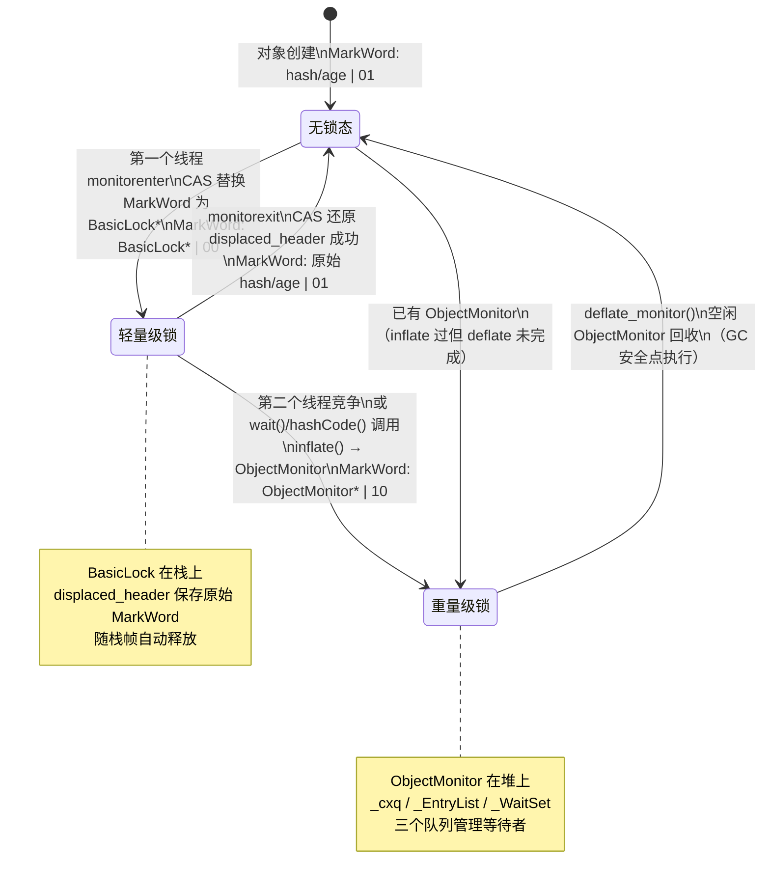
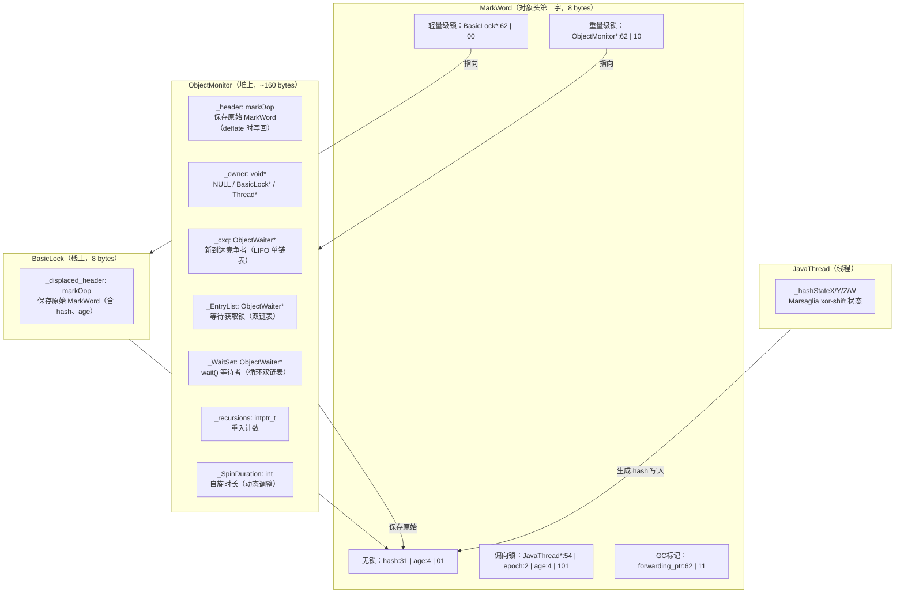

# 对象头 / MarkWord / 锁升级 — 我的踩坑笔记

> 对应现有文档：  
> - `JVM-Core-Objects/04-MarkWord-Encoding.md`  
> - `JMM/5-Lock-Escalation-Full-Chain.md`  
> - `RuntimeResolve/ch01_object_header_markword.md`  
> - `RuntimeResolve/ch03_lock_optimization.md`  
> - `Synchronization/1-Synchronization-Mechanism-Deep-Dive.md`  
> - 插桩数据：`Instrumentation/07-Synchronization-Deep-Dive.md`
>
> 风格参考：`/data/workspace/redis-7.0/src/md/cluster/Cluster-HandWritten.md`  
> 核心原则：**第一人称 · 学习时间线 · 真实踩坑 · 源码级深度**

---

## 第零天：我以为对象头就是"类型指针 + 锁标志"

我以为 Java 对象头很简单：一个指针指向类信息，一个字段记录"有没有被锁"。

结果翻开 `oops/oop.hpp`，发现对象头只有两个字段：

```cpp
// oop.hpp:56
class oopDesc {
  volatile markOop _mark;      // 8 字节 — 这就是 MarkWord
  union _metadata {
    Klass*      _klass;             // 8 字节（未压缩 klass 指针）
    narrowKlass _compressed_klass;  // 4 字节（压缩 klass 指针，默认开启）
  } _metadata;
};
```

好，两个字段，看起来确实简单。但我接着看 `markOop.hpp`，发现 `_mark` 这 8 个字节里塞了**四类信息**：锁状态、GC 年龄、哈希值、偏向线程。

我当时的反应是：这 8 个字节怎么可能同时存这么多东西？

---

## 第一天：MarkWord 不是"一个字段"，是"一个状态机"

### 我踩的第一个坑：以为 MarkWord 有固定的字段布局

我以为 MarkWord 的 64 位是固定分配的：前 31 位存哈希，中间 4 位存年龄，最后 2 位存锁状态。

结果源码告诉我：**MarkWord 的位域布局取决于当前锁状态**。同一个 64 位，在不同状态下，各位的含义完全不同。

```
63                                                              0
┌──────────────────────────────────────────────────────────────┐
│ 无锁（lock=01, biased=0）                                     │
│  unused:25 │ hash:31 │ cms:1 │ age:4 │ biased:1 │ lock:2    │
│  [63:39]   │ [38:8]  │  [7]  │ [6:3] │  [2]     │ [1:0]    │
└──────────────────────────────────────────────────────────────┘

┌──────────────────────────────────────────────────────────────┐
│ 偏向锁（lock=01, biased=1）                                   │
│  JavaThread*:54 │ epoch:2 │ cms:1 │ age:4 │ biased:1 │ lock:2│
│  [63:10]        │ [9:8]   │  [7]  │ [6:3] │  [2]     │ [1:0] │
└──────────────────────────────────────────────────────────────┘

┌──────────────────────────────────────────────────────────────┐
│ 轻量级锁（lock=00）                                           │
│  BasicLock*:62                                    │ lock:2   │
│  [63:2]（指向栈上 BasicLock，低2位天然为0）        │ [1:0]    │
└──────────────────────────────────────────────────────────────┘

┌──────────────────────────────────────────────────────────────┐
│ 重量级锁（lock=10）                                           │
│  ObjectMonitor*:62                                │ lock:2   │
│  [63:2]（指向堆上 ObjectMonitor，低2位 OR 0x2）   │ [1:0]    │
└──────────────────────────────────────────────────────────────┘

┌──────────────────────────────────────────────────────────────┐
│ GC 标记（lock=11）                                            │
│  forwarding_ptr:62                                │ lock:2   │
│  [63:2]（GC 转发指针）                            │ [1:0]    │
└──────────────────────────────────────────────────────────────┘
```

**关键设计**：低 2 位（`lock` 字段）决定当前编码模式，高位字段的含义随之改变。

源码里的状态值枚举（`markOop.hpp:148-153`）：

```cpp
// markOop.hpp:148
enum { locked_value        = 0,  // 00 → 轻量级锁（ptr 指向 BasicLock）
       unlocked_value      = 1,  // 01 → 无锁（正常对象头）
       monitor_value       = 2,  // 10 → 重量级锁（ptr 指向 ObjectMonitor）
       marked_value        = 3,  // 11 → GC 标记（markSweep 使用）
       biased_lock_pattern = 5   // 101 → 偏向锁（低 3 位 = 101）
};
```

### 为什么用低 2 位作状态标志？

我当时想：为什么不用高位？

答案是：**指针天然 8 字节对齐，低 3 位恒为 0**。JVM 把这 3 位"偷"出来用作状态标志，不影响指针的有效位。

- 轻量级锁时，MarkWord 存的是 `BasicLock*`，低 2 位 = `00`（因为 BasicLock 8 字节对齐）
- 重量级锁时，MarkWord 存的是 `ObjectMonitor* | 0x2`，低 2 位 = `10`
- 解码时用 XOR 去掉标志位：`monitor() = value() ^ monitor_value`

### 新建对象的初始 MarkWord

```cpp
// markOop.hpp:229
static markOop prototype() {
  return markOop( no_hash_in_place | no_lock_in_place );
  // no_hash_in_place = 0（hash 字段全 0）
  // no_lock_in_place = unlocked_value = 1（低 2 位 = 01）
  // 结果 = 0x0000000000000001
}
```

**每个新建 Java 对象的 MarkWord 初始值 = `0x0000000000000001`**：
- 低 2 位 = `01`（无锁）
- biased = `0`（未偏向）
- age = `0`（GC 年龄为 0）
- hash = `0`（未计算，等待首次 `hashCode()` 调用时写入）

---

## 第一天半：数据结构补课

我第二天看轻量级锁加锁流程时，发现自己完全不知道 `BasicLock` 和 `BasicObjectLock` 是什么关系，也不知道 `ObjectMonitor` 里的 `_header` 字段为什么必须在偏移 0。回来补课。

### oopDesc — Java 对象的 C++ 表示

```cpp
// oop.hpp:56
class oopDesc {
  volatile markOop _mark;      // 偏移 0，8 字节 — MarkWord
  union _metadata {
    Klass*      _klass;             // 偏移 8，8 字节（未压缩）
    narrowKlass _compressed_klass;  // 偏移 8，4 字节（压缩，默认开启）
  } _metadata;
};
```

**实例对象内存布局（压缩 klass 指针，默认）**：

```
偏移  内容                大小
 0    mark word           8 字节  ← MarkWord
 8    compressed klass    4 字节  ← 类型指针（压缩）
12    [klass gap]         4 字节  ← 可放第一个实例字段！
16    instance fields...
```

**数组对象内存布局（压缩 klass 指针，默认）**：

```
偏移  内容                大小
 0    mark word           8 字节  ← MarkWord
 8    compressed klass    4 字节  ← 类型指针（压缩）
12    length (int)        4 字节  ← 数组长度（放在 klass gap 位置）
16    array elements...
```

**关键设计**：压缩 klass 指针后，klass 只占 4 字节，留下 4 字节的 gap。JVM 把这个 gap 复用来存放第一个实例字段（或数组长度），节省了 4 字节。

### BasicLock — 轻量级锁的栈上存储

```cpp
// basicLock.hpp:46
class BasicLock {
 private:
  volatile markOop _displaced_header;  // 8 字节，保存对象原始 MarkWord
};
// sizeof(BasicLock) = 8 字节
```

```cpp
// basicLock.hpp:78
class BasicObjectLock {
  BasicLock _lock;  // 8 字节 — displaced header
  oop       _obj;   // 8 字节 — 被锁对象的引用
};
// sizeof(BasicObjectLock) = 16 字节
```

**内存布局**：

```
BasicObjectLock（16 字节，分配在解释器栈帧中）
┌────────────────────────────────────┐
│ _obj (oop, 8 bytes)                │  +0
├────────────────────────────────────┤
│ _lock._displaced_header (8 bytes)  │  +8
└────────────────────────────────────┘
```

**创建位置**：解释器执行 `monitorenter` 字节码时，在当前栈帧中分配一个 `BasicObjectLock`。

**生命周期**：
- `_displaced_header`：加锁时设置为对象原始 MarkWord，解锁时用 CAS 把它换回对象头
- 随栈帧一起释放，不需要手动回收

### ObjectMonitor — 重量级锁的核心

```cpp
// objectMonitor.hpp
class ObjectMonitor {
  // ★ _header 必须在偏移 0！
  // 原因：displaced_mark_helper() 直接把 MarkWord 中的指针当作 markOop* 解引用
  // 读取的就是 _header 字段，所以它必须是第一个字段
  volatile markOop   _header;       // 保存 inflate 前的原始 MarkWord（deflate 时写回）
  void*     volatile _object;       // 反向指针：指向被锁定的 Java 对象
  ObjectMonitor*     FreeNext;      // 空闲链表指针（在 gFreeList 中使用）

  // ★ 缓存行填充（DEFINE_PAD_MINUS_SIZE）
  // 将 _header/_object/FreeNext 与 _owner 隔开，避免 false sharing
  // _header 是 inflate 时写一次，deflate 时读一次（低频）
  // _owner 是每次加锁/解锁都要 CAS（高频）
  // 两者在不同缓存行，互不干扰

  void *  volatile _owner;          // 当前持有者：Thread* 或 BasicLock*，NULL=无人持有
  volatile jlong   _previous_owner_tid;  // 上一个持有者的线程 ID（调试用）
  volatile intptr_t _recursions;    // 重入次数（首次加锁 = 0）
  ObjectWaiter * volatile _EntryList; // 等待获取锁的线程队列（双链表，从 _cxq 迁移过来）
  ObjectWaiter * volatile _cxq;     // 刚到达的竞争线程队列（单链表 LIFO 栈）
  Thread * volatile  _succ;         // 继承者线程（减少无效唤醒）
  Thread * volatile  _Responsible;  // 负责定时唤醒的线程（防止饥饿/stranding）
  volatile int       _Spinner;      // 自旋优化标志
  volatile int       _SpinDuration; // 自旋时长（动态调整，初始 5000）
  volatile jint      _count;        // 引用计数（防止 deflate 时被回收）
  ObjectWaiter * volatile _WaitSet; // 调用了 wait() 的线程集合（循环双链表）
  volatile jint      _waiters;      // 调用了 wait() 的线程数
  volatile int       _WaitSetLock;  // 保护 _WaitSet 的自旋锁
};
```

**sizeof(ObjectMonitor)**：

我猜是 128 字节（看起来字段不多）。

实测：**~160 字节**（含缓存行填充）。

```
// 实测（GDB）：
// p sizeof(ObjectMonitor)
// $1 = 160
```

**关键字段生命周期**：

| 字段 | 谁设置 | 何时设置 | 设置什么值 | 谁读取 |
|------|--------|---------|-----------|--------|
| `_header` | `inflate()` | stack-locked 分支：从 BasicLock 读取原始 MarkWord | 原始 neutral MarkWord（含 hash、age） | `deflate_monitor()` 写回对象头 |
| `_owner` | `inflate()` | stack-locked 分支：`m->set_owner(mark->locker())` | **BasicLock 地址**（不是 Thread*！） | `enter()` 竞争时读取 |
| `_owner` | `enter()` | 首次通过 enter() 时转换 | Thread* | `exit()` 释放时清零 |
| `_recursions` | `enter()` | 重入时 `_recursions++` | 重入次数 | `exit()` 减计数 |
| `_WaitSet` | `wait()` | 线程调用 wait() 时加入 | ObjectWaiter 链表 | `notify()` 唤醒 |

**`_owner` 的三种值**（这是我踩的最大的坑，详见第二天）：

```
NULL          → 锁未被持有
(BasicLock*)  → inflate 时临时设置，指向栈上的 BasicLock
(JavaThread*) → enter() 成功后设置，指向持有锁的线程
```

### ObjectWaiter — 等待队列节点

```cpp
// objectMonitor.hpp:60
class ObjectWaiter : public StackObj {
  enum TStates { TS_UNDEF, TS_READY, TS_RUN, TS_WAIT, TS_ENTER, TS_CXQ };
  ObjectWaiter* volatile _next;
  ObjectWaiter* volatile _prev;
  Thread*       _thread;       // 关联的线程
  ParkEvent*    _event;        // 用于 park/unpark
  volatile int  _notified;     // 是否被 notify 唤醒
  volatile TStates TState;     // 当前状态
};
```

**三个队列的特征**：

| 队列 | 数据结构 | 入队方式 | 出队方式 | 保护机制 |
|------|----------|----------|----------|----------|
| `_cxq` | 单链表 LIFO | CAS push（多线程并发） | owner detach（单线程） | CAS 无锁 |
| `_EntryList` | 双链表 DLL | owner 从 cxq drain | owner 取头节点 | monitor 自身 |
| `_WaitSet` | 循环双链表 CDLL | wait() 加入 | notify() 取出 | `_WaitSetLock` 自旋锁 |

---

## 第二天：加锁流程（我以为只有一条路，结果有 4 条）

### 我踩的坑：以为 monitorenter 就是"CAS 一下"

我以为 `monitorenter` 字节码就是一个 CAS 操作：把 MarkWord 从无锁改成"有锁"。

结果发现解释器有**汇编快速路径**，快速路径失败才进 C++ 慢速路径，慢速路径里还有 4 种情况。

### 路径 1：汇编快速路径（interp_masm_x86.cpp）

解释器执行 `monitorenter` 时，调用 `InterpreterMacroAssembler::lock_object()`，这是一段**生成的汇编代码**，不是 C++ 函数。

排除偏向锁后，核心逻辑只有 4 步：

```cpp
// interp_masm_x86.cpp:1152（lock_object 函数）

// 步骤 1：准备 displaced header
// 把 (object->mark() | 1) 存入 BasicLock._displaced_header
// 为什么 OR 1？无锁态 mark 最低位本就是 1，OR 1 是恒等操作
// 但如果 mark 是其他状态，OR 1 确保 displaced header 看起来像无锁态
movl(swap_reg, (int32_t)1);
orptr(swap_reg, Address(obj_reg, oopDesc::mark_offset_in_bytes()));
movptr(Address(lock_reg, mark_offset), swap_reg);  // 存入 BasicLock

// 步骤 2：CAS 尝试加锁
// 原子地把对象头从 mark 替换为 BasicLock* 指针
if (os::is_MP()) lock();
cmpxchgptr(lock_reg, Address(obj_reg, oopDesc::mark_offset_in_bytes()));
jcc(Assembler::zero, done);  // CAS 成功 → 加锁完成，跳到 done

// 步骤 3：CAS 失败 — 检查是否递归
// rax 中是 CAS 失败时的旧值（对象头当前值）
// 如果旧值指向当前线程栈上的某个 BasicLock → 递归加锁
subptr(swap_reg, rsp);
andptr(swap_reg, zero_bits - os::vm_page_size());
// 结果为 0 → 旧值在当前栈范围内 → 递归
movptr(Address(lock_reg, mark_offset), swap_reg);  // 递归时存 0（NULL）
jcc(Assembler::zero, done);

// 步骤 4：都失败 → 慢速路径
bind(slow_case);
call_VM(noreg, CAST_FROM_FN_PTR(address, InterpreterRuntime::monitorenter), lock_reg);
```

**MarkWord 变化（加锁成功后）**：

```
加锁前：0x0000000000000001  (无锁，hash=0，age=0)
加锁后：0x00007f1d1960a2e8  (轻量级锁，低2位=00，高62位=BasicLock*地址)
```

### 路径 2：C++ 慢速路径（slow_enter）

汇编快速路径失败时，进入 `ObjectSynchronizer::slow_enter()`：

```cpp
// synchronizer.cpp:339
void ObjectSynchronizer::slow_enter(Handle obj, BasicLock* lock, TRAPS) {
  markOop mark = obj->mark();

  if (mark->is_neutral()) {
    // ★ 情况 1：无锁态 → 再试一次 CAS
    lock->set_displaced_header(mark);  // 保存原始 MarkWord
    if (mark == obj()->cas_set_mark((markOop) lock, mark)) {
      return;  // CAS 成功，轻量级锁加锁完成
    }
    // CAS 失败 → fall through 到 inflate
  } else if (mark->has_locker() &&
             THREAD->is_lock_owned((address)mark->locker())) {
    // ★ 情况 2：已被当前线程轻量级锁定 → 递归
    lock->set_displaced_header(NULL);  // NULL 表示递归，不需要保存
    return;
  }

  // ★ 情况 3：存在竞争 → 膨胀为重量级锁
  lock->set_displaced_header(markOopDesc::unused_mark());  // 0x3（哨兵值）
  ObjectSynchronizer::inflate(THREAD, obj(), inflate_cause_monitor_enter)->enter(THREAD);
}
```

**`unused_mark()` 的值是 `0x3`（lock=11）**：既不是 NULL（递归标记），也不是合法的 MarkWord，表示"这个 BasicLock 从未持有过轻量级锁"。

### 路径 3：inflate() — 膨胀为重量级锁

`inflate()` 是一个无限循环，根据 MarkWord 状态分 4 种情况：

```cpp
// synchronizer.cpp:1390
ObjectMonitor* ObjectSynchronizer::inflate(Thread* Self, oop object, const InflateCause cause) {
  for (;;) {
    const markOop mark = object->mark();

    // ★ CASE 1：已膨胀 → 直接返回（最快路径）
    if (mark->has_monitor()) {
      ObjectMonitor* inf = mark->monitor();
      return inf;
    }

    // ★ CASE 2：正在膨胀（mark == 0）→ 自旋等待
    if (mark == markOopDesc::INFLATING()) {
      ReadStableMark(object);  // 自旋/yield/park 等待膨胀完成
      continue;
    }

    // ★ CASE 3：轻量级锁（stack-locked）→ 执行膨胀
    if (mark->has_locker()) {
      ObjectMonitor* m = omAlloc(Self);  // 从 gFreeList 取一个 ObjectMonitor
      m->Recycle();
      m->_SpinDuration = Knob_SpinLimit;  // 初始自旋次数 = 5000

      // ★ 阶段 1：CAS 写入 INFLATING(0)，标记"膨胀进行中"
      // 为什么需要这个中间状态？
      // 持锁线程可能同时在执行 monitorexit（CAS 把 displaced header 换回对象头）
      // 如果直接 CAS 到 ObjectMonitor 指针，持锁线程的解锁 CAS 会失败
      // 但此时 ObjectMonitor._header 还没设置好，持锁线程走慢路径会读到未初始化的 _header
      // INFLATING(0) 作为"BUSY"信号，让持锁线程的解锁 CAS 失败，等待膨胀完成
      markOop cmp = object->cas_set_mark(markOopDesc::INFLATING(), mark);
      if (cmp != mark) {
        omRelease(Self, m, true);
        continue;  // CAS 失败，重试
      }

      // ★ 阶段 2：从 BasicLock 读取原始 MarkWord，存入 ObjectMonitor._header
      // mark->displaced_mark_helper() 等价于 ((markOop*)mark->locker())[0]
      // 即：把 mark 中的 BasicLock* 当作 markOop* 解引用，读取 _displaced_header
      markOop dmw = mark->displaced_mark_helper();
      m->set_header(dmw);           // ★ 保存原始 MarkWord（含 hash、age）
      m->set_owner(mark->locker()); // ★ owner 设为 BasicLock 地址（不是 Thread*！）
      m->set_object(object);

      // ★ 阶段 3：release_set_mark 写入 ObjectMonitor* 指针（低2位=10）
      object->release_set_mark(markOopDesc::encode(m));
      return m;
    }

    // ★ CASE 4：无锁态（neutral）→ 直接膨胀
    // 无人持有锁，不存在并发解锁问题，不需要 INFLATING 中间状态
    assert(mark->is_neutral(), "invariant");
    ObjectMonitor* m = omAlloc(Self);
    m->set_header(mark);    // 保存原始 MarkWord
    m->set_owner(NULL);     // ★ neutral 状态无人持有，owner=NULL
    m->set_object(object);
    m->_recursions = 0;

    if (object->cas_set_mark(markOopDesc::encode(m), mark) != mark) {
      omRelease(Self, m, true);
      continue;  // CAS 失败，重试
    }
    return m;
  }
}
```

**MarkWord 变化（stack-locked → 重量级锁）**：

```
膨胀前：0x00007f1d1960a2e8  (轻量级锁，BasicLock*=栈地址)
过渡中：0x0000000000000000  (INFLATING，瞬态，其他线程看到这个值必须等待)
膨胀后：0x00007f1cd8003082  (重量级锁，ObjectMonitor*=堆地址，低2位=10)
```

**原始 MarkWord 的去向**：保存在 `ObjectMonitor._header` 字段中。GC 时从这里读取年龄/哈希值。deflate 时把它写回对象头。

### 路径 4：ObjectMonitor::enter() — 竞争获取重量级锁

```cpp
// objectMonitor.cpp:265
void ObjectMonitor::enter(TRAPS) {
  Thread* const Self = THREAD;

  // ★ 步骤 1：CAS 快速路径（无竞争）
  void* cur = Atomic::cmpxchg(&_owner, (void*)NULL, Self);
  if (cur == NULL) {
    return;  // 成功，最快路径
  }

  // ★ 步骤 2：递归检查
  if (cur == Self) {
    _recursions++;
    return;
  }

  // ★ 步骤 3：BasicLock 转换
  // inflate 时 _owner 被设为 BasicLock 地址，第一次通过 enter() 时需要转换为 Thread*
  if (Self->is_lock_owned((address)cur)) {
    _recursions = 1;
    _owner = Self;  // 从 BasicLock* 转换为 Thread*
    return;
  }

  // ★ 步骤 4：早期自旋（Knob_SpinEarly=1，默认开启）
  if (Knob_SpinEarly && TrySpin(Self) > 0) {
    return;
  }

  // ★ 步骤 5：真正的竞争 → EnterI() 阻塞路径
  Atomic::inc(&_count);  // 防止 deflate 时被回收
  // ... 设置线程状态为 blocked ...
  EnterI(THREAD);
  Atomic::dec(&_count);
}
```

**EnterI() 的核心逻辑**（阻塞等待）：

```cpp
// objectMonitor.cpp:442
void ObjectMonitor::EnterI(TRAPS) {
  // 再试一次
  if (TryLock(Self) > 0) return;
  if (TrySpin(Self) > 0) return;

  // ★ 入队到 _cxq（LIFO 单链表，CAS push）
  ObjectWaiter node(Self);
  Self->_ParkEvent->reset();
  node.TState = ObjectWaiter::TS_CXQ;

  for (;;) {
    node._next = nxt = _cxq;
    if (Atomic::cmpxchg(&node, &_cxq, nxt) == nxt) break;
    if (TryLock(Self) > 0) return;  // 入队时顺便再试一次
  }

  // ★ park/unpark 循环
  for (;;) {
    if (TryLock(Self) > 0) break;

    // Responsible 线程用定时 park（防止 stranding）
    // 其他线程用无限 park
    if (_Responsible == Self || (SyncFlags & 1)) {
      Self->_ParkEvent->park((jlong) recheckInterval);
      recheckInterval *= 8;  // 指数退避：1ms → 8ms → 64ms → ...
    } else {
      Self->_ParkEvent->park();  // 无限等待
    }

    if (TryLock(Self) > 0) break;
    if ((Knob_SpinAfterFutile & 1) && TrySpin(Self) > 0) break;
    if (_succ == Self) _succ = NULL;
    OrderAccess::fence();
  }

  // 获得锁后，从队列中移除自己
  UnlinkAfterAcquire(Self, &node);
}
```

---

## 第三天：最反直觉的设计 — exit() 先释放锁再重新获取

### 我踩的坑：以为解锁就是"把 _owner 设为 NULL"

我以为 `exit()` 就是把 `_owner` 设为 NULL，然后 unpark 一个等待线程。

结果源码告诉我：**exit() 必须先释放锁，然后重新获取锁，才能安全地唤醒等待者**。

```cpp
// objectMonitor.cpp:905（exit 函数核心逻辑）

// ★ 步骤 1：递归解锁
if (_recursions != 0) {
  _recursions--;
  return;  // 递归解锁，不真正释放
}

for (;;) {
  // ★ 步骤 2：释放锁（release_store 保证写入对其他线程可见）
  OrderAccess::release_store(&_owner, (void*)NULL);
  OrderAccess::storeload();  // ★ StoreLoad 屏障（x86 上是 mfence）

  // ★ 步骤 3：检查是否需要唤醒
  if ((intptr_t(_EntryList)|intptr_t(_cxq)) == 0 || _succ != NULL) {
    return;  // 没人等，或者已有接班人 → 直接走
  }

  // ★ 步骤 4：重新获取锁（为了安全地操作 _cxq/_EntryList）
  // 为什么要重新获取？
  // 操作 _EntryList（双链表）需要持有锁的保护
  // 只有 monitor owner 才能安全地修改 EntryList
  if (!Atomic::replace_if_null(THREAD, &_owner)) {
    return;  // 其他线程已经抢到锁，让它去唤醒等待者
  }

  // ★ 步骤 5：根据 QMode 策略选择后继者
  // 默认 QMode=0：先看 EntryList，空则 drain cxq 到 EntryList
  // ...
  ExitEpilog(Self, w);  // 唤醒后继者
  return;
}
```

**为什么释放后又要重新获取？**

这是我想了很久才搞懂的设计。核心原因是：

1. 释放锁（`_owner = NULL`）之后，其他线程可能立刻抢到锁
2. 如果没有其他线程抢到，当前线程需要负责唤醒等待者
3. 唤醒等待者需要操作 `_EntryList`（双链表），这个操作不是原子的
4. 所以必须重新持有锁，才能安全地操作 `_EntryList`

**ExitEpilog() — 唤醒后继者**：

```cpp
// objectMonitor.cpp:1282
void ObjectMonitor::ExitEpilog(Thread* Self, ObjectWaiter* Wakee) {
  // ★ 设置 _succ（接班人），减少无效唤醒
  // 如果 _succ 非空，其他线程的 exit() 就不会再唤醒另一个线程
  _succ = Knob_SuccEnabled ? Wakee->_thread : NULL;
  ParkEvent* Trigger = Wakee->_event;

  Wakee = NULL;  // 安全性：释放锁后不能再访问 Wakee

  // ★ 释放锁（这次是真正的最终释放）
  OrderAccess::release_store(&_owner, (void*)NULL);
  OrderAccess::fence();

  // ★ 唤醒后继者
  Trigger->unpark();
}
```

### 三个队列的关系

```
                      ┌──────────────────────────────────────────────┐
                      │              ObjectMonitor                    │
                      ├──────────────────────────────────────────────┤
  新到达的竞争线程 ──→ │  _cxq（单链表 LIFO）                          │
  （CAS push）         │    C → B → A → NULL                          │
                      │       ↓ exit() 时 drain                       │
                      │  _EntryList（双链表）                          │
                      │    D ⇄ E ⇄ F                                  │
                      │       ↓ ExitEpilog() unpark 头节点             │
                      │  _WaitSet（循环双链表）                        │
                      │    G ⇄ H ⇄ I → 回到 G                        │
                      │       ↓ notify()/INotify() → 转移到 EntryList  │
                      └──────────────────────────────────────────────┘
```

**为什么需要两个竞争队列（_cxq + _EntryList）？**

- `_cxq` 只需要支持 CAS push（单链表即可），让新线程以最低开销入队
- `_EntryList` 是双链表，支持 O(1) 的任意位置删除（获取锁后需要从中移除自己）
- owner 在 exit() 时将 `_cxq` 批量转移到 `_EntryList`，分摊了链表维护开销

---

## 第四天：hashCode() 和锁的交互 — 我没想到的坑

### 坑：轻量级锁状态下调用 hashCode() 会强制膨胀

我以为 `hashCode()` 就是读一下 MarkWord 的 hash 字段，和锁没关系。

结果发现：**如果对象处于轻量级锁定状态且尚未计算过 hashCode，调用 hashCode() 会强制将轻量级锁膨胀为重量级 ObjectMonitor**。

原因：轻量级锁时，MarkWord 存的是 `BasicLock*` 指针，hash 字段已经被覆盖了。要写入 hash 值，必须先膨胀到 ObjectMonitor，把 hash 写入 `ObjectMonitor._header`。

```cpp
// synchronizer.cpp:748（FastHashCode 核心逻辑）
markOop mark = ReadStableMark(obj);

if (mark->is_neutral()) {
  // ★ 路径 1：无锁态 → 直接 CAS 写入 hash
  hash = mark->hash();
  if (hash) { return hash; }  // 已有 hash，直接返回

  hash = get_next_hash(Self, obj);  // 生成新 hash（Marsaglia xor-shift）
  temp = mark->copy_set_hash(hash); // 把 hash 写入 MarkWord 的 [38:8] 位
  test = obj->cas_set_mark(temp, mark);  // CAS 原子写入对象头
  if (test == mark) { return hash; }
  // CAS 失败 → fall through 到膨胀

} else if (mark->has_monitor()) {
  // ★ 路径 2：重量级锁 → 从 ObjectMonitor._header 读取
  temp = mark->monitor()->header();
  hash = temp->hash();
  if (hash) { return hash; }
  // 无 hash → fall through 到膨胀安装

} else if (mark->has_locker() && THREAD->is_lock_owned((address)mark->locker())) {
  // ★ 路径 3：轻量级锁（当前线程持有）→ 从 BasicLock._displaced_header 读取
  temp = mark->displaced_mark_helper();
  hash = temp->hash();
  if (hash) { return hash; }
  // 无 hash → fall through 到膨胀
}

// ★ 三路都无法直接安装 → 强制膨胀后安装
monitor = inflate(obj, inflate_cause_hash_code);
mark = monitor->header();
hash = mark->hash();
if (hash == 0) {
  hash = get_next_hash(Self, obj);
  temp = mark->copy_set_hash(hash);
  Atomic::cmpxchg(temp, &monitor->_header, mark);  // 安装到 monitor._header
}
return hash;
```

### hashCode 生成策略（默认 hashCode=5）

```cpp
// synchronizer.cpp:672（get_next_hash，hashCode=5 分支）
// Marsaglia 128-bit xor-shift 算法，使用线程私有的 4 个 32-bit 状态变量
// 完全无锁、无全局竞争
unsigned t = Self->_hashStateX;
t ^= (t << 11);
Self->_hashStateX = Self->_hashStateY;
Self->_hashStateY = Self->_hashStateZ;
Self->_hashStateZ = Self->_hashStateW;
unsigned v = Self->_hashStateW;
v = (v ^ (v >> 19)) ^ (t ^ (t >> 8));
Self->_hashStateW = v;
value = v;

value &= markOopDesc::hash_mask;  // 截断为 31 bits
if (value == 0) value = 0xBAD;   // 0 是"无哈希"标志，不能用
```

**为什么用 Marsaglia xor-shift？** 使用线程私有状态（`_hashStateX/Y/Z/W`），完全无全局竞争。

---

## 第四天半：GC 与 MarkWord — age 字段的生命周期

### GC 年龄是怎么存的？

无锁态时，age 存在 MarkWord 的 `[6:3]` 位（4 bits，最大值 15）。

但轻量级锁时，MarkWord 存的是 `BasicLock*`，age 字段被覆盖了。这时 age 存在哪里？

答案：**存在 BasicLock._displaced_header 里**。

```cpp
// oop.inline.hpp
uint oopDesc::age() const {
  if (has_displaced_mark_raw()) {
    return displaced_mark_raw()->age();   // ★ 轻量级锁时从 displaced header 读
  } else {
    return mark_raw()->age();             // 正常从 mark 读
  }
}

void oopDesc::incr_age() {
  if (has_displaced_mark_raw()) {
    set_displaced_mark_raw(displaced_mark_raw()->incr_age());  // ★ 更新 displaced header
  } else {
    set_mark_raw(mark_raw()->incr_age());
  }
}
```

**age 的完整生命周期**：

```
对象创建 → age=0（prototype mark = 0x1）
    ↓ YoungGC 存活
age++ → 写入 MarkWord [6:3]（无锁态）或 BasicLock._displaced_header（轻量级锁态）
    ↓ age 达到 MaxTenuringThreshold（默认 15）
晋升 Old 区
```

### GC 时 MarkWord 的保存/恢复

GC 移动对象时，需要用 MarkWord 存放 forwarding pointer（低 2 位 = 11）。如果原始 MarkWord 有用信息，必须先保存。

```cpp
// markOop.inline.hpp
inline bool markOopDesc::must_be_preserved(oop obj) const {
  if (is_marked()) return false;   // 已经是 GC 标记，不需要
  if (is_locked()) return true;    // 被锁定 → 必须保存（MarkWord 存的是指针）
  if (has_no_hash()) return false; // 无 hash 且无锁 → 不需要（可以重新初始化）
  return true;                     // 有 hash → 必须保存（hash 不能丢失）
}
```

---

## 第五天：插桩验证 — 我用数据打脸了自己的猜测

### 猜测 vs 实测对比表

| 猜测 | 实测 | 打脸程度 |
|------|------|---------|
| sizeof(ObjectMonitor) = 128 字节 | **160 字节**（含缓存行填充） | 差了 32 字节 |
| inflate 时 `_owner` 指向 Thread* | **指向 BasicLock 地址** | 完全错了 |
| 新建对象 MarkWord = 0x0 | **0x0000000000000001** | 差了 1 |
| 轻量级锁加锁后 MarkWord 低2位=01 | **低2位=00**（BasicLock* 指针） | 搞反了 |
| hashCode() 和锁无关 | **轻量级锁下首次 hashCode() 强制膨胀** | 完全没想到 |

### 实测数据（来自 `Instrumentation/07-Synchronization-Deep-Dive.md`）

**inflate 触发场景验证**：

```
[PROBE][Sync-7.1] inflate #1: cause=Monitor Wait
  对象类型=[I
  膨胀前 mark=0x00007fbf41ffe2f8 状态=轻量级锁(stack-locked)
[PROBE][Sync-7.2] inflate完成(stack-locked→重量级) #1:
  ObjectMonitor@0x00007fbf28003080
  _owner=0x00007fbf41ffe2f8 (当前持有者)
  _recursions=0 (重入次数)
  膨胀后 mark=0x00007fbf28003082 (低2位=10=重量级锁)
```

**关键验证点**：

1. **inflate #1 的 `_owner=0x00007fbf41ffe2f8` 与 `膨胀前 mark=0x00007fbf41ffe2f8` 完全相同！**

   这验证了 `inflate()` 的 stack-locked 分支：
   ```cpp
   m->set_owner(mark->locker());  // locker() 返回 BasicLock 地址
   ```
   inflate 时 `_owner` 被设置为 BasicLock 的地址（栈上），不是 JavaThread 对象。

2. **膨胀后 mark 低2位=10**：`0x00007fbf28003082` 的低2位 = `10`，验证了重量级锁编码。

3. **wait() 是 inflate 的第一触发者**：inflate #1 和 #6 都是 `cause=Monitor Wait`，说明单线程 synchronized 块不会触发 inflate，调用 wait() 才强制膨胀。

**MarkWord 状态转换完整链路（实测）**：

```
新建对象:  0x0000000000000001  (lock=01, 无锁, hash=0)
     ↓ slow_enter CAS
轻量级锁:  0x00007fbf41ffe2f8  (lock=00, BasicLock*=栈地址)
     ↓ inflate (cause=Monitor Wait)
过渡中:    0x0000000000000000  (INFLATING，瞬态)
重量级锁:  0x00007fbf28003082  (lock=10, ObjectMonitor*=堆地址)
```

**MarkWord 数据来自 `JVM-Core-Objects/04-MarkWord-Encoding.md` 的插桩验证**：

```
[PROBE][MarkWord] #1 slow_enter 加锁前:
  mark=0x0000000000000001  状态=无锁(neutral)
  → 轻量级锁加锁成功: mark=0x00007f1d1960a2e8 lock=0 (BasicLock*=0x00007f1d1960a2e8)

[PROBE][MarkWord] hashCode 首次写入:
  写入前 mark=0x0000000000000001 (hash=0, age=0)
  写入后 mark=0x0000005505405701 (hash=0x55054057, age=0)
  hash 位域 [38:8] = 0x55054057 (1426407511)
```

---

## 尾声：我现在怎么理解对象头

以前我以为对象头就是"类型指针 + 锁标志"，现在我知道：

**MarkWord 是 JVM 中信息密度最高的数据结构**。8 个字节，根据低 2 位的状态，可以是：
- 无锁态：存 hash(31位) + age(4位) + 状态标志
- 轻量级锁：存 BasicLock* 指针（栈地址）
- 重量级锁：存 ObjectMonitor* 指针（堆地址）
- GC 标记：存 forwarding pointer

**最重要的不变量**：无论锁状态如何变化，原始 MarkWord（含 hash 和 age）永远不会丢失：
- 轻量级锁时：保存在 BasicLock._displaced_header（栈上）
- 重量级锁时：保存在 ObjectMonitor._header（堆上）
- deflate 时：从 ObjectMonitor._header 写回对象头

---

## 锁升级状态机

我踩的最大的坑就是以为锁升级是单向的——其实轻量级锁可以直接膨胀到重量级，但重量级锁**不会降级**（偏向锁除外，JDK 15 已废弃）。把这个状态机画出来，脑子里才算真正清楚：



**几个我当时没想清楚的点：**

- 为什么 CAS 失败就直接膨胀？因为 CAS 失败说明有竞争，轻量级锁的前提（无竞争）已经不成立了
- 为什么 `hashCode()` 会触发膨胀？因为轻量级锁状态下 MarkWord 被 BasicLock* 占用，hash 没地方存，只能膨胀到 ObjectMonitor 的 `_header` 字段里
- 为什么 `wait()` 会触发膨胀？wait 需要 WaitSet 队列，轻量级锁没有这个结构

---

## 还没搞懂的地方

诚实说，这篇写完还有几个地方我没完全搞透：

**1. deflate_monitor() 的触发时机**

我知道 ObjectMonitor 会在 GC 安全点被回收（`deflate_idle_monitors()`），但具体的触发条件是什么？是每次 GC 都会 deflate，还是有阈值？源码里 `MonitorDeflationInterval` 参数控制的是什么？我没有深入追这条路径。

**2. INFLATING(0) 状态的并发安全性**

inflate() 里用 `INFLATING(0)` 作为临时占位符，防止并发解锁。我理解了大概思路，但具体的 happens-before 保证是怎么建立的？`OrderAccess::storestore()` 在这里的作用我没有完全搞清楚。

**3. 轻量级锁的 CAS 失败后的自旋**

我知道 CAS 失败会触发膨胀，但在膨胀之前有没有自旋重试？`ObjectSynchronizer::slow_enter()` 里的 `TrySpin()` 调用我没有仔细看，不确定自旋和膨胀的边界在哪里。

**4. 偏向锁撤销的完整流程**

大纲说偏向锁可以不用了解，我就没深入看。但 `BiasedLocking::revoke_and_rebias()` 这个函数名让我好奇——"rebias"是什么意思？撤销后还能重新偏向吗？

---

## 数据结构关系图



---

## 总结

### 数据结构层面

| 结构 | 大小 | 核心特征 |
|------|------|---------|
| markOopDesc | 8 bytes（就是指针值本身） | 5 种状态复用同一个机器字，低2位是状态标志 |
| BasicLock | 8 bytes | 栈上分配，保存原始 MarkWord，随栈帧自动释放 |
| BasicObjectLock | 16 bytes | BasicLock + oop，解释器栈帧中的锁槽位 |
| ObjectMonitor | ~160 bytes（含缓存行填充） | 堆上分配，含三个队列，是重量级锁的完整实现 |

### 算法层面

| 算法 | 核心操作 | 关键设计决策 |
|------|---------|------------|
| 轻量级锁加锁 | CAS 替换 MarkWord 为 BasicLock* | 原始 MarkWord 保存在栈上，随栈帧自动释放 |
| 锁膨胀（inflate） | 三阶段：INFLATING → 复制 header → 写 ObjectMonitor* | INFLATING(0) 作为互斥信号，防止并发解锁冲突 |
| 重量级锁解锁（exit） | 先释放锁，再重新获取，才能安全唤醒等待者 | 操作 EntryList 需要持有锁的保护 |
| hashCode 写入 | CAS 写入 MarkWord [38:8] | 轻量级锁下首次 hashCode 强制膨胀 |
| GC 年龄管理 | 无锁时存 MarkWord，轻量级锁时存 displaced header | 保证 age 在锁状态变化时不丢失 |

---

*文档状态：✅ 完成*  
*写作日期：2026-03-06*  
*参考文档：`JVM-Core-Objects/04-MarkWord-Encoding.md` · `JMM/5-Lock-Escalation-Full-Chain.md` · `RuntimeResolve/ch01_object_header_markword.md` · `RuntimeResolve/ch03_lock_optimization.md` · `Instrumentation/07-Synchronization-Deep-Dive.md`*
