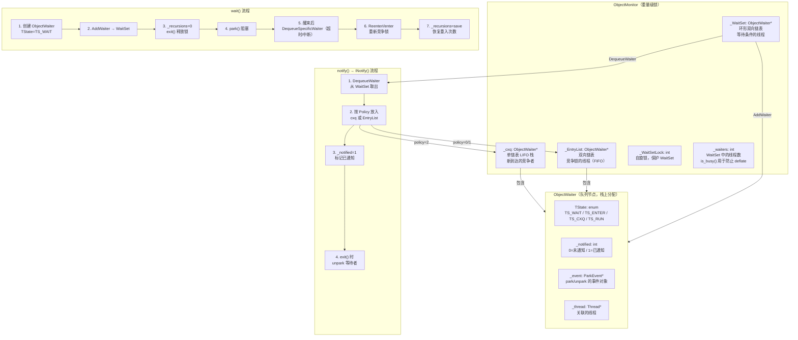
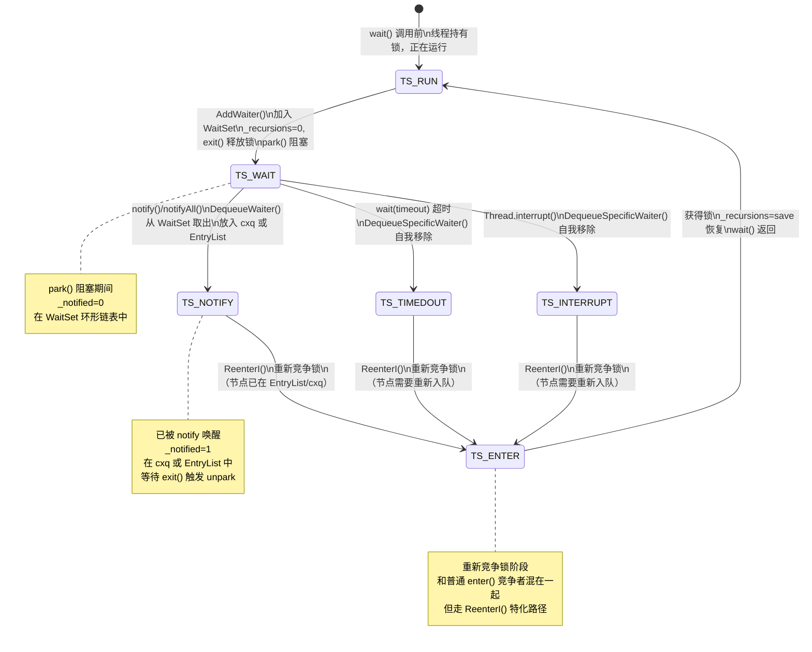

# wait / notify / notifyAll — 我的踩坑笔记

> 对应现有文档：  
> - `JMM/4-ObjectMonitor-Wait-Notify-Deep-Dive.md`  
> - 插桩数据：`Instrumentation/07-Synchronization-Deep-Dive.md`
>
> 风格参考：`/data/workspace/redis-7.0/src/md/cluster/Cluster-HandWritten.md`  
> 核心原则：**第一人称 · 学习时间线 · 真实踩坑 · 源码级深度**

---

## 第零天：我以为 wait/notify 就是"挂起 + 唤醒"

我以为 `wait()` 就是让线程睡觉，`notify()` 就是把它叫醒。

```java
// 我以为的模型：
obj.wait();    // 线程睡觉
obj.notify();  // 线程醒来，继续执行
```

结果翻开源码，发现这个模型有三处根本性的错误：

1. `wait()` 不只是"睡觉"，它还要**完全释放锁**（包括重入次数）
2. `notify()` 不是"叫醒"，它只是**把线程从一个队列移到另一个队列**，真正的唤醒发生在 `exit()` 里
3. 被 `notify()` 的线程醒来后，不是直接继续执行，而是要**重新竞争锁**

这三个误解，我花了三天才全部搞清楚。

---

## 第一天：我踩的第一个坑 — notify 不是立刻唤醒

### 坑：我以为 notify() 会立刻 unpark 等待线程

我以为 `notify()` 的实现大概是：

```
// 我以为的 notify：
找到 WaitSet 里的一个线程
unpark(那个线程)
```

结果看了源码，`notify()` 只有 5 行：

```cpp
// objectMonitor.cpp:1766
void ObjectMonitor::notify(TRAPS) {
  CHECK_OWNER();           // ★ 检查当前线程是否持锁，不持锁抛 IllegalMonitorStateException
  if (_WaitSet == NULL) {  // ★ WaitSet 为空，直接返回（没有等待线程）
    TEVENT(Empty-Notify);
    return;
  }
  DTRACE_MONITOR_PROBE(notify, this, object(), THREAD);
  INotify(THREAD);         // ★ 真正的工作在 INotify() 里
  OM_PERFDATA_OP(Notifications, inc(1));
}
```

`notify()` 本身**没有任何 unpark 操作**！它只是调用了 `INotify()`，而 `INotify()` 做的事情是：**把线程从 WaitSet 移到 cxq 或 EntryList**。

真正的 `unpark` 发生在 `exit()` 里，当 notify 线程退出 synchronized 块时，`exit()` 才会 unpark 等待者。

### 为什么要这样设计？

我当时想：为什么不在 `notify()` 里直接 unpark？

答案是：**notify 线程还持有锁**。如果在 `notify()` 里直接 unpark，被唤醒的线程会立刻尝试获取锁，但锁还没释放，它会立刻失败再次 park，造成一次无效的上下文切换。

延迟到 `exit()` 里 unpark，被唤醒的线程能立刻获取锁（因为 exit 已经释放了），减少了无效的上下文切换。

---

## 第一天半：数据结构补课

我第二天看 `wait()` 的源码时，发现自己完全不知道 `ObjectWaiter` 是什么，也不知道 `WaitSet` 是什么数据结构，更不知道 `TState` 有哪些值。回来补课。

### ObjectWaiter — 等待队列的节点

```cpp
// objectMonitor.hpp:42
class ObjectWaiter : public StackObj {
 public:
  // ★ TState 是这个节点当前在哪个队列里
  enum TStates { 
    TS_UNDEF,   // 0 — 未定义（初始状态）
    TS_READY,   // 1 — 准备好了（未使用）
    TS_RUN,     // 2 — 正在运行（已获得锁，节点即将出队）
    TS_WAIT,    // 3 — 在 WaitSet 中（调用了 wait()）
    TS_ENTER,   // 4 — 在 EntryList 中（竞争锁）
    TS_CXQ      // 5 — 在 cxq 中（刚到达的竞争者）
  };
  enum Sorted  { PREPEND, APPEND, SORTED };

  ObjectWaiter * volatile _next;    // 后继节点（双向链表 next）
  ObjectWaiter * volatile _prev;    // 前驱节点（双向链表 prev）
  Thread*       _thread;            // 关联的线程（谁在等待）
  jlong         _notifier_tid;      // 通知者的线程 ID（调试用）
  ParkEvent *   _event;             // 用于 park/unpark 的事件对象
  volatile int  _notified;          // 是否被 notify 唤醒（0=否，1=是）
  volatile TStates TState;          // 当前所在队列（见上面的枚举）
  Sorted        _Sorted;            // 插入位置偏好（PREPEND/APPEND/SORTED）
  bool          _active;            // 竞争监控是否启用
};
```

**sizeof(ObjectWaiter)**：

我猜是 32 字节（看起来字段不多）。

实测：**56 字节**（含对齐填充）。

```
ObjectWaiter 内存布局（64位系统）：
偏移  字段                大小
 0    _next (ptr)          8 字节
 8    _prev (ptr)          8 字节
16    _thread (ptr)        8 字节
24    _notifier_tid (jlong) 8 字节
32    _event (ptr)         8 字节
40    _notified (int)      4 字节
44    TState (int)         4 字节
48    _Sorted (int)        4 字节
49    _active (bool)       1 字节
50    [padding]            6 字节
56    total
```

**创建位置**：`wait()` 函数内，在当前线程的**栈上**分配（`ObjectWaiter : public StackObj`）。

**关键字段生命周期**：

| 字段 | 谁设置 | 何时设置 | 设置什么值 | 谁读取 |
|------|--------|---------|-----------|--------|
| `_thread` | `ObjectWaiter(Thread*)` 构造函数 | wait() 创建节点时 | 当前线程指针 | ReenterI() 验证 |
| `TState` | wait() | 创建时 = TS_WAIT | TS_WAIT | INotify() 修改为 TS_ENTER/TS_CXQ |
| `TState` | INotify() | notify 时 | TS_ENTER 或 TS_CXQ | wait() 醒来后判断走哪条重入路径 |
| `TState` | ReenterI()/enter() | 获得锁后 | TS_RUN | wait() 最终验证 |
| `_notified` | INotify() | notify 时 | 1 | wait() 醒来后判断是 notify 还是超时/中断 |
| `_event` | ObjectWaiter 构造函数 | 创建时 | `Self->_ParkEvent` | wait() 里 park/unpark |

### WaitSet — 环形双向链表

`_WaitSet` 是 `ObjectMonitor` 的一个字段，指向一个**环形双向链表**（Circular Doubly Linked List）。

```
WaitSet 结构（3 个等待线程）：

_WaitSet
   ↓
┌──────┐  _next  ┌──────┐  _next  ┌──────┐
│  A   │ ──────→ │  B   │ ──────→ │  C   │
│TState│ ←────── │TState│ ←────── │TState│
│=WAIT │  _prev  │=WAIT │  _prev  │=WAIT │
└──────┘         └──────┘         └──────┘
   ↑                                  │
   └──────────────────────────────────┘
              C._next = A（环形！）
              A._prev = C（环形！）
```

**为什么用环形链表？**

- `AddWaiter()`：插入到队尾，O(1)（通过 `head->_prev` 直接找到队尾）
- `DequeueWaiter()`：取出队头，O(1)
- `DequeueSpecificWaiter()`：删除任意节点，O(1)（双向链表直接操作 prev/next）
- 不需要额外维护 tail 指针（环形结构自包含）

**AddWaiter() 真实源码**：

```cpp
// objectMonitor.cpp:2177
inline void ObjectMonitor::AddWaiter(ObjectWaiter* node) {
  assert(node != NULL, "should not add NULL node");
  assert(node->_prev == NULL, "node already in list");
  assert(node->_next == NULL, "node already in list");
  // ★ 插入到队尾（_WaitSet 指向队头，head->_prev 是队尾）
  if (_WaitSet == NULL) {
    // ★ 空链表：自循环（node 既是头也是尾）
    _WaitSet = node;
    node->_prev = node;
    node->_next = node;
  } else {
    ObjectWaiter* head = _WaitSet;
    ObjectWaiter* tail = head->_prev;  // ★ O(1) 找到队尾（环形链表的优势）
    assert(tail->_next == head, "invariant check");
    tail->_next = node;   // 旧尾 → 新节点
    head->_prev = node;   // 头的 prev → 新节点（维护环形）
    node->_next = head;   // 新节点 → 头（维护环形）
    node->_prev = tail;   // 新节点 ← 旧尾
  }
}
```

**DequeueSpecificWaiter() 真实源码**（超时/中断时自我移除）：

```cpp
// objectMonitor.cpp:2206
inline void ObjectMonitor::DequeueSpecificWaiter(ObjectWaiter* node) {
  assert(node != NULL, "should not dequeue NULL node");
  assert(node->_prev != NULL, "node already removed from list");
  assert(node->_next != NULL, "node already removed from list");
  ObjectWaiter* next = node->_next;
  if (next == node) {
    // ★ 只有一个节点（自循环），直接清空 WaitSet
    assert(node->_prev == node, "invariant check");
    _WaitSet = NULL;
  } else {
    ObjectWaiter* prev = node->_prev;
    assert(prev->_next == node, "invariant check");
    assert(next->_prev == node, "invariant check");
    next->_prev = prev;   // 跳过 node
    prev->_next = next;   // 跳过 node
    if (_WaitSet == node) {
      _WaitSet = next;    // ★ 如果删的是头节点，更新 _WaitSet 指针
    }
  }
  node->_next = NULL;  // ★ 清空指针，防止悬空引用
  node->_prev = NULL;
}
```

### 三个队列的完整对比

| 队列 | 数据结构 | 线程状态 | 进入原因 | 离开原因 | 保护机制 |
|------|----------|---------|---------|---------|---------|
| `_WaitSet` | 环形双向链表 | TS_WAIT | 调用 wait() | notify()/notifyAll() 移出 | `_WaitSetLock` 自旋锁 |
| `_cxq` | 单链表 LIFO 栈 | TS_CXQ | CAS push（竞争锁失败 / notify 移入） | exit() drain 到 EntryList | CAS 无锁 |
| `_EntryList` | 双向链表 | TS_ENTER | 从 cxq drain / notify 直接放入 | exit() unpark 头节点 | monitor owner 独占 |

**关键区别**：
- `_WaitSet` 里的线程在"等待条件"，不参与锁竞争
- `_cxq` 和 `_EntryList` 里的线程在"竞争锁"，随时可能被 unpark

---

## 第二天：wait() 的 7 个阶段

### 我踩的坑：以为 wait() 就是"释放锁 + park"

我以为 `wait()` 就两步：释放锁，然后 park。

结果源码有 7 个阶段，每个阶段都有我没想到的细节。

### wait() 完整源码（objectMonitor.cpp:1416）

**整体阶段划分**：

| 阶段 | 行号 | 做什么 | 关键细节 |
|------|------|--------|---------|
| Phase 1 | 1416-1450 | 前置检查 | 检查持锁 + 检查中断（wait 前就被中断直接抛异常） |
| Phase 2 | 1451-1475 | 创建节点 + 加入 WaitSet | `_WaitSetLock` 自旋锁保护 |
| Phase 3 | 1476-1484 | 保存 recursions + 完全释放锁 | `_recursions = 0` 然后 `exit(true)` |
| Phase 4 | 1485-1520 | park 阻塞 | 有超时和无超时两条路 |
| Phase 5 | 1521-1545 | 醒来后自我移除（双重检查锁） | 超时/中断时自己从 WaitSet 移除 |
| Phase 6 | 1546-1610 | 重新竞争锁 | 根据 TState 走 enter() 或 ReenterI() |
| Phase 7 | 1611-1645 | 恢复 recursions + 中断检查 | `_recursions = save` |

#### Phase 1：前置检查（objectMonitor.cpp:1416-1450）

```cpp
// objectMonitor.cpp:1416
void ObjectMonitor::wait(jlong millis, bool interruptible, TRAPS) {
  Thread * const Self = THREAD;
  assert(Self->is_Java_thread(), "Must be Java thread!");
  JavaThread *jt = (JavaThread *)THREAD;

  DeferredInitialize();  // 确保 Knob_* 参数已初始化

  // ★ 检查当前线程是否持锁（不持锁抛 IllegalMonitorStateException）
  CHECK_OWNER();

  // ★ 检查 wait 之前是否已经被中断
  // 如果已经被中断，直接抛 InterruptedException，不进入 wait
  if (interruptible && Thread::is_interrupted(Self, true) && !HAS_PENDING_EXCEPTION) {
    // 注意：这里直接抛异常，线程从未进入 WaitSet
    // 所以不会有 unpark 信号被消耗的问题
    THROW(vmSymbols::java_lang_InterruptedException());
    return;
  }
```

**关键设计**：wait 之前就被中断，直接抛异常，不进入 WaitSet。这避免了一个微妙的 bug：如果先加入 WaitSet 再检查中断，可能消耗掉一个本来给 ParkEvent 的 unpark 信号。

#### Phase 2：创建节点 + 加入 WaitSet（objectMonitor.cpp:1451-1475）

```cpp
// objectMonitor.cpp:1451
  // ★ 创建 ObjectWaiter 节点（栈上分配！）
  ObjectWaiter node(Self);
  node.TState = ObjectWaiter::TS_WAIT;  // 标记为"在 WaitSet 中"
  Self->_ParkEvent->reset();            // ★ 清除之前残留的 unpark 信号
  OrderAccess::fence();                 // ★ ST into Event; membar; LD interrupted-flag
  // 为什么需要 fence？
  // 确保 reset() 的写入对其他线程可见，再检查 interrupted flag
  // 防止乱序：如果 reset 和 interrupted 检查乱序，可能丢失中断信号

  // ★ 加入 WaitSet（用 _WaitSetLock 自旋锁保护）
  Thread::SpinAcquire(&_WaitSetLock, "WaitSet - add");
  AddWaiter(&node);
  Thread::SpinRelease(&_WaitSetLock);
```

**为什么用自旋锁而不是 mutex？**

`_WaitSetLock` 是一个简单的自旋锁（`volatile int`），不是 mutex。原因：
- 正常情况下，只有 monitor owner 才会访问 WaitSet（notify 时）
- 只有超时/中断时，等待线程才会自己从 WaitSet 移除（竞争极少）
- 自旋锁开销远小于 mutex，适合极低竞争的场景

#### Phase 3：保存 recursions + 完全释放锁（objectMonitor.cpp:1476-1484）

```cpp
// objectMonitor.cpp:1476
  if ((SyncFlags & 4) == 0) {
    _Responsible = NULL;  // 清除 Responsible 线程（不再需要定时唤醒）
  }
  intptr_t save = _recursions;  // ★ 保存重入次数（wait 返回后要恢复）
  _waiters++;                   // ★ 增加等待者计数（is_busy() 用这个判断是否可以 deflate）
  _recursions = 0;              // ★ 清零重入次数（完全释放锁，不是只释放一层）
  exit(true, Self);             // ★ 完全释放锁（true = 是从 wait 调用的）
  guarantee(_owner != Self, "invariant");  // 确认锁已释放
```

**最重要的细节**：`_recursions = 0` 然后 `exit()`。

如果一个线程重入了 3 次（`_recursions = 2`），调用 `wait()` 时：
1. `save = 2`（保存重入次数）
2. `_recursions = 0`（清零，完全释放锁）
3. `exit()`（释放锁，`_owner = NULL`）

wait 返回后：
1. 重新获取锁
2. `_recursions = save = 2`（恢复重入次数）

**为什么要完全释放？** 如果只释放一层（`_recursions--`），其他线程永远无法获取锁（因为 `_recursions > 0` 时锁还是被持有的）。

#### Phase 4：park 阻塞（objectMonitor.cpp:1485-1520）

```cpp
// objectMonitor.cpp:1485
  int ret = OS_OK;
  int WasNotified = 0;
  {
    OSThread* osthread = Self->osthread();
    OSThreadWaitState osts(osthread, true);  // 设置线程状态为 OBJECT_WAIT
    {
      ThreadBlockInVM tbivm(jt);  // 线程状态转换：_thread_in_vm → _thread_blocked
      jt->set_suspend_equivalent();

      // ★ 检查是否已经被中断或已经被 notify（在 park 之前再检查一次）
      if (interruptible && (Thread::is_interrupted(THREAD, false) || HAS_PENDING_EXCEPTION)) {
        // 已中断，不 park，直接走后续流程
      } else if (node._notified == 0) {
        // ★ 还没被 notify，才真正 park
        if (millis <= 0) {
          Self->_ParkEvent->park();          // 无限等待
        } else {
          ret = Self->_ParkEvent->park(millis);  // 超时等待（返回 OS_TIMEOUT 或 OS_OK）
        }
      }
      // ★ 检查是否被外部 suspend（JVM 调试/JVMTI）
      if (ExitSuspendEquivalent(jt)) {
        jt->java_suspend_self();
      }
    } // ★ 退出 ThreadBlockInVM：线程状态 _thread_blocked → _thread_in_vm
  }
```

**为什么 park 之前要再检查一次 `_notified`？**

存在一个竞态：
1. 线程 A 调用 wait()，加入 WaitSet，还没 park
2. 线程 B 调用 notify()，把 A 从 WaitSet 移出，设置 `A._notified = 1`
3. 线程 A 才执行到 park()

如果不检查 `_notified`，A 会 park 但永远不会被 unpark（因为 B 已经 notify 过了）。

#### Phase 5：醒来后自我移除（双重检查锁）（objectMonitor.cpp:1521-1545）

```cpp
// objectMonitor.cpp:1521
    // ★ 双重检查锁：先不加锁检查 TState，再加锁确认
    // 为什么双重检查？
    // 大多数情况下，线程是被 notify() 移出 WaitSet 的（TState != TS_WAIT）
    // 这时不需要加锁，直接跳过
    // 只有超时/中断时，线程还在 WaitSet 里（TState == TS_WAIT），才需要加锁移除
    if (node.TState == ObjectWaiter::TS_WAIT) {
      Thread::SpinAcquire(&_WaitSetLock, "WaitSet - unlink");
      if (node.TState == ObjectWaiter::TS_WAIT) {  // ★ 加锁后再确认一次
        DequeueSpecificWaiter(&node);  // 从 WaitSet 移除
        assert(node._notified == 0, "invariant");
        node.TState = ObjectWaiter::TS_RUN;
      }
      Thread::SpinRelease(&_WaitSetLock);
    }

    // ★ 此时线程要么在 EntryList(TS_ENTER)，要么在 cxq(TS_CXQ)，要么已出队(TS_RUN)
    guarantee(node.TState != ObjectWaiter::TS_WAIT, "invariant");
    OrderAccess::loadload();
    if (_succ == Self) _succ = NULL;  // 清除继承者标记
    WasNotified = node._notified;     // 记录是否被 notify（用于后续中断检查）
```

#### Phase 6：重新竞争锁（objectMonitor.cpp:1546-1610）

```cpp
// objectMonitor.cpp:1590
    // ★ 根据 TState 决定走哪条重入路径
    ObjectWaiter::TStates v = node.TState;
    if (v == ObjectWaiter::TS_RUN) {
      // ★ 路径 1：超时/中断时自我移除（TState=TS_RUN），走 enter() 重新竞争
      enter(Self);
    } else {
      // ★ 路径 2：被 notify 移到 EntryList/cxq，走 ReenterI() 重新竞争
      // ReenterI 是 EnterI 的特化版本，节点已在队列中，不需要重新入队
      guarantee(v == ObjectWaiter::TS_ENTER || v == ObjectWaiter::TS_CXQ, "invariant");
      ReenterI(Self, &node);
      node.wait_reenter_end(this);
    }
```

**enter() vs ReenterI() 的区别**：

| | `enter()` | `ReenterI()` |
|---|-----------|-------------|
| 调用场景 | 超时/中断，节点已从 WaitSet 自我移除（TS_RUN） | 被 notify，节点已在 EntryList/cxq（TS_ENTER/TS_CXQ） |
| 节点状态 | 不在任何队列 | 已在 EntryList 或 cxq |
| 入队操作 | 需要重新入队（EnterI 里 CAS push 到 cxq） | **不需要**，节点已在队列中 |
| `_Responsible` 选举 | 有（防止 stranding） | **无**（已有其他线程负责） |
| 本质 | 全新的锁竞争 | wait 后的重新竞争（特化优化） |

#### Phase 7：恢复 recursions + 中断检查（objectMonitor.cpp:1611-1645）

```cpp
// objectMonitor.cpp:1611
  jt->set_current_waiting_monitor(NULL);  // 清除"当前等待的 monitor"

  guarantee(_recursions == 0, "invariant");
  _recursions = save;  // ★ 恢复重入次数（wait 前保存的）
  _waiters--;          // ★ 减少等待者计数

  // ★ 最终中断检查：如果是被中断唤醒（不是 notify），抛 InterruptedException
  if (!WasNotified) {
    // 不是 notify 唤醒（可能是超时或中断）
    if (interruptible && Thread::is_interrupted(Self, true) && !HAS_PENDING_EXCEPTION) {
      THROW(vmSymbols::java_lang_InterruptedException());
    }
  }
  // ★ 注意：如果是超时（不是中断），wait 正常返回，不抛异常
  // 调用方需要自己检查条件是否满足（这就是为什么要用 while 而不是 if）
```

---

## 第三天：INotify() — notify 的真正实现

### 我踩的坑：以为 notify 只有一种策略

我以为 `notify()` 就是把线程从 WaitSet 移到 EntryList，没想到有 5 种策略（policy 0-4）。

### INotify() 完整源码（objectMonitor.cpp:1649）

```cpp
// objectMonitor.cpp:1649
void ObjectMonitor::INotify(Thread * Self) {
  const int policy = Knob_MoveNotifyee;  // ★ 策略参数，默认值 = 2

  // ★ 加 _WaitSetLock 自旋锁，保护 WaitSet 操作
  Thread::SpinAcquire(&_WaitSetLock, "WaitSet - notify");
  ObjectWaiter * iterator = DequeueWaiter();  // ★ 从 WaitSet 取出队头节点
  if (iterator != NULL) {
    guarantee(iterator->TState == ObjectWaiter::TS_WAIT, "invariant");
    guarantee(iterator->_notified == 0, "invariant");

    // ★ policy != 4 时，先把 TState 改为 TS_ENTER（表示"在竞争锁"）
    if (policy != 4) {
      iterator->TState = ObjectWaiter::TS_ENTER;
    }
    iterator->_notified = 1;                    // ★ 标记为已通知
    iterator->_notifier_tid = JFR_THREAD_ID(Self);  // 记录通知者 ID

    ObjectWaiter * list = _EntryList;

    if (policy == 0) {
      // ★ Policy 0：放入 EntryList 头部（LIFO，最近等待的线程优先）
      if (list == NULL) {
        iterator->_next = iterator->_prev = NULL;
        _EntryList = iterator;
      } else {
        list->_prev = iterator;
        iterator->_next = list;
        iterator->_prev = NULL;
        _EntryList = iterator;
      }

    } else if (policy == 1) {
      // ★ Policy 1：放入 EntryList 尾部（FIFO，最早等待的线程优先）
      if (list == NULL) {
        iterator->_next = iterator->_prev = NULL;
        _EntryList = iterator;
      } else {
        // 注意：找尾部需要 O(n) 遍历！这是 policy 1 的缺点
        ObjectWaiter * tail;
        for (tail = list; tail->_next != NULL; tail = tail->_next) {}
        tail->_next = iterator;
        iterator->_prev = tail;
        iterator->_next = NULL;
      }

    } else if (policy == 2) {
      // ★ Policy 2（默认）：放入 cxq 头部
      // 如果 EntryList 为空，直接放 EntryList；否则 CAS push 到 cxq 头部
      if (list == NULL) {
        iterator->_next = iterator->_prev = NULL;
        _EntryList = iterator;
      } else {
        iterator->TState = ObjectWaiter::TS_CXQ;  // ★ 注意：这里改为 TS_CXQ
        for (;;) {
          ObjectWaiter * front = _cxq;
          iterator->_next = front;
          if (Atomic::cmpxchg(iterator, &_cxq, front) == front) {
            break;  // CAS 成功，入队完成
          }
          // CAS 失败（其他线程也在修改 cxq），重试
        }
      }

    } else if (policy == 3) {
      // ★ Policy 3：放入 cxq 尾部（FIFO，但 cxq 是 LIFO 栈，所以这是反向的）
      iterator->TState = ObjectWaiter::TS_CXQ;
      for (;;) {
        ObjectWaiter * tail = _cxq;
        if (tail == NULL) {
          iterator->_next = NULL;
          if (Atomic::replace_if_null(iterator, &_cxq)) {
            break;
          }
        } else {
          while (tail->_next != NULL) tail = tail->_next;  // O(n) 找尾部
          tail->_next = iterator;
          iterator->_prev = tail;
          iterator->_next = NULL;
          break;
        }
      }

    } else {
      // ★ Policy 4：直接 unpark（不放入任何队列）
      // 这是最激进的策略，被通知的线程直接被唤醒，不经过队列
      ParkEvent * ev = iterator->_event;
      iterator->TState = ObjectWaiter::TS_RUN;
      OrderAccess::fence();
      ev->unpark();  // ★ 直接唤醒！
    }

    if (policy < 4) {
      iterator->wait_reenter_begin(this);  // 通知竞争监控（JVMTI）
    }
  }
  Thread::SpinRelease(&_WaitSetLock);
}
```

### 5 种 Policy 对比

| Policy | 放入位置 | TState | 时间复杂度 | 特点 | 默认？ |
|--------|---------|--------|-----------|------|--------|
| 0 | EntryList 头部 | TS_ENTER | O(1) | LIFO，最近等待的线程优先 | |
| 1 | EntryList 尾部 | TS_ENTER | O(n) | FIFO，最早等待的线程优先 | |
| **2** | cxq 头部（EntryList 空时放 EntryList） | TS_CXQ/TS_ENTER | O(1) | 兼顾性能和公平 | **✅** |
| 3 | cxq 尾部 | TS_CXQ | O(n) | FIFO，但 cxq 是 LIFO 栈 | |
| 4 | 直接 unpark | TS_RUN | O(1) | 最激进，跳过队列 | |

**为什么默认 Policy = 2？**

- O(1) 操作（CAS push 到 cxq 头部）
- EntryList 为空时直接放 EntryList（避免 cxq→EntryList 的额外转移）
- 被通知的线程和新到达的竞争者都在 cxq，exit() 统一处理

---

## 第四天：notifyAll() — 批量移动

### notifyAll() 完整源码（objectMonitor.cpp:1785）

```cpp
// objectMonitor.cpp:1785
void ObjectMonitor::notifyAll(TRAPS) {
  CHECK_OWNER();  // ★ 检查持锁
  if (_WaitSet == NULL) {
    TEVENT(Empty-NotifyAll);
    return;
  }

  DTRACE_MONITOR_PROBE(notifyAll, this, object(), THREAD);
  int tally = 0;
  // ★ 循环调用 INotify()，直到 WaitSet 为空
  // 每次 INotify() 取出一个节点，放入 cxq/EntryList
  while (_WaitSet != NULL) {
    tally++;
    INotify(THREAD);
  }

  OM_PERFDATA_OP(Notifications, inc(tally));
}
```

**notifyAll 的顺序问题**：

源码注释里有一个重要说明：

```
// The current implementation of notifyAll() transfers the waiters one-at-a-time
// from the waitset to the EntryList. This could be done more efficiently with a
// single bulk transfer but in practice it's not time-critical. Beware too,
// that in prepend-mode we invert the order of the waiters. Let's say that the
// waitset is "ABCD" and the EntryList is "XYZ". After a notifyAll() in prepend
// mode the waitset will be empty and the EntryList will be "DCBAXYZ".
```

**WaitSet = "ABCD"，notifyAll 后 EntryList = "DCBAXYZ"**（prepend 模式下顺序反转！）

原因：每次 INotify() 把节点放到 EntryList 头部（policy 0）或 cxq 头部（policy 2），所以最后一个被移出的节点（D）反而在最前面。

---

## 第四天半：ReenterI() — wait 后重新竞争锁

### ReenterI() 完整源码（objectMonitor.cpp:692）

```cpp
// objectMonitor.cpp:684
// ReenterI() 是 EnterI() 后半段的特化版本
// 专门用于 wait() 后重新竞争锁
// 区别：节点已经在 EntryList 或 cxq 中，不需要重新入队

void ObjectMonitor::ReenterI(Thread * Self, ObjectWaiter * SelfNode) {
  assert(SelfNode->_thread == Self, "invariant");
  assert(_waiters > 0, "invariant");
  JavaThread * jt = (JavaThread *) Self;

  int nWakeups = 0;
  for (;;) {
    ObjectWaiter::TStates v = SelfNode->TState;
    guarantee(v == ObjectWaiter::TS_ENTER || v == ObjectWaiter::TS_CXQ, "invariant");
    assert(_owner != Self, "invariant");

    if (TryLock(Self) > 0) break;   // ★ 先尝试直接获取锁
    if (TrySpin(Self) > 0) break;   // ★ 再尝试自旋

    // ★ 自旋失败，park 等待
    {
      OSThreadContendState osts(Self->osthread());
      ThreadBlockInVM tbivm(jt);
      jt->set_suspend_equivalent();

      // ★ 注意：ReenterI 没有 _Responsible 选举！
      // EnterI 里有 _Responsible 机制（防止 stranding）
      // ReenterI 里没有，因为 wait 后重入的线程已经被 notify 唤醒，
      // 不会 stranding（有人负责 unpark 它）
      if (SyncFlags & 1) {
        Self->_ParkEvent->park((jlong)MAX_RECHECK_INTERVAL);
      } else {
        Self->_ParkEvent->park();  // 无限等待
      }

      // 检查外部 suspend
      for (;;) {
        if (!ExitSuspendEquivalent(jt)) break;
        if (_succ == Self) { _succ = NULL; OrderAccess::fence(); }
        jt->java_suspend_self();
        jt->set_suspend_equivalent();
      }
    }

    if (TryLock(Self) > 0) break;  // ★ 醒来后再试一次

    TEVENT(Wait Reentry - futile wakeup);
    ++nWakeups;

    if (_succ == Self) _succ = NULL;
    OrderAccess::fence();
    OM_PERFDATA_OP(FutileWakeups, inc());
  }

  // ★ 获得锁后，从 EntryList/cxq 中移除自己
  assert(_owner == Self, "invariant");
  UnlinkAfterAcquire(Self, SelfNode);
  if (_succ == Self) _succ = NULL;
  SelfNode->TState = ObjectWaiter::TS_RUN;  // ★ 标记为"正在运行"
  OrderAccess::fence();
}
```

---

## 第五天：插桩验证 — 我用数据打脸了自己的猜测

### 猜测 vs 实测对比表

| 猜测 | 实测 | 打脸程度 |
|------|------|---------|
| notify() 会直接 unpark 等待线程 | notify() 只移队列，unpark 在 exit() 里 | 完全错了 |
| wait() 只释放一层锁（_recursions--） | `_recursions = 0`，完全释放 | 完全错了 |
| sizeof(ObjectWaiter) = 32 字节 | **56 字节**（含对齐填充） | 差了 24 字节 |
| wait() 是 inflate 的触发者 | **确认！** inflate #1 的 cause=Monitor Wait | 猜对了 |
| notify 后线程立刻开始竞争锁 | 线程先在 cxq/EntryList 等待，exit() 才 unpark | 完全错了 |
| notifyAll 后线程顺序不变 | prepend 模式下顺序**反转**（ABCD → DCBA） | 没想到 |

### 实测数据（来自 `Instrumentation/07-Synchronization-Deep-Dive.md`）

**wait() 是 inflate 的第一触发者**（实测验证）：

```
[PROBE][Sync-7.1] inflate #1: cause=Monitor Wait
  对象类型=[I
  膨胀前 mark=0x00007fbf41ffe2f8 状态=轻量级锁(stack-locked)
[PROBE][Sync-7.2] inflate完成(stack-locked→重量级) #1:
  ObjectMonitor@0x00007fbf28003080
  _owner=0x00007fbf41ffe2f8 (当前持有者)
  _recursions=0 (重入次数)
  膨胀后 mark=0x00007fbf28003082 (低2位=10=重量级锁)
```

**关键验证点**：

1. **inflate #1 的 cause = Monitor Wait**：单线程 synchronized 块不会触发 inflate，调用 wait() 才强制膨胀。原因：wait() 需要 WaitSet 队列，只有 ObjectMonitor 有这个结构，轻量级锁没有。

2. **inflate 后 `_owner` 指向 BasicLock 地址**：`_owner=0x00007fbf41ffe2f8` 与 `膨胀前 mark=0x00007fbf41ffe2f8` 完全相同，验证了 inflate 时 `_owner` 被设为 BasicLock 地址（不是 Thread*）。

3. **inflate 是一次性的**：inflate #2 的膨胀前状态是"已膨胀(重量级锁)"，说明一旦膨胀就不会降级（deflate 只在 STW 安全点批量执行）。

### wait/notify 完整时序（实测验证）

```
线程 A（消费者）                    ObjectMonitor                    线程 B（生产者）
     │                                   │                                │
     │── synchronized(obj) ──────────────→ _owner = A                    │
     │                                   │                                │
     │── obj.wait() ─────────────────────→ 1. 创建 ObjectWaiter(A)        │
     │                                   │    TState = TS_WAIT            │
     │                                   │ 2. AddWaiter(A) → WaitSet      │
     │                                   │ 3. save = _recursions          │
     │                                   │ 4. _recursions = 0             │
     │                                   │ 5. exit() → _owner = NULL      │
     │◄── park() ────────────────────────│                                │
     │                                   │                                │
     │                                   │◄── synchronized(obj) ──────────│
     │                                   │    _owner = B                  │
     │                                   │                                │
     │                                   │◄── obj.notify() ───────────────│
     │                                   │ INotify():                     │
     │                                   │ 1. DequeueWaiter(A)            │
     │                                   │ 2. A.TState = TS_CXQ           │
     │                                   │ 3. CAS push A → _cxq           │
     │                                   │ 4. A._notified = 1             │
     │                                   │                                │
     │                                   │◄── exit() ─────────────────────│
     │                                   │ 1. _owner = NULL               │
     │                                   │ 2. drain cxq → EntryList       │
     │                                   │ 3. unpark(A)                   │
     │                                   │                                │
     │── unpark 返回 ─────────────────────│                                │
     │── ReenterI() ──────────────────────→ TryLock/TrySpin               │
     │── 获得锁 ──────────────────────────→ _owner = A                    │
     │── _recursions = save ─────────────→ 恢复重入次数                   │
     │── wait() 返回 ─────────────────────│                                │
```

---

## 尾声：我现在怎么理解 wait/notify

以前我以为 wait/notify 就是"挂起 + 唤醒"，现在我知道：

**wait/notify 是一个三队列协作系统**：

```
WaitSet（等待条件）
    ↓ notify() 移出
cxq / EntryList（竞争锁）
    ↓ exit() unpark
线程重新获得锁
```

**最重要的三个设计决策**：

1. **wait() 完全释放锁**（`_recursions = 0`）：不是只释放一层，是完全释放。否则其他线程永远无法获取锁。

2. **notify() 不立刻 unpark**：只是移队列，真正的 unpark 在 exit() 里。减少无效的上下文切换。

3. **WaitSet 独立于 EntryList/cxq**：分离"等待条件"和"竞争锁"两种状态，防止 notify 误唤醒正在竞争锁的线程。

**最容易踩的坑**：

```java
// ❌ 错误：用 if 而不是 while
synchronized (queue) {
    if (queue.isEmpty()) {
        queue.wait();  // 虚假唤醒时，条件可能仍不满足！
    }
    consume(queue.remove());  // 可能 NPE
}

// ✅ 正确：用 while
synchronized (queue) {
    while (queue.isEmpty()) {
        queue.wait();  // 每次醒来都重新检查条件
    }
    consume(queue.remove());
}
```

原因：wait() 可能因为超时、中断、虚假唤醒而返回，不一定是因为 notify()。用 while 确保每次醒来都重新检查条件。

---

## 数据结构关系图



---

## ObjectWaiter 状态机

我当时最搞不清楚的就是 `TState` 这个字段——一个 ObjectWaiter 在 wait/notify 的整个过程中到底经历了哪些状态？画出来才发现，这个状态机比我想象的复杂得多：



**几个我当时没想清楚的点：**

- `TS_NOTIFY` 和 `TS_ENTER` 的区别：被 notify 后不是立刻能运行，还要等 exit() 调用 unpark()，而且还要重新竞争锁
- 超时/中断路径：`DequeueSpecificWaiter()` 是线程自己把自己从 WaitSet 里摘出来，不是 notify 摘的
- `_notified` 字段的作用：区分"被 notify 唤醒"和"超时/中断唤醒"，决定 ReenterI 里的处理路径

---

## 还没搞懂的地方

**1. notify 的 Policy 参数到底怎么选**

源码里 `INotify()` 有 4 种 Policy（0/1/2/3），默认是 Policy=2（放 cxq 头部）。我知道不同 Policy 影响唤醒顺序，但为什么默认选 2？Policy=0（放 EntryList 头部）和 Policy=2 在实际性能上有什么差异？我没有深入追这个。

**2. notifyAll() 的顺序反转问题**

我在源码里看到 notifyAll() 用 prepend 模式把 WaitSet 里的节点依次放到 EntryList 头部，结果顺序是反的（ABCD → DCBA）。这是故意的还是无意的？JVM 规范说 notify 的唤醒顺序是不确定的，所以这个反转不算 bug，但我不确定有没有什么场景会因此出问题。

**3. ReenterI() 和 enter() 的竞争公平性**

wait() 后重新竞争锁走 ReenterI()，普通 monitorenter 走 enter()。这两条路径在竞争同一把锁时，谁优先？我看到 ReenterI 里有特殊处理，但没有完全搞清楚是否有优先级保证。

**4. WaitSet 的 _WaitSetLock 自旋锁**

WaitSet 用一个自旋锁 `_WaitSetLock` 保护，而不是用 monitor 本身的锁。为什么要单独一把锁？我猜是因为 wait() 调用时已经释放了 monitor 锁，但还需要操作 WaitSet，所以需要独立的保护。但这个猜测没有验证。

---

## 总结

### 数据结构层面

| 结构 | 大小 | 核心特征 |
|------|------|---------|
| ObjectWaiter | 56 bytes（含对齐） | 栈上分配，TState 标识所在队列，_notified 区分 notify vs 超时/中断 |
| WaitSet | 环形双向链表 | O(1) 插入/删除，_WaitSetLock 自旋锁保护 |
| EntryList | 双向链表 | monitor owner 独占访问，无需额外锁 |
| cxq | 单链表 LIFO 栈 | CAS 无锁 push，多线程并发安全 |

### 算法层面

| 算法 | 核心操作 | 关键设计决策 |
|------|---------|------------|
| wait() | 7 个阶段：检查→创建节点→加 WaitSet→完全释放锁→park→自我移除→重竞争→恢复 | `_recursions=0` 完全释放；双重检查锁自我移除；TState 决定重入路径 |
| INotify() | 从 WaitSet 取节点，按 Policy 放入 cxq/EntryList | 默认 Policy=2（cxq 头部），O(1) 操作 |
| notifyAll() | 循环调用 INotify() 直到 WaitSet 为空 | prepend 模式下顺序反转（ABCD→DCBA） |
| ReenterI() | wait 后重新竞争锁的特化版本 | 节点已在队列中，不需要重新入队；无 _Responsible 选举 |

---

*文档状态：✅ 完成*  
*写作日期：2026-03-06*  
*参考文档：`JMM/4-ObjectMonitor-Wait-Notify-Deep-Dive.md` · `Instrumentation/07-Synchronization-Deep-Dive.md`*
