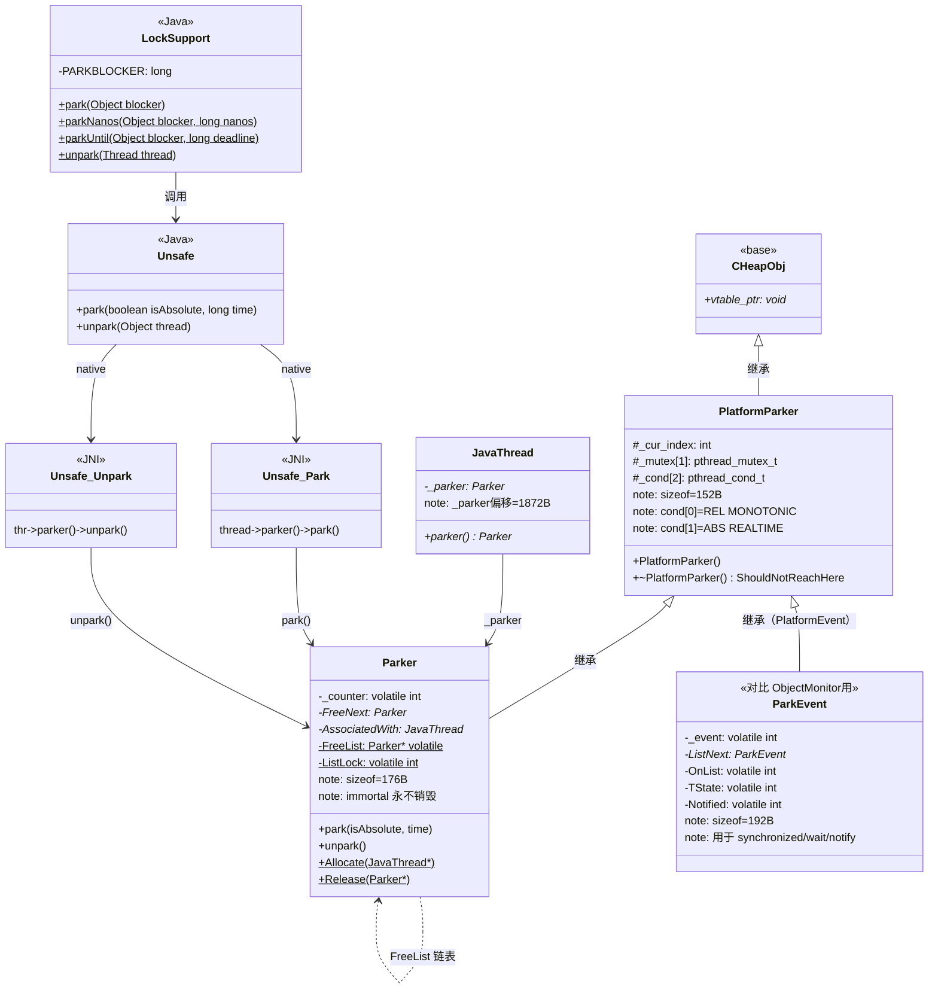
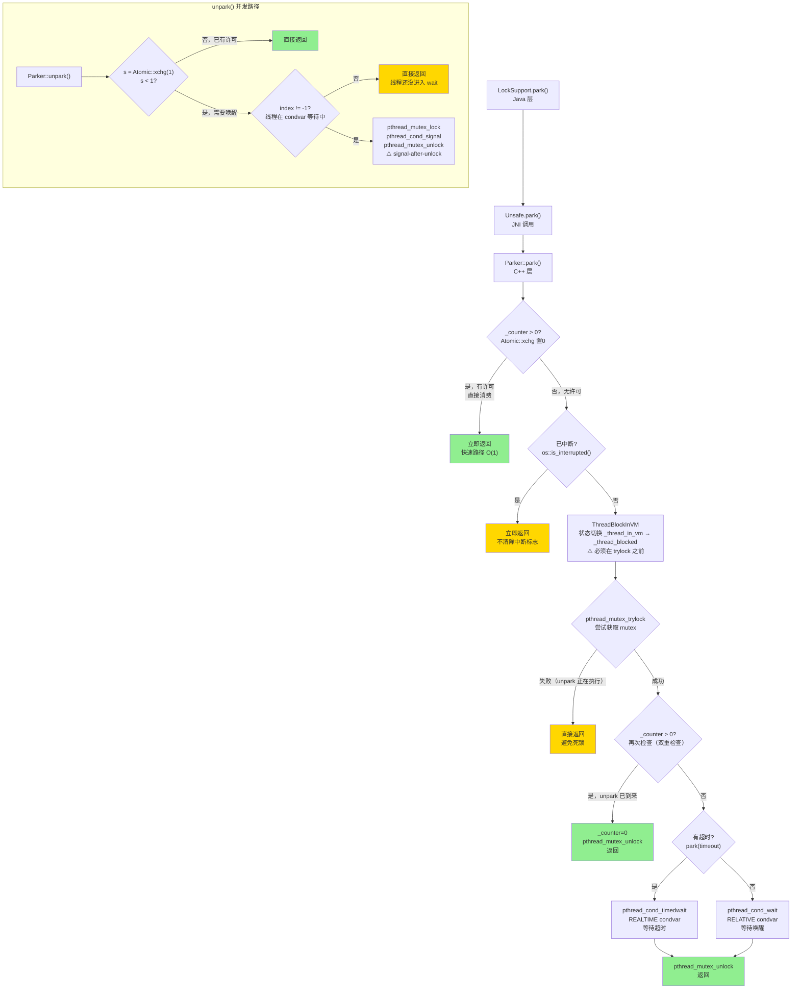

# LockSupport.park / unpark — 我的踩坑笔记

> 对应现有文档：`ParkerLockSupport/1-Parker-LockSupport-Deep-Dive.md`  
> 风格参考：`/data/workspace/redis-7.0/src/md/cluster/Cluster-HandWritten.md`  
> 核心原则：**第一人称 · 学习时间线 · 真实踩坑 · 源码级深度**

---

## 第零天：我以为 park/unpark 就是 wait/notify 的升级版

我以为 `LockSupport.park()` 就是 `Object.wait()` 的无锁版本，`unpark()` 就是 `notify()` 的精准版本。

```java
// 我以为的模型：
LockSupport.park();          // 等价于 obj.wait()，只是不需要持锁
LockSupport.unpark(thread);  // 等价于 obj.notify(thread)，精准唤醒
```

结果翻开源码，发现这个模型有四处根本性的错误：

1. `park()` 底层不是 `Object.wait()` 那套 `ObjectMonitor + WaitSet`，而是每个线程独立的 `Parker` 对象（`pthread_mutex + pthread_cond`）
2. `unpark()` 可以**先于** `park()` 调用，许可不会丢失（`_counter = 1` 会被保存）
3. `park()` 不会抛 `InterruptedException`，也**不会清除中断标志**
4. `Parker` 对象是**不朽的**（immortal），永远不会被销毁，只会被复用

这四个误解，我花了两天才全部搞清楚。

---

## 第一天：我踩的第一个坑 — unpark 先于 park 为什么不丢信号？

### 坑：我以为 unpark 先于 park 会丢信号

我以为 `notify()` 先于 `wait()` 会丢信号，所以 `unpark()` 先于 `park()` 也会丢。

结果看了源码，`Parker` 有一个 `_counter` 字段：

```cpp
// park.hpp:50
volatile int _counter;  // 许可计数器：0 = 无许可, 1 = 有许可
```

`unpark()` 的核心操作就是把 `_counter` 设为 1：

```cpp
// os_posix.cpp:2243（Parker::unpark 核心逻辑）
const int s = _counter;
_counter = 1;   // ★ 发放许可，即使线程还没 park，许可也保存在这里
```

`park()` 的第一步就是检查 `_counter`：

```cpp
// os_posix.cpp:2164（Parker::park 快速路径）
if (Atomic::xchg(0, &_counter) > 0) return;  // ★ 有许可，消耗并立即返回
```

所以 `unpark()` 先于 `park()` 的情况：
1. `unpark()` 把 `_counter` 设为 1
2. `park()` 执行 `Atomic::xchg(0, &_counter)`，交换出 1
3. 返回值 > 0，直接返回，**不阻塞**

信号不会丢，因为 `_counter` 把它保存下来了。

### 为什么 `_counter` 最大是 1，不累加？

我当时想：如果 `unpark()` 调用了 3 次，`_counter` 会不会变成 3？

答案是不会。`unpark()` 里是 `_counter = 1`（赋值），不是 `_counter++`（累加）。

**设计原因**：`park/unpark` 的语义是"许可"（permit），不是"信号量"（semaphore）。每个线程最多持有一个许可，多次 `unpark()` 等价于一次。这简化了使用者的心智模型：不需要担心"unpark 了几次，就要 park 几次才能阻塞"。

---

## 第一天半：数据结构补课

我第二天看 `park()` 的源码时，发现自己完全不知道 `PlatformParker` 是什么，也不知道为什么有两个 `condvar`，更不知道 `_cur_index` 是干什么的。回来补课。

### PlatformParker — POSIX 平台基类

```cpp
// os_posix.hpp:205-220
class PlatformParker : public CHeapObj<mtSynchronizer> {
 protected:
  enum {
    REL_INDEX = 0,    // 相对超时用的 condvar 索引（CLOCK_MONOTONIC）
    ABS_INDEX = 1     // 绝对超时用的 condvar 索引（CLOCK_REALTIME）
  };
  int _cur_index;             // 当前使用哪个 cond：-1=未使用, 0=REL, 1=ABS
  pthread_mutex_t _mutex[1];  // 互斥锁（数组写法是为了取地址方便）
  pthread_cond_t  _cond[2];   // ★ 两个条件变量！
                              //   _cond[0]：相对超时（CLOCK_MONOTONIC）
                              //   _cond[1]：绝对超时（CLOCK_REALTIME）
 public:
  ~PlatformParker() { guarantee(false, "invariant"); }  // ★ 析构不可达！
  PlatformParker();
};
```

**sizeof(PlatformParker) = 152 字节**（GDB 验证）：

```
PlatformParker 内存布局（64位系统）：
偏移   字段                    大小
 0     _vtable_ptr (CHeapObj)   8 字节
 8     _cur_index (int)         4 字节
12     [padding]                4 字节
16     _mutex[0] (pthread_mutex_t)  40 字节
56     _cond[0] (pthread_cond_t)    48 字节  ← REL，CLOCK_MONOTONIC
104    _cond[1] (pthread_cond_t)    48 字节  ← ABS，CLOCK_REALTIME
152    total
```

**为什么需要两个 condvar？**

这是我最没想到的设计。

`pthread_cond_timedwait` 的超时参数是**绝对时间**（`struct timespec`），但绝对时间有两种时钟：

- **CLOCK_MONOTONIC**（单调时钟）：从系统启动开始计时，不受 `ntpd`/`date` 命令影响，适合**相对超时**（如 `parkNanos(100ms)`）
- **CLOCK_REALTIME**（系统时钟）：就是墙上时间，适合**绝对超时**（如 `parkUntil(deadline)`）

问题是：condvar 在**创建时**就绑定了时钟类型（通过 `pthread_condattr_setclock`），不能运行时切换。

所以需要两个 condvar：
- `_cond[0]`（REL_INDEX）：绑定 CLOCK_MONOTONIC，给 `parkNanos()` 用
- `_cond[1]`（ABS_INDEX）：绑定默认时钟（CLOCK_REALTIME），给 `parkUntil()` 用

**构造函数**（`os_posix.cpp:2141-2150`）：

```cpp
// os_posix.cpp:2141-2150
os::PlatformParker::PlatformParker() {
  int status;
  // _cond[0]：REL，绑定 CLOCK_MONOTONIC（通过全局 _condAttr）
  status = pthread_cond_init(&_cond[REL_INDEX], _condAttr);
  assert_status(status == 0, status, "cond_init rel");
  // _cond[1]：ABS，使用默认时钟（传 NULL）
  status = pthread_cond_init(&_cond[ABS_INDEX], NULL);
  assert_status(status == 0, status, "cond_init abs");
  // mutex 初始化，类型 PTHREAD_MUTEX_NORMAL（非递归）
  status = pthread_mutex_init(_mutex, _mutexAttr);
  assert_status(status == 0, status, "mutex_init");
  _cur_index = -1;  // ★ -1 表示"线程未在等待"
}
```

**`_cur_index` 值域**：

```
_cur_index 三种状态：
  -1  → 线程未在等待（初始状态 / 等待结束后）
   0  → 线程在 _cond[0] 上等待（相对超时 / 无限期）
   1  → 线程在 _cond[1] 上等待（绝对超时）

★ unpark() 通过 _cur_index 知道要 signal 哪个 cond：
  if (index != -1) pthread_cond_signal(&_cond[index]);
```

### Parker — 许可管理器

```cpp
// park.hpp:48-75
class Parker : public os::PlatformParker {
private:
  volatile int _counter;       // ★ 许可计数器：0 = 无许可, 1 = 有许可
  Parker * FreeNext;           // FreeList 链表下一个节点（对象池）
  JavaThread * AssociatedWith; // 当前关联的 JavaThread

public:
  Parker() : PlatformParker() {
    _counter       = 0;    // 初始无许可
    FreeNext       = NULL;
    AssociatedWith = NULL;
  }
protected:
  ~Parker() { ShouldNotReachHere(); }  // ★ 析构不可达 → 对象永不销毁

public:
  void park(bool isAbsolute, jlong time);
  void unpark();

  static Parker * Allocate(JavaThread * t);
  static void Release(Parker * e);

private:
  static Parker * volatile FreeList;   // 全局空闲列表（对象池）
  static volatile int ListLock;        // 保护 FreeList 的自旋锁
};
```

**sizeof(Parker) = 176 字节**（GDB 验证）：

```
Parker 内存布局（64位系统）：
偏移   字段                    大小
 0-151  PlatformParker 基类     152 字节
152    _counter (volatile int)   4 字节  ← ★ 许可计数器
156    [padding]                 4 字节
160    FreeNext (Parker*)        8 字节
168    AssociatedWith (JavaThread*)  8 字节
176    total
```

**`_counter` 值域**：

```
_counter 只有两个有效值：
  0 → 无许可，park() 将阻塞
  1 → 有许可，park() 将立即返回并消耗许可

★ 关键：最大为 1，unpark 多次也不累加
   park() 用 Atomic::xchg(0, &_counter) 原子交换：
   - 交换出 1 → 有许可，直接返回
   - 交换出 0 → 无许可，进入 condvar wait
```

**创建位置**：`JavaThread` 构造函数（`thread.cpp:1758`）

```cpp
// thread.cpp:1758
_parker = Parker::Allocate(this);  // 每个 JavaThread 构造时分配一个 Parker
```

**销毁位置**：`JavaThread` 析构函数（`thread.cpp:1876`）

```cpp
// thread.cpp:1876
Parker::Release(_parker);  // 归还到 FreeList，Parker 对象本身不销毁
```

**关键字段生命周期**：

| 字段 | 谁设置 | 何时设置 | 设置什么值 | 谁读取 |
|------|--------|---------|-----------|--------|
| `_counter` | `Parker()` 构造函数 | 创建时 | 0 | `park()` 快速路径 |
| `_counter` | `park()` 阶段 6/8 | 持锁后/唤醒后 | 0（消耗许可） | `unpark()` 判断是否需要 signal |
| `_counter` | `unpark()` | 发放许可时 | 1 | `park()` 快速路径 |
| `_cur_index` | `PlatformParker()` | 创建时 | -1 | `unpark()` 判断 signal 哪个 cond |
| `_cur_index` | `park()` 阶段 7 | 进入 condvar wait 前 | 0 或 1 | `unpark()` |
| `_cur_index` | `park()` 阶段 8 | 唤醒后 | -1（重置） | 下次 `unpark()` |
| `AssociatedWith` | `Parker::Allocate()` | 分配时 | JavaThread* | 调试/断言 |
| `AssociatedWith` | `Parker::Release()` | 归还时 | NULL | `Parker::Allocate()` 断言 |

---

## 第二天：park() 的 8 个阶段

### 我踩的坑：以为 park() 就是"检查许可 + condvar wait"

我以为 `park()` 就两步：检查 `_counter`，如果是 0 就 `pthread_cond_wait`。

结果源码有 8 个阶段，每个阶段都有我没想到的细节。

### park() 完整源码（os_posix.cpp:2158）

**整体阶段划分**：

| 阶段 | 行号 | 做什么 | 关键细节 |
|------|------|--------|---------|
| 1. 快速路径 | 2164 | `Atomic::xchg` 检查 `_counter` | 无锁，全屏障 |
| 2. 中断检查 | 2172 | 已中断则直接返回 | 不清除中断标志 |
| 3. 时间解码 | 2176 | 解析 isAbsolute/time 参数 | 非法参数直接返回 |
| 4. 进入安全点 | 2191 | `ThreadBlockInVM` 构造 | 必须在获取 mutex 之前！ |
| 5. 获取锁 | 2195 | `pthread_mutex_trylock` | 用 trylock 不是 lock！ |
| 6. 二次检查 | 2201 | 持锁后再检 `_counter` | 防止 unpark 在 trylock 期间发生 |
| 7. 等待 | 2216 | `pthread_cond_wait` / `timedwait` | 根据 isAbsolute 选 cond |
| 8. 唤醒后清理 | 2228 | 重置 `_cur_index` + 消耗许可 | 全屏障 |

#### 阶段 1：快速路径（os_posix.cpp:2164）

```cpp
// os_posix.cpp:2164
// ★ 无锁检查：原子交换 _counter 为 0，如果之前是 1 说明有许可
// Atomic::xchg 提供全屏障（full barrier），保证内存可见性
if (Atomic::xchg(0, &_counter) > 0) return;
```

**为什么用 `Atomic::xchg` 而不是普通读？**

`_counter` 可能被其他线程的 `unpark()` 并发修改。普通读 + 写不是原子的，可能出现：
1. 线程 A 读到 `_counter = 1`
2. 线程 B 也读到 `_counter = 1`
3. 两个线程都认为有许可，都直接返回
4. 但许可只有一个，被消耗了两次

`Atomic::xchg(0, &_counter)` 原子地把 `_counter` 设为 0 并返回旧值，保证许可只被消耗一次。

#### 阶段 2：中断检查（os_posix.cpp:2172）

```cpp
// os_posix.cpp:2172
// ★ 优化：如果已中断，不值得进入 condvar wait
// false = 不清除中断标志（由 Java 层决定是否清除）
if (Thread::is_interrupted(thread, false)) {
  return;
}
```

**关键设计**：`park()` 不清除中断标志，也不抛 `InterruptedException`。

这与 `Object.wait()` 完全不同：
- `Object.wait()`：被中断时抛 `InterruptedException`，**清除**中断标志
- `LockSupport.park()`：被中断时直接返回，**不清除**中断标志，调用方需要自己检查 `Thread.interrupted()`

**为什么这样设计？**

`park/unpark` 是 JUC 的底层原语，上层的 `ReentrantLock`、`Condition` 等需要自己决定如何处理中断。如果 `park()` 自动清除中断标志，上层就无法感知到中断了。

#### 阶段 3：时间参数解码（os_posix.cpp:2176）

```cpp
// os_posix.cpp:2176
struct timespec absTime;
if (time < 0 || (isAbsolute && time == 0)) {
  return;  // ★ 非法参数：直接返回（不阻塞）
}
if (time > 0) {
  // ★ 将相对/绝对时间统一转为 abstime（pthread_cond_timedwait 需要绝对时间）
  // isAbsolute=false：time 是纳秒，加上当前 CLOCK_MONOTONIC 时间
  // isAbsolute=true：time 是毫秒（Epoch），转为 timespec
  to_abstime(&absTime, time, isAbsolute);
}
```

**`to_abstime()` 的时钟选择**：

```
isAbsolute=false（parkNanos）：
  absTime = clock_gettime(CLOCK_MONOTONIC) + time(ns)
  → 用 _cond[REL_INDEX=0]

isAbsolute=true（parkUntil）：
  absTime = time(ms) 转 timespec（CLOCK_REALTIME）
  → 用 _cond[ABS_INDEX=1]
```

#### 阶段 4：进入安全点（os_posix.cpp:2191）

```cpp
// os_posix.cpp:2191
// ★ ThreadBlockInVM 构造器将线程状态从 _thread_in_vm → _thread_blocked
//   这让 VM 知道此线程"安全"了（不会访问 Java 堆），SafePoint 无需等它
// ★★ 必须在获取 Parker::_mutex 之前转换状态！
//   否则：SafePoint 等待线程释放 _mutex → 线程等 SafePoint 完成 → 死锁
ThreadBlockInVM tbivm(jt);
```

**这是我最没想到的细节**：线程状态转换必须在获取 mutex 之前。

如果顺序反了（先获取 mutex，再转换状态）：
1. 线程 A 持有 Parker::_mutex，状态还是 `_thread_in_vm`
2. SafePoint 发起，等待所有 `_thread_in_vm` 线程到达安全点
3. 线程 A 等待 SafePoint 完成才能继续（因为 `ThreadBlockInVM` 还没构造）
4. 死锁！

#### 阶段 5：获取锁（os_posix.cpp:2195）

```cpp
// os_posix.cpp:2195
// ★ 用 trylock 而不是 lock！
//   如果 trylock 失败 → 说明有人正在 unpark（持有 _mutex 设置 _counter=1）
//   → 不需要等了，直接返回（等价于"被唤醒了"）
if (Thread::is_interrupted(thread, false) ||
    pthread_mutex_trylock(_mutex) != 0) {
  return;
}
```

**为什么用 `trylock` 而不是 `lock`？**

这是整个 `park()` 最精妙的设计。

如果用 `pthread_mutex_lock`（阻塞等待），会有一个问题：
- 线程 A 在 `pthread_mutex_lock` 上阻塞
- 线程 B 持有 mutex，正在执行 `unpark()`（设置 `_counter=1`，然后 `signal`）
- 线程 B 释放 mutex，线程 A 获得 mutex
- 线程 A 检查 `_counter`，发现是 1，直接返回

这个流程是正确的，但有一个隐患：线程 A 在 `pthread_mutex_lock` 上阻塞时，状态是 `_thread_blocked`，SafePoint 认为它安全了。但如果 SafePoint 在线程 A 阻塞期间发生，线程 A 会在 SafePoint 结束后才能继续，这会增加 SafePoint 的等待时间。

用 `trylock` 的好处：
- trylock 失败 → 说明 unpark 正在进行 → 直接返回，不阻塞
- 避免了在 mutex 上的额外等待

#### 阶段 6：持锁后二次检查（os_posix.cpp:2201）

```cpp
// os_posix.cpp:2201
// ★ 在 trylock 期间，可能有人 unpark 了（设置了 _counter=1）
if (_counter > 0) {
  _counter = 0;   // 消耗许可
  status = pthread_mutex_unlock(_mutex);
  assert_status(status == 0, status, "invariant");
  OrderAccess::fence();  // ★ 全屏障：保证 lock-free 路径和 locked 路径的内存可见性
  return;
}
```

**为什么需要二次检查？**

存在一个竞态：
1. 线程 A 执行阶段 1（`Atomic::xchg`），`_counter = 0`，没有许可
2. 线程 B 执行 `unpark()`，获取 mutex，设置 `_counter = 1`，释放 mutex
3. 线程 A 执行阶段 5（`trylock`），成功获取 mutex
4. 此时 `_counter = 1`，如果不检查就直接 `condvar_wait`，会永远等待

二次检查防止了这个竞态。

#### 阶段 7：真正等待（os_posix.cpp:2216）

```cpp
// os_posix.cpp:2216
OSThreadWaitState osts(thread->osthread(), false /* not Object.wait() */);
jt->set_suspend_equivalent();

assert(_cur_index == -1, "invariant");  // 进入前必须是"未使用"
if (time == 0) {
  // ★ 无限期等待：选择 REL condvar（任意选择，因为不需要超时）
  _cur_index = REL_INDEX;  // 设为 0，unpark 通过此值知道在哪个 cond 上等
  status = pthread_cond_wait(&_cond[_cur_index], _mutex);
  assert_status(status == 0 MACOS_ONLY(|| status == ETIMEDOUT),
                status, "cond_wait");
} else {
  // ★ 超时等待：根据 isAbsolute 选择对应 condvar
  _cur_index = isAbsolute ? ABS_INDEX : REL_INDEX;
  status = pthread_cond_timedwait(&_cond[_cur_index], _mutex, &absTime);
  assert_status(status == 0 || status == ETIMEDOUT,
                status, "cond_timedwait");
}
```

**`_cur_index` 的作用**：

`unpark()` 需要知道线程在哪个 condvar 上等待，才能 signal 正确的 condvar。`_cur_index` 就是这个"信号灯"：
- 进入 wait 前设为 0 或 1
- `unpark()` 读取 `_cur_index`，signal 对应的 condvar
- 唤醒后重置为 -1

#### 阶段 8：唤醒后清理（os_posix.cpp:2228）

```cpp
// os_posix.cpp:2228
_cur_index = -1;     // ★ 重置为"未使用"（必须在持锁时设置，防止 unpark 读到脏值）

_counter = 0;        // ★ 消耗许可（无论是被 unpark 唤醒还是超时）
status = pthread_mutex_unlock(_mutex);
assert_status(status == 0, status, "invariant");
OrderAccess::fence();  // 全屏障

// ★ 如果在等待期间被外部 suspend，需要自我挂起
if (jt->handle_special_suspend_equivalent_condition()) {
  jt->java_suspend_self();
}
```

**为什么超时唤醒也要 `_counter = 0`？**

超时返回时，`_counter` 可能是 0（没有 unpark），也可能是 1（超时前有人 unpark 了）。统一设为 0，保证下次 `park()` 会重新阻塞（除非又有新的 `unpark()`）。

---

## 第三天：unpark() — 最反直觉的设计

### 我踩的坑：以为 signal 应该在 unlock 之前

教科书上说：`pthread_cond_signal` 应该在持有 mutex 时调用，然后再 unlock。

但 `Parker::unpark()` 是先 unlock，再 signal：

```cpp
// os_posix.cpp:2243-2266
void Parker::unpark() {
  // ★ 第一步：获取锁
  int status = pthread_mutex_lock(_mutex);
  assert_status(status == 0, status, "invariant");

  // ★ 第二步：保存旧 _counter，设新值为 1
  const int s = _counter;
  _counter = 1;

  // ★ 第三步：捕获 _cur_index（必须在 unlock 前！）
  int index = _cur_index;

  // ★ 第四步：先 unlock
  status = pthread_mutex_unlock(_mutex);
  assert_status(status == 0, status, "invariant");

  // ★ 第五步：再 signal（在 unlock 之后！）
  if (s < 1 && index != -1) {
    // s < 1：之前 _counter 为 0，说明线程可能在等
    // index != -1：线程确实在某个 cond 上等待
    status = pthread_cond_signal(&_cond[index]);
    assert_status(status == 0, status, "invariant");
  }
}
```

### 为什么先 unlock 后 signal？

这叫 **signal-after-unlock**，是一个有意的设计选择。

**传统做法（先 signal 后 unlock）的问题**：

```
线程 B（unpark）：
  1. 持有 mutex
  2. signal → 线程 A 被唤醒，尝试获取 mutex
  3. 线程 A 获取 mutex 失败（B 还持有），又被阻塞
  4. B unlock
  5. A 获取 mutex，继续执行

这就是 "futile wakeup"（无效唤醒）：A 被唤醒了，但立刻又阻塞了。
```

**signal-after-unlock 的好处**：

```
线程 B（unpark）：
  1. 持有 mutex
  2. unlock
  3. signal → 线程 A 被唤醒，尝试获取 mutex
  4. A 获取 mutex 成功（B 已经 unlock 了），继续执行

A 被唤醒后能立刻获取 mutex，减少了一次无效的上下文切换。
```

**为什么 `index` 必须在 unlock 前捕获？**

如果在 unlock 后读 `_cur_index`：
1. B unlock
2. A 被另一个 unpark 唤醒，执行阶段 8，把 `_cur_index` 重置为 -1
3. B 读到 `_cur_index = -1`，不发 signal
4. 但 A 已经在等待下一次 park 了，这次 signal 就丢了

所以必须在 unlock 前把 `_cur_index` 保存到局部变量 `index`。

### `s < 1 && index != -1` 双重条件

```
s < 1：之前 _counter 为 0
  → 说明线程可能在等（如果 _counter 已经是 1，说明已经有许可了，不需要 signal）

index != -1：线程确实在某个 cond 上等待
  → 如果 index == -1，说明线程还没进入 condvar wait（在快速路径或 trylock 阶段）
  → 不需要 signal，线程会自己检查 _counter 然后返回
```

两个条件同时满足才发 signal，避免不必要的系统调用。

---

## 第四天：Parker 的不朽设计

### 我踩的坑：以为 Parker 会随线程销毁

我以为每个线程有一个 Parker，线程退出时 Parker 也会被销毁（`delete`）。

结果看了源码，`Parker` 的析构函数是：

```cpp
// park.hpp:62
~Parker() { ShouldNotReachHere(); }  // ★ 析构不可达！
```

`ShouldNotReachHere()` 是 JVM 的断言宏，如果执行到这里就会 crash。也就是说，**Parker 永远不会被析构**。

### 为什么 Parker 是不朽的？

源码注释（`park.hpp:35-40`）解释了原因：

```
// To avoid errors where an os thread expires but the JavaThread still
// exists, Parkers are immortal (type-stable) and are recycled across
// new threads. Because park-unpark allow spurious wakeups it is
// harmless if an unpark call unparks a new thread using the old
// Parker reference.
```

**核心问题**：`unpark(thread)` 的执行路径：

```cpp
// unsafe.cpp:960-983（Unsafe_Unpark）
ThreadsListHandle tlh;
JavaThread* thr = NULL;
(void) tlh.cv_internal_thread_to_JavaThread(jthread, &thr, &java_thread);
if (thr != NULL) {
  p = thr->parker();  // ★ 获取 Parker 指针
}
// ★ ThreadsListHandle 在此销毁（tlh 析构）
// 此时目标线程可能已经退出！
if (p != NULL) {
  p->unpark();  // ★ 如果 Parker 已被 delete，这里就是 use-after-free！
}
```

`ThreadsListHandle` 析构后，目标线程可能已经退出，`p` 指向的 Parker 可能已经被销毁。如果 Parker 被 `delete` 了，`p->unpark()` 就是 use-after-free，直接 crash。

**解决方案**：Parker 永不销毁，只是放回 FreeList 供新线程复用。

即使旧引用 `p` 指向了被其他线程复用的 Parker，最坏结果是：
- 新线程的 Parker 收到了一个意外的 `unpark()`
- 新线程的 `park()` 会立刻返回（因为 `_counter = 1`）
- 这是一次**虚假唤醒**（spurious wakeup）

`park/unpark` 的语义本身就允许虚假唤醒，调用方必须用 `while` 循环检查条件。所以虚假唤醒是无害的。

### Parker::Allocate — 对象池分配（park.cpp:125）

```cpp
// park.cpp:125-151
Parker * Parker::Allocate(JavaThread * t) {
  guarantee(t != NULL, "invariant");
  Parker * p;

  // ★ 第一步：尝试从 FreeList 回收
  // 用自旋锁而非 mutex，因为 Parker 本身就是 mutex 实现的一部分（避免循环依赖）
  Thread::SpinAcquire(&ListLock, "ParkerFreeListAllocate");
  {
    p = FreeList;
    if (p != NULL) {
      FreeList = p->FreeNext;  // 摘下链表头
    }
  }
  Thread::SpinRelease(&ListLock);

  if (p != NULL) {
    guarantee(p->AssociatedWith == NULL, "invariant");  // 回收的必须已解除关联
  } else {
    // ★ 第二步：FreeList 空，创建新 Parker（永不 delete）
    p = new Parker();
  }
  p->AssociatedWith = t;   // 建立关联
  p->FreeNext       = NULL;
  return p;
}
```

**为什么用自旋锁而不是 mutex？**

Parker 自身就是基于 `pthread_mutex` 实现的。如果 `Allocate()` 用 `pthread_mutex_lock` 来保护 FreeList，就会出现循环依赖：
- 分配 Parker 需要 mutex
- mutex 本身就是 Parker 的一部分

用 `Thread::SpinAcquire`（CAS 自旋锁）避免了这个循环依赖。

### Parker::Release — 归还对象池（park.cpp:154）

```cpp
// park.cpp:154-166
void Parker::Release(Parker * p) {
  if (p == NULL) return;
  guarantee(p->AssociatedWith != NULL, "invariant");
  guarantee(p->FreeNext == NULL,       "invariant");
  p->AssociatedWith = NULL;  // ★ 解除关联

  // 放回 FreeList 头部（头插法，O(1)）
  Thread::SpinAcquire(&ListLock, "ParkerFreeListRelease");
  {
    p->FreeNext = FreeList;
    FreeList = p;
  }
  Thread::SpinRelease(&ListLock);
}
```

---

## 第四天半：LockSupport Java 层 — blocker 是干什么的？

### 我踩的坑：以为 blocker 参数只是注释

我以为 `LockSupport.park(Object blocker)` 的 `blocker` 参数只是给人看的注释，JVM 不会用它。

结果看了源码，`blocker` 被写入了 `Thread.parkBlocker` 字段：

```java
// LockSupport.java（核心方法）
public static void park(Object blocker) {
  Thread t = Thread.currentThread();
  setBlocker(t, blocker);      // ★ 写入 Thread.parkBlocker
  U.park(false, 0L);           // → Parker::park(false, 0)
  setBlocker(t, null);         // ★ 返回后清除
}

// 通过 Unsafe 直接写 Thread.parkBlocker 字段（绕过 setter，避免同步开销）
private static void setBlocker(Thread t, Object arg) {
  U.putObject(t, PARKBLOCKER, arg);
}
```

`Thread.parkBlocker` 是 `java.lang.Thread` 中的一个 `volatile Object` 字段，诊断工具（`jstack`/`ThreadMXBean`/`JFR`）读取此字段来显示线程被谁阻塞。

**实际效果**：

```
# jstack 输出（有 blocker）：
"worker-1" #12 prio=5 os_prio=0 tid=0x... nid=0x... waiting on condition [0x...]
   java.lang.Thread.State: WAITING (parking)
        at sun.misc.Unsafe.park(Native Method)
        - parking to wait for  <0x...> (a java.util.concurrent.locks.AbstractQueuedSynchronizer$ConditionObject)
        at java.util.concurrent.locks.LockSupport.park(LockSupport.java:175)

# jstack 输出（无 blocker，用 park() 而不是 park(blocker)）：
"worker-1" #12 prio=5 os_prio=0 tid=0x... nid=0x... waiting on condition [0x...]
   java.lang.Thread.State: WAITING (parking)
        at sun.misc.Unsafe.park(Native Method)
        at java.util.concurrent.locks.LockSupport.park(LockSupport.java:304)
        # ★ 没有 "parking to wait for" 这行，无法知道在等什么
```

**API 参数解码表**：

| 方法 | isAbsolute | time | 含义 |
|------|-----------|------|------|
| `park()` / `park(blocker)` | false | 0 | 无限期阻塞 |
| `parkNanos(blocker, nanos)` | false | nanos | 相对超时（纳秒），用 CLOCK_MONOTONIC |
| `parkUntil(blocker, deadline)` | true | deadline(ms) | 绝对超时（毫秒，Epoch），用 CLOCK_REALTIME |

### Thread.interrupt() 对 park() 的影响

`Thread.interrupt()` 会唤醒 `park()` 中的线程：

```cpp
// os_posix.cpp:755-765（os::interrupt 关键行）
void os::interrupt(Thread* thread) {
  osthread->set_interrupted(true);
  OrderAccess::fence();

  ParkEvent * const slp = thread->_SleepEvent;
  if (slp != NULL) slp->unpark();  // 唤醒 Thread.sleep()

  if (thread->is_Java_thread())
    ((JavaThread*)thread)->parker()->unpark();  // ★ 唤醒 LockSupport.park()

  ParkEvent * ev = thread->_ParkEvent;
  if (ev != NULL) ev->unpark();    // 唤醒 synchronized / Object.wait()
}
```

`Thread.interrupt()` 同时唤醒三种阻塞：
1. `_SleepEvent->unpark()` — 唤醒 `Thread.sleep()`
2. `parker()->unpark()` — **唤醒 `LockSupport.park()`**
3. `_ParkEvent->unpark()` — 唤醒 `synchronized` / `Object.wait()`

**关键区别**：

| | `LockSupport.park()` | `Object.wait()` |
|---|---------------------|-----------------|
| 被中断时 | 直接返回 | 抛 `InterruptedException` |
| 中断标志 | **不清除** | **清除** |
| 调用方处理 | 需要自己检查 `Thread.interrupted()` | 捕获异常即可 |

---

## 第五天：插桩验证 — 我用数据打脸了自己的猜测

### 猜测 vs 实测对比表

| 猜测 | 实测 | 打脸程度 |
|------|------|---------|
| sizeof(Parker) = 64 字节（看起来字段不多） | **176 字节**（含 PlatformParker 基类 152B） | 差了 112 字节 |
| sizeof(PlatformParker) = 48 字节（1 mutex + 1 cond） | **152 字节**（1 mutex + **2** cond） | 没想到有两个 condvar |
| Parker 随线程销毁 | **永不销毁**，放回 FreeList 复用 | 完全错了 |
| unpark 先于 park 会丢信号 | `_counter=1` 保存许可，**不丢** | 完全错了 |
| park() 用 `pthread_mutex_lock` | 用 **`pthread_mutex_trylock`**（trylock！） | 没想到 |
| signal 在 unlock 之前 | **先 unlock 后 signal**（signal-after-unlock） | 和教科书相反 |
| JavaThread::_parker 偏移 = 64 | **1872 字节**（JavaThread 字段很多） | 差了 1808 字节 |

### 实测数据（来自 GDB 验证）

**Parker::Allocate 调用次数**：

```
[GDB] Parker::Allocate 断点命中 7 次
→ 验证：每个 JavaThread 构造时分配一个 Parker
→ 7 个 JavaThread = main + 6 个 JVM 内部线程（GC/JIT/Finalizer 等）
```

**park() 时的初始状态**：

```
[GDB] Parker::park 断点：
  _counter = 0    ← 无许可，将阻塞
  _cur_index = -1 ← 未在等待
```

**unpark() 时的状态**：

```
[GDB] Parker::unpark 断点（目标线程在 park 中）：
  _counter (before) = 0  ← 线程在等
  _cur_index = 0         ← 线程在 _cond[REL_INDEX] 上等待
  → 发送 pthread_cond_signal(&_cond[0])
```

**park/unpark 使用同一个 Parker**：

```
[GDB] park 时 Parker 地址：0x7ffff0f7edc0
[GDB] unpark 时 Parker 地址：0x7ffff0f7edc0
→ 验证：同一个 Parker 对象
```

**timed park 参数**：

```
[GDB] Unsafe_Park 断点（parkNanos(100ms)）：
  isAbsolute = 0
  time = 100000000  ← 100ms = 100,000,000 ns
→ 验证：parkNanos 传 isAbsolute=false, time=纳秒
```

---

## 尾声：我现在怎么理解 park/unpark

以前我以为 `park/unpark` 就是 `wait/notify` 的升级版，现在我知道：

**park/unpark 是一个基于"许可"语义的线程阻塞原语**：

```
每个 JavaThread 有一个 Parker（176B）：
  ├── 继承 PlatformParker（152B）
  │     ├── pthread_mutex（40B）
  │     ├── pthread_cond[0]（48B，CLOCK_MONOTONIC，相对超时）
  │     └── pthread_cond[1]（48B，CLOCK_REALTIME，绝对超时）
  ├── _counter（4B，许可：0 或 1）
  ├── FreeNext（8B，对象池链表）
  └── AssociatedWith（8B，关联线程）

park() 三层检查：
  1. Atomic::xchg 无锁快速路径（_counter > 0 直接返回）
  2. 中断检查（已中断直接返回，不清除标志）
  3. trylock + condvar wait（真正阻塞）

unpark() 两步：
  1. mutex 保护下设 _counter=1，捕获 _cur_index
  2. unlock 后 signal（signal-after-unlock，避免 futile wakeup）
```

**最重要的三个设计决策**：

1. **`_counter` 许可语义**：unpark 可先于 park，许可不丢失。这是 `wait/notify` 做不到的。

2. **Parker 不朽（immortal）**：永不销毁，只复用。解决了 `unpark(thread)` 的 use-after-free 问题，代价是极罕见的虚假唤醒（无害）。

3. **signal-after-unlock**：先 unlock 后 signal，避免 futile wakeup，减少无效的上下文切换。

**最容易踩的坑**：

```java
// ❌ 错误：以为 park 会抛 InterruptedException
try {
    LockSupport.park();
} catch (InterruptedException e) {  // ★ 编译错误！park 不抛受检异常
    // ...
}

// ✅ 正确：park 返回后检查中断标志
LockSupport.park();
if (Thread.interrupted()) {  // ★ 检查并清除中断标志
    // 处理中断
}

// ❌ 错误：以为 park 一定会阻塞
LockSupport.unpark(Thread.currentThread());  // 先发许可
LockSupport.park();  // ★ 立刻返回！不会阻塞

// ❌ 错误：以为多次 unpark 会累积
LockSupport.unpark(t);
LockSupport.unpark(t);  // 第二次无效，_counter 最大为 1
LockSupport.park();     // 只消耗一次许可，立刻返回
LockSupport.park();     // ★ 这次会阻塞！
```

---

## 数据结构关系图



---

## park() / unpark() 完整流程图

我当时最搞不清楚的是 park() 里的三层递进——什么时候走快速路径，什么时候走慢速路径，`ThreadBlockInVM` 为什么必须在 `trylock` 之前。把流程画出来才理清楚：



**几个关键设计决策：**

- `ThreadBlockInVM` 必须在 `trylock` 之前：状态切换后 Safepoint 才能识别这个线程已阻塞，否则 STW 时会一直等这个线程
- `signal-after-unlock`：先 unlock 再 signal，避免 signal 后线程立刻醒来发现 mutex 还被占用（futile wakeup）
- `index != -1` 双重检查：unpark 时线程可能还没进入 condvar 等待，此时 signal 没有意义，直接返回即可（`_counter=1` 已经设置，park 进来后会走快速路径）

---

## 还没搞懂的地方

**1. ParkEvent 和 Parker 的分工边界**

我知道 Parker 用于 `LockSupport.park()`，ParkEvent 用于 `synchronized/wait/notify`。但在源码里我看到 `JavaThread` 同时有 `_parker` 和 `_ParkEvent` 两个字段，有时候还有 `_SleepEvent`。这三个 ParkEvent 的分工是什么？`Thread.sleep()` 用的是哪个？我没有完整追这条线。

**2. FreeList 对象池的并发安全**

Parker 的 `Allocate()` 用自旋锁保护 FreeList，而不是 mutex。我理解是为了避免循环依赖（Parker 本身就是锁的基础设施），但自旋锁在高并发下会不会有性能问题？FreeList 的最大长度是多少？我没有找到相关参数。

**3. MONOTONIC vs REALTIME condvar 的选择**

`PlatformParker` 里有两个 condvar：`_cond[REL_INDEX]` 用 `CLOCK_MONOTONIC`，`_cond[ABS_INDEX]` 用 `CLOCK_REALTIME`。无超时的 `park()` 用 REL（相对时间），有超时的 `park(timeout)` 用 ABS（绝对时间）。为什么有超时反而用绝对时间？我猜是为了避免系统时间调整导致超时不准，但没有验证。

**4. `_counter` 的 volatile 语义**

`_counter` 是 `volatile int`，在 park/unpark 里用 `Atomic::xchg` 操作。为什么不直接用 `volatile` 读写，而要用 `Atomic::xchg`？我理解 xchg 有 lock 前缀保证原子性，但 volatile 在 x86 上不是也有类似保证吗？这个细节我没有完全搞清楚。

---

## 总结

### 数据结构层面

| 结构 | sizeof | 核心特征 |
|------|--------|---------|
| **PlatformParker** | 152B | 1 mutex + 2 condvar（REL=MONOTONIC, ABS=REALTIME），POSIX 平台基类，析构不可达 |
| **Parker** | 176B | 继承 PlatformParker，`_counter`(0/1) 许可语义，FreeList 对象池，immortal 永不销毁 |
| **LockSupport** | Java 类 | 纯静态方法，通过 Unsafe 调用 Parker，附加 blocker 诊断信息（写入 Thread.parkBlocker） |

### 算法层面

| 算法 | 核心设计决策 |
|------|-------------|
| **park()** | 三层递进：Atomic::xchg 无锁快速路径 → 中断检查 → trylock+condvar；ThreadBlockInVM 必须在 trylock 之前；trylock 失败直接返回 |
| **unpark()** | signal-after-unlock（先 unlock 后 signal）避免 futile wakeup；`s < 1 && index != -1` 双重条件避免不必要的 signal |
| **Allocate/Release** | 对象池 + immortal：Parker 永不销毁，旧引用只导致虚假唤醒不导致 crash；用自旋锁而非 mutex 避免循环依赖 |
| **中断交互** | `os::interrupt()` 调用 `parker()->unpark()` 唤醒 park；park 不清除中断标志（与 Object.wait() 不同） |

---

*文档状态：✅ 完成*  
*写作日期：2026-03-06*  
*参考文档：`ParkerLockSupport/1-Parker-LockSupport-Deep-Dive.md`*
