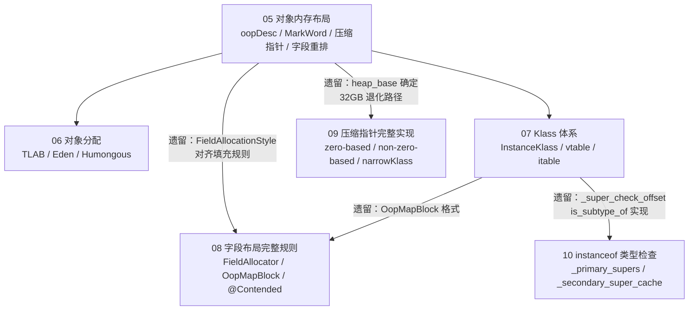

# 02-object-memory 模块大纲

> **模块主题：Java 对象模型**  
> 核心问题：一个 Java 对象在内存中长什么样？怎么来的？JVM 怎么认识它？  
> 风格：第一人称 · 学习时间线 · 真实踩坑 · 源码级深度  
> 环境：OpenJDK 11 · `-Xms8g -Xmx8g -XX:+UseG1GC` · G1 Region = 4MB

---

## 模块边界（重要）

这个模块只回答一个问题：**对象本身的内存结构**。

| 属于本模块 | 不属于本模块（在其他模块） |
|-----------|--------------------------|
| 对象头的结构（MarkWord / klass pointer） | synchronized 锁升级（→ 锁机制模块） |
| 对象的字段布局规则 | 类加载全流程（→ 类加载模块） |
| 压缩指针的编解码机制 | 方法调用与分发（→ 方法调用模块） |
| Klass 体系的数据结构 | GC 年龄与晋升（→ GC 模块） |
| 对象分配路径（TLAB / Eden） | finalization 与引用类型（→ GC 模块） |
| OopMapBlock（GC 如何扫描对象引用） | |
| instanceof 的快速路径（_super_check_offset） | |

---

## 已有内容（3 篇）

| 编号 | 文件 | 核心主题 | 状态 |
|------|------|---------|------|
| 05 | `05-object-layout-HandWritten.md` | 对象内存布局（oopDesc / MarkWord 5 种状态 / 压缩指针 / 字段重排） | ✅ 完成 |
| 06 | `06-object-alloc-HandWritten.md` | 对象分配流程（TLAB 快速路径 / Eden CAS / Humongous） | ✅ 完成 |
| 07 | `07-klass-hierarchy-HandWritten.md` | Klass 体系（InstanceKlass / vtable / itable / 数组类） | ✅ 完成 |

---

## 待补充内容（3 篇）

> 只补充真正属于"对象模型"范畴的内容，每篇都是对已有文档遗留问题的直接承接。

---

### 08 — 字段布局的完整规则

> 承接 05 的遗留问题 1、2，以及 07 的遗留问题 2

**05 留下的问题：**
- `FieldAllocationStyle=0/1/2` 三种策略的完整规则（默认 1：oop 字段放最后；0 是什么；2 是什么）
- 不同策略对 GC 扫描效率的影响
- 对象对齐填充的精确规则（`instanceOopDesc::base_offset_in_bytes()` 没有仔细看）
- 填充加在哪里？最后一个字段后面，还是有其他规则？

**07 留下的问题：**
- `OopMapBlock` 的格式：一个 Block 描述一段连续 oop 字段（起始偏移 + 长度），还是每个字段单独一条？
- `OopMapBlock` 是在哪里构建的？GC 扫描时怎么用它？

**额外深入：**
- 继承关系下的字段布局（父类字段 + 子类字段的对齐规则，父类末尾的 padding 能被子类复用吗？）
- `@Contended` 注解：缓存行填充，防止 false sharing（实际场景：`Thread.threadLocalRandomSeed`）

---

### 09 — 压缩指针的完整实现

> 承接 05 的遗留问题 3

**05 留下的问题：**
- `heap_base` 是怎么确定的？JVM 启动时如何选择堆起始地址（`Universe::initialize_heap`）
- 怎么保证 `heap_base` 是 8B 对齐的？
- 堆超过 32GB 时的退化路径（具体的判断逻辑没有追）

**深入展开：**
- `UseCompressedOops` vs `UseCompressedClassPointers` 的独立控制
- 三种压缩模式：`zero-based`（heap_base=0）/ `non-zero-based` / `non-zero-disjoint`
- 每种模式的触发条件和编解码差异
- Metaspace 的 `narrowKlass` 压缩（最大 4GB，移位量不同）

---

### 10 — instanceof 与类型检查的快速路径

> 承接 07 的遗留问题 1

**07 留下的问题：**
- `_super_check_offset` 具体是怎么用的？它指向 `_primary_supers` 数组里的某个槽位，还是 `_secondary_super_cache`？
- `is_subtype_of` 的完整实现没有追

**深入展开：**
- `_primary_supers[8]` 的 O(1) 快速路径：前 8 个超类直接数组查找
- `_secondary_supers` 的慢速路径：超过 8 层继承时的线性扫描
- `_secondary_super_cache` 的缓存机制：上次命中的接口缓存
- `checkcast` / `instanceof` 字节码的完整实现
- 接口类型检查为什么比类类型检查慢

---

## 完整模块文件列表

```
02-object-memory/
├── 00-outline.md                            📋 本文件（大纲）
│
├── 05-object-layout-HandWritten.md          ✅ 已有（对象内存布局）
├── 06-object-alloc-HandWritten.md           ✅ 已有（对象分配流程）
├── 07-klass-hierarchy-HandWritten.md        ✅ 已有（Klass 体系）
│
├── 08-field-layout-rules-HandWritten.md     📝 待写（字段布局完整规则 + OopMapBlock）
├── 09-compressed-pointers-HandWritten.md    📝 待写（压缩指针完整实现）
└── 10-instanceof-typecheck-HandWritten.md   📝 待写（instanceof 与类型检查快速路径）
```

---

## 各篇依赖关系



---

## 各篇"还没搞懂"的承接关系

| 来源文档 | 遗留问题 | 由哪篇承接 |
|---------|---------|-----------|
| 05 | `FieldAllocationStyle=0/1/2` 三种策略 | **08** |
| 05 | 对象对齐填充的精确规则 | **08** |
| 05 | `heap_base` 的对齐保证与确定方式 | **09** |
| 05 | 堆超过 32GB 时的退化路径 | **09** |
| 07 | `OopMapBlock` 的格式与构建 | **08** |
| 07 | `_super_check_offset` 的 instanceof 快速路径 | **10** |
| 07 | `itable._offset` 字段单位 | ⚠️ 属于方法调用模块，不在本模块 |
| 07 | `_misc_flags` 的 16 个 bit | ⚠️ 属于类加载模块，不在本模块 |
| 07 | `_array_name` 字段的生命周期 | ⚠️ 属于类加载模块，不在本模块 |
| 06 | TLAB 重填时 Eden 满了的 GC 触发路径 | ⚠️ 属于 GC 模块，不在本模块 |
| 06 | Humongous 对象的 eager reclaim 机制 | ⚠️ 属于 GC 模块，不在本模块 |

---

## 优先级建议

| 优先级 | 编号 | 主题 | 理由 |
|--------|------|------|------|
| ⭐⭐⭐ 最高 | **08** | 字段布局完整规则 | 直接承接 05 + 07 的遗留问题，是对象内存布局的完整闭环 |
| ⭐⭐ 高 | **09** | 压缩指针完整实现 | 05 已铺垫编解码原理，09 是机制层面的完整闭环 |
| ⭐ 中 | **10** | instanceof 类型检查 | 07 已分析 `_primary_supers` 数据结构，10 是算法层面的闭环 |

---

*大纲版本：v2.0（重聚焦：对象模型）*  
*更新日期：2026-03-10*
