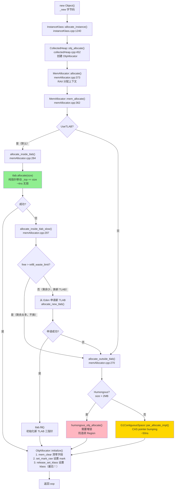

# 对象分配：我以为 new 就是 malloc，结果差远了

> 第一人称学习笔记 · 基于 OpenJDK 11 源码  
> 对应文档：`ObjectModel/2-Object-Allocation-Flow-Deep-Dive.md` · `ObjectModel/4-TLAB-Deep-Dive.md`  
> 插桩数据：`Instrumentation/03-ObjectAlloc-Probe-Results.md`

---

## 第零天：我以为 new 就是 malloc

刚开始学 JVM 的时候，我对 `new Object()` 的理解是这样的：

> "JVM 在堆上 malloc 一块内存，然后初始化对象头，完事。"

这个理解有三个根本性的错误：

**错误 1：以为每次 new 都要加锁**

我以为堆是共享的，多线程同时 new 对象肯定要加锁，不然地址会冲突。所以我以为 new 很慢，是个重操作。

**错误 2：以为分配路径只有一条**

我以为 new 就是"在堆上找一块空闲内存"，没想到有 TLAB 快速路径、Eden CAS 路径、Humongous 路径这么多条。

**错误 3：以为 TLAB 是个缓存**

我以为 TLAB 是"缓存了一些已分配的对象"，类似对象池。结果完全不是——TLAB 是"预先从 Eden 区划出来的一块内存，线程私有，分配时只需要移动指针"。

---

## 第一天：发现 new 的真正入口

我以为 `new Object()` 直接调用某个 C++ 函数分配内存。翻了字节码才发现，`new` 对应的是 `_new` 字节码，解释器里有个 `InterpreterRuntime::_new`。

但真正的分配入口是：

```cpp
// instanceKlass.cpp:1240
instanceOop InstanceKlass::allocate_instance(TRAPS) {
  bool has_finalizer_flag = has_finalizer();  // ★ 先查 finalizer，因为分配后可能触发 GC
  int size = size_helper();                   // ★ 对象大小（字节数 / HeapWordSize）

  instanceOop i;
  // ★ 调用堆的统一分配入口
  i = (instanceOop)Universe::heap()->obj_allocate(this, size, CHECK_NULL);
  
  if (has_finalizer_flag && !RegisterFinalizersAtInit) {
    i = register_finalizer(i, CHECK_NULL);    // ★ 有 finalizer 的对象要注册到 Finalizer 队列
  }
  return i;
}
```

然后 `obj_allocate` 里：

```cpp
// collectedHeap.cpp:452
oop CollectedHeap::obj_allocate(Klass* klass, int size, TRAPS) {
  ObjAllocator allocator(klass, size, THREAD);  // ★ 创建分配器
  return allocator.allocate();                  // ★ 统一入口
}
```

`ObjAllocator` 继承自 `MemAllocator`，`allocate()` 是模板方法：

```cpp
// memAllocator.cpp:373
oop MemAllocator::allocate() const {
  oop obj = NULL;
  {
    Allocation allocation(*this, &obj);   // ★ RAII 分配上下文（析构时检查 OOM）
    HeapWord* mem = mem_allocate(allocation);  // ★ 分配内存
    if (mem != NULL) {
      obj = initialize(mem);             // ★ 初始化对象头
    } else {
      obj = NULL;
    }
  }
  return obj;
}
```

`mem_allocate` 才是真正的分叉点：

```cpp
// memAllocator.cpp:362
HeapWord* MemAllocator::mem_allocate(Allocation& allocation) const {
  if (UseTLAB) {
    HeapWord* result = allocate_inside_tlab(allocation);  // ★ 先试 TLAB（快速路径）
    if (result != NULL) {
      return result;
    }
  }
  return allocate_outside_tlab(allocation);  // ★ TLAB 失败，走堆分配（慢速路径）
}
```

**我当时的第一个惊讶**：原来 TLAB 是在 `mem_allocate` 这一层判断的，不是在字节码层面。

---

## 第一天半：数据结构补课

我第二天看 TLAB 分配的时候，发现自己完全不知道 `_top`、`_end`、`_refill_waste_limit` 这些字段是什么。回来补课。

### ThreadLocalAllocBuffer（TLAB）

```cpp
// threadLocalAllocBuffer.hpp:46-72
class ThreadLocalAllocBuffer: public CHeapObj<mtThread> {
private:
  // ===== 核心指针（5个）=====
  HeapWord* _start;           // TLAB 起始地址（从 Eden 申请到的内存块起点）
  HeapWord* _top;             // 当前分配位置（每次分配后 _top += size）★ 最关键
  HeapWord* _pf_top;          // 预取水印（C2 预取优化用）
  HeapWord* _end;             // 分配结束位置（可能被采样截断，比 _allocation_end 小）
  HeapWord* _allocation_end;  // 真正的结束位置（不含对齐保留区）

  // ===== 大小控制（4个）=====
  size_t    _desired_size;          // 期望大小（动态调整，初始 2048KB）
  size_t    _refill_waste_limit;    // 浪费阈值（默认 32KB）★ 控制是否换新 TLAB
  size_t    _allocated_before_last_gc;
  size_t    _bytes_since_last_sample_point;

  // ===== 静态参数（3个）=====
  static size_t   _max_size;           // 最大 TLAB 大小（2048KB）
  static int      _reserve_for_allocation_prefetch;
  static unsigned _target_refills;     // 目标重填次数（50）

  // ===== 统计（6个）=====
  unsigned  _number_of_refills;    // 重填次数
  unsigned  _fast_refill_waste;    // 快速路径浪费
  unsigned  _slow_refill_waste;    // 慢速路径浪费
  unsigned  _gc_waste;             // GC 时浪费
  unsigned  _slow_allocations;     // 慢速分配次数
  size_t    _allocated_size;       // 已分配大小

  // ===== 自适应调整 =====
  AdaptiveWeightedAverage _allocation_fraction;  // 占 Eden 的比例（动态调整）
};
```

**sizeof(ThreadLocalAllocBuffer) = 136 字节**（GDB 实测）

关键字段偏移（GDB 实测）：

| 字段 | 偏移 | 含义 |
|------|------|------|
| `_start` | 0 | TLAB 起始地址 |
| `_top` | 8 | 当前分配位置 ★ |
| `_end` | 24 | 分配结束位置 |
| `_desired_size` | 48 | 期望大小 |
| `_refill_waste_limit` | 56 | 浪费阈值 |

**TLAB 内存布局**：

```
TLAB 内存区域（2048KB）
┌──────────────────────────────────────────────────────────┐ ← _start
│  Object 1 (16B)  │  Object 2 (32B)  │  Object 3 ...    │
│                                                          │
│                                      ← _top（分配指针）  │
│                                                          │
│              剩余空间（free = _end - _top）               │
│                                                          │
├──────────────────────────────────────────────────────────┤ ← _end（可能被采样截断）
│              对齐保留区（alignment_reserve，约 24B）       │
│              C2 预取指令的安全边界                         │
└──────────────────────────────────────────────────────────┘ ← _allocation_end
```

**`_refill_waste_limit` 的含义**（我当时最搞不清楚的字段）：

```
场景：TLAB 剩余 50KB，要分配 60KB 对象

判断逻辑：
  if (tlab.free() > tlab.refill_waste_limit()) {
      // 剩余 50KB > 阈值 32KB → 不换 TLAB
      // 理由：丢掉 50KB 太浪费，直接在 Eden 分配这个 60KB 对象
      return NULL;  // 走 allocate_outside_tlab
  }
  // 剩余 <= 阈值 → 换新 TLAB（浪费可接受）
```

### MemAllocator 继承体系

```
MemAllocator（基类）
├── ObjAllocator         → 普通对象（new Object()）
├── ObjArrayAllocator    → 对象数组（new Object[n]）
└── ClassAllocator       → Class 对象（类加载时）
```

每个子类只需实现 `initialize(HeapWord*)` 方法，内存分配逻辑全在基类 `mem_allocate()` 里。

### MemAllocator::Allocation（分配上下文）

```cpp
// memAllocator.cpp:42-50
class MemAllocator::Allocation: StackObj {
  const MemAllocator& _allocator;
  Thread*             _thread;
  oop*                _obj_ptr;                   // 返回的对象指针
  bool                _overhead_limit_exceeded;   // GC 开销超限
  bool                _allocated_outside_tlab;    // 是否 TLAB 外分配
  size_t              _allocated_tlab_size;        // 新 TLAB 大小
  bool                _tlab_end_reset_for_sample;  // 采样重置标志
};
```

这是个 RAII 对象，析构时会检查 OOM 并抛出 `OutOfMemoryError`。

---

## 第二天：TLAB 快速路径——4 纳秒的奇迹

我以为 TLAB 分配也要 CAS，结果看了源码才发现：**TLAB 分配就是一次指针移动，连 CAS 都不需要**。

```cpp
// threadLocalAllocBuffer.inline.hpp:34-54
inline HeapWord* ThreadLocalAllocBuffer::allocate(size_t size) {
  invariants();                              // 断言：_start <= _top <= _end
  HeapWord* obj = top();                     // ★ 1. 读取当前 top（线程私有，无竞争）

  if (pointer_delta(end(), obj) >= size) {   // ★ 2. 检查剩余空间（end - top >= size）
    set_top(obj + size);                     // ★ 3. 移动 top 指针（_top += size）
    invariants();
    return obj;                              // ★ 4. 返回起始地址（无锁！）
  }

  return NULL;  // 空间不足，触发慢路径
}
```

**为什么不需要 CAS？**

因为 TLAB 是线程私有的。`_top` 只有当前线程会修改，不存在并发竞争，所以普通指针移动就够了。

**性能对比**（插桩实测）：

| 分配方式 | 耗时 | 原因 |
|---------|------|------|
| TLAB 分配 | ~4ns | 纯指针移动，无锁 |
| Eden CAS 分配 | ~50ns | CAS 指令 + 可能自旋重试 |
| 加锁分配（旧方案） | ~54ns | 获取锁 + 分配 + 释放锁 |

**TLAB 的核心价值**：把 99% 的分配从"需要 CAS 的共享操作"变成"不需要任何同步的私有操作"。

---

## 第三天：TLAB 慢速路径——最反直觉的设计

TLAB 空间不足时，我以为直接换一个新 TLAB 就行了。结果源码里有个让我困惑了很久的判断：

```cpp
// memAllocator.cpp:297-360
HeapWord* MemAllocator::allocate_inside_tlab_slow(Allocation& allocation) const {
  HeapWord* mem = NULL;
  ThreadLocalAllocBuffer& tlab = _thread->tlab();

  // ===== Phase 1: 采样检查 =====
  if (ThreadHeapSampler::enabled()) {
    tlab.set_back_allocation_end();  // 恢复采样前的 end
    mem = tlab.allocate(_word_size);
    if (mem != NULL) {
      allocation._tlab_end_reset_for_sample = true;
      return mem;  // 采样点分配成功
    }
  }

  // ===== Phase 2: 浪费阈值判断 ★ 最反直觉的地方 =====
  if (tlab.free() > tlab.refill_waste_limit()) {
    tlab.record_slow_allocation(_word_size);  // ★ 增加浪费限制（下次更容易换 TLAB）
    return NULL;  // ★ 不换 TLAB！直接走 Eden 慢路径
  }

  // ===== Phase 3: 计算新 TLAB 大小 =====
  size_t new_tlab_size = tlab.compute_size(_word_size);
  tlab.clear_before_allocation();  // 清理旧 TLAB，记录浪费量

  if (new_tlab_size == 0) {
    return NULL;
  }

  // ===== Phase 4: 从 Eden 申请新 TLAB =====
  size_t min_tlab_size = ThreadLocalAllocBuffer::compute_min_size(_word_size);
  mem = _heap->allocate_new_tlab(min_tlab_size, new_tlab_size,
                                  &allocation._allocated_tlab_size);
  if (mem == NULL) {
    return NULL;  // Eden 也没空间了
  }

  // ===== Phase 5: 初始化新 TLAB =====
  if (ZeroTLAB) {
    Copy::zero_to_words(mem, allocation._allocated_tlab_size);
  }

  // ★ fill() 设置 _start/_top/_end，并重置 _refill_waste_limit
  tlab.fill(mem, mem + _word_size, allocation._allocated_tlab_size);
  return mem;
}
```

**Phase 2 的设计让我困惑了很久**：TLAB 放不下对象，为什么不直接换新 TLAB，而是要判断"剩余空间是否超过阈值"？

答案是：**避免浪费**。

```
场景 A：TLAB 剩余 50KB，要分配 60KB 对象
  → 剩余 50KB > 阈值 32KB
  → 不换 TLAB！保留这 50KB 给后续小对象用
  → 这个 60KB 对象直接在 Eden 区分配（走 allocate_outside_tlab）

场景 B：TLAB 剩余 20KB，要分配 60KB 对象
  → 剩余 20KB <= 阈值 32KB
  → 换新 TLAB！20KB 浪费可以接受
  → 新 TLAB 里分配这个 60KB 对象
```

**`record_slow_allocation` 的作用**：每次走慢路径，`_refill_waste_limit += 4`。这样如果某个线程反复遇到"大对象 + 大剩余空间"的情况，阈值会逐渐增大，最终会换 TLAB 而不是一直走慢路径。

### fill() 的实现

```cpp
// threadLocalAllocBuffer.cpp:179
void ThreadLocalAllocBuffer::fill(HeapWord* start,
                                  HeapWord* top,
                                  size_t    new_size) {
  _number_of_refills++;                          // ★ 重填次数 +1
  _allocated_size += new_size;
  print_stats("fill");
  assert(top <= start + new_size - alignment_reserve(), "size too small");

  initialize(start, top, start + new_size - alignment_reserve());  // ★ 设置三个指针

  set_refill_waste_limit(initial_refill_waste_limit());  // ★ 重置浪费阈值
}

// threadLocalAllocBuffer.cpp:193
void ThreadLocalAllocBuffer::initialize(HeapWord* start,
                                        HeapWord* top,
                                        HeapWord* end) {
  set_start(start);
  set_top(top);
  set_pf_top(top);
  set_end(end);
  set_allocation_end(end);
  invariants();
}
```

注意 `end = start + new_size - alignment_reserve()`：`_end` 比 `_allocation_end` 少了一个对齐保留区，这是给 C2 预取指令留的安全边界。

---

## 第三天半：TLAB 自适应调整

我以为 TLAB 大小是固定的，结果它会根据线程的分配速率动态调整。

```cpp
// threadLocalAllocBuffer.cpp:150
void ThreadLocalAllocBuffer::resize() {
  assert(ResizeTLAB, "Should not call this otherwise");
  
  // ★ 根据历史分配量计算新大小
  size_t alloc = (size_t)(_allocation_fraction.average() *
                          (Universe::heap()->tlab_capacity(myThread()) / HeapWordSize));
  size_t new_size = alloc / _target_refills;  // ★ 期望每次 GC 间隔 refill 50 次

  new_size = MIN2(MAX2(new_size, min_size()), max_size());  // ★ 限制在 [2KB, 2048KB]

  size_t aligned_new_size = align_object_size(new_size);

  set_desired_size(aligned_new_size);
  set_refill_waste_limit(initial_refill_waste_limit());  // ★ 重置浪费阈值
}
```

**调整公式**：`new_size = 历史分配量 / target_refills(50)`

**插桩实测**（来自 `Instrumentation/03-ObjectAlloc-Probe-Results.md`）：

```
JVM 启动时：
  target_refills = 50
  initial_desired_size = 2048KB（受 max_size 限制）
  refill_waste_limit = 32768B（32KB）

YoungGC 后（分配量很小时）：
  desired_size 骤降到 2KB（min_size）
  → 说明 GC 间隔内分配量极少，不需要大 TLAB

大量分配后（500000 个 int[4]）：
  desired_size 恢复到 2048KB
  → 分配速率高，需要大 TLAB 减少 refill 次数
```

---

## 第四天：Eden CAS 分配——TLAB 外的世界

当 TLAB 放不下对象（且剩余空间 > 阈值），或者 TLAB 重填失败，就走 `allocate_outside_tlab`：

```cpp
// memAllocator.cpp:270
HeapWord* MemAllocator::allocate_outside_tlab(Allocation& allocation) const {
  allocation._allocated_outside_tlab = true;
  HeapWord* mem = _heap->mem_allocate(_word_size, &allocation._overhead_limit_exceeded);
  if (mem == NULL) {
    return mem;
  }
  size_t size_in_bytes = _word_size * HeapWordSize;
  _thread->incr_allocated_bytes(size_in_bytes);  // ★ 统计线程分配量
  return mem;
}
```

`_heap->mem_allocate` 在 G1 里最终走到 `G1ContiguousSpace::par_allocate_impl`：

```cpp
// heapRegion.inline.hpp:55-77
inline HeapWord* G1ContiguousSpace::par_allocate_impl(
    size_t min_word_size,
    size_t desired_word_size,
    size_t* actual_size) {

  do {
    HeapWord* obj = top();                           // ★ 1. 读取当前 top
    size_t available = pointer_delta(end(), obj);    // ★ 2. 计算可用空间
    size_t want_to_allocate = MIN2(available, desired_word_size);

    if (want_to_allocate >= min_word_size) {
      HeapWord* new_top = obj + want_to_allocate;    // ★ 3. 计算新 top

      // ★ 4. CAS 更新 top（x86: lock cmpxchg）
      HeapWord* result = Atomic::cmpxchg(new_top, top_addr(), obj);

      if (result == obj) {  // CAS 成功（没有其他线程抢先）
        *actual_size = want_to_allocate;
        return obj;         // ★ 5. 返回分配的起始地址
      }
      // CAS 失败：其他线程抢先了，重试
    } else {
      return NULL;  // 空间不足
    }
  } while (true);  // ★ 自旋重试
}
```

**和 TLAB 分配的本质区别**：

| | TLAB 分配 | Eden CAS 分配 |
|--|-----------|--------------|
| 同步方式 | 无（线程私有） | CAS（多线程竞争） |
| 失败处理 | 直接返回 NULL | 自旋重试 |
| 耗时 | ~4ns | ~50ns |
| 适用场景 | 99% 的小对象 | TLAB 放不下的对象 |

---

## 第四天半：Humongous 大对象——完全不同的路径

我以为大对象只是"分配更多内存"，结果 Humongous 对象走的是完全不同的路径。

**触发条件**：对象大小 > `region_size / 2 = 4MB / 2 = 2MB`

```cpp
// g1CollectedHeap.cpp:327
HeapWord *G1CollectedHeap::humongous_obj_allocate(size_t word_size) {
  assert_heap_locked_or_at_safepoint(true);  // ★ 必须持有堆锁！

  uint obj_regions = (uint) humongous_obj_size_in_regions(word_size);  // ★ 需要几个 Region

  if (obj_regions == 1) {
    // 只需 1 个 Region，直接从 free list 找
    HeapRegion *hr = new_region(word_size, true /* is_old */, false /* do_expand */);
    if (hr != NULL) {
      first = hr->hrm_index();
    }
  } else {
    // 需要多个 Region，找连续的空 Region
    first = _hrm.find_contiguous_only_empty(obj_regions);
    if (first != G1_NO_HRM_INDEX) {
      _hrm.allocate_free_regions_starting_at(first, obj_regions);
    }
  }

  // 如果找不到连续 Region，尝试扩展堆
  if (first == G1_NO_HRM_INDEX) {
    first = _hrm.find_contiguous_empty_or_unavailable(obj_regions);
    if (first != G1_NO_HRM_INDEX) {
      _hrm.expand_at(first, obj_regions, workers());  // ★ 扩展堆
    }
  }

  HeapWord *result = NULL;
  if (first != G1_NO_HRM_INDEX) {
    result = humongous_obj_allocate_initialize_regions(first, obj_regions, word_size);
  }

  return result;
}
```

**Humongous 分配的关键特征**：

1. **必须持有堆锁**：`assert_heap_locked_or_at_safepoint`，和 TLAB 的无锁分配形成鲜明对比
2. **直接分配到 Old 区**：Humongous 对象不走 Eden，直接占用 Old 区的 Region
3. **需要连续 Region**：6MB 对象需要 2 个连续 Region，10MB 需要 3 个

**插桩实测**（来自 `Instrumentation/03-ObjectAlloc-Probe-Results.md`）：

| 对象大小 | 需要 Region 数 | 分配地址 | free_region_count 变化 |
|---------|--------------|---------|----------------------|
| 3MB | 1 | `0x600000000` | -1 |
| 6MB | 2 | `0x600400000` | -2 |
| 10MB | 3 | `0x600c00000` | -3 |

**Region 地址规律**：`result = heap_start + region_index × 4MB`，完全可预测。

---

## 第五天：对象初始化——为什么 klass 必须最后设置

分配完内存后，`ObjAllocator::initialize` 负责初始化对象头：

```cpp
// memAllocator.cpp:412
oop ObjAllocator::initialize(HeapWord* mem) const {
  mem_clear(mem);   // ★ 1. 清零实例字段
  return finish(mem);  // ★ 2. 设置对象头
}

// memAllocator.cpp:389
void MemAllocator::mem_clear(HeapWord* mem) const {
  const size_t hs = oopDesc::header_size();  // 16 bytes（mark 8B + klass 8B）
  oopDesc::set_klass_gap(mem, 0);            // ★ 清零 klass gap（压缩指针模式下的 4B 填充）
  Copy::fill_to_aligned_words(mem + hs, _word_size - hs);  // ★ 清零实例字段
}

// memAllocator.cpp:397（finish 函数）
oop MemAllocator::finish(HeapWord* mem) const {
  // ★ 1. 设置 mark 字
  if (UseBiasedLocking) {
    oopDesc::set_mark_raw(mem, _klass->prototype_header());
  } else {
    oopDesc::set_mark_raw(mem, markOopDesc::prototype());  // 默认 mark（无锁状态）
  }

  // ★ 2. 设置 klass 指针（release store，必须最后！）
  oopDesc::release_set_klass(mem, _klass);

  return oop(mem);
}
```

**为什么 klass 必须最后设置？**

并发 GC 用 `klass != NULL` 判断对象是否已构造完成（可解析）。如果 klass 先设置，但 mark 和实例字段还没初始化，GC 线程扫描到这个对象时会崩溃。

**为什么用 `release_set_klass` 而不是普通赋值？**

`release_store` 保证：前面所有写操作（mark、字段清零）对其他线程可见后，klass 的写才对外可见。防止指令重排序导致 GC 看到"klass 已设置但字段未初始化"的中间状态。

---

## 第五天半：插桩验证——我的猜测被打脸了

在看源码之前，我对对象分配有这些猜测：

| 猜测 | 实测 | 打脸程度 |
|------|------|---------|
| TLAB 初始大小 = 512KB（我猜的） | **2048KB**（受 max_size 限制） | 差了 4 倍 |
| TLAB 分配需要 CAS | **不需要**，纯指针移动 | 完全错了 |
| Humongous 阈值 = 1MB | **2MB**（region_size / 2 = 4MB / 2） | 差了 2 倍 |
| 大对象分配和小对象一样快 | **需要堆锁**，比 TLAB 慢几个数量级 | 完全错了 |
| TLAB 大小固定不变 | **自适应调整**，YoungGC 后可从 2048KB 骤降到 2KB | 完全错了 |
| target_refills = 10（我猜的） | **50**（每次 GC 间隔预期 refill 50 次） | 差了 5 倍 |
| 对象头 = 8 字节（只有 mark） | **16 字节**（mark 8B + klass 8B） | 差了 2 倍 |

**最让我意外的发现**：

YoungGC 后 TLAB 大小从 2048KB 骤降到 2KB！原因是 GC 间隔内分配量很小，自适应算法认为不需要大 TLAB。这说明 TLAB 大小不是"越大越好"，而是根据实际分配速率动态调整的。

---

## 对象分配完整流程图



---

## 还没搞懂的地方

**1. TLAB 重填时的 Eden 分配是否需要 GC？**

`allocate_new_tlab` 最终调用 `attempt_allocation`，如果 Eden 区满了会触发 Young GC。但我没有追完整的 GC 触发路径——`attempt_allocation_slow` 里的 GC 触发逻辑我没有仔细看。

**2. `_allocation_fraction` 的 AdaptiveWeightedAverage 算法**

`resize()` 里用 `_allocation_fraction.average()` 计算历史分配量，这是个指数加权平均。权重是 `TLABAllocationWeight=35`，具体的衰减公式我没有追。

**3. ZeroTLAB 参数的性能影响**

默认 `ZeroTLAB=false`，新 TLAB 不清零（依赖 JVM 在 `mem_clear` 里清零实例字段）。如果设置 `ZeroTLAB=true`，新 TLAB 全部清零，但 `mem_clear` 就可以跳过了。这两种方式的性能差异我没有测过。

**4. 数组对象的 length 字段初始化顺序**

`ObjArrayAllocator::initialize` 里先设置 `length`，再设置 `klass`。这和普通对象一样（klass 最后）。但 `length` 是在 `klass` 之前设置的，并发 GC 看到 `klass=NULL` 时会忽略这个对象，所以 `length` 的初始化顺序不影响安全性。这个我理解了，但没有验证。

**5. Humongous 对象的 GC 处理**

Humongous 对象直接在 Old 区，不参与 Young GC。但它什么时候被回收？是在 Mixed GC 时，还是有专门的 Humongous 回收路径？我知道 G1 有 `eager reclaim` 机制，但没有深入看。

---

## 尾声：我现在怎么理解对象分配

现在我对 `new Object()` 的理解是这样的：

**99% 的情况**：TLAB 快速路径，4 纳秒，纯指针移动，无锁无 CAS。这是 JVM 对象分配高效的根本原因。

**1% 的情况**：TLAB 放不下，走 Eden CAS 分配（~50ns）或换新 TLAB（需要从 Eden 申请，有 CAS 竞争）。

**特殊情况**：大对象（>2MB）走 Humongous 路径，需要堆锁，直接占用 Old 区的连续 Region。这是为什么大对象分配慢、且容易触发 GC 的根本原因。

**初始化顺序**：清零字段 → 设置 mark → 最后设置 klass（release store）。klass 最后设置是为了并发 GC 的安全性。

整个设计的核心思想是：**把竞争从"每次分配"推迟到"TLAB 耗尽时"**，把 99% 的分配变成无竞争的私有操作。这是一个典型的"以空间换时间"的设计——每个线程预先占用一块 Eden 内存（TLAB），换来了无锁分配的性能。

代价是：TLAB 内部碎片（每次 GC 时 TLAB 剩余空间被浪费）。JVM 用 `_refill_waste_limit` 和自适应调整来控制这个代价。
