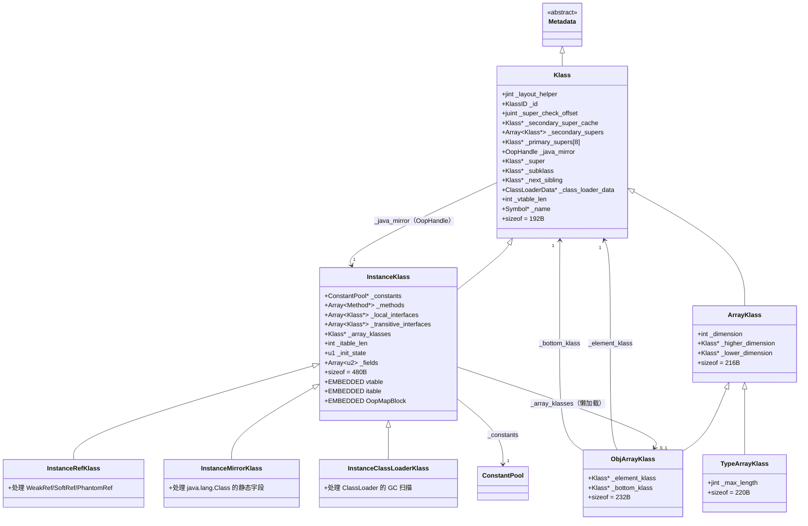

# Klass 体系：我以为 Class 对象就是类的元数据，结果差远了

> 第一人称学习笔记 · 基于 OpenJDK 11 源码  
> 对应文档：`ClassLoading/klass_hierarchy.md` · `ClassLoading/InstanceKlass-Expert-Analysis.md` · `JVM-Core-Objects/07-InstanceKlass-Layout.md`

---

## 第零天：我以为 Class 对象就是类的元数据

刚开始学 JVM 的时候，我对"类的元数据"的理解是这样的：

> "Java 里的 `Class<?>` 对象就是类的元数据，里面存着类名、方法列表、字段列表。"

这个理解有三个根本性的错误：

**错误 1：以为 Class 对象 = 类的元数据**

`java.lang.Class` 对象（Java 层）和 `InstanceKlass`（C++ 层）是两个不同的东西。`Class` 对象是 Java 堆上的一个普通对象，`InstanceKlass` 是 Metaspace 里的 C++ 结构体。两者通过 `_java_mirror` 字段互相引用。

**错误 2：以为 vtable 是个 Map**

我以为 vtable 是个 `Map<方法名, 方法指针>`，查找时用方法名做 key。结果 vtable 是个**数组**，每个方法在编译时就确定了固定的 index，运行时直接 `vtable[index]` 取指针，O(1) 查找。

**错误 3：以为 InstanceKlass 只存方法和字段**

我以为 InstanceKlass 就是个"类描述符"，存方法列表和字段列表。结果它还内嵌了 vtable、itable、OopMapBlock、静态字段——这些都紧跟在 InstanceKlass 结构体后面，是一块连续内存。

---

## 第一天：发现 Klass 体系的全貌

翻源码才发现，JVM 里的"类"不是一个类，而是一个继承体系：

```
Metadata（基类）
└── Klass（所有类型的基类）
    ├── InstanceKlass（普通 Java 类）
    │   ├── InstanceRefKlass（java.lang.ref.Reference 子类）
    │   ├── InstanceClassLoaderKlass（ClassLoader 子类）
    │   └── InstanceMirrorKlass（java.lang.Class 本身）
    └── ArrayKlass（数组类型）
        ├── ObjArrayKlass（对象数组：Object[]、String[]）
        └── TypeArrayKlass（基本类型数组：int[]、byte[]）
```

**我当时的第一个惊讶**：`java.lang.Class` 本身也有一个专门的 Klass——`InstanceMirrorKlass`。因为 `Class` 对象里存着静态字段，需要特殊的 GC 扫描逻辑。

**第二个惊讶**：`int[]` 和 `Object[]` 是完全不同的 Klass 类型（TypeArrayKlass vs ObjArrayKlass），因为 GC 扫描时 `int[]` 里没有引用，`Object[]` 里全是引用，处理逻辑完全不同。

---

## 第一天半：数据结构补课

我第二天看 vtable 查找的时候，发现自己完全不知道 `_vtable_len`、`_itable_len`、`_layout_helper` 这些字段是什么。回来补课。

### Klass（基类）

```cpp
// klass.hpp:78
class Klass : public Metadata {
protected:
  // ===== 布局描述（最频繁访问，放最前面）=====
  jint        _layout_helper;       // ★ 对象布局描述符（正数=实例大小，负数=数组信息）

  const KlassID _id;                // Klass 类型 ID（InstanceKlassID/ObjArrayKlassID 等）

  // ===== 类型检查加速（4个字段）=====
  juint       _super_check_offset;  // 超类检查偏移（instanceof 快速路径用）
  Klass*      _secondary_super_cache; // 上次 instanceof 检查的接口缓存
  Array<Klass*>* _secondary_supers; // 所有接口（二级超类）
  Klass*      _primary_supers[8];   // 前 8 个直接超类（一级超类，O(1) 检查）

  // ===== 镜像与继承关系 =====
  OopHandle   _java_mirror;         // ★ 对应的 java.lang.Class 对象（双向引用）
  Klass*      _super;               // 直接父类
  Klass*      _subklass;            // 第一个子类
  Klass*      _next_sibling;        // 下一个兄弟类（同父类的其他子类）
  Klass*      _next_link;           // 同一 ClassLoader 加载的下一个类

  // ===== 类加载器 =====
  ClassLoaderData* _class_loader_data; // 加载此类的 ClassLoader 数据

  // ===== 访问控制 =====
  jint        _modifier_flags;      // Class.getModifiers() 返回的值
  AccessFlags _access_flags;        // public/private/abstract 等

  // ===== 偏向锁（已废弃，JDK 15）=====
  jlong    _last_biased_lock_bulk_revocation_time;
  markOop  _prototype_header;       // 偏向锁 epoch 信息
  jint     _biased_lock_revocation_count;

  // ===== vtable =====
  int _vtable_len;                  // ★ vtable 长度（条目数）
  
  // ===== 其他 =====
  Symbol*     _name;                // 类名（如 "java/lang/String"）
};
```

**`_layout_helper` 的编码**（这个字段我当时完全没看懂）：

```
实例类（正数）：
  _layout_helper = 对象大小（字节，已对齐）
  低位 bit 0 = 1 表示不能用快速路径分配（如有 finalizer）

数组类（负数）：
  MSB: [tag(8b) | hsz(8b) | ebt(8b) | log2(esz)(8b)] :LSB
  tag  = 0x80（oop 数组）或 0xC0（非 oop 数组）
  hsz  = 数组头大小（字节）
  ebt  = 元素 BasicType
  esz  = 元素大小（字节）

示例：int[] 的 _layout_helper
  tag=0xC0（非 oop）, hsz=16（对象头 16B）, ebt=T_INT(10), log2(esz)=2（4B）
  → _layout_helper = 0xC0100402（负数）
```

**sizeof(Klass) = 192 字节**（GDB 实测）

### InstanceKlass（普通 Java 类）

`InstanceKlass` 继承 `Klass`，在其基础上增加了大量字段：

```cpp
// instanceKlass.hpp:116
class InstanceKlass: public Klass {
private:
  // ===== 注解与包 =====
  Annotations*    _annotations;       // 类注解
  PackageEntry*   _package_entry;     // 所在包

  // ===== 关联的数组类 =====
  Klass* volatile _array_klasses;     // ★ 对应的数组类（如 String 对应 String[]）

  // ===== 常量池 =====
  ConstantPool*   _constants;         // ★ 运行时常量池

  // ===== 内部类/嵌套类 =====
  Array<jushort>* _inner_classes;     // InnerClasses 属性
  Array<jushort>* _nest_members;      // NestMembers 属性（JDK 11）
  jushort         _nest_host_index;   // NestHost 属性
  InstanceKlass*  _nest_host;         // 解析后的 nest-host

  // ===== 字段大小统计 =====
  int             _nonstatic_field_size;  // 非静态字段大小（HeapWord 数）
  int             _static_field_size;     // 静态字段大小（HeapWord 数）
  u2              _static_oop_field_count;// 静态 oop 字段数量
  u2              _java_fields_count;     // Java 字段总数
  int             _nonstatic_oop_map_size;// OopMapBlock 大小（字）

  // ===== vtable/itable 长度 =====
  // _vtable_len 在父类 Klass 里
  int             _itable_len;            // ★ itable 长度（字）

  // ===== 状态与标志 =====
  u2              _misc_flags;            // 各种标志位（16 个 bit）
  u2              _minor_version;         // .class 文件次版本号
  u2              _major_version;         // .class 文件主版本号
  u1              _init_state;            // ★ 类初始化状态（6 种）
  u1              _reference_type;        // 引用类型（WeakRef/SoftRef 等）

  // ===== 初始化线程 =====
  Thread*         _init_thread;           // 正在执行 <clinit> 的线程

  // ===== 方法相关 =====
  Array<Method*>* _methods;              // ★ 方法数组
  Array<Method*>* _default_methods;      // 从接口继承的默认方法
  Array<Klass*>*  _local_interfaces;     // 直接实现的接口
  Array<Klass*>*  _transitive_interfaces;// 所有传递实现的接口
  Array<int>*     _method_ordering;      // 方法在 .class 文件中的原始顺序
  Array<int>*     _default_vtable_indices;// 默认方法的 vtable index

  // ===== 字段描述 =====
  Array<u2>*      _fields;               // 字段描述数组（每个字段 6 个 u2）

  // ===== 其他 =====
  const char*     _source_debug_extension;
  Symbol*         _array_name;           // 对应数组类的名字（如 "[Ljava/lang/String;"）
  OopMapCache*    volatile _oop_map_cache;
  JNIid*          _jni_ids;
  // ... JVMTI 相关字段 ...
};
```

**ClassState（6 种状态）**：

```cpp
// instanceKlass.hpp:133
enum ClassState {
  allocated,            // 已分配内存，但未链接
  loaded,               // 已加载并插入类层次，但未链接
  linked,               // 已链接/验证，但未初始化
  being_initialized,    // 正在执行 <clinit>
  fully_initialized,    // 初始化完成（最终状态）
  initialization_error  // 初始化出错
};
```

**InstanceKlass 的内存布局**（这是我当时最没想到的）：

```
InstanceKlass 结构体（固定部分，~480 字节）
├── Klass 字段（192 字节）
└── InstanceKlass 自有字段（~288 字节）

紧跟其后（可变部分，在 Metaspace 中连续）：
├── vtable（vtable_len × 8 字节，每条目 = 1 个 Method*）
├── itable（itable_len × 8 字节，两段：offset table + method table）
├── OopMapBlock（nonstatic_oop_map_size × 8 字节）
├── implementor（接口类才有，1 个 Klass*）
└── host_klass（匿名类才有，1 个 InstanceKlass*）
```

**sizeof(InstanceKlass) = 480 字节**（GDB 实测，不含可变部分）

### ArrayKlass

```cpp
// arrayKlass.hpp:36
class ArrayKlass: public Klass {
private:
  int      _dimension;                    // 数组维度（int[] = 1，int[][] = 2）
  Klass* volatile _higher_dimension;      // 更高维度的数组类（int[] → int[][]）
  Klass* volatile _lower_dimension;       // 更低维度的数组类（int[][] → int[]）
};
```

**sizeof(ArrayKlass) = 216 字节**（GDB 实测）

### ObjArrayKlass

```cpp
// objArrayKlass.hpp:34
class ObjArrayKlass : public ArrayKlass {
private:
  Klass* _element_klass;   // ★ 元素类型（String[] 的 element_klass = String 的 InstanceKlass）
  Klass* _bottom_klass;    // ★ 最底层元素类型（String[][][] 的 bottom_klass = String 的 InstanceKlass）
};
```

**sizeof(ObjArrayKlass) = 232 字节**（GDB 实测）

### TypeArrayKlass

```cpp
// typeArrayKlass.hpp:34
class TypeArrayKlass : public ArrayKlass {
private:
  jint _max_length;   // 允许的最大数组长度（防止 OOM）
};
```

**sizeof(TypeArrayKlass) = 220 字节**（GDB 实测）

### vtableEntry 和 itableOffsetEntry

```cpp
// klassVtable.hpp:190
class vtableEntry {
private:
  Method* _method;   // ★ 唯一字段：指向 Method 对象的指针（8 字节）
};
// sizeof(vtableEntry) = 8 字节

// klassVtable.hpp:236
class itableOffsetEntry {
private:
  Klass* _interface;  // 接口的 Klass*
  int    _offset;     // 该接口的 method table 相对于 InstanceKlass 起始的偏移（字节）
};
// sizeof(itableOffsetEntry) = 16 字节（8B Klass* + 4B int + 4B padding）

class itableMethodEntry {
private:
  Method* _method;    // 接口方法的实现（8 字节）
};
// sizeof(itableMethodEntry) = 8 字节
```

---

## 第二天：vtable——O(1) 虚方法分发的秘密

我以为 `invokevirtual` 要查方法名，结果完全不是。

**vtable 的核心设计**：每个虚方法在编译时就分配了固定的 vtable index，运行时直接 `vtable[index]` 取 Method*，O(1)。

**vtable 的位置**：

```cpp
// klass.cpp:767
vtableEntry* Klass::start_of_vtable() const {
  // vtable 紧跟在 InstanceKlass 固定部分之后
  return (vtableEntry*) ((address)this + in_bytes(vtable_start_offset()));
}

ByteSize Klass::vtable_start_offset() {
  return in_ByteSize(InstanceKlass::header_size() * wordSize);
  // = sizeof(InstanceKlass) = 480 字节
}
```

**vtable 的内存布局**：

```
InstanceKlass（480B）
├── [offset 0]   Klass 字段
└── [offset 192] InstanceKlass 自有字段

[offset 480] vtable 开始
├── vtable[0] = Method* （Object.hashCode 的实现）
├── vtable[1] = Method* （Object.equals 的实现）
├── vtable[2] = Method* （Object.clone 的实现）
├── vtable[3] = Method* （Object.toString 的实现）
├── vtable[4] = Method* （Object.finalize 的实现）
├── vtable[5] = Method* （子类覆盖的方法 1）
├── vtable[6] = Method* （子类覆盖的方法 2）
└── ...
```

**vtable 的继承规则**：

```
父类 Animal（vtable_len = 5）：
  vtable[0] = Object.hashCode
  vtable[1] = Object.equals
  vtable[2] = Object.clone
  vtable[3] = Object.toString
  vtable[4] = Animal.speak()   ← 新增

子类 Dog extends Animal（vtable_len = 6）：
  vtable[0] = Object.hashCode  ← 继承
  vtable[1] = Object.equals    ← 继承
  vtable[2] = Object.clone     ← 继承
  vtable[3] = Object.toString  ← 继承
  vtable[4] = Dog.speak()      ← 覆盖（index 不变！）
  vtable[5] = Dog.fetch()      ← 新增
```

**关键设计**：子类覆盖父类方法时，vtable index 不变，只是把 Method* 替换成子类的实现。这样 `invokevirtual` 只需要知道 index，不需要知道实际类型。

---

## 第三天：itable——接口分发为什么比 vtable 慢

我以为接口方法调用和虚方法调用一样快，结果 itable 的查找比 vtable 多了一步。

**为什么不能用 vtable 实现接口？**

因为一个类可以实现多个接口，而 Java 是单继承的。如果用 vtable，两个接口的同名方法会冲突（index 相同但实现不同）。

**itable 的结构**（两段式）：

```
itable 区域（紧跟 vtable 之后）：

=== 第一段：offset table ===
itableOffsetEntry[0]: { _interface = Runnable 的 Klass*, _offset = 偏移量 A }
itableOffsetEntry[1]: { _interface = Serializable 的 Klass*, _offset = 偏移量 B }
itableOffsetEntry[2]: { _interface = NULL, _offset = 0 }  ← 结束标记

=== 第二段：method table ===
[偏移量 A 处] itableMethodEntry: { _method = run() 的实现 }
[偏移量 B 处] itableMethodEntry: { _method = writeObject() 的实现 }
              itableMethodEntry: { _method = readObject() 的实现 }
```

**`invokeinterface` 的查找过程**：

```
1. 从 offset table 开始，线性扫描找到目标接口的 Klass*
2. 取出 _offset，跳到对应的 method table
3. 在 method table 里按 index 取 Method*
```

**为什么比 vtable 慢**：多了第 1 步的线性扫描（O(接口数量)）。但实际上 JIT 会用内联缓存缓存上次的结果，大多数情况下也是 O(1)。

---

## 第三天半：InstanceKlass 的完整内存布局

这是我花时间最多的地方——把 InstanceKlass 的完整内存布局画出来：

```
地址偏移（相对于 InstanceKlass 起始）：

[0 ~ 191]    Klass 字段（192B）
  [0]        _layout_helper（4B）
  [4]        _id（4B）
  [8]        _super_check_offset（4B）
  [12]       padding（4B）
  [16]       _name（8B）
  [24]       _secondary_super_cache（8B）
  [32]       _secondary_supers（8B）
  [40~103]   _primary_supers[8]（64B）
  [104]      _java_mirror（8B）
  [112]      _super（8B）
  [120]      _subklass（8B）
  [128]      _next_sibling（8B）
  [136]      _next_link（8B）
  [144]      _class_loader_data（8B）
  [152]      _modifier_flags（4B）
  [156]      _access_flags（4B）
  [160]      _last_biased_lock_bulk_revocation_time（8B）
  [168]      _prototype_header（8B）
  [176]      _biased_lock_revocation_count（4B）
  [180]      _vtable_len（4B）
  [184]      _shared_class_path_index（2B）
  [186]      _shared_class_flags（2B）
  [188]      padding（4B）

[192 ~ 479]  InstanceKlass 自有字段（~288B）
  [192]      _annotations（8B）
  [200]      _package_entry（8B）
  [208]      _array_klasses（8B）
  [216]      _constants（8B）
  ...（其余字段）
  [~464]     _init_state（1B）
  [~465]     _reference_type（1B）
  [~466]     _this_class_index（2B）
  [~468]     _methods（8B）
  ...

[480]        vtable 开始（vtable_len × 8B）
[480 + vtable_len×8]  itable 开始（itable_len × 8B）
[480 + vtable_len×8 + itable_len×8]  OopMapBlock 开始
...
```

**`size()` 函数**（InstanceKlass 的总大小）：

```cpp
// instanceKlass.hpp:1063
static int size(int vtable_length, int itable_length,
                int nonstatic_oop_map_size,
                bool is_interface, bool is_anonymous, bool has_stored_fingerprint) {
  return align_metadata_size(
    header_size() +          // sizeof(InstanceKlass) / wordSize
    vtable_length +          // vtable 条目数（每条目 1 word）
    itable_length +          // itable 大小（字）
    nonstatic_oop_map_size + // OopMapBlock 大小（字）
    (is_interface ? 1 : 0) + // implementor 指针（接口才有）
    (is_anonymous ? 1 : 0) + // host_klass 指针（匿名类才有）
    (has_stored_fingerprint ? 1 : 0)  // fingerprint（CDS 用）
  );
}
```

---

## 第四天：Class 对象和 InstanceKlass 的双向引用

我当时最搞不清楚的是：`Class<?>` 对象和 `InstanceKlass` 是什么关系？

**答案**：双向引用，两个不同的内存区域。

```
Java 堆（Heap）：
  java.lang.Class 对象（instanceOop）
  ├── 对象头（mark + klass*）
  │   └── klass* → InstanceMirrorKlass（Class 类的 Klass）
  └── 静态字段区域（紧跟在对象头后面）
      └── 各个静态字段的值

Metaspace：
  InstanceKlass（C++ 结构体）
  ├── _java_mirror → 指向上面的 Class 对象（OopHandle）
  └── 其他字段...
```

**`_java_mirror` 的类型是 `OopHandle`**，不是直接的 `oop`。因为 GC 移动对象时需要更新引用，`OopHandle` 是一个间接引用（指向 GC 根表里的一个槽位），GC 只需要更新槽位里的值，不需要扫描 Metaspace。

**从 Java 代码到 InstanceKlass 的路径**：

```java
String.class
  → java.lang.Class 对象（堆上）
  → Class.klass()（JNI 方法）
  → InstanceKlass*（Metaspace 里）
```

**从 InstanceKlass 到 Class 对象的路径**：

```cpp
InstanceKlass* ik = ...;
oop mirror = ik->java_mirror();  // 通过 _java_mirror 取 Class 对象
```

---

## 第五天：数组类的懒加载——`_array_klasses` 字段

我以为 `String[]` 的 Klass 在 `String` 类加载时就创建了，结果是懒加载的。

`InstanceKlass` 里有个 `_array_klasses` 字段，指向对应的 `ObjArrayKlass`（`String[]` 的 Klass）。这个字段初始为 NULL，第一次用到 `String[]` 时才创建。

**多维数组的链式结构**：

```
String 的 InstanceKlass
  └── _array_klasses → String[] 的 ObjArrayKlass
        ├── _element_klass → String 的 InstanceKlass
        ├── _bottom_klass  → String 的 InstanceKlass
        └── _higher_dimension → String[][] 的 ObjArrayKlass
              ├── _element_klass → String[] 的 ObjArrayKlass
              ├── _bottom_klass  → String 的 InstanceKlass
              └── _higher_dimension → String[][][] 的 ObjArrayKlass
                    └── ...
```

**`_bottom_klass` 的作用**：多维数组的 GC 扫描需要知道最底层元素类型，`_bottom_klass` 直接指向它，避免每次都沿链表遍历。

---

## 第五天半：插桩验证——我的猜测被打脸了

| 猜测 | 实测 | 打脸程度 |
|------|------|------------|
| sizeof(InstanceKlass) = 256B（我猜的） | **480B** | 差了近 2 倍 |
| vtable 从 offset 0 开始 | **从 offset 480 开始**（紧跟固定部分之后） | 完全错了 |
| vtable 存方法名 | **只存 Method* 指针**，8 字节一条 | 完全错了 |
| itable 和 vtable 结构一样 | **两段式**（offset table + method table），比 vtable 复杂 | 完全错了 |
| Class 对象就是 InstanceKlass | **两个不同对象**，双向引用 | 完全错了 |
| String[] 的 Klass 在 String 加载时创建 | **懒加载**，第一次用到才创建 | 完全错了 |
| sizeof(vtableEntry) = 16B（我猜的） | **8B**（只有一个 Method* 指针） | 差了 2 倍 |

---

## Klass 体系关系图



---

## 还没搞懂的地方

**1. `_super_check_offset` 的 instanceof 快速路径**

我知道 `_primary_supers[8]` 存前 8 个超类，`instanceof` 时先查 `_primary_supers[depth]`，命中则 O(1)。但 `_super_check_offset` 具体是怎么用的？它指向的是 `_primary_supers` 数组里的某个槽位，还是 `_secondary_super_cache`？我没有追完整的 `is_subtype_of` 实现。

**2. OopMapBlock 的作用**

`OopMapBlock` 记录了对象里哪些偏移是 oop 引用，GC 扫描时用它找到所有引用字段。但具体的格式是什么？一个 `OopMapBlock` 描述一段连续的 oop 字段（起始偏移 + 长度），还是每个字段单独一条？我没有深入看。

**3. itable 的 `_offset` 字段单位**

`itableOffsetEntry._offset` 是相对于 InstanceKlass 起始的偏移，单位是字节还是字？源码注释说是"offset to vtable from start of oop"，但我没有确认单位。

**4. `_misc_flags` 的 16 个 bit**

`InstanceKlass._misc_flags` 里有 16 个标志位，我只看了 `_misc_kind`（低 2 位，区分 4 种 InstanceKlass 子类）。其他 14 个 bit（`_misc_rewritten`、`_misc_has_nonstatic_fields` 等）在什么场景下会被设置？我没有逐一追踪。

**5. `_array_name` 字段的生命周期**

`InstanceKlass._array_name` 存的是对应数组类的名字（如 `"[Ljava/lang/String;"`）。这个字段是在 `_array_klasses` 创建时设置的，还是在类加载时就设置？如果类被卸载，这个 Symbol 怎么处理？

---

## 尾声：我现在怎么理解 Klass 体系

现在我对 Klass 体系的理解是这样的：

**Klass 是 JVM 对"类型"的 C++ 表示**，不是 Java 层的 `Class<?>` 对象。两者通过 `_java_mirror` 双向引用，分别住在 Metaspace 和 Java 堆里。

**InstanceKlass 不只是"类描述符"**，它是一块连续内存，固定部分（480B）存元数据，可变部分（vtable + itable + OopMapBlock）紧跟其后。vtable 和 itable 是虚方法分发的核心数据结构，不是运行时动态查找的，而是类加载时就构建好的。

**vtable 是 O(1) 的**：每个虚方法有固定 index，运行时直接 `vtable[index]` 取 Method*。**itable 是 O(接口数) 的**：需要先线性扫描 offset table 找到目标接口，再取 Method*。这就是为什么 `invokevirtual` 比 `invokeinterface` 快。

**数组类是懒加载的**：`String[]` 的 ObjArrayKlass 在第一次用到 `String[]` 时才创建，通过 `InstanceKlass._array_klasses` 链接。多维数组通过 `_higher_dimension`/`_lower_dimension` 形成链表。

整个设计的核心思想是：**把运行时的类型检查和方法分发开销，尽量转移到类加载时**。vtable index 在编译时确定，itable offset 在类加载时计算，运行时只需要简单的数组访问。
