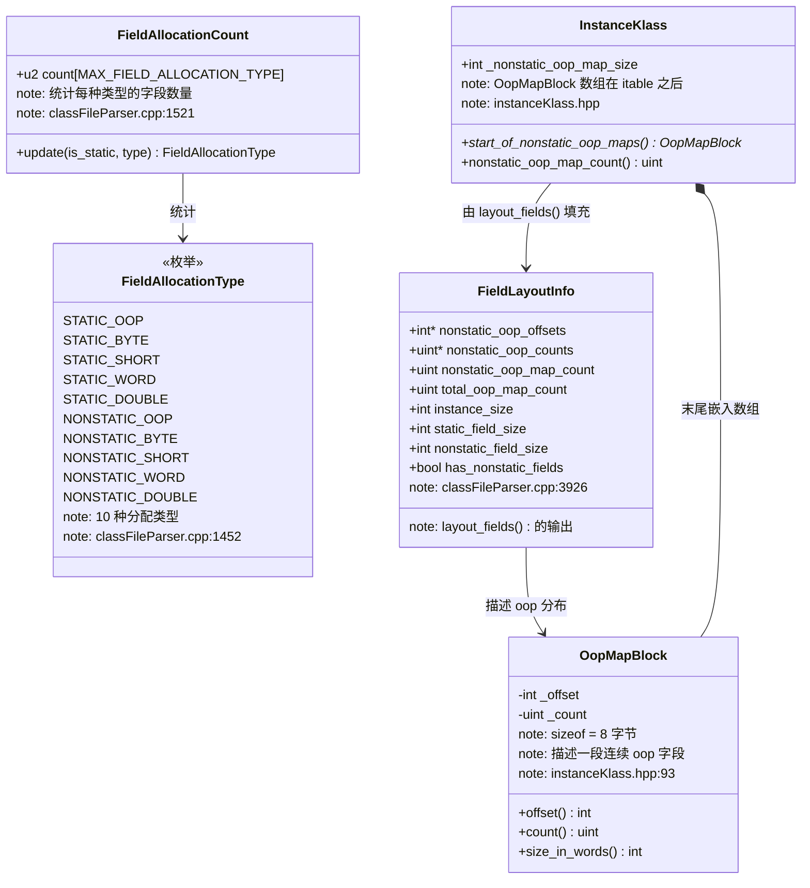
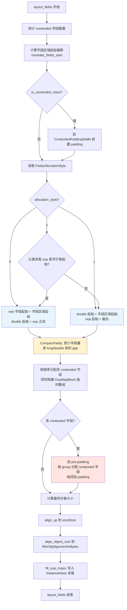

# 字段布局完整规则 — 我以为 JVM 只是"把大字段放前面"

> 第一人称学习笔记 · 基于 OpenJDK 11 源码  
> 承接：`05-object-layout-HandWritten.md` 遗留问题 1、2 + `07-klass-hierarchy-HandWritten.md` 遗留问题 2  
> 核心原则：**第一人称 · 学习时间线 · 真实踩坑 · 源码级深度**

---

## 第零天：我以为字段布局就是"大字段放前面"

在 05 那篇笔记里，我知道了 JVM 会重排字段，规则是"大字段优先"。我以为这就是全部了：

```
我以为的规则：
1. 8 字节字段（long/double）
2. 4 字节字段（int/float）
3. 2 字节字段（short/char）
4. 1 字节字段（byte/boolean）
5. 引用字段（oop）
```

结果翻开 `classFileParser.cpp` 的 `layout_fields()` 函数，发现这个理解有三处根本性的错误：

**错误 1：以为只有一种排列策略**

JVM 有 `FieldsAllocationStyle=0/1/2` 三种策略，默认是 1（oop 字段放最后）。策略 0 是 oop 字段放最前，策略 2 是"尽量让父子类的 oop 字段连续"。

**错误 2：以为 long/double 之前的 gap 就浪费了**

long/double 需要 8 字节对齐，如果前面的字段不是 8 字节对齐的，会有 4 字节的 gap。JVM 有个 `CompactFields=true` 的优化，会把小字段（int/short/byte）塞进这个 gap，一分钱不浪费。

**错误 3：完全不知道 OopMapBlock 是什么**

07 那篇笔记里我看到 `InstanceKlass` 末尾有 `OopMapBlock` 数组，但不知道它是干什么的。结果发现这是 GC 扫描对象引用的核心数据结构——GC 不需要遍历所有字段，只需要查 `OopMapBlock` 就能找到所有引用字段的位置。

---

## 第一天：FieldAllocationStyle 的三种策略

### 坑：我以为只有一种排列顺序

翻开 `globals.hpp:937`，发现有个参数我完全没注意到：

```cpp
// globals.hpp:937-941
product(intx, FieldsAllocationStyle, 1,
        "0 - type based with oops first, "
        "1 - with oops last, "
        "2 - oops in super and sub classes are together")
        range(0, 2)
```

三种策略，默认是 1。再看 `classFileParser.cpp:4033`：

```cpp
// classFileParser.cpp:4033-4036
int allocation_style = FieldsAllocationStyle;
if( allocation_style < 0 || allocation_style > 2 ) { // Out of range?
  assert(false, "0 <= FieldsAllocationStyle <= 2");
  allocation_style = 1; // Optimistic
}
```

然后是三种策略的实际分配逻辑：

```cpp
// classFileParser.cpp:4060-4090
if( allocation_style == 0 ) {
  // ★ 策略 0：oop 字段放最前面
  // Fields order: oops, longs/doubles, ints, shorts/chars, bytes, padded fields
  next_nonstatic_oop_offset    = next_nonstatic_field_offset;
  next_nonstatic_double_offset = next_nonstatic_oop_offset +
                                  (nonstatic_oop_count * heapOopSize);

} else if( allocation_style == 1 ) {
  // ★ 策略 1（默认）：oop 字段放最后
  // Fields order: longs/doubles, ints, shorts/chars, bytes, oops, padded fields
  next_nonstatic_double_offset = next_nonstatic_field_offset;

} else if( allocation_style == 2 ) {
  // ★ 策略 2：尝试让父子类的 oop 字段连续
  if( nonstatic_field_size > 0 && _super_klass != NULL &&
      _super_klass->nonstatic_oop_map_size() > 0 ) {
    const unsigned int map_count = _super_klass->nonstatic_oop_map_count();
    const OopMapBlock* const first_map = _super_klass->start_of_nonstatic_oop_maps();
    const OopMapBlock* const last_map = first_map + map_count - 1;
    const int next_offset = last_map->offset() + (last_map->count() * heapOopSize);
    if (next_offset == next_nonstatic_field_offset) {
      // ★ 父类最后一个 oop 字段紧接着子类字段起始位置 → 退化为策略 0
      allocation_style = 0;
      next_nonstatic_oop_offset    = next_nonstatic_field_offset;
      next_nonstatic_double_offset = next_nonstatic_oop_offset +
                                     (nonstatic_oop_count * heapOopSize);
    }
  }
  if( allocation_style == 2 ) {
    // ★ 条件不满足 → 退化为策略 1
    allocation_style = 1;
    next_nonstatic_double_offset = next_nonstatic_field_offset;
  }
}
```

**三种策略的完整对比**：

| 策略 | 参数值 | 字段顺序 | 适用场景 |
|------|--------|---------|---------|
| 策略 0 | `FieldsAllocationStyle=0` | oop → long/double → int → short → byte | 减少 GC 扫描时的跳跃（oop 连续） |
| 策略 1 | `FieldsAllocationStyle=1`（**默认**） | long/double → int → short → byte → oop | 减少 padding，节省内存 |
| 策略 2 | `FieldsAllocationStyle=2` | 尝试让父子类 oop 连续，否则退化为策略 1 | 继承层次深时减少 OopMapBlock 数量 |

**策略 2 的退化逻辑**：

策略 2 不是一个独立的排列顺序，而是一个"优化尝试"：

- 如果父类最后一个 oop 字段的结束位置 = 子类字段的起始位置（即两者紧邻），就用策略 0（oop 放最前），让父子类的 oop 字段连成一片
- 否则退化为策略 1

这个优化的目的是减少 `OopMapBlock` 的数量（后面会详细讲）。

### 特殊情况：JDK 核心类强制使用策略 0

```cpp
// classFileParser.cpp:4038-4058
// The next classes have predefined hard-coded fields offsets
// (see in JavaClasses::compute_hard_coded_offsets()).
// Use default fields allocation order for them.
if( (allocation_style != 0 || compact_fields ) && _loader_data->class_loader() == NULL &&
    (_class_name == vmSymbols::java_lang_String() ||
     _class_name == vmSymbols::java_lang_Class() ||
     _class_name == vmSymbols::java_lang_Integer() ||
     // ... 其他 JDK 核心类
    )) {
  allocation_style = 0;     // ★ 强制策略 0
  compact_fields   = false; // ★ 禁用 CompactFields
}
```

`java.lang.String`、`java.lang.Class`、`java.lang.Integer` 等 JDK 核心类的字段偏移是**硬编码**在 JVM 里的（`JavaClasses::compute_hard_coded_offsets()`），不能被重排。所以这些类强制使用策略 0，并且禁用 `CompactFields`。

---

## 第二天：CompactFields — 把小字段塞进 gap

### 坑：我以为 long/double 前面的 gap 就浪费了

`long` 和 `double` 需要 8 字节对齐。如果前面的字段不是 8 字节对齐的，会有最多 4 字节的 gap。

我以为这 4 字节就浪费了。结果 JVM 有个 `CompactFields=true` 的优化：

```cpp
// globals.hpp:942-943
product(bool, CompactFields, true,
        "Allocate nonstatic fields in gaps between previous fields")
```

**CompactFields 的工作原理**（`classFileParser.cpp:4100-4145`）：

```cpp
// classFileParser.cpp:4100-4145
// Try to squeeze some of the fields into the gaps due to
// long/double alignment.
if (nonstatic_double_count > 0) {
  int offset = next_nonstatic_double_offset;
  // ★ 对齐到 8 字节，计算 gap 大小
  next_nonstatic_double_offset = align_up(offset, BytesPerLong);
  if (compact_fields && offset != next_nonstatic_double_offset) {
    // ★ 有 gap（最多 4 字节），尝试塞入小字段
    int length = next_nonstatic_double_offset - offset;  // gap 大小（= 4 字节）
    assert(length == BytesPerInt, "");

    // ★ 优先塞 int（4 字节）
    nonstatic_word_space_offset = offset;
    if (nonstatic_word_count > 0) {
      nonstatic_word_count      -= 1;
      nonstatic_word_space_count = 1; // Only one will fit
      length -= BytesPerInt;
      offset += BytesPerInt;
    }
    // ★ 再塞 short（2 字节）
    nonstatic_short_space_offset = offset;
    while (length >= BytesPerShort && nonstatic_short_count > 0) {
      nonstatic_short_count       -= 1;
      nonstatic_short_space_count += 1;
      length -= BytesPerShort;
      offset += BytesPerShort;
    }
    // ★ 再塞 byte（1 字节）
    nonstatic_byte_space_offset = offset;
    while (length > 0 && nonstatic_byte_count > 0) {
      nonstatic_byte_count       -= 1;
      nonstatic_byte_space_count += 1;
      length -= 1;
    }
    // ★ 最后，如果策略不是 0（oop 不在最前），也可以塞 oop（4 字节）
    nonstatic_oop_space_offset = offset;
    if (length >= heapOopSize && nonstatic_oop_count > 0 &&
        allocation_style != 0) { // when oop fields not first
      nonstatic_oop_count      -= 1;
      nonstatic_oop_space_count = 1; // Only one will fit
      length -= heapOopSize;
      offset += heapOopSize;
    }
  }
}
```

**CompactFields 的填充优先级**（gap 只有 4 字节）：

```
gap（4 字节）的填充优先级：
1. int/float（4 字节）→ 一个 int 直接填满 gap
2. short/char（2 字节）→ 两个 short 填满 gap
3. byte/boolean（1 字节）→ 四个 byte 填满 gap
4. oop 引用（4 字节，仅当策略 != 0 时）→ 一个 oop 直接填满 gap
```

**实例对比**（`CompactFields=true` vs `false`）：

```java
class Example {
    long l;    // 8 字节
    int i;     // 4 字节
    byte b;    // 1 字节
}
```

```
CompactFields=false（不填充 gap）：
偏移   内容
12     [gap 4B]（long 需要 8 字节对齐）
16     long l（8B）
24     int i（4B）
28     byte b（1B）
29     [padding 3B]（8 字节对齐）
总大小：32 字节

CompactFields=true（默认，填充 gap）：
偏移   内容
12     int i（4B）← 塞进 gap！
16     long l（8B）
24     byte b（1B）
25     [padding 7B]（8 字节对齐）
总大小：32 字节
```

等等，这个例子里两种方式大小一样？对，因为最后的 padding 补回来了。CompactFields 的真正收益在于**减少 OopMapBlock 的碎片化**，而不是减少总大小（总大小由最后的对齐决定）。

---

## 第三天：对象大小的精确计算

### 坑：我以为对象大小就是"对象头 + 字段大小之和 + 对齐"

我以为对象大小的计算很简单：对象头 + 所有字段大小 + 8 字节对齐。

结果看了 `layout_fields()` 的最后几行，发现有两层对齐：

```cpp
// classFileParser.cpp:4398-4408
int notaligned_nonstatic_fields_end = next_nonstatic_padded_offset;

// ★ 第一层对齐：字段区域对齐到 heapOopSize（4 字节，压缩模式）
int nonstatic_fields_end = align_up(notaligned_nonstatic_fields_end, heapOopSize);

// ★ 第二层对齐：实例大小对齐到 wordSize（8 字节）
int instance_end         = align_up(notaligned_nonstatic_fields_end, wordSize);

// ★ 最终对象大小：以 HeapWord（8 字节）为单位，再对齐到 MinObjAlignmentInBytes
int instance_size = align_object_size(instance_end / wordSize);
```

**三层对齐的含义**：

| 对齐层 | 对齐到 | 目的 |
|--------|--------|------|
| `nonstatic_fields_end` | `heapOopSize`（4B 压缩 / 8B 未压缩） | 字段区域对齐，方便 GC 扫描 |
| `instance_end` | `wordSize`（8B） | 实例大小对齐到机器字 |
| `instance_size` | `MinObjAlignmentInBytes`（默认 8B） | 最终对象大小，保证对象地址 8B 对齐 |

**`align_object_size` 是什么？**

```cpp
// globalDefinitions.hpp
inline size_t align_object_size(size_t size) {
  return align_up(size, MinObjAlignment);
}
// MinObjAlignment = MinObjAlignmentInBytes / HeapWordSize = 8 / 8 = 1
// 所以 align_object_size 实际上是对齐到 1 个 HeapWord（8 字节）
```

**完整的对象大小计算公式**：

```
对象大小（字节）= align_up(
    instanceOopDesc::base_offset_in_bytes()  // 对象头大小（12B 压缩 / 16B 未压缩）
    + nonstatic_field_size * heapOopSize,    // 字段区域大小
    wordSize                                  // 对齐到 8 字节
)
```

**实例**：

```java
class Foo {
    int x;     // 4 字节
    long y;    // 8 字节
    byte z;    // 1 字节
}
```

```
开启压缩指针（base_offset=12）：
  字段布局（策略 1，CompactFields=true）：
    偏移 12：int x（4B）← 塞进 long 前的 gap
    偏移 16：long y（8B）
    偏移 24：byte z（1B）
    偏移 25：[padding 7B]（对齐到 8 字节）
  instance_end = align_up(25, 8) = 32
  instance_size = 32 / 8 = 4 HeapWords = 32 字节

关闭压缩指针（base_offset=16）：
  字段布局（策略 1，CompactFields=true）：
    偏移 16：int x（4B）← 塞进 long 前的 gap
    偏移 20：[padding 4B]（long 需要 8 字节对齐）
    偏移 24：long y（8B）
    偏移 32：byte z（1B）
    偏移 33：[padding 7B]（对齐到 8 字节）
  instance_end = align_up(33, 8) = 40
  instance_size = 40 字节
```

等等，开启压缩指针时 `int x` 怎么塞进了 long 前的 gap？

因为 `base_offset=12`，字段从偏移 12 开始。第一个字段是 `long y`（策略 1，double/long 先放），但 12 不是 8 字节对齐的，所以 `long y` 要放到偏移 16。偏移 12-15 就是 4 字节的 gap，`CompactFields` 把 `int x` 塞进去了。

---

## 第四天：OopMapBlock — GC 扫描对象引用的核心

### 坑：我以为 GC 扫描对象要遍历所有字段

我以为 GC 扫描一个对象的引用字段，需要遍历所有字段，判断哪些是引用类型。这样效率很低。

结果 JVM 有个 `OopMapBlock` 机制，GC 只需要查这个表就能找到所有引用字段。

### OopMapBlock 的数据结构

```cpp
// instanceKlass.hpp:93-112
class OopMapBlock {
 public:
  // ★ 这个 Block 描述的第一个 oop 字段的字节偏移
  int offset() const          { return _offset; }
  void set_offset(int offset) { _offset = offset; }

  // ★ 这个 Block 包含的连续 oop 字段数量
  uint count() const         { return _count; }
  void set_count(uint count) { _count = count; }

  // sizeof(OopMapBlock) in words（= 8 字节）
  static const int size_in_words() {
    return align_up((int)sizeof(OopMapBlock), wordSize) >> LogBytesPerWord;
  }

 private:
  int  _offset;  // 4 字节
  uint _count;   // 4 字节
};
// sizeof(OopMapBlock) = 8 字节
```

**关键设计**：一个 `OopMapBlock` 描述一段**连续的** oop 字段。

- `_offset`：这段连续 oop 字段的起始字节偏移（相对于对象起始地址）
- `_count`：这段连续 oop 字段的数量

**为什么用"连续段"而不是"每个字段一条记录"？**

因为 JVM 的字段布局算法会把所有 oop 字段集中放在一起（策略 0 放最前，策略 1 放最后），所以大多数情况下所有 oop 字段是连续的，只需要一个 `OopMapBlock` 就能描述。

### OopMapBlock 存储在哪里？

`OopMapBlock` 数组存储在 `InstanceKlass` 对象的末尾，紧跟在 itable 之后：

```cpp
// instanceKlass.hpp:1092-1095
OopMapBlock* start_of_nonstatic_oop_maps() const {
  // ★ OopMapBlock 数组在 itable 之后
  return (OopMapBlock*)(start_of_itable() + itable_length());
}
```

**InstanceKlass 的内存布局**（末尾部分）：

```
InstanceKlass 对象（Metaspace 中）：
┌─────────────────────────────────────────────────────┐
│  Klass 字段（208 字节）                              │
│  InstanceKlass 字段（264 字节）                      │
├─────────────────────────────────────────────────────┤
│  vtable（vtable_len * 8 字节）                       │
├─────────────────────────────────────────────────────┤
│  itable（itable_len * 8 字节）                       │
├─────────────────────────────────────────────────────┤
│  OopMapBlock 数组（nonstatic_oop_map_count * 8 字节）│ ← start_of_nonstatic_oop_maps()
├─────────────────────────────────────────────────────┤
│  implementor（接口类才有，8 字节）                   │
└─────────────────────────────────────────────────────┘
```

### OopMapBlock 是怎么构建的？

在 `layout_fields()` 里，每次分配一个 oop 字段时，都会检查它是否和上一个 oop 字段相邻：

```cpp
// classFileParser.cpp:4213-4226（分配 NONSTATIC_OOP 字段时）
case NONSTATIC_OOP:
  // ... 计算 real_offset ...

  // ★ 检查是否和上一个 oop 字段相邻
  if( nonstatic_oop_map_count > 0 &&
      nonstatic_oop_offsets[nonstatic_oop_map_count - 1] ==
      real_offset - int(nonstatic_oop_counts[nonstatic_oop_map_count - 1]) * heapOopSize ) {
    // ★ 相邻：扩展当前 Block 的 count
    nonstatic_oop_counts[nonstatic_oop_map_count - 1] += 1;
  } else {
    // ★ 不相邻：新建一个 Block
    nonstatic_oop_offsets[nonstatic_oop_map_count] = real_offset;
    nonstatic_oop_counts [nonstatic_oop_map_count] = 1;
    nonstatic_oop_map_count += 1;
  }
  break;
```

然后在 `fill_oop_maps()` 里，把这些临时数组写入 `InstanceKlass` 末尾的 `OopMapBlock` 数组：

```cpp
// classFileParser.cpp:4454-4490
static void fill_oop_maps(const InstanceKlass* k,
                          unsigned int nonstatic_oop_map_count,
                          const int* nonstatic_oop_offsets,
                          const unsigned int* nonstatic_oop_counts) {

  OopMapBlock* this_oop_map = k->start_of_nonstatic_oop_maps();
  const InstanceKlass* const super = k->superklass();
  const unsigned int super_count = super ? super->nonstatic_oop_map_count() : 0;

  if (super_count > 0) {
    // ★ 先复制父类的 OopMapBlock（父类字段在前）
    OopMapBlock* super_oop_map = super->start_of_nonstatic_oop_maps();
    for (unsigned int i = 0; i < super_count; ++i) {
      *this_oop_map++ = *super_oop_map++;
    }
  }

  if (nonstatic_oop_map_count > 0) {
    if (super_count + nonstatic_oop_map_count > k->nonstatic_oop_map_count()) {
      // ★ 父类最后一个 oop 字段和子类第一个 oop 字段相邻 → 合并 Block
      nonstatic_oop_map_count--;
      nonstatic_oop_offsets++;
      this_oop_map--;
      this_oop_map->set_count(this_oop_map->count() + *nonstatic_oop_counts++);
      this_oop_map++;
    }

    // ★ 写入子类的 OopMapBlock
    while (nonstatic_oop_map_count-- > 0) {
      this_oop_map->set_offset(*nonstatic_oop_offsets++);
      this_oop_map->set_count(*nonstatic_oop_counts++);
      this_oop_map++;
    }
  }
}
```

**关键细节**：父子类的 OopMapBlock 可以合并！

如果父类最后一个 oop 字段和子类第一个 oop 字段在内存中相邻（这正是策略 2 想要实现的），那么两个 Block 会合并成一个，减少 GC 扫描时的迭代次数。

### GC 如何使用 OopMapBlock 扫描对象

```cpp
// instanceKlass.inline.hpp:58-65（GC 扫描单个 OopMapBlock）
template <typename T, class OopClosureType>
ALWAYSINLINE void InstanceKlass::oop_oop_iterate_oop_map(OopMapBlock* map, oop obj, OopClosureType* closure) {
  // ★ 从 map->offset() 开始，取 map->count() 个连续 oop 字段
  T* p         = (T*)obj->obj_field_addr_raw<T>(map->offset());
  T* const end = p + map->count();

  for (; p < end; ++p) {
    // ★ 对每个 oop 字段调用 closure（GC 的处理函数）
    Devirtualizer::do_oop(closure, p);
  }
}

// instanceKlass.inline.hpp:102-108（遍历所有 OopMapBlock）
template <typename T, class OopClosureType>
ALWAYSINLINE void InstanceKlass::oop_oop_iterate_oop_maps(oop obj, OopClosureType* closure) {
  OopMapBlock* map           = start_of_nonstatic_oop_maps();
  OopMapBlock* const end_map = map + nonstatic_oop_map_count();

  for (; map < end_map; ++map) {
    oop_oop_iterate_oop_map<T>(map, obj, closure);
  }
}
```

**GC 扫描的完整流程**：

```
GC 扫描一个对象的所有引用字段：

1. 从 obj->klass() 获取 InstanceKlass
2. 调用 oop_oop_iterate_oop_maps()
3. 遍历 InstanceKlass 末尾的 OopMapBlock 数组
4. 对每个 Block：
   - 起始地址 = obj + map->offset()
   - 遍历 map->count() 个连续 oop 字段
   - 对每个 oop 调用 closure（标记/更新引用）
```

**为什么这个设计高效？**

- 不需要遍历所有字段，只遍历 oop 字段
- oop 字段集中存放（策略 0 或 1），通常只有 1-2 个 Block
- 每个 Block 是连续内存，CPU 缓存友好
- `ALWAYSINLINE` 强制内联，消除函数调用开销

---

## 第五天：@Contended — 防止 false sharing 的缓存行填充

### 坑：我以为 @Contended 只是"加 padding"

我以为 `@Contended` 就是在字段前后各加 64 字节的 padding，防止两个字段落在同一个缓存行里。

结果看了源码，`@Contended` 的实现比我想的复杂得多：它支持**分组**，同一组的字段不需要互相隔离，只需要和其他组隔离。

### @Contended 的处理流程

**第一步：统计 contended 字段**

```cpp
// classFileParser.cpp:3947-3958
// Count the contended fields by type.
int nonstatic_contended_count = 0;
FieldAllocationCount fac_contended;
for (AllFieldStream fs(_fields, cp); !fs.done(); fs.next()) {
  FieldAllocationType atype = (FieldAllocationType) fs.allocation_type();
  if (fs.is_contended()) {
    fac_contended.count[atype]++;
    if (!fs.access_flags().is_static()) {
      nonstatic_contended_count++;
    }
  }
}
```

**第二步：类级别的 @Contended（整个类加前后 padding）**

```cpp
// classFileParser.cpp:3984-3988
const bool is_contended_class = parsed_annotations->is_contended();

// ★ 整个类加了 @Contended：在所有字段前加 ContendedPaddingWidth（默认 128 字节）
if (is_contended_class) {
  next_nonstatic_field_offset += ContendedPaddingWidth;
}
```

**第三步：字段级别的 @Contended（按组隔离）**

```cpp
// classFileParser.cpp:4281-4390（简化版）
if (nonstatic_contended_count > 0) {
  // ★ 在所有 contended 字段前加 pre-padding
  next_nonstatic_padded_offset += ContendedPaddingWidth;

  // ★ 按 contended_group 分组处理
  // 收集所有 group id
  ResourceBitMap bm(cp->size());
  for (AllFieldStream fs(_fields, cp); !fs.done(); fs.next()) {
    if (fs.is_contended()) {
      bm.set_bit(fs.contended_group());
    }
  }

  // ★ 逐组处理：同一组的字段紧挨着放，组间加 ContendedPaddingWidth
  int current_group = -1;
  while ((current_group = (int)bm.get_next_one_offset(current_group + 1)) != (int)bm.size()) {
    for (AllFieldStream fs(_fields, cp); !fs.done(); fs.next()) {
      if (!fs.is_contended() || (fs.contended_group() != current_group)) continue;
      // ... 分配字段偏移 ...
    }
    // ★ 每组结束后加 post-padding（默认组除外）
    if (current_group != 0) {
      next_nonstatic_padded_offset += ContendedPaddingWidth;
    }
  }
}

// ★ 整个类加了 @Contended：在所有字段后也加 padding
if (is_contended_class) {
  next_nonstatic_padded_offset += ContendedPaddingWidth;
}
```

**`ContendedPaddingWidth` 是多少？**

```
默认值：128 字节（= 2 个缓存行，64 字节 × 2）
JVM 参数：-XX:ContendedPaddingWidth=128
```

为什么是 128 字节而不是 64 字节（一个缓存行）？因为某些 CPU 的预取机制会同时加载相邻的两个缓存行，128 字节能更可靠地防止 false sharing。

### @Contended 的分组语义

```java
// 示例：Thread 类中的 threadLocalRandomSeed
@jdk.internal.vm.annotation.Contended("tlr")
long threadLocalRandomSeed;

@jdk.internal.vm.annotation.Contended("tlr")
int threadLocalRandomProbe;

@jdk.internal.vm.annotation.Contended("tlr")
int threadLocalRandomSecondarySeed;
```

这三个字段都在 `"tlr"` 组，它们会紧挨着放在一起，但和其他字段之间有 128 字节的 padding。

**内存布局**：

```
Thread 对象（简化）：
偏移   内容
...    [普通字段]
X      [pre-padding: 128 字节]
X+128  threadLocalRandomSeed（8B）← "tlr" 组
X+136  threadLocalRandomProbe（4B）← "tlr" 组
X+140  threadLocalRandomSecondarySeed（4B）← "tlr" 组
X+144  [post-padding: 128 字节]
X+272  [下一个字段或对象结束]
```

**为什么 `Thread` 的这三个字段需要 @Contended？**

`ThreadLocalRandom` 的种子字段会被频繁更新（每次生成随机数都要写）。如果多个线程的 `Thread` 对象的这些字段落在同一个缓存行里，一个线程更新种子会导致其他线程的缓存行失效，造成 false sharing，严重影响并发性能。

---

## 第六天：继承关系下的字段布局

### 坑：我以为父类末尾的 padding 不能被子类复用

我以为父类字段区域末尾的 padding 是"浪费"的，子类字段只能从父类字段区域结束后开始。

结果看了 `layout_fields()` 的起始部分：

```cpp
// classFileParser.cpp:3943-3944
int nonstatic_field_size = _super_klass == NULL ? 0 :
                             _super_klass->nonstatic_field_size();

// classFileParser.cpp:3980-3981
int nonstatic_fields_start = instanceOopDesc::base_offset_in_bytes() +
                              nonstatic_field_size * heapOopSize;
```

`nonstatic_field_size` 是父类的字段区域大小（以 `heapOopSize` 为单位，即 4 字节为单位）。子类字段从 `nonstatic_fields_start` 开始，这个值已经包含了父类字段区域的对齐填充。

**父类末尾的 padding 不能被子类复用**。

**实例**：

```java
class Animal {
    long age;   // 8 字节
    byte type;  // 1 字节
    // 末尾有 7 字节 padding（对齐到 8 字节）
}
class Dog extends Animal {
    int weight; // 4 字节
}
```

```
Dog 对象的内存布局（开启压缩指针，策略 1）：
偏移   内容
 0     MarkWord（8B）
 8     narrowKlass（4B）→ Dog 的 InstanceKlass
12     long age（8B）← Animal 的字段（策略 1：long 先放）
20     byte type（1B）← Animal 的字段
21     [padding 3B]（Animal 字段区域对齐到 4 字节）
24     int weight（4B）← Dog 的字段（从父类字段区域结束后开始）
28     [padding 4B]（对象大小对齐到 8 字节）
总大小：32 字节
```

**父类末尾的 3 字节 padding 不能被 Dog 的 `weight` 字段复用**，因为 `nonstatic_field_size` 已经把这 3 字节算进去了。

---

## 第七天：用 PrintFieldLayout 验证

### 验证方法

JVM 有个 `-XX:+PrintFieldLayout` 参数（非 product 版本才有），可以打印每个类的字段布局：

```bash
# 需要 slowdebug 版本
/data/workspace/openjdk-cut-new/build/linux-x86_64-normal-server-slowdebug/jdk/bin/java \
  -XX:+PrintFieldLayout \
  -cp /data/workspace/demo/src com.wjcoder.Main
```

输出示例（对于 `class Example { byte b; long l; int i; String s; }`）：

```
FieldLayout: Example
  @12 "l" J
  @20 "i" I
  @24 "b" B
  @28 "s" Ljava/lang/String;
  @32 --- instance end ---
```

**解读**：
- `@12`：偏移 12（base_offset，压缩模式）
- `J`：long 类型
- `I`：int 类型
- `B`：byte 类型
- `Ljava/lang/String;`：引用类型（oop）

这正是策略 1（long/double 先，oop 最后）的结果。

### GDB 验证 OopMapBlock

```gdb
# 验证 OopMapBlock 的 sizeof
p sizeof(OopMapBlock)
# 期望：8 字节（int _offset + uint _count）

# 查看某个类的 OopMapBlock 数量
# （需要在 InstanceKlass 初始化完成后断点）
p ik->nonstatic_oop_map_count()

# 查看第一个 OopMapBlock 的内容
p ik->start_of_nonstatic_oop_maps()[0]._offset
p ik->start_of_nonstatic_oop_maps()[0]._count
```

---

## 数据结构关系图



---

## 字段布局完整流程图



---

## 尾声：我现在怎么理解字段布局

以前我以为字段布局就是"大字段放前面"，现在我知道这只是默认策略（策略 1）的一部分。完整的字段布局算法有五个层次：

**第一层：策略选择**（`FieldsAllocationStyle`）

- 策略 0：oop 字段放最前（减少 OopMapBlock 碎片）
- 策略 1（默认）：oop 字段放最后（减少 padding）
- 策略 2：尝试让父子类 oop 连续（减少 OopMapBlock 数量）

**第二层：gap 填充**（`CompactFields=true`）

long/double 前的 4 字节 gap 会被小字段（int/short/byte/oop）填充，减少浪费。

**第三层：对象大小对齐**

两层对齐：先对齐到 `heapOopSize`（4B），再对齐到 `wordSize`（8B）。

**第四层：OopMapBlock 构建**

字段布局的同时构建 OopMapBlock，记录所有连续 oop 字段段的起始偏移和数量，供 GC 扫描使用。

**第五层：@Contended 处理**

contended 字段单独处理，按 group 分组，组间加 `ContendedPaddingWidth`（默认 128 字节）的 padding，防止 false sharing。

---

## 还没搞懂的地方

**1. 静态字段的布局**

`layout_fields()` 里也有静态字段的布局逻辑（`STATIC_OOP`、`STATIC_BYTE` 等），但静态字段存储在 `java.lang.Class` 对象里（`InstanceMirrorKlass`），不在普通对象里。我没有追 `InstanceMirrorKlass::offset_of_static_fields()` 的具体实现。

**2. 注入字段（Injected Fields）**

`parse_fields()` 里有 `JavaClasses::get_injected()` 的调用，JVM 会向某些类注入额外的字段（比如向 `java.lang.Thread` 注入 `eetop` 字段）。这些注入字段的布局规则和普通字段一样吗？

**3. `@Contended` 对 OopMapBlock 的影响**

contended 字段是单独处理的，不参与普通字段的 OopMapBlock 构建。那 contended 的 oop 字段是怎么加入 OopMapBlock 的？我在源码里没有找到对应的逻辑。

---

## 总结

### 数据结构层面

| 结构 | sizeof | 核心特征 |
|------|--------|---------|
| **FieldAllocationType** | 枚举（int） | 10 种分配类型，区分 static/nonstatic 和字段大小 |
| **FieldAllocationCount** | 20 字节（10 × u2） | 统计每种类型的字段数量，用于计算各类型字段区域大小 |
| **OopMapBlock** | 8 字节（int + uint） | 描述一段连续 oop 字段（起始偏移 + 数量），存在 InstanceKlass 末尾 |
| **FieldLayoutInfo** | 临时结构 | `layout_fields()` 的输出，包含 instance_size、OopMap 信息等 |

### 算法层面

| 算法 | 核心设计决策 |
|------|-------------|
| **字段排列策略** | 三种策略（0/1/2），默认策略 1（oop 最后）减少 padding；JDK 核心类强制策略 0 |
| **CompactFields** | 把小字段塞进 long/double 前的 4 字节 gap，优先级：int > short > byte > oop |
| **OopMapBlock 构建** | 分配 oop 字段时检查相邻性，相邻则扩展 count，不相邻则新建 Block；父子类 Block 可合并 |
| **GC 扫描** | 遍历 OopMapBlock 数组，每个 Block 是连续内存，ALWAYSINLINE 强制内联，缓存友好 |
| **@Contended** | 按 group 分组，组间加 128 字节 padding；类级别 @Contended 在前后各加 padding |

---

*文档状态：✅ 完成*  
*写作日期：2026-03-10*  
*承接文档：`05-object-layout-HandWritten.md`（遗留问题 1、2）+ `07-klass-hierarchy-HandWritten.md`（遗留问题 2）*  
*核心源码：`classFileParser.cpp:layout_fields()`、`instanceKlass.inline.hpp:oop_oop_iterate_oop_maps()`*
