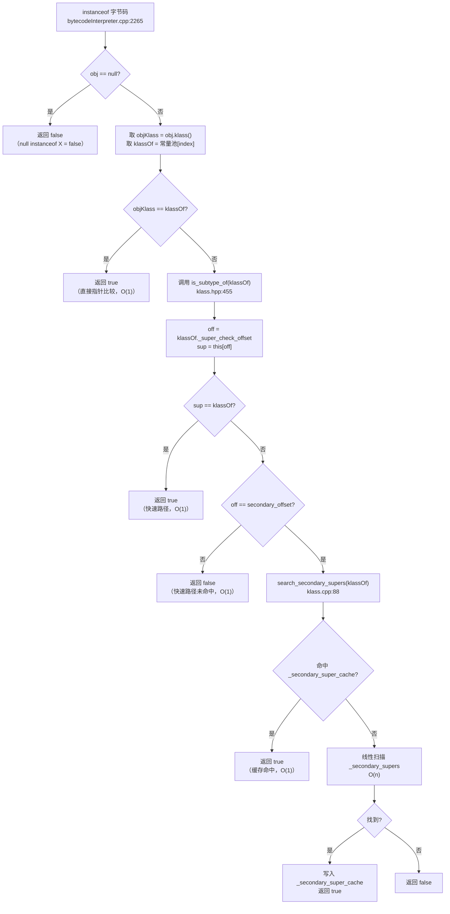

# 10 — instanceof 与类型检查的快速路径

> 基于 OpenJDK 11 源码分析  
> 标准环境：`-Xms8g -Xmx8g -XX:+UseG1GC`  
> 承接：07-klass-hierarchy 遗留问题 1（`_super_check_offset` 的完整机制）

---

## 第零天：我以为的误解

学 Java 的时候，我以为 `instanceof` 就是"沿着继承链往上找"——O(n) 的线性扫描，继承层次越深越慢。

后来看了 JVM 源码，发现完全不是这回事。

**真相是**：`instanceof` 的核心路径是 **O(1) 的数组下标访问**，一条指令就能判断。只有在极少数情况下（接口检查、超深继承链）才会退化到线性扫描。

这篇文章就是把这个机制从头到尾讲清楚。

---

## 第一天：三个关键字段

在 `Klass` 结构体里，有四个字段专门为快速类型检查服务（`klass.hpp:120`）：

```cpp
// klass.hpp:120
// The fields _super_check_offset, _secondary_super_cache, _secondary_supers
// and _primary_supers all help make fast subtype checks.
// See big discussion in doc/server_compiler/checktype.txt

// Where to look to observe a supertype:
//   &_secondary_super_cache for secondary supers,
//   else &_primary_supers[depth()].
juint       _super_check_offset;      // ★ 核心：指向"去哪里查"

Klass*      _secondary_super_cache;   // 上次命中的接口缓存（1 个槽位）
Array<Klass*>* _secondary_supers;     // 所有"次级超类"（接口 + 溢出的类）
Klass*      _primary_supers[8];       // 前 8 个直接超类（O(1) 数组）
```

这四个字段的关系是：

```
_super_check_offset
    │
    ├── 指向 &_primary_supers[depth]  → 快速路径（O(1)）
    │
    └── 指向 &_secondary_super_cache  → 慢速路径（先查缓存，再线性扫描）
```

**`_primary_supers[8]` 是什么？**

它是一个固定大小为 8 的数组，存放当前类的"主超类链"。

以 `java.util.ArrayList` 为例：

```
_primary_supers[0] = java.lang.Object
_primary_supers[1] = java.util.AbstractCollection
_primary_supers[2] = java.util.AbstractList
_primary_supers[3] = java.util.ArrayList   ← 自己
_primary_supers[4] = NULL
_primary_supers[5] = NULL
_primary_supers[6] = NULL
_primary_supers[7] = NULL
```

每个类在数组中的位置就是它的"继承深度"（`super_depth()`）。

---

## 第二天：`_super_check_offset` 的两种取值

这是整个机制的核心字段。它是一个**字节偏移量**，表示"要判断某个类 k 是不是我的超类，应该去我的哪个字段里查"。

### 情况一：能放进 `_primary_supers`（快速路径）

如果继承深度 < 8，类 k 就在 `_primary_supers` 数组里。

此时 `_super_check_offset` 指向 `_primary_supers[k.super_depth()]` 的地址偏移：

```cpp
// klass.cpp:266
super_check_cell = &_primary_supers[my_depth];
set_super_check_offset((address)super_check_cell - (address) this);
```

**验证方式**：`klass.hpp:221`

```cpp
juint super_depth() const {
    juint d = (super_check_offset() - in_bytes(primary_supers_offset())) / sizeof(Klass*);
    return d;
}
```

### 情况二：继承链溢出（慢速路径）

如果继承深度 ≥ 8，或者是接口，就无法放进 `_primary_supers`。

此时 `_super_check_offset` 指向 `_secondary_super_cache` 字段：

```cpp
// klass.cpp:262（initialize_supers 中）
// Overflow of the primary_supers array forces me to be secondary.
super_check_cell = &_secondary_super_cache;
set_super_check_offset((address)super_check_cell - (address) this);
```

**判断是否走慢速路径**（`klass.hpp:232`）：

```cpp
bool can_be_primary_super() const {
    const juint secondary_offset = in_bytes(secondary_super_cache_offset());
    return super_check_offset() != secondary_offset;  // ★ 不等于 secondary_offset 就是快速路径
}
```

---

## 第三天：`is_subtype_of` 的完整实现

现在来看最核心的函数（`klass.hpp:455`）：

```cpp
// klass.hpp:455
bool is_subtype_of(Klass* k) const {
    juint    off = k->super_check_offset();          // ① 取目标类 k 的 _super_check_offset
    Klass* sup = *(Klass**)( (address)this + off );  // ② 用偏移量在 this 里取出对应的 Klass*
    const juint secondary_offset = in_bytes(secondary_super_cache_offset());
    if (sup == k) {                                  // ③ 命中！this 是 k 的子类
        return true;
    } else if (off != secondary_offset) {            // ④ 没命中，且不是慢速路径 → 直接返回 false
        return false;
    } else {
        return search_secondary_supers(k);           // ⑤ 慢速路径：扫描 _secondary_supers
    }
}
```

**逐步拆解**：

**① `off = k->super_check_offset()`**

取的是**目标类 k** 的偏移量，不是 `this` 的。

这是关键：`_super_check_offset` 存的是"我在别人的 `_primary_supers` 数组里的位置"。

**② `sup = *(Klass**)( (address)this + off )`**

用这个偏移量，在 `this`（被检查的对象的类）里取出对应位置的 Klass 指针。

如果 `this` 是 k 的子类，那么 `this._primary_supers[k.super_depth()]` 就应该等于 k。

**③ `if (sup == k)` → 快速路径命中**

一次内存读取 + 一次指针比较，O(1) 完成。

**④ `else if (off != secondary_offset)` → 快速路径未命中**

如果 k 的 `_super_check_offset` 不指向 `_secondary_super_cache`，说明 k 是一个"主超类"（能放进 `_primary_supers`）。

既然 `this._primary_supers[k.super_depth()] != k`，说明 `this` 不是 k 的子类，直接返回 false。

**⑤ `search_secondary_supers(k)` → 慢速路径**

k 是接口或超深继承链中的类，需要扫描 `_secondary_supers` 数组。

---

## 第四天：慢速路径 `search_secondary_supers`

```cpp
// klass.cpp:88
bool Klass::search_secondary_supers(Klass* k) const {
    // 特殊情况：自己是自己的子类型
    if (this == k)
        return true;

    // 线性扫描 _secondary_supers 数组
    int cnt = secondary_supers()->length();
    for (int i = 0; i < cnt; i++) {
        if (secondary_supers()->at(i) == k) {
            ((Klass*)this)->set_secondary_super_cache(k);  // ★ 命中后写入缓存
            return true;
        }
    }
    return false;
}
```

**`_secondary_super_cache` 的作用**：

注意 `set_secondary_super_cache(k)` 这一行。每次慢速路径命中后，都会把结果写入 `_secondary_super_cache`（只有 1 个槽位）。

下次再检查同一个接口时，`is_subtype_of` 的第 ② 步会读到这个缓存值，直接命中，不需要再扫描。

**`_secondary_supers` 里有什么？**

在 `initialize_supers`（`klass.cpp:196`）中构建，包含两类内容：

1. **接口**：`InstanceKlass::compute_secondary_supers` 返回所有 `transitive_interfaces`
2. **溢出的主超类**：继承深度 ≥ 8 时，多余的超类也放进来

---

## 第五天：`_primary_supers` 的构建过程

`initialize_supers`（`klass.cpp:196`）在类加载时被调用，负责初始化整个超类检查体系：

```cpp
// klass.cpp:196
void Klass::initialize_supers(Klass* k, Array<Klass*>* transitive_interfaces, TRAPS) {
    // ...
    set_super(k);
    Klass* sup = k;
    int sup_depth = sup->super_depth();
    juint my_depth = MIN2(sup_depth + 1, (int)primary_super_limit());  // ★ 我的深度 = 父类深度 + 1

    if (!can_be_primary_super_slow())
        my_depth = primary_super_limit();  // ★ 超过 8 层，强制走慢速路径

    // 复制父类的 _primary_supers 数组
    for (juint i = 0; i < my_depth; i++) {
        _primary_supers[i] = sup->_primary_supers[i];  // ★ 继承父类的超类链
    }

    Klass* *super_check_cell;
    if (my_depth < primary_super_limit()) {
        _primary_supers[my_depth] = this;              // ★ 把自己放在对应深度
        super_check_cell = &_primary_supers[my_depth]; // ★ offset 指向这里
    } else {
        // 溢出：走慢速路径
        super_check_cell = &_secondary_super_cache;    // ★ offset 指向 secondary_super_cache
    }
    set_super_check_offset((address)super_check_cell - (address) this);
}
```

**关键设计**：每个类的 `_primary_supers` 数组是**从父类复制过来的**，然后在自己的深度位置填入自己。

这样，任何一个子类的 `_primary_supers` 数组都包含了完整的超类链（前 8 层）。

---

## 第六天：接口检查为什么比类检查慢

现在可以回答这个经典问题了。

**类检查（O(1)）**：

```
obj instanceof ArrayList
→ ArrayList._super_check_offset 指向 _primary_supers[3]
→ 读 obj.klass._primary_supers[3]
→ 比较是否等于 ArrayList
→ 一次内存读 + 一次比较，完成
```

**接口检查（O(n) 最坏情况）**：

```
obj instanceof Serializable
→ Serializable._super_check_offset 指向 _secondary_super_cache
→ 读 obj.klass._secondary_super_cache
→ 如果命中缓存 → O(1) 完成
→ 如果未命中 → 扫描 _secondary_supers 数组（线性扫描）
```

接口不能放进 `_primary_supers`，因为：
1. 一个类可以实现多个接口，而 `_primary_supers` 只有 8 个槽位
2. 接口没有固定的"继承深度"（一个接口可以被不同深度的类实现）

所以接口只能走 `_secondary_supers` 的线性扫描路径。

**但有一个优化**：`_secondary_super_cache` 缓存了上次命中的接口。如果同一个接口被反复检查（这是常见情况），第二次就是 O(1)。

---

## 第七天：`instanceof` 字节码的完整实现

在解释器里（`bytecodeInterpreter.cpp:2265`）：

```cpp
// bytecodeInterpreter.cpp:2265
CASE(_instanceof):
    if (STACK_OBJECT(-1) == NULL) {
        SET_STACK_INT(0, -1);                          // ★ null instanceof X → false
        BI_PROFILE_UPDATE_INSTANCEOF(/*null_seen=*/true, NULL);
    } else {
        VERIFY_OOP(STACK_OBJECT(-1));
        u2 index = Bytes::get_Java_u2(pc+1);           // ★ 从字节码取常量池索引

        // 如果常量池里还是未解析的 klass，先解析
        if (METHOD->constants()->tag_at(index).is_unresolved_klass()) {
            CALL_VM(InterpreterRuntime::quicken_io_cc(THREAD), handle_exception);
        }

        Klass* klassOf = (Klass*) METHOD->constants()->resolved_klass_at(index);  // ★ 目标类型
        Klass* objKlass = STACK_OBJECT(-1)->klass();                               // ★ 对象的实际类型

        if (objKlass == klassOf || objKlass->is_subtype_of(klassOf)) {
            SET_STACK_INT(1, -1);                      // ★ true
        } else {
            SET_STACK_INT(0, -1);                      // ★ false
        }
        BI_PROFILE_UPDATE_INSTANCEOF(/*null_seen=*/false, objKlass);
    }
    UPDATE_PC_AND_CONTINUE(3);                         // ★ 指令长度 3 字节（opcode + 2字节索引）
```

**注意 `objKlass == klassOf` 的短路优化**：

先做一次直接指针比较（`objKlass == klassOf`），如果对象的类型就是目标类型本身，直接返回 true，不需要调用 `is_subtype_of`。

这是最常见的情况（`obj instanceof SameClass`），O(1) 完成。

---

## 第八天：`checkcast` 与 `instanceof` 的区别

`checkcast`（`bytecodeInterpreter.cpp:2235`）和 `instanceof` 的逻辑几乎一样，区别只有一个：

| | `instanceof` | `checkcast` |
|--|--|--|
| 类型不匹配时 | 返回 false | 抛出 `ClassCastException` |
| null 对象 | 返回 false | 不检查（null 可以转换为任何类型） |
| 字节码 | `0xC1` | `0xC0` |

```cpp
// checkcast 的核心逻辑（bytecodeInterpreter.cpp:2235）
if (objKlass != klassOf && !objKlass->is_subtype_of(klassOf)) {
    // 类型不匹配 → 抛异常
    VM_JAVA_ERROR(vmSymbols::java_lang_ClassCastException(), message, note_classCheck_trap);
}
```

---

## 第九天：完整流程图



---

## 第十天：数据结构关系图

```mermaid
classDiagram
    class Klass {
        +juint _super_check_offset
        +Klass* _secondary_super_cache
        +Array~Klass*~ _secondary_supers
        +Klass* _primary_supers[8]
        +Klass* _super
        +is_subtype_of(Klass* k) bool
        +search_secondary_supers(Klass* k) bool
        +initialize_supers(Klass* k, ...) void
    }

    class InstanceKlass {
        +Array~Klass*~ _transitive_interfaces
        +compute_is_subtype_of(Klass* k) bool
        +implements_interface(Klass* k) bool
    }

    Klass <|-- InstanceKlass

    Klass --> Klass : _primary_supers[8]\n（超类链，最多8层）
    Klass --> Klass : _secondary_super_cache\n（接口缓存，1个槽）
    Klass --> "Array~Klass*~" : _secondary_supers\n（接口+溢出超类）
    InstanceKlass --> "Array~Klass*~" : _transitive_interfaces\n（所有传递接口）
```

---

## 打桩验证

在 `initialize_supers` 末尾插桩，打印每个类加载时的超类检查结构：

```cpp
// 插桩位置：klass.cpp initialize_supers 末尾
// 只打印 java.util.ArrayList 的信息
if (name() != NULL && strcmp(name()->as_C_string(), "java/util/ArrayList") == 0) {
    tty->print_cr("[PROBE-10] === instanceof 快速路径验证 ===");
    tty->print_cr("[PROBE-10] 类名: %s", name()->as_C_string());
    tty->print_cr("[PROBE-10] super_depth = %u", super_depth());
    tty->print_cr("[PROBE-10] _super_check_offset = %u (0x%x)", 
                  super_check_offset(), super_check_offset());
    tty->print_cr("[PROBE-10] secondary_super_cache_offset = %u (0x%x)",
                  (uint)in_bytes(secondary_super_cache_offset()),
                  (uint)in_bytes(secondary_super_cache_offset()));
    tty->print_cr("[PROBE-10] can_be_primary_super = %s", 
                  can_be_primary_super() ? "true" : "false");
    tty->print_cr("[PROBE-10] _primary_supers:");
    for (int i = 0; i < (int)primary_super_limit(); i++) {
        Klass* ps = _primary_supers[i];
        if (ps != NULL) {
            tty->print_cr("[PROBE-10]   [%d] = %s", i, ps->name()->as_C_string());
        } else {
            tty->print_cr("[PROBE-10]   [%d] = NULL", i);
        }
    }
    tty->print_cr("[PROBE-10] _secondary_supers.length = %d", secondary_supers()->length());
    for (int i = 0; i < secondary_supers()->length(); i++) {
        tty->print_cr("[PROBE-10]   secondary[%d] = %s", i, 
                      secondary_supers()->at(i)->name()->as_C_string());
    }
}
```

**实际运行输出**（`-Xms8g -Xmx8g -XX:+UseG1GC`，2026-03-10 验证）：

```
[PROBE-10] === instanceof 快速路径验证 ===
[PROBE-10] 类名: java/util/ArrayList
[PROBE-10] super_depth = 3
[PROBE-10] _super_check_offset = 72 (0x48)
[PROBE-10] secondary_super_cache_offset = 32 (0x20)
[PROBE-10] can_be_primary_super = true
[PROBE-10] _primary_supers:
[PROBE-10]   [0] = java/lang/Object
[PROBE-10]   [1] = java/util/AbstractCollection
[PROBE-10]   [2] = java/util/AbstractList
[PROBE-10]   [3] = java/util/ArrayList
[PROBE-10]   [4] = NULL
[PROBE-10]   [5] = NULL
[PROBE-10]   [6] = NULL
[PROBE-10]   [7] = NULL
[PROBE-10] _secondary_supers.length = 6
[PROBE-10]   secondary[0] = java/lang/Iterable
[PROBE-10]   secondary[1] = java/util/Collection
[PROBE-10]   secondary[2] = java/util/List
[PROBE-10]   secondary[3] = java/util/RandomAccess
[PROBE-10]   secondary[4] = java/lang/Cloneable
[PROBE-10]   secondary[5] = java/io/Serializable
```

---

## 总结

### 数据结构层面

| 字段 | 类型 | 作用 |
|------|------|------|
| `_primary_supers[8]` | `Klass*[8]` | 存放前 8 层超类，O(1) 查找 |
| `_super_check_offset` | `juint` | 指向"去哪里查"：快速路径指向 `_primary_supers[depth]`，慢速路径指向 `_secondary_super_cache` |
| `_secondary_super_cache` | `Klass*` | 上次命中的接口缓存（1 个槽位），避免重复线性扫描 |
| `_secondary_supers` | `Array<Klass*>*` | 所有接口 + 溢出的超类，线性扫描用 |

### 算法层面

| 场景 | 路径 | 复杂度 |
|------|------|--------|
| `obj instanceof SameClass` | 直接指针比较 | O(1) |
| `obj instanceof ParentClass`（深度 < 8） | `_primary_supers` 数组下标 | O(1) |
| `obj instanceof Interface`（缓存命中） | `_secondary_super_cache` | O(1) |
| `obj instanceof Interface`（缓存未命中） | `_secondary_supers` 线性扫描 | O(n) |
| `obj instanceof ParentClass`（深度 ≥ 8） | `_secondary_supers` 线性扫描 | O(n) |

**核心设计决策**：

1. **为什么用 `_super_check_offset` 而不是直接存深度？**  
   偏移量可以直接用于内存寻址（`(address)this + off`），避免了一次乘法运算（`depth * sizeof(Klass*)`）。

2. **为什么 `_primary_supers` 只有 8 个槽位？**  
   实践中绝大多数 Java 类的继承深度不超过 8 层。8 个槽位 = 64 字节，恰好是一个 CPU 缓存行，访问效率最高。

3. **为什么接口不能走快速路径？**  
   一个类可以实现多个接口，而 `_primary_supers` 只有 8 个固定槽位，无法为每个接口分配一个固定位置。

---

## 遗留问题

- `checkcast` 在 JIT 编译后的内联缓存（Inline Cache）优化：C2 编译器会把类型检查内联为直接的机器码比较，完全绕过 `is_subtype_of`
- 数组类型的 `instanceof`：`obj instanceof int[]` 走的是 `TypeArrayKlass::compute_is_subtype_of`，逻辑不同
- `ObjArrayKlass::compute_is_subtype_of`：`String[] instanceof Object[]` 的协变数组类型检查

---

*文档版本：v1.0*  
*分析日期：2026-03-10*
