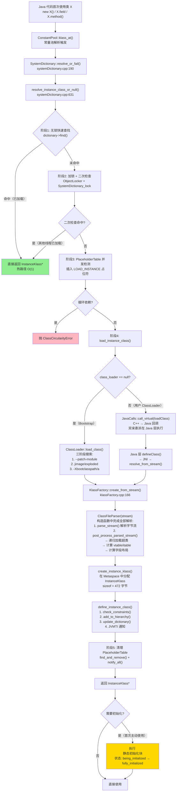
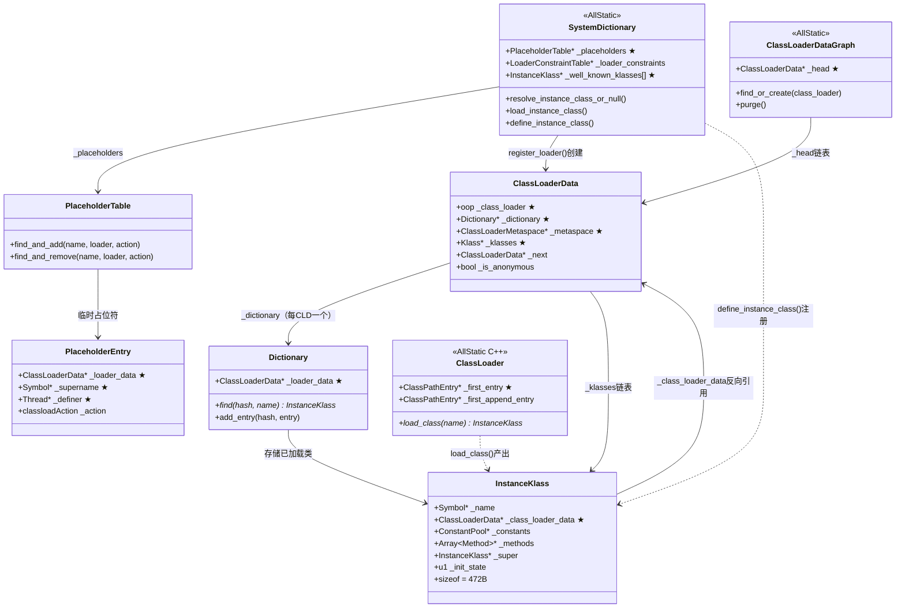

# 类加载：我以为就是"把 .class 文件读进来"，结果差远了

> 第一人称学习笔记 · 基于 OpenJDK 11 源码  
> 对应文档：`ClassLoading/classloading_complete_flow.md` · `ClassLoading/ch07_parent_delegation_loadclass.md`  
> 插桩数据：`JVM-Core-Objects/06-ClassLoading-Timeline.md`

---

## 第零天：我以为类加载就是"把 .class 文件读进来"

刚开始学 JVM 的时候，我对类加载的理解是这样的：

> "JVM 启动时扫描 classpath，把所有 .class 文件读进来，解析成某种内部格式，完事。"

这个理解有四个根本性的错误：

**错误 1：以为是启动时一次性加载**

实际上是**懒加载**——类在第一次被使用时才加载。`new Foo()` 触发加载，`Foo.staticField` 触发加载，但 `Foo foo = null` 不触发加载（只是声明引用，没有使用类）。

**错误 2：以为双亲委派是"先自己找，找不到再问父亲"**

完全反过来！是**先问父亲，父亲找不到才自己找**。我第一次看到这个设计时觉得很奇怪——为什么要先问父亲？后来才明白：这是为了安全，防止用户代码冒充 `java.lang.String`。

**错误 3：以为类加载就是解析 .class 文件**

实际上类加载只是第一步（Loading），后面还有链接（Linking = 验证 + 准备 + 解析）和初始化（Initialization = 执行 `<clinit>`）。而且这三个阶段不是严格串行的——解析可以延迟到使用时才做。

**错误 4：以为 ClassLoader 只有一个**

实际上有三个内建 ClassLoader（Bootstrap / Platform / App），加上用户可以自定义。而且不同 ClassLoader 加载的同名类是**不同的类**，不能互相转型。

---

## 第一天：双亲委派——我以为是"先自己找"，结果反过来

翻了 `ClassLoader.java` 的源码，`loadClass` 的逻辑是这样的：

```java
// ClassLoader.java:566
protected Class<?> loadClass(String name, boolean resolve) throws ClassNotFoundException {
    synchronized (getClassLoadingLock(name)) {
        // ★ 1. 先查缓存（这个 ClassLoader 是否已加载过？）
        Class<?> c = findLoadedClass(name);

        if (c == null) {
            try {
                // ★ 2. 委托给父加载器（双亲委派的核心！）
                if (parent != null) {
                    c = parent.loadClass(name, false);  // 递归！
                } else {
                    // parent == null → 到达 Bootstrap ClassLoader
                    c = findBootstrapClassOrNull(name);
                }
            } catch (ClassNotFoundException e) {
                // parent 找不到 → 不抛异常，继续往下
            }

            // ★ 3. parent 找不到 → 自己加载
            if (c == null) {
                c = findClass(name);  // 子类重写这个方法
            }
        }

        if (resolve) resolveClass(c);
        return c;
    }
}
```

**我当时的第一个惊讶**：步骤 2 是先问 parent，步骤 3 才是自己找。这和我以为的顺序完全反过来。

**为什么要先问父亲？**

安全性。如果先自己找，用户可以写一个 `java.lang.String` 类放在 classpath 上，然后 AppClassLoader 就会加载这个假的 String，JVM 就被攻击了。先问父亲（最终到 Bootstrap ClassLoader），Bootstrap 会从 jimage 里找到真正的 `java.lang.String`，用户的假 String 永远不会被加载。

**三级 ClassLoader 的委派链**：

```
AppClassLoader.loadClass("com.example.Foo")
  ↓ 委托给 parent
PlatformClassLoader.loadClass("com.example.Foo")
  ↓ 委托给 parent（null → Bootstrap）
Bootstrap ClassLoader 搜索 jimage → 找不到
  ↑ 返回 null
PlatformClassLoader.findClass("com.example.Foo") → 找不到
  ↑ 返回 null
AppClassLoader.findClass("com.example.Foo")
  → 搜索 classpath → 找到 → defineClass → 返回
```

---

## 第一天半：数据结构补课

我第二天看 `resolve_instance_class_or_null` 的时候，发现自己完全不知道 `PlaceholderTable`、`ClassLoaderData`、`Dictionary` 是什么。回来补课。

### SystemDictionary（全局类注册表）

```cpp
// systemDictionary.hpp — AllStatic（纯静态，无实例）
class SystemDictionary : AllStatic {
  static PlaceholderTable*       _placeholders;         // ★ 正在加载中的类（并发/循环依赖检测）
  static Dictionary*             _shared_dictionary;    // CDS 共享字典
  static LoaderConstraintTable*  _loader_constraints;   // 加载器约束表
  static ResolutionErrorTable*   _resolution_errors;    // 解析错误缓存
  
  // ★ 约 80+ 个预加载的核心类（Object/String/Class/Thread/...）
  static InstanceKlass* _well_known_klasses[WKID_LIMIT];
};
```

**关键设计**：SystemDictionary 本身**不存储**已加载的类！它是协调者，实际的类存储在每个 ClassLoaderData 的 `Dictionary` 里。

**sizeof(SystemDictionary)**：`AllStatic` 类，无实例，所有字段都是静态的，不占对象内存。

### ClassLoaderData（类加载器的元数据中枢）

```cpp
// classLoaderData.hpp
class ClassLoaderData : public CHeapObj<mtClass> {
  oop            _class_loader;       // ★ 对应的 Java ClassLoader 对象（Bootstrap 时为 null）
  Dictionary*    _dictionary;         // ★ 该加载器定义的所有类（按 name hash 存储）
  ClassLoaderMetaspace* _metaspace;   // ★ Metaspace 分配器（懒创建）
  Klass*         _klasses;            // ★ 已加载类链表（新类插入头部）
  PackageEntryTable* _packages;       // 包表（模块系统用）
  ModuleEntryTable*  _modules;        // 模块表
  ClassLoaderData* _next;             // ★ 全局链表（ClassLoaderDataGraph 遍历用）
  bool           _is_anonymous;       // 是否是匿名类加载器（lambda 用）
};
```

**sizeof(ClassLoaderData)**：约 **120 字节**

**关键字段生命周期**：
- `_class_loader`：构造时设置，Bootstrap 时为 null；GC 通过此字段判断 ClassLoader 是否可达
- `_klasses`：每次 `define_instance_class` 后插入链表头部；ClassLoader 卸载时遍历此链表卸载所有类
- `_metaspace`：懒创建，首次分配时初始化；ClassLoader 卸载时整批归还所有 Metachunk

### Dictionary（每 ClassLoader 一个的类字典）

```cpp
// dictionary.hpp:42
class Dictionary : public Hashtable<InstanceKlass*, mtClass> {
  ClassLoaderData* _loader_data;  // ★ 反向指针（指向持有此 Dictionary 的 CLD）
  bool _resizable;                // 是否允许扩容
};
```

**查找路径**：`class_loader → ClassLoaderData → dictionary() → find(hash, name)`

### PlaceholderTable（加载中占位符）

```cpp
// placeholders.hpp:37
class PlaceholderEntry : public HashtableEntry<Symbol*, mtClass> {
  ClassLoaderData* _loader_data;  // ★ 发起加载的 ClassLoader
  Symbol*          _supername;    // ★ 正在加载的超类名（LOAD_SUPER 时有效）
  Thread*          _definer;      // ★ 持有 DEFINE_CLASS token 的线程
  enum classloadAction {
    LOAD_INSTANCE = 1,  // ★ 正在调用 load_instance_class
    LOAD_SUPER    = 2,  // ★ 正在加载超类（用于循环依赖检测）
    DEFINE_CLASS  = 3   // ★ 正在 define（并发控制令牌）
  };
};
```

**sizeof(PlaceholderEntry)**：约 **48 字节**

**三种 action 的含义**：
- `LOAD_INSTANCE`：标记"某线程正在加载这个类"，其他线程 wait
- `LOAD_SUPER`：标记"某线程正在为这个类加载超类"，用于检测 `ClassCircularityError`
- `DEFINE_CLASS`：在并行类加载器中，只有持有 token 的线程能 define，其他线程等待结果

---

## 第二天：类加载的真正入口——6 个阶段

我以为类加载就是"调用 loadClass"，结果 C++ 层的 `resolve_instance_class_or_null` 有 6 个阶段，每个阶段都有讲究。

### 阶段 1：无锁快速查找（热路径）

```cpp
// systemDictionary.cpp:631
// 获取真正的 ClassLoader（跳过反射代理）
class_loader = Handle(THREAD, java_lang_ClassLoader::non_reflection_class_loader(class_loader()));
ClassLoaderData* loader_data = register_loader(class_loader);
Dictionary* dictionary = loader_data->dictionary();
unsigned int d_hash = dictionary->compute_hash(name);

// ★ 第一次查找：无锁！只要已加载就直接返回
Klass* probe = dictionary->find(d_hash, name, protection_domain);
if (probe != NULL) return probe;  // 热路径：O(1) 返回
```

**为什么无锁？** 因为 Dictionary 的 `find` 只读，不修改，不需要锁。这是最常见的情况（类已经加载过了），所以要尽量快。

### 阶段 2：加锁 + 二次检查

```cpp
// systemDictionary.cpp:668
// 判断是否需要获取类加载器对象锁
bool DoObjectLock = !is_parallelCapable(class_loader);
Handle lockObject = compute_loader_lock_object(class_loader, THREAD);
ObjectLocker ol(lockObject, THREAD, DoObjectLock);

{
  MutexLocker mu(SystemDictionary_lock, THREAD);
  InstanceKlass* check = find_class(d_hash, name, dictionary);
  if (check != NULL) {
    k = check;
    class_has_been_loaded = true;  // 其他线程已加载完成
  }
}
```

**为什么要二次检查？** 阶段 1 和阶段 2 之间有个窗口期，其他线程可能已经完成了加载。加锁后再查一次，能捕获这种情况。

### 阶段 3：并发检测（PlaceholderTable）

这里处理 4 种并发场景：

```
场景 1: 传统 ClassLoader（持有对象锁）
  → 不需要额外处理，对象锁已经保证串行

场景 2: 传统但释放了锁（死锁 workaround）
  → 通过 placeholder LOAD_INSTANCE 等待首个请求者完成

场景 3: Bootstrap ClassLoader
  → 无对象锁，通过 placeholder 在 SystemDictionary_lock 下协调

场景 4: parallelCapable ClassLoader（如 AppClassLoader）
  → 允许并行加载不同类，define 时通过 DEFINE_CLASS token 序列化
```

**循环依赖检测**：如果当前线程在 placeholder 中发现自己已经在加载同一个类的超类链，抛 `ClassCircularityError`。

### 阶段 4：实际加载

```cpp
// systemDictionary.cpp:818
k = load_instance_class(name, class_loader, THREAD);
```

这里分两条路径（下一节详述）。

### 阶段 5：清理 placeholder

```cpp
// systemDictionary.cpp:856
MutexLocker mu(SystemDictionary_lock, THREAD);
placeholders()->find_and_remove(p_index, p_hash, name, loader_data,
                                 PlaceholderTable::LOAD_INSTANCE, THREAD);
SystemDictionary_lock->notify_all();  // ★ 唤醒所有等待线程
```

**为什么要 notify_all？** 可能有多个线程在等待这个类加载完成（阶段 3 的 wait），加载完成后要唤醒它们。

### 阶段 6：JFR 事件 + 断言检查

---

## 第三天：两条加载路径——Bootstrap vs 用户 ClassLoader

`load_instance_class` 根据 class_loader 是否为 null 分两条路径：

### 路径 A：Bootstrap ClassLoader（C++ 实现）

```cpp
// systemDictionary.cpp:1403
if (class_loader.is_null()) {
  // 1. 先尝试 CDS 共享归档
  k = load_shared_class(class_name, class_loader, THREAD);

  // 2. 从文件系统加载
  if (k == NULL) {
    k = ClassLoader::load_class(class_name, search_only_bootloader_append, CHECK_NULL);
  }

  // 3. 注册到字典
  if (k != NULL) {
    k = find_or_define_instance_class(class_name, class_loader, k, THREAD);
  }
}
```

Bootstrap ClassLoader 的三阶段搜索（`ClassLoader::load_class`）：

```
搜索阶段 1: --patch-module 路径（模块补丁）
搜索阶段 2: jimage（lib/modules）或 exploded build
搜索阶段 3: -Xbootclasspath/a 追加路径
```

**插桩实测**（来自 `JVM-Core-Objects/06-ClassLoading-Timeline.md`）：

```
启动 com.wjcoder.Main 时：
  总加载类数：117 个
  全部由 Bootstrap ClassLoader 加载
  全部走 jimage 路径（搜索阶段 2）
  没有一个走 append 路径（搜索阶段 3）
```

### 路径 B：用户 ClassLoader（回调 Java 层）

```cpp
// systemDictionary.cpp:1450
else {
  // ★ 回调到 Java 层: ClassLoader.loadClass(String name)
  Handle string = java_lang_String::externalize_classname(class_name_str, CHECK_NULL);

  JavaCalls::call_virtual(&result,
                          class_loader,
                          SystemDictionary::ClassLoader_klass(),
                          vmSymbols::loadClass_name(),          // "loadClass"
                          vmSymbols::string_class_signature(),  // "(Ljava/lang/String;)Ljava/lang/Class;"
                          string,
                          CHECK_NULL);
}
```

**我当时的第二个惊讶**：C++ 层通过 `JavaCalls::call_virtual` 回调到 Java 层的 `loadClass`，然后 Java 层的 `defineClass` 又通过 JNI 回到 C++ 层的 `resolve_from_stream`。这是一个 C++ → Java → C++ 的往返调用！

---

## 第三天半：.class 文件解析——ClassFileParser 的 6461 行

我以为解析 .class 文件很简单，结果 `classFileParser.cpp` 有 6461 行，是整个 JVM 源码中最大的单文件之一。

### 解析在构造函数中完成

```cpp
// classFileParser.cpp:5876
ClassFileParser::ClassFileParser(stream, name, loader_data, ...) {
  // ... 初始化 ~40 个字段 ...

  // ★ 关键：解析在构造函数中完成！
  parse_stream(stream, CHECK);              // 解析字节流
  post_process_parsed_stream(stream, _cp, CHECK);  // 后处理（超类解析、vtable 计算等）
}
```

**为什么在构造函数里解析？** 这样 ClassFileParser 对象的生命周期就等于解析过程的生命周期，析构时自动清理临时数据。

### parse_stream 按 JVM Spec 顺序解析

```
1. magic number (0xCAFEBABE)
2. minor_version + major_version
3. constant_pool (parse_constant_pool)
4. access_flags
5. this_class_index → 验证类名
6. super_class → parse_super_class
7. interfaces → parse_interfaces
8. fields → parse_fields
9. methods → parse_methods
10. attributes → parse_classfile_attributes
11. annotations → create_combined_annotations
12. 验证 end-of-stream
```

### post_process_parsed_stream 的关键步骤

```
1. 解析超类 → SystemDictionary::resolve_super_or_fail()  // ★ 递归加载超类！
2. 验证超类（不能是 interface、不能是 final）
3. compute_transitive_interfaces()                        // 计算传递接口
4. sort_methods()                                         // 排序方法表
5. klassVtable::compute_vtable_size_and_num_mirandas()   // 计算 vtable/itable
6. layout_fields()                                        // 计算字段布局
```

**我当时的第三个惊讶**：超类解析（步骤 1）会触发超类的类加载（递归调用 `resolve_instance_class_or_null`）！这就是为什么加载 `String` 时会先加载 `Serializable`、`Comparable`、`CharSequence`——它们是 String 的接口，在 `post_process_parsed_stream` 里被递归加载。

---

## 第四天：`<clinit>` 的触发条件——我以为 new 就会触发

我以为 `new Foo()` 一定会触发 `Foo` 的 `<clinit>`（静态初始化块）。结果不是这样的。

### 触发 `<clinit>` 的 5 种情况

```
1. new Foo()                    → 触发（创建实例）
2. Foo.staticField = value      → 触发（写静态字段）
3. Foo.staticField              → 触发（读静态字段，但 final 常量除外！）
4. Foo.staticMethod()           → 触发（调用静态方法）
5. Class.forName("Foo")         → 触发（默认 initialize=true）
```

### 不触发 `<clinit>` 的情况

```
1. Foo foo = null               → 不触发（只是声明引用）
2. Foo[] arr = new Foo[10]      → 不触发（创建数组，不是创建 Foo 实例）
3. Foo.CONSTANT                 → 不触发（final static 编译期常量，编译时内联）
4. Class.forName("Foo", false, cl) → 不触发（initialize=false）
```

**我踩的坑**：

```java
class Foo {
    static final int VALUE = 42;  // 编译期常量
    static {
        System.out.println("Foo initialized!");
    }
}

// 这行代码不会打印 "Foo initialized!"
int x = Foo.VALUE;  // VALUE 在编译时被内联为 42，不需要加载 Foo
```

这是因为 `final static int VALUE = 42` 是编译期常量，编译器会把 `Foo.VALUE` 直接替换成 `42`，字节码里根本没有对 `Foo` 的引用。

### InstanceKlass 的初始化状态机

```cpp
// instanceKlass.hpp
enum ClassState {
  allocated,                // 已分配内存，未初始化
  loaded,                   // 已加载（Loading 完成）
  linked,                   // 已链接（Linking 完成）
  being_initialized,        // 正在初始化（<clinit> 执行中）
  fully_initialized,        // 完全初始化（<clinit> 执行完成）
  initialization_error      // 初始化失败（<clinit> 抛了异常）
};
```

**并发初始化**：如果两个线程同时触发同一个类的初始化，只有一个线程会执行 `<clinit>`，另一个线程会等待（通过 `_init_monitor` 锁）。

---

## 第四天半：BuiltinClassLoader 的模块感知委派

JDK 9 之后，三个内建 ClassLoader（Bootstrap/Platform/App）不走传统的 `ClassLoader.loadClass()`，而是走 `BuiltinClassLoader.loadClassOrNull()`，增加了模块感知路径：

```java
// BuiltinClassLoader.java:590
protected Class<?> loadClassOrNull(String cn, boolean resolve) {
    synchronized (getClassLoadingLock(cn)) {
        // ① 查缓存
        Class<?> c = findLoadedClass(cn);

        if (c == null) {
            // ② 查模块映射表：这个类的包属于哪个模块？
            LoadedModule loadedModule = findLoadedModule(cn);
            //  findLoadedModule("java.sql.Connection")
            //    → packageToModule.get("java.sql")
            //    → LoadedModule{loader=PlatformClassLoader, mref=java.sql}

            if (loadedModule != null) {
                // ★ 路径 A: 模块路径（可以跨级委托！）
                BuiltinClassLoader loader = loadedModule.loader();
                if (loader == this) {
                    c = findClassInModuleOrNull(loadedModule, cn);
                } else {
                    c = loader.loadClassOrNull(cn);  // 跨级委托
                }
            } else {
                // ★ 路径 B: 传统双亲委派
                if (parent != null) {
                    c = parent.loadClassOrNull(cn);
                }
                if (c == null && hasClassPath()) {
                    c = findClassOnClassPathOrNull(cn);
                }
            }
        }
        return c;
    }
}
```

**模块感知委派的关键**：`packageToModule` 是一个静态全局 `ConcurrentHashMap`，三个内建 ClassLoader 共享，包名 → 模块归属，O(1) 查找。

**和传统双亲委派的区别**：

| | 传统双亲委派 | 模块感知委派 |
|--|------------|------------|
| 委托方向 | 只能向上（App → Platform → Boot） | 可以跨级（App 直接委托给 Platform） |
| 查找方式 | 线性递归 | 先查 packageToModule 表，O(1) 定位 |
| 适用场景 | 自定义 ClassLoader | 三个内建 ClassLoader |

---

## 第五天：插桩验证——我的猜测被打脸了

在看源码之前，我对类加载有这些猜测：

| 猜测 | 实测 | 打脸程度 |
|------|------|---------|\
| 启动时加载 ~50 个类 | **117 个类** | 差了 2 倍多 |
| 有些类走 append 路径 | **全部走 jimage 路径** | 完全错了 |
| sizeof(InstanceKlass) = 200B（我猜的） | **472 字节** | 差了 2 倍多 |
| String 有 ~30 个方法 | **109 个方法** | 差了 3 倍 |
| Unsafe 是个小工具类 | **385 个方法，方法最多的类** | 完全错了 |
| 类加载有并发冲突 | **单线程启动，PlaceholderTable 未触发等待** | 猜错了场景 |
| `<clinit>` 在 new 时一定触发 | **final static 常量不触发** | 有盲区 |

**最让我意外的发现**：

`java.lang.Character` 有 **74 个字段**，是字段最多的类。原因是它包含大量 Unicode 字符分类常量（`UPPERCASE_LETTER`、`LOWERCASE_LETTER` 等 30 多个 `byte` 常量）。

`Unsafe` 有 **385 个方法**，是方法最多的类。因为它封装了所有底层 native 操作（内存操作、CAS、线程操作等），每种操作都有多个重载版本。

---

## 类加载完整流程图



---

## 还没搞懂的地方

**1. `resolve_super_or_fail` 为什么在 `post_process_parsed_stream` 而不是 `parse_stream` 中调用？**

我知道超类解析会触发超类的类加载（递归），必须等当前类的格式校验完成后才能安全触发。但具体的时序约束我没有完全搞清楚——如果格式校验失败，超类是否已经被加载了？这个状态是否需要回滚？

**2. `parallelCapable` ClassLoader 的 DEFINE_CLASS token 机制**

我知道 parallelCapable 的 ClassLoader 允许并行加载不同类，但 define 时通过 DEFINE_CLASS token 序列化。具体的 token 获取/释放逻辑我没有仔细看——`find_or_define_instance_class` 里的 `_definer` 字段是怎么协调多线程的？

**3. 类卸载的触发条件**

我知道 ClassLoader 不可达时，它加载的所有类会被卸载。但"不可达"的判断是在哪个 GC 阶段？是 Young GC 还是 Full GC？`ClassLoaderDataGraph::purge()` 是什么时候被调用的？

**4. `<clinit>` 的并发初始化细节**

我知道两个线程同时触发初始化时，只有一个线程执行 `<clinit>`，另一个等待。但等待的机制是什么？是 `_init_monitor` 锁吗？如果 `<clinit>` 抛了异常，等待的线程会收到什么异常？

**5. CDS（Class Data Sharing）的工作原理**

`load_shared_class` 在 Bootstrap 路径的第一步，但我完全没有看 CDS 的实现。CDS 是把 InstanceKlass 序列化到文件里，然后 mmap 进来？还是有其他机制？

---

## 尾声：我现在怎么理解类加载

现在我对类加载的理解是这样的：

**类加载 = Loading + Linking + Initialization，三个阶段，不是一步完成的。**

**Loading（加载）**：把 .class 字节流转换成 InstanceKlass，注册到 SystemDictionary。这一步是懒加载的，第一次使用时才触发。

**Linking（链接）**：验证字节码格式 + 为静态字段分配内存（准备）+ 解析符号引用（解析，可以延迟）。

**Initialization（初始化）**：执行 `<clinit>`，初始化静态字段和静态块。只在"主动使用"时触发，`final static` 编译期常量不算主动使用。

**双亲委派的本质**：安全性 + 唯一性。先问父亲，保证核心类只由 Bootstrap 加载；`(ClassLoader, ClassName)` 二元组唯一标识一个类，不同 ClassLoader 加载的同名类是不同的类。

**并发控制的核心**：PlaceholderTable 是临时状态表，加载完成后立即删除。它的三种 action（LOAD_INSTANCE/LOAD_SUPER/DEFINE_CLASS）分别处理三种并发场景，设计非常精巧。

整个类加载系统的设计核心是**分层**：SystemDictionary 是协调者，ClassLoaderData 是容器，ClassFileParser 是解析器，InstanceKlass 是产物。每一层职责清晰，互不干扰。

---

## 数据结构关系图


