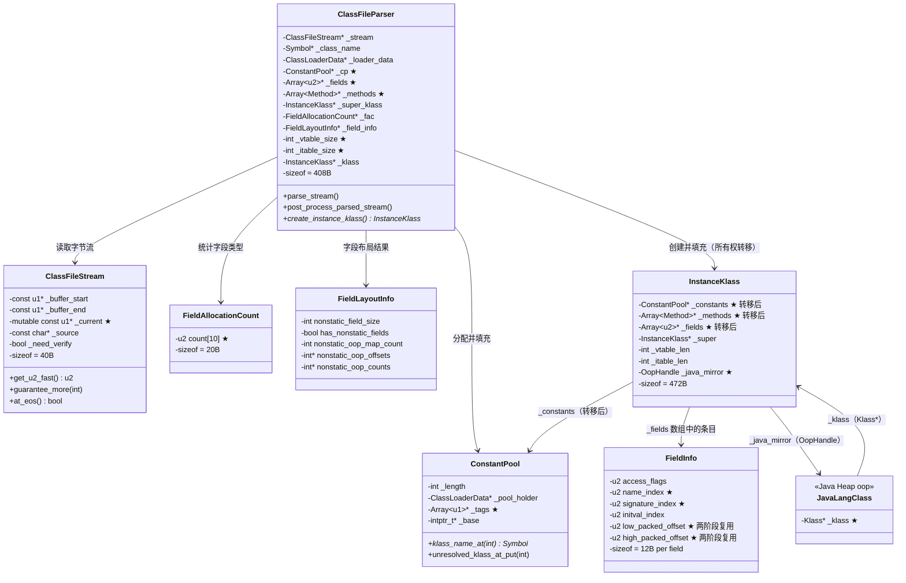

# ClassFileParser：我以为解析 .class 文件很简单，结果它有 6461 行

> 第一人称学习笔记 · 基于 OpenJDK 11 源码  
> 对应文档：`ClassLoading/classfile_parser.md` · `ClassLoading/ClassFileParser-Expert-Analysis.md`  
> 前置：`08-classloading-HandWritten.md`（类加载全流程）

---

## 第零天：我以为解析 .class 文件就是"按格式读一遍"

刚开始学 ClassFileParser 的时候，我的预期是这样的：

> ".class 文件格式是固定的，JVM 规范里写得清清楚楚，按顺序读一遍就行了，能有多复杂？"

然后我打开 `classFileParser.cpp`，看到了这个：

```
$ wc -l classFileParser.cpp
6461 classFileParser.cpp
```

**6461 行。** 这是整个 HotSpot 源码中最大的单文件之一。

我以为的解析流程：
```
读 magic → 读版本 → 读常量池 → 读字段 → 读方法 → 完事
```

实际的解析流程：
```
读 magic → 读版本 → 常量池两遍扫描（第一遍读原始数据，第二遍做交叉引用验证）
→ 读字段（每个字段还要解析 ConstantValue/Signature/注解等子属性）
→ 读方法（每个方法的 Code 属性里还有 LineNumberTable/LVT/StackMapTable 等子属性）
→ 读类属性（InnerClasses/BootstrapMethods/NestHost/NestMembers...）
→ post_process（递归加载父类！计算 vtable/itable！字段布局优化！）
→ 在 Metaspace 分配 InstanceKlass
→ 所有权转移（不是拷贝，是移动！）
→ 创建 java.lang.Class 镜像
```

这不是"按格式读一遍"，这是一个**三阶段管线处理器**。

---

## 第一天：我踩的第一个坑——构造函数里完成了大部分工作

我以为 ClassFileParser 是这样用的：

```java
// 我以为的用法
ClassFileParser parser = new ClassFileParser(stream);
parser.parseConstantPool();
parser.parseFields();
parser.parseMethods();
InstanceKlass* ik = parser.createKlass();
```

实际上是这样的：

```cpp
// classFileParser.cpp:5876
ClassFileParser::ClassFileParser(ClassFileStream* stream,
                                  Symbol* name,
                                  ClassLoaderData* loader_data,
                                  ...) {
    // 初始化 ~40 个成员字段...

    // ★ 关键：解析在构造函数里完成！
    parse_stream(stream, CHECK);                          // 阶段一
    post_process_parsed_stream(stream, _cp, CHECK);       // 阶段二
}

// 外部调用
InstanceKlass* ik = parser.create_instance_klass(...);   // 阶段三
```

**构造函数就完成了全部解析！** 当 `ClassFileParser` 对象构造完成时，`.class` 文件的所有信息已经被提取到成员字段里了。`create_instance_klass()` 只是把这些信息组装到 `InstanceKlass` 上。

**为什么这样设计？** 构造函数的生命周期等于解析过程的生命周期，析构时自动清理临时数据。如果解析失败（抛异常），C++ 的 RAII 机制保证临时数据被正确清理。

---

## 第一天半：数据结构补课

我第二天看 `parse_stream` 的时候，发现自己对 `ClassFileStream`、`FieldInfo`、`FieldAllocationCount` 完全没概念，回来补课。

### ClassFileStream（字节流读取层）

```cpp
// classFileStream.hpp:40
class ClassFileStream: public ResourceObj {
  const u1* const _buffer_start;  // ★ 缓冲区起始地址（不变）
  const u1* const _buffer_end;    // ★ 缓冲区末尾+1（边界检查用）
  mutable const u1* _current;     // ★ 当前读取位置（随解析推进）
  const char* const _source;      // 来源描述（文件路径，用于错误信息）
  bool _need_verify;              // 是否需要格式验证
};
```

**sizeof(ClassFileStream)**：4 个指针（8B×4=32B）+ 1 个 bool（1B）+ 对齐填充（7B）= **40 字节**

**关键字段生命周期**：
- `_current`：初始指向 `_buffer_start`；每次 `get_u1/u2/u4_fast()` 后向后移动；`at_eos()` 检查 `_current == _buffer_end`
- `_buffer_start/_buffer_end`：构造时设置，整个解析过程不变

**两种读取模式**：

```cpp
// 安全模式：每次读取前检查边界
u2 get_u2(TRAPS);

// 快速模式：不检查，由调用者预先保证
u2 get_u2_fast() const {
    u2 res = Bytes::get_Java_u2((address)_current);  // 大端序读取
    _current += 2;
    return res;
}
```

**批量预检查模式**（ClassFileParser 大量使用的优化）：

```cpp
// 一次检查 8 字节，然后连续用 fast 方法读取
stream->guarantee_more(8, CHECK);
const u4 magic = stream->get_u4_fast();
_minor_version = stream->get_u2_fast();
_major_version = stream->get_u2_fast();
```

**我当时的惊讶**：常量池解析时，`ClassFileStream` 被拷贝到栈上的局部变量，让 `_current` 可以被编译器分配到寄存器（标量替换优化）：

```cpp
// classFileParser.cpp:139-140
const ClassFileStream cfs1 = *stream;  // ★ 栈上拷贝！
const ClassFileStream* const cfs = &cfs1;
```

这是一个很精妙的性能优化——常量池解析是整个解析过程中最密集的循环，把游标放到寄存器里能显著提速。

### FieldInfo（字段信息编码）

每个字段用 **6 个 u2 槽位**（12 字节）编码：

```cpp
// fieldInfo.hpp:60
// [0] access_flags      — 访问修饰符 + HotSpot 扩展标志
// [1] name_index        — ★ 字段名在 CP 中的索引
// [2] signature_index   — ★ 类型描述符在 CP 中的索引（"I"、"Ljava/lang/String;"）
// [3] initval_index     — ConstantValue 属性的 CP 索引（static final 字段的初始值）
// [4] low_packed_offset — ★ 解析阶段存 FieldAllocationType；布局后存偏移低 16 位
// [5] high_packed_offset— ★ 解析阶段存 0；布局后存偏移高 16 位
```

**sizeof(FieldInfo)**：6 × 2 = **12 字节**

**关键字段生命周期**：
- `[4][5]`（packed_offset）：**两阶段复用**！`parse_fields` 时存 `FieldAllocationType`（枚举值，标识字段类型）；`layout_fields` 完成后被真实内存偏移覆盖。同一块内存，两种用途。
- `[3]`（initval_index）：只有 `static final` 字段才非零；`fill_instance_klass` 时用于初始化静态字段的初始值

### FieldAllocationCount（字段类型计数器）

```cpp
// ClassFileParser 内部类
class FieldAllocationCount {
  u2 count[MAX_FIELD_ALLOCATION_TYPE];  // 10 个计数器
  // STATIC_OOP=0, STATIC_BYTE=1, STATIC_SHORT=2, STATIC_WORD=3, STATIC_DOUBLE=4
  // NONSTATIC_OOP=5, NONSTATIC_BYTE=6, NONSTATIC_SHORT=7, NONSTATIC_WORD=8, NONSTATIC_DOUBLE=9
};
```

**sizeof(FieldAllocationCount)**：10 × 2 = **20 字节**

**为什么需要这个？** `layout_fields()` 需要知道各类型字段的数量才能计算内存布局。`parse_fields` 时每解析一个字段就调用 `fac->update(is_static, type)` 递增对应计数，`layout_fields` 读取这些计数计算各类型字段区域的起始偏移量。

### ClassFileParser 自身（约 40 个成员字段）

```cpp
// classFileParser.hpp（关键字段）
class ClassFileParser {
  ClassFileStream* _stream;           // 字节流
  Symbol* _class_name;                // 类名
  ClassLoaderData* _loader_data;      // 所属 ClassLoader
  ConstantPool* _cp;                  // ★ 常量池（解析后转移给 InstanceKlass）
  Array<u2>* _fields;                 // ★ 字段数组（解析后转移）
  Array<Method*>* _methods;           // ★ 方法数组（解析后转移）
  InstanceKlass* _super_klass;        // 父类（post_process 时解析）
  FieldAllocationCount* _fac;         // 字段类型计数器
  FieldLayoutInfo* _field_info;       // 字段布局结果
  int _vtable_size;                   // vtable 大小（post_process 计算）
  int _itable_size;                   // itable 大小（post_process 计算）
  InstanceKlass* _klass;              // 最终产物
  InstanceKlass* _klass_to_deallocate;// 异常时需要清理的 klass
  bool _need_verify;                  // 是否需要格式验证
  // ... 还有约 30 个字段 ...
};
```

**sizeof(ClassFileParser)**：约 **408 字节**（GDB 验证）

---

## 第二天：三阶段管线——我以为是一条流水线，结果有三个独立阶段

### 阶段一：parse_stream()——顺序解析字节流

`parse_stream()` 严格按照 JVM Spec §4.1 的 `ClassFile` 结构顺序解析，共 11 个步骤：

```
Step 1: Magic Number (0xCAFEBABE)
Step 2: 版本号 (minor_version + major_version)
Step 3: 常量池 (两遍扫描，详见下节)
Step 4: 访问标志 (access_flags)
Step 5: this_class / super_class (只读索引，不触发加载！)
Step 6: 接口列表 (parse_interfaces)
Step 7: 字段 (parse_fields)
Step 8: 方法 (parse_methods)
Step 9: 类属性 (parse_classfile_attributes)
Step 10: 合并注解 (create_combined_annotations)
Step 11: 验证 EOF (stream->at_eos())
```

**我当时的第一个惊讶**：Step 5 读取 `super_class` 时，只是读了一个常量池索引（u2），**没有触发父类的加载**！父类的真正解析推迟到阶段二的 `post_process_parsed_stream`。

**为什么要延迟？** 父类解析会触发父类的类加载（递归），必须等当前类的格式校验完成后才能安全触发。如果格式校验失败，父类不应该被加载（避免污染加载状态）。

### 阶段二：post_process_parsed_stream()——后处理

这是我最没想到的阶段，它做了 6 件事：

```cpp
// classFileParser.cpp:6318
post_process_parsed_stream()
│
├── (1) java.lang.Object 特殊检查（Object 不能实现任何接口）
│
├── (2) ★ 解析父类（递归触发父类加载！）
│   SystemDictionary::resolve_super_or_fail()
│   验证：父类不能是接口，不能是 final
│
├── (3) 计算传递性接口集合
│   compute_transitive_interfaces()
│   合并父类和本类直接实现的所有接口
│
├── (4) ★ 方法排序 + vtable/itable 大小计算
│   sort_methods() → _method_ordering
│   klassVtable::compute_vtable_size_and_num_mirandas()
│   klassItable::compute_itable_size()
│
├── (5) ★ 字段布局算法
│   layout_fields() ← 最复杂的算法（详见第四天）
│
└── (6) 确定引用类型（REF_NONE / REF_SOFT / REF_WEAK / ...）
```

**我当时的第二个惊讶**：vtable 和 itable 的大小在这里计算！我以为 vtable 是在 InstanceKlass 创建后才构建的，结果大小在 `post_process` 阶段就确定了，这样 `allocate_instance_klass` 才能知道要分配多大的内存（InstanceKlass 的可变部分包含 vtable + itable）。

### 阶段三：create_instance_klass() + fill_instance_klass()——组装

```cpp
// classFileParser.cpp:5567
InstanceKlass* ClassFileParser::create_instance_klass(bool changed_by_loadhook, TRAPS) {
    if (_klass != NULL) return _klass;  // 防止重复调用

    // ★ 在 Metaspace 中分配 InstanceKlass（大小已在阶段二确定）
    InstanceKlass* const ik = InstanceKlass::allocate_instance_klass(*this, CHECK_NULL);

    // ★ 将所有解析数据转移到 InstanceKlass
    fill_instance_klass(ik, changed_by_loadhook, CHECK_NULL);

    return ik;
}
```

---

## 第三天：常量池两遍扫描——我以为读一遍就够了

常量池解析是整个 `parse_stream()` 中最复杂的部分，采用**两遍扫描**策略。

### 为什么需要两遍？

因为常量池条目存在**前向引用**：

```
CP[1] = CONSTANT_Class { name_index = 5 }   ← 引用了 CP[5]
CP[2] = CONSTANT_Methodref { class_index = 1, nat_index = 3 }
CP[3] = CONSTANT_NameAndType { name_index = 6, sig_index = 7 }
...
CP[5] = CONSTANT_Utf8 { "com/example/Foo" }  ← 被 CP[1] 引用，但在后面
```

第一遍只能读原始数据（因为 CP[5] 还没读到，无法验证 CP[1] 的引用是否合法）。第二遍所有条目都已就绪，才能做交叉引用验证。

### 第一遍：parse_constant_pool_entries()——原始读取

```cpp
// classFileParser.cpp:127-376
// 18 种 CP 标签，每种读取不同长度的数据：
tag=7  (Class)             → 2 bytes: name_index
tag=9  (Fieldref)          → 4 bytes: class_idx + nat_idx
tag=10 (Methodref)         → 4 bytes: class_idx + nat_idx
tag=11 (InterfaceMethodref)→ 4 bytes: class_idx + nat_idx
tag=8  (String)            → 2 bytes: string_index
tag=3  (Integer)           → 4 bytes: value
tag=4  (Float)             → 4 bytes: value
tag=5  (Long)              → 8 bytes: value（★ 占 2 个 slot！）
tag=6  (Double)            → 8 bytes: value（★ 占 2 个 slot！）
tag=12 (NameAndType)       → 4 bytes: name_idx + sig_idx
tag=1  (Utf8)              → 2+N bytes: length + bytes
tag=15 (MethodHandle)      → 3 bytes: ref_kind + method_idx
tag=16 (MethodType)        → 2 bytes: signature_index
tag=17 (Dynamic)           → 4 bytes: bsm_idx + nat_idx
tag=18 (InvokeDynamic)     → 4 bytes: bsm_idx + nat_idx
```

**我踩的坑**：Long 和 Double 占 **2 个 slot**！这是 JVM 规范的历史遗留设计——早期 JVM 用两个 32 位槽位存储 64 位值。所以如果 CP[5] 是 Long，那么 CP[6] 是无效的（不能被引用）。

**Utf8 批量创建 Symbol 的优化**：

```cpp
// classFileParser.cpp:314-332
// 不是逐条创建 Symbol，而是批量策略：
// 1. 先查 SymbolTable（lookup_only，无锁）
// 2. 找不到则缓存到本地数组
// 3. 缓存满 8 条时，一次性 SymbolTable::new_symbols() 批量创建
// 4. 循环结束后处理剩余缓存
if (result == NULL) {
    names[names_count] = (const char*)utf8_buffer;
    lengths[names_count] = utf8_length;
    indices[names_count] = index;
    hashValues[names_count++] = hash;
    if (names_count == SymbolTable::symbol_alloc_batch_size) {
        SymbolTable::new_symbols(/* batch create */);
        names_count = 0;
    }
}
```

**为什么批量？** 减少 SymbolTable 锁的获取次数，提升并发类加载的吞吐。

### 第二遍：parse_constant_pool()——交叉引用验证

第二遍有三个子阶段：

**（1）索引合法性交叉验证**：验证每个引用指向正确类型的条目，同时完成关键转换：

```cpp
// classFileParser.cpp:486-492
case JVM_CONSTANT_ClassIndex: {
    const int class_index = cp->klass_index_at(index);
    check_property(valid_symbol_at(class_index), ...);
    // ★ ClassIndex → UnresolvedClass（标记为"待解析"）
    cp->unresolved_klass_at_put(index, class_index, num_klasses++);
    break;
}
```

**（2）分配 resolved_klasses 数组**：为后续类解析预分配空间。

**（3）字符串格式验证**（仅当 `_need_verify` 时）：验证类名、字段名、方法名、签名的格式合法性。

---

## 第三天半：方法解析——parse_method() 有 600 行

`parse_method()` 是 ClassFileParser 中单个函数最长的方法（约 600 行），因为 `method_info` 结构包含大量子属性。

### Code 属性是最复杂的子结构

```
Code_attribute {
    u2 max_stack;
    u2 max_locals;
    u4 code_length;
    u1 code[code_length];          ← 字节码本体
    u2 exception_table_length;
    { u2 start_pc, end_pc, handler_pc, catch_type; } exception_table[];
    u2 attributes_count;
    attribute_info attributes[];   ← LineNumberTable, LVT, StackMapTable
}
```

**我当时的第三个惊讶**：字节码本体在解析阶段**不做拷贝**！只记录 `code_start` 指针，稍后创建 `Method` 对象时才通过 `m->set_code((u1*)code_start)` 拷贝。这是为了避免在解析阶段就分配 Method 对象（可能解析失败，白白分配了内存）。

### 两个特殊方法检测

解析完每个方法后，会检查两个关键方法：

```cpp
// 1. finalize()V：如果方法体非空，设置 _has_finalizer = true
//    → 影响对象分配时是否需要调用 Finalizer.register()
if (name == vmSymbols::finalize_method_name() &&
    signature == vmSymbols::void_method_signature()) {
    if (m->is_empty_method()) {
        _has_empty_finalizer = true;
    } else {
        _has_finalizer = true;
    }
}

// 2. <init>()V：如果是 vanilla constructor，设置 _has_vanilla_constructor = true
//    → 允许子类对象分配时跳过某些检查
```

**我踩的坑**：`_has_finalizer` 直接影响对象分配路径！如果一个类有非空的 `finalize()` 方法，每次 `new` 这个类的对象时，JVM 都会调用 `Finalizer.register(obj)` 把对象注册到 Finalizer 队列。这是 `finalize()` 方法导致 GC 压力的根本原因。

### StackMapTable——Java 6+ 的验证器数据

Java 6+ 的类文件必须携带 StackMapTable 属性，供 split verifier 使用。解析时**只做格式检查和原始数据拷贝**，不做深入分析——真正的类型推断在 Verifier 中完成。

---

## 第四天：字段布局算法——我以为字段就是按声明顺序排列的

这是我最没想到的部分。我以为字段在内存中就是按 Java 代码里的声明顺序排列的，结果完全不是。

### 三种分配风格

由 `-XX:FieldsAllocationStyle` 控制（默认值为 **1**）：

| 风格 | 顺序 | 说明 |
|------|------|------|
| **0** | oops → longs → ints → shorts → bytes | OOP 优先 |
| **1**（默认）| longs → ints → shorts → bytes → oops | **长类型优先** |
| **2** | 自适应 | 如果父类尾部是 oop，则 oop 优先；否则退化为风格 1 |

**为什么 long/double 优先？** 因为 long/double 需要 8 字节对齐，排最前面自然满足对齐要求，不需要额外的 padding。

### CompactFields——利用对齐间隙

当 `-XX:+CompactFields`（默认开启）时，long/double 对齐产生的间隙会被小字段填充：

```
假设对象头后 offset=12（对象头 = MarkWord 8B + Klass* 4B 压缩）
long 字段需要 8 字节对齐 → 下一个 long 位置 = 16
产生 4 字节间隙 [12, 16)

填充优先级：
1. int (4 bytes) — 最多填 1 个
2. short/char (2 bytes) — 尽量填满
3. byte/boolean (1 byte) — 尽量填满
4. oop (4 bytes, 压缩指针) — 仅当 allocation_style != 0 时
```

**实际布局示例**（Style 1 + CompactFields）：

```
偏移  0: [MarkWord 8B]
偏移  8: [Klass* 4B 压缩]
偏移 12: [int 字段]        ← ★ 填充到 long 对齐间隙中！
偏移 16: [long 字段]       ← 8 字节对齐
偏移 24: [long 字段]
偏移 32: [int 字段]
偏移 36: [short 字段]
偏移 38: [byte 字段]
偏移 39: [padding 1 byte]  ← oop 对齐
偏移 40: [oop 字段]        ← 4 字节对齐（压缩指针）
偏移 44: [oop 字段]
偏移 48: 对象结束           ← 8 字节对齐
```

**我踩的坑**：Java 代码里声明的字段顺序和内存中的顺序**完全不同**！如果你用 `Unsafe.objectFieldOffset()` 获取字段偏移，会发现顺序被重排了。

### 特殊类强制使用 Style 0

某些核心类（String、Class、Reference 等）因为 HotSpot 硬编码了字段偏移，必须使用固定的布局风格：

```cpp
// classFileParser.cpp:4042-4061
if ((allocation_style != 0 || compact_fields) && _loader_data->class_loader() == NULL &&
    (_class_name == vmSymbols::java_lang_String() ||
     _class_name == vmSymbols::java_lang_Class() || ...)) {
    allocation_style = 0;
    compact_fields = false;
}
```

### @Contended——独占缓存行

`@Contended` 注解用于避免伪共享，在 `layout_fields()` 中的处理逻辑：

```
普通字段排列完毕后：

   ... 普通字段 ...
   +128 bytes padding
   [contended field A, group=0]
   +128 bytes padding
   [contended field B, group=0]
   +128 bytes padding
   [contended field C, group=1]
   [contended field D, group=1]  ← 同组内连续
   +128 bytes padding
```

**我当时的第四个惊讶**：`@Contended` 的 padding 是 **128 字节**（两个缓存行），不是 64 字节。因为 Intel 的 spatial prefetcher 会预取相邻缓存行，所以需要两个缓存行的间隔才能真正避免伪共享。

### OOP Map 生成

在分配 oop 字段偏移的同时，`layout_fields()` 构建 oop-map 列表，供 GC 扫描对象时使用：

```cpp
// 连续的 oop 字段合并到同一个 map block
if (nonstatic_oop_map_count > 0 &&
    nonstatic_oop_offsets[last] == real_offset - int(nonstatic_oop_counts[last]) * heapOopSize) {
    nonstatic_oop_counts[last] += 1;  // 连续，合并
} else {
    nonstatic_oop_offsets[new] = real_offset;  // 不连续，新建
    nonstatic_oop_counts[new] = 1;
    nonstatic_oop_map_count += 1;
}
```

---

## 第四天半：fill_instance_klass()——所有权转移，不是拷贝

`fill_instance_klass()` 约 220 行，最关键的一步是**所有权转移**：

```cpp
// classFileParser.cpp:5595
fill_instance_klass()
│
├── 基础设置（set_class_loader_data, set_name, add_class）
│
├── ★ 所有权转移（关键步骤！）
│   apply_parsed_class_metadata(ik, _java_fields_count)
│   ├── ik->set_constants(_cp);      _cp = NULL;      ← 不是拷贝，是移动！
│   ├── ik->set_fields(_fields);     _fields = NULL;
│   ├── ik->set_methods(_methods);   _methods = NULL;
│   └── ... 其他元数据转移 ...
│   ★ 从此刻起 parser 的字段已被清空，不能再使用
│
├── 继承体系初始化
│   initialize_supers()  — 填充 _primary_supers[], _super_check_offset
│   set_transitive_interfaces()
│   klassItable::setup_itable_offset_table()
│
├── OOP Map 填充（fill_oop_maps）
│
├── 预计算标志（set_precomputed_flags）
│   has_finalizer, layout_helper 等
│
├── 访问检查
│   check_super_class_access()
│   check_super_interface_access()
│   check_final_method_override()
│
└── ★ 创建 java.lang.Class 镜像
    java_lang_Class::create_mirror()
    ← 在 Java 堆上创建 oop，与 Metaspace 中的 InstanceKlass 互指
```

**为什么是移动而不是拷贝？** 避免深拷贝的内存分配和拷贝开销。`_cp`、`_fields`、`_methods` 都是在 Metaspace 中分配的，直接把指针赋给 InstanceKlass，然后把 parser 中的指针置 NULL。

**异常安全保证**：如果 `fill_instance_klass()` 中途抛出异常，通过 `_klass_to_deallocate` 机制确保 InstanceKlass 的析构函数会正确清理已转移的元数据。如果一切正常，最后调用 `set_klass_to_deallocate(NULL)` 取消清理标记。

**我当时的第五个惊讶**：`create_mirror()` 在 **Java 堆**上创建了 `java.lang.Class` 对象！这是 ClassFileParser 中唯一一步在 Java 堆上分配内存的操作。InstanceKlass 在 Metaspace，Class 对象在 Java 堆，两者通过 `_java_mirror`（OopHandle）和 `_klass`（Klass*）互相引用。

---

## 第五天：插桩验证——我的猜测被打脸了

在看源码之前，我对 ClassFileParser 有这些猜测：

| 猜测 | 实测 | 打脸程度 |
|------|------|---------|\
| classFileParser.cpp 大概 1000 行 | **6461 行** | 差了 6 倍 |
| 字段按声明顺序排列 | **按类型分组排列（Style 1）** | 完全错了 |
| sizeof(ClassFileParser) ≈ 100B | **约 408 字节** | 差了 4 倍 |
| 常量池一遍扫描就够了 | **两遍扫描（前向引用问题）** | 完全错了 |
| 字节码在解析时就拷贝 | **只记录指针，创建 Method 时才拷贝** | 错了 |
| @Contended padding = 64B（一个缓存行）| **128 字节（两个缓存行）** | 错了 |
| 父类在 parse_stream 时就加载 | **延迟到 post_process_parsed_stream** | 错了 |

**最让我意外的发现**：

`layout_fields()` 有 **520 行**，是 ClassFileParser 中第二长的函数（第一是 `parse_method()` 的 600 行）。字段布局算法比我想象的复杂得多——要处理对齐、间隙填充、@Contended、OOP Map 生成，还要特殊处理核心类。

---

## ClassFileParser 完整流程图

```mermaid
flowchart TD
    A["KlassFactory::create_from_stream()\nklassFactory.cpp:166"] --> B["ClassFileParser 构造函数\nclassFileParser.cpp:5876"]

    B --> C["阶段一：parse_stream()\n顺序解析 .class 字节流"]

    C --> C1["Step 1-2: magic + 版本号\n0xCAFEBABE + [45.0, 55.0]"]
    C1 --> C2["Step 3: 常量池两遍扫描\n第一遍：原始读取（18种tag）\n第二遍：交叉引用验证"]
    C2 --> C3["Step 4-5: 访问标志 + this/super\n★ super_class 只读索引，不触发加载！"]
    C3 --> C4["Step 6-8: 接口 + 字段 + 方法\nparse_fields() / parse_methods()"]
    C4 --> C5["Step 9-11: 类属性 + 注解 + EOF验证\nBootstrapMethods / NestHost / NestMembers"]

    C5 --> D["阶段二：post_process_parsed_stream()\nclassFileParser.cpp:6318"]

    D --> D1["(1) Object 特殊检查"]
    D1 --> D2["(2) ★ 解析父类\nSystemDictionary::resolve_super_or_fail()\n→ 递归触发父类加载！"]
    D2 --> D3["(3) 计算传递性接口集合\ncompute_transitive_interfaces()"]
    D3 --> D4["(4) ★ vtable/itable 大小计算\nklassVtable::compute_vtable_size_and_num_mirandas()\nklassItable::compute_itable_size()"]
    D4 --> D5["(5) ★ 字段布局算法\nlayout_fields()\nStyle 1: long→int→short→byte→oop\nCompactFields: 利用对齐间隙\n@Contended: 128B padding\nOOP Map 生成"]

    D5 --> E["阶段三：create_instance_klass()\nclassFileParser.cpp:5567"]

    E --> E1["InstanceKlass::allocate_instance_klass()\n在 Metaspace 分配\n大小 = 固定部分(472B) + vtable + itable + OopMapBlock"]
    E1 --> E2["fill_instance_klass()\nclassFileParser.cpp:5595"]

    E2 --> E3["★ 所有权转移\napply_parsed_class_metadata()\n_cp/_fields/_methods → InstanceKlass\nparser 对应字段置 NULL"]
    E3 --> E4["继承体系初始化\ninitialize_supers()\nklassItable::setup_itable_offset_table()"]
    E4 --> E5["OOP Map 填充\nfill_oop_maps()"]
    E5 --> E6["访问检查\ncheck_super_class_access()\ncheck_final_method_override()"]
    E6 --> E7["★ 创建 java.lang.Class 镜像\njava_lang_Class::create_mirror()\n在 Java 堆上分配 oop\nInstanceKlass ↔ Class 双向引用"]

    E7 --> F["返回 InstanceKlass*\n→ define_instance_class()\n→ 注册到 SystemDictionary"]

    style D2 fill:#FFD700
    style D4 fill:#FFD700
    style D5 fill:#FFD700
    style E3 fill:#90EE90
    style E7 fill:#90EE90
```



---

## 数据结构关系图



---

## 还没搞懂的地方

**1. StackMapTable 的 split verifier 是怎么工作的？**

我知道 Java 6+ 的类文件必须携带 StackMapTable，ClassFileParser 只做原始数据拷贝，真正的类型推断在 Verifier 中完成。但 split verifier 的具体算法（类型状态机、合并规则）我没有深入看。

**2. Miranda 方法的生成时机**

我知道 `compute_vtable_size_and_num_mirandas()` 会计算 Miranda 方法数量，但 Miranda 方法的实际生成（`_all_mirandas` 列表）是在 `post_process` 阶段还是 `fill_instance_klass` 阶段？生成的 Miranda 方法是真正的 `Method*` 对象还是只是 vtable 槽位？

**3. `layout_fields()` 的 Style 2（自适应）具体逻辑**

我知道 Style 2 会检查父类尾部是否是 oop，但"父类尾部是 oop"的判断条件是什么？是检查父类最后一个字段的类型，还是检查父类的 `_nonstatic_oop_map_count`？

**4. `create_mirror()` 的完整流程**

我知道 `create_mirror()` 在 Java 堆上创建 `java.lang.Class` 对象，但这个对象是怎么初始化的？静态字段的初始值（`initval_index`）是在 `create_mirror()` 时设置的，还是在 `<clinit>` 时设置的？

**5. 版本号验证的 preview 特性处理**

Java 12+ 引入了 preview 特性，类文件的 minor_version 用 `0xFFFF` 标记。`verify_class_version()` 是怎么处理这个特殊值的？preview 类只能在对应版本的 JVM 上运行，这个检查是在哪里做的？

---

## 尾声：我现在怎么理解 ClassFileParser

现在我对 ClassFileParser 的理解是这样的：

**ClassFileParser 是一个三阶段管线处理器，不是简单的格式解析器。**

**阶段一（parse_stream）**：顺序扫描字节流，把 .class 文件的扁平二进制格式转换成 ClassFileParser 的成员字段。常量池需要两遍扫描（前向引用问题）。父类只读索引，不触发加载。

**阶段二（post_process）**：触发父类的递归加载，计算 vtable/itable 大小，执行字段布局优化（Style 1 + CompactFields + @Contended + OOP Map）。这一阶段的输出决定了 InstanceKlass 的内存大小。

**阶段三（create_instance_klass + fill_instance_klass）**：在 Metaspace 分配 InstanceKlass，通过所有权转移（不是拷贝）把解析数据转移过去，最后在 Java 堆上创建 `java.lang.Class` 镜像，建立双向引用。

**整个设计的核心思想**：**延迟**（父类加载延迟到 post_process）+ **批量**（Symbol 批量创建）+ **移动语义**（所有权转移而非拷贝）+ **两阶段复用**（FieldInfo 的 packed_offset 字段）。

6461 行代码，每一行都有它的理由。
