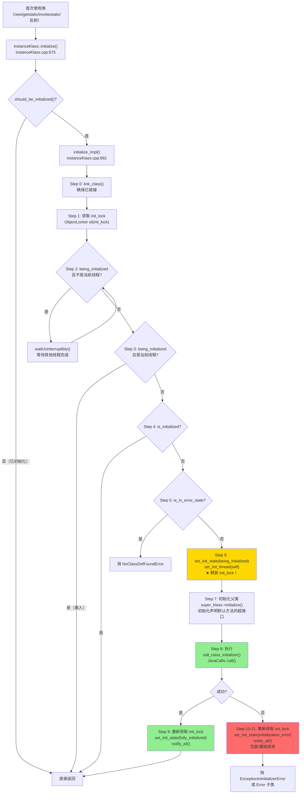
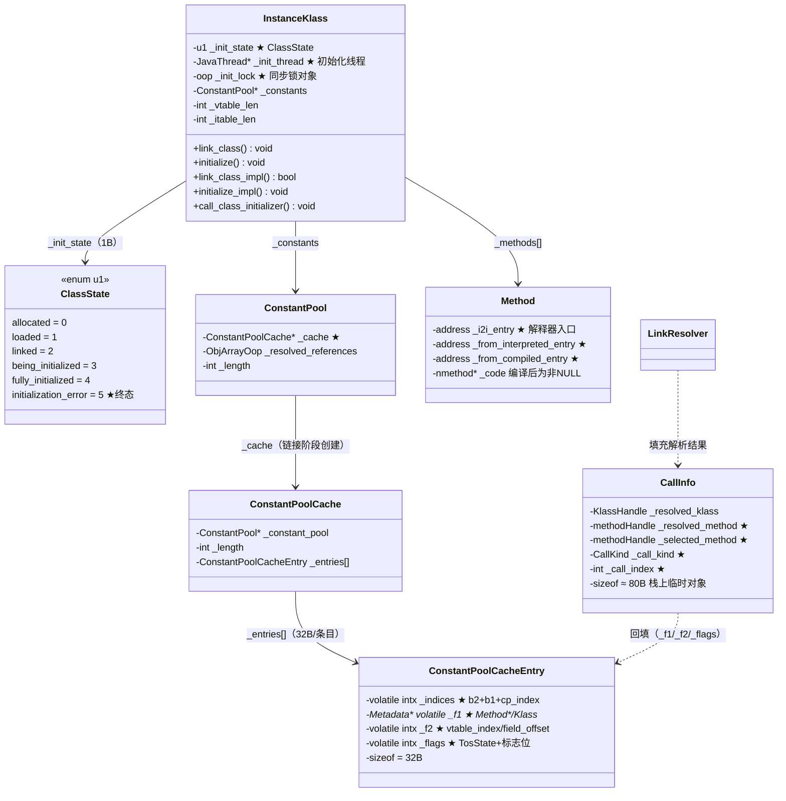

# 链接与初始化：我以为 new 一下就完事了，结果中间有 11 步协议

> 第一人称学习笔记 · 基于 OpenJDK 11 源码  
> 对应文档：`ClassLoading/class_linking_initialization.md`  
> 前置：`09-classfileparser-HandWritten.md`（ClassFileParser 解析流程）

---

## 第零天：我以为类加载就三步——加载、链接、初始化，很简单

刚开始学类加载的时候，我的理解是这样的：

> "类加载分三步：加载（把 .class 读进来）、链接（验证一下）、初始化（执行 static 块）。很简单，背下来就行了。"

然后我打开 `instanceKlass.cpp`，找到 `initialize_impl()`，看到了这个：

```cpp
// instanceKlass.cpp:892
void InstanceKlass::initialize_impl(TRAPS) {
    // Step 1: 确保已链接
    // Step 2: 获取 init_lock
    // Step 3: 等待其他线程完成初始化（wait 循环！）
    // Step 4: 重入检测
    // Step 5: 已初始化检测
    // Step 6: 错误状态检测
    // Step 7: 标记为 being_initialized
    // Step 8: 初始化父类 + 超接口
    // Step 9: 执行 <clinit>
    // Step 10: 成功 → fully_initialized + notify_all
    // Step 11: 失败 → initialization_error + notify_all
```

**11 步。** 光是初始化就有 11 步，还不算链接的 8 步。

我以为的类加载：
```
加载 → 链接 → 初始化 → 完事
```

实际的类加载：
```
ClassFileParser（3阶段管线）
    ↓
link_class_impl（8步：递归链接父类/接口 → 验证 → 重写 → 方法链接 → vtable → itable → 设状态）
    ↓
initialize_impl（11步：获锁 → 等待 → 重入检测 → 已初始化检测 → 错误检测 → 标记 → 初始化父类 → 执行<clinit> → 成功/失败处理）
```

这不是"三步"，这是一个**状态机驱动的并发协议**。

---

## 第一天：我踩的第一个坑——链接和初始化为什么要分开？

我最开始不理解为什么要把链接和初始化分成两个阶段。我以为：

> "既然都是类加载的一部分，为什么不合并成一步？"

然后我想了一个场景：

```java
class A {
    static B b = new B();  // A 的 <clinit> 引用了 B
}

class B {
    static A a = new A();  // B 的 <clinit> 引用了 A
}
```

如果链接和初始化是一步，那么：
1. 加载 A → 立刻执行 `<clinit>` → 需要 B → 加载 B → 立刻执行 `<clinit>` → 需要 A → A 正在初始化 → **死锁**

但实际上这段代码不会死锁，因为 JVM 有**重入检测**（Step 4）：

```cpp
// instanceKlass.cpp:921
if (is_being_initialized() && is_reentrant_initialization(self)) {
    return;  // ★ 当前线程正在初始化这个类，允许递归返回
}
```

当 A 的 `<clinit>` 触发 B 的初始化，B 的 `<clinit>` 再次触发 A 的初始化时，JVM 检测到"当前线程已经在初始化 A"，直接返回——A 此时是**部分初始化**状态（`being_initialized`），但允许继续。

**这就是为什么链接和初始化要分开的根本原因：**

- **链接**：只修改 C++ 元数据（验证字节码、创建 CPCache、填充 vtable/itable），无副作用，可以安全递归
- **初始化**：执行 Java 代码（`<clinit>`），有副作用，需要精确的并发协议

如果合并，循环依赖的类会死锁。分开后，链接可以安全地递归完成，初始化有专门的重入检测处理循环依赖。

---

## 第一天半：数据结构补课

我第二天看 `initialize_impl()` 的时候，发现自己对 `ClassState`、`ConstantPoolCacheEntry`、`CallInfo` 完全没概念，回来补课。

### ClassState（6 个状态，1 字节）

```cpp
// instanceKlass.hpp:133
enum ClassState {
    allocated,              // 刚 allocate，字段全零
    loaded,                 // ClassFileParser 完成
    linked,                 // 验证+重写+链接方法+vtable/itable 完成
    being_initialized,      // <clinit> 正在执行中
    fully_initialized,      // <clinit> 成功完成
    initialization_error    // ★ <clinit> 抛异常（终态，不可恢复！）
};
```

**sizeof(ClassState)**：枚举底层是 `u1`（1 字节），存储在 `InstanceKlass::_init_state` 字段中。

**值域图**：

```
allocated(0) → loaded(1) → linked(2) → being_initialized(3) → fully_initialized(4)
                                                ↓
                                        initialization_error(5)  ← 终态，不可恢复
```

**关键字段生命周期**（`_init_state` + `_init_thread`）：

| 谁设置 | 何时设置 | 设置什么值 |
|--------|----------|-----------|
| `fill_instance_klass()` | ClassFileParser 完成后 | `loaded` |
| `link_class_impl()` Step 5f | 链接完成后 | `linked` |
| `initialize_impl()` Step 7 | 获取 init_lock 后 | `being_initialized` + `_init_thread = self` |
| `set_initialization_state_and_notify()` | `<clinit>` 成功后 | `fully_initialized` + `_init_thread = NULL` |
| `set_initialization_state_and_notify()` | `<clinit>` 失败后 | `initialization_error` + `_init_thread = NULL` |

**我当时的第一个惊讶**：`initialization_error` 是**终态**！一旦 `<clinit>` 失败，这个类永远无法使用，后续任何对该类的访问都会抛 `NoClassDefFoundError`。这不是"重试"，是"永久失败"。

### ConstantPoolCacheEntry（32 字节，4 个机器字）

```cpp
// cpCache.hpp:130
class ConstantPoolCacheEntry {
 private:
    volatile intx _indices;   // ★ [b2:8 | b1:8 | cp_index:16]
    Metadata* volatile _f1;   // ★ Method*/Klass*（解析后的元数据指针）
    volatile intx _f2;        // ★ vtable_index / field_offset / Method*
    volatile intx _flags;     // ★ [tos:4|F|M|A|I|f|v|vf|...|psize]
};
```

**sizeof(ConstantPoolCacheEntry)**：4 × 8 = **32 字节**（64 位系统）

**创建位置**：`Rewriter::make_constant_pool_cache()`（`rewriter.cpp:94`），链接阶段创建，初始为**未解析状态**（bytecode 位为零）。

> 注：`ConstantPoolCacheEntry` 类定义在 `cpCache.hpp:132`（不是 130，差了 2 行的 friend 声明）。

**`_indices` 字段编码**：

```
bit 31        24 23        16 15                 0
┌──────────────┬──────────────┬────────────────────┐
│  bytecode_2  │  bytecode_1  │  cp_index          │
└──────────────┴──────────────┴────────────────────┘
```

**解析状态判断**：`bytecode_1` 或 `bytecode_2` 非零 = 已解析。解释器先读 `_indices` 的 bytecode 位——非零则直接读 `_f1/_f2/_flags`，零则进入运行时解析（`InterpreterRuntime::resolve_*`）。

**关键字段生命周期**：

| 字段 | 初始值 | 解析后的值 | 谁填充 |
|------|--------|-----------|--------|
| `_indices.cp_index` | 原始 CP 索引 | 不变 | `Rewriter` |
| `_indices.bytecode_1` | 0（未解析） | 字节码值（如 `getstatic`=178） | `InterpreterRuntime::resolve_*` |
| `_f1` | NULL | `Method*`/`Klass*` | `InterpreterRuntime::resolve_*` |
| `_f2` | 0 | vtable_index / field_offset | `InterpreterRuntime::resolve_*` |
| `_flags` | 0 | TosState + 标志位 + 参数大小 | `InterpreterRuntime::resolve_*` |

**不同调用类型的 `_f1/_f2` 含义**：

| 调用类型 | `_f1` | `_f2` |
|---------|-------|-------|
| `invokestatic` | Method* | — |
| `invokespecial` | Method* | — |
| `invokevirtual` | — | vtable_index |
| `invokevirtual`（final） | — | Method* |
| `invokeinterface` | interface Klass* | itable Method* |
| `getstatic/getfield` | 字段所属 Klass* | 字段偏移（字节） |

**我当时的第二个惊讶**：`invokevirtual` 和 `invokespecial` 可以**共享同一个 CPCache entry**！`invokevirtual` 只使用 `_f2`（通过 bytecode_2 保护），`invokespecial` 只使用 `_f1`（通过 bytecode_1 保护）。这是因为 CP 中的 `Methodref` 可以同时被两种字节码引用。

### CallInfo（约 80 字节，栈上临时对象）

```cpp
// linkResolver.hpp:38
class CallInfo {
 public:
    KlassHandle   _resolved_klass;    // 解析到的类（Methodref 中声明的类）
    methodHandle  _resolved_method;   // ★ 解析到的方法（声明中的方法）
    methodHandle  _selected_method;   // ★ 实际选择的方法（vtable/itable 查找结果）
    CallKind      _call_kind;         // ★ direct_call / vtable_call / itable_call
    int           _call_index;        // ★ vtable/itable 索引
    Handle        _resolved_appendix; // invokedynamic/invokehandle 的附加参数
};
```

**sizeof(CallInfo)**：约 **80 字节**（4 个 Handle/KlassHandle 各 8B + 2 个 methodHandle 各 16B + int + CallKind）

**创建位置**：`InterpreterRuntime::resolve_invoke()` 中在**栈上**创建（`CallInfo info`），作为 `LinkResolver::resolve_invoke()` 的输出参数。

**关键字段生命周期**：
- `_call_kind`/`_call_index`：`LinkResolver::resolve_invoke()` 填充；解释器根据 `_call_kind` 决定如何回填 CPCache entry
- `_selected_method`：`invokevirtual` 时通过 vtable 查找实际实现；`invokeinterface` 时通过 itable 查找
- **生命周期极短**：仅在 `InterpreterRuntime::resolve_invoke()` 调用期间有效，回填 CPCache 后即销毁

---

## 第二天：链接阶段——我以为验证就是"检查一下格式"，结果有 3139 行

### link_class_impl() 的 8 步骨架

```cpp
// instanceKlass.cpp:711
bool InstanceKlass::link_class_impl(bool throw_verifyerror, TRAPS) {
    // Step 1: 快速返回（已链接则直接返回 true）
    if (is_linked()) return true;

    // Step 2: ★ 递归链接父类
    InstanceKlass* super_klass = java_super();
    if (super_klass != NULL) {
        super_klass->link_class_impl(throw_verifyerror, CHECK_false);
    }

    // Step 3: ★ 递归链接所有本地接口
    Array<InstanceKlass*>* interfaces = local_interfaces();
    for (int i = 0; i < interfaces->length(); i++) {
        interfaces->at(i)->link_class_impl(throw_verifyerror, CHECK_false);
    }

    // Step 4: 再次检查（递归过程中可能已被链接）
    if (is_linked()) return true;

    // Step 5: 获取 init_lock，进入临界区
    {
        ObjectLocker ol(init_lock(), THREAD);

        // Step 5a: 字节码验证
        verify_code(throw_verifyerror, CHECK_false);

        // Step 5b: 字节码重写（创建 CPCache）
        rewrite_class(CHECK_false);

        // Step 5c: 方法链接（设置解释器入口点 + i2c/c2i 适配器）
        link_methods(CHECK_false);

        // Step 5d: vtable 初始化
        vtable().initialize_vtable(true, CHECK_false);

        // Step 5e: itable 初始化
        itable().initialize_itable(true, CHECK_false);

        // Step 5f: 设置状态
        set_init_state(linked);
    }

    // Step 6: JVMTI post_class_prepare 通知
    ...
    return true;
}
```

**我当时的第三个惊讶**：Step 2 和 Step 3 在 `init_lock` 临界区**外面**！递归链接父类和接口不需要持有当前类的锁——因为每个类有自己的 `init_lock`，递归链接时各自获取各自的锁。只有 Step 5（验证+重写+方法链接+vtable/itable）才需要持有当前类的锁。

### 字节码验证：Verifier 有 3139 行

`verify_code()` 最终调用 `Verifier::verify()`（`verifier.cpp:140`）。

**Split Verifier 架构**：

```
Verifier::verify(klass, ...)
│
├── 豁免检查（Object/Class/String/Throwable 等引导类跳过）
│
├── major_version >= 50 (Java 6+)?
│     ├── YES → Type-Checking Verifier（C++ 实现，O(n) 线性扫描）
│     │     └── ClassVerifier::verify_class()（verifier.cpp:603）
│     │           └── 遍历所有方法 → verify_method()
│     │                 └── 抽象解释 + StackMapTable 类型检查
│     │
│     └── 失败 && FailOverToOldVerifier && version < 51:
│           └── Type-Inference Verifier（JNI 调用，O(n²~n³)）
│
└── major_version < 50:
      └── 直接使用 Type-Inference Verifier
```

**两种验证器的核心区别**：

| 特性 | Type-Checking（新，Java 6+） | Type-Inference（旧） |
|------|---------------------------|---------------------|
| StackMapTable | **必须提供** | 不需要 |
| 算法复杂度 | O(n) 线性扫描 | O(n²~n³) 数据流迭代 |
| 实现位置 | C++（`ClassVerifier`） | 外部函数（JNI） |

**我踩的坑**：我以为验证就是"检查字节码格式"，结果验证器做的是**抽象解释（Abstract Interpretation）**——模拟每条字节码对操作数栈和局部变量表的影响，在分支目标处与 StackMapTable 中声明的类型帧做兼容性检查。这是一个完整的类型推断系统。

### 字节码重写：Rewriter 把 CP 索引换成 CPCache 索引

`rewrite_class()` 调用 `Rewriter::rewrite()`（`rewriter.cpp:568`）。

**Rewriter 构造函数完成所有工作**（和 ClassFileParser 一样的设计！）：

```
Rewriter 构造函数:
│
├── 1. compute_index_maps()（rewriter.cpp:40）
│     └── 扫描 CP，建立 CP→CPCache 映射
│     └── Fieldref/Methodref/InterfaceMethodref → CPCache entry
│     └── String/MethodHandle/MethodType/Dynamic → resolved_references 数组
│
├── 2. rewrite_bytecodes()
│     └── Object.<init> 特殊处理: _return → _return_register_finalizer
│     └── for each method → scan_method()（rewriter.cpp:370）
│           └── 逐字节码重写：CP index → CPC index（本地字节序）
│
├── 3. make_constant_pool_cache()（rewriter.cpp:94）
│     └── 分配 CPCache，关联到 ConstantPool（双向引用）
│
└── 4. rewrite_jsrs()（如果需要）
      └── JSR/RET 改写（遗留 Java < 1.5 字节码）
```

**重写的核心操作**（以 `invokevirtual` 为例）：

```
原始字节码:  [invokevirtual] [CP_index_high] [CP_index_low]    ← Java 大端 u2
                                    ↓ scan_method() 重写
重写后:      [invokevirtual] [CPC_index_lo]  [CPC_index_hi]    ← 本地字节序 u2
```

**我当时的第四个惊讶**：重写是**原地修改**（in-place modification）！`ConstMethod` 中嵌入的字节码被直接改写，原始字节码丢失。但重写是可逆的——`scan_method(reverse=true)` 可以恢复原始格式（JVMTI 的 `GetBytecodes()` 接口就是这样工作的）。

**`Object.<init>` 的特殊处理**：

```cpp
// rewriter.cpp:522
// Object.<init> 的 _return 被替换为 _return_register_finalizer
// 目的：在构造完成后自动注册 Finalizer（如果子类覆盖了 finalize()）
```

这就是为什么有 `finalize()` 方法的类，每次 `new` 都会有额外开销——`_return_register_finalizer` 字节码会检查是否需要注册 Finalizer。

### 方法链接：Method::link_method() 设置入口点

`link_methods()` 遍历所有方法，对每个方法调用 `Method::link_method()`（`method.cpp:1084`）：

```
Method::link_method(h_method, TRAPS):
│
├── Step 1: 设置解释器入口点
│     └── _i2i_entry = Interpreter::entry_for_method(h_method)
│     └── _from_interpreted_entry = _i2i_entry（未编译时）
│
├── Step 2: 处理 native 方法
│     └── 如果 is_native() && !has_native_function():
│           set_native_function(throw_unsatisfied_link_error_entry)
│           → 调用时抛 UnsatisfiedLinkError（占位符）
│
└── Step 3: 创建 i2c/c2i 适配器
      └── make_adapters(h_method)
            → i2c_entry: 解释器→编译代码（把操作数栈参数搬到寄存器）
            → c2i_entry: 编译代码→解释器（把寄存器参数搬到操作数栈）
```

**为什么需要 i2c/c2i 适配器？** 解释器通过操作数栈传参，编译代码通过寄存器传参。适配器在两者之间做参数搬运。相同签名的方法共享同一个适配器（`AdapterHandlerLibrary` 缓存）。

---

## 第三天：vtable 和 itable——我以为 vtable 就是一个 Map，结果是数组

### vtable：O(1) 虚方法分发

vtable 是 InstanceKlass 内嵌的 `Method*` 数组，`invokevirtual` 的执行：

```
receiver.getClass().vtable[vtable_index]  →  实际要调用的 Method*
```

`initialize_vtable()`（`klassVtable.cpp:167`）的 4 步算法：

```
klassVtable::initialize_vtable():
│
├── Step 1: 引导期特殊处理（Universe::is_bootstrapping() → 全部清零）
│
├── Step 2: ★ 复制父类 vtable
│     └── initialize_from_super(super) → 把父类 vtable 的 Method* 逐个复制
│
├── Step 3: ★ 处理当前类的方法
│     └── for each method:
│           update_inherited_vtable(method, super_vtable_len, ...)
│           → 覆盖父类方法：替换对应槽位（table()[slot] = method）
│           → 新方法：追加到 vtable 末尾
│
└── Step 4: ★ 填充 Miranda 方法
      └── fill_in_mirandas(initialized)
            → 接口中声明但类中未实现的方法，填入 vtable 占位符
```

**`update_inherited_vtable()` 的覆盖判定**（`klassVtable.cpp:368`）：

```
update_inherited_vtable(klass, method, super_vtable_len, ...):
│
├── 跳过条件（不进 vtable）:
│     ├── private 方法
│     ├── static 方法
│     └── <init> 方法
│
├── 在父类 vtable 中查找同名同签名方法:
│     for slot = 0 to super_vtable_len-1:
│       if name+signature 匹配:
│         ├── 访问性检查（包访问 + 不同包 → 不覆盖）
│         └── loader constraint 检查
│         → 覆盖：table()[slot] = method
│         → return false（不需要新条目）
│
└── 未找到匹配 → return true（需要追加新条目）
```

**我当时的第五个惊讶**：vtable index 在**编译时**就确定了！`invokevirtual` 字节码解析时，CPCache entry 的 `_f2` 存储的是 vtable index（一个整数），不是方法名。运行时分发只需要一次数组访问，O(1)。

**Miranda 方法**：如果一个非抽象类实现了接口 I，但没有实现接口方法 `I.foo()`，且父类也没有实现，则需要在 vtable 中插入 Miranda 方法作为占位符。Miranda 方法没有字节码——如果在运行时被分派到，会抛 `AbstractMethodError`。

### itable：接口方法分发，比 vtable 多一步线性扫描

itable 由两部分组成：

```
┌─────────────────────────────────────────┐
│ itableOffsetEntry[0]: Klass*, offset    │  接口 A → itable 方法表的偏移
│ itableOffsetEntry[1]: Klass*, offset    │  接口 B → itable 方法表的偏移
│ ... (NULL terminator)                   │
├─────────────────────────────────────────┤
│ itableMethodEntry[]: Method*            │  接口 A 的方法实现
│ itableMethodEntry[]: Method*            │  接口 B 的方法实现
└─────────────────────────────────────────┘
```

`invokeinterface` 的运行时分发路径：

```
1. 从 CPCache entry 获取 interface Klass* (_f1)
2. 获取接收者对象的实际 Klass
3. ★ 在实际 Klass 的 itable offset 表中线性查找该接口的偏移
4. 用 itable index 在方法表中取 Method*
5. 调用
```

**Step 3 是线性查找**，这就是为什么 `invokeinterface` 通常比 `invokevirtual` 稍慢——多了一次 O(接口数量) 的扫描。

---

## 第四天：初始化阶段——我以为 new 就会触发 `<clinit>`，结果不一定

### 5 种触发初始化的场景（主动使用）

JVM 规范 §5.5 规定，以下 5 种情况触发类初始化：

1. **`new` 一个类的实例**（`new Foo()`）
2. **访问类的静态字段**（`getstatic`/`putstatic`）
3. **调用类的静态方法**（`invokestatic`）
4. **反射调用**（`Class.forName()`、`Method.invoke()` 等）
5. **初始化子类时，先初始化父类**

### 4 种不触发初始化的场景（被动使用）

这是我踩的最大的坑：

| 场景 | 为什么不触发 |
|------|------------|
| `final static int X = 42` | 编译期常量，编译器直接内联，不访问类 |
| `SubClass.PARENT_FIELD` | 访问父类字段，触发父类初始化，不触发子类 |
| `new Foo[10]` | 创建数组，触发数组类初始化，不触发 Foo |
| `Class.forName("Foo", false, loader)` | `initialize=false` 参数，只加载不初始化 |

**`final static int X = 42` 不触发初始化**是最反直觉的。因为编译器把 `X` 的值直接内联到调用方的字节码里了，运行时根本不访问 `Foo.X`，自然不触发 `Foo` 的初始化。

### initialize_impl() 的 11 步协议

```cpp
// instanceKlass.cpp:892
void InstanceKlass::initialize_impl(TRAPS) {
```

**Step 0**：确保已链接

```cpp
link_class(CHECK);  // 如果还没链接，先链接
```

**Step 1**：获取 init_lock

```cpp
Handle h_init_lock(THREAD, init_lock());
ObjectLocker ol(h_init_lock, THREAD, h_init_lock() != NULL);
```

`init_lock` 是 InstanceKlass 上的一个专门的 `java.lang.Object` 实例，用于同步初始化。

**Step 2**：等待其他线程完成初始化

```cpp
while (is_being_initialized() && !is_reentrant_initialization(self)) {
    wait = true;
    ol.waitUninterruptibly(CHECK);  // ★ 不是 wait()，是 waitUninterruptibly()
}
```

**为什么用 `waitUninterruptibly` 而不是 `wait`？** `wait()` 可能抛 `InterruptedException`，但符号解析/链接路径不期望这种异常——会导致意外的 `InterruptedException` 从类加载中抛出。

**Step 3**：重入检测

```cpp
if (is_being_initialized() && is_reentrant_initialization(self)) {
    return;  // ★ 当前线程正在初始化这个类，允许递归返回
}
```

**Step 4**：已初始化检测

```cpp
if (is_initialized()) {
    return;  // 其他线程已完成初始化
}
```

**Step 5**：错误状态检测

```cpp
if (is_in_error_state()) {
    THROW_MSG(vmSymbols::java_lang_NoClassDefFoundError(), message);
}
```

**Step 6**：标记为正在初始化

```cpp
set_init_state(being_initialized);
set_init_thread(self);
// ★ 此后 ObjectLocker 析构，锁被释放！
// ★ <clinit> 执行期间不持有 init_lock！
```

**Step 7**：初始化父类 + 声明默认方法的超接口

```cpp
if (!is_interface()) {
    // 初始化父类
    Klass* super_klass = super();
    if (super_klass != NULL && super_klass->should_be_initialized()) {
        super_klass->initialize(THREAD);
    }
    // 初始化声明了默认方法的超接口（Java 8+）
    if (!HAS_PENDING_EXCEPTION && has_nonstatic_concrete_methods()) {
        initialize_super_interfaces(THREAD);
    }
}
```

**关键细节**：只有**类**会初始化父类，**接口**不会。超接口的初始化仅限于声明了默认方法（`declares_nonstatic_concrete_methods()`）的接口。

**Step 8**：执行 `<clinit>`

```cpp
call_class_initializer(THREAD);
```

`call_class_initializer()`（`instanceKlass.cpp:1313`）：

```cpp
void InstanceKlass::call_class_initializer(TRAPS) {
    methodHandle h_method(THREAD, class_initializer());  // 查找 <clinit>()V
    if (h_method() != NULL) {
        JavaCallArguments args;
        JavaValue result(T_VOID);
        JavaCalls::call(&result, h_method, &args, CHECK);  // 静态调用
    }
    // ★ 如果没有 <clinit>，直接跳过
}
```

**Step 9**：成功完成

```cpp
if (!HAS_PENDING_EXCEPTION) {
    set_initialization_state_and_notify(fully_initialized, CHECK);
}
```

`set_initialization_state_and_notify()` 的实现：

```cpp
void InstanceKlass::set_initialization_state_and_notify(ClassState state, TRAPS) {
    Handle h_init_lock(THREAD, init_lock());
    ObjectLocker ol(h_init_lock, THREAD);  // ★ 重新获取 init_lock
    set_init_thread(NULL);
    set_init_state(state);
    fence_and_clear_init_lock();           // ★ 内存屏障
    ol.notify_all(CHECK);                  // ★ 唤醒所有等待线程
}
```

**Step 10-11**：失败处理

```cpp
else {
    Handle e(THREAD, PENDING_EXCEPTION);
    CLEAR_PENDING_EXCEPTION;
    set_initialization_state_and_notify(initialization_error, THREAD);
    if (e->is_a(SystemDictionary::Error_klass())) {
        THROW_OOP(e());                    // Error 子类直接重抛
    } else {
        THROW_ARG(vmSymbols::java_lang_ExceptionInInitializerError(), ...);
        // 非 Error 异常包装为 ExceptionInInitializerError
    }
}
```

**我当时的第六个惊讶**：`<clinit>` 执行期间**不持有 init_lock**！Step 6 设置 `being_initialized` 后，`ObjectLocker` 析构，锁被释放。`<clinit>` 在无锁状态下执行。Step 9 成功后，`set_initialization_state_and_notify()` 重新获取 init_lock，设置状态，然后 `notify_all`。

**为什么 `<clinit>` 执行期间不持有锁？** 因为 `<clinit>` 可能执行任意 Java 代码（包括 `synchronized`），持有 init_lock 会导致死锁。

---

## 第四天半：运行时符号解析——LinkResolver 不是链接阶段的组件

我一开始以为 `LinkResolver` 是链接阶段（`link_class_impl`）的一部分，结果完全不是。

**LinkResolver 是运行时组件**：CPCache entry 初始为未解析状态，解释器**第一次执行**某个字节码时，进入 `InterpreterRuntime::resolve_invoke()`，最终调用 `LinkResolver` 完成解析，然后把结果回填到 CPCache entry。

**`resolve_invoke()` 统一分派**（`linkResolver.cpp:1611`）：

```cpp
void LinkResolver::resolve_invoke(CallInfo& result, Handle recv,
                                  const constantPoolHandle& pool, int index,
                                  Bytecodes::Code byte, TRAPS) {
    switch (byte) {
        case Bytecodes::_invokestatic:    resolve_invokestatic(...);    break;
        case Bytecodes::_invokespecial:   resolve_invokespecial(...);   break;
        case Bytecodes::_invokevirtual:   resolve_invokevirtual(...);   break;
        case Bytecodes::_invokehandle:    resolve_invokehandle(...);    break;
        case Bytecodes::_invokedynamic:   resolve_invokedynamic(...);   break;
        case Bytecodes::_invokeinterface: resolve_invokeinterface(...); break;
    }
}
```

**`resolve_method()` 的 6 步查找**（`linkResolver.cpp:723`）：

```
resolve_method(link_info, ...):
│
├── Step 1: invokevirtual 不能调接口方法（is_interface() → IncompatibleClassChangeError）
├── Step 2: 检查 CP tag 必须是 Methodref（否则 IncompatibleClassChangeError）
├── Step 3: 在当前类及其超类链中查找（lookup_method_in_klasses）
├── Step 4: 未找到 → 在所有接口中查找（lookup_method_in_interfaces）
│           仍未找到 → 检查 polymorphic 方法（MethodHandle.invoke 等）
├── Step 5: 方法仍未找到 → 抛 NoSuchMethodError
└── Step 6: 访问权限检查 + 加载器约束检查（check_method_accessability + loader constraints）
```

**`getstatic/putstatic` 解析会触发初始化**（`linkResolver.cpp:948`）：

```cpp
// Step 5: 触发字段所属类的初始化
// 对 getstatic/putstatic: resolved_klass->initialize(CHECK)
```

这就是"访问类的静态字段触发初始化"的底层实现——在 `resolve_field()` 的最后一步，调用 `initialize()`。

---

## 第五天：插桩验证——我的猜测被打脸了

在看源码之前，我对链接和初始化有这些猜测：

| 猜测 | 实测 | 打脸程度 |
|------|------|---------|\
| `<clinit>` 执行期间持有 init_lock | **不持有！Step 6 后锁被释放** | 完全错了 |
| `final static int X = 42` 会触发初始化 | **不触发！编译期常量直接内联** | 完全错了 |
| 字节码重写是拷贝一份新的 | **原地修改！原始字节码丢失** | 错了 |
| `invokeinterface` 和 `invokevirtual` 一样快 | **invokeinterface 多一次线性扫描** | 错了 |
| `initialization_error` 可以重试 | **终态！永久失败，抛 NoClassDefFoundError** | 完全错了 |
| 两个线程同时初始化同一个类会报错 | **不报错，一个等待，一个执行** | 错了 |
| `<clinit>` 不存在时会报错 | **直接跳过，不报错** | 错了 |

**最让我意外的发现**：

`initialize_impl()` 的 11 步协议中，Step 6（标记 `being_initialized`）和 Step 9（`set_initialization_state_and_notify`）之间，`<clinit>` 在**无锁状态**下执行。这意味着：

1. 其他线程可以在 Step 2 的 `waitUninterruptibly` 中等待
2. `<clinit>` 可以执行任意 Java 代码，包括 `synchronized`，不会死锁
3. 重入检测（Step 3）通过 `_init_thread == self` 判断，不需要锁

这是一个精心设计的**无锁执行 + 有锁状态管理**的并发协议。

---

## 完整流程图



---

## 数据结构关系图



---

## 还没搞懂的地方

**1. `fence_and_clear_init_lock()` 的内存屏障语义**

`set_initialization_state_and_notify()` 中调用了 `fence_and_clear_init_lock()`，我知道这是一个内存屏障，但具体是什么类型的屏障（StoreStore? StoreLoad?）？在 x86 上是 `mfence` 还是 `lock xchg`？

**2. `initialize_super_interfaces()` 的深度优先顺序**

我知道 `initialize_super_interfaces()` 是深度优先的，但如果一个类实现了多个接口，这些接口的初始化顺序是什么？是按 `local_interfaces()` 数组的顺序，还是有其他规则？

**3. Miranda 方法的 `Method*` 指向哪里**

Miranda 方法是 vtable 中的占位符，但它对应的 `Method*` 是什么？是接口中的抽象方法，还是一个特殊的"抛 AbstractMethodError"的方法？

**4. CPCache entry 的 `release_store` 写入顺序**

我知道 CPCache entry 的写入使用 `OrderAccess::release_store` 语义，但具体是哪个字段最后写入（作为"发布"信号）？是 `_indices.bytecode_1`，还是 `_flags`？

**5. `<clinit>` 的 `JavaCalls::call()` 是怎么从 C++ 跳到 Java 的**

`call_class_initializer()` 最终调用 `JavaCalls::call()`，这是 C++ 调用 Java 方法的通用框架。但 C++ 代码是怎么跳转到 Java 字节码的？是通过 `_i2i_entry` 入口点，还是有其他机制？

---

## 尾声：我现在怎么理解链接和初始化

现在我对链接和初始化的理解是这样的：

**链接（link_class_impl）是"把 InstanceKlass 从数据结构变成可执行的类"**：

- 验证字节码安全性（Type-Checking Verifier，O(n) 抽象解释）
- 重写字节码（CP 索引 → CPCache 索引，原地修改）
- 创建 CPCache（解释器的解析结果表，初始为未解析状态）
- 设置方法入口点（`_i2i_entry` + i2c/c2i 适配器）
- 填充 vtable/itable（复制父类 vtable + 处理覆盖/新增/Miranda）

**初始化（initialize_impl）是"执行 `<clinit>` 完成 Java 层面的类构造"**：

- 严格遵循 JVM 规范 §5.5 的 11 步并发协议
- `<clinit>` 执行期间不持有 init_lock（防死锁）
- 重入检测允许循环依赖（部分初始化状态）
- `initialization_error` 是终态，不可恢复

**整个设计的核心思想**：**分离关注点**（链接 vs 初始化）+ **延迟执行**（CPCache 延迟解析 + `<clinit>` 延迟触发）+ **精确的并发协议**（11 步 + waitUninterruptibly + notify_all）。

链接和初始化分开，不是为了"优雅"，是为了**正确性**——循环依赖的类如果合并处理会死锁，分开后有专门的重入检测协议处理。
