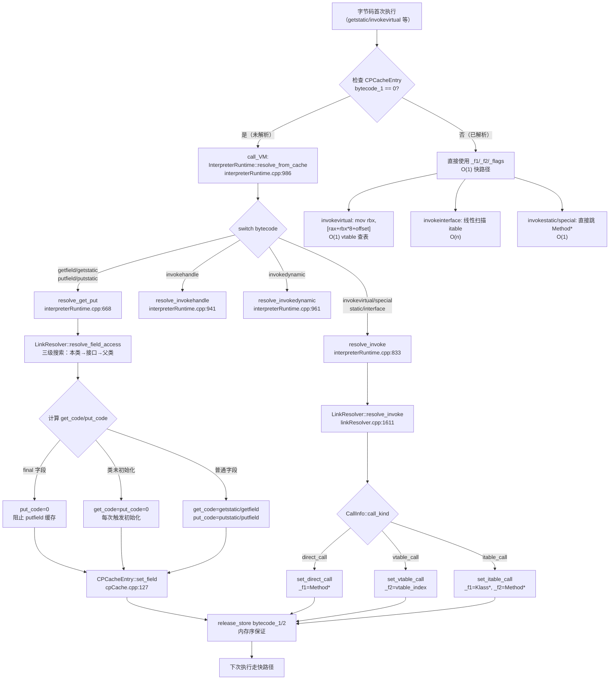
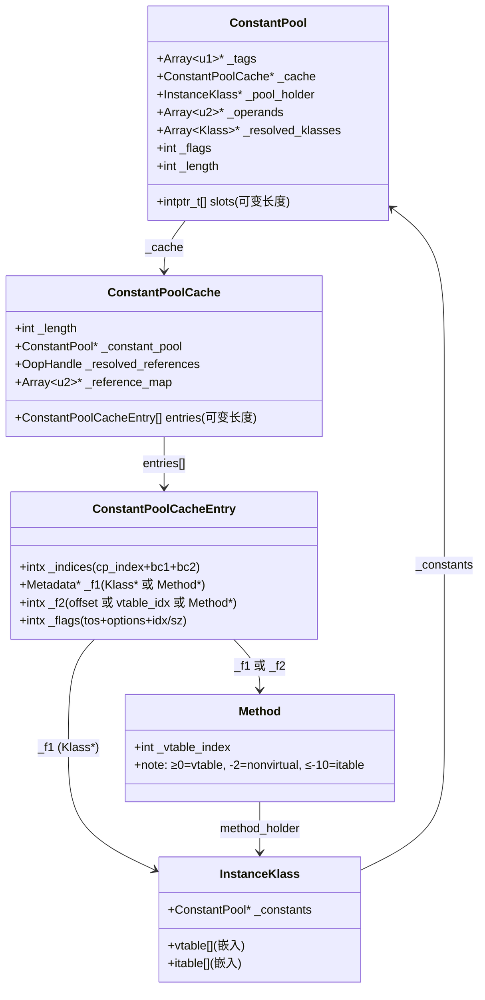

# 11. ConstantPool / 延迟解析 / 运行时解析

> 手写笔记，第一人称，记录我啃这块源码时的真实过程。  
> 参考文档：`../RuntimeResolve/1-Runtime-Resolution-Field-Resolve.md`（字段解析）  
> 参考文档：`../RuntimeResolve/2-Method-Resolution-Invoke-Dispatch.md`（方法解析）  
> 核心源码：`constantPool.hpp:98` `cpCache.hpp:132` `interpreterRuntime.cpp:986`

---

## 第零天：我以为常量池就是一个"字符串数组"

我最开始理解的常量池是这样的：

```
常量池 = ["java/lang/String", "println", "(Ljava/lang/String;)V", ...]
```

就是一个存字符串的数组，类加载时读进来，运行时直接查。

然后我以为"运行时解析"就是：

```
第一次用到 System.out → 查常量池 → 找到 "java/lang/System" → 加载类 → 找到 out 字段 → 完成
```

一次性的，之后就缓存了。

**结果我错了三件事：**

1. 常量池不是字符串数组，是 18 种 tag 的混合结构，Long/Double 还占两个 slot
2. 解析不是"类加载时"发生的，是**字节码首次执行时**才发生（惰性！）
3. 解析结果不存回常量池，存在一个叫 `ConstantPoolCache` 的独立结构里

---

## 第一天：我踩的第一个坑——"解析"到底在哪里发生？

我以为类加载完成后，常量池里的所有符号引用都已经被解析成直接引用了。

然后我去看 `ClassFileParser` 的代码，发现它只是**读取**常量池，根本没有解析。

再去看 `link_class_impl()`，发现 `Rewriter::rewrite()` 创建了 `ConstantPoolCache`，但里面全是空的：

```cpp
// cpCache.cpp:127 — set_field 被调用时才填充
void ConstantPoolCacheEntry::set_field(...) {
    set_f1(field_holder);   // 这时才写入
    set_f2(field_offset);
    ...
}
```

**Rewriter 只是分配了空间，没有填充数据。**

我用 GDB 验证了这一点（数据来自 `../RuntimeResolve/1-Runtime-Resolution-Field-Resolve.md`）：

```
--- CPCacheEntry BEFORE resolution（Main 类 fully_initialized 后、main() 执行前）---
  Entry[0]: _indices=0x00000001, _f1=nil, _f2=0x0, _flags=0x00000000  ← 全空！
  Entry[1]: _indices=0x00000002, _f1=nil, _f2=0x0, _flags=0x00000000  ← 全空！
  Entry[2]: _indices=0x00000004, _f1=nil, _f2=0x0, _flags=0x00000000  ← 全空！
```

三个 Entry 的 `_f1/_f2/_flags` 全部为 0，bytecodes 全部为 0。

**解析发生在字节码首次执行时。** 这就是"惰性解析"。

---

## 第一天半：数据结构补课

我第二天去看解析流程时，发现自己对 `ConstantPool`、`ConstantPoolCache`、`ConstantPoolCacheEntry` 这三个结构完全没概念，回来补课。

### ConstantPool（`constantPool.hpp:98`）

**本质**：Metaspace 中的一块连续内存，固定头部 + 可变长度的 slot 数组。

**固定头部字段（8 个）**：

| 字段 | 类型 | 含义 |
|------|------|------|
| `_tags` | `Array<u1>*` | tag 数组，每个 slot 一个 tag，描述该 slot 存的是什么 |
| `_cache` | `ConstantPoolCache*` | 指向对应的 CPCache（链接阶段创建） |
| `_pool_holder` | `InstanceKlass*` | 拥有这个常量池的类 |
| `_operands` | `Array<u2>*` | InvokeDynamic 节点的变长操作数，通常为空 |
| `_resolved_klasses` | `Array<Klass*>*` | 已解析的 Klass 引用数组 |
| `_flags` | `int` | 4 个标志位（has_preresolution/on_stack/is_shared/has_dynamic_constant） |
| `_length` | `int` | slot 数量 |
| `_saved` | `union{int,int}` | CDS 用的 resolved_reference_length 或版本号 |

**可变部分**：紧跟在固定头部之后，是 `_length` 个 `intptr_t` 大小的 slot。每个 slot 的含义由 `_tags[i]` 决定。

**18 种 tag**（我以为只有几种，结果有 18 种）：

| tag 值 | 常量名 | slot 存的内容 |
|--------|--------|-------------|
| 1 | `JVM_CONSTANT_Utf8` | Symbol* |
| 3 | `JVM_CONSTANT_Integer` | jint |
| 4 | `JVM_CONSTANT_Float` | jfloat |
| 5 | `JVM_CONSTANT_Long` | jlong（**占 2 个 slot！**） |
| 6 | `JVM_CONSTANT_Double` | jdouble（**占 2 个 slot！**） |
| 7 | `JVM_CONSTANT_Class` | 未解析时=Symbol*，解析后=Klass* |
| 8 | `JVM_CONSTANT_String` | 未解析时=Symbol*，解析后=oop（String 对象） |
| 9 | `JVM_CONSTANT_Fieldref` | class_index(高16) + name_and_type_index(低16) |
| 10 | `JVM_CONSTANT_Methodref` | class_index(高16) + name_and_type_index(低16) |
| 11 | `JVM_CONSTANT_InterfaceMethodref` | class_index(高16) + name_and_type_index(低16) |
| 12 | `JVM_CONSTANT_NameAndType` | name_index(高16) + type_index(低16) |
| 15 | `JVM_CONSTANT_MethodHandle` | ref_kind(高8) + ref_index(低16) |
| 16 | `JVM_CONSTANT_MethodType` | descriptor_index |
| 17 | `JVM_CONSTANT_Dynamic` | bootstrap_specifier_index(高16) + name_and_type_index(低16) |
| 18 | `JVM_CONSTANT_InvokeDynamic` | bootstrap_specifier_index(高16) + name_and_type_index(低16) |
| 19 | `JVM_CONSTANT_Module` | name_index |
| 20 | `JVM_CONSTANT_Package` | name_index |
| 100 | `JVM_CONSTANT_UnresolvedClass` | 解析中间状态 |

**我踩的坑**：Long 和 Double 占 2 个 slot，所以常量池的 index 不是连续的！如果 #3 是 Long，那 #4 是 Long 的第二个 slot（不可用），#5 才是下一个有效条目。

**sizeof(ConstantPool)**：固定头部约 64 字节，加上 `_length * 8` 字节的 slot 数组。GDB 验证：`sizeof(ConstantPool) = 64`（不含 slot 数组）。

**创建位置**：`ClassFileParser::parse_constant_pool()`（`classFileParser.cpp:127`），在类文件解析阶段创建，两遍扫描：第一遍读取原始数据，第二遍解析交叉引用。

---

### ConstantPoolCache（`cpCache.hpp:410`）

**本质**：Metaspace 中的独立对象，存储解释器运行时需要的解析结果。

**字段（5 个）**：

| 字段 | 类型 | 含义 |
|------|------|------|
| `_length` | `int` | CPCacheEntry 的数量 |
| `_constant_pool` | `ConstantPool*` | 反向指针，指向对应的 ConstantPool |
| `_resolved_references` | `OopHandle` | 已解析的对象引用（String 常量、invokedynamic 结果等） |
| `_reference_map` | `Array<u2>*` | resolved_references 索引到原始 CP 索引的映射 |
| `_archived_references` | `narrowOop` | CDS 用，通常忽略 |

**CPCacheEntry 数组**：紧跟在固定字段之后，是 `_length` 个 `ConstantPoolCacheEntry`。

**创建位置**：`Rewriter::make_constant_pool_cache()`（`rewriter.cpp:94`），在类链接阶段（`link_class_impl` 调用 `Rewriter::rewrite()`）创建。

**不是所有 CP 条目都有对应的 CPCacheEntry！** 只有 Fieldref、Methodref、InterfaceMethodref、InvokeDynamic 这几种需要运行时解析的条目才有对应的 CPCacheEntry。Utf8、Integer、Class 等不需要。

---

### ConstantPoolCacheEntry（`cpCache.hpp:132`）

**本质**：32 字节，4 个字段，存储一个字段/方法引用的解析结果。

**字段（4 个）**：

```cpp
// cpCache.hpp:132
class ConstantPoolCacheEntry {
  volatile intx     _indices;   // 8 字节：cp_index + bytecode_1 + bytecode_2
  Metadata* volatile _f1;       // 8 字节：字段持有者 Klass* 或 Method*
  intx              _f2;        // 8 字节：字段偏移量 或 vtable/itable 索引
  volatile intx     _flags;     // 8 字节：tos_state + option_bits + field_index/param_size
};
```

**`_indices` 的位布局（32-bit intx）**：

```
┌─────────────┬─────────────┬────────────────────────────┐
│  31  ...  24│  23  ...  16│   15   ...   0             │
├─────────────┼─────────────┼────────────────────────────┤
│ bytecode_2  │ bytecode_1  │     cp_index               │
│  (put_code) │  (get_code) │  (原始 CP 索引)            │
└─────────────┴─────────────┴────────────────────────────┘
```

- `cp_index`（[15:0]）：原始常量池索引，Rewriter 阶段写入，之后不变
- `bytecode_1`（[23:16]）：get 操作字节码，**0 = 未解析**，非 0 = 已解析
- `bytecode_2`（[31:24]）：put 操作字节码，**0 = 未解析或被禁止**

**`_flags` 的位布局（32-bit unsigned）**：

```
┌────────┬──┬──┬──┬──┬──┬──┬──┬──┬──────────────────────┐
│ 31..28 │27│26│25│24│23│22│21│20│19│18│17│16│  15..0   │
├────────┼──┼──┼──┼──┼──┼──┼──┼──┼──┼──┼──┼──┼──────────┤
│ tos    │  │F │M │A │I │f │v │vf│rf│  │  │  │ idx/sz   │
└────────┴──┴──┴──┴──┴──┴──┴──┴──┴──┴──┴──┴──┴──────────┘
```

| 位 | 含义 |
|----|------|
| [31:28] | `tos_state`：字段类型/方法返回类型（8=atos/对象引用，9=vtos/void，4=itos/int...） |
| [26] | `is_field_entry`：1=字段条目，0=方法条目 |
| [22] | `is_final`：字段/方法是否 final |
| [21] | `is_volatile`：字段是否 volatile |
| [20] | `is_vfinal`：方法调用是否解析到 final 方法（_f2 存 Method* 而非 vtable_index） |
| [19] | `indy_resolution_failed`：invokedynamic 解析是否失败 |
| [15:0] | 字段条目=FieldInfo 索引，方法条目=参数个数（含 this） |

**`_f1` 和 `_f2` 的含义（字段 vs 方法）**：

| 条目类型 | `_f1` | `_f2` |
|---------|-------|-------|
| 字段（getfield/getstatic） | 持有字段的 Klass* | 字段偏移量（字节数） |
| invokevirtual（vtable） | NULL | vtable 索引（整数） |
| invokevirtual（final/private） | NULL | Method*（is_vfinal=1） |
| invokestatic/invokespecial | Method* | 0 |
| invokeinterface（itable） | 引用接口 Klass* | Method*（含 itable_index） |
| invokeinterface（private） | 接口 Klass* | Method*（is_vfinal=1） |

**sizeof(ConstantPoolCacheEntry) = 32 字节**（GDB 验证）。

**创建位置**：`Rewriter::make_constant_pool_cache()`（`rewriter.cpp:94`），初始时 `_f1=NULL, _f2=0, _flags=0`，`_indices` 只有 `cp_index` 非零。

---

## 第二天：核心流程——解析是怎么触发的？

### 触发点：模板解释器检查 bytecode_1

模板解释器执行 `getfield/getstatic/invokevirtual` 等字节码时，**第一件事**是检查 CPCacheEntry 的 `bytecode_1`（或 `bytecode_2`）是否为 0：

```
执行 getstatic #2:
  ↓
get_cache_and_index_and_bytecode_at_bcp()  ← 读取 _indices（load_acquire）
  ↓
cmpl temp, 178 (getstatic)  ← 是否已解析？
  ↓
jcc equal, resolved         ← 已解析 → 直接用 _f1/_f2
  ↓
（未解析）call_VM: InterpreterRuntime::resolve_from_cache(thread, getstatic)
```

### 分发中心：resolve_from_cache（`interpreterRuntime.cpp:986`）

```cpp
IRT_ENTRY(void, InterpreterRuntime::resolve_from_cache(JavaThread* thread, Bytecodes::Code bytecode)) {
  switch (bytecode) {
    case Bytecodes::_getstatic:
    case Bytecodes::_putstatic:
    case Bytecodes::_getfield:
    case Bytecodes::_putfield:
      resolve_get_put(thread, bytecode);    // 字段解析
      break;
    case Bytecodes::_invokevirtual:
    case Bytecodes::_invokespecial:
    case Bytecodes::_invokestatic:
    case Bytecodes::_invokeinterface:
      resolve_invoke(thread, bytecode);     // 方法解析
      break;
    case Bytecodes::_invokehandle:
      resolve_invokehandle(thread);         // MethodHandle 解析
      break;
    case Bytecodes::_invokedynamic:
      resolve_invokedynamic(thread);        // invokedynamic 解析
      break;
    default:
      fatal("unexpected bytecode");
  }
}
```

四条路径，我重点看了字段解析和方法解析。

---

## 第三天：字段解析——我以为 final 字段和普通字段一样

### resolve_get_put（`interpreterRuntime.cpp:668`）

字段解析的入口，做了 5 件事：

```
resolve_get_put(thread, getstatic):
  ↓
① 从当前栈帧拿到 ConstantPool 和方法
  ↓
② LinkResolver::resolve_field_access(fd, pool, index, method, bytecode)
   → LinkInfo(pool, index) 提取 resolved_klass + name + sig
   → resolve_field() 三级搜索：本类 → 接口 → 父类
   → 找到 fieldDescriptor{holder, offset, type, is_final, is_volatile}
  ↓
③ 检查是否已被其他线程解析（并发安全）
  ↓
④ 计算 get_code 和 put_code（这里有个大坑！）
  ↓
⑤ CPCacheEntry::set_field(get_code, put_code, holder, index, offset, tos, is_final, is_volatile)
```

### 我踩的坑：final 字段的 put_code = 0

我以为 `get_code` 和 `put_code` 就是对应的字节码，比如 `getstatic` 和 `putstatic`。

结果看到这段代码：

```cpp
// interpreterRuntime.cpp:710
Bytecodes::Code get_code = (Bytecodes::Code)0;
Bytecodes::Code put_code = (Bytecodes::Code)0;
if (!uninitialized_static) {
    get_code = ((is_static) ? Bytecodes::_getstatic : Bytecodes::_getfield);
    if ((is_put && !has_initialized_final_update) || !info.access_flags().is_final()) {
        put_code = ((is_static) ? Bytecodes::_putstatic : Bytecodes::_putfield);
    }
    // ← final 字段的 put_code 保持为 0！
}
```

**三种情况**：

| 条件 | get_code | put_code | 效果 |
|------|----------|----------|------|
| 类未初始化的静态字段 | **0** | **0** | 每次访问都重新进入 VM，触发类初始化 |
| final 字段 | getstatic/getfield | **0** | get 可以缓存，put 每次进 VM 检查 IllegalAccessError |
| 普通字段 | getstatic/getfield | putstatic/putfield | get 和 put 都缓存 |

**为什么 final 字段的 put_code = 0？** 因为 `putfield` 对 final 字段是非法的（除了构造器中的初始化）。如果缓存了 `put_code`，模板解释器就会直接执行 `putfield` 而不检查合法性。把 `put_code` 设为 0，每次 `putfield` 都会重新进入 VM，VM 会抛出 `IllegalAccessError`。

### GDB 验证：System.out 的解析结果

```
Entry[1]（System.out，getstatic）:
  _indices = 0x00b20002  ← bytecode_1=0xB2=178(getstatic), bytecode_2=0
  _f1 = 0x8000028a0      ← java/lang/System 的 Klass*
  _f2 = 0x74             ← offset=116 字节（out 字段在 System mirror 中的偏移）
  _flags = 0x84400001    ← tos=8(atos), is_field=1, is_final=1, field_index=1
```

**解码 `_flags = 0x84400001`**：

```
二进制: 1000 0100 0100 0000 0000 0000 0000 0001
[31:28] = 1000 = 8 = atos（对象引用）  ✓ System.out 是 PrintStream 类型
[26]    = 1    = is_field_entry        ✓ 这是字段条目
[22]    = 1    = is_final              ✓ System.out 是 final 字段
[21]    = 0    = not volatile          ✓
[15:0]  = 1    = field_index=1         ✓ out 在 System 的 FieldInfo 中的索引
```

---

## 第三天半：方法解析——我以为 invokevirtual 就是查 vtable

### 我的误解

我以为 `invokevirtual` 的解析就是：找到方法 → 拿到 vtable_index → 存进 CPCacheEntry。

结果发现有**六种填充路径**，而且 `invokevirtual` 不一定走 vtable！

### resolve_invoke（`interpreterRuntime.cpp:833`）→ LinkResolver::resolve_invoke（`linkResolver.cpp:1611`）

```cpp
// linkResolver.cpp:1611
void LinkResolver::resolve_invoke(CallInfo& result, Handle recv,
    const constantPoolHandle& pool, int index, Bytecodes::Code byte, TRAPS) {
  switch (byte) {
    case Bytecodes::_invokestatic   : resolve_invokestatic   (result,       pool, index, CHECK); break;
    case Bytecodes::_invokespecial  : resolve_invokespecial  (result, recv, pool, index, CHECK); break;
    case Bytecodes::_invokevirtual  : resolve_invokevirtual  (result, recv, pool, index, CHECK); break;
    case Bytecodes::_invokehandle   : resolve_invokehandle   (result,       pool, index, CHECK); break;
    case Bytecodes::_invokedynamic  : resolve_invokedynamic  (result,       pool, index, CHECK); break;
    case Bytecodes::_invokeinterface: resolve_invokeinterface(result, recv, pool, index, CHECK); break;
    default: break;
  }
}
```

解析结果放在 `CallInfo` 里，核心是 `call_kind`：

```cpp
enum CallKind {
  direct_call,    // 直接跳转到 Method*（static/special/final/private）
  vtable_call,    // recv_klass->method_at_vtable(index) — O(1)
  itable_call,    // recv_klass.itable 线性扫描 — O(n)
  unknown_kind = -1
};
```

### 六种 CPCacheEntry 填充路径

| # | invoke 类型 | call_kind | `_f1` | `_f2` | 关键 _flags | `bc_1` | `bc_2` |
|---|-----------|-----------|-------|-------|------------|--------|--------|
| 1 | invokeinterface (private) | direct | 接口 Klass* | Method* | is_vfinal=1 | 185 | 182 |
| 2 | invokeinterface (Object 方法降级) | vtable/direct | — | vtable_idx/Method* | is_forced_virtual=1 | **不设** | 182 |
| 3 | invokevirtual (final/private) | direct | — | Method* | is_vfinal=1 | — | 182 |
| 4 | invokevirtual (普通虚方法) | vtable | — | vtable_index | — | — | 182 |
| 5 | invokespecial/invokestatic | direct | Method* | — | — | 183/184 | — |
| 6 | invokeinterface (标准 itable) | itable | 引用接口 Klass* | Method* | — | 185 | — |

**我踩的坑 1**：`invokevirtual` 调用 final 方法时，`_f2` 存的是 `Method*`（不是 vtable_index），`is_vfinal=1`。模板解释器看到 `is_vfinal=1` 就直接跳，不查 vtable。

**我踩的坑 2**：`invokeinterface` 调用 `toString()` 这类 Object 方法时，会降级为 vtable 调用（`is_forced_virtual=1`），因为 Object 方法在所有类的 vtable 中都有固定 index，用 vtable 比 itable 快。

**我踩的坑 3**：`invokeinterface` 的标准 itable 路径，`_f2` 存的是 `Method*` 而不是 itable_index！因为模板解释器需要从 Method 对象中提取**声明接口**（`method->pool_holder`）和 itable_index，而 `_f1` 存的是**引用接口**（可能不是声明接口）。

### GDB 验证：println 的解析结果

```
Entry[2]（PrintStream.println，invokevirtual）:
  _indices = 0xffffffffb6000004  ← bytecode_2=0xB6=182(invokevirtual)
  _f1 = nil
  _f2 = 0xf                     ← vtable_index=15
  _flags = 0x90000002           ← tos=9(vtos/void), is_field=0, param_size=2
```

**解码 `_flags = 0x90000002`**：

```
二进制: 1001 0000 0000 0000 0000 0000 0000 0010
[31:28] = 1001 = 9 = vtos（void 返回类型）  ✓ println 返回 void
[26]    = 0    = not field_entry（方法条目）  ✓
[22]    = 0    = not final                   ✓ println 不是 final 方法
[20]    = 0    = not vfinal                  ✓ _f2 是 vtable_index 不是 Method*
[15:0]  = 2    = param_size=2               ✓ this + String 参数
```

这是 **Path 4（invokevirtual + 普通虚方法）**：`_f2=15` 是 vtable_index，模板解释器用一条 `mov rbx,[rax+rbx*8+offset]` 指令完成 O(1) 查表。

---

## 第四天：内存序——我以为写入顺序无所谓

### 我的误解

我以为 `set_field()` 就是把几个字段赋值，顺序无所谓。

结果看到这段代码：

```cpp
// cpCache.cpp:127
void ConstantPoolCacheEntry::set_field(...) {
    set_f1(field_holder);          // ① 普通写
    set_f2(field_offset);          // ② 普通写
    set_field_flags(...);          // ③ 普通写
    set_bytecode_1(get_code);      // ④ OrderAccess::release_store  ← RELEASE
    set_bytecode_2(put_code);      // ⑤ OrderAccess::release_store  ← RELEASE
}
```

**写入顺序至关重要**：先写数据字段（`_f1/_f2/_flags`），**最后写** `_indices` 中的 bytecodes（使用 `release_store`）。

读取端（模板解释器）使用 `load_acquire` 读取 `_indices`：

```cpp
// cpCache.inline.hpp:32
intx indices_ord() const { return OrderAccess::load_acquire(&_indices); }
```

**ACQUIRE-RELEASE 配对**：当读取线程看到 `bytecode_1 ≠ 0`（已解析），`_f1/_f2/_flags` 必定已经完全写入。

**并发两次解析是安全的**：如果两个线程同时解析同一个 CPCacheEntry，`set_bytecode_1` 的 assert 允许 `c == 0 || c == code`（相同值重复写入无害）。

---

## 第四天半：三种"不缓存"的特殊情况

我以为解析结果一定会被缓存（bytecode_1 设为非零）。结果有三种情况**故意不设 bytecode_1**：

| 场景 | 不设 bytecode_1 | 原因 |
|------|----------------|------|
| 接口 sender 的 invokespecial（非 `<init>`） | 是 | 接口中的 invokespecial 必须每次检查 receiver 子类型 |
| 类未初始化的 invokestatic | 是 | 必须每次触发初始化检查，缓存后会跳过 |
| invokeinterface 调用 Object 方法（降级） | 是 | 不同 receiver 的 selected_method 访问权限可能不同 |

**这意味着**：这三种情况每次执行都会重新进入 VM（`resolve_from_cache`），性能比普通缓存路径差。

---

## 第五天：插桩验证——我的猜测 vs 实测

| # | 我的猜测 | 实测结果 | 结论 |
|---|---------|---------|------|
| 1 | 类加载完成后 CPCacheEntry 就有数据了 | BEFORE 快照全为 0 | ❌ 惰性解析，首次执行才填充 |
| 2 | 所有 CPCacheEntry 最终都会被解析 | Entry[0]（Object.<init>）始终为 0 | ❌ 未使用的 Entry 永远不解析 |
| 3 | final 字段的 put_code 和普通字段一样 | `put_code=0`（System.out 是 final） | ❌ final 字段 put_code=0，阻止缓存 |
| 4 | invokevirtual 的 _f2 一定是 vtable_index | final 方法的 _f2 是 Method*（is_vfinal=1） | ❌ 有两种编码 |
| 5 | invokeinterface 的 _f2 是 itable_index | _f2 是 Method*（含 itable_index） | ❌ 存 Method* 是为了提取声明接口 |
| 6 | 解析结果写入是原子的 | 用 release_store/load_acquire 保证顺序 | ❌ 不是原子的，是有序的 |
| 7 | sizeof(ConstantPoolCacheEntry) = 16 | 实测 = 32 字节（4 个 8 字节字段） | ❌ 比我猜的大一倍 |

---

## 完整流程图



---

## 数据结构关系图



---

## 还没搞懂的地方

1. **invokedynamic 的完整解析流程**：`resolve_invokedynamic` 涉及 `BootstrapMethodInvocation`、`CallSite`、`MethodHandle` 一整套机制，我只看了入口，没深入。

2. **`_resolved_references` 的作用**：`ConstantPoolCache` 里有个 `_resolved_references`（OopHandle），存的是什么？和 `ConstantPoolCacheEntry::_f1` 有什么区别？

3. **CDS（Class Data Sharing）对常量池的影响**：`_is_shared` 标志、`_archived_references`、`_has_preresolution` 这些字段在 CDS 场景下是怎么工作的？

4. **`_operands` 数组的格式**：InvokeDynamic 节点的变长操作数是怎么存储的？bootstrap_specifier_index 是怎么索引到 `_operands` 里的？

5. **`patch_bytecode` 的完整逻辑**：字段解析后，`getfield` 会被重写为 `_fast_igetfield`/`_fast_agetfield` 等 fast 变体，但 `getstatic` 不会。为什么 `getstatic` 不能被重写？（我猜是因为需要保持对类初始化状态的检查，但没有验证。）

---

## 尾声：我现在怎么理解常量池

常量池是 JVM 的"符号表"，但它不是一个简单的字符串数组，而是一个 18 种 tag 的混合结构，存储了类文件中所有的符号引用和字面量。

真正的"解析"发生在运行时，由模板解释器触发，结果存在 `ConstantPoolCache` 里。这个设计的核心是**惰性**：只有真正用到的引用才会被解析，避免了启动时的大量工作。

最让我印象深刻的是 `bytecode_1/bytecode_2` 的双重作用：它既是"已解析"的标志（非零 = 已解析），又是"用什么字节码执行"的指令（具体值决定快路径的行为）。把状态和行为编码在同一个字段里，节省了内存，也简化了检查逻辑。

还有 `release_store/load_acquire` 的配对——这是我第一次在 JVM 源码里看到如此精确的内存序控制。不是用锁，而是用内存屏障保证多线程下的可见性，既正确又高效。
