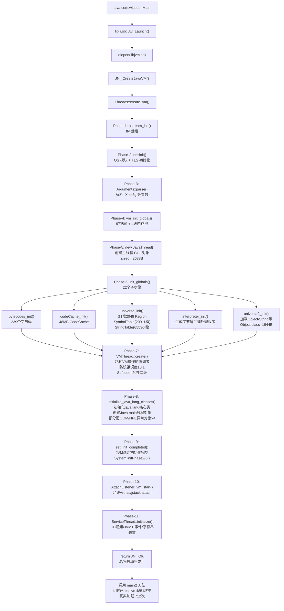
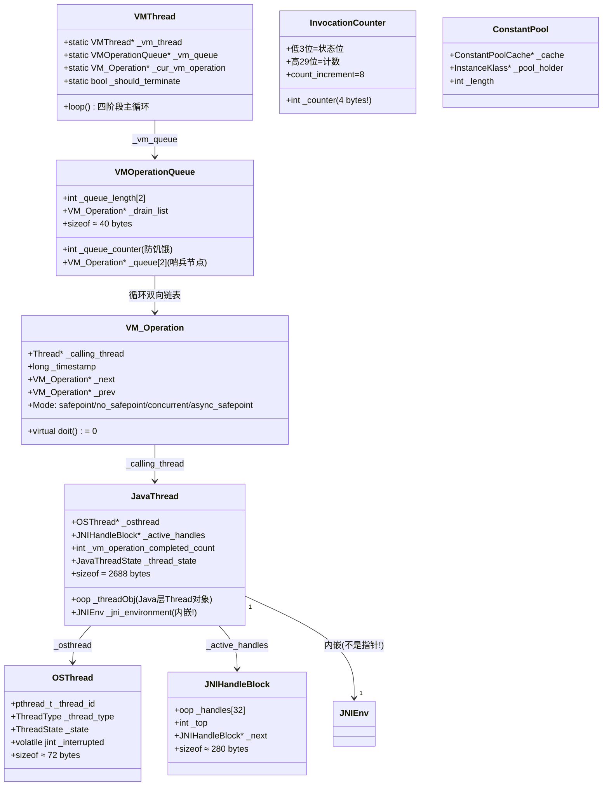

# 12. JVM 启动流程 / create_vm / 12 个 Phase

> 手写笔记，第一人称，记录我啃这块源码时的真实过程。  
> 参考文档：`../Instrumentation/02-JVM-Startup-Probe-Results.md`（插桩数据）  
> 参考文档：`../JVM-Startup/CreateVM-Remaining/create_vm_remaining.md`（Phase 6-8）  
> 参考文档：`../JVM-Startup/Phase7-VMThread-Complete.md`（VMThread 完整分析）  
> 核心源码：`thread.cpp:3876`（`Threads::create_vm` 入口）

---

## 第零天：我以为 java 命令执行后 JVM 就直接跑 main 方法

我最开始的理解是这样的：

```
java com.wjcoder.Main
    ↓
JVM 加载 Main.class
    ↓
执行 main() 方法
```

三步，完事。

然后我去看 `thread.cpp` 里的 `Threads::create_vm()`，发现这个函数有 **432 行**（3876-4307 行）。

我以为是代码写得冗余，仔细一看，发现每一行都是必要的。

**我错了三件事：**

1. `java` 命令本身不是 JVM，它是一个叫 `libjli.so` 的启动器，通过 `dlopen` 加载 `libjvm.so`
2. JVM 启动不是"加载类然后执行"，而是要先初始化 **97 把锁、4 级内存池、239 个字节码、2048 个 G1 Region**……
3. `main()` 方法被调用时，JVM 已经悄悄做了 **4851 次类解析、712 次真实类加载**

---

## 第一天：我踩的第一个坑——"Phase"到底是什么？

我以为 `create_vm` 里有一个叫 `Phase` 的枚举，每个 Phase 对应一个函数。

然后我去搜 `Phase`，发现根本没有这个枚举。

所谓"Phase"是我们分析时人为划分的阶段，源码里只是一个 600 行的顺序函数。

我数了一下，大概可以分成 **11 个阶段**（不同文档说法不一，有说 8 个的，有说 12 个的，取决于怎么划分）：

```
Threads::create_vm()
  ├── [Phase-1]  ostream_init()              → tty 就绪（最先！）
  ├── [Phase-2]  os::init()                  → OS 模块初始化
  ├── [Phase-3]  Arguments::parse()          → 解析 JVM 参数（-Xmx8g 在这里生效）
  ├── [Phase-4]  vm_init_globals()           → 全局数据结构初始化
  │     ├── mutex_init()                     ← 97 把锁
  │     ├── chunkpool_init()                 ← 4 级内存池
  │     └── perfMemory_init()
  ├── [Phase-5]  main JavaThread created     → 创建主线程 C++ 对象
  ├── [Phase-6]  init_globals()              → 所有全局模块初始化（最重！）
  │     ├── bytecodes_init()                 ← 239 个字节码
  │     ├── codeCache_init()                 ← 48MB CodeCache
  │     ├── universe_init()                  ← G1 堆 + SymbolTable + StringTable
  │     ├── interpreter_init()               ← 模板解释器汇编代码生成
  │     ├── universe2_init()                 ← 加载 Object/String 等原始类
  │     └── MethodHandles::generate_adapters()
  ├── [Phase-7]  VMThread::create()          → 创建 VMThread（JVM 的"操作系统"）
  ├── [Phase-8]  initialize_java_lang_classes() → 初始化 java.lang 核心类
  ├── [Phase-9]  set_init_completed()        → JVM 基础初始化完毕
  ├── [Phase-10] AttachListener::vm_start()  → 允许 Arthas 等工具 attach
  └── [Phase-11] ServiceThread::initialize() → 后台服务线程
```

**我踩的坑**：我以为 `init_globals()` 和 `vm_init_globals()` 是同一个函数，结果是两个完全不同的函数：

- `vm_init_globals()`（Phase-4）：初始化**基础设施**（锁、内存池、性能计数器）
- `init_globals()`（Phase-6）：初始化**所有功能模块**（字节码、堆、解释器、JIT……）

Phase-4 是地基，Phase-6 是盖楼。

---

## 第一天半：数据结构补课

我第二天去看 Phase-5（主线程创建）时，发现自己对 `JavaThread`、`OSThread`、`JNIHandleBlock` 这些结构完全没概念，回来补课。

### JavaThread（`thread.hpp:925`）

**本质**：JVM 内部对一个 Java 线程的完整描述，存在 Metaspace 中（C++ 堆）。

**关键字段（我最需要理解的 6 个）**：

| 字段 | 类型 | 含义 |
|------|------|------|
| `_osthread` | `OSThread*` | 指向 OS 线程对象（封装 pthread_t） |
| `_threadObj` | `oop` | 指向 Java 层的 `java.lang.Thread` 对象（堆上） |
| `_jni_environment` | `JNIEnv` | 每个线程的 JNI 环境（内嵌，不是指针！） |
| `_active_handles` | `JNIHandleBlock*` | 当前活跃的 JNI Local Reference 块 |
| `_vm_operation_completed_count` | `int` | VMThread 完成操作后递增，用于 ticket 机制 |
| `_thread_state` | `JavaThreadState` | 5 种状态（_thread_in_Java / _thread_in_vm / _thread_in_native / _thread_blocked / _thread_new） |

**我踩的坑**：`_jni_environment` 是**内嵌**在 JavaThread 里的，不是指针。所以 `JNIEnv*` 实际上就是 `&thread->_jni_environment`，通过 `JNIEnv*` 可以反推出 `JavaThread*`（减去固定偏移）。这就是为什么 JNI 函数只需要 `JNIEnv*` 就能找到当前线程。

**sizeof(JavaThread)**：我猜是 200 字节左右，实测 **2688 字节**（GDB 验证）。比我猜的大 13 倍！因为 JavaThread 内嵌了大量子结构（JNIEnv、ThreadShadow、各种计数器……）。

**创建位置**：Phase-5，`new JavaThread(&thread_entry)` 在 C++ 堆上分配。

### OSThread（`osThread.hpp:52`）

**本质**：封装 OS 级别的线程句柄，平台相关。

**关键字段（Linux 版本）**：

| 字段 | 类型 | 含义 |
|------|------|------|
| `_thread_id` | `pthread_t` | POSIX 线程 ID |
| `_thread_type` | `ThreadType` | 线程类型（java_thread / vm_thread / compiler_thread / ...） |
| `_state` | `ThreadState` | OS 线程状态（ALLOCATED / INITIALIZED / RUNNABLE / ZOMBIE） |
| `_interrupted` | `volatile jint` | 中断标志 |
| `_startThread_lock` | `Monitor*` | 用于 `os::start_thread()` 的同步 |

**sizeof(OSThread)**：约 **72 字节**（含 Monitor 指针）。

**创建位置**：`os::create_thread()` 内部，在 `pthread_create` 之前创建，绑定到 JavaThread。

### JNIHandleBlock（`jniHandles.hpp:130`）

**本质**：一块固定大小的 Local Reference 存储区，链表组织。

**关键字段**：

| 字段 | 类型 | 含义 |
|------|------|------|
| `_handles[block_size_in_oops]` | `oop[]` | 存储 Local Reference 的数组，`block_size_in_oops = 32` |
| `_top` | `int` | 当前已用的 slot 数量 |
| `_next` | `JNIHandleBlock*` | 链表 next 指针（当前块满了就分配新块） |
| `_pop_frame_link` | `JNIHandleBlock*` | PopLocalFrame 用的链接 |

**sizeof(JNIHandleBlock)**：`32 × 8 + 3 × 8 = 280 字节`（估算）。

**创建位置**：VMThread 在 `run()` 的第一件事就是 `set_active_handles(JNIHandleBlock::allocate_block())`，这也是主线程等待 VMThread 就绪的判断条件（`active_handles() != NULL`）。

### InvocationCounter（`invocationCounter.hpp:40`）

**本质**：只有 **4 字节**（一个 int），存储方法调用次数，用于触发 JIT 编译。

**位布局（这是我踩的最大的坑）**：

```
┌─────────────────────────────────────────────────────────────┐
│  31  ...  3  │  2  │  1  │  0  │                           │
├──────────────┼─────┼─────┼─────┤                           │
│   count      │carry│  state(2位)│                           │
│  (高 29 位)  │     │           │                           │
└─────────────────────────────────────────────────────────────┘
```

- **低 3 位是状态位**，不参与计数！
- 每次调用 `count_increment = 1 << 3 = 8`（不是 +=1，是 +=8！）
- 实际调用次数 = raw_value >> 3
- `InterpreterInvocationLimit(raw) = 80000`，实际阈值 = 80000 >> 3 = **10000**

**我踩的坑**：我以为每次调用计数器 +=1，阈值就是 10000。结果每次 +=8，阈值的 raw 值是 80000，但实际阈值还是 10000（因为读取时也要 >>3）。这个设计是为了把状态位和计数位打包在一个 int 里，节省内存（每个 Method 有两个 InvocationCounter，节省 8 字节）。

---

## 第二天：Phase-4 和 Phase-6 的细节

### Phase-4：vm_init_globals()——地基

Phase-4 做的事情看起来很无聊，但每一件都是后续所有功能的基础：

**mutex_init（97 把锁）**：

我以为 JVM 只有几把锁（GC 锁、类加载锁……），结果有 **97 把**。

其中 G1 专用 13 把，全部服务于并发标记（SATB 写屏障队列）和 Region 管理：

```
SATB_Q_FL_lock      (rank=access)   -- SATB 队列空闲列表
SATB_Q_CBL_mon      (rank=access)   -- SATB 队列完成缓冲区
Shared_SATB_Q_lock  (rank=access+1) -- 共享 SATB 队列
DirtyCardQ_FL_lock  (rank=access)   -- 脏卡队列空闲列表
DirtyCardQ_CBL_mon  (rank=access)   -- 脏卡队列完成缓冲区
Shared_DirtyCardQ_lock(rank=access+1)-- 共享脏卡队列
FreeList_lock       (rank=leaf)     -- 空闲 Region 列表
OldSets_lock        (rank=leaf)     -- Old/Humongous Region 集合
RootRegionScan_lock (rank=leaf)     -- 根 Region 扫描
MarkStackFreeList_lock(rank=leaf)   -- 标记栈空闲列表
MarkStackChunkList_lock(rank=leaf)  -- 标记栈块列表
StringDedupQueue_lock(rank=leaf)    -- 字符串去重队列
StringDedupTable_lock(rank=leaf)    -- 字符串去重表
```

锁有层级（rank），低 rank 锁不能在持有高 rank 锁时申请，这是防死锁的设计。

**chunkpool_init（4 级内存池）**：

JVM 内部大量使用 `Arena`（类似 bump-pointer 分配器），Arena 从 ChunkPool 取 Chunk：

| 级别 | chunk_size | 用途 |
|------|-----------|------|
| tiny | 216 bytes | 小型 Arena（符号解析） |
| small | 984 bytes | 初始 Arena |
| medium | 10200 bytes | 中型 Arena（类解析） |
| large | 32728 bytes | 大型 Arena（编译器） |

注意：`slack = 20 bytes`（Chunk 头部开销），实际可用 = 标称值 - 20。

### Phase-6：init_globals()——盖楼

Phase-6 是整个启动流程中最重的部分，包含 22 个子步骤。我重点看了几个：

**bytecodes_init（239 个字节码）**：

我以为 JVM 规范定义了多少字节码，JVM 就有多少。结果：

- JVM 规范定义：**202 个**
- HotSpot 内部扩展：**37 个**（如 `_fast_igetfield`、`_fast_agetfield` 等快速变体）
- 总计：**239 个**

63% 是 1 字节指令（操作数隐含在 opcode 中），`invokedynamic`(0xBA) 是最长的固定长度指令（5 字节）。

**universe_init（堆 + 符号表 + 字符串表）**：

这一步完成后，G1 堆就绪：

```
G1 堆：8192MB / 2048 Region / 每 Region 4MB
SymbolTable：桶数 = 20011（质数！）
StringTable：桶数 = 65536（2 的幂！）
```

**我踩的坑**：SymbolTable 用质数桶（20011），StringTable 用 2 的幂（65536）。为什么不统一？

- SymbolTable：优先减少哈希冲突（符号名分布不均匀，质数桶更均匀）
- StringTable：优先位运算速度（`hash & (65536-1)` 比 `hash % 20011` 快）

**interpreter_init（模板解释器）**：

这一步生成了所有字节码的汇编处理程序，存放在 CodeCache 的 NonNMethod 段（5MB）。

我以为解释器是一个 switch-case，结果是**生成的汇编代码**。每个字节码对应一段汇编，存在 `DispatchTable` 里，执行时直接跳转，没有 switch 开销。

**universe2_init（加载原始类）**：

这一步加载了 `java.lang.Object`、`java.lang.String`、`java.lang.Class` 等核心类。

`java.lang.Object` 是第 1 个被加载的类：
- `.class` 文件大小：**1944 bytes**
- 常量池项数：**92**
- 方法数：**14**（含 `<init>`）
- InstanceKlass 大小：**528 bytes**
- vtable 大小：**5 slots**（finalize / equals / toString / hashCode / clone）

---

## 第三天：Phase-7——VMThread 是什么？

### 我的误解

我以为 VMThread 就是"执行 GC 的线程"。

然后我去看 `vmOperations.hpp`，发现 `VM_OPS_DO` 宏定义了 **78 种**操作类型，GC 只是其中 14 种。

VMThread 的本质是：**JVM 的"操作系统"**——一个专职协调者，解决"谁来发起 STW、谁来执行 STW 期间的操作"的问题。

### 为什么需要 VMThread？

在多线程 JVM 中，GC 需要遍历对象图、反优化需要修改编译代码——这些操作必须在全局一致性视角下执行（STW）。

**问题**：谁来做"暂停全世界"的协调工作？

- 如果让发起 GC 的 Java 线程自己当协调者——它本身就是需要被暂停的线程之一，容易死锁
- 如果允许多个线程同时发起 STW——需要复杂的竞争协议

**解决方案**：引入一个独立于所有 Java 线程的专用协调者（VMThread），用生产者-消费者模型隔离"提交请求"和"执行操作"。

### VMThread 的创建（`thread.cpp:4083`）

```cpp
// thread.cpp:4083-4104
VMThread::create();                          // [1] 创建对象 + 队列 + 锁
Thread* vmthread = VMThread::vm_thread();

if (!os::create_thread(vmthread, os::vm_thread)) {  // [2] pthread_create
    vm_exit_during_initialization("Cannot create VM thread.");
}

{
    MutexLocker ml(Notify_lock);
    os::start_thread(vmthread);              // [3] 设置线程为 RUNNABLE
    while (vmthread->active_handles() == NULL) {  // [4] 等待 VMThread 就绪
        Notify_lock->wait();
    }
}
```

**我踩的坑**：等待条件是 `active_handles() == NULL`，不是一个专门的 bool 标志。

为什么？VMThread 在 `run()` 的第一件事是 `set_active_handles(JNIHandleBlock::allocate_block())`，这保证了 VMThread 已经完成初始化。用 `active_handles` 而非额外的 bool 标志，是因为 JNIHandleBlock 分配本身就是初始化的一部分，一举两得。

### VMThread 的主循环（`vmThread.cpp:457`）

VMThread 的 `loop()` 是一个无限循环，每次迭代 4 个阶段：

```
阶段①：从 VMOperationQueue 取操作（防饥饿调度：10:1 比例）
    ↓
阶段②：执行操作
    ├── 需要 STW → begin() → 执行 → 合并执行 → end()
    └── 不需要 STW → 直接执行
    ↓
阶段③：notify_all() 通知等待的 JavaThread
    ↓
阶段④：如果距离上次 Safepoint 超过 1000ms → 触发周期性 Safepoint（清理 monitor/IC/rehash）
```

**防饥饿调度（10:1）**：

VMOperationQueue 有两个优先级：SafepointPriority（高）和 MediumPriority（低）。

每 11 次出队中，最多 10 次服务高优先级，至少 1 次服务低优先级：

```cpp
// vmThread.cpp:182-192
if (_queue_counter++ < 10) {
    high_prio = SafepointPriority;  // 前 10 次：Safepoint 优先
    low_prio  = MediumPriority;
} else {
    _queue_counter = 0;             // 第 11 次：翻转
    high_prio = MediumPriority;     // 低优先级有机会被服务
    low_prio  = SafepointPriority;
}
```

**Safepoint 合并（二级）**：

一次 STW 代价固定，应该尽量多做事：

- 第一级：进入 STW 前，`drain_at_safepoint_priority()` 取出所有排队的 safepoint 操作
- 第二级：执行完后，`peek + drain` 再次检查是否有新入队的 safepoint 操作

效果：3 个线程同时分配失败提交了 3 个 `VM_G1CollectForAllocation`，只需要一次 STW 就能全部执行完。

### 78 种 VM 操作

我以为 VMThread 只做 GC，结果有 **67 个** VM_Operation 子类（跨所有文件）：

| 类别 | 数量 | 典型操作 |
|------|------|------|
| vmOperations.hpp（核心） | 24 | `VM_Deoptimize`、`VM_ThreadDump`、`VM_Exit`、`VM_ForceSafepoint` |
| G1 GC 专用 | 3 | `VM_G1CollectForAllocation`、`VM_G1CollectFull`、`VM_G1PauseCleanup` |
| JVMTI 相关 | ~15 | `VM_RedefineClasses`、`VM_ChangeBreakpoints`（jvmtiImpl.hpp + jvmtiEnvBase.hpp） |
| 其他 GC/诊断 | ~25 | CMS/Parallel GC 操作、诊断命令等 |

**我踩的坑**：`VM_ForceSafepoint` 的 `doit()` 是空的！它的唯一作用就是触发一次 STW，让 JVM 执行 Safepoint 清理任务（monitor 回收、IC 清理、rehash）。

**另一个坑**：我以为 VM 操作都定义在 `vmOperations.hpp` 里，结果是分散在多个文件里的——G1 专用操作在 `vm_operations_g1.hpp`，JVMTI 操作在 `jvmtiImpl.hpp` 和 `jvmtiEnvBase.hpp`，CMS/Parallel GC 操作在各自的 GC 目录下。

---

## 第三天半：Phase-8——Java 基础类初始化

### initialize_java_lang_classes()

这一步初始化了 Java 层面的核心类，顺序很重要：

| 顺序 | 类 | 作用 |
|------|-----|------|
| 1 | `java.lang.String` | 字符串类，最基础 |
| 2 | `java.lang.System` | 系统类，标准流 |
| 3 | `java.lang.Class` | 反射基础 |
| 4 | `java.lang.ThreadGroup` | 线程组 |
| 5 | `java.lang.Thread` | ★ 创建 Java main 线程 |
| 6 | `java.lang.Module` | Java 9 模块系统 |
| 7 | `java.lang.reflect.Method` | 反射方法 |
| 8 | `java.lang.ref.Finalizer` | 终结器 |

**关键区别**：

- **C++ JavaThread**：Phase-5 创建的 JVM 内部线程对象（C++ 堆）
- **Java Thread**：Phase-8 创建的 `java.lang.Thread` 对象（Java 堆）

这两个对象通过 `_threadObj` 字段绑定：`main_thread->set_threadObj(result)`。

### 预分配异常对象

这是我觉得最有意思的设计：

```cpp
// 预分配常用异常对象，避免 OOM 时无法分配
预分配 OOM 对象（Java heap space）= 0x00000007bfc04d30
预分配 OOM 对象（Metaspace）      = 0x00000007bfc04d58
预分配 NPE 对象                   = 0x00000007bfc04f18
预分配 ArithmeticException 对象   = 0x00000007bfc04fc8
```

**为什么预分配？** 当发生 OOM 时，堆已满，无法分配新的异常对象。如果这时候还要 `new OutOfMemoryError()`，就会陷入"OOM 时无法抛出 OOM"的死循环。

**我踩的坑**：OOM 预分配了**两个**对象，不是一个：
- 一个用于 Java heap space OOM
- 一个用于 Metaspace OOM

因为这两种 OOM 的 message 不同，需要分开预分配。

### System.initPhase1/2/3

Java 9 引入了模块系统，`System` 类的初始化被拆成了 3 个 Phase：

| Phase | 调用时机 | 初始化内容 |
|-------|---------|-----------|
| `initPhase1()` | Phase-8 早期 | 系统属性、标准流（in/out/err）、时区 |
| `initPhase2()` | Phase-9 | 模块系统（java.base 模块、模块路径） |
| `initPhase3()` | Phase-9 | 安全管理器、系统类加载器 |

---

## 第四天：Phase-9 到 Phase-11——收尾工作

### set_init_completed()

这是一个里程碑：调用后，JVM 基础初始化完毕，异常处理可以正常工作，调试功能可以启用。

### AttachListener::vm_start()（Phase-10）

这一步启动了 Attach 监听器，允许 Arthas、jstack、jmap 等工具通过 UNIX socket 连接到 JVM。

**我以为** Arthas 是随时都能 attach 的，结果必须等到 Phase-10 之后才行。

### ServiceThread::initialize()（Phase-11）

ServiceThread 是一个后台线程，处理：
- GC 通知（`GCNotifier`）
- JVMTI 事件（`JvmtiDeferredEventQueue`）
- 低内存通知（`LowMemoryDetector`）
- 字符串去重（`StringDedup`）

**我以为** JVM 只有 VMThread 一个后台线程，结果还有：
- `ServiceThread`：处理 GC 通知/JVMTI 事件
- `WatcherThread`：定时任务/JVM 内部计时器
- `CompilerThread`（正常模式下）：C1/C2 编译线程（16 核下 12 个）
- `ConcurrentMarkThread`（G1）：并发标记线程
- `G1ConcurrentRefineThread`（G1）：并发 RSet 精化线程

---

## 第四天四分之一：JVM 参数解析——Arguments::parse()

### 我的误解

我以为 `-Xmx8g` 就是直接设置一个全局变量 `max_heap_size = 8GB`，很简单。

然后我去看 `Arguments::parse()`，发现它做了很多事：

**解析流程（简化）**：

```
Arguments::parse()
  ├── parse_vm_init_args()          → 解析 JVM 初始化参数（-Xms/-Xmx/-XX:+UseG1GC 等）
  ├── parse_java_options_environment_variable()  → 解析 _JAVA_OPTIONS 环境变量
  ├── parse_java_tool_options_environment_variable()  → 解析 JAVA_TOOL_OPTIONS
  ├── parse_java_arguments()        → 解析 -cp/-jar/-D 等
  ├── fix_appended_flags()          → 处理 -XX:+Flag/-XX:-Flag 的覆盖关系
  └── Arguments::check_vm_args_consistency()  → 参数一致性检查
```

**我踩的坑**：参数有优先级！

```
优先级（从低到高）：
  JVM 默认值
  → JAVA_TOOL_OPTIONS 环境变量
  → _JAVA_OPTIONS 环境变量
  → 命令行参数
```

所以如果 `JAVA_TOOL_OPTIONS=-Xmx4g`，但命令行写了 `-Xmx8g`，最终生效的是 **8g**（命令行优先）。

**`-Xmx8g` 的解析路径**：

```
"-Xmx8g"
  ↓
Arguments::parse_each_vm_init_arg()
  ↓
case 'X': → parse_Xss_Xmx_Xms_etc()
  ↓
MaxHeapSize = (julong)8 * G  (G = 1024*1024*1024)
  ↓
FLAG_SET_CMDLINE(size_t, MaxHeapSize, (size_t)MaxHeapSize)
```

**参数一致性检查**：`check_vm_args_consistency()` 会检查很多约束，比如：
- `-Xms` 不能大于 `-Xmx`
- G1 Region 大小必须是 2 的幂且在 [1MB, 32MB] 范围内
- `-Xint` 和 `-Xcomp` 不能同时指定

---

## 第四天半：ThreadLocalStorage——每个线程怎么快速找到自己的 JavaThread*？

### 问题

JVM 内部到处都需要"当前线程是谁"：

```cpp
JavaThread* thread = JavaThread::current();
```

这个调用每秒可能发生数百万次，必须极快。

### 解决方案：TLS（Thread Local Storage）

Linux 上，每个 pthread 有一个 TLS 区域，可以存储线程私有数据。

JVM 用 `pthread_key_t` 存储 `JavaThread*`：

```cpp
// thread.cpp（简化）
static pthread_key_t _thread_key;  // 全局 key

// 线程创建时：
pthread_setspecific(_thread_key, this);  // 存储 JavaThread*

// 获取当前线程：
JavaThread* current() {
    return (JavaThread*) pthread_getspecific(_thread_key);
}
```

**我踩的坑**：`pthread_getspecific` 在 x86-64 Linux 上实际上是读取 `fs` 段寄存器指向的 TLS 区域，是一条 `mov` 指令，极快（< 1ns）。

**初始化时机**：Phase-2（`os::init()`）中调用 `ThreadLocalStorage::init()`，在任何 JavaThread 创建之前就初始化好 TLS key。

---

## 第五天：插桩验证——我的猜测 vs 实测

| # | 我的猜测 | 实测结果 | 结论 |
|---|---------|---------|------|
| 1 | JVM 启动只有几把锁 | **97 把**（G1 专用 13 把） | ❌ 比我猜的多 10 倍 |
| 2 | InvocationCounter 每次 +=1 | 每次 **+=8**（低 3 位是状态位） | ❌ 完全不同的编码方式 |
| 3 | SymbolTable 和 StringTable 用相同的桶数策略 | SymbolTable=**20011**（质数），StringTable=**65536**（2 的幂） | ❌ 不同策略，各有侧重 |
| 4 | JVM 启动时加载了几十个类 | 到 main() 前：**4851 次** resolve，**712 次**真实加载 | ❌ 比我猜的多 100 倍 |
| 5 | OOM 只预分配一个异常对象 | 预分配 **4 个**（OOM×2 + NPE + ArithmeticException） | ❌ OOM 有两种（heap/metaspace） |
| 6 | VMThread 只做 GC | **78 种**操作，GC 只有 14 种 | ❌ JVMTI 相关最多（15 种） |
| 7 | sizeof(JavaThread) ≈ 200 字节 | 实测 **2688 字节** | ❌ 比我猜的大 13 倍 |
| 8 | `-Xint` 下 CodeCache 是三段式 | **单段 48MB**（三段式需要 TieredCompilation=true） | ❌ 分层编译关闭时不分段 |
| 9 | java.lang.Object 有几个方法 | **14 个方法**（含 `<init>`），vtable **5 个槽** | ❌ 比我猜的多 |
| 10 | JVM 只有 VMThread 一个后台线程 | 还有 ServiceThread / WatcherThread / ConcurrentMarkThread / G1ConcurrentRefineThread | ❌ 至少 5 种后台线程 |

---

## 完整流程图



---

## 数据结构关系图



---

## 还没搞懂的地方

1. **libjli.so 的完整启动流程**：`JLI_Launch()` 是怎么找到 `libjvm.so` 的？`dlopen` 的路径是怎么确定的？（这部分在第十一章 `34-libjli-HandWritten.md` 里会详细看）

2. **SafepointMechanism 的初始化**：Phase-4 里有一个 `SafepointMechanism::initialize()`，它初始化了 Polling Page（一个特殊的内存页，写保护后触发 SIGSEGV 来实现 Safepoint）。我只知道大概原理，没有深入看源码。

3. **`init_globals()` 的 22 个子步骤**：我只看了其中几个（bytecodes、codeCache、universe、interpreter），还有 `management_init`、`gc_barrier_stubs_init`、`SharedRuntime::generate_stubs` 等没有深入看。

4. **`call_initPhase1/2/3()` 的完整内容**：这三个函数调用了 Java 代码（`System.initPhase1/2/3()`），Java 代码里做了什么？我只知道大概（系统属性、模块系统、安全管理器），没有追踪到具体实现。

5. **WatcherThread 的定时任务列表**：`WatcherThread` 执行哪些周期性任务？`PeriodicTask::num_tasks()` 在标准环境下是多少？（这部分在 `13b-service-watcher-thread-HandWritten.md` 里会看）

6. **编译线程的创建时机**：`-Xint` 模式下不创建编译线程，正常模式下 16 核创建 12 个（C1=4，C2=8）。这个比例是怎么算出来的？`CICompilerCount` 的计算公式是什么？

---

## 尾声：我现在怎么理解 JVM 启动

JVM 启动不是"加载类然后执行"，而是一个精心设计的**分层初始化**过程：

1. **基础设施层**（Phase 1-4）：锁、内存池、OS 接口——这些是一切的基础，必须最先初始化
2. **运行时层**（Phase 5-6）：线程、堆、解释器、JIT——这些是 JVM 的"发动机"
3. **协调层**（Phase 7）：VMThread——这是 JVM 的"操作系统"，负责协调所有需要 STW 的操作
4. **Java 层**（Phase 8-9）：java.lang 核心类、System 初始化——从 C++ 世界过渡到 Java 世界
5. **服务层**（Phase 10-11）：Attach 监听、后台服务线程——让 JVM 可以被外部工具管理

最让我印象深刻的是 **VMThread 的设计**：用一个专职协调者线程解决"谁来发起 STW"的问题，用生产者-消费者模型隔离"提交请求"和"执行操作"，用防饥饿调度（10:1）和 Safepoint 合并（二级）优化性能。这是一个非常优雅的设计。

还有 **InvocationCounter 的位打包**：把状态位和计数位打包在一个 4 字节 int 里，每次 +=8 而非 +=1，节省了每个 Method 对象 8 字节的内存。在有数十万个 Method 对象的 JVM 里，这个优化是值得的。
