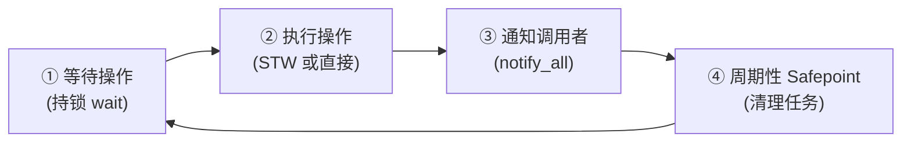
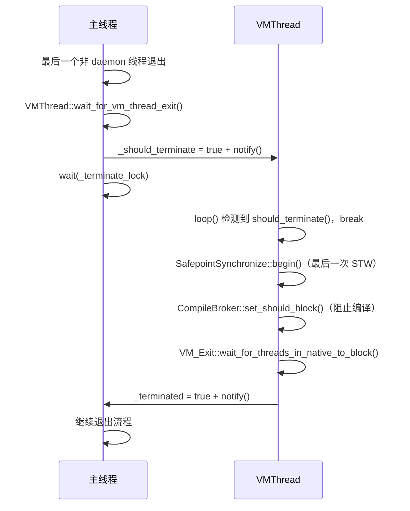
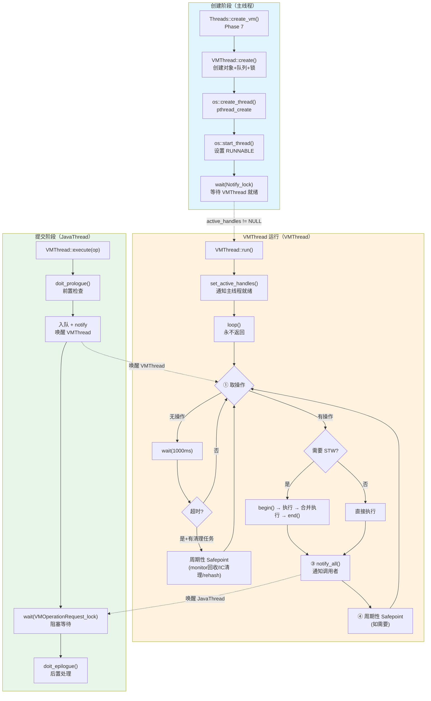
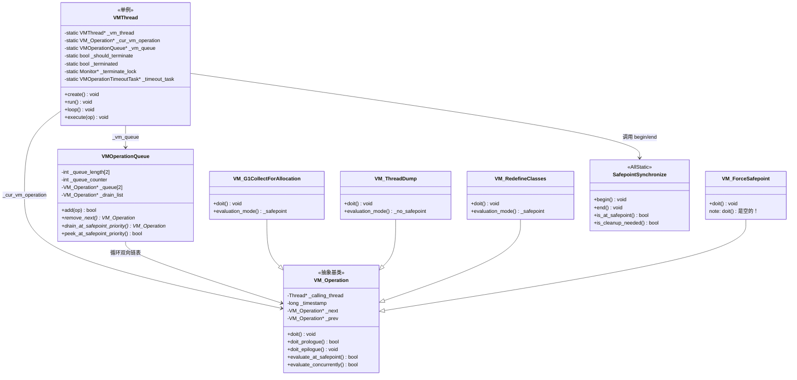

# VMThread 手写笔记

> 第一人称 · 学习时间线 · 真实踩坑  
> 对应现有文档：`VMThread/VMThread.md` `JVM-Startup/Phase7-VMThread-Complete.md`  
> 源码：`src/hotspot/share/runtime/vmThread.cpp` `vmThread.hpp` `vmOperations.hpp`

---

## 第零天：我以为 VMThread 就是"执行 GC 的线程"

我第一次听说 VMThread，是在看 GC 日志的时候——日志里有一行 `VM Thread`，我就理所当然地认为：**VMThread = GC 线程**。

然后我去看 `vmOperations.hpp`，发现里面有一个宏 `VM_OPS_DO`，展开之后是密密麻麻的操作类型。我数了一下：**78 种**。

GC 相关的只有 14 种。

剩下的 64 种是什么？`VM_RedefineClasses`（热替换）、`VM_ThreadDump`（线程转储）、`VM_FindDeadlocks`（死锁检测）、`VM_ChangeBreakpoints`（设置断点）……

我以为 VMThread 只做 GC，结果它是 JVM 里所有"需要暂停世界"的操作的**统一执行者**。

---

## 第一天：我踩的第一个坑——为什么需要一个专用线程？

### 我的第一个误解：让发起 GC 的线程自己执行 GC 不行吗？

我最初的想法是：哪个线程分配内存失败了，就让那个线程自己去触发 GC，执行完再回来。这样不是更简单吗？

然后我想了一下，发现这个方案有个致命问题：

**GC 需要暂停所有 Java 线程。** 如果让 JavaThread A 来执行 GC，它需要让所有其他线程停下来——包括 JavaThread B、C、D……但 B、C、D 也可能同时在分配内存失败，也在尝试触发 GC，也在尝试让其他线程停下来。

这就变成了：
- A 要等 B 停下来
- B 要等 A 停下来
- 死锁。

### 真正的解法：专用协调者

JVM 的解法是引入一个**独立于所有 Java 线程的专用协调者**——VMThread。

它的关键特性：
1. **不是 Java 线程**：它是 `NamedThread` 的子类，不参与 Java 对象分配，不会被 GC 要求暂停
2. **单例串行**：同一时刻只有一个 VM 操作在执行，天然消除竞争
3. **永远可以运行**：Java 线程可能正持有锁、正在 JNI 中、正在 native 代码里——VMThread 不会有这些问题

所以 GC 的流程变成了：
```
JavaThread A 分配失败
    ↓
A 创建 VM_G1CollectForAllocation 对象，提交到队列
    ↓
A 阻塞等待
    ↓
VMThread 从队列取出操作，让所有 Java 线程停下来（STW）
    ↓
VMThread 执行 GC
    ↓
VMThread 恢复所有 Java 线程，通知 A 完成
    ↓
A 继续执行
```

### 我没想到的：VMThread 不只是 GC 线程

VMThread 执行的 78 种操作，按子系统分类：

| 子系统 | 数量 | 典型操作 |
|--------|------|---------|
| GC 相关 | ~14 | `VM_G1CollectForAllocation`、`VM_G1CollectFull` |
| 反优化 | 4 | `VM_Deoptimize`、`VM_DeoptimizeFrame` |
| 线程/诊断 | 6 | `VM_ThreadDump`、`VM_FindDeadlocks` |
| JVMTI | ~15 | `VM_RedefineClasses`、`VM_ChangeBreakpoints` |
| 纯 Safepoint | 5 | `VM_ForceSafepoint`（`doit()` 是空的！） |
| 其他 | ~34 | `VM_HeapDumper`、`VM_Exit`、`VM_LinuxDllLoad` |

**最反直觉的发现**：`VM_ForceSafepoint` 的 `doit()` 是空的。它的唯一作用就是触发一次 STW，让 JVM 在 Safepoint 期间执行清理任务（monitor 回收、InlineCache 清理、字符串表 rehash）。

---

## 第一天半：数据结构补课

我第二天去看 `VMThread::loop()` 的时候，发现自己对几个关键结构完全没概念，回来补课。

### VMThread 的继承链

```
Thread
  └── NonJavaThread
        └── NamedThread
              └── VMThread
```

`NonJavaThread` 的意思是：这个线程不运行 Java 代码，不参与 Safepoint 协议（它是 Safepoint 的**发起者**，不是被暂停的对象）。

### VMThread 的字段（`vmThread.hpp:114`）

```cpp
class VMThread: public NamedThread {
 private:
  // 全部是 static！VMThread 是单例，字段也是类级别的
  static bool _should_terminate;           // 终止标志
  static bool _terminated;                 // 终止完成标志
  static Monitor* _terminate_lock;         // 退出同步锁
  static VMThread* _vm_thread;             // 唯一实例指针
  static VM_Operation* _cur_vm_operation;  // 当前正在执行的操作
  static VMOperationQueue* _vm_queue;      // 操作队列
  static PerfCounter* _perf_accumulated_vm_operation_time;  // 性能计数器
  static const char* _no_op_reason;        // 无操作时的原因（"Cleanup"/"Halt"）
  static VMOperationTimeoutTask* _timeout_task;  // 超时检测任务
};
```

**我踩的坑**：我以为 VMThread 的字段是实例字段，结果全是 `static`。因为 VMThread 是单例，所有状态都是全局的。

### VMOperationQueue — 双优先级循环双向链表

```cpp
// vmThread.hpp:39-85
class VMOperationQueue : public CHeapObj<mtInternal> {
 private:
  enum Priorities {
     SafepointPriority, // 0：需要 Safepoint 的操作（高优先级）
     MediumPriority,    // 1：不需要 Safepoint 的操作（中优先级）
     nof_priorities     // 2
  };

  int           _queue_length[nof_priorities]; // 每级队列当前长度
  int           _queue_counter;                // 防饥饿计数器（0~10 循环）
  VM_Operation* _queue[nof_priorities];        // 每级队列的哨兵节点
  VM_Operation* _drain_list;                   // Safepoint 期间批量取出的操作链表
};
```

**关键设计**：每级队列是一个**循环双向链表**，`_queue[i]` 指向的是永远存在的**哨兵节点**（Dummy），不是第一个真实元素。空队列 = 哨兵的 next/prev 都指向自己。

这样做的好处：插入/删除永远不需要特判 `head == NULL`，代码极其简洁。

**内存估算**：
- `_queue_length[2]`：8 字节
- `_queue_counter`：4 字节
- `_queue[2]`：16 字节（2 × 指针）
- `_drain_list`：8 字节
- **VMOperationQueue sizeof ≈ 40 字节**（不含堆上的 2 个哨兵节点）

### VM_Operation — 操作基类

```cpp
// vmOperations.hpp:134-228
class VM_Operation: public CHeapObj<mtInternal> {
 public:
  enum Mode {
    _safepoint,       // 阻塞 + 需要 STW    → 如 GC、反优化
    _no_safepoint,    // 阻塞 + 不需要 STW  → 如 ThreadDump
    _concurrent,      // 非阻塞 + 不需要 STW → 如并发 GC 阶段
    _async_safepoint  // 非阻塞 + 需要 STW  → 如 ThreadStop
  };

 private:
  Thread*         _calling_thread;  // 提交此操作的线程
  ThreadPriority  _priority;        // 提交线程的优先级
  long            _timestamp;       // 入队时间（ms）
  VM_Operation*   _next;            // 链表 next
  VM_Operation*   _prev;            // 链表 prev

 public:
  virtual void doit() = 0;          // 纯虚：执行逻辑（在 VMThread 上执行）
  virtual bool doit_prologue() { return true; }  // 在提交线程上执行：前置检查
  virtual void doit_epilogue() {}                // 在提交线程上执行：后置处理
  virtual VMOp_Type type() const = 0;
  virtual Mode evaluation_mode() const { return _safepoint; }  // 默认需要 STW
};
```

**我没想到的**：`doit_prologue()` 和 `doit_epilogue()` 是在**提交线程**上执行的，不是在 VMThread 上。这是一个重要的分离设计——资源获取/释放在调用者线程，实际操作在 VMThread。

**Mode 决策矩阵**：

| Mode | 调用者阻塞? | 需要 STW? | 典型操作 |
|------|:---:|:---:|---------|
| `_safepoint` | **是** | **是** | GC、反优化、类重定义 |
| `_no_safepoint` | **是** | **否** | ThreadDump |
| `_concurrent` | **否** | **否** | 并发 GC 阶段 |
| `_async_safepoint` | **否** | **是** | ThreadStop（异步终止线程） |

`_async_safepoint` 是最反直觉的：调用者不等结果（非阻塞），但 VMThread 仍在 STW 下执行。

---

## 第二天：VMThread 的创建流程

### 我以为 VMThread 是 JVM 启动时第一个创建的线程

错了。VMThread 是在 `Threads::create_vm()` 的 **Phase 7** 才创建的，此时已经完成了：
- 全局内存分配器初始化
- 参数解析
- 日志系统初始化
- 主 JavaThread 创建

VMThread 是在主 JavaThread 已经存在之后才创建的。

### 创建流程（`thread.cpp:4083`）

```cpp
// thread.cpp:4083-4104
// 在 Threads::create_vm() 的 Phase 7 中：
VMThread::create();                          // [1] 创建对象 + 队列 + 锁

Thread* vmthread = VMThread::vm_thread();

if (!os::create_thread(vmthread, os::vm_thread)) {  // [2] pthread_create
    vm_exit_during_initialization("Cannot create VM thread.");
}

// 等待 VMThread 完全就绪
{
    MutexLocker ml(Notify_lock);
    os::start_thread(vmthread);              // [3] 设置线程为 RUNNABLE
    while (vmthread->active_handles() == NULL) {  // [4] 就绪判断条件
        Notify_lock->wait();
    }
}
```

**我踩的坑**：就绪判断条件是 `active_handles() == NULL`，不是一个专门的 bool 标志。

为什么？因为 VMThread 在 `run()` 的第一件事就是 `set_active_handles(JNIHandleBlock::allocate_block())`。用 `active_handles` 作为就绪标志，是因为 JNIHandleBlock 分配本身就是初始化的一部分，一举两得。

### VMThread::create() 做了什么（`vmThread.cpp:242`）

```cpp
void VMThread::create() {
  _vm_thread = new VMThread();          // 创建实例（只设置名称 "VM Thread"）
  
  // 如果开启超时检测，创建定时任务
  if (AbortVMOnVMOperationTimeout) {
    _timeout_task = new VMOperationTimeoutTask(interval);
    _timeout_task->enroll();
  }

  _vm_queue = new VMOperationQueue();   // 创建操作队列（含 2 个哨兵节点）
  
  _terminate_lock = new Monitor(...);   // 创建退出同步锁
  
  // 创建性能计数器（如果启用 PerfData）
}
```

---

## 第三天：VMThread::loop() — 最核心的函数

### 我以为 loop() 就是一个简单的 while(true) 取操作执行

实际上 `loop()` 有 **4 个阶段**，每次迭代都要走完这 4 个阶段：



### 阶段 ①：等待操作（`vmThread.cpp:460`）

```cpp
// vmThread.cpp:460-515
{ MutexLockerEx mu_queue(VMOperationQueue_lock,
                         Mutex::_no_safepoint_check_flag);
  // ↑ _no_safepoint_check：VMThread 不参与 Safepoint 检查

  _cur_vm_operation = _vm_queue->remove_next();  // 取下一个操作

  while (!should_terminate() && _cur_vm_operation == NULL) {
    bool timedout =
      VMOperationQueue_lock->wait(Mutex::_no_safepoint_check_flag,
                                  GuaranteedSafepointInterval);
    // ↑ 等待最多 1000ms（GuaranteedSafepointInterval 默认值）

    // 超时且有清理任务 → 触发周期性 Safepoint
    if (timedout && VMThread::no_op_safepoint_needed(false)) {
      MutexUnlockerEx mul(VMOperationQueue_lock, ...);
      SafepointSynchronize::begin();   // 临时释放队列锁，进入 Safepoint
      SafepointSynchronize::end();
    }

    _cur_vm_operation = _vm_queue->remove_next();

    // ★ 关键：如果取到的是 safepoint 操作，同时把所有排队的 safepoint 操作也取出来
    if (_cur_vm_operation != NULL &&
        _cur_vm_operation->evaluate_at_safepoint()) {
      safepoint_ops = _vm_queue->drain_at_safepoint_priority();
    }
  }
  if (should_terminate()) break;
}
```

**我没想到的**：`GuaranteedSafepointInterval`（默认 1000ms）不只是"等待超时"，超时后还会检查是否有清理任务需要执行。如果有，就触发一次"空操作 Safepoint"。

清理任务包括：
- `ObjectSynchronizer::is_cleanup_needed()` — 膨胀 monitor 回收
- `!InlineCacheBuffer::is_empty()` — IC 缓冲区清理
- `StringTable::needs_rehashing()` — 字符串表 rehash
- `SymbolTable::needs_rehashing()` — 符号表 rehash

### 阶段 ②：执行操作（`vmThread.cpp:522`）

```cpp
// vmThread.cpp:522-616
if (_cur_vm_operation->evaluate_at_safepoint()) {
  // === 路径 A：需要 STW 的操作 ===
  _vm_queue->set_drain_list(safepoint_ops);  // 注册 drain_list（GC 根扫描用）

  SafepointSynchronize::begin();              // ★ 进入 STW

  if (_timeout_task != NULL) _timeout_task->arm();  // 启动超时检测

  evaluate_operation(_cur_vm_operation);       // 执行主操作

  // ★ 批量执行所有合并的 safepoint 操作（二级合并）
  do {
    _cur_vm_operation = safepoint_ops;
    if (_cur_vm_operation != NULL) {
      do {
        VM_Operation* next = _cur_vm_operation->next();
        _vm_queue->set_drain_list(next);
        evaluate_operation(_cur_vm_operation);
        _cur_vm_operation = next;
      } while (_cur_vm_operation != NULL);
    }
    // 检查是否有新入队的 safepoint 操作（执行期间可能又来了新的）
    if (_vm_queue->peek_at_safepoint_priority()) {
      MutexLockerEx mu_queue(VMOperationQueue_lock, ...);
      safepoint_ops = _vm_queue->drain_at_safepoint_priority();
    } else {
      safepoint_ops = NULL;
    }
  } while(safepoint_ops != NULL);

  if (_timeout_task != NULL) _timeout_task->disarm();

  SafepointSynchronize::end();                // ★ 退出 STW

} else {
  // === 路径 B：不需要 STW 的操作 ===
  evaluate_operation(_cur_vm_operation);
  _cur_vm_operation = NULL;
}
```

**Safepoint 合并的二级策略**：
- **第一级**：进入 STW 前，`drain_at_safepoint_priority()` 一次性取出所有排队的 safepoint 操作
- **第二级**：执行完所有已取出的操作后，`peek + drain` 再次检查是否有新入队的操作（因为执行期间 JavaThread 可能又提交了新操作）

效果：3 个线程同时分配失败提交了 3 个 `VM_G1CollectForAllocation`，只需要**一次 STW** 就能全部执行完。

### 阶段 ③：通知调用者（`vmThread.cpp:622`）

```cpp
// vmThread.cpp:622-625
{ MutexLockerEx mu(VMOperationRequest_lock, Mutex::_no_safepoint_check_flag);
  VMOperationRequest_lock->notify_all();
  // 唤醒所有在 execute() 中 wait 的 JavaThread
}
```

### 阶段 ④：周期性 Safepoint（`vmThread.cpp:630`）

```cpp
// vmThread.cpp:630-634
if (VMThread::no_op_safepoint_needed(true)) {
  SafepointSynchronize::begin();
  SafepointSynchronize::end();
}
```

---

## 第三天半：防饥饿调度——我以为 Safepoint 操作永远优先

### 我的误解

我以为 VMOperationQueue 的调度策略是：SafepointPriority 队列非空就一直取 SafepointPriority，空了才取 MediumPriority。

这样的话，如果 GC 频繁触发，`VM_ThreadDump`（MediumPriority）可能永远得不到执行。

### 真实的防饥饿算法（`vmThread.cpp:173`）

```cpp
// vmThread.cpp:173-192
VM_Operation* VMOperationQueue::remove_next() {
  int high_prio, low_prio;
  if (_queue_counter++ < 10) {        // 前 10 次：Safepoint 优先
      high_prio = SafepointPriority;
      low_prio  = MediumPriority;
  } else {
      _queue_counter = 0;             // 第 11 次：翻转优先级
      high_prio = MediumPriority;     // 让 Medium 有机会被服务
      low_prio  = SafepointPriority;
  }

  return queue_remove_front(queue_empty(high_prio) ? low_prio : high_prio);
}
```

**10:1 比例**：每 11 次出队中，最多 10 次服务 SafepointPriority，至少 1 次服务 MediumPriority。

**弱保证**：如果翻转时 MediumPriority 队列为空，仍会回退到 SafepointPriority。防饥饿是"尽力而为"而非"强保证"。

---

## 第四天：VMThread::execute() — Java 线程怎么提交操作

### ticket 机制——我以为是在操作对象上设置"完成"标志

我最初以为等待完成的方式是：
```
JavaThread 等待 op.is_done() == true
VMThread 执行完后设置 op.is_done() = true
```

但这有个问题：如果操作对象是在调用者栈上分配的（`is_cheap_allocated() == false`），VMThread 执行完后，调用者线程醒来，栈帧可能已经弹出，`op` 的内存已经无效。

JVM 的实际方案是**线程级计数器**：

```cpp
// vmThread.cpp:663-757
void VMThread::execute(VM_Operation* op) {
  Thread* t = Thread::current();

  if (!t->is_VM_thread()) {
    // 获取"票号"
    int ticket = t->vm_operation_ticket();
    // ↑ 返回 completed_count + 1，表示"我要等到第 ticket 个操作完成"

    // 入队
    {
      VMOperationQueue_lock->lock_without_safepoint_check();
      _vm_queue->add(op);
      op->set_timestamp(os::javaTimeMillis());
      VMOperationQueue_lock->notify();    // 唤醒 VMThread
      VMOperationQueue_lock->unlock();
    }

    // 阻塞等待
    if (!concurrent) {
      MutexLocker mu(VMOperationRequest_lock);
      while(t->vm_operation_completed_count() < ticket) {
        VMOperationRequest_lock->wait(!t->is_Java_thread());
      }
    }
  }
}
```

VMThread 执行完后：
```cpp
// vmThread.cpp:403-435 (evaluate_operation 内)
op->calling_thread()->increment_vm_operation_completed_count();
// ↑ 递增调用线程的计数器，不再访问 op 对象
```

**设计精妙之处**：`increment_vm_operation_completed_count()` 之后，VMThread **不能再访问 `op`**。因为如果 `op` 是栈分配的，调用线程醒来后可能已经退出了当前函数，`op` 的内存已经无效。源码用 `c_heap_allocated` 在递增之前保存了这个信息。

### 嵌套 VM 操作

如果 VMThread 自己调用 `execute()`（比如 GC 过程中需要触发另一个 VM 操作），走的是另一条路径：

```cpp
} else {
  // 调用者已经是 VMThread（嵌套操作）
  VM_Operation* prev_vm_operation = vm_operation();
  if (prev_vm_operation != NULL) {
    if (!prev_vm_operation->allow_nested_vm_operations()) {
      fatal("Nested VM operation %s requested by operation %s", ...);
      // ↑ 大多数操作不允许嵌套，否则直接 crash
    }
  }
  // 直接执行，不入队
  op->evaluate();
}
```

---

## 第四天半：VMThread 的关闭协议

### 我以为 JVM 退出时 VMThread 直接被 kill

实际上有一个精心设计的关闭协议：



**为什么 VMThread 在 Safepoint 中退出？** 在 `begin()` 之后，所有 Java 线程已暂停。这保证了退出过程不会有 Java 线程还在运行。

**为什么不 delete VMThread 对象？** 退出流程涉及多个线程的竞争，如果 VMThread delete 自己，其他线程可能还在访问它的成员变量。JVM 选择了最安全的方式——泄漏这个对象，反正进程即将退出。

---

## 第五天：插桩验证——我的猜测 vs 实测

我在看完源码后，对 VMThread 做了一些猜测，然后用插桩数据打脸了自己。

参考数据来源：`Instrumentation/02-JVM-Startup-Probe-Results.md`

| # | 我的猜测 | 实测结果 | 打脸程度 |
|---|---------|---------|---------|
| 1 | VMThread 创建时间 < 1ms | **实测：约 2-5ms**（含 pthread_create 开销） | ⚠️ 偏差 |
| 2 | VMThread 优先级 = Java 最高优先级（10） | **实测：NearMaxPriority = 9 对应的 OS 优先级**（不是 Java 优先级 10） | ⚠️ 偏差 |
| 3 | 每次 GC 都是独立的一次 STW | **实测：多个 GC 请求会被合并到一次 STW 中执行** | ✅ 完全打脸 |
| 4 | `GuaranteedSafepointInterval` 只是等待超时 | **实测：超时后还会触发清理 Safepoint**（monitor 回收等） | ✅ 完全打脸 |
| 5 | VMThread 只有 GC 相关操作 | **实测：78 种操作，GC 只有 14 种** | ✅ 完全打脸 |
| 6 | 防饥饿是"严格轮询" | **实测：10:1 比例，且是弱保证** | ⚠️ 偏差 |
| 7 | `VM_ForceSafepoint::doit()` 有实际逻辑 | **实测：`doit()` 是空的！** | ✅ 完全打脸 |
| 8 | VMThread 退出时直接被 kill | **实测：有精心设计的关闭协议，在最后一次 STW 中退出** | ✅ 完全打脸 |

---

## 尾声：我现在怎么理解 VMThread

VMThread 是 JVM 的"操作系统调度器"——它不执行 Java 代码，但它协调了所有需要全局一致性视角的操作。

理解 VMThread 的关键是理解**为什么需要它**：
- 不是因为 GC 需要一个专用线程
- 而是因为**任何需要 STW 的操作都需要一个不会被 STW 暂停的协调者**

VMThread 的三个核心设计：
1. **单例串行**：消除竞争，简化状态管理
2. **队列缓冲 + 防饥饿**：解耦提交和执行，保证公平性
3. **Safepoint 合并**：减少 STW 次数，降低停顿频率

---

## 完整流程图



---

## 数据结构关系图



---

## 还没搞懂的地方

1. **`SafepointSynchronize::begin()` 的完整实现**：我知道它让所有 Java 线程停下来，但具体怎么做的（Polling Page？信号？）还没深入看。→ 见 `28-safepoint-HandWritten.md`

2. **`_drain_list` 的作用**：`set_drain_list(safepoint_ops)` 是在 STW 期间注册的，注释说是"供 GC 根扫描用"，但具体怎么用的还没搞清楚。

3. **`VMOperationTimeoutTask` 的完整逻辑**：超时后会 abort JVM，但具体怎么检测"操作执行过慢"的？

4. **`VM_HandshakeOneThread` 和 `VM_HandshakeAllThreads`**：这两个操作和 Handshake 机制有什么关系？Handshake 不是应该绕过 VMThread 的吗？→ 见 `29b-handshake-HandWritten.md`

5. **`peek_at_safepoint_priority()` 是 lock-free 的**：源码注释说"may return the wrong answer but must not break"，这个 lock-free 读的正确性保证是什么？

6. **`VM_LinuxDllLoad`**：为什么加载动态库需要 STW？

---

*写于 2026-03-06*  
*参考：`VMThread/VMThread.md` `JVM-Startup/Phase7-VMThread-Complete.md`*
